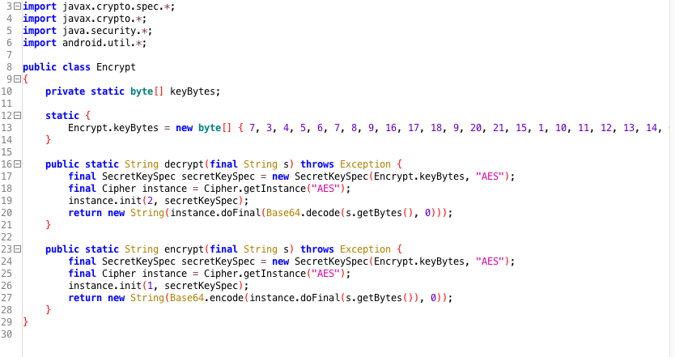

# Cryptography Requirements

## MSTG-CRYPTO-1
The app does not rely on symmetric cryptography with hardcoded keys as a sole method of encryption.

<a id="mstg-crypto-1-overview"></a>
### Problematic Encryption Configuration

#### Insufficient Key Length

Even the most secure encryption algorithm becomes vulnerable to brute-force attacks when that algorithm uses an insufficient key size.


Ensure that the key length fulfills [accepted industry standards.](https://www.enisa.europa.eu/publications/algorithms-key-size-and-parameters-report-2014) In Japan, check the [List of Cipher Specifications on the "e-Government Recommended Ciphers List"](https://www.cryptrec.go.jp/en/method.html). <br>

Reference
* [owasp-mastg Common Configuration Issues (MSTG-CRYPTO-1, MSTG-CRYPTO-2 and MSTG-CRYPTO-3) Insufficient Key Length](https://github.com/OWASP/owasp-mastg/blob/v1.5.0/Document/0x04g-Testing-Cryptography.md#insufficient-key-length)

Rulebook
* [Set key lengths that meet industry standards (Required)](#set-key-lengths-that-meet-industry-standards-required)

#### Symmetric Encryption with Hard-Coded Cryptographic Keys

The security of symmetric encryption and keyed hashes (MACs) depends on the secrecy of the key. If the key is disclosed, the security gained by encryption is lost. To prevent this, never store secret keys in the same place as the encrypted data they helped create. A common mistake is encrypting locally stored data with a static, hardcoded encryption key and compiling that key into the app. This makes the key accessible to anyone who can use a disassembler.<br>

Hardcoded encryption key means that a key is:

* part of application resources
* value which can be derived from known values
* hardcoded in code

First, ensure that no keys or passwords are stored within the source code. This means you should check native code, JavaScript/Dart code, Java/Kotlin code on Android. Note that hard-coded keys are problematic even if the source code is obfuscated since obfuscation is easily bypassed by dynamic instrumentation.<br>

If the app is using two-way TLS (both server and client certificates are validated), make sure that:

* The password to the client certificate isn't stored locally or is locked in the device Keychain.
* The client certificate isn't shared among all installations.

If the app relies on an additional encrypted container stored in app data, check how the encryption key is used. If a key-wrapping scheme is used, ensure that the master secret is initialized for each user or the container is re-encrypted with new key. If you can use the master secret or previous password to decrypt the container, check how password changes are handled.<br>

Secret keys must be stored in secure device storage whenever symmetric cryptography is used in mobile apps. For more information on the platform-specific APIs, see the "[Data Storage on Android](https://github.com/OWASP/owasp-mastg/blob/v1.5.0/Document/0x05d-Testing-Data-Storage.md)" chapters.

Reference
* [owasp-mastg Common Configuration Issues (MSTG-CRYPTO-1, MSTG-CRYPTO-2 and MSTG-CRYPTO-3) Symmetric Encryption with Hard-Coded Cryptographic Keys](https://github.com/OWASP/owasp-mastg/blob/v1.5.0/Document/0x04g-Testing-Cryptography.md#symmetric-encryption-with-hard-coded-cryptographic-keys)

Rulebook
* [Do not store keys or passwords in source code (Required)](#do-not-store-keys-or-passwords-in-source-code-required)
* [Do not store client certificate passwords locally. Lock passwords in your device's keychain if you want to save them (Required)](#do-not-store-client-certificate-passwords-locally-lock-passwords-in-your-devices-keychain-if-you-want-to-save-them-required)
* [Client certificates are not shared among all installations (Required)](#client-certificates-are-not-shared-among-all-installations-required)
* [If container dependent, verify how encryption keys are used (Required)](#if-container-dependent-verify-how-encryption-keys-are-used-required)
* [Store private keys in secure device storage whenever symmetric encryption is used in mobile apps (Required)](#store-private-keys-in-secure-device-storage-whenever-symmetric-encryption-is-used-in-mobile-apps-required)

#### Weak Key Generation Functions

Cryptographic algorithms (such as symmetric encryption or some MACs) expect a secret input of a given size. For example, AES uses a key of exactly 16 bytes. A native implementation might use the user-supplied password directly as an input key. Using a user-supplied password as an input key has the following problems:

* If the password is smaller than the key, the full key space isn't used. The remaining space is padded (spaces are sometimes used for padding).
* A user-supplied password will realistically consist mostly of displayable and pronounceable characters. Therefore, only some of the possible 256 ASCII characters are used and entropy is decreased by approximately a factor of four.

Ensure that passwords aren't directly passed into an encryption function. Instead, the user-supplied password should be passed into a KDF to create a cryptographic key. Choose an appropriate iteration count when using password derivation functions. For example, [NIST recommends an iteration count of at least 10,000 for PBKDF2](https://pages.nist.gov/800-63-3/sp800-63b.html#sec5) and [for critical keys where user-perceived performance is not critical at least 10,000,000.](https://nvlpubs.nist.gov/nistpubs/Legacy/SP/nistspecialpublication800-132.pdf) For critical keys, it is recommended to consider implementation of algorithms recognized by [Password Hashing Competition (PHC)](https://www.password-hashing.net/) like [Argon2.](https://github.com/p-h-c/phc-winner-argon2)<br>

Reference
* [owasp-mastg Common Configuration Issues (MSTG-CRYPTO-1, MSTG-CRYPTO-2 and MSTG-CRYPTO-3) Weak Key Generation Functions](https://github.com/OWASP/owasp-mastg/blob/v1.5.0/Document/0x04g-Testing-Cryptography.md#weak-key-generation-functions)

Rulebook
* [If using an encryption algorithm (such as symmetric encryption or some MACs), use a secret input of the specific size assumed (Required)](#if-using-an-encryption-algorithm-such-as-symmetric-encryption-or-some-macs-use-a-secret-input-of-the-specific-size-assumed-required)
* [User-supplied passwords are passed to KDF to create encryption keys (Required)](#user-supplied-passwords-are-passed-to-kdf-to-create-encryption-keys-required)
* [If using a password derivation function, select the appropriate number of iterations (Required)](#if-using-a-password-derivation-function-select-the-appropriate-number-of-iterations-required)

#### Weak Random Number Generators

It is fundamentally impossible to produce truly random numbers on any deterministic device. Pseudo-random number generators (RNG) compensate for this by producing a stream of pseudo-random numbers - a stream of numbers that appear as if they were randomly generated. The quality of the generated numbers varies with the type of algorithm used. Cryptographically secure RNGs generate random numbers that pass statistical randomness tests, and are resilient against prediction attacks (e.g. it is statistically infeasible to predict the next number produced).<br>

Mobile SDKs offer standard implementations of RNG algorithms that produce numbers with sufficient artificial randomness. We'll introduce the available APIs in the Android specific sections.<br>

Reference
* [owasp-mastg Common Configuration Issues (MSTG-CRYPTO-1, MSTG-CRYPTO-2 and MSTG-CRYPTO-3) Weak Random Number Generators](https://github.com/OWASP/owasp-mastg/blob/v1.5.0/Document/0x04g-Testing-Cryptography.md#weak-random-number-generators)

Rulebook
* [Identify a standard implementation of the RNG algorithm that generates numbers with sufficient artificial randomness (Required)](#identify-a-standard-implementation-of-the-rng-algorithm-that-generates-numbers-with-sufficient-artificial-randomness-required)

#### Custom Implementations of Cryptography

Inventing proprietary cryptographic functions is time consuming, difficult, and likely to fail. Instead, we can use well-known algorithms that are widely regarded as secure. Mobile operating systems offer standard cryptographic APIs that implement those algorithms.<br>

Carefully inspect all the cryptographic methods used within the source code, especially those that are directly applied to sensitive data. All cryptographic operations should use standard cryptographic APIs for Android (we'll write about those in more detail in the platform-specific chapters). Any cryptographic operations that don't invoke standard routines from known providers should be closely inspected. Pay close attention to standard algorithms that have been modified. Remember that encoding isn't the same as encryption! Always investigate further when you find bit manipulation operators like XOR (exclusive OR).

At all implementations of cryptography, you need to ensure that the following always takes place:

* Worker keys (like intermediary/derived keys in AES/DES/Rijndael) are properly removed from memory after consumption or in case of error.
* The inner state of a cipher should be removed from memory as soon as possible.

Reference
* [owasp-mastg Common Configuration Issues (MSTG-CRYPTO-1, MSTG-CRYPTO-2 and MSTG-CRYPTO-3) Custom Implementations of Cryptography](https://github.com/OWASP/owasp-mastg/blob/v1.5.0/Document/0x04g-Testing-Cryptography.md#custom-implementations-of-cryptography)

Rulebook
* [All cryptography-related implementations properly manage memory state (Required)](#all-cryptography-related-implementations-properly-manage-memory-state-required)
* [Use industry-standard cryptographic APIs provided by the OS (Required)](#use-industry-standard-cryptographic-apis-provided-by-the-os-required)

#### Incorrect AES Configuration

Advanced Encryption Standard (AES) is the widely accepted standard for symmetric encryption in mobile apps. It's an iterative block cipher that is based on a series of linked mathematical operations. AES performs a variable number of rounds on the input, each of which involve substitution and permutation of the bytes in the input block. Each round uses a 128-bit round key which is derived from the original AES key.

As of this writing, no efficient cryptanalytic attacks against AES have been discovered. However, implementation details and configurable parameters such as the block cipher mode leave some margin for error.


**Weak Block Cipher Mode**

Block-based encryption is performed upon discrete input blocks (for example, AES has 128-bit blocks). If the plaintext is larger than the block size, the plaintext is internally split up into blocks of the given input size and encryption is performed on each block. A block cipher mode of operation (or block mode) determines if the result of encrypting the previous block impacts subsequent blocks.


[ECB (Electronic Codebook)](https://en.wikipedia.org/wiki/Block_cipher_mode_of_operation#Electronic_Codebook_%28ECB%29) divides the input into fixed-size blocks that are encrypted separately using the same key. If multiple divided blocks contain the same plaintext, they will be encrypted into identical ciphertext blocks which makes patterns in data easier to identify. In some situations, an attacker might also be able to replay the encrypted data.


Verify that Cipher Block Chaining (CBC) mode is used instead of ECB. In CBC mode, plaintext blocks are XORed with the previous ciphertext block. This ensures that each encrypted block is unique and randomized even if blocks contain the same information. Please note that it is best to combine CBC with an HMAC and/or ensure that no errors are given such as "Padding error", "MAC error", "decryption failed" in order to be more resistant to a padding oracle attack.

When storing encrypted data, we recommend using a block mode that also protects the integrity of the stored data, such as Galois/Counter Mode (GCM). The latter has the additional benefit that the algorithm is mandatory for each TLSv1.2 implementation, and thus is available on all modern platforms.

For more information on effective block modes, see the [NIST guidelines on block mode selection.](https://csrc.nist.gov/projects/block-cipher-techniques/bcm/modes-development)

**Predictable Initialization Vector**

CBC, OFB, CFB, PCBC, GCM mode require an initialization vector (IV) as an initial input to the cipher. The IV doesn't have to be kept secret, but it shouldn't be predictable: it should be random and unique/non-repeatable for each encrypted message. Make sure that IVs are generated using a cryptographically secure random number generator. For more information on IVs, see [Crypto Fail's initialization vectors article.](https://www.cryptofails.com/post/70059609995/crypto-noobs-1-initialization-vectors)

Pay attention to cryptographic libraries used in the code: many open source libraries provide examples in their documentations that might follow bad practices (e.g. using a hardcoded IV). A popular mistake is copy-pasting example code without changing the IV value.

**Initialization Vectors in stateful operation modes**

Please note that the usage of IVs is different when using CTR and GCM mode in which the initialization vector is often a counter (in CTR combined with a nonce). So here using a predictable IV with its own stateful model is exactly what is needed. In CTR you have a new nonce plus counter as an input to every new block operation. For example: for a 5120 bit long plaintext: you have 20 blocks, so you need 20 input vectors consisting of a nonce and counter. Whereas in GCM you have a single IV per cryptographic operation, which should not be repeated with the same key. See section 8 of the [documentation from NIST on GCM](https://nvlpubs.nist.gov/nistpubs/Legacy/SP/nistspecialpublication800-38d.pdf) for more details and recommendations of the IV.

Reference
* [owasp-mastg Common Configuration Issues (MSTG-CRYPTO-1, MSTG-CRYPTO-2 and MSTG-CRYPTO-3) Inadequate AES Configuration](https://github.com/OWASP/owasp-mastg/blob/v1.5.0/Document/0x04g-Testing-Cryptography.md#inadequate-aes-configuration)
* [owasp-mastg Common Configuration Issues (MSTG-CRYPTO-1, MSTG-CRYPTO-2 and MSTG-CRYPTO-3) Weak Block Cipher Mode](https://github.com/OWASP/owasp-mastg/blob/v1.5.0/Document/0x04g-Testing-Cryptography.md#weak-block-cipher-mode)
* [owasp-mastg Common Configuration Issues (MSTG-CRYPTO-1, MSTG-CRYPTO-2 and MSTG-CRYPTO-3) Predictable Initialization Vector](https://github.com/OWASP/owasp-mastg/blob/v1.5.0/Document/0x04g-Testing-Cryptography.md#predictable-initialization-vector)
* [owasp-mastg Common Configuration Issues (MSTG-CRYPTO-1, MSTG-CRYPTO-2 and MSTG-CRYPTO-3) Initialization Vectors in stateful operation modes](https://github.com/OWASP/owasp-mastg/blob/v1.5.0/Document/0x04g-Testing-Cryptography.md#initialization-vectors-in-stateful-operation-modes)

Rulebook
* [To counter padding oracle attacks, CBC should not be combined with HMAC or generate errors such as padding errors, MAC errors, decryption failures, etc. (Required)](#to-counter-padding-oracle-attacks-cbc-should-not-be-combined-with-hmac-or-generate-errors-such-as-padding-errors-mac-errors-decryption-failures-etc-required)
* [When storing encrypted data, use a block mode such as Galois/Counter Mode ( GCM ) that also protects the integrity of the stored data (Recommended)](#when-storing-encrypted-data-use-a-block-mode-such-as-galoiscounter-mode--gcm--that-also-protects-the-integrity-of-the-stored-data-recommended)
* [IV is generated using a cryptographically secure random number generator (Required)](#iv-is-generated-using-a-cryptographically-secure-random-number-generator-required)
* [Note that IV is used differently when using CTR and GCM modes, where the initialization vector is often a counter (Required)](#note-that-iv-is-used-differently-when-using-ctr-and-gcm-modes-where-the-initialization-vector-is-often-a-counter-required)

#### Padding Oracle Attacks due to Weaker Padding or Block Operation Implementations

In the old days, [PKCS1.5](https://www.rfc-editor.org/rfc/rfc2313) padding (in code: PKCS1Padding) was used as a padding mechanism when doing asymmetric encryption. This mechanism is vulnerable to the padding oracle attack. Therefore, it is best to use OAEP (Optimal Asymmetric Encryption Padding) captured in [PKCS#1 v2.0](https://www.rfc-editor.org/rfc/rfc2437) (in code: OAEPPadding, OAEPwithSHA-256andMGF1Padding, OAEPwithSHA-224andMGF1Padding, OAEPwithSHA-384andMGF1Padding, OAEPwithSHA-512andMGF1Padding). Note that, even when using OAEP, you can still run into an issue known best as the Mangers attack as described [in the blog at Kudelskisecurity.](https://research.kudelskisecurity.com/2018/04/05/breaking-rsa-oaep-with-mangers-attack/)<br>

Note: AES-CBC with PKCS #5 has shown to be vulnerable to padding oracle attacks as well, given that the implementation gives warnings, such as "Padding error", "MAC error", or "decryption failed". See [The Padding Oracle Attack](https://robertheaton.com/2013/07/29/padding-oracle-attack/) and [The CBC Padding Oracle Problem](https://eklitzke.org/the-cbc-padding-oracle-problem) for an example. Next, it is best to ensure that you add an HMAC after you encrypt the plaintext: after all a ciphertext with a failing MAC will not have to be decrypted and can be discarded.<br>

Reference
* [owasp-mastg Common Configuration Issues (MSTG-CRYPTO-1, MSTG-CRYPTO-2 and MSTG-CRYPTO-3) Padding Oracle Attacks due to Weaker Padding or Block Operation Implementations](https://github.com/OWASP/owasp-mastg/blob/v1.5.0/Document/0x04g-Testing-Cryptography.md#padding-oracle-attacks-due-to-weaker-padding-or-block-operation-implementations)

Rulebook
* [Use OAEP incorporated in PKCS#1 v2.0 as a padding mechanism for asymmetric encryption (Required)](#use-oaep-incorporated-in-pkcs1-v20-as-a-padding-mechanism-for-asymmetric-encryption-required)

#### Protecting Keys in Storage and in Memory

When memory dumping is part of your threat model, then keys can be accessed the moment they are actively used. Memory dumping either requires root-access (e.g. a rooted device or jailbroken device) or it requires a patched application with Frida (so you can use tools like Fridump). Therefore it is best to consider the following, if keys are still needed at the device:<br>

* Keys in a Remote Server: you can use remote Key vaults such as Amazon KMS or Azure Key Vault. For some use cases, developing an orchestration layer between the app and the remote resource might be a suitable option. For instance, a serverless function running on a Function as a Service (FaaS) system (e.g. AWS Lambda or Google Cloud Functions) which forwards requests to retrieve an API key or secret. There are other alternatives such as Amazon Cognito, Google Identity Platform or Azure Active Directory.
* Keys inside Secure Hardware-backed Storage: make sure that all cryptographic actions and the key itself remain in the Trusted Execution Environment (e.g. use [Android Keystore](https://developer.android.com/training/articles/keystore)). Refer to the [Android Data Storage](https://github.com/OWASP/owasp-mastg/blob/v1.5.0/Document/0x05d-Testing-Data-Storage.md#storing-keys-using-hardware-backed-android-keystore) chapters for more information.
* Keys protected by Envelope Encryption: If keys are stored outside of the TEE / SE, consider using multi-layered encryption: an envelope encryption approach (see [OWASP Cryptographic Storage Cheat Sheet](https://cheatsheetseries.owasp.org/cheatsheets/Cryptographic_Storage_Cheat_Sheet.html#encrypting-stored-keys), [Google Cloud Key management guide](https://cloud.google.com/kms/docs/envelope-encryption?hl=en), [AWS Well-Architected Framework guide](https://docs.aws.amazon.com/wellarchitected/latest/financial-services-industry-lens/use-envelope-encryption-with-customer-master-keys.html)), or a [HPKE approach](https://datatracker.ietf.org/doc/html/draft-irtf-cfrg-hpke-08) to encrypt data encryption keys with key encryption keys.
* Keys in Memory: make sure that keys live in memory for the shortest time possible and consider zeroing out and nullifying keys after successful cryptographic operations, and in case of error. For general cryptocoding guidelines, refer to [Clean memory of secret data](https://github.com/veorq/cryptocoding#clean-memory-of-secret-data/). For more detailed information refer to sections [Testing Memory for Sensitive Data](https://github.com/OWASP/owasp-mastg/blob/v1.5.0/Document/0x05d-Testing-Data-Storage.md#testing-memory-for-sensitive-data-mstg-storage-10) respectively.

Note: given the ease of memory dumping, never share the same key among accounts and/or devices, other than public keys used for signature verification or encryption.

Reference
* [owasp-mastg Common Configuration Issues (MSTG-CRYPTO-1, MSTG-CRYPTO-2 and MSTG-CRYPTO-3) Protecting Keys in Storage and in Memory](https://github.com/OWASP/owasp-mastg/blob/v1.5.0/Document/0x04g-Testing-Cryptography.md#protecting-keys-in-storage-and-in-memory)

RuleBook
* [Use key considering memory dump (Required)](#use-key-considering-memory-dump-required)
* [Do not share the same key across accounts or devices (Required)](#do-not-share-the-same-key-across-accounts-or-devices-required)

#### Key handling during transfer

When keys need to be transported from one device to another, or from the app to a backend, make sure that proper key protection is in place, by means of a transport keypair or another mechanism. Often, keys are shared with obfuscation methods which can be easily reversed. Instead, make sure asymmetric cryptography or wrapping keys are used. For example, a symmetric key can be encrypted with the public key from an asymmetric key pair.<br>

Reference
* [owasp-mastg Common Configuration Issues (MSTG-CRYPTO-1, MSTG-CRYPTO-2 and MSTG-CRYPTO-3) Protecting Keys in Transport](https://github.com/OWASP/owasp-mastg/blob/v1.5.0/Document/0x04g-Testing-Cryptography.md#protecting-keys-in-transport)

Rulebook
* [Appropriate key protection by means of transport symmetric keys or other mechanisms (Required)](#appropriate-key-protection-by-means-of-transport-symmetric-keys-or-other-mechanisms-required)

### Hardcoded symmetric encryption

This test case focuses on hardcoded symmetric cryptography as the only method of encryption. The following checks should be performed:<br>
* identify all instances of symmetric cryptography
* for each identified instance verify if there are any hardcoded symmetric keys
* verify if hardcoded symmetric cryptography is not used as the only method of encryption

Reference
* [owasp-mastg Testing Symmetric Cryptography (MSTG-CRYPTO-1) Overview](https://github.com/OWASP/owasp-mastg/blob/v1.5.0/Document/0x05e-Testing-Cryptography.md#overview)

RuleBook
* [Do not use hardcoded symmetric encryption as the only method of encryption (Required)](#do-not-use-hardcoded-symmetric-encryption-as-the-only-method-of-encryption-required)

#### Static Analysis

Identify all the instances of symmetric key encryption in code and look for any mechanism which loads or provides a symmetric key. You can look for:<br>
* symmetric algorithms (such as DES, AES, etc.)
* specifications for a key generator (such as KeyGenParameterSpec, KeyPairGeneratorSpec, KeyPairGenerator, KeyGenerator, KeyProperties, etc.)
* classes importing java.security.\*, javax.crypto.\*, android.security.\*, android.security.keystore.\*

For each identified instance verify if the used symmetric keys:<br>
* are not part of the application resources
* cannot be derived from known values
* are not hardcoded in code

For each hardcoded symmetric key, verify that is not used in security-sensitive contexts as the only method of encryption.<br>

As an example we illustrate how to locate the use of a hardcoded encryption key. First [disassemble and decompile](https://github.com/OWASP/owasp-mastg/blob/v1.5.0/Document/0x05c-Reverse-Engineering-and-Tampering.md#disassembling-and-decompiling) the app to obtain Java code, e.g. by using [jadx](https://github.com/OWASP/owasp-mastg/blob/v1.5.0/Document/0x08a-Testing-Tools.md#jadx).<br>

Now search the files for the usage of the SecretKeySpec class, e.g. by simply recursively grepping on them or using jadx search function:<br>
```bash
grep -r "SecretKeySpec"
```

This will return all classes using the SecretKeySpec class. Now examine those files and trace which variables are used to pass the key material. The figure below shows the result of performing this assessment on a production ready application. We can clearly locate the use of a static encryption key that is hardcoded and initialized in the static byte array Encrypt.keyBytes.


Reference
* [owasp-mastg Testing Symmetric Cryptography (MSTG-CRYPTO-1) Static Analysis](https://github.com/OWASP/owasp-mastg/blob/v1.5.0/Document/0x05e-Testing-Cryptography.md#static-analysis)

<a id="mstg-crypto-1-dynamic-analysis"></a>
#### Dynamic Analysis

You can use [method tracing](https://github.com/OWASP/owasp-mastg/blob/v1.5.0/Document/0x05c-Reverse-Engineering-and-Tampering.md#method-tracing) on cryptographic methods to determine input / output values such as the keys that are being used. Monitor file system access while cryptographic operations are being performed to assess where key material is written to or read from. For example, monitor the file system by using the [API monitor](https://github.com/m0bilesecurity/RMS-Runtime-Mobile-Security#8-api-monitor---android-only) of [RMS - Runtime Mobile Security](https://github.com/OWASP/owasp-mastg/blob/v1.5.0/Document/0x08a-Testing-Tools.md#RMS-Runtime-Mobile-Security).<br>

Reference
* [owasp-mastg Testing Symmetric Cryptography (MSTG-CRYPTO-1) Dynamic Analysis](https://github.com/OWASP/owasp-mastg/blob/v1.5.0/Document/0x05e-Testing-Cryptography.md#dynamic-analysis)

RuleBook
* [Perform a method trace of the encryption method to verify the write-to or read-from source of the key material (Required)](#perform-a-method-trace-of-the-encryption-method-to-verify-the-write-destination-or-read-source-of-the-key-material-required)

### Rulebook
1. [Set key lengths that meet industry standards (Required)](#set-key-lengths-that-meet-industry-standards-required)
1. [Do not store keys or passwords in source code (Required)](#do-not-store-keys-or-passwords-in-source-code-required)
1. [Do not store client certificate passwords locally. Lock passwords in your device's keychain if you want to save them (Required)](#do-not-store-client-certificate-passwords-locally-lock-passwords-in-your-devices-keychain-if-you-want-to-save-them-required)
1. [Client certificates are not shared among all installations (Required)](#client-certificates-are-not-shared-among-all-installations-required)
1. [If container dependent, verify how encryption keys are used (Required)](#if-container-dependent-verify-how-encryption-keys-are-used-required)
1. [Store private keys in secure device storage whenever symmetric encryption is used in mobile apps (Required)](#store-private-keys-in-secure-device-storage-whenever-symmetric-encryption-is-used-in-mobile-apps-required)
1. [If using an encryption algorithm (such as symmetric encryption or some MACs), use a secret input of the specific size assumed (Required)](#if-using-an-encryption-algorithm-such-as-symmetric-encryption-or-some-macs-use-a-secret-input-of-the-specific-size-assumed-required)
1. [User-supplied passwords are passed to KDF to create encryption keys (Required)](#user-supplied-passwords-are-passed-to-kdf-to-create-encryption-keys-required)
1. [If using a password derivation function, select the appropriate number of iterations (Required)](#if-using-a-password-derivation-function-select-the-appropriate-number-of-iterations-required)
1. [Identify a standard implementation of the RNG algorithm that generates numbers with sufficient artificial randomness (Required)](#identify-a-standard-implementation-of-the-rng-algorithm-that-generates-numbers-with-sufficient-artificial-randomness-required)
1. [All cryptography-related implementations properly manage memory state (Required)](#all-cryptography-related-implementations-properly-manage-memory-state-required)
1. [Use industry-standard cryptographic APIs provided by the OS (Required)](#use-industry-standard-cryptographic-apis-provided-by-the-os-required)
1. [To counter padding oracle attacks, CBC should not be combined with HMAC or generate errors such as padding errors, MAC errors, decryption failures, etc. (Required)](#to-counter-padding-oracle-attacks-cbc-should-not-be-combined-with-hmac-or-generate-errors-such-as-padding-errors-mac-errors-decryption-failures-etc-required)
1. [When storing encrypted data, use a block mode such as Galois/Counter Mode ( GCM ) that also protects the integrity of the stored data (Recommended)](#when-storing-encrypted-data-use-a-block-mode-such-as-galoiscounter-mode--gcm--that-also-protects-the-integrity-of-the-stored-data-recommended)
1. [IV is generated using a cryptographically secure random number generator (Required)](#iv-is-generated-using-a-cryptographically-secure-random-number-generator-required)
1. [Note that IV is used differently when using CTR and GCM modes, where the initialization vector is often a counter (Required)](#note-that-iv-is-used-differently-when-using-ctr-and-gcm-modes-where-the-initialization-vector-is-often-a-counter-required)
1. [Use OAEP incorporated in PKCS#1 v2.0 as a padding mechanism for asymmetric encryption (Required)](#use-oaep-incorporated-in-pkcs1-v20-as-a-padding-mechanism-for-asymmetric-encryption-required)
1. [Use key considering memory dump (Required)](#use-key-considering-memory-dump-required)
1. [Do not share the same key across accounts or devices (Required)](#do-not-share-the-same-key-across-accounts-or-devices-required)
1. [Appropriate key protection by means of transport symmetric keys or other mechanisms (Required)](#appropriate-key-protection-by-means-of-transport-symmetric-keys-or-other-mechanisms-required)
1. [Do not use hardcoded symmetric encryption as the only method of encryption (Required)](#do-not-use-hardcoded-symmetric-encryption-as-the-only-method-of-encryption-required)
1. [Perform a method trace of the encryption method to verify the write-to or read-from source of the key material (Required)](#perform-a-method-trace-of-the-encryption-method-to-verify-the-write-destination-or-read-source-of-the-key-material-required)

#### Set key lengths that meet industry standards (Required)

Ensure that the key length fulfills [accepted industry standards.](https://www.enisa.europa.eu/publications/algorithms-key-size-and-parameters-report-2014) In Japan, check the [List of Cipher Specifications on the "e-Government Recommended Ciphers List"](https://www.cryptrec.go.jp/en/method.html).<br>
Even the most secure encryption algorithms are vulnerable to brute force attacks if insufficient key sizes are used.

\* No sample code due to conceptual rule.

If this is violated, the following may occur.
* Become vulnerable to brute force attacks.

#### Do not store keys or passwords in source code (Required)

Since obfuscation is easily bypassed by dynamic instrumentation, hardcoded keys are problematic even if the source code is obfuscated. Therefore, do not store keys or passwords within the source code (native code, JavaScript/Dart code, Java/Kotlin code).

\* No sample code due to deprecated rules.

If this is violated, the following may occur.
* Keys and passwords are leaked.

#### Do not store client certificate passwords locally. Lock passwords in your device's keychain if you want to save them (Required)

If the app uses bi-directional TLS (both server and client certificates are verified), do not store the client certificate password locally. Or lock it in the device's Keychain.

See the rulebook below for sample code.

Rulebook
* [Prompt users to set a lock screen pin or password to protect certificate storage when importing into KeyChain for the first time (Required)](0x03-MASDG-Data_Storage_and_Privacy_Requirements.md#prompt-users-to-set-a-lock-screen-pin-or-password-to-protect-certificate-storage-when-importing-into-keychain-for-the-first-time-required)
* [Determine if native Android mechanisms identify sensitive information (Required)](0x03-MASDG-Data_Storage_and_Privacy_Requirements.md#determine-if-native-android-mechanisms-identify-sensitive-information-required)

If this is violated, the following may occur.
* The password is read and misused by a third party.

#### Client certificates are not shared among all installations (Required)

If the app uses bi-directional TLS (both server and client certificates are verified), client certificates are not shared among all installations.

\* No sample code due to deprecated rules.

If this is violated, the following may occur.
* The password is read and abused by other applications.

#### If container dependent, verify how encryption keys are used (Required)

If the app relies on an encrypted container stored within the app's data, identify how the encryption key is used.

**When using the key wrap method**

Confirm the following
* The master secret of each user must be initialized
* That the container is re-encrypted with the new key

**If the container can be decrypted using the master secret or a previous password**

Check how password changes are handled.

\* No sample code due to conceptual rules.

If this is violated, the following may occur.
* A password or master secret is used for purposes other than those for which it was intended.

#### Store private keys in secure device storage whenever symmetric encryption is used in mobile apps (Required)

Whenever symmetric encryption is used in a mobile app, the private key must be stored in secure device storage.<br>
See "[Storing a Cryptographic Key: Techniques](0x03-MASDG-Data_Storage_and_Privacy_Requirements.md#storing-a-cryptographic-key-techniques)" for information on how to store private keys on the Android platform.

Rulebook
* [Encryption key storage method (Required)](0x03-MASDG-Data_Storage_and_Privacy_Requirements.md#encryption-key-storage-method-required)

If this is violated, the following may occur.
* The private key is read by another application or third party.

#### If using an encryption algorithm (such as symmetric encryption or some MACs), use a secret input of the specific size assumed (Required)

When using encryption algorithms (such as symmetric encryption and some MACs), it is necessary to use a secret input of the specific size expected. For example, AES uses a key of exactly 16 bytes.

Native implementations may use user-supplied passwords directly as input keys. When using user-supplied passwords as input keys, the following problems exist.<br>

* If the password is smaller than the key, the full key space is not used. The remaining spaces are padded (sometimes spaces are used for padding).
* User-supplied passwords, in reality, consist mostly of characters that can be displayed and pronounced. Thus, only a fraction of the 256 ASCII characters are used, reducing entropy by about a factor of four.

\* No sample code due to conceptual rules.

If this is violated, the following may occur.
* A vulnerable key is generated.

#### User-supplied passwords are passed to KDF to create encryption keys (Required)
If the encryption function is used,User-supplied passwords should be passed to KDF to create the encryption key.
The password should not be passed directly to the encryption function. Instead, the user-supplied password should be passed to the KDF to create the encryption key. When using the password derivation function, select an appropriate number of iterations.

\* No sample code due to conceptual rules.

If this is violated, the following may occur.
* If the password is smaller than the key, the full keyspace is not used. The remaining space is padded.
* Entropy is reduced by about a factor of four.

#### If using a password derivation function, select the appropriate number of iterations (Required)

When using a password derivation function, an appropriate number of iterations should be selected. For example, [NIST recommends an iteration count of at least 10,000 for PBKDF2](https://pages.nist.gov/800-63-3/sp800-63b.html#sec5) and [for critical keys where user-perceived performance is not critical at least 10,000,000.](https://nvlpubs.nist.gov/nistpubs/Legacy/SP/nistspecialpublication800-132.pdf) For critical keys, it is recommended to consider implementation of algorithms recognized by [Password Hashing Competition (PHC)](https://www.password-hashing.net/) like [Argon2.](https://github.com/p-h-c/phc-winner-argon2)

\* No sample code because of server-side rules.

If this is violated, the following may occur.
* A vulnerable key is generated.

#### Identify a standard implementation of the RNG algorithm that generates numbers with sufficient artificial randomness (Required)
Cryptographically secure RNGs generate random numbers that pass statistical randomness tests and are resistant to predictive attacks.
Using random numbers generated by an RNG algorithm that does not meet the safe level increases the likelihood of a successful prediction attack.
Therefore, it is necessary to privately use an RNG algorithm that generates numbers with sufficient artificial randomness.

Refer to the following for APIs that generate highly secure random numbers in the Android standard.

Rulebook
* [Use secure random number generator and settings (Required)](#use-secure-random-number-generator-and-settings-required)

If this is violated, the following may occur.
* Increased likelihood of a successful predictive attack.

#### All cryptography-related implementations properly manage memory state (Required)

All cryptographic implementations require that worker keys (like intermediate/derived keys in AES/DES/Rijndael) be properly removed from memory after consumption or in the event of an error. The internal state of the cipher also needs to be removed from memory as soon as possible.

AES Implementation and Post-Execution Deallocation:
```kotlin
package com.co.exsample.services

import java.security.SecureRandom
import javax.crypto.Cipher
import javax.crypto.SecretKey
import javax.crypto.spec.GCMParameterSpec
import javax.crypto.spec.SecretKeySpec

class AesGcmCipher {
    private val GCM_CIPHER_MODE = "AES/GCM/NoPadding" // Cipher mode (AEC GCM mode)
    private val GCM_NONCE_LENGTH = 12 // Nonce length

    private var key: SecretKey?
    private val tagBitLen: Int = 128
    private var aad: ByteArray?
    private val random = SecureRandom()

    constructor(key: ByteArray) {

        this.key = SecretKeySpec(key, "AES")

    }

    fun destroy() {
        // release
        this.key = null
    }

    fun encrypt(plainData: ByteArray): ByteArray {

        val cipher = generateCipher(Cipher.ENCRYPT_MODE)
        val encryptData = cipher.doFinal(plainData)

        // Return nonce + Encrypt Data
        return cipher.iv + encryptData
    }

    fun decrypt(cipherData: ByteArray): ByteArray {
        val nonce = cipherData.copyOfRange(0, GCM_NONCE_LENGTH)
        val encryptData = cipherData.copyOfRange(GCM_NONCE_LENGTH, cipherData.size)

        val cipher = generateCipher(Cipher.DECRYPT_MODE, nonce)

        // Perform Decryption
        return cipher.doFinal(encryptData)
    }

    private fun generateCipher(mode: Int, nonceToDecrypt: ByteArray? = null): Cipher {

        val cipher = Cipher.getInstance(GCM_CIPHER_MODE)

        // Get nonce
        val nonce = when (mode) {
            Cipher.ENCRYPT_MODE -> {
                // Generate nonce
                val nonceToEncrypt = ByteArray(GCM_NONCE_LENGTH)
                random.nextBytes(nonceToEncrypt)
                nonceToEncrypt
            }
            Cipher.DECRYPT_MODE -> {
                nonceToDecrypt ?: throw IllegalArgumentException()
            }
            else -> throw IllegalArgumentException()
        }

        // Create GCMParameterSpec
        val gcmParameterSpec = GCMParameterSpec(tagBitLen, nonce)

        cipher.init(mode, key, gcmParameterSpec)
        aad?.let {

            cipher.updateAAD(it)
        }

        return cipher
    }

    fun execute(text: String, keyBase64: String) {
        
        val key = Base64.getDecoder().decode(keyBase64) 
        val cipher = AesGcmCipher(key) 
        
        // encrypt
        val encryptData = cipher.encrypt(text.toByteArray())
        
        // decrypt
        val decryptData = cipher.decrypt(encryptData)
        
        // release
        cipher.destroy()
    }
}
```

Rulebook
* [Key material must be erased from memory as soon as it is no longer needed (Required)](0x03-MASDG-Data_Storage_and_Privacy_Requirements.md#key-material-must-be-erased-from-memory-as-soon-as-it-is-no-longer-needed-required)

If this is violated, the following may occur.
* Encrypted information left in memory is used in an unintended process.

#### Use industry-standard cryptographic APIs provided by the OS (Required)
Developing one's own cryptographic functions is time consuming, difficult, and likely to fail. Instead, well-known algorithms that are widely recognized as secure can be used. Mobile operating systems provide standard cryptographic APIs that implement these algorithms and should be used for secure encryption.

For Android, encryption using Android KeyStore is recommended. See the rulebook below for sample code.

Data Storage and Privacy Requirements Rulebook
* [Encryption key storage method (Required)](0x03-MASDG-Data_Storage_and_Privacy_Requirements.md#encryption-key-storage-method-required)

If this is violated, the following may occur.
* May result in an implementation containing vulnerabilities.

#### To counter padding oracle attacks, CBC should not be combined with HMAC or generate errors such as padding errors, MAC errors, decryption failures, etc. (Required)

In CBC mode, the plaintext block is XORed with the immediately preceding ciphertext block. This ensures that each encrypted block is unique and random, even if the blocks contain the same information. 

Example of CBC mode implementation:
```kotlin
package com.co.exsample.services

import javax.crypto.Cipher
import javax.crypto.KeyGenerator
import javax.crypto.SecretKey

class CBCCipher {

    fun encrypt(text: String): Pair<ByteArray, ByteArray>{
        val plaintext: ByteArray = text.encodeToByteArray()
        val keygen = KeyGenerator.getInstance("AES")
        keygen.init(256)
        val key: SecretKey = keygen.generateKey()
        val cipher = Cipher.getInstance("AES/CBC/PKCS5PADDING")
        cipher.init(Cipher.ENCRYPT_MODE, key)
        val ciphertextBuffer: ByteArray = cipher.doFinal(plaintext)
        val iv: ByteArray = cipher.iv

        return Pair(ciphertextBuffer, iv)
    }
}
```

If this is violated, the following may occur.
* Become vulnerable to padding oracle attacks.

#### When storing encrypted data, use a block mode such as Galois/Counter Mode ( GCM ) that also protects the integrity of the stored data (Recommended)

When storing encrypted data, it is recommended to use a block mode that also protects the integrity of the stored data, such as Galois/Counter Mode ( GCM ). The latter has the advantage that this algorithm is mandatory for each TLSv1.2 implementation and can therefore be used on all modern platforms.

Example of GCM mode implementation:
```kotlin
package com.co.exsample.services

import java.security.SecureRandom
import javax.crypto.Cipher
import javax.crypto.SecretKey
import javax.crypto.spec.GCMParameterSpec
import javax.crypto.spec.SecretKeySpec

class AesGcmCipher {
    private val GCM_CIPHER_MODE = "AES/GCM/NoPadding" // Cipher mode (AEC GCM mode)
    private val GCM_NONCE_LENGTH = 12 // Nonce length

    private var key: SecretKey?
    private val tagBitLen: Int = 128
    private var aad: ByteArray?
    private val random = SecureRandom()

    constructor(key: ByteArray) {

        this.key = SecretKeySpec(key, "AES")

    }

    fun destroy() {
        // release
        this.key = null
    }

    fun encrypt(plainData: ByteArray): ByteArray {

        val cipher = generateCipher(Cipher.ENCRYPT_MODE)
        val encryptData = cipher.doFinal(plainData)

        // Return nonce + Encrypt Data
        return cipher.iv + encryptData
    }

    fun decrypt(cipherData: ByteArray): ByteArray {
        val nonce = cipherData.copyOfRange(0, GCM_NONCE_LENGTH)
        val encryptData = cipherData.copyOfRange(GCM_NONCE_LENGTH, cipherData.size)

        val cipher = generateCipher(Cipher.DECRYPT_MODE, nonce)

        // Perform Decryption
        return cipher.doFinal(encryptData)
    }

    private fun generateCipher(mode: Int, nonceToDecrypt: ByteArray? = null): Cipher {

        val cipher = Cipher.getInstance(GCM_CIPHER_MODE)

        // Get nonce
        val nonce = when (mode) {
            Cipher.ENCRYPT_MODE -> {
                // Generate nonce
                val nonceToEncrypt = ByteArray(GCM_NONCE_LENGTH)
                random.nextBytes(nonceToEncrypt)
                nonceToEncrypt
            }
            Cipher.DECRYPT_MODE -> {
                nonceToDecrypt ?: throw IllegalArgumentException()
            }
            else -> throw IllegalArgumentException()
        }

        // Create GCMParameterSpec
        val gcmParameterSpec = GCMParameterSpec(tagBitLen, nonce)

        cipher.init(mode, key, gcmParameterSpec)
        aad?.let {

            cipher.updateAAD(it)
        }

        return cipher
    }

}
```

If this is violated, the following may occur.
* Easily identifiable patterns in the data.

#### IV is generated using a cryptographically secure random number generator (Required)

In CBC, OFB, CFB, PCBC, and GCM modes, the initialization vector ( IV ) is required as the initial input to the cipher. The IV need not be secret, but it must not be predictable. It must be random, unique, and non-reproducible for each encrypted message. Therefore, the IV must be generated using a cryptographically secure random number generator. For more information on IVs, see [Crypto Fail's article on initialization vectors](http://www.cryptofails.com/post/70059609995/crypto-noobs-1-initialization-vectors).

See the rulebook below for sample code.

Rulebook
* [Use secure random number generator and settings (Required)](#use-secure-random-number-generator-and-settings-required)

If this is violated, the following may occur.
* A predictable initialization vector is generated.

#### Note that IV is used differently when using CTR and GCM modes, where the initialization vector is often a counter (Required)

Note that IVs are used differently when using CTR and GCM modes, where the initialization vector is often a counter (a combination of CTR and nonce). Therefore, it is necessary to use a predictable IV with its own stateful model.<br>
The CTR uses a new nonce and counter as input for each new block operation.<br>
Example : In the case of a plaintext of 5120 bits in length, there are 20 blocks, so 20 input vectors consisting of a nonce and a counter are needed.<br>
GCM, on the other hand, has only one IV per encryption operation and does not repeat with the same key. For details and recommendations on IVs, see section 8 of [NIST document on GCM](https://nvlpubs.nist.gov/nistpubs/Legacy/SP/nistspecialpublication800-38d.pdf).

\* No sample code due to conceptual rules.

If this is violated, the following may occur.
* Failure to meet the initialization vector requirements for each mode.

#### Use OAEP incorporated in PKCS#1 v2.0 as a padding mechanism for asymmetric encryption (Required)

Previously, [PKCS1.5](https://www.rfc-editor.org/rfc/rfc2313) padding (code: PKCS1Padding) was used as a padding mechanism for asymmetric encryption. This mechanism is vulnerable to the padding Oracle attack. Therefore, [PKCS#1 v2.0](https://www.rfc-editor.org/rfc/rfc2437) (codes: OAEPwithSHA-256andMGF1Padding , OAEPwithSHA-224andMGF1Padding , and OAEPwithSHA-384andMGF1Padding , OAEPwithSHA-512andMGF1Padding ). OAEP is the most appropriate method to use. Note that even if you use OAEP, you may encounter the well-known problem known as the Mangers attack described in [Kudelskisecurity's blog](https://research.kudelskisecurity.com/2018/04/05/breaking-rsa-oaep-with-mangers-attack/).

The sample code below shows how OAEP is used.
```kotlin
val key: Key = ...
val cipher = Cipher.getInstance("RSA/ECB/OAEPPadding")
        .apply {
            // To use SHA-256 the main digest and SHA-1 as the MGF1 digest
            init(Cipher.ENCRYPT_MODE, key, OAEPParameterSpec("SHA-256", "MGF1", MGF1ParameterSpec.SHA1, PSource.PSpecified.DEFAULT))
            // To use SHA-256 for both digests
            init(Cipher.ENCRYPT_MODE, key, OAEPParameterSpec("SHA-256", "MGF1", MGF1ParameterSpec.SHA256, PSource.PSpecified.DEFAULT))
        }
```

If this is violated, the following may occur.
* Become vulnerable to padding oracle attacks.

#### Use key considering memory dump (Required)

If memory dumps are part of the threat model, the key can be accessed at the moment the key is actively used. Memory dumps require root access (e.g. rooted or jailbroken devices) or an application patched with Frida (so that tools such as Fridump can be used). Therefore, if a key is still needed on a device, it is best to consider the following
* Keys on remote servers: remote key vaults such as Amazon KMS or Azure Key Vault can be used. For some use cases, developing an orchestration layer between the app and the remote resource may be an appropriate option.
* Keys in hardware-protected secure storage: all cryptographic actions and the keys themselves must be in a trusted execution environment (e.g., [Android Keystore](https://developer.android.com/training/articles/keystore ). For more information, see [Android Data Storage](https://github.com/OWASP/owasp-mastg/blob/master/Document/0x05d-Testing-Data-Storage.md#storing-keys-using-hardware-backed-android-keystore) For more information.
* Keys protected by envelope encryption: If keys are stored outside of TEE/SE, consider using multi-layered encryption. Envelope encryption approach ([OWASP Cryptographic Storage Cheat Sheet](https://cheatsheetseries.owasp.org/cheatsheets/Cryptographic_Storage_Cheat_ Sheet.html#encrypting-stored-keys), [Google Cloud Key management guide](https://cloud.google.com/kms/docs/envelope-encryption?hl=en), and [AWS Well-Architected Framework guide](https://docs.aws.amazon.com/wellarchitected/latest/financial-services-industry-lens/use-envelope-encryption-with-customer-master-keys.html) See also](https://datatracker.ietf.org/doc/html/draft-irtf-cfrg-hpke-08), or the [HPKE approach](https://datatracker.ietf.org/doc/html/draft-irtf-cfrg-hpke-08) to key encrypt data encryption keys.
* Keys in memory: Ensure that keys remain in memory for as little time as possible, and consider zeroing and deactivating keys after a successful encryption operation or in the event of an error. For general encryption guidelines, see [Erasing Memory of Sensitive Data](https://github.com/veorq/cryptocoding#clean-memory-of-secret-data/). For more detailed information, see ["Testing Memory for Sensitive Data"](https://github.com/OWASP/owasp-mastg/blob/v1.5.0/Document/0x05d-Testing-Data-Storage.md#testing-memory-for-sensitive-data-mstg-storage-10).
The sample code below is a process for preventing the leakage of keys in memory in an application.
```kotlin
val secret: ByteArray? = null
try {
     //get or generate the secret, do work with it, make sure you make no local copies
} finally {
    if (null != secret) {
        Arrays.fill(secret, 0.toByte())
    }
}
```

If this is violated, the following may occur.
* Keys in memory can be leaked.

#### Do not share the same key across accounts or devices (Required)

To facilitate memory dumps, the same key is not shared among accounts or devices, except for the public key used for signature verification and encryption.

\* No sample code due to deprecated rules.

If this is violated, the following may occur.
* Facilitate a memory dump of the key.

#### Appropriate key protection by means of transport symmetric keys or other mechanisms (Required)

If keys need to be transferred between devices or from the app to the backend, ensure that proper key protection is in place through transport symmetric keys or other mechanisms. In many cases, keys are shared in an obfuscated state and can be easily undone. Instead, ensure that asymmetric encryption or wrapping keys are used. For example, a symmetric key can be encrypted with an asymmetric public key.

KeyStore is used to properly protect keys. See the rulebook below for key storage with KeyStore.

Rulebook
* [Verify that keys are stored inside security hardware (Recommended)](0x03-MASDG-Data_Storage_and_Privacy_Requirements.md#verify-that-keys-are-stored-inside-security-hardware-recommended)

If this is violated, the following may occur.
* The key is undone and read.

#### Do not use hardcoded symmetric encryption as the only method of encryption (Required)

Do not use hardcoded symmetric encryption as the only method of encryption.
The following is an example of a check procedure.
1. identify all instances of symmetric encryption
1. check for the presence of a hardcoded symmetric key for each instance identified
1. check if hard-coded symmetric encryption is not used as the only method of encryption

\* No sample code for debugging methods.

If this is violated, the following may occur.
* The encryption scheme is read.

#### Perform a method trace of the encryption method to verify the write destination or read source of the key material (Required)

Perform a [method trace](https://github.com/OWASP/owasp-mastg/blob/v1.5.0/Document/0x05c-Reverse-Engineering-and-Tampering.md#method-tracing) of the encryption method of the encryption method to determine the input/output values of the keys and other data being used. Monitor file system accesses during the execution of encryption operations to evaluate the write destination or read source of key material. For example, [RMS - Runtime Mobile Security](https://github.com/OWASP/owasp-mastg/blob/v1.5.0/Document/0x08a-Testing-Tools.md#RMS-Runtime-Mobile-Security), [API Monitor](https://github.com/m0bilesecurity/RMS-Runtime-Mobile-Security#8-api-monitor---android-only) can be used to monitor the file system.

If this is violated, the following may occur.
* The key material is used in a process for which it was not intended.

## MSTG-CRYPTO-2
The app uses proven implementations of cryptographic primitives.

### Problematic Encryption Configuration
\* Check the contents of <a href="#mstg-crypto-1-overview">MSTG-CRYPTO-1 3.1.1. Problematic Encryption Configuration</a>.<br>


<a id="mstg-crypto-2-overview"></a>
### Configuration of Cryptographic Standard Algorithms

These test cases focus on implementation and use of cryptographic primitives. Following checks should be performed:

* identify all instance of cryptography primitives and their implementation (library or custom implementation)
* verify how cryptography primitives are used and how they are configured
* verify if cryptographic protocols and algorithms used are not deprecated for security purposes.

Reference
* [owasp-mastg Testing the Configuration of Cryptographic Standard Algorithms (MSTG-CRYPTO-2, MSTG-CRYPTO-3 and MSTG-CRYPTO-4) Overview](https://github.com/OWASP/owasp-mastg/blob/v1.5.0/Document/0x05e-Testing-Cryptography.md#overview-1)

RuleBook
* [Configure the appropriate encryption standard algorithm (Required)](#configure-the-appropriate-encryption-standard-algorithm-required)

#### Static Analysis

Identify all the instances of the cryptographic primitives in code. Identify all custom cryptography implementations. You can look for:<br>

* classes Cipher, Mac, MessageDigest, Signature
* interfaces Key, PrivateKey, PublicKey, SecretKey
* functions getInstance, generateKey
* exceptions KeyStoreException, CertificateException, NoSuchAlgorithmException
* classes which uses java.security.\*, javax.crypto.\*, android.security.\* and android.security.keystore.\* packages.

Identify that all calls to getInstance use default provider of security services by not specifying it (it means AndroidOpenSSL aka Conscrypt). Provider can only be specified in KeyStore related code (in that situation KeyStore should be provided as provider). If other provider is specified it should be verified according to situation and business case (i.e. Android API version), and provider should be examined against potential vulnerabilities.<br>

Ensure that the best practices outlined in the "[Cryptography for Mobile Apps](https://github.com/OWASP/owasp-mastg/blob/v1.5.0/Document/0x04g-Testing-Cryptography.md)" chapter are followed. Look at [insecure and deprecated algorithms](https://github.com/OWASP/owasp-mastg/blob/v1.5.0/Document/0x04g-Testing-Cryptography.md#identifying-insecure-and/or-deprecated-cryptographic-algorithms) and [common configuration issues](https://github.com/OWASP/owasp-mastg/blob/v1.5.0/Document/0x04g-Testing-Cryptography.md#common-configuration-issues).<br>

Reference
* [owasp-mastg Testing the Configuration of Cryptographic Standard Algorithms (MSTG-CRYPTO-2, MSTG-CRYPTO-3 and MSTG-CRYPTO-4) Static Analysis](https://github.com/OWASP/owasp-mastg/blob/v1.5.0/Document/0x05e-Testing-Cryptography.md#static-analysis-1)

RuleBook
* [Identifies all calls to getInstance that do not specify a provider of security services (Required)](#identifies-all-calls-to-getinstance-that-do-not-specify-a-provider-of-security-services-required)

#### Dynamic Analysis
\* Omitted in this chapter because the same information is provided in <a href="#mstg-crypto-1-dynamic-analysis">MSTG-CRYPTO-1</a> .

Reference
* [owasp-mastg Testing the Configuration of Cryptographic Standard Algorithms (MSTG-CRYPTO-2, MSTG-CRYPTO-3 and MSTG-CRYPTO-4) Dynamic Analysis](https://github.com/OWASP/owasp-mastg/blob/v1.5.0/Document/0x05e-Testing-Cryptography.md#dynamic-analysis-1)

### Rulebook
1. [Configure the appropriate encryption standard algorithm (Required)](#configure-the-appropriate-encryption-standard-algorithm-required)
1. [Identifies all calls to getInstance that do not specify a provider of security services (Required)](#identifies-all-calls-to-getinstance-that-do-not-specify-a-provider-of-security-services-required)

#### Configure the appropriate encryption standard algorithm (Required)

All calls to getInstance on instances of cryptographic primitives use the default provider of the security service without specifying it (meaning AndroidOpenSSL, aka Conscrypt).Providers can only be specified in KeyStore-related code (in which case KeyStore must be provided as a provider).If other providers are specified, they should be validated according to the situation and business case ( Android API Version ) , and the provider should be examined for potential vulnerabilities. <br>

The following is an example of keywords related to encryption primitives.
* Class : Cipher , Mac , MessageDigest , Signature
* Interfaces : Key , PrivateKey , PublicKey , SecretKey
* Functions : getInstance , generateKey
* Exceptions: KeyStoreException , CertificateException , NoSuchAlgorithmException
* java.security.* , javax.crypto.* , android.security.* , android.security.keystore.*

Also ensure that it is not deprecated for security reasons.

If this is violated, the following may occur.
* Encryption algorithms containing potential vulnerabilities are used.

#### Identifies all calls to getInstance that do not specify a provider of security services (Required)
Identifies all calls to getInstance that do not specify a provider of security services. The following methods should be used to find out the provider.

```java
      KeyStore keyStore = KeyStore.getInstance("AndroidKeyStore");
      keyStore.load(new KeyStore.LoadStoreParameter() {
         @Override
         public KeyStore.ProtectionParameter getProtectionParameter() {
            return null;
         }
      });

      Provider provider = keyStore.getProvider();
```

If this is violated, the following may occur.
* Encryption algorithms containing potential vulnerabilities are used.

## MSTG-CRYPTO-3
The app uses cryptographic primitives that are appropriate for the particular use-case, configured with parameters that adhere to industry best practices.

### Problematic Encryption Configuration
\* Check the contents of <a href="#mstg-crypto-1-overview">MSTG-CRYPTO-1 3.1.1. Problematic Encryption Configuration</a>.<br>

### Configuration of Cryptographic Standard Algorithms

\* Check the contents of <a href="#mstg-crypto-2-overview">MSTG-CRYPTO-2 3.2.2. Configuration of Cryptographic Standard Algorithms</a>.<br>


## MSTG-CRYPTO-4
The app does not use cryptographic protocols or algorithms that are widely considered deprecated for security purposes.

### Insecure or deprecated encryption algorithms

When assessing a mobile app, you should make sure that it does not use cryptographic algorithms and protocols that have significant known weaknesses or are otherwise insufficient for modern security requirements. Algorithms that were considered secure in the past may become insecure over time; therefore, it's important to periodically check current best practices and adjust configurations accordingly.

Verify that cryptographic algorithms are up to date and in-line with industry standards. Vulnerable algorithms include outdated block ciphers (such as DES and 3DES), stream ciphers (such as RC4), hash functions (such as MD5 and SHA1), and broken random number generators (such as Dual_EC_DRBG and SHA1PRNG). Note that even algorithms that are certified (for example, by NIST) can become insecure over time. A certification does not replace periodic verification of an algorithm's soundness. Algorithms with known weaknesses should be replaced with more secure alternatives. Additionally, algorithms used for encryption must be standardized and open to verification. Encrypting data using any unknown, or proprietary algorithms may expose the application to different cryptographic attacks which may result in recovery of the plaintext.

Inspect the app's source code to identify instances of cryptographic algorithms that are known to be weak, such as:<br>

* [DES, 3DES](https://www.enisa.europa.eu/publications/algorithms-key-size-and-parameters-report-2014)
* RC2
* RC4
* [BLOWFISH](https://www.enisa.europa.eu/publications/algorithms-key-size-and-parameters-report-2014)
* MD4
* MD5
* SHA1

The names of cryptographic APIs depend on the particular mobile platform.

Please make sure that:<br>

* Cryptographic algorithms are up to date and in-line with industry standards. This includes, but is not limited to outdated block ciphers (e.g. DES), stream ciphers (e.g. RC4), as well as hash functions (e.g. MD5) and broken random number generators like Dual_EC_DRBG (even if they are NIST certified). All of these should be marked as insecure and should not be used and removed from the application and server.
* Key lengths are in-line with industry standards and provide protection for sufficient amount of time. A comparison of different key lengths and protection they provide taking into account Moore's law is available [online](https://www.keylength.com/).
* Cryptographic means are not mixed with each other: e.g. you do not sign with a public key, or try to reuse a key pair used for a signature to do encryption.
* Cryptographic parameters are well defined within reasonable range. This includes, but is not limited to: cryptographic salt, which should be at least the same length as hash function output, reasonable choice of password derivation function and iteration count (e.g. PBKDF2, scrypt or bcrypt), IVs being random and unique, fit-for-purpose block encryption modes (e.g. ECB should not be used, except specific cases), key management being done properly (e.g. 3DES should have three independent keys) and so on.

Reference
* [owasp-mastg Identifying Insecure and/or Deprecated Cryptographic Algorithms (MSTG-CRYPTO-4)](https://github.com/OWASP/owasp-mastg/blob/v1.5.0/Document/0x04g-Testing-Cryptography.md#identifying-insecure-andor-deprecated-cryptographic-algorithms-mstg-crypto-4)

Rulebook
* [Do not use unsecured or deprecated encryption algorithms (Required)](#do-not-use-unsecured-or-deprecated-encryption-algorithms-required)

### Configuration of Cryptographic Standard Algorithms

\* Check the contents of <a href="#mstg-crypto-2-overview">MSTG-CRYPTO-2 3.2.2. Configuration of Cryptographic Standard Algorithms</a>.<br>

### Rulebook
1. [Do not use unsecured or deprecated encryption algorithms (Required)](#do-not-use-unsecured-or-deprecated-encryption-algorithms-required)

#### Do not use unsecured or deprecated encryption algorithms (Required)

Implement with the latest encryption algorithms compliant with industry standards.

Specific aspects of implementation should be in accordance with the following contents.
* The encryption algorithm is up-to-date and conforms to industry standards. See "[Set key lengths that meet industry standards (Required)](#set-key-lengths-that-meet-industry-standards-required)" for industry standards.
* Key lengths comply with industry standards and provide sufficient time protection. A comparison of various key lengths and their protection performance considering Moore's Law can be found [online](https://www.keylength.com/).
* Do not mix encryption methods with each other: for example, do not sign with the public key or reuse the symmetric key used for signing for encryption.
* Define cryptographic parameters as reasonably appropriate. These include cipher salt that must be at least as long as the hash function output, appropriate choice of password derivation function and number of iterations (e.g. PBKDF2 , scrypt, bcrypt ), IV must be random and unique, block cipher mode appropriate for the purpose (e.g. ECB should not be used except in certain cases), and key management must be appropriate (e.g. 3DES should have three independent keys). ), that the IV is random and unique, that the block encryption mode is appropriate for the purpose (e.g. ECB should not be used except in certain cases), and that key management is properly implemented (e.g. 3DES should have three independent keys).

See the rulebook below for sample code.

Rulebook
* [Use encryption for your purposes (Required)](#use-encryption-for-your-purposes-required)

If this is violated, the following may occur.
* May result in a weak encryption process.

## MSTG-CRYPTO-5
The app doesn't re-use the same cryptographic key for multiple purposes.

### Verification of the intended use and reuse of encryption keys
This test case focuses on verification of purpose and reusage of the same cryptographic keys. The following checks should be performed:<br>

* identify all instances where cryptography is used
* identify the purpose of the cryptographic material (to protect data in use, in transit or at rest)
* identify type of cryptography
* verify if cryptography is used according to its purpose

#### Static Analysis

Identify all instances where cryptography is used. You can look for:<br>

* classes Cipher, Mac, MessageDigest, Signature
* interfaces Key, PrivateKey, PublicKey, SecretKey
* functions getInstance, generateKey
* exceptions KeyStoreException, CertificateException, NoSuchAlgorithmException
* classes importing java.security.*, javax.crypto.*, android.security.*, android.security.keystore.*

For each identified instance, identify its purpose and its type. It can be used:<br>

* for encryption/decryption - to ensure data confidentiality
* for signing/verifying - to ensure integrity of data (as well as accountability in some cases)
* for maintenance - to protect keys during certain sensitive operations (such as being imported to the KeyStore)

Additionally, you should identify the business logic which uses identified instances of cryptography.<br>

During verification the following checks should be performed:<br>
* are all keys used according to the purpose defined during its creation? (it is relevant to KeyStore keys, which can have KeyProperties defined)
* for asymmetric keys, is the private key being exclusively used for signing and the public key encryption?
* are symmetric keys used for multiple purposes? A new symmetric key should be generated if it's used in a different context.
* is cryptography used according to its business purpose?

Reference
* [owasp-mastg Testing the Purposes of Keys (MSTG-CRYPTO-5) Static Analysis](https://github.com/OWASP/owasp-mastg/blob/v1.5.0/Document/0x05e-Testing-Cryptography.md#static-analysis-2)

RuleBook
* [Use encryption for your purposes (Required)](#use-encryption-for-your-purposes-required)

#### Dynamic Analysis
\* Check the contents of <a href="#mstg-crypto-1-dynamic-analysis">MSTG-CRYPTO-1 3.1.2.2. Dynamic Analysis</a> .<br>

Reference
* [owasp-mastg Testing the Purposes of Keys (MSTG-CRYPTO-5) Dynamic Analysis](https://github.com/OWASP/owasp-mastg/blob/v1.5.0/Document/0x05e-Testing-Cryptography.md#dynamic-analysis-2)

### Rulebook
1. [Use encryption for your purposes (Required)](#use-encryption-for-your-purposes-required)

#### Use encryption for your purposes (Required)

Use encryption appropriate for the purpose.

The following specific aspects must be complied with: * All keys must be defined at the time of creation.
* All keys are used according to the purpose defined at the time of creation (related to the KeyStore keys for which KeyProperties can be defined).
* For asymmetric keys, the private key is used for signing and the public key is used for encryption only.
* Symmetric keys are not used for multiple purposes. If used in different contexts, a new symmetric key must be generated.
* Encryption should be used for business purposes.

The following is an example of keywords related to encryption in the source code.
* Class : Cipher , Mac , MessageDigest , Signature
* Interfaces : Key , PrivateKey , PublicKey , SecretKey
* Functions : getInstance , generateKey
* Exceptions: KeyStoreException , CertificateException , NoSuchAlgorithmException
* java.security.\* , javax.crypto.\* , android.security.\* , android.security.keystore.\*

If this is violated, the following may occur.
* May result in a weak encryption process.

## MSTG-CRYPTO-6
All random values are generated using a sufficiently secure random number generator.

### Random Number Generator Selection

This test case focuses on random values used by application. The following checks should be performed:<br>

* identify all instances where random values are used
* verify if random number generators are not considered as being cryptographically secure
* verify how random number generators are used
* verify randomness of the generated random values

Identify all the instances of random number generators and look for either custom or well-known insecure classes. For instance, java.util.Random produces an identical sequence of numbers for each given seed value; consequently, the sequence of numbers is predictable. Instead a well-vetted algorithm should be chosen that is currently considered to be strong by experts in the field, and a well-tested implementations with adequate length seeds should be used.<br>

Reference
* [owasp-mastg Testing Random Number Generation (MSTG-CRYPTO-6) Overview](https://github.com/OWASP/owasp-mastg/blob/v1.5.0/Document/0x05e-Testing-Cryptography.md#overview-3)

RuleBook
* [Use secure random number generator and settings (Required)](#use-secure-random-number-generator-and-settings-required)

#### Secure random number generator

Identify all instances of SecureRandom that are not created using the default constructor. Specifying the seed value may reduce randomness. Prefer the [no-argument constructor of SecureRandom](https://wiki.sei.cmu.edu/confluence/display/java/MSC02-J.+Generate+strong+random+numbers) that uses the system-specified seed value to generate a 128-byte-long random number.

Reference
* [owasp-mastg Testing Random Number Generation (MSTG-CRYPTO-6) Static Analysis](https://github.com/OWASP/owasp-mastg/blob/v1.5.0/Document/0x05e-Testing-Cryptography.md#static-analysis-3)

RuleBook
* [Use secure random number generator and settings (Required)](#use-secure-random-number-generator-and-settings-required)

#### Unsecured random number generator

In general, if a PRNG is not advertised as being cryptographically secure (e.g. java.util.Random), then it is probably a statistical PRNG and should not be used in security-sensitive contexts. Pseudo-random number generators [can produce predictable numbers](https://wiki.sei.cmu.edu/confluence/display/java/MSC63-J.+Ensure+that+SecureRandom+is+properly+seeded) if the generator is known and the seed can be guessed. A 128-bit seed is a good starting point for producing a "random enough" number.<br>

Once an attacker knows what type of weak pseudo-random number generator (PRNG) is used, it can be trivial to write a proof-of-concept to generate the next random value based on previously observed ones, as it was [done for Java Random](https://franklinta.com/2014/08/31/predicting-the-next-math-random-in-java/). In case of very weak custom random generators it may be possible to observe the pattern statistically. Although the recommended approach would anyway be to decompile the APK and inspect the algorithm (see Static Analysis).<br>

If you want to test for randomness, you can try to capture a large set of numbers and check with the [Burp's sequencer](https://portswigger.net/burp/documentation/desktop/tools/sequencer) to see how good the quality of the randomness is.<br>

You can use [method tracing](https://github.com/OWASP/owasp-mastg/blob/v1.5.0/Document/0x05c-Reverse-Engineering-and-Tampering.md#method-tracing) on the mentioned classes and methods to determine input / output values being used.<br>

Reference
* [owasp-mastg Testing Random Number Generation (MSTG-CRYPTO-6) Static Analysis](https://github.com/OWASP/owasp-mastg/blob/v1.5.0/Document/0x05e-Testing-Cryptography.md#static-analysis-3)
* [owasp-mastg Testing Random Number Generation (MSTG-CRYPTO-6) Dynamic Analysis](https://github.com/OWASP/owasp-mastg/blob/v1.5.0/Document/0x05e-Testing-Cryptography.md#dynamic-analysis-3)

RuleBook
* [Use secure random number generator and settings (Required)](#use-secure-random-number-generator-and-settings-required)

### Rulebook
1. [Use secure random number generator and settings (Required)](#use-secure-random-number-generator-and-settings-required)

#### Use secure random number generator and settings (Required)

When using random numbers, security depends on the randomness of the random numbers. To increase security, it is necessary to generate random numbers using a more secure random number generator and configuration.

The following is an example of a secure random number generator.
* SecureRandom

When using SecureRandom, the [constructor with no arguments](https://wiki.sei.cmu.edu/confluence/display/java/MSC02-J.+Generate+strong+random+numbers) creates an Generate an instance. If an instance is created by specifying a seed value, the randomness may be reduced. Therefore, the seed value specified by the system is used to generate a random number 128 bytes long.

The following source code is an example of SecureRandom instance generation by a constructor with no arguments.
```java
import java.security.SecureRandom;
// ...
 
public static void main (String args[]) {
  SecureRandom number = new SecureRandom();
  // Generate 20 integers 0..20
  for (int i = 0; i < 20; i++) {
    System.out.println(number.nextInt(21));
  }
}
```

On the other hand, non-secure random number generators include
* java.util.Random

The above are pseudo-random number generators (PRNGs) and should not be used in security-sensitive contexts. Pseudo-random number generators [can produce predictable numbers](https://wiki.sei.cmu.edu/confluence/display/java/MSC63-J.+Ensure+that+SecureRandom+is+properly+seeded) if the generator is known and the seed value can be guessed.

The following source code is an example of random number generation by java.util.Random.
```java
import java.util.Random;
// ...
 
Random number = new Random(123L);
//...
for (int i = 0; i < 20; i++) {
  // Generate another random integer in the range [0, 20]
  int n = number.nextInt(21);
  System.out.println(n);
}
```

If this is violated, the following may occur.
* Insecure random numbers are generated.