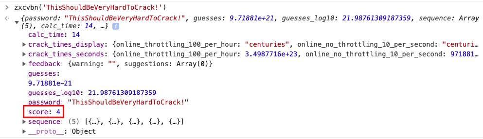

# Authentication and Session Management Requirements

## MSTG-AUTH-1
If the app provides users access to a remote service, some form of authentication, such as username/password authentication, is performed at the remote endpoint.

<span style="color: red; ">\* Refer to "[<span style="color: red; ">1.2.1.1. Appropriate authentication response in MSTG-ARCH-2</span>](0x02-MASDG-Architecture_Design_and_Threat_Modeling_Requirements.md#appropriate-authentication-response)" for appropriate authentication support in this chapter.</span>

Reference
* [owasp-mastg Verifying that Appropriate Authentication is in Place (MSTG-ARCH-2 and MSTG-AUTH-1)](https://github.com/OWASP/owasp-mastg/blob/v1.5.0/Document/0x04e-Testing-Authentication-and-Session-Management.md#verifying-that-appropriate-authentication-is-in-place-mstg-arch-2-and-mstg-auth-1)
* [owasp-mastg Testing OAuth 2.0 Flows (MSTG-AUTH-1 and MSTG-AUTH-3)](https://github.com/OWASP/owasp-mastg/blob/v1.5.0/Document/0x04e-Testing-Authentication-and-Session-Management.md#testing-oauth-20-flows-mstg-auth-1-and-mstg-auth-3)

### Testing Confirm Credentials

The confirm credential flow is available since Android 6.0 and is used to ensure that users do not have to enter app-specific passwords together with the lock screen protection. Instead: if a user has logged in to the device recently, then confirm-credentials can be used to unlock cryptographic materials from the AndroidKeystore. That is, if the user unlocked the device within the set time limits (setUserAuthenticationValidityDurationSeconds), otherwise the device needs to be unlocked again.

Note that the security of Confirm Credentials is only as strong as the protection set at the lock screen. This often means that simple predictive lock-screen patterns are used and therefore we do not recommend any apps which require L2 of security controls to use Confirm Credentials.Note that setUserAuthenticationValidityDurationSeconds is deprecated in API level 30, so setUserAuthenticationParameters is currently recommended.

Reference
* [owasp-mastg Testing Confirm Credentials (MSTG-AUTH-1 and MSTG-STORAGE-11) Overview](https://github.com/OWASP/owasp-mastg/blob/v1.5.0/Document/0x05f-Testing-Local-Authentication.md#overview)

Rulebook
* [Credentials verification flow should be used with an understanding of security strength (Recommended)](#credentials-verification-flow-should-be-used-with-an-understanding-of-security-strength-recommended)

#### Static Analysis
Reassure that the lock screen is set:
```java
KeyguardManager mKeyguardManager = (KeyguardManager) getSystemService(Context.KEYGUARD_SERVICE);
if (!mKeyguardManager.isKeyguardSecure()) {
    // Show a message that the user hasn't set up a lock screen.
}
```

* Create the key protected by the lock screen. In order to use this key, the user needs to have unlocked the device in the last X seconds, or the device needs to be unlocked again. Make sure that this timeout is not too long, as it becomes harder to ensure that it was the same user using the app as the user unlocking the device:
  ```java
  try {
      KeyStore keyStore = KeyStore.getInstance("AndroidKeyStore");
      keyStore.load(null);
      KeyGenerator keyGenerator = KeyGenerator.getInstance(
              KeyProperties.KEY_ALGORITHM_AES, "AndroidKeyStore");
  
      // Set the alias of the entry in Android KeyStore where the key will appear
      // and the constrains (purposes) in the constructor of the Builder
      keyGenerator.init(new KeyGenParameterSpec.Builder(KEY_NAME,
              KeyProperties.PURPOSE_ENCRYPT | KeyProperties.PURPOSE_DECRYPT)
              .setBlockModes(KeyProperties.BLOCK_MODE_CBC)
              .setUserAuthenticationRequired(true)
                      // Require that the user has unlocked in the last 30 seconds
              .setUserAuthenticationValidityDurationSeconds(30)
              .setEncryptionPaddings(KeyProperties.ENCRYPTION_PADDING_PKCS7)
              .build());
      keyGenerator.generateKey();
  } catch (NoSuchAlgorithmException | NoSuchProviderException
          | InvalidAlgorithmParameterException | KeyStoreException
          | CertificateException | IOException e) {
      throw new RuntimeException("Failed to create a symmetric key", e);
  }
  ```

* Setup the lock screen to confirm:
  ```java
  private static final int REQUEST_CODE_CONFIRM_DEVICE_CREDENTIALS = 1; //used as a number to verify whether this is where the activity results from
  Intent intent = mKeyguardManager.createConfirmDeviceCredentialIntent(null, null);
  if (intent != null) {
      startActivityForResult(intent, REQUEST_CODE_CONFIRM_DEVICE_CREDENTIALS);
  }
  ```
  Note that startActivityForResult is currently deprecated; see the rulebook for recommended methods.

* Use the key after lock screen:
  ```java
  @Override
  protected void onActivityResult(int requestCode, int resultCode, Intent data) {
      if (requestCode == REQUEST_CODE_CONFIRM_DEVICE_CREDENTIALS) {
          // Challenge completed, proceed with using cipher
          if (resultCode == RESULT_OK) {
              //use the key for the actual authentication flow
          } else {
              // The user canceled or didn’t complete the lock screen
              // operation. Go to error/cancellation flow.
          }
      }
  }
  ```
  Note that onActivityResult is currently deprecated; see the rulebook for recommended methods.

Make sure that the unlocked key is used during the application flow. For example, the key may be used to decrypt local storage or a message received from a remote endpoint. If the application simply checks whether the user has unlocked the key or not, the application may be vulnerable to a local authentication bypass.

Reference
* [owasp-mastg Testing Confirm Credentials (MSTG-AUTH-1 and MSTG-STORAGE-11) Static Analysis](https://github.com/OWASP/owasp-mastg/blob/v1.5.0/Document/0x05f-Testing-Local-Authentication.md#static-analysis)

Rulebook
* [Credentials verification flow should be used with an understanding of security strength (Recommended)](#credentials-verification-flow-should-be-used-with-an-understanding-of-security-strength-recommended)

#### Dynamic Analysis
Validate the duration of time (seconds) for which the key is authorized to be used after the user is successfully authenticated. This is only needed if setUserAuthenticationRequired is used.

Reference
* [owasp-mastg Testing Confirm Credentials (MSTG-AUTH-1 and MSTG-STORAGE-11) Dynamic Analysis](https://github.com/OWASP/owasp-mastg/blob/v1.5.0/Document/0x05f-Testing-Local-Authentication.md#dynamic-analysis)

Rulebook
* [Credentials verification flow should be used with an understanding of security strength (Recommended)](#credentials-verification-flow-should-be-used-with-an-understanding-of-security-strength-recommended)

### Rulebook
1. [Credentials verification flow should be used with an understanding of security strength (Recommended)](#credentials-verification-flow-should-be-used-with-an-understanding-of-security-strength-recommended)

#### Credentials verification flow should be used with an understanding of security strength (Recommended)

Note that the security of Confirm Credentials is only as strong as the protection set at the lock screen. This often means that simple predictive lock-screen patterns are used and therefore we do not recommend any apps which require L2 of security controls to use Confirm Credentials.

Below is a sample code of the credential verification flow.
```java
    private void createNewKey(String alias, int timeout) {
        try {
            KeyStore keyStore = KeyStore.getInstance("AndroidKeyStore");
            keyStore.load(null);
            KeyGenerator keyGenerator = KeyGenerator.getInstance(
                    KeyProperties.KEY_ALGORITHM_AES, "AndroidKeyStore");

            // Set the alias of the entry in Android KeyStore where the key will appear
            // and the constrains (purposes) in the constructor of the Builder
            KeyGenParameterSpec.Builder builder = new KeyGenParameterSpec.Builder(alias,
                    KeyProperties.PURPOSE_ENCRYPT | KeyProperties.PURPOSE_DECRYPT)
                    .setBlockModes(KeyProperties.BLOCK_MODE_CBC)
                    .setUserAuthenticationRequired(true)
                    .setEncryptionPaddings(KeyProperties.ENCRYPTION_PADDING_PKCS7);
            // Require that the user has unlocked in the last 30 seconds
            if (Build.VERSION.SDK_INT >= Build.VERSION_CODES.R) {
                builder.setUserAuthenticationParameters(timeout, KeyProperties.AUTH_DEVICE_CREDENTIAL);
            } else {
                builder.setUserAuthenticationValidityDurationSeconds(timeout);
            }
            keyGenerator.init(builder.build());
            keyGenerator.generateKey();
        } catch (NoSuchAlgorithmException | NoSuchProviderException
                | InvalidAlgorithmParameterException | KeyStoreException
                | CertificateException | IOException e) {
            throw new RuntimeException("Failed to create a symmetric key", e);
        }
    }
    
    private ActivityResultLauncher<Intent> checkCredentialLauncher = registerForActivityResult(new ActivityResultContracts.StartActivityForResult(),
        result -> {
            if (result.getResultCode() == RESULT_OK) {
                // use the key for the actual authentication flow
            } else {
                // The user canceled or didn’t complete the lock screen
                // operation. Go to error/cancellation flow.
            }
        });

    private void checkCredential(Context context) {
        KeyguardManager keyguardManager = (KeyguardManager)context.getSystemService(Context.KEYGUARD_SERVICE);
        // Terminal authentication validity judgment
        if (keyguardManager.isKeyguardSecure()) {
            // Judgment of OS10 or higher
            if (Build.VERSION.SDK_INT >= Build.VERSION_CODES.Q) {
                BiometricPrompt biometricPrompt;
                // Judgment of OS11 or higher
                if (Build.VERSION.SDK_INT >= Build.VERSION_CODES.R) {
                    biometricPrompt = new BiometricPrompt.Builder(context)
                            .setAllowedAuthenticators(BiometricManager.Authenticators.DEVICE_CREDENTIAL)
                            .build();
                } else {
                    biometricPrompt = new BiometricPrompt.Builder(context)
                            .setDeviceCredentialAllowed(true)
                            .build();
                }

                CancellationSignal cancellationSignal = new CancellationSignal();
                cancellationSignal.setOnCancelListener(() -> {
                    // When requesting cancellation of authorization
                });

                Executor executors = ContextCompat.getMainExecutor(context);
                BiometricPrompt.AuthenticationCallback authCallBack = new BiometricPrompt.AuthenticationCallback() {
                    @Override
                    public void onAuthenticationError(int errorCode, CharSequence errString) {
                        super.onAuthenticationError(errorCode, errString);
                        // Authentication Error
                    }

                    @Override
                    public void onAuthenticationSucceeded(BiometricPrompt.AuthenticationResult result) {
                        super.onAuthenticationSucceeded(result);
                        // Authentication Success
                    }

                    @Override
                    public void onAuthenticationFailed() {
                        super.onAuthenticationFailed();
                        // Authentication failure
                    }
                };
                biometricPrompt.authenticate(cancellationSignal, executors, authCallBack);
            } else {
                Intent intent = keyguardManager.createConfirmDeviceCredentialIntent(null, null);
                checkCredentialLauncher.launch(intent);
            }
        }
    }
```

If this is not noted, the following may occur.
* Potentially enforce a low-strength security credential verification flow.

## MSTG-AUTH-2

If stateful session management is used, the remote endpoint uses randomly generated session identifiers to authenticate client requests without sending the user's credentials.

### Session Information Management

Stateful (or "session-based") authentication is characterized by authentication records on both the client and server. The authentication flow is as follows:

1. The app sends a request with the user's credentials to the backend server.
1. The server verifies the credentials If the credentials are valid, the server creates a new session along with a random session ID.
1. The server sends to the client a response that includes the session ID.
1. The client sends the session ID with all subsequent requests. The server validates the session ID and retrieves the associated session record.
1. After the user logs out, the server-side session record is destroyed and the client discards the session ID.

When sessions are improperly managed, they are vulnerable to a variety of attacks that may compromise the session of a legitimate user, allowing the attacker to impersonate the user. This may result in lost data, compromised confidentiality, and illegitimate actions.

Reference
* [owasp-mastg Testing Stateful Session Management (MSTG-AUTH-2)](https://github.com/OWASP/owasp-mastg/blob/v1.5.0/Document/0x04e-Testing-Authentication-and-Session-Management.md#testing-stateful-session-management-mstg-auth-2)

#### Session Management Best Practices
Locate any server-side endpoints that provide sensitive information or functions and verify the consistent enforcement of authorization. The backend service must verify the user's session ID or token and make sure that the user has sufficient privileges to access the resource. If the session ID or token is missing or invalid, the request must be rejected.

Make sure that:
* Session IDs are randomly generated on the server side.
* The IDs can't be guessed easily (use proper length and entropy).
* Session IDs are always exchanged over secure connections (e.g. HTTPS).
* The mobile app doesn't save session IDs in permanent storage.
* The server verifies the session whenever a user tries to access privileged application elements, (a session ID must be valid and must correspond to the proper authorization level).
* The session is terminated on the server side and session information deleted within the mobile app after it times out or the user logs out.

Authentication shouldn't be implemented from scratch but built on top of proven frameworks. Many popular frameworks provide ready-made authentication and session management functionality. If the app uses framework APIs for authentication, check the framework security documentation for best practices. Security guides for common frameworks are available at the following links:

* [Spring (Java)](https://spring.io/projects/spring-security)
* [Struts (Java)](https://struts.apache.org/security/)
* [Laravel (PHP)](https://laravel.com/docs/9.x/authentication)
* [Ruby on Rails](https://guides.rubyonrails.org/security.html)

A great resource for testing server-side authentication is the OWASP Web Testing Guide, specifically the [Testing Authentication](https://owasp.org/www-project-web-security-testing-guide/v41/4-Web_Application_Security_Testing/04-Authentication_Testing/README) and [Testing Session Management](https://owasp.org/www-project-web-security-testing-guide/v41/4-Web_Application_Security_Testing/06-Session_Management_Testing/README) chapters.

Reference
* [owasp-mastg Testing Stateful Session Management (MSTG-AUTH-2) Session Management Best Practices](https://github.com/OWASP/owasp-mastg/blob/v1.5.0/Document/0x04e-Testing-Authentication-and-Session-Management.md#session-management-best-practices)

Rulebook
* [Ensure mobile apps do not store session IDs in persistent storage (Required)](#ensure-mobile-apps-do-not-store-session-ids-in-persistent-storage-required)

### Rulebook
1. [Ensure mobile apps do not store session IDs in persistent storage (Required)](#ensure-mobile-apps-do-not-store-session-ids-in-persistent-storage-required)

#### Ensure mobile apps do not store session IDs in persistent storage (Required)
Storing session IDs in persistent storage may be read/written by users or used by third parties. Therefore, session IDs should not be stored in such storage.

\* No sample code due to deprecated rules.

If this is violated, the following may occur.
* There is a risk that the session ID can be read/written by the user or used by a third party.

## MSTG-AUTH-3
If stateless token-based authentication is used, the server provides a token that has been signed using a secure algorithm.

### Token management
Token-based authentication is implemented by sending a signed token (verified by the server) with each HTTP request. The most commonly used token format is the JSON Web Token, defined in [RFC7519](https://www.rfc-editor.org/rfc/rfc7519). A JWT may encode the complete session state as a JSON object. Therefore, the server doesn't have to store any session data or authentication information.

JWT tokens consist of three Base64Url-encoded parts separated by dots. The Token structure is as follows:

```default
base64UrlEncode(header).base64UrlEncode(payload).base64UrlEncode(signature)
```

The following example shows a [Base64Url-encoded JSON Web Token](https://jwt.io/#debugger):

```default
eyJhbGciOiJIUzI1NiIsInR5cCI6IkpXVCJ9.eyJzdWIiOiIxMjM0NTY3ODkwIiwibmFtZSI6Ikpva
G4gRG9lIiwiYWRtaW4iOnRydWV9.TJVA95OrM7E2cBab30RMHrHDcEfxjoYZgeFONFh7HgQ
```

The header typically consists of two parts: the token type, which is JWT, and the hashing algorithm being used to compute the signature. In the example above, the header decodes as follows:

```json
{"alg":"HS256","typ":"JWT"}
```

The second part of the token is the payload, which contains so-called claims. Claims are statements about an entity (typically, the user) and additional metadata. For example:

```json
{"sub":"1234567890","name":"John Doe","admin":true}
```

The signature is created by applying the algorithm specified in the JWT header to the encoded header, encoded payload, and a secret value. For example, when using the HMAC SHA256 algorithm the signature is created in the following way:

```java
HMACSHA256(base64UrlEncode(header) + "." + base64UrlEncode(payload), secret)
```

Note that the secret is shared between the authentication server and the backend service - the client does not know it. This proves that the token was obtained from a legitimate authentication service. It also prevents the client from tampering with the claims contained in the token.


Reference
* [owasp-mastg Testing Stateless (Token-Based) Authentication (MSTG-AUTH-3)](https://github.com/OWASP/owasp-mastg/blob/v1.5.0/Document/0x04e-Testing-Authentication-and-Session-Management.md#testing-stateless-token-based-authentication-mstg-auth-3)


### Static Analysis
Identify the JWT library that the server and client use. Find out whether the JWT libraries in use have any known vulnerabilities.

Verify that the implementation adheres to JWT [best practices](https://stormpath.com/blog/jwt-the-right-way):

* Verify that the HMAC is checked for all incoming requests containing a token;
* Verify the location of the private signing key or HMAC secret key. The key should remain on the server and should never be shared with the client. It should be available for the issuer and verifier only.
* Verify that no sensitive data, such as personal identifiable information, is embedded in the JWT. If, for some reason, the architecture requires transmission of such information in the token, make sure that payload encryption is being applied. See the sample Java implementation on the [OWASP JWT Cheat Sheet](https://cheatsheetseries.owasp.org/cheatsheets/JSON_Web_Token_for_Java_Cheat_Sheet.html).
* Make sure that replay attacks are addressed with the jti (JWT ID) claim, which gives the JWT a unique identifier.
* Make sure that cross service relay attacks are addressed with the aud (audience) claim, which defines for which application the token is entitled.
* Verify that tokens are stored securely on the mobile phone, with, for example,  KeyStore (Android).

Reference
* [owasp-mastg Testing Stateless (Token-Based) Authentication (MSTG-AUTH-3) Static Analysis](https://github.com/OWASP/owasp-mastg/blob/v1.5.0/Document/0x04e-Testing-Authentication-and-Session-Management.md#static-analysis-4)

Rulebook
* [Identify JWT libraries in use and whether they have known vulnerabilities (Required)](#identify-jwt-libraries-in-use-and-whether-they-have-known-vulnerabilities-required)
* [Ensure tokens are securely stored on mobile devices by KeyStore (Android) (Required)](#ensure-tokens-are-securely-stored-on-mobile-devices-by-keystore-android-required)

#### Enforcing the Hashing Algorithm
An attacker executes this by altering the token and, using the 'none' keyword, changing the signing algorithm to indicate that the integrity of the token has already been verified. [Some libraries](https://stormpath.com/blog/jwt-the-right-way) might treat tokens signed with the 'none' algorithm as if they were valid tokens with verified signatures, so the application will trust altered token claims.

For example, in Java applications, the expected algorithm should be requested explicitly when creating the verification context:

```java
// HMAC key - Block serialization and storage as String in JVM memory
private transient byte[] keyHMAC = ...;

//Create a verification context for the token requesting explicitly the use of the HMAC-256 HMAC generation

JWTVerifier verifier = JWT.require(Algorithm.HMAC256(keyHMAC)).build();

//Verify the token; if the verification fails then an exception is thrown

DecodedJWT decodedToken = verifier.verify(token);
```

Reference
* [owasp-mastg Testing Stateless (Token-Based) Authentication (MSTG-AUTH-3) Enforcing the Hashing Algorithm](https://github.com/OWASP/owasp-mastg/blob/v1.5.0/Document/0x04e-Testing-Authentication-and-Session-Management.md#enforcing-the-hashing-algorithm)

Rulebook
* [Need to request the expected hash algorithm (Required)](#need-to-request-the-expected-hash-algorithm-required)

#### Token Expiration
Once signed, a stateless authentication token is valid forever unless the signing key changes. A common way to limit token validity is to set an expiration date. Make sure that the tokens include an ["exp" expiration claim](https://www.rfc-editor.org/rfc/rfc7519#section-4.1.4) and the backend doesn't process expired tokens.

A common method of granting tokens combines [access tokens and refresh tokens](https://auth0.com/blog/refresh-tokens-what-are-they-and-when-to-use-them/). When the user logs in, the backend service issues a short-lived access token and a long-lived refresh token. The application can then use the refresh token to obtain a new access token, if the access token expires.

For apps that handle sensitive data, make sure that the refresh token expires after a reasonable period of time. The following example code shows a refresh token API that checks the refresh token's issue date. If the token is not older than 14 days, a new access token is issued. Otherwise, access is denied and the user is prompted to login again.

```java
app.post('/renew_access_token', function (req, res) {
    // verify the existing refresh token
    var profile = jwt.verify(req.body.token, secret);
  
    // if refresh token is more than 14 days old, force login
    if (profile.original_iat - new Date() > 14) { // iat == issued at
      return res.send(401); // re-login
    }
  
    // check if the user still exists or if authorization hasn't been revoked
    if (!valid) return res.send(401); // re-logging
  
    // issue a new access token
    var renewed_access_token = jwt.sign(profile, secret, { expiresInMinutes: 60*5 });
    res.json({ token: renewed_access_token });
  });
```

Reference
* [owasp-mastg Testing Stateless (Token-Based) Authentication (MSTG-AUTH-3) Token Expiration](https://github.com/OWASP/owasp-mastg/blob/v1.5.0/Document/0x04e-Testing-Authentication-and-Session-Management.md#token-expiration)

Rulebook
* [Set an appropriate period for refresh token expiration (Required)](#set-an-appropriate-period-for-refresh-token-expiration-required)

### Dynamic Analysis
Investigate the following JWT vulnerabilities while performing dynamic analysis:

* Token Storage on the client:
    * The token storage location should be verified for mobile apps that use JWT.

* Cracking the signing key:
    * Token signatures are created via a private key on the server. After you obtain a JWT, choose a tool for [brute forcing the secret key offline](https://www.sjoerdlangkemper.nl/2016/09/28/attacking-jwt-authentication/).

* Information Disclosure:
    * Decode the Base64Url-encoded JWT and find out what kind of data it transmits and whether that data is encrypted.

* Tampering with the Hashing Algorithm:
    * Usage of [asymmetric algorithms](https://auth0.com/blog/critical-vulnerabilities-in-json-web-token-libraries/). JWT offers several asymmetric algorithms as RSA or ECDSA. When these algorithms are used, tokens are signed with the private key and the public key is used for verification. If a server is expecting a token to be signed with an asymmetric algorithm and receives a token signed with HMAC, it will treat the public key as an HMAC secret key. The public key can then be misused, employed as an HMAC secret key to sign the tokens.

    * Modify the alg attribute in the token header, then delete HS256, set it to none, and use an empty signature (e.g., signature = ""). Use this token and replay it in a request. Some libraries treat tokens signed with the none algorithm as a valid token with a verified signature. This allows attackers to create their own "signed" tokens.

There are two different Burp Plugins that can help you for testing the vulnerabilities listed above:

* [JSON Web Token Attacker](https://portswigger.net/bappstore/82d6c60490b540369d6d5d01822bdf61)
* [JSON Web Tokens](https://portswigger.net/bappstore/f923cbf91698420890354c1d8958fee6)

Also, make sure to check out the [OWASP JWT Cheat Sheet](https://cheatsheetseries.owasp.org/cheatsheets/JSON_Web_Token_for_Java_Cheat_Sheet.html) for additional information.


Reference
* [owasp-mastg Testing Stateless (Token-Based) Authentication (MSTG-AUTH-3) Dynamic Analysis](https://github.com/OWASP/owasp-mastg/blob/v1.5.0/Document/0x04e-Testing-Authentication-and-Session-Management.md#dynamic-analysis-2)

### Testing OAuth 2.0 Flows
[OAuth 2.0 defines a delegation protocol for conveying authorization decisions across APIs and a network of web-enabled applications](https://oauth.net/articles/authentication/). It is used in a variety of applications, including user authentication applications.

Common uses for OAuth2 include:

* Getting permission from the user to access an online service using their account.
* Authenticating to an online service on behalf of the user.
* Handling authentication errors.

According to OAuth 2.0, a mobile client seeking access to a user's resources must first ask the user to authenticate against an authentication server. With the users' approval, the authorization server then issues a token that allows the app to act on behalf of the user. Note that the OAuth2 specification doesn't define any particular kind of authentication or access token format.

OAuth 2.0 defines four roles:

* Resource Owner: the account owner
* Client: the application that wants to access the user's account with the access tokens
* Resource Server: hosts the user accounts
* Authorization Server: verifies user identity and issues access tokens to the application

Note: The API fulfills both the Resource Owner and Authorization Server roles. Therefore, we will refer to both as the API.


Here is a more [detailed explanation](https://www.digitalocean.com/community/tutorials/an-introduction-to-oauth-2) of the steps in the diagram:<br>

1. The application requests user authorization to access service resources.
1. If the user authorizes the request, the application receives an authorization grant. The authorization grant may take several forms (explicit, implicit, etc.).
1. The application requests an access token from the authorization server (API) by presenting authentication of its own identity along with the authorization grant.
1. If the application identity is authenticated and the authorization grant is valid, the authorization server (API) issues an access token to the application, completing the authorization process. The access token may have a companion refresh token.
1. The application requests the resource from the resource server (API) and presents the access token for authentication. The access token may be used in several ways (e.g., as a bearer token).
1. If the access token is valid, the resource server (API) serves the resource to the application.

Reference
* [owasp-mastg Testing Stateless (Token-Based) Authentication (MSTG-AUTH-1 and MSTG-AUTH-3)](https://github.com/OWASP/owasp-mastg/blob/v1.5.0/Document/0x04e-Testing-Authentication-and-Session-Management.md#testing-oauth-20-flows-mstg-auth-1-and-mstg-auth-3)

### OAuth 2.0 Best Practices
Verify that the following best practices are followed:

User agent:
* The user should have a way to visually verify trust (e.g., Transport Layer Security (TLS) confirmation, website mechanisms).
* To prevent man-in-the-middle attacks, the client should validate the server's fully qualified domain name with the public key the server presented when the connection was established.

Type of grant:
* On native apps, code grant should be used instead of implicit grant.
* When using code grant, PKCE (Proof Key for Code Exchange) should be implemented to protect the code grant. Make sure that the server also implements it.
* The auth "code" should be short-lived and used immediately after it is received. Verify that auth codes only reside on transient memory and aren't stored or logged.

Client secrets:
* Shared secrets should not be used to prove the client's identity because the client could be impersonated ("client_id" already serves as proof). If they do use client secrets, be sure that they are stored in secure local storage.

End-User credentials:
* Secure the transmission of end-user credentials with a transport-layer method, such as TLS.

Tokens:
* Keep access tokens in transient memory.
* Access tokens must be transmitted over an encrypted connection.
* Reduce the scope and duration of access tokens when end-to-end confidentiality can't be guaranteed or the token provides access to sensitive information or transactions.
* Remember that an attacker who has stolen tokens can access their scope and all resources associated with them if the app uses access tokens as bearer tokens with no other way to identify the client.
* Store refresh tokens in secure local storage; they are long-term credentials.

Reference
* [owasp-mastg Testing OAuth 2.0 Flows (MSTG-AUTH-1 and MSTG-AUTH-3) OAUTH 2.0 Best Practices](https://github.com/OWASP/owasp-mastg/blob/v1.5.0/Document/0x04e-Testing-Authentication-and-Session-Management.md#oauth-20-best-practices)

Rulebook
* [Adherence to OAuth 2.0 best practices (Required)](#adherence-to-oauth-20-best-practices-required)

#### External User Agent vs. Embedded User Agent
OAuth2 authentication can be performed either through an external user agent (e.g. Chrome or Safari) or in the app itself (e.g. through a WebView embedded into the app or an authentication library). None of the two modes is intrinsically "better" - instead, what mode to choose depends on the context.

Using an external user agent is the method of choice for apps that need to interact with social media accounts (Facebook, Twitter, etc.). Advantages of this method include:

* The user's credentials are never directly exposed to the app. This guarantees that the app cannot obtain the credentials during the login process ("credential phishing").

* Almost no authentication logic must be added to the app itself, preventing coding errors.

On the negative side, there is no way to control the behavior of the browser (e.g. to activate certificate pinning).

For apps that operate within a closed ecosystem, embedded authentication is the better choice. For example, consider a banking app that uses OAuth2 to retrieve an access token from the bank's authentication server, which is then used to access a number of micro services. In that case, credential phishing is not a viable scenario. It is likely preferable to keep the authentication process in the (hopefully) carefully secured banking app, instead of placing trust on external components.

Reference
* [owasp-mastg Testing OAuth 2.0 Flows (MSTG-AUTH-1 and MSTG-AUTH-3) External User Agent vs. Embedded User Agent](https://github.com/OWASP/owasp-mastg/blob/v1.5.0/Document/0x04e-Testing-Authentication-and-Session-Management.md#external-user-agent-vs-embedded-user-agent)

Rulebook
* [Main recommended libraries used for OAuth2 authentication (Recommended)](#main-recommended-libraries-used-for-oauth2-authentication-recommended)
* [When using an external user agent for OAuth2 authentication, understand the advantages and disadvantages and use it (Recommended)](#when-using-an-external-user-agent-for-oauth2-authentication-understand-the-advantages-and-disadvantages-and-use-it-recommended)

### Other OAuth 2.0 Best Practices
For additional best practices and detailed information please refer to the following source documents:

* [RFC6749 - The OAuth 2.0 Authorization Framework (October 2012)](https://www.rfc-editor.org/rfc/rfc6749)
* [RFC8252 - OAuth 2.0 for Native Apps (October 2017)](https://www.rfc-editor.org/rfc/rfc8252)
* [RFC6819 - OAuth 2.0 Threat Model and Security Considerations (January 2013)](https://www.rfc-editor.org/rfc/rfc6819)

Reference
* [owasp-mastg Testing OAuth 2.0 Flows (MSTG-AUTH-1 and MSTG-AUTH-3) Other OAuth2 Best Practices](https://github.com/OWASP/owasp-mastg/blob/v1.5.0/Document/0x04e-Testing-Authentication-and-Session-Management.md#other-oauth2-best-practices)

### Rulebook
1. [Identify JWT libraries in use and whether they have known vulnerabilities (Required)](#identify-jwt-libraries-in-use-and-whether-they-have-known-vulnerabilities-required)
1. [Ensure tokens are securely stored on mobile devices by KeyStore (Android) (Required)](#ensure-tokens-are-securely-stored-on-mobile-devices-by-keystore-android-required)
1. [Need to request the expected hash algorithm (Required)](#need-to-request-the-expected-hash-algorithm-required)
1. [Set an appropriate period for refresh token expiration (Required)](#set-an-appropriate-period-for-refresh-token-expiration-required)
1. [Adherence to OAuth 2.0 best practices (Required)](#adherence-to-oauth-20-best-practices-required)
1. [Main recommended libraries used for OAuth2 authentication (Recommended)](#main-recommended-libraries-used-for-oauth2-authentication-recommended)
1. [When using an external user agent for OAuth2 authentication, understand the advantages and disadvantages and use it (Recommended)](#when-using-an-external-user-agent-for-oauth2-authentication-understand-the-advantages-and-disadvantages-and-use-it-recommended)

#### Identify JWT libraries in use and whether they have known vulnerabilities (Required)

The following information should be reviewed to determine if there are any vulnerabilities.

* Identify the JWT libraries you are using and find out whether the JWT libraries in use have any known vulnerabilities.
* Ensure that the HMAC is verified for all incoming requests containing tokens.
* Verify the location of the private signing key or HMAC private key. Keys should be stored on the server and never shared with clients. It should only be available to the issuer and verifier.
* Ensure that no sensitive data, such as personally identifiable information, is embedded in the JWT. For architectures that need to transmit such information in the token for any reason, ensure that payload encryption is applied. See the sample Java implementation in [OWASP JWT Cheat Sheet](https://cheatsheetseries.owasp.org/cheatsheets/JSON_Web_Token_for_Java_Cheat_Sheet.html).
* Ensure that replay attacks are addressed with jti ( JWT ID ) claims that give the JWT a unique identifier.
* Ensure that cross-service relay attacks are addressed with aud (audience) claims that define which application the token is for.
* Ensure that the token is securely stored on the mobile device by means of KeyStore (Android).

The sample code below is an example of storing a token encrypted with the KeyStore encryption key in SharedPreferences and retrieving it from SharedPreferences for decryption.
```kotlin
val PROVIDER = "AndroidKeyStore"
val ALGORITHM = "RSA"
val CIPHER_TRANSFORMATION = "RSA/ECB/PKCS1Padding"

/**
 * Encrypt tokens and save them to SharedPreferences
 */
fun saveToken(context: Context, token: String) {
    val encryptedToken = encrypt(context, "token", token)
    val editor = getSharedPreferences(context).edit()
    editor.putString("encrypted_token", encryptedToken).commit()
}

/**
 * Decrypt the token and get it from SharedPreferences
 */
fun getToken(context: Context): String? {
    val encryptedToken = getSharedPreferences(context).getString("encrypted_token", null)
    if (encryptedToken == null) {
        return encryptedToken
    }
    val token = decrypt("token", encryptedToken)
    return token
}

/**
 * Encrypt text
 * @param context
 * @param alias Elias for identifying symmetric keys. Unique for each use.
 * @param plainText Text to be encrypted
 * @return Encrypted and Base64 wrapped string
 */
fun encrypt(context: Context, alias: String, plainText: String): String {
    val keyStore = KeyStore.getInstance(PROVIDER)
    keyStore.load(null)

    // Generate if no symmetric key
    if (!keyStore.containsAlias(alias)) {
        val keyPairGenerator = KeyPairGenerator.getInstance(ALGORITHM, PROVIDER)
        keyPairGenerator.initialize(createKeyPairGeneratorSpec(context, alias))
        keyPairGenerator.generateKeyPair()
    }
    val publicKey = keyStore.getCertificate(alias).getPublicKey()
    val privateKey = keyStore.getKey(alias, null)

    // Encryption with public key
    val cipher = Cipher.getInstance(CIPHER_TRANSFORMATION)
    cipher.init(Cipher.ENCRYPT_MODE, publicKey)
    val bytes = cipher.doFinal(plainText.toByteArray(Charsets.UTF_8))

    // String in Base64 for easy storage in SharedPreferences
    return Base64.encodeToString(bytes, Base64.DEFAULT)
}

/**
 * decrypt encrypted text.
 * @param alias alias to identify the symmetric key. Make it unique for each use.
 * @param encryptedText Text encrypted with encrypt
 * @return decrypted text
 */
fun decrypt(alias: String, encryptedText: String): String? {
    val keyStore = KeyStore.getInstance(PROVIDER)
    keyStore.load(null)
    if (!keyStore.containsAlias(alias)) {
        return null
    }

    // Decrypt with private key
    val privateKey = keyStore.getKey(alias, null)
    val cipher = Cipher.getInstance(CIPHER_TRANSFORMATION)
    cipher.init(Cipher.DECRYPT_MODE, privateKey)
    val bytes = Base64.decode(encryptedText, Base64.DEFAULT)

    val b = cipher.doFinal(bytes)
    return String(b)
}

/**
 * generate a symmetric key
 */
fun createKeyPairGeneratorSpec(context: Context, alias: String): KeyPairGeneratorSpec {
    val start = Calendar.getInstance()
    val end = Calendar.getInstance()
    end.add(Calendar.YEAR, 100)

    return KeyPairGeneratorSpec.Builder(context)
            .setAlias(alias)
            .setSubject(X500Principal(String.format("CN=%s", alias)))
            .setSerialNumber(BigInteger.valueOf(1000000))
            .setStartDate(start.getTime())
            .setEndDate(end.getTime())
            .build()
}
```

If this is violated, the following may occur.
* A vulnerability related to the JWT library used is exploited.

#### Ensure tokens are securely stored on mobile devices by KeyStore (Android) (Required)
Tokens must be securely stored on the mobile device by KeyStore. Failure to do so may allow server authentication using tokens by a third party.

Refer to the following rules for how to use KeyStore.

Data Storage and_Privacy Requirements RuleBook
* [Verify that keys are stored inside security hardware (Recommended)](0x03-MASDG-Data_Storage_and_Privacy_Requirements.md#verify-that-keys-are-stored-inside-security-hardware-recommended)

If this is violated, the following may occur.
* Server authentication using a token by a third party becomes possible.

#### Need to request the expected hash algorithm (Required)
An attacker may modify the token and change the signature algorithm using the "none" keyword to indicate that the integrity of the token has already been verified.
Therefore, Java applications should explicitly request the expected algorithm when creating the verification context.

```java
// HMAC key - Block serialization and storage as String in JVM memory
private transient byte[] keyHMAC = ...;

//Create a verification context for the token requesting explicitly the use of the HMAC-256 HMAC generation

JWTVerifier verifier = JWT.require(Algorithm.HMAC256(keyHMAC)).build();

//Verify the token; if the verification fails then an exception is thrown

DecodedJWT decodedToken = verifier.verify(token);
```

If this is violated, the following may occur.
* Treat tokens signed with the " none " algorithm as if they were valid tokens with verified signatures, and applications may trust requests for modified tokens.

#### Set an appropriate period for refresh token expiration (Required)
It is necessary to ensure that the refresh tokens are valid for the appropriate period of time.If the refresh token is within the expiration date, a new access token should be issued; if it is outside the expiration date, there is a need to deny access and prompt the user to log in again.

If this is violated, the following may occur.
* If the expiration date is inappropriate, there is a possibility that the login user can be used by a third party.

#### Adherence to OAuth 2.0 best practices (Required)
Adhere to the following OAuth 2.0 best practices

**User agent**
* Users should have a way to visually confirm trust (e.g. Transport Layer Security (TLS) confirmation, website mechanisms).
* To prevent man-in-the-middle attacks, the client must verify the fully qualified domain name of the server with the public key presented by the server when establishing the connection.

**Type of grant**
* Native apps should use code assignment rather than implicit assignment.
* If code assignment is used, PKCE ( Proof Key for Code Exchange ) must be implemented to protect the code assignment. Make sure it is also implemented on the server side.
* Authentication "codes" should have a short expiration date and be used immediately upon receipt. Ensure that the authentication code exists only in temporary memory and is not stored or logged.

**Client secret**
* The client should not use the shared secret to prove the client's identity, since it can be spoofed ("client_id" already serves as proof). If the client secret is used, make sure it is stored in secure local storage.

**End User Authentication Information**
* Transport layer methods such as TLS protect the transmission of end-user authentication information.

**token**
* The access token is stored in temporary memory.
* The access token must be sent over an encrypted connection.
* Reduce the scope and duration of the access token if end-to-end confidentiality cannot be guaranteed or if the token provides access to sensitive information or transactions.
* Note that if the application uses the access token as a bearer token and there is no other way to identify the client, an attacker who steals the token will have access to its scope and all resources associated with it.
* Refresh tokens should be stored in secure local storage.

If this is violated, the following may occur.
* Potentially a vulnerable OAuth 2.0 implementation.

#### Main recommended libraries used for OAuth2 authentication (Recommended)
It is important not to develop your own OAuth2 authentication implementation.  
The main libraries used to implement OAuth2 authentication are
* Google Play Services (Google)

The sample code below is an example of OAuth2 authentication with Google Play Services.
```kotlin
/**
 * Google SignIn
 */
private fun requestOAuth() {
    val signInOptions = GoogleSignInOptions.Builder(GoogleSignInOptions.DEFAULT_SIGN_IN).build()
    activityResultLauncher.launch(GoogleSignIn.getClient(requireContext(),signInOptions).signInIntent)
}
```

If this is not noted, the following may occur.
* Potentially a vulnerable OAuth 2.0 implementation.

#### When using an external user agent for OAuth2 authentication, understand the advantages and disadvantages and use it (Recommended)

OAuth2 authentication can be performed via an external user agent (e.g. Chrome or Safari).
The advantages and disadvantages of using an external user agent are as follows

**Advantages**
* The user's credentials are never disclosed directly to the app. For this reason, it is not possible for an app to obtain authentication information when logging in ("authentication information phishing").

* Since little or no authentication logic needs to be added to the application itself, coding errors can be avoided.

**Disadvantage**
* There is no way to control browser behavior (e.g., enable certificate pinning).

If this is not noted, the following may occur.
* Not available when certificate pinning needs to be enabled.

## MSTG-AUTH-4
The remote endpoint terminates the existing session when the user logs out.

### Destroying Remote Session Information
The purpose of this test case is verifying logout functionality and determining whether it effectively terminates the session on both client and server and invalidates a stateless token.

Failing to destroy the server-side session is one of the most common logout functionality implementation errors. This error keeps the session or token alive, even after the user logs out of the application. An attacker who gets valid authentication information can continue to use it and hijack a user's account.

Many mobile apps don't automatically log users out. There can be various reasons, such as: because it is inconvenient for customers, or because of decisions made when implementing stateless authentication. The application should still have a logout function, and it should be implemented according to best practices, destroying all locally stored tokens or session identifiers. If session information is stored on the server, it should also be destroyed by sending a logout request to that server. In case of a high-risk application, tokens should be invalidated. Not removing tokens or session identifiers can result in unauthorized access to the application in case the tokens are leaked. Note that other sensitive types of information should be removed as well, as any information that is not properly cleared may be leaked later, for example during a device backup.

### Static Analysis
If server code is available, make sure logout functionality terminates the session correctly. This verification will depend on the technology. Here are different examples of session termination for proper server-side logout:

* [Spring (Java)](https://docs.spring.io/spring-security/site/docs/4.1.x/apidocs/org/springframework/security/web/authentication/logout/SecurityContextLogoutHandler.html)
* [Ruby on Rails](https://guides.rubyonrails.org/security.html)
* [PHP](https://www.php.net/manual/en/function.session-destroy.php)

If access and refresh tokens are used with stateless authentication, they should be deleted from the mobile device. The [refresh token should be invalidated on the server](https://auth0.com/blog/denylist-json-web-token-api-keys/).


### Dynamic Analysis
Use an interception proxy for dynamic application analysis and execute the following steps to check whether the logout is implemented properly:

1. Log in to the application.
1. Access a resource that requires authentication, typically a request for private information belonging to your account.
1. Log out of the application.
1. Try to access the data again by resending the request from step 2.

If the logout is correctly implemented on the server, an error message or redirect to the login page will be sent back to the client. On the other hand, if you receive the same response you got in step 2, the token or session ID is still valid and hasn't been correctly terminated on the server. The OWASP Web Testing Guide ([WSTG-SESS-06](https://owasp.org/www-project-web-security-testing-guide/latest/4-Web_Application_Security_Testing/06-Session_Management_Testing/06-Testing_for_Logout_Functionality)) includes a detailed explanation and more test cases.

Reference
* [owasp-mastg Testing User Logout (MSTG-AUTH-4)](https://github.com/OWASP/owasp-mastg/blob/v1.5.0/Document/0x04e-Testing-Authentication-and-Session-Management.md#testing-user-logout-mstg-auth-4)

Rulebook
* [Best practices for discarding remote session information when login functionality is present in the app (Recommended)](#best-practices-for-discarding-remote-session-information-when-login-functionality-is-present-in-the-app-recommended)

### Rulebook
1. [Best practices for discarding remote session information when login functionality is present in the app (Recommended)](#best-practices-for-discarding-remote-session-information-when-login-functionality-is-present-in-the-app-recommended)

#### Best practices for discarding remote session information when login functionality is present in the app (Recommended)

If login capability exists in the app, destroy remote session information according to the following best practices.
* Provide a logout function in the application.
* Discard all locally stored tokens and session identifiers upon logout.
* If session information is stored on the server, send a logout request to the server and destroy it.
* Disable tokens for high-risk applications.

Failure to destroy tokens and session identifiers could result in unauthorized access to the application if the tokens are leaked.
Information that is not destroyed should be destroyed in the same manner as other sensitive information, as it could be leaked later, such as when backing up a device.

If this is not noted, the following may occur.
* Login information remains in memory and can be used by third parties.

## MSTG-AUTH-5
A password policy exists and is enforced at the remote endpoint.

### Password Policy Compliance
Password strength is a key concern when passwords are used for authentication. The password policy defines requirements to which end users should adhere. A password policy typically specifies password length, password complexity, and password topologies. A "strong" password policy makes manual or automated password cracking difficult or impossible. The following sections will cover various areas regarding password best practices. For further information please consult the [OWASP Authentication Cheat Sheet](https://github.com/OWASP/CheatSheetSeries/blob/master/cheatsheets/Authentication_Cheat_Sheet.md#implement-proper-password-strength-controls).

Reference
* [owasp-mastg Testing Best Practices for Passwords (MSTG-AUTH-5 and MSTG-AUTH-6)](https://github.com/OWASP/owasp-mastg/blob/v1.5.0/Document/0x04e-Testing-Authentication-and-Session-Management.md#testing-best-practices-for-passwords-mstg-auth-5-and-mstg-auth-6)

### Static Analysis
Confirm the existence of a password policy and verify the implemented password complexity requirements according to the [OWASP Authentication Cheat Sheet](https://github.com/OWASP/CheatSheetSeries/blob/master/cheatsheets/Authentication_Cheat_Sheet.md#implement-proper-password-strength-controls) which focuses on length and an unlimited character set. Identify all password-related functions in the source code and make sure that a verification check is performed in each of them. Review the password verification function and make sure that it rejects passwords that violate the password policy.

Reference
* [owasp-mastg Testing Best Practices for Passwords (MSTG-AUTH-5 and MSTG-AUTH-6) Static Analysis](https://github.com/OWASP/owasp-mastg/blob/v1.5.0/Document/0x04e-Testing-Authentication-and-Session-Management.md#static-analysis)

Rulebook
* [A "strong" password policy (Recommended)](#a-strong-password-policy-recommended)

#### zxcvbn
[zxcvbn](https://github.com/dropbox/zxcvbn) is a common library that can be used for estimating password strength, inspired by password crackers. It is available in JavaScript but also for many other programming languages on the server side. There are different methods of installation, please check the Github repo for your preferred method. Once installed, zxcvbn can be used to calculate the complexity and the amount of guesses to crack the password.

After adding the zxcvbn JavaScript library to the HTML page, you can execute the command zxcvbn in the browser console, to get back detailed information about how likely it is to crack the password including a score.



The score is defined as follows and can be used for a password strength bar for example:

```html
0 # too guessable: risky password. (guesses < 10^3)

1 # very guessable: protection from throttled online attacks. (guesses < 10^6)

2 # somewhat guessable: protection from unthrottled online attacks. (guesses < 10^8)

3 # safely unguessable: moderate protection from offline slow-hash scenario. (guesses < 10^10)

4 # very unguessable: strong protection from offline slow-hash scenario. (guesses >= 10^10)
```

Note that zxcvbn can be implemented by the app-developer as well using the Java (or other) implementation in order to guide the user into creating a strong password.

Reference
* [owasp-mastg Testing Best Practices for Passwords (MSTG-AUTH-5 and MSTG-AUTH-6) Static Analysis  zxcvbn](https://github.com/OWASP/owasp-mastg/blob/v1.5.0/Document/0x04e-Testing-Authentication-and-Session-Management.md#zxcvbn)

### Have I Been Pwned: PwnedPasswords
In order to further reduce the likelihood of a successful dictionary attack against a single factor authentication scheme (e.g. password only), you can verify whether a password has been compromised in a data breach. This can be done using services based on the Pwned Passwords API by Troy Hunt (available at api.pwnedpasswords.com). For example, the "[Have I been pwned?](https://haveibeenpwned.com/)" companion website. Based on the SHA-1 hash of a possible password candidate, the API returns the number of times the hash of the given password has been found in the various breaches collected by the service. The workflow takes the following steps:

* Encode the user input to UTF-8 (e.g.: the password test).
* Take the SHA-1 hash of the result of step 1 (e.g.: the hash of test is A94A8FE5CC...).
* Copy the first 5 characters (the hash prefix) and use them for a range-search by using the following API: `http GET https://api.pwnedpasswords.com/range/A94A8`
* Iterate through the result and look for the rest of the hash (e.g. is FE5CC... part of the returned list?). If it is not part of the returned list, then the password for the given hash has not been found. Otherwise, as in case of FE5CC..., it will return a counter showing how many times it has been found in breaches (e.g.: FE5CC...:76479).

Further documentation on the Pwned Passwords API can be found [online](https://haveibeenpwned.com/API/v3).

Note that this API is best used by the app-developer when the user needs to register and enter a password to check whether it is a recommended password or not.

Reference
* [owasp-mastg Testing Best Practices for Passwords (MSTG-AUTH-5 and MSTG-AUTH-6) Have I Been Pwned: PwnedPasswords](https://github.com/OWASP/owasp-mastg/blob/v1.5.0/Document/0x04e-Testing-Authentication-and-Session-Management.md#have-i-been-pwned-pwnedpasswords)

Rulebook
* [Check if the password is recommended (Recommended)](#check-if-the-password-is-recommended-recommended)

#### Login limit
Check the source code for a throttling procedure: a counter for logins attempted in a short period of time with a given user name and a method to prevent login attempts after the maximum number of attempts has been reached. After an authorized login attempt, the error counter should be reset.

Observe the following best practices when implementing anti-brute-force controls:

* After a few unsuccessful login attempts, targeted accounts should be locked (temporarily or permanently), and additional login attempts should be rejected.
* A five-minute account lock is commonly used for temporary account locking.
* The controls must be implemented on the server because client-side controls are easily bypassed.
* Unauthorized login attempts must be tallied with respect to the targeted account, not a particular session.

Additional brute force mitigation techniques are described on the OWASP page [Blocking Brute Force Attacks](https://owasp.org/www-community/controls/Blocking_Brute_Force_Attacks).

Reference
* [owasp-mastg Testing Best Practices for Passwords (MSTG-AUTH-5 and MSTG-AUTH-6) Have I Been Pwned: PwnedPasswords Login Throttling](https://github.com/OWASP/owasp-mastg/blob/v1.5.0/Document/0x04e-Testing-Authentication-and-Session-Management.md#login-throttling)

Rulebook
* [Adhere to the following best practices for brute force protection (Required)](#adhere-to-the-following-best-practices-for-brute-force-protection-required)

### Rulebook
1. [A "strong" password policy (Recommended)](#a-strong-password-policy-recommended)
1. [Check if the password is recommended (Recommended)](#check-if-the-password-is-recommended-recommended)
1. [Adhere to the following best practices for brute force protection (Required)](#adhere-to-the-following-best-practices-for-brute-force-protection-required)

#### A "strong" password policy (Recommended)

The following is an example of a policy for setting a "strong" password.

* Password Length
  * Minimum: Passwords of less than 8 characters are considered weak.
  * Maximum: The typical maximum length is 64 characters. It is necessary to set the maximum length to prevent long password Denial of Service attacks.
* Do not truncate passwords without notifying the user.
* Password configuration rules<br>Allow the use of all characters, including Unicode and whitespace.
* Credential Rotation<br>Credential rotation should be performed when a password compromise occurs or is identified.
* Password Strength Meter<br>Prepare a password strength meter to block users from creating complex passwords and setting passwords that have been identified in the past.

The sample code below is an example of the password length determination and password composition rule process that should be supported by an Android application.

Example in layout:
```xml
<EditText
    android:id="@+id/passwordText"
    android:hint="password"
    android:maxLength="64"/>
```

Example in Kotlin:
```kotlin
val PASSWORD_MIN_LENGTH: Int = 8
val PASSWORD_MAX_LENGTH: Int = 64
fun validationPassword(password: String?): Boolean {
    return if (password == null || password.isEmpty()) {
        false
    } else !(password.length < PASSWORD_MIN_LENGTH || password.length > PASSWORD_MAX_LENGTH)
}
```

Reference
* [OWASP CheatSheetSeries Implement Proper Password Strength Controls](https://github.com/OWASP/CheatSheetSeries/blob/master/cheatsheets/Authentication_Cheat_Sheet.md#implement-proper-password-strength-controls)

If this is not noted, the following may occur.
* Predicted to be a weak password.

#### Check if the password is recommended (Recommended)
The [Pwned Passwords API](https://haveibeenpwned.com/API/v3) can be used to check if a password is recommended when a user registers or enters a password.

If this is not noted, the following may occur.
* Predicted to be a weak password.

#### Adhere to the following best practices for brute force protection (Required)
The following best practices should be followed as a brute force measure.

* After several failed login attempts, the target account should be locked (temporarily or permanently) and subsequent login attempts should be denied.
* A 5-minute account lock is commonly used for temporary account locks.
* Control should be on the server, as client-side controls are easily bypassed.
* Unauthorized login attempts should be aggregated for the target account, not for a specific session.

Additional brute force mitigation techniques are described on the OWASP page [Blocking Brute Force Attacks](https://owasp.org/www-community/controls/Blocking_Brute_Force_Attacks).

\* Sample code is not available, as these are server-side rules.

If this is violated, the following may occur.
* Become vulnerable to brute force attacks.

## MSTG-AUTH-6
The remote endpoint implements a mechanism to protect against the submission of credentials an excessive number of times.

<span style="color: red; ">\* This guide is omitted in this document because it is a chapter about support on the Remote Service side.</span>

Reference
* [owasp-mastg Testing Best Practices for Passwords Dynamic Testing(MSTG-AUTH-6)](https://github.com/OWASP/owasp-mastg/blob/v1.5.0/Document/0x04e-Testing-Authentication-and-Session-Management.md#dynamic-testing-mstg-auth-6)

## MSTG-AUTH-7
Sessions are invalidated at the remote endpoint after a predefined period of inactivity and access tokens expire.

<span style="color: red; ">\* This guide is omitted in this document because it is a chapter about support on the Remote Service side.</span>

Reference
* [owasp-mastg Testing Session Timeout(MSTG-AUTH-7)](https://github.com/OWASP/owasp-mastg/blob/v1.5.0/Document/0x04e-Testing-Authentication-and-Session-Management.md#testing-session-timeout-mstg-auth-7)

## MSTG-AUTH-12
Authorization models should be defined and enforced at the remote endpoint.

<span style="color: red; ">\* This guide is omitted in this document because it is a chapter about support on the Remote Service side.</span>