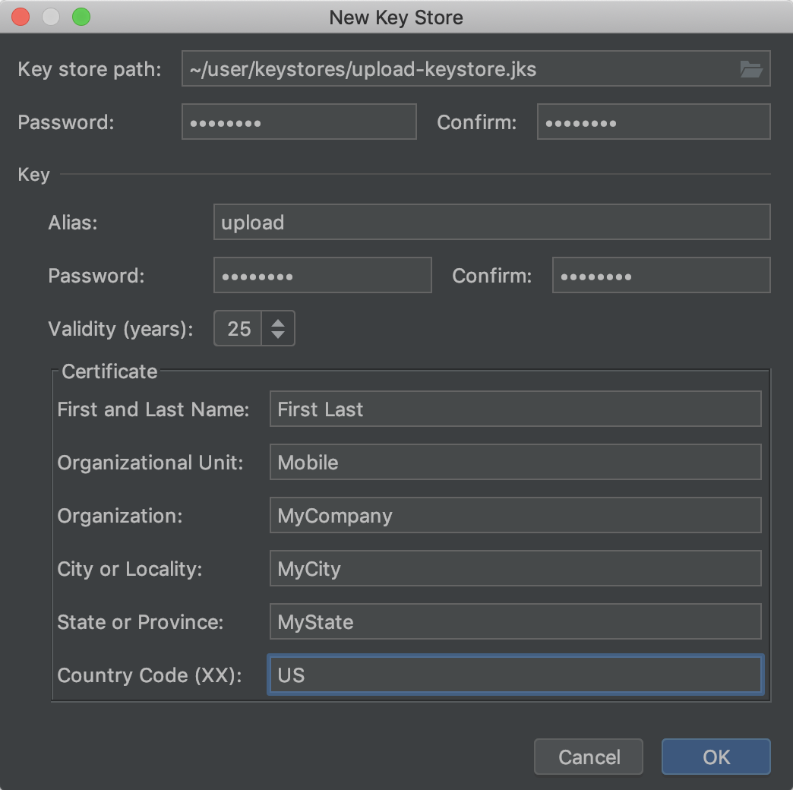

# Code Quality and Build Setting Requirements

## MSTG-CODE-1
The app is signed and provisioned with a valid certificate, of which the private key is properly protected.

### Factors to consider when signing an app

#### Expiration date of the certificate to be used

Android requires all APKs to be digitally signed with a certificate before they are installed or run. The digital signature is used to verify the owner's identity for application updates. This process can prevent an app from being tampered with or modified to include malicious code.

When an APK is signed, a public-key certificate is attached to it. This certificate uniquely associates the APK with the developer and the developer's private key. When an app is being built in debug mode, the Android SDK signs the app with a debug key created specifically for debugging purposes. An app signed with a debug key is not meant to be distributed and won't be accepted in most app stores, including the Google Play Store.

The [final release build](https://developer.android.com/studio/publish/app-signing.html) of an app must be signed with a valid release key. In Android Studio, the app can be signed manually or via creation of a signing configuration that's assigned to the release build type.

Prior Android 9 (API level 28) all app updates on Android need to be signed with the same certificate, so a [validity period of 25 years or more is recommended](https://developer.android.com/studio/publish/app-signing#considerations). Apps published on Google Play must be signed with a key that that has a validity period ending after October 22th, 2033.

Reference
* [owasp-mastg Making Sure That the App is Properly Signed (MSTG-CODE-1) Overview](https://github.com/OWASP/owasp-mastg/blob/v1.5.0/Document/0x05i-Testing-Code-Quality-and-Build-Settings.md#overview)

Rulebook
* [In the final release build of the app, sign with valid release skis (Required)](#in-the-final-release-build-of-the-app-sign-with-valid-release-skis-required)
* [Certificate expiration date (Recommended)](#certificate-expiration-date-recommended)

#### Signature Scheme of the Application

Four APK signing schemes are available:
* JAR signing (v1 scheme),
* APK Signature Scheme v2 (v2 scheme),
* APK Signature Scheme v3 (v3 scheme).
* APK Signature Scheme v4 (v4 scheme).

The v2 signature, which is supported by Android 7.0 (API level 24) and above, offers improved security and performance compared to v1 scheme. The V3 signature, which is supported by Android 9 (API level 28) and above, gives apps the ability to change their signing keys as part of an APK update. The V4 signature, which is supported by Android 11 (API level 30) and above. This functionality assures compatibility and apps continuous availability by allowing both the new and the old keys to be used. Note that it is only available via apksigner at the time of writing.

For each signing scheme the release builds should always be signed via all its previous schemes as well.

Reference
* [owasp-mastg Making Sure That the App is Properly Signed (MSTG-CODE-1) Overview](https://github.com/OWASP/owasp-mastg/blob/v1.5.0/Document/0x05i-Testing-Code-Quality-and-Build-Settings.md#overview)

Rulebook
* [Improvement of security with the signature scheme of the app (Recommended)](#improvement-of-security-with-the-signature-scheme-of-the-app-recommended)

### Static Analysis

Make sure that the release build has been signed via both the v1 and v2 schemes for Android 7.0 (API level 24) and above and via all the three schemes for Android 9 (API level 28) and above, and that the code-signing certificate in the APK belongs to the developer.

APK signatures can be verified with the apksigner tool. It is located at [SDK-Path]/build-tools/[version].
```bash
$ apksigner verify --verbose Desktop/example.apk
Verifies
Verified using v1 scheme (JAR signing): true
Verified using v2 scheme (APK Signature Scheme v2): true
Verified using v3 scheme (APK Signature Scheme v3): true
Number of signers: 1
```

The contents of the signing certificate can be examined with jarsigner. Note that the Common Name (CN) attribute is set to "Android Debug" in the debug certificate.

The output for an APK signed with a debug certificate is shown below:
```bash
$ jarsigner -verify -verbose -certs example.apk

sm     11116 Fri Nov 11 12:07:48 ICT 2016 AndroidManifest.xml

      X.509, CN=Android Debug, O=Android, C=US
      [certificate is valid from 3/24/16 9:18 AM to 8/10/43 9:18 AM]
      [CertPath not validated: Path doesn\'t chain with any of the trust anchors]
(...)
```

Ignore the "CertPath not validated" error. This error occurs with Java SDK 7 and above. Instead of jarsigner, you can rely on the apksigner to verify the certificate chain.

The signing configuration can be managed through Android Studio or the signingConfig block in build.gradle. To activate both the v1 and v2 schemes, the following values must be set:
```default
v1SigningEnabled true
v2SigningEnabled true
```

Several best practices for [configuring the app for release](https://developer.android.com/tools/publishing/preparing.html#publishing-configure) are available in the official Android developer documentation.

Last but not least: make sure that the application is never deployed with your internal testing certificates.

Reference
* [owasp-mastg Making Sure That the App is Properly Signed (MSTG-CODE-1) Static Analysis](https://github.com/OWASP/owasp-mastg/blob/v1.5.0/Document/0x05i-Testing-Code-Quality-and-Build-Settings.md#static-analysis)

Rulebook
* [Signs that match the target OS version (Required)](#signs-that-match-the-target-os-version-required)
* [The application will never be deployed with the internal test certificate (Required)](#the-application-will-never-be-deployed-with-the-internal-test-certificate-required)

### Dynamic Analysis

Static analysis should be used to verify the APK signature.

Reference
* [owasp-mastg Making Sure That the App is Properly Signed (MSTG-CODE-1) Dynamic Analysis](https://github.com/OWASP/owasp-mastg/blob/v1.5.0/Document/0x05i-Testing-Code-Quality-and-Build-Settings.md#dynamic-analysis)


### Rulebook
1. [In the final release build of the app, sign with valid release skis (Required)](#in-the-final-release-build-of-the-app-sign-with-valid-release-skis-required)
1. [Certificate expiration date (Recommended)](#certificate-expiration-date-recommended)
1. [Improvement of security with the signature scheme of the app (Recommended)](#improvement-of-security-with-the-signature-scheme-of-the-app-recommended)
1. [Signs that match the target OS version (Required)](#signs-that-match-the-target-os-version-required)
1. [The application will never be deployed with the internal test certificate (Required)](#the-application-will-never-be-deployed-with-the-internal-test-certificate-required)

#### In the final release build of the app, sign with valid release skis (Required)
The [final release build](https://developer.android.com/studio/publish/app-signing.html) of an app must be signed with a valid release key. In Android Studio, the app can be signed manually or via creation of a signing configuration that's assigned to the release build type.



Reference
* [Sign your app for release to Google Play](https://developer.android.com/studio/publish/app-signing#sign-apk)

If this is violated, the following may occur.
* Unable to publish apps on Google Play.

#### Certificate expiration date (Recommended)

Prior Android 9 (API level 28) all app updates on Android need to be signed with the same certificate, so a [validity period of 25 years or more is recommended](https://developer.android.com/studio/publish/app-signing#considerations). Apps published on Google Play must be signed with a key that that has a validity period ending after October 22th, 2033.

If this is not noted, the following may occur.
* Once the key expires, users will not be able to seamlessly upgrade to a newer version of the app.


#### Improvement of security with the signature scheme of the app (Recommended)

Four APK signing schemes are available:
* JAR signing (v1 scheme),
* APK Signature Scheme v2 (v2 scheme),
* APK Signature Scheme v3 (v3 scheme).
* APK Signature Scheme v4 (v4 scheme).

The v2 signature, which is supported by Android 7.0 (API level 24) and above, offers improved security and performance compared to v1 scheme. The V3 signature, which is supported by Android 9 (API level 28) and above, gives apps the ability to change their signing keys as part of an APK update. The V4 signature, which is supported by Android 11 (API level 30) and above. This functionality assures compatibility and apps continuous availability by allowing both the new and the old keys to be used. Note that it is only available via apksigner at the time of writing.

For each signing scheme, release builds must always be signed by all previous schemes as well. etc

Here is how to sign with apksigner.
```shell
apksigner sign --ks keystore.jks |
  --key key.pk8 --cert cert.x509.pem
  [signer_options] app-name.apk


--v1-signing-enabled <true | false>
Specifies whether apksigner should use the traditional JAR-based signature scheme when signing the specified APK package. By default, the tool uses the --min-sdk-version and --max-sdk-version values to determine when to apply this signature scheme.
--v2-signing-enabled <true | false>
Specifies whether apksigner should use APK Signature Scheme v2 when signing the specified APK package. By default, the tool uses the --min-sdk-version and --max-sdk-version values to determine when to apply this signature scheme.
--v3-signing-enabled <true | false>
Specifies whether apksigner should use APK Signature Scheme v3 when signing the specified APK package. By default, the tool uses the --min-sdk-version and --max-sdk-version values to determine when to apply this signature scheme.
```

Reference
* [JAR signing (v1 scheme)](https://source.android.com/docs/security/features/apksigning#v1)
* [APK Signature Scheme v2 (v2 scheme)](https://source.android.google.cn/docs/security/features/apksigning/v2)
* [APK Signature Scheme v3 (v3 scheme)](https://source.android.google.cn/docs/security/features/apksigning/v3)
* [APK Signature Scheme v4 (v4 scheme)](https://source.android.google.cn/docs/security/features/apksigning/v4)

If this is not noted, the following may occur.
* May degrade security and performance.

#### Signs that match the target OS version (Required)

Make sure that the release build has been signed via both the v1 and v2 schemes for Android 7.0 (API level 24) and above and via all the three schemes (v1, v2, v3) for Android 9 (API level 28) and above, and that the code-signing certificate in the APK belongs to the developer. Android 11 (API level 30) and higher requires a v4 signature and a complementary v2 or v3 signature. To support devices that run older versions of Android, you should continue to sign your APKs using APK Signature Scheme v1, in addition to signing your APK with APK Signature Scheme v2 or higher.

The following is how to sign an APK using the apksigner command.
```shell
apksigner sign --ks [keystore file] -v --ks-key-alias [key alias] --ks-pass pass:[keystore password] [Unsigned APK file]
```

If this is violated, the following may occur.
* May degrade security and performance.

#### The application will never be deployed with the internal test certificate (Required)

 Make sure that the application is never deployed with your internal testing certificates.

If this is violated, the following may occur.
* Logging and debugging may be deployed with logging and debugging enabled.
* May not be accepted in the app store.

## MSTG-CODE-2
The app has been built in release mode, with settings appropriate for a release build (e.g. non-debuggable).

### Toggle application debugging enable/disable

The android:debuggable attribute in the [Application element](https://developer.android.com/guide/topics/manifest/application-element.html) that is defined in the Android manifest determines whether the app can be debugged or not.

Reference
* [owasp-mastg Testing Whether the App is Debuggable (MSTG-CODE-2) Overview](https://github.com/OWASP/owasp-mastg/blob/v1.5.0/Document/0x05i-Testing-Code-Quality-and-Build-Settings.md#overview-1)

### Static Analysis

Check AndroidManifest.xml to determine whether the android:debuggable attribute has been set and to find the attribute's value:
```xml
    ...
    <application android:allowBackup="true" android:debuggable="true" android:icon="@drawable/ic_launcher" android:label="@string/app_name" android:theme="@style/AppTheme">
    ...
```

You can use aapt tool from the Android SDK with the following command line to quickly check if the android:debuggable="true" directive is present:
```bash
# If the command print 1 then the directive is present
# The regex search for this line: android:debuggable(0x0101000f)=(type 0x12)0xffffffff
$ aapt d xmltree sieve.apk AndroidManifest.xml | grep -Ec "android:debuggable\(0x[0-9a-f]+\)=\(type\s0x[0-9a-f]+\)0xffffffff"
1
```

For a release build, this attribute should always be set to "false" (the default value).

Reference
* [owasp-mastg Testing Whether the App is Debuggable (MSTG-CODE-2) Static Analysis](https://github.com/OWASP/owasp-mastg/blob/v1.5.0/Document/0x05i-Testing-Code-Quality-and-Build-Settings.md#static-analysis-1)

Rulebook
* [The android:debuggable attribute should be set to false when released (Recommended)](#the-androiddebuggable-attribute-should-be-set-to-false-when-released-recommended)

### Dynamic Analysis

adb can be used to determine whether an application is debuggable.

Use the following command:
```bash
# If the command print a number superior to zero then the application have the debug flag
# The regex search for these lines:
# flags=[ DEBUGGABLE HAS_CODE ALLOW_CLEAR_USER_DATA ALLOW_BACKUP ]
# pkgFlags=[ DEBUGGABLE HAS_CODE ALLOW_CLEAR_USER_DATA ALLOW_BACKUP ]
$ adb shell dumpsys package com.mwr.example.sieve | grep -c "DEBUGGABLE"
2
$ adb shell dumpsys package com.nondebuggableapp | grep -c "DEBUGGABLE"
0
```

If an application is debuggable, executing application commands is trivial. In the adb shell, execute run-as by appending the package name and application command to the binary name:
```bash
$ run-as com.vulnerable.app id
uid=10084(u0_a84) gid=10084(u0_a84) groups=10083(u0_a83),1004(input),1007(log),1011(adb),1015(sdcard_rw),1028(sdcard_r),3001(net_bt_admin),3002(net_bt),3003(inet),3006(net_bw_stats) context=u:r:untrusted_app:s0:c512,c768
```

[Android Studio](https://developer.android.com/tools/debugging/debugging-studio.html) can also be used to debug an application and verify debugging activation for an app.

Another method for determining whether an application is debuggable is attaching jdb to the running process. If this is successful, debugging will be activated.

The following procedure can be used to start a debug session with jdb:

1. Using adb and jdwp, identify the PID of the active application that you want to debug:
```bash
$ adb jdwp
2355
16346  <== last launched, corresponds to our application
```
2. Create a communication channel by using adb between the application process (with the PID) and your host computer by using a specific local port:
```bash
# adb forward tcp:[LOCAL_PORT] jdwp:[APPLICATION_PID]
$ adb forward tcp:55555 jdwp:16346
```
3. Using jdb, attach the debugger to the local communication channel port and start a debug session:
```bash
$ jdb -connect com.sun.jdi.SocketAttach:hostname=localhost,port=55555
Set uncaught java.lang.Throwable
Set deferred uncaught java.lang.Throwable
Initializing jdb ...
> help
```

A few notes about debugging:
* The tool [JADX](https://github.com/skylot/jadx) can be used to identify interesting locations for breakpoint insertion.
* Usage of basic commands for jdb can be found at [Tutorialspoint](https://www.tutorialspoint.com/jdb/jdb_basic_commands.htm).
* If you get an error telling that "the connection to the debugger has been closed" while jdb is being bound to the local communication channel port, kill all adb sessions and start a single new session.

Reference
* [owasp-mastg Testing Whether the App is Debuggable (MSTG-CODE-2) Dynamic Analysis](https://github.com/OWASP/owasp-mastg/blob/v1.5.0/Document/0x05i-Testing-Code-Quality-and-Build-Settings.md#dynamic-analysis-1)

### Rulebook
1. [The android:debuggable attribute should be set to false when released (Recommended)](#the-androiddebuggable-attribute-should-be-set-to-false-when-released-recommended)

#### The android:debuggable attribute should be set to false when released (Recommended)

At the time of release, the android:debuggable attribute is all set to false.

If this is violated, the following may occur.
* It can be misused by malicious users.

## MSTG-CODE-3
Debugging symbols have been removed from native binaries.

### Presence or absence of debug symbols

Generally, you should provide compiled code with as little explanation as possible. Some metadata, such as debugging information, line numbers, and descriptive function or method names, make the binary or bytecode easier for the reverse engineer to understand, but these aren't needed in a release build and can therefore be safely omitted without impacting the app's functionality.

To inspect native binaries, use a standard tool like nm or objdump to examine the symbol table. A release build should generally not contain any debugging symbols. If the goal is to obfuscate the library, removing unnecessary dynamic symbols is also recommended.

Reference
* [owasp-mastg Testing for Debugging Symbols (MSTG-CODE-3) Overview](https://github.com/OWASP/owasp-mastg/blob/v1.5.0/Document/0x05i-Testing-Code-Quality-and-Build-Settings.md#overview-2)

Rulebook
* [Not output code information in the release build (Required)](#not-output-code-information-in-the-release-build-required)

### Static Analysis

Symbols are usually stripped during the build process, so you need the compiled bytecode and libraries to make sure that unnecessary metadata has been discarded.

First, find the nm binary in your Android NDK and export it (or create an alias).
```bash
export NM = $ANDROID_NDK_DIR/toolchains/arm-linux-androideabi-4.9/prebuilt/darwin-x86_64/bin/arm-linux-androideabi-nm
```

To display debug symbols:
```bash
$NM -a libfoo.so
/tmp/toolchains/arm-linux-androideabi-4.9/prebuilt/darwin-x86_64/bin/arm-linux-androideabi-nm: libfoo.so: no symbols
```

To display dynamic symbols:
```bash
$NM -D libfoo.so
```

Alternatively, open the file in your favorite disassembler and check the symbol tables manually.

Dynamic symbols can be stripped via the visibility compiler flag. Adding this flag causes gcc to discard the function names while preserving the names of functions declared as JNIEXPORT.

Make sure that the following has been added to build.gradle:
```default
externalNativeBuild {
    cmake {
        cppFlags "-fvisibility=hidden"
    }
}
```

Reference
* [owasp-mastg Testing for Debugging Symbols (MSTG-CODE-3) Static Analysis](https://github.com/OWASP/owasp-mastg/blob/v1.5.0/Document/0x05i-Testing-Code-Quality-and-Build-Settings.md#static-analysis-2)

### Dynamic Analysis

Static analysis should be used to verify debugging symbols.

Reference
* [owasp-mastg Testing for Debugging Symbols (MSTG-CODE-3) Dynamic Analysis](https://github.com/OWASP/owasp-mastg/blob/v1.5.0/Document/0x05i-Testing-Code-Quality-and-Build-Settings.md#dynamic-analysis-2)

### Rulebook
1. [Not output code information in the release build (Required)](#not-output-code-information-in-the-release-build-required)

#### Not output code information in the release build (Required)
Generally, you should provide compiled code with as little explanation as possible. Some metadata, such as debugging information, line numbers, and descriptive function or method names, make the binary or bytecode easier for the reverse engineer to understand, but these aren't needed in a release build and can therefore be safely omitted without impacting the app's functionality.

A release build should generally not contain any debugging symbols. If the goal is to obfuscate the library, removing unnecessary dynamic symbols is also recommended.

Dynamic symbols can be removed by the visibility compiler flag. Adding this flag causes gcc to discard the function name while retaining the name of the function declared as JNIEXPORT.

Make sure the following is added to build.gradle
```default
externalNativeBuild {
    cmake {
        cppFlags "-fvisibility=hidden"
    }
}
```

If this is violated, the following may occur.
* Some metadata in the code, such as debugging information, line numbers, descriptive function or method names, etc., may be leaked.

## MSTG-CODE-4
Debugging code and developer assistance code (e.g. test code, backdoors, hidden settings) have been removed. The app does not log verbose errors or debugging messages.

### Using StrictMode

StrictMode is a developer tool for detecting violations, e.g. accidental disk or network access on the application's main thread. It can also be used to check for good coding practices, such as implementing performant code.

Here is [an example of StrictMode](https://developer.android.com/reference/android/os/StrictMode.html) with policies enabled for disk and network access to the main thread:
```java
public void onCreate() {
     if (DEVELOPER_MODE) {
         StrictMode.setThreadPolicy(new StrictMode.ThreadPolicy.Builder()
                 .detectDiskReads()
                 .detectDiskWrites()
                 .detectNetwork()   // or .detectAll() for all detectable problems
                 .penaltyLog()
                 .build());
         StrictMode.setVmPolicy(new StrictMode.VmPolicy.Builder()
                 .detectLeakedSqlLiteObjects()
                 .detectLeakedClosableObjects()
                 .penaltyLog()
                 .penaltyDeath()
                 .build());
     }
     super.onCreate();
 }
```

Inserting the policy in the if statement with the DEVELOPER_MODE condition is recommended. To disable StrictMode, DEVELOPER_MODE must be disabled for the release build.

Reference
* [owasp-mastg Testing for Debugging Code and Verbose Error Logging (MSTG-CODE-4) Overview](https://github.com/OWASP/owasp-mastg/blob/v1.5.0/Document/0x05i-Testing-Code-Quality-and-Build-Settings.md#overview-3)

Rulebook
* [Use StrictMode only when debugging (Recommended)](#use-strictmode-only-when-debugging-recommended)

### Static Analysis

To determine whether StrictMode is enabled, you can look for the StrictMode.setThreadPolicy or StrictMode.setVmPolicy methods. Most likely, they will be in the onCreate method.

The [detection methods for the thread policy](https://javabeat.net/strictmode-android-1/) are
```java
detectDiskWrites()
detectDiskReads()
detectNetwork()
```

The [penalties for thread policy violation](https://javabeat.net/strictmode-android-1/) are
```java
penaltyLog() // Logs a message to LogCat
penaltyDeath() // Crashes application, runs at the end of all enabled penalties
penaltyDialog() // Shows a dialog
```

Have a look at the [best practices](https://code.tutsplus.com/tutorials/android-best-practices-strictmode--mobile-7581) for using StrictMode.

Reference
* [owasp-mastg Testing for Debugging Code and Verbose Error Logging (MSTG-CODE-4) Static Analysis](https://github.com/OWASP/owasp-mastg/blob/v1.5.0/Document/0x05i-Testing-Code-Quality-and-Build-Settings.md#static-analysis-3)

### Dynamic Analysis

There are several ways of detecting StrictMode; the best choice depends on how the policies' roles are implemented. They include
* Logcat,
* a warning dialog,
* application crash.

Reference
* [owasp-mastg Testing for Debugging Code and Verbose Error Logging (MSTG-CODE-4) Dynamic Analysis](https://github.com/OWASP/owasp-mastg/blob/v1.5.0/Document/0x05i-Testing-Code-Quality-and-Build-Settings.md#dynamic-analysis-3)

### Rulebook
1. [Use StrictMode only when debugging (Recommended)](#use-strictmode-only-when-debugging-recommended)

#### Use StrictMode only when debugging (Recommended)
StrictMode is a developer tool for detecting violations, e.g. accidental disk or network access on the application's main thread.
When using StrictMode, thread policy and VM policy must be set.
Therefore, it is necessary to take measures such as setting a branch before the policy setting process to prevent the StrictMode setting process incorporated during development from being incorporated into the released version of the application.

The following is a sample code that incorporates StrictMode policy settings for development.
```java
public void onCreate() {
     if (DEVELOPER_MODE) {
         StrictMode.setThreadPolicy(new StrictMode.ThreadPolicy.Builder()
                 .detectDiskReads()
                 .detectDiskWrites()
                 .detectNetwork()   // or .detectAll() for all detectable problems
                 .penaltyLog()
                 .build());
         StrictMode.setVmPolicy(new StrictMode.VmPolicy.Builder()
                 .detectLeakedSqlLiteObjects()
                 .detectLeakedClosableObjects()
                 .penaltyLog()
                 .penaltyDeath()
                 .build());
     }
     super.onCreate();
 }
```

In this case, the following possibilities exist.
* Disk access and other information may be compromised.

## MSTG-CODE-5
All third party components used by the mobile app, such as libraries and frameworks, are identified, and checked for known vulnerabilities.

### Checking for Weaknesses in Third Party Libraries

Android apps often make use of third party libraries. These third party libraries accelerate development as the developer has to write less code in order to solve a problem. There are two categories of libraries:
* Libraries that are not (or should not) be packed within the actual production application, such as Mockito used for testing and libraries like JavaAssist used to compile certain other libraries.
* Libraries that are packed within the actual production application, such as Okhttp3.

These libraries can lead to unwanted side-effects:
* A library can contain a vulnerability, which will make the application vulnerable. A good example are the versions of OKHTTP prior to 2.7.5 in which TLS chain pollution was possible to bypass SSL pinning.
* A library can no longer be maintained or hardly be used, which is why no vulnerabilities are reported and/or fixed. This can lead to having bad and/or vulnerable code in your application through the library.
* A library can use a license, such as LGPL2.1, which requires the application author to provide access to the source code for those who use the application and request insight in its sources. In fact the application should then be allowed to be redistributed with modifications to its sourcecode. This can endanger the intellectual property (IP) of the application.

Please note that this issue can hold on multiple levels: When you use webviews with JavaScript running in the webview, the JavaScript libraries can have these issues as well. The same holds for plugins/libraries for Cordova, React-native and Xamarin apps.

Reference
* [owasp-mastg Checking for Weaknesses in Third Party Libraries (MSTG-CODE-5) Overview](https://github.com/OWASP/owasp-mastg/blob/v1.5.0/Document/0x05i-Testing-Code-Quality-and-Build-Settings.md#overview-4)

Rulebook
* [Pay attention to the use of third-party libraries (Recommended)](#pay-attention-to-the-use-of-third-party-libraries-recommended)

### Static Analysis

#### Vulnerabilities of Third Party Libraries

Detecting vulnerabilities in third party dependencies can be done by means of the OWASP Dependency checker. This is best done by using a gradle plugin, such as [dependency-check-gradle](https://github.com/jeremylong/dependency-check-gradle). In order to use the plugin, the following steps need to be applied: Install the plugin from the Maven central repository by adding the following script to your build.gradle:
```default
buildscript {
    repositories {
        mavenCentral()
    }
    dependencies {
        classpath 'org.owasp:dependency-check-gradle:3.2.0'
    }
}

apply plugin: 'org.owasp.dependencycheck'
```

Once gradle has invoked the plugin, you can create a report by running:
```bash
gradle assemble
gradle dependencyCheckAnalyze --info
```

The report will be in build/reports unless otherwise configured. Use the report in order to analyze the vulnerabilities found. See remediation on what to do given the vulnerabilities found with the libraries.

Please be advised that the plugin requires to download a vulnerability feed. Consult the documentation in case issues arise with the plugin.

Alternatively there are commercial tools which might have a better coverage of the dependencies found for the libraries being used, such as [Sonatype Nexus IQ](https://www.sonatype.com/nexus/iqserver), [Sourceclear](https://www.sourceclear.com/), [Snyk](https://snyk.io/) or [Blackduck](https://www.blackducksoftware.com/). The actual result of using either the OWASP Dependency Checker or another tool varies on the type of (NDK related or SDK related) libraries.

Lastly, please note that for hybrid applications, one will have to check the JavaScript dependencies with RetireJS. Similarly for Xamarin, one will have to check the C# dependencies.

When a library is found to contain vulnerabilities, then the following reasoning applies:
* Is the library packaged with the application? Then check whether the library has a version in which the vulnerability is patched. If not, check whether the vulnerability actually affects the application. If that is the case or might be the case in the future, then look for an alternative which provides similar functionality, but without the vulnerabilities.
* Is the library not packaged with the application? See if there is a patched version in which the vulnerability is fixed. If this is not the case, check if the implications of the vulnerability for the build-process. Could the vulnerability impede a build or weaken the security of the build-pipeline? Then try looking for an alternative in which the vulnerability is fixed.

When the sources are not available, one can decompile the app and check the JAR files. When Dexguard or [ProGuard](https://github.com/OWASP/owasp-mastg/blob/v1.5.0/Document/0x08a-Testing-Tools.md#proguard) are applied properly, then version information about the library is often obfuscated and therefore gone. Otherwise you can still find the information very often in the comments of the Java files of given libraries. Tools such as MobSF can help in analyzing the possible libraries packed with the application. If you can retrieve the version of the library, either via comments, or via specific methods used in certain versions, you can look them up for CVEs by hand.

If the application is a high-risk application, you will end up vetting the library manually. In that case, there are specific requirements for native code, which you can find in the chapter "[Testing Code Quality](https://github.com/OWASP/owasp-mastg/blob/v1.5.0/Document/0x04h-Testing-Code-Quality.md)". Next to that, it is good to vet whether all best practices for software engineering are applied.

Reference
* [owasp-mastg Checking for Weaknesses in Third Party Libraries (MSTG-CODE-5) Detecting vulnerabilities of third party libraries](https://github.com/OWASP/owasp-mastg/blob/v1.5.0/Document/0x05i-Testing-Code-Quality-and-Build-Settings.md#detecting-vulnerabilities-of-third-party-libraries)

Rulebook
* [Analysis method of dependencies for library apps (Required)](#analysis-method-of-dependencies-for-library-apps-required)

#### Licensing of the libraries used

In order to ensure that the copyright laws are not infringed, one can best check the dependencies by using a plugin which can iterate over the different libraries, such as License Gradle Plugin. This plugin can be used by taking the following steps.

In your build.gradle file add:
```default
plugins {
    id "com.github.hierynomus.license-report" version"{license_plugin_version}"
}
```

Now, after the plugin is picked up, use the following commands:
```bash
gradle assemble
gradle downloadLicenses
```

Now a license-report will be generated, which can be used to consult the licenses used by the third party libraries. Please check the license agreements to see whether a copyright notice needs to be included into the app and whether the license type requires to open-source the code of the application.

Similar to dependency checking, there are commercial tools which are able to check the licenses as well, such as [Sonatype Nexus IQ](https://www.sonatype.com/nexus/iqserver), [Sourceclear](https://www.sourceclear.com/), [Snyk](https://snyk.io/) or [Blackduck](https://www.blackducksoftware.com/).

Note: If in doubt about the implications of a license model used by a third party library, then consult with a legal specialist.

When a library contains a license in which the application IP needs to be open-sourced, check if there is an alternative for the library which can be used to provide similar functionalities.

Note: In case of a hybrid app, please check the build tools used: most of them do have a license enumeration plugin to find the licenses being used.

When the sources are not available, one can decompile the app and check the JAR files. When Dexguard or [ProGuard](https://github.com/OWASP/owasp-mastg/blob/v1.5.0/Document/0x08a-Testing-Tools.md#proguard) are applied properly, then version information about the library is often gone. Otherwise you can still find it very often in the comments of the Java files of given libraries. Tools such as MobSF can help in analyzing the possible libraries packed with the application. If you can retrieve the version of the library, either via comments, or via specific methods used in certain versions, you can look them up for their licenses being used by hand.

Reference
* [owasp-mastg Checking for Weaknesses in Third Party Libraries (MSTG-CODE-5) Detecting the Licenses Used by the Libraries of the Application](https://github.com/OWASP/owasp-mastg/blob/v1.5.0/Document/0x05i-Testing-Code-Quality-and-Build-Settings.md#detecting-the-licenses-used-by-the-libraries-of-the-application)

### Dynamic Analysis

The dynamic analysis of this section comprises validating whether the copyrights of the licenses have been adhered to. This often means that the application should have an about or EULA section in which the copy-right statements are noted as required by the license of the third party library.

Reference
* [owasp-mastg Checking for Weaknesses in Third Party Libraries (MSTG-CODE-5) Dynamic Analysis](https://github.com/OWASP/owasp-mastg/blob/v1.5.0/Document/0x05i-Testing-Code-Quality-and-Build-Settings.md#dynamic-analysis-4)

Rulebook
* [Verification whether the license is complied (Required)](#verification-whether-the-license-is-complied-required)

### Rulebook
1. [Pay attention to the use of third-party libraries (Recommended)](#pay-attention-to-the-use-of-third-party-libraries-recommended)
1. [Analysis method of dependencies for library apps (Required)](#analysis-method-of-dependencies-for-library-apps-required)
1. [Verification whether the license is complied (Required)](#verification-whether-the-license-is-complied-required)

#### Pay attention to the use of third-party libraries (Recommended)
Third-party libraries have the following drawbacks and should be examined when used.

* Vulnerabilities in the library. If you use a library that contains vulnerabilities, there is a possibility that malicious or vulnerable code may be included in your application through the library. Even if the vulnerability is not discovered at this time, there is a possibility that it will be discovered in the future. In such cases, update to a version that addresses the vulnerability or refrain from using the library if an updated version is not available.
* A license included in a library. Be aware that some libraries have licenses that require you to deploy the source code of the app you use if you use that library.

Note that this problem can occur on multiple levels. If JavaScript is used in webview, JavaScript libraries may also have this issue. The same applies to plug-ins/libraries for Cordova, React-native, and Xamarin apps.

No sample code due to the rule about caution in using third-party libraries.

If this is not noted, the following may occur.
* The application contains malicious or vulnerable code that could be exploited.
* The license included in the third-party library may require you to deploy the source code of the application.

#### Analysis method of dependencies for library apps (Required)
Detecting vulnerabilities in third party dependencies can be done by means of the OWASP Dependency checker. This is best done by using a gradle plugin, such as [dependency-check-gradle](https://github.com/jeremylong/dependency-check-gradle). In order to use the plugin, the following steps need to be applied: Install the plugin from the Maven central repository by adding the following script to your build.gradle:
```default
buildscript {
    repositories {
        mavenCentral()
    }
    dependencies {
        classpath 'org.owasp:dependency-check-gradle:3.2.0'
    }
}

apply plugin: 'org.owasp.dependencycheck'
```

Once gradle has invoked the plugin, you can create a report by running:
```bash
gradle assemble
gradle dependencyCheckAnalyze --info
```

The report will be in build/reports unless otherwise configured. Use the report in order to analyze the vulnerabilities found. See remediation on what to do given the vulnerabilities found with the libraries.

Please be advised that the plugin requires to download a vulnerability feed. Consult the documentation in case issues arise with the plugin.

Alternatively there are commercial tools which might have a better coverage of the dependencies found for the libraries being used, such as [Sonatype Nexus IQ](https://www.sonatype.com/nexus/iqserver), [Sourceclear](https://www.sourceclear.com/), [Snyk](https://snyk.io/) or [Blackduck](https://www.blackducksoftware.com/). The actual result of using either the OWASP Dependency Checker or another tool varies on the type of (NDK related or SDK related) libraries.

Lastly, please note that for hybrid applications, one will have to check the JavaScript dependencies with RetireJS. Similarly for Xamarin, one will have to check the C# dependencies.

When a library is found to contain vulnerabilities, then the following reasoning applies:
* Is the library packaged with the application? Then check whether the library has a version in which the vulnerability is patched. If not, check whether the vulnerability actually affects the application. If that is the case or might be the case in the future, then look for an alternative which provides similar functionality, but without the vulnerabilities.
* Is the library not packaged with the application? See if there is a patched version in which the vulnerability is fixed. If this is not the case, check if the implications of the vulnerability for the build-process. Could the vulnerability impede a build or weaken the security of the build-pipeline? Then try looking for an alternative in which the vulnerability is fixed.

When the sources are not available, one can decompile the app and check the JAR files. When Dexguard or [ProGuard](https://github.com/OWASP/owasp-mastg/blob/v1.5.0/Document/0x08a-Testing-Tools.md#proguard) are applied properly, then version information about the library is often obfuscated and therefore gone. Otherwise you can still find the information very often in the comments of the Java files of given libraries. Tools such as MobSF can help in analyzing the possible libraries packed with the application. If you can retrieve the version of the library, either via comments, or via specific methods used in certain versions, you can look them up for CVEs by hand.

If the application is a high-risk application, you will end up vetting the library manually. In that case, there are specific requirements for native code, which you can find in the chapter "[Testing Code Quality](https://github.com/OWASP/owasp-mastg/blob/v1.5.0/Document/0x04h-Testing-Code-Quality.md)". Next to that, it is good to vet whether all best practices for software engineering are applied.

If this is violated, the following may occur.
* The library contains vulnerable code that can be exploited.


#### Verification whether the license is complied (Required)
One feature common to all major licenses is that when distributing derivative software, you must indicate the "copyright," "license statement," "disclaimer," etc. of the OSS from which you are using the software.
Specifically, "what," "where," and "how" to indicate these statements **may differ depending on each license**, so it is necessary to carefully check each license for details.

For example, the MIT License requires that the "copyright notice" and "license text" appear "on every copy or substantial part of the software" as follows

```default
The above copyright notice and this permission notice shall be included in all copies or substantial portions of the Software.
```

If this is violated, the following may occur.
* The library may contain a license that requires the app's IP to be open source.

## MSTG-CODE-6
The app catches and handles possible exceptions.

### Notes on exception handling

Exceptions occur when an application gets into an abnormal or error state. Both Java and C++ may throw exceptions. Testing exception handling is about ensuring that the app will handle an exception and transition to a safe state without exposing sensitive information via the UI or the app's logging mechanisms.

Reference
* [owasp-mastg Testing Exception Handling (MSTG-CODE-6 and MSTG-CODE-7) Overview](https://github.com/OWASP/owasp-mastg/blob/v1.5.0/Document/0x05i-Testing-Code-Quality-and-Build-Settings.md#overview-5)

### Static Analysis

Review the source code to understand the application and identify how it handles different types of errors (IPC communications, remote services invocation, etc.). Here are some examples of things to check at this stage:
* Make sure that the application uses a well-designed and unified scheme to [handle exceptions](https://wiki.sei.cmu.edu/confluence/pages/viewpage.action?pageId=88487665).
* Plan for standard RuntimeExceptions (e.g.NullPointerException, IndexOutOfBoundsException, ActivityNotFoundException, CancellationException, SQLException) by creating proper null checks, bound checks, and the like. An [overview of the available subclasses of RuntimeException](https://developer.android.com/reference/java/lang/RuntimeException.html) can be found in the Android developer documentation. A child of RuntimeException should be thrown intentionally, and the intent should be handled by the calling method.
* Make sure that for every non-runtime Throwable there's a proper catch handler, which ends up handling the actual exception properly.
* When an exception is thrown, make sure that the application has centralized handlers for exceptions that cause similar behavior. This can be a static class. For exceptions specific to the method, provide specific catch blocks.
* Make sure that the application doesn't expose sensitive information while handling exceptions in its UI or log-statements. Ensure that exceptions are still verbose enough to explain the issue to the user.
* Make sure that all confidential information handled by high-risk applications is always wiped during execution of the finally blocks.

```java
byte[] secret;
try{
    //use secret
} catch (SPECIFICEXCEPTIONCLASS | SPECIFICEXCEPTIONCLASS2 e) {
    // handle any issues
} finally {
    //clean the secret.
}
```

Adding a general exception handler for uncaught exceptions is a best practice for resetting the application's state when a crash is imminent:
```java
public class MemoryCleanerOnCrash implements Thread.UncaughtExceptionHandler {

    private static final MemoryCleanerOnCrash S_INSTANCE = new MemoryCleanerOnCrash();
    private final List<Thread.UncaughtExceptionHandler> mHandlers = new ArrayList<>();

    //initialize the handler and set it as the default exception handler
    public static void init() {
        S_INSTANCE.mHandlers.add(Thread.getDefaultUncaughtExceptionHandler());
        Thread.setDefaultUncaughtExceptionHandler(S_INSTANCE);
    }

     //make sure that you can still add exception handlers on top of it (required for ACRA for instance)
    public void subscribeCrashHandler(Thread.UncaughtExceptionHandler handler) {
        mHandlers.add(handler);
    }

    @Override
    public void uncaughtException(Thread thread, Throwable ex) {

            //handle the cleanup here
            //....
            //and then show a message to the user if possible given the context

        for (Thread.UncaughtExceptionHandler handler : mHandlers) {
            handler.uncaughtException(thread, ex);
        }
    }
}
```

Now the handler's initializer must be called in your custom Application class (e.g., the class that extends Application):
```java
@Override
protected void attachBaseContext(Context base) {
    super.attachBaseContext(base);
    MemoryCleanerOnCrash.init();
}
```

Reference
* [owasp-mastg Testing Exception Handling (MSTG-CODE-6 and MSTG-CODE-7) Static Analysis](https://github.com/OWASP/owasp-mastg/blob/v1.5.0/Document/0x05i-Testing-Code-Quality-and-Build-Settings.md#static-analysis-5)

Rulebook
* [Proper implementation and confirmation of exception/error processing (Required)](#proper-implementation-and-confirmation-of-exceptionerror-processing-required)
* [Best practices in case of exception that cannot be catch (Recommended)](#best-practices-in-case-of-exception-that-cannot-be-catch-recommended)

### Dynamic Analysis

There are several ways to do dynamic analysis:
* Use Xposed to hook into methods and either call them with unexpected values or overwrite existing variables with unexpected values (e.g., null values).
* Type unexpected values into the Android application's UI fields.
* Interact with the application using its intents, its public providers, and unexpected values.
* Tamper with the network communication and/or the files stored by the application.

The application should never crash; it should
* recover from the error or transition into a state in which it can inform the user of its inability to continue,
* if necessary, tell the user to take appropriate action (The message should not leak sensitive information.),
* not provide any information in logging mechanisms used by the application.

Reference
* [owasp-mastg Testing Exception Handling (MSTG-CODE-6 and MSTG-CODE-7) Dynamic Analysis](https://github.com/OWASP/owasp-mastg/blob/v1.5.0/Document/0x05i-Testing-Code-Quality-and-Build-Settings.md#dynamic-analysis-5)

### Rulebook
1. [Proper implementation and confirmation of exception/error processing (Required)](#proper-implementation-and-confirmation-of-exceptionerror-processing-required)
1. [Best practices in case of exception that cannot be catch (Recommended)](#best-practices-in-case-of-exception-that-cannot-be-catch-recommended)

#### Proper implementation and confirmation of exception/error processing (Required)

When implementing exception/error handling in Android, it is necessary to check the following.
* Make sure that the application uses a well-designed and unified scheme to [handle exceptions](https://wiki.sei.cmu.edu/confluence/pages/viewpage.action?pageId=88487665).
* Plan for standard RuntimeExceptions (e.g.NullPointerException, IndexOutOfBoundsException, ActivityNotFoundException, CancellationException, SQLException) by creating proper null checks, bound checks, and the like. An [overview of the available subclasses of RuntimeException](https://developer.android.com/reference/java/lang/RuntimeException.html) can be found in the Android developer documentation. A child of RuntimeException should be thrown intentionally, and the intent should be handled by the calling method.
* Make sure that for every non-runtime Throwable there's a proper catch handler, which ends up handling the actual exception properly.
* When an exception is thrown, make sure that the application has centralized handlers for exceptions that cause similar behavior. This can be a static class. For exceptions specific to the method, provide specific catch blocks.
* Make sure that the application doesn't expose sensitive information while handling exceptions in its UI or log-statements. Ensure that exceptions are still verbose enough to explain the issue to the user.
* Make sure that all confidential information handled by high-risk applications is always wiped during execution of the finally blocks.

If this is violated, the following may occur.
* Application crashes.
* Confidential information is leaked.

#### Best practices in case of exception that cannot be catch (Recommended)


Adding a general exception handler for uncaught exceptions is a best practice for resetting the application's state when a crash is imminent:
```java
public class MemoryCleanerOnCrash implements Thread.UncaughtExceptionHandler {

    private static final MemoryCleanerOnCrash S_INSTANCE = new MemoryCleanerOnCrash();
    private final List<Thread.UncaughtExceptionHandler> mHandlers = new ArrayList<>();

    //initialize the handler and set it as the default exception handler
    public static void init() {
        S_INSTANCE.mHandlers.add(Thread.getDefaultUncaughtExceptionHandler());
        Thread.setDefaultUncaughtExceptionHandler(S_INSTANCE);
    }

     //make sure that you can still add exception handlers on top of it (required for ACRA for instance)
    public void subscribeCrashHandler(Thread.UncaughtExceptionHandler handler) {
        mHandlers.add(handler);
    }

    @Override
    public void uncaughtException(Thread thread, Throwable ex) {

            //handle the cleanup here
            //....
            //and then show a message to the user if possible given the context

        for (Thread.UncaughtExceptionHandler handler : mHandlers) {
            handler.uncaughtException(thread, ex);
        }
    }
}
```

Now the handler's initializer must be called in your custom Application class (e.g., the class that extends Application):
```java
@Override
protected void attachBaseContext(Context base) {
    super.attachBaseContext(base);
    MemoryCleanerOnCrash.init();
}
```

If this is violated, the following may occur.
* Application crashes.
* Confidential information is leaked.

## MSTG-CODE-7
Error handling logic in security controls denies access by default.

<span style="color: red; ">\* Since the descriptions related to exception handling are summarized in "7.6.1. Notes on exception handling", descriptions in this chapter are omitted.</span>

## MSTG-CODE-8
In unmanaged code, memory is allocated, freed and used securely.

### Memory Corruption Bugs in native code

Memory corruption bugs are a popular mainstay with hackers. This class of bug results from a programming error that causes the program to access an unintended memory location. Under the right conditions, attackers can capitalize on this behavior to hijack the execution flow of the vulnerable program and execute arbitrary code. This kind of vulnerability occurs in a number of ways:

The primary goal in exploiting memory corruption is usually to redirect program flow into a location where the attacker has placed assembled machine instructions referred to as shellcode. On iOS, the data execution prevention feature (as the name implies) prevents execution from memory defined as data segments. To bypass this protection, attackers leverage return-oriented programming (ROP). This process involves chaining together small, pre-existing code chunks ("gadgets") in the text segment where these gadgets may execute a function useful to the attacker or, call mprotect to change memory protection settings for the location where the attacker stored the shellcode.

Android apps are, for the most part, implemented in Java which is inherently safe from memory corruption issues by design. However, native apps utilizing JNI libraries are susceptible to this kind of bug. 

Reference
* [owasp-mastg Memory Corruption Bugs (MSTG-CODE-8)](https://github.com/OWASP/owasp-mastg/blob/v1.5.0/Document/0x04h-Testing-Code-Quality.md#memory-corruption-bugs-mstg-code-8)

#### Buffer overflows

This describes a programming error where an app writes beyond an allocated memory range for a particular operation. An attacker can use this flaw to overwrite important control data located in adjacent memory, such as function pointers. Buffer overflows were formerly the most common type of memory corruption flaw, but have become less prevalent over the years due to a number of factors. Notably, awareness among developers of the risks in using unsafe C library functions is now a common best practice plus, catching buffer overflow bugs is relatively simple. However, it is still worth testing for such defects.

Reference
* [owasp-mastg Memory Corruption Bugs (MSTG-CODE-8)](https://github.com/OWASP/owasp-mastg/blob/v1.5.0/Document/0x04h-Testing-Code-Quality.md#memory-corruption-bugs-mstg-code-8)

#### Out-of-bounds-access

Buggy pointer arithmetic may cause a pointer or index to reference a position beyond the bounds of the intended memory structure (e.g. buffer or list). When an app attempts to write to an out-of-bounds address, a crash or unintended behavior occurs. If the attacker can control the target offset and manipulate the content written to some extent, [code execution exploit is likely possible](https://www.zerodayinitiative.com/advisories/ZDI-17-110/).

Reference
* [owasp-mastg Memory Corruption Bugs (MSTG-CODE-8)](https://github.com/OWASP/owasp-mastg/blob/v1.5.0/Document/0x04h-Testing-Code-Quality.md#memory-corruption-bugs-mstg-code-8)

#### Dangling pointers

These occur when an object with an incoming reference to a memory location is deleted or deallocated, but the object pointer is not reset. If the program later uses the dangling pointer to call a virtual function of the already deallocated object, it is possible to hijack execution by overwriting the original vtable pointer. Alternatively, it is possible to read or write object variables or other memory structures referenced by a dangling pointer.

Reference
* [owasp-mastg Memory Corruption Bugs (MSTG-CODE-8)](https://github.com/OWASP/owasp-mastg/blob/v1.5.0/Document/0x04h-Testing-Code-Quality.md#memory-corruption-bugs-mstg-code-8)

#### Use-after-free

This refers to a special case of dangling pointers referencing released (deallocated) memory. After a memory address is cleared, all pointers referencing the location become invalid, causing the memory manager to return the address to a pool of available memory. When this memory location is eventually re-allocated, accessing the original pointer will read or write the data contained in the newly allocated memory. This usually leads to data corruption and undefined behavior, but crafty attackers can set up the appropriate memory locations to leverage control of the instruction pointer.

Reference
* [owasp-mastg Memory Corruption Bugs (MSTG-CODE-8)](https://github.com/OWASP/owasp-mastg/blob/v1.5.0/Document/0x04h-Testing-Code-Quality.md#memory-corruption-bugs-mstg-code-8)

#### Integer overflows

When the result of an arithmetic operation exceeds the maximum value for the integer type defined by the programmer, this results in the value "wrapping around" the maximum integer value, inevitably resulting in a small value being stored. Conversely, when the result of an arithmetic operation is smaller than the minimum value of the integer type, an integer underflow occurs where the result is larger than expected. Whether a particular integer overflow/underflow bug is exploitable depends on how the integer is used. For example, if the integer type were to represent the length of a buffer, this could create a buffer overflow vulnerability.

Reference
* [owasp-mastg Memory Corruption Bugs (MSTG-CODE-8)](https://github.com/OWASP/owasp-mastg/blob/v1.5.0/Document/0x04h-Testing-Code-Quality.md#memory-corruption-bugs-mstg-code-8)

#### Format string vulnerabilities

When unchecked user input is passed to the format string parameter of the printf family of C functions, attackers may inject format tokens such as ‘%c’ and ‘%n’ to access memory. Format string bugs are convenient to exploit due to their flexibility. Should a program output the result of the string formatting operation, the attacker can read and write to memory arbitrarily, thus bypassing protection features such as ASLR.

Reference
* [owasp-mastg Memory Corruption Bugs (MSTG-CODE-8)](https://github.com/OWASP/owasp-mastg/blob/v1.5.0/Document/0x04h-Testing-Code-Quality.md#memory-corruption-bugs-mstg-code-8)

### Buffer and Integer Overflows

The following code snippet shows a simple example for a condition resulting in a buffer overflow vulnerability.
```c
 void copyData(char *userId) {  
    char  smallBuffer[10]; // size of 10  
    strcpy(smallBuffer, userId);
 } 
```

To identify potential buffer overflows, look for uses of unsafe string functions (strcpy, strcat, other functions beginning with the "str" prefix, etc.) and potentially vulnerable programming constructs, such as copying user input into a limited-size buffer. The following should be considered red flags for unsafe string functions:
* strcat
* strcpy
* strncat
* strlcat
* strncpy
* strlcpy
* sprintf
* snprintf
* gets

Also, look for instances of copy operations implemented as "for" or "while" loops and verify length checks are performed correctly.

Verify that the following best practices have been followed:
* When using integer variables for array indexing, buffer length calculations, or any other security-critical operation, verify that unsigned integer types are used and perform precondition tests are performed to prevent the possibility of integer wrapping.
* The app does not use unsafe string functions such as strcpy, most other functions beginning with the "str" prefix, sprint, vsprintf, gets, etc.;
* If the app contains C++ code, ANSI C++ string classes are used;
* In case of memcpy, make sure you check that the target buffer is at least of equal size as the source and that both buffers are not overlapping.
* No untrusted data is concatenated into format strings.

Reference
* [owasp-mastg Memory Corruption Bugs (MSTG-CODE-8) Buffer and Integer Overflows](https://github.com/OWASP/owasp-mastg/blob/v1.5.0/Document/0x04h-Testing-Code-Quality.md#buffer-and-integer-overflows)

Rulebook
* [Do not use non-safe character string functions that cause buffer overflow (Required)](#do-not-use-non-safe-character-string-functions-that-cause-buffer-overflow-required)
* [Buffer overflow best practices (Required)](#buffer-overflow-best-practices-required)

#### Static Analysis

Static code analysis of low-level code is a complex topic that could easily fill its own book. Automated tools such as [RATS](https://code.google.com/archive/p/rough-auditing-tool-for-security/downloads) combined with limited manual inspection efforts are usually sufficient to identify low-hanging fruits. However, memory corruption conditions often stem from complex causes. For example, a use-after-free bug may actually be the result of an intricate, counter-intuitive race condition not immediately apparent. Bugs manifesting from deep instances of overlooked code deficiencies are generally discovered through dynamic analysis or by testers who invest time to gain a deep understanding of the program.

Reference
* [owasp-mastg Memory Corruption Bugs (MSTG-CODE-8) Static Analysis](https://github.com/OWASP/owasp-mastg/blob/v1.5.0/Document/0x04h-Testing-Code-Quality.md#static-analysis-1)

#### Dynamic Analysis

Memory corruption bugs are best discovered via input fuzzing: an automated black-box software testing technique in which malformed data is continually sent to an app to survey for potential vulnerability conditions. During this process, the application is monitored for malfunctions and crashes. Should a crash occur, the hope (at least for security testers) is that the conditions creating the crash reveal an exploitable security flaw.

Fuzz testing techniques or scripts (often called "fuzzers") will typically generate multiple instances of structured input in a semi-correct fashion. Essentially, the values or arguments generated are at least partially accepted by the target application, yet also contain invalid elements, potentially triggering input processing flaws and unexpected program behaviors. A good fuzzer exposes a substantial amount of possible program execution paths (i.e. high coverage output). Inputs are either generated from scratch ("generation-based") or derived from mutating known, valid input data ("mutation-based").

For more information on fuzzing, refer to the [OWASP Fuzzing Guide](https://owasp.org/www-community/Fuzzing).

Reference
* [owasp-mastg Memory Corruption Bugs (MSTG-CODE-8) Dynamic Analysis](https://github.com/OWASP/owasp-mastg/blob/v1.5.0/Document/0x04h-Testing-Code-Quality.md#dynamic-analysis-1)

### Memory Corruption Bug in Java/Kotlin code

Android applications often run on a VM where most of the memory corruption issues have been taken care off. This does not mean that there are no memory corruption bugs. Take [CVE-2018-9522](https://cve.mitre.org/cgi-bin/cvename.cgi?name=CVE-2018-9522) for instance, which is related to serialization issues using Parcels. Next, in native code, we still see the same issues as we explained in the general memory corruption section. Last, we see memory bugs in supporting services, such as with the Stagefright attack as shown [at BlackHat](https://www.blackhat.com/docs/us-15/materials/us-15-Drake-Stagefright-Scary-Code-In-The-Heart-Of-Android.pdf).

A memory leak is often an issue as well. This can happen for instance when a reference to the Context object is passed around to non-Activity classes, or when you pass references to Activity classes to your helper classes.

Reference
* [owasp-mastg Memory Corruption Bugs (MSTG-CODE-8)](https://github.com/OWASP/owasp-mastg/blob/v1.5.0/Document/0x05i-Testing-Code-Quality-and-Build-Settings.md#memory-corruption-bugs-mstg-code-8)

#### Static Analysis

There are various items to look for:
* Are there native code parts? If so: check for the given issues in the general memory corruption section. Native code can easily be spotted given JNI-wrappers, .CPP/.H/.C files, NDK or other native frameworks.
* Is there Java code or Kotlin code? Look for Serialization/deserialization issues, such as described in [A brief history of Android deserialization vulnerabilities](https://securitylab.github.com/research/android-deserialization-vulnerabilities).

Note that there can be Memory leaks in Java/Kotlin code as well. Look for various items, such as: BroadcastReceivers which are not unregistered, static references to Activity or View classes, Singleton classes that have references to Context, Inner Class references, Anonymous Class references, AsyncTask references, Handler references, Threading done wrong, TimerTask references. For more details, please check:
* [9 ways to avoid memory leaks in Android](https://android.jlelse.eu/9-ways-to-avoid-memory-leaks-in-android-b6d81648e35e)
* [Memory Leak Patterns in Android](https://android.jlelse.eu/memory-leak-patterns-in-android-4741a7fcb570).

Reference
* [owasp-mastg Memory Corruption Bugs (MSTG-CODE-8) Static Analysis](https://github.com/OWASP/owasp-mastg/blob/v1.5.0/Document/0x05i-Testing-Code-Quality-and-Build-Settings.md#static-analysis-6)

Rulebook
* [Serilizer/decoritalization problem (Recommended)](#serilizerdecoritalization-problem-recommended)
* [Search for items that may have a memory leak (Recommended)](#search-for-items-that-may-have-a-memory-leak-recommended)

#### Dynamic Analysis

There are various steps to take:
* In case of native code: use Valgrind or Mempatrol to analyze the memory usage and memory calls made by the code.
* In case of Java/Kotlin code, try to recompile the app and use it with [Squares leak canary](https://github.com/square/leakcanary).
* Check with the [Memory Profiler from Android Studio](https://developer.android.com/studio/profile/memory-profiler) for leakage.
* Check with the [Android Java Deserialization Vulnerability Tester](https://github.com/modzero/modjoda), for serialization vulnerabilities.

Reference
* [owasp-mastg Memory Corruption Bugs (MSTG-CODE-8) Dynamic Analysis](https://github.com/OWASP/owasp-mastg/blob/v1.5.0/Document/0x05i-Testing-Code-Quality-and-Build-Settings.md#dynamic-analysis-6)

### Rulebook
1. [Do not use non-safe character string functions that cause buffer overflow (Required)](#do-not-use-non-safe-character-string-functions-that-cause-buffer-overflow-required)
1. [Buffer overflow best practices (Required)](#buffer-overflow-best-practices-required)
1. [Serilizer/decoritalization problem (Recommended)](#serilizerdecoritalization-problem-recommended)
1. [Search for items that may have a memory leak (Recommended)](#search-for-items-that-may-have-a-memory-leak-recommended)

#### Do not use non-safe character string functions that cause buffer overflow (Required)
The following unsafe string functions exist that cause buffer overflows and should be avoided before they occur.

* strcat
* strcpy
* strncat
* strlcat
* strncpy
* strlcpy
* sprintf
* snprintf
* gets

\* No sample code due to deprecated rules.

If this is violated, the following may occur.
* May cause buffer overflow.

#### Buffer overflow best practices (Required)

To avoid buffer overflows, check the following

* When using integer variables for array indexing, buffer length calculations, or any other security-critical operation, verify that unsigned integer types are used and perform precondition tests are performed to prevent the possibility of integer wrapping.
* The app does not use unsafe string functions such as strcpy, most other functions beginning with the "str" prefix, sprint, vsprintf, gets, etc.;
* If the app contains C++ code, ANSI C++ string classes are used;
* In case of memcpy, make sure you check that the target buffer is at least of equal size as the source and that both buffers are not overlapping.
* iOS apps written in Objective-C use NSString class. C apps on iOS should use CFString, the Core Foundation representation of a string.
* No untrusted data is concatenated into format strings.

If this is violated, the following may occur.
* May cause buffer overflow.

#### Serilizer/decoritalization problem (Recommended)
As explained in [A brief history of Android deserialization vulnerabilities](https://securitylab.github.com/research/android-deserialization-vulnerabilities). Problems.
We identified a number of vulnerabilities related to Android deserialization and showed how a flaw in Android's IPC mechanism can lead to four different exploitable vulnerabilities.

* CVE-2014-7911: Privilege Escalation using ObjectInputStream
* Finding C++ proxy classes with CodeQL
* CVE-2015-3825: One class to rule them all
* CVE-2017-411 and CVE-2017-412: Ashmem race conditions in MemoryIntArray

If this is not noted, the following may occur.
* Attacks due to deserialization vulnerabilities.

#### Search for items that may have a memory leak (Recommended)

* Unregistered BroadcastReceiver
* Static reference to Activity or View class
* Singleton class with a reference to Context
* Reference to Inner class
* Reference to Anonymous class
* Reference to AsyncTask
* References to Handler
* Threading errors
* See TimerTask

For more details, please check:<br>
* [9 ways to avoid memory leaks in Android](https://android.jlelse.eu/9-ways-to-avoid-memory-leaks-in-android-b6d81648e35e)
* [Memory Leak Patterns in Android](https://android.jlelse.eu/memory-leak-patterns-in-android-4741a7fcb570).

If this is not noted, the following may occur.
* May cause memory leaks.

## MSTG-CODE-9
Free security features offered by the toolchain, such as byte-code minification, stack protection, PIE support and automatic reference counting, are activated.

### Use of Binary Protection Mechanisms

The tests used to detect the presence of [binary protection mechanisms](https://github.com/OWASP/owasp-mastg/blob/v1.5.0/Document/0x04h-Testing-Code-Quality.md#binary-protection-mechanisms) heavily depend on the language used for developing the application.

In general all binaries should be tested, which includes both the main app executable as well as all libraries/dependencies. However, on Android we will focus on native libraries since the main executables are considered safe as we will see next.

Android optimizes its Dalvik bytecode from the app DEX files (e.g. classes.dex) and generates a new file containing the native code, usually with an .odex, .oat extension. This [Android compiled binary](https://github.com/OWASP/owasp-mastg/blob/v1.5.0/Document/0x05b-Basic-Security_Testing.md#compiled-app-binary) is wrapped using the [ELF format](https://refspecs.linuxfoundation.org/elf/gabi4+/contents.html) which is the format used by Linux and Android to package assembly code.

The app's [NDK native libraries](https://github.com/OWASP/owasp-mastg/blob/v1.5.0/Document/0x05b-Basic-Security_Testing.md#native-libraries) also [use the ELF format](https://developer.android.com/ndk/guides/abis).

* [PIE (Position Independent Executable)](https://github.com/OWASP/owasp-mastg/blob/v1.5.0/Document/0x04h-Testing-Code-Quality.md#position-independent-code):
  * Since Android 7.0 (API level 24), PIC compilation is [enabled by default](https://source.android.com/devices/tech/dalvik/configure) for the main executables.
  * With Android 5.0 (API level 21), support for non-PIE enabled native libraries was [dropped](https://source.android.com/security/enhancements/enhancements50) and since then, PIE is [enforced by the linker](https://cs.android.com/android/platform/superproject/+/master:bionic/linker/linker_main.cpp;l=430).
* [Memory management](https://github.com/OWASP/owasp-mastg/blob/v1.5.0/Document/0x04h-Testing-Code-Quality.md#memory-management):
  * Garbage Collection will simply run for the main binaries and there's nothing to be checked on the binaries themselves.
  * Garbage Collection does not apply to Android native libraries. The developer is responsible for doing proper [Manual Memory Management](#mstg-code-9-manual-memory-management). See ["Memory Corruption Bugs in native code"](#memory-corruption-bugs-in-native-code).
* [Stack Smashing Protection](https://github.com/OWASP/owasp-mastg/blob/v1.5.0/Document/0x04h-Testing-Code-Quality.md#stack-smashing-protection):
  * Android apps get compiled to Dalvik bytecode which is considered memory safe (at least for mitigating buffer overflows). Other frameworks such as Flutter will not compile using stack canaries because of the way their language, in this case Dart, mitigates buffer overflows.
  * It must be enabled for Android native libraries but it might be difficult to fully determine it.
    * NDK libraries should have it enabled since the compiler does it by default.
    * Other custom C/C++ libraries might not have it enabled.

Learn more:
* [Android executable formats](https://lief-project.github.io/doc/latest/tutorials/10_android_formats.html)
* [Android runtime (ART)](https://source.android.com/devices/tech/dalvik/configure#how_art_works)
* [Android NDK](https://developer.android.com/ndk/guides)
* [Android linker changes for NDK developers](https://android.googlesource.com/platform/bionic/+/master/android-changes-for-ndk-developers.md)

Reference
* [owasp-mastg Make Sure That Free Security Features Are Activated (MSTG-CODE-9) Overview](https://github.com/OWASP/owasp-mastg/blob/v1.5.0/Document/0x05i-Testing-Code-Quality-and-Build-Settings.md#overview-6)

#### PIC (Position Independent Code)

[PIC (Position Independent Code)](https://en.wikipedia.org/wiki/Position-independent_code) is code that, being placed somewhere in the primary memory, executes properly regardless of its absolute address. PIC is commonly used for shared libraries, so that the same library code can be loaded in a location in each program address space where it does not overlap with other memory in use (for example, other shared libraries).

Reference
* [owasp-mastg Binary Protection Mechanisms Position Independent Code](https://github.com/OWASP/owasp-mastg/blob/v1.5.0/Document/0x04h-Testing-Code-Quality.md#position-independent-code)

#### PIE (Position Independent Executable)

PIE (Position Independent Executable) are executable binaries made entirely from PIC. PIE binaries are used to enable [ASLR (Address Space Layout Randomization)](https://en.wikipedia.org/wiki/Address_space_layout_randomization) which randomly arranges the address space positions of key data areas of a process, including the base of the executable and the positions of the stack, heap and libraries.

Reference
* [owasp-mastg Binary Protection Mechanisms Position Independent Code](https://github.com/OWASP/owasp-mastg/blob/v1.5.0/Document/0x04h-Testing-Code-Quality.md#position-independent-code)

#### Memory management

**Automatic Reference Counting**

[ARC (Automatic Reference Counting)](https://en.wikipedia.org/wiki/Automatic_Reference_Counting) is a memory management feature of the Clang compiler exclusive to [Objective-C](https://developer.apple.com/library/content/releasenotes/ObjectiveC/RN-TransitioningToARC/Introduction/Introduction.html) and [Swift](https://docs.swift.org/swift-book/LanguageGuide/AutomaticReferenceCounting.html). ARC automatically frees up the memory used by class instances when those instances are no longer needed. ARC differs from tracing garbage collection in that there is no background process that deallocates the objects asynchronously at runtime.

Unlike tracing garbage collection, ARC does not handle reference cycles automatically. This means that as long as there are "strong" references to an object, it will not be deallocated. Strong cross-references can accordingly create deadlocks and memory leaks. It is up to the developer to break cycles by using weak references. You can learn more about how it differs from Garbage Collection [here](https://fragmentedpodcast.com/episodes/064/).

Reference
* [owasp-mastg Binary Protection Mechanisms Automatic Reference Counting](https://github.com/OWASP/owasp-mastg/blob/v1.5.0/Document/0x04h-Testing-Code-Quality.md#automatic-reference-counting)

**Garbage Collection**

[Garbage Collection (GC)](https://en.wikipedia.org/wiki/Garbage_collection_(computer_science)) is an automatic memory management feature of some languages such as Java/Kotlin/Dart. The garbage collector attempts to reclaim memory which was allocated by the program, but is no longer referenced—also called garbage. The Android runtime (ART) makes use of an [improved version of GC](https://source.android.com/devices/tech/dalvik#Improved_GC). You can learn more about how it differs from ARC [here](https://fragmentedpodcast.com/episodes/064/).

Reference
* [owasp-mastg Binary Protection Mechanisms Garbage Collection](https://github.com/OWASP/owasp-mastg/blob/v1.5.0/Document/0x04h-Testing-Code-Quality.md#garbage-collection)

<a id="mstg-code-9-manual-memory-management"></a>
**Manual Memory Management**

[Manual memory management](https://en.wikipedia.org/wiki/Manual_memory_management) is typically required in native libraries written in C/C++ where ARC and GC do not apply. The developer is responsible for doing proper memory management. Manual memory management is known to enable several major classes of bugs into a program when used incorrectly, notably violations of [memory safety](https://en.wikipedia.org/wiki/Memory_safety) or [memory leaks](https://en.wikipedia.org/wiki/Memory_leak).

More information can be found in ["Memory Corruption Bugs in native code"](#memory-corruption-bugs-in-native-code).

Reference
* [owasp-mastg Binary Protection Mechanisms Manual Memory Management](https://github.com/OWASP/owasp-mastg/blob/v1.5.0/Document/0x04h-Testing-Code-Quality.md#manual-memory-management)

#### Stack Smashing Protection

[Stack canaries](https://en.wikipedia.org/wiki/Stack_buffer_overflow#Stack_canaries) help prevent stack buffer overflow attacks by storing a hidden integer value on the stack right before the return pointer. This value is then validated before the return statement of the function is executed. A buffer overflow attack often overwrites a region of memory in order to overwrite the return pointer and take over the program flow. If stack canaries are enabled, they will be overwritten as well and the CPU will know that the memory has been tampered with.

Stack buffer overflow is a type of the more general programming vulnerability known as [buffer overflow](https://en.wikipedia.org/wiki/Buffer_overflow) (or buffer overrun). Overfilling a buffer on the stack is more likely to derail program execution than overfilling a buffer on the heap because the stack contains the return addresses for all active function calls.

Reference
* [owasp-mastg Binary Protection Mechanisms Stack Smashing Protection](https://github.com/OWASP/owasp-mastg/blob/v1.5.0/Document/0x04h-Testing-Code-Quality.md#stack-smashing-protection)

### Static Analysis

Test the app native libraries to determine if they have the PIE and stack smashing protections enabled.

You can use [radare2's rabin2](https://github.com/OWASP/owasp-mastg/blob/v1.5.0/Document/0x08a-Testing-Tools.md#radare2) to get the binary information. We'll use the [UnCrackable App for Android Level 4](https://github.com/OWASP/owasp-mastg/blob/v1.5.0/Document/0x08b-Reference-Apps.md#uncrackable-app-for-android-level-4) v1.0 APK as an example.

All native libraries must have canary and pic both set to true.

That's the case for libnative-lib.so:
```sh
rabin2 -I lib/x86_64/libnative-lib.so | grep -E "canary|pic"
canary   true
pic      true
```

But not for libtool-checker.so:
```sh
rabin2 -I lib/x86_64/libtool-checker.so | grep -E "canary|pic"
canary   false
pic      true
```

In this example, libtool-checker.so must be recompiled with stack smashing protection support.

Reference
* [owasp-mastg Make Sure That Free Security Features Are Activated (MSTG-CODE-9) Static Analysis](https://github.com/OWASP/owasp-mastg/blob/v1.5.0/Document/0x05i-Testing-Code-Quality-and-Build-Settings.md#static-analysis-7)

Rulebook
* [Make sure the protection of PIE and stack smashing is enabled (Required)](#make-sure-the-protection-of-pie-and-stack-smashing-is-enabled-required)

### Rulebook
1. [Make sure the protection of PIE and stack smashing is enabled (Required)](#make-sure-the-protection-of-pie-and-stack-smashing-is-enabled-required)

#### Make sure the protection of PIE and stack smashing is enabled (Required)


Test the app native libraries to determine if they have the PIE and stack smashing protections enabled.

You can use [radare2's rabin2](https://github.com/OWASP/owasp-mastg/blob/v1.5.0/Document/0x08a-Testing-Tools.md#radare2) to get the binary information. We'll use the [UnCrackable App for Android Level 4](https://github.com/OWASP/owasp-mastg/blob/v1.5.0/Document/0x08b-Reference-Apps.md#uncrackable-app-for-android-level-4) v1.0 APK as an example.

All native libraries must have canary and pic both set to true.

That's the case for libnative-lib.so:
```sh
rabin2 -I lib/x86_64/libnative-lib.so | grep -E "canary|pic"
canary   true
pic      true
```

But not for libtool-checker.so:
```sh
rabin2 -I lib/x86_64/libtool-checker.so | grep -E "canary|pic"
canary   false
pic      true
```

In this example, libtool-checker.so must be recompiled with stack smashing protection support.

If this is violated, the following may occur.
* May cause stack buffer overflow.