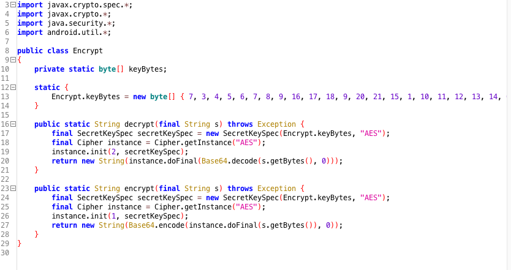

# 暗号化要件

## MSTG-CRYPTO-1
アプリは暗号化の唯一の方法としてハードコードされた鍵による対称暗号化に依存していない。

<a id="mstg-crypto-1-overview"></a>
### 問題のある暗号化構成

#### 不十分なキーの長さ

最も安全な暗号化アルゴリズムであっても、不十分なキーサイズを使用すると、ブルートフォースアタックに対して脆弱になる。<br>

キーの長さが[業界標準](https://www.enisa.europa.eu/publications/algorithms-key-size-and-parameters-report-2014)を満たしていることを確認する。なお日本国内においては[「電子政府推奨暗号リスト」掲載の暗号仕様書一覧](https://www.cryptrec.go.jp/method.html)を確認する。<br>

参考資料
* [owasp-mastg Common Configuration Issues (MSTG-CRYPTO-1, MSTG-CRYPTO-2 and MSTG-CRYPTO-3) Insufficient Key Length](https://github.com/OWASP/owasp-mastg/blob/v1.5.0/Document/0x04g-Testing-Cryptography.md#insufficient-key-length)

ルールブック
* [業界標準を満たしたキーの長さを設定する（必須）](#業界標準を満たしたキーの長さを設定する必須)

#### ハードコードされた暗号化鍵による対称暗号化

対称暗号化とキー付きハッシュ (MAC) のセキュリティは、キーの機密性に依存する。キーが公開されると、暗号化によって得られたセキュリティが失われる。これを防ぐには、作成に関与した暗号化データと同じ場所に秘密鍵を保存しないことである。よくある間違いは、静的なハードコードされた暗号化鍵を使用してローカルに保存されたデータを暗号化し、そのキーをアプリにコンパイルすることである。この場合、逆アセンブラを使用できる人であれば誰でもそのキーにアクセスできるようになる。<br>

ハードコードされた暗号化鍵とは、次のことを意味する。
* アプリケーションリソースの一部であること
* 既知の値から導出可能な値であること
* コードにハードコードされていること

まず、ソースコード内にキーやパスワードが保存されていないことを確認する。つまり、ネイティブコード、 JavaScript/Dart コード、 Java/Kotlin コードをチェックする必要がある。難読化は動的インストルメンテーションによって容易にバイパスされるため、ハードコードされたキーはソースコードが難読化されていても問題があることに注意する。<br>

アプリが双方向 TLS (サーバとクライアントの両方の証明書が検証される)を使用している場合、以下を確認する。<br>
* クライアント証明書のパスワードがローカルに保存されていない、またはデバイスの Keychain にロックされていること。
* クライアント証明書は、すべてのインストール間で共有されていないこと。

アプリが、アプリのデータ内に保存され暗号化されたコンテナに依存する場合、暗号化鍵がどのように使用されるかを確認する。キーラップ方式を使用している場合、各ユーザのマスターシークレットが初期化されていること、またはコンテナが新しいキーで再暗号化されていることを確認する。マスターシークレットや以前のパスワードを使用してコンテナを復号できる場合、パスワードの変更がどのように処理されるかを確認する。<br>

モバイルアプリで対称暗号化が使用される場合は常に秘密鍵を安全なデバイスストレージに保存する必要がある。プラットフォーム固有の API の詳細については、「 [Android のデータストレージ](https://github.com/OWASP/owasp-mastg/blob/v1.5.0/Document/0x05d-Testing-Data-Storage.md)」の章を参照する。<br>

参考資料
* [owasp-mastg Common Configuration Issues (MSTG-CRYPTO-1, MSTG-CRYPTO-2 and MSTG-CRYPTO-3) Symmetric Encryption with Hard-Coded Cryptographic Keys](https://github.com/OWASP/owasp-mastg/blob/v1.5.0/Document/0x04g-Testing-Cryptography.md#symmetric-encryption-with-hard-coded-cryptographic-keys)

ルールブック
* [ソースコード内にキーやパスワードを保存しない（必須）](#ソースコード内にキーやパスワードを保存しない必須)
* [クライアント証明書のパスワードをローカルに保存しない、またはデバイスの Keychain にロックする（必須）](#クライアント証明書のパスワードをローカルに保存しないまたはデバイスの-keychain-にロックする必須)
* [クライアント証明書はすべてのインストール間で共有しない（必須）](#クライアント証明書はすべてのインストール間で共有しない必須)
* [コンテナに依存する場合、暗号化鍵がどのように使用されるかを確認する（必須）](#コンテナに依存する場合暗号化鍵がどのように使用されるかを確認する必須)
* [モバイルアプリで対称暗号化が使用される場合は常に秘密鍵を安全なデバイスストレージに保存する（必須）](#モバイルアプリで対称暗号化が使用される場合は常に秘密鍵を安全なデバイスストレージに保存する必須)

#### 弱いキー生成関数

暗号化アルゴリズム (対称暗号化や一部の MAC など) は、特定のサイズの秘密の入力を想定している。例えば、 AES はちょうど16バイトのキーを使用する。ネイティブな実装では、ユーザが提供したパスワードを直接入力キーとして使用することがある。ユーザが提供したパスワードを入力キーとして使用する場合、以下のような問題がある。<br>

* パスワードがキーよりも小さい場合、完全なキースペースは使用されない。残りのスペースはパディングされる(パディングのためにスペースが使われることもある)。
* ユーザ提供のパスワードは、現実的には、ほとんどが表示・発音可能な文字で構成される。したがって、 256 文字ある ASCII 文字の一部だけが使われ、エントロピーはおよそ4分の1に減少する。

パスワードが暗号化関数に直接渡されないようにする。代わりに、ユーザが提供したパスワードは、暗号化鍵を作成するために KDF に渡されるべきである。パスワード導出関数を使用する場合は、適切な反復回数を選択する。例えば、 [NIST は PBKDF2 の反復回数を少なくとも 10,000 回](https://pages.nist.gov/800-63-3/sp800-63b.html#sec5)、[ユーザが感じるパフォーマンスが重要でない重要なキーの場合は少なくとも 10,000,000 回](https://nvlpubs.nist.gov/nistpubs/Legacy/SP/nistspecialpublication800-132.pdf) を推奨している。重要なキーについては、 [Argon2](https://github.com/p-h-c/phc-winner-argon2) のような [Password Hashing Competition (PHC)](https://www.password-hashing.net/) で認められたアルゴリズムの実装を検討することが推奨される。<br>

参考資料
* [owasp-mastg Common Configuration Issues (MSTG-CRYPTO-1, MSTG-CRYPTO-2 and MSTG-CRYPTO-3) Weak Key Generation Functions](https://github.com/OWASP/owasp-mastg/blob/v1.5.0/Document/0x04g-Testing-Cryptography.md#weak-key-generation-functions)

ルールブック
* [暗号化アルゴリズム (対称暗号化や一部の MAC など) を使用する場合、想定されている特定のサイズの秘密の入力を使用する（必須）](#暗号化アルゴリズム-対称暗号化や一部の-mac-など-を使用する場合想定されている特定のサイズの秘密の入力を使用する必須)
* [ユーザが提供したパスワードは、暗号鍵を作成するために KDF に渡す（必須）](#ユーザが提供したパスワードは暗号鍵を作成するために-kdf-に渡す必須)
* [パスワード導出関数を使用する場合は、適切な反復回数を選択する（必須）](#パスワード導出関数を使用する場合は適切な反復回数を選択する必須)

#### 弱い乱数ジェネレーター

決定論的なデバイスで真の乱数を生成することは基本的に不可能である。擬似乱数ジェネレーター( RNG )は、擬似乱数のストリーム(あたかもランダムに発生したかのように見える数値のストリーム)を生成することでこれを補う。生成される数値の品質は、使用するアルゴリズムの種類によって異なる。暗号化的に安全な RNG は、統計的ランダム性テストに合格した乱数を生成し、予測攻撃に対して耐性がある。(例:次に生成される数を予測することは統計的に不可能である)<br>

Mobile SDK は、十分な人工的ランダム性を持つ数値を生成する RNG アルゴリズムの標準的な実装を提供している。利用可能な API については、 Android 固有のセクションで紹介する。<br>

参考資料
* [owasp-mastg Common Configuration Issues (MSTG-CRYPTO-1, MSTG-CRYPTO-2 and MSTG-CRYPTO-3) Weak Random Number Generators](https://github.com/OWASP/owasp-mastg/blob/v1.5.0/Document/0x04g-Testing-Cryptography.md#weak-random-number-generators)

ルールブック
* [十分な人工的ランダム性を持つ数値を生成する RNG アルゴリズムの標準的な実装を確認する（必須）](#十分な人工的ランダム性を持つ数値を生成する-rng-アルゴリズムの標準的な実装を確認する必須)

#### 暗号化のカスタム実装

独自の暗号関数を開発することは、時間がかかり、困難であり、失敗する可能性が高い。その代わりに、安全性が高いと広く認められている、よく知られたアルゴリズムを使用することができる。モバイル OS は、これらのアルゴリズムを実装した標準的な暗号 API を提供している。<br>

ソースコード内で使用されているすべての暗号化方式、特に機密データに直接適用されている暗号化方式を注意深く検査する。すべての暗号化操作では、 Android 標準の暗号化 API を使用する必要がある(これらについては、プラットフォーム固有の章で詳しく説明する)。既知のプロバイダが提供する標準的なルーチンを呼び出さない暗号化操作は、厳密に検査する必要がある。標準的なアルゴリズムが変更されている場合は、細心の注意を払う必要がある。エンコーディングは暗号化と同じではないことに注意する。 XOR (排他的論理和) のようなビット操作の演算子を見つけたら、必ずさらに調査する。<br>

暗号化のすべての実装で、以下のことが常に行われていることを確認する必要がある。
* ワーカーキー ( AES/DES/Rijndael における中間鍵/派生鍵のようなもの)は、消費後またはエラー発生時にメモリから適切に削除される。
* 暗号の内部状態は、できるだけ早くメモリから削除する。

参考資料
* [owasp-mastg Common Configuration Issues (MSTG-CRYPTO-1, MSTG-CRYPTO-2 and MSTG-CRYPTO-3) Custom Implementations of Cryptography](https://github.com/OWASP/owasp-mastg/blob/v1.5.0/Document/0x04g-Testing-Cryptography.md#custom-implementations-of-cryptography)

ルールブック
* [暗号化に関するすべての実装では適切にメモリ状態を管理する（必須）](#暗号化に関するすべての実装では適切にメモリ状態を管理する必須)
* [OS が提供する業界標準の暗号 API を使用する（必須）](#os-が提供する業界標準の暗号-api-を使用する必須)


#### 不適切な AES 構成

Advanced Encryption Standard ( AES ) は、モバイルアプリにおける対称暗号化の標準として広く受け入れられている。 AES は、一連の連鎖的な数学演算に基づく反復型ブロック暗号である。 AES は入力に対して可変回数のラウンドを実行し、各ラウンドでは入力ブロック内のバイトの置換と並べ替えが行われる。各ラウンドでは、オリジナルの AES キーから派生した 128 ビットのラウンドキーが使用される。

この記事の執筆時点では、 AES に対する効率的な暗号解読攻撃は発見されていない。しかし、実装の詳細やブロック暗号モードなどの設定可能なパラメータには、エラーの余地がある。

**弱いブロック暗号モード**

ブロックベースの暗号化は、個々の入力ブロック ( 例: AES は 128 ビットブロック ) に対して実行される。平文がブロックサイズより大きい場合、平文は内部で指定された入力サイズのブロックに分割され、各ブロックに対して暗号化が実行される。ブロック暗号操作モード ( またはブロックモード ) は、前のブロックの暗号化の結果が後続のブロックに影響を与えるかどうかを決定する。

[ECB ( Electronic Codebook )](https://en.wikipedia.org/wiki/Block_cipher_mode_of_operation#Electronic_Codebook_%28ECB%29) は、入力を一定サイズのブロックに分割し、同じキーを用いて個別に暗号化する。分割された複数のブロックに同じ平文が含まれている場合、それらは同一の暗号文ブロックに暗号化されるため、データのパターンを容易に特定することができる。また、状況によっては、攻撃者が暗号化されたデータを再生することも可能である。


ECB の代わりに暗号ブロック連鎖 ( CBC ) モードが使用されていることを確認する。 CBC モードでは、平文ブロックは直前の暗号文ブロックと XOR される。これにより、ブロックに同じ情報が含まれている場合でも、暗号化された各ブロックは一意であり、ランダムであることが保証される。 CBC を HMAC と組み合わせたり、「パディングエラー」「 MAC エラー」「復号失敗」などのエラーが出ないようにすることが、パディングオラクル攻撃に対抗するために最善であることに注意してください。

暗号化されたデータを保存する場合、Galois/Counter Mode ( GCM )のような、保存データの完全性も保護するブロックモードを使用することを推奨する。後者には、このアルゴリズムが各 TLSv1.2 の実装に必須であり、したがってすべての最新のプラットフォームで利用できるという利点もある。

有効なブロックモードの詳細については、[ブロックモード選択に関する NIST のガイドライン](https://csrc.nist.gov/projects/block-cipher-techniques/bcm/modes-development)を参照する。

**予測可能な初期化ベクトル**

CBC 、 OFB 、 CFB 、 PCBC 、 GCM モードでは、暗号への初期入力として、初期化ベクトル( IV )が必要である。 IV は秘密にする必要はないが、予測可能であってはならない。暗号化されたメッセージごとにランダムで一意であり、非再現性である必要がある。 IV は暗号的に安全な乱数ジェネレーターを用いて生成されていることを確認する。 IV の詳細については、 [Crypto Fail の初期化ベクトルに関する記事](http://www.cryptofails.com/post/70059609995/crypto-noobs-1-initialization-vectors)を参照する。

コードで使用されている暗号化ライブラリに注意すること:多くのオープンソースライブラリは、悪い習慣(ハードコードされた IV の使用など)に従う可能性のあるドキュメントが提供されている。よくある間違いは、 IV 値を変更せずにサンプルコードをコピーアンドペーストすることである。

**ステートフル操作モードでの初期化ベクトル**

初期化ベクトルがカウンター( CTR と nonce の組み合わせ)であることが多い CTR モードと GCM モード を使用する場合は、 IV の使用方法が異なることに注意する。したがって、ここでは、独自のステートフルモデルを持つ予測可能な IV を使用することが、まさに必要である。 CTR では、新しいブロック操作のたびに、新しい nonce とカウンターを入力として使用する。<br>
例: 5120 ビット長の平文の場合では、 20 個のブロックがあるため、 nonce とカウンターで構成される 20 個の入力ベクトルが必要である。<br>
一方 GCM では、暗号化操作ごとに IV を 1 つだけ持ち、同じキーで繰り返さないようにする。 IV の詳細と推奨事項については、 [GCM に関する NIST の資料](https://nvlpubs.nist.gov/nistpubs/Legacy/SP/nistspecialpublication800-38d.pdf)の 8 項を参照する。

参考資料
* [owasp-mastg Common Configuration Issues (MSTG-CRYPTO-1, MSTG-CRYPTO-2 and MSTG-CRYPTO-3) Inadequate AES Configuration](https://github.com/OWASP/owasp-mastg/blob/v1.5.0/Document/0x04g-Testing-Cryptography.md#inadequate-aes-configuration)
* [owasp-mastg Common Configuration Issues (MSTG-CRYPTO-1, MSTG-CRYPTO-2 and MSTG-CRYPTO-3) Weak Block Cipher Mode](https://github.com/OWASP/owasp-mastg/blob/v1.5.0/Document/0x04g-Testing-Cryptography.md#weak-block-cipher-mode)
* [owasp-mastg Common Configuration Issues (MSTG-CRYPTO-1, MSTG-CRYPTO-2 and MSTG-CRYPTO-3) Predictable Initialization Vector](https://github.com/OWASP/owasp-mastg/blob/v1.5.0/Document/0x04g-Testing-Cryptography.md#predictable-initialization-vector)
* [owasp-mastg Common Configuration Issues (MSTG-CRYPTO-1, MSTG-CRYPTO-2 and MSTG-CRYPTO-3) Initialization Vectors in stateful operation modes](https://github.com/OWASP/owasp-mastg/blob/v1.5.0/Document/0x04g-Testing-Cryptography.md#initialization-vectors-in-stateful-operation-modes)

ルールブック
* [パディングオラクル攻撃に対抗するために、CBC を HMAC と組み合わせたりパディングエラー, MAC エラー, 復号失敗などのエラーが出ないようにする（必須）](#パディングオラクル攻撃に対抗するためにcbc-を-hmac-と組み合わせたりパディングエラー-mac-エラー-復号失敗などのエラーが出ないようにする必須)
* [暗号化されたデータを保存する場合、Galois/Counter Mode ( GCM )のような、保存データの完全性も保護するブロックモードを使用する（推奨）](#暗号化されたデータを保存する場合galoiscounter-mode--gcm-のような保存データの完全性も保護するブロックモードを使用する推奨)
* [IV は暗号的に安全な乱数ジェネレーターを用いて生成する（必須）](#iv-は暗号的に安全な乱数ジェネレーターを用いて生成する必須)
* [初期化ベクトルがカウンターであることが多い CTR モードと GCM モード を使用する場合は、 IV の使用方法が異なることに注意する（必須）](#初期化ベクトルがカウンターであることが多い-ctr-モードと-gcm-モード-を使用する場合は-iv-の使用方法が異なることに注意する必須)

#### 弱いパディングまたはブロック操作の実装によるパディングオラクル攻撃

以前は、非対称暗号を行う際のパディングメカニズムとして、 [PKCS1.5](https://www.rfc-editor.org/rfc/rfc2313) パディング(コード: PKCS1Padding) が使われていた。このメカニズムは、パディングオラクル攻撃に対して脆弱である。そのため、 [PKCS#1 v2.0](https://www.rfc-editor.org/rfc/rfc2437) (コード: OAEPwithSHA-256andMGF1Padding 、 OAEPwithSHA-224andMGF1Padding 、 OAEPwithSHA-384andMGF1Padding 、 OAEPwithSHA-512andMGF1Padding ) に取り込まれた OAEP ( Optimal Asymmetric Encryption PaddingOAEPPadding ) を使用するのが最適である。なお、 OAEP を使用した場合でも、 [Kudelskisecurity のブログ](https://research.kudelskisecurity.com/2018/04/05/breaking-rsa-oaep-with-mangers-attack/)で紹介されている Mangers 攻撃としてよく知られている問題に遭遇する可能性があることに注意する。<br>

注: PKCS #5 を使用する AES-CBC は、実装が「パディングエラー」、「 MAC エラー」、または「復号に失敗しました」などの警告を表示するため、パディングオラクル攻撃に対しても脆弱であることが示されている。例として、 [The Padding Oracle Attack](https://robertheaton.com/2013/07/29/padding-oracle-attack/) および [The CBC Padding Oracle Problem](https://eklitzke.org/the-cbc-padding-oracle-problem) を参照する。次に、平文を暗号化した後に HMAC を追加することが最善である。結局、 MAC に失敗した暗号文は復号する必要がなく、破棄することができる。<br>

参考資料
* [owasp-mastg Common Configuration Issues (MSTG-CRYPTO-1, MSTG-CRYPTO-2 and MSTG-CRYPTO-3) Padding Oracle Attacks due to Weaker Padding or Block Operation Implementations](https://github.com/OWASP/owasp-mastg/blob/v1.5.0/Document/0x04g-Testing-Cryptography.md#padding-oracle-attacks-due-to-weaker-padding-or-block-operation-implementations)

ルールブック
* [非対称暗号を行う際のパディングメカニズムとして PKCS#1 v2.0 に取り込まれた OAEP を使用する（必須）](#非対称暗号を行う際のパディングメカニズムとして-pkcs1-v20-に取り込まれた-oaep-を使用する必須)

#### ストレージおよびメモリ内のキーの扱い

メモリダンプが脅威モデルの一部である場合、キーがアクティブに使用された瞬間にキーにアクセスできる。メモリダンプには、ルートアクセス(ルート化されたデバイスやジェイルブレイクされたデバイスなど)が必要であるか、 Frida でパッチされたアプリケーション( Fridump などのツールを使用できるように)が必要である。したがって、デバイスでキーがまだ必要な場合は、次のことを考慮するのが最善である。<br>

* リモートサーバのキー: Amazon KMS や Azure Key Vault などのリモート Key Vault を使用することができる。一部のユースケースでは、アプリとリモートリソースの間にオーケストレーションレイヤーを開発することが適切なオプションとなる場合がある。例えば、 Function as a Service ( FaaS ) システム ( AWS Lambda や Google Cloud Functions など ) 上で動作するサーバレス関数が、 API キーやシークレットを取得するためのリクエストを転送するような場合である。その他の選択肢として、 Amazon Cognito 、 Google Identity Platform 、 Azure Active Directory なども存在する。
* ハードウェアで保護された安全なストレージ内のキー:すべての暗号化アクションとキー自体が信頼できる実行環境(例: [Android Keystore](https://developer.android.com/training/articles/keystore)を使用 )  にあることを確認する。詳細については、 [Android Data Storage](https://github.com/OWASP/owasp-mastg/blob/v1.5.0/Document/0x05d-Testing-Data-Storage.md#storing-keys-using-hardware-backed-android-keystore) の章を参照する。
* エンベロープ暗号化によって保護されたキー:キーが TEE/SE の外部に保存されている場合は、 multi-layered 暗号化の使用を検討する。エンベロープ暗号化アプローチ ([OWASP Cryptographic Storage Cheat Sheet](https://cheatsheetseries.owasp.org/cheatsheets/Cryptographic_Storage_Cheat_Sheet.html#encrypting-stored-keys)、 [Google Cloud Key management guide](https://cloud.google.com/kms/docs/envelope-encryption?hl=en)、 [AWS Well-Architected Framework guide](https://docs.aws.amazon.com/wellarchitected/latest/financial-services-industry-lens/use-envelope-encryption-with-customer-master-keys.html) 参照)、またはデータ暗号化鍵をキー暗号化する [HPKE アプローチ](https://datatracker.ietf.org/doc/html/draft-irtf-cfrg-hpke-08)を使用する。
* メモリ内のキー:キーができるだけ短時間しかメモリに残さないようにし、暗号化操作に成功した後やエラー時にキーをゼロにし、無効化することを考慮する。一般的な暗号化のガイドラインについては、[機密データのメモリの消去](https://github.com/veorq/cryptocoding#clean-memory-of-secret-data/)を参照する。より詳細な情報については、[「機密データのメモリのテスト」](https://github.com/OWASP/owasp-mastg/blob/v1.5.0/Document/0x05d-Testing-Data-Storage.md#testing-memory-for-sensitive-data-mstg-storage-10) を参照する。


注: メモリダンプが容易になるため、署名の検証や暗号化に使用される公開鍵以外は、アカウントやデバイス間で同じキーを共有しない。

参考資料
* [owasp-mastg Common Configuration Issues (MSTG-CRYPTO-1, MSTG-CRYPTO-2 and MSTG-CRYPTO-3) Protecting Keys in Storage and in Memory](https://github.com/OWASP/owasp-mastg/blob/v1.5.0/Document/0x04g-Testing-Cryptography.md#protecting-keys-in-storage-and-in-memory)

ルールブック
* [メモリダンプを考慮してキーを使用する（必須）](#メモリダンプを考慮してキーを使用する必須)
* [アカウントやデバイス間で同じキーを共有しない（必須）](#アカウントやデバイス間で同じキーを共有しない必須)

#### 転送時のキーの扱い

キーをデバイス間で、またはアプリからバックエンドに転送する必要がある場合、トランスポート対称鍵や他のメカニズムによって、適切なキー保護が行われていることを確認する。多くの場合、キーは難読化された状態で共有されるため、簡単に元に戻すことができる。代わりに、非対称暗号化またはラッピングキーが使用されていることを確認する。
例えば、対称鍵は非対称鍵の公開鍵で暗号化することができる。<br>

参考資料
* [owasp-mastg Common Configuration Issues (MSTG-CRYPTO-1, MSTG-CRYPTO-2 and MSTG-CRYPTO-3) Protecting Keys in Transport](https://github.com/OWASP/owasp-mastg/blob/v1.5.0/Document/0x04g-Testing-Cryptography.md#protecting-keys-in-transport)

ルールブック
* [トランスポート対称鍵や他のメカニズムによって、適切なキー保護を行う（必須）](#トランスポート対称鍵や他のメカニズムによって適切なキー保護を行う必須)


### ハードコードされた対称暗号化

このテストケースでは、暗号化の唯一の方法として、ハードコードされた対称暗号化に焦点を当てている。以下のチェックを行う必要がある。<br>
* 対称暗号化のすべてのインスタンスを識別する
* 識別されたインスタンスごとに、ハードコードされた対称鍵があるかどうかを確認する。
* ハードコードされた対称暗号化が暗号化の唯一の方法として使用されていないかどうかを確認する。

参考資料
* [owasp-mastg Testing Symmetric Cryptography (MSTG-CRYPTO-1) Overview](https://github.com/OWASP/owasp-mastg/blob/v1.5.0/Document/0x05e-Testing-Cryptography.md#overview)

ルールブック
* [ハードコードされた対称暗号化を暗号化の唯一の方法として使用しない（必須）](#ハードコードされた対称暗号化を暗号化の唯一の方法として使用しない必須)

#### 静的解析

コード内の対称鍵暗号化のすべてのインスタンスを識別し、対称鍵をロードまたは提供するメカニズムを探す。<br>
* 対称アルゴリズム ( DES 、 AES など)。
* キージェネレーターの仕様 (KeyGenParameterSpec 、KeyPairGeneratorSpec 、KeyPairGenerator 、KeyGenerator 、KeyProperties など)
* java.security.\* 、 javax.crypto.\* 、 android.security.\* 、 android.security.keystore.\* をインポートしているクラス。

識別されたインスタンスごとに、使用されている対称鍵が以下であるかどうか確認する。<br>
* アプリケーションリソースの一部でないか
* 既知の値から導き出すことができないか
* コードにハードコードされていないか

ハードコードされた各対称鍵について、セキュリティ上重要なコンテキストで、唯一の暗号化方法として使用されていないことを確認する。<br>

例として、ハードコードされた暗号化鍵の使用状況を確認する方法を示す。最初にアプリを[逆アセンブルおよび逆コンパイル](https://github.com/OWASP/owasp-mastg/blob/v1.5.0/Document/0x05c-Reverse-Engineering-and-Tampering.md#disassembling-and-decompiling)して、 [jadx](https://github.com/OWASP/owasp-mastg/blob/v1.5.0/Document/0x08a-Testing-Tools.md#jadx) などを使用して Java コードを取得する。<br>

SecretKeySpec クラスが使われているファイルを、再帰的に grep するか、 jadx の検索機能を使って検索する。<br>
```bash
grep -r "SecretKeySpec"
```

これにより、SecretKeySpec クラスを使用しているすべてのクラスが返される。これらのファイルを調べて、キー マテリアルを渡すためにどの変数が使用されているかを追跡する。下図は、実稼働中のアプリケーションでこの評価を行った結果である。ハードコードされ、静的バイト配列 Encrypt.keyBytes で初期化された静的暗号化鍵の使用を明確に特定できる。


参考資料
* [owasp-mastg Testing Symmetric Cryptography (MSTG-CRYPTO-1) Static Analysis](https://github.com/OWASP/owasp-mastg/blob/v1.5.0/Document/0x05e-Testing-Cryptography.md#static-analysis)

<a id="mstg-crypto-1-dynamic-analysis"></a>

#### 動的解析

暗号化メソッドの[メソッドトレース](https://github.com/OWASP/owasp-mastg/blob/v1.5.0/Document/0x05c-Reverse-Engineering-and-Tampering.md#method-tracing)により、使用されているキーなどの入出力値を把握することができる。暗号化操作の実行中にファイルシステムアクセスを監視して、キーマテリアルの書き込み先または読み取り元を評価する。例えば、[RMS - Runtime Mobile Security](https://github.com/OWASP/owasp-mastg/blob/v1.5.0/Document/0x08a-Testing-Tools.md#RMS-Runtime-Mobile-Security) の [API モニター](https://github.com/m0bilesecurity/RMS-Runtime-Mobile-Security#8-api-monitor---android-only)を使用して、ファイルシステムを監視することができる。<br>

参考資料
* [owasp-mastg Testing Symmetric Cryptography (MSTG-CRYPTO-1) Dynamic Analysis](https://github.com/OWASP/owasp-mastg/blob/v1.5.0/Document/0x05e-Testing-Cryptography.md#dynamic-analysis)

ルールブック
* [暗号化メソッドのメソッドトレースを実施し、キーマテリアルの書き込み先または読み取り元を確認する（必須）](#暗号化メソッドのメソッドトレースを実施しキーマテリアルの書き込み先または読み取り元を確認する必須)

### ルールブック
- [暗号化要件](#暗号化要件)
  - [MSTG-CRYPTO-1](#mstg-crypto-1)
    - [問題のある暗号化構成](#問題のある暗号化構成)
      - [不十分なキーの長さ](#不十分なキーの長さ)
      - [ハードコードされた暗号化鍵による対称暗号化](#ハードコードされた暗号化鍵による対称暗号化)
      - [弱いキー生成関数](#弱いキー生成関数)
      - [弱い乱数ジェネレーター](#弱い乱数ジェネレーター)
      - [暗号化のカスタム実装](#暗号化のカスタム実装)
      - [不適切な AES 構成](#不適切な-aes-構成)
      - [弱いパディングまたはブロック操作の実装によるパディングオラクル攻撃](#弱いパディングまたはブロック操作の実装によるパディングオラクル攻撃)
      - [ストレージおよびメモリ内のキーの扱い](#ストレージおよびメモリ内のキーの扱い)
      - [転送時のキーの扱い](#転送時のキーの扱い)
    - [ハードコードされた対称暗号化](#ハードコードされた対称暗号化)
      - [静的解析](#静的解析)
      - [動的解析](#動的解析)
    - [ルールブック](#ルールブック)
      - [業界標準を満たしたキーの長さを設定する（必須）](#業界標準を満たしたキーの長さを設定する必須)
      - [ソースコード内にキーやパスワードを保存しない（必須）](#ソースコード内にキーやパスワードを保存しない必須)
      - [クライアント証明書のパスワードをローカルに保存しない、またはデバイスの Keychain にロックする（必須）](#クライアント証明書のパスワードをローカルに保存しないまたはデバイスの-keychain-にロックする必須)
      - [クライアント証明書はすべてのインストール間で共有しない（必須）](#クライアント証明書はすべてのインストール間で共有しない必須)
      - [コンテナに依存する場合、暗号化鍵がどのように使用されるかを確認する（必須）](#コンテナに依存する場合暗号化鍵がどのように使用されるかを確認する必須)
      - [モバイルアプリで対称暗号化が使用される場合は常に秘密鍵を安全なデバイスストレージに保存する（必須）](#モバイルアプリで対称暗号化が使用される場合は常に秘密鍵を安全なデバイスストレージに保存する必須)
      - [暗号化アルゴリズム (対称暗号化や一部の MAC など) を使用する場合、想定されている特定のサイズの秘密の入力を使用する（必須）](#暗号化アルゴリズム-対称暗号化や一部の-mac-など-を使用する場合想定されている特定のサイズの秘密の入力を使用する必須)
      - [ユーザが提供したパスワードは、暗号鍵を作成するために KDF に渡す（必須）](#ユーザが提供したパスワードは暗号鍵を作成するために-kdf-に渡す必須)
      - [パスワード導出関数を使用する場合は、適切な反復回数を選択する（必須）](#パスワード導出関数を使用する場合は適切な反復回数を選択する必須)
      - [十分な人工的ランダム性を持つ数値を生成する RNG アルゴリズムの標準的な実装を確認する（必須）](#十分な人工的ランダム性を持つ数値を生成する-rng-アルゴリズムの標準的な実装を確認する必須)
      - [暗号化に関するすべての実装では適切にメモリ状態を管理する（必須）](#暗号化に関するすべての実装では適切にメモリ状態を管理する必須)
      - [OS が提供する業界標準の暗号 API を使用する（必須）](#os-が提供する業界標準の暗号-api-を使用する必須)
      - [パディングオラクル攻撃に対抗するために、CBC を HMAC と組み合わせたりパディングエラー, MAC エラー, 復号失敗などのエラーが出ないようにする（必須）](#パディングオラクル攻撃に対抗するためにcbc-を-hmac-と組み合わせたりパディングエラー-mac-エラー-復号失敗などのエラーが出ないようにする必須)
      - [暗号化されたデータを保存する場合、Galois/Counter Mode ( GCM )のような、保存データの完全性も保護するブロックモードを使用する（推奨）](#暗号化されたデータを保存する場合galoiscounter-mode--gcm-のような保存データの完全性も保護するブロックモードを使用する推奨)
      - [IV は暗号的に安全な乱数ジェネレーターを用いて生成する（必須）](#iv-は暗号的に安全な乱数ジェネレーターを用いて生成する必須)
      - [初期化ベクトルがカウンターであることが多い CTR モードと GCM モード を使用する場合は、 IV の使用方法が異なることに注意する（必須）](#初期化ベクトルがカウンターであることが多い-ctr-モードと-gcm-モード-を使用する場合は-iv-の使用方法が異なることに注意する必須)
      - [非対称暗号を行う際のパディングメカニズムとして PKCS#1 v2.0 に取り込まれた OAEP を使用する（必須）](#非対称暗号を行う際のパディングメカニズムとして-pkcs1-v20-に取り込まれた-oaep-を使用する必須)
      - [メモリダンプを考慮してキーを使用する（必須）](#メモリダンプを考慮してキーを使用する必須)
      - [アカウントやデバイス間で同じキーを共有しない（必須）](#アカウントやデバイス間で同じキーを共有しない必須)
      - [トランスポート対称鍵や他のメカニズムによって、適切なキー保護を行う（必須）](#トランスポート対称鍵や他のメカニズムによって適切なキー保護を行う必須)
      - [ハードコードされた対称暗号化を暗号化の唯一の方法として使用しない（必須）](#ハードコードされた対称暗号化を暗号化の唯一の方法として使用しない必須)
      - [暗号化メソッドのメソッドトレースを実施し、キーマテリアルの書き込み先または読み取り元を確認する（必須）](#暗号化メソッドのメソッドトレースを実施しキーマテリアルの書き込み先または読み取り元を確認する必須)
  - [MSTG-CRYPTO-2](#mstg-crypto-2)
    - [問題のある暗号化構成](#問題のある暗号化構成-1)
    - [暗号化標準アルゴリズムの構成](#暗号化標準アルゴリズムの構成)
      - [静的解析](#静的解析-1)
      - [動的解析](#動的解析-1)
    - [ルールブック](#ルールブック-1)
      - [適切な暗号化標準アルゴリズムの構成（必須）](#適切な暗号化標準アルゴリズムの構成必須)
      - [getInstance のすべての呼び出しで、セキュリティサービスのプロバイダを指定していないことを確認する（必須）](#getinstance-のすべての呼び出しでセキュリティサービスのプロバイダを指定していないことを確認する必須)
  - [MSTG-CRYPTO-3](#mstg-crypto-3)
    - [問題のある暗号化構成](#問題のある暗号化構成-2)
    - [暗号化標準アルゴリズムの構成](#暗号化標準アルゴリズムの構成-1)
  - [MSTG-CRYPTO-4](#mstg-crypto-4)
    - [セキュアでない、または非推奨な暗号化アルゴリズム](#セキュアでないまたは非推奨な暗号化アルゴリズム)
    - [暗号化標準アルゴリズムの構成](#暗号化標準アルゴリズムの構成-2)
    - [ルールブック](#ルールブック-2)
      - [セキュアでない、または非推奨な暗号化アルゴリズムは使用しない（必須）](#セキュアでないまたは非推奨な暗号化アルゴリズムは使用しない必須)
  - [MSTG-CRYPTO-5](#mstg-crypto-5)
    - [暗号化鍵の利用目的と再利用の検証](#暗号化鍵の利用目的と再利用の検証)
      - [静的解析](#静的解析-2)
      - [動的解析](#動的解析-2)
    - [ルールブック](#ルールブック-3)
      - [目的に応じた暗号化を使用する（必須）](#目的に応じた暗号化を使用する必須)
  - [MSTG-CRYPTO-6](#mstg-crypto-6)
    - [乱数ジェネレーターの選択](#乱数ジェネレーターの選択)
      - [セキュアな乱数ジェネレーター](#セキュアな乱数ジェネレーター)
      - [セキュアでない乱数ジェネレーター](#セキュアでない乱数ジェネレーター)
    - [ルールブック](#ルールブック-4)
      - [セキュアな乱数ジェネレーターと設定を使用する（必須）](#セキュアな乱数ジェネレーターと設定を使用する必須)

#### 業界標準を満たしたキーの長さを設定する（必須）

キーの長さが[業界標準](https://www.enisa.europa.eu/publications/algorithms-key-size-and-parameters-report-2014)を満たしていることを確認する。なお日本国内においては[「電子政府推奨暗号リスト」掲載の暗号仕様書一覧](https://www.cryptrec.go.jp/method.html)を確認する。<br>
最も安全な暗号化アルゴリズムであっても、不十分なキーサイズを使用すると、ブルートフォースアタックに対して脆弱になる。

※概念的なルールのため、サンプルコードはなし。

これに違反する場合、以下の可能性がある。
* ブルートフォースアタックに対して脆弱になる。

#### ソースコード内にキーやパスワードを保存しない（必須）

難読化は動的インストルメンテーションによって容易にバイパスされるため、ハードコードされたキーはソースコードが難読化されていても問題がある。そのため、ソースコード（ネイティブコード、 JavaScript/Dart コード、 Java/Kotlin コード）内にキーやパスワードを保存しない。

※非推奨なルールのため、サンプルコードはなし。

これに違反する場合、以下の可能性がある。
* キーやパスワードが漏洩する。

#### クライアント証明書のパスワードをローカルに保存しない、またはデバイスの Keychain にロックする（必須）

アプリが双方向 TLS (サーバとクライアントの両方の証明書が検証される)を使用している場合、クライアント証明書のパスワードをローカルに保存しない。またはデバイスの Keychain にロックする。

サンプルコードは以下ルールブックを参照。

ルールブック
* [Keychain に初めてインポートする場合、ユーザへ証明書ストレージを保護するためにロック画面の PIN またはパスワードを設定するよう促す（必須）](0x03-MASDG-Data_Storage_and_Privacy_Requirements.md#keychain-に初めてインポートする場合ユーザへ証明書ストレージを保護するためにロック画面の-pin-またはパスワードを設定するよう促す必須)
* [Android のネイティブなメカニズムが機密情報を特定するかどうかを判断する（必須）](0x03-MASDG-Data_Storage_and_Privacy_Requirements.md#android-のネイティブなメカニズムが機密情報を特定するかどうかを判断する必須)

これに違反する場合、以下の可能性がある。
* パスワードが第三者に読み取られ悪用される。

#### クライアント証明書はすべてのインストール間で共有しない（必須）

アプリが双方向 TLS (サーバとクライアントの両方の証明書が検証される)を使用している場合、クライアント証明書はすべてのインストール間で共有しない。

※非推奨なルールのため、サンプルコードはなし。

これに違反する場合、以下の可能性がある。
* パスワードが他アプリに読み取られ悪用される。

#### コンテナに依存する場合、暗号化鍵がどのように使用されるかを確認する（必須）

アプリが、アプリのデータ内に保存された暗号化されたコンテナに依存する場合、暗号化鍵がどのように使用されるかを確認する。

**キーラップ方式を使用している場合**

以下について確認する。
* 各ユーザのマスターシークレットが初期化されていること
* コンテナが新しいキーで再暗号化されていること

**マスターシークレットや以前のパスワードを使用してコンテナを復号できる場合**

パスワードの変更がどのように処理されるかを確認する。

※概念的なルールのため、サンプルコードはなし。

これに違反する場合、以下の可能性がある。
* パスワードやマスターシークレットが意図した目的以外で使用される。

#### モバイルアプリで対称暗号化が使用される場合は常に秘密鍵を安全なデバイスストレージに保存する（必須）

モバイルアプリで対称暗号化が使用される場合は常に秘密鍵を安全なデバイスストレージに保存する必要がある。<br>
Android プラットフォームでの秘密鍵の保存方法については、「[暗号化キーの保存](0x03-MASDG-Data_Storage_and_Privacy_Requirements.md#暗号化キーの保存)」を参照。

ルールブック
* [暗号化キーの保存方法（必須）](0x03-MASDG-Data_Storage_and_Privacy_Requirements.md#暗号化キーの保存方法必須)

これに違反する場合、以下の可能性がある。
* 秘密鍵が他アプリや第三者に読み取られる。

#### 暗号化アルゴリズム (対称暗号化や一部の MAC など) を使用する場合、想定されている特定のサイズの秘密の入力を使用する（必須）

暗号化アルゴリズム (対称暗号化や一部の MAC など) を使用する場合、想定されている特定のサイズの秘密の入力を使用する必要がある。例えば、 AES はちょうど16バイトのキーを使用する。

ネイティブな実装では、ユーザが提供したパスワードを直接入力キーとして使用することがある。ユーザが提供したパスワードを入力キーとして使用する場合、以下のような問題がある。<br>

* パスワードがキーよりも小さい場合、完全なキースペースは使用されない。残りのスペースはパディングされる(パディングのためにスペースが使われることもある)。
* ユーザ提供のパスワードは、現実的には、ほとんどが表示・発音可能な文字で構成される。したがって、 256 文字ある ASCII 文字の一部だけが使われ、エントロピーはおよそ4分の1に減少する。

※概念的なルールのため、サンプルコードはなし。

これに違反する場合、以下の可能性がある。
* 脆弱なキーが生成される。

#### ユーザが提供したパスワードは、暗号鍵を作成するために KDF に渡す（必須）
暗号化関数を使用する場合、ユーザが提供したパスワードは、暗号鍵を作成するために KDF に渡されるべきである。
パスワードが暗号化関数に直接渡されないようにする。代わりに、ユーザが提供したパスワードは、暗号化鍵を作成するために KDF に渡されるべきである。パスワード導出関数を使用する場合は、適切な反復回数を選択する。

※概念的なルールのため、サンプルコードはなし。

これに違反する場合、以下の可能性がある。
* パスワードがキーよりも小さい場合、完全なキースペースは使用されない。残りのスペースはパディングされる。
* エントロピーがおよそ4分の1に減少する。

#### パスワード導出関数を使用する場合は、適切な反復回数を選択する（必須）

パスワード導出関数を使用する場合は、適切な反復回数を選択する必要がある。例えば、 [NIST は PBKDF2 の反復回数を少なくとも 10,000 回](https://pages.nist.gov/800-63-3/sp800-63b.html#sec5)、[ユーザが感じるパフォーマンスが重要でない重要なキーの場合は少なくとも 10,000,000 回](https://nvlpubs.nist.gov/nistpubs/Legacy/SP/nistspecialpublication800-132.pdf) を推奨している。重要なキーについては、 [Argon2](https://github.com/p-h-c/phc-winner-argon2) のような [Password Hashing Competition (PHC)](https://www.password-hashing.net/) で認められたアルゴリズムの実装を検討することが推奨される。

※サーバ側のルールのため、サンプルコードはなし。

これに違反する場合、以下の可能性がある。
* 脆弱なキーが生成される。

#### 十分な人工的ランダム性を持つ数値を生成する RNG アルゴリズムの標準的な実装を確認する（必須）
暗号化的に安全な RNG は、統計的ランダム性テストに合格した乱数を生成し、予測攻撃に対して耐性がある。
安全な水準に満たない RNG アルゴリズムにより生成された乱数を使用すると、予測攻撃が成功する可能性が高まる。
そのため、十分な人工的ランダム性を持つ数値を生成する RNG アルゴリズムを使用する必要がある。

Android 標準で安全性の高い乱数を生成する API については以下を参照する。

ルールブック
* [セキュアな乱数ジェネレーターと設定を使用する（必須）](#セキュアな乱数ジェネレーターと設定を使用する必須)

これに違反する場合、以下の可能性がある。
* 予測攻撃が成功する可能性が高まる。

#### 暗号化に関するすべての実装では適切にメモリ状態を管理する（必須）

暗号化に関するすべての実装では、ワーカーキー ( AES/DES/Rijndael における中間鍵/派生鍵のようなもの)が消費後またはエラー発生時にメモリから適切に削除する必要がある。また暗号の内部状態も、できるだけ早くメモリから削除する必要がある。

AES実装と実行後の解放:
```Kotlin
package com.co.exsample.services

import java.security.SecureRandom
import javax.crypto.Cipher
import javax.crypto.SecretKey
import javax.crypto.spec.GCMParameterSpec
import javax.crypto.spec.SecretKeySpec

class AesGcmCipher {
    private val GCM_CIPHER_MODE = "AES/GCM/NoPadding" // Cipher mode (AEC GCM mode)
    private val GCM_NONCE_LENGTH = 12 // Nonce length

    private var key: SecretKey?
    private val tagBitLen: Int = 128
    private var aad: ByteArray?
    private val random = SecureRandom()

    constructor(key: ByteArray) {

        this.key = SecretKeySpec(key, "AES")

    }

    fun destroy() {
        // release
        this.key = null
    }

    fun encrypt(plainData: ByteArray): ByteArray {

        val cipher = generateCipher(Cipher.ENCRYPT_MODE)
        val encryptData = cipher.doFinal(plainData)

        // Return nonce + Encrypt Data
        return cipher.iv + encryptData
    }

    fun decrypt(cipherData: ByteArray): ByteArray {
        val nonce = cipherData.copyOfRange(0, GCM_NONCE_LENGTH)
        val encryptData = cipherData.copyOfRange(GCM_NONCE_LENGTH, cipherData.size)

        val cipher = generateCipher(Cipher.DECRYPT_MODE, nonce)

        // Perform Decryption
        return cipher.doFinal(encryptData)
    }

    private fun generateCipher(mode: Int, nonceToDecrypt: ByteArray? = null): Cipher {

        val cipher = Cipher.getInstance(GCM_CIPHER_MODE)

        // Get nonce
        val nonce = when (mode) {
            Cipher.ENCRYPT_MODE -> {
                // Generate nonce
                val nonceToEncrypt = ByteArray(GCM_NONCE_LENGTH)
                random.nextBytes(nonceToEncrypt)
                nonceToEncrypt
            }
            Cipher.DECRYPT_MODE -> {
                nonceToDecrypt ?: throw IllegalArgumentException()
            }
            else -> throw IllegalArgumentException()
        }

        // Create GCMParameterSpec
        val gcmParameterSpec = GCMParameterSpec(tagBitLen, nonce)

        cipher.init(mode, key, gcmParameterSpec)
        aad?.let {

            cipher.updateAAD(it)
        }

        return cipher
    }

    fun execute(text: String, keyBase64: String) {
        
        val key = Base64.getDecoder().decode(keyBase64) 
        val cipher = AesGcmCipher(key) 
        
        // encrypt
        val encryptData = cipher.encrypt(text.toByteArray())
        
        // decrypt
        val decryptData = cipher.decrypt(encryptData)
        
        // release
        cipher.destroy()
    }
}
```

ルールブック
* [キーマテリアルは、不要になったらすぐにメモリから消去する必要がある（必須）](0x03-MASDG-Data_Storage_and_Privacy_Requirements.md#キーマテリアルは不要になったらすぐにメモリから消去する必要がある必須)

これに違反する場合、以下の可能性がある。
* メモリに残された暗号化情報を意図しない処理で利用される。

#### OS が提供する業界標準の暗号 API を使用する（必須）
独自の暗号関数を開発することは、時間がかかり、困難であり、失敗する可能性が高い。その代わりに、安全性が高いと広く認められている、よく知られたアルゴリズムを使用することができる。モバイル OS は、これらのアルゴリズムを実装した標準的な暗号 API を提供しているため、安全な暗号化のためにはこちらを利用する必要がある。

Android では Android KeyStore による暗号化が推奨されている。サンプルコードについては、以下のルールブックを参照。

データストレージとプライバシー要件ルールブック
* [暗号化キーの保存方法（必須）](0x03-MASDG-Data_Storage_and_Privacy_Requirements.md#暗号化キーの保存方法必須)

これに違反する場合、以下の可能性がある。
* 脆弱性を含む実装となる可能性がある。

#### パディングオラクル攻撃に対抗するために、CBC を HMAC と組み合わせたりパディングエラー, MAC エラー, 復号失敗などのエラーが出ないようにする（必須）

CBC モードでは、平文ブロックは直前の暗号文ブロックと XOR される。これにより、ブロックに同じ情報が含まれている場合でも、暗号化された各ブロックは一意であり、ランダムであることが保証される。 

CBCモード実装の例:
```Kotlin
package com.co.exsample.services

import javax.crypto.Cipher
import javax.crypto.KeyGenerator
import javax.crypto.SecretKey

class CBCCipher {

    fun encrypt(text: String): Pair<ByteArray, ByteArray>{
        val plaintext: ByteArray = text.encodeToByteArray()
        val keygen = KeyGenerator.getInstance("AES")
        keygen.init(256)
        val key: SecretKey = keygen.generateKey()
        val cipher = Cipher.getInstance("AES/CBC/PKCS5PADDING")
        cipher.init(Cipher.ENCRYPT_MODE, key)
        val ciphertextBuffer: ByteArray = cipher.doFinal(plaintext)
        val iv: ByteArray = cipher.iv

        return Pair(ciphertextBuffer, iv)
    }
}
```

これに違反する場合、以下の可能性がある。
* パディングオラクル攻撃に対して脆弱になる。

#### 暗号化されたデータを保存する場合、Galois/Counter Mode ( GCM )のような、保存データの完全性も保護するブロックモードを使用する（推奨）

暗号化されたデータを保存する場合、Galois/Counter Mode ( GCM )のような、保存データの完全性も保護するブロックモードを使用することを推奨する。後者には、このアルゴリズムが各 TLSv1.2 の実装に必須であり、したがってすべての最新のプラットフォームで利用できるという利点もある。

GCMモード実装の例:
```Kotlin
package com.co.exsample.services

import java.security.SecureRandom
import javax.crypto.Cipher
import javax.crypto.SecretKey
import javax.crypto.spec.GCMParameterSpec
import javax.crypto.spec.SecretKeySpec

class AesGcmCipher {
    private val GCM_CIPHER_MODE = "AES/GCM/NoPadding" // Cipher mode (AEC GCM mode)
    private val GCM_NONCE_LENGTH = 12 // Nonce length

    private var key: SecretKey?
    private val tagBitLen: Int = 128
    private var aad: ByteArray?
    private val random = SecureRandom()

    constructor(key: ByteArray) {

        this.key = SecretKeySpec(key, "AES")

    }

    fun destroy() {
        // release
        this.key = null
    }

    fun encrypt(plainData: ByteArray): ByteArray {

        val cipher = generateCipher(Cipher.ENCRYPT_MODE)
        val encryptData = cipher.doFinal(plainData)

        // Return nonce + Encrypt Data
        return cipher.iv + encryptData
    }

    fun decrypt(cipherData: ByteArray): ByteArray {
        val nonce = cipherData.copyOfRange(0, GCM_NONCE_LENGTH)
        val encryptData = cipherData.copyOfRange(GCM_NONCE_LENGTH, cipherData.size)

        val cipher = generateCipher(Cipher.DECRYPT_MODE, nonce)

        // Perform Decryption
        return cipher.doFinal(encryptData)
    }

    private fun generateCipher(mode: Int, nonceToDecrypt: ByteArray? = null): Cipher {

        val cipher = Cipher.getInstance(GCM_CIPHER_MODE)

        // Get nonce
        val nonce = when (mode) {
            Cipher.ENCRYPT_MODE -> {
                // Generate nonce
                val nonceToEncrypt = ByteArray(GCM_NONCE_LENGTH)
                random.nextBytes(nonceToEncrypt)
                nonceToEncrypt
            }
            Cipher.DECRYPT_MODE -> {
                nonceToDecrypt ?: throw IllegalArgumentException()
            }
            else -> throw IllegalArgumentException()
        }

        // Create GCMParameterSpec
        val gcmParameterSpec = GCMParameterSpec(tagBitLen, nonce)

        cipher.init(mode, key, gcmParameterSpec)
        aad?.let {

            cipher.updateAAD(it)
        }

        return cipher
    }

}
```

これに違反する場合、以下の可能性がある。
* データのパターンを容易に特定される。

#### IV は暗号的に安全な乱数ジェネレーターを用いて生成する（必須）

CBC 、 OFB 、 CFB 、 PCBC 、 GCM モードでは、暗号への初期入力として、初期化ベクトル( IV )が必要である。 IV は秘密にする必要はないが、予測可能であってはならない。暗号化されたメッセージごとにランダムで一意であり、非再現性である必要がある。そのため、 IV は暗号的に安全な乱数ジェネレーターを用いて生成する必要がある。 IV の詳細については、 [Crypto Fail の初期化ベクトルに関する記事](http://www.cryptofails.com/post/70059609995/crypto-noobs-1-initialization-vectors)を参照する。

サンプルコードは以下ルールブックを参照。

ルールブック
* [セキュアな乱数ジェネレーターと設定を使用する（必須）](#セキュアな乱数ジェネレーターと設定を使用する必須)

これに違反する場合、以下の可能性がある。
* 予測可能な初期化ベクトルが生成される。

#### 初期化ベクトルがカウンターであることが多い CTR モードと GCM モード を使用する場合は、 IV の使用方法が異なることに注意する（必須）

初期化ベクトルがカウンター( CTR と nonce の組み合わせ)であることが多い CTR モードと GCM モード を使用する場合は、 IV の使用方法が異なることに注意する。そのため、独自のステートフルモデルを持つ予測可能な IV を使用することが必要である。<br>
CTR では、新しいブロック操作のたびに、新しい nonce とカウンターを入力として使用する。<br>
例: 5120 ビット長の平文の場合では、 20 個のブロックがあるため、 nonce とカウンターで構成される 20 個の入力ベクトルが必要である。<br>
一方 GCM では、暗号化操作ごとに IV を 1 つだけ持ち、同じキーで繰り返さないようにする。 IV の詳細と推奨事項については、 [GCM に関する NIST の資料](https://nvlpubs.nist.gov/nistpubs/Legacy/SP/nistspecialpublication800-38d.pdf)の 8 項を参照する。

※概念的なルールのため、サンプルコードはなし。

これに違反する場合、以下の可能性がある。
* 各モードで必要とされる初期化ベクトルの要件を満たせない。

#### 非対称暗号を行う際のパディングメカニズムとして PKCS#1 v2.0 に取り込まれた OAEP を使用する（必須）

以前は、非対称暗号を行う際のパディングメカニズムとして、 [PKCS1.5](https://www.rfc-editor.org/rfc/rfc2313) パディング(コード: PKCS1Padding) が使われていた。このメカニズムは、パディングオラクル攻撃に対して脆弱である。そのため、 [PKCS#1 v2.0](https://www.rfc-editor.org/rfc/rfc2437) (コード: OAEPwithSHA-256andMGF1Padding 、 OAEPwithSHA-224andMGF1Padding 、 OAEPwithSHA-384andMGF1Padding 、 OAEPwithSHA-512andMGF1Padding ) に取り込まれた OAEP ( Optimal Asymmetric Encryption PaddingOAEPPadding ) を使用するのが最適である。なお、 OAEP を使用した場合でも、 [Kudelskisecurity のブログ](https://research.kudelskisecurity.com/2018/04/05/breaking-rsa-oaep-with-mangers-attack/)で紹介されている Mangers 攻撃としてよく知られている問題に遭遇する可能性があることに注意する。

以下のサンプルコードは、 OAEP の使用方法である。
```Kotlin
val key: Key = ...
val cipher = Cipher.getInstance("RSA/ECB/OAEPPadding")
        .apply {
            // To use SHA-256 the main digest and SHA-1 as the MGF1 digest
            init(Cipher.ENCRYPT_MODE, key, OAEPParameterSpec("SHA-256", "MGF1", MGF1ParameterSpec.SHA1, PSource.PSpecified.DEFAULT))
            // To use SHA-256 for both digests
            init(Cipher.ENCRYPT_MODE, key, OAEPParameterSpec("SHA-256", "MGF1", MGF1ParameterSpec.SHA256, PSource.PSpecified.DEFAULT))
        }
```

これに違反する場合、以下の可能性がある。
* パディングオラクル攻撃に対して脆弱になる。

#### メモリダンプを考慮してキーを使用する（必須）

メモリダンプが脅威モデルの一部である場合、キーがアクティブに使用された瞬間にキーにアクセスできる。メモリダンプには、ルートアクセス(ルート化されたデバイスやジェイルブレイクされたデバイスなど)が必要であるか、 Frida でパッチされたアプリケーション( Fridump などのツールを使用できるように)が必要である。したがって、デバイスでキーがまだ必要な場合は、次のことを考慮するのが最善である。
* リモートサーバのキー: Amazon KMS や Azure Key Vault などのリモート Key Vault を使用することができる。一部のユースケースでは、アプリとリモートリソースの間にオーケストレーションレイヤーを開発することが適切なオプションとなる場合がある。
* ハードウェアで保護された安全なストレージ内のキー:すべての暗号化アクションとキー自体が信頼できる実行環境(例: [Android Keystore](https://developer.android.com/training/articles/keystore)を使用 )  にあることを確認する。詳細については、 [Android Data Storage](https://github.com/OWASP/owasp-mastg/blob/master/Document/0x05d-Testing-Data-Storage.md#storing-keys-using-hardware-backed-android-keystore) の章を参照する。
* エンベロープ暗号化によって保護されたキー:キーが TEE/SE の外部に保存されている場合は、 multi-layered 暗号化の使用を検討する。エンベロープ暗号化アプローチ ([OWASP Cryptographic Storage Cheat Sheet](https://cheatsheetseries.owasp.org/cheatsheets/Cryptographic_Storage_Cheat_Sheet.html#encrypting-stored-keys)、 [Google Cloud Key management guide](https://cloud.google.com/kms/docs/envelope-encryption?hl=en)、 [AWS Well-Architected Framework guide](https://docs.aws.amazon.com/wellarchitected/latest/financial-services-industry-lens/use-envelope-encryption-with-customer-master-keys.html) 参照)、またはデータ暗号化鍵をキー暗号化する [HPKE アプローチ](https://datatracker.ietf.org/doc/html/draft-irtf-cfrg-hpke-08)を使用する。
* メモリ内のキー:キーができるだけ短時間しかメモリに残さないようにし、暗号化操作に成功した後やエラー時にキーをゼロにし、無効化することを考慮する。一般的な暗号化のガイドラインについては、[機密データのメモリの消去](https://github.com/veorq/cryptocoding#clean-memory-of-secret-data/)を参照する。より詳細な情報については、[「機密データのメモリのテスト」](https://github.com/OWASP/owasp-mastg/blob/v1.5.0/Document/0x05d-Testing-Data-Storage.md#testing-memory-for-sensitive-data-mstg-storage-10) を参照する。
以下サンプルコードは、アプリでのメモリ内のキーの漏洩防止用の処理。
```kotlin
val secret: ByteArray? = null
try {
     //get or generate the secret, do work with it, make sure you make no local copies
} finally {
    if (null != secret) {
        Arrays.fill(secret, 0.toByte())
    }
}
```

これに違反する場合、以下の可能性がある。
* メモリ内のキーが漏洩する可能性がある。

#### アカウントやデバイス間で同じキーを共有しない（必須）

メモリダンプが容易になるため、署名の検証や暗号化に使用される公開鍵以外は、アカウントやデバイス間で同じキーを共有しない。

※非推奨なルールのため、サンプルコードはなし。

これに違反する場合、以下の可能性がある。
* キーのメモリダンプが容易になる。

#### トランスポート対称鍵や他のメカニズムによって、適切なキー保護を行う（必須）

キーをデバイス間で、またはアプリからバックエンドに転送する必要がある場合、トランスポート対称鍵や他のメカニズムによって、適切なキー保護が行われていることを確認する。多くの場合、キーは難読化された状態で共有されるため、簡単に元に戻すことができる。代わりに、非対称暗号化またはラッピングキーが使用されていることを確認する。 例えば、対称鍵は非対称鍵の公開鍵で暗号化することができる。

キーを適切に保護するには KeyStore を使用する。 KeyStore によるキーの保管方法は以下ルールブックを参照。

ルールブック
* [キーがセキュリティハードウェアの内部に保存されているかどうかを確認する（推奨）](0x03-MASDG-Data_Storage_and_Privacy_Requirements.md#キーがセキュリティハードウェアの内部に保存されているかどうかを確認する推奨)

これに違反する場合、以下の可能性がある。
* キーを元に戻され読み取られる。

#### ハードコードされた対称暗号化を暗号化の唯一の方法として使用しない（必須）

暗号化の唯一の方法として、ハードコードされた対称暗号化を使用しないこと。
以下は確認手順の一例。
1. 対称暗号化のすべてのインスタンスを識別する
1. 識別されたインスタンスごとに、ハードコードされた対称鍵があるかどうかを確認する。
1. ハードコードされた対称暗号化が暗号化の唯一の方法として使用されていないかどうかを確認する。

※デバッグ方法のため、サンプルコードはなし。

これに違反する場合、以下の可能性がある。
* 暗号化方式が読み取られる。
 
#### 暗号化メソッドのメソッドトレースを実施し、キーマテリアルの書き込み先または読み取り元を確認する（必須）

暗号化メソッドの[メソッドトレース](https://github.com/OWASP/owasp-mastg/blob/v1.5.0/Document/0x05c-Reverse-Engineering-and-Tampering.md#method-tracing)により、使用されているキーなどの入出力値を把握することができる。暗号化操作の実行中にファイルシステムアクセスを監視して、キーマテリアルの書き込み先または読み取り元を評価する。例えば、[RMS - Runtime Mobile Security](https://github.com/OWASP/owasp-mastg/blob/v1.5.0/Document/0x08a-Testing-Tools.md#RMS-Runtime-Mobile-Security) の [API モニター](https://github.com/m0bilesecurity/RMS-Runtime-Mobile-Security#8-api-monitor---android-only)を使用して、ファイルシステムを監視することができる。

これに違反する場合、以下の可能性がある。
* 意図しない処理でキーマテリアルを使用される。

## MSTG-CRYPTO-2
アプリは実績のある暗号化プリミティブの実装を使用している。

### 問題のある暗号化構成
※問題のある暗号化構成については、<a href="#mstg-crypto-1-overview">「MSTG-CRYPTO-1 3.1.1. 問題のある暗号化構成」</a>の内容を確認すること。<br>


<a id="mstg-crypto-2-overview"></a>
### 暗号化標準アルゴリズムの構成

これらのテストケースは、暗号プリミティブの実装と使用に重点を置いている。<br>
以下のチェックを行うこと。<br>

* 暗号プリミティブのすべてのインスタンスとその実装(ライブラリまたはカスタム実装)を確認する。
* 暗号プリミティブの使用方法と設定方法を確認する。
* 使用されている暗号化プロトコルやアルゴリズムが、セキュリティ上、非推奨でないことを確認する。

参考資料
* [owasp-mastg Testing the Configuration of Cryptographic Standard Algorithms (MSTG-CRYPTO-2, MSTG-CRYPTO-3 and MSTG-CRYPTO-4) Overview](https://github.com/OWASP/owasp-mastg/blob/v1.5.0/Document/0x05e-Testing-Cryptography.md#overview-1)

ルールブック
* [適切な暗号化標準アルゴリズムの構成（必須）](#適切な暗号化標準アルゴリズムの構成必須)

#### 静的解析

コード内の暗号化プリミティブのインスタンスをすべて特定する。すべてのカスタム暗号化の実装を特定する。<br>

* クラス : Cipher 、 Mac 、 MessageDigest 、 Signature
* インターフェース : Key 、 PrivateKey 、 PublicKey 、 SecretKey
* 関数 : getInstance 、 generateKey
* 例外 : KeyStoreException 、 CertificateException 、 NoSuchAlgorithmException
* java.security.\* 、 javax.crypto.\* 、 android.security.\* 、 android.security.keystore.\* パッケージを使用するクラス

getInstanceのすべての呼び出しが、プロバイダを指定しないことで、セキュリティサービスのデフォルトプロバイダを使用していることを確認する ( AndroidOpenSSL 、別名 Conscrypt を意味する)。プロバイダは、 KeyStore 関連のコードでのみ指定できる ( その場合、 KeyStore はプロバイダとして提供する必要がある )。他のプロバイダが指定されている場合は、状況とビジネスケース ( Android API のバージョン ) に従って検証する必要があり、潜在的な脆弱性に対してプロバイダを調べる必要がある。<br>

「[モバイルアプリの暗号化](https://github.com/OWASP/owasp-mastg/blob/v1.5.0/Document/0x04g-Testing-Cryptography.md)」の章で説明したベストプラクティスに従っていることを確認する。[安全でない非推奨のアルゴリズム](https://github.com/OWASP/owasp-mastg/blob/v1.5.0/Document/0x04g-Testing-Cryptography.md#identifying-insecure-and/or-deprecated-cryptographic-algorithms)と[一般的な構成の問題](https://github.com/OWASP/owasp-mastg/blob/v1.5.0/Document/0x04g-Testing-Cryptography.md#common-configuration-issues)を調べる。<br>

参考資料
* [owasp-mastg Testing the Configuration of Cryptographic Standard Algorithms (MSTG-CRYPTO-2, MSTG-CRYPTO-3 and MSTG-CRYPTO-4) Static Analysis](https://github.com/OWASP/owasp-mastg/blob/v1.5.0/Document/0x05e-Testing-Cryptography.md#static-analysis-1)

ルールブック
* [getInstance のすべての呼び出しで、セキュリティサービスのプロバイダを指定していないことを確認する（必須）](#getinstance-のすべての呼び出しでセキュリティサービスのプロバイダを指定していないことを確認する必須)

#### 動的解析
※ <a href="#mstg-crypto-1-dynamic-analysis">MSTG-CRYPTO-1</a> へ同一内容を記載しているため、本章への記載を省略。

参考資料
* [owasp-mastg Testing the Configuration of Cryptographic Standard Algorithms (MSTG-CRYPTO-2, MSTG-CRYPTO-3 and MSTG-CRYPTO-4) Dynamic Analysis](https://github.com/OWASP/owasp-mastg/blob/v1.5.0/Document/0x05e-Testing-Cryptography.md#dynamic-analysis-1)

### ルールブック
1. [適切な暗号化標準アルゴリズムの構成（必須）](#適切な暗号化標準アルゴリズムの構成必須)
1. [getInstance のすべての呼び出しで、セキュリティサービスのプロバイダを指定していないことを確認する（必須）](#getinstance-のすべての呼び出しでセキュリティサービスのプロバイダを指定していないことを確認する必須)

#### 適切な暗号化標準アルゴリズムの構成（必須）

暗号化プリミティブのインスタンスでの getInstance のすべての呼び出しが、プロバイダを指定しないことで、セキュリティサービスのデフォルトプロバイダを使用していることを確認する ( AndroidOpenSSL 、別名 Conscrypt を意味する)。プロバイダは、 KeyStore 関連のコードでのみ指定できる ( その場合、 KeyStore はプロバイダとして提供する必要がある )。他のプロバイダが指定されている場合は、状況とビジネスケース ( Android API のバージョン ) に従って検証する必要があり、潜在的な脆弱性に対してプロバイダを調べる必要がある。<br>

以下は暗号化プリミティブに関係するキーワードの一例。
* クラス : Cipher 、 Mac 、 MessageDigest 、 Signature
* インターフェース : Key 、 PrivateKey 、 PublicKey 、 SecretKey
* 関数 : getInstance 、 generateKey
* 例外 : KeyStoreException 、 CertificateException 、 NoSuchAlgorithmException
* java.security.* 、 javax.crypto.* 、 android.security.* 、 android.security.keystore.*

また、セキュリティ上、非推奨でないことを確認する。

これに違反する場合、以下の可能性がある。
* 潜在的な脆弱性を含む暗号化アルゴリズムが使用される。

#### getInstance のすべての呼び出しで、セキュリティサービスのプロバイダを指定していないことを確認する（必須）
getInstanceのすべての呼び出しで、セキュリティサービスのプロバイダを指定していないことを確認する。
以下の方法で、プロバイダを調べる必要がある。

```java
      KeyStore keyStore = KeyStore.getInstance("AndroidKeyStore");
      keyStore.load(new KeyStore.LoadStoreParameter() {
         @Override
         public KeyStore.ProtectionParameter getProtectionParameter() {
            return null;
         }
      });

      Provider provider = keyStore.getProvider();

```

これに違反する場合、以下の可能性がある。
* 潜在的な脆弱性を含む暗号化アルゴリズムが使用される。

## MSTG-CRYPTO-3
アプリは特定のユースケースに適した暗号化プリミティブを使用している。業界のベストプラクティスに基づくパラメータで構成されている。

### 問題のある暗号化構成
※問題のある暗号化構成については、<a href="#mstg-crypto-1-overview">「MSTG-CRYPTO-1 3.1.1. 問題のある暗号化構成」</a>の内容を確認すること。<br>

### 暗号化標準アルゴリズムの構成
※暗号化標準アルゴリズムの構成については、<a href="#mstg-crypto-2-overview">「MSTG-CRYPTO-2 3.2.2. 暗号化標準アルゴリズムの構成」</a>の内容を確認すること。<br>

## MSTG-CRYPTO-4
アプリはセキュリティ上の目的で広く非推奨と考えられる暗号プロトコルやアルゴリズムを使用していない。

### セキュアでない、または非推奨な暗号化アルゴリズム

モバイルアプリを評価する際には、重大な既知の弱点を持つ暗号アルゴリズムやプロトコルを使用していないこと、あるいは最新のセキュリティ要件に対して不十分な点がないことを確認する必要がある。過去に安全とされていたアルゴリズムも、時間の経過とともに安全でなくなる可能性がある。したがって、現在のベストプラクティスを定期的にチェックし、それに応じて設定を調整することが重要である。<br>

暗号化アルゴリズムが最新のものであり、業界標準に準拠していることを確認する。脆弱なアルゴリズムには、旧式のブロック暗号 ( DES 、 3DES など ) 、ストリーム暗号 ( RC4 など ) 、ハッシュ関数 ( MD5 、 SHA1 など ) 、壊れた乱数ジェネレーター ( Dual_EC_DRBG 、 SHA1PRNG など ) が含まれる。認証されているアルゴリズム ( NIST など ) でも、時間の経過とともに安全でなくなる可能性があることに注意する。認証は、アルゴリズムの健全性を定期的に検証することに取って代わるものではない。既知の弱点を持つアルゴリズムは、より安全な代替手段に置き換える必要がある。さらに、暗号化に使用されるアルゴリズムは標準化され、検証可能である必要がある。未知のアルゴリズムや独自のアルゴリズムを使ってデータを暗号化すると、アプリケーションがさまざまな暗号攻撃にさらされ、平文が復元される可能性がある。<br>

アプリのソースコードを調査し、以下のような脆弱性が知られている暗号化アルゴリズムのインスタンスを特定する。<br>

* [DES,3DES](https://www.enisa.europa.eu/publications/algorithms-key-size-and-parameters-report-2014)
* RC2
* RC4
* [BLOWFISH](https://www.enisa.europa.eu/publications/algorithms-key-size-and-parameters-report-2014)
* MD4
* MD5
* SHA1

暗号化 API の名前は、特定のモバイルプラットフォームによって異なる。<br>

次のことを確認する。<br>

* 暗号化アルゴリズムは最新で、業界標準に準拠している。これには、時代遅れのブロック暗号( DES など)ストリーム暗号( RC4 など)、ハッシュ関数(MD5など)、 Dual_EC_DRBG などの破損した乱数ジェネレーター ( NIST 認定であっても ) が含まれますが、これらに限定されない。これらはすべて安全でないものとしてマークし、使用せず、アプリケーションとサーバから削除する必要がある。<br>
* キーの長さは業界標準に準拠しており、十分な時間の保護を提供する。ムーアの法則を考慮したさまざまなキーの長さとその保護性能の比較は、[オンライン](https://www.keylength.com/)で確認可能である。
* 暗号化手段は互いに混合されていない:例えば、公開鍵で署名したり、署名に使用した対称鍵を暗号化に再利用しない。
* 暗号化パラメータが合理的な範囲で適切に定義されている。これには、ハッシュ関数出力と少なくとも同じ長さである必要がある暗号ソルト、パスワード導出関数と反復回数の適切な選択(例: PBKDF2 、 scrypt 、 bcrypt ) 、 IV はランダムでユニークであること、目的に合ったブロック暗号化モード(例: ECB は特定の場合を除き使用しない)、キー管理が適切に行われているか(例: 3DES は 3 つの独立したキーを持つべきである)などが含まれるが、これらに限定されない。

参考資料
* [owasp-mastg Identifying Insecure and/or Deprecated Cryptographic Algorithms (MSTG-CRYPTO-4)](https://github.com/OWASP/owasp-mastg/blob/v1.5.0/Document/0x04g-Testing-Cryptography.md#identifying-insecure-andor-deprecated-cryptographic-algorithms-mstg-crypto-4)

ルールブック
* [セキュアでない、または非推奨な暗号化アルゴリズムは使用しない（必須）](#セキュアでないまたは非推奨な暗号化アルゴリズムは使用しない必須)

### 暗号化標準アルゴリズムの構成
※暗号化標準アルゴリズムの構成については、<a href="#mstg-crypto-2-overview">「MSTG-CRYPTO-2 3.2.2. 暗号化標準アルゴリズムの構成」</a>の内容を確認すること。<br>

### ルールブック
1. [セキュアでない、または非推奨な暗号化アルゴリズムは使用しない（必須）](#セキュアでないまたは非推奨な暗号化アルゴリズムは使用しない必須)

#### セキュアでない、または非推奨な暗号化アルゴリズムは使用しない（必須）

業界標準に準拠した最新の暗号化アルゴリズムで実装すること。

具体的な観点としては以下内容に準拠して実装する。
* 暗号化アルゴリズムは最新で、業界標準に準拠している。業界標準については「[業界標準を満たしたキーの長さを設定する（必須）](#業界標準を満たしたキーの長さを設定する必須)」を参照。
* キーの長さは業界標準に準拠し、十分な時間の保護を提供する。ムーアの法則を考慮したさまざまなキーの長さとその保護性能の比較は、[オンライン](https://www.keylength.com/)で確認可能である。
* 暗号化手段を互いに混合しない:例えば、公開鍵で署名したり、署名に使用した対称鍵を暗号化に再利用しない。
* 暗号化パラメータを合理的な範囲で適切に定義する。これには、ハッシュ関数出力と少なくとも同じ長さである必要がある暗号ソルト、パスワード導出関数と反復回数の適切な選択(例: PBKDF2 、 scrypt 、 bcrypt ) 、 IV はランダムでユニークであること、目的に合ったブロック暗号化モード(例: ECB は特定の場合を除き使用しない)、キー管理が適切に行われているか(例: 3DES は 3 つの独立したキーを持つべきである)などが含まれるが、これらに限定されない。

サンプルコードは、以下ルールブックを参照。

ルールブック
* [目的に応じた暗号化を使用する（必須）](#目的に応じた暗号化を使用する必須)

これに違反する場合、以下の可能性がある。
* 脆弱な暗号化処理となる可能性がある。

## MSTG-CRYPTO-5
アプリは複数の目的のために同じ暗号化鍵を再利用していない。

### 暗号化鍵の利用目的と再利用の検証
このテストケースは、利用目的の検証と同じ暗号キーの再利用に焦点を合わせている。以下のチェックを実行する必要がある。<br>

* 暗号化が使用されているすべてのインスタンスを特定する
* 暗号素材の目的を特定する(使用中、転送中、保存中のデータを保護する)
* 暗号の種類を識別する
* 暗号が目的に応じて使用されているかを確認する

#### 静的解析

暗号化が使用されているすべてのインスタンスを確認する。<br>

* クラス: Cipher 、 Mac 、 MessageDigest 、 Signature
* インターフェース: Key 、 PrivateKey 、 PublicKey 、 SecretKey
* 関数: getInstance 、 generateKey
* 例外: KeyStoreException 、 CertificateException 、 NoSuchAlgorithmException
* インポートクラス: java.security.* 、 javax.crypto.* 、 android.security.* and android.security.keystore.*

特定された各インスタンスについて、その目的と種類を特定し使用することが可能である。<br>

* 暗号化/復号 - データの機密性を確保するため。
* signing/verifying - データの完全性を確保するため(場合によっては説明責任も)。
* メンテナンス - 特定の機密性の高い操作( KeyStore へのインポートなど)の際にキーを保護するため。

さらに、特定された暗号化のインスタンスを使用するビジネスロジックを特定する必要がある。<br>

検証の際には、以下のチェックを行う必要がある。<br>
* すべてのキーが作成時に定義された目的に従って使用されているか ( KeyProperties を定義できる KeyStore のキーに関連する ) 。
* 非対称鍵の場合、秘密鍵は署名に、公開鍵は暗号化にのみ使用されているか。
* 対称鍵は複数の目的に使用されているか。異なるコンテキストで使用される場合は、新しい対称鍵を生成する必要がある。
* 暗号化はビジネス上の目的に応じて使用されているか。

参考資料
* [owasp-mastg Testing the Purposes of Keys (MSTG-CRYPTO-5) Static Analysis](https://github.com/OWASP/owasp-mastg/blob/v1.5.0/Document/0x05e-Testing-Cryptography.md#static-analysis-2)

ルールブック
* [目的に応じた暗号化を使用する（必須）](#目的に応じた暗号化を使用する必須)

#### 動的解析
※暗号化鍵の利用目的と再利用の検証の動的解析については、<a href="#mstg-crypto-1-dynamic-analysis">「MSTG-CRYPTO-1 3.1.2.2. 動的解析」</a>の内容を確認すること。<br>

参考資料
* [owasp-mastg Testing the Purposes of Keys (MSTG-CRYPTO-5) Dynamic Analysis](https://github.com/OWASP/owasp-mastg/blob/v1.5.0/Document/0x05e-Testing-Cryptography.md#dynamic-analysis-2)

### ルールブック
1. [目的に応じた暗号化を使用する（必須）](#目的に応じた暗号化を使用する必須)

#### 目的に応じた暗号化を使用する（必須）

目的に応じた暗号化を使用すること。

具体的な観点としては以下内容に準拠すること。
* すべてのキーが作成時に定義された目的に従って使用する ( KeyProperties を定義できる KeyStore のキーに関連する ) 。
* 非対称鍵の場合、秘密鍵は署名に、公開鍵は暗号化にのみ使用する。
* 対称鍵は複数の目的に使用しない。異なるコンテキストで使用される場合は、新しい対称鍵を生成する必要がある。
* 暗号化はビジネス上の目的に応じて使用する。

以下はソースコード内での暗号化に関係するキーワードの一例。
* クラス : Cipher 、 Mac 、 MessageDigest 、 Signature
* インターフェース : Key 、 PrivateKey 、 PublicKey 、 SecretKey
* 関数 : getInstance 、 generateKey
* 例外 : KeyStoreException 、 CertificateException 、 NoSuchAlgorithmException
* java.security.\* 、 javax.crypto.\* 、 android.security.\* 、 android.security.keystore.\*

これに違反する場合、以下の可能性がある。
* 脆弱な暗号化処理となる可能性がある。

## MSTG-CRYPTO-6
すべての乱数値は十分にセキュアな乱数ジェネレーターを用いて生成されている。

### 乱数ジェネレーターの選択

このテストケースは、アプリケーションで使用される乱数値に焦点を合わせている。以下のチェックを実行する必要がある。<br>

* 乱数値が使用されるすべてのインスタンスを特定する。
* 乱数ジェネレーターが暗号的に安全であるとみなされていないかどうかを確認する。
* 乱数ジェネレーターがどのように使用されるかを検証する。
* 生成された乱数値のランダム性を検証する。

乱数ジェネレーターのインスタンスをすべて特定し、カスタムクラスまたは既知の安全でないクラスを探す。例えば、 java.util.Random は与えられたシード値に対して同一の数値列を生成する。その結果、数値列は予測可能となる。その代わりに、その分野の専門家が現在強力だと考えているよく吟味されたアルゴリズムを選ぶべきで、適切な長さのシードでよくテストされた実装を使用する必要がある。<br>

参考資料
* [owasp-mastg Testing Random Number Generation (MSTG-CRYPTO-6) Overview](https://github.com/OWASP/owasp-mastg/blob/v1.5.0/Document/0x05e-Testing-Cryptography.md#overview-3)

ルールブック
* [セキュアな乱数ジェネレーターと設定を使用する（必須）](#セキュアな乱数ジェネレーターと設定を使用する必須)

#### セキュアな乱数ジェネレーター

デフォルトコンストラクタで生成されない SecureRandom のインスタンスをすべて特定する。シード値を指定すると、ランダム性が低下する場合がある。システムで指定されたシード値を使用して 128 バイト長の乱数を生成する [SecureRandom の引数なしのコンストラクタ](https://wiki.sei.cmu.edu/confluence/display/java/MSC02-J.+Generate+strong+random+numbers)を優先する。

参考資料
* [owasp-mastg Testing Random Number Generation (MSTG-CRYPTO-6) Static Analysis](https://github.com/OWASP/owasp-mastg/blob/v1.5.0/Document/0x05e-Testing-Cryptography.md#static-analysis-3)

ルールブック
* [セキュアな乱数ジェネレーターと設定を使用する（必須）](#セキュアな乱数ジェネレーターと設定を使用する必須)

#### セキュアでない乱数ジェネレーター

一般的に、 PRNG が暗号的に安全であると宣伝されていない場合(例えば、 java.util.Random )、それはおそらく統計的 PRNG であり、セキュリティが重視されるコンテキストでは使用すべきではない。擬似乱数ジェネレーターは、ジェネレーターが既知でシードを推測できる場合、[予測可能な数値を生成できる](https://wiki.sei.cmu.edu/confluence/display/java/MSC63-J.+Ensure+that+SecureRandom+is+properly+seeded)。 128 ビットのシードは、「十分な乱数」を生成するための出発点として適している。<br>

攻撃者が使用されている弱い擬似乱数ジェネレーター ( PRNG ) のタイプを知れば、 [Java Random](https://franklinta.com/2014/08/31/predicting-the-next-math-random-in-java/) で行われたように、以前に観測された値に基づいて次の乱数値を生成する概念実証を作成するのは簡単である。非常に弱いカスタム乱数ジェネレーターの場合、パターンを統計的に観察できる場合がある。ただし、推奨されるアプローチは、 APK を逆コンパイルしてアルゴリズムを検査することである。<br>

ランダム性をテストしたい場合は、大きな数値のセットを取得して [Burp's sequencer](https://portswigger.net/burp/documentation/desktop/tools/sequencer) でランダム性の品質を確認することができる。<br>

上記のクラスとメソッドの[メソッドトレース](https://github.com/OWASP/owasp-mastg/blob/v1.5.0/Document/0x05c-Reverse-Engineering-and-Tampering.md#method-tracing)を使用して、使用されている入力/出力値を特定できる。<br>

参考資料
* [owasp-mastg Testing Random Number Generation (MSTG-CRYPTO-6) Static Analysis](https://github.com/OWASP/owasp-mastg/blob/v1.5.0/Document/0x05e-Testing-Cryptography.md#static-analysis-3)
* [owasp-mastg Testing Random Number Generation (MSTG-CRYPTO-6) Dynamic Analysis](https://github.com/OWASP/owasp-mastg/blob/v1.5.0/Document/0x05e-Testing-Cryptography.md#dynamic-analysis-3)

ルールブック
* [セキュアな乱数ジェネレーターと設定を使用する（必須）](#セキュアな乱数ジェネレーターと設定を使用する必須)

### ルールブック
1. [セキュアな乱数ジェネレーターと設定を使用する（必須）](#セキュアな乱数ジェネレーターと設定を使用する必須)

#### セキュアな乱数ジェネレーターと設定を使用する（必須）

乱数を使用する場合、乱数のランダム性により安全性が変わる。安全性を高めるためには、よりセキュアな乱数ジェネレーターと設定により、乱数を生成する必要がある。

以下はセキュアな乱数ジェネレーターの一例。
* SecureRandom

SecureRandom を利用する場合は、[引数なしのコンストラクタ](https://wiki.sei.cmu.edu/confluence/display/java/MSC02-J.+Generate+strong+random+numbers)により、インスタンスを生成する。シード値を指定してインスタンスを生成した場合、ランダム性が低下する場合がある。そのため、システムにより指定されたシード値を使用して 128 バイト長の乱数を生成する。

以下ソースコードは SecureRandom の引数なしのコンストラクタによるインスタンス生成例。
```java
import java.security.SecureRandom;
// ...
 
public static void main (String args[]) {
  SecureRandom number = new SecureRandom();
  // Generate 20 integers 0..20
  for (int i = 0; i < 20; i++) {
    System.out.println(number.nextInt(21));
  }
}
```

一方、セキュアでない乱数ジェネレーターには以下のものがある。
* java.util.Random

上記は擬似乱数ジェネレーター（ PRNG ）であり、セキュリティが重視されるコンテキストでは使用すべきではない。擬似乱数ジェネレーターは、ジェネレーターが既知でシード値を推測できる場合、[予測可能な数値を生成できる](https://wiki.sei.cmu.edu/confluence/display/java/MSC63-J.+Ensure+that+SecureRandom+is+properly+seeded)。

以下ソースコードは java.util.Random による乱数の生成例。
```java
import java.util.Random;
// ...
 
Random number = new Random(123L);
//...
for (int i = 0; i < 20; i++) {
  // Generate another random integer in the range [0, 20]
  int n = number.nextInt(21);
  System.out.println(n);
}
```

これに違反する場合、以下の可能性がある。
* 安全性の低い乱数が生成される。