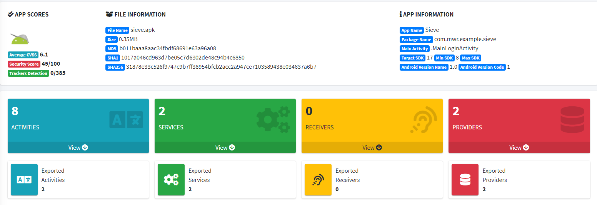

# プラットフォーム連携要件

## MSTG-PLATFORM-1
アプリは必要となる最低限のパーミッションのみを要求している。

### パーミッションの保護レベルの種類

Android では、インストールされたすべてのアプリに個別のシステム ID (Linux のユーザ ID とグループ ID) が割り当てられる。 Android の各アプリはプロセスサンドボックスで動作するため、アプリはサンドボックスの外にあるリソースやデータへのアクセスを明示的に要求する必要がある。アプリは、システムのデータや機能を使用するために必要なパーミッションを宣言することで、このアクセスを要求する。データや機能の機密性や重要性に応じて、 Android システムは自動的にアクセス許可を与えるか、ユーザにリクエストの承認を求める。<br>


Androidのパーミッションは、提供される保護レベルに基づいて 4 つの異なるカテゴリに分類される。<br>
* Nomal : このパーミッションは、他のアプリ、ユーザ、およびシステムに対するリスクを最小限に抑えながら、アプリケーションレベルの分離された機能へのアクセスをアプリに許可する。 Android 6.0 (API level 23) 以降を対象とするアプリの場合、これらのパーミッションはインストール時に自動的に付与される。それより前の API level を対象とするアプリの場合、インストール時にユーザが承認する必要がある。<br>
  例: android.permission.INTERNET.
* Dangerous : このパーミッションは通常、アプリにユーザデータの制御や、ユーザに影響を与えるような方法でのデバイスの制御を与える。このタイプのパーミッションは、インストール時に付与されない場合がある。アプリがこのパーミッションを持つべきかどうかは、ユーザの判断に委ねられる場合がある。<br>
  例: android.permission.RECORD_AUDIO.
* Signature : このパーミッションは、要求元のアプリが、パーミッションを宣言したアプリの署名に使用されたものと同じ証明書で署名されている場合にのみ付与される。このパーミッションは、インストール時に付与される。<br>
  例: android.permission.ACCESS_MOCK_LOCATION.
* SystemOrSignature : このパーミッションは、システムイメージに組み込まれたアプリケーション、またはパーミッションを宣言したアプリケーションの署名に使用されたのと同じ証明書で署名されたアプリケーションにのみ付与される。<br>
  例: android.permission.ACCESS_DOWNLOAD_MANAGER.

すべてのパーミッションの一覧は、[ Android 開発者向けドキュメント](https://developer.android.com/guide/topics/permissions/overview.html)に記載されており、その具体的な手順も記載されている。<br>
* アプリのマニフェストファイルで[アプリのパーミッションを宣言](https://developer.android.com/training/permissions/declaring)する。
* プログラムによって[アプリのパーミッションを要求](https://developer.android.com/training/permissions/requesting)する。
* [カスタムアプリパーミッションを定義](https://developer.android.com/guide/topics/permissions/defining)して、アプリのリソースと機能を他のアプリと共有する。

参考資料
 * [owasp-mastg Testing App Permissions (MSTG-PLATFORM-1) Overview](https://github.com/OWASP/owasp-mastg/blob/v1.5.0/Document/0x05h-Testing-Platform-Interaction.md#overview)

### API level ごとのパーミッションに関する変更点

#### Android 8.0 (API level 26) の変更点

[以下の変更](https://developer.android.com/about/versions/oreo/android-8.0-changes#atap)は、 Android 8.0 (API level 26) 上で動作するすべてのアプリに影響し、より低い API level を対象とするアプリにも適用される。<br>
* 連絡先プロバイダーの使用状況統計の変更 : アプリが [READ_CONTACTS](https://developer.android.com/reference/android/Manifest.permission.html#READ_CONTACTS) パーミッションを要求した場合、連絡先の使用状況データのクエリは正確な値ではなく、近似値を返す ( オートコンプリート API はこの変更の影響を受けない ) 。

Android 8.0 (API level 26) 以降を対象とするアプリは、[以下の影響を受ける](https://developer.android.com/about/versions/oreo/android-8.0-changes#o-apps)。<br>
* アカウントへのアクセスおよび検出性の向上 : [GET_ACCOUNTS](https://developer.android.com/reference/android/Manifest.permission.html#GET_ACCOUNTS) パーミッションを付与されたアプリは、 Authenticator がアカウントを所有しているか、ユーザがそのアクセスを許可していない限り、ユーザアカウントにアクセスすることができなくなった。
* 新しいテレフォニーパーミッション : 以下のパーミッション (dangerous に分類される) が、 PHONE パーミッショングループに含まれるようになった。
  * ANSWER_PHONE_CALLS パーミッションにより、 (acceptRingingCall を介して) プログラムで着信電話に応答できる。
  * READ_PHONE_NUMBERS パーミッションは、デバイスに保存されている電話番号への読み取りアクセスを許可する。
* dangerous パーミッションを付与する場合の制限 : dangerous パーミッションはパーミッショングループに分類される (例： STORAGE グループには READ_EXTERNAL_STORAGE と WRITE_EXTERNAL_STORAGE が含まれる) 。 Android 8.0 (API level 26) 以前は、グループの 1 つのパーミッションを要求するだけで、そのグループのすべてのパーミッションも同時に許可された。
これは、 [Android 8.0 (API level 26) から変更された](https://developer.android.com/about/versions/oreo/android-8.0-changes#rmp)。アプリが実行時にパーミッションを要求すると、システムはその特定のパーミッションのみを許可する。ただし、そのパーミッショングループのパーミッションに対するそれ以降のリクエストは、ユーザにパーミッションのダイアログを表示することなく、自動的に許可されることに注意する。 Android 開発者向けドキュメントにある以下の例を参照してください。<br>

あるアプリが、マニフェストに READ_EXTERNAL_STORAGE と WRITE_EXTERNAL_STORAGE の両方を記載しているとする。アプリは READ_EXTERNAL_STORAGE を要求し、ユーザはそれを許可する。アプリのターゲットが API level 25 以下の場合、システムは WRITE_EXTERNAL_STORAGE も同時に許可する。これは、同じ STORAGE 権限グループに属し、マニフェストにも登録されているためである。アプリが Android 8.0 (API level 26) をターゲットにしている場合、システムはその時点で READ_EXTERNAL_STORAGE のみを許可する。しかし、アプリが後で WRITE_EXTERNAL_STORAGE を要求すると、システムはユーザに促さずに直ちにその権限を許可する。

パーミッショングループのリストは、 [Android 開発者向けドキュメント](https://developer.android.com/guide/topics/permissions/overview.html#permission-groups)で確認することができる。また、もう少し分かりやすくするために、 [Google](https://developer.android.com/guide/topics/permissions/overview.html#perm-groups) は、特定のパーミッションが Android SDK の将来のバージョンで 1 つのグループから別のグループに移動する可能性があるため、アプリのロジックはこれらのパーミッショングループの構造に依存すべきではないと警告している。ベストプラクティスは、必要なときにすべてのパーミッションを明示的に要求することである。<br>


参考資料
 * [owasp-mastg Testing App Permissions (MSTG-PLATFORM-1) Android 8.0 (API level 26) Changes](https://github.com/OWASP/owasp-mastg/blob/v1.5.0/Document/0x05h-Testing-Platform-Interaction.md#android-80-api-level-26-changes)

ルールブック
* [必要なときにすべてのパーミッションを明示的に要求する（必須）](#必要なときにすべてのパーミッションを明示的に要求する必須)

#### Android 9 (API level 28) の変更点

[以下の変更](https://developer.android.com/about/versions/pie/android-9.0-changes-all)は、Android 9 上で動作するすべてのアプリに影響し、API level 28 未満を対象とするアプリにも影響する。<br>
* 通話履歴へのアクセス制限 : EAD_CALL_LOG 、 WRITE_CALL_LOG 、および PROCESS_OUTGOING_CALLS (dangerous) パーミッションは、 PHONE から新しい CALL_LOG パーミッショングループに移動した。これは、電話をかけることができる (例: PHONE グループのパーミッションを付与されている) だけでは、通話履歴へのアクセスを得るには十分でないことを意味する。
* 電話番号へのアクセス制限 : Android 9 (API level 28)で動作する場合、電話番号を読み取りたいアプリは READ_CALL_LOG パーミッションが必要である。
* Wi-Fiの位置情報、接続情報へのアクセス制限 : SSID と BSSID の値を取得することはできない (例： [WifiManager.getConnectionInfo](https://developer.android.com/reference/android/net/wifi/WifiManager#getConnectionInfo%28%29) 経由で以下のすべてが true でない限り)
  * ACCESS_FINE_LOCATION または ACCESS_COARSE_LOCATION パーミッション。
  * ACCESS_WIFI_STATE パーミッション。
  * 位置情報サービスが有効になっていること (「設定」→「位置情報」) 。

Android 9 (API level 28) 以降を対象とするアプリは、[以下の影響を受ける](https://developer.android.com/about/versions/pie/android-9.0-changes-28)。<br>
* Build serial number deprecation : デバイスのハードウェアシリアル番号は、 READ_PHONE_STATE (dangerous) パーミッションが付与されていない限り、 ([Build.getSerial](https://developer.android.com/reference/android/os/Build.html#getSerial%28%29) などを介して) 読み取ることはできない。

参考資料
 * [owasp-mastg Testing App Permissions (MSTG-PLATFORM-1) Android 9 (API Level 28) Changes](https://github.com/OWASP/owasp-mastg/blob/v1.5.0/Document/0x05h-Testing-Platform-Interaction.md#android-9-api-level-28-changes)

ルールブック
* [必要なときにすべてのパーミッションを明示的に要求する（必須）](#必要なときにすべてのパーミッションを明示的に要求する必須)

#### Android 10 (API level 29) の変更点

Android 10 (API level 29) では、[ユーザのプライバシーを強化する機能](https://developer.android.com/about/versions/10/highlights#privacy_for_users)がいくつか導入されている。パーミッションに関する変更は、より低い API level を対象とするものを含め、 Android 10 (API level 29) 上で動作するすべてのアプリケーションに影響する。<br>
* 位置情報アクセスの制限 : 位置情報アクセスに「アプリ使用時のみ」の許可オプションを追加した。
* デフォルトでスコープされたストレージ : Android 10 (API level 29) をターゲットとするアプリは、外部ストレージのアプリ固有のディレクトリにあるファイルにアクセスするためのストレージパーミッションを宣言する必要はなく、メディアストアから作成されたファイルにもアクセスできる。
* 画面コンテンツへのアクセス制限 : READ_FRAME_BUFFER 、 CAPTURE_VIDEO_OUTPUT 、 および CAPTURE_SECURE_VIDEO_OUTPUT パーミッションが署名アクセスのみになり、デバイスの画面コンテンツへのサイレントアクセスが防止される。
* レガシーアプリのユーザ向けパーミッションチェック : Android 5.1 (API level 22) 以前をターゲットとするアプリを初めて実行する場合、ユーザは特定のレガシーパーミッション (以前はインストール時に自動的に付与されていたもの) へのアクセスを取り消すことができるパーミッション画面が表示されるようになる。

参考資料
 * [owasp-mastg Testing App Permissions (MSTG-PLATFORM-1) Android 10 (API level 29) Changes](https://github.com/OWASP/owasp-mastg/blob/v1.5.0/Document/0x05h-Testing-Platform-Interaction.md#android-10-api-level-29-changes)

ルールブック
* [必要なときにすべてのパーミッションを明示的に要求する（必須）](#必要なときにすべてのパーミッションを明示的に要求する必須)

### 他のアプリコンポーネントとの連携

#### 他のアプリの Activity との連携

パーミッションは、マニフェストの <activity> タグ内にある android:permission 属性を介して適用される。これらのパーミッションは、どのアプリケーションがその Activity を開始できるかを制限する。パーミッションは Context.startActivity と Activity.startActivityForResult の間にチェックされる。必要なパーミッションを保持していない場合、呼び出しから SecurityException が throw される。<br>

参考資料
 * [owasp-mastg Testing App Permissions (MSTG-PLATFORM-1) Activity Permission Enforcement](https://github.com/OWASP/owasp-mastg/blob/v1.5.0/Document/0x05h-Testing-Platform-Interaction.md#activity-permission-enforcement)

#### 他のアプリの Service との連携

マニフェストの \<service\> タグ内にある android:permission 属性によって適用されるパーミッションは、関連付けられた Service を開始またはバインドできるユーザを制限する。パーミッションは、 Context.startService 、 Context.stopService 、および Context.bindService で確認される。必要なパーミッションを保持していない場合、呼び出しから SecurityException が throw される。<br>

参考資料
 * [owasp-mastg Testing App Permissions (MSTG-PLATFORM-1) Service Permission Enforcement](https://github.com/OWASP/owasp-mastg/blob/v1.5.0/Document/0x05h-Testing-Platform-Interaction.md#service-permission-enforcement)

#### 他のアプリの BroadcastReceiver との連携

\<receiver\> タグ内の android:permission 属性によって適用されるパーミッションは、関連付けられた BroadcastReceiver に対してブロードキャストを送信するためのアクセスを制限するものである。パーミッションは、 Context.sendBroadcast が返された後、送信されたブロードキャストを与えられたレシーバーに配信しようとする際に確認される。必要なパーミッションを保持していなくても例外は throw されず、結果は未送信のブロードキャストとなる。<br>

Context.registerReceiver にパーミッションを与えることで、プログラムで登録した receiver に対して誰がブロードキャストできるかを制御することができる。逆に、Context.sendBroadcast を呼び出す際にパーミッションを与えることで、どの BroadcastReceiver がブロードキャストを受信することができるかを制限することができる。<br>

receiver と broadcaster の両方がパーミッションを必要とすることがあることに注意する。この場合、関連するターゲットに Intent を送信するためには、両方のパーミッションのチェックをパスする必要がある。詳細については、 Android 開発者向けドキュメントの「[権限の設定によるブロードキャストの制限](https://developer.android.com/guide/components/broadcasts#restrict-broadcasts-permissions)」セクションを参照する。<br>

参考資料
 * [owasp-mastg Testing App Permissions (MSTG-PLATFORM-1) Broadcast Permission Enforcement](https://github.com/OWASP/owasp-mastg/blob/v1.5.0/Document/0x05h-Testing-Platform-Interaction.md#broadcast-permission-enforcement)

ルールブック
* [Broadcast の受信側と送信側の両方で権限を必要とする場合があることに注意する（必須）](#broadcast-の受信側と送信側の両方で権限を必要とする場合があることに注意する必須)

#### 他のアプリの ContentProvider との連携

\<provider\> タグ内の android:permission 属性によって適用されるパーミッションは、 ContentProvider 内のデータへのアクセスを制限する。 ContentProvider には、次に説明する URI パーミッションと呼ばれる重要な追加のセキュリティ機能がある。 ContentProvider は他のコンポーネントとは異なり設定可能な2つの別々の許可属性を持っている。 android:readPermission は provider から読み取ることができるユーザを制限し、 android:writePermission は provider に書き込むことができるユーザを制限する。 ContentProvider が読み取りと書き込みの両方のパーミッション保護されている場合、書き込みパーミッションのみを保持しても読み取りパーミッションは付与されない。<br>

パーミッションは、最初に provider を取得するときと、 ContentProvider を使用して操作を実行するときにチェックされる。 ContentResolver.query を使用する場合は、読み取りパーミッションを保持する必要があり、 ContentResolver.insert,ContentResolver.update.ContentResolver.delete を使用する場合は書き込みパーミッションが必要である。これらすべてのケースで適切なパーミッションが保持されていない場合、呼び出しから SecurityException が throwされる。<br>


参考資料
 * [owasp-mastg Testing App Permissions (MSTG-PLATFORM-1) Content Provider Permission Enforcement](https://github.com/OWASP/owasp-mastg/blob/v1.5.0/Document/0x05h-Testing-Platform-Interaction.md#content-provider-permission-enforcement)

### ContentProvider の URI パーミッション
ContentProvider を使用する場合、標準の許可システムでは十分ではない。例えば、 ContentProvider は、情報を取得するためにカスタム URI を使用しながら、自分自身を保護するために、パーミッションを READ パーミッションに制限したい場合がある。アプリケーションは、その特定の URI に対するパーミッションのみを持つべきである。<br>

解決策は、 URI ごとのパーミッションである。 activity を開始するとき、または結果を返すとき、メソッドは Intent.FLAG_GRANT_READ_URI_PERMISSION と Intent.FLAG_GRANT_WRITE_URI_PERMISSION の両方またはどちらか一方を設定することができる。これにより、 ContentProvider からのデータにアクセスするパーミッションがあるかどうかに関係なく、特定の URI の activity にパーミッションが付与される。<br>

これにより、ユーザの操作によってきめ細かいパーミッションをアドホックに付与する、一般的な capability-style モデルが可能になる。これは、アプリが必要とするパーミッションを、アプリの動作に直接関連するものだけに減らすための重要な機能となりえる。このモデルがないと、悪意のあるユーザが他のメンバの電子メールの添付ファイルにアクセスしたり、保護されていない URI を介して将来使用するために連絡先リストを取得したりする可能性がある。マニフェストでは、 [android:grantUriPermissions](https://developer.android.com/guide/topics/manifest/provider-element#gprmsn) 属性またはノードが URI を制限するのに役立つ。<br>

URI パーミッションのドキュメント
* [grantUriPermission](https://developer.android.com/reference/android/content/Context.html#grantUriPermission%28java.lang.String,%20android.net.Uri,%20int%29)
* [revokeUriPermission](https://developer.android.com/reference/android/content/Context#revokeUriPermission%28android.net.Uri,%20int%29)
* [checkUriPermission](https://developer.android.com/reference/android/content/Context#checkUriPermission%28android.net.Uri,%20int,%20int,%20int%29)


参考資料
 * [owasp-mastg Testing App Permissions (MSTG-PLATFORM-1) Content Provider URI Permissions](https://github.com/OWASP/owasp-mastg/blob/v1.5.0/Document/0x05h-Testing-Platform-Interaction.md#content-provider-uri-permissions)
 * [owasp-mastg Testing App Permissions (MSTG-PLATFORM-1) Documentation for URI Permissions](https://github.com/OWASP/owasp-mastg/blob/v1.5.0/Document/0x05h-Testing-Platform-Interaction.md#documentation-for-uri-permissions)

ルールブック
* [アプリケーションは特定の URI に対するパーミッションのみを持つべき（必須）](#アプリケーションは特定の-uri-に対するパーミッションのみを持つべき必須)


### カスタムパーミッション

Android では、アプリが Service やコンポーネントを他のアプリに公開することができる。公開されたコンポーネントにアプリがアクセスするためには、カスタムパーミッションが必要である。 android:name と android:protectionLevel の 2 つの必須属性を持つパーミッションタグを作成することで、 AndroidManifest.xml で[カスタムパーミッション](https://developer.android.com/guide/topics/permissions/defining.html)を定義できる。<br>

カスタムパーミッションは、「最小権限の原則」に従って作成することが重要である。パーミッションは、その目的に応じて、意味のある正確なラベルと説明で明示的に定義する必要がある。

以下は、 START_MAIN_ACTIVITY というカスタムパーミッションの例で、 TEST_ACTIVITY Activity を起動する際に必要なパーミッションである。<br>

最初のコードブロックは新しいパーミッションを定義しており、これは自明である。labelタグはパーミッションの概要で、descriptionはその概要のより詳細なバージョンである。付与されるパーミッションの種類に応じて、protectionLevelを設定することができる。パーミッションを定義したら、アプリのマニフェストに追加することでそれを強制することができる。この例では、2 番目のブロックが、作成したパーミッションで制限するコンポーネントを表している。これは android:permission 属性を追加することで強制することができる。<br>

```xml
<permission android:name="com.example.myapp.permission.START_MAIN_ACTIVITY"
        android:label="Start Activity in myapp"
        android:description="Allow the app to launch the activity of myapp app, any app you grant this permission will be able to launch main activity by myapp app."
        android:protectionLevel="normal" />

<activity android:name="TEST_ACTIVITY"
    android:permission="com.example.myapp.permission.START_MAIN_ACTIVITY">
    <intent-filter>
        <action android:name="android.intent.action.MAIN" />
        <category android:name="android.intent.category.LAUNCHER" />
     </intent-filter>
</activity>
```


START_MAIN_ACTIVITY が作成されると、アプリは AndroidManifest.xml ファイル内の uses-permission タグを使用してそれを要求できる。 START_MAIN_ACTIVITY が付与されたアプリは、 TEST_ACTIVITY を起動することができる。 \<uses-permission android:name="myapp.permission.START_MAIN_ACTIVITY"\> は、 \<application\> の前に宣言する必要があることに注意する。そうしないと、実行時に exception が発生する。[パーミッションの概要](https://developer.android.com/guide/topics/permissions/overview)と [manifest-intro](https://developer.android.com/guide/topics/manifest/manifest-intro#filestruct) に基づいている以下の例を参照する。<br>

```xml
<manifest>
<uses-permission android:name="com.example.myapp.permission.START_MAIN_ACTIVITY" />
        <application>
            <activity>
            </activity>
        </application>
</manifest>
```


他のアプリとの衝突を避けるため、上記の例 (com.domain.application.permission) のようにパーミッションを登録する際には、 reverse-domain annotation を使用することを推奨する。<br>

参考資料
 * [owasp-mastg Testing App Permissions (MSTG-PLATFORM-1) Custom Permissions](https://github.com/OWASP/owasp-mastg/blob/v1.5.0/Document/0x05h-Testing-Platform-Interaction.md#custom-permissions)


ルールブック
* [カスタムパーミッションは、「最小権限の原則」に従って作成する（必須）](#カスタムパーミッションは最小権限の原則に従って作成する必須)
* [カスタムパーミッションは reverse-domain annotation で登録する（推奨）](#カスタムパーミッションは-reverse-domain-annotation-で登録する推奨)

### 静的解析

#### Android のパーミッション
アプリに本当に必要なパーミッションかどうかを確認し、不要なパーミッションを削除する。例えば、AndroidManifest.xml ファイルの INTERNET パーミッションは、Activity が Web ページを WebView に読み込むために必要である。ユーザは、 dangerous パーミッションを使用するアプリケーションの権利を取り消すことができるため、開発者は、そのパーミッションを必要とするアクションが実行されるたびに、アプリケーションが適切なパーミッションを持っているかどうかをチェックする必要がある。

```xml
<uses-permission android:name="android.permission.INTERNET" />
```

開発者と一緒にパーミッションを確認し、すべてのパーミッションの目的を特定し、不要なパーミッションを削除する。<br>

AndroidManifest.xml ファイルを手動で調べる以外に、 Android Asset Packaging ツール (aapt) を使ってAPKファイルのパーミッションを調べることも可能である。<br>

aapt は Android SDK の build-tools フォルダに付属している。入力として APK ファイルを必要としている。[インストールされているアプリの一覧表示](https://github.com/OWASP/owasp-mastg/blob/v1.5.0/Document/0x05b-Basic-Security_Testing.md#listing-installed-apps)にあるように、 adb shell pm list packages -f | grep -i \<keyword\> を実行することで、デバイス内の APK を一覧表示することができる。<br>

```bash
$ aapt d permissions app-x86-debug.apk
package: sg.vp.owasp_mobile.omtg_android
uses-permission: name='android.permission.WRITE_EXTERNAL_STORAGE'
uses-permission: name='android.permission.INTERNET'
```

また、 adb や dumpsys ツールでより詳細なパーミッションのリストを取得することも可能である。<br>
```bash
$ adb shell dumpsys package sg.vp.owasp_mobile.omtg_android | grep permission
    requested permissions:
      android.permission.WRITE_EXTERNAL_STORAGE
      android.permission.INTERNET
      android.permission.READ_EXTERNAL_STORAGE
    install permissions:
      android.permission.INTERNET: granted=true
      runtime permissions:
```

dangerous とされる一覧のパーミッションの説明については、この[パーミッションの概要](https://developer.android.com/guide/topics/permissions/overview#permission-groups)を参照する。<br>
```default
READ_CALENDAR
WRITE_CALENDAR
READ_CALL_LOG
WRITE_CALL_LOG
PROCESS_OUTGOING_CALLS
CAMERA
READ_CONTACTS
WRITE_CONTACTS
GET_ACCOUNTS
ACCESS_FINE_LOCATION
ACCESS_COARSE_LOCATION
RECORD_AUDIO
READ_PHONE_STATE
READ_PHONE_NUMBERS
CALL_PHONE
ANSWER_PHONE_CALLS
ADD_VOICEMAIL
USE_SIP
BODY_SENSORS
SEND_SMS
RECEIVE_SMS
READ_SMS
RECEIVE_WAP_PUSH
RECEIVE_MMS
READ_EXTERNAL_STORAGE
WRITE_EXTERNAL_STORAGE
```

参考資料
 * [owasp-mastg Testing App Permissions (MSTG-PLATFORM-1) Android Permissions](https://github.com/OWASP/owasp-mastg/blob/v1.5.0/Document/0x05h-Testing-Platform-Interaction.md#android-permissions)

ルールブック
* [アプリに本当に必要なパーミッションかどうかを確認し、不要なパーミッションを削除する（必須）](#アプリに本当に必要なパーミッションかどうかを確認し不要なパーミッションを削除する必須)

#### カスタムパーミッション

アプリケーションマニフェストファイルによるカスタムパーミッションの強制とは別に、プログラムによるパーミッションのチェックも可能である。しかし、この方法はエラーが発生しやすく、 runtime instrumentation などで簡単にバイパスできるため、推奨されない。 activity が指定されたパーミッションを持っているかどうかをチェックするには、 ContextCompat.checkSelfPermission メソッドを呼び出すことを推奨する。次のスニペットのようなコードが表示されたら、マニフェストファイルで同じパーミッションが強制されていることを確認する。<br>

```java
private static final String TAG = "LOG";
int canProcess = checkCallingOrSelfPermission("com.example.perm.READ_INCOMING_MSG");
if (canProcess != PERMISSION_GRANTED)
throw new SecurityException();
```

または、マニフェストファイルと比較する ContextCompat.checkSelfPermission を使用する。<br>
```java
if (ContextCompat.checkSelfPermission(secureActivity.this, Manifest.READ_INCOMING_MSG)
        != PackageManager.PERMISSION_GRANTED) {
            //!= stands for not equals PERMISSION_GRANTED
            Log.v(TAG, "Permission denied");
        }
```

参考資料
 * [owasp-mastg Testing App Permissions (MSTG-PLATFORM-1) Android Permissions](https://github.com/OWASP/owasp-mastg/blob/v1.5.0/Document/0x05h-Testing-Platform-Interaction.md#custom-permissions-1)

ルールブック
* [プログラムによるカスタムパーミッションのチェック（推奨）](#プログラムによるカスタムパーミッションのチェック推奨)

### パーミッションのリクエスト

アプリケーションに実行時に要求する必要のあるパーミッションがある場合、アプリケーションはそれを取得するために requestPermissions メソッドを呼び出す必要がある。アプリは必要なパーミッションと指定した integer 型の request code を非同期にユーザに渡し、ユーザが同じスレッドでリクエストの受け入れまたは拒否を選択すると返す。レスポンスが返された後、同じ request code がアプリのコールバックメソッドに渡される。

```java
private static final String TAG = "LOG";
// We start by checking the permission of the current Activity
if (ContextCompat.checkSelfPermission(secureActivity.this,
        Manifest.permission.WRITE_EXTERNAL_STORAGE)
        != PackageManager.PERMISSION_GRANTED) {

    // Permission is not granted
    // Should we show an explanation?
    if (ActivityCompat.shouldShowRequestPermissionRationale(secureActivity.this,
        //Gets whether you should show UI with rationale for requesting permission.
        //You should do this only if you do not have permission and the permission requested rationale is not communicated clearly to the user.
            Manifest.permission.WRITE_EXTERNAL_STORAGE)) {
        // Asynchronous thread waits for the users response.
        // After the user sees the explanation try requesting the permission again.
    } else {
        // Request a permission that doesn't need to be explained.
        ActivityCompat.requestPermissions(secureActivity.this,
                new String[]{Manifest.permission.WRITE_EXTERNAL_STORAGE},
                MY_PERMISSIONS_REQUEST_WRITE_EXTERNAL_STORAGE);
        // MY_PERMISSIONS_REQUEST_WRITE_EXTERNAL_STORAGE will be the app-defined int constant.
        // The callback method gets the result of the request.
    }
} else {
    // Permission already granted debug message printed in terminal.
    Log.v(TAG, "Permission already granted.");
}
```

一度呼び出されたシステムダイアログボックスは変更できないため、ユーザに何らかの情報や説明を提供する必要がある場合は、 requestPermissions の呼び出しの前に行う必要があることに注意する。<br>

参考資料
 * [owasp-mastg Testing App Permissions (MSTG-PLATFORM-1) Requesting Permissions](https://github.com/OWASP/owasp-mastg/blob/v1.5.0/Document/0x05h-Testing-Platform-Interaction.md#requesting-permissions)

ルールブック
* [必要なときにすべてのパーミッションを明示的に要求する（必須）](#必要なときにすべてのパーミッションを明示的に要求する必須)

### パーミッションリクエストの応答処理

ここで、アプリはシステムメソッド onRequestPermissionsResult をオーバーライドして、パーミッションが付与されたかどうかを確認する必要がある。このメソッドは、入力パラメータとして integer 型の requestCode を受け取る ( requestPermissions で作成されたものと同じ requestCode である)。

WRITE_EXTERNAL_STORAGE には、次のコールバックメソッドを使用できる。<br>
```java
@Override //Needed to override system method onRequestPermissionsResult()
public void onRequestPermissionsResult(int requestCode, //requestCode is what you specified in requestPermissions()
        String permissions[], int[] permissionResults) {
    switch (requestCode) {
        case MY_PERMISSIONS_WRITE_EXTERNAL_STORAGE: {
            if (grantResults.length > 0
                && permissionResults[0] == PackageManager.PERMISSION_GRANTED) {
                // 0 is a canceled request, if int array equals requestCode permission is granted.
            } else {
                // permission denied code goes here.
                Log.v(TAG, "Permission denied");
            }
            return;
        }
        // Other switch cases can be added here for multiple permission checks.
    }
}
```

パーミッションは、同じグループからの同様のパーミッションがすでにリクエストされている場合でも、必要なパーミッションごとに明示的にリクエストする必要がある。 Android 7.1 (API level 25) 以前のアプリケーションでは、ユーザがあるパーミッショングループの要求されたパーミッションの1つを許可すると、 Android はそのグループのすべてのパーミッションを自動的にアプリケーションに付与する。 Android 8.0 (API level 26) 以降では、ユーザが同じ許可グループの許可をすでに与えている場合でも、許可は自動的に与えられますが、アプリケーションは許可を明示的に要求する必要がある。この場合、ユーザの操作なしに onRequestPermissionsResult ハンドラが自動的にトリガーされる。<br>

例えば、 READ_EXTERNAL_STORAGE と WRITE_EXTERNAL_STORAGE の両方が Android Manifest にリストされているが、 READ_EXTERNAL_STORAGE にのみパーミッションが付与されている場合、 WRITE_EXTERNAL_STORAGE をリクエストすると、同じグループであり明示的にリクエストされていないためユーザの介入なしに自動的にパーミッションを持つことができるようになる。<br>

参考資料
 * [owasp-mastg Testing App Permissions (MSTG-PLATFORM-1) Handling Responses to Permission Requests](https://github.com/OWASP/owasp-mastg/blob/v1.5.0/Document/0x05h-Testing-Platform-Interaction.md#handling-responses-to-permission-requests)

ルールブック
* [必要なときにすべてのパーミッションを明示的に要求する（必須）](#必要なときにすべてのパーミッションを明示的に要求する必須)

### パーミッション分析

アプリケーションが実際に必要なパーミッションを要求しているかどうか、常に確認する。特に DANGEROUS と SIGNATURE パーミッションは、扱いを誤るとユーザとアプリケーションの両方に影響を与える可能性があるため、アプリの目的に関係のないパーミッションが要求されていないことを確認する。例えば、シングルプレイのゲームアプリが android.permission.WRITE_SMS へのアクセスを要求していたら、怪しいと思うはずである。<br>

パーミッションを分析する際には、アプリの具体的なユースケースシナリオを調査し、使用中の DANGEROUS なパーミッションに代わる API があるかどうかを常にチェックする必要がある。その良い例が、 SMS ベースのユーザ認証を行う際に SMS パーミッションの使用を効率化する [SMS Retriever API](https://developers.google.com/identity/sms-retriever/overview) である。この API を使用することで、アプリケーションは DANGEROUS パーミッションを宣言する必要がなくなり、ユーザとアプリケーションの開発者の両方にとって、 [Permissions Declaration Form](https://support.google.com/googleplay/android-developer/answer/9214102?hl=en) を提出する必要がなくなるという利点がある。<br>

参考資料
 * [owasp mastg Testing App Permissions (MSTG-PLATFORM-1) Permission Analysis](https://github.com/OWASP/owasp-mastg/blob/v1.5.0/Document/0x05h-Testing-Platform-Interaction.md#permission-analysis)

ルールブック
* [アプリに本当に必要なパーミッションかどうかを確認し、不要なパーミッションを削除する（必須）](#アプリに本当に必要なパーミッションかどうかを確認し不要なパーミッションを削除する必須)

### 動的解析

インストールされたアプリケーションのパーミッションは adb で取得することができる。以下の抜粋は、アプリケーションで使用されているパーミッションを調べる方法を示している。<br>
```bash
$ adb shell dumpsys package com.google.android.youtube
...
declared permissions:
  com.google.android.youtube.permission.C2D_MESSAGE: prot=signature, INSTALLED
requested permissions:
  android.permission.INTERNET
  android.permission.ACCESS_NETWORK_STATE
install permissions:
  com.google.android.c2dm.permission.RECEIVE: granted=true
  android.permission.USE_CREDENTIALS: granted=true
  com.google.android.providers.gsf.permission.READ_GSERVICES: granted=true
...
```

出力は、以下のカテゴリを使用してすべてのパーミッションを表示する。<br>
* declared permissions: すべてのカスタムパーミッションのリスト
* requested and install permissions: normal および signature パーミッションを含むすべてのインストール時パーミッションのリスト
* runtime permissions: すべての dangerous なパーミッションのリスト

動的解析を行う場合:<br>

* 要求されたパーミッションがアプリに本当に必要かどうかを[評価する](https://developer.android.com/training/permissions/evaluating)。例えば、 android.permission.WRITE_SMS へのアクセスを必要とするシングルプレイヤーゲームは、良いアイデアではないかもしれない。
* 多くの場合、アプリは[パーミッションを宣言する代わり](https://developer.android.com/training/permissions/evaluating#alternatives)に、次のような方法を選択することができる。
  * ACCESS_FINE_LOCATION の代わりに ACCESS_COARSE_LOCATION パーミッションを要求する。あるいは、パーミッションをまったく要求せず、代わりに郵便番号を入力するようユーザに要求することもできる。
  * CAMERA パーミッションを要求する代わりに、 ACTION_IMAGE_CAPTURE または ACTION_VIDEO_CAPTURE intent 動作を呼び出す。
  * Bluetooth デバイスとのペアリング時に、 ACCESS_FINE_LOCATION 、 ACCESS_COARSE_LOCATIION 、 BLUETOOTH_ADMIN パーミッションを宣言する代わりに、 [Companion Device Pairing](https://developer.android.com/guide/topics/connectivity/companion-device-pairing) (Android 8.0 (API level 26) 以降 ) を使用する。
* [Privacy Dashboard](https://developer.android.com/training/permissions/explaining-access#privacy-dashboard) (Android 12 (API level 31) 以降 ) を使用して、アプリが[機密情報へのアクセス](https://developer.android.com/training/permissions/explaining-access)についてどのように説明しているかを確認する。

特定のパーミッションについて詳細を知りたい場合は、 [Android のドキュメント](https://developer.android.com/reference/android/Manifest.permission)を参照する。<br>

参考資料
 * [owasp-mastg Testing App Permissions (MSTG-PLATFORM-1) Dynamic Analysis](https://github.com/OWASP/owasp-mastg/blob/v1.5.0/Document/0x05h-Testing-Platform-Interaction.md#dynamic-analysis)

ルールブック
* [アプリに本当に必要なパーミッションかどうかを確認し、不要なパーミッションを削除する（必須）](#アプリに本当に必要なパーミッションかどうかを確認し不要なパーミッションを削除する必須)

### ルールブック
1. [必要なときにすべてのパーミッションを明示的に要求する（必須）](#必要なときにすべてのパーミッションを明示的に要求する必須)
1. [Broadcast の受信側と送信側の両方で権限を必要とする場合があることに注意する（必須）](#broadcast-の受信側と送信側の両方で権限を必要とする場合があることに注意する必須)
1. [アプリケーションは特定の URI に対するパーミッションのみを持つべき（必須）](#アプリケーションは特定の-uri-に対するパーミッションのみを持つべき必須)
1. [カスタムパーミッションは、「最小権限の原則」に従って作成する（必須）](#カスタムパーミッションは最小権限の原則に従って作成する必須)
1. [カスタムパーミッションは reverse-domain annotation で登録する（推奨）](#カスタムパーミッションは-reverse-domain-annotation-で登録する推奨)
1. [アプリに本当に必要なパーミッションかどうかを確認し、不要なパーミッションを削除する（必須）](#アプリに本当に必要なパーミッションかどうかを確認し不要なパーミッションを削除する必須)
1. [プログラムによるカスタムパーミッションのチェック（推奨）](#プログラムによるカスタムパーミッションのチェック推奨)

#### 必要なときにすべてのパーミッションを明示的に要求する（必須）
[Google](https://developer.android.com/guide/topics/permissions/overview#perm-groups) は、特定のパーミッションが Android SDK の将来のバージョンで 1 つのグループから別のグループに移動する可能性があるため、アプリのロジックはこれらのパーミッショングループの構造に依存すべきではないと警告している。したがって、ベストプラクティスは、必要なときにすべてのパーミッションを明示的に要求することである。

以下は明示的に外部ストレージへの書き込み権限取得のサンプルコードを示す。

AndroidManifest.xml へ外部ストレージへの書き込み権限を宣言。
```xml
<uses-permission android:name="android.permission.WRITE_EXTERNAL_STORAGE"/>
```

必要なタイミングで権限を要求するサンプルコード。
```java
private static final String TAG = "LOG";
// We start by checking the permission of the current Activity
if (ContextCompat.checkSelfPermission(secureActivity.this,
        Manifest.permission.WRITE_EXTERNAL_STORAGE)
        != PackageManager.PERMISSION_GRANTED) {

    // Permission is not granted
    // Should we show an explanation?
    if (ActivityCompat.shouldShowRequestPermissionRationale(secureActivity.this,
        //Gets whether you should show UI with rationale for requesting permission.
        //You should do this only if you do not have permission and the permission requested rationale is not communicated clearly to the user.
            Manifest.permission.WRITE_EXTERNAL_STORAGE)) {
        // Asynchronous thread waits for the users response.
        // After the user sees the explanation try requesting the permission again.
    } else {
        // Request a permission that doesn't need to be explained.
        ActivityCompat.requestPermissions(secureActivity.this,
                new String[]{Manifest.permission.WRITE_EXTERNAL_STORAGE},
                MY_PERMISSIONS_REQUEST_WRITE_EXTERNAL_STORAGE);
        // MY_PERMISSIONS_REQUEST_WRITE_EXTERNAL_STORAGE will be the app-defined int constant.
        // The callback method gets the result of the request.
    }
} else {
    // Permission already granted debug message printed in terminal.
    Log.v(TAG, "Permission already granted.");
}
```

権限要求の応答のサンプルコード。
```java
@Override //Needed to override system method onRequestPermissionsResult()
public void onRequestPermissionsResult(int requestCode, //requestCode is what you specified in requestPermissions()
        String permissions[], int[] permissionResults) {
    switch (requestCode) {
        case MY_PERMISSIONS_WRITE_EXTERNAL_STORAGE: {
            if (grantResults.length > 0
                && permissionResults[0] == PackageManager.PERMISSION_GRANTED) {
                // 0 is a canceled request, if int array equals requestCode permission is granted.
            } else {
                // permission denied code goes here.
                Log.v(TAG, "Permission denied");
            }
            return;
        }
        // Other switch cases can be added here for multiple permission checks.
    }
}
```

これに違反する場合、以下の可能性がある。
* 特定のパーミッションが Android SDK の将来のバージョンで 1 つのグループから別のグループに移動した場合にアプリロジックの見直しが必要となる。

#### Broadcast の受信側と送信側の両方で権限を必要とする場合があることに注意する（必須）
権限を設定して、 Broadcast の対象を一定の権限を持つアプリセットに制限できる。 Broadcast の送信側または受信側に対して制限を適用できる。
その場合、受信側と送信側の両方で権限を必要とすることに注意する。

**権限を設定した送信**

[sendBroadcast(Intent, String)](https://developer.android.com/reference/android/content/Context?hl=ja#sendBroadcast(android.content.Intent,%20java.lang.String)) または [sendOrderedBroadcast(Intent, String, BroadcastReceiver, Handler, int, String, Bundle)](https://developer.android.com/reference/android/content/Context?hl=ja#sendOrderedBroadcast(android.content.Intent,%20java.lang.String,%20android.content.BroadcastReceiver,%20android.os.Handler,%20int,%20java.lang.String,%20android.os.Bundle)) を呼び出す際に、権限パラメータを指定できる。マニフェストでタグを使用して権限をリクエストしたレシーバー（また、安全性の理由により合わせて権限を付与されたレシーバー）のみが、 Broadcast を受信できる。

以下のサンプルコードは 権限パラメータを指定 して Broadcast を送信する一例。

sendBroadcast
```kotlin
sendBroadcast(Intent("com.example.NOTIFY"), Manifest.permission.SEND_SMS)
```

sendOrderedBroadcast

Broadcast を受信するには、受信側のアプリが以下のサンプルコードのように権限をリクエストする必要がある。
```kotlin
sendOrderedBroadcast(Intent("com.example.NOTIFY"), Manifest.permission.SEND_SMS, new BroadcastReceiver() {
            @SuppressLint("NewApi")
			@Override
            public void onReceive(Context context, Intent intent) {
                Bundle results = getResultExtras(true);
            }
        }, null, Activity.RESULT_OK, null, null);
```

[SEND_SMS](https://developer.android.com/reference/android/Manifest.permission?hl=ja#SEND_SMS) などの既存のシステム権限を指定することも、[\<permission>](https://developer.android.com/guide/topics/manifest/permission-element?hl=ja) 要素を使用してカスタム権限を定義することもできる。

**権限を設定した受信**

BroadcastReceiver の登録時に権限パラメータを指定する場合（[registerReceiver(BroadcastReceiver, IntentFilter, String, Handler)](https://developer.android.com/reference/android/content/Context?hl=ja#registerReceiver(android.content.BroadcastReceiver,%20android.content.IntentFilter,%20java.lang.String,%20android.os.Handler)) または Manifest の [\<receiver>](https://developer.android.com/guide/topics/manifest/receiver-element?hl=ja) タグを使用）は、 Manifest で [\<uses-permission>](https://developer.android.com/guide/topics/manifest/uses-permission-element?hl=ja) タグを使用して権限をリクエストした Broadcast の送信側（また、安全性の理由により合わせて権限を付与された送信側）のみが、intent を Receiver に送信できる。

以下に示すように、受信側のアプリに Manifest で宣言された Receiver があるとする。
```xml
<receiver android:name=".MyBroadcastReceiver"
              android:permission="android.permission.SEND_SMS">
        <intent-filter>
            <action android:name="android.intent.action.AIRPLANE_MODE"/>
        </intent-filter>
    </receiver>
    
```

または、受信側のアプリにコンテキスト登録された Receiver があるとする。
```kotlin
var filter = IntentFilter(Intent.ACTION_AIRPLANE_MODE_CHANGED)
registerReceiver(receiver, filter, Manifest.permission.SEND_SMS, null )
```

上記の Receiver に Broadcast を送信できるようにするには、以下のサンプルコードのように、送信側のアプリから権限をリクエストする必要がある。
```xml
<uses-permission android:name="android.permission.SEND_SMS"/>
```

これに違反する場合、以下の可能性がある。
* Broadcast の対象を制限することができない。

#### アプリケーションは特定の URI に対するパーミッションのみを持つべき（必須）
ContentProvider は、情報を取得するためにカスタム URI を使用しながら、自分自身を保護するために、パーミッションを READ パーミッションに制限したい場合がある。アプリケーションは、その特定の URI に対するパーミッションのみを持つべきである。

解決策は、 URI ごとのパーミッションである。 activity を開始するとき、または結果を返すとき、メソッドは Intent.FLAG_GRANT_READ_URI_PERMISSION と Intent.FLAG_GRANT_WRITE_URI_PERMISSION の両方またはどちらか一方を設定することができる。これにより、 ContentProvider からのデータにアクセスするパーミッションがあるかどうかに関係なく、特定の URI の activity にパーミッションが付与される。

以下に URI ごとのパーミッション 指定し付与する例を示す。

以下サンプルコードは、パーミッション許可用の AndroidManifest.xml での宣言。
```xml
<provider android:name=".MyProvider" 
          android:authorities="com.example.sampleprovider.myprovider"
          android:grantUriPermissions="true" />
```

以下サンプルコードは、パーミッションの許可と、許可終了用の処理例。
```kotlin
// grantUriPermission により許可
grantUriPermission("com.example.sampleresolver", 
                   Uri.parse("content://com.example.sampleprovider/myprovider/"), 
                   Intent.FLAG_GRANT_READ_URI_PERMISSION);

//以降アクセスした場合は読み込み (query) のみ許可される。

// revokeUriPermission により許可を止める
revokeUriPermission(Uri.parse("content://com.example.sampleprovider/myprovider/"), 
                    Intent.FLAG_GRANT_READ_URI_PERMISSION);
```

これにより、ユーザの操作によってきめ細かいパーミッションをアドホックに付与する、一般的な capability-style モデルが可能になる。これは、アプリが必要とするパーミッションを、アプリの動作に直接関連するものだけに減らすための重要な機能となりえる。このモデルがないと、悪意のあるユーザが他のメンバの電子メールの添付ファイルにアクセスしたり、保護されていない URI を介して将来使用するために連絡先リストを取得したりする可能性がある。

これに違反する場合、以下の可能性がある。
* 意図しないアプリからの ContentProvider へのアクセスを制限できない。

#### カスタムパーミッションは、「最小権限の原則」に従って作成する（必須）
カスタムパーミッションは、「最小権限の原則」に従って作成することが重要である。パーミッションは、その目的に応じて、意味のある正確なラベルと説明で明示的に定義する必要がある。

以下にカスタムパーミッションを明示的に指定し、他アプリで使用する例を示す。

以下は、 「START_MAIN_ACTIVITY」というカスタムパーミッションの宣言例。
```xml
<permission android:name="com.example.myapp.permission.START_MAIN_ACTIVITY"
        android:label="Start Activity in myapp"
        android:description="Allow the app to launch the activity of myapp app, any app you grant this permission will be able to launch main activity by myapp app."
        android:protectionLevel="normal" />

<activity android:name="TEST_ACTIVITY"
    android:permission="com.example.myapp.permission.START_MAIN_ACTIVITY">
    <intent-filter>
        <action android:name="android.intent.action.MAIN" />
        <category android:name="android.intent.category.LAUNCHER" />
     </intent-filter>
</activity>
```

以下は、作成された「START_MAIN_ACTIVITY」を他アプリで使用するための宣言。
```xml
<manifest>
<uses-permission android:name="com.example.myapp.permission.START_MAIN_ACTIVITY" />
        <application>
            <activity>
            </activity>
        </application>
</manifest>
```

これに違反する場合、以下の可能性がある。
* 異常が発生した場合に意図しないセキュリティ侵害を受ける可能性がある。

#### カスタムパーミッションは reverse-domain annotation で登録する（推奨）
カスタムパーミッションは reverse-domain annotation で登録することが推奨される。

以下は、ドメインが「example.com」の場合にカスタムパーミッションを reverse-domain annotation で登録する例。
```xml
<permission android:name="com.example.myapp.permission.START_MAIN_ACTIVITY"
        android:label="Start Activity in myapp"
        android:description="Allow the app to launch the activity of myapp app, any app you grant this permission will be able to launch main activity by myapp app."
        android:protectionLevel="normal" />
```

これに注意しない場合、以下の可能性がある。
* 登録するカスタムパーミッション名が他のアプリと衝突する可能性がある。

#### アプリに本当に必要なパーミッションかどうかを確認し、不要なパーミッションを削除する（必須）
ユーザは、 DANGEROUS パーミッションを使用するアプリケーションの権利を取り消すことができるため、開発者は、そのパーミッションを必要とするアクションが実行されるたびに、アプリケーションが適切なパーミッションを持っているかどうかをチェックする必要がある。

開発者と一緒にパーミッションを確認し、すべてのパーミッションの目的を特定し、不要なパーミッションを削除する。

以下は AndroidManifest.xml でのパーミッションの宣言。
```xml
<uses-permission android:name="android.permission.INTERNET" />
```

**パーミッションの分析**

また、パーミッションを分析し、アプリの具体的なユースケースシナリオを調査することで、使用中の DANGEROUS なパーミッションに代わる API があるかどうかを常にチェックする必要がある。その良い例が、 SMS ベースのユーザ認証を行う際に SMS パーミッションの使用を効率化する [SMS Retriever API](https://developers.google.com/identity/sms-retriever/overview) である。この API を使用することで、アプリケーションは DANGEROUS パーミッションを宣言する必要がなくなり、ユーザとアプリケーションの開発者の両方にとって、 [Permissions Declaration Form](https://support.google.com/googleplay/android-developer/answer/9214102?hl=en) を提出する必要がなくなるという利点がある。

分析方法の一つとして、 [Privacy Dashboard](https://developer.android.com/training/permissions/explaining-access#privacy-dashboard) (Android 12 (API level 31) 以降 ) を使用し、アプリが機密情報へのアクセスについてどのように説明しているかを確認方法もある。

これに違反する場合、以下の可能性がある。
* 不要な DANGEROUS パーミッションが存在する場合は、ユーザに対する不要なパーミッション要求ロジックが必要となる。

#### プログラムによるカスタムパーミッションのチェック（推奨）
アプリケーションマニフェストファイルによるカスタムパーミッションの強制とは別に、プログラムによるパーミッションのチェックも可能である。

その一つの方法として、 ContextCompat.checkSelfPermission メソッドによるチェックを推奨する。

以下サンプルコードは、 ContextCompat.checkSelfPermission メソッドによるカスタムパーミッションのチェック処理である。
```java
if (ContextCompat.checkSelfPermission(secureActivity.this, Manifest.READ_INCOMING_MSG)
        != PackageManager.PERMISSION_GRANTED) {
            //!= stands for not equals PERMISSION_GRANTED
            Log.v(TAG, "Permission denied");
        }
```

上記とは別に、 checkCallingOrSelfPermission メソッドによりチェックする方法も存在する。こちらの方法はエラーが発生しやすく、 runtime instrumentation などで簡単にバイパスできるため、推奨されない。

以下サンプルコードは、 checkCallingOrSelfPermissionメソッドによるカスタムパーミッションのチェック処理である。
```java
private static final String TAG = "LOG";
int canProcess = checkCallingOrSelfPermission("com.example.perm.READ_INCOMING_MSG");
if (canProcess != PERMISSION_GRANTED)
throw new SecurityException();
```

このようなプログラムによるチェック処理を実施する場合は、マニフェストファイルで同じパーミッションが強制されていることを確認する。

これに注意しない場合、以下の可能性がある。
* 不要な DANGEROUS パーミッションが存在する場合は、ユーザに対する不要なパーミッション要求ロジックが必要となる。

## MSTG-PLATFORM-2
外部ソースおよびユーザからの入力はすべて検証されており、必要に応じてサニタイズされている。これにはUI、 intent やカスタムURLなどのIPCメカニズム、ネットワークソースを介して受信したデータを含んでいる。

### クロスサイトスクリプティングの問題
クロスサイトスクリプティング（ XSS ）の問題は、攻撃者がユーザが閲覧するウェブページにクライアント側のスクリプトを埋め込むことができるようにするものである。このタイプの脆弱性は、ウェブアプリケーションに広く存在する。ユーザが埋め込まれたスクリプトをブラウザで閲覧すると、攻撃者は同一オリジンポリシーをバイパスする権限を取得し、様々な悪用（セッションクッキーの窃盗、キー押下のログ、任意のアクションの実行など）が可能になる。

ネイティブアプリの場合、Web ブラウザに依存しないため、XSS のリスクははるかに低くなる。しかし、 iOS の WKWebView や非推奨の UIWebView 、 Android の WebView などの WebView コンポーネントを使用したアプリは、このような攻撃に対して潜在的な脆弱性を持っている。

古い例だが、よく知られているのは、[Phil Purvianceが最初に発見した、 iOS 用 Skype アプリのローカル XSS 問題](https://superevr.com/blog/2011/xss-in-skype-for-ios)である。この Skype アプリは、メッセージの送信者名を適切にエンコードしておらず、攻撃者は、ユーザがメッセージを閲覧した際に実行される悪意のある JavaScript を埋め込むことが可能であった。 Phil は概念実証の中で、この問題を悪用し、ユーザのアドレス帳を盗む方法を示した。

参考資料
* [owasp-mastg Cross-Site Scripting Flaws (MSTG-PLATFORM-2)](https://github.com/OWASP/owasp-mastg/blob/v1.5.0/Document/0x04h-Testing-Code-Quality.md#cross-site-scripting-flaws-mstg-platform-2)

#### 静的解析

WebView を確認して、アプリからレンダリングされた信頼できない入力がないか調査する。<br>


WebView によって開かれた URL の一部がユーザの入力によって決定される場合、XSS 問題が存在する可能性がある。次の例は、[Linus Särud 氏によって報告された Zoho Web Service](https://labs.detectify.com/2015/02/20/finding-an-xss-in-an-html-based-android-application/) における XSS 問題である。<br>

Java
```java
webView.loadUrl("javascript:initialize(" + myNumber + ");");
```
Kotlin
```kotlin
webView.loadUrl("javascript:initialize($myNumber);")
```

ユーザ入力によって決まる XSS 問題のもう一つの例は、パブリックオーバーライドされたメソッドである。<br>

Java

```java
@Override
public boolean shouldOverrideUrlLoading(WebView view, String url) {
  if (url.substring(0,6).equalsIgnoreCase("yourscheme:")) {
    // parse the URL object and execute functions
  }
}
```

Kotlin

```kotlin
    fun shouldOverrideUrlLoading(view: WebView, url: String): Boolean {
        if (url.substring(0, 6).equals("yourscheme:", ignoreCase = true)) {
            // parse the URL object and execute functions
        }
    }
```

Sergey Bobrov 氏は、以下の [HackerOne のレポート](https://hackerone.com/reports/189793)で、これを利用することができた。 QuoraのActionBarContentActivity では、 HTML パラメータへの入力はすべて信頼されることになる。ペイロードは、 adb 、 ModalContentActivity 経由のクリップボードデータ、およびサードパーティアプリケーションからの Intents を使用して成功した。<br>

* ADB

```bash
$ adb shell
$ am start -n com.quora.android/com.quora.android.ActionBarContentActivity \
-e url 'http://test/test' -e html 'XSS<script>alert(123)</script>'
```

* クリップボードデータ

```bash
$ am start -n com.quora.android/com.quora.android.ModalContentActivity  \
-e url 'http://test/test' -e html \
'<script>alert(QuoraAndroid.getClipboardData());</script>'
```

* Java/Kotlin でのサードパーティからの Intent の使用

```java
Intent i = new Intent();
i.setComponent(new ComponentName("com.quora.android",
"com.quora.android.ActionBarContentActivity"));
i.putExtra("url","http://test/test");
i.putExtra("html","XSS PoC <script>alert(123)</script>");
view.getContext().startActivity(i);
```

```kotlin
val i = Intent()
i.component = ComponentName("com.quora.android",
"com.quora.android.ActionBarContentActivity")
i.putExtra("url", "http://test/test")
i.putExtra("html", "XSS PoC <script>alert(123)</script>")
view.context.startActivity(i)
```

WebView を使用してリモート Web サイトを表示する場合、HTML をエスケープする負担はサーバ側に移行する。 Web サーバに XSS の欠陥が存在する場合、これを利用して WebView のコンテキストでスクリプトを実行することができる。そのため、Web アプリケーションのソースコードに対して静的解析を行うことが重要である。<br>

以下のベストプラクティスに従っていることを確認する。
* HTML 、 JavaScript 、その他の解釈されるコンテキストでは、絶対に必要な場合を除き、信頼できないデータはレンダリングされない。
* エスケープ文字には、 HTML エンティティエンコーディングなど、適切なエンコーディングが適用される。注: JavaScript ブロック内にある URL をレンダリングするなど、HTML が他のコード内にネストされている場合、エスケープ ルールは複雑になる。

レスポンスでデータがどのようにレンダリングされるかを検討する。例えば、データが HTML コンテキストでレンダリングされる場合、エスケープする必要がある 6 つの制御文字が存在する。

| Character | Escaped |
| :---: | :---: |
| & | &amp;amp; |
| < | &amp;lt; |
| > | &amp;gt; |
| " | &amp;quot; |
| ' | &amp;#x27; |
| / | &amp;#x2F; |


エスケープルールやその他の防止策の包括的なリストについては、 [OWASP XSS Prevention Cheat Sheet](https://cheatsheetseries.owasp.org/cheatsheets/Cross_Site_Scripting_Prevention_Cheat_Sheet.html) を参照する。

参考資料
 * [owasp-mastg Cross-Site Scripting Flaws (MSTG-PLATFORM-2) Static Analysis](https://github.com/OWASP/owasp-mastg/blob/v1.5.0/Document/0x04h-Testing-Code-Quality.md#static-analysis)

ルールブック
* [WebView を確認して、アプリからレンダリングされた信頼できない入力がないか調査する（必須）](#webview-を確認してアプリからレンダリングされた信頼できない入力がないか調査する必須)

#### 動的解析
HTML タグや特殊文字を利用可能なすべての入力フィールドに注入し、ウェブアプリケーションが無効な入力を拒否するか、出力中の HTML メタ文字をエスケープするかを検証することで、 XSS 問題を最もよく検出することができる。

[reflected XSS 攻撃](https://owasp.org/www-project-web-security-testing-guide/latest/4-Web_Application_Security_Testing/07-Input_Validation_Testing/01-Testing_for_Reflected_Cross_Site_Scripting.html)とは、悪意のあるリンクを経由して悪意のあるコードが挿入されるエクスプロイトを指す。このような攻撃をテストするためには、自動入力ファジングが有効な方法と考えられている。例えば、[BURP Scanner](https://portswigger.net/burp/) は、 reflected XSS 攻撃の脆弱性を特定するのに非常に有効である。自動解析の場合と同様に、テストパラメータを手動で確認し、すべての入力ベクトルがカバーされていることを確認する。


参考資料
 * [owasp-mastg Cross-Site Scripting Flaws (MSTG-PLATFORM-2) Dynamic Analysis](https://github.com/OWASP/owasp-mastg/blob/v1.5.0/Document/0x04h-Testing-Code-Quality.md#dynamic-analysis)

### データストレージの利用

#### SharedPreferences の利用


SharedPreferences.Editor を使って int/boolean/long 値を読み書きする場合、そのデータがオーバーライドされているかどうかをチェックすることはできない。ただし、値を連結する以外の実際の攻撃にはほとんど使用できない。 (例えば、制御フローを引き継ぐような追加のエクスプロイトをパックすることはできない） String や StringSet の場合、データがどのように解釈されるかに注意する必要がある。リフレクションベースの永続化を使用しているかについて、 Android の「オブジェクトの永続性のテスト」のセクションをチェックして、どのように検証すべきかを確認する。 SharedPreferences.Editor を使用して、証明書やキーを保存したり読み取ったりしているかについて、 [Bouncy Castle](https://www.cvedetails.com/cve/CVE-2018-1000613/) で見つかったような脆弱性を考慮し、セキュリティプロバイダのパッチを適用していることを確認する。<br>

どのような場合でも、コンテンツに HMAC をかけることで、追加や変更が加えられていないことを確認することができる。<br>

参考資料
 * [owasp-mastg Testing Local Storage for Input Validation (MSTG-PLATFORM-2) Using Shared Preferences](https://github.com/OWASP/owasp-mastg/blob/v1.5.0/Document/0x05d-Testing-Data-Storage.md#using-shared-preferences)

ルールブック
* [SharedPreferences の利用時の入力検証に関する注意事項（必須）](#sharedpreferences-の利用時の入力検証に関する注意事項必須)

#### SharedPreferences 以外の利用

SharedPreferences.Editor 以外のパブリックストレージメカニズムを使用する場合は、ストレージメカニズムからデータを読み込む瞬間に検証する必要がある。<br>

参考資料
 * [owasp-mastg Testing Local Storage for Input Validation (MSTG-PLATFORM-2) Using Other Storage Mechanisms](https://github.com/OWASP/owasp-mastg/blob/v1.5.0/Document/0x05d-Testing-Data-Storage.md#using-other-storage-mechanisms)

ルールブック
* [SharedPreferences 以外のパブリックストレージメカニズムを使用する場合の入力検証に関する注意事項（必須）](#sharedpreferences-以外のパブリックストレージメカニズムを使用する場合の入力検証に関する注意事項必須)

### インジェクション欠陥

Android アプリは、ディープリンク (Intent の一部) を通じて機能を公開することができる。これらのアプリは、以下に対して機能を公開することができる。<br>
* 他のアプリ (ディープリンクや Intent や BroadcastReceiver などの他の IPC メカニズム経由)
* ユーザ (ユーザインターフェース経由)

これらのソースからの入力はどれも信用することができず、検証やサニタイズが必要である。検証は、アプリが期待するデータのみを処理することを保証する。検証を行わない場合、どのような入力もアプリに送ることができ、攻撃者や悪意のあるアプリにアプリの機能を悪用される可能性がある。<br>

アプリの機能が公開されている場合は、ソースコードの以下の部分をチェックする必要がある。<br>
* ディープリンク : テストケース「[Testing Deep Links](https://github.com/OWASP/owasp-mastg/blob/v1.5.0/Document/0x05h-Testing-Platform-Interaction.md#testing-deep-links-mstg-platform-3)」でも、さらなるテストシナリオを確認する。
* IPC メカニズム (intent 、 Binder 、 Android 共有メモリ、または BroadcastReceivers) : テストケース「 [Test for Sensitive Functionality Exposure Through IPC](https://github.com/OWASP/owasp-mastg/blob/v1.5.0/Document/0x05h-Testing-Platform-Interaction.md#testing-for-sensitive-functionality-exposure-through-ipc-mstg-platform-4) 」でも、さらなるテストシナリオを確認する。
* ユーザインターフェース : テストケース「 [Testing for Overlay Attacks](https://github.com/OWASP/owasp-mastg/blob/v1.5.0/Document/0x05h-Testing-Platform-Interaction.md#testing-for-overlay-attacks-mstg-platform-9) 」を確認する。

脆弱な IPC メカニズムの例を以下に示す。<br>

ContentProviders を使ってデータベース情報にアクセスし、サービスがデータを返すかどうかを調べることができる。データが適切に検証されていない場合、他のアプリが ContentProvider とやりとりしている間に、ContentProvider は SQL インジェクションを受けやすくなるかもしれない。以下の脆弱な ContentProvider の実装を参照する。
```xml
<provider
    android:name=".OMTG_CODING_003_SQL_Injection_Content_Provider_Implementation"
    android:authorities="sg.vp.owasp_mobile.provider.College">
</provider>
```

上記の AndroidManifest.xml は、エクスポートされるため、他のすべてのアプリが利用できる ContentProviderを定義している。 OMTG_CODING_003_SQL_Injection_Content_Provider_Implementation.java クラスのクエリ関数を調べる必要がある。
```java
@Override
public Cursor query(Uri uri, String[] projection, String selection,String[] selectionArgs, String sortOrder) {
    SQLiteQueryBuilder qb = new SQLiteQueryBuilder();
    qb.setTables(STUDENTS_TABLE_NAME);

    switch (uriMatcher.match(uri)) {
        case STUDENTS:
            qb.setProjectionMap(STUDENTS_PROJECTION_MAP);
            break;

        case STUDENT_ID:
            // SQL Injection when providing an ID
            qb.appendWhere( _ID + "=" + uri.getPathSegments().get(1));
            Log.e("appendWhere",uri.getPathSegments().get(1).toString());
            break;

        default:
            throw new IllegalArgumentException("Unknown URI " + uri);
    }

    if (sortOrder == null || sortOrder == ""){
        /**
         * By default sort on student names
         */
        sortOrder = NAME;
    }
    Cursor c = qb.query(db, projection, selection, selectionArgs,null, null, sortOrder);

    /**
     * register to watch a content URI for changes
     */
    c.setNotificationUri(getContext().getContentResolver(), uri);
    return c;
}
```

ユーザが content://sg.vp.owasp_mobile.provider.College/students で STUDENT_ID を提供している間、クエリステートメントは SQL インジェクションを受けやすくなる。もちろん、SQL インジェクションを避けるために[準備済みステートメント](https://cheatsheetseries.owasp.org/cheatsheets/SQL_Injection_Prevention_Cheat_Sheet.html)を使用しなければなりませんが、アプリが期待する入力だけが処理されるように、[入力検証](https://cheatsheetseries.owasp.org/cheatsheets/Input_Validation_Cheat_Sheet.html)も適用されなければならない。<br>

UI から入ってくるデータを処理するアプリの関数は、すべて入力検証を実装する必要がある。<br>
* ユーザインターフェースの入力には、 [Android Saripaar v2](https://github.com/ragunathjawahar/android-saripaar) が使用できる。
* IPC や URL スキームからの入力に対しては、バリデーション関数を作成する。例えば、以下のように、[文字列が英数字](https://stackoverflow.com/questions/11241690/regex-for-checking-if-a-string-is-strictly-alphanumeric)かどうかを判定する。
```java
public boolean isAlphaNumeric(String s){
    String pattern= "^[a-zA-Z0-9]*$";
    return s.matches(pattern);
}
```

検証関数に代わるものとして、例えば整数値のみが期待される場合は Integer.parseInt で型変換を行うことができる。 [OWASP Input Validation Cheat Sheet](https://cheatsheetseries.owasp.org/cheatsheets/Input_Validation_Cheat_Sheet.html) に、このトピックに関する詳細情報が含まれている。<br>

参考資料
 * [owasp-mastg Testing for Injection Flaws (MSTG-PLATFORM-2) Overview](https://github.com/OWASP/owasp-mastg/blob/v1.5.0/Document/0x05h-Testing-Platform-Interaction.md#overview-1)

ルールブック
* [ディープリンクを確認し Web サイトの正しい関連性を検証する（必須）](#ディープリンクを確認し-web-サイトの正しい関連性を検証する必須)
* [セキュリティを考慮し IPC メカニズムを使用する（必須）](#セキュリティを考慮し-ipc-メカニズムを使用する必須)
* [UI から入ってくるデータを処理するアプリの関数は、すべて入力検証を実装する（必須）](#ui-から入ってくるデータを処理するアプリの関数はすべて入力検証を実装する必須)

#### 動的解析

例えば、ローカルな SQL インジェクションの脆弱性が確認された場合、テスト者は OR 1=1-\- のような文字列で入力フィールドを手動でテストする必要がある。<br>

root 化されたデバイスでは、ContentProvider からデータを問い合わせるために、content コマンドを使うことができる。次のコマンドは、上記の脆弱な関数に問い合わせるものである。<br>
```bash
# content query --uri content://sg.vp.owasp_mobile.provider.College/students
```

SQLインジェクションは、以下のコマンドで悪用される可能性がある。 Bob のみのレコードを取得する代わりに、すべてのデータを取得することができる。<br>
```bash
# content query --uri content://sg.vp.owasp_mobile.provider.College/students --where "name='Bob') OR 1=1--''"
```

参考資料
 * [owasp-mastg Testing for Injection Flaws (MSTG-PLATFORM-2) Dynamic Analysis](https://github.com/OWASP/owasp-mastg/blob/v1.5.0/Document/0x05h-Testing-Platform-Interaction.md#dynamic-analysis-1)

### Fragment でのインジェクション

Android SDK は、 [Preferences activity](https://developer.android.com/reference/android/preference/PreferenceActivity.html) をユーザに提示する方法を開発者に提供し、開発者がこの抽象クラスを拡張して適応させることを可能にする。なお、API level 29 で非推奨になった。

この抽象クラスは、 intent の追加データフィールド、特に PreferenceActivity.EXTRA_SHOW_FRAGMENT(:android:show_fragment) と Preference Activity.EXTRA_SHOW_FRAGMENT_ARGUMENTS(:android:show_fragment_arguments) フィールドを解析する。<br>

最初のフィールドには Fragment のクラス名が、 2 番目のフィールドには Fragment に渡される  input bundle が含まれる。<br>

PreferenceActivity は Reflection を使用して Fragment をロードするため、パッケージまたは Android SDK の内部で任意のクラスがロードされる可能性がある。ロードされたクラスは、この activity をエクスポートするアプリケーションの context で実行される。<br>

この脆弱性を利用すると、攻撃者はターゲットアプリケーションの内部で Fragment を呼び出したり、他のクラスのコンストラクタに存在するコードを実行したりすることができる。Fragment クラスを継承しない intent で渡されたクラスは java.lang.CastException を引き起こしますが、例外が発生する前に空のコンストラクタが実行され、そのクラスのコンストラクタに存在するコードを実行することが可能である。<br>

この脆弱性を防ぐため、Android 4.4 (API level 19) で isValidFragment という新しいメソッドが追加された。これにより、開発者はこのメソッドをオーバーライドし、この context で使用可能な Fragmentを定義することができる。<br>

デフォルトの実装では、Android 4.4 (API level 19) より古いバージョンでは true を返し、それ以降のバージョンでは例外を throw する。<br>

参考資料
 * [owasp-mastg Testing for Injection Flaws (MSTG-PLATFORM-2) Testing for Fragment Injection (MSTG-PLATFORM-2)](https://github.com/OWASP/owasp-mastg/blob/v1.5.0/Document/0x05h-Testing-Platform-Interaction.md#overview-2)

#### 静的解析

手順 : 
* android:targetSdkVersion が 19 未満かどうかを確認する。
* PreferenceActivity クラスを継承するエクスポートされた Activity を検索する。
* メソッド isValidFragment がオーバーライドされているかどうかを判断する。
* 現在、アプリがマニフェストで android:targetSdkVersion を 19 未満の値に設定しており、脆弱なクラスが isValidFragment の実装を含んでいない場合、脆弱性は PreferenceActivity から継承される。
* 修正するには、開発者は android:targetSdkVersion を 19 以上に更新する必要がある。または、 android:targetSdkVersion を更新できない場合は、 isValidFragment を実装する。

次の例では、このアクティビティを拡張したアクティビティを示す。
```java
public class MyPreferences extends PreferenceActivity {
    @Override
    protected void onCreate(Bundle savedInstanceState) {
        super.onCreate(savedInstanceState);
    }
}
```

次の例では、 MyPreferenceFragment のみの読み込みを許可する実装で isValidFragment メソッドをオーバーライドしている。<br>
```java
@Override
protected boolean isValidFragment(String fragmentName)
{
return "com.fullpackage.MyPreferenceFragment".equals(fragmentName);
}
```

参考資料
 * [owasp-mastg Testing for Fragment Injection (MSTG-PLATFORM-2) Static Analysis](https://github.com/OWASP/owasp-mastg/blob/v1.5.0/Document/0x05h-Testing-Platform-Interaction.md#static-analysis-1)

#### 脆弱なアプリと悪用の例

MainActivity.class<br>
```java
public class MainActivity extends PreferenceActivity {
    protected void onCreate(Bundle savedInstanceState) {
        super.onCreate(savedInstanceState);
    }
}
```

MyFragment.class<br>
```java
public class MyFragment extends Fragment {
    public void onCreate (Bundle savedInstanceState) {
        super.onCreate(savedInstanceState);
    }
    public View onCreateView(LayoutInflater inflater, ViewGroup container, Bundle savedInstanceState) {
        View v = inflater.inflate(R.layout.fragmentLayout, null);
        WebView myWebView = (WebView) wv.findViewById(R.id.webview);
        myWebView.getSettings().setJavaScriptEnabled(true);
        myWebView.loadUrl(this.getActivity().getIntent().getDataString());
        return v;
    }
}
```

この脆弱なアクティビティを悪用するには、次のコードを使用してアプリケーションを作成する。<br>
```java
Intent i = new Intent();
i.setFlags(Intent.FLAG_ACTIVITY_CLEAR_TASK);
i.setClassName("pt.claudio.insecurefragment","pt.claudio.insecurefragment.MainActivity");
i.putExtra(":android:show_fragment","pt.claudio.insecurefragment.MyFragment");
i.setData(Uri.parse("https://security.claudio.pt"));
startActivity(i);
```

[Vulnerable App](https://github.com/clviper/android-fragment-injection/raw/master/vulnerableapp.apk) と [Exploit PoC App](https://github.com/clviper/android-fragment-injection/blob/master/exploit.apk) はダウンロード可能である。<br>

参考資料
 * [owasp-mastg Testing for Fragment Injection (MSTG-PLATFORM-2) Example of Vulnerable App and Exploitation](https://github.com/OWASP/owasp-mastg/blob/v1.5.0/Document/0x05h-Testing-Platform-Interaction.md#example-of-vulnerable-app-and-exploitation)

### WebView での URL 読み込み

WebView は、Android の組み込みコンポーネントで、アプリケーション内で Web ページを開くことを可能にする。モバイルアプリに関連する脅威に加えて、WebView は一般的な Web の脅威 (例 ： XSS 、 Open Redirect など) にもアプリをさらす可能性がある。<br>

WebView をテストする際に最も重要なことの 1 つは、信頼できるコンテンツのみがロードできることを確認することである。新しく読み込まれるページは、悪意のある可能性があり、WebView のバインディングを悪用しようとしたり、ユーザを騙そうとしたりする可能性がある。ブラウザアプリを開発しているのでなければ、通常は読み込まれるページをアプリのドメインに制限する。そのためには、ユーザが WebView 内に URL を入力したり (Android ではこれがデフォルト) 、信頼されたドメインの外を移動したりする機会さえも与えないようにするのがよい方法である。信頼できるドメイン内を移動する場合でも、ユーザが信頼できないコンテンツへのリンクに遭遇してクリックするリスクはある (例えば、他のユーザがコメントを投稿できるページの場合) 。さらに、開発者によっては、ユーザにとって危険な可能性のあるデフォルトの動作を上書きしてしまうかもしれない。詳しくは、以下の「静的解析」のセクションを確認する。<br>

より安全なウェブブラウジングを提供するために、Android 8.1 (API level 27) では、[SafeBrowsing API](https://developers.google.com/safe-browsing/v4) が導入され、 Google が既知の脅威として分類した URL をアプリケーションが検出することができるようになった。<br>

デフォルトでは、 WebView はユーザにセキュリティリスクに関する警告を表示し、その URL を読み込むか、ページの読み込みを停止するかを選択できる。 SafeBrowsing API を使用すると、脅威をセーフブラウジングに報告するか、既知の脅威に遭遇するたびに安全に戻るなどの特定のアクションを実行することによって、アプリケーションの動作をカスタマイズすることができる。使用例については、[Android Developers のドキュメント](https://developer.android.com/about/versions/oreo/android-8.1#safebrowsing)を確認すること。<br>

SafeBrowsing Network Protocol v4 のクライアントを実装した [SafetyNet ライブラリ](https://developer.android.com/training/safetynet/safebrowsing)を使用すると、 WebViews から独立して SafeBrowsing API を使用できる。 SafetyNet では、アプリが読み込む予定のすべての URL を分析できる。セーフブラウジングは URL スキームに依存しないため、異なるスキーム (http 、 file など) の URL をチェックし、 TYPE_POTENTIALLY_HARMFUL_APPLICATION および TYPE_SOCIAL_ENGINEERING 脅威タイプに対抗することが可能である。<br>

Virus Total は、既知の脅威について URL とローカルファイルを分析するための API を提供する。 API リファレンスは [Virus Total の開発者ページ](https://developers.virustotal.com/reference#getting-started)で入手できる。<br>

既知の脅威をチェックするために URL やファイルを送信する場合、ユーザのプライバシーを侵害する可能性のある機密データが含まれていないこと、またはアプリケーションの機密コンテンツが公開されていないことを確認する。<br>

参考資料
 * [owasp-mastg Testing for URL Loading in WebViews (MSTG-PLATFORM-2)](https://github.com/OWASP/owasp-mastg/blob/v1.5.0/Document/0x05h-Testing-Platform-Interaction.md#testing-for-url-loading-in-webviews-mstg-platform-2)

 ルールブック
 * [WebView は信頼できるコンテンツのみロードできること（必須）](#webview-は信頼できるコンテンツのみロードできること必須)

#### 静的解析

前述したように、[ページナビゲーションの処理](https://developer.android.com/guide/webapps/webview#HandlingNavigation)については、特にユーザが信頼できる環境からナビゲートできる可能性がある場合、慎重に分析する必要がある。Android のデフォルトかつ最も安全な動作は、ユーザが WebView 内でクリックする可能性のあるリンクはすべてデフォルトの Web ブラウザが開くようにすることである。ただし、このデフォルトのロジックは、ナビゲーション要求をアプリ自体で処理できるようにする WebViewClient を設定することで変更することができる。この場合、次のインターセプトコールバック関数を検索して調べる。<br>
* shouldOverrideUrlLoading は、アプリケーションが疑わしいコンテンツを持つ WebView の読み込みを中止するために true を返すか、WebView が URL を読み込むことを許可するために false を返すかを選択できるようにする。
   
   考慮すべき点 : 
   * このメソッドは POST リクエストでは呼び出されない。
   * このメソッドは XmlHttpRequests 、 iFrame 、 HTML や \<script\> タグに含まれる src 属性のために呼び出されない。代わりに、shouldInterceptRequest がこれを処理する必要がある。
* shouldInterceptRequest は、アプリケーションがリソース要求からデータを返すことを可能にする。戻り値が NULL の場合、WebView は通常通りリソースの読み込みを継続する。それ以外の場合は、shouldInterceptRequest メソッドによって返されたデータが使用される。
   
   考慮すべき点 : 
   * このコールバックは、ネットワーク経由でリクエストを送信するスキームだけでなく、さまざまな URL スキーム (http(s): 、data: 、file: など) に対して呼び出される。
   * これは、javascript: または blob: URL、または file:///android_asset/ または file:///android_res/ URL を介してアクセスされるアセットに対しては呼び出されない。リダイレクトの場合、これは最初のリソース URL に対してのみ呼び出され、それ以降のリダイレクト URL は呼び出されない。
   * セーフブラウジングが有効な場合、これらのURLはセーフブラウジングチェックを受けますが、開発者はsetSafeBrowsingWhitelistでURLを許可するか、onSafeBrowsingHitコールバックで警告を無視することができる。

このように、WebViewClient を設定した WebView のセキュリティをテストする際に考慮すべき点が多くあるため、 [WebViewClient のドキュメント](https://developer.android.com/reference/android/webkit/WebViewClient)をよく読んで理解するようにする。<br>

EnableSafeBrowsing のデフォルト値は true であるが、アプリケーションによっては無効にしている場合がある。セーフブラウジングが有効であることを確認するには、 AndroidManifest.xml ファイルを調べ、以下の設定がないことを確認する。<br>
```xml
<manifest>
    <application>
        <meta-data android:name="android.webkit.WebView.EnableSafeBrowsing"
                   android:value="false" />
        ...
    </application>
</manifest>
```

参考資料
 * [owasp-mastg Testing for Injection Flaws (MSTG-PLATFORM-2) Static Analysis](https://github.com/OWASP/owasp-mastg/blob/v1.5.0/Document/0x05h-Testing-Platform-Interaction.md#static-analysis-2)

ルールブック
* [ユーザが WebView 内でクリックする可能性のあるリンクはすべてデフォルトの Web ブラウザが開くようにする（推奨）](#ユーザが-webview-内でクリックする可能性のあるリンクはすべてデフォルトの-web-ブラウザが開くようにする推奨)

#### 動的解析

ディープリンクを動的にテストする便利な方法は、Frida または frida-trace を使用し、アプリを使用して WebView 内のリンクをクリックしながら shouldOverrideUrlLoading および shouldInterceptRequest メソッドをフックすることである。また、 getHost 、 getScheme 、 getPath などの関連する [Uri](https://developer.android.com/reference/android/net/Uri) メソッドもフックする。これらは通常、リクエストを検査し、既知のパターンや拒否リストに一致させるために使用される。<br>

参考資料
 * [owasp-mastg Testing for Injection Flaws (MSTG-PLATFORM-2) Dynamic Analysis](https://github.com/OWASP/owasp-mastg/blob/v1.5.0/Document/0x05h-Testing-Platform-Interaction.md#dynamic-analysis-2)

### ルールブック
1. [WebView を確認して、アプリからレンダリングされた信頼できない入力がないか調査する（必須）](#webview-を確認してアプリからレンダリングされた信頼できない入力がないか調査する必須)
1. [SharedPreferences の利用時の入力検証に関する注意事項（必須）](#sharedpreferences-の利用時の入力検証に関する注意事項必須)
1. [SharedPreferences 以外のパブリックストレージメカニズムを使用する場合の入力検証に関する注意事項（必須）](#sharedpreferences-以外のパブリックストレージメカニズムを使用する場合の入力検証に関する注意事項必須)
1. [UI から入ってくるデータを処理するアプリの関数は、すべて入力検証を実装する（必須）](#ui-から入ってくるデータを処理するアプリの関数はすべて入力検証を実装する必須)
1. [WebView は信頼できるコンテンツのみロードできること（必須）](#webview-は信頼できるコンテンツのみロードできること必須)
1. [ユーザが WebView 内でクリックする可能性のあるリンクはすべてデフォルトの Web ブラウザが開くようにする（推奨）](#ユーザが-webview-内でクリックする可能性のあるリンクはすべてデフォルトの-web-ブラウザが開くようにする推奨)

#### WebView を確認して、アプリからレンダリングされた信頼できない入力がないか調査する（必須）
WebView を確認して、アプリからレンダリングされた信頼できない入力がないか調査する必要がある。

WebView によって開かれた URL の一部がユーザの入力によって決定される場合、XSS 問題が存在する可能性がある。

以下サンプルコードは、[Linus Särud 氏によって報告された Zoho Web Service](https://labs.detectify.com/2015/02/20/finding-an-xss-in-an-html-based-android-application/) における XSS 問題である。

Java での例：
```java
webView.loadUrl("javascript:initialize(" + myNumber + ");");
```

Kotlin での例：
```kotlin
webView.loadUrl("javascript:initialize($myNumber);")
```

XSS 問題を回避するためには、webView.loadUrl で "myNumber" を使用する前に、"myNumber" の入力チェックを行う。

また、以下サンプルコードは、ユーザ入力によって決まる XSS 問題のもう一つの例のパブリックオーバーライドされたメソッドである。

Java での例：
```java
@Override
public boolean shouldOverrideUrlLoading(WebView view, String url) {
  if (url.substring(0,6).equalsIgnoreCase("yourscheme:")) {
    // parse the URL object and execute functions
  }
}
```

Kotlin での例：
```kotlin
    fun shouldOverrideUrlLoading(view: WebView, url: String): Boolean {
        if (url.substring(0, 6).equals("yourscheme:", ignoreCase = true)) {
            // parse the URL object and execute functions
        }
    }
```
XSS 問題を回避するためには、"url" を使用する前に "url" の入力チェックを行う。

以下のベストプラクティスに従っていることを確認する。

* HTML 、 JavaScript 、その他の解釈されるコンテキストでは、絶対に必要な場合を除き、信頼できないデータはレンダリングされない。
* エスケープ文字には、HTML のエンティティエンコーディングなど、適切なエンコーディングが適用される。注： HTML が他のコードにネストされている場合、エスケープのルールは複雑になる。例えば、JavaScriptブロックの中にある URL を表示させる場合などである。

レスポンスでデータがどのようにレンダリングされるかを検討する。例えば、データが HTML コンテキストでレンダリングされる場合、エスケープする必要がある 6 つの制御文字が存在する。

| Character | Escaped |
| :---: | :---: |
| & | &amp;amp; |
| < | &amp;lt; |
| > | &amp;gt; |
| " | &amp;quot; |
| ' | &amp;#x27; |
| / | &amp;#x2F; |

エスケープルールやその他の防止策の包括的なリストについては、 [OWASP XSS Prevention Cheat Sheet](https://cheatsheetseries.owasp.org/cheatsheets/Cross_Site_Scripting_Prevention_Cheat_Sheet.html) を参照する。

これに違反する場合、以下の可能性がある。
* XSS 問題が存在する可能性がある。

#### SharedPreferences の利用時の入力検証に関する注意事項（必須）
SharedPreferences をデータストレージとして利用する場合、以下に注意する必要がある。

* String や StringSet の場合、データがどのように解釈されるかに注意する。
   SharedPreferences で String 使用時のサンプルコード：
   ```java
   // 設定値 String を保存
   public static void saveString(Context ctx, String key, String val) {
       SharedPreferences prefs = ctx.getSharedPreferences(APP_NAME, Context.MODE_PRIVATE);
       SharedPreferences.Editor editor = prefs.edit();
       editor.putString(key, val);
       editor.apply();
   }
   
   // 設定値 String を取得
   public static String loadString(Context ctx, String key) {
       SharedPreferences prefs = ctx.getSharedPreferences(APP_NAME, Context.MODE_PRIVATE);
       return prefs.getString(key, "");
   }
   ```

   SharedPreferences で StringSet 使用時のサンプルコード：
   ```java
   // 設定値 Set<String> を保存
   public static void saveStringSet(Context ctx, String key, Set<String> vals) {
       SharedPreferences prefs = ctx.getSharedPreferences(APP_NAME, Context.MODE_PRIVATE);
       SharedPreferences.Editor editor = prefs.edit();
       editor.putStringSet(key, vals);
       editor.apply();
   }
   
   // 設定値 Set<String> を取得
   public static Set<String> loadStringSet(Context ctx, String key) {
       SharedPreferences prefs = ctx.getSharedPreferences(APP_NAME, Context.MODE_PRIVATE);
       return prefs.getStringSet(key, new HashSet<String>());
   }
   ```
* リフレクションベースの永続化を使用しているかについて、 Android の「[オブジェクトの永続性のテスト](https://github.com/OWASP/owasp-mastg/blob/v1.5.0/Document/0x05h-Testing-Platform-Interaction.md#testing-object-persistence-mstg-platform-8)」のセクションをチェックして、どのように検証すべきかを確認する。
* SharedPreferences.Editor を使用して、証明書やキーを保存したり読み取ったりしているかについて、 [Bouncy Castle](https://www.cvedetails.com/cve/CVE-2018-1000613/) で見つかったような脆弱性を考慮し、セキュリティプロバイダのパッチを適用していることを確認する。

これに違反する場合、以下の可能性がある。
* 文字列が誤ったデータ型で解釈される。

#### SharedPreferences 以外のパブリックストレージメカニズムを使用する場合の入力検証に関する注意事項（必須）
SharedPreferences 以外のパブリックストレージメカニズムを使用する場合は、データがストレージメカニズムから読み取られた時点で入力を検証する必要がある。

以下サンプルコードは、データストレージからファイルを読み取る処理の一例。
```java
private String readFile(String file){
    String text = null;
    try {
        FileInputStream fileInputStream = openFileInput(file);
        BufferedReader reader = new BufferedReader(new InputStreamReader(fileInputStream, "UTF-8"));
        String lineBuffer;
        while (true){
            lineBuffer = reader.readLine();
            if (lineBuffer != null){
                text += lineBuffer;
            }
            else {
                break;
            }
        }
    } catch (IOException e) {
        e.printStackTrace();
    }
    return text;
}
```
上記サンプルコードのように安全にデータを読み取る場合は、"text" を返却する前に "text" を検証する。 

これに違反する場合、以下の可能性がある。
* 意図しない入力として読み取られる可能性がある。

#### UI から入ってくるデータを処理するアプリの関数は、すべて入力検証を実装する（必須）
UI から入ってくるデータを処理するアプリの関数は、すべて入力検証を実装する必要がある。
* ユーザインターフェースの入力には、 Android Saripaar v2 が使用できる。

   ※最終リリースが 2015/9/18 のためサンプルコード省略
* IPC や URL スキームからの入力に対しては、バリデーション関数を作成する。

   以下サンプルコードは、文字列が英数字かどうかを判定処理の一例。
   ```java
   public boolean isAlphaNumeric(String s){
       String pattern= "^[a-zA-Z0-9]*$";
       return s.matches(pattern);
   }
   ```

これに違反する場合、以下の可能性がある。
* 意図しない入力として読み取られる可能性がある。

#### WebView は信頼できるコンテンツのみロードできること（必須）
WebView は、Android の組み込みコンポーネントで、アプリケーション内で Web ページを開くことを可能にする。モバイルアプリに関連する脅威に加えて、WebView は一般的な Web の脅威 (例 ： XSS 、 Open Redirect など) にもアプリをさらす可能性がある。そのため、信頼できるコンテンツのみがロードできるようにする必要がある。

**安全なウェブブラウジング**

より安全なウェブブラウジングを行うため、Android 8.1 (API level 27) で導入された [SafeBrowsing API](https://developers.google.com/safe-browsing/v4) を使用する。これを使用することで、 Google が既知の脅威として分類した URL をアプリケーションが検出することができる。デフォルトでは、既知の脅威をユーザに警告するインタースティシャルが WebView によって表示される。

以下のサンプルコードは、既知の脅威を検出したときに、アプリの WebView インスタンスに対して安全なページに必ず戻るよう指示する処理の一例。

以下は AndroidManifest での宣言。
```xml
<manifest>
    <application>
        ...
        <meta-data android:name="android.webkit.WebView.EnableSafeBrowsing"
                    android:value="true" />
    </application>
</manifest>
```

以下は WebView 呼び出しクラスのコールバック処理。
```kotlin
private var superSafeWebView: WebView? = null
private var safeBrowsingIsInitialized: Boolean = false

// ...

override fun onCreate(savedInstanceState: Bundle?) {
    super.onCreate(savedInstanceState)

    superSafeWebView = WebView(this).apply {
        webViewClient = MyWebViewClient()
        safeBrowsingIsInitialized = false
        startSafeBrowsing(this@SafeBrowsingActivity, { success ->
            safeBrowsingIsInitialized = true
            if (!success) {
                Log.e("MY_APP_TAG", "Unable to initialize Safe Browsing!")
            }
        })
    }
}
```

以下はアクセスした URL が安全でないと判断された際に呼び出される コールバック onSafeBrowsingHit での処理。
```kotlin
class MyWebViewClient : WebViewClient() {
    // Automatically go "back to safety" when attempting to load a website that
    // Safe Browsing has identified as a known threat. An instance of WebView
    // calls this method only after Safe Browsing is initialized, so there's no
    // conditional logic needed here.
    override fun onSafeBrowsingHit(
            view: WebView,
            request: WebResourceRequest,
            threatType: Int,
            callback: SafeBrowsingResponse
    ) {
        // The "true" argument indicates that your app reports incidents like
        // this one to Safe Browsing.
        callback.backToSafety(true)
        Toast.makeText(view.context, "Unsafe web page blocked.", Toast.LENGTH_LONG).show()
    }
}
```

また、SafeBrowsing Network Protocol v4 のクライアントを実装した [SafetyNet ライブラリ](https://developer.android.com/training/safetynet/safebrowsing)を使用すると、 WebViews から独立して SafeBrowsing API を使用できる。 SafetyNet では、アプリが読み込む予定のすべての URL を分析できる。セーフブラウジングは URL スキームに不可知論的であるため、異なるスキーム (http 、 file など) の URL をチェックし、 TYPE_POTENTIALLY_HARMFUL_APPLICATION および TYPE_SOCIAL_ENGINEERING 脅威タイプに対抗することが可能である。

以下のサンプルコードは SafetyNet ライブラリによる URL チェックをリクエストする処理の一例。
```kotlin
SafetyNet.getClient(this).lookupUri(
        url,
        SAFE_BROWSING_API_KEY,
        SafeBrowsingThreat.TYPE_POTENTIALLY_HARMFUL_APPLICATION,
        SafeBrowsingThreat.TYPE_SOCIAL_ENGINEERING
)
        .addOnSuccessListener(this) { sbResponse ->
            // サービスとの通信成功
            if (sbResponse.detectedThreats.isEmpty()) {
                // 脅威が見つからなかった場合
            } else {
                // 威が見つかった場合
            }
        }
        .addOnFailureListener(this) { e: Exception ->
            // サービスとの通信失敗
            if (e is ApiException) {
                // Google Play Services API でのエラーが発生した場合
            } else {
                // 別のエラーが発生した場合
            }
        }

```

その他に、Virus Total を利用することで、既知の脅威について URL とローカルファイルを分析することができる。

また、ブラウザアプリを開発しているのでなければ、通常は読み込まれるページをアプリのドメインに制限する。そのためには、ユーザが WebView 内に URL を入力したり (Android ではこれがデフォルト) 、信頼されたドメインの外を移動したりする機会さえも与えないようにするのがよい方法である。信頼できるドメイン内を移動する場合でも、ユーザが信頼できないコンテンツへのリンクに遭遇してクリックするリスクはある (例えば、他のユーザがコメントを投稿できるページの場合) 。

これに違反する場合、以下の可能性がある。
*  Web の脅威 (例 ： XSS 、 Open Redirect など) に脆弱になる。

#### ユーザが WebView 内でクリックする可能性のあるリンクはすべてデフォルトの Web ブラウザが開くようにする（推奨）
Android のデフォルトかつ最も安全に動作させるために、ユーザが WebView 内でクリックする可能性のあるリンクはすべてデフォルトの Web ブラウザが開くようにする。

以下に WebView 内でクリックされたリンクをデフォルトの Web ブラウザで開くサンプルコードを示す。
```java
  @Override
  public boolean shouldOverrideUrlLoading(WebView view, WebResourceRequest request) {
    Uri uri = request.getUri();
    String uriPath = uri.getPath();

    if(uriPathCheck(uriPath)){
      Intent intent = new Intent(Intent.ACTION_VIEW, uri)
      view.getContext().startActivity(intent);
      return true;
    }

    return false;
  }
```

ただし、このデフォルトのロジックは、ナビゲーション要求をアプリ自体で処理できるようにする WebViewClient を設定することで変更することができる。

そのため、以下インターセプトコールバック関数について考慮すべき点を考慮すること。
* shouldOverrideUrlLoading は、アプリケーションが疑わしいコンテンツを持つ WebView の読み込みを中止するために true を返すか、WebView が URL を読み込むことを許可するために false を返すかを選択できるようにする。

  考慮すべき点 : 
  * このメソッドは POST リクエストでは呼び出されない。
  * このメソッドは XmlHttpRequests 、 iFrame 、 HTML や \<script\> タグに含まれる src 属性のために呼び出されない。代わりに、shouldInterceptRequest がこれを処理する必要がある。
* shouldInterceptRequest は、アプリケーションがリソース要求からデータを返すことを可能にする。戻り値が NULL の場合、WebView は通常通りリソースの読み込みを継続する。それ以外の場合は、shouldInterceptRequest メソッドによって返されたデータが使用される。

  考慮すべき点 : 
  * このコールバックは、ネットワーク経由でリクエストを送信するスキームだけでなく、さまざまな URL スキーム (http(s) ： 、 data ：  、 file ： など) に対して呼び出される。
  * これは、javascript: または blob: URL、または file:///android_asset/ または file:///android_res/ URL を介してアクセスされるアセットに対しては呼び出されない。リダイレクトの場合、これは最初のリソース URL に対してのみ呼び出され、それ以降のリダイレクト URL は呼び出されない。
  * セーフブラウジングが有効な場合、これらのURLはセーフブラウジングチェックを受けますが、開発者はsetSafeBrowsingWhitelistでURLを許可するか、onSafeBrowsingHitコールバックで警告を無視することができる。

また、 EnableSafeBrowsing を true （デフォルト値）に設定することで、セーフブラウジングを有効に設定できる。 設定値を false に指定することで、セーフブラウジングが無効となることに注意する。

以下は AndroidManifest.xml での EnableSafeBrowsing の設定例。
```xml
<manifest>
    <application>
        <meta-data android:name="android.webkit.WebView.EnableSafeBrowsing"
                   android:value="true" />
        ...
    </application>
</manifest>
```

これに違反する場合、以下の可能性がある。
* 意図しないコンテンツをアプリケーションに読み込まれる可能性がある。
* 悪意のある JavaScript をアプリケーション上で実行する可能性がある。

## MSTG-PLATFORM-3
アプリはメカニズムが適切に保護されていない限り、カスタムURLスキームを介して機密な機能をエクスポートしていない。

### ディープリンクの種類

ディープリンクは、ユーザをアプリ内の特定のコンテンツに直接移動させる任意のスキームの URI である。アプリは、Android Manifest に intent filters を追加し、受信した intent からデータを抽出して、ユーザを正しい activity にナビゲートすることで、[ディープリンクを設定](https://developer.android.com/training/app-links/deep-linking)することができる。<br>

Android は、次の 2 種類のディープリンクをサポートしている。<br>
* カスタム URL スキーム : 任意のカスタム URL スキーム、たとえば myapp:// (OS によって検証されない) を使用するディープリンクである。
* Android アプリリンク (Android 6.0 (API level 23) 以上) は、http:// および https:// スキームを使用し、autoVerify 属性 (OS による検証を開始する) を含むディープリンクである。

参考資料
 * [owasp-mastg Testing Deep Links (MSTG-PLATFORM-3) Overview](https://github.com/OWASP/owasp-mastg/blob/v1.5.0/Document/0x05h-Testing-Platform-Interaction.md#overview-4)

### ディープリンクの未検証による競合

検証されていないディープリンクを使用すると、重大な問題が発生する。ユーザのデバイスにインストールされている他のアプリが、同じ intent を宣言して処理しようとする可能性があり、これはディープリンクの衝突として知られている。任意のアプリケーションは、他のアプリケーションに属する全く同じディープリンクの制御を宣言することができる。<br>

最近の Android では、ディープリンクを処理するアプリケーションを選択するよう求める、いわゆる曖昧さ回避ダイアログがユーザに表示されるようになった。ユーザは、正規のアプリケーションではなく、悪意のあるアプリケーションを選択してしまう可能性ががある。


参考資料
 * [owasp-mastg Testing Deep Links (MSTG-PLATFORM-3) Deep Link Collision](https://github.com/OWASP/owasp-mastg/blob/v1.5.0/Document/0x05h-Testing-Platform-Interaction.md#deep-link-collision)

### Android アプリのリンク

ディープリンクの衝突問題を解決するために、 Android 6.0 (API Level 23) では、開発者が明示的に登録した Web サイトの URL を元に[検証されたディープリンク](https://support.google.com/android/search?q=open+by+default)である [Android アプリリンク](https://developer.android.com/training/app-links) が導入された。 App Link をクリックすると、アプリがインストールされている場合は、すぐにそのアプリが開く。<br>

未検証のディープリンクとの主な違いは以下の通りである。<br>
* App Links は、 http:// と https:// スキームのみを使用し、その他のカスタム URL スキームは許可されない。
* App Links は、 [Digital Asset Links file](https://developers.google.com/digital-asset-links/v1/getting-started) を HTTPS 経由で提供するために、ライブドメインが必要である。
* App Links は、ユーザが開いたときに曖昧さ回避のダイアログが表示されないため、ディープリンクの衝突は発生しない。

参考資料
 * [owasp-mastg Testing Deep Links (MSTG-PLATFORM-3) Android App Links](https://github.com/OWASP/owasp-mastg/blob/v1.5.0/Document/0x05h-Testing-Platform-Interaction.md#android-app-links)

### ディープリンクのテスト

既存のディープリンク (アプリリンクを含む) は、アプリの攻撃対象領域を拡大する可能性がある。これには、リンクのハイジャック、機密機能の漏洩など、[多くのリスクが含まれる](https://people.cs.vt.edu/gangwang/deep17.pdf)。また、アプリが動作する Android のバージョンもリスクに影響する。<br>
* Android 12 (API level 31) 以前は、アプリに[検証不可能なリンク](https://developer.android.com/training/app-links/verify-site-associations#fix-errors)がある場合、システムがそのアプリのすべての Android アプリリンクを検証しない原因となることがあった。
* Android 12 (API level 31) 以降では、アプリは[攻撃面が減少](https://developer.android.com/training/app-links/deep-linking)するというメリットがある。一般的な Web intent は、ターゲット アプリがその Web intent に含まれる特定のドメインに対して承認されていない限り、ユーザの既定のブラウザアプリに解決される。

すべてのディープリンクを列挙し、 Web サイトの正しい関連性を検証する必要がある。特に入力データは信頼できないと判断されるため、常に検証する必要がある。<br>

参考資料
 * [owasp-mastg Testing Deep Links (MSTG-PLATFORM-3) Testing Deep Links](https://github.com/OWASP/owasp-mastg/blob/v1.5.0/Document/0x05h-Testing-Platform-Interaction.md#testing-deep-links)

 ルールブック
* [ディープリンクを確認し Web サイトの正しい関連性を検証する（必須）](#ディープリンクを確認し-web-サイトの正しい関連性を検証する必須)

### 静的解析

#### ディープリンクの列挙

Android Manifest の検査 :<br>

apktool を使用してアプリをデコードし、 Android Manifest ファイルを検査して \<intent-filter\> 要素を探せば、ディープリンク (カスタムURLスキームあり/なし) が定義されているかどうかを簡単に判断することができる。<br>
* カスタム URL スキーム : 次の例では、 `myapp://` というカスタム URL スキームでディープリンクを指定している。
```xml
<activity android:name=".MyUriActivity">
  <intent-filter>
      <action android:name="android.intent.action.VIEW" />
      <category android:name="android.intent.category.DEFAULT" />
      <category android:name="android.intent.category.BROWSABLE" />
      <data android:scheme="myapp" android:host="path" />
  </intent-filter>
</activity>
```
* ディープリンク : 次の例では、 `http://` と `https://` の両方のスキームと、それを有効にするホストとパス (この場合、完全な URL は `https://www.myapp.com/my/app/path`) を使用して、ディープリンクを指定している。
```xml
<intent-filter>
  ...
  <data android:scheme="http" android:host="www.myapp.com" android:path="/my/app/path" />
  <data android:scheme="https" android:host="www.myapp.com" android:path="/my/app/path" />
</intent-filter>
```
* アプリリンク : \<intent-filter\> に android:autoVerify="true" というフラグが含まれている場合、 Android システムは、[アプリリンクを検証](https://developer.android.com/training/app-links/verify-site-associations)するために[デジタルアセットリンクファイル](https://developers.google.com/digital-asset-links/v1/getting-started)にアクセスしようと宣言された `android:host` にアクセスするようになる。ディープリンクは、検証が成功した場合にのみ、アプリリンクとみなされる。<br>
```xml
<intent-filter android:autoVerify="true">
```

ディープリンクを記載する場合、同じ \<intent-filter\> 内の \<data\> 要素は、その組み合わせ属性のすべてのバリエーションを考慮し、実際にはマージされることに注意する。<br>
```xml
<intent-filter>
  ...
  <data android:scheme="https" android:host="www.example.com" />
  <data android:scheme="app" android:host="open.my.app" />
</intent-filter>
```

`https://www.example.com` と `app://open.my.app` のみに対応しているように思われるかもしれないが実際には以下をサポートしている。<br>
* `https://www.example.com`
* `app://open.my.app`
* `app://www.example.com`
* `https://open.my.app`

Dumpsys の使用 :<br>
[adb](https://github.com/OWASP/owasp-mastg/blob/v1.5.0/Document/0x08a-Testing-Tools.md#adb) を使用して以下のコマンドを実行すると、すべてのスキームが表示される。<br>
```bash
adb shell dumpsys package com.example.package
```

Android 「 App Link Verification 」テスターの使用 :<br>
[Android の「 App Link Verification 」テスター](https://github.com/inesmartins/Android-App-Link-Verification-Tester)スクリプトを使用して、すべてのディープリンク (list-all) またはアプリリンク (list-applinks) のみをリストアップする。<br>
```bash
python3 deeplink_analyser.py -op list-all -apk ~/Downloads/example.apk

.MainActivity

app://open.my.app
app://www.example.com
https://open.my.app
https://www.example.com
```

参考資料
 * [owasp-mastg Testing Deep Links (MSTG-PLATFORM-3) Enumerate Deep Links](https://github.com/OWASP/owasp-mastg/blob/v1.5.0/Document/0x05h-Testing-Platform-Interaction.md#enumerate-deep-links)

 ルールブック
* [ディープリンクを確認し Web サイトの正しい関連性を検証する（必須）](#ディープリンクを確認し-web-サイトの正しい関連性を検証する必須)

#### Web サイトへの正常な関連付けの検証

ディープリンクに android:autoVerify="true" 属性が含まれている場合でも、アプリリンクと見なされるには実際に検証する必要がある。完全な検証を妨げる可能性のある設定ミスがないかをテストする必要がある。<br>

参考資料
 * [owasp-mastg Testing Deep Links (MSTG-PLATFORM-3) Check for Correct Website Association](https://github.com/OWASP/owasp-mastg/blob/v1.5.0/Document/0x05h-Testing-Platform-Interaction.md#check-for-correct-website-association)

ルールブック
* [ディープリンクを確認し Web サイトの正しい関連性を検証する（必須）](#ディープリンクを確認し-web-サイトの正しい関連性を検証する必須)

**自動検証**

Android の「 [App Link Verification 」テスター](https://github.com/inesmartins/Android-App-Link-Verification-Tester)スクリプトを使用して、すべてのアプリリンクの検証状況を取得する (verify-applinks) 。例は[こちら](https://github.com/inesmartins/Android-App-Link-Verification-Tester#use-an-apk-to-check-for-dals-for-all-app-links)を確認する。<br>

参考資料
 * [owasp-mastg Testing Deep Links (MSTG-PLATFORM-3) Static Analysis Automatic Verification](https://github.com/OWASP/owasp-mastg/blob/v1.5.0/Document/0x05h-Testing-Platform-Interaction.md#automatic-verification)

**Android 12 (API level 31) 以上でのみ使用可能**

アプリが Android 12 (API level 31) を対象としているかどうかに関係なく、[adb](https://github.com/OWASP/owasp-mastg/blob/v1.5.0/Document/0x08a-Testing-Tools.md#adb) を使用して検証ロジックをテストすることができる。この機能により、次のことが可能になる。<br>
* [検証プロセスを手動で呼び出す。](https://developer.android.com/training/app-links/verify-site-associations#manual-verification)
* [対象アプリの Android アプリリンクの状態をデバイス上でリセットする。](https://developer.android.com/training/app-links/verify-site-associations#reset-state)
* [ドメイン認証プロセスを起動する。](https://support.google.com/android/search?q=open+by+default#invoke-domain-verification)

また、[検証結果を確認](https://support.google.com/android/search?q=open+by+default#review-results)することもできる。以下のような例がある。<br>
```bash
adb shell pm get-app-links com.example.package

com.example.package:
    ID: 01234567-89ab-cdef-0123-456789abcdef
    Signatures: [***]
    Domain verification state:
      example.com: verified
      sub.example.com: legacy_failure
      example.net: verified
      example.org: 1026
```

adb shell dumpsys package com.example.package を実行しても同じ情報が得られる（Android 12 (API level 31) 以降のみ）。<br>

参考資料
 * [owasp-mastg Testing Deep Links (MSTG-PLATFORM-3) Automatic Verification](https://github.com/OWASP/owasp-mastg/blob/v1.5.0/Document/0x05h-Testing-Platform-Interaction.md#automatic-verification)

**手動検証**

このセクションでは、検証プロセスが失敗した、または実際にトリガーされなかった理由について、いくつかの理由を詳しく説明する。詳細については、 [Android Developers Documentation](https://developer.android.com/training/app-links/verify-site-associations#fix-errors) およびホワイトペーパー「 [Measuring the Insecurity of Mobile Deep Links of Android ](https://people.cs.vt.edu/gangwang/deep17.pdf)」を参照する。<br>

[デジタルアセットリンクファイル](https://developers.google.com/digital-asset-links/v1/getting-started)の確認 : 
* 欠落しているデジタルアセットリンクファイルを確認する。
  * ドメインの `/.well-known/` パスで検索する。例 : `https://www.example.com/.well-known/assetlinks.json`
  * または、 `https://digitalassetlinks.googleapis.com/v1/statements:list?source.web.site=www.example.com` を試す。
* HTTP 経由で提供される有効なデジタルアセットリンクファイルを確認する。
* HTTPS 経由で提供される無効なデジタルアセットリンクファイルを確認する。
  * ファイルに不正な JSON が含まれている。
  * ファイルにターゲットアプリのパッケージが含まれていない。

アプリのセキュリティを強化するため、サーバが `http://example.com` から `https://example.com` や `example.com` から `www.example.com` などのリダイレクトを設定している場合、システムはアプリの [Android アプリリンクを一切検証しない](https://developer.android.com/training/app-links/verify-site-associations#fix-errors)。<br>

intent filter が、異なるサブドメインを持つ複数のホストをリストアップする場合、各ドメインに有効なデジタルアセットリンクファイルが存在する必要がある。例えば、次の intent filter は、`www.example.com` と `mobile.example.com` を受け入れ可能な intent URL ホストとして含める。<br>
```xml
<application>
  <activity android:name=”MainActivity”>
    <intent-filter android:autoVerify="true">
      <action android:name="android.intent.action.VIEW" />
      <category android:name="android.intent.category.DEFAULT" />
      <category android:name="android.intent.category.BROWSABLE" />
      <data android:scheme="https" />
      <data android:scheme="https" />
      <data android:host="www.example.com" />
      <data android:host="mobile.example.com" />
    </intent-filter>
  </activity>
</application>
```

ディープリンクを正しく登録するためには、有効なデジタルアセットリンクファイルが `https://www.example.com/.well-known/assetlinks.json` と `https://mobile.example.com/.well-known/assetlinks.json` の両方で公開されている必要がある。<br>

ホスト名にワイルドカード (`*.example.com` など) が含まれている場合、ルートホスト名 `https://example.com/.well-known/assetlinks.json` 、有効なデジタルアセットリンクファイルを見つけることができる。<br>

参考資料
 * [owasp-mastg Testing Deep Links (MSTG-PLATFORM-3) Manual Verification](https://github.com/OWASP/owasp-mastg/blob/v1.5.0/Document/0x05h-Testing-Platform-Interaction.md#manual-verification)

#### Handler Method の検証

ディープリンクが正しく検証されたとしても、 Handler Method のロジックは慎重に分析する必要がある。特に、 (ユーザや他のアプリによって外部から制御される) データの送信にディープリンクが使用されている場合は注意が必要である。<br>

まず、ターゲットの \<intent-filter\> を定義する Android Manifest の \<activity\> 要素から Activity 名を取得し、 [getIntent](https://developer.android.com/reference/android/content/Intent#getIntent(java.lang.String)) と [getData](https://developer.android.com/reference/android/content/Intent#getData%28%29) の使用方法を検索する。これらのメソッドを見つけるこの一般的なアプローチは、リバースエンジニアリングを行う際にほとんどのアプリケーションで使用でき、アプリケーションがディープリンクをどのように使用し、外部から提供された入力データをどのように処理するか、および何らかの不正行為の対象となり得るかを理解しようとする場合に重要である。なお、 getIntent は現在非推奨のため、 [parseUri](https://developer.android.com/reference/android/content/Intent#parseUri(java.lang.String,%20int)) の使用が推奨される。

次の例は、[jadx で逆コンパイルされた](https://github.com/OWASP/owasp-mastg/blob/v1.5.0/Document/0x05c-Reverse-Engineering-and-Tampering.md#decompiling-java-code)典型的な Kotlin アプリのスニペットである。[静的解析](https://github.com/OWASP/owasp-mastg/blob/v1.5.0/Document/0x05h-Testing-Platform-Interaction.md#enumerate-deep-links)から、com.mstg.deeplinkdemo.WebViewActivity の一部として deeplinkdemo://load.html/ をサポートしていることが分かる。<br>
```java
// snippet edited for simplicity
public final class WebViewActivity extends AppCompatActivity {
    private ActivityWebViewBinding binding;

    public void onCreate(Bundle savedInstanceState) {
        Uri data = getIntent().getData();
        String html = data == null ? null : data.getQueryParameter("html");
        Uri data2 = getIntent().getData();
        String deeplink_url = data2 == null ? null : data2.getQueryParameter("url");
        View findViewById = findViewById(R.id.webView);
        if (findViewById != null) {
            WebView wv = (WebView) findViewById;
            wv.getSettings().setJavaScriptEnabled(true);
            if (deeplink_url != null) {
                wv.loadUrl(deeplink_url);
            ...
```

deeplink_url 文字列変数をたどるだけで、wv.loadUrl 呼び出しの結果を確認できる。これは、攻撃者が WebView に読み込まれる URL を完全に制御できることを意味する (上記ように [JavaScript が有効](https://github.com/OWASP/owasp-mastg/blob/v1.5.0/Document/0x05h-Testing-Platform-Interaction.md#testing-javascript-execution-in-webviews-mstg-platform-5)になっている) 。<br>

同じ WebView が、攻撃者が制御するパラメータをレンダリングしている可能性もある。その場合、以下のディープリンクのペイロードは、 WebView のコンテキスト内で [Reflected Cross-Site Scripting (XSS)](https://github.com/OWASP/owasp-mastg/blob/v1.5.0/Document/0x04h-Testing-Code-Quality.md#cross-site-scripting-flaws-mstg-platform-2) を引き起こす可能性がある。<br>
```default
deeplinkdemo://load.html?attacker_controlled=<svg onload=alert(1)>
```

しかし、それ以外にも多くの可能性がある。以下のセクションで、期待されること、さまざまなシナリオをテストする方法について、必ず確認する。<br>
* 「[クロスサイトスクリプティングの不具合 (MSTG-PLATFORM-2)](https://github.com/OWASP/owasp-mastg/blob/v1.5.0/Document/0x04h-Testing-Code-Quality.md#cross-site-scripting-flaws-mstg-platform-2) 」
* 「[インジェクションの不具合 (MSTG-ARCH-2、MSTG-PLATFORM-2)](https://github.com/OWASP/owasp-mastg/blob/v1.5.0/Document/0x04h-Testing-Code-Quality.md#injection-flaws-mstg-arch-2-and-mstg-platform-2) 」
* 「[オブジェクトの永続性のテスト (MSTG-PLATFORM-8)](https://github.com/OWASP/owasp-mastg/blob/v1.5.0/Document/0x05h-Testing-Platform-Interaction.md#testing-object-persistence-mstg-platform-8) 」
* 「 [WebViewにおけるURLロードのテスト (MSTG-PLATFORM-2)](https://github.com/OWASP/owasp-mastg/blob/v1.5.0/Document/0x05h-Testing-Platform-Interaction.md#testing-for-url-loading-in-webviews-mstg-platform-2) 」
* 「 [WebViewにおけるJavaScript実行のテスト (MSTG-PLATFORM-5)](https://github.com/OWASP/owasp-mastg/blob/v1.5.0/Document/0x05h-Testing-Platform-Interaction.md#testing-javascript-execution-in-webviews-mstg-platform-5) 」
* 「 [WebViewプロトコルハンドラのテスト (MSTG-PLATFORM-6)](https://github.com/OWASP/owasp-mastg/blob/v1.5.0/Document/0x05h-Testing-Platform-Interaction.md#testing-webview-protocol-handlers-mstg-platform-6) 」

さらに、公的な報告書を検索して読むことを推奨する (検索語 ： `"deep link*"|"deeplink*"site:https://hackerone.com/reports/`) 。例は以下である。<br>
* [「 HackerOne#1372667 」ディープリンクからベアラートークンを盗むことが可能](https://hackerone.com/reports/1372667)
* [「 HackerOne#401793 」安全でないディープリンクで機密情報漏洩につながる](https://hackerone.com/reports/401793)
* [「 HackerOne#583987 」AndroidアプリのディープリンクからフォローアクションでCSRFを引き起こす](https://hackerone.com/reports/583987)
* [「 HackerOne#637194 」Androidアプリで生体認証セキュリティ機能のバイパスが可能](https://hackerone.com/reports/637194)
* [「 HackerOne#341908 」ダイレクトメッセージのディープリンクを利用したXSS](https://hackerone.com/reports/341908)

参考資料
 * [owasp-mastg Testing Deep Links (MSTG-PLATFORM-3) Check the Handler Method](https://github.com/OWASP/owasp-mastg/blob/v1.5.0/Document/0x05h-Testing-Platform-Interaction.md#check-the-handler-method)

ルールブック
* [ディープリンクが正しく検証されたとしても Handler Method のロジックを慎重に分析する（必須）](#ディープリンクが正しく検証されたとしても-handler-method-のロジックを慎重に分析する必須)

### 動的解析

ここでは、静的解析から得られたディープリンクのリストを使用して、各 Handler Method と処理されたデータ (存在する場合) を繰り返し、決定する。最初に [Frida](https://github.com/OWASP/owasp-mastg/blob/v1.5.0/Document/0x08a-Testing-Tools.md#frida) フックを起動し、それからディープリンクの呼び出しを開始する。<br>

次の例では、deeplinkdemo://load.html というディープリンクを受け入れるターゲットアプリを想定している。しかし、対応する Handler Method も、それが受け入れる可能性のあるパラメータもまだ分かっていない。<br>

「ステップ 1 」 Frida Hooking:<br>
[Frida CodeShare](https://github.com/OWASP/owasp-mastg/blob/v1.5.0/Document/0x08a-Testing-Tools.md#frida-codeshare) にあるスクリプト「 [Android Deep Link Observer](https://codeshare.frida.re/@leolashkevych/android-deep-link-observer/) 」を使用すると、 Intent.getData の呼び出しをトリガーとして呼び出されるすべてのディープリンクを監視できる。また、このスクリプトをベースにして、ユースケースに応じて独自の変更を加えることもできる。今回は、 Intent.getData を呼び出すメソッドに興味があるので、[スタックトレースをスクリプトに含めた](https://github.com/FrenchYeti/frida-trick/blob/master/README.md)。<br>

「ステップ 2 」 Invoking Deep Links:<br>
これで、[adb](https://github.com/OWASP/owasp-mastg/blob/v1.5.0/Document/0x08a-Testing-Tools.md#adb) と [Activity Manager (am)](https://developer.android.com/training/app-links/deep-linking#testing-filters) を使ってディープリンクを呼び出すことができ、 Android デバイス内に intents を送信することができる。例は以下のとおりである。<br>
```bash
adb shell am start -W -a android.intent.action.VIEW -d "deeplinkdemo://load.html/?message=ok#part1"

Starting: Intent { act=android.intent.action.VIEW dat=deeplinkdemo://load.html/?message=ok }
Status: ok
LaunchState: WARM
Activity: com.mstg.deeplinkdemo/.WebViewActivity
TotalTime: 210
WaitTime: 217
Complete
```

これにより、 http/https スキーマを使用している場合、またはインストールされている他のアプリが同じカスタム URL スキーマをサポートしている場合に、曖昧さ回避ダイアログが表示される可能性がある。パッケージ名を含めることで、明示的な intent にすることができる。<br>

この起動により、以下のようなログが記録される。<br>
```bash
[*] Intent.getData() was called
[*] Activity: com.mstg.deeplinkdemo.WebViewActivity
[*] Action: android.intent.action.VIEW

[*] Data
- Scheme: deeplinkdemo://
- Host: /load.html
- Params: message=ok
- Fragment: part1

[*] Stacktrace:

android.content.Intent.getData(Intent.java)
com.mstg.deeplinkdemo.WebViewActivity.onCreate(WebViewActivity.kt)
android.app.Activity.performCreate(Activity.java)
...
com.android.internal.os.ZygoteInit.main(ZygoteInit.java)
```

このケースでは、任意のパラメータ (?message=ok) と fragment(#part1) を含むディープリンクを作成している。それらが使用されているかどうかはまだ不明である。上記の情報から、アプリをリバースエンジニアリングするために今すぐ使える有用な情報が明らかになった。考慮すべき点については、「[ハンドラメソッドのチェック](https://github.com/OWASP/owasp-mastg/blob/v1.5.0/Document/0x05h-Testing-Platform-Interaction.md#check-the-handler-method)」のセクションを参照する。<br>
* ファイル ： WebViewActivity.kt
* クラス : com.mstg.deeplinkdemo.WebViewActivity
* メソッド : onCreate

場合によっては、ターゲットアプリとやり取りすることがわかっている他のアプリケーションを利用することもできる。アプリをリバースエンジニアリングする (例えば、すべての文字列を抽出し、ターゲットのディープリンク (前のケースでは deeplinkdemo:///load.html) を含むものをフィルタする) 、あるいは、前に述べたようにアプリをフックしながらそれらをトリガーとして使用することができる。<br>

参考資料
 * [owasp-mastg Testing Deep Links (MSTG-PLATFORM-3) Dynamic Analysis](https://github.com/OWASP/owasp-mastg/blob/v1.5.0/Document/0x05h-Testing-Platform-Interaction.md#dynamic-analysis-3)

### ルールブック
1. [ディープリンクを確認し Web サイトの正しい関連性を検証する（必須）](#ディープリンクを確認し-web-サイトの正しい関連性を検証する必須)
1. [ディープリンクが正しく検証されたとしても Handler Method のロジックを慎重に分析する（必須）](#ディープリンクが正しく検証されたとしても-handler-method-のロジックを慎重に分析する必須)

#### ディープリンクを確認し Web サイトの正しい関連性を検証する（必須）
既存のディープリンク (アプリリンクを含む) は、アプリの攻撃対象領域を拡大する可能性があり、これにはリンクのハイジャック、機密機能の漏洩など、[多くのリスクが含まれる](https://people.cs.vt.edu/gangwang/deep17.pdf)。

上記を防ぐために、すべてのディープリンクを列挙し、 Web サイトの正しい関連性を検証する必要がある。特に入力データは信頼できないと判断されるため、常に検証する必要がある。

**ディープリンクの列挙**

AndroidManifest ファイルを検査して <intent-filter> 要素から、ディープリンク (カスタムURLスキームあり/なし) が定義されているかどうかを判断する。

以下はディープリンクの定義例。
* カスタム URL スキーム : 次の例では、 `myapp://` というカスタム URL スキームでディープリンクを指定している。
   ```xml
   <activity android:name=".MyUriActivity">
     <intent-filter>
         <action android:name="android.intent.action.VIEW" />
         <category android:name="android.intent.category.DEFAULT" />
         <category android:name="android.intent.category.BROWSABLE" />
         <data android:scheme="myapp" android:host="path" />
     </intent-filter>
   </activity>
   ```
* ディープリンク : 次の例では、 `http://` と `https://` の両方のスキームと、それを有効にするホストとパス (この場合、完全な URL は `https://www.myapp.com/my/app/path`) を使用して、ディープリンクを指定している。
   ```xml
   <intent-filter>
     ...
     <data android:scheme="http" android:host="www.myapp.com" android:path="/my/app/path" />
     <data android:scheme="https" android:host="www.myapp.com" android:path="/my/app/path" />
   </intent-filter>
   ```
* アプリリンク : \<intent-filter\> に android:autoVerify="true" というフラグが含まれている場合、 Android システムは、[アプリリンクを検証](https://developer.android.com/training/app-links/verify-site-associations)するために[デジタルアセットリンクファイル](https://developers.google.com/digital-asset-links/v1/getting-started)にアクセスしようと宣言された `android:host` にアクセスするようになる。ディープリンクは、検証が成功した場合にのみ、アプリリンクとみなされる。<br>
   ```xml
   <intent-filter android:autoVerify="true">
   ```

ディープリンクを記載する場合、同じ \<intent-filter\> 内の \<data\> 要素は、その組み合わせ属性のすべてのバリエーションを考慮し、実際にはマージされることに注意する。
```xml
<intent-filter>
  ...
  <data android:scheme="https" android:host="www.example.com" />
  <data android:scheme="app" android:host="open.my.app" />
</intent-filter>
```
上記の定義では、実際には以下をサポートしている。
* `https://www.example.com`
* `app://open.my.app`
* `app://www.example.com`
* `https://open.my.app`

また、ディープリンクに android:autoVerify="true" 属性が含まれている場合でも、アプリリンクと見なされるには実際に検証する必要がある。完全な検証を妨げる可能性のある設定ミスがないかをテストする必要がある。

これに違反する場合、以下の可能性がある。
* リンクのハイジャックや機密機能の漏洩の可能性がある。

#### ディープリンクが正しく検証されたとしても Handler Method のロジックを慎重に分析する（必須）
ディープリンクが正しく検証されたとしても、 Handler Method のロジックは慎重に分析する必要がある。特に、 (ユーザや他のアプリによって外部から制御される) データの送信にディープリンクが使用されている場合は注意が必要である。

以下のサンプルコードでは、 deeplink_url 文字列変数をたどるだけで wv.loadUrl 呼び出しの結果を確認することができるため注意する。
```java
// snippet edited for simplicity
public final class WebViewActivity extends AppCompatActivity {
    private ActivityWebViewBinding binding;

    public void onCreate(Bundle savedInstanceState) {
        Uri data = getIntent().getData();
        String html = data == null ? null : data.getQueryParameter("html");
        Uri data2 = getIntent().getData();
        String deeplink_url = data2 == null ? null : data2.getQueryParameter("url");
        View findViewById = findViewById(R.id.webView);
        if (findViewById != null) {
            WebView wv = (WebView) findViewById;
            wv.getSettings().setJavaScriptEnabled(true);
            if (deeplink_url != null) {
                wv.loadUrl(deeplink_url);
            ...
```

同じ WebView が、攻撃者が制御するパラメータをレンダリングしている可能性もある。その場合、以下のディープリンクのペイロードは、 WebView のコンテキスト内で [Reflected Cross-Site Scripting (XSS)](https://github.com/OWASP/owasp-mastg/blob/v1.5.0/Document/0x04h-Testing-Code-Quality.md#cross-site-scripting-flaws-mstg-platform-2) を引き起こす可能性がある。<br>
```default
deeplinkdemo://load.html?attacker_controlled=<svg onload=alert(1)>
```

しかし、それ以外にも多くの可能性がある。以下のセクションで、期待されること、さまざまなシナリオをテストする方法について、必ず確認する。
* 「[クロスサイトスクリプティングの不具合 (MSTG-PLATFORM-2)](https://github.com/OWASP/owasp-mastg/blob/v1.5.0/Document/0x04h-Testing-Code-Quality.md#cross-site-scripting-flaws-mstg-platform-2) 」
* 「[インジェクションの不具合 (MSTG-ARCH-2、MSTG-PLATFORM-2)](https://github.com/OWASP/owasp-mastg/blob/v1.5.0/Document/0x04h-Testing-Code-Quality.md#injection-flaws-mstg-arch-2-and-mstg-platform-2) 」
* 「[オブジェクトの永続性のテスト (MSTG-PLATFORM-8)](https://github.com/OWASP/owasp-mastg/blob/v1.5.0/Document/0x05h-Testing-Platform-Interaction.md#testing-object-persistence-mstg-platform-8) 」
* 「 [WebViewにおけるURLロードのテスト (MSTG-PLATFORM-2)](https://github.com/OWASP/owasp-mastg/blob/v1.5.0/Document/0x05h-Testing-Platform-Interaction.md#testing-for-url-loading-in-webviews-mstg-platform-2) 」
* 「 [WebViewにおけるJavaScript実行のテスト (MSTG-PLATFORM-5)](https://github.com/OWASP/owasp-mastg/blob/v1.5.0/Document/0x05h-Testing-Platform-Interaction.md#testing-javascript-execution-in-webviews-mstg-platform-5) 」
* 「 [WebViewプロトコルハンドラのテスト (MSTG-PLATFORM-6)](https://github.com/OWASP/owasp-mastg/blob/v1.5.0/Document/0x05h-Testing-Platform-Interaction.md#testing-webview-protocol-handlers-mstg-platform-6) 」

さらに、公的な報告書を検索して読むことを推奨する (検索語 ： `"deep link*"|"deeplink*"site:https://hackerone.com/reports/`) 。例は以下である。
* [「 HackerOne#1372667 」ディープリンクからベアラートークンを盗むことが可能](https://hackerone.com/reports/1372667)
* [「 HackerOne#401793 」安全でないディープリンクで機密情報漏洩につながる](https://hackerone.com/reports/401793)
* [「 HackerOne#583987 」AndroidアプリのディープリンクからフォローアクションでCSRFを引き起こす](https://hackerone.com/reports/583987)
* [「 HackerOne#637194 」Androidアプリで生体認証セキュリティ機能のバイパスが可能](https://hackerone.com/reports/637194)
* [「 HackerOne#341908 」ダイレクトメッセージのディープリンクを利用したXSS](https://hackerone.com/reports/341908)

これに違反する場合、以下の可能性がある。
* リンク先情報が読み取られる可能性がある。

## MSTG-PLATFORM-4
アプリはメカニズムが適切に保護されていない限り、IPC 機構を通じて機密な機能をエクスポートしていない。

### IPC による機密機能の公開

モバイルアプリケーションの実装では、開発者は IPC のための伝統的な技術 (共有ファイルやネットワークソケットの使用など) を適用することができる。モバイルアプリケーションプラットフォームが提供する IPC システム機能は、従来の技術よりもはるかに成熟しているため、これを使用する必要がある。セキュリティを考慮せずに IPC メカニズムを使用すると、アプリケーションから機密データが漏洩したり、公開されたりする可能性がある。<br>

以下は、機密データを公開する可能性がある Android IPC メカニズムのリストである。<br>
* [Binders](https://developer.android.com/reference/android/os/Binder.html)
* [Services](https://developer.android.com/guide/components/services.html)
* [Bound Services](https://developer.android.com/guide/components/bound-services.html)
* [AIDL](https://developer.android.com/guide/components/aidl.html)
* [Intents](https://developer.android.com/reference/android/content/Intent.html)
* [Content Providers](https://developer.android.com/reference/android/content/ContentProvider.html)

参考資料
 * [owasp-mastgTesting for Sensitive Functionality Exposure Through IPC (MSTG-PLATFORM-4) Overview](https://github.com/OWASP/owasp-mastg/blob/v1.5.0/Document/0x05h-Testing-Platform-Interaction.md#overview-5)

ルールブック
* [セキュリティを考慮し IPC メカニズムを使用する（必須）](#セキュリティを考慮し-ipc-メカニズムを使用する必須)

#### Activity の公開

**AndroidManifest の調査**<br>
Sieve アプリでは、 \<activity > で識別される 3 つのエクスポートされた activity が見つかる。<br>
```xml
<activity android:excludeFromRecents="true" android:label="@string/app_name" android:launchMode="singleTask" android:name=".MainLoginActivity" android:windowSoftInputMode="adjustResize|stateVisible">
    <intent-filter>
        <action android:name="android.intent.action.MAIN" />
        <category android:name="android.intent.category.LAUNCHER" />
    </intent-filter>
</activity>
<activity android:clearTaskOnLaunch="true" android:excludeFromRecents="true" android:exported="true" android:finishOnTaskLaunch="true" android:label="@string/title_activity_file_select" android:name=".FileSelectActivity" />
<activity android:clearTaskOnLaunch="true" android:excludeFromRecents="true" android:exported="true" android:finishOnTaskLaunch="true" android:label="@string/title_activity_pwlist" android:name=".PWList" />
```

**ソースコードの検査**<br>
PWList.java Activity を調べてみると、すべてのキーのリストアップ、追加、削除などのオプションが提供されていることがわかる。これを直接呼び出すと、 LoginActivity をバイパスすることができる。これについては、以下の動的解析に記載されている。<br>

参考資料
 * [owasp-mastg Testing for Sensitive Functionality Exposure Through IPC (MSTG-PLATFORM-4) Activities](https://github.com/OWASP/owasp-mastg/blob/v1.5.0/Document/0x05h-Testing-Platform-Interaction.md#activities)

ルールブック
* [セキュリティを考慮し IPC メカニズムを使用する（必須）](#セキュリティを考慮し-ipc-メカニズムを使用する必須)

#### Service の公開

**AndroidManifest の調査**<br>
Sieve アプリでは、 \<service\> で識別される 2 つのエクスポートされた serviceが見つかる。<br>
```xml
<service android:exported="true" android:name=".AuthService" android:process=":remote" />
<service android:exported="true" android:name=".CryptoService" android:process=":remote" />
```

**ソースコードの検査**<br>
android.app.Serviceというクラスのソースコードを確認する。<br>
ターゲットアプリをリバースさせることで、 AuthService という service が、ターゲットアプリのパスワード変更と PIN プロテクトの機能を提供していることがわかる。<br>
```java
   public void handleMessage(Message msg) {
            AuthService.this.responseHandler = msg.replyTo;
            Bundle returnBundle = msg.obj;
            int responseCode;
            int returnVal;
            switch (msg.what) {
                ...
                case AuthService.MSG_SET /*6345*/:
                    if (msg.arg1 == AuthService.TYPE_KEY) /*7452*/ {
                        responseCode = 42;
                        if (AuthService.this.setKey(returnBundle.getString("com.mwr.example.sieve.PASSWORD"))) {
                            returnVal = 0;
                        } else {
                            returnVal = 1;
                        }
                    } else if (msg.arg1 == AuthService.TYPE_PIN) {
                        responseCode = 41;
                        if (AuthService.this.setPin(returnBundle.getString("com.mwr.example.sieve.PIN"))) {
                            returnVal = 0;
                        } else {
                            returnVal = 1;
                        }
                    } else {
                        sendUnrecognisedMessage();
                        return;
                    }
           }
   }
```

参考資料
 * [owasp-mastg Testing for Sensitive Functionality Exposure Through IPC (MSTG-PLATFORM-4) Services](https://github.com/OWASP/owasp-mastg/blob/v1.5.0/Document/0x05h-Testing-Platform-Interaction.md#services)

ルールブック
* [セキュリティを考慮し IPC メカニズムを使用する（必須）](#セキュリティを考慮し-ipc-メカニズムを使用する必須)

#### BroadcastReceiver の公開

**AndroidManifest の調査**<br>
「 Android Insecure Bank 」アプリでは、\<receiver\> で識別される broadcast receiver がマニフェストに含まれている。<br>
```xml
<receiver android:exported="true" android:name="com.android.insecurebankv2.MyBroadCastReceiver">
    <intent-filter>
        <action android:name="theBroadcast" />
    </intent-filter>
</receiver>
```

**ソースコードの検査**<br>
sendBroadcast 、 sendOrderedBroadcast 、 sendStickyBroadcast のような文字列をソースコードから検索する。アプリケーションが機密データを送信していないことを確認する。<br>

Intent がブロードキャストされ、アプリケーション内でのみ受信される場合、 LocalBroadcastManager を使用して、他のアプリがブロードキャストメッセージを受信するのを防ぐことができる。これにより、機密情報が漏洩するリスクが軽減される。<br>

レシーバーの目的をさらに理解するには、静的解析をより深く行い、クラス android.content.BroadcastReceiver と、動的に receiver を作成するために使用する Context.registerReceiver メソッドの使用状況を検索する必要がある。<br>

ターゲットアプリケーションのソースコードの以下の抜粋は、BroadcastReceiver  が、ユーザの復号されたパスワードを含む SMS メッセージの送信をトリガーしていることを示している。<br>
```java
public class MyBroadCastReceiver extends BroadcastReceiver {
  String usernameBase64ByteString;
  public static final String MYPREFS = "mySharedPreferences";

  @Override
  public void onReceive(Context context, Intent intent) {
    // TODO Auto-generated method stub

        String phn = intent.getStringExtra("phonenumber");
        String newpass = intent.getStringExtra("newpass");

    if (phn != null) {
      try {
                SharedPreferences settings = context.getSharedPreferences(MYPREFS, Context.MODE_WORLD_READABLE);
                final String username = settings.getString("EncryptedUsername", null);
                byte[] usernameBase64Byte = Base64.decode(username, Base64.DEFAULT);
                usernameBase64ByteString = new String(usernameBase64Byte, "UTF-8");
                final String password = settings.getString("superSecurePassword", null);
                CryptoClass crypt = new CryptoClass();
                String decryptedPassword = crypt.aesDeccryptedString(password);
                String textPhoneno = phn.toString();
                String textMessage = "Updated Password from: "+decryptedPassword+" to: "+newpass;
                SmsManager smsManager = SmsManager.getDefault();
                System.out.println("For the changepassword - phonenumber: "+textPhoneno+" password is: "+textMessage);
smsManager.sendTextMessage(textPhoneno, null, textMessage, null, null);
          }
     }
  }
}
```

BroadcastReceiver は android:permission 属性を使用する必要がある。そうしないと、他のアプリケーションがそれらを呼び出すことができる。 Context.sendBroadcast (intent, receiverPermission); を使用して、受信者が[ブロードキャストを読む](https://developer.android.com/reference/android/content/Context#sendBroadcast%28android.content.Intent,%20java.lang.String%29)ために持っていなければならないパーミッションを指定することができる。また、この Intent が解決するコンポーネントを制限する、明示的なアプリケーションパッケージ名を設定することもできる。デフォルト値 (null) のままにしておくと、すべてのアプリケーションのすべてのコンポーネントが考慮される。 NULL 以外の場合、 Intent は指定されたアプリケーションパッケージのコンポーネントにのみマッチする。<br>

参考資料
 * [owasp-mastg Testing for Sensitive Functionality Exposure Through IPC (MSTG-PLATFORM-4) Broadcast Receivers](https://github.com/OWASP/owasp-mastg/blob/v1.5.0/Document/0x05h-Testing-Platform-Interaction.md#broadcast-receivers)

ルールブック
* [セキュリティを考慮し IPC メカニズムを使用する（必須）](#セキュリティを考慮し-ipc-メカニズムを使用する必須)
* [Broadcast の受信側と送信側の両方で権限を必要とする場合があることに注意する（必須）](#broadcast-の受信側と送信側の両方で権限を必要とする場合があることに注意する必須)

### 静的解析

ソースコードに含まれるすべての activities 、 services 、および content providers を宣言する必要がある AndroidManifest.xml を調べることから始める (そうしないと、システムはそれらを認識せず、実行されない) 。 Broadcast receivers  は、マニフェストで宣言するか、動的に作成することができます。次のような要素を識別することが望まれます。<br>
* [\<intent-filter\>](https://developer.android.com/guide/topics/manifest/intent-filter-element.html)
* [\<service\>](https://developer.android.com/guide/topics/manifest/service-element.html)
* [\<provider\>](https://developer.android.com/guide/topics/manifest/provider-element.html)
* [\<receiver\>](https://developer.android.com/guide/topics/manifest/receiver-element.html)

「エクスポートされた」activity 、service 、または content は、他のアプリからアクセスすることができる。エクスポートされたコンポーネントを指定するには、 2 つの一般的な方法があります。明らかなのは、 export タグを true に設定することである (android:exported="true") 。 2 つ目の方法は、コンポーネント要素 (\<activity\> 、 \<service\> 、 \<receiver\>) の中に \<intent-filter\> を定義することである。このとき、 export タグは自動的に "true" に設定される。他のすべての Android アプリが IPC コンポーネント要素と相互作用するのを防ぐために、これが必要でない限り、 android:exported="true" の値と \<intent-filter\> が彼らの AndroidManifest.xml ファイル内に含まれていないことを確認する。<br>

許可タグ (android:permission　を使用すると、他のアプリケーションのコンポーネントへのアクセスも制限されることに注意する。 IPC が他のアプリケーションからアクセスされることを意図している場合、\<permission\> 要素でセキュリティポリシーを適用し、適切な android:protectionLevel を設定することができる。 android:permission がサービス宣言で使用される場合、他のアプリケーションは対応する \<uses-permission\> 要素を自身のマニフェストで宣言し、 service を開始、停止、または service に bind する必要がある。<br>

content provider の詳細については、「データストレージのテスト」の章にあるテストケース「 Stored Sensitive Data Is Exposed via IPC Mechanisms 」を参照する。<br>

IPC メカニズムのリストを特定したら、ソースコードをレビューして、そのメカニズムが使用されたときに機密データが漏洩するかどうかを確認する。例えば、  content provider はデータベース情報にアクセスするために使用することができ、 service はデータを返すかどうかを確認するためにプローブすることができる。  Broadcast receivers は、調査されたり傍受されたりすると、機密情報を漏洩する可能性がある。<br>

以下では、 2 つのアプリを例に挙げ、脆弱な IPC コンポーネントを特定する例を紹介する。<br>
* [Sieve](https://github.com/mwrlabs/drozer/releases/download/2.3.4/sieve.apk)
   
   参考
   * [Activity の公開](#activity-の公開)
   * [Service の公開](#service-の公開)
* [Android Insecure Bank](https://github.com/OWASP/owasp-mastg/blob/v1.5.0/Document/0x08b-Reference-Apps.md#insecurebankv2)
   
   参考
   * [BroadcastReceiver の公開](#broadcastreceiver-の公開)

参考資料
 * [owasp-mastg Testing for Sensitive Functionality Exposure Through IPC (MSTG-PLATFORM-4) Static Analysis](https://github.com/OWASP/owasp-mastg/blob/v1.5.0/Document/0x05h-Testing-Platform-Interaction.md#static-analysis-4)

ルールブック
* [セキュリティを考慮し IPC メカニズムを使用する（必須）](#セキュリティを考慮し-ipc-メカニズムを使用する必須)

### 動的解析

[MobSF](https://github.com/OWASP/owasp-mastg/blob/v1.5.0/Document/0x08a-Testing-Tools.md#mobsf) を使用して IPC コンポーネントを列挙できる。エクスポートされた IPC コンポーネントを一覧表示するには、 APK ファイルをアップロードすると、以下の画面にコンポーネントコレクションが表示される。


参考資料
 * [owasp-mastg Testing for Sensitive Functionality Exposure Through IPC (MSTG-PLATFORM-4) Dynamic Analysis](https://github.com/OWASP/owasp-mastg/blob/v1.5.0/Document/0x05h-Testing-Platform-Interaction.md#dynamic-analysis-4)

#### ContentProvider

Sieve アプリケーションは、脆弱性のある ContentProvider を実装している。 Sieve アプリがエクスポートする ContentProvider を一覧表示するには、次のコマンドを実行する。<br>
```bash
$ adb shell dumpsys package com.mwr.example.sieve | grep -Po "Provider{[\w\d\s\./]+}" | sort -u
Provider{34a20d5 com.mwr.example.sieve/.FileBackupProvider}
Provider{64f10ea com.mwr.example.sieve/.DBContentProvider}
```

特定したら、[jadx](https://github.com/OWASP/owasp-mastg/blob/v1.5.0/Document/0x08a-Testing-Tools.md#jadx) を使ってアプリをリバースエンジニアリングし、エクスポートされた ContentProvider のソースコードを解析して、潜在的な脆弱性を特定することが可能である。<br>

ContentProvider の対応するクラスを特定するには、次の情報を使用する。<br>
* パッケージ名 : com.mwr.example.sieve
* ContentProvider クラス名 : DBContentProvider

クラス com.mwr.example.sieve.DBContentProvider を分析すると、いくつかの URI が含まれていることがわかる。<br>
```java
package com.mwr.example.sieve;
...
public class DBContentProvider extends ContentProvider {
    public static final Uri KEYS_URI = Uri.parse("content://com.mwr.example.sieve.DBContentProvider/Keys");
    public static final Uri PASSWORDS_URI = Uri.parse("content://com.mwr.example.sieve.DBContentProvider/Passwords");
...
}
```

特定した URI を使用して ContentProvider を呼び出すには、以下のコマンドを使用する。<br>
```bash
$ adb shell content query --uri content://com.mwr.example.sieve.DBContentProvider/Keys/
Row: 0 Password=1234567890AZERTYUIOPazertyuiop, pin=1234

$ adb shell content query --uri content://com.mwr.example.sieve.DBContentProvider/Passwords/
Row: 0 _id=1, service=test, username=test, password=BLOB, email=t@tedt.com
Row: 1 _id=2, service=bank, username=owasp, password=BLOB, email=user@tedt.com

$ adb shell content query --uri content://com.mwr.example.sieve.DBContentProvider/Passwords/ --projection email:username:password --where 'service=\"bank\"'
Row: 0 email=user@tedt.com, username=owasp, password=BLOB
```

これで、データベースの全エントリーを取得できるようになった (出力に "Row:" で始まるすべての行が表示される) 。<br>

参考資料
 * [owasp-mastg Testing for Sensitive Functionality Exposure Through IPC (MSTG-PLATFORM-4) Content Providers](https://github.com/OWASP/owasp-mastg/blob/v1.5.0/Document/0x05h-Testing-Platform-Interaction.md#content-providers)

#### Activity

アプリケーションからエクスポートされた activity を一覧表示するには、次のコマンドを使用し、 activity 要素にフォーカスを当てる。<br>
```bash
$ aapt d xmltree sieve.apk AndroidManifest.xml
...
E: activity (line=32)
  A: android:label(0x01010001)=@0x7f05000f
  A: android:name(0x01010003)=".FileSelectActivity" (Raw: ".FileSelectActivity")
  A: android:exported(0x01010010)=(type 0x12)0xffffffff
  A: android:finishOnTaskLaunch(0x01010014)=(type 0x12)0xffffffff
  A: android:clearTaskOnLaunch(0x01010015)=(type 0x12)0xffffffff
  A: android:excludeFromRecents(0x01010017)=(type 0x12)0xffffffff
E: activity (line=40)
  A: android:label(0x01010001)=@0x7f050000
  A: android:name(0x01010003)=".MainLoginActivity" (Raw: ".MainLoginActivity")
  A: android:excludeFromRecents(0x01010017)=(type 0x12)0xffffffff
  A: android:launchMode(0x0101001d)=(type 0x10)0x2
  A: android:windowSoftInputMode(0x0101022b)=(type 0x11)0x14
  E: intent-filter (line=46)
    E: action (line=47)
      A: android:name(0x01010003)="android.intent.action.MAIN" (Raw: "android.intent.action.MAIN")
    E: category (line=49)
      A: android:name(0x01010003)="android.intent.category.LAUNCHER" (Raw: "android.intent.category.LAUNCHER")
E: activity (line=52)
  A: android:label(0x01010001)=@0x7f050009
  A: android:name(0x01010003)=".PWList" (Raw: ".PWList")
  A: android:exported(0x01010010)=(type 0x12)0xffffffff
  A: android:finishOnTaskLaunch(0x01010014)=(type 0x12)0xffffffff
  A: android:clearTaskOnLaunch(0x01010015)=(type 0x12)0xffffffff
  A: android:excludeFromRecents(0x01010017)=(type 0x12)0xffffffff
E: activity (line=60)
  A: android:label(0x01010001)=@0x7f05000a
  A: android:name(0x01010003)=".SettingsActivity" (Raw: ".SettingsActivity")
  A: android:finishOnTaskLaunch(0x01010014)=(type 0x12)0xffffffff
  A: android:clearTaskOnLaunch(0x01010015)=(type 0x12)0xffffffff
  A: android:excludeFromRecents(0x01010017)=(type 0x12)0xffffffff
...
```

エクスポートされた activity は、以下のプロパティのいずれかを使用して識別することができる。<br>
* intent-filter のサブ宣言がある。
* android:exported 属性が 0xffffff に設定されている。

また、[jadx](https://github.com/OWASP/owasp-mastg/blob/v1.5.0/Document/0x08a-Testing-Tools.md#jadx) を使用して、上記の基準を使用して AndroidManifest.xml ファイル内のエクスポートされた activity  を識別することもできる。<br>
```xml
<?xml version="1.0" encoding="utf-8"?>
<manifest xmlns:android="http://schemas.android.com/apk/res/android" package="com.mwr.example.sieve">
...
  <!-- This activity is exported via the attribute "exported" -->
  <activity android:name=".FileSelectActivity" android:exported="true" />
   <!-- This activity is exported via the "intent-filter" declaration  -->
  <activity android:name=".MainLoginActivity">
    <intent-filter>
      <action android:name="android.intent.action.MAIN"/>
      <category android:name="android.intent.category.LAUNCHER"/>
    </intent-filter>
  </activity>
  <!-- This activity is exported via the attribute "exported" -->
  <activity android:name=".PWList" android:exported="true" />
  <!-- Activities below are not exported -->
  <activity android:name=".SettingsActivity" />
  <activity android:name=".AddEntryActivity"/>
  <activity android:name=".ShortLoginActivity" />
  <activity android:name=".WelcomeActivity" />
  <activity android:name=".PINActivity" />
...
</manifest>
```

脆弱性のあるパスワードマネージャー「 Sieve 」の activity  を列挙すると、以下の activity がエクスポートされることがわかる。<br>
* .MainLoginActivity
* .PWList
* .FileSelectActivity

activity を起動するには、以下のコマンドを使用する。<br>
```bash
# Start the activity without specifying an action or an category
$ adb shell am start -n com.mwr.example.sieve/.PWList
Starting: Intent { cmp=com.mwr.example.sieve/.PWList }

# Start the activity indicating an action (-a) and an category (-c)
$ adb shell am start -n "com.mwr.example.sieve/.MainLoginActivity" -a android.intent.action.MAIN -c android.intent.category.LAUNCHER
Starting: Intent { act=android.intent.action.MAIN cat=[android.intent.category.LAUNCHER] cmp=com.mwr.example.sieve/.MainLoginActivity }
```

この例では activity .PWList が直接呼び出されているので、パスワードマネージャを保護するログインフォームをバイパスし、パスワードマネージャ内に含まれるデータにアクセスするために使用することができる。<br>

参考資料
 * [owasp-mastg Testing for Sensitive Functionality Exposure Through IPC (MSTG-PLATFORM-4) Activities](https://github.com/OWASP/owasp-mastg/blob/v1.5.0/Document/0x05h-Testing-Platform-Interaction.md#activities-1)

#### Service

Services は、 Drozer のモジュール app.service.info で列挙することができる。<br>
```bash
dz> run app.service.info -a com.mwr.example.sieve
Package: com.mwr.example.sieve
  com.mwr.example.sieve.AuthService
    Permission: null
  com.mwr.example.sieve.CryptoService
    Permission: null
```

service と通信するには、まず静的解析を使用して必要な入力を特定する必要がある。<br>

この service はエクスポートされているため、 app.service.send モジュールを使用して service と通信し、ターゲットアプリケーションに格納されているパスワードを変更することができる。<br>
```bash
dz> run app.service.send com.mwr.example.sieve com.mwr.example.sieve.AuthService --msg 6345 7452 1 --extra string com.mwr.example.sieve.PASSWORD "abcdabcdabcdabcd" --bundle-as-obj
Got a reply from com.mwr.example.sieve/com.mwr.example.sieve.AuthService:
  what: 4
  arg1: 42
  arg2: 0
  Empty
```

参考資料
 * [owasp-mastg Testing for Sensitive Functionality Exposure Through IPC (MSTG-PLATFORM-4) Services](https://github.com/OWASP/owasp-mastg/blob/v1.5.0/Document/0x05h-Testing-Platform-Interaction.md#services-1)

#### BroadcastReceiver

アプリケーションによってエクスポートされた broadcast receivers を一覧表示するには、次のコマンドを使用してレシーバー要素に注目する。<br>
```bash
$ aapt d xmltree InsecureBankv2.apk AndroidManifest.xml
...
E: receiver (line=88)
  A: android:name(0x01010003)="com.android.insecurebankv2.MyBroadCastReceiver" (Raw: "com.android.insecurebankv2.MyBroadCastReceiver")
  A: android:exported(0x01010010)=(type 0x12)0xffffffff
  E: intent-filter (line=91)
    E: action (line=92)
      A: android:name(0x01010003)="theBroadcast" (Raw: "theBroadcast")
E: receiver (line=119)
  A: android:name(0x01010003)="com.google.android.gms.wallet.EnableWalletOptimizationReceiver" (Raw: "com.google.android.gms.wallet.EnableWalletOptimizationReceiver")
  A: android:exported(0x01010010)=(type 0x12)0x0
  E: intent-filter (line=122)
    E: action (line=123)
      A: android:name(0x01010003)="com.google.android.gms.wallet.ENABLE_WALLET_OPTIMIZATION" (Raw: "com.google.android.gms.wallet.ENABLE_WALLET_OPTIMIZATION")
...
```

次のプロパティのいずれかを使用して、エクスポートされた broadcast receiver を識別できる。<br>
* intent-filter のサブ宣言がある。
* android:exported 属性が 0xffffff に設定されている。

また、[jadx](https://github.com/OWASP/owasp-mastg/blob/v1.5.0/Document/0x08a-Testing-Tools.md#jadx) を使用して、上記の基準を使用して AndroidManifest.xml ファイル内のエクスポートされた broadcast receiver を識別することができる。<br>
```xml
<?xml version="1.0" encoding="utf-8"?>
<manifest xmlns:android="http://schemas.android.com/apk/res/android" package="com.android.insecurebankv2">
...
  <!-- This broadcast receiver is exported via the attribute "exported" as well as the "intent-filter" declaration -->
  <receiver android:name="com.android.insecurebankv2.MyBroadCastReceiver" android:exported="true">
    <intent-filter>
      <action android:name="theBroadcast"/>
    </intent-filter>
  </receiver>
  <!-- This broadcast receiver is NOT exported because the attribute "exported" is explicitly set to false -->
  <receiver android:name="com.google.android.gms.wallet.EnableWalletOptimizationReceiver" android:exported="false">
    <intent-filter>
      <action android:name="com.google.android.gms.wallet.ENABLE_WALLET_OPTIMIZATION"/>
    </intent-filter>
  </receiver>
...
</manifest>
```

上記の脆弱なバンキングアプリケーション [InsecureBankv2](https://github.com/OWASP/owasp-mastg/blob/v1.5.0/Document/0x08b-Reference-Apps.md#insecurebankv2) の例では、com.android.insecurebankv2.MyBroadCastReceiver という名前の broadcast receiver だけがエクスポートされていることがわかる。<br>

エクスポートされた broadcast receiver があることがわかったので、さらに深く掘り下げ、jadx を使用してアプリをリバースエンジニアリングすることができる。これにより、ソースコードを解析して、後で悪用できる潜在的な脆弱性を探すことができる。エクスポートされた broadcast receiver のソースコードは、次のとおりである。<br>
```java
package com.android.insecurebankv2;
...
public class MyBroadCastReceiver extends BroadcastReceiver {
    public static final String MYPREFS = "mySharedPreferences";
    String usernameBase64ByteString;

    public void onReceive(Context context, Intent intent) {
        String phn = intent.getStringExtra("phonenumber");
        String newpass = intent.getStringExtra("newpass");
        if (phn != null) {
            try {
                SharedPreferences settings = context.getSharedPreferences("mySharedPreferences", 1);
                this.usernameBase64ByteString = new String(Base64.decode(settings.getString("EncryptedUsername", (String) null), 0), "UTF-8");
                String decryptedPassword = new CryptoClass().aesDeccryptedString(settings.getString("superSecurePassword", (String) null));
                String textPhoneno = phn.toString();
                String textMessage = "Updated Password from: " + decryptedPassword + " to: " + newpass;
                SmsManager smsManager = SmsManager.getDefault();
                System.out.println("For the changepassword - phonenumber: " + textPhoneno + " password is: " + textMessage);
                smsManager.sendTextMessage(textPhoneno, (String) null, textMessage, (PendingIntent) null, (PendingIntent) null);
            } catch (Exception e) {
                e.printStackTrace();
            }
        } else {
            System.out.println("Phone number is null");
        }
    }
}
```

ソースコードを見ればわかるように、この broadcast receiver は phonenumber と newpass という 2 つのパラメータを想定している。この情報をもとに、カスタム値を使ってイベントを送信することで、この broadcast receiver を悪用することができる。<br>
```bash
# Send an event with the following properties:
# Action is set to "theBroadcast"
# Parameter "phonenumber" is set to the string "07123456789"
# Parameter "newpass" is set to the string "12345"
$ adb shell am broadcast -a theBroadcast --es phonenumber "07123456789" --es newpass "12345"
Broadcasting: Intent { act=theBroadcast flg=0x400000 (has extras) }
Broadcast completed: result=0
```

これにより、以下のような SMS が生成される。<br>
```bash
Updated Password from: SecretPassword@ to: 12345
```

**Sniffing Intents**<br>
Android アプリケーションが、必要なパーミッションの設定や宛先パッケージの指定なしに intents を broadcasts  すると、デバイス上で実行されるすべてのアプリケーションによって intent が監視される可能性がある。<br>

broadcast receiver を登録して intents をスニッフィングするには、 Drozer モジュール app.broadcast.sniff を使用し、 --action パラメータで監視するアクションを指定する。<br>
```bash
dz> run app.broadcast.sniff  --action theBroadcast
[*] Broadcast receiver registered to sniff matching intents
[*] Output is updated once a second. Press Control+C to exit.

Action: theBroadcast
Raw: Intent { act=theBroadcast flg=0x10 (has extras) }
Extra: phonenumber=07123456789 (java.lang.String)
Extra: newpass=12345 (java.lang.String)`
```

また、以下のコマンドで intents をスニッフィングすることも可能である。ただし、渡された extras の内容は表示されない。<br>
```bash
$ adb shell dumpsys activity broadcasts | grep "theBroadcast"
BroadcastRecord{fc2f46f u0 theBroadcast} to user 0
Intent { act=theBroadcast flg=0x400010 (has extras) }
BroadcastRecord{7d4f24d u0 theBroadcast} to user 0
Intent { act=theBroadcast flg=0x400010 (has extras) }
45: act=theBroadcast flg=0x400010 (has extras)
46: act=theBroadcast flg=0x400010 (has extras)
121: act=theBroadcast flg=0x400010 (has extras)
144: act=theBroadcast flg=0x400010 (has extras)
```

参考資料
 * [owasp-mastg Testing for Sensitive Functionality Exposure Through IPC (MSTG-PLATFORM-4) Sniffing Intents](https://github.com/OWASP/owasp-mastg/blob/v1.5.0/Document/0x05h-Testing-Platform-Interaction.md#sniffing-intents)

### ルールブック
1. [セキュリティを考慮し IPC メカニズムを使用する（必須）](#セキュリティを考慮し-ipc-メカニズムを使用する必須)

#### セキュリティを考慮し IPC メカニズムを使用する（必須）
セキュリティを考慮し IPC メカニズムを使用することで、アプリからの機密データの漏洩や公開を未然に防ぐ。

他のアプリへコンポーネントを公開する一般的な方法には、以下の 2 つの方法がある。他のアプリ（外部）へ公開する必要のないコンポーネントは公開しない。
* AndroidManifest.xml のコンポーネントの定義に android:exported="true" を設定する。これにより他のアプリへコンポーネントが公開される。
* AndroidManifest.xml のコンポーネントの定義に \<intent-filter> の定義を追加する。<br>
   これは、API level 31 未満の場合は、定義することで android:exported が自動的に true に設定される。<br>
   API level 31 以上の場合は、 \<intent-filter>  定義時には明示的に android:exported を設定する必要がある。設定されていない場合は、インストールに失敗する。

以下は AndroidManifest.xml での \<intent-filter> の定義と、 android:exported="true" の設定例。
```xml
<activity android:name="MyActivity"
    android:exported="true">
    <intent-filter>
        <action android:name="android.intent.action.SEND"/>
        <category android:name="android.intent.category.DEFAULT"/>
        <data android:mimeType="text/plain"/>
    </intent-filter>
</activity>

<service android:name="MyService"
         android:exported="true">
    <intent-filter>
        <action android:name="com.example.app.START_BACKGROUND" />
    </intent-filter>
</service>

<receiver android:name="MyReceiver"
    android:exported="true">
    <intent-filter>
        <action android:name="android.intent.action.LOCALE_CHANGED"/>
    </intent-filter>
</receiver>
```

また、許可タグ (android:permission) を使用すると、他のアプリケーションのコンポーネントへのアクセスも制限できる。 IPC が他のアプリケーションからアクセスされることを意図している場合、\<permission\> 要素でセキュリティポリシーを適用し、適切な android:protectionLevel を設定することができる。

以下は AndroidManifest.xml でのカスタムパーミッションの定義例。
```xml
<permission android:name="com.example.myapp.permission.START_MAIN_ACTIVITY"
        android:label="Start Activity in myapp"
        android:description="Allow the app to launch the activity of myapp app, any app you grant this permission will be able to launch main activity by myapp app."
        android:protectionLevel="normal" />

<activity android:name="TEST_ACTIVITY"
    android:permission="com.example.myapp.permission.START_MAIN_ACTIVITY">
    <intent-filter>
        <action android:name="android.intent.action.MAIN" />
        <category android:name="android.intent.category.LAUNCHER" />
     </intent-filter>
</activity>
```

以下は上記で定義されたカスタムパーミッションを他のアプリの AndroidManifest.xml で定義する場合の例。
```xml
<manifest>
<uses-permission android:name="com.example.myapp.permission.START_MAIN_ACTIVITY" />
        <application>
            <activity>
            </activity>
        </application>
</manifest>
```

IPC メカニズムを公開する必要がある場合は、そのメカニズムが使用されたときに機密データを漏洩しないようにソースコードを確認する。

以下のサンプルコードは、 Intent へ文字列を設定し、 BroadCast を送信する処理である。
こういった場合に、文字列に機密データを含まないようにする。
```kotlin
Intent().also { intent ->
    intent.setAction("com.example.broadcast.MY_NOTIFICATION")
    intent.putExtra("data", "Notice me senpai!")
    sendBroadcast(intent)
}
```

Intent がブロードキャストされ、アプリケーション内でのみ受信される場合、 LocalBroadcastManager を使用して、他のアプリがブロードキャストメッセージを受信するのを防ぐことができる。これにより、機密情報が漏洩するリスクが軽減される。

これに違反する場合、以下の可能性がある。
* IPC メカニズムによる機密データの漏洩や公開に繋がる。

## MSTG-PLATFORM-5
明示的に必要でない限りWebViewでJavaScriptが無効化されている。

### WebView での JavaScript の使用

JavaScript は、反射型、蓄積型、 DOM ベースのクロスサイトスクリプティング (XSS) により、ウェブアプリケーションに挿入される可能性がある。モバイルアプリはサンドボックス環境で実行されるため、ネイティブで実装されている場合はこのような脆弱性はない。しかしながら、 WebView は、 Web ページの閲覧を可能にするために、ネイティブアプリの一部である可能性がある。すべてのアプリは独自の WebView キャッシュを持っており、ネイティブブラウザや他のアプリと共有されることはない。 Android では、 WebView は WebKit レンダリングエンジンを使用して Web ページを表示するが、ページにはアドレスバーがないなど、最小限の機能に絞り込まれたものとなっている。 WebView の実装が甘く、 JavaScript の使用が許可されている場合、 JavaScript を使用してアプリを攻撃し、そのデータにアクセスすることが可能である。<br>

参考資料
 * [owasp-mastg Testing JavaScript Execution in WebViews (MSTG-PLATFORM-5) Overview](https://github.com/OWASP/owasp-mastg/blob/v1.5.0/Document/0x05h-Testing-Platform-Interaction.md#overview-6)

#### 静的解析

WebView クラスの使用方法と実装については、ソースコードを確認する必要がある。 WebView を作成し使用するには、 WebView クラスのインスタンスを作成する必要がある。<br>
```java
WebView webview = new WebView(this);
setContentView(webview);
webview.loadUrl("https://www.owasp.org/");
```

WebView にはさまざまな設定を適用することができる (JavaScript の有効化/無効化がその一例) 。WebView の JavaScript はデフォルトで無効になっているため、明示的に有効にする必要がある。 JavaScript の有効化を確認するには、 [setJavaScriptEnabled](https://developer.android.com/reference/android/webkit/WebSettings#setJavaScriptEnabled%28boolean%29) というメソッドを探す。<br>
```java
webview.getSettings().setJavaScriptEnabled(true);
```

これにより、WebView は JavaScript を解釈することができる。アプリへの攻撃表面を減らすために、必要な場合のみ有効にする必要がある。 JavaScript が必要な場合は、以下を確認する必要がある。<br>
* エンドポイントへの通信は一貫して HTTPS (または暗号化が可能な他のプロトコル) に依存し、 HTML と JavaScript を伝送中の改ざんから保護する。
* JavaScript と HTML は、アプリのデータディレクトリ内、または信頼できる Web サーバからのみ、ローカルに読み込まれる。
* ユーザが提供する入力に基づき異なるリソースをロードする手段で、どのソースをロードするかをユーザが定義することはできない。

すべての JavaScript ソースコードとローカルに保存されたデータを削除するには、アプリの終了時に [clearCache](https://developer.android.com/reference/android/webkit/WebView#clearCache%28boolean%29) を使用して WebView のキャッシュをクリアする必要がある。<br>

Android 4.4 より古いプラットフォーム (API level 19) を実行するデバイスは、いくつかのセキュリティ上の問題があるバージョンの WebKit を使用している。回避策として、これらのデバイスでアプリを実行する場合は、WebView オブジェクトが[信頼できるコンテンツのみを表示](https://developer.android.com/training/articles/security-tips.html#WebView)することをアプリで確認する必要がある。

参考資料
 * [owasp-mastg Testing JavaScript Execution in WebViews (MSTG-PLATFORM-5) Static Analysis](https://github.com/OWASP/owasp-mastg/blob/v1.5.0/Document/0x05h-Testing-Platform-Interaction.md#static-analysis-5)

ルールブック
* [WebView での JavaScript の使用を制限する（必須）](#webview-での-javascript-の使用を制限する必須)

#### 動的解析

動的解析は動作状況に依存する。アプリの WebView に JavaScript を注入するには、いくつかの方法がある。<br>
* エンドポイントにクロスサイトスクリプティングの脆弱性を格納。ユーザが脆弱性のある機能に移動すると、モバイルアプリのWebViewにエクスプロイトが送信される。
* 攻撃者は中間者 (MITM) の立場に立ち、 JavaScript を注入することでレスポンスを改ざんする。
* マルウェアが、 WebView によって読み込まれるローカルファイルを改ざんする。

これらの攻撃ベクトルに対処するために、以下を確認する。<br>
* エンドポイントから提供されるすべての関数に、[保存された XSS](https://owasp.org/www-project-web-security-testing-guide/latest/4-Web_Application_Security_Testing/07-Input_Validation_Testing/02-Testing_for_Stored_Cross_Site_Scripting) がないこと。
* アプリのデータディレクトリにあるファイルのみが WebView でレンダリングされること (テストケース「 Testing for Local File Inclusion in WebViews 」参照) 。
* HTTPS 通信は、MITM 攻撃をバイパスするためのベストプラクティスに従って実装される必要がある。これは、以下のことを意味する。
   * すべての通信は TLS によって暗号化されている (テストケース「 Test for Unencrypted Sensitive Data on the Network 」を参照) 。
   * 証明書が適切にチェックされていること (テストケース「 Testing Endpoint Identify Verification 」参照) 、および/または
   * 証明書が固定されていること(「カスタム証明書ストアと証明書の固定をテストする」を参照) 。

参考資料
 * [owasp-mastg Testing JavaScript Execution in WebViews (MSTG-PLATFORM-5) Dynamic Analysis](https://github.com/OWASP/owasp-mastg/blob/v1.5.0/Document/0x05h-Testing-Platform-Interaction.md#dynamic-analysis-5)

 ルールブック
 * [WebView で JavaScript 使用時の攻撃ベクトルに対処する（必須）](#webview-で-javascript-使用時の攻撃ベクトルに対処する必須)

### ルールブック
1. [WebView での JavaScript の使用を制限する（必須）](#webview-での-javascript-の使用を制限する必須)
1. [WebView で JavaScript 使用時の攻撃ベクトルに対処する（必須）](#webview-で-javascript-使用時の攻撃ベクトルに対処する必須)

#### WebView での JavaScript の使用を制限する（必須）
すべてのアプリは独自の WebView キャッシュを持っており、ネイティブブラウザや他のアプリと共有されることはない。 Android では、 WebView は WebKit レンダリングエンジンを使用して Web ページを表示するが、ページにはアドレスバーがないなど、最小限の機能に絞り込まれたものとなっている。 WebView の実装が甘く、 JavaScript の使用が許可されている場合、 JavaScript を使用してアプリを攻撃し、そのデータにアクセスすることが可能である。

そのため、より安全に WebView を使用するためには JavaScript の使用を制限する必要がある。

WebView の JavaScript はデフォルトで無効になっているため、使用するためには明示的に有効にする必要がある。 有効化には [setJavaScriptEnabled](https://developer.android.com/reference/android/webkit/WebSettings#setJavaScriptEnabled%28boolean%29) メソッドを使用し、引数に true を設定する必要がある。
```java
WebView webview = new WebView(this);
webview.getSettings().setJavaScriptEnabled(true);
setContentView(webview);
webview.loadUrl("https://www.owasp.org/");
```
そのため、 JavaScript を有効化する必要がない場合は、 setJavaScriptEnabled メソッドで true を設定しないこと。

JavaScript が必要な場合は、以下を確認する必要がある。
* エンドポイントへの通信は一貫して HTTPS (または暗号化が可能な他のプロトコル) に依存し、 HTML と JavaScript を伝送中の改ざんから保護する。
* JavaScript と HTML は、アプリのデータディレクトリ内、または信頼できる Web サーバからのみ、ローカルに読み込まれる。
* ユーザが提供する入力に基づき異なるリソースをロードする手段で、どのソースをロードするかをユーザが定義することはできない。

もし、 すべての JavaScript ソースコードとローカルに保存されたデータを削除する場合は、アプリの終了時に [clearCache](https://developer.android.com/reference/android/webkit/WebView#clearCache%28boolean%29) を使用して WebView のキャッシュをクリアする。

以下は clearCache による WebView のキャッシュクリアのサンプルコード。
```java
webView.clearCache(true);
```

※ Android 4.4 より古いプラットフォーム (API level 19) を実行するデバイスは、いくつかのセキュリティ上の問題があるバージョンの WebKit を使用している。回避策として、これらのデバイスでアプリを実行する場合は、WebView オブジェクトが[信頼できるコンテンツのみを表示](https://developer.android.com/training/articles/security-tips.html#WebView)することをアプリで確認する必要がある。

これに違反する場合、以下の可能性がある。
* JavaScript を使用してアプリを攻撃し、アプリ内のデータにアクセスできる可能性がある。

#### WebView で JavaScript 使用時の攻撃ベクトルに対処する（必須）
アプリの WebView に JavaScript を注入する攻撃ベクトルへ対処するために、以下の対処を行う。

* エンドポイントから提供されるすべての関数に、[保存された XSS](https://owasp.org/www-project-web-security-testing-guide/latest/4-Web_Application_Security_Testing/07-Input_Validation_Testing/02-Testing_for_Stored_Cross_Site_Scripting) がないこと。
* アプリのデータディレクトリにあるファイルのみが WebView でレンダリングされること。以下サンプルコードはアプリのデータディレクトリにあるファイルの WebView でのロード方法である。
   ```java
   WebView = new WebView(this);
   webView.loadUrl("file:///android_asset/filename.html");
   ```
* HTTPS 通信は、MITM 攻撃をバイパスするためのベストプラクティスに従って実装される必要がある。これは、以下のことを意味する。
   * すべての通信は TLS によって暗号化されている。 以下サンプルコードは TLS での通信処理である。
      ```java
          // Load CAs from an InputStream
          // (could be from a resource or ByteArrayInputStream or ...)
          CertificateFactory cf = CertificateFactory.getInstance("X.509");
          // From https://www.washington.edu/itconnect/security/ca/load-der.crt
          InputStream caInput = new BufferedInputStream(new FileInputStream("load-der.crt"));
          Certificate ca;
          try {
              ca = cf.generateCertificate(caInput);
              System.out.println("ca=" + ((X509Certificate) ca).getSubjectDN());
          } finally {
              caInput.close();
          }
      
          // Create a KeyStore containing our trusted CAs
          String keyStoreType = KeyStore.getDefaultType();
          KeyStore keyStore = KeyStore.getInstance(keyStoreType);
          keyStore.load(null, null);
          keyStore.setCertificateEntry("ca", ca);
      
          // Create a TrustManager that trusts the CAs in our KeyStore
          String tmfAlgorithm = TrustManagerFactory.getDefaultAlgorithm();
          TrustManagerFactory tmf = TrustManagerFactory.getInstance(tmfAlgorithm);
          tmf.init(keyStore);

          // Create an SSLContext that uses our TrustManager
          SSLContext context = SSLContext.getInstance("TLS");
          context.init(null, tmf.getTrustManagers(), null);
      
          // Tell the URLConnection to use a SocketFactory from our SSLContext
          URL url = new URL("https://certs.cac.washington.edu/CAtest/");
          HttpsURLConnection urlConnection =
              (HttpsURLConnection)url.openConnection();
          urlConnection.setSSLSocketFactory(context.getSocketFactory());
          InputStream in = urlConnection.getInputStream();
          copyInputStreamToOutputStream(in, System.out);
          
      ```
   * 証明書が適切にチェックされていること。証明書の適切なチェックのサンプルコードは「[TrustManager による検証（必須）](0x06-MASDG-Network_Communication_Requirements.md#trustmanager-による検証必須)」を参照。
   * 証明書が固定されていること。

これに違反する場合、以下の可能性がある。
* ユーザが脆弱性のある機能に移動すると、モバイルアプリのWebViewにエクスプロイトが送信される。
* 攻撃者は中間者 (MITM) の立場に立ち、 JavaScript を注入することでレスポンスを改ざんする。
* マルウェアが、 WebView によって読み込まれるローカルファイルを改ざんする。

## MSTG-PLATFORM-6
WebView は最低限必要のプロトコルハンドラのセットのみを許可するよう構成されている (理想的には、 https のみがサポートされている) 。 file , tel , app-id などの潜在的に危険なハンドラは無効化されている。


### WebView で許可するプロトコルハンドラ

Android の URL には、いくつかのデフォルト[スキーマ](https://developer.android.com/guide/appendix/g-app-intents.html)が用意されている。これらは、以下のように WebView 内でトリガーすることができる。<br>
* http(s)://
* file://
* tel://

WebView はエンドポイントからリモートコンテンツを読み込むことができるが、アプリのデータディレクトリまたは外部ストレージからローカルコンテンツを読み込むこともできる。ローカルコンテンツがロードされる場合、ユーザがファイル名やファイルのロードに使用されるパスに影響を与えることができないようにする必要があり、ユーザがロードされたファイルを編集することができないようにする必要がある。<br>

参考資料
 * [owasp-mastg Testing WebView Protocol Handlers (MSTG-PLATFORM-6) Overview](https://github.com/OWASP/owasp-mastg/blob/v1.5.0/Document/0x05h-Testing-Platform-Interaction.md#overview-7)

ルールブック
* [WebView では潜在的に危険なプロトコルハンドラは使用しない（推奨）](#webview-では潜在的に危険なプロトコルハンドラは使用しない推奨)

### 静的解析

WebView の使用方法については、ソースコードを確認すること。以下の [WebView 設定](https://developer.android.com/reference/android/webkit/WebSettings.html)は、リソースアクセスを制御する。<br>
* setAllowContentAccess : コンテンツ URL アクセスにより、 WebView はシステムにインストールされたコンテンツプロバイダからコンテンツをロードすることができ、これはデフォルトで有効になっている。
* setAllowFileAccess : コンテンツへの URL アクセスを許可する。 WebView 内のファイルアクセスを有効または無効にする。デフォルト値は、 Android 10 (API level 29) 以下をターゲットとする場合は true 、 Android 11 (API level 30) 以上をターゲットとする場合は false である。これは、[ファイルシステムへのアクセス](https://developer.android.com/reference/android/webkit/WebSettings.html#setAllowFileAccess%28boolean%29)のみを有効または無効にすることに注意する。アセットとリソースへのアクセスは影響を受けず、 file:///android_asset と file:///android_res を介してアクセスできる。
* setAllowFileAccessFromFileURLs : ファイルスキーム URL のコンテキストで実行されている JavaScript が、他のファイルスキーム URL からコンテンツにアクセスすることを許可するかどうかを指定する。デフォルト値は、 Android 4.0.3 - 4.0.4 (API level 15) 以下では true 、 Android 4.1 (API level 16) 以上では false である。
* setAllowUniversalAccessFromFileURLsを指定する。ファイルスキームURLのコンテキストで実行されているJavaScriptが、任意のオリジンからコンテンツにアクセスすることを許可するかどうかを指定します。デフォルト値は、Android 4.0.3 - 4.0.4 (API level 15) 以下では true、Android 4.1 (API level 16) 以上では false である。

上記のメソッドが 1 つ以上有効な場合、そのメソッドがアプリの正常な動作に本当に必要なのかどうかを判断する必要がある。<br>

WebView インスタンスを特定できる場合は、[loadURL](https://developer.android.com/reference/android/webkit/WebView.html#loadUrl%28java.lang.String%29) メソッドでローカルファイルを読み込んでいるかどうかを確認する。<br>
```java
WebView = new WebView(this);
webView.loadUrl("file:///android_asset/filename.html");
```

HTML ファイルの読み込み元を確認する必要がある。例えば外部ストレージから読み込んだ場合、そのファイルは誰でも読み書き可能な状態になっている。これはバッドプラクティスと考えられている。代わりに、ファイルはアプリの assets ディレクトリに置かれるべきである。<br>
```java
webview.loadUrl("file:///" +
Environment.getExternalStorageDirectory().getPath() +
"filename.html");
```

loadURL で指定された URL は、操作可能な動的パラメータがあるかどうかをチェックする必要がある。その操作により、ローカルファイルのインクルージョンが発生する可能性がある。<br>

以下の[コードスニペットとベストプラクティス](https://github.com/nowsecure/secure-mobile-development/blob/master/en/android/webview-best-practices.md#remediation)を使用して、該当する場合はプロトコルハンドラを無効にする。<br>
```java
//If attackers can inject script into a WebView, they could access local resources. This can be prevented by disabling local file system access, which is enabled by default. You can use the Android WebSettings class to disable local file system access via the public method `setAllowFileAccess`.
webView.getSettings().setAllowFileAccess(false);

webView.getSettings().setAllowFileAccessFromFileURLs(false);

webView.getSettings().setAllowUniversalAccessFromFileURLs(false);

webView.getSettings().setAllowContentAccess(false);
```
* 読み込みを許可するローカルおよびリモートの Web ページとプロトコルを定義するリストを作成する。
* ローカルの HTML/JavaScript ファイルのチェックサムを作成し、アプリの起動中にチェックする。読みにくくするために、 JavaScript ファイルを最小化する。

参考資料
 * [owasp-mastg Testing WebView Protocol Handlers (MSTG-PLATFORM-6) Static Analysis](https://github.com/OWASP/owasp-mastg/blob/v1.5.0/Document/0x05h-Testing-Platform-Interaction.md#static-analysis-6)

ルールブック
* [WebView では潜在的に危険なプロトコルハンドラは使用しない（推奨）](#webview-では潜在的に危険なプロトコルハンドラは使用しない推奨)

### 動的解析

プロトコルハンドラの使用状況を確認するために、アプリの使用中に電話をかける方法やファイルシステムからファイルにアクセスする方法を探す。<br>

参考資料
 * [owasp-mastg Testing WebView Protocol Handlers (MSTG-PLATFORM-6) Dynamic Analysis](https://github.com/OWASP/owasp-mastg/blob/v1.5.0/Document/0x05h-Testing-Platform-Interaction.md#dynamic-analysis-6)

### ルールブック
1. [WebView では潜在的に危険なプロトコルハンドラは使用しない（推奨）](#webview-では潜在的に危険なプロトコルハンドラは使用しない推奨)

#### WebView では潜在的に危険なプロトコルハンドラは使用しない（推奨）
WebView ではアプリのデータディレクトリまたは外部ストレージからローカルコンテンツを読み込むことができる。そのため、攻撃者が WebView にスクリプトを挿入できる場合、ローカルリソースにアクセスできてしまい、結果悪意のあるファイルを WebView で読み込む可能性がある。これに対応するために、WebView でのプロトコルハンドラの使用を制限し、ローカルコンテンツの読み込みを防ぐ。したがって、ローカルコンテンツの読み込みが不要な場合は読み込みを無効化するように設定する必要がある。

以下は WebView でのプロトコルハンドラの使用を制限し、ローカルコンテンツの読み込みを防ぐ設定例。
* setAllowContentAccess : コンテンツ URL アクセスにより、 WebView はシステムにインストールされたコンテンツプロバイダからコンテンツをロードすることができ、これはデフォルトで有効になっている。
* setAllowFileAccess : コンテンツへの URL アクセスを許可する。 WebView 内のファイルアクセスを有効または無効にする。デフォルト値は、 Android 10 (API level 29) 以下をターゲットとする場合は true 、 Android 11 (API level 30) 以上をターゲットとする場合は false である。これは、ファイルシステムへのアクセスのみを有効または無効にすることに注意する。アセットとリソースへのアクセスは影響を受けず、 file:///android_asset と file:///android_res を介してアクセスできる。
* setAllowFileAccessFromFileURLs : ファイルスキーム URL のコンテキストで実行されている JavaScript が、他のファイルスキーム URL からコンテンツにアクセスすることを許可するかどうかを指定する。デフォルト値は、 Android 4.0.3 - 4.0.4 (API level 15) 以下では true 、 Android 4.1 (API level 16) 以上では false である。
* setAllowUniversalAccessFromFileURLsを指定する。ファイルスキームURLのコンテキストで実行されているJavaScriptが、任意のオリジンからコンテンツにアクセスすることを許可するかどうかを指定します。デフォルト値は、Android 4.0.3 - 4.0.4 (API level 15) 以下では true、Android 4.1 (API level 16) 以上では false である。

以下のサンプルコードは、WebView でのローカルコンテンツの読み込みを防ぐ設定の処理例。
```java
//If attackers can inject script into a WebView, they could access local resources. This can be prevented by disabling local file system access, which is enabled by default. You can use the Android WebSettings class to disable local file system access via the public method `setAllowFileAccess`.
webView.getSettings().setAllowFileAccess(false);

webView.getSettings().setAllowFileAccessFromFileURLs(false);

webView.getSettings().setAllowUniversalAccessFromFileURLs(false);

webView.getSettings().setAllowContentAccess(false);
```

また、以下のベストプラクティスに従うこと。
* 読み込みを許可するローカルおよびリモートの Web ページとプロトコルを定義するリストを作成する。
* ローカルの HTML/JavaScript ファイルのチェックサムを作成し、アプリの起動中にチェックする。読みにくくするために、 JavaScript ファイルを最小化する。

もし、ローカルストレージからの読み込みが必要な場合は、読み込むファイルコンテンツはアプリの assets ディレクトリに置くこと。外部ストレージのファイルコンテンツは誰でも読み書き可能な状態になっているため。

以下のサンプルコードは、避けるべき外部ストレージからファイルコンテンツを読み込む例であり、このように loadURL で指定された URL が操作可能な動的パラメータが存在しないことをチェックする必要がある。存在する場合、ユーザにより変更可能なローカルファイルのインクルージョンが発生する可能性がある。
```java
webview.loadUrl("file:///" +
Environment.getExternalStorageDirectory().getPath() +
"filename.html");
```

これに違反する場合、以下の可能性がある。
* 悪意のあるファイルを WebView で読み込ませ、WebView にスクリプトを挿入する可能性がある。

## MSTG-PLATFORM-7
アプリのネイティブメソッドがWebViewに公開されている場合、WebViewはアプリパッケージ内に含まれるJavaScriptのみをレンダリングしている。

### WebView での JavaScript とネイティブとの Bridge

Android では、WebView で実行される JavaScript が、[addJavascriptInterface](https://developer.android.com/reference/android/webkit/WebView.html#addJavascriptInterface%28java.lang.Object,%20java.lang.String%29) メソッドを使って Android アプリのネイティブ関数 (@JavascriptInterface でアノテーションされている) を呼び出して使用する方法が用意されている。これは、WebView JavaScript Bridge またはネイティブ Bridge と呼ばれている。<br>

addJavascriptInterface を使用すると、その WebView 内に読み込まれるすべてのページに対して、登録された JavaScript Interface オブジェクトへのアクセスを明示的に許可することになることに注意する。つまり、ユーザがアプリやドメインの外に移動した場合、他のすべての外部ページもこれらの JavaScript Interface オブジェクトにアクセスできることになり、これらのインターフェースを通じて機密データが公開されている場合、潜在的なセキュリティリスクが発生する可能性がある。<br>

警告: Android 4.2 (API level 17) 未満の Android バージョンをターゲットとするアプリには、 addJavascriptInterface の実装に[欠陥](https://labs.mwrinfosecurity.com/blog/webview-addjavascriptinterface-remote-code-execution/)があり、リフレクションを悪用した攻撃により、悪意のある JavaScript が WebView に注入されるとリモートコードの実行につながる可能性があるため、十分注意する。これは、Java Object の全てのメソッドがデフォルトでアクセス可能であること (注釈付きのメソッドのみではなく) に起因してる。<br>

参考資料
 * [owasp-mastg Determining Whether Java Objects Are Exposed Through WebViews (MSTG-PLATFORM-7) Overview](https://github.com/OWASP/owasp-mastg/blob/v1.5.0/Document/0x05h-Testing-Platform-Interaction.md#overview-8)

ルールブック
* [WebView JavaScript Bridge の利用に注意する（必須）](#webview-javascript-bridge-の利用に注意する必須)

#### 静的解析

メソッド addJavascriptInterface が使用されているかどうか、どのように使用されているか、攻撃者が悪意のある JavaScript を注入することができるかどうかを判断する必要がある。<br>

次の例では、 addJavascriptInterface が WebView 内の Java Object と JavaScript の橋渡しに使用されている様子を示している。<br>
```java
WebView webview = new WebView(this);
WebSettings webSettings = webview.getSettings();
webSettings.setJavaScriptEnabled(true);

MSTG_ENV_008_JS_Interface jsInterface = new MSTG_ENV_008_JS_Interface(this);

myWebView.addJavascriptInterface(jsInterface, "Android");
myWebView.loadURL("http://example.com/file.html");
setContentView(myWebView);
```

Android 4.2 (API level 17) 以降では、@JavascriptInterface というアノテーションにより、 JavaScript から Java メソッドへのアクセスを明示的に許可することができる。<br>
```java
public class MSTG_ENV_008_JS_Interface {

        Context mContext;

        /** Instantiate the interface and set the context */
        MSTG_ENV_005_JS_Interface(Context c) {
            mContext = c;
        }

        @JavascriptInterface
        public String returnString () {
            return "Secret String";
        }

        /** Show a toast from the web page */
        @JavascriptInterface
        public void showToast(String toast) {
            Toast.makeText(mContext, toast, Toast.LENGTH_SHORT).show();
        }
}
```

このように、 JavaScript から returnString メソッドを呼び出すと、文字列 「 Secret String 」 が変数 result に格納される。<br>
```javascript
var result = window.Android.returnString();
```

格納された XSS や MITM 攻撃を介して JavaScript コードにアクセスすると、攻撃者は公開された Java メソッドを直接呼び出すことができる。<br>

addJavascriptInterface が必要な場合、以下の点に注意する。<br>
* APK とともに提供される JavaScript のみが、ブリッジの使用を許可されるべきである。例えば、ブリッジされた各 Java メソッドで URL を検証する (WebView.getUrl を使用する)。
* リモートエンドポイントから JavaScript を読み込まないこと。例えば、ページナビゲーションをアプリのドメイン内にとどめ、その他のドメインはデフォルトブラウザ (Chrome、Firefox など) で開くようにする。
* レガシーな理由 (古いデバイスをサポートする必要があるなど) で必要な場合は、少なくともアプリのマニフェストファイルで最小 API level を 17 に設定する（\<uses-sdk android:minSdkVersion="17" /\>）。

参考資料
 * [owasp-mastg Determining Whether Java Objects Are Exposed Through WebViews (MSTG-PLATFORM-7) Static Analysis](https://github.com/OWASP/owasp-mastg/blob/v1.5.0/Document/0x05h-Testing-Platform-Interaction.md#static-analysis-7)

ルールブック
* [WebView JavaScript Bridge の利用に注意する（必須）](#webview-javascript-bridge-の利用に注意する必須)

#### 動的解析

アプリを動的に解析することで、どの HTML ファイルや JavaScript ファイルが読み込まれ、どのような脆弱性が存在するのかを知ることができる。脆弱性を悪用する手順は、 JavaScript のペイロードを生成し、アプリが要求しているファイルに注入することから始る。この注入は、 MITM 攻撃や、外部ストレージに保存されている場合は、ファイルの直接修正によって実現できる。すべてのプロセスは、 Drozer と weasel (MWRの高度な搾取ペイロード) を介して達成され、フルエージェントのインストール、実行中のプロセスへの制限付きエージェントの注入、リモートアクセスツール (RAT) としてのリバースシェルの接続が可能になる。<br>

この攻撃の詳細な説明は、 [MWR によるブログ記事](https://labs.mwrinfosecurity.com/blog/webview-addjavascriptinterface-remote-code-execution/)に記載されている<br>

参考資料
 * [owasp-mastg Determining Whether Java Objects Are Exposed Through WebViews (MSTG-PLATFORM-7) Dynamic Analysis](https://github.com/OWASP/owasp-mastg/blob/v1.5.0/Document/0x05h-Testing-Platform-Interaction.md#dynamic-analysis-7)

### ルールブック
1. [WebView JavaScript Bridge の利用に注意する（必須）](#webview-javascript-bridge-の利用に注意する必須)

#### WebView JavaScript Bridge の利用に注意する（必須）
WebView で実行される JavaScript が、addJavascriptInterface メソッドを使って Android アプリのネイティブ関数 (@JavascriptInterface でアノテーションされている) を呼び出して使用する方法が用意されている。

addJavascriptInterface を使用すると、その WebView 内に読み込まれるすべてのページに対して、登録された JavaScript Interface オブジェクトへのアクセスを明示的に許可することになることに注意する必要がある。

※Android 4.2 (API level 17) 未満の Android バージョンをターゲットとするアプリには、 addJavascriptInterface の実装に欠陥があり、リフレクションを悪用した攻撃により、悪意のある JavaScript が WebView に注入されるとリモートコードの実行につながる可能性があるため、十分注意する。

以下のサンプルコードは、 Android 4.2 (API level 17) 未満での addJavascriptInterface メソッドによる WebView JavaScript Bridge の例。
```java
WebView webview = new WebView(this);
WebSettings webSettings = webview.getSettings();
webSettings.setJavaScriptEnabled(true);

MSTG_ENV_008_JS_Interface jsInterface = new MSTG_ENV_008_JS_Interface(this);

myWebView.addJavascriptInterface(jsInterface, "Android");
myWebView.loadURL("http://example.com/file.html");
setContentView(myWebView);
```

Android 4.2 (API level 17) 以降では、@JavascriptInterface というアノテーションにより、 JavaScript から Java メソッドへのアクセスを明示的に許可することができる。
以下にサンプルコードを示す。
```java
public class MSTG_ENV_008_JS_Interface {

        Context mContext;

        /** Instantiate the interface and set the context */
        MSTG_ENV_005_JS_Interface(Context c) {
            mContext = c;
        }

        @JavascriptInterface
        public String returnString () {
            return "Secret String";
        }

        /** Show a toast from the web page */
        @JavascriptInterface
        public void showToast(String toast) {
            Toast.makeText(mContext, toast, Toast.LENGTH_SHORT).show();
        }
}
```

上記のように、 JavaScript から returnString メソッドを呼び出すと、文字列 「 Secret String 」 が変数 result に格納される。
```javascript
var result = window.Android.returnString();
```

もし、 addJavascriptInterface が必要な場合、以下の点に注意し使用する。
* APK とともに提供される JavaScript のみが、ブリッジの使用を許可されるべきである。例えば、ブリッジされた各 Java メソッドで URL を検証する (WebView.getUrl を使用する)。
* リモートエンドポイントから JavaScript を読み込まないこと。例えば、ページナビゲーションをアプリのドメイン内にとどめ、その他のドメインはデフォルトブラウザ (Chrome、Firefox など) で開くようにする。
* レガシーな理由 (古いデバイスをサポートする必要があるなど) で必要な場合は、少なくともアプリのマニフェストファイルで最小 API level を 17 に設定する（\<uses-sdk android:minSdkVersion="17" /\>）。

これに違反する場合、以下の可能性がある。
* 登録された JavaScript Interface オブジェクトを想定していない JavaScript によりアクセスされる可能性がある。 

## MSTG-PLATFORM-8
オブジェクトのデシリアライゼーションは、もしあれば、安全なシリアライゼーションAPIを使用して実装されている。

### Android でのオブジェクトのシリアライズ
Android でオブジェクトを永続化するには、いくつかの方法がある。

参考資料
* [Testing Object Persistence (MSTG-PLATFORM-8) Overview](https://github.com/OWASP/owasp-mastg/blob/v1.5.0/Document/0x05h-Testing-Platform-Interaction.md#overview-9)

#### オブジェクトのシリアライズ
オブジェクトとそのデータは、一連のバイトとして表すことができる。 これは、[オブジェクトのシリアル化](https://developer.android.com/reference/java/io/Serializable)を介して Java で行われる。シリアル化は本質的に安全ではない。これは、データを .ser ファイルにローカルに格納するための単なるバイナリ形式（または表現）である。キーが安全に保管されている限り、 HMAC でシリアル化されたデータの暗号化と署名が可能である。オブジェクトのデシリアライズには、オブジェクトのシリアライズに使用されたクラスと同じバージョンのクラスが必要である。クラスが変更された後、 ObjectInputStream は古い .ser ファイルからオブジェクトを作成できまない。次の例は、 Serializable インターフェースを実装して Serializable クラスを作成する方法を示している。
```java
import java.io.Serializable;

public class Person implements Serializable {
  private String firstName;
  private String lastName;

  public Person(String firstName, String lastName) {
    this.firstName = firstName;
    this.lastName = lastName;
    }
  //..
  //getters, setters, etc
  //..

}

```
これで、別のクラスで ObjectInputStream/ObjectOutputStream を使用してオブジェクトを読み書きできるようになる。

参考資料
* [Testing Object Persistence (MSTG-PLATFORM-8) Object Serialization](https://github.com/OWASP/owasp-mastg/blob/v1.5.0/Document/0x05h-Testing-Platform-Interaction.md#object-serialization)

#### JSON 形式でのシリアライズ

オブジェクトの内容を JSON に直列化するには、いくつかの方法がある。 Android には、 JSONObject クラスと JSONArray クラスが付属している。また、 [GSON](https://github.com/google/gson) 、 [Jackson](https://github.com/FasterXML/jackson-core) 、 [Moshi](https://github.com/square/moshi) など、さまざまなライブラリを使用することができる。各ライブラリの主な違いは、オブジェクトの合成にリフレクションを使うかどうか、アノテーションをサポートしているかどうか、イミュータブルなオブジェクトを生成するかどうか、使用するメモリ量などである。なお、ほとんど全ての JSON 表現は String ベースであり、したがってイミュータブルである。つまり、 JSON に格納された秘密は、メモリから削除することが難しくなる。 JSON 自体は、 (NoSQL) データベースやファイルなど、どこにでも保存することができる。ただ、秘密を含む JSON が適切に保護されていることを確認する必要がある (例：暗号化/ HMAC 化) 。詳しくは「 [Android のデータストレージ](https://github.com/OWASP/owasp-mastg/blob/v1.5.0/Document/0x05d-Testing-Data-Storage.md)」の章を確認する。 GSON を使った JSON の書き方、読み方の簡単な例 ( GSON ユーザガイドより) を以下に示す。この例では、 BagOfPrimitives のインスタンスの中身を JSON にシリアライズしている。<br>
```java
class BagOfPrimitives {
  private int value1 = 1;
  private String value2 = "abc";
  private transient int value3 = 3;
  BagOfPrimitives() {
    // no-args constructor
  }
}

// Serialization
BagOfPrimitives obj = new BagOfPrimitives();
Gson gson = new Gson();
String json = gson.toJson(obj);  

// ==> json is {"value1":1,"value2":"abc"}

```

参考資料
 * [owasp-mastg Testing Object Persistence (MSTG-PLATFORM-8) JSON](https://github.com/OWASP/owasp-mastg/blob/v1.5.0/Document/0x05h-Testing-Platform-Interaction.md#json)

ルールブック
* [JSON/XML 形式でのシリアライズする場合、秘密や変更してはいけない情報の場合には追加の保護を実施し保存する（必須）](#jsonxml-形式でのシリアライズする場合秘密や変更してはいけない情報の場合には追加の保護を実施し保存する必須)

#### XML 形式でのシリアライズ

オブジェクトの内容を XML にシリアライズして戻すには、いくつかの方法がある。 Android には XmlPullParser というインターフェースがあり、 XML のパース処理を簡単に行うことができる。 Android には 2 つの実装がある。 KXmlParser と ExpatPullParser である。 [Android Developer Guide](https://developer.android.com/training/basics/network-ops/xml#java) には、これらの使い方が詳しく書かれている。次に、 Java ランタイムに付属する SAXパーサー など、さまざまな代替手段がある。詳しくは、 [ibm.com のブログポスト](https://www.ibm.com/developerworks/opensource/library/x-android/index.html)を参照する。 JSON と同様に、 XML もほとんどが String ベースで動作するという問題があり、 String 型の秘密はメモリから削除するのが難しくなることを意味する。 XML のデータはどこにでも保存できるが (データベース、ファイル) 、秘密や変更してはいけない情報の場合には追加の保護が必要である。詳しくは「 [Android のデータ保存](https://github.com/OWASP/owasp-mastg/blob/v1.5.0/Document/0x05d-Testing-Data-Storage.md)」の章を確認する。先に述べたように、 XML の真の危険性は、 [XML eXternal Entity (XXE)](https://owasp.org/www-community/vulnerabilities/XML_External_Entity_%28XXE%29_Processing) 攻撃にあり、アプリケーション内でアクセス可能な外部データソースを読み取ることを可能にするかもしれないためである。<br>

参考資料
 * [owasp-mastg Testing Object Persistence (MSTG-PLATFORM-8) XML](https://github.com/OWASP/owasp-mastg/blob/v1.5.0/Document/0x05h-Testing-Platform-Interaction.md#xml)

 ルールブック
 * [JSON/XML 形式でのシリアライズする場合、秘密や変更してはいけない情報の場合には追加の保護を実施し保存する（必須）](#jsonxml-形式でのシリアライズする場合秘密や変更してはいけない情報の場合には追加の保護を実施し保存する必須)
 * [パーサーアプリケーションは外部エンティティの解決を拒否するように構成する（必須）](0x02-MASDG-Architecture_Design_and_Threat_Modeling_Requirements.md#パーサーアプリケーションは外部エンティティの解決を拒否するように構成する必須)

#### ORM でのシリアライズ

オブジェクトの内容を直接データベースに格納し、データベースの内容でオブジェクトをインスタンス化する機能を提供するライブラリがある。これを ORM (Object-Relational Mapping) と呼ぶ。 SQLite データベースを利用するライブラリには以下のものがある。<br>
* [OrmLite](http://ormlite.com/)
* [SugarORM](https://satyan.github.io/sugar/)
* [GreenDAO](https://greenrobot.org/greendao/)
* [ActiveAndroid](http://www.activeandroid.com/)

一方、 [Realm](https://realm.io/docs/java/latest/) はクラスの内容を保存するために、独自のデータベースを使用する。 ORM が提供できる保護の量は、主にデータベースが暗号化されているかどうかに依存する。詳しくは「 [Androidのデータストレージ](https://github.com/OWASP/owasp-mastg/blob/v1.5.0/Document/0x05d-Testing-Data-Storage.md)」の章を確認する。 Realm のウェブサイトには、 [ORM Lite の素敵な例](https://github.com/j256/ormlite-examples/tree/master/android/HelloAndroid)が掲載されている。<br>

参考資料
 * [owasp-mastg Testing Object Persistence (MSTG-PLATFORM-8) ORM](https://github.com/OWASP/owasp-mastg/blob/v1.5.0/Document/0x05h-Testing-Platform-Interaction.md#orm)

#### Parcelable によるオブジェクトの取り扱い

[Parcelable](https://developer.android.com/reference/android/os/Parcelable.html) は、 [Parcel](https://developer.android.com/reference/android/os/Parcel.html) に書き込んだり、 [Parcel](https://developer.android.com/reference/android/os/Parcel.html) から復元したりできるインスタンスを持つクラスのためのインターフェースである。 Parcel は、 Intent の Bundle の一部としてクラスをパックするためによく使われる。以下は、 Parcelable を実装した Android 開発者向けドキュメントの例である。<br>
```java
public class MyParcelable implements Parcelable {
     private int mData;

     public int describeContents() {
         return 0;
     }

     public void writeToParcel(Parcel out, int flags) {
         out.writeInt(mData);
     }

     public static final Parcelable.Creator<MyParcelable> CREATOR
             = new Parcelable.Creator<MyParcelable>() {
         public MyParcelable createFromParcel(Parcel in) {
             return new MyParcelable(in);
         }

         public MyParcelable[] newArray(int size) {
             return new MyParcelable[size];
         }
     };

     private MyParcelable(Parcel in) {
         mData = in.readInt();
     }
 }
```

この Parcel と Intent を含む仕組みは時間の経過とともに変化する可能性があり、 Parcelable には IBinder ポインタが含まれる可能性があるため、 Parcelable 経由でディスクにデータを保存することは推奨されない。<br>

参考資料
 * [owasp-mastg Testing Object Persistence (MSTG-PLATFORM-8) Parcelable](https://github.com/OWASP/owasp-mastg/blob/v1.5.0/Document/0x05h-Testing-Platform-Interaction.md#parcelable)

ルールブック
* [Parcelable 経由でディスクにデータを保存しない（推奨）](#parcelable-経由でディスクにデータを保存しない推奨)

#### Protocol Buffers でのシリアライズ

Google が提供する [Protocol Buffers](https://developers.google.com/protocol-buffers/) は、 [Binary Data Format](https://developers.google.com/protocol-buffers/docs/encoding) によって構造化データをシリアライズするための、プラットフォームや言語に依存しないメカニズムである。 [CVE-2015-5237](https://www.cvedetails.com/cve/CVE-2015-5237/) のように、 Protocol Buffers にはいくつかの脆弱性が存在する。なお、 Protocol Buffers は機密性の保護を提供しない (暗号化は組み込まれていない) 。<br>

参考資料
 * [owasp-mastg Testing Object Persistence (MSTG-PLATFORM-8) Protocol Buffers](https://github.com/OWASP/owasp-mastg/blob/v1.5.0/Document/0x05h-Testing-Platform-Interaction.md#protocol-buffers)

ルールブック
*  [Protocol Buffers でのシリアライズは控える（推奨）](#protocol-buffers-でのシリアライズは控える推奨)

### 静的解析

オブジェクトの持続性を利用して機密情報をデバイスに保存する場合、まず情報が暗号化され、署名/ HMAC されていることを確認する。詳細については、「 [Android におけるデータストレージ](https://github.com/OWASP/owasp-mastg/blob/v1.5.0/Document/0x05d-Testing-Data-Storage.md)」および「 [Android 暗号化 API](https://github.com/OWASP/owasp-mastg/blob/v1.5.0/Document/0x05e-Testing-Cryptography.md) 」の章を参照する。次に、復号キーと検証キーは、ユーザが認証された後でのみ取得できるようにする。セキュリティチェックは、[ベストプラクティス](https://wiki.sei.cmu.edu/confluence/display/java/SER04-J.%20Do%20not%20allow%20serialization%20and%20deserialization%20to%20bypass%20the%20security%20manager)で定義されているように、正しい位置で実施する必要がある。<br>

常に取ることができる一般的な修正手順がいくつかある。<br>
1. 機密データが暗号化され、シリアライズ/永続化の後に HMAC /署名されていることを確認する。データを使用する前に、署名または HMAC を評価する。詳細は「 [Android Cryptographic APIs](https://github.com/OWASP/owasp-mastg/blob/v1.5.0/Document/0x05e-Testing-Cryptography.md) 」の章を参照する。
2. ステップ 1 で使用したキーが簡単に抜き取れないことを確認する。キーの取得には、ユーザまたはアプリケーションのインスタンスが適切に認証 / 認可されている必要がある。詳細は「 [Android におけるデータ保存](https://github.com/OWASP/owasp-mastg/blob/v1.5.0/Document/0x05d-Testing-Data-Storage.md)」の章を参照する。
3. デシリアライズされたオブジェクト内のデータが、アクティブに使用される前に慎重に検証されることを確認する (例えば、ビジネス / アプリケーションロジックの悪用がないこと) 。

可用性を重視するリスクの高いアプリケーションでは、シリアライズされたクラスが安定している場合にのみ、 Serializable を使用することを推奨する。第二に、リフレクションベースの永続化を使用しないことを推奨する。<br>
* 攻撃者は String ベースの引数を通してメソッドのシグネチャを見つけることができる。
* 攻撃者はビジネスロジックを実行するためにリフレクションベースのステップを操作することができるかもしれない。

詳しくは「 [Android Anti-Reversing Defenses](https://github.com/OWASP/owasp-mastg/blob/v1.5.0/Document/0x05j-Testing-Resiliency-Against-Reverse-Engineering.md)」 の章を確認する。<br>

参考資料
 * [owasp- mastg Testing Object Persistence (MSTG-PLATFORM-8) Static Analysis](https://github.com/OWASP/owasp-mastg/blob/v1.5.0/Document/0x05h-Testing-Platform-Interaction.md#static-analysis-8)

ルールブック
* [JSON/XML 形式でのシリアライズする場合、秘密や変更してはいけない情報の場合には追加の保護を実施し保存する（必須）](#jsonxml-形式でのシリアライズする場合秘密や変更してはいけない情報の場合には追加の保護を実施し保存する必須)
* [オブジェクトの持続性を利用して機密情報をデバイスに保存する場合、情報が暗号化され、署名/ HMAC する（必須）](#オブジェクトの持続性を利用して機密情報をデバイスに保存する場合情報が暗号化され署名-hmac-する必須)
* [可用性を重視するリスクの高いアプリケーションでは、シリアライズされたクラスが安定している場合にのみ、 Serializable を使用する（推奨）](#可用性を重視するリスクの高いアプリケーションではシリアライズされたクラスが安定している場合にのみ-serializable-を使用する推奨)

#### オブジェクトのシリアライズ

ソースコードから以下のキーワードで検索する。<br>
* import java.io.Serializable
* implements Serializable

参考資料
 * [owasp-mastg Testing Object Persistence (MSTG-PLATFORM-8) Object Serialization](https://github.com/OWASP/owasp-mastg/blob/v1.5.0/Document/0x05h-Testing-Platform-Interaction.md#object-serialization-1)

#### JSON 形式でのシリアライズ

メモリダンプ対策が必要な場合、標準ライブラリではメモリダンプ対策手法の防止を保証できないため、非常に重要な情報が JSON 形式で保存されていないことを確認する。対応するライブラリで、以下のキーワードを確認することができる。<br>

JSONObject : 以下のキーワードでソースコードを検索する。<br>
* import org.json.JSONObject;
* import org.json.JSONArray;

GSON : 以下のキーワードでソースコードを検索する。<br>
* import com.google.gson
* import com.google.gson.annotations
* import com.google.gson.reflect
* import com.google.gson.stream
* new Gson();
* @Expose, @JsonAdapter, @SerializedName,@Since, and @Until などのアノテーションを使用する

Jackson : 以下のキーワードでソースコードを検索する。<br>
* import com.fasterxml.jackson.core
* 古いバージョンでは、 import org.codehaus.jackson

参考資料
 * [owasp-mastg Testing Object Persistence (MSTG-PLATFORM-8) JSON](https://github.com/OWASP/owasp-mastg/blob/v1.5.0/Document/0x05h-Testing-Platform-Interaction.md#json-1)

ルールブック
* [非常に重要な情報を JSON 形式で保存しない（必須）](#非常に重要な情報を-json-形式で保存しない必須)

#### ORM でのシリアライズ

ORM ライブラリを使用する場合は、データを暗号化されたデータベースに格納し、クラス表現を個別に暗号化して格納する。詳しくは「 [Androidにおけるデータ保存](https://github.com/OWASP/owasp-mastg/blob/v1.5.0/Document/0x05d-Testing-Data-Storage.md)」と「 [Android Cryptographic APIs](https://github.com/OWASP/owasp-mastg/blob/v1.5.0/Document/0x05e-Testing-Cryptography.md) 」の章を確認する。対応するライブラリで、以下のキーワードを確認することができる。<br>

OrmLite ソースコードから以下のキーワードを検索する。<br>
* import com.j256.*
* import com.j256.dao
* import com.j256.db
* import com.j256.stmt
* import com.j256.table\

ロギングが無効になっていることを確認する。<br>

SugarORM ソースコードから以下のキーワードで検索する。<br>
* import com.github.satyan
* extends SugarRecord\<Type\>
* AndroidManifest には、 DATABASE 、 VERSION 、 QUERY_LOG 、 DOMAIN_PACKAGE_NAME などの値を持つメタデータエントリーがある。

QUERY_LOG が false に設定されていることを確認する。<br>

GreenDAO : 以下のキーワードでソースコードを検索する。<br>
* import org.greenrobot.greendao.annotation.Convert
* import org.greenrobot.greendao.annotation.Entity
* import org.greenrobot.greendao.annotation.Generated
* import org.greenrobot.greendao.annotation.Id
* import org.greenrobot.greendao.annotation.Index
* import org.greenrobot.greendao.annotation.NotNull
* import org.greenrobot.greendao.annotation.*
* import org.greenrobot.greendao.database.Database
* import org.greenrobot.greendao.query.Query

ActiveAndroid : 以下のキーワードでソースコードを検索する。<br>
* ActiveAndroid.initialize (\<contextReference\>);
* import com.activeandroid.Configuration
* import com.activeandroid.query.*

Realm : 以下のキーワードでソースコードを検索する。<br>
* import io.realm.RealmObject;
* import io.realm.annotations.PrimaryKey;

参考資料
* [owasp-mastg Testing Object Persistence (MSTG-PLATFORM-8) ORM](https://github.com/OWASP/owasp-mastg/blob/v1.5.0/Document/0x05h-Testing-Platform-Interaction.md#orm-1)

ルールブック
* [ORM でのシリアライズにおける注意事項（必須）](#orm-でのシリアライズにおける注意事項必須)

#### Parcelable によるオブジェクトの取り扱い

Parcelable を含む Bundle を介して機密情報が Intent に格納される場合、適切なセキュリティ対策が取られていることを確認する。明示的な Intent を使用し、アプリケーションレベルの IPCを使用する場合は、適切な追加のセキュリティコントロールを検証する (署名検証、 Intent-permissions 、 crypto など) 。<br>

参考資料
 * [owasp-mastg Testing Object Persistence (MSTG-PLATFORM-8) Parcelable](https://github.com/OWASP/owasp-mastg/blob/v1.5.0/Document/0x05h-Testing-Platform-Interaction.md#parcelable-1)

ルールブック
* [Parcelable を含む Bundle を介して機密情報が Intent に格納される場合、適切なセキュリティ対策を取る（必須）](#parcelable-を含む-bundle-を介して機密情報が-intent-に格納される場合適切なセキュリティ対策を取る必須)

### 動的解析

動的解析を行うには、いくつかの方法がある。<br>

1. 実際の永続化の場合 : データストレージの章で説明したテクニックを使用する。
2. リフレクションベースのアプローチの場合 : Xposed を使ってデシリアライズメソッドにフックするか、シリアライズされたオブジェクトに処理できない情報を追加して、それらがどのように処理されるか (例えば、アプリケーションがクラッシュするか、オブジェクトを豊かにすることで余計な情報が抽出されるか) を確認する。

参考資料
 * [owasp-mastg Testing Object Persistence (MSTG-PLATFORM-8) Dynamic Analysis](https://github.com/OWASP/owasp-mastg/blob/v1.5.0/Document/0x05h-Testing-Platform-Interaction.md#dynamic-analysis-8)

### ルールブック
1. [JSON/XML 形式でのシリアライズする場合、秘密や変更してはいけない情報の場合には追加の保護を実施し保存する（必須）](#jsonxml-形式でのシリアライズする場合秘密や変更してはいけない情報の場合には追加の保護を実施し保存する必須)
1. [Parcelable 経由でディスクにデータを保存しない（推奨）](#parcelable-経由でディスクにデータを保存しない推奨)
1. [Protocol Buffers でのシリアライズは控える（推奨）](#protocol-buffers-でのシリアライズは控える推奨)
1. [オブジェクトの持続性を利用して機密情報をデバイスに保存する場合、情報が暗号化され、署名/ HMAC する（必須）](#オブジェクトの持続性を利用して機密情報をデバイスに保存する場合情報が暗号化され署名-hmac-する必須)
1. [可用性を重視するリスクの高いアプリケーションでは、シリアライズされたクラスが安定している場合にのみ、 Serializable を使用する（推奨）](#可用性を重視するリスクの高いアプリケーションではシリアライズされたクラスが安定している場合にのみ-serializable-を使用する推奨)
1. [非常に重要な情報を JSON 形式で保存しない（必須）](#非常に重要な情報を-json-形式で保存しない必須)
1. [ORM でのシリアライズにおける注意事項（必須）](#orm-でのシリアライズにおける注意事項必須)
1. [Parcelable を含む Bundle を介して機密情報が Intent に格納される場合、適切なセキュリティ対策を取る（必須）](#parcelable-を含む-bundle-を介して機密情報が-intent-に格納される場合適切なセキュリティ対策を取る必須)

#### JSON/XML 形式でのシリアライズする場合、秘密や変更してはいけない情報の場合には追加の保護を実施し保存する（必須）

JSON/XML のデータはどこにでも保存できる。そのため、外部ストレージに保存されたファイルへアクセスされるリスクから、秘密や変更してはいけない情報を保存する場合は保存場所の検討や暗号化を施す必要がある。

内部ストレージへのデータの保存方法と、暗号化によるデータを保存するサンプルコードについては、以下ルールを参照。

ルールブック
* [機密データはアプリコンテナまたはシステムの資格情報保存機能へ保存する（必須）](0x03-MASDG-Data_Storage_and_Privacy_Requirements.md#機密データはアプリコンテナまたはシステムの資格情報保存機能へ保存する必須)
* [キーマテリアルは、不要になったらすぐにメモリから消去する必要がある（必須）](0x03-MASDG-Data_Storage_and_Privacy_Requirements.md#キーマテリアルは不要になったらすぐにメモリから消去する必要がある必須)

これに違反する場合、以下の可能性がある。
* 外部ストレージに保存されたファイルへアクセスされ、漏洩する可能性がある。

#### Parcelable 経由でディスクにデータを保存しない（推奨）
Parcel と Intent を含む仕組みは時間の経過とともに変化する可能性があり、 Parcelable には IBinder ポインタが含まれる可能性があるため、 Parcelable 経由でディスクにデータを保存することは推奨されない。

以下のサンプルコードは Parcelable インターフェースの実装例。

```java
public class MyParcelable implements Parcelable {
     private int mData;

     public int describeContents() {
         return 0;
     }

     public void writeToParcel(Parcel out, int flags) {
         out.writeInt(mData);
     }

     public static final Parcelable.Creator<MyParcelable> CREATOR
             = new Parcelable.Creator<MyParcelable>() {
         public MyParcelable createFromParcel(Parcel in) {
             return new MyParcelable(in);
         }

         public MyParcelable[] newArray(int size) {
             return new MyParcelable[size];
         }
     };

     private MyParcelable(Parcel in) {
         mData = in.readInt();
     }
 }
```

これに注意しない場合、以下の可能性がある。
* IBinder ポインタが含まれる可能性がある。

#### Protocol Buffers でのシリアライズは控える（推奨）
Google が提供する [Protocol Buffers](https://developers.google.com/protocol-buffers/) は、 [Binary Data Format](https://developers.google.com/protocol-buffers/docs/encoding) によって構造化データをシリアライズするための、プラットフォームや言語に依存しないメカニズムである。 [CVE-2015-5237](https://www.cvedetails.com/cve/CVE-2015-5237/) のように、 Protocol Buffers にはいくつかの脆弱性が存在する。なお、 Protocol Buffers は機密性の保護を提供しない (暗号化は組み込まれていない) 。よって、セキュアな実装として利用すべきではない。

※非推奨なルールのため、サンプルコードはなし。

これに注意しない場合、以下の可能性がある。
* 攻撃者によりヒープベースのバッファオーバーフローを引き起こされる可能性がある。
* 機密データを第三者に読み取られる可能性がある。

#### オブジェクトの持続性を利用して機密情報をデバイスに保存する場合、情報が暗号化され、署名/ HMAC する（必須）
オブジェクトの持続性を利用して機密情報をデバイスに保存する場合、まず情報が暗号化され、署名/ HMAC されていることを確認する。対応されていない場合は、以下の一般的な修正手順を実施する。

1. 機密データが暗号化され、シリアライズ/永続化の後に HMAC /署名されていることを確認する。データを使用する前に、署名または HMAC を評価する。詳細は「 [Android Cryptographic APIs](https://github.com/OWASP/owasp-mastg/blob/v1.5.0/Document/0x05e-Testing-Cryptography.md) 」の章を参照する。
2. ステップ 1 で使用したキーが簡単に抜き取れないことを確認する。キーの取得には、ユーザまたはアプリケーションのインスタンスが適切に認証 / 認可されている必要がある。詳細は「 [Android におけるデータ保存](https://github.com/OWASP/owasp-mastg/blob/v1.5.0/Document/0x05d-Testing-Data-Storage.md)」の章を参照する。
3. デシリアライズされたオブジェクト内のデータが、アクティブに使用される前に慎重に検証されることを確認する (例えば、ビジネス / アプリケーションロジックの悪用がないこと) 。

これに違反する場合、以下の可能性がある。
* オブジェクトのシリアライズにより保存した機密データを第三者により読み取られる可能性がある。

#### 可用性を重視するリスクの高いアプリケーションでは、シリアライズされたクラスが安定している場合にのみ、 Serializable を使用する（推奨）
可用性を重視するリスクの高いアプリケーションでは、シリアライズされたクラスが安定している場合にのみ、 Serializable を使用することを推奨する。第二に、リフレクションベースの永続化を使用しないことを推奨する。

※概念的なルールのため、サンプルコードはなし。

これに注意しない場合、以下の可能性がある。
* 攻撃者は String ベースの引数を通してメソッドのシグネチャを見つけることができる。
* 攻撃者はビジネスロジックを実行するためにリフレクションベースのステップを操作することができる。

#### 非常に重要な情報を JSON 形式で保存しない（必須）
メモリダンプ対策が必要な場合、標準ライブラリではメモリダンプ対策手法の防止を保証できないため、非常に重要な情報は JSON 形式で保存しない。
対応するライブラリで、以下のキーワードを確認することができる。

JSONObject : 以下のキーワードでソースコードを検索する。
* import org.json.JSONObject;
* import org.json.JSONArray;

GSON : 以下のキーワードでソースコードを検索する。
* import com.google.gson
* import com.google.gson.annotations
* import com.google.gson.reflect
* import com.google.gson.stream
* new Gson();
* @Expose, @JsonAdapter, @SerializedName,@Since, and @Until などのアノテーションを使用する

Jackson : 以下のキーワードでソースコードを検索する。
* import com.fasterxml.jackson.core
* 古いバージョンでは、 import org.codehaus.jackson

※非推奨なルールのため、サンプルコードなし。

これに違反する場合、以下の可能性がある。
* メモリダンプにより情報が漏洩する可能性がある。

#### ORM でのシリアライズにおける注意事項（必須）
ORM でのシリアライズを実施する場合、以下に注意する。
* ORM ライブラリを使用する場合は、データを暗号化されたデータベースに格納し、クラス表現を個別に暗号化して格納する。
   暗号化されたデータベースのサンプルコードは、「[SQLite](0x03-MASDG-Data_Storage_and_Privacy_Requirements.md#sqlite)」を参照。
* ロギングが無効になっていることを確認する。

これに違反する場合、以下の可能性がある。
* 保存した機密データを第三者により読み取られる可能性がある。
* ログ内容から機密データを第三者により読み取られる可能性がある。

#### Parcelable を含む Bundle を介して機密情報が Intent に格納される場合、適切なセキュリティ対策を取る（必須）
Parcelable を含む Bundle を介して機密情報が Intent に格納される場合、適切なセキュリティ対策が取られていることを確認する。明示的な Intent を使用し、アプリケーションレベルの IPCを使用する場合は、適切な追加のセキュリティコントロールを検証する (署名検証、 Intent-permissions 、 crypto など) 。

IPC メカニズムと Intent 使用時のセキュリティ対策とサンプルコードについては、「[セキュリティを考慮し IPC メカニズムを使用する（必須）](#セキュリティを考慮し-ipc-メカニズムを使用する必須)」

これに違反する場合、以下の可能性がある。
* IPC メカニズムを介して機密データを他アプリに読み取られる可能性がある。