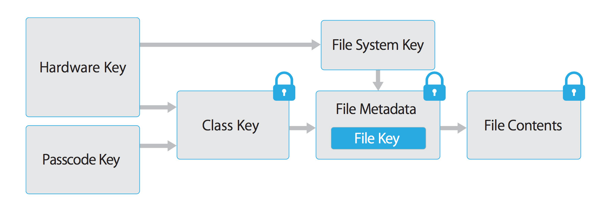
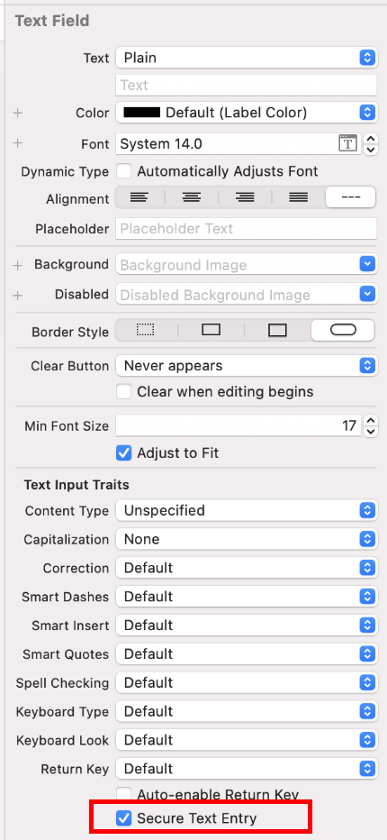

# Data Storage and Privacy Requirements

## MSTG-STORAGE-1
System credential storage facilities need to be used to store sensitive data, such as PII, user credentials or cryptographic keys.

As little sensitive data as possible should be saved in permanent local storage. However, in most practical scenarios, at least some user data must be stored. Fortunately, iOS offers secure storage APIs, which allow developers to use the cryptographic hardware available on every iOS device. If these APIs are used correctly, sensitive data and files can be secured via hardware-backed 256-bit AES encryption.

### Data Protection API

App developers can leverage the iOS Data Protection APIs to implement fine-grained access control for user data stored in flash memory. The APIs are built on top of the Secure Enclave Processor (SEP), which was introduced with the iPhone 5S. The SEP is a coprocessor that provides cryptographic operations for data protection and key management. A device-specific hardware key-the device UID (Unique ID)-is embedded in the secure enclave, ensuring the integrity of data protection even when the operating system kernel is compromised.

The data protection architecture is based on a hierarchy of keys. The UID and the user passcode key (which is derived from the user's passphrase via the PBKDF2 algorithm) sit at the top of this hierarchy. Together, they can be used to "unlock" so-called class keys, which are associated with different device states (e.g., device locked/unlocked).

Every file stored on the iOS file system is encrypted with its own per-file key, which is contained in the file metadata. The metadata is encrypted with the file system key and wrapped with the class key corresponding to the protection class the app selected when creating the file.

The following illustration shows the [iOS Data Protection Key Hierarchy](https://support.apple.com/en-in/guide/security/welcome/web).



Files can be assigned to one of four different protection classes, which are explained in more detail in the [iOS Security Guide](https://support.apple.com/en-in/guide/security/welcome/web):

* Complete Protection (NSFileProtectionComplete): A key derived from the user passcode and the device UID protects this class key. The derived key is wiped from memory shortly after the device is locked, making the data inaccessible until the user unlocks the device.

* Protected Unless Open (NSFileProtectionCompleteUnlessOpen): This protection class is similar to Complete Protection, but, if the file is opened when unlocked, the app can continue to access the file even if the user locks the device. This protection class is used when, for example, a mail attachment is downloading in the background.

* Protected Until First User Authentication (NSFileProtectionCompleteUntilFirstUserAuthentication): The file can be accessed as soon as the user unlocks the device for the first time after booting. It can be accessed even if the user subsequently locks the device and the class key is not removed from memory.

* No Protection (NSFileProtectionNone): The key for this protection class is protected with the UID only. The class key is stored in "Effaceable Storage", which is a region of flash memory on the iOS device that allows the storage of small amounts of data. This protection class exists for fast remote wiping (immediate deletion of the class key, which makes the data inaccessible).

All class keys except NSFileProtectionNone are encrypted with a key derived from the device UID and the user's passcode. As a result, decryption can happen only on the device itself and requires the correct passcode.

Since iOS 7, the default data protection class is "Protected Until First User Authentication".

Reference
* [owasp-mastg Testing Local Data Storage (MSTG-STORAGE-1 and MSTG-STORAGE-2) Data Protection API](https://github.com/OWASP/owasp-mastg/blob/v1.5.0/Document/0x06d-Testing-Data-Storage.md#data-protection-api)

RuleBook
* [Implement access control for user data stored in flash memory utilizing the iOS Data Protection API (Required)](#implement-access-control-for-user-data-stored-in-flash-memory-utilizing-the-ios-data-protection-api-required)

### The Keychain
The iOS Keychain can be used to securely store short, sensitive bits of data, such as encryption keys and session tokens. It is implemented as an SQLite database that can be accessed through the Keychain APIs only.

On macOS, every user application can create as many Keychains as desired, and every login account has its own Keychain. 

The [structure of the Keychain on iOS](https://developer.apple.com/documentation/security/keychain_services) is different: only one Keychain is available to all apps. Access to the items can be shared between apps signed by the same developer via the [access groups feature](https://help.apple.com/xcode/mac/current/#/dev88ff319e7) of the attribute [kSecAttrAccessGroup](https://developer.apple.com/documentation/security/ksecattraccessgroup). Access to the Keychain is managed by the securityd daemon, which grants access according to the app's Keychain-access-groups, application-identifier, and application-group entitlements.

The [Keychain API](https://developer.apple.com/documentation/security/keychain_services) includes the following main operations:

* SecItemAdd
* SecItemUpdate
* SecItemCopyMatching
* SecItemDelete

Data stored in the Keychain is protected via a class structure that is similar to the class structure used for file encryption. Items added to the Keychain are encoded as a binary plist and encrypted with a 128-bit AES per-item key in Galois/Counter Mode (GCM). Note that larger blobs of data aren't meant to be saved directly in the Keychain-that's what the Data Protection API is for. You can configure data protection for Keychain items by setting the kSecAttrAccessible key in the call to SecItemAdd or SecItemUpdate. The following configurable [accessibility values for kSecAttrAccessible](https://developer.apple.com/documentation/security/keychain_services/keychain_items/item_attribute_keys_and_values#1679100) are the Keychain Data Protection classes:

* kSecAttrAccessibleAlways: The data in the Keychain item can always be accessed, regardless of whether the device is locked.
* kSecAttrAccessibleAlwaysThisDeviceOnly: The data in the Keychain item can always be accessed, regardless of whether the device is locked. The data won't be included in an iCloud or local backup.
* kSecAttrAccessibleAfterFirstUnlock: The data in the Keychain item can't be accessed after a restart until the device has been unlocked once by the user.
* kSecAttrAccessibleAfterFirstUnlockThisDeviceOnly: The data in the Keychain item can't be accessed after a restart until the device has been unlocked once by the user. Items with this attribute do not migrate to a new device. Thus, after restoring from a backup of a different device, these items will not be present.
* kSecAttrAccessibleWhenUnlocked: The data in the Keychain item can be accessed only while the device is unlocked by the user.
* kSecAttrAccessibleWhenUnlockedThisDeviceOnly: The data in the Keychain item can be accessed only while the device is unlocked by the user. The data won't be included in an iCloud or local backup.
* kSecAttrAccessibleWhenPasscodeSetThisDeviceOnly: The data in the Keychain can be accessed only when the device is unlocked. This protection class is only available if a passcode is set on the device. The data won't be included in an iCloud or local backup.

AccessControlFlags define the mechanisms with which users can authenticate the key (SecAccessControlCreateFlags):

* kSecAccessControlDevicePasscode: Access the item via a passcode.
* kSecAccessControlBiometryAny: Access the item via one of the fingerprints registered to Touch ID. Adding or removing a fingerprint won't invalidate the item.
* kSecAccessControlBiometryCurrentSet: Access the item via one of the fingerprints registered to Touch ID. Adding or removing a fingerprint will invalidate the item.
* kSecAccessControlUserPresence: Access the item via either one of the registered fingerprints (using Touch ID) or default to the passcode.

Please note that keys secured by Touch ID (via kSecAccessControlBiometryAny or kSecAccessControlBiometryCurrentSet) are protected by the Secure Enclave: The Keychain holds a token only, not the actual key. The key resides in the Secure Enclave.

Starting with iOS 9, you can do ECC-based signing operations in the Secure Enclave. In that scenario, the private key and the cryptographic operations reside within the Secure Enclave. See the static analysis section for more info on creating the ECC keys. iOS 9 supports only 256-bit ECC. Furthermore, you need to store the public key in the Keychain because it can't be stored in the Secure Enclave. After the key is created, you can use the kSecAttrKeyType to indicate the type of algorithm you want to use the key with.

In case you want to use these mechanisms, it is recommended to test whether the passcode has been set. In iOS 8, you will need to check whether you can read/write from an item in the Keychain protected by the kSecAttrAccessibleWhenPasscodeSetThisDeviceOnly attribute. From iOS 9 onward you can check whether a lock screen is set, using LAContext:

Swift:

```swift
public func devicePasscodeEnabled() -> Bool {
    return LAContext().canEvaluatePolicy(.deviceOwnerAuthentication, error: nil)
}
````

Objective-C:

```objectivec
-(BOOL)devicePasscodeEnabled:(LAContex)context{
  if ([context canEvaluatePolicy:LAPolicyDeviceOwnerAuthentication error:nil]) {
        return true;
    } else {
        return false;
    }
}
```

**Keychain Data Persistence**

On iOS, when an application is uninstalled, the Keychain data used by the application is retained by the device, unlike the data stored by the application sandbox which is wiped. In the event that a user sells their device without performing a factory reset, the buyer of the device may be able to gain access to the previous user's application accounts and data by reinstalling the same applications used by the previous user. This would require no technical ability to perform.

When assessing an iOS application, you should look for Keychain data persistence. This is normally done by using the application to generate sample data that may be stored in the Keychain, uninstalling the application, then reinstalling the application to see whether the data was retained between application installations. Use objection runtime mobile exploration toolkit to dump the keychain data. The following objection command demonstrates this procedure:

```bash
...itudehacks.DVIAswiftv2.develop on (iPhone: 13.2.3) [usb] # ios keychain dump
Note: You may be asked to authenticate using the devices passcode or TouchID
Save the output by adding `--json keychain.json` to this command
Dumping the iOS keychain...
Created                    Accessible                      ACL    Type      Account                    Service                                                        Data
-------------------------  ------------------------------  -----  --------  -------------------------  -------------------------------------------------------------  ------------------------------------
2020-02-11 13:26:52 +0000  WhenUnlocked                    None   Password  keychainValue              com.highaltitudehacks.DVIAswiftv2.develop                      mysecretpass123
```

There's no iOS API that developers can use to force wipe data when an application is uninstalled. Instead, developers should take the following steps to prevent Keychain data from persisting between application installations:

* When an application is first launched after installation, wipe all Keychain data associated with the application. This will prevent a device's second user from accidentally gaining access to the previous user's accounts. The following Swift example is a basic demonstration of this wiping procedure:

```swift
let userDefaults = UserDefaults.standard

if userDefaults.bool(forKey: "hasRunBefore") == false {
    // Remove Keychain items here

    // Update the flag indicator
    userDefaults.set(true, forKey: "hasRunBefore")
    userDefaults.synchronize() // Forces the app to update UserDefaults
}
```
* When developing logout functionality for an iOS application, make sure that the Keychain data is wiped as part of account logout. This will allow users to clear their accounts before uninstalling an application.

**Static Analysis**

When you have access to the source code of an iOS app, identify sensitive data that's saved and processed throughout the app. This includes passwords, secret keys, and personally identifiable information (PII), but it may as well include other data identified as sensitive by industry regulations, laws, and company policies. Look for this data being saved via any of the local storage APIs listed below.

Make sure that sensitive data is never stored without appropriate protection. For example, authentication tokens should not be saved in NSUserDefaults without additional encryption. Also avoid storing encryption keys in .plist files, hardcoded as strings in code, or generated using a predictable obfuscation function or key derivation function based on stable attributes.

Sensitive data should be stored by using the Keychain API (that stores them inside the Secure Enclave), or stored encrypted using envelope encryption. Envelope encryption, or key wrapping, is a cryptographic construct that uses symmetric encryption to encapsulate key material. Data encryption keys (DEK) can be encrypted with key encryption keys (KEK) which must be securely stored in the Keychain. Encrypted DEK can be stored in NSUserDefaults or written in files. When required, application reads KEK, then decrypts DEK. Refer to [ OWASP Cryptographic Storage Cheat Sheet ](https://cheatsheetseries.owasp.org/cheatsheets/Cryptographic_Storage_Cheat_Sheet.html#encrypting-stored-keys) to learn more about encrypting cryptographic keys.

**Keychain**

The encryption must be implemented so that the secret key is stored in the Keychain with secure settings, ideally kSecAttrAccessibleWhenPasscodeSetThisDeviceOnly. This ensures the usage of hardware-backed storage mechanisms. Make sure that the AccessControlFlags are set according to the security policy of the keys in the Keychain.

[Generic examples of using the Keychain](https://developer.apple.com/library/archive/samplecode/GenericKeychain/Introduction/Intro.html#//apple_ref/doc/uid/DTS40007797-Intro-DontLinkElementID_2) to store, update, and delete data can be found in the official Apple documentation. The official Apple documentation also includes an example of using [Touch ID and passcode protected keys](https://developer.apple.com/documentation/localauthentication/accessing_keychain_items_with_face_id_or_touch_id).


Here is sample Swift code you can use to create keys (Notice the kSecAttrTokenID as String: kSecAttrTokenIDSecureEnclave: this indicates that we want to use the Secure Enclave directly.):

```swift
// private key parameters
let privateKeyParams = [
    kSecAttrLabel as String: "privateLabel",
    kSecAttrIsPermanent as String: true,
    kSecAttrApplicationTag as String: "applicationTag",
] as CFDictionary

// public key parameters
let publicKeyParams = [
    kSecAttrLabel as String: "publicLabel",
    kSecAttrIsPermanent as String: false,
    kSecAttrApplicationTag as String: "applicationTag",
] as CFDictionary

// global parameters
let parameters = [
    kSecAttrKeyType as String: kSecAttrKeyTypeEC, // Note that kSecAttrKeyTypeEC is now deprecated.
    kSecAttrKeySizeInBits as String: 256,
    kSecAttrTokenID as String: kSecAttrTokenIDSecureEnclave,
    kSecPublicKeyAttrs as String: publicKeyParams,
    kSecPrivateKeyAttrs as String: privateKeyParams,
] as CFDictionary

var pubKey, privKey: SecKey?
let status = SecKeyGeneratePair(parameters, &pubKey, &privKey) // Note that SecKeyGeneratePair is now deprecated.

if status != errSecSuccess {
    // Keys created successfully
}
```

When checking an iOS app for insecure data storage, consider the following ways to store data because none of them encrypt data by default:

Reference
* [owasp-mastg Testing Local Data Storage (MSTG-STORAGE-1 and MSTG-STORAGE-2) The Keychain](https://github.com/OWASP/owasp-mastg/blob/v1.5.0/Document/0x06d-Testing-Data-Storage.md#the-keychain)
* [owasp-mastg Testing Local Data Storage (MSTG-STORAGE-1 and MSTG-STORAGE-2) Static Analysis](https://github.com/OWASP/owasp-mastg/blob/v1.5.0/Document/0x06d-Testing-Data-Storage.md#static-analysis)

RuleBook
* [Securely store values using the Keychain Services API (Required)](#securely-store-values-using-the-keychain-services-api-required)

### NSUserDefaults
The [NSUserDefaults](https://developer.apple.com/documentation/foundation/nsuserdefaults) class provides a programmatic interface for interacting with the default system. The default system allows an application to customize its behavior according to user preferences. Data saved by NSUserDefaults can be viewed in the application bundle. This class stores data in a plist file, but it's meant to be used with small amounts of data.

Reference
* [owasp-mastg Testing Local Data Storage (MSTG-STORAGE-1 and MSTG-STORAGE-2) NSUserDefaults](https://github.com/OWASP/owasp-mastg/blob/v1.5.0/Document/0x06d-Testing-Data-Storage.md#nsuserdefaults)

Rulebook
* [Selecting a storage destination based on the amount of data (Recommended)](#selecting-a-storage-destination-based-on-the-amount-of-data-recommended)

### File system

#### NSData

creates static data objects, while NSMutableData creates dynamic data objects. NSData and NSMutableData are typically used for data storage, but they are also useful for distributed objects applications, in which data contained in data objects can be copied or moved between applications. The following are methods used to write NSData objects:
* NSDataWritingWithoutOverwriting
* NSDataWritingFileProtectionNone
* NSDataWritingFileProtectionComplete
* NSDataWritingFileProtectionCompleteUnlessOpen
* NSDataWritingFileProtectionCompleteUntilFirstUserAuthentication

Reference
* [owasp-mastg Testing Local Data Storage (MSTG-STORAGE-1 and MSTG-STORAGE-2) File system](https://github.com/OWASP/owasp-mastg/blob/v1.5.0/Document/0x06d-Testing-Data-Storage.md#file-system)

RuleBook
* [Implement access control for user data stored in flash memory utilizing the iOS Data Protection API (Required)](#implement-access-control-for-user-data-stored-in-flash-memory-utilizing-the-ios-data-protection-api-required)

#### writeToFile
stores data as part of the NSData class

Reference
* [owasp-mastg Testing Local Data Storage (MSTG-STORAGE-1 and MSTG-STORAGE-2) File system](https://github.com/OWASP/owasp-mastg/blob/v1.5.0/Document/0x06d-Testing-Data-Storage.md#file-system)

#### used to manage file paths

NSSearchPathForDirectoriesInDomains, NSTemporaryDirectory: used to manage file paths

Reference
* [owasp-mastg Testing Local Data Storage (MSTG-STORAGE-1 and MSTG-STORAGE-2) File system](https://github.com/OWASP/owasp-mastg/blob/v1.5.0/Document/0x06d-Testing-Data-Storage.md#file-system)

#### NSFileManager

lets you examine and change the contents of the file system. You can use createFileAtPath to create a file and write to it.

The following example shows how to create a complete encrypted file using the FileManager class. You can find more information in the Apple Developer Documentation ["Encrypting Your App's Files"](https://developer.apple.com/documentation/uikit/protecting_the_user_s_privacy/encrypting_your_app_s_files).

Swift:

```swift
FileManager.default.createFile(
    atPath: filePath,
    contents: "secret text".data(using: .utf8),
    attributes: [FileAttributeKey.protectionKey: FileProtectionType.complete]
)
```

Objective-C:

```objectivec
[[NSFileManager defaultManager] createFileAtPath:[self filePath]
  contents:[@"secret text" dataUsingEncoding:NSUTF8StringEncoding]
  attributes:[NSDictionary dictionaryWithObject:NSFileProtectionComplete
  forKey:NSFileProtectionKey]];
```

Reference
* [owasp-mastg Testing Local Data Storage (MSTG-STORAGE-1 and MSTG-STORAGE-2) File system](https://github.com/OWASP/owasp-mastg/blob/v1.5.0/Document/0x06d-Testing-Data-Storage.md#file-system)

Rulebook
* [How to use encryption in the FileManager class (Required)](#how-to-use-encryption-in-the-filemanager-class-required)

### CoreData/SQLite Databases

#### Core Data

 [Core Data](https://developer.apple.com/library/archive/documentation/Cocoa/Conceptual/CoreData/nsfetchedresultscontroller.html#//apple_ref/doc/uid/TP40001075-CH8-SW1) is a framework for managing the model layer of objects in your application. It provides general and automated solutions to common tasks associated with object life cycles and object graph management, including persistence. [Core Data can use SQLite as its persistent store](https://cocoacasts.com/what-is-the-difference-between-core-data-and-sqlite/), but the framework itself is not a database.

CoreData does not encrypt it's data by default. As part of a research project (iMAS) from the MITRE Corporation, that was focused on open source iOS security controls, an additional encryption layer can be added to CoreData. See the [GitHub Repo](https://github.com/project-imas/encrypted-core-data) for more details.

Reference
* [owasp-mastg Testing Local Data Storage (MSTG-STORAGE-1 and MSTG-STORAGE-2) Core Data](https://github.com/OWASP/owasp-mastg/blob/v1.5.0/Document/0x06d-Testing-Data-Storage.md#coredata)

#### SQLite Databases

The SQLite 3 library must be added to an app if the app is to use SQLite. This library is a C++ wrapper that provides an API for the SQLite commands.

Reference
* [owasp-mastg Testing Local Data Storage (MSTG-STORAGE-1 and MSTG-STORAGE-2) SQLite Databases  ](https://github.com/OWASP/owasp-mastg/blob/v1.5.0/Document/0x06d-Testing-Data-Storage.md#sqlite-databases)

#### Firebase Real-time Databases

Firebase is a development platform with more than 15 products, and one of them is Firebase Real-time Database. It can be leveraged by application developers to store and sync data with a NoSQL cloud-hosted database. The data is stored as JSON and is synchronized in real-time to every connected client and also remains available even when the application goes offline.

A misconfigured Firebase instance can be identified by making the following network call:

`https://\<firebaseProjectName\>.firebaseio.com/.json`

The firebaseProjectName can be retrieved from the property list(.plist) file. For example, PROJECT_ID key stores the corresponding Firebase project name in GoogleService-Info.plist file.

Alternatively, the analysts can use [Firebase Scanner](https://github.com/shivsahni/FireBaseScanner), a python script that automates the task above as shown below:

```bash
python FirebaseScanner.py -f <commaSeparatedFirebaseProjectNames>
```


Reference
* [owasp-mastg Testing Local Data Storage (MSTG-STORAGE-1 and MSTG-STORAGE-2) Firebase Real-time Databases ](https://github.com/OWASP/owasp-mastg/blob/v1.5.0/Document/0x06d-Testing-Data-Storage.md#firebase-real-time-databases)

#### Realm databases

[Realm Objective-C](https://www.mongodb.com/docs/realm/sdk/swift/) and [Realm Swift](https://www.mongodb.com/docs/realm/sdk/swift/) aren't supplied by Apple, but they are still worth noting. They store everything unencrypted, unless the configuration has encryption enabled.

The following example demonstrates how to use encryption with a Realm database:
```swift
// Open the encrypted Realm file where getKey() is a method to obtain a key from the Keychain or a server
let config = Realm.Configuration(encryptionKey: getKey())
do {
 let realm = try Realm(configuration: config)
 // Use the Realm as normal
} catch let error as NSError {
 // If the encryption key is wrong, `error` will say that it's an invalid database
 fatalError("Error opening realm: \(error)")
}
```

Reference
* [owasp-mastg Testing Local Data Storage (MSTG-STORAGE-1 and MSTG-STORAGE-2) Real Databases ](https://github.com/OWASP/owasp-mastg/blob/v1.5.0/Document/0x06d-Testing-Data-Storage.md#realm-databases)

#### Couchbase Lite Databases

[Couchbase Lite](https://github.com/couchbase/couchbase-lite-ios) is a lightweight, embedded, document-oriented (NoSQL) database engine that can be synced. It compiles natively for iOS and macOS.
Reference
* [owasp-mastg Testing Local Data Storage (MSTG-STORAGE-1 and MSTG-STORAGE-2) Couchbase Lite Databases ](https://github.com/OWASP/owasp-mastg/blob/v1.5.0/Document/0x06d-Testing-Data-Storage.md#couchbase-lite-databases)

#### YapDatabase

[YapDatabase](https://github.com/yapstudios/YapDatabase) is a key/value store built on top of SQLite.

Reference
* [owasp-mastg Testing Local Data Storage (MSTG-STORAGE-1 and MSTG-STORAGE-2) YapDatabase ](https://github.com/OWASP/owasp-mastg/blob/v1.5.0/Document/0x06d-Testing-Data-Storage.md#yapdatabase)

**Dynamic Analysis**

One way to determine whether sensitive information (like credentials and keys) is stored insecurely without leveraging native iOS functions is to analyze the app's data directory. Triggering all app functionality before the data is analyzed is important because the app may store sensitive data only after specific functionality has been triggered. You can then perform static analysis for the data dump according to generic keywords and app-specific data.

The following steps can be used to determine how the application stores data locally on a jailbroken iOS device:

1. Trigger the functionality that stores potentially sensitive data.
2. Connect to the iOS device and navigate to its Bundle directory (this applies to iOS versions 8.0 and above):
 /var/mobile/Containers/Data/Application/$APP_ID/
3. Execute grep with the data that you've stored, for example: grep -iRn "USERID".
4. If the sensitive data is stored in plaintext, the app fails this test.

You can analyze the app's data directory on a non-jailbroken iOS device by using third-party applications, such as iMazing.

1. Trigger the functionality that stores potentially sensitive data.
2. Connect the iOS device to your host computer and launch iMazing.
3. Select "Apps", right-click the desired iOS application, and select "Extract App".
4. Navigate to the output directory and locate $APP_NAME.imazing. Rename it to $APP_NAME.zip.
5. Unpack the ZIP file. You can then analyze the application data.

Note that tools like iMazing don't copy data directly from the device. They try to extract data from the backups they create. Therefore, getting all the app data that's stored on the iOS device is impossible: not all folders are included in backups. Use a jailbroken device or repackage the app with Frida and use a tool like objection to access all the data and files.

If you added the Frida library to the app and repackaged it as described in "Dynamic Analysis on Non-Jailbroken Devices" (from the "Tampering and Reverse Engineering on iOS" chapter), you can use [objection](https://github.com/sensepost/objection)  to transfer files directly from the app's data directory or [read files in objection](https://github.com/sensepost/objection/wiki/Using-objection#getting-started-ios-edition) as explained in the chapter "Basic Security Testing on iOS", section ["Host-Device Data Transfer"](https://github.com/OWASP/owasp-mastg/blob/v1.5.0/Document/0x06b-Basic-Security-Testing.md#host-device-data-transfer).

The Keychain contents can be dumped during dynamic analysis. On a jailbroken device, you can use  [Keychain dumper](https://github.com/ptoomey3/Keychain-Dumper/) as described in the chapter "Basic Security Testing on iOS".

The path to the Keychain file is
```bash
/private/var/Keychains/keychain-2.db
```

On a non-jailbroken device, you can use objection to [dump the Keychain items](https://github.com/sensepost/objection/wiki/Notes-About-The-Keychain-Dumper) created and stored by the app.

Reference
* [owasp-mastg Testing Local Data Storage (MSTG-STORAGE-1 and MSTG-STORAGE-2) Dynamic Analysis](https://github.com/OWASP/owasp-mastg/blob/v1.5.0/Document/0x06d-Testing-Data-Storage.md#dynamic-analysis)

### Dynamic Analysis with Xcode and iOS simulator

This test is only available on macOS, as Xcode and the iOS simulator is needed.

For testing the local storage and verifying what data is stored within it, it's not mandatory to have an iOS device. With access to the source code and Xcode the app can be build and deployed in the iOS simulator. The file system of the current device of the iOS simulator is available in `~/Library/Developer/CoreSimulator/Devices`.

Once the app is running in the iOS simulator, you can navigate to the directory of the latest simulator started with the following command:

```bash
$ cd ~/Library/Developer/CoreSimulator/Devices/$(
ls -alht ~/Library/Developer/CoreSimulator/Devices | head -n 2 |
awk '{print $9}' | sed -n '1!p')/data/Containers/Data/Application
```

The command above will automatically find the UUID of the latest simulator started. Now you still need to grep for your app name or a keyword in your app. This will show you the UUID of the app.

```bash
grep -iRn keyword .
```

Then you can monitor and verify the changes in the filesystem of the app and investigate if any sensitive information is stored within the files while using the app.

Reference
* [owasp-mastg Testing Local Data Storage (MSTG-STORAGE-1 and MSTG-STORAGE-2) Dynamic Analysis with Xcode and iOS simulator](https://github.com/OWASP/owasp-mastg/blob/v1.5.0/Document/0x06d-Testing-Data-Storage.md#dynamic-analysis-with-xcode-and-ios-simulator)

### Dynamic Analysis with Objection

You can use the [Objection](https://github.com/sensepost/objection) runtime mobile exploration toolkit to find vulnerabilities caused by the application's data storage mechanism. Objection can be used without a Jailbroken device, but it will require [patching the iOS Application](https://github.com/sensepost/objection/wiki/Patching-iOS-Applications).

Reference
* [owasp-mastg Testing Local Data Storage (MSTG-STORAGE-1 and MSTG-STORAGE-2) Dynamic Analysis with Objection](https://github.com/OWASP/owasp-mastg/blob/v1.5.0/Document/0x06d-Testing-Data-Storage.md#dynamic-analysis-with-objection)

#### Reading the Keychain

To use Objection to read the Keychain, execute the following command:

```bash
...itudehacks.DVIAswiftv2.develop on (iPhone: 13.2.3) [usb] # ios keychain dump
Note: You may be asked to authenticate using the devices passcode or TouchID
Save the output by adding `--json keychain.json` to this command
Dumping the iOS keychain...
Created                    Accessible                      ACL    Type      Account                    Service                                                        Data
-------------------------  ------------------------------  -----  --------  -------------------------  -------------------------------------------------------------  ------------------------------------
2020-02-11 13:26:52 +0000  WhenUnlocked                    None   Password  keychainValue              com.highaltitudehacks.DVIAswiftv2.develop                      mysecretpass123
```

Reference
* [owasp-mastg Testing Local Data Storage (MSTG-STORAGE-1 and MSTG-STORAGE-2) Dynamic Analysis Reading the Keychain](https://github.com/OWASP/owasp-mastg/blob/v1.5.0/Document/0x06d-Testing-Data-Storage.md#reading-the-keychain)


#### Searching for Binary Cookies

iOS applications often store binary cookie files in the application sandbox. Cookies are binary files containing cookie data for application WebViews. You can use objection to convert these files to a JSON format and inspect the data.

```bash
...itudehacks.DVIAswiftv2.develop on (iPhone: 13.2.3) [usb] # ios cookies get --json
[
    {
        "domain": "highaltitudehacks.com",
        "expiresDate": "2051-09-15 07:46:43 +0000",
        "isHTTPOnly": "false",
        "isSecure": "false",
        "name": "username",
        "path": "/",
        "value": "admin123",
        "version": "0"
    }
]
```

Reference
* [owasp-mastg Testing Local Data Storage (MSTG-STORAGE-1 and MSTG-STORAGE-2) Dynamic Analysis Searching for Binary Cookies](https://github.com/OWASP/owasp-mastg/blob/v1.5.0/Document/0x06d-Testing-Data-Storage.md#searching-for-binary-cookies)

#### Searching for Property List Files

iOS applications often store data in property list (plist) files that are stored in both the application sandbox and the IPA package. Sometimes these files contain sensitive information, such as usernames and passwords; therefore, the contents of these files should be inspected during iOS assessments. Use the ios plist cat plistFileName.plist command to inspect the plist file.

To find the file userInfo.plist, use the env command. It will print out the locations of the applications Library, Caches and Documents directories:

```bash
...itudehacks.DVIAswiftv2.develop on (iPhone: 13.2.3) [usb] # env
Name               Path
-----------------  -------------------------------------------------------------------------------------------
BundlePath         /private/var/containers/Bundle/Application/B2C8E457-1F0C-4DB1-8C39-04ACBFFEE7C8/DVIA-v2.app
CachesDirectory    /var/mobile/Containers/Data/Application/264C23B8-07B5-4B5D-8701-C020C301C151/Library/Caches
DocumentDirectory  /var/mobile/Containers/Data/Application/264C23B8-07B5-4B5D-8701-C020C301C151/Documents
LibraryDirectory   /var/mobile/Containers/Data/Application/264C23B8-07B5-4B5D-8701-C020C301C151/Library
```

Reference
* [owasp-mastg Testing Local Data Storage (MSTG-STORAGE-1 and MSTG-STORAGE-2) Dynamic Analysis Searching for Property List Files](https://github.com/OWASP/owasp-mastg/blob/v1.5.0/Document/0x06d-Testing-Data-Storage.md#searching-for-property-list-files)

Go to the Documents directory and list all files using ls.

```bash
...itudehacks.DVIAswiftv2.develop on (iPhone: 13.2.3) [usb] # ls
NSFileType      Perms  NSFileProtection                      Read    Write    Owner         Group         Size      Creation                   Name
------------  -------  ------------------------------------  ------  -------  ------------  ------------  --------  -------------------------  ------------------------
Directory         493  n/a                                   True    True     mobile (501)  mobile (501)  192.0 B   2020-02-12 07:03:51 +0000  default.realm.management
Regular           420  CompleteUntilFirstUserAuthentication  True    True     mobile (501)  mobile (501)  16.0 KiB  2020-02-12 07:03:51 +0000  default.realm
Regular           420  CompleteUntilFirstUserAuthentication  True    True     mobile (501)  mobile (501)  1.2 KiB   2020-02-12 07:03:51 +0000  default.realm.lock
Regular           420  CompleteUntilFirstUserAuthentication  True    True     mobile (501)  mobile (501)  284.0 B   2020-05-29 18:15:23 +0000  userInfo.plist
Unknown           384  n/a                                   True    True     mobile (501)  mobile (501)  0.0 B     2020-02-12 07:03:51 +0000  default.realm.note

Readable: True  Writable: True
```

Execute the ios plist cat command to inspect the content of userInfo.plist file.

```bash
...itudehacks.DVIAswiftv2.develop on (iPhone: 13.2.3) [usb] # ios plist cat userInfo.plist
{
        password = password123;
        username = userName;
}
```

#### Searching for SQLite Databases

iOS applications typically use SQLite databases to store data required by the application. Testers should check the data protection values of these files and their contents for sensitive data. Objection contains a module to interact with SQLite databases. It allows to dump the schema, their tables and query the records.

```bash
...itudehacks.DVIAswiftv2.develop on (iPhone: 13.2.3) [usb] # sqlite connect Model.sqlite
Caching local copy of database file...
Downloading /var/mobile/Containers/Data/Application/264C23B8-07B5-4B5D-8701-C020C301C151/Library/Application Support/Model.sqlite to /var/folders/4m/dsg0mq_17g39g473z0996r7m0000gq/T/tmpdr_7rvxi.sqlite
Streaming file from device...
Writing bytes to destination...
Successfully downloaded /var/mobile/Containers/Data/Application/264C23B8-07B5-4B5D-8701-C020C301C151/Library/Application Support/Model.sqlite to /var/folders/4m/dsg0mq_17g39g473z0996r7m0000gq/T/tmpdr_7rvxi.sqlite
Validating SQLite database format
Connected to SQLite database at: Model.sqlite

SQLite @ Model.sqlite > .tables
+--------------+
| name         |
+--------------+
| ZUSER        |
| Z_METADATA   |
| Z_MODELCACHE |
| Z_PRIMARYKEY |
+--------------+
Time: 0.013s

SQLite @ Model.sqlite > select * from Z_PRIMARYKEY
+-------+--------+---------+-------+
| Z_ENT | Z_NAME | Z_SUPER | Z_MAX |
+-------+--------+---------+-------+
| 1     | User   | 0       | 0     |
+-------+--------+---------+-------+
1 row in set
Time: 0.013s
```

Reference
* [owasp-mastg Testing Local Data Storage (MSTG-STORAGE-1 and MSTG-STORAGE-2) Dynamic Analysis Searching for SQLite Databases](https://github.com/OWASP/owasp-mastg/blob/v1.5.0/Document/0x06d-Testing-Data-Storage.md#searching-for-sqlite-databases)

#### Searching for Cache Databases
By default NSURLSession stores data, such as HTTP requests and responses in the Cache.db database. This database can contain sensitive data, if tokens, usernames or any other sensitive information has been cached. To find the cached information open the data directory of the app (/var/mobile/Containers/Data/Application/<UUID>) and go to /Library/Caches/<Bundle Identifier>. The WebKit cache is also being stored in the Cache.db file. Objection can open and interact with the database with the command sqlite connect Cache.db, as it is a normal SQLite database.

It is recommended to disable Caching this data, as it may contain sensitive information in the request or response. The following list below shows different ways of achieving this:

1. It is recommended to remove Cached responses after logout. This can be done with the provided method by Apple called [removeAllCachedResponses](https://developer.apple.com/documentation/foundation/urlcache/1417802-removeallcachedresponses)
    You can call this method as follows:

    `URLCache.shared.removeAllCachedResponses()`

    This method will remove all cached requests and responses from Cache.db file.

2. If you don't need to use the advantage of cookies it would be recommended to just use the [.ephemeral](https://developer.apple.com/documentation/foundation/urlsessionconfiguration/1410529-ephemeral) configuration property of URLSession, which will disable saving cookies and Caches.

    [Apple documentation](https://developer.apple.com/documentation/foundation/urlsessionconfiguration/1410529-ephemeral)：

    ```An ephemeral session configuration object is similar to a default session configuration (see default), except that the corresponding session object doesn’t store caches, credential stores, or any session-related data to disk. Instead, session-related data is stored in RAM. The only time an ephemeral session writes data to disk is when you tell it to write the contents of a URL to a file.```

3. Cache can be also disabled by setting the Cache Policy to [.notAllowed](https://developer.apple.com/documentation/foundation/urlcache/storagepolicy/notallowed). It will disable storing Cache in any fashion, either in memory or on disk.

Reference
* [owasp-mastg Testing Local Data Storage (MSTG-STORAGE-1 and MSTG-STORAGE-2) Dynamic Analysis Searching for Cache Databases](https://github.com/OWASP/owasp-mastg/blob/v1.5.0/Document/0x06d-Testing-Data-Storage.md#searching-for-cache-databases)

Rulebook
* [Review cache specifications and data stored in Cache.db (Required)](#review-cache-specifications-and-data-stored-in-cachedb-required)

### RuleBook

1. [Implement access control for user data stored in flash memory utilizing the iOS Data Protection API (Required)](#implement-access-control-for-user-data-stored-in-flash-memory-utilizing-the-ios-data-protection-api-required)
1. [Erase keychain data on first startup after installation (Required)](#erase-keychain-data-on-first-startup-after-installation-required)
1. [Clear keychain data at account logout (Required)](#clear-keychain-data-at-account-logout-required)
1. [Securely store values using the Keychain Services API (Required)](#securely-store-values-using-the-keychain-services-api-required)
1. [Selecting a storage destination based on the amount of data (Recommended)](#selecting-a-storage-destination-based-on-the-amount-of-data-recommended)
1. [How to use encryption in the FileManager class (Required)](#how-to-use-encryption-in-the-filemanager-class-required)
1. [Review cache specifications and data stored in Cache.db (Required)](#review-cache-specifications-and-data-stored-in-cachedb-required)

#### Implement access control for user data stored in flash memory utilizing the iOS Data Protection API (Required)

The iOS Data Protection API is used for files with large data. iOS has a file protection mechanism called Data Protection.
The following data protection attributes are defined in iOS.

* NSFileProtectionNone
* NSFileProtectionComplete
* NSFileProtectionCompleteUnlessOpen
* NSFileProtectionCompleteUntilFirstUserAuthentication

Which attribute is applied by default when creating a file depends on the framework and API. For example, in Data#write(to: options: error: ), NSFileProtectionComplete is applied if not specified, but for Core Data database files persisted with NSPersistentStoreCoordinator NSFileProtectionCompleteUtilFirstUserAuthentication is applied.

The following is an example of Data class generation.
```swift
import UIKit

class GetDataBitSample {
    func getData() -> Data? {

        let text: String = "Hello."

        // Convert string to Data type.
        guard let data = text.data(using: .utf8) else {
            return nil
        }

        return data
    }
}
```

**Protection Attribute Complete Protection （ NSFileProtectionComplete ）**

Option to allow access to files only while the device is unlocked.

The system stores files in encrypted format and apps can only read or write files while the device is unlocked. Otherwise, apps will fail when attempting to read or write files.

The sample code below is an example of using the option "Protection Attribute Complete Protection".
```swift
import UIKit

class ViewController: UIViewController {

    func writeFileDataCompleteFileProtection(data: Data, fileURL: URL) {

        do {
            // Write the contents of the data buffer in the URL location.
            // Option to allow access to files only while the device is unlocked.
            try data.write(to: fileURL, options: .completeFileProtection)

        } catch {
            // exception write failed.
        }

    }
}
```
    
**Protection Attribute Protected Unless Open （ NSFileProtectionCompleteUnlessOpen ）**

Option to allow access to a file when the device is unlocked or the file is already open.

If the device is locked, the app cannot open and read/write files, but can create new files.
If a file is open when the device is locked, the app can read and write to the open file.

The sample code below is an example of using the option "Protection Attribute Protected Unless Open".
```swift
import UIKit

class ViewController: UIViewController {

    func writeFileDataCompleteFileProtectionUnlessOpen(data: Data, fileURL: URL) {

        do {

            // Write the contents of the data buffer in the URL location.
            // Option to allow access to a file when the device is unlocked or the file is already open.
            try data.write(to: fileURL, options: .completeFileProtectionUnlessOpen)

        } catch {
            // exception write failed.
        }

    }
}
```

**Protection Attribute Protected Until First User Authentication （ NSFileProtectionCompleteUntilFirstUserAuthentication ）**
   
Option to allow the user to access files after first unlocking the device.

While the device is unlocked, the app can read or write files, but files opened by the app will be in the same state of protection as Complete Protection.

The sample code below is an example of using the option "Protection Attribute Protected Until First User Authentication".
```swift
import UIKit

class ViewController: UIViewController {

    func writeFileDataCompleteFileProtectionUntilFirstUserAuthentication(data: Data, fileURL: URL) {

        do {

            // Write the contents of the data buffer in the URL location.
            // Option to allow users to access files after first unlocking the device
            try data.write(to: fileURL, options: .completeFileProtectionUntilFirstUserAuthentication)

        } catch {
            // exception write failed.
        }

    }
}
```

**Protection Attribute No Protection （ NSFileProtectionNone ）**

An insecure (unprotected) option that creates the protection class key only with UID when writing out the file.

The system encrypts the file but is consequently insecure because the protection class key is created only with the UID, and the app always has access to this file.

The sample code below is an example of using the option "Protection Attribute No Protection".
```swift
import UIKit

class ViewController: UIViewController {

    func writeFileDataNoFileProtection(data: Data, fileURL: URL) {

        do {

            // Write the contents of the data buffer in the URL location.
            // Option to not encrypt files when writing them out.
            try data.write(to: fileURL, options: .noFileProtection)

        } catch {
            // exception write failed.
        }
    }
}
```

**Setting the appropriate level of protection**

Depending on the protection level of the file, it may not be possible to read or write the contents of the file if the user subsequently locks the device. To ensure that the app has access to the file, the following should be followed

* Assign a "Complete Protection" level to the file you are accessing only when the app is in the foreground. (Complete Protection)
* If the app supports background features such as location update processing, assign a different protection level to the file so that it can be accessed while in the background. (Protected Unless Open)

Files containing users' personal information and files created directly by users always require the highest level of protection.

Reference
* [Encrypting Your App’s Files](https://developer.apple.com/jp/documentation/uikit/protecting_the_user_s_privacy/encrypting_your_app_s_files/)

If this is violated, the following may occur.
* Unintended access to files may be implemented if the appropriate level of protection is not set.

#### Erase keychain data on first startup after installation (Required)

When the application is launched for the first time after installation, all Keychain data associated with the application is erased. This prevents the second user of the device from accidentally accessing the previous user's account.

The following Swift example is a basic demonstration of this erasure procedure.
```swift
let userDefaults = UserDefaults.standard

if userDefaults.bool(forKey: "hasRunBefore") == false {
    // Remove Keychain items here

    // Update the flag indicator
    userDefaults.set(true, forKey: "hasRunBefore")
    userDefaults.synchronize() // Forces the app to update UserDefaults
}
```

If this is violated, the following may occur.
* The second user of the device may accidentally access the previous user's account.

#### Clear keychain data at account logout (Required)

When developing a logout feature for an iOS application, ensure that Keychain data is erased as part of the account logout. This allows users to clear their accounts before uninstalling the application.

If this is violated, the following may occur.
* Keychain data may be used by another user.

#### Securely store values using the Keychain Services API (Required)

The Keychain Service API can store data in an encrypted database called Keychain.
This is suitable for storing sensitive data (passwords, credit card information, encryption keys and certificates managed by Certificate, Key, and Trust Services, etc.).

Keychain items are encrypted using two different AES-256-GCM keys: a table key (metadata) and a per-row key (secret key).
Keychain metadata (all attributes except kSecValue) is encrypted with the metadata key to increase search speed, and the secret value (kSecValueData) is encrypted with the corresponding secret key. The metadata key is protected by Secure Enclave, but is cached in the application processor for speed. The private key must always be exchanged through the Secure Enclave.

Hardware support is required to use Secure Enclave. (iOS devices with A7 or later processors)


Keychains are implemented in SQLite database format and stored on the file system. There is only one database, and the securityd daemon determines which Keychain items each process or app can access.


Sharing of Keychain items is only possible between apps by the same developer. To share Keychain items, third-party apps use access groups based on a prefix assigned through the Apple Developer Program for the application group. The prefix requirement and application group uniqueness is accomplished through code signing, provisioning profiles, and the Apple Developer Program.

Keychain data is protected by a class structure similar to that used in file data protection and behaves in the same manner as each class of file data protection.


| When available | File Data Protection | Keychain Data Protection |
| :--- | :--- | :--- |
| When unlocked | NSFileProtectionComplete | kSecAttrAccessibleWhenUnlocked |
| Locked | NSFileProtectionCompleteUnlessOpen | not allowed |
| After initial unlocking | NSFileProtectionCompleteUntilFirstUserAuthentication | kSecAttrAccessibleAfterFirstUnlock |
| always on | NSFileProtectionNone | kSecAttrAccessibleAlways (This item is currently deprecated.) |
| When the passcode is valid | not allowed | kSecAttrAccessibleWhenPasscodeSetThisDeviceOnly |

Apps using the background update service use kSecAttrAccessibleAfterFirstUnlock for keychain items that need to be accessed.
SecAttrAccessibleWhenPasscodeSetThisDeviceOnly works the same as kSecAttrAccessibleWhenUnlocked, but is only available when a passcode is configured on the device.

The sample code below is an example of the process of retrieving data from keychain and saving it to keychain if it does not exist.
```swift
import Foundation

class Keychain {
    
    let group: String = "group_1" // group
    var id: String = "id"

    let backgroundQueue = DispatchQueue.global(qos: .userInitiated)
    
    func addKeychain(data: Data) {

        // Argument settings when executing the API
        let dic: [String: Any] = [kSecClass as String: kSecClassGenericPassword, // Class：Password Class
            kSecAttrGeneric as String: group,                // optional item
            kSecAttrAccount as String: id,                 // Account (Login ID)
            kSecValueData as String: data,                // Password and other stored information
            kSecAttrService as String: "key"]            // service name

        // Dictionary for search
        let search: [String: Any] = [kSecClass as String: kSecClassGenericPassword,
                                     kSecAttrService as String: "key",
                                     kSecReturnAttributes as String: kCFBooleanTrue as Any,
                                     kSecMatchLimit as String: kSecMatchLimitOne]as [String : Any]

        // Search data from keychain
        findKeychainItem(attributes: search as CFDictionary, { status, item in
            switch status {
                case errSecItemNotFound: // No data exists in keychain
                    // Save to keychain
                    _ = SecItemAdd(dic as CFDictionary, nil)
                default:
                    break
            }
        })

    }
    
    /// Search for the existence of an item from Keychain
    /// - Parameters:
    ///   - attrs: Data for search
    ///   - completion: search results
    func findKeychainItem(attributes attrs: CFDictionary, _ completion: @escaping (OSStatus, CFTypeRef?) -> Void) {
        
        // The application UI may hang when called from the main thread because the calling thread is blocked.
        // Recommended to run in a separate thread.
        backgroundQueue.async {
            var item: CFTypeRef?
            let result = SecItemCopyMatching(attrs, &item)
            completion(result, item)
        }
    }

}
```


**Save to keychain SecItemAdd**

SecItemAdd adds one or more items to the Keychain.
To add multiple items to the keychain at once, use a dictionary key with an array of dictionaries as values. (Only password items are excluded.)

As a performance consideration, the app UI may hang when called from the main thread because it blocks threads. Execution outside the main thread is recommended.

The sample code below is an example of the process of saving to keychain.
```swift
import Foundation

class KeyChainSample {
    let queue = DispatchQueue(label: "queuename", attributes: .concurrent)

    func addKeychainItem(query: CFDictionary, _ completion: @escaping (OSStatus) -> Void) {
        queue.async {
            let result = SecItemAdd(query, nil)
            completion(result)
        }
    }
}
```

**keychain updates SecItemUpdate**

SecItemUpdate updates items matching the search query.
Update the relevant item by passing a dictionary containing the attribute whose value is to be changed and the new value.

See SecItemCopyMatching function for information on how to create a search query.

As a performance consideration, the app UI may hang when called from the main thread because it blocks threads. Running off the main thread is recommended.

The sample code below is an example of a keychain update process.
```swift
import Foundation

class KeyChainSample {
    let queue = DispatchQueue(label: "queuename", attributes: .concurrent)

    func updateKeychainItem(key: String, loginId: String, data: String, update updateAttrs: CFDictionary, _ completion: @escaping (OSStatus) -> Void) {
        queue.async {
            let attrs: CFDictionary =
            [kSecClass as String: kSecClassGenericPassword,
             kSecAttrGeneric as String: key,           // Free items (group)
             kSecAttrAccount as String: loginId,       // Account (e.g. login ID)
             kSecValueData as String: data            // Preserved Information
            ] as CFDictionary

            // Matching execution of keychain
            let matchingStatus = SecItemCopyMatching(attrs, nil)

            // Status of Matching Results
            switch matchingStatus {
            case errSecSuccess: // Search Success
                // update
                let result = SecItemUpdate(attrs, updateAttrs)
                completion(result)
            default:
                debugPrint("failed updateKeychainItem status. (\(matchingStatus)")
                completion(matchingStatus)
            }

        }
    }
}
```

**keychain data search SecItemCopyMatching**

SecItemCopyMatching returns one or more Keychain items matching the search query or copies the attributes of a particular Keychain item.

By default, this function searches for items in the Keychain. (Same as specifying kSecReturnData)
To limit the Keychain search to a specific Keychain or multiple Keychains, specify a search key and pass a dictionary with objects containing items of item type as their values.


Change the designation of how search results are returned
* kSecReturnData : Returns the item's data in object format (1 item). ( Default )
* kSecReturnAttributes : Returns the item's data in dictionary format (multiple items).
* kSecReturnRef : Returns a reference to the item.
* kSecReturnPersistentRef : Returns a reference to an item. Unlike normal references, persistent references return references that are stored on disk or used between processes.

As a performance consideration, the app UI may hang when called from the main thread because it blocks threads. Execution outside the main thread is recommended.

The sample code below is an example of keychain data retrieval process.
```swift
import Foundation

class KeyChainSample {
    let backgroundQueue = DispatchQueue(label: "queuename", attributes: .concurrent)

    func findKeychainItem(loginId: String,_ completion: @escaping (OSStatus, CFTypeRef?) -> Void) {

        let query : CFDictionary = [
                kSecClass as String       : kSecClassGenericPassword,
                kSecAttrAccount as String : loginId,
                kSecReturnData as String  : true,  // default value (kSecReturnData: true)
                kSecMatchLimit as String  : kSecMatchLimitOne ] as CFDictionary

        backgroundQueue.async {
            var item: CFTypeRef?
            let result = SecItemCopyMatching(query, &item)
            completion(result, item)
        }
    }
}
```

**keychain data deletion SecItemDelete**

SecItemDelete deletes items matching the search query.

As a performance consideration, the app UI may hang when called from the main thread because it blocks threads. Execution outside the main thread is recommended.

The sample code below is an example of keychain data deletion process.
```swift
import Foundation

class KeyChainSample {
    let queue = DispatchQueue(label: "queuename", attributes: .concurrent)

    private func deleteKeychainItem(searchAttributes attrs: CFDictionary, _ completion: @escaping (OSStatus) -> Void) {
        queue.async {
            let result = SecItemDelete(attrs)
            completion(result)
        }
    }
}
```

**Setting conditions for access to keychain**

It is possible to set when the app can access the data of Keychain items.

By default, Keychain items can only be accessed when the device is unlocked. However, to account for devices that do not have passcodes set, it may be necessary to allow access to items only from devices protected by passcodes. Alternatively, access restrictions can be relaxed to allow items to be accessed from background processes when the device is locked.

The Keychain service provides a way to manage the accessibility of individual Keychain items according to the state of the device in combination with input from the user.

Control your app's access to Keychain items related to device state by setting the item's attributes when the item is created.
In terms of setting accessibility values, a query dictionary that uses the default accessibility should specify the following

The sample code below is an example of how to specify a query dictionary that uses default accessibility.
```swift
import Foundation

class KeyChainSample {

    func querySample() {

        let account = "test string"
        let server = "test string"
        let password = "test string"

        // Configure KeyChain Item
        var query: [String: Any] = [kSecClass as String: kSecClassInternetPassword,
                                kSecAttrAccount as String: account,
                                kSecAttrServer as String: server,
                                kSecAttrAccessible as String: kSecAttrAccessibleWhenUnlocked, // accessible
                                kSecValueData as String: password]

        SecItemAdd(query as CFDictionary, nil)

    }
}
```

Possible values for accessibility are as follows

**kSecAttrAccessibleAlways**

Data on Keychain items is always accessible, regardless of whether the device is locked or not.
Using an encrypted backup will migrate items with this attribute to the new device.
Note that this item is currently deprecated.

**kSecAttrAccessibleAlwaysThisDeviceOnly**

Keychain item data is always accessible, regardless of whether the device is locked or not.
Items with this attribute will not be migrated to a new device. Therefore, these items will no longer exist when restoring from a backup on another device.
Note that this item is currently deprecated.

**kSecAttrAccessibleAfterFirstUnlock**

Data on Keychain items cannot be accessed after a reboot until the user has unlocked the device once.
After the first unlock, the data can be accessed until the next reboot. This is recommended if the item needs to be accessed from a background application. Using an encrypted backup will migrate items with this attribute to the new device.

**kSecAttrAccessibleAfterFirstUnlockThisDeviceOnly**

Data on Keychain items cannot be accessed after a reboot until the user has unlocked the device once.
After the first unlock, the data can be accessed until the next reboot. This is recommended if the item needs to be accessed from a background application. Items with this attribute are not migrated to the new device. Therefore, these items will no longer be present when restoring from a backup on another device.

**kSecAttrAccessibleWhenUnlocked**

Data on Keychain items can only be accessed while the user is unlocking the device.
This is recommended for items that need to be accessible only while the application is in the foreground. Using an encrypted backup, items with this attribute will be migrated to the new device.

This is the default value for Keychain items added without explicitly setting an accessibility constant.

**kSecAttrAccessibleWhenUnlockedThisDeviceOnly**

Data on Keychain items can only be accessed while the user is unlocking the device.
This is recommended for items that need to be accessible only while the application is in the foreground. Items with this attribute will not be migrated to a new device. Therefore, in a restore from a backup on another device, these items will no longer exist.

**kSecAttrAccessibleWhenPasscodeSetThisDeviceOnly**

Data in the Keychain can only be accessed if the device is unlocked. It can only be used if a passcode has been set on the device.
This is recommended for items that need to be accessible only while the application is in the foreground. Items with this attribute will not be migrated to a new device. If a backup is restored to a new device, these items will be lost. Devices without a passcode cannot store items in this class. Disabling the device passcode will delete all items in this class.

Always use the most restrictive option appropriate for your app so that the system can protect that item as much as possible. For very sensitive data that you do not want to store in iCloud, use kSecAttrAccessibleWhenPasscodeSetThisDeviceOnly.

In addition, the following rules must be followed when using Keychain.
* When using Keychain, the AccessControlFlags setting must follow the security policy for the keys in the Keychain.
* When using Keychain, the recommended accessibility value to set is kSecAtrAccessibilityWhenPasscodeSetThisDeviceOnly

Accessibility restricted access by device state, but allowing access only when the device is unlocked may not be secure enough in all cases.
If the app can control the bank account directly, it should again verify the authorized user just before retrieving login credentials from the Keychain. This will protect the account even if the user passes the device to someone else in an unlocked state.

This restriction can be added by specifying an instance ( SecAccessControlCreateFlags ) as the value of the attribute when creating the keychain item. Access control is used in that case.

The sample code below is an example of how to specify access control flags in the access control.
```swift
import Foundation

class KeyChainSample {

    func flagsSample() {
        // flags (kSecAccessControlBiometryAny | kSecAccessControlApplicationPassword)
        // (using OptionSet, a Swift bit set type)
        let flags: SecAccessControlCreateFlags = [.biometryAny, .applicationPassword]
        let access = SecAccessControlCreateWithFlags(nil,
                                                     kSecAttrAccessibleWhenPasscodeSetThisDeviceOnly,
                                                     flags, //Can also be specified directly as ".biometryAny"
                                                     nil)
    }
}
```

The sample code below is an example of how to specify a query dictionary using access control.
```swift
import UIKit

class KeyChainSample {
    func keySample(tag: String) {
        let account = "test string"
        let server = "test string"
        let password = "test string"

        // Ccreate SecAccessControl Flags
        guard let access = SecAccessControlCreateWithFlags(nil,  // Use the default allocator.
                                                     kSecAttrAccessibleWhenUnlocked, // accessible
                                                     .userPresence,
                                                     nil
        ) else {
            // Abnormal handling
            return
        }

        // kSecAttrAccessible and kSecAttrAccessControl cannot coexist. Either one should be specified.
         var query: [String: Any] = [kSecClass as String: kSecClassInternetPassword,
                                    kSecAttrAccount as String: account,
                                    kSecAttrServer as String: server,
                                    kSecAttrAccessControl as String: access,
                                    kSecValueData as String: password]

        SecItemAdd(query as CFDictionary, nil)
    }
}
```

The options that can be set for access control are as follows

**kSecAccessControlDevicePasscode**

Constraints for accessing items with a passcode.

**kSecAccessControlBiometryAny**

Constraints for accessing items with Touch ID or Face ID of the registered finger.
Touch ID must be available and registered with at least one finger. Or Face ID must be available and registered. Items can continue to be accessed with Touch ID if a finger is added or removed, or with Face ID if the user is re-registered.

**kSecAccessControlBiometryCurrentSet**

Constraints to access items using Touch ID on the currently registered finger or from Face ID of the currently registered user.
Touch ID must be available and registered with at least one finger, or Face ID must be available and registered. If a finger is added or removed from Touch ID, or if the user re-enrolls in Face ID, the item is disabled.

**kSecAccessControlUserPresence**

Constraints on access to items using either biometry or passcodes.
Biometry need not be available or registered. Items can be accessed by Touch ID even if a finger is added or removed, or by Face ID if the user is re-enrolled.


Furthermore, in addition to requesting specific device status and user presence, an application-specific password can be requested. This is different from a passcode that unlocks the device and thus can explicitly protect a specific Keychain item.

To do this, include the flag when defining the access control flags in the access control.

The sample code below is an example of how to include flags and specify query dictionary when defining access control flags in access control.
```swift
import UIKit

class KeyChainSample {
    func keySample(tag: String) {
        let account = "test string"
        let server = "test string"
        let password = "test string"

        // Ccreate SecAccessControl Flags

        // flags (kSecAccessControlBiometryAny | kSecAccessControlApplicationPassword)
        // (Using OptionSet, a Swift bit-set type)
        let flags: SecAccessControlCreateFlags = [.biometryAny, .applicationPassword]
        guard let access = SecAccessControlCreateWithFlags(nil,
                                                     kSecAttrAccessibleWhenPasscodeSetThisDeviceOnly,
                                                     flags,
                                                     nil
        ) else {
            //Abnormal handling
            return
        }
        // kSecAttrAccessible and kSecAttrAccessControl cannot coexist. Specify either.
         var query: [String: Any] = [kSecClass as String: kSecClassInternetPassword,
                                    kSecAttrAccount as String: account,
                                    kSecAttrServer as String: server,
                                    kSecAttrAccessControl as String: access,
                                    kSecValueData as String: password]

        SecItemAdd(query as CFDictionary, nil)
    }
}
```

Adding this flag will prompt the user for a password when the item is created and again before the item can be retrieved. Items can only be retrieved if the user successfully enters the password, regardless of whether other conditions are met.

In addition, when multiple access controls are set, it is possible to add a condition that requires all constraints to be passed (kSecAccessControlAnd ) or a condition that can be satisfied by passing one of the constraints (kSecAccessControlOr ). Add to the access control flags by bitwise operation.

The sample code below is an example of how to specify bits for access control.
```swift
import Foundation

class KeyChainTest {

    func flagsTest() {
        // Access control bit specification (using OptionSet, a Swift bit set type)
        let flags: SecAccessControlCreateFlags = [.biometryAny, .devicePasscode, .or]

        let access = SecAccessControlCreateWithFlags(nil,
                                                     kSecAttrAccessibleWhenUnlocked,
                                                     flags,
                                                     nil) // Ignore any error.
    }
}
```

**kSecAccessControlApplicationPassword**

This may be specified in addition to any constraints.

**kSecAccessControlPrivateKeyUsage**

This option can be combined with any other access control flags.

You typically use this constraint when you create a key pair and store the private key inside a device’s Secure Enclave (by specifying the [kSecAttrTokenID](https://developer.apple.com/documentation/security/ksecattrtokenid) attribute with a value of [kSecAttrTokenIDSecureEnclave](https://developer.apple.com/documentation/security/ksecattrtokenidsecureenclave)). This makes the private key available for use in signing and verification tasks that happen inside the Secure Enclave with calls to the [SecKeyRawSign](https://developer.apple.com/documentation/security/1618025-seckeyrawsign) and [SecKeyRawVerify](https://developer.apple.com/documentation/security/1617884-seckeyrawverify) functions. An attempt to use this constraint while generating a key pair outside the Secure Enclave fails. Similarly, an attempt to sign a block with a private key generated without this constraint inside the Secure Enclave fails.

**Specify the algorithm for creating your own encryption key with kSecAttrKeyType**

An encryption key is a string of bytes combined with other data in special mathematical operations to enhance security.
In most cases, the key is obtained from an ID, certificate, or Keychain. However, you may need to create your own key.


**Creating Asymmetric Key Pairs**

An asymmetric encryption key pair consists of a public key and a private key that are generated together. The public key can be freely distributed, while the private key is kept private. The private key generated can be stored in Keychain.

The sample code below is an example of how to create an asymmetric key pair by creating an attribute dictionary.
```swift
import UIKit

class KeyChainSample {

    func keySample(tag: String) {
        let tag = "com.example.keys.mykey".data(using: .utf8)!
        let attributes: [String: Any] = [kSecAttrKeyType as String: kSecAttrKeyTypeRSA, // RSA algorithm specification
                                         kSecAttrKeySizeInBits as String: 2048,      // 2048bit
                                         kSecPrivateKeyAttrs as String: [
                                            kSecAttrIsPermanent as String:true,
                                            kSecAttrApplicationTag as String: tag]]

        // Private Key Creation
        var error: Unmanaged<CFError>?
        guard let privateKey = SecKeyCreateRandomKey(attributes as CFDictionary, &error) else {
            // error handling
            return
        }

        // Public Key Creation
        let generatedPublicKey = SecKeyCopyPublicKey(privateKey)

    }
}
```

The above example shows a 2048-bit RSA key, but other options are available. (The service will decide which algorithm to specify accordingly)

Algorithm Key Type Value
* kSecAttrKeyTypeDSA
  * DSA algorithm.
* kSecAttrKeyTypeAES
  * AES algorithm.
* kSecAttrKeyTypeCAST
  * CAST algorithm.
* kSecAttrKeyTypeECSECPrimeRandom
  * Elliptic curve algorithm.


The tag data specified in the attribute dictionary is created from a string using reverse DNS notation, but can be any unique tag.
Care should be taken not to generate multiple keys with the same tag. Unless they differ in other searchable characteristics, it will be impossible to distinguish them during the search. Instead, a unique tag should be used for each key generation operation, or an old key using a particular tag should be deleted and a new key created using that tag.

To store a private key in Keychain, create a private key with kSecAttrIsPermanent set to true.

The sample code below is an example of how to create a secret key by specifying true for kSecAttrIsPermanent.
```swift
import UIKit

class KeyChainSample {
    func keySample(tag: String) {
        let attributes: [String: Any] = [kSecAttrKeyType as String: kSecAttrKeyTypeRSA,
                                            kSecAttrKeySizeInBits as String: 2048,
                                            kSecPrivateKeyAttrs as String: [
                                                kSecAttrIsPermanent as String: true, // Flag to store privateKey in Keychain
                                                kSecAttrApplicationTag as String: tag]]


    }
}
```

Objective-C is responsible for freeing the associated memory once these key references are complete.

The sample code below is an example of a key-related memory release process.
```objectivec
#import <Foundation/Foundation.h>
#import <Security/Security.h>

@interface MySecurity : NSObject  {}

- (void)execute;
@end
 

@implementation MySecurity {}
 
-(void)execute {
    
    //a tag to read/write keychain storage
    NSString *tag = @"my_pubKey";
    NSData *tagData = [NSData dataWithBytes:[tag UTF8String] length:[tag length]];
    
    //kSecClassKey
    NSMutableDictionary *publicKey = [[NSMutableDictionary alloc] init];
    [publicKey setObject:(__bridge id) kSecClassKey forKey:(__bridge id)kSecClass];
    [publicKey setObject:(__bridge id) kSecAttrKeyTypeRSA forKey:(__bridge id)kSecAttrKeyType];
    [publicKey setObject:tagData forKey:(__bridge id)kSecAttrApplicationTag];
    SecItemDelete((__bridge CFDictionaryRef)publicKey);
    
    // Add persistent version of the key to system keychain
    NSData *data = [[NSData alloc] initWithBase64EncodedString:@"ssssssssss" options:NSDataBase64DecodingIgnoreUnknownCharacters];
    [publicKey setObject:data forKey:(__bridge id)kSecValueData];
    [publicKey setObject:(__bridge id) kSecAttrKeyClassPublic forKey:(__bridge id)
     kSecAttrKeyClass];
    [publicKey setObject:[NSNumber numberWithBool:YES] forKey:(__bridge id)
     kSecReturnPersistentRef];

    CFTypeRef persistKey = nil;
    OSStatus status = SecItemAdd((__bridge CFDictionaryRef)publicKey, &persistKey);
    
    
    
    // C pointer type CFTypeRef release
    if (persistKey != nil){
        CFRelease(persistKey);
    }
    
    
    if(status != noErr){
        return;
    }


}
   
@end
```

Reference
* [KeychainServices](https://developer.apple.com/documentation/security/keychain_services)
* [Keychain Data Protection](https://support.apple.com/ja-jp/guide/security/secb0694df1a/web)
* [Secure Enclave](https://developer.apple.com/documentation/security/certificate_key_and_trust_services/keys/protecting_keys_with_the_secure_enclave)
* [SecItemAdd](https://developer.apple.com/documentation/security/1401659-secitemadd)
* [SecItemUpdate](https://developer.apple.com/documentation/security/1393617-secitemupdate)
* [SecItemCopyMatching](https://developer.apple.com/documentation/security/1398306-secitemcopymatching)
* [SecItemDelete](https://developer.apple.com/documentation/security/1395547-secitemdelete)
* [Restricting Keychain Item Accessibility](https://developer.apple.com/documentation/security/keychain_services/keychain_items/restricting_keychain_item_accessibility)
* [Generate a new encryption key](https://developer.apple.com/documentation/security/certificate_key_and_trust_services/keys/generating_new_cryptographic_keys)
* [Saving Keys to Keychain](https://developer.apple.com/documentation/security/certificate_key_and_trust_services/keys/storing_keys_in_the_keychain)

If this is violated, the following may occur.
* Confidential data may be compromised.

#### Selecting a storage destination based on the amount of data (Recommended)

When storing data, it is important to design the storage location according to the amount of data.
For example, data stored by NSUserDefaults can be viewed in the application bundle. This class stores data in plist files, but is intended for small amounts of data.

In iOS 13, a limit of 4194304 bytes was added to the size that can be saved in NSUserDefaults, and a warning was issued when saving more than that (there is no official notice from Apple).
Depending on the future OS version, it may not be possible to save, so it is recommended to change the save location according to the amount of data to be used.

**For large volumes**
* server
* Local database

**for small quantities**
* NSUserDefaults

If this is not noted, the following may occur.
* If the save destination is not properly designed, it may not be possible to save and retrieve data.

#### How to use encryption in the FileManager class (Required)

By specifying the protection attribute when creating a file with the FileManager class, the file can be saved to disk in an encrypted format. It is necessary to set appropriate protection attributes. The following sample code is an example of specifying the protection attribute complete.

Swift:

```swift
FileManager.default.createFile(
    atPath: filePath,
    contents: "secret text".data(using: .utf8),
    attributes: [FileAttributeKey.protectionKey: FileProtectionType.complete]
)
```

Objective-C:

```objectivec
[[NSFileManager defaultManager] createFileAtPath:[self filePath]
  contents:[@"secret text" dataUsingEncoding:NSUTF8StringEncoding]
  attributes:[NSDictionary dictionaryWithObject:NSFileProtectionComplete
  forKey:NSFileProtectionKey]];
```

See the rulebook below for protected attributes.
* [Implement access control for user data stored in flash memory utilizing the iOS Data Protection API (Required)](#implement-access-control-for-user-data-stored-in-flash-memory-utilizing-the-ios-data-protection-api-required)

If this is violated, the following may occur.
* Unencrypted data is easily revealed when files are leaked.

#### Review cache specifications and data stored in Cache.db (Required)

When the iOS application communicates with the web server, if cache control is not performed on the server side, the response returned from the web server is saved as a cache in the Cache.db file.
Therefore, confidential information will be saved if cache control is not implemented in iOS applications.
Files stored as cache in Cache.db remain in plaintext, so if a cache containing sensitive information is stored, an attacker can steal the cache.

There are several ways to do cache control. Appropriate cache control is required.

1. If you are using caching, it is recommended to remove Cached responses after logout. This can be done with the provided method by Apple called [removeAllCachedResponses](https://developer.apple.com/documentation/foundation/urlcache/1417802-removeallcachedresponses). Note that this method will remove all cached requests and responses from Cache.db file.

2. If you don’t need to use the advantage of cookies it would be recommended to just use the [.ephemeral](https://developer.apple.com/documentation/foundation/urlsessionconfiguration/1410529-ephemeral) configuration property of URLSession, which will disable saving cookies and Caches.

3. Cache can be also disabled by setting the Cache Policy to [.notAllowed](https://developer.apple.com/documentation/foundation/urlcache/storagepolicy/notallowed). It will disable storing Cache in any fashion, either in memory or on disk.

If this is violated, the following may occur.
* If you do not have appropriate cache control, your personal information may be leaked and abused.

## MSTG-STORAGE-2
No sensitive data should be stored outside of the app container or system credential storage facilities.

\* The same contents are described in [MSTG-STORAGE-1](#mstg-storage-1), so the description in this chapter is omitted.

## MSTG-STORAGE-3
No sensitive data is written to application logs.

### Log Outputs
There are many legitimate reasons for creating log files on a mobile device, including keeping track of crashes or errors that are stored locally while the device is offline (so that they can be sent to the app's developer once online), and storing usage statistics. However, logging sensitive data, such as credit card numbers and session information, may expose the data to attackers or malicious applications. Log files can be created in several ways. The following list shows the methods available on iOS:
* NSLog Method
* printf-like function
* NSAssert-like function
* Macro

Use the following keywords to check the app's source code for predefined and custom logging statements:

* For predefined and built-in functions:
   * NSLog
   * NSAssert
   * NSCAssert
   * fprintf

* For custom functions:
   * Logging
   * Logfile

Rulebook
* [Prevent sensitive data from being exposed via application logs (Required)](#prevent-sensitive-data-from-being-exposed-via-application-logs-required)

### Debug log disabled by define
A generalized approach to this issue is to use a define to enable NSLog statements for development and debugging, then disable them before shipping the software. You can do this by adding the following code to the appropriate PREFIX_HEADER (*.pch) file:

```objectivec
#ifdef DEBUG
#   define NSLog (...) NSLog(__VA_ARGS__)
#else
#   define NSLog (...)
#endif
```

Reference
* [owasp-mastg Checking Logs for Sensitive Data (MSTG-STORAGE-3)](https://github.com/OWASP/owasp-mastg/blob/v1.5.0/Document/0x06d-Testing-Data-Storage.md#checking-logs-for-sensitive-data-mstg-storage-3)
* [owasp-mastg Checking Logs for Sensitive Data (MSTG-STORAGE-3) Static Analysis](https://github.com/OWASP/owasp-mastg/blob/v1.5.0/Document/0x06d-Testing-Data-Storage.md#static-analysis-1)

Rulebook
* [Prevent sensitive data from being exposed via application logs (Required)](#prevent-sensitive-data-from-being-exposed-via-application-logs-required)

### Dynamic Analysis


In the section "Monitoring System Logs" of the chapter "iOS Basic Security Testing" various methods for checking the device logs are explained. Navigate to a screen that displays input fields that take sensitive user information.

After starting one of the methods, fill in the input fields. If sensitive data is displayed in the output, the app fails this test.

Reference
* [owasp-mastg Checking Logs for Sensitive Data (MSTG-STORAGE-3) Dynamic Analysis](https://github.com/OWASP/owasp-mastg/blob/v1.5.0/Document/0x06d-Testing-Data-Storage.md#dynamic-analysis-1)

### RuleBook
1. [Prevent sensitive data from being exposed via application logs (Required)](#prevent-sensitive-data-from-being-exposed-via-application-logs-required)

#### Prevent sensitive data from being exposed via application logs (Required)

When outputting logs, it is necessary to confirm that confidential information is not included in the output contents.

Following are the general class for log output.

log
* print
* NSLog

**print**
A function that writes the textual representation of the item to standard output.
Display on the console in Xcode when Xcode ( Run ) is executed.

```swift
import Foundation

func examplePrint(message: String) {
    
    print(message)
}
```

**NSLog**
A function that logs an error message to the Apple system logging facility.
Display on the console in Xcode when Xcode ( Run ) is executed. Output log messages written with NSLog to Console.app as well.

```swift
import Foundation

func exampleLog(message: String) {
    
    NSLog(message)
}
```

In addition, defines can be used to enable NSLog statements during development and debugging, but they must be disabled before the software can be shipped. You can do this by adding the following code to the appropriate PREFIX_HEADER (*.pch) file:

```objectivec
#ifdef DEBUG
#   define NSLog (...) NSLog(__VA_ARGS__)
#else
#   define NSLog (...)
#endif
```

If this is violated, the following may occur.
* Logging sensitive data may expose the data to attackers or malicious applications.

## MSTG-STORAGE-4

Sensitive information can be leaked to third parties through several means. in iOS, this is usually through third-party services built into the app.

### Sharing data to third-party services

Sensitive information might be leaked to third parties by several means. On iOS typically via third-party services embedded in the app.

The downside is that developers don't usually know the details of the code executed via third-party libraries. Consequently, no more information than is necessary should be sent to a service, and no sensitive information should be disclosed.

Most third-party services are implemented in two ways:
* with a standalone library
* with a full SDK


**Static Analysis**<br>
To determine whether API calls and functions provided by the third-party library are used according to best practices, review their source code, requested permissions and check for any known vulnerabilities (see [Third Party Library](0x08-MASDG-Code_Quality_and_Build_Setting_Requirements.md#third-party-library)).

All data that's sent to third-party services should be anonymized to prevent exposure of PII (Personal Identifiable Information) that would allow the third party to identify the user account. No other data (such as IDs that can be mapped to a user account or session) should be sent to a third party. 

**Dynamic Analysis**<br>
Check all requests to external services for embedded sensitive information. To intercept traffic between the client and server, you can perform dynamic analysis by launching a man-in-the-middle (MITM) attack with [Burp Suite](https://github.com/OWASP/owasp-mastg/blob/v1.5.0/Document/0x08a-Testing-Tools.md#burp-suite) Professional or [OWASP ZAP](https://github.com/OWASP/owasp-mastg/blob/v1.5.0/Document/0x08a-Testing-Tools.md#owasp-zap). Once you route the traffic through the interception proxy, you can try to sniff the traffic that passes between the app and server. All app requests that aren't sent directly to the server on which the main function is hosted should be checked for sensitive information, such as PII in a tracker or ad service.

Reference
* [owasp-mastg Determining Whether Sensitive Data Is Shared with Third Parties (MSTG-STORAGE-4)](https://github.com/OWASP/owasp-mastg/blob/v1.5.0/Document/0x06d-Testing-Data-Storage.md#determining-whether-sensitive-data-is-shared-with-third-parties-mstg-storage-4)

Rulebook
* [Do not share unnecessarily confidential information to third-party libraries (Required)](#do-not-share-unnecessarily-confidential-information-to-third-party-libraries-required)
* [Check for known vulnerabilities in the third-party libraries you use (Required)](#check-for-known-vulnerabilities-in-the-third-party-libraries-you-use-required)
* [Anonymize all data sent to third-party services (Required)](#anonymize-all-data-sent-to-third-party-services-required)

### RuleBook
1. [Do not share unnecessarily confidential information to third-party libraries (Required)](#do-not-share-unnecessarily-confidential-information-to-third-party-libraries-required)
1. [Check for known vulnerabilities in the third-party libraries you use (Required)](#check-for-known-vulnerabilities-in-the-third-party-libraries-you-use-required)
1. [Anonymize all data sent to third-party services (Required)](#anonymize-all-data-sent-to-third-party-services-required)

#### Do not share unnecessarily confidential information to third-party libraries (Required)
The downside is that developers don't usually know the details of the code executed via third-party libraries. Consequently, no more information than is necessary should be sent to a service, and no sensitive information should be disclosed.

Check all requests to external services for embedded sensitive information. To intercept traffic between the client and server, you can perform dynamic analysis by launching a man-in-the-middle (MITM) attack with [Burp Suite](https://github.com/OWASP/owasp-mastg/blob/v1.5.0/Document/0x08a-Testing-Tools.md#burp-suite) Professional or [OWASP ZAP](https://github.com/OWASP/owasp-mastg/blob/v1.5.0/Document/0x08a-Testing-Tools.md#owasp-zap).

If this is violated, the following may occur.
* May jeopardize intellectual property (IP).

#### Check for known vulnerabilities in the third-party libraries you use (Required)
Third-party libraries may contain vulnerabilities, incompatible licenses, or malicious content.

In order to ensure that the libraries used by the apps are not carrying vulnerabilities, one can best check the dependencies installed by [CocoaPods](https://cocoapods.org/) or [Carthage](https://github.com/Carthage/Carthage).

* Carthage is open source and can be used for Swift and Objective-C packages. It is written in Swift, decentralized and uses the Cartfile file to document and manage project dependencies.
* CocoaPods is open source and can be used for Swift and Objective-C packages. It is written in Ruby, utilizes a centralized package registry for public and private packages and uses the Podfile file to document and manage project dependencies.

If this is violated, the following may occur.
* The application contains malicious or vulnerable code that can be exploited.
* Licenses included in third-party libraries may require deployment of the app's source code.

#### Anonymize all data sent to third-party services (Required)
All data that's sent to third-party services should be anonymized to prevent exposure of PII (Personal Identifiable Information) that would allow the third party to identify the user account.

Personally identifiable information (PII) is any data that can be used to identify an individual. Any information directly or indirectly linked to an individual is considered PII. Names, e-mail addresses, telephone numbers, bank account numbers, and government-issued identification numbers are all examples of PII.

If this is violated, the following may occur.
* They may be victims of identity theft or other attacks.

## MSTG-STORAGE-5
The keyboard cache is disabled on text inputs that process sensitive data.

### Keyboard Predictive Conversion Input

Several options for simplifying keyboard input are available to users. These options include autocorrection and spell checking. Most keyboard input is cached by default, in /private/var/mobile/Library/Keyboard/dynamic-text.dat.

The [UITextInputTraits protocal](https://developer.apple.com/documentation/uikit/uitextinputtraits) is used for keyboard caching. The UITextField, UITextView, and UISearchBar classes automatically support this protocol and it offers the following properties:

* var autocorrectionType: UITextAutocorrectionType determines whether autocorrection is enabled during typing. When autocorrection is enabled, the text object tracks unknown words and suggests suitable replacements, replacing the typed text automatically unless the user overrides the replacement. The default value of this property is UITextAutocorrectionTypeDefault, which for most input methods enables autocorrection.
* var secureTextEntry: BOOL determines whether text copying and text caching are disabled and hides the text being entered for UITextField. The default value of this property is NO.

**Static Analysis**<br>

* Search through the source code for similar implementations, such as

```objectivec
  textObject.autocorrectionType = UITextAutocorrectionTypeNo;
  textObject.secureTextEntry = YES;
```

* Open xib and storyboard files in the Interface Builder of Xcode and verify the states of Secure Text Entry and Correction in the Attributes Inspector for the appropriate object.
The application must prevent the caching of sensitive information entered into text fields. You can prevent caching by disabling it programmatically, using the textObject.autocorrectionType = UITextAutocorrectionTypeNo directive in the desired UITextFields, UITextViews, and UISearchBars. For data that should be masked, such as PINs and passwords, set textObject.secureTextEntry to YES.


```objectivec
UITextField *textField = [ [ UITextField alloc ] initWithFrame: frame ];
textField.autocorrectionType = UITextAutocorrectionTypeNo;
```


**Dynamic Analysis**<br>

If a jailbroken iPhone is available, execute the following steps:

1. Reset your iOS device keyboard cache by navigating to Settings > General > Reset > Reset Keyboard Dictionary.

2. Use the application and identify the functionalities that allow users to enter sensitive data.

3. Dump the keyboard cache file dynamic-text.dat into the following directory (which might be different for iOS versions before 8.0): 
/private/var/mobile/Library/Keyboard/

4. Look for sensitive data, such as username, passwords, email addresses, and credit card numbers. If the sensitive data can be obtained via the keyboard cache file, the app fails this test.

```objectivec
UITextField *textField = [ [ UITextField alloc ] initWithFrame: frame ];
textField.autocorrectionType = UITextAutocorrectionTypeNo;
```

If you must use a non-jailbroken iPhone:

1. Reset the keyboard cache.
2. Key in all sensitive data.
3. Use the app again and determine whether autocorrect suggests previously entered sensitive information.


Reference
* [owasp-mastg Finding Sensitive Data in the Keyboard Cache (MSTG-STORAGE-5)](https://github.com/OWASP/owasp-mastg/blob/v1.5.0/Document/0x06d-Testing-Data-Storage.md#finding-sensitive-data-in-the-keyboard-cache-mstg-storage-5)

Rulebook
* [Do not cache sensitive information entered in text fields (Required)](#do-not-cache-sensitive-information-entered-in-text-fields-required)

### RuleBook
1. [Do not cache sensitive information entered in text fields (Required)](#do-not-cache-sensitive-information-entered-in-text-fields-required)

#### Do not cache sensitive information entered in text fields (Required)

The [UITextInputTraits protocal](https://developer.apple.com/documentation/uikit/uitextinputtraits) is used for keyboard caching. The UITextField, UITextView, and UISearchBar classes automatically support this protocol and it offers the following properties:

* var autocorrectionType: UITextAutocorrectionType determines whether autocorrection is enabled during typing. When autocorrection is enabled, the text object tracks unknown words and suggests suitable replacements, replacing the typed text automatically unless the user overrides the replacement. The default value of this property is UITextAutocorrectionTypeDefault, which for most input methods enables autocorrection.
* var secureTextEntry: BOOL determines whether text copying and text caching are disabled and hides the text being entered for UITextField. The default value of this property is NO.


* Open xib and storyboard files in the Interface Builder of Xcode and verify the states of Secure Text Entry and Correction in the Attributes Inspector for the appropriate object.
The application must prevent the caching of sensitive information entered into text fields. You can prevent caching by disabling it programmatically, using the textObject.autocorrectionType = UITextAutocorrectionTypeNo directive in the desired UITextFields, UITextViews, and UISearchBars. For data that should be masked, such as PINs and passwords, set textObject.secureTextEntry to YES.


```objectivec
UITextField *textField = [ [ UITextField alloc ] initWithFrame: frame ];
textField.autocorrectionType = UITextAutocorrectionTypeNo;
```


If this is violated, the following may occur.
* There is a risk of confidential information being stolen and misused.

## MSTG-STORAGE-6
No sensitive data is exposed via IPC mechanisms.

### XPC Services
XPC is a structured, asynchronous library that provides basic interprocess communication. It is managed by launchd. It is the most secure and flexible implementation of IPC on iOS and should be the preferred method. It runs in the most restricted environment possible: sandboxed with no root privilege escalation and minimal file system access and network access. Two different APIs are used with
[XPC Services](https://developer.apple.com/library/content/documentation/MacOSX/Conceptual/BPSystemStartup/Chapters/CreatingXPCServices.html):

* NSXPCConnection API
* XPC Services API

**Static Analysis**

The following section summarizes keywords that you should look for to identify IPC implementations within iOS source code.

XPC Services

Several classes may be used to implement the NSXPCConnection API:
* NSXPCConnection
* NSXPCInterface
* NSXPCListener
* NSXPCListenerEndpoint

You can set [security attributes](https://www.objc.io/issues/14-mac/xpc/#security-attributes-of-the-connection) for the connection. The attributes should be verified.

Check for the following two files in the Xcode project for the XPC Services API (which is C-based):
* [xpc.h](https://developer.apple.com/documentation/xpc/xpc_objects)
* connection.h

Reference
* [owasp-mastg Determining Whether Sensitive Data Is Exposed via IPC Mechanisms (MSTG-STORAGE-6)](https://github.com/OWASP/owasp-mastg/blob/v1.5.0/Document/0x06d-Testing-Data-Storage.md#determining-whether-sensitive-data-is-exposed-via-ipc-mechanisms-mstg-storage-6)
* [owasp-mastg Determining Whether Sensitive Data Is Exposed via IPC Mechanisms (MSTG-STORAGE-6) XPC Services](https://github.com/OWASP/owasp-mastg/blob/v1.5.0/Document/0x06d-Testing-Data-Storage.md#xpc-services)

### Mach Ports
All IPC communication ultimately relies on the Mach Kernel API. [Mach Ports](https://developer.apple.com/documentation/foundation/nsmachport) allow local communication (intra-device communication) only. They can be implemented either natively or via Core Foundation (CFMachPort) and Foundation (NSMachPort) wrappers.

**Static Analysis**

The following section summarizes keywords that you should look for to identify IPC implementations within iOS source code.

Several classes may be used to implement the NSXPCConnection API:
* mach_port_t
* mach_msg_*

Keywords to look for in high-level implementations (Core Foundation and Foundation wrappers):Keywords to look for in high-level implementations (Core Foundation and Foundation wrappers):
* CFMachPort
* CFMessagePort
* NSMachPort
* NSMessagePort

Reference
* [owasp-mastg Determining Whether Sensitive Data Is Exposed via IPC Mechanisms (MSTG-STORAGE-6)](https://github.com/OWASP/owasp-mastg/blob/v1.5.0/Document/0x06d-Testing-Data-Storage.md#determining-whether-sensitive-data-is-exposed-via-ipc-mechanisms-mstg-storage-6)
* [owasp-mastg Determining Whether Sensitive Data Is Exposed via IPC Mechanisms (MSTG-STORAGE-6) Mach Ports](https://github.com/OWASP/owasp-mastg/blob/v1.5.0/Document/0x06d-Testing-Data-Storage.md#mach-ports)

### NSFileCoordinator
The class NSFileCoordinator can be used to manage and send data to and from apps via files that are available on the local file system to various processes. [NSFileCoordinator](https://www.atomicbird.com/blog/sharing-with-app-extensions/)  methods run synchronously, so your code will be blocked until they stop executing. That's convenient because you don't have to wait for an asynchronous block callback, but it also means that the methods block the running thread.

**Static Analysis**

The following section summarizes keywords that you should look for to identify IPC implementations within iOS source code.

Keywords to look for:
* NSFileCoordinator

Reference
* [owasp-mastg Determining Whether Sensitive Data Is Exposed via IPC Mechanisms (MSTG-STORAGE-6)](https://github.com/OWASP/owasp-mastg/blob/v1.5.0/Document/0x06d-Testing-Data-Storage.md#determining-whether-sensitive-data-is-exposed-via-ipc-mechanisms-mstg-storage-6)
* [owasp-mastg Determining Whether Sensitive Data Is Exposed via IPC Mechanisms (MSTG-STORAGE-6) NSFileCoordinator](https://github.com/OWASP/owasp-mastg/blob/v1.5.0/Document/0x06d-Testing-Data-Storage.md#nsfilecoordinator)

## MSTG-STORAGE-7
No sensitive data, such as passwords or pins, is exposed through the user interface.

### Exposure of sensitive data in the user interface
Entering sensitive information when, for example, registering an account or making payments, is an essential part of using many apps. This data may be financial information such as credit card data or user account passwords. The data may be exposed if the app doesn't properly mask it while it is being typed.

In order to prevent disclosure and mitigate risks such as [shoulder surfing](https://en.wikipedia.org/wiki/Shoulder_surfing_%28computer_security%29) you should verify that no sensitive data is exposed via the user interface unless explicitly required (e.g. a password being entered). For the data required to be present it should be properly masked, typically by showing asterisks or dots instead of clear text.

Carefully review all UI components that either show such information or take it as input. Search for any traces of sensitive information and evaluate if it should be masked or completely removed.

Reference
* [owasp-mastg Checking for Sensitive Data Disclosed Through the User Interface (MSTG-STORAGE-7)](https://github.com/OWASP/owasp-mastg/blob/v1.5.0/Document/0x06d-Testing-Data-Storage.md#checking-for-sensitive-data-disclosed-through-the-user-interface-mstg-storage-7)

### input text
A text field that masks its input can be configured in two ways:

**Storyboard**

In the iOS project's storyboard, navigate to the configuration options for the text field that takes sensitive data. Make sure that the option "Secure Text Entry" is selected. If this option is activated, dots are shown in the text field in place of the text input.

**Source Code**

Source Code If the text field is defined in the source code, make sure that the option [isSecureTextEntry](https://developer.apple.com/documentation/uikit/uitextinputtraits/1624427-issecuretextentry) is set to "true". This option obscures the text input by showing dots.

```swift
sensitiveTextField.isSecureTextEntry = true
```

To determine whether the application leaks any sensitive information to the user interface, run the application and identify components that either show such information or take it as input.

If the information is masked by, for example, asterisks or dots, the app isn't leaking data to the user interface.

Reference
* [owasp-mastg Checking for Sensitive Data Disclosed Through the User Interface (MSTG-STORAGE-7) Static Analysis](https://github.com/OWASP/owasp-mastg/blob/v1.5.0/Document/0x06d-Testing-Data-Storage.md#static-analysis-5)
* [owasp-mastg Checking for Sensitive Data Disclosed Through the User Interface (MSTG-STORAGE-7) Dynamic Analysis](https://github.com/OWASP/owasp-mastg/blob/v1.5.0/Document/0x06d-Testing-Data-Storage.md#dynamic-analysis-5)

RuleBook
* [Mask password entry (Required)](#mask-password-entry-required)

### RuleBook
1. [Mask password entry (Required)](#mask-password-entry-required)

#### Mask password entry (Required)

In the iOS UITextField, there is a property Secure Text Entry that hides (masks) text for input of confidential information and prohibits copying of text objects.

There are two ways to set the property: by checking the checkbox in the GUI on the Storyboard or by setting the property in the source code.

**Storyboard**



**SourceCode**
   
```swift
import UIKit

class ViewController: UIViewController {

    @IBOutlet weak var passwordTextFiled: UITextField!
    
    override func viewDidLoad() {
        super.viewDidLoad()
        
        passwordTextFiled.isSecureTextEntry = true

    }

}
```

If this is violated, the following may occur.
* Third parties will be able to read confidential information.

## MSTG-STORAGE-12
The app educates the user about the types of personally identifiable information processed, as well as security best practices the user should follow in using the app.

### Testing User Education on Data Privacy on the App Marketplace
At this point, we're only interested in knowing which privacy-related information is being disclosed by the developers and trying to evaluate if it seems reasonable (similarly as you'd do when testing for permissions).

It's possible that the developers are not declaring certain information that is indeed being collected and or shared, but that's a topic for a different test extending this one here. As part of this test, you are not supposed to provide privacy violation assurance.

Reference
* [owasp-mastg Testing User Education (MSTG-STORAGE-12) Testing User Education on Data Privacy on the App Marketplace](https://github.com/OWASP/owasp-mastg/blob/v1.5.0/Document/0x04i-Testing-User-Privacy-Protection.md#testing-user-education-on-data-privacy-on-the-app-marketplace)

### Static Analysis
You can follow these steps:

1. Search for the app in the corresponding app marketplace (e.g. Google Play, App Store).
1. Go to the section ["Privacy Details"](https://developer.apple.com/app-store/app-privacy-details/) (App Store) or ["Safety Section"](https://developer.android.com/guide/topics/data/collect-share) (Google Play).
1. Verify if there's any information available at all.

The test passes if the developer has compiled with the app marketplace guidelines and included the required labels and explanations. Store and provide the information you got from the app marketplace as evidence, so that you can later use it to evaluate potential violations of privacy or data protection.

Reference
* [owasp-mastg Testing User Education (MSTG-STORAGE-12) Static Analysis](https://github.com/OWASP/owasp-mastg/blob/v1.5.0/Document/0x04i-Testing-User-Privacy-Protection.md#static-analysis)

### Dynamic analysis
As an optional step, you can also provide some kind of evidence as part of this test. For instance, if you're testing an iOS app you can easily enable app activity recording and export a [Privacy Report](https://developer.apple.com/documentation/network/privacy_management/inspecting_app_activity_data) containing detailed app access to different resources such as photos, contacts, camera, microphone, network connections, etc.

Doing this has actually many advantages for testing other MASVS categories. It provides very useful information that you can use to [test network communication](https://github.com/OWASP/owasp-mastg/blob/v1.5.0/Document/0x06g-Testing-Network-Communication.md) in MASVS-NETWORK or when [testing app permissions](https://github.com/OWASP/owasp-mastg/blob/v1.5.0/Document/0x06h-Testing-Platform-Interaction.md#testing-app-permissions-mstg-platform-1) in MASVS-PLATFORM. While testing these other categories you might have taken similar measurements using other testing tools. You can also provide this as evidence for this test.

Ideally, the information available should be compared against what the app is actually meant to do. However, that's far from a trivial task that could take from several days to weeks to complete depending on your resources and support from automated tooling. It also heavily depends on the app functionality and context and should be ideally performed on a white box setup working very closely with the app developers.

Reference
* [owasp-mastg Testing User Education (MSTG-STORAGE-12) Dynamic analysis](https://github.com/OWASP/owasp-mastg/blob/v1.5.0/Document/0x04i-Testing-User-Privacy-Protection.md#dynamic-analysis)

### Testing User Education on Security Best Practices
Testing this might be especially challenging if you intend to automate it. We recommend using the app extensively and try to answer the following questions whenever applicable:

* Fingerprint usage: when fingerprints are used for authentication providing access to high-risk transactions/information,

    does the app inform the user about potential issues when having multiple fingerprints of other people registered to the device as well?
* Rooting/Jailbreaking: when root or jailbreak detection is implemented,

    does the app inform the user of the fact that certain high-risk actions will carry additional risk due to the jailbroken/rooted status of the device?
* Specific credentials: when a user gets a recovery code, a password or a pin from the application (or sets one),

    does the app instruct the user to never share this with anyone else and that only the app will request it?
* Application distribution: in case of a high-risk application and in order to prevent users from downloading compromised versions of the application,

    does the app manufacturer properly communicate the official way of distributing the app (e.g. from Google Play or the App Store)?
* Prominent Disclosure: in any case,

    does the app display prominent disclosure of data access, collection, use, and sharing? e.g. does the app use the [App Tracking Transparency Framework](https://developer.apple.com/documentation/apptrackingtransparency) to ask for the permission on iOS?

Reference
* [owasp-mastg Testing User Education (MSTG-STORAGE-12) Testing User Education on Security Best Practices](https://github.com/OWASP/owasp-mastg/blob/v1.5.0/Document/0x04i-Testing-User-Privacy-Protection.md#testing-user-education-on-security-best-practices)

RuleBook
* [Use the app extensively to answer questions about security best practices (Recommended)](#use-the-app-extensively-to-answer-questions-about-security-best-practices-recommended)

### RuleBook
1. [Use the app extensively to answer questions about security best practices (Recommended)](#use-the-app-extensively-to-answer-questions-about-security-best-practices-recommended)

#### Use the app extensively to answer questions about security best practices (Recommended)

It is recommended that the app be used extensively to answer the following questions regarding security best practices

* Use of fingerprints : Fingerprints are used for authentication to provide access to high-risk transactions/information.
    Does the application inform the user about possible problems that may occur when the device has multiple fingerprints of other people on it?
* Rooting /Jailbreak : Rooting or Jailbreak detection is implemented.
    Does the application inform the user of the fact that certain high-risk actions carry additional risk due to the Jailbreak/root status of the device?
* Specific credentials : user obtains (or sets) recovery codes, passwords, and pins from the application.
    If you obtain (or set) a recovery code, password, or PIN from the application, does the application instruct you to never share this with other users and only request it from the application?
* Application distribution : For high-risk applications, to prevent users from downloading unsafe versions of the application.
    Does the application manufacturer adequately communicate the official method of distributing the application (e.g., Google Play, App Store, etc.)?
* Prominent Disclosure : All cases.
    Does the application prominently disclose access, collection, use, and sharing of data? For example, does the application use the [App Tracking Transparency Framework](https://developer.apple.com/documentation/apptrackingtransparency) to ask for permission on iOS?

If this is not noted, the following may occur.
* Confidential information is used in an unintended process.
* Third parties will be able to read confidential information.