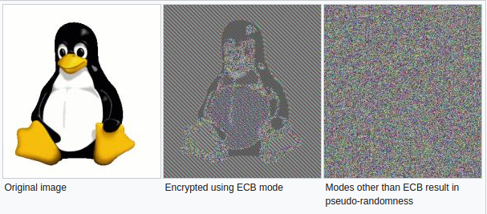

# Cryptography Requirements

## MSTG-CRYPTO-1
The app does not rely on symmetric cryptography with hardcoded keys as a sole method of encryption.

<a id="mstg-crypto-1-overview"></a>
### Problematic Encryption Configuration

#### Insufficient Key Length

Even the most secure encryption algorithm becomes vulnerable to brute-force attacks when that algorithm uses an insufficient key size.


Ensure that the key length fulfills [accepted industry standards.](https://www.enisa.europa.eu/publications/algorithms-key-size-and-parameters-report-2014) In Japan, check the [List of Cipher Specifications on the "e-Government Recommended Ciphers List"](https://www.cryptrec.go.jp/en/method.html). <br>

Reference
* [owasp-mastg Common Configuration Issues (MSTG-CRYPTO-1, MSTG-CRYPTO-2 and MSTG-CRYPTO-3) Insufficient Key Length](https://github.com/OWASP/owasp-mastg/blob/v1.5.0/Document/0x04g-Testing-Cryptography.md#insufficient-key-length)

Rulebook
* [Set key lengths that meet industry standards (Required)](#set-key-lengths-that-meet-industry-standards-required)

#### Symmetric Encryption with Hard-Coded Cryptographic Keys

The security of symmetric encryption and keyed hashes (MACs) depends on the secrecy of the key. If the key is disclosed, the security gained by encryption is lost. To prevent this, never store secret keys in the same place as the encrypted data they helped create. A common mistake is encrypting locally stored data with a static, hardcoded encryption key and compiling that key into the app. This makes the key accessible to anyone who can use a disassembler.<br>

Hardcoded encryption key means that a key is:

* part of application resources
* value which can be derived from known values
* hardcoded in code

First, ensure that no keys or passwords are stored within the source code. This means you should check Objective-C/Swift in iOS. Note that hard-coded keys are problematic even if the source code is obfuscated since obfuscation is easily bypassed by dynamic instrumentation.<br>

If the app is using two-way TLS (both server and client certificates are validated), make sure that:

* The password to the client certificate isn't stored locally or is locked in the device Keychain.
* The client certificate isn't shared among all installations.

If the app relies on an additional encrypted container stored in app data, check how the encryption key is used. If a key-wrapping scheme is used, ensure that the master secret is initialized for each user or the container is re-encrypted with new key. If you can use the master secret or previous password to decrypt the container, check how password changes are handled.<br>

Secret keys must be stored in secure device storage whenever symmetric cryptography is used in mobile apps. For more information on the platform-specific APIs, see the "[Data Storage in iOS](https://github.com/OWASP/owasp-mastg/blob/v1.5.0/Document/0x06d-Testing-Data-Storage.md)" chapters.


Reference
* [owasp-mastg Common Configuration Issues (MSTG-CRYPTO-1, MSTG-CRYPTO-2 and MSTG-CRYPTO-3) Symmetric Encryption with Hard-Coded Cryptographic Keys](https://github.com/OWASP/owasp-mastg/blob/v1.5.0/Document/0x04g-Testing-Cryptography.md#symmetric-encryption-with-hard-coded-cryptographic-keys)

Rulebook
* [Do not store keys or passwords in source code (Required)](#do-not-store-keys-or-passwords-in-source-code-required)
* [Do not store client certificate passwords locally. Lock passwords in your device's keychain if you want to save them (Required)](#do-not-store-client-certificate-passwords-locally-lock-passwords-in-your-devices-keychain-if-you-want-to-save-them-required)
* [Client certificates are not shared among all installations (Required)](#client-certificates-are-not-shared-among-all-installations-required)
* [If container dependent, verify how encryption keys are used (Required)](#if-container-dependent-verify-how-encryption-keys-are-used-required)
* [Store private keys in secure device storage whenever symmetric encryption is used in mobile apps (Required)](#store-private-keys-in-secure-device-storage-whenever-symmetric-encryption-is-used-in-mobile-apps-required)

#### Weak Key Generation Functions

Cryptographic algorithms (such as symmetric encryption or some MACs) expect a secret input of a given size. For example, AES uses a key of exactly 16 bytes. A native implementation might use the user-supplied password directly as an input key. Using a user-supplied password as an input key has the following problems:

* If the password is smaller than the key, the full key space isn't used. The remaining space is padded (spaces are sometimes used for padding).
* A user-supplied password will realistically consist mostly of displayable and pronounceable characters. Therefore, only some of the possible 256 ASCII characters are used and entropy is decreased by approximately a factor of four.

Ensure that passwords aren't directly passed into an encryption function. Instead, the user-supplied password should be passed into a KDF to create a cryptographic key. Choose an appropriate iteration count when using password derivation functions. For example, [NIST recommends an iteration count of at least 10,000 for PBKDF2](https://pages.nist.gov/800-63-3/sp800-63b.html#sec5) and [for critical keys where user-perceived performance is not critical at least 10,000,000.](https://nvlpubs.nist.gov/nistpubs/Legacy/SP/nistspecialpublication800-132.pdf) For critical keys, it is recommended to consider implementation of algorithms recognized by [Password Hashing Competition (PHC)](https://www.password-hashing.net/) like [Argon2.](https://github.com/p-h-c/phc-winner-argon2)<br>

Reference
* [owasp-mastg Common Configuration Issues (MSTG-CRYPTO-1, MSTG-CRYPTO-2 and MSTG-CRYPTO-3) Weak Key Generation Functions](https://github.com/OWASP/owasp-mastg/blob/v1.5.0/Document/0x04g-Testing-Cryptography.md#weak-key-generation-functions)

Rulebook
* [If using an encryption algorithm (such as symmetric encryption or some MACs), use a secret input of the specific size assumed (Required)](#if-using-an-encryption-algorithm-such-as-symmetric-encryption-or-some-macs-use-a-secret-input-of-the-specific-size-assumed-required)
* [User-supplied passwords are passed to KDF to create encryption keys (Required)](#user-supplied-passwords-are-passed-to-kdf-to-create-encryption-keys-required)
* [If using a password derivation function, select the appropriate number of iterations (Required)](#if-using-a-password-derivation-function-select-the-appropriate-number-of-iterations-required)

#### Weak Random Number Generators

It is fundamentally impossible to produce truly random numbers on any deterministic device. Pseudo-random number generators (RNG) compensate for this by producing a stream of pseudo-random numbers - a stream of numbers that appear as if they were randomly generated. The quality of the generated numbers varies with the type of algorithm used. Cryptographically secure RNGs generate random numbers that pass statistical randomness tests, and are resilient against prediction attacks (e.g. it is statistically infeasible to predict the next number produced).<br>

Mobile SDKs offer standard implementations of RNG algorithms that produce numbers with sufficient artificial randomness. We'll introduce the available APIs in the iOS specific sections.<br>

Reference
* [owasp-mastg Common Configuration Issues (MSTG-CRYPTO-1, MSTG-CRYPTO-2 and MSTG-CRYPTO-3) Weak Random Number Generators](https://github.com/OWASP/owasp-mastg/blob/v1.5.0/Document/0x04g-Testing-Cryptography.md#weak-random-number-generators)

Rulebook
* [Identify a standard implementation of the RNG algorithm that generates numbers with sufficient artificial randomness (Required)](#identify-a-standard-implementation-of-the-rng-algorithm-that-generates-numbers-with-sufficient-artificial-randomness-required)

#### Custom Implementations of Cryptography

Inventing proprietary cryptographic functions is time consuming, difficult, and likely to fail. Instead, we can use well-known algorithms that are widely regarded as secure. Mobile operating systems offer standard cryptographic APIs that implement those algorithms.<br>

Carefully inspect all the cryptographic methods used within the source code, especially those that are directly applied to sensitive data. All cryptographic operations should use standard cryptographic APIs for iOS (we'll write about those in more detail in the platform-specific chapters). Any cryptographic operations that don't invoke standard routines from known providers should be closely inspected. Pay close attention to standard algorithms that have been modified. Remember that encoding isn't the same as encryption! Always investigate further when you find bit manipulation operators like XOR (exclusive OR).

At all implementations of cryptography, you need to ensure that the following always takes place:

* Worker keys (like intermediary/derived keys in AES/DES/Rijndael) are properly removed from memory after consumption or in case of error.
* The inner state of a cipher should be removed from memory as soon as possible.

Reference
* [owasp-mastg Common Configuration Issues (MSTG-CRYPTO-1, MSTG-CRYPTO-2 and MSTG-CRYPTO-3) Custom Implementations of Cryptography](https://github.com/OWASP/owasp-mastg/blob/v1.5.0/Document/0x04g-Testing-Cryptography.md#custom-implementations-of-cryptography)

Rulebook
* [All cryptography-related implementations properly manage memory state (Required)](#all-cryptography-related-implementations-properly-manage-memory-state-required)
* [Use industry-standard cryptographic APIs provided by the OS (Required)](#use-industry-standard-cryptographic-apis-provided-by-the-os-required)

#### Incorrect AES Configuration

Advanced Encryption Standard (AES) is the widely accepted standard for symmetric encryption in mobile apps. It's an iterative block cipher that is based on a series of linked mathematical operations. AES performs a variable number of rounds on the input, each of which involve substitution and permutation of the bytes in the input block. Each round uses a 128-bit round key which is derived from the original AES key.

As of this writing, no efficient cryptanalytic attacks against AES have been discovered. However, implementation details and configurable parameters such as the block cipher mode leave some margin for error.


**Weak Block Cipher Mode**

Block-based encryption is performed upon discrete input blocks (for example, AES has 128-bit blocks). If the plaintext is larger than the block size, the plaintext is internally split up into blocks of the given input size and encryption is performed on each block. A block cipher mode of operation (or block mode) determines if the result of encrypting the previous block impacts subsequent blocks.


[ECB (Electronic Codebook)](https://en.wikipedia.org/wiki/Block_cipher_mode_of_operation#Electronic_Codebook_%28ECB%29) divides the input into fixed-size blocks that are encrypted separately using the same key. If multiple divided blocks contain the same plaintext, they will be encrypted into identical ciphertext blocks which makes patterns in data easier to identify. In some situations, an attacker might also be able to replay the encrypted data.



Verify that Cipher Block Chaining (CBC) mode is used instead of ECB. In CBC mode, plaintext blocks are XORed with the previous ciphertext block. This ensures that each encrypted block is unique and randomized even if blocks contain the same information. Please note that it is best to combine CBC with an HMAC and/or ensure that no errors are given such as "Padding error", "MAC error", "decryption failed" in order to be more resistant to a padding oracle attack.

When storing encrypted data, we recommend using a block mode that also protects the integrity of the stored data, such as Galois/Counter Mode (GCM). The latter has the additional benefit that the algorithm is mandatory for each TLSv1.2 implementation, and thus is available on all modern platforms.

For more information on effective block modes, see the [NIST guidelines on block mode selection.](https://csrc.nist.gov/projects/block-cipher-techniques/bcm/modes-development)

**Predictable Initialization Vector**

CBC, OFB, CFB, PCBC, GCM mode require an initialization vector (IV) as an initial input to the cipher. The IV doesn't have to be kept secret, but it shouldn't be predictable: it should be random and unique/non-repeatable for each encrypted message. Make sure that IVs are generated using a cryptographically secure random number generator. For more information on IVs, see [Crypto Fail's initialization vectors article.](https://www.cryptofails.com/post/70059609995/crypto-noobs-1-initialization-vectors)

Pay attention to cryptographic libraries used in the code: many open source libraries provide examples in their documentations that might follow bad practices (e.g. using a hardcoded IV). A popular mistake is copy-pasting example code without changing the IV value.

**Initialization Vectors in stateful operation modes**

Please note that the usage of IVs is different when using CTR and GCM mode in which the initialization vector is often a counter (in CTR combined with a nonce). So here using a predictable IV with its own stateful model is exactly what is needed. In CTR you have a new nonce plus counter as an input to every new block operation. For example: for a 5120 bit long plaintext: you have 20 blocks, so you need 20 input vectors consisting of a nonce and counter. Whereas in GCM you have a single IV per cryptographic operation, which should not be repeated with the same key. See section 8 of the [documentation from NIST on GCM](https://nvlpubs.nist.gov/nistpubs/Legacy/SP/nistspecialpublication800-38d.pdf) for more details and recommendations of the IV.

Reference
* [owasp-mastg Common Configuration Issues (MSTG-CRYPTO-1, MSTG-CRYPTO-2 and MSTG-CRYPTO-3) Inadequate AES Configuration](https://github.com/OWASP/owasp-mastg/blob/v1.5.0/Document/0x04g-Testing-Cryptography.md#inadequate-aes-configuration)
* [owasp-mastg Common Configuration Issues (MSTG-CRYPTO-1, MSTG-CRYPTO-2 and MSTG-CRYPTO-3) Weak Block Cipher Mode](https://github.com/OWASP/owasp-mastg/blob/v1.5.0/Document/0x04g-Testing-Cryptography.md#weak-block-cipher-mode)
* [owasp-mastg Common Configuration Issues (MSTG-CRYPTO-1, MSTG-CRYPTO-2 and MSTG-CRYPTO-3) Predictable Initialization Vector](https://github.com/OWASP/owasp-mastg/blob/v1.5.0/Document/0x04g-Testing-Cryptography.md#predictable-initialization-vector)
* [owasp-mastg Common Configuration Issues (MSTG-CRYPTO-1, MSTG-CRYPTO-2 and MSTG-CRYPTO-3) Initialization Vectors in stateful operation modes](https://github.com/OWASP/owasp-mastg/blob/v1.5.0/Document/0x04g-Testing-Cryptography.md#initialization-vectors-in-stateful-operation-modes)

Rulebook
* [To counter padding oracle attacks, CBC should not be combined with HMAC or generate errors such as padding errors, MAC errors, decryption failures, etc. (Required)](#to-counter-padding-oracle-attacks-cbc-should-not-be-combined-with-hmac-or-generate-errors-such-as-padding-errors-mac-errors-decryption-failures-etc-required)
* [When storing encrypted data, use a block mode such as Galois/Counter Mode ( GCM ) that also protects the integrity of the stored data (Recommended)](#when-storing-encrypted-data-use-a-block-mode-such-as-galoiscounter-mode--gcm--that-also-protects-the-integrity-of-the-stored-data-recommended)
* [IV is generated using a cryptographically secure random number generator (Required)](#iv-is-generated-using-a-cryptographically-secure-random-number-generator-required)
* [Note that IV is used differently when using CTR and GCM modes, where the initialization vector is often a counter (Required)](#note-that-iv-is-used-differently-when-using-ctr-and-gcm-modes-where-the-initialization-vector-is-often-a-counter-required)

#### Padding Oracle Attacks due to Weaker Padding or Block Operation Implementations

In the old days, [PKCS1.5](https://www.rfc-editor.org/rfc/rfc2313) padding (in code: PKCS1Padding) was used as a padding mechanism when doing asymmetric encryption. This mechanism is vulnerable to the padding oracle attack. Therefore, it is best to use OAEP (Optimal Asymmetric Encryption Padding) captured in [PKCS#1 v2.0](https://www.rfc-editor.org/rfc/rfc2437) (in code: OAEPPadding, OAEPwithSHA-256andMGF1Padding, OAEPwithSHA-224andMGF1Padding, OAEPwithSHA-384andMGF1Padding, OAEPwithSHA-512andMGF1Padding). Note that, even when using OAEP, you can still run into an issue known best as the Mangers attack as described [in the blog at Kudelskisecurity.](https://research.kudelskisecurity.com/2018/04/05/breaking-rsa-oaep-with-mangers-attack/)<br>

Note: AES-CBC with PKCS #5 has shown to be vulnerable to padding oracle attacks as well, given that the implementation gives warnings, such as "Padding error", "MAC error", or "decryption failed". See [The Padding Oracle Attack](https://robertheaton.com/2013/07/29/padding-oracle-attack/) and [The CBC Padding Oracle Problem](https://eklitzke.org/the-cbc-padding-oracle-problem) for an example. Next, it is best to ensure that you add an HMAC after you encrypt the plaintext: after all a ciphertext with a failing MAC will not have to be decrypted and can be discarded.<br>

Reference
* [owasp-mastg Common Configuration Issues (MSTG-CRYPTO-1, MSTG-CRYPTO-2 and MSTG-CRYPTO-3) Padding Oracle Attacks due to Weaker Padding or Block Operation Implementations](https://github.com/OWASP/owasp-mastg/blob/v1.5.0/Document/0x04g-Testing-Cryptography.md#padding-oracle-attacks-due-to-weaker-padding-or-block-operation-implementations)

Rulebook
* [Use OAEP incorporated in PKCS#1 v2.0 as a padding mechanism for asymmetric encryption (Required)](#use-oaep-incorporated-in-pkcs1-v20-as-a-padding-mechanism-for-asymmetric-encryption-required)

#### Protecting Keys in Storage and in Memory

When memory dumping is part of your threat model, then keys can be accessed the moment they are actively used. Memory dumping either requires root-access (e.g. a rooted device or jailbroken device) or it requires a patched application with Frida (so you can use tools like Fridump). Therefore it is best to consider the following, if keys are still needed at the device:<br>

* Keys in a Remote Server: you can use remote Key vaults such as Amazon KMS or Azure Key Vault. For some use cases, developing an orchestration layer between the app and the remote resource might be a suitable option. For instance, a serverless function running on a Function as a Service (FaaS) system (e.g. AWS Lambda or Google Cloud Functions) which forwards requests to retrieve an API key or secret. There are other alternatives such as Amazon Cognito, Google Identity Platform or Azure Active Directory.
* Keys inside Secure Hardware-backed Storage: make sure that all cryptographic actions and the key itself remain in the [Secure Enclave](https://developer.apple.com/documentation/security/certificate_key_and_trust_services/keys/protecting_keys_with_the_secure_enclave) (e.g. use the Keychain). Refer to the [iOS Data Storage](https://github.com/OWASP/owasp-mastg/blob/v1.5.0/Document/0x06d-Testing-Data-Storage.md#the-keychain) chapters for more information.
* Keys protected by Envelope Encryption: If keys are stored outside of the TEE / SE, consider using multi-layered encryption: an envelope encryption approach (see [OWASP Cryptographic Storage Cheat Sheet](https://cheatsheetseries.owasp.org/cheatsheets/Cryptographic_Storage_Cheat_Sheet.html#encrypting-stored-keys), [Google Cloud Key management guide](https://cloud.google.com/kms/docs/envelope-encryption?hl=en), [AWS Well-Architected Framework guide](https://docs.aws.amazon.com/wellarchitected/latest/financial-services-industry-lens/use-envelope-encryption-with-customer-master-keys.html)), or a [HPKE approach](https://datatracker.ietf.org/doc/html/draft-irtf-cfrg-hpke-08) to encrypt data encryption keys with key encryption keys.
* Keys in Memory: make sure that keys live in memory for the shortest time possible and consider zeroing out and nullifying keys after successful cryptographic operations, and in case of error. For general cryptocoding guidelines, refer to [Clean memory of secret data](https://github.com/veorq/cryptocoding#clean-memory-of-secret-data/). For more detailed information refer to sections [Testing Memory for Sensitive Data](https://github.com/OWASP/owasp-mastg/blob/v1.5.0/Document/0x06d-Testing-Data-Storage.md#testing-memory-for-sensitive-data-mstg-storage-10) respectively.

Note: given the ease of memory dumping, never share the same key among accounts and/or devices, other than public keys used for signature verification or encryption.

Reference
* [owasp-mastg Common Configuration Issues (MSTG-CRYPTO-1, MSTG-CRYPTO-2 and MSTG-CRYPTO-3) Protecting Keys in Storage and in Memory](https://github.com/OWASP/owasp-mastg/blob/v1.5.0/Document/0x04g-Testing-Cryptography.md#protecting-keys-in-storage-and-in-memory)

Rulebook
* [Use key considering memory dump (Required)](#use-key-considering-memory-dump-required)
* [Do not share the same key across accounts or devices (Required)](#do-not-share-the-same-key-across-accounts-or-devices-required)

#### Key handling during transfer

When keys need to be transported from one device to another, or from the app to a backend, make sure that proper key protection is in place, by means of a transport keypair or another mechanism. Often, keys are shared with obfuscation methods which can be easily reversed. Instead, make sure asymmetric cryptography or wrapping keys are used. For example, a symmetric key can be encrypted with the public key from an asymmetric key pair.<br>

Reference
* [owasp-mastg Common Configuration Issues (MSTG-CRYPTO-1, MSTG-CRYPTO-2 and MSTG-CRYPTO-3) Protecting Keys in Transport](https://github.com/OWASP/owasp-mastg/blob/v1.5.0/Document/0x04g-Testing-Cryptography.md#protecting-keys-in-transport)

Rulebook
* [Appropriate key protection by means of transport symmetric keys or other mechanisms (Required)](#appropriate-key-protection-by-means-of-transport-symmetric-keys-or-other-mechanisms-required)

### Rulebook
1. [Set key lengths that meet industry standards (Required)](#set-key-lengths-that-meet-industry-standards-required)
1. [Do not store keys or passwords in source code (Required)](#do-not-store-keys-or-passwords-in-source-code-required)
1. [Do not store client certificate passwords locally. Lock passwords in your device's keychain if you want to save them (Required)](#do-not-store-client-certificate-passwords-locally-lock-passwords-in-your-devices-keychain-if-you-want-to-save-them-required)
1. [Client certificates are not shared among all installations (Required)](#client-certificates-are-not-shared-among-all-installations-required)
1. [If container dependent, verify how encryption keys are used (Required)](#if-container-dependent-verify-how-encryption-keys-are-used-required)
1. [Store private keys in secure device storage whenever symmetric encryption is used in mobile apps (Required)](#store-private-keys-in-secure-device-storage-whenever-symmetric-encryption-is-used-in-mobile-apps-required)
1. [If using an encryption algorithm (such as symmetric encryption or some MACs), use a secret input of the specific size assumed (Required)](#if-using-an-encryption-algorithm-such-as-symmetric-encryption-or-some-macs-use-a-secret-input-of-the-specific-size-assumed-required)
1. [User-supplied passwords are passed to KDF to create encryption keys (Required)](#user-supplied-passwords-are-passed-to-kdf-to-create-encryption-keys-required)
1. [If using a password derivation function, select the appropriate number of iterations (Required)](#if-using-a-password-derivation-function-select-the-appropriate-number-of-iterations-required)
1. [Identify a standard implementation of the RNG algorithm that generates numbers with sufficient artificial randomness (Required)](#identify-a-standard-implementation-of-the-rng-algorithm-that-generates-numbers-with-sufficient-artificial-randomness-required)
1. [All cryptography-related implementations properly manage memory state (Required)](#all-cryptography-related-implementations-properly-manage-memory-state-required)
1. [Use industry-standard cryptographic APIs provided by the OS (Required)](#use-industry-standard-cryptographic-apis-provided-by-the-os-required)
1. [To counter padding oracle attacks, CBC should not be combined with HMAC or generate errors such as padding errors, MAC errors, decryption failures, etc. (Required)](#to-counter-padding-oracle-attacks-cbc-should-not-be-combined-with-hmac-or-generate-errors-such-as-padding-errors-mac-errors-decryption-failures-etc-required)
1. [When storing encrypted data, use a block mode such as Galois/Counter Mode ( GCM ) that also protects the integrity of the stored data (Recommended)](#when-storing-encrypted-data-use-a-block-mode-such-as-galoiscounter-mode--gcm--that-also-protects-the-integrity-of-the-stored-data-recommended)
1. [IV is generated using a cryptographically secure random number generator (Required)](#iv-is-generated-using-a-cryptographically-secure-random-number-generator-required)
1. [Note that IV is used differently when using CTR and GCM modes, where the initialization vector is often a counter (Required)](#note-that-iv-is-used-differently-when-using-ctr-and-gcm-modes-where-the-initialization-vector-is-often-a-counter-required)
1. [Use OAEP incorporated in PKCS#1 v2.0 as a padding mechanism for asymmetric encryption (Required)](#use-oaep-incorporated-in-pkcs1-v20-as-a-padding-mechanism-for-asymmetric-encryption-required)
1. [Use key considering memory dump (Required)](#use-key-considering-memory-dump-required)
1. [Do not share the same key across accounts or devices (Required)](#do-not-share-the-same-key-across-accounts-or-devices-required)
1. [Appropriate key protection by means of transport symmetric keys or other mechanisms (Required)](#appropriate-key-protection-by-means-of-transport-symmetric-keys-or-other-mechanisms-required)

#### Set key lengths that meet industry standards (Required)

Ensure that the key length fulfills [accepted industry standards.](https://www.enisa.europa.eu/publications/algorithms-key-size-and-parameters-report-2014) In Japan, check the [List of Cipher Specifications on the "e-Government Recommended Ciphers List"](https://www.cryptrec.go.jp/en/method.html).<br>
Even the most secure encryption algorithms are vulnerable to brute force attacks if insufficient key sizes are used.

\* No sample code due to conceptual rule.

If this is violated, the following may occur.
* Become vulnerable to brute force attacks.

#### Do not store keys or passwords in source code (Required)

Since obfuscation is easily bypassed by dynamic instrumentation, hardcoded keys are problematic even if the source code is obfuscated. Therefore, do not store keys or passwords within the source code (Objective-C/Swift code).

\* No sample code due to deprecated rules.

If this is violated, the following may occur.
* Obfuscation is bypassed by dynamic instrumentation and keys and passwords are compromised.

#### Do not store client certificate passwords locally. Lock passwords in your device's keychain if you want to save them (Required)

If the app uses bi-directional TLS (both server and client certificates are verified), do not store the client certificate password locally. Or lock it in the device's Keychain.

See the rulebook below for sample code.

Rulebook
* [Securely store values using the Keychain Services API (Required)](0x03-MASDG-Data_Storage_and_Privacy_Requirements.md#securely-store-values-using-the-keychain-services-api-required)

If this is violated, the following may occur.
* The password is read and abused by other applications.

#### Client certificates are not shared among all installations (Required)

If the app uses bi-directional TLS (both server and client certificates are verified), client certificates are not shared among all installations.

\* No sample code due to deprecated rules.

If this is violated, the following may occur.
* The client is spoofed by an attacker.

#### If container dependent, verify how encryption keys are used (Required)

If the app relies on an encrypted container stored within the app's data, identify how the encryption key is used.

**When using the key wrap method**

Confirm the following
* The master secret of each user must be initialized
* That the container is re-encrypted with the new key

**If the container can be decrypted using the master secret or a previous password**

Check how password changes are handled.

\* No sample code due to conceptual rules.

If this is violated, the following may occur.
* The password or master secret is used for purposes other than those for which it was intended.

#### Store private keys in secure device storage whenever symmetric encryption is used in mobile apps (Required)

Whenever symmetric encryption is used in a mobile app, the private key must be stored in secure device storage.<br>
See "[Data Protection API](0x03-MASDG-Data_Storage_and_Privacy_Requirements.md#data-protection-api)" for information on how to store private keys on the iOS platform.

Rulebook
* [Implement access control for user data stored in flash memory utilizing the iOS Data Protection API (Required)](0x03-MASDG-Data_Storage_and_Privacy_Requirements.md#implement-access-control-for-user-data-stored-in-flash-memory-utilizing-the-ios-data-protection-api-required)

If this is violated, the following may occur.
* The private key is read by another application or third party.

#### If using an encryption algorithm (such as symmetric encryption or some MACs), use a secret input of the specific size assumed (Required)

When using encryption algorithms (such as symmetric encryption and some MACs), it is necessary to use a secret input of the specific size expected. For example, AES uses a key of exactly 16 bytes.

Native implementations may use user-supplied passwords directly as input keys. When using user-supplied passwords as input keys, the following problems exist.<br>

* If the password is smaller than the key, the full key space is not used. The remaining spaces are padded (sometimes spaces are used for padding).
* User-supplied passwords, in reality, consist mostly of characters that can be displayed and pronounced. Thus, only a fraction of the 256 ASCII characters are used, reducing entropy by about a factor of four.

\* No sample code due to conceptual rules.

If this is violated, the following may occur.
* A vulnerable key is generated.

#### User-supplied passwords are passed to KDF to create encryption keys (Required)
If the encryption function is used,User-supplied passwords should be passed to KDF to create the encryption key.
The password should not be passed directly to the encryption function. Instead, the user-supplied password should be passed to the KDF to create the encryption key. When using the password derivation function, select an appropriate number of iterations.

\* No sample code due to conceptual rules.

If this is violated, the following may occur.
* If the password is smaller than the key, the full keyspace is not used. The remaining space is padded.
* Entropy is reduced by about a factor of four.

#### If using a password derivation function, select the appropriate number of iterations (Required)

When using a password derivation function, an appropriate number of iterations should be selected. For example, [NIST recommends an iteration count of at least 10,000 for PBKDF2](https://pages.nist.gov/800-63-3/sp800-63b.html#sec5) and [for critical keys where user-perceived performance is not critical at least 10,000,000.](https://nvlpubs.nist.gov/nistpubs/Legacy/SP/nistspecialpublication800-132.pdf) For critical keys, it is recommended to consider implementation of algorithms recognized by [Password Hashing Competition (PHC)](https://www.password-hashing.net/) like [Argon2.](https://github.com/p-h-c/phc-winner-argon2)

\* No sample code because of server-side rules.

If this is violated, the following may occur.
* A vulnerable key is generated.

#### Identify a standard implementation of the RNG algorithm that generates numbers with sufficient artificial randomness (Required)
Cryptographically secure RNGs generate random numbers that pass statistical randomness tests and are resistant to predictive attacks.
Using random numbers generated by an RNG algorithm that does not meet the safe level increases the likelihood of a successful prediction attack.
Therefore, it is necessary to privately use an RNG algorithm that generates numbers with sufficient artificial randomness.

Refer to the following for APIs that generate highly secure random numbers in the iOS standard.

Rulebook
* [Generate safe random numbers using Randomization Services API (Recommended)](#generate-safe-random-numbers-using-randomization-services-api-recommended)

If this is violated, the following may occur.
* Increased likelihood of a successful predictive attack.

#### All cryptography-related implementations properly manage memory state (Required)

All cryptographic implementations require that worker keys (like intermediate/derived keys in AES/DES/Rijndael) be properly removed from memory after consumption or in the event of an error. The internal state of the cipher also needs to be removed from memory as soon as possible.

AES implementation and post-execution release :
```swift
import Foundation
import CryptoSwift

class CryptoAES {
    var aes: AES? = nil
    
    // cryptographic process
    func encrypt(key: String, iv:String, text:String) -> String {


        do {
            // Execute at the end of function
            defer {
                aes = nil
            }
            // AES Instantiation
            aes = try AES(key: key, iv: iv)
            guard let encrypt = try aes?.encrypt(Array(text.utf8)) else {
                return ""
            }

            
            // Data Type Conversion
            let data = Data( encrypt )
            // base64 conversion
            let base64Data = data.base64EncodedData()
            // UTF-8 conversion nil Not possible
            guard let base64String =
                String(data: base64Data as Data, encoding: String.Encoding.utf8) else {
                    return ""
                }
            // base64 character string
            return base64String

        } catch {
            return ""
        }
    }

    // composite process
    func decrypt(key: String, iv:String, base64:String) -> String {

        do {
            // Execute at the end of function
            defer {
                aes = nil
            }
            // AES Instantiation
            aes = try AES(key: key, iv:iv)

            // From base64 to Data type
            let byteData = base64.data(using: String.Encoding.utf8)! as Data
            // base64 daecode
            guard let data = Data(base64Encoded: byteData) else {
                return ""
            }

            // Creating a UInt8 array
            let aBuffer = Array<UInt8>(data)
            // AES Composite
            guard let decrypted = try aes?.decrypt(aBuffer) else {
                return ""
            }
            // UTF-8 conversion
            guard let text = String(data: Data(decrypted), encoding: .utf8)else {
                return ""
            }

            return text
        } catch {

            return ""
        }
    }
}
```

Example of CryptoSwift Pods Usage :
```default
target 'MyApp' do
  use_frameworks!
  # Add the CryptoSwift library
  pod 'CryptoSwift'
end
```

If this is violated, the following may occur.
* Encrypted information left in memory is used in an unintended process.

#### Use industry-standard cryptographic APIs provided by the OS (Required)
Developing one's own cryptographic functions is time consuming, difficult, and likely to fail. Instead, well-known algorithms that are widely recognized as secure can be used. Mobile operating systems provide standard cryptographic APIs that implement these algorithms and should be used for secure encryption.

See the rulebook below for sample code.

Rulebook
* [Implementation of the iOS encryption algorithm Apple CryptoKit (Recommended)](#implementation-of-the-ios-encryption-algorithm-apple-cryptokit-recommended)

If this is violated, the following may occur.
* May result in an implementation containing vulnerabilities.

#### To counter padding oracle attacks, CBC should not be combined with HMAC or generate errors such as padding errors, MAC errors, decryption failures, etc. (Required)

In CBC mode, the plaintext block is XORed with the immediately preceding ciphertext block. This ensures that each encrypted block is unique and random, even if the blocks contain the same information. 

Example of CBC mode implementation:
```swift
import Foundation
import CryptoSwift

class CryptoCBC {
    // Example of plain text to be encrypted
    let cleartext = "Hello CryptoSwift"
    
    // cryptographic process
    func encrypt( text:String) -> (String, String) {
        // Appropriate 256-bit length key (string)
        let key = "BDC171111B7285F67F035497EE9A081D"
        
        // encode
        let byteText = text.data(using: .utf8)!.bytes
        let byteKey = key.data(using: .utf8)!.bytes

        // IV (initialization vector), type iv is [UInt8].
        let iv = AES.randomIV(AES.blockSize)
        do {
            // Creation of AES-256-CBC instance
            let aes = try AES(key: byteKey, blockMode: CBC(iv: iv))
            
            // Encrypt plain text
            // Default padding is PKC7
            let encrypted = try aes.encrypt(byteText)

            // Output IV, encrypted Encode to Base64 string
            let strIV = NSData(bytes: iv, length: iv.count).base64EncodedString(options: .lineLength64Characters)
            print("IV: " + strIV)  // output -> IV: lBMiK2GWEwrPgNdGfrJEig==
            let strEnc = NSData(bytes: encrypted, length: encrypted.count).base64EncodedString(options: .lineLength64Characters)
            print("Encrypted: " + strEnc)  // output -> Encrypted: MHf5ZeUL/gjviiZitpZKJFuqppdTgEe+IklDgg3N1fQ=
            return (strIV, strEnc)
        } catch {
          print("Error")
        }
        return ("", "")
    }
}
```

If this is violated, the following may occur.
* Become vulnerable to padding oracle attacks.

#### When storing encrypted data, use a block mode such as Galois/Counter Mode ( GCM ) that also protects the integrity of the stored data (Recommended)

When storing encrypted data, it is recommended to use a block mode that also protects the integrity of the stored data, such as Galois/Counter Mode ( GCM ). The latter has the advantage that this algorithm is mandatory for each TLSv1.2 implementation and can therefore be used on all modern platforms.

Example of GCM mode implementation:
```swift
import Foundation
import CryptoKit

class CryptoGCM {
    
    // Key Generation
    let symmetricKey: SymmetricKey = SymmetricKey(size: .bits256)
    /// encryption
    /// - Parameter data: Data to be encrypted
    func encrypt(data: Data) -> Data? {
        do {
            // GCM encrypt
            let sealedBox = try AES.GCM.seal(data, using: symmetricKey)
            guard let data = sealedBox.combined else {
                return nil
            }
            return data
        } catch _ {
            return nil
        }
    }
    
    /// decoding
    /// - Parameter data: Data to be decrypted
    private func decrypt(data: Data) -> Data? {
        do {
            // GCM decrypt
            let sealedBox = try AES.GCM.SealedBox(combined: data)
            return try AES.GCM.open(sealedBox, using: symmetricKey)
        } catch _ {
            return nil
        }
    }
}
```

If this is violated, the following may occur.
* Easily identifiable patterns in the data.

#### IV is generated using a cryptographically secure random number generator (Required)

In CBC, OFB, CFB, PCBC, and GCM modes, the initialization vector ( IV ) is required as the initial input to the cipher. The IV need not be secret, but it must not be predictable. It must be random, unique, and non-reproducible for each encrypted message. Therefore, the IV must be generated using a cryptographically secure random number generator. For more information on IVs, see [Crypto Fail's article on initialization vectors](http://www.cryptofails.com/post/70059609995/crypto-noobs-1-initialization-vectors).

See the rulebook below for sample code.

Rulebook
* [Generate safe random numbers using Randomization Services API (Recommended)](#generate-safe-random-numbers-using-randomization-services-api-recommended)

If this is violated, the following may occur.
* A predictable initialization vector is generated.

#### Note that IV is used differently when using CTR and GCM modes, where the initialization vector is often a counter (Required)

Note that IVs are used differently when using CTR and GCM modes, where the initialization vector is often a counter (a combination of CTR and nonce). Therefore, it is necessary to use a predictable IV with its own stateful model.<br>
The CTR uses a new nonce and counter as input for each new block operation.<br>
Example : In the case of a plaintext of 5120 bits in length, there are 20 blocks, so 20 input vectors consisting of a nonce and a counter are needed.<br>
GCM, on the other hand, has only one IV per encryption operation and does not repeat with the same key. For details and recommendations on IVs, see section 8 of [NIST document on GCM](https://nvlpubs.nist.gov/nistpubs/Legacy/SP/nistspecialpublication800-38d.pdf).

\* No sample code due to conceptual rules.

If this is violated, the following may occur.
* Failure to meet the initialization vector requirements for each mode.

#### Use OAEP incorporated in PKCS#1 v2.0 as a padding mechanism for asymmetric encryption (Required)

Previously, [PKCS1.5](https://www.rfc-editor.org/rfc/rfc2313) padding (code: PKCS1Padding) was used as a padding mechanism for asymmetric encryption. This mechanism is vulnerable to the padding Oracle attack. Therefore, [PKCS#1 v2.0](https://www.rfc-editor.org/rfc/rfc2437) (codes: OAEPwithSHA-256andMGF1Padding , OAEPwithSHA-224andMGF1Padding , and OAEPwithSHA-384andMGF1Padding , OAEPwithSHA-512andMGF1Padding ). OAEP is the most appropriate method to use. Note that even if you use OAEP, you may encounter the well-known problem known as the Mangers attack described in [Kudelskisecurity's blog](https://research.kudelskisecurity.com/2018/04/05/breaking-rsa-oaep-with-mangers-attack/).

The sample code below shows how OAEP is used.
```swift
let plainData = "TEST TEXT".data(using: .utf8)!

// Generate RsaOAEPPadding class with main digest SHA256, MGF1 digest SHA1
let padding = RsaOAEPPadding(mainDigest: OAEPDigest.SHA256, mgf1Digest: OAEPDigest.SHA1)

// Calculate OAEP Padding (RSA key length is assumed to be 2048bit = 256byte)
let padded = try! padding.pad(plain: plainData, blockSize: 256);

// Encrypted in raw
guard let cipherData = SecKeyCreateEncryptedData(publicKey, SecKeyAlgorithm.rsaEncryptionRaw, padded as CFData, &error) else {
    // Error Handling
}
```

If this is violated, the following may occur.
* Become vulnerable to padding oracle attacks.

#### Use key considering memory dump (Required)

If memory dumps are part of the threat model, keys can be accessed at the moment they are actively used. Memory dumps require root access (e.g. rooted or jailbroken devices) or an application patched with Frida (so that tools such as Fridump can be used). Therefore, if a key is still needed on a device, it is best to consider the following

* Remote server keys : remote key vaults such as Amazon KMS or Azure Key Vault may be used. For some use cases, developing an orchestration layer between the app and the remote resource may be an appropriate option. For example, a serverless function running on a Function as a Service (FaaS) system (such as AWS Lambda or Google Cloud Functions) might forward requests to retrieve an API key or secret. Other options include Amazon Cognito, Google Identity Platform, and Azure Active Directory.
* Keys in hardware-protected secure storage: all encryption actions and the key itself remain in the [Secure Enclave](https://developer.apple.com/documentation/security/certificate_key_and_trust_services/keys/protecting_keys_with_the_secure_enclave) (e.g. using Keychain). For more information, see the chapter [iOS Data Storage](https://github.com/OWASP/owasp-mastg/blob/v1.5.0/Document/0x06d-Testing-Data-Storage.md#the-keychain).
* Key protected by envelope encryption : If the key is stored outside of the TEE/SE, consider using multi-layered encryption. Envelope Encryption Approach ([OWASP Cryptographic Storage Cheat Sheet](https://cheatsheetseries.owasp.org/cheatsheets/Cryptographic_Storage_Cheat_Sheet.html#encrypting-stored-keys)、 [Google Cloud Key management guide](https://cloud.google.com/kms/docs/envelope-encryption?hl=en)、 [AWS Well-Architected Framework guide](https://docs.aws.amazon.com/wellarchitected/latest/financial-services-industry-lens/use-envelope-encryption-with-customer-master-keys.html) see also), Or use the [HPKE approach](https://datatracker.ietf.org/doc/html/draft-irtf-cfrg-hpke-08), which key-encrypts the data encryption key.
* Keys in memory : Ensure that keys remain in memory for as short a time as possible, and consider zeroing and deactivating keys after a successful encryption operation or in the event of an error. For general encryption guidelines, see ["Clearing Memory of Sensitive Data"](https://github.com/veorq/cryptocoding#clean-memory-of-secret-data/). For more detailed information, see ["Testing Memory for Sensitive Data"](https://github.com/OWASP/owasp-mastg/blob/v1.5.0/Document/0x06d-Testing-Data-Storage.md#testing-memory-for-sensitive-data-mstg-storage-10).

The sample code below is a process to prevent leakage of keys in memory in an application.
```swift
data.resetBytes(in: NSRange(location:0, length:data.length))
```

Also, by not storing the key at all, it is guaranteed that the key material will not be dumped. This can be accomplished by using a password key derivation function such as PKBDF-2. See example below.

 ```swift
func pbkdf2SHA1(password: String, salt: Data, keyByteCount: Int, rounds: Int) -> Data? {
    return pbkdf2(hash: CCPBKDFAlgorithm(kCCPRFHmacAlgSHA1), password: password, salt: salt, keyByteCount: keyByteCount, rounds: rounds)
}

func pbkdf2SHA256(password: String, salt: Data, keyByteCount: Int, rounds: Int) -> Data? {
    return pbkdf2(hash: CCPBKDFAlgorithm(kCCPRFHmacAlgSHA256), password: password, salt: salt, keyByteCount: keyByteCount, rounds: rounds)
}

func pbkdf2SHA512(password: String, salt: Data, keyByteCount: Int, rounds: Int) -> Data? {
    return pbkdf2(hash: CCPBKDFAlgorithm(kCCPRFHmacAlgSHA512), password: password, salt: salt, keyByteCount: keyByteCount, rounds: rounds)
}

func pbkdf2(hash: CCPBKDFAlgorithm, password: String, salt: Data, keyByteCount: Int, rounds: Int) -> Data? {
    let passwordData = password.data(using: String.Encoding.utf8)!
    var derivedKeyData = Data(repeating: 0, count: keyByteCount)
    let derivedKeyDataLength = derivedKeyData.count
    let derivationStatus = derivedKeyData.withUnsafeMutableBytes { derivedKeyBytes in
        salt.withUnsafeBytes { saltBytes in

            CCKeyDerivationPBKDF(
                CCPBKDFAlgorithm(kCCPBKDF2),
                password, passwordData.count,
                saltBytes, salt.count,
                hash,
                UInt32(rounds),
                derivedKeyBytes, derivedKeyDataLength
            )
        }
    }
    if derivationStatus != 0 {
        // Error
        return nil
    }

    return derivedKeyData
}

func testKeyDerivation() {
    let password = "password"
    let salt = Data([0x73, 0x61, 0x6C, 0x74, 0x44, 0x61, 0x74, 0x61])
    let keyByteCount = 16
    let rounds = 100_000

    let derivedKey = pbkdf2SHA1(password: password, salt: salt, keyByteCount: keyByteCount, rounds: rounds)
}
```

* source : [https://stackoverflow.com/questions/8569555/pbkdf2-using-commoncrypto-on-ios](https://stackoverflow.com/questions/8569555/pbkdf2-using-commoncrypto-on-ios) (Tested with the Arcane library test suite)

If this is violated, the following may occur.
* If the memory dump is part of the threat model, the key is accessible the moment it is actively used.

#### Do not share the same key across accounts or devices (Required)

To facilitate memory dumps, the same key is not shared among accounts or devices, except for the public key used for signature verification and encryption.

\* No sample code due to deprecated rules.

If this is violated, the following may occur.
* Facilitate a memory dump of the key.

#### Appropriate key protection by means of transport symmetric keys or other mechanisms (Required)

If keys need to be transferred between devices or from the app to the backend, ensure that proper key protection is in place through transport symmetric keys or other mechanisms. In many cases, keys are shared in an obfuscated state and can be easily undone. Instead, ensure that asymmetric encryption or wrapping keys are used. For example, a symmetric key can be encrypted with an asymmetric public key.

Keychain is used to properly protect keys. See the rulebook below for key storage with Keychain.

Rulebook
* [Securely store values using the Keychain Services API (Required)](0x03-MASDG-Data_Storage_and_Privacy_Requirements.md#securely-store-values-using-the-keychain-services-api-required)

If this is violated, the following may occur.
* The key is undone and read.

## MSTG-CRYPTO-2
The app uses proven implementations of cryptographic primitives.

### Problematic Encryption Configuration
\* Check the contents of <a href="#mstg-crypto-1-overview">MSTG-CRYPTO-1 3.1.1. problematic encryption configuration</a>.<br>

<a id="mstg-crypto-2-overview"></a>
### Composition of Encryption Standard Algorithm

Apple provides libraries that include implementations of most common cryptographic algorithms. [Apple's Cryptographic Services Guide](https://developer.apple.com/library/archive/documentation/Security/Conceptual/cryptoservices/GeneralPurposeCrypto/GeneralPurposeCrypto.html) is a great reference. It contains generalized documentation of how to use standard libraries to initialize and use cryptographic primitives, information that is useful for source code analysis.

Reference
* [owasp-mastg Testing Key Management (MSTG-CRYPTO-1 and MSTG-CRYPTO-5)](https://github.com/OWASP/owasp-mastg/blob/v1.5.0/Document/0x06e-Testing-Cryptography.md#testing-key-management-mstg-crypto-1-and-mstg-crypto-5)

#### CryptoKit
Apple CryptoKit was released with iOS 13 and is built on top of Apple's native cryptographic library corecrypto which is [FIPS 140-2 validated](https://csrc.nist.gov/projects/cryptographic-module-validation-program/certificate/3856). The Swift framework provides a strongly typed API interface, has effective memory management, conforms to equatable, and supports generics. CryptoKit contains secure algorithms for hashing, symmetric-key cryptography, and public-key cryptography. The framework can also utilize the hardware based key manager from the Secure Enclave.


Apple CryptoKit contains the following algorithms:

**Hashes:**
* MD5 (Insecure Module)
* SHA1 (Insecure Module)
* SHA-2 256-bit digest
* SHA-2 384-bit digest
* SHA-2 512-bit digest

**Symmetric-Key:**
* Message Authentication Codes (HMAC)
* Authenticated Encryption
  * AES-GCM
  * ChaCha20-Poly1305

**Public-Key:**
* Key Agreement
  * Curve25519
  * NIST P-256
  * NIST P-384
  * NIST P-512

Examples:

Generating and releasing a symmetric key:
```default
let encryptionKey = SymmetricKey(size: .bits256)
```

Calculating a SHA-2 512-bit digest:
```default
let rawString = "OWASP MTSG"
let rawData = Data(rawString.utf8)
let hash = SHA512.hash(data: rawData) // Compute the digest
let textHash = String(describing: hash)
print(textHash) // Print hash text
```

For more information about Apple CryptoKit, please visit the following resources:
* [Apple CryptoKit | Apple Developer Documentation](https://developer.apple.com/documentation/cryptokit)
* [Performing Common Cryptographic Operations | Apple Developer Documentation](https://developer.apple.com/documentation/cryptokit/performing_common_cryptographic_operations)
* [WWDC 2019 session 709 | Cryptography and Your Apps](https://developer.apple.com/videos/play/wwdc2019/709)
* [How to calculate the SHA hash of a String or Data instance | Hacking with Swift](https://www.hackingwithswift.com/example-code/cryptokit/how-to-calculate-the-sha-hash-of-a-string-or-data-instance)

Reference
* [owasp-mastg Verifying the Configuration of Cryptographic Standard Algorithms (MSTG-CRYPTO-2 and MSTG-CRYPTO-3) CryptoKit](https://github.com/OWASP/owasp-mastg/blob/v1.5.0/Document/0x06e-Testing-Cryptography.md#cryptokit)

Rulebook
* [Implementation of the iOS encryption algorithm Apple CryptoKit (Recommended)](#implementation-of-the-ios-encryption-algorithm-apple-cryptokit-recommended)

#### CommonCrypto, SecKey and Wrapper libraries
The most commonly used Class for cryptographic operations is the CommonCrypto, which is packed with the iOS runtime. The functionality offered by the CommonCrypto object can best be dissected by having a look at the [source code of the header file:](https://opensource.apple.com/source/CommonCrypto/CommonCrypto-36064/CommonCrypto/CommonCryptor.h.auto.html)

* The Commoncryptor.h gives the parameters for the symmetric cryptographic operations.
* The CommonDigest.h gives the parameters for the hashing Algorithms.
* The CommonHMAC.h gives the parameters for the supported HMAC operations.
* The CommonKeyDerivation.h gives the parameters for supported KDF functions.
* The CommonSymmetricKeywrap.h gives the function used for wrapping a symmetric key with a Key Encryption Key.

Unfortunately, CommonCryptor lacks a few types of operations in its public APIs, such as: GCM mode is only available in its private APIs See its [source code](https://opensource.apple.com/source/CommonCrypto/CommonCrypto-60074/include/CommonCryptorSPI.h). For this, an additional binding header is necessary or other wrapper libraries can be used.

Next, for asymmetric operations, Apple provides [SecKey](https://developer.apple.com/documentation/security/seckey). Apple provides a nice guide in its [Developer Documentation](https://developer.apple.com/documentation/security/certificate_key_and_trust_services/keys/using_keys_for_encryption) on how to use this.

As noted before: some wrapper-libraries exist for both in order to provide convenience. Typical libraries that are used are, for instance:
* [IDZSwiftCommonCrypto](https://github.com/iosdevzone/IDZSwiftCommonCrypto)
* [Heimdall](https://github.com/henrinormak/Heimdall)
* [SwiftyRSA](https://github.com/TakeScoop/SwiftyRSA)
* [RNCryptor](https://github.com/RNCryptor/RNCryptor)
* [Arcane](https://github.com/onmyway133/Arcane)

Reference
* [owasp-mastg Verifying the Configuration of Cryptographic Standard Algorithms (MSTG-CRYPTO-2 and MSTG-CRYPTO-3) CommonCrypto, SecKey and Wrapper libraries](https://github.com/OWASP/owasp-mastg/blob/v1.5.0/Document/0x06e-Testing-Cryptography.md#commoncrypto-seckey-and-wrapper-libraries)

Rulebook
* [Implementation of the iOS encryption algorithm Apple CryptoKit (Recommended)](#implementation-of-the-ios-encryption-algorithm-apple-cryptokit-recommended)

#### Third party libraries

There are various third party libraries available, such as:

* CJOSE: With the rise of JWE, and the lack of public support for AES GCM, other libraries have found their way, such as [CJOSE](https://github.com/cisco/cjose). CJOSE still requires a higher level wrapping as they only provide a C/C++ implementation.
* CryptoSwift: A library in Swift, which can be found at [GitHub](https://github.com/krzyzanowskim/CryptoSwift). The library supports various hash-functions, MAC-functions, CRC-functions, symmetric ciphers, and password-based key derivation functions. It is not a wrapper, but a fully self-implemented version of each of the ciphers. It is important to verify the effective implementation of a function.
* OpenSSL: [OpenSSL](https://www.openssl.org/) is the toolkit library used for TLS, written in C. Most of its cryptographic functions can be used to do the various cryptographic actions necessary, such as creating (H)MACs, signatures, symmetric- & asymmetric ciphers, hashing, etc.. There are various wrappers, such as [OpenSSL](https://github.com/ZewoGraveyard/OpenSSL) and [MIHCrypto](https://github.com/hohl/MIHCrypto).
* LibSodium: Sodium is a modern, easy-to-use software library for encryption, decryption, signatures, password hashing and more. It is a portable, cross-compilable, installable, packageable fork of NaCl, with a compatible API, and an extended API to improve usability even further. See [LibSodiums documentation](https://doc.libsodium.org/installation) for more details. There are some wrapper libraries, such as [Swift-sodium](https://github.com/jedisct1/swift-sodium), [NAChloride](https://github.com/gabriel/NAChloride), and [libsodium-ios](https://github.com/mochtu/libsodium-ios).
* Tink: A new cryptography library by Google. Google explains its reasoning behind the library [on its security blog](https://security.googleblog.com/2018/08/introducing-tink-cryptographic-software.html). The sources can be found at [Tinks GitHub repository.](https://github.com/google/tink).
* Themis: a Crypto library for storage and messaging for Swift, Obj-C, Android/Java, С++, JS, Python, Ruby, PHP, Go. [Themis](https://github.com/cossacklabs/themis) uses LibreSSL/OpenSSL engine libcrypto as a dependency. It supports Objective-C and Swift for key generation, secure messaging (e.g. payload encryption and signing), secure storage and setting up a secure session. See [their wiki](https://github.com/cossacklabs/themis/wiki/) for more details.
* Others: There are many other libraries, such as [CocoaSecurity](https://github.com/kelp404/CocoaSecurity), [Objective-C-RSA](https://github.com/ideawu/Objective-C-RSA), and [aerogear-ios-crypto](https://github.com/aerogear-attic/aerogear-ios-crypto). Some of these are no longer maintained and might never have been security reviewed. Like always, it is recommended to look for supported and maintained libraries.
* DIY: An increasing amount of developers have created their own implementation of a cipher or a cryptographic function. This practice is highly discouraged and should be vetted very thoroughly by a cryptography expert if used.

Reference
* [owasp-mastg Verifying the Configuration of Cryptographic Standard Algorithms (MSTG-CRYPTO-2 and MSTG-CRYPTO-3) Third party libraries](https://github.com/OWASP/owasp-mastg/blob/v1.5.0/Document/0x06e-Testing-Cryptography.md#third-party-libraries)

#### Static Analysis
A lot has been said about deprecated algorithms and cryptographic configurations in section Cryptography for Mobile Apps. Obviously, these should be verified for each of the mentioned libraries in this chapter. Pay attention to how-to-be-removed key-holding datastructures and plain-text data structures are defined. If the keyword let is used, then you create an immutable structure which is harder to wipe from memory. Make sure that it is part of a parent structure which can be easily removed from memory (e.g. a struct that lives temporally).

**CommonCryptor**<br>
If the app uses standard cryptographic implementations provided by Apple, the easiest way to determine the status of the related algorithm is to check for calls to functions from CommonCryptor, such as CCCrypt and CCCryptorCreate. The [source code](https://opensource.apple.com/source/CommonCrypto/CommonCrypto-36064/CommonCrypto/CommonCryptor.h) contains the signatures of all functions of CommonCryptor.h. For instance, CCCryptorCreate has following signature:

```c
CCCryptorStatus CCCryptorCreate(
    CCOperation op,             /* kCCEncrypt, etc. */
    CCAlgorithm alg,            /* kCCAlgorithmDES, etc. */
    CCOptions options,          /* kCCOptionPKCS7Padding, etc. */
    const void *key,            /* raw key material */
    size_t keyLength,
    const void *iv,             /* optional initialization vector */
    CCCryptorRef *cryptorRef);  /* RETURNED */
```

You can then compare all the enum types to determine which algorithm, padding, and key material is used. Pay attention to the keying material: the key should be generated securely - either using a key derivation function or a random-number generation function. Note that functions which are noted in chapter "Cryptography for Mobile Apps" as deprecated, are still programmatically supported. They should not be used.


**Third party libraries**<br>
Given the continuous evolution of all third party libraries, this should not be the place to evaluate each library in terms of static analysis. Still there are some points of attention:

* Find the library being used: This can be done using the following methods:
  * Check the [cartfile](https://github.com/Carthage/Carthage/blob/master/Documentation/Artifacts.md#cartfile) if Carthage is used.
  * Check the [podfile](https://guides.cocoapods.org/syntax/podfile.html) if Cocoapods is used.
  * Check the linked libraries: Open the xcodeproj file and check the project properties. Go to the Build Phases tab and check the entries in Link Binary With Libraries for any of the libraries. See earlier sections on how to obtain similar information using [MobSF](https://github.com/MobSF/Mobile-Security-Framework-MobSF).
  * In the case of copy-pasted sources: search the headerfiles (in case of using Objective-C) and otherwise the Swift files for known methodnames for known libraries.
* Determine the version being used: Always check the version of the library being used and check whether there is a new version available in which possible vulnerabilities or shortcomings are patched. Even without a newer version of a library, it can be the case that cryptographic functions have not been reviewed yet. Therefore we always recommend using a library that has been validated or ensure that you have the ability, knowledge and experience to do validation yourself.
* By hand?: We recommend not to roll your own crypto, nor to implement known cryptographic functions yourself.

Reference
* [owasp-mastg Verifying the Configuration of Cryptographic Standard Algorithms (MSTG-CRYPTO-2 and MSTG-CRYPTO-3) Static Analysis](https://github.com/OWASP/owasp-mastg/blob/v1.5.0/Document/0x06e-Testing-Cryptography.md#static-analysis)

### Rulebook
1. [Implementation of the iOS encryption algorithm Apple CryptoKit (Recommended)](#implementation-of-the-ios-encryption-algorithm-apple-cryptokit-recommended)

#### Implementation of the iOS encryption algorithm Apple CryptoKit (Recommended)

Use Apple CryptoKit to perform the following common encryption operations.
* Compute and compare cryptographically secure digests.
* Uses public key cryptography to create and evaluate digital signatures and perform key exchange. In addition to manipulating keys stored in memory, private keys stored and managed in Secure Enclave can also be used.
* Symmetric keys are generated and used in operations such as message authentication and encryption.

Use of CryptoKit is recommended over low-level interfaces. CryptoKit automatically handles tasks that make apps more secure, such as freeing apps from managing raw pointers and overwriting sensitive data during memory deallocation.

**Hash value generation using CryptoKit**

CryptoKit can be used to generate the following hashes

Cryptographically secure hashes
* struct SHA512
  * Secure Hashing Algorithm 2 (SHA-2) hash implementation with 512-bit digests.
* struct SHA384
  * Secure Hashing Algorithm 2 (SHA-2) hash implementation with 384-bit digests.
* struct SHA256
  * Secure Hashing Algorithm 2 (SHA-2) hash implementation with 256-bit digests.

Cryptographically insecure hashes
* Insecure. struct MD5
  * MD5 hash implementation.
* Insecure. struct SHA1
  * SHA1 hash implementation.

```swift
import CryptoKit
import UIKit

func sha256Hash(str: String) -> String? {
    let data = Data(str.utf8)
    let hashed = SHA256.hash(data: data)

    return hashed.compactMap { String(format: "%02x", $0) }.joined()
}

func md5Hash(str: String) -> String? {
    
    let data = Data(str.utf8)
    // Insecure Container of old, cryptographically insecure algorithms
    let hashed = Insecure.MD5.hash(data: data)

    return hashed.compactMap { String(format: "%02x", $0) }.joined()
}

func createSha256Hashing() {
    //  sha256 strings generated
    let hash = sha256Hash(str: "test") // 9f86d081884c7d659a2feaa0c55ad015a3bf4f1b2b0b822cd15d6c15b0f00a08
}

func createMd5hash() {
    // md5 strings generated
    let hash = md5Hash(str: "test") //098f6bcd4621d373cade4e832627b4f6

}
```

**Digital signatures using CryptoKit ( Cryptographic Signature )**

CryptoKit can be used to sign and verify with the following public key ciphers.

public key encryption
* enum Curve25519
  * X25519 Elliptic curve allowing key agreement and ed25519 signature.
* enum P521
  * NIST P-521 Elliptic curves that allow signature and key agreement.
* enum P384
  * NIST P-384 Elliptic curves that allow signature and key agreement.
* enum P256
  * NIST P-256 Elliptic curve to allow signature and key agreement.


```swift
import UIKit
import CryptoKit

// CryptoSigningProtocol
struct CryptoSignature {
    var signature: Data
    var signedData: Data
}


struct CryptoSigning {

    var rawPrivateKey: Data = Data(base64Encoded: "EDpGUyQuE0Xtjt3/j8KmxtBdaKQNP+7uTU3nJg7pzsg=") ?? Data()

    func createKey() -> Data? {
        guard let privateKey = try? Curve25519.Signing.PrivateKey(rawRepresentation: rawPrivateKey) else { return nil }
        return privateKey.publicKey.rawRepresentation
    }

    func sign(str: String) -> CryptoSignature? {
        guard let data = str.data(using: .utf8),
        let privateKey = try? Curve25519.Signing.PrivateKey(rawRepresentation: rawPrivateKey),
        let signature = try? privateKey.signature(for: data) else { return nil }

        return CryptoSignature(signature: signature, signedData: data)
    }

    func isValid(rawPublicKey: Data, signature: CryptoSignature) -> Bool {
        guard let signingPublicKey = try? Curve25519.Signing.PublicKey(rawRepresentation: rawPublicKey) else { return false }

        return signingPublicKey.isValidSignature(signature.signature, for: signature.signedData)
    }
}

class CryptoSigningSample {

    func testSuccessCaseForCryptoSigning() {

        let cryptoSigning = CryptoSigning()
        let rawPublicKey = cryptoSigning.createKey()!
        let signedSignature = cryptoSigning.sign(str: "ABC")!


        if cryptoSigning.isValid(rawPublicKey: rawPublicKey, signature: signedSignature) {
            // Verification OK
        }
    }
}
```

**Target Key Cryptography with CryptoKit ( Symmetric Encryption )**

CryptoKit allows you to operate with the following symmetric key encryption schemes.

cipher
* enum AES
  * Advanced Encryption Standard (AES) cipher container.
  * To use GCM mode Use GCM in the AES container.
* enum ChaChaPoly
  * ChaCha20-Poly1305 cipher implementation.

```swift
import UIKit
import CryptoKit

struct ChaChaPolyEncryption {

    var cryptoKey: SymmetricKey = SymmetricKey(size: .bits256)

    func encrypt(str: String) -> Data? {
        let data = Data(str.utf8)
        guard let sealedBox = try? ChaChaPoly.seal(data, using: cryptoKey) else { return nil }

        return sealedBox.combined
    }

    func decrypt(data: Data) -> String? {
        guard let sealedBox = try? ChaChaPoly.SealedBox(combined: data) else { return nil }
        guard let decryptedData = try? ChaChaPoly.open(sealedBox, using: cryptoKey) else { return nil }

        return String(data: decryptedData, encoding: .utf8)
    }
}

class ChaChaPolyEncryptionSample {

    func execChaChaPolyEncryption() {

        let encryption = ChaChaPolyEncryption()

        // Encrypt
        guard let signature = encryption.encrypt(str: "ABC") else {
            return
        }

        // Decrypt
        guard let decryptText =  encryption.decrypt(data: signature)  else {
            return
        }

    }
}
```

**Implementation of encryption with CommonCrypto and SecKey**

Before CryptoKit was created, CommonCrypto and SecKey were used.
Currently, Apple recommends the use of CryptoKit, but if you cannot use CryptoKit due to OS version or other reasons, you can use this standard OS API.

The following sample code shows how CommonCrypto is used.
```objectivec
#ifndef SwiftAES_Bridging_Header_h
#define SwiftAES_Bridging_Header_h


#endif /* SwiftAES_Bridging_Header_h */

#import <CommonCrypto/CommonCrypto.h>
```

```swift
import UIKit
import CryptoKit
import CommonCrypto

public class Chiper {

    enum AESError : Error {
        case encryptFailed(String, Any)
        case decryptFailed(String, Any)
        case otherFailed(String, Any)
    }

    /// Convert binary Data to hexadecimal string
     /// - Parameter binaryData: Data containing binary
     /// - Returns: hexadecimal string
     public static func convetHexString(frombinary data: Data) -> String {

         return data.reduce("") { (a : String, v : UInt8) -> String in
             return a + String(format: "%02x", v)
         }

     }

    public class AES {
        /// cipher
        public static func encrypt(plainString: String, sharedKey: String, iv: String) throws -> Data {
            guard let initialzeVector = (iv.data(using: .utf8)) else {
                throw Chiper.AESError.otherFailed("Encrypt iv failed", iv)
            }
            guard let keyData = sharedKey.data(using: .utf8) else {
                throw Chiper.AESError.otherFailed("Encrypt sharedkey failed", sharedKey)
            }
            guard let data = plainString.data(using: .utf8) else {
                throw Chiper.AESError.otherFailed("Encrypt plainString failed", plainString)
            }

            // Calculate the size of the data after encryption
            let cryptLength = size_t(Int(ceil(Double(data.count / kCCBlockSizeAES128)) + 1.0) * kCCBlockSizeAES128)

            var cryptData = Data(count:cryptLength)
            var numBytesEncrypted: size_t = 0

            // encryption
            let cryptStatus = cryptData.withUnsafeMutableBytes {cryptBytes in
                initialzeVector.withUnsafeBytes {ivBytes in
                    data.withUnsafeBytes {dataBytes in
                        keyData.withUnsafeBytes {keyBytes in
                            CCCrypt(CCOperation(kCCEncrypt),
                                    CCAlgorithm(kCCAlgorithmAES),
                                    CCOptions(kCCOptionPKCS7Padding),
                                    keyBytes, keyData.count,
                                    ivBytes,
                                    dataBytes, data.count,
                                    cryptBytes, cryptLength,
                                    &numBytesEncrypted)
                        }
                    }
                }
            }

            if UInt32(cryptStatus) != UInt32(kCCSuccess) {
                throw Chiper.AESError.encryptFailed("Encrypt Failed", kCCSuccess)
            }
            return cryptData
        }

        /// decoding
        public static func decrypt(encryptedData: Data, sharedKey: String, iv: String) throws -> String {
            guard let initialzeVector = (iv.data(using: .utf8)) else {
                throw Chiper.AESError.otherFailed("Encrypt iv failed", iv)
            }
            guard let keyData = sharedKey.data(using: .utf8) else {
                throw Chiper.AESError.otherFailed("Encrypt sharedKey failed", sharedKey)
            }

            let clearLength = size_t(encryptedData.count + kCCBlockSizeAES128)
            var clearData   = Data(count:clearLength)

            var numBytesEncrypted :size_t = 0

            // decoding
            let cryptStatus = clearData.withUnsafeMutableBytes {clearBytes in
                initialzeVector.withUnsafeBytes {ivBytes in
                    encryptedData.withUnsafeBytes {dataBytes in
                        keyData.withUnsafeBytes {keyBytes in
                            CCCrypt(CCOperation(kCCDecrypt),
                                    CCAlgorithm(kCCAlgorithmAES),
                                    CCOptions(kCCOptionPKCS7Padding),
                                    keyBytes, keyData.count,
                                    ivBytes,
                                    dataBytes, encryptedData.count,
                                    clearBytes, clearLength,
                                    &numBytesEncrypted)
                        }
                    }
                }
            }

            if UInt32(cryptStatus) != UInt32(kCCSuccess) {
                throw Chiper.AESError.decryptFailed("Decrypt Failed", kCCSuccess)
            }

            // Perform string conversion by discarding data for the number of characters that were padded.
            guard let decryptedStr = String(data: clearData.prefix(numBytesEncrypted), encoding: .utf8) else {
                throw Chiper.AESError.decryptFailed("PKSC Unpad Failed", clearData)
            }
            return decryptedStr
        }

        /// Random IV generation
        public static func generateRandamIV() throws -> String {
            // Obtain random numbers from CSPRNG
            var randData = Data(count: 8)
            let result = randData.withUnsafeMutableBytes {mutableBytes in
                SecRandomCopyBytes(kSecRandomDefault, 16, mutableBytes)
            }
            if result != errSecSuccess {
                // SecRandomCopyBytes failed (not originally possible)
                throw Chiper.AESError.otherFailed("SecRandomCopyBytes Failed GenerateRandam IV", result)
            }
            // Hexadecimal Stringing
            let ivStr = Chiper.convetHexString(frombinary: randData)
            return ivStr
        }
    }
}
```

The following sample code shows how to use SecKey.
```swift
import Foundation

public class SecKeyHelper {

   /// Convert a key string in base64pem format to SecKey format for use in iOS.
    ///
    /// - Parameters:
    ///   - argBase64Key: public or private key in base64pem format
    ///   - keyType: kSecAttrKeyClassPublic|kSecAttrKeyClassPrivate
    /// - Returns: Key data in SecKey format
    /// - Throws: RSAError
    static func convertSecKeyFromBase64Key(_ argBase64Key: String, _ keyType: CFString) throws -> SecKey {

        var keyData = Data(base64Encoded: argBase64Key, options: [.ignoreUnknownCharacters])!
        let keyClass = keyType

        let sizeInBits = keyData.count * 8
        let keyDict: [CFString: Any] = [
            kSecAttrKeyType: kSecAttrKeyTypeRSA,
            kSecAttrKeyClass: keyClass,
            kSecAttrKeySizeInBits: NSNumber(value: sizeInBits),
            kSecReturnPersistentRef: true
        ]
        var error: Unmanaged<CFError>?
        guard let key = SecKeyCreateWithData(keyData as CFData, keyDict as CFDictionary, &error) else {
            throw RSAError.keyCreateFailed(status: 0)
        }
        return key

    }

    /// Encryption with public key
    ///
    /// - Parameters:
    ///   - argBody: target string
    ///   - argBase64PublicKey: Public key string (base64)
    /// - Returns: coded data
    static func encrypt(_ argBody: String, _ argBase64PublicKey: String) -> Data {

        do {
            let pubKey = try self.convertSecKeyFromBase64Key(argBase64PublicKey, kSecAttrKeyClassPublic)
            let plainBuffer = [UInt8](argBody.utf8)
            var cipherBufferSize = Int(SecKeyGetBlockSize(pubKey))
            var cipherBuffer = [UInt8](repeating:0, count:Int(cipherBufferSize))
            // Encrypto  should less than key length
            let status = SecKeyEncrypt(pubKey, SecPadding.PKCS1, plainBuffer, plainBuffer.count, &cipherBuffer, &cipherBufferSize)
            if (status != errSecSuccess) {
                print("Failed Encryption")
            }
            return Data(bytes: cipherBuffer)
        }
        catch {
            // error handling
        }

        return Data()

    }
}
```

If this is not noted, the following may occur.
* Potentially vulnerable encryption implementations.

## MSTG-CRYPTO-3
The app uses cryptographic primitives that are appropriate for the particular use-case, configured with parameters that adhere to industry best practices.

### Problematic Encryption Configuration
\* Check the contents of <a href="#mstg-crypto-1-overview">MSTG-CRYPTO-1 3.1.1. Problematic Encryption Configuration</a>. <br>

### Composition of Encryption Standard Algorithm

\* Confirm the contents of <a href="#mstg-crypto-2-overview">MSTG-CRYPTO-2 3.2.2. Composition of Encryption Standard Algorithm</a>. <br>

## MSTG-CRYPTO-4
The app does not use cryptographic protocols or algorithms that are widely considered deprecated for security purposes.

### Insecure or deprecated encryption algorithms

When assessing a mobile app, you should make sure that it does not use cryptographic algorithms and protocols that have significant known weaknesses or are otherwise insufficient for modern security requirements. Algorithms that were considered secure in the past may become insecure over time; therefore, it's important to periodically check current best practices and adjust configurations accordingly.

Verify that cryptographic algorithms are up to date and in-line with industry standards. Vulnerable algorithms include outdated block ciphers (such as DES and 3DES), stream ciphers (such as RC4), hash functions (such as MD5 and SHA1), and broken random number generators (such as Dual_EC_DRBG and SHA1PRNG). Note that even algorithms that are certified (for example, by NIST) can become insecure over time. A certification does not replace periodic verification of an algorithm's soundness. Algorithms with known weaknesses should be replaced with more secure alternatives. Additionally, algorithms used for encryption must be standardized and open to verification. Encrypting data using any unknown, or proprietary algorithms may expose the application to different cryptographic attacks which may result in recovery of the plaintext.

Inspect the app's source code to identify instances of cryptographic algorithms that are known to be weak, such as:<br>

* [DES, 3DES](https://www.enisa.europa.eu/publications/algorithms-key-size-and-parameters-report-2014)
* RC2
* RC4
* [BLOWFISH](https://www.enisa.europa.eu/publications/algorithms-key-size-and-parameters-report-2014)
* MD4
* MD5
* SHA1

The names of cryptographic APIs depend on the particular mobile platform.

Please make sure that:<br>

* Cryptographic algorithms are up to date and in-line with industry standards. This includes, but is not limited to outdated block ciphers (e.g. DES), stream ciphers (e.g. RC4), as well as hash functions (e.g. MD5) and broken random number generators like Dual_EC_DRBG (even if they are NIST certified). All of these should be marked as insecure and should not be used and removed from the application and server.
* Key lengths are in-line with industry standards and provide protection for sufficient amount of time. A comparison of different key lengths and protection they provide taking into account Moore's law is available [online](https://www.keylength.com/).
* Cryptographic means are not mixed with each other: e.g. you do not sign with a public key, or try to reuse a key pair used for a signature to do encryption.
* Cryptographic parameters are well defined within reasonable range. This includes, but is not limited to: cryptographic salt, which should be at least the same length as hash function output, reasonable choice of password derivation function and iteration count (e.g. PBKDF2, scrypt or bcrypt), IVs being random and unique, fit-for-purpose block encryption modes (e.g. ECB should not be used, except specific cases), key management being done properly (e.g. 3DES should have three independent keys) and so on.

Reference
* [owasp-mastg Identifying Insecure and/or Deprecated Cryptographic Algorithms (MSTG-CRYPTO-4)](https://github.com/OWASP/owasp-mastg/blob/v1.5.0/Document/0x04g-Testing-Cryptography.md#identifying-insecure-andor-deprecated-cryptographic-algorithms-mstg-crypto-4)

Rulebook
* [Do not use unsecured or deprecated encryption algorithms (Required)](#do-not-use-unsecured-or-deprecated-encryption-algorithms-required)

### Rulebook
1. [Do not use unsecured or deprecated encryption algorithms (Required)](#do-not-use-unsecured-or-deprecated-encryption-algorithms-required)

#### Do not use unsecured or deprecated encryption algorithms (Required)

Implement with the latest encryption algorithms compliant with industry standards.

Specific aspects of implementation should be in accordance with the following contents.
* The encryption algorithm is up-to-date and conforms to industry standards. See "[Set key lengths that meet industry standards (Required)](#set-key-lengths-that-meet-industry-standards-required)" for industry standards.
* Key lengths comply with industry standards and provide sufficient time protection. A comparison of various key lengths and their protection performance considering Moore's Law can be found [online](https://www.keylength.com/).
* Do not mix encryption methods with each other: for example, do not sign with the public key or reuse the symmetric key used for signing for encryption.
* Define cryptographic parameters as reasonably appropriate. These include cipher salt that must be at least as long as the hash function output, appropriate choice of password derivation function and number of iterations (e.g. PBKDF2 , scrypt, bcrypt ), IV must be random and unique, block cipher mode appropriate for the purpose (e.g. ECB should not be used except in certain cases), and key management must be appropriate (e.g. 3DES should have three independent keys), etc. but not limited to these.

See the rulebook below for sample code.

Rulebook
* [Implementation of the iOS encryption algorithm Apple CryptoKit (Recommended)](#implementation-of-the-ios-encryption-algorithm-apple-cryptokit-recommended)

If this is violated, the following may occur.
* May result in a weak encryption process.

## MSTG-CRYPTO-5
The app doesn't re-use the same cryptographic key for multiple purposes.

Reference
* [owasp-mastg Testing Key Management (MSTG-CRYPTO-1 and MSTG-CRYPTO-5)](https://github.com/OWASP/owasp-mastg/blob/v1.5.0/Document/0x06e-Testing-Cryptography.md#testing-key-management-mstg-crypto-1-and-mstg-crypto-5)

### Key management validation
There are various methods on how to store the key on the device. Not storing a key at all will ensure that no key material can be dumped. This can be achieved by using a Password Key Derivation function, such as PKBDF-2. See the example below:

 ```swift
func pbkdf2SHA1(password: String, salt: Data, keyByteCount: Int, rounds: Int) -> Data? {
    return pbkdf2(hash: CCPBKDFAlgorithm(kCCPRFHmacAlgSHA1), password: password, salt: salt, keyByteCount: keyByteCount, rounds: rounds)
}

func pbkdf2SHA256(password: String, salt: Data, keyByteCount: Int, rounds: Int) -> Data? {
    return pbkdf2(hash: CCPBKDFAlgorithm(kCCPRFHmacAlgSHA256), password: password, salt: salt, keyByteCount: keyByteCount, rounds: rounds)
}

func pbkdf2SHA512(password: String, salt: Data, keyByteCount: Int, rounds: Int) -> Data? {
    return pbkdf2(hash: CCPBKDFAlgorithm(kCCPRFHmacAlgSHA512), password: password, salt: salt, keyByteCount: keyByteCount, rounds: rounds)
}

func pbkdf2(hash: CCPBKDFAlgorithm, password: String, salt: Data, keyByteCount: Int, rounds: Int) -> Data? {
    let passwordData = password.data(using: String.Encoding.utf8)!
    var derivedKeyData = Data(repeating: 0, count: keyByteCount)
    let derivedKeyDataLength = derivedKeyData.count
    let derivationStatus = derivedKeyData.withUnsafeMutableBytes { derivedKeyBytes in
        salt.withUnsafeBytes { saltBytes in

            CCKeyDerivationPBKDF(
                CCPBKDFAlgorithm(kCCPBKDF2),
                password, passwordData.count,
                saltBytes, salt.count,
                hash,
                UInt32(rounds),
                derivedKeyBytes, derivedKeyDataLength
            )
        }
    }
    if derivationStatus != 0 {
        // Error
        return nil
    }

    return derivedKeyData
}

func testKeyDerivation() {
    let password = "password"
    let salt = Data([0x73, 0x61, 0x6C, 0x74, 0x44, 0x61, 0x74, 0x61])
    let keyByteCount = 16
    let rounds = 100_000

    let derivedKey = pbkdf2SHA1(password: password, salt: salt, keyByteCount: keyByteCount, rounds: rounds)
}
```

* Source: [https://stackoverflow.com/questions/8569555/pbkdf2-using-commoncrypto-on-ios](https://stackoverflow.com/questions/8569555/pbkdf2-using-commoncrypto-on-ios), tested in the test suite of the Arcane library

When you need to store the key, it is recommended to use the Keychain as long as the protection class chosen is not kSecAttrAccessibleAlways. Storing keys in any other location, such as the NSUserDefaults, property list files or by any other sink from Core Data or Realm, is usually less secure than using the KeyChain. Even when the sync of Core Data or Realm is protected by using NSFileProtectionComplete data protection class, we still recommend using the KeyChain. See the chapter "[Data Storage on iOS](https://github.com/OWASP/owasp-mastg/blob/v1.5.0/Document/0x06d-Testing-Data-Storage.md)" for more details.

The KeyChain supports two type of storage mechanisms: a key is either secured by an encryption key stored in the secure enclave or the key itself is within the secure enclave. The latter only holds when you use an ECDH signing key. See the [Apple Documentation](https://developer.apple.com/documentation/security/certificate_key_and_trust_services/keys/protecting_keys_with_the_secure_enclave) for more details on its implementation.

The last three options consist of using hardcoded encryption keys in the source code, having a predictable key derivation function based on stable attributes, and storing generated keys in places that are shared with other applications. Using hardcoded encryption keys is obviously not the way to go, as this would mean that every instance of the application uses the same encryption key. An attacker needs only to do the work once in order to extract the key from the source code (whether stored natively or in Objective-C/Swift). Consequently, the attacker can decrypt any other data that was encrypted by the application. Next, when you have a predictable key derivation function based on identifiers which are accessible to other applications, the attacker only needs to find the KDF and apply it to the device in order to find the key. Lastly, storing symmetric encryption keys publicly also is highly discouraged.

Two more notions you should never forget when it comes to cryptography:

* Always encrypt/verify with the public key and always decrypt/sign with the private key.
* Never reuse the key(pair) for another purpose: this might allow leaking information about the key: have a separate key pair for signing and a separate key(pair) for encryption.

Rulebook
* [Use key considering memory dump (Required)](#use-key-considering-memory-dump-required)
* [Do not store keys or passwords in source code (Required)](#do-not-store-keys-or-passwords-in-source-code-required))
* [Observance of not-to-be-forgotten concepts regarding cryptography (Required)](#observance-of-not-to-be-forgotten-concepts-regarding-cryptography-required)

Data Storage and Privacy Requirements Rulebook
* [Securely store values using the Keychain Services API (Required)](0x03-MASDG-Data_Storage_and_Privacy_Requirements.md#securely-store-values-using-the-keychain-services-api-required)

#### Static Analysis
There are various keywords to look for: check the libraries mentioned in the overview and static analysis of the section "Problematic Encryption Configuration" for which keywords you can best check on how keys are stored.

Always make sure that:
* keys are not synchronized over devices if it is used to protect high-risk data.
* keys are not stored without additional protection.
* keys are not hardcoded.
* keys are not derived from stable features of the device.
* keys are not hidden by use of lower level languages (e.g. C/C++).
* keys are not imported from unsafe locations.

Most of the recommendations for static analysis can already be found in chapter "Testing Data Storage for iOS". Next, you can read up on it at the following pages:

* [Apple Developer Documentation: Certificates and keys](https://developer.apple.com/documentation/security/certificate_key_and_trust_services/keys)
* [Apple Developer Documentation: Generating new keys](https://developer.apple.com/documentation/security/certificate_key_and_trust_services/keys/generating_new_cryptographic_keys)
* [Apple Developer Documentation: Key generation attributes](https://developer.apple.com/documentation/security/certificate_key_and_trust_services/keys/key_generation_attributes)

Rulebook
* [Do not store keys or passwords in source code (Required)](#do-not-store-keys-or-passwords-in-source-code-required)
* [Do not store client certificate passwords locally. Lock passwords in your device's keychain if you want to save them (Required)](#do-not-store-client-certificate-passwords-locally-lock-passwords-in-your-devices-keychain-if-you-want-to-save-them-required)
* [Client certificates are not shared among all installations (Required)](#client-certificates-are-not-shared-among-all-installations-required)
* [Store private keys in secure device storage whenever symmetric encryption is used in mobile apps (Required)](#store-private-keys-in-secure-device-storage-whenever-symmetric-encryption-is-used-in-mobile-apps-required)

Data Storage and Privacy Requirements Rulebook
* [Securely store values using the Keychain Services API (Required)](0x03-MASDG-Data_Storage_and_Privacy_Requirements.md#securely-store-values-using-the-keychain-services-api-required)

#### Dynamic Analysis
Hook cryptographic methods and analyze the keys that are being used. Monitor file system access while cryptographic operations are being performed to assess where key material is written to or read from.

### Rulebook
1. [Observance of not-to-be-forgotten concepts regarding cryptography (Required)](#observance-of-not-to-be-forgotten-concepts-regarding-cryptography-required)

#### Observance of not-to-be-forgotten concepts regarding cryptography (Required)
There are two more concepts that should not be forgotten regarding cryptography. The following concepts must be observed
* Always encrypt and verify with the public key and decrypt and sign with the private key.
* Do not reuse symmetric keys for other purposes. This could result in the leakage of information about the key. Provide separate symmetric keys for signing and encryption.

If this is violated, the following may occur.
* Information about the key may be compromised.

## MSTG-CRYPTO-6
All random values are generated using a sufficiently secure random number generator.

Reference
* [owasp-mastg Testing Random Number Generation (MSTG-CRYPTO-6)](https://github.com/OWASP/owasp-mastg/blob/v1.5.0/Document/0x06e-Testing-Cryptography.md#testing-random-number-generation-mstg-crypto-6)

### Random Number Generator Selection
Apple provides a [Randomization Services API](https://developer.apple.com/documentation/security/randomization_services), which generates cryptographically secure random numbers.

The Randomization Services API uses the SecRandomCopyBytes function to generate numbers. This is a wrapper function for the /dev/random device file, which provides cryptographically secure pseudorandom values from 0 to 255. Make sure that all random numbers are generated with this API. There is no reason for developers to use a different one.

#### Static Analysis

In Swift, the [SecRandomCopyBytes API](https://developer.apple.com/documentation/security/1399291-secrandomcopybytes) is defined as follows:

 ```swift
func SecRandomCopyBytes(_ rnd: SecRandomRef?,
                      _ count: Int,
                      _ bytes: UnsafeMutablePointer<UInt8>) -> Int32
```

The [Objective-C version](https://developer.apple.com/documentation/security/1399291-secrandomcopybytes?language=objc) is

 ```objectivec
int SecRandomCopyBytes(SecRandomRef rnd, size_t count, uint8_t *bytes);
```

The following is an example of the APIs usage:

 ```objectivec
int result = SecRandomCopyBytes(kSecRandomDefault, 16, randomBytes);
```

Note: if other mechanisms are used for random numbers in the code, verify that these are either wrappers around the APIs mentioned above or review them for their secure-randomness. Often this is too hard, which means you can best stick with the implementation above.

Rulebook
* [Generate safe random numbers using Randomization Services API (Recommended)](#generate-safe-random-numbers-using-randomization-services-api-recommended)

#### Dynamic Analysis
If you want to test for randomness, you can try to capture a large set of numbers and check with [Burp's sequencer plugin](https://portswigger.net/burp/documentation/desktop/tools/sequencer) to see how good the quality of the randomness is.

### Rulebook
1. [Generate safe random numbers using Randomization Services API (Recommended)](#generate-safe-random-numbers-using-randomization-services-api-recommended)

#### Generate safe random numbers using Randomization Services API (Recommended)

Strengths such as key generation, password string generation, etc. where the characters in the string are completely random (and hidden), leave the attacker no choice but to try all possible combinations one by one in a brute force attack. For sufficiently long strings, parsing becomes impractical.

However, it depends on the quality of the randomization. True randomization is not possible in deterministic systems where software instructions from a bounded set are executed according to clearly defined rules.
As a service to sufficiently randomize, Apple uses the Randomization Services API to generate cryptographically secure random numbers.


 ```swift
import UIKit

class GenerateBitSample {
    func generate10bitRandom() -> [Int8?] {

        var bytes = [Int8](repeating: 0, count: 10)
        let status = SecRandomCopyBytes(kSecRandomDefault, bytes.count, &bytes)

        if status == errSecSuccess { // Always test the status.
            return bytes
        }

        return []
    }
}
```

If this is not noted, the following may occur.
* Insecure random numbers are generated.