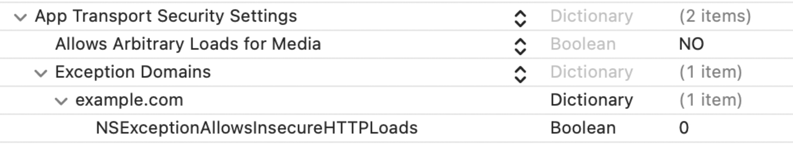

# Network Communication Requirements

## MSTG-NETWORK-1
Data is encrypted on the network using TLS. The secure channel is used consistently throughout the app.

### Configuring secure network communication
All the presented cases must be carefully analyzed as a whole. For example, even if the app does not permit cleartext traffic in its Info.plist, it might actually still be sending HTTP traffic. That could be the case if it's using a low-level API (for which ATS is ignored) or a badly configured cross-platform framework.

IMPORTANT: You should apply these tests to the app main code but also to any app extensions, frameworks or Watch apps embedded within the app as well.

For more information refer to the article ["Preventing Insecure Network Connections"](https://developer.apple.com/documentation/security/preventing_insecure_network_connections) and ["Fine-tune your App Transport Security settings"](https://developer.apple.com/news/?id=jxky8h89) in the Apple Developer Documentation.

Reference
* [owasp-mastg Testing Data Encryption on the Network (MSTG-NETWORK-1)](https://github.com/OWASP/owasp-mastg/blob/v1.5.0/Document/0x06g-Testing-Network-Communication.md#testing-data-encryption-on-the-network-mstg-network-1)

Rulebook
* [Use App Transport Security (ATS) (Required)](#use-app-transport-security-ats-required)

### Static Analysis
#### Verification of network requests with secure protocols
First, you should identify all network requests in the source code and ensure that no plain HTTP URLs are used. Make sure that sensitive information is sent over secure channels by using [URLSession](https://developer.apple.com/documentation/foundation/urlsession) (which uses the standard [URL Loading System from iOS](https://developer.apple.com/documentation/foundation/url_loading_system)) or [Network](https://developer.apple.com/documentation/network) (for socket-level communication using TLS and access to TCP and UDP).

Reference
* [owasp-mastg Testing Data Encryption on the Network (MSTG-NETWORK-1) Testing Network Requests over Secure Protocols](https://github.com/OWASP/owasp-mastg/blob/v1.5.0/Document/0x06g-Testing-Network-Communication.md#testing-network-requests-over-secure-protocols)

Rulebook
* [Using URLSession (Recommended)](#using-urlsession-recommended)
* [Using the Network Framework (Recommended)](#using-the-network-framework-recommended)

#### Check for Low-Level Networking API Usage
Identify the network APIs used by the app and see if it uses any low-level networking APIs.

**Apple Recommendation: Prefer High-Level Frameworks in Your App:**
"ATS doesn’t apply to calls your app makes to lower-level networking interfaces like the Network framework or CFNetwork. In these cases, you take responsibility for ensuring the security of the connection. You can construct a secure connection this way, but mistakes are both easy to make and costly. It’s typically safest to rely on the URL Loading System instead" (see [source](https://developer.apple.com/documentation/security/preventing_insecure_network_connections)).

If the app uses any low-level APIs such as [Network](https://developer.apple.com/documentation/network) or [CFNetwork](https://developer.apple.com/documentation/cfnetwork), you should carefully investigate if they are being used securely. For apps using cross-platform frameworks (e.g. Flutter, Xamarin, ...) and third party frameworks (e.g. Alamofire) you should analyze if they're being configured and used securely according to their best practices.

Make sure that the app:
* verifies the challenge type and the host name and credentials when performing server trust evaluation.
* doesn't ignore TLS errors.
* doesn't use any insecure TLS configurations (see <a href="#mstg-network-2">"Testing the TLS Settings (MSTG-NETWORK-2)"</a>)

These checks are orientative, we cannot name specific APIs since every app might use a different framework. Please use this information as a reference when inspecting the code.

Reference
* [owasp-mastg Testing Data Encryption on the Network (MSTG-NETWORK-1) Check for Low-Level Networking API Usage](https://github.com/OWASP/owasp-mastg/blob/v1.5.0/Document/0x06g-Testing-Network-Communication.md#check-for-low-level-networking-api-usage)

Rulebook
* [Use App Transport Security (ATS) (Required)](#use-app-transport-security-ats-required)
* [Use CFNetwork (Deprecated)](#use-cfnetwork-deprecated)
* [Using the Network Framework (Recommended)](#using-the-network-framework-recommended)
* [Use low-level networking APIs safely according to best practices (Required)](#use-low-level-networking-apis-safely-according-to-best-practices-required)

#### Testing for Cleartext Traffic
Ensure that the app is not allowing cleartext HTTP traffic. Since iOS 9.0 cleartext HTTP traffic is blocked by default (due to App Transport Security (ATS)) but there are multiple ways in which an application can still send it:

* Configuring ATS to enable cleartext traffic by setting the NSAllowsArbitraryLoads attribute to true (or YES) on NSAppTransportSecurity in the app's Info.plist.
* [Retrieve the Info.plist](https://github.com/OWASP/owasp-mastg/blob/v1.5.0/Document/0x06b-Basic-Security-Testing.md#the-infoplist-file)
* Check that NSAllowsArbitraryLoads is not set to true globally of for any domain.
* If the application opens third party web sites in WebViews, then from iOS 10 onwards NSAllowsArbitraryLoadsInWebContent can be used to disable ATS restrictions for the content loaded in web views.

**Apple warns:**
Disabling ATS means that unsecured HTTP connections are allowed. HTTPS connections are also allowed, and are still subject to default server trust evaluation. However, extended security checks—like requiring a minimum Transport Layer Security (TLS) protocol version—are disabled. Without ATS, you’re also free to loosen the default server trust requirements, as described in ["Performing Manual Server Trust Authentication"](https://developer.apple.com/documentation/foundation/url_loading_system/handling_an_authentication_challenge/performing_manual_server_trust_authentication).

The following snippet shows a vulnerable example of an app disabling ATS restrictions globally.

```xml
<key>NSAppTransportSecurity</key>
<dict>
    <key>NSAllowsArbitraryLoads</key>
    <true/>
</dict>
```
ATS should be examined taking the application's context into consideration. The application may have to define ATS exceptions to fulfill its intended purpose. For example, the [Firefox iOS application has ATS disabled globally](https://github.com/mozilla-mobile/firefox-ios/blob/v97.0/Client/Info.plist#L82). This exception is acceptable because otherwise the application would not be able to connect to any HTTP website that does not have all the ATS requirements. In some cases, apps might disable ATS globally but enable it for certain domains to e.g. securely load metadata or still allow secure login.

ATS should include a [justification string](https://developer.apple.com/documentation/security/preventing_insecure_network_connections#3138036) for this (e.g. "The app must connect to a server managed by another entity that doesn’t support secure connections.").

Reference
* [owasp-mastg Testing Data Encryption on the Network (MSTG-NETWORK-1) Testing for Cleartext Traffic](https://github.com/OWASP/owasp-mastg/blob/v1.5.0/Document/0x06g-Testing-Network-Communication.md#testing-for-cleartext-traffic)

Rulebook
* [Use App Transport Security (ATS) (Required)](#use-app-transport-security-ats-required)

### Dynamic Analysis
Intercept the tested app's incoming and outgoing network traffic and make sure that this traffic is encrypted. You can intercept network traffic in any of the following ways:

* Capture all HTTP(S) and Websocket traffic with an interception proxy like [OWASP ZAP](https://github.com/OWASP/owasp-mastg/blob/v1.5.0/Document/0x08a-Testing-Tools.md#owasp-zap) or [Burp Suite](https://github.com/OWASP/owasp-mastg/blob/v1.5.0/Document/0x08a-Testing-Tools.md#burp-suite) and make sure all requests are made via HTTPS instead of HTTP.
* Interception proxies like Burp and OWASP ZAP will show HTTP(S) traffic only. You can, however, use a Burp plugin such as [Burp-non-HTTP-Extension](https://github.com/summitt/Burp-Non-HTTP-Extension) or the tool [mitm-relay](https://github.com/jrmdev/mitm_relay) to decode and visualize communication via XMPP and other protocols.

Some applications may not work with proxies like Burp and OWASP ZAP because of Certificate Pinning. In such a scenario, please check ["Testing Custom Certificate Stores and Certificate Pinning"](https://github.com/OWASP/owasp-mastg/blob/v1.5.0/Document/0x06g-Testing-Network-Communication.md#testing-custom-certificate-stores-and-certificate-pinning-mstg-network-4).

For more details refer to:

* "Intercepting Traffic on the Network Layer" from chapter ["Testing Network Communication"](https://github.com/OWASP/owasp-mastg/blob/v1.5.0/Document/0x04f-Testing-Network-Communication.md#intercepting-traffic-on-the-network-layer)
* "Setting up a Network Testing Environment" from chapter [iOS Basic Security Testing](https://github.com/OWASP/owasp-mastg/blob/v1.5.0/Document/0x06b-Basic-Security-Testing.md#setting-up-a-network-testing-environment)

Reference
* [owasp-mastg Testing Data Encryption on the Network (MSTG-NETWORK-1) Dynamic Analysis](https://github.com/OWASP/owasp-mastg/blob/v1.5.0/Document/0x06g-Testing-Network-Communication.md#dynamic-analysis)

Rulebook
* [Use App Transport Security (ATS) (Required)](#use-app-transport-security-ats-required)

### Rulebook
1. [Use App Transport Security (ATS) (Required)](#use-app-transport-security-ats-required)
1. [Using URLSession (Recommended)](#using-urlsession-recommended)
1. [Use CFNetwork (Deprecated)](#use-cfnetwork-deprecated)
1. [Using the Network Framework (Recommended)](#using-the-network-framework-recommended)
1. [Use low-level networking APIs safely according to best practices (Required)](#use-low-level-networking-apis-safely-according-to-best-practices-required)

#### Use App Transport Security (ATS) (Required)

The ATS requires the use of HTTPS for all HTTP connections. In addition, it imposes extended security checks that complement the default server trust rating specified by the Transport Layer Security ( TLS ) protocol; ATS blocks connections that do not meet minimum security specifications.

In order to ensure that the data used within an application is as secure as possible, it is important to first understand if the connection is currently unsecured.

To check, set the Allow Arbitrary Loads attribute to "NO" in the App Transport Security Settings of the Info.plist to disable all active ATS exceptions. If an application makes an unsecured connection, a runtime error will occur on Xcode for each connection.

ATS is effective when:
* App Transport Security Settings is not specified in Info.plist.
* In Info.plist, "NO" is specified for "Allow Arbitrary Loads" attribute, "Allows Arbitrary Loads for Media" attribute, "Allows Arbitrary Loads in Web Content" attribute, and "NSExceptionAllowsInsecureHTTPLoads" attribute, and "NSExceptionRequiresForwardSecrecy" attribute is "YES" is specified and 1.2 or higher is specified in the "NSExceptionMinimumTLSVersion" attribute.

info.plist setting on Xcode:



If this is violated, the following may occur.
* May implement connections that do not meet security specifications.

#### Using URLSession (Recommended)

To manipulate URLs and communicate with servers using standard Internet protocols, iOS provides a URL Loading System.
URLSession is used for this purpose.

```swift
import UIKit

class Fetch {
    func getDataAPI(completion: @escaping (Any) -> Void) {
        let requestUrl = URL(string: "http://xxxxx")!
	    // Use URLSession's datatask to acquire data.
        let task = URLSession.shared.dataTask(with: requestUrl) { data, response, error in
	        // Process when an error is returned.
            if let error = error {
                completion(error)
            } else if let data = data {
                completion(data)
            }
        }
        task.resume()
    }
}
```

If this is not noted, the following may occur.
* Sensitive information may be transmitted over insecure channels.

#### Use CFNetwork (Deprecated)

CFNetwork is an API for BSD socket handling, HTTP and FTP server communication provided in iOS 2.0.

Most of them are now deprecated.
URLSession (using the standard iOS URL Loading System) is recommended for ATS to function effectively.

The reasons for this deprecation are as follows.
* Sensitive information may be transmitted over insecure channels.

#### Using the Network Framework (Recommended)

Use when direct access to TLS, TCP, UDP or proprietary application protocols is required.
Use URLSession as before for HTTP(S) and URL-based resource loading.

```swift
import Foundation
import Network

class NetworkUDP {
    // Constant
    let networkType = "_myApp._udp."
    let networkDomain = "local"

    private func startListener(name: String) {
        // Create listener with udp for using
        guard let listener = try? NWListener(using: .udp, on: 11111) else { fatalError() }

        listener.service = NWListener.Service(name: name, type: networkType)

        let listnerQueue = DispatchQueue(label: "com.myapp.queue.listener")

        // Processing new connection visits
        listener.newConnectionHandler = { [unowned self] (connection: NWConnection) in
            connection.start(queue: listnerQueue)
            self.receive(on: connection)
        }

        // Listener start
        listener.start(queue: listnerQueue)

    }

    private func receive(on connection: NWConnection) {
        /* Data reception */
        connection.receive(minimumIncompleteLength: 0,
                           maximumLength: 65535,
                           completion:{(data, context, flag, error) in
            if let error = error {
                NSLog("\(#function), \(error)")
            } else {
                if data != nil {
                    /* Deserialization of incoming data */
                    
                }
                else {
                    NSLog("receiveMessage data nil")
                }
            }
        })
    }

}
```

If this is not noted, the following may occur.
* Sensitive information may be transmitted over insecure channels.

#### Use low-level networking APIs safely according to best practices (Required)
If your app uses low-level APIs, you need to carefully investigate whether they are being used safely. If the app uses cross-platform frameworks (e.g. Flutter, Xamarin) or third-party frameworks (e.g. Alamofire), it should be analyzed to ensure that they are being configured and used safely according to best practices.

Ensure that the app complies with the following: * Verify that the app is compliant with the
* Validate challenge type and hostname and credentials when performing server reliability assessments.
* Do not ignore TLS errors.
* Not using insecure TLS settings. （"See Verify TLS settings (<a href="#mstg-network-2">MSTG-NETWORK-2</a>)"）

These checks are for reference only and cannot name specific APIs, as each application may use a different framework. They should be used as reference information when examining the code.

If this is violated, the following may occur.
* The app may conduct insecure communication.

## MSTG-NETWORK-2
The TLS settings are in line with current best practices, or as close as possible if the mobile operating system does not support the recommended standards.

### Recommended TLS Settings
Ensuring proper TLS configuration on the server side is also important. The SSL protocol is deprecated and should no longer be used. Also TLS v1.0 and TLS v1.1 have [known vulnerabilities](https://portswigger.net/daily-swig/the-end-is-nigh-browser-makers-ditch-support-for-aging-tls-1-0-1-1-protocols) and their usage is deprecated in all major browsers by 2020. TLS v1.2 and TLS v1.3 are considered best practice for secure transmission of data.

When both the client and server are controlled by the same organization and used only for communicating with one another, you can increase security by [hardening the configuration](https://dev.ssllabs.com/projects/best-practices/).

If a mobile application connects to a specific server, its networking stack can be tuned to ensure the highest possible security level for the server's configuration. Lack of support in the underlying operating system may force the mobile application to use a weaker configuration.

Remember to [inspect the corresponding justifications](https://developer.apple.com/documentation/security/preventing_insecure_network_connections#3138036) to discard that it might be part of the app intended purpose.

Some examples of justifications eligible for consideration are:
* The app must connect to a server managed by another entity that doesn’t support secure connections.
* The app must support connecting to devices that cannot be upgraded to use secure connections, and that must be accessed using public host names.
* The app must display embedded web content from a variety of sources, but can’t use a class supported by the web content exception.
* The app loads media content that is encrypted and that contains no personalized information.

When submitting your app to the App Store, provide sufficient information for the App Store to determine why your app cannot make secure connections by default.

It is possible to verify which ATS settings can be used when communicating to a certain endpoint. On macOS the command line utility nscurl can be used. A permutation of different settings will be executed and verified against the specified endpoint. If the default ATS secure connection test is passing, ATS can be used in its default secure configuration. If there are any fails in the nscurl output, please change the server side configuration of TLS to make the server side more secure, rather than weakening the configuration in ATS on the client. See the article "Identifying the Source of Blocked Connections" in the [Apple Developer Documentation](https://developer.apple.com/documentation/security/preventing_insecure_network_connections/identifying_the_source_of_blocked_connections) for more details.

Refer to section "Verifying the TLS Settings" in chapter [Testing Network Communication](https://github.com/OWASP/owasp-mastg/blob/v1.5.0/Document/0x04f-Testing-Network-Communication.md#verifying-the-tls-settings-mstg-network-2) for details.

Reference
* [owasp-mastg Verifying the TLS Settings (MSTG-NETWORK-2) Recommended TLS Settings](https://github.com/OWASP/owasp-mastg/blob/v1.5.0/Document/0x04f-Testing-Network-Communication.md#recommended-tls-settings)
* [owasp-mastg Testing the TLS Settings (MSTG-NETWORK-2)](https://github.com/OWASP/owasp-mastg/blob/v1.5.0/Document/0x06g-Testing-Network-Communication.md#testing-the-tls-settings-mstg-network-2)

Rulebook
* [Secure communication protocol (Required)](#secure-communication-protocol-required)
* [Use App Transport Security (ATS) (Required)](#use-app-transport-security-ats-required)

### Recommended Cipher Suites

Cipher suites have the following structure:
```txt
Protocol_KeyExchangeAlgorithm_WITH_BlockCipher_IntegrityCheckAlgorithm
```

This structure includes:
* A Protocol used by the cipher
* A Key Exchange Algorithm used by the server and the client to authenticate during the TLS handshake
* A Block Cipher used to encrypt the message stream
* A Integrity Check Algorithm used to authenticate messages

Example: TLS_RSA_WITH_3DES_EDE_CBC_SHA

In the example above the cipher suites uses:
* TLS as protocol
* RSA Asymmetric encryption for Authentication
* 3DES for Symmetric encryption with EDE_CBC mode
* SHA Hash algorithm for integrity

Note that in TLSv1.3 the Key Exchange Algorithm is not part of the cipher suite, instead it is determined during the TLS handshake.

In the following listing, we’ll present the different algorithms of each part of the cipher suite.

Protocols:
* SSLv1
* SSLv2 - [RFC 6176](https://www.rfc-editor.org/rfc/rfc6176)
* SSLv3 - [RFC 6101](https://www.rfc-editor.org/rfc/rfc6101)
* TLSv1.0 - [RFC 2246](https://www.ietf.org/rfc/rfc2246)
* TLSv1.1 - [RFC 4346](https://www.rfc-editor.org/rfc/rfc4346)
* TLSv1.2 - [RFC 5246](https://www.rfc-editor.org/rfc/rfc5246)
* TLSv1.3 - [RFC 8446](https://www.rfc-editor.org/rfc/rfc8446)

Key Exchange Algorithms:
* DSA - [RFC 6979](https://www.rfc-editor.org/rfc/rfc6979)
* ECDSA - [RFC 6979](https://www.rfc-editor.org/rfc/rfc6979)
* RSA - [RFC 8017](https://www.rfc-editor.org/rfc/rfc8017)
* DHE - [RFC 2631](https://www.rfc-editor.org/rfc/rfc2631) - [RFC 7919](https://www.rfc-editor.org/rfc/rfc7919)
* ECDHE - [RFC 4492](https://www.rfc-editor.org/rfc/rfc4492)
* PSK - [RFC 4279](https://www.rfc-editor.org/rfc/rfc4279)
* DSS - [FIPS186-4](https://nvlpubs.nist.gov/nistpubs/FIPS/NIST.FIPS.186-4.pdf)
* DH_anon - [RFC 2631](https://www.rfc-editor.org/rfc/rfc2631) - [RFC 7919](https://www.rfc-editor.org/rfc/rfc7919)
* DHE_RSA - [RFC 2631](https://www.rfc-editor.org/rfc/rfc2631) - [RFC 7919](https://www.rfc-editor.org/rfc/rfc7919)
* DHE_DSS - [RFC 2631](https://www.rfc-editor.org/rfc/rfc2631) - [RFC 7919](https://www.rfc-editor.org/rfc/rfc7919)
* ECDHE_ECDSA - [RFC 8422](https://www.rfc-editor.org/rfc/rfc8422)
* ECDHE_PSK - [RFC 8422](https://www.rfc-editor.org/rfc/rfc8422) - [RFC 5489](https://www.rfc-editor.org/rfc/rfc5489)
* ECDHE_RSA - [RFC 8422](https://www.rfc-editor.org/rfc/rfc8422)

Block Ciphers:
* DES - [RFC 4772](https://www.rfc-editor.org/rfc/rfc4772)
* DES_CBC - [RFC 1829](https://www.rfc-editor.org/rfc/rfc1829)
* 3DES - [RFC 2420](https://www.rfc-editor.org/rfc/rfc2420)
* 3DES_EDE_CBC - [RFC 2420](https://www.rfc-editor.org/rfc/rfc2420)
* AES_128_CBC - [RFC 3268](https://www.rfc-editor.org/rfc/rfc3268)
* AES_128_GCM - [RFC 5288](https://www.rfc-editor.org/rfc/rfc5288)
* AES_256_CBC - [RFC 3268](https://www.rfc-editor.org/rfc/rfc3268)
* AES_256_GCM - [RFC 5288](https://www.rfc-editor.org/rfc/rfc5288)
* RC4_40 - [RFC 7465](https://www.rfc-editor.org/rfc/rfc7465)
* RC4_128 - [RFC 7465](https://www.rfc-editor.org/rfc/rfc7465)
* CHACHA20_POLY1305 - [RFC 7905](https://www.rfc-editor.org/rfc/rfc7905) - [RFC 7539](https://www.rfc-editor.org/rfc/rfc7539)

Integrity Check Algorithms:
* MD5 - [RFC 6151](https://www.rfc-editor.org/rfc/rfc6151)
* SHA - [RFC 6234](https://www.rfc-editor.org/rfc/rfc6234)
* SHA256 - [RFC 6234](https://www.rfc-editor.org/rfc/rfc6234)
* SHA384 - [RFC 6234](https://www.rfc-editor.org/rfc/rfc6234)

Note that the efficiency of a cipher suite depends on the efficiency of its algorithms.

The following resources contain the latest recommended cipher suites to use with TLS:
* IANA recommended cipher suites can be found in [TLS Cipher Suites](https://www.iana.org/assignments/tls-parameters/tls-parameters.xhtml#tls-parameters-4).
* OWASP recommended cipher suites can be found in the [TLS Cipher String Cheat Sheet](https://github.com/OWASP/CheatSheetSeries/blob/master/cheatsheets/TLS_Cipher_String_Cheat_Sheet.md).

Some iOS versions do not support some of the recommended cipher suites, so for compatibility purposes you can check the supported cipher suites for [iOS](https://developer.apple.com/documentation/security/1550981-ssl_cipher_suite_values?language=objc) versions and choose the top supported cipher suites.

If you want to verify whether your server supports the right cipher suites, there are various tools you can use:
* nscurl - see [iOS Network Communication](https://github.com/OWASP/owasp-mastg/blob/v1.5.0/Document/0x06g-Testing-Network-Communication.md) for more details.
* [testssl.sh](https://github.com/drwetter/testssl.sh) which "is a free command line tool which checks a server's service on any port for the support of TLS/SSL ciphers, protocols as well as some cryptographic flaws".

Finally, verify that the server or termination proxy at which the HTTPS connection terminates is configured according to best practices. See also the [OWASP Transport Layer Protection cheat sheet](https://github.com/OWASP/CheatSheetSeries/blob/master/cheatsheets/Transport_Layer_Protection_Cheat_Sheet.md) and the [Qualys SSL/TLS Deployment Best Practices](https://dev.ssllabs.com/projects/best-practices/).

Reference
* [owasp-mastg Verifying the TLS Settings (MSTG-NETWORK-2) Cipher Suites Terminology](https://github.com/OWASP/owasp-mastg/blob/v1.5.0/Document/0x04f-Testing-Network-Communication.md#cipher-suites-terminology)

Rulebook
* [Recommended cipher suites for TLS (Recommended)](#recommended-cipher-suites-for-tls-recommended)

### Rulebook
1. [Secure communication protocol (Required)](#secure-communication-protocol-required)
1. [Recommended cipher suites for TLS (Recommended)](#recommended-cipher-suites-for-tls-recommended)

#### Secure communication protocol (Required)
Ensuring proper TLS configuration on the server side is also important. The SSL protocol is deprecated and should no longer be used.

Deprecated Protocols
* SSL
* TLS v1.0
* TLS v1.1

TLS v1.0 and TLS v1.1 have been deprecated in all major browsers by 2020.

Recommended Protocols
* TLS v1.2
* TLS v1.3

If this is violated, the following may occur.
* Vulnerable to security exploits.

#### Recommended cipher suites for TLS (Recommended)

The following is an example of a recommended cipher suite. (Lists the cipher suites defined by [iOS](https://developer.apple.com/documentation/security/secure_transport/1550981-ssl_cipher_suite_values) among those recommended by [TLS Cipher Suites](https://www.iana.org/assignments/tls-parameters/tls-parameters.xhtml#tls-parameters-4).)
* TLS_DHE_RSA_WITH_AES_128_GCM_SHA256
* TLS_DHE_RSA_WITH_AES_256_GCM_SHA384
* TLS_DHE_PSK_WITH_AES_128_GCM_SHA256
* TLS_DHE_PSK_WITH_AES_256_GCM_SHA384
* TLS_AES_128_GCM_SHA256
* TLS_AES_256_GCM_SHA384
* TLS_CHACHA20_POLY1305_SHA256
* TLS_AES_128_CCM_SHA256
* TLS_ECDHE_ECDSA_WITH_AES_128_GCM_SHA256
* TLS_ECDHE_ECDSA_WITH_AES_256_GCM_SHA384
* TLS_ECDHE_RSA_WITH_AES_128_GCM_SHA256
* TLS_ECDHE_RSA_WITH_AES_256_GCM_SHA384
* TLS_ECDHE_RSA_WITH_CHACHA20_POLY1305_SHA256
* TLS_ECDHE_ECDSA_WITH_CHACHA20_POLY1305_SHA256

If this is not noted, the following may occur.
* Potential use of vulnerable cipher suites.

## MSTG-NETWORK-3
The app verifies the X.509 certificate of the remote endpoint when the secure channel is established. Only certificates signed by a trusted CA are accepted.

\* The description of certificate validation is summarized in ["Configuring secure network communication"](#configuring-secure-network-communication) and is omitted from this chapter.


