# Platform Interaction Requirements

## MSTG-PLATFORM-1
The app only requests the minimum set of permissions necessary.


In contrast to Android, where each app runs on its own user ID, iOS makes all third-party apps run under the non-privileged mobile user. Each app has a unique home directory and is sandboxed, so that they cannot access protected system resources or files stored by the system or by other apps. These restrictions are implemented via sandbox policies (aka. profiles), which are enforced by the [Trusted BSD (MAC) Mandatory Access Control Framework](http://www.trustedbsd.org/mac.html) via a kernel extension. iOS applies a generic sandbox profile to all third-party apps called container. Access to protected resources or data (some also known as [app capabilities](https://developer.apple.com/help/account/reference/supported-capabilities-ios)) is possible, but it's strictly controlled via special permissions known as entitlements.

Some permissions can be configured by the app's developers (e.g. Data Protection or Keychain Sharing) and will directly take effect after the installation. However, for others, the user will be explicitly asked the first time the app attempts to access a protected resource, [for example](https://developer.apple.com/documentation/uikit#//apple_ref/doc/uid/TP40007072-CH3-SW7):

* Bluetooth peripherals
* Calendar data
* Camera
* Contacts
* Health sharing
* Health updating
* HomeKit
* Location
* Microphone
* Motion
* Music and the media library
* Photos
* Reminders
* Siri
* Speech recognition
* the TV provider

Even though Apple urges to protect the privacy of the user and to be [very clear on how to ask permissions](https://developer.apple.com/design/human-interface-guidelines/patterns/accessing-private-data/), it can still be the case that an app requests too many of them for non-obvious reasons.

Some permissions such as Camera, Photos, Calendar Data, Motion, Contacts or Speech Recognition should be pretty straightforward to verify as it should be obvious if the app requires them to fulfill its tasks. Let's consider the following examples ragarding the Photos permission, which, if granted, gives the app access to all user photos in the "Camera Roll" (the iOS default system-wide location for storing photos):

* The typical QR Code scanning app obviously requires the camera to function but might be requesting the photos permission as well. If storage is explicitly required, and depending on the sensitivity of the pictures being taken, these apps might better opt to use the app sandbox storage to avoid other apps (having the photos permission) to access them. See the chapter "[Data Storage on iOS](https://github.com/OWASP/owasp-mastg/blob/v1.5.0/Document/0x06d-Testing-Data-Storage.md)" for more information reagarding storage of sensitive data.

* Some apps require photo uploads (e.g. for profile pictures). Recent versions of iOS introduce new APIs such as [UIImagePickerController](https://developer.apple.com/documentation/uikit/uiimagepickercontroller) (iOS 11+) and its modern [replacement](https://developer.apple.com/videos/play/wwdc2020/10652/) [PHPickerViewController](https://developer.apple.com/documentation/photokit/phpickerviewcontroller) (iOS 14+). These APIs run on a separate process from your app and by using them, the app gets read-only access exclusively to the images selected by the user instead of to the whole "Camera Roll". This is considered a best practice to avoid requesting unnecessary permissions.

Other permissions like Bluetooth or Location require deeper verification steps. They may be required for the app to properly function but the data being handled by those tasks might not be properly protected. For more information and some examples please refer to the "[Source Code Inspection](#source-code-inspection)" in the "Static Analysis" section below and to the "Dynamic Analysis" section.

When collecting or simply handling (e.g. caching) sensitive data, an app should provide proper mechanisms to give the user control over it, e.g. to be able to revoke access or to delete it. However, sensitive data might not only be stored or cached but also sent over the network. In both cases, it has to be ensured that the app properly follows the appropriate best practices, which in this case involve implementing proper data protection and transport security. More information on how to protect this kind of data can be found in the chapter "Network APIs".

As you can see, using app capabilities and permissions mostly involve handling personal data, therefore being a matter of protecting the user's privacy. See the articles "[Protecting the User's Privacy](https://developer.apple.com/documentation/uikit/protecting_the_user_s_privacy)" and "[Accessing Protected Resources](https://developer.apple.com/documentation/uikit/protecting_the_user_s_privacy/requesting_access_to_protected_resources?language=objc)" in Apple Developer Documentation for more details.


Reference
* [owasp-mastg Testing App Permissions (MSTG-PLATFORM-1)](https://github.com/OWASP/owasp-mastg/blob/v1.5.0/Document/0x06h-Testing-Platform-Interaction.md#testing-app-permissions-mstg-platform-1)


Rulebook
* [How to request permission (Required)](#how-to-request-permission-required)
* [Settings for accessing photos (Required)](#settings-for-accessing-photos-required)
* [Implement appropriate data protection and transfer security (Required)](#implement-appropriate-data-protection-and-transfer-security-required)


### Device Capabilities

Device capabilities are used by the App Store to ensure that only compatible devices are listed and therefore are allowed to download the app. They are specified in the Info.plist file of the app under the [UIRequiredDeviceCapabilities](https://developer.apple.com/library/archive/documentation/General/Reference/InfoPlistKeyReference/Articles/iPhoneOSKeys.html#//apple_ref/doc/plist/info/UIRequiredDeviceCapabilities) key.

```xml
<key>UIRequiredDeviceCapabilities</key>
<array>
    <string>armv7</string>
</array>
```

Typically you'll find the armv7 capability, meaning that the app is compiled only for the armv7 instruction set, or if it's a 32/64-bit universal app.

For example, an app might be completely dependent on NFC to work (e.g. a "[NFC Tag Reader](https://apps.apple.com/us/app/nfc-taginfo-by-nxp/id1246143596)" app). According to the archived [iOS Device Compatibility Reference](https://developer.apple.com/library/archive/documentation/DeviceInformation/Reference/iOSDeviceCompatibility/DeviceCompatibilityMatrix/DeviceCompatibilityMatrix.html), NFC is only available starting on the iPhone 7 (and iOS 11). A developer might want to exclude all incompatible devices by setting the nfc device capability.

Regarding testing, you can consider UIRequiredDeviceCapabilities as a mere indication that the app is using some specific resources. Unlike the entitlements related to app capabilities, device capabilities do not confer any right or access to protected resources. Additional configuration steps might be required for that, which are very specific to each capability.

For example, if BLE is a core feature of the app, Apple's [Core Bluetooth Programming Guide](https://developer.apple.com/library/archive/documentation/NetworkingInternetWeb/Conceptual/CoreBluetooth_concepts/CoreBluetoothOverview/CoreBluetoothOverview.html#//apple_ref/doc/uid/TP40013257-CH2-SW1) explains the different things to be considered:

* The bluetooth-le device capability can be set in order to restrict non-BLE capable devices from downloading their app.
* App capabilities like bluetooth-peripheral or bluetooth-central (both UIBackgroundModes) should be added if [BLE background processing](https://developer.apple.com/library/archive/documentation/NetworkingInternetWeb/Conceptual/CoreBluetooth_concepts/CoreBluetoothBackgroundProcessingForIOSApps/PerformingTasksWhileYourAppIsInTheBackground.html) is required.

However, this is not yet enough for the app to get access to the Bluetooth peripheral, the NSBluetoothPeripheralUsageDescription key has to be included in the Info.plist file, meaning that the user has to actively give permission. See "Purpose Strings in the Info.plist File" below for more information.


Reference
* [owasp-mastg Testing App Permissions (MSTG-PLATFORM-1) Overview Device Capabilities](https://github.com/OWASP/owasp-mastg/blob/v1.5.0/Document/0x06h-Testing-Platform-Interaction.md#device-capabilities)

### Entitlements
According to [Apple's iOS Security Guide](https://support.apple.com/ja-jp/guide/security/welcome/web):

Entitlements are key value pairs that are signed in to an app and allow authentication beyond runtime factors, like UNIX user ID. Since entitlements are digitally signed, they can't be changed. Entitlements are used extensively by system apps and daemons to perform specific privileged operations that would otherwise require the process to run as root. This greatly reduces the potential for privilege escalation by a compromised system app or daemon.

Many entitlements can be set using the "Summary" tab of the Xcode target editor. Other entitlements require editing a target's entitlements property list file or are inherited from the iOS provisioning profile used to run the app.

[Entitlement Sources](https://developer.apple.com/library/archive/technotes/tn2415/_index.html#//apple_ref/doc/uid/DTS40016427-CH1-SOURCES):

1. Entitlements embedded in a provisioning profile that is used to code sign the app, which are composed of:
   * Capabilities defined on the Xcode project's target Capabilities tab, and/or:
   * Enabled Services on the app's App ID which are configured on the Identifiers section of the Certificates, ID's and Profiles website.
   * Other entitlements that are injected by the profile generation service.
2. Entitlements from a code signing entitlements file.


[Entitlement Destinations](https://developer.apple.com/library/archive/technotes/tn2415/_index.html#//apple_ref/doc/uid/DTS40016427-CH1-DESTINATIONS):
1. The app's signature.
2. The app's embedded provisioning profile.

The [Apple Developer Documentation](https://developer.apple.com/library/archive/technotes/tn2415/_index.html#//apple_ref/doc/uid/DTS40016427-CH1-APPENTITLEMENTS) also explains:

* During code signing, the entitlements corresponding to the app's enabled Capabilities/Services are transferred to the app's signature from the provisioning profile Xcode chose to sign the app.
* The provisioning profile is embedded into the app bundle during the build (embedded.mobileprovision).
* Entitlements from the "Code Signing Entitlements" section in Xcode's "Build Settings" tab are transferred to the app's signature.

For example, if you want to set the "Default Data Protection" capability, you would need to go to the Capabilities tab in Xcode and enable Data Protection. This is directly written by Xcode to the \<appname>.entitlements file as the com.apple.developer.default-data-protection entitlement with default value NSFileProtectionComplete. In the IPA we might find this in the embedded.mobileprovision as:

```xml
<key>Entitlements</key>
<dict>
    ...
    <key>com.apple.developer.default-data-protection</key>
    <string>NSFileProtectionComplete</string>
</dict>
```

For other capabilities such as HealthKit, the user has to be asked for permission, therefore it is not enough to add the entitlements, special keys and strings have to be added to the Info.plist file of the app.

The following sections go more into detail about the mentioned files and how to perform static and dynamic analysis using them.


Reference
* [owasp-mastg Testing App Permissions (MSTG-PLATFORM-1) Overview Entitlements](https://github.com/OWASP/owasp-mastg/blob/v1.5.0/Document/0x06h-Testing-Platform-Interaction.md#entitlements)

Rulebook
* [iOS 10 or later, items that require permission description (Required)](#ios-10-or-later-items-that-require-permission-description-required)
 
### Static Analysis

Since iOS 10, these are the main areas which you need to inspect for permissions:

* Purpose Strings in the Info.plist File
* Code Signing Entitlements File
* Embedded Provisioning Profile File
* Entitlements Embedded in the Compiled App Binary
* Source Code Inspection

Reference
* [owasp-mastg Testing App Permissions (MSTG-PLATFORM-1) Static Analysis](https://github.com/OWASP/owasp-mastg/blob/v1.5.0/Document/0x06h-Testing-Platform-Interaction.md#static-analysis)

Rulebook
* [iOS 10 or later, items that require permission description (Required)](#ios-10-or-later-items-that-require-permission-description-required)

#### Purpose Strings in the Info.plist File

[Purpose strings](https://developer.apple.com/documentation/uikit/protecting_the_user_s_privacy/requesting_access_to_protected_resources?language=objc#3037322) or_usage description strings_ are custom texts that are offered to users in the system's permission request alert when requesting permission to access protected data or resources.


If linking on or after iOS 10, developers are required to include purpose strings in their app's [Info.plist](https://developer.apple.com/documentation/uikit#//apple_ref/doc/uid/TP40007072-CH3-SW5) file. Otherwise, if the app attempts to access protected data or resources without having provided the corresponding purpose string, [the access will fail and the app might even crash](https://developer.apple.com/documentation/uikit/protecting_the_user_s_privacy/requesting_access_to_protected_resources?language=objc).

If having the original source code, you can verify the permissions included in the Info.plist file:

* Open the project with Xcode.
* Find and open the Info.plist file in the default editor and search for the keys starting with "Privacy -".

You may switch the view to display the raw values by right-clicking and selecting "Show Raw Keys/Values" (this way for example "Privacy - Location When In Use Usage Description" will turn into NSLocationWhenInUseUsageDescription).

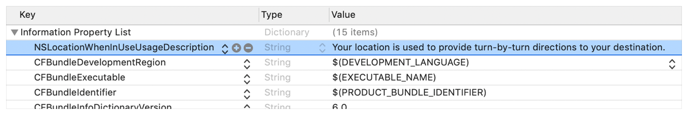

If only having the IPA:
* Unzip the IPA.
* The Info.plist is located in Payload/\<appname>.app/Info.plist.
* Convert it if needed (e.g. plutil -convert xml1 Info.plist) as explained in the chapter "iOS Basic Security Testing", section "The Info.plist File".
* Inspect all purpose strings Info.plist keys, usually ending with UsageDescription:

```xml
<plist version="1.0">
<dict>
    <key>NSLocationWhenInUseUsageDescription</key>
    <string>Your location is used to provide turn-by-turn directions to your destination.</string>
```

For an overview of the different purpose strings Info.plist keys available see Table 1-2 at the [Apple App Programming Guide for iOS](https://developer.apple.com/documentation/uikit#//apple_ref/doc/uid/TP40007072-CH3-SW7). Click on the provided links to see the full description of each key in the [CocoaKeys reference](https://developer.apple.com/library/archive/documentation/General/Reference/InfoPlistKeyReference/Articles/CocoaKeys.html).

Following these guidelines should make it relatively simple to evaluate each and every entry in the Info.plist file to check if the permission makes sense.

For example, imagine the following lines were extracted from a Info.plist file used by a Solitaire game:

```xml
<key>NSHealthClinicalHealthRecordsShareUsageDescription</key>
<string>Share your health data with us!</string>
<key>NSCameraUsageDescription</key>
<string>We want to access your camera</string>
```

It should be suspicious that a regular solitaire game requests this kind of resource access as it probably does not have any need for [accessing the camera](https://developer.apple.com/library/archive/documentation/General/Reference/InfoPlistKeyReference/Articles/CocoaKeys.html#//apple_ref/doc/uid/TP40009251-SW24) nor a [user's health-records](https://developer.apple.com/library/archive/documentation/General/Reference/InfoPlistKeyReference/Articles/CocoaKeys.html#//apple_ref/doc/uid/TP40009251-SW76).

Apart from simply checking if the permissions make sense, further analysis steps might be derived from analyzing purpose strings e.g. if they are related to storage sensitive data. For example, NSPhotoLibraryUsageDescription can be considered as a storage permission giving access to files that are outside of the app's sandbox and might also be accessible by other apps. In this case, it should be tested that no sensitive data is being stored there (photos in this case). For other purpose strings like NSLocationAlwaysUsageDescription, it must be also considered if the app is storing this data securely. Refer to the "Testing Data Storage" chapter for more information and best practices on securely storing sensitive data.

Reference
* [owasp-mastg Testing App Permissions (MSTG-PLATFORM-1) Static Analysis Purpose Strings in the Info.plist File](https://github.com/OWASP/owasp-mastg/blob/v1.5.0/Document/0x06h-Testing-Platform-Interaction.md#purpose-strings-in-the-infoplist-file)

#### Code Signing Entitlements File

Certain capabilities require a [code signing entitlements file](https://developer.apple.com/library/archive/technotes/tn2415/_index.html#//apple_ref/doc/uid/DTS40016427-CH1-ENTITLEMENTSFILE) (\<appname>.entitlements). It is automatically generated by Xcode but may be manually edited and/or extended by the developer as well.

Here is an example of entitlements file of the [open source app Telegram](https://github.com/TelegramMessenger/Telegram-iOS/blob/77ee5c4dabdd6eb5f1e2ff76219edf7e18b45c00/Telegram-iOS/Telegram-iOS-AppStoreLLC.entitlements#L23) including the [App Groups entitlement](https://developer.apple.com/documentation/bundleresources/entitlements/com_apple_security_application-groups) (application-groups):

```xml
<?xml version="1.0" encoding="UTF-8"?>
<!DOCTYPE plist PUBLIC "-//Apple//DTD PLIST 1.0//EN" "http://www.apple.com/DTDs/PropertyList-1.0.dtd">
<plist version="1.0">
<dict>
...
    <key>com.apple.security.application-groups</key>
    <array>
        <string>group.ph.telegra.Telegraph</string>
    </array>
</dict>
...
</plist>
```

The entitlement outlined above does not require any additional permissions from the user. However, it is always a good practice to check all entitlements, as the app might overask the user in terms of permissions and thereby leak information.

As documented at [Apple Developer Documentation](https://developer.apple.com/library/archive/documentation/Miscellaneous/Reference/EntitlementKeyReference/Chapters/EnablingAppSandbox.html#//apple_ref/doc/uid/TP40011195-CH4-SW19), the App Groups entitlement is required to share information between different apps through IPC or a shared file container, which means that data can be shared on the device directly between the apps. This entitlement is also required if an app extension requires to [share information with its containing app](https://developer.apple.com/library/archive/documentation/General/Conceptual/ExtensibilityPG/ExtensionScenarios.html).

Depending on the data to-be-shared it might be more appropriate to share it using another method such as through a backend where this data could be potentially verified, avoiding tampering by e.g. the user himself.


Reference
* [owasp-mastg Testing App Permissions (MSTG-PLATFORM-1) Static Analysis Code Signing Entitlements File](https://github.com/OWASP/owasp-mastg/blob/v1.5.0/Document/0x06h-Testing-Platform-Interaction.md#code-signing-entitlements-file)


#### Embedded Provisioning Profile File

When you do not have the original source code, you should analyze the IPA and search inside for the embedded provisioning profile that is usually located in the root app bundle folder (Payload/\<appname>.app/) under the name embedded.mobileprovision.

This file is not a .plist, it is encoded using [Cryptographic Message Syntax](https://en.wikipedia.org/wiki/Cryptographic_Message_Syntax). On macOS you can [inspect an embedded provisioning profile's entitlements](https://developer.apple.com/library/archive/technotes/tn2415/_index.html#//apple_ref/doc/uid/DTS40016427-CH1-PROFILESENTITLEMENTS) using the following command:

```bash
security cms -D -i embedded.mobileprovision
```

and then search for the Entitlements key region (\<key>Entitlements\</key>).


Reference
* [owasp-mastg Testing App Permissions (MSTG-PLATFORM-1) Static Analysis Embedded Provisioning Profile File](https://github.com/OWASP/owasp-mastg/blob/v1.5.0/Document/0x06h-Testing-Platform-Interaction.md#embedded-provisioning-profile-file)

#### Entitlements Embedded in the Compiled App Binary

If you only have the app's IPA or simply the installed app on a jailbroken device, you normally won't be able to find .entitlements files. This could be also the case for the embedded.mobileprovision file. Still, you should be able to extract the entitlements property lists from the app binary yourself (which you've previously obtained as explained in the "iOS Basic Security Testing" chapter, section ["Acquiring the App Binary"](https://github.com/OWASP/owasp-mastg/blob/v1.5.0/Document/0x06b-Basic-Security-Testing.md#acquiring-the-app-binary)).

The following steps should work even when targeting an encrypted binary. If for some reason they don't, you'll have to decrypt and extract the app with e.g. Clutch (if compatible with your iOS version), frida-ios-dump or similar.

* Extracting the Entitlements Plist from the App Binary

If you have the app binary in your computer, one approach is to use binwalk to extract (-e) all XML files (-y=xml):

```bash
$ binwalk -e -y=xml ./Telegram\ X

DECIMAL       HEXADECIMAL     DESCRIPTION
--------------------------------------------------------------------------------
1430180       0x15D2A4        XML document, version: "1.0"
1458814       0x16427E        XML document, version: "1.0"
```

Or you can use radare2 (-qc to quietly run one command and exit) to search all strings on the app binary (izz) containing "PropertyList" (~PropertyList):

```bash
$ r2 -qc 'izz~PropertyList' ./Telegram\ X

0x0015d2a4 ascii <?xml version="1.0" encoding="UTF-8" standalone="yes"?>\n<!DOCTYPE plist PUBLIC
"-//Apple//DTD PLIST 1.0//EN" "http://www.apple.com/DTDs/PropertyList-1.0.dtd">\n<plist version="1.0">
...<key>com.apple.security.application-groups</key>\n\t\t<array>
\n\t\t\t<string>group.ph.telegra.Telegraph</string>...

0x0016427d ascii H<?xml version="1.0" encoding="UTF-8"?>\n<!DOCTYPE plist PUBLIC
"-//Apple//DTD PLIST 1.0//EN" "http://www.apple.com/DTDs/PropertyList-1.0.dtd">\n<plist version="1.0">\n
<dict>\n\t<key>cdhashes</key>...
```

In both cases (binwalk or radare2) we were able to extract the same two plist files. If we inspect the first one (0x0015d2a4) we see that we were able to completely recover the [original entitlements file from Telegram](https://github.com/TelegramMessenger/Telegram-iOS/blob/77ee5c4dabdd6eb5f1e2ff76219edf7e18b45c00/Telegram-iOS/Telegram-iOS-AppStoreLLC.entitlements).

Note: the strings command will not help here as it will not be able to find this information. Better use grep with the -a flag directly on the binary or use radare2 (izz)/rabin2 (-zz).

If you access the app binary on the jailbroken device (e.g via SSH), you can use grep with the -a, -\-text flag (treats all files as ASCII text):

```bash
$ grep -a -A 5 'PropertyList' /var/containers/Bundle/Application/
    15E6A58F-1CA7-44A4-A9E0-6CA85B65FA35/Telegram X.app/Telegram\ X

<!DOCTYPE plist PUBLIC "-//Apple//DTD PLIST 1.0//EN" "http://www.apple.com/DTDs/PropertyList-1.0.dtd">
<plist version="1.0">
    <dict>
        <key>com.apple.security.application-groups</key>
        <array>
        ...
```

Play with the `A num, --after-context=num` flag to display more or less lines. You may use tools like the ones we presented above as well, if you have them also installed on your jailbroken iOS device.

This method should work even if the app binary is still encrypted (it was tested against several App Store apps).


Reference
* [owasp-mastg Testing App Permissions (MSTG-PLATFORM-1) Static Analysis Entitlements Embedded in the Compiled App Binary](https://github.com/OWASP/owasp-mastg/blob/v1.5.0/Document/0x06h-Testing-Platform-Interaction.md#entitlements-embedded-in-the-compiled-app-binary)


#### Source Code Inspection

After having checked the \<appname>.entitlements file and the Info.plist file, it is time to verify how the requested permissions and assigned capabilities are put to use. For this, a source code review should be enough. However, if you don't have the original source code, verifying the use of permissions might be specially challenging as you might need to reverse engineer the app, refer to the "Dynamic Analysis" for more details on how to proceed.

When doing a source code review, pay attention to:

* whether the purpose strings in the Info.plist file match the programmatic implementations.
* whether the registered capabilities are used in such a way that no confidential information is leaking.

Users can grant or revoke authorization at any time via "Settings", therefore apps normally check the authorization status of a feature before accessing it. This can be done by using dedicated APIs available for many system frameworks that provide access to protected resources.

You can use the [Apple Developer Documentation](https://developer.apple.com/documentation/uikit/protecting_the_user_s_privacy/requesting_access_to_protected_resources?language=objc#3037319) as a starting point. For example:
* Bluetooth: the [state](https://developer.apple.com/documentation/corebluetooth/cbmanager/1648600-state?language=objc) property of the [CBCentralManager](https://developer.apple.com/documentation/corebluetooth/cbcentralmanager?language=objc) class is used to check system-authorization status for using Bluetooth peripherals.
* Location: search for methods of CLLocationManager, e.g. [locationServicesEnabled](https://developer.apple.com/documentation/corelocation/cllocationmanager/1423648-locationservicesenabled?language=objc).
   ```swift
   func checkForLocationServices() {
       if CLLocationManager.locationServicesEnabled() {
           // Location services are available, so query the user’s location.
       } else {
           // Update your app’s UI to show that the location is unavailable.
       }
   }
   ```
   See Table1 in ["Determining the Availability of Location Services"](https://developer.apple.com/documentation/corelocation/configuring_your_app_to_use_location_services) (Apple Developer Documentation) for a complete list.

Go through the application searching for usages of these APIs and check what happens to sensitive data that might be obtained from them. For example, it might be stored or transmitted over the network, if this is the case, proper data protection and transport security should be additionally verified.


Reference
* [owasp-mastg Testing App Permissions (MSTG-PLATFORM-1) Static Analysis Source Code Inspection](https://github.com/OWASP/owasp-mastg/blob/v1.5.0/Document/0x06h-Testing-Platform-Interaction.md#source-code-inspection)

### Dynamic Analysis

With help of the static analysis you should already have a list of the included permissions and app capabilities in use. However, as mentioned in "Source Code Inspection", spotting the sensitive data and APIs related to those permissions and app capabilities might be a challenging task when you don't have the original source code. Dynamic analysis can help here getting inputs to iterate onto the static analysis.

Following an approach like the one presented below should help you spotting the mentioned sensitive data and APIs:

1. Consider the list of permissions / capabilities identified in the static analysis (e.g. NSLocationWhenInUseUsageDescription).
2. Map them to the dedicated APIs available for the corresponding system frameworks (e.g. Core Location). You may use the [Apple Developer Documentation](https://developer.apple.com/documentation/uikit/core_app/protecting_the_user_s_privacy/accessing_protected_resources?language=objc#3037319) for this.
3. Trace classes or specific methods of those APIs (e.g. CLLocationManager), for example, using [frida-trace](https://frida.re/docs/frida-trace/).
4. Identify which methods are being really used by the app while accessing the related feature (e.g. "Share your location").
5. Get a backtrace for those methods and try to build a call graph.

Once all methods were identified, you might use this knowledge to reverse engineer the app and try to find out how the data is being handled. While doing that you might spot new methods involved in the process which you can again feed to step 3. above and keep iterating between static and dynamic analysis.

In the following example we use Telegram to open the share dialog from a chat and frida-trace to identify which methods are being called.

First we launch Telegram and start a trace for all methods matching the string "authorizationStatus" (this is a general approach because more classes apart from CLLocationManager implement this method):

```bash
frida-trace -U "Telegram" -m "*[* *authorizationStatus*]"
```

-U connects to the USB device. -m includes an Objective-C method to the traces. You can use a [glob pattern](https://en.wikipedia.org/wiki/Glob_%28programming%29) (e.g. with the "\*" wildcard, -m "\*[* *authorizationStatus\*]" means "include any Objective-C method of any class containing 'authorizationStatus'"). Type frida-trace -h for more information.

Now we open the share dialog:


The following methods are displayed:

```bash
  1942 ms  +[PHPhotoLibrary authorizationStatus]
  1959 ms  +[TGMediaAssetsLibrary authorizationStatusSignal]
  1959 ms     | +[TGMediaAssetsModernLibrary authorizationStatusSignal]
```

If we click on Location, another method will be traced:

```bash
 11186 ms  +[CLLocationManager authorizationStatus]
 11186 ms     | +[CLLocationManager _authorizationStatus]
 11186 ms     |    | +[CLLocationManager _authorizationStatusForBundleIdentifier:0x0 bundle:0x0]
```
Use the auto-generated stubs of frida-trace to get more information like the return values and a backtrace. Do the following modifications to the JavaScript file below (the path is relative to the current directory):

```javascript
// __handlers__/__CLLocationManager_authorizationStatus_.js

onEnter: function (log, args, state) {
    log("+[CLLocationManager authorizationStatus]");
    log("Called from:\n" +
        Thread.backtrace(this.context, Backtracer.ACCURATE)
        .map(DebugSymbol.fromAddress).join("\n\t") + "\n");
  },
  onLeave: function (log, retval, state) {
    console.log('RET :' + retval.toString());
  }
```

Clicking again on "Location" reveals more information:

```bash
  3630 ms  -[CLLocationManager init]
  3630 ms     | -[CLLocationManager initWithEffectiveBundleIdentifier:0x0 bundle:0x0]
  3634 ms  -[CLLocationManager setDelegate:0x14c9ab000]
  3641 ms  +[CLLocationManager authorizationStatus]
RET: 0x4
  3641 ms  Called from:
0x1031aa158 TelegramUI!+[TGLocationUtils requestWhenInUserLocationAuthorizationWithLocationManager:]
    0x10337e2c0 TelegramUI!-[TGLocationPickerController initWithContext:intent:]
    0x101ee93ac TelegramUI!0x1013ac
```

We see that +[CLLocationManager authorizationStatus] returned 0x4 ([CLAuthorizationStatus.authorizedWhenInUse](https://developer.apple.com/documentation/corelocation/clauthorizationstatus/authorizedwheninuse)) and was called by +[TGLocationUtils requestWhenInUserLocationAuthorizationWithLocationManager:]. As we anticipated before, you might use this kind of information as an entry point when reverse engineering the app and from there get inputs (e.g. names of classes or methods) to keep feeding the dynamic analysis.

Next, there is a visual way to inspect the status of some app permissions when using the iPhone/iPad by opening "Settings" and scrolling down until you find the app you're interested in. When clicking on it, this will open the "ALLOW APP_NAME TO ACCESS" screen. However, not all permissions might be displayed yet. You will have to trigger them in order to be listed on that screen.

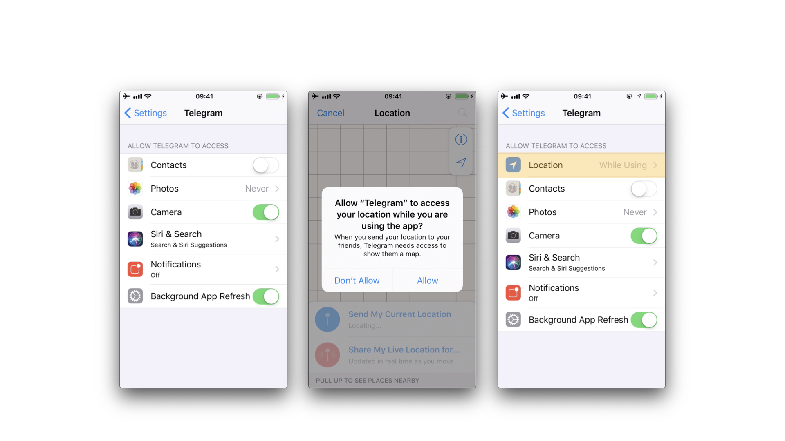

For example, in the previous example, the "Location" entry was not being listed until we triggered the permission dialogue for the first time. Once we did it, no matter if we allowed the access or not, the the "Location" entry will be displayed.


Reference
* [owasp-mastg Testing App Permissions (MSTG-PLATFORM-1) Dynamic Analysis](https://github.com/OWASP/owasp-mastg/blob/v1.5.0/Document/0x06h-Testing-Platform-Interaction.md#dynamic-analysis)


### Rulebook
1. [How to request permission (Required)](#how-to-request-permission-required)
1. [Settings for accessing photos (Required)](#settings-for-accessing-photos-required)
1. [Implement appropriate data protection and transfer security (Required)](#implement-appropriate-data-protection-and-transfer-security-required)
1. [iOS 10 or later, items that require permission description (Required)](#ios-10-or-later-items-that-require-permission-description-required)

#### How to request permission (Required)

User permission must be obtained in order to access the user's resources.
As a means for that, it is necessary to add an explanation text to the OS standard alert at the time of permission request.
The description should be in the plist and you should write the source that handles the permission request at the right time (like just before the screen where you use the camera).
Do not unnecessarily request permissions immediately after starting the app.

plist description of permission:
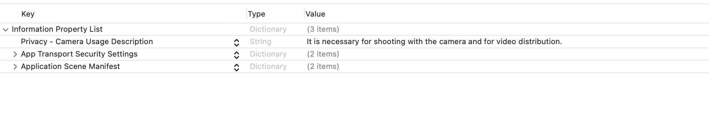

Automatic plist generation xml:
```xml
<?xml version="1.0" encoding="UTF-8"?>
<!DOCTYPE plist PUBLIC "-//Apple//DTD PLIST 1.0//EN" "http://www.apple.com/DTDs/PropertyList-1.0.dtd">
<plist version="1.0">
<dict>
    <key>NSCameraUsageDescription</key>
    <string>It is necessary for shooting with the camera and for video distribution.</string>
    <key>NSAppTransportSecurity</key>
    <dict>
        <key>NSAllowsArbitraryLoads</key>
        <true/>
        <key>NSAllowsArbitraryLoadsForMedia</key>
        <true/>
    </dict>
    <key>UIApplicationSceneManifest</key>
    <dict>
        <key>UIApplicationSupportsMultipleScenes</key>
        <false/>
        <key>UISceneConfigurations</key>
        <dict>
            <key>UIWindowSceneSessionRoleApplication</key>
            <array>
                <dict>
                    <key>UISceneConfigurationName</key>
                    <string>Default Configuration</string>
                    <key>UISceneDelegateClassName</key>
                    <string>$(PRODUCT_MODULE_NAME).SceneDelegate</string>
                    <key>UISceneStoryboardFile</key>
                    <string>Main</string>
                </dict>
            </array>
        </dict>
    </dict>
</dict>
</plist>
```

Camera permission check and request handling:
```swift
import Foundation
import AVFoundation

class CameraHelper {
    func request(completion: @escaping (Bool) -> Void) {
        
        let status = AVCaptureDevice.authorizationStatus(for: .video)
        switch status {
        case .authorized:
            
            completion(true)
        case .denied:
            completion(false)
        case .notDetermined: ()
            AVCaptureDevice.requestAccess(for: .video) { granted in
                completion(granted)
            }
                                            
        case .restricted:
            completion(false)
        
        @unknown default:
            // not support case
            ()
        }
    }
}
```

If this is violated, the following may occur.
* Requesting unnecessary permissions can lead to unintended data disclosure.

#### Settings for accessing photos (Required)

If you use PHPickerViewController in the PhotosUI library when retrieving photos from the album, you can display a screen for the user to select an image without checking permission.
This should be selected unless you need to retrieve photos other than those selected by the user.

How to select image in album via PHPickerViewController:
```swift
import PhotosUI

class PViewController: UIViewController,PHPickerViewControllerDelegate {
    
    var selectedImages: [UIImage] = []
    
    override func viewDidLoad() {
        super.viewDidLoad()
    }
    func makeViewContoroller() {
        var configuration = PHPickerConfiguration()
        configuration.selectionLimit = 36 // Selection limit. Set to 0 for unlimited.
        configuration.filter = .images // The type of media that can be retrieved.

        let picker = PHPickerViewController(configuration: configuration)
        picker.delegate = self
        present(picker, animated: true)
    }
    
    
    func picker(_ picker: PHPickerViewController, didFinishPicking results: [PHPickerResult]) {
        
        for image in results {
            
            image.itemProvider.loadObject(ofClass: UIImage.self) { (selectedImage, error) in
                
                guard let wrapImage = selectedImage as? UIImage else {
                    return
                }
                
                self.selectedImages.append(wrapImage)
                
            }
        }
    }
}
```

If this is violated, the following may occur.
* Requesting unnecessary permissions can lead to unintended data disclosure.

#### Implement appropriate data protection and transfer security (Required)

When sending data over the network. Enabling his ATS on iOS.

Rulebook
* [Use App Transport Security (ATS) (Required)](0x06-MASDG-Network_Communication_Requirements.md#use-app-transport-security-ats-required)

If this is violated, the following may occur.
* Unintended data leakage may occur.

#### iOS 10 or later, items that require permission description (Required)

Operations that need to be described as permissions in plist and the associated keys are shown below.

* NSAppleMusicUsageDescription   Access to media library
* NSCalendarsUsageDescription   Access to calendars
* NSContactsUsageDescription   Access to contacts
* NSPhotoLibraryUsageDescription   Access Photo Library
* NSRemindersUsageDescription   Access reminders
* NSCameraUsageDescription   Access to camera
* NSMicrophoneUsageDescription   Access to microphone
* NSMotionUsageDescription   Access to accelerometer
* NSHealthShareUsageDescription   Access to health data
* NSHealthUpdateUsageDescription   Modify health data
* NSHomeKitUsageDescription   Access HomeKit configuration data
* NSSiriUsageDescription   Send user data to Siri
* NSSpeechRecognitionUsageDescription   Send user data to Speech Recognition Server
* NSLocationWhenInUseUsageDescription   Access location information (allowed only when in use)
* NFCReaderUsageDescription   Access to device's NFC hardware
* NSFaceIDUsageDescription   Authenticate with Face ID
* NSPhotoLibraryAddUsageDescription   Add-only access to photo library
* NSLocationAlwaysAndWhenInUseUsageDescription   Access to location information (always allowed)
* NSHealthClinicalHealthRecordsShareUsageDescription   Request permission to read clinical records
* NSHealthRequiredReadAuthorizationTypeIdentifiers   Type of clinical records data for which read permission must be obtained
* NSBluetoothAlwaysUsageDescription   Access to Bluetooth
* NSLocationTemporaryUsageDescriptionDictionary   Access to location information (allowed only once)
* NSWidgetWantsLocation   widget uses location information
* NSLocationDefaultAccuracyReduced   Require location accuracy reduction by default
* NSLocalNetworkUsageDescription   Access to local network
* NSUserTrackingUsageDescription   Permission to use data to track users and devices
* NSSensorKitUsageDescription   Briefly describe the purpose of the research study
* NSGKFriendListUsageDescription   Access Game Center friend list
* NSNearbyInteractionUsageDescription   Initiate an interaction session with a nearby device
* NSIdentityUsageDescription   Request ID information
* NSSensorKitPrivacyPolicyURL   Hyperlink to a web page that displays the privacy policy
* UIRequiresPersistentWiFi   Requires Wi-Fi connection or
* NSSensorKitUsageDetail   Dictionary containing keys to specific information collected by the app
   * SRSensorUsageKeyboardMetrics   Observes keyboard activity
   * SRSensorUsageDeviceUsage   Observe how often devices are activated
   * SRSensorUsageWristDetection   Observe how the watch is worn
   * SRSensorUsagePhoneUsage   Observe phone operations
   * SRSensorUsageMessageUsage   Observe user activity in messages
   * SRSensorUsageVisits   Observe frequently visited locations
   * SRSensorUsagePedometer   Observe step information
   * SRSensorUsageMotion   Observe motion data
   * SRSensorUsageSpeechMetrics   Analyze user speech
   * SRSensorUsageAmbientLightSensor   Observe light intensity in the environment

\* NSLocationAlwaysAndWhenInUseUsageDescription should be used since NSLocationAlwaysUsageDescription has been deprecated since iOS 11.

\* NSNearbyInteractionUsageDescription should be used since NSNearbyInteractionAllowOnceUsageDescription has been deprecated since iOS 15.

\* NSBluetoothPeripheralUsageDescription is required if you are using an API to access Bluetooth peripherals and have a deployment target prior to iOS 13.

If this is violated, the following may occur.
* Cannot access the specified function.

## MSTG-PLATFORM-2
All inputs from external sources and the user are validated and if necessary sanitized. This includes data received via the UI, IPC mechanisms such as intents, custom URLs, and network sources.

### Cross-Site Scripting Flaws
Cross-site scripting (XSS) issues allow attackers to inject client-side scripts into web pages viewed by users. This type of vulnerability is prevalent in web applications. When a user views the injected script in a browser, the attacker gains the ability to bypass the same origin policy, enabling a wide variety of exploits (e.g. stealing session cookies, logging key presses, performing arbitrary actions, etc.).

In the context of native apps, XSS risks are far less prevalent for the simple reason these kinds of applications do not rely on a web browser. However, apps using WebView components, such as WKWebView or the deprecated UIWebView on iOS and WebView on Android, are potentially vulnerable to such attacks.

An older but well-known example is the [local XSS issue in the Skype app for iOS, first identified by Phil Purviance](https://superevr.com/blog/2011/xss-in-skype-for-ios). The Skype app failed to properly encode the name of the message sender, allowing an attacker to inject malicious JavaScript to be executed when a user views the message. In his proof-of-concept, Phil showed how to exploit the issue and steal a user's address book.

Reference
* [owasp-mastg Cross-Site Scripting Flaws (MSTG-PLATFORM-2)](https://github.com/OWASP/owasp-mastg/blob/v1.5.0/Document/0x04h-Testing-Code-Quality.md#cross-site-scripting-flaws-mstg-platform-2)

#### Static Analysis
Take a close look at any WebViews present and investigate for untrusted input rendered by the app.

If a WebView is used to display a remote website, the burden of escaping HTML shifts to the server side. If an XSS flaw exists on the web server, this can be used to execute script in the context of the WebView. As such, it is important to perform static analysis of the web application source code.

Verify that the following best practices have been followed:

* No untrusted data is rendered in HTML, JavaScript or other interpreted contexts unless it is absolutely necessary.
* Appropriate encoding is applied to escape characters, such as HTML entity encoding. Note: escaping rules become complicated when HTML is nested within other code, for example, rendering a URL located inside a JavaScript block.

Consider how data will be rendered in a response. For example, if data is rendered in a HTML context, six control characters that must be escaped:

| Character | Escaped |
| :--- | :---  |
| & | &amp;amp; |
| < | &amp;lt; |
| > | &amp;gt; |
| " | &amp;quot; |
| ' | &amp;#x27; |
| / | &amp;#x2F; |

For a comprehensive list of escaping rules and other prevention measures, refer to the [OWASP XSS Prevention Cheat Sheet](https://cheatsheetseries.owasp.org/cheatsheets/Cross_Site_Scripting_Prevention_Cheat_Sheet.html).


Reference
* [owasp-mastg Cross-Site Scripting Flaws (MSTG-PLATFORM-2) Static Analysis](https://github.com/OWASP/owasp-mastg/blob/v1.5.0/Document/0x04h-Testing-Code-Quality.md#static-analysis)

Rulebook
* [Check your WebView for untrusted input rendered from your app (Required)](#check-your-webview-for-untrusted-input-rendered-from-your-app-required)

#### Dynamic Analysis
XSS issues can be best detected using manual and/or automated input fuzzing, i.e. injecting HTML tags and special characters into all available input fields to verify the web application denies invalid inputs or escapes the HTML meta-characters in its output.

A [reflected XSS attack](https://owasp.org/www-project-web-security-testing-guide/latest/4-Web_Application_Security_Testing/07-Input_Validation_Testing/01-Testing_for_Reflected_Cross_Site_Scripting.html) refers to an exploit where malicious code is injected via a malicious link. To test for these attacks, automated input fuzzing is considered to be an effective method. For example, the [BURP Scanner](https://portswigger.net/burp) is highly effective in identifying reflected XSS vulnerabilities. As always with automated analysis, ensure all input vectors are covered with a manual review of testing parameters.

Reference
* [owasp-mastg Cross-Site Scripting Flaws (MSTG-PLATFORM-2) Dynamic Analysis](https://github.com/OWASP/owasp-mastg/blob/v1.5.0/Document/0x04h-Testing-Code-Quality.md#dynamic-analysis)

### Rulebook
1. [Check your WebView for untrusted input rendered from your app (Required)](#check-your-webview-for-untrusted-input-rendered-from-your-app-required)

#### Check your WebView for untrusted input rendered from your app (Required)
Verify that the following best practices have been followed:

* No untrusted data is rendered in HTML, JavaScript or other interpreted contexts unless it is absolutely necessary.
* Appropriate encoding is applied to escape characters, such as HTML entity encoding. Note: escaping rules become complicated when HTML is nested within other code, for example, rendering a URL located inside a JavaScript block.

Consider how data will be rendered in a response. For example, if data is rendered in a HTML context, six control characters that must be escaped:

| Character | Escaped |
| :--- | :---  |
| & | &amp;amp; |
| < | &amp;lt; |
| > | &amp;gt; |
| " | &amp;quot; |
| ' | &amp;#x27; |
| / | &amp;#x2F; |

For a comprehensive list of escaping rules and other prevention measures, refer to the [OWASP XSS Prevention Cheat Sheet](https://cheatsheetseries.owasp.org/cheatsheets/Cross_Site_Scripting_Prevention_Cheat_Sheet.html).

If this is violated, the following may occur.
* An XSS problem may exist.

## MSTG-PLATFORM-3
The app does not export sensitive functionality via custom URL schemes, unless these mechanisms are properly protected.

### Custom URL Schemes
Custom URL schemes [allow apps to communicate via a custom protocol](https://developer.apple.com/documentation/uikit#//apple_ref/doc/uid/TP40007072-CH6-SW1). An app must declare support for the schemes and handle incoming URLs that use those schemes.

Apple warns about the improper use of custom URL schemes in the [Apple Developer Documentation](https://developer.apple.com/documentation/xcode/defining-a-custom-url-scheme-for-your-app):

URL schemes offer a potential attack vector into your app, so make sure to validate all URL parameters and discard any malformed URLs. In addition, limit the available actions to those that do not risk the user's data. For example, do not allow other apps to directly delete content or access sensitive information about the user. When testing your URL-handling code, make sure your test cases include improperly formatted URLs.

They also suggest using universal links instead, if the purpose is to implement deep linking:

While custom URL schemes are an acceptable form of deep linking, universal links are strongly recommended as a best practice.

Supporting a custom URL scheme is done by:

* defining the format for the app's URLs,
* registering the scheme so that the system directs appropriate URLs to the app,
* handling the URLs that the app receives.

Security issues arise when an app processes calls to its URL scheme without properly validating the URL and its parameters and when users aren't prompted for confirmation before triggering an important action.

One example is the following [bug in the Skype Mobile app](https://www.dhanjani.com/blog/2010/11/insecure-handling-of-url-schemes-in-apples-ios.html), discovered in 2010: The Skype app registered the skype:// protocol handler, which allowed other apps to trigger calls to other Skype users and phone numbers. Unfortunately, Skype didn't ask users for permission before placing the calls, so any app could call arbitrary numbers without the user's knowledge. Attackers exploited this vulnerability by putting an invisible `<iframe src="skype://xxx?call"></iframe>` (where xxx was replaced by a premium number), so any Skype user who inadvertently visited a malicious website called the premium number.

As a developer, you should carefully validate any URL before calling it. You can allow only certain applications which may be opened via the registered protocol handler. Prompting users to confirm the URL-invoked action is another helpful control.

All URLs are passed to the app delegate, either at launch time or while the app is running or in the background. To handle incoming URLs, the delegate should implement methods to:

* retrieve information about the URL and decide whether you want to open it,
* open the resource specified by the URL.

More information can be found in the [archived App Programming Guide for iOS](https://developer.apple.com/documentation/uikit#//apple_ref/doc/uid/TP40007072-CH6-SW13) and in the [Apple Secure Coding Guide](https://developer.apple.com/library/archive/documentation/Security/Conceptual/SecureCodingGuide/Articles/ValidatingInput.html).

In addition, an app may also want to send URL requests (aka. queries) to other apps. This is done by:

* registering the application query schemes that the app wants to query,
* optionally querying other apps to know if they can open a certain URL,
* sending the URL requests.

All of this presents a wide attack surface that we will address in the static and dynamic analysis sections.


Reference
* [owasp-mastg Testing Custom URL Schemes (MSTG-PLATFORM-3)](https://github.com/OWASP/owasp-mastg/blob/v1.5.0/Document/0x06h-Testing-Platform-Interaction.md#testing-custom-url-schemes-mstg-platform-3)

Rulebook
* [If you want to implement deep linking, use universal links (Recommended)](#if-you-want-to-implement-deep-linking-use-universal-links-recommended)
* [How to use custom URL schemes (Required)](#how-to-use-custom-url-schemes-required)
* [If your app handles URL scheme calls, it should properly validate URLs and their arguments and ask for user consent before performing sensitive actions (Required)](#if-your-app-handles-url-scheme-calls-it-should-properly-validate-urls-and-their-arguments-and-ask-for-user-consent-before-performing-sensitive-actions-required)
* [How to use universal links (Recommended)](#how-to-use-universal-links-recommended)
* [Validate deep link URLs and their arguments (Required)](#validate-deep-link-urls-and-their-arguments-required)

### Static Analysis
There are a couple of things that we can do in the static analysis. In the next sections we will see the following:

* Testing custom URL schemes registration
* Testing application query schemes registration
* Testing URL handling and validation
* Testing URL requests to other apps
* Testing for deprecated methods


Reference
* [owasp-mastg Testing Custom URL Schemes (MSTG-PLATFORM-3) Static Analysis](https://github.com/OWASP/owasp-mastg/blob/v1.5.0/Document/0x06h-Testing-Platform-Interaction.md#static-analysis-5)

#### Custom URL Schemes Registration
The first step to test custom URL schemes is finding out whether an application registers any protocol handlers.

If you have the original source code and want to view registered protocol handlers, simply open the project in Xcode, go to the **Info** tab and open the **URL Types** section as presented in the screenshot below:


Also in Xcode you can find this by searching for the CFBundleURLTypes key in the app's Info.plist file (example from [iGoat-Swift](https://github.com/OWASP/iGoat-Swift)):

```xml
<key>CFBundleURLTypes</key>
<array>
    <dict>
        <key>CFBundleURLName</key>
        <string>com.iGoat.myCompany</string>
        <key>CFBundleURLSchemes</key>
        <array>
            <string>iGoat</string>
        </array>
    </dict>
</array>
```

In a compiled application (or IPA), registered protocol handlers are found in the file Info.plist in the app bundle's root folder. Open it and search for the CFBundleURLSchemes key, if present, it should contain an array of strings (example from [iGoat-Swift](https://github.com/OWASP/iGoat-Swift)):

```xml
grep -A 5 -nri urlsch Info.plist
Info.plist:45:    <key>CFBundleURLSchemes</key>
Info.plist-46-    <array>
Info.plist-47-        <string>iGoat</string>
Info.plist-48-    </array>
```

Once the URL scheme is registered, other apps can open the app that registered the scheme, and pass parameters by creating appropriately formatted URLs and opening them with the [UIApplication openURL:options:completionHandler:](https://developer.apple.com/documentation/uikit/uiapplication/1648685-openurl?language=objc) method.

Note from the [App Programming Guide for iOS](https://developer.apple.com/documentation/uikit#//apple_ref/doc/uid/TP40007072-CH6-SW7):

If more than one third-party app registers to handle the same URL scheme, there is currently no process for determining which app will be given that scheme.

This could lead to a URL scheme hijacking attack (see page 136 in [#thiel2]).


Reference
* [owasp-mastg Testing Custom URL Schemes (MSTG-PLATFORM-3) Static Analysis Testing Custom URL Schemes Registration](https://github.com/OWASP/owasp-mastg/blob/v1.5.0/Document/0x06h-Testing-Platform-Interaction.md#testing-custom-url-schemes-registration)

Rulebook
* [How to use custom URL schemes (Required)](#how-to-use-custom-url-schemes-required)
* [How to use universal links (Recommended)](#how-to-use-universal-links-recommended)
* [Validate deep link URLs and their arguments (Required)](#validate-deep-link-urls-and-their-arguments-required)

#### Application Query Schemes Registration
Before calling the openURL:options:completionHandler: method, apps can call [canOpenURL](https://developer.apple.com/documentation/uikit/uiapplication/1622952-canopenurl?language=objc): to verify that the target app is available. However, as this method was being used by malicious app as a way to enumerate installed apps, [from iOS 9.0 the URL schemes passed to it must be also declared](https://developer.apple.com/documentation/uikit/uiapplication/1622952-canopenurl?language=objc#discussion) by adding the LSApplicationQueriesSchemes key to the app's Info.plist file and an array of up to 50 URL schemes.

```xml
<key>LSApplicationQueriesSchemes</key>
    <array>
        <string>url_scheme1</string>
        <string>url_scheme2</string>
    </array>
```

canOpenURL will always return NO for undeclared schemes, whether or not an appropriate app is installed. However, this restriction only applies to canOpenURL.

**The openURL:options:completionHandler: method will still open any URL scheme, even if the LSApplicationQueriesSchemes array was declared**, and return YES / NO depending on the result.

As an example, Telegram declares in its [Info.plist](https://github.com/TelegramMessenger/Telegram-iOS/blob/master/Telegram/Telegram-iOS/Info.plist#L233) these Queries Schemes, among others:

```xml
    <key>LSApplicationQueriesSchemes</key>
    <array>
        <string>dbapi-3</string>
        <string>instagram</string>
        <string>googledrive</string>
        <string>comgooglemaps-x-callback</string>
        <string>foursquare</string>
        <string>here-location</string>
        <string>yandexmaps</string>
        <string>yandexnavi</string>
        <string>comgooglemaps</string>
        <string>youtube</string>
        <string>twitter</string>
        ...
```


Reference
* [owasp-mastg Testing Custom URL Schemes (MSTG-PLATFORM-3) Static Analysis Testing Application Query Schemes Registration](https://github.com/OWASP/owasp-mastg/blob/v1.5.0/Document/0x06h-Testing-Platform-Interaction.md#testing-application-query-schemes-registration)

#### URL Handling and Validation
In order to determine how a URL path is built and validated, if you have the original source code, you can search for the following methods:

* application:didFinishLaunchingWithOptions: method or application:will-FinishLaunchingWithOptions:: verify how the decision is made and how the information about the URL is retrieved.
* [application:openURL:options:](https://developer.apple.com/documentation/uikit/uiapplicationdelegate/1623112-application?language=objc): verify how the resource is being opened, i.e. how the data is being parsed, verify the [options](https://developer.apple.com/documentation/uikit/uiapplication/openurloptionskey), especially if access by the calling app ([sourceApplication](https://developer.apple.com/documentation/uikit/uiapplication/openurloptionskey/1623128-sourceapplication)) should be allowed or denied. The app might also need user permission when using the custom URL scheme.

In Telegram you will [find four different methods being used](https://github.com/TelegramMessenger/Telegram-iOS/blob/87e0a33ac438c1d702f2a0b75bf21f26866e346f/Telegram-iOS/AppDelegate.swift#L1250): 

```swift
func application(_ application: UIApplication, open url: URL, sourceApplication: String?) -> Bool {
    self.openUrl(url: url)
    return true
}

func application(_ application: UIApplication, open url: URL, sourceApplication: String?,
annotation: Any) -> Bool {
    self.openUrl(url: url)
    return true
}

func application(_ app: UIApplication, open url: URL,
options: [UIApplicationOpenURLOptionsKey : Any] = [:]) -> Bool {
    self.openUrl(url: url)
    return true
}

func application(_ application: UIApplication, handleOpen url: URL) -> Bool {
    self.openUrl(url: url)
    return true
}
```
We can observe some things here:

* The app implements also deprecated methods like [application:handleOpenURL:](https://developer.apple.com/documentation/uikit/uiapplicationdelegate/1622964-application?language=objc) and [application:openURL:sourceApplication:annotation:](https://developer.apple.com/documentation/uikit/uiapplicationdelegate/1623073-application).
* The source application is not being verified in any of those methods.
* All of them call a private openUrl method. You can [inspect it](https://github.com/TelegramMessenger/Telegram-iOS/blob/87e0a33ac438c1d702f2a0b75bf21f26866e346f/Telegram-iOS/AppDelegate.swift#L1270) to learn more about how the URL request is handled.

Reference
* [owasp-mastg Testing Custom URL Schemes (MSTG-PLATFORM-3) Static Analysis Testing URL Handling and Validation](https://github.com/OWASP/owasp-mastg/blob/v1.5.0/Document/0x06h-Testing-Platform-Interaction.md#testing-url-handling-and-validation)

Rulebook
* [How to use custom URL schemes (Required)](#how-to-use-custom-url-schemes-required)
* [How to use universal links (Recommended)](#how-to-use-universal-links-recommended)
* [Validate deep link URLs and their arguments (Required)](#validate-deep-link-urls-and-their-arguments-required)

#### URL Requests to Other Apps
The method [openURL:options:completionHandler:](https://developer.apple.com/documentation/uikit/uiapplication/1648685-openurl?language=objc) and the [deprecated openURL: method of UIApplication](https://developer.apple.com/documentation/uikit/uiapplication/1622961-openurl?language=objc) are responsible for opening URLs (i.e. to send requests / make queries to other apps) that may be local to the current app or it may be one that must be provided by a different app. If you have the original source code you can search directly for usages of those methods.

Additionally, if you are interested into knowing if the app is querying specific services or apps, and if the app is well-known, you can also search for common URL schemes online and include them in your greps. For example, a [quick Google search reveals](https://ios.gadgethacks.com/how-to/use-google-maps-waze-with-siri-instead-apple-maps-0192301/):

```default
Apple Music - music:// or musics:// or audio-player-event://
Calendar - calshow:// or x-apple-calevent://
Contacts - contacts://
Diagnostics - diagnostics:// or diags://
GarageBand - garageband://
iBooks - ibooks:// or itms-books:// or itms-bookss://
Mail - message:// or mailto://emailaddress
Messages - sms://phonenumber
Notes - mobilenotes://
...
```

We search for this method in the Telegram source code, this time without using Xcode, just with egrep:

```bash
$ egrep -nr "open.*options.*completionHandler" ./Telegram-iOS/

./AppDelegate.swift:552: return UIApplication.shared.open(parsedUrl,
    options: [UIApplicationOpenURLOptionUniversalLinksOnly: true as NSNumber],
    completionHandler: { value in
./AppDelegate.swift:556: return UIApplication.shared.open(parsedUrl,
    options: [UIApplicationOpenURLOptionUniversalLinksOnly: true as NSNumber],
    completionHandler: { value in
```

If we inspect the results we will see that openURL:options:completionHandler: is actually being used for universal links, so we have to keep searching. For example, we can search for openURL(:

```bash
$ egrep -nr "openURL\(" ./Telegram-iOS/

./ApplicationContext.swift:763:  UIApplication.shared.openURL(parsedUrl)
./ApplicationContext.swift:792:  UIApplication.shared.openURL(URL(
                                        string: "https://telegram.org/deactivate?phone=\(phone)")!
                                 )
./AppDelegate.swift:423:         UIApplication.shared.openURL(url)
./AppDelegate.swift:538:         UIApplication.shared.openURL(parsedUrl)
...
```

If we inspect those lines we will see how this method is also being used to open "Settings" or to open the "App Store Page".

When just searching for :// we see:

```default
if documentUri.hasPrefix("file://"), let path = URL(string: documentUri)?.path {
if !url.hasPrefix("mt-encrypted-file://?") {
guard let dict = TGStringUtils.argumentDictionary(inUrlString: String(url[url.index(url.startIndex,
    offsetBy: "mt-encrypted-file://?".count)...])) else {
parsedUrl = URL(string: "https://\(url)")
if let url = URL(string: "itms-apps://itunes.apple.com/app/id\(appStoreId)") {
} else if let url = url as? String, url.lowercased().hasPrefix("tg://") {
[[WKExtension sharedExtension] openSystemURL:[NSURL URLWithString:[NSString
    stringWithFormat:@"tel://%@", userHandle.data]]];
```

After combining the results of both searches and carefully inspecting the source code we find the following piece of code:

```swift
openUrl: { url in
            var parsedUrl = URL(string: url)
            if let parsed = parsedUrl {
                if parsed.scheme == nil || parsed.scheme!.isEmpty {
                    parsedUrl = URL(string: "https://\(url)")
                }
                if parsed.scheme == "tg" {
                    return
                }
            }

            if let parsedUrl = parsedUrl {
                UIApplication.shared.openURL(parsedUrl)
```

Before opening a URL, the scheme is validated, "https" will be added if necessary and it won't open any URL with the "tg" scheme. When ready it will use the deprecated openURL method.

If only having the compiled application (IPA) you can still try to identify which URL schemes are being used to query other apps:

* Check if LSApplicationQueriesSchemes was declared or search for common URL schemes.
* Also use the string :// or build a regular expression to match URLs as the app might not be declaring some schemes.

You can do that by first verifying that the app binary contains those strings by e.g. using unix strings command:

```bash
strings <yourapp> | grep "someURLscheme://"
```

or even better, use radare2's iz/izz command or rafind2, both will find strings where the unix strings command won't. Example from iGoat-Swift:
```bash
$ r2 -qc izz~iGoat:// iGoat-Swift
37436 0x001ee610 0x001ee610  23  24 (4.__TEXT.__cstring) ascii iGoat://?contactNumber=
```

Reference
* [owasp-mastg Testing Custom URL Schemes (MSTG-PLATFORM-3) Static Analysis Testing URL Requests to Other Apps](https://github.com/OWASP/owasp-mastg/blob/v1.5.0/Document/0x06h-Testing-Platform-Interaction.md#testing-url-requests-to-other-apps)

#### Deprecated Methods
Search for deprecated methods like:
* [application:handleOpenURL:](https://developer.apple.com/documentation/uikit/uiapplicationdelegate/1622964-application?language=objc)
* [openURL:](https://developer.apple.com/documentation/uikit/uiapplication/1622961-openurl?language=objc)
* [application:openURL:sourceApplication:annotation:](https://developer.apple.com/documentation/uikit/uiapplicationdelegate/1623073-application)

For example, here we find those three:

```bash
$ rabin2 -zzq Telegram\ X.app/Telegram\ X | grep -i "openurl"

0x1000d9e90 31 30 UIApplicationOpenURLOptionsKey
0x1000dee3f 50 49 application:openURL:sourceApplication:annotation:
0x1000dee71 29 28 application:openURL:options:
0x1000dee8e 27 26 application:handleOpenURL:
0x1000df2c9 9 8 openURL:
0x1000df766 12 11 canOpenURL:
0x1000df772 35 34 openURL:options:completionHandler:
...
```

Reference
* [owasp-mastg Testing Custom URL Schemes (MSTG-PLATFORM-3) Static Analysis Testing for Deprecated Methods](https://github.com/OWASP/owasp-mastg/blob/v1.5.0/Document/0x06h-Testing-Platform-Interaction.md#testing-for-deprecated-methods)

### Dynamic Analysis
Once you've identified the custom URL schemes the app has registered, there are several methods that you can use to test them:

* Performing URL requests
* Identifying and hooking the URL handler method
* Testing URL schemes source validation
* Fuzzing URL schemes

Reference
* [owasp-mastg Testing Custom URL Schemes (MSTG-PLATFORM-3) Dynamic Analysis](https://github.com/OWASP/owasp-mastg/blob/v1.5.0/Document/0x06h-Testing-Platform-Interaction.md#dynamic-analysis-5)

#### Performing URL Requests
**Using Safari**

To quickly test one URL scheme you can open the URLs on Safari and observe how the app behaves. For example, if you write tel://123456789 in the address bar of Safari, a pop up will appear with the telephone number and the options "Cancel" and "Call". If you press "Call" it will open the Phone app and directly make the call.

You may also know already about pages that trigger custom URL schemes, you can just navigate normally to those pages and Safari will automatically ask when it finds a custom URL scheme.

Reference
* [owasp-mastg Testing Custom URL Schemes (MSTG-PLATFORM-3) Dynamic Analysis Performing URL Requests Using Safari](https://github.com/OWASP/owasp-mastg/blob/v1.5.0/Document/0x06h-Testing-Platform-Interaction.md#using-safari)

**Using the Notes App**

As already seen in "Triggering Universal Links", you may use the Notes app and long press the links you've written in order to test custom URL schemes. Remember to exit the editing mode in order to be able to open them. Note that you can click or long press links including custom URL schemes only if the app is installed, if not they won't be highlighted as clickable links.

Reference
* [owasp-mastg Testing Custom URL Schemes (MSTG-PLATFORM-3) Dynamic Analysis Performing URL Requests Using the Notes App](https://github.com/OWASP/owasp-mastg/blob/v1.5.0/Document/0x06h-Testing-Platform-Interaction.md#using-the-notes-app)


**Using Frida**

If you simply want to open the URL scheme you can do it using Frida:

```javascript
$ frida -U iGoat-Swift

[iPhone::iGoat-Swift]-> function openURL(url) {
                            var UIApplication = ObjC.classes.UIApplication.sharedApplication();
                            var toOpen = ObjC.classes.NSURL.URLWithString_(url);
                            return UIApplication.openURL_(toOpen);
                        }
[iPhone::iGoat-Swift]-> openURL("tel://234234234")
true
```

In this example from [Frida CodeShare](https://codeshare.frida.re/@dki/ios-url-scheme-fuzzing/) the author uses the non-public API LSApplication Workspace.openSensitiveURL:withOptions: to open the URLs (from the SpringBoard app):

```javascript
function openURL(url) {
    var w = ObjC.classes.LSApplicationWorkspace.defaultWorkspace();
    var toOpen = ObjC.classes.NSURL.URLWithString_(url);
    return w.openSensitiveURL_withOptions_(toOpen, null);
}
```

Note that the use of non-public APIs is not permitted on the App Store, that's why we don't even test these but we are allowed to use them for our dynamic analysis.


Reference
* [owasp-mastg Testing Custom URL Schemes (MSTG-PLATFORM-3) Dynamic Analysis Performing URL Requests Using Frida](https://github.com/OWASP/owasp-mastg/blob/v1.5.0/Document/0x06h-Testing-Platform-Interaction.md#using-frida)

#### Identifying and Hooking the URL Handler Method
If you can't look into the original source code you will have to find out yourself which method does the app use to handle the URL scheme requests that it receives. You cannot know if it is an Objective-C method or a Swift one, or even if the app is using a deprecated one.

Reference
* [owasp-mastg Testing Custom URL Schemes (MSTG-PLATFORM-3) Dynamic Analysis Performing URL Requests Identifying and Hooking the URL Handler Method](https://github.com/OWASP/owasp-mastg/blob/v1.5.0/Document/0x06h-Testing-Platform-Interaction.md#identifying-and-hooking-the-url-handler-method)


**Crafting the Link Yourself and Letting Safari Open It**

For this we will use the [ObjC method observer](https://codeshare.frida.re/@mrmacete/objc-method-observer/) from Frida CodeShare, which is an extremely handy script that allows you to quickly observe any collection of methods or classes just by providing a simple pattern.

In this case we are interested into all methods containing "openURL", therefore our pattern will be \*[* *openURL\*]:

* The first asterisk will match all instance - and class + methods.
* The second matches all Objective-C classes.
* The third and forth allow to match any method containing the string openURL.

```bash
$ frida -U iGoat-Swift --codeshare mrmacete/objc-method-observer

[iPhone::iGoat-Swift]-> observeSomething("*[* *openURL*]");
Observing  -[_UIDICActivityItemProvider activityViewController:openURLAnnotationForActivityType:]
Observing  -[CNQuickActionsManager _openURL:]
Observing  -[SUClientController openURL:]
Observing  -[SUClientController openURL:inClientWithIdentifier:]
Observing  -[FBSSystemService openURL:application:options:clientPort:withResult:]
Observing  -[iGoat_Swift.AppDelegate application:openURL:options:]
Observing  -[PrefsUILinkLabel openURL:]
Observing  -[UIApplication openURL:]
Observing  -[UIApplication _openURL:]
Observing  -[UIApplication openURL:options:completionHandler:]
Observing  -[UIApplication openURL:withCompletionHandler:]
Observing  -[UIApplication _openURL:originatingView:completionHandler:]
Observing  -[SUApplication application:openURL:sourceApplication:annotation:]
...
```

The list is very long and includes the methods we have already mentioned. If we trigger now one URL scheme, for example "igoat://" from Safari and accept to open it in the app we will see the following:

```bash
[iPhone::iGoat-Swift]-> (0x1c4038280)  -[iGoat_Swift.AppDelegate application:openURL:options:]
application: <UIApplication: 0x101d0fad0>
openURL: igoat://
options: {
    UIApplicationOpenURLOptionsOpenInPlaceKey = 0;
    UIApplicationOpenURLOptionsSourceApplicationKey = "com.apple.mobilesafari";
}
0x18b5030d8 UIKit!__58-[UIApplication _applicationOpenURLAction:payload:origin:]_block_invoke
0x18b502a94 UIKit!-[UIApplication _applicationOpenURLAction:payload:origin:]
...
0x1817e1048 libdispatch.dylib!_dispatch_client_callout
0x1817e86c8 libdispatch.dylib!_dispatch_block_invoke_direct$VARIANT$mp
0x18453d9f4 FrontBoardServices!__FBSSERIALQUEUE_IS_CALLING_OUT_TO_A_BLOCK__
0x18453d698 FrontBoardServices!-[FBSSerialQueue _performNext]
RET: 0x1
```

Now we know that:

* The method -[iGoat_Swift.AppDelegate application:openURL:options:] gets called. As we have seen before, it is the recommended way and it is not deprecated.
* It receives our URL as a parameter: igoat://.
* We also can verify the source application: com.apple.mobilesafari.
* We can also know from where it was called, as expected from -[UIApplication _applicationOpenURLAction:payload:origin:].
* The method returns 0x1 which means YES ([the delegate successfully handled the request](https://developer.apple.com/documentation/uikit/uiapplicationdelegate/1623112-application?language=objc#return-value)).

The call was successful and we see now that the [iGoat](https://github.com/OWASP/owasp-mastg/blob/v1.5.0/Document/0x08b-Reference-Apps.md#igoat) app was open:


Notice that we can also see that the caller (source application) was Safari if we look in the upper-left corner of the screenshot.

Reference
* [owasp-mastg Testing Custom URL Schemes (MSTG-PLATFORM-3) Dynamic Analysis Performing URL Requests Crafting the Link Yourself and Letting Safari Open It](https://github.com/OWASP/owasp-mastg/blob/v1.5.0/Document/0x06h-Testing-Platform-Interaction.md#crafting-the-link-yourself-and-letting-safari-open-it)


**Dynamically Opening the Link from the App Itself**

It is also interesting to see which other methods get called on the way. To change the result a little bit we will call the same URL scheme from the [iGoat](https://github.com/OWASP/owasp-mastg/blob/v1.5.0/Document/0x08b-Reference-Apps.md#igoat) app itself. We will use again ObjC method observer and the Frida REPL:

```bash
$ frida -U iGoat-Swift --codeshare mrmacete/objc-method-observer

[iPhone::iGoat-Swift]-> function openURL(url) {
                            var UIApplication = ObjC.classes.UIApplication.sharedApplication();
                            var toOpen = ObjC.classes.NSURL.URLWithString_(url);
                            return UIApplication.openURL_(toOpen);
                        }

[iPhone::iGoat-Swift]-> observeSomething("*[* *openURL*]");
[iPhone::iGoat-Swift]-> openURL("iGoat://?contactNumber=123456789&message=hola")

(0x1c409e460)  -[__NSXPCInterfaceProxy__LSDOpenProtocol openURL:options:completionHandler:]
openURL: iGoat://?contactNumber=123456789&message=hola
options: nil
completionHandler: <__NSStackBlock__: 0x16fc89c38>
0x183befbec MobileCoreServices!-[LSApplicationWorkspace openURL:withOptions:error:]
0x10ba6400c
...
RET: nil

...

(0x101d0fad0)  -[UIApplication openURL:]
openURL: iGoat://?contactNumber=123456789&message=hola
0x10a610044
...
RET: 0x1

true
(0x1c4038280)  -[iGoat_Swift.AppDelegate application:openURL:options:]
application: <UIApplication: 0x101d0fad0>
openURL: iGoat://?contactNumber=123456789&message=hola
options: {
    UIApplicationOpenURLOptionsOpenInPlaceKey = 0;
    UIApplicationOpenURLOptionsSourceApplicationKey = "OWASP.iGoat-Swift";
}
0x18b5030d8 UIKit!__58-[UIApplication _applicationOpenURLAction:payload:origin:]_block_invoke
0x18b502a94 UIKit!-[UIApplication _applicationOpenURLAction:payload:origin:]
...
RET: 0x1
```

The output is truncated for better readability. This time you see that UIApplicationOpenURLOptionsSourceApplicationKey has changed to OWASP.iGoat-Swift, which makes sense. In addition, a long list of openURL-like methods were called. Considering this information can be very useful for some scenarios as it will help you to decide what you next steps will be, e.g. which method you will hook or tamper with next.


Reference
* [owasp-mastg Testing Custom URL Schemes (MSTG-PLATFORM-3) Dynamic Analysis Performing URL Requests Dynamically Opening the Link from the App Itself](https://github.com/OWASP/owasp-mastg/blob/v1.5.0/Document/0x06h-Testing-Platform-Interaction.md#dynamically-opening-the-link-from-the-app-itself)


**Opening a Link by Navigating to a Page and Letting Safari Open It**

You can now test the same situation when clicking on a link contained on a page. Safari will identify and process the URL scheme and choose which action to execute. Opening this link "[https://telegram.me/fridadotre](https://telegram.me/fridadotre)" will trigger this behavior.

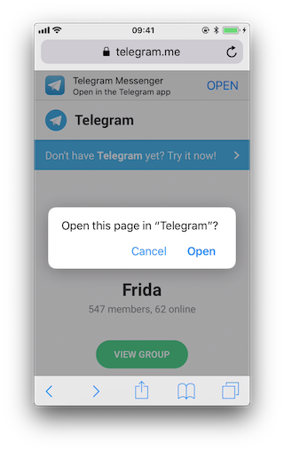

First of all we let frida-trace generate the stubs for us:

```bash
$ frida-trace -U Telegram -m "*[* *restorationHandler*]" -i "*open*Url*"
    -m "*[* *application*URL*]" -m "*[* openURL]"

...
7310 ms  -[UIApplication _applicationOpenURLAction: 0x1c44ff900 payload: 0x10c5ee4c0 origin: 0x0]
7311 ms     | -[AppDelegate application: 0x105a59980 openURL: 0x1c46ebb80 options: 0x1c0e222c0]
7312 ms     | $S10TelegramUI15openExternalUrl7account7context3url05forceD016presentationData
            18applicationContext20navigationController12dismissInputy0A4Core7AccountC_AA14Open
            URLContextOSSSbAA012PresentationK0CAA0a11ApplicationM0C7Display010NavigationO0CSgyyctF()
```

Now we can simply modify by hand the stubs we are interested in:

* The Objective-C method application:openURL:options::

```objectivec
// __handlers__/__AppDelegate_application_openUR_3679fadc.js

onEnter: function (log, args, state) {
    log("-[AppDelegate application: " + args[2] +
                " openURL: " + args[3] + " options: " + args[4] + "]");
    log("\tapplication :" + ObjC.Object(args[2]).toString());
    log("\topenURL :" + ObjC.Object(args[3]).toString());
    log("\toptions :" + ObjC.Object(args[4]).toString());
},
```

* The Swift method $S10TelegramUI15openExternalUrl...:

```swift
// __handlers__/TelegramUI/_S10TelegramUI15openExternalUrl7_b1a3234e.js

onEnter: function (log, args, state) {

    log("TelegramUI.openExternalUrl(account, url, presentationData," +
                "applicationContext, navigationController, dismissInput)");
    log("\taccount: " + ObjC.Object(args[1]).toString());
    log("\turl: " + ObjC.Object(args[2]).toString());
    log("\tpresentationData: " + args[3]);
    log("\tapplicationContext: " + ObjC.Object(args[4]).toString());
    log("\tnavigationController: " + ObjC.Object(args[5]).toString());
},
```

The next time we run it, we see the following output:

```bash
$ frida-trace -U Telegram -m "*[* *restorationHandler*]" -i "*open*Url*"
    -m "*[* *application*URL*]" -m "*[* openURL]"

  8144 ms  -[UIApplication _applicationOpenURLAction: 0x1c44ff900 payload: 0x10c5ee4c0 origin: 0x0]
  8145 ms     | -[AppDelegate application: 0x105a59980 openURL: 0x1c46ebb80 options: 0x1c0e222c0]
  8145 ms     |     application: <Application: 0x105a59980>
  8145 ms     |     openURL: tg://resolve?domain=fridadotre
  8145 ms     |     options :{
                        UIApplicationOpenURLOptionsOpenInPlaceKey = 0;
                        UIApplicationOpenURLOptionsSourceApplicationKey = "com.apple.mobilesafari";
                    }
  8269 ms     |    | TelegramUI.openExternalUrl(account, url, presentationData,
                                        applicationContext, navigationController, dismissInput)
  8269 ms     |    |    account: nil
  8269 ms     |    |    url: tg://resolve?domain=fridadotre
  8269 ms     |    |    presentationData: 0x1c4c51741
  8269 ms     |    |    applicationContext: nil
  8269 ms     |    |    navigationController: TelegramUI.PresentationData
  8274 ms     | -[UIApplication applicationOpenURL:0x1c46ebb80]
```

There you can observe the following:

* It calls application:openURL:options: from the app delegate as expected.
* The source application is Safari ("com.apple.mobilesafari").
* application:openURL:options: handles the URL but does not open it, it calls TelegramUI.openExternalUrl for that.
* The URL being opened is tg://resolve?domain=fridadotre.
* It uses the tg:// custom URL scheme from Telegram.

It is interesting to see that if you navigate again to "[https://telegram.me/fridadotre](https://telegram.me/fridadotre)", click on cancel and then click on the link offered by the page itself ("Open in the Telegram app"), instead of opening via custom URL scheme it will open via universal links.


You can try this while tracing both methods:

```bash
$ frida-trace -U Telegram -m "*[* *restorationHandler*]" -m "*[* *application*openURL*options*]"

// After clicking "Open" on the pop-up

 16374 ms  -[AppDelegate application :0x10556b3c0 openURL :0x1c4ae0080 options :0x1c7a28400]
 16374 ms   application :<Application: 0x10556b3c0>
 16374 ms   openURL :tg://resolve?domain=fridadotre
 16374 ms   options :{
    UIApplicationOpenURLOptionsOpenInPlaceKey = 0;
    UIApplicationOpenURLOptionsSourceApplicationKey = "com.apple.mobilesafari";
}

// After clicking "Cancel" on the pop-up and "OPEN" in the page

406575 ms  -[AppDelegate application:0x10556b3c0 continueUserActivity:0x1c063d0c0
                restorationHandler:0x16f27a898]
406575 ms  application:<Application: 0x10556b3c0>
406575 ms  continueUserActivity:<NSUserActivity: 0x1c063d0c0>
406575 ms       webpageURL:https://telegram.me/fridadotre
406575 ms       activityType:NSUserActivityTypeBrowsingWeb
406575 ms       userInfo:{
}
406575 ms  restorationHandler:<__NSStackBlock__: 0x16f27a898>
```

Reference
* [owasp-mastg Testing Custom URL Schemes (MSTG-PLATFORM-3) Dynamic Analysis Performing URL Requests Opening a Link by Navigating to a Page and Letting Safari Open It](https://github.com/OWASP/owasp-mastg/blob/v1.5.0/Document/0x06h-Testing-Platform-Interaction.md#opening-a-link-by-navigating-to-a-page-and-letting-safari-open-it)

**Testing for Deprecated Methods**

Search for deprecated methods like:

* [application:handleOpenURL:](https://developer.apple.com/documentation/uikit/uiapplicationdelegate/1622964-application?language=objc)
* [openURL:](https://developer.apple.com/documentation/uikit/uiapplication/1622961-openurl?language=objc)
* [application:openURL:sourceApplication:annotation:](https://developer.apple.com/documentation/uikit/uiapplicationdelegate/1623073-application)

You may simply use frida-trace for this, to see if any of those methods are being used.

Reference
* [owasp-mastg Testing Custom URL Schemes (MSTG-PLATFORM-3) Dynamic Analysis Performing URL Requests Testing for Deprecated Methods](https://github.com/OWASP/owasp-mastg/blob/v1.5.0/Document/0x06h-Testing-Platform-Interaction.md#testing-for-deprecated-methods-1)

#### Testing URL Schemes Source Validation
A way to discard or confirm validation could be by hooking typical methods that might be used for that. For example [isEqualToString:](https://developer.apple.com/documentation/foundation/nsstring/1407803-isequaltostring):

```javascript
// - (BOOL)isEqualToString:(NSString *)aString;

var isEqualToString = ObjC.classes.NSString["- isEqualToString:"];

Interceptor.attach(isEqualToString.implementation, {
  onEnter: function(args) {
    var message = ObjC.Object(args[2]);
    console.log(message)
  }
});
```

If we apply this hook and call the URL scheme again:

```bash
$ frida -U iGoat-Swift

[iPhone::iGoat-Swift]-> var isEqualToString = ObjC.classes.NSString["- isEqualToString:"];

                    Interceptor.attach(isEqualToString.implementation, {
                      onEnter: function(args) {
                        var message = ObjC.Object(args[2]);
                        console.log(message)
                      }
                    });
{}
[iPhone::iGoat-Swift]-> openURL("iGoat://?contactNumber=123456789&message=hola")
true
nil
```

Nothing happens. This tells us already that this method is not being used for that as we cannot find any app-package-looking string like OWASP.iGoat-Swift or com.apple.mobilesafari between the hook and the text of the tweet. However, consider that we are just probing one method, the app might be using other approach for the comparison.


Reference
* [owasp-mastg Testing Custom URL Schemes (MSTG-PLATFORM-3) Dynamic Analysis Testing URL Schemes Source Validation](https://github.com/OWASP/owasp-mastg/blob/v1.5.0/Document/0x06h-Testing-Platform-Interaction.md#testing-url-schemes-source-validation)


#### Fuzzing URL Schemes
If the app parses parts of the URL, you can also perform input fuzzing to detect memory corruption bugs.

What we have learned above can be now used to build your own fuzzer on the language of your choice, e.g. in Python and call the openURL using [Frida's RPC](https://frida.re/docs/javascript-api/#rpc). That fuzzer should do the following:

* Generate payloads.
* For each of them call openURL.
* Check if the app generates a crash report (.ips) in /private/var/mobile/Library/Logs/CrashReporter.

The [FuzzDB](https://github.com/fuzzdb-project/fuzzdb) project offers fuzzing dictionaries that you can use as payloads.


Reference
* [owasp-mastg Testing Custom URL Schemes (MSTG-PLATFORM-3) Dynamic Analysis Fuzzing URL Schemes](https://github.com/OWASP/owasp-mastg/blob/v1.5.0/Document/0x06h-Testing-Platform-Interaction.md#fuzzing-url-schemes)

**Using Frida**

Doing this with Frida is pretty easy, you can refer to this [blog post](https://grepharder.github.io/blog/0x03_learning_about_universal_links_and_fuzzing_url_schemes_on_ios_with_frida.html) to see an example that fuzzes the [iGoat-Swift](https://github.com/OWASP/owasp-mastg/blob/v1.5.0/Document/0x08b-Reference-Apps.md#igoat-swift) app (working on iOS 11.1.2).

Before running the fuzzer we need the URL schemes as inputs. From the static analysis we know that the [iGoat-Swift](https://github.com/OWASP/owasp-mastg/blob/v1.5.0/Document/0x08b-Reference-Apps.md#igoat-swift) app supports the following URL scheme and parameters: iGoat://?contactNumber={0}&message={0}.

```bash
$ frida -U SpringBoard -l ios-url-scheme-fuzzing.js
[iPhone::SpringBoard]-> fuzz("iGoat", "iGoat://?contactNumber={0}&message={0}")
Watching for crashes from iGoat...
No logs were moved.
Opened URL: iGoat://?contactNumber=0&message=0
OK!
Opened URL: iGoat://?contactNumber=1&message=1
OK!
Opened URL: iGoat://?contactNumber=-1&message=-1
OK!
Opened URL: iGoat://?contactNumber=null&message=null
OK!
Opened URL: iGoat://?contactNumber=nil&message=nil
OK!
Opened URL: iGoat://?contactNumber=99999999999999999999999999999999999
&message=99999999999999999999999999999999999
OK!
Opened URL: iGoat://?contactNumber=AAAAAAAAAAAAAAAAAAAAAAAAAAAAAAAAAAAAAAAAAAAAAAAAAAAAAAAAAAAAA
AAAAAAAAAAAAAAAAAAAAAAAAAAAAAAAAAAAAAAAAAAAAAAAAAAAAAAAAAAAAAAAAAAAAAAAAAAAAAAAAAAAAAAAAAAAAAAAA
AAAAAAAAAAAAAAAAAAAAAAAAAAAAAAAAAAAAAAAAAAAAAAAAAAAAAAAAAAAAAAAAAAAAAAAAAAAAAAAAAAAAAAAAAAAAAAAA
...
&message=AAAAAAAAAAAAAAAAAAAAAAAAAAAAAAAAAAAAAAAAAAAAAAAAAAAAAAAAAAAAA
AAAAAAAAAAAAAAAAAAAAAAAAAAAAAAAAAAAAAAAAAAAAAAAAAAAAAAAAAAAAAAAAAAAAAAAAAAAAAAAAAAAAAAAAAAAAAAAA
AAAAAAAAAAAAAAAAAAAAAAAAAAAAAAAAAAAAAAAAAAAAAAAAAAAAAAAAAAAAAAAAAAAAAAAAAAAAAAAAAAAAAAAAAAAAAAAA
...
OK!
Opened URL: iGoat://?contactNumber=AAAAAAAAAAAAAAAAAAAAAAAAAAAAAAAAAAAAAAAAAAAAAAAAAAAAAAAAAAAAA
AAAAAAAAAAAAAAAAAAAAAAAAAAAAAAAAAAAAAAAAAAAAAAAAAAAAAAAAAAAAAAAAAAAAAAAAAAAAAAAAAAAAAAAAAAAAAAAA
AAAAAAAAAAAAAAAAAAAAAAAAAAAAAAAAAAAAAAAAAAAAAAAAAAAAAAAAAAAAAAAAAAAAAAAAAAAAAAAAAAAAAAAAAAAAAAAA
AAAAAAAAAAAAAAAAAAAAAAAAAAAAAAAAAAAAAAAAAAAAAAAAAAAAAAAAAAAAAAAAAAAAAAAAAAAAAAAAAAAAAAAAAAAAAAAA
AAAAAAAAAAAAAAAAAAAAAAAAAAAAAAAAAAAAAAAAAAAAAAAAAAAAAAAAAAAAAAAAAAAAAAAAAAAAAAAAAAAAAAAAAAAAAAAA
...
&message=AAAAAAAAAAAAAAAAAAAAAAAAAAAAAAAAAAAAAAAAAAAAAAAAAAAAAAAAAAAAAAAAAAAAAAAAAAAAAAAAAAAAAAA
AAAAAAAAAAAAAAAAAAAAAAAAAAAAAAAAAAAAAAAAAAAAAAAAAAAAAAAAAAAAAAAAAAAAAAAAAAAAAAAAAAAAAAAAAAAAAAAA
AAAAAAAAAAAAAAAAAAAAAAAAAAAAAAAAAAAAAAAAAAAAAAAAAAAAAAAAAAAAAAAAAAAAAAAAAAAAAAAAAAAAAAAAAAAAAAAA
AAAAAAAAAAAAAAAAAAAAAAAAAAAAAAAAAAAAAAAAAAAAAAAAAAAAAAAAAAAAAAAAAAAAAAAAAAAAAAAAAAAAAAAAAAAAAAAA
AAAAAAAAAAAAAAAAAAAAAAAAAAAAAAAAAAAAAAAAAAAAAAAAAAAAAAAAAAAAAAAAAAAAAAAAAAAAAAAAAAAAAAAAAAAAAAAA
...
OK!
Opened URL: iGoat://?contactNumber='&message='
OK!
Opened URL: iGoat://?contactNumber=%20d&message=%20d
OK!
Opened URL: iGoat://?contactNumber=%20n&message=%20n
OK!
Opened URL: iGoat://?contactNumber=%20x&message=%20x
OK!
Opened URL: iGoat://?contactNumber=%20s&message=%20s
OK!
```

The script will detect if a crash occurred. On this run it did not detect any crashed but for other apps this could be the case. We would be able to inspect the crash reports in /private/var/mobile/Library/Logs/CrashReporter or in /tmp if it was moved by the script.

Reference
* [owasp-mastg Testing Custom URL Schemes (MSTG-PLATFORM-3) Fuzzing URL Schemes Using Frida](https://github.com/OWASP/owasp-mastg/blob/v1.5.0/Document/0x06h-Testing-Platform-Interaction.md#using-frida-1)

### Rulebook
1. [If you want to implement deep linking, use universal links (Recommended)](#if-you-want-to-implement-deep-linking-use-universal-links-recommended)
1. [How to use custom URL schemes (Required)](#how-to-use-custom-url-schemes-required)
1. [If your app handles URL scheme calls, it should properly validate URLs and their arguments and ask for user consent before performing sensitive actions (Required)](#if-your-app-handles-url-scheme-calls-it-should-properly-validate-urls-and-their-arguments-and-ask-for-user-consent-before-performing-sensitive-actions-required)
1. [How to use universal links (Recommended)](#how-to-use-universal-links-recommended)
1. [Validate deep link URLs and their arguments (Required)](#validate-deep-link-urls-and-their-arguments-required)

#### If you want to implement deep linking, use universal links (Recommended)

The use of universal linking is recommended for the purpose of deep linking implementation.

apple-app-site-association Configuration:
```xml
{
    "applinks": {
        "apps": [],
        "details": [
            {
                "appID": "9JA89QQLNQ.com.apple.wwdc",
                "paths": [ "/wwdc/news/", "/videos/wwdc/2015/*"]
            },
            {
                "appID": "ABCD1234.com.apple.wwdc",
                "paths": [ "*" ]
            }
        ]
    }
}
```

Handling Universal Links setting in Swift AppDelegate:
```swift
import UIKit

func application(_ application: UIApplication,
                 continue userActivity: NSUserActivity,
                 restorationHandler: @escaping ([Any]?) -> Void) -> Bool
{
    guard userActivity.activityType == NSUserActivityTypeBrowsingWeb,
        let incomingURL = userActivity.webpageURL,
        let components = NSURLComponents(url: incomingURL, resolvingAgainstBaseURL: true),
        let path = components.path,
        let params = components.queryItems else {
            return false
    }

    print("path = \(path)")

    if let albumName = params.first(where: { $0.name == "albumname" } )?.value,
        let photoIndex = params.first(where: { $0.name == "index" })?.value {

        print("album = \(albumName)")
        print("photoIndex = \(photoIndex)")
        return true

    } else {
        print("Either album name or photo index missing")
        return false
    }
}
```

If this is not noted, the following may occur.
* URL scheme hijacking attacks and unauthorized URLs may be accessed.

#### How to use custom URL schemes (Required)

When another app opens a URL containing a custom scheme, the system launches the app and moves it to the foreground if necessary.
The system calls the app's delegate method to send data from the URL to the app.
Code is added to the application method to parse the contents of the URL and perform the appropriate action.

Custom URL scheme's plist description:
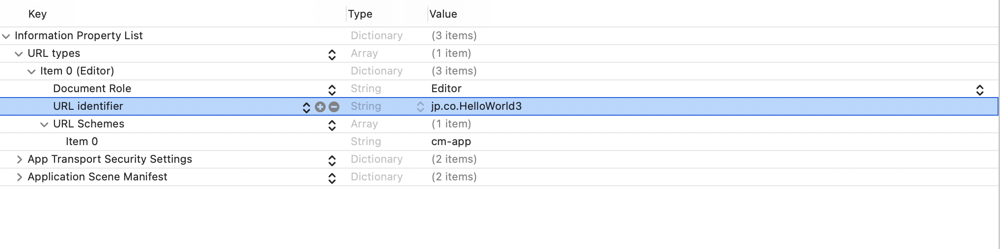

Automatic generation of plist xml:
```xml
<?xml version="1.0" encoding="UTF-8"?>
<!DOCTYPE plist PUBLIC "-//Apple//DTD PLIST 1.0//EN" "http://www.apple.com/DTDs/PropertyList-1.0.dtd">
<plist version="1.0">
<dict>
	<key>CFBundleURLTypes</key>
	<array>
		<dict>
			<key>CFBundleTypeRole</key>
			<string>Editor</string>
			<key>CFBundleURLName</key>
			<string>jp.co.HelloWorld3</string>
			<key>CFBundleURLSchemes</key>
			<array>
				<string>cm-app</string>
			</array>
		</dict>
	</array>
	<key>NSAppTransportSecurity</key>
	<dict>
		<key>NSAllowsArbitraryLoads</key>
		<true/>
		<key>NSAllowsArbitraryLoadsForMedia</key>
		<true/>
	</dict>
	<key>UIApplicationSceneManifest</key>
	<dict>
		<key>UIApplicationSupportsMultipleScenes</key>
		<false/>
		<key>UISceneConfigurations</key>
		<dict>
			<key>UIWindowSceneSessionRoleApplication</key>
			<array>
				<dict>
					<key>UISceneConfigurationName</key>
					<string>Default Configuration</string>
					<key>UISceneDelegateClassName</key>
					<string>$(PRODUCT_MODULE_NAME).SceneDelegate</string>
					<key>UISceneStoryboardFile</key>
					<string>Main</string>
				</dict>
			</array>
		</dict>
	</dict>
</dict>
</plist>
```

Running the app via a custom URL scheme:
```swift
import UIKit

@main
class AppDelegate: UIResponder, UIApplicationDelegate {

    func application(_ application: UIApplication,
                     open url: URL,
                     options: [UIApplication.OpenURLOptionsKey : Any] = [:] ) -> Bool {

        // Determine who sent the URL.
        let sendingAppID = options[.sourceApplication]
        print("source application = \(sendingAppID ?? "Unknown")")

        // Process the URL.
        guard let components = NSURLComponents(url: url, resolvingAgainstBaseURL: true),
            let albumPath = components.path,
            let params = components.queryItems else {
                print("Invalid URL or album path missing")
                return false
        }

        if let photoIndex = params.first(where: { $0.name == "index" })?.value {
            print("albumPath = \(albumPath)")
            print("photoIndex = \(photoIndex)")
            return true
        } else {
            print("Photo index missing")
            return false
        }
    }

    func application(_ application: UIApplication, didFinishLaunchingWithOptions launchOptions: [UIApplication.LaunchOptionsKey: Any]?) -> Bool {
        // Override point for customization after application launch.
        return true
    }
}
```

If this is violated, the following may occur.
* Unintended data may be sent to the application.

#### If your app handles URL scheme calls, it should properly validate URLs and their arguments and ask for user consent before performing sensitive actions (Required)

Failure to ask the user for consent before performing a critical operation creates a security problem.

One example is [the following flaw in the Skype Mobile app](https://www.dhanjani.com/blog/2010/11/insecure-handling-of-url-schemes-in-apples-ios.html) discovered in 2010. The Skype app registered a skype:// protocol handler and did not ask the user for permission before another app made a call to another Skype user's phone number, allowing any app to call any number without the user's knowledge. Attackers used this vulnerability to place an invisible `<iframe src="skype://xxx?call"></iframe>` (where xxx is replaced with a premium number) to allow Skype users who visit a malicious website to call premium numbers. Premium Numbers.

As a developer, you should carefully verify the URL before calling it. Only specific applications invoked via registered protocol handlers can be allowed. Another effective control method is to prompt the user to verify the operation invoked by the URL.

For argument validation, see [Validate deep link URLs and their arguments (Required)](#validate-deep-link-urls-and-their-arguments-required).

All URLs are passed to the app's delegate at app startup, during app execution, or in the background. To process the received URLs, the delegate must implement the following methods.

* Obtain information about the URL and determine whether to open it.
* Open the resource specified by the URL.

For more information, please refer to the previous [App Programming Guide for iOS](https://developer.apple.com/documentation/uikit#//apple_ref/doc/uid/TP40007072-CH6-SW13) and [Apple Secure Coding Guide](https://developer.apple.com/library/archive/documentation/Security/Conceptual/SecureCodingGuide/Articles/ValidatingInput.html).

In addition, apps can send URL requests (a.k.a. queries) to other apps. This is done as follows

* Register the application query scheme that the app is requesting.
* Optionally query other apps to see if they can open a particular URL.
* Send a URL request.

All of these represent a broad attack surface that will be covered in the static and dynamic analysis sections.

Reference
* [owasp-mastg Testing Custom URL Schemes (MSTG-PLATFORM-3)](https://github.com/OWASP/owasp-mastg/blob/v1.5.0/Document/0x06h-Testing-Platform-Interaction.md#testing-custom-url-schemes-mstg-platform-3)

If this is violated, the following may occur.
* There is a risk of transmitting users' personal information to outside parties without the users themselves being aware of it.

#### How to use universal links (Recommended)

When the user taps the universal link, the system can redirect the link directly to the installed app without going through Safari or the website. If the user does not have the app installed, the system will open the URL in Safari and allow the website to handle it.
This can be done by defining the specification of which app to redirect to in the apple-app-site-accosiation file and setting the Domain of the file in Xcode's Associated Domains.

Specify the associated file Place on a web server (anywhere accessible, such as AWS S3)
* Place apple-app-site-accosiation file on the web server
    * appID is team name + bundleID

json description of related files:
```json
{
    "webcredentials": {
        "apps": [ "${TeamID}.${BundleID}" ]
    },
    "applinks": {
        "apps": [],
        "details": [{
            "appID": "${TeamID}.${BundleID}",
            "paths": ["NOT /tests/*",
                      "NOT /settings/*",
                      "/*"]
            }]
    }
}
```

Notes on apple-app-site-association acquisition for iOS14 and later.
The acquisition route has changed since iOS14, and apple-app-site-association is acquired via Apple's CDN.
The problem with this change is that if the apple-app-site-association file is placed on a server with IP restrictions, Apple's CDN will not be able to acquire it, and UniversalLinks will not function.

Configuration in Xcode
* Configure Capabilities on Xcode. Add "Associated Domains" and set Domains
   * Domain is the domain of the site where the apple-app-site-association file is located.

Associated Domains description:
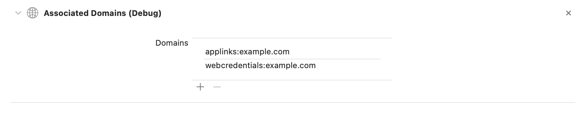

Source via Universal Link :
```swift
import UIKit

@main
class AppDelegate: UIResponder, UIApplicationDelegate {

    func application(application: UIApplication, continueUserActivity userActivity: NSUserActivity, restorationHandler: ([AnyObject]?) -> Void) -> Bool {
        
        if userActivity.activityType == NSUserActivityTypeBrowsingWeb {
            // Processing Universal Links
            print(userActivity.webpageURL!)
        }
        
        return true
    }
}
```

If this is not noted, the following may occur.
* May redirect to an unintended application.

#### Validate deep link URLs and their arguments (Required)

Verify that the query parameter sent by the deep link is really the one expected by the app.
It is important to do this for all parameters provided by the app.
If not applicable, return false in the deep link function.

Deeplink Parameter Argument Validation:
```swift
import UIKit

@main
class AppDelegate: UIResponder, UIApplicationDelegate {

  func application(application: UIApplication, continueUserActivity userActivity: NSUserActivity, restorationHandler: ([AnyObject]?) -> Void) -> Bool {
          
          if userActivity.activityType == NSUserActivityTypeBrowsingWeb {
              // Processing Universal Links
              guard let webpageURL = userActivity.webpageURL else {
                  return false
              }
              guard let components = NSURLComponents(url: webpageURL, resolvingAgainstBaseURL: true),
                  let albumPath = components.path,
                  let params = components.queryItems else {
                      print("Invalid URL or album path missing")
                      return false
              }
              if (validationParam(params: params)) {
                  // validation failed
                  return false
              }
          }
    
          // validation success
          return true
      }

      func application(_ application: UIApplication,
                       open url: URL,
                       options: [UIApplication.OpenURLOptionsKey : Any] = [:] ) -> Bool {

          // Determine who sent the URL.
          
          let sendingAppID = options[.sourceApplication]
          print("source application = \(sendingAppID ?? "Unknown")")

          // Process the URL.
          guard let components = NSURLComponents(url: url, resolvingAgainstBaseURL: true),
              let albumPath = components.path,
              let params = components.queryItems else {
                  print("Invalid URL or album path missing")
                  return false
          }

          if (validationParam(params: params)) {
              // validation failed
              return false
          }
          // validation success
          return true
      }

      func validationParam(params: [URLQueryItem]) -> Bool {
          
          if let index = params.first(where: { $0.name == "index" })?.value {
              return true
          } else {
              print("params index missing")
              return false
          }
      }
}
```

If this is violated, the following may occur.
* The app may send query parameters that are not expected.
* If the parameters are used in WebView as they are, there is a possibility that an unauthorized authentication input site etc. will be displayed.

## MSTG-PLATFORM-4
The app does not export sensitive functionality through IPC facilities, unless these mechanisms are properly protected.

During implementation of a mobile application, developers may apply traditional techniques for IPC (such as using shared files or network sockets). The IPC system functionality offered by mobile application platforms should be used because it is much more mature than traditional techniques. Using IPC mechanisms with no security in mind may cause the application to leak or expose sensitive data.

In contrast to Android's rich Inter-Process Communication (IPC) capability, iOS offers some rather limited options for communication between apps. In fact, there's no way for apps to communicate directly. In this section we will present the different types of indirect communication offered by iOS and how to test them. Here's an overview:

* Custom URL Schemes
* Universal Links
* UIActivity Sharing
* App Extensions
* UIPasteboard

Reference
* [owasp-mastg Testing for Sensitive Functionality Exposure Through IPC (MSTG-PLATFORM-4)](https://github.com/OWASP/owasp-mastg/blob/v1.5.0/Document/0x06h-Testing-Platform-Interaction.md#testing-for-sensitive-functionality-exposure-through-ipc-mstg-platform-4)

### Custom URL Schemes
Please refer to the section "[Custom URL Schemes](#custom-url-schemes)" for more information on what custom URL schemes are and how to test them.

Reference
* [owasp-mastg Testing for Sensitive Functionality Exposure Through IPC (MSTG-PLATFORM-4) Custom URL Schemes](https://github.com/OWASP/owasp-mastg/blob/v1.5.0/Document/0x06h-Testing-Platform-Interaction.md#custom-url-schemes)

Rulebook
* [How to use custom URL schemes (Required)](#how-to-use-custom-url-schemes-required)


### Universal Links
#### Overview
Universal links are the iOS equivalent to Android App Links (aka. Digital Asset Links) and are used for deep linking. When tapping a universal link (to the app's website), the user will seamlessly be redirected to the corresponding installed app without going through Safari. If the app isn't installed, the link will open in Safari.

Universal links are standard web links (HTTP/HTTPS) and are not to be confused with custom URL schemes, which originally were also used for deep linking.

For example, the Telegram app supports both custom URL schemes and universal links:

* `tg://resolve?domain=fridadotre` is a custom URL scheme and uses the `tg://` scheme.
* `https://telegram.me/fridadotre` is a universal link and uses the `https://` scheme.

Both result in the same action, the user will be redirected to the specified chat in Telegram ("fridadotre" in this case). However, universal links give several key benefits that are not applicable when using custom URL schemes and are the recommended way to implement deep linking, according to the [Apple Developer Documentation](https://developer.apple.com/library/archive/documentation/General/Conceptual/AppSearch/UniversalLinks.html). Specifically, universal links are:

* **Unique**: Unlike custom URL schemes, universal links can't be claimed by other apps, because they use standard HTTP or HTTPS links to the app's website. They were introduced as a way to prevent URL scheme hijacking attacks (an app installed after the original app may declare the same scheme and the system might target all new requests to the last installed app).
* **Secure**: When users install the app, iOS downloads and checks a file (the Apple App Site Association or AASA) that was uploaded to the web server to make sure that the website allows the app to open URLs on its behalf. Only the legitimate owners of the URL can upload this file, so the association of their website with the app is secure.
* **Flexible**: Universal links work even when the app is not installed. Tapping a link to the website would open the content in Safari, as users expect.
* **Simple**: One URL works for both the website and the app.
* **Private**: Other apps can communicate with the app without needing to know whether it is installed.

Reference
* [owasp-mastg Testing for Sensitive Functionality Exposure Through IPC (MSTG-PLATFORM-4) Universal Links](https://github.com/OWASP/owasp-mastg/blob/v1.5.0/Document/0x06h-Testing-Platform-Interaction.md#universal-links)

#### Static Analysis
Testing universal links on a static approach includes doing the following:

* Checking the Associated Domains entitlement
* Retrieving the Apple App Site Association file
* Checking the link receiver method
* Checking the data handler method
* Checking if the app is calling other app's universal links

Reference
* [owasp-mastg Testing for Sensitive Functionality Exposure Through IPC (MSTG-PLATFORM-4) Universal Links Static Analysis](https://github.com/OWASP/owasp-mastg/blob/v1.5.0/Document/0x06h-Testing-Platform-Interaction.md#static-analysis-1)


**Checking the Associated Domains Entitlement**

Universal links require the developer to add the Associated Domains entitlement and include in it a list of the domains that the app supports.

In Xcode, go to the **Capabilities** tab and search for **Associated Domains**. You can also inspect the .entitlements file looking for com.apple.developer.associated-domains. Each of the domains must be prefixed with applinks:, such as applinks:www.mywebsite.com.

Here's an example from Telegram's .entitlements file:
```xml
<key>com.apple.developer.associated-domains</key>
<array>
    <string>applinks:telegram.me</string>
    <string>applinks:t.me</string>
</array>
```

More detailed information can be found in the [archived Apple Developer Documentation](https://developer.apple.com/library/archive/documentation/General/Conceptual/AppSearch/UniversalLinks.html#//apple_ref/doc/uid/TP40016308-CH12-SW2).

If you don't have the original source code you can still search for them, as explained in "Entitlements Embedded in the Compiled App Binary".

Reference
* [owasp-mastg Testing for Sensitive Functionality Exposure Through IPC (MSTG-PLATFORM-4) Universal Links Static Analysis Checking the Associated Domains Entitlement](https://github.com/OWASP/owasp-mastg/blob/v1.5.0/Document/0x06h-Testing-Platform-Interaction.md#checking-the-associated-domains-entitlement)

**Retrieving the Apple App Site Association File**

Try to retrieve the `apple-app-site-association` file from the server using the associated domains you got from the previous step. This file needs to be accessible via HTTPS, without any redirects, at `https://<domain>/apple-app-site-association` or `https://<domain>/.well-known/apple-app-site-association`.

You can retrieve it yourself using your browser and navigating to `https://<domain>/apple-app-site-association`, `https://<domain>/.well-known/apple-app-site-association` or using Apple's CDN at `https://app-site-association.cdn-apple.com/a/v1/<domain>`.

Alternatively, you can use the [Apple App Site Association (AASA) Validator](https://branch.io/resources/aasa-validator/). After entering the domain, it will display the file, verify it for you and show the results (e.g. if it is not being properly served over HTTPS). See the following example from apple.com `https://www.apple.com/.well-known/apple-app-site-association`:


```json
{
    "activitycontinuation": {
    "apps": [
        "W74U47NE8E.com.apple.store.Jolly"
    ]
    },
    "applinks": {
        "apps": [],
        "details": [
            {
            "appID": "W74U47NE8E.com.apple.store.Jolly",
            "paths": [
                "NOT /shop/buy-iphone/*",
                "NOT /us/shop/buy-iphone/*",
                "/xc/*",
                "/shop/buy-*",
                "/shop/product/*",
                "/shop/bag/shared_bag/*",
                "/shop/order/list",
                "/today",
                "/shop/watch/watch-accessories",
                "/shop/watch/watch-accessories/*",
                "/shop/watch/bands",
            ] } ] }
}
```

The "details" key inside "applinks" contains a JSON representation of an array that might contain one or more apps. The "appID" should match the "application-identifier" key from the app's entitlements. Next, using the "paths" key, the developers can specify certain paths to be handled on a per app basis. Some apps, like Telegram use a standalone * ("paths": ["*"]) in order to allow all possible paths. Only if specific areas of the website should not be handled by some app, the developer can restrict access by excluding them by prepending a "NOT " (note the whitespace after the T) to the corresponding path. Also remember that the system will look for matches by following the order of the dictionaries in the array (first match wins).

This path exclusion mechanism is not to be seen as a security feature but rather as a filter that developer might use to specify which apps open which links. By default, iOS does not open any unverified links.

Remember that universal links verification occurs at installation time. iOS retrieves the AASA file for the declared domains (applinks) in its com.apple.developer.associated-domains entitlement. iOS will refuse to open those links if the verification did not succeed. Some reasons to fail verification might include:

* The AASA file is not served over HTTPS.
* The AASA is not available.
* The appIDs do not match (this would be the case of a malicious app). iOS would successfully prevent any possible hijacking attacks.

Reference
* [owasp-mastg Testing for Sensitive Functionality Exposure Through IPC (MSTG-PLATFORM-4) Universal Links Static Analysis Retrieving the Apple App Site Association File](https://github.com/OWASP/owasp-mastg/blob/v1.5.0/Document/0x06h-Testing-Platform-Interaction.md#retrieving-the-apple-app-site-association-file)

**Checking the Link Receiver Method**

In order to receive links and handle them appropriately, the app delegate has to implement [application:continueUserActivity:restorationHandler:](https://developer.apple.com/documentation/uikit/uiapplicationdelegate/1623072-application). If you have the original project try searching for this method.

Please note that if the app uses [openURL:options:completionHandler:](https://developer.apple.com/documentation/uikit/uiapplication/1648685-openurl?language=objc) to open a universal link to the app's website, the link won't open in the app. As the call originates from the app, it won't be handled as a universal link.

From Apple Docs: When iOS launches your app after a user taps a universal link, you receive an NSUserActivity object with an activityType value of NSUserActivityTypeBrowsingWeb. The activity object's webpageURL property contains the URL that the user is accessing. The webpage URL property always contains an HTTP or HTTPS URL, and you can use NSURLComponents APIs to manipulate the components of the URL. [...] To protect user's privacy and security, you should not use HTTP when you need to transport data; instead, use a secure transport protocol such as HTTPS.

From the note above we can highlight that:

* The mentioned NSUserActivity object comes from the continueUserActivity parameter, as seen in the method above.
* The scheme of the webpageURL must be HTTP or HTTPS (any other scheme should throw an exception). The [scheme instance](https://developer.apple.com/documentation/foundation/urlcomponents/1779624-scheme) property of URLComponents / NSURLComponents can be used to verify this.

If you don't have the original source code you can use radare2 or rabin2 to search the binary strings for the link receiver method:

```bash
$ rabin2 -zq Telegram\ X.app/Telegram\ X | grep restorationHan

0x1000deea9 53 52 application:continueUserActivity:restorationHandler:
```

Reference
* [owasp-mastg Testing for Sensitive Functionality Exposure Through IPC (MSTG-PLATFORM-4) Universal Links Static Analysis Checking the Link Receiver Method](https://github.com/OWASP/owasp-mastg/blob/v1.5.0/Document/0x06h-Testing-Platform-Interaction.md#checking-the-link-receiver-method)


**Checking the Data Handler Method**

You should check how the received data is validated. Apple [explicitly warns about this](https://developer.apple.com/documentation/xcode/supporting-universal-links-in-your-app):

Universal links offer a potential attack vector into your app, so make sure to validate all URL parameters and discard any malformed URLs. In addition, limit the available actions to those that do not risk the user's data. For example, do not allow universal links to directly delete content or access sensitive information about the user. When testing your URL-handling code, make sure your test cases include improperly formatted URLs.

As stated in the [Apple Developer Documentation](https://developer.apple.com/documentation/xcode/supporting-universal-links-in-your-app), when iOS opens an app as the result of a universal link, the app receives an NSUserActivity object with an activityType value of NSUserActivityTypeBrowsingWeb. The activity object's webpageURL property contains the HTTP or HTTPS URL that the user accesses. The following example in Swift verifies exactly this before opening the URL:

```default
func application(_ application: UIApplication, continue userActivity: NSUserActivity,
                 restorationHandler: @escaping ([UIUserActivityRestoring]?) -> Void) -> Bool {
    // ...
    if userActivity.activityType == NSUserActivityTypeBrowsingWeb, let url = userActivity.webpageURL {
        application.open(url, options: [:], completionHandler: nil)
    }

    return true
}
```

In addition, remember that if the URL includes parameters, they should not be trusted before being carefully sanitized and validated (even when coming from trusted domain). For example, they might have been spoofed by an attacker or might include malformed data. If that is the case, the whole URL and therefore the universal link request must be discarded.

The NSURLComponents API can be used to parse and manipulate the components of the URL. This can be also part of the method application:continueUserActivity:restorationHandler: itself or might occur on a separate method being called from it. The following [example](https://developer.apple.com/documentation/xcode/supporting-universal-links-in-your-app#3001935) demonstrates this:

```default
func application(_ application: UIApplication,
                 continue userActivity: NSUserActivity,
                 restorationHandler: @escaping ([Any]?) -> Void) -> Bool {
    guard userActivity.activityType == NSUserActivityTypeBrowsingWeb,
        let incomingURL = userActivity.webpageURL,
        let components = NSURLComponents(url: incomingURL, resolvingAgainstBaseURL: true),
        let path = components.path,
        let params = components.queryItems else {
        return false
    }

    if let albumName = params.first(where: { $0.name == "albumname" })?.value,
        let photoIndex = params.first(where: { $0.name == "index" })?.value {
        // Interact with album name and photo index

        return true

    } else {
        // Handle when album and/or album name or photo index missing

        return false
    }
}
```

Finally, as stated above, be sure to verify that the actions triggered by the URL do not expose sensitive information or risk the user's data on any way.


Reference
* [owasp-mastg Testing for Sensitive Functionality Exposure Through IPC (MSTG-PLATFORM-4) Universal Links Static Analysis Checking the Data Handler Method](https://github.com/OWASP/owasp-mastg/blob/v1.5.0/Document/0x06h-Testing-Platform-Interaction.md#checking-the-data-handler-method)

Rulebook
* [How to validate data received as a result of Universal Link (Required)](#how-to-validate-data-received-as-a-result-of-universal-link-required)
* [Use secure transfer protocols to protect user privacy and security (Required)](#use-secure-transfer-protocols-to-protect-user-privacy-and-security-required)
* [If the URL contains parameters, do not trust the URL without careful sanitization and validation (Recommended)](#if-the-url-contains-parameters-do-not-trust-the-url-without-careful-sanitization-and-validation-recommended)


**Checking if the App is Calling Other App's Universal Links**

An app might be calling other apps via universal links in order to simply trigger some actions or to transfer information, in that case, it should be verified that it is not leaking sensitive information.

If you have the original source code, you can search it for the openURL:options: completionHandler: method and check the data being handled.

Note that the openURL:options:completionHandler: method is not only used to open universal links but also to call custom URL schemes.

This is an example from the Telegram app:

```default
}, openUniversalUrl: { url, completion in
    if #available(iOS 10.0, *) {
        var parsedUrl = URL(string: url)
        if let parsed = parsedUrl {
            if parsed.scheme == nil || parsed.scheme!.isEmpty {
                parsedUrl = URL(string: "https://\(url)")
            }
        }

        if let parsedUrl = parsedUrl {
            return UIApplication.shared.open(parsedUrl,
                        options: [UIApplicationOpenURLOptionUniversalLinksOnly: true as NSNumber],
                        completionHandler: { value in completion.completion(value)}
            )
```

Note how the app adapts the scheme to "https" before opening it and how it uses the option UIApplicationOpenURLOptionUniversalLinksOnly: true that [opens the URL only if the URL is a valid universal link and there is an installed app capable of opening that URL](https://developer.apple.com/documentation/uikit/uiapplicationopenurloptionuniversallinksonly?language=objc).

If you don't have the original source code, search in the symbols and in the strings of the app binary. For example, we will search for Objective-C methods that contain "openURL":

```bash
$ rabin2 -zq Telegram\ X.app/Telegram\ X | grep openURL

0x1000dee3f 50 49 application:openURL:sourceApplication:annotation:
0x1000dee71 29 28 application:openURL:options:
0x1000df2c9 9 8 openURL:
0x1000df772 35 34 openURL:options:completionHandler:
```

As expected, openURL:options:completionHandler: is among the ones found (remember that it might be also present because the app opens custom URL schemes). Next, to ensure that no sensitive information is being leaked you'll have to perform dynamic analysis and inspect the data being transmitted. Please refer to "[Identifying and Hooking the URL Handler Method](#identifying-and-hooking-the-url-handler-method)" in the "Dynamic Analysis" of "Custom URL Schemes" section for some examples on hooking and tracing this method.

Reference
* [owasp-mastg Testing for Sensitive Functionality Exposure Through IPC (MSTG-PLATFORM-4) Universal Links Static Analysis Checking if the App is Calling Other App's Universal Links](https://github.com/OWASP/owasp-mastg/blob/v1.5.0/Document/0x06h-Testing-Platform-Interaction.md#checking-if-the-app-is-calling-other-apps-universal-links)

Rulebook
* [Make sure you are not exposing sensitive information when calling other apps via universal links (Required)](#make-sure-you-are-not-exposing-sensitive-information-when-calling-other-apps-via-universal-links-required)

#### Dynamic Analysis
If an app is implementing universal links, you should have the following outputs from the static analysis:

* the associated domains
* the Apple App Site Association file
* the link receiver method
* the data handler method

You can use this now to dynamically test them:

* Triggering universal links
* Identifying valid universal links
* Tracing the link receiver method
* Checking how the links are opened

Reference
* [owasp-mastg Testing for Sensitive Functionality Exposure Through IPC (MSTG-PLATFORM-4) Universal Links Dynamic Analysis](https://github.com/OWASP/owasp-mastg/blob/v1.5.0/Document/0x06h-Testing-Platform-Interaction.md#dynamic-analysis-1)

**Triggering Universal Links**

Unlike custom URL schemes, unfortunately you cannot test universal links from Safari just by typing them in the search bar directly as this is not allowed by Apple. But you can test them anytime using other apps like the Notes app:

* Open the Notes app and create a new note.
* Write the links including the domain.
* Leave the editing mode in the Notes app.
* Long press the links to open them (remember that a standard click triggers the default option).

To do it from Safari you will have to find an existing link on a website that once clicked, it will be recognized as a Universal Link. This can be a bit time consuming.

Alternatively you can also use Frida for this, see the section "[Performing URL Requests](#performing-url-requests)" for more details.

Reference
* [owasp-mastg Testing for Sensitive Functionality Exposure Through IPC (MSTG-PLATFORM-4) Universal Links Dynamic Analysis Triggering Universal Links](https://github.com/OWASP/owasp-mastg/blob/v1.5.0/Document/0x06h-Testing-Platform-Interaction.md#triggering-universal-links)

**Identifying Valid Universal Links**

First of all we will see the difference between opening an allowed Universal Link and one that shouldn't be allowed.

From the apple-app-site-association of apple.com we have seen above we chose the following paths:

```default
"paths": [
    "NOT /shop/buy-iphone/*",
    ...
    "/today",
```

One of them should offer the "Open in app" option and the other should not.

If we long press on the first one (`http://www.apple.com/shop/buy-iphone/iphone-xr`) it only offers the option to open it (in the browser).

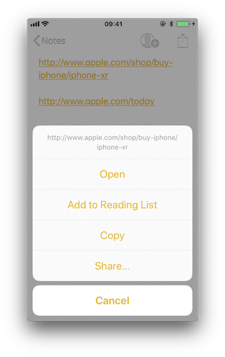

If we long press on the second (`http://www.apple.com/today`) it shows options to open it in Safari and in "Apple Store":


Note that there is a difference between a click and a long press. Once we long press a link and select an option, e.g. "Open in Safari", this will become the default option for all future clicks until we long press again and select another option.

If we repeat the process on the method application:continueUserActivity: restorationHandler: by either hooking or tracing, we will see how it gets called as soon as we open the allowed universal link. For this you can use for example frida-trace:

```bash
frida-trace -U "Apple Store" -m "*[* *restorationHandler*]"
```

Reference
* [owasp-mastg Testing for Sensitive Functionality Exposure Through IPC (MSTG-PLATFORM-4) Universal Links Dynamic Analysis Identifying Valid Universal Links](https://github.com/OWASP/owasp-mastg/blob/v1.5.0/Document/0x06h-Testing-Platform-Interaction.md#identifying-valid-universal-links)


**Tracing the Link Receiver Method**

This section explains how to trace the link receiver method and how to extract additional information. For this example, we will use Telegram, as there are no restrictions in its apple-app-site-association file:

```json
{
    "applinks": {
        "apps": [],
        "details": [
            {
                "appID": "X834Q8SBVP.org.telegram.TelegramEnterprise",
                "paths": [
                    "*"
                ]
            },
            {
                "appID": "C67CF9S4VU.ph.telegra.Telegraph",
                "paths": [
                    "*"
                ]
            },
            {
                "appID": "X834Q8SBVP.org.telegram.Telegram-iOS",
                "paths": [
                    "*"
                ]
            }
        ]
    }
}
```

In order to open the links we will also use the Notes app and frida-trace with the following pattern:

```bash
frida-trace -U Telegram -m "*[* *restorationHandler*]"
```

Write https://t.me/addstickers/radare (found through a quick Internet research) and open it from the Notes app.

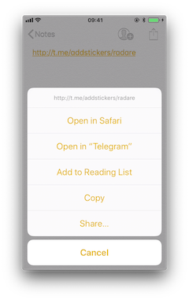

First we let frida-trace generate the stubs in \_\_handlers__/:

```bash
$ frida-trace -U Telegram -m "*[* *restorationHandler*]"
Instrumenting functions...
-[AppDelegate application:continueUserActivity:restorationHandler:]
```

You can see that only one function was found and is being instrumented. Trigger now the universal link and observe the traces.

```bash
298382 ms  -[AppDelegate application:0x10556b3c0 continueUserActivity:0x1c4237780
                restorationHandler:0x16f27a898]
```

You can observe that the function is in fact being called. You can now add code to the stubs in `__handlers__/` to obtain more details:

```javascript
// __handlers__/__AppDelegate_application_contin_8e36bbb1.js

onEnter: function (log, args, state) {
    log("-[AppDelegate application: " + args[2] + " continueUserActivity: " + args[3] +
                     " restorationHandler: " + args[4] + "]");
    log("\tapplication: " + ObjC.Object(args[2]).toString());
    log("\tcontinueUserActivity: " + ObjC.Object(args[3]).toString());
    log("\t\twebpageURL: " + ObjC.Object(args[3]).webpageURL().toString());
    log("\t\tactivityType: " + ObjC.Object(args[3]).activityType().toString());
    log("\t\tuserInfo: " + ObjC.Object(args[3]).userInfo().toString());
    log("\trestorationHandler: " +ObjC.Object(args[4]).toString());
  },
```

The new output is:

```bash
298382 ms  -[AppDelegate application:0x10556b3c0 continueUserActivity:0x1c4237780
                restorationHandler:0x16f27a898]
298382 ms  application:<Application: 0x10556b3c0>
298382 ms  continueUserActivity:<NSUserActivity: 0x1c4237780>
298382 ms       webpageURL:http://t.me/addstickers/radare
298382 ms       activityType:NSUserActivityTypeBrowsingWeb
298382 ms       userInfo:{
}
298382 ms  restorationHandler:<__NSStackBlock__: 0x16f27a898>
```

Apart from the function parameters we have added more information by calling some methods from them to get more details, in this case about the NSUserActivity. If we look in the [Apple Developer Documentation](https://developer.apple.com/documentation/foundation/nsuseractivity?language=objc) we can see what else we can call from this object.


Reference
* [owasp-mastg Testing for Sensitive Functionality Exposure Through IPC (MSTG-PLATFORM-4) Universal Links Dynamic Analysis Tracing the Link Receiver Method](https://github.com/OWASP/owasp-mastg/blob/v1.5.0/Document/0x06h-Testing-Platform-Interaction.md#tracing-the-link-receiver-method)

**Checking How the Links Are Opened**

If you want to know more about which function actually opens the URL and how the data is actually being handled you should keep investigating.

Extend the previous command in order to find out if there are any other functions involved into opening the URL.

```bash
frida-trace -U Telegram -m "*[* *restorationHandler*]" -i "*open*Url*"
```

-i includes any method. You can also use a glob pattern here (e.g. -i "\*open\*Url*" means "include any function containing 'open', then 'Url' and something else")

Again, we first let frida-trace generate the stubs in \_\_handlers__/:

```bash
$ frida-trace -U Telegram -m "*[* *restorationHandler*]" -i "*open*Url*"
Instrumenting functions...
-[AppDelegate application:continueUserActivity:restorationHandler:]
$S10TelegramUI0A19ApplicationBindingsC16openUniversalUrlyySS_AA0ac4OpenG10Completion...
$S10TelegramUI15openExternalUrl7account7context3url05forceD016presentationData18application...
$S10TelegramUI31AuthorizationSequenceControllerC7account7strings7openUrl5apiId0J4HashAC0A4Core19...
...
```

Now you can see a long list of functions but we still don't know which ones will be called. Trigger the universal link again and observe the traces.

```bash
           /* TID 0x303 */
298382 ms  -[AppDelegate application:0x10556b3c0 continueUserActivity:0x1c4237780
                restorationHandler:0x16f27a898]
298619 ms     | $S10TelegramUI15openExternalUrl7account7context3url05forceD016presentationData
                18applicationContext20navigationController12dismissInputy0A4Core7AccountC_AA
                14OpenURLContextOSSSbAA012PresentationK0CAA0a11ApplicationM0C7Display0
                10NavigationO0CSgyyctF()
```

Apart from the Objective-C method, now there is one Swift function that is also of your interest.

There is probably no documentation for that Swift function but you can just demangle its symbol using swift-demangle via [xcrun](http://www.manpagez.com/man/1/xcrun/):

xcrun can be used invoke Xcode developer tools from the command-line, without having them in the path. In this case it will locate and run swift-demangle, an Xcode tool that demangles Swift symbols.

```bash
$ xcrun swift-demangle S10TelegramUI15openExternalUrl7account7context3url05forceD016presentationData
18applicationContext20navigationController12dismissInputy0A4Core7AccountC_AA14OpenURLContextOSSSbAA0
12PresentationK0CAA0a11ApplicationM0C7Display010NavigationO0CSgyyctF
```

Resulting in:

```default
---> TelegramUI.openExternalUrl(
    account: TelegramCore.Account, context: TelegramUI.OpenURLContext, url: Swift.String,
    forceExternal: Swift.Bool, presentationData: TelegramUI.PresentationData,
    applicationContext: TelegramUI.TelegramApplicationContext,
    navigationController: Display.NavigationController?, dismissInput: () -> ()) -> ()
```

This not only gives you the class (or module) of the method, its name and the parameters but also reveals the parameter types and return type, so in case you need to dive deeper now you know where to start.

For now we will use this information to properly print the parameters by editing the stub file:

```javascript
// __handlers__/TelegramUI/_S10TelegramUI15openExternalUrl7_b1a3234e.js

onEnter: function (log, args, state) {

    log("TelegramUI.openExternalUrl(account: TelegramCore.Account,
        context: TelegramUI.OpenURLContext, url: Swift.String, forceExternal: Swift.Bool,
        presentationData: TelegramUI.PresentationData,
        applicationContext: TelegramUI.TelegramApplicationContext,
        navigationController: Display.NavigationController?, dismissInput: () -> ()) -> ()");
    log("\taccount: " + ObjC.Object(args[0]).toString());
    log("\tcontext: " + ObjC.Object(args[1]).toString());
    log("\turl: " + ObjC.Object(args[2]).toString());
    log("\tpresentationData: " + args[3]);
    log("\tapplicationContext: " + ObjC.Object(args[4]).toString());
    log("\tnavigationController: " + ObjC.Object(args[5]).toString());
  },
```

This way, the next time we run it we get a much more detailed output:

```bash
298382 ms  -[AppDelegate application:0x10556b3c0 continueUserActivity:0x1c4237780
                restorationHandler:0x16f27a898]
298382 ms  application:<Application: 0x10556b3c0>
298382 ms  continueUserActivity:<NSUserActivity: 0x1c4237780>
298382 ms       webpageURL:http://t.me/addstickers/radare
298382 ms       activityType:NSUserActivityTypeBrowsingWeb
298382 ms       userInfo:{
}
298382 ms  restorationHandler:<__NSStackBlock__: 0x16f27a898>

298619 ms     | TelegramUI.openExternalUrl(account: TelegramCore.Account,
context: TelegramUI.OpenURLContext, url: Swift.String, forceExternal: Swift.Bool,
presentationData: TelegramUI.PresentationData, applicationContext:
TelegramUI.TelegramApplicationContext, navigationController: Display.NavigationController?,
dismissInput: () -> ()) -> ()
298619 ms     |     account: TelegramCore.Account
298619 ms     |     context: nil
298619 ms     |     url: http://t.me/addstickers/radare
298619 ms     |     presentationData: 0x1c4e40fd1
298619 ms     |     applicationContext: nil
298619 ms     |     navigationController: TelegramUI.PresentationData
```

There you can observe the following:

* It calls application:continueUserActivity:restorationHandler: from the app delegate as expected.
* application:continueUserActivity:restorationHandler: handles the URL but does not open it, it calls TelegramUI.openExternalUrl for that.
* The URL being opened is `https://t.me/addstickers/radare`.

You can now keep going and try to trace and verify how the data is being validated. For example, if you have two apps that communicate via universal links you can use this to see if the sending app is leaking sensitive data by hooking these methods in the receiving app. This is especially useful when you don't have the source code as you will be able to retrieve the full URL that you wouldn't see other way as it might be the result of clicking some button or triggering some functionality.

In some cases, you might find data in userInfo of the NSUserActivity object. In the previous case there was no data being transferred but it might be the case for other scenarios. To see this, be sure to hook the userInfo property or access it directly from the continueUserActivity object in your hook (e.g. by adding a line like this log("userInfo:" + ObjC.Object(args[3]).userInfo().toString());).


Reference
* [owasp-mastg Testing for Sensitive Functionality Exposure Through IPC (MSTG-PLATFORM-4) Universal Links Dynamic Analysis Checking How the Links Are Opened](https://github.com/OWASP/owasp-mastg/blob/v1.5.0/Document/0x06h-Testing-Platform-Interaction.md#checking-how-the-links-are-opened)

**Final Notes about Universal Links and Handoff**

Universal links and Apple's [Handoff feature](https://developer.apple.com/library/archive/documentation/UserExperience/Conceptual/Handoff/HandoffFundamentals/HandoffFundamentals.html#//apple_ref/doc/uid/TP40014338) are related:

* Both rely on the same method when receiving data:

```default
application:continueUserActivity:restorationHandler:
```

* Like universal links, the Handoff's Activity Continuation must be declared in the com.apple.developer.associated-domains entitlement and in the server's apple-app-site-association file (in both cases via the keyword "activitycontinuation":). See "Retrieving the Apple App Site Association File" above for an example.

Actually, the previous example in "Checking How the Links Are Opened" is very similar to the "Web Browser-to-Native App Handoff" scenario described in the "[Handoff Programming Guide](https://developer.apple.com/library/archive/documentation/UserExperience/Conceptual/Handoff/AdoptingHandoff/AdoptingHandoff.html#//apple_ref/doc/uid/TP40014338-CH2-SW10)":

If the user is using a web browser on the originating device, and the receiving device is an iOS device with a native app that claims the domain portion of the webpageURL property, then iOS launches the native app and sends it an NSUserActivity object with an activityType value of NSUserActivityTypeBrowsingWeb. The webpageURL property contains the URL the user was visiting, while the userInfo dictionary is empty.

In the detailed output above you can see that NSUserActivity object we've received meets exactly the mentioned points:

```bash
298382 ms  -[AppDelegate application:0x10556b3c0 continueUserActivity:0x1c4237780
                restorationHandler:0x16f27a898]
298382 ms  application:<Application: 0x10556b3c0>
298382 ms  continueUserActivity:<NSUserActivity: 0x1c4237780>
298382 ms       webpageURL:http://t.me/addstickers/radare
298382 ms       activityType:NSUserActivityTypeBrowsingWeb
298382 ms       userInfo:{
}
298382 ms  restorationHandler:<__NSStackBlock__: 0x16f27a898>
```

This knowledge should help you when testing apps supporting Handoff.

Reference
* [owasp-mastg Testing for Sensitive Functionality Exposure Through IPC (MSTG-PLATFORM-4) Universal Links Dynamic Analysis Final Notes about Universal Links and Handoff](https://github.com/OWASP/owasp-mastg/blob/v1.5.0/Document/0x06h-Testing-Platform-Interaction.md#final-notes-about-universal-links-and-handoff)

Rulebook
* [Universal Links and Handoff (Required)](#universal-links-and-handoff-required)

### UIActivity Sharing
#### Overview
Starting on iOS 6 it is possible for third-party apps to share data (items) via specific mechanisms [like AirDrop, for example](https://developer.apple.com/documentation/uikit#//apple_ref/doc/uid/TP40007072-CH6-SW3). From a user perspective, this feature is the well-known system-wide "Share Activity Sheet" that appears after clicking on the "Share" button.


The available built-in sharing mechanisms (aka. Activity Types) include:

* airDrop
* assignToContact
* copyToPasteboard
* mail
* message
* postToFacebook
* postToTwitter

A full list can be found in [UIActivity.ActivityType](https://developer.apple.com/documentation/uikit/uiactivity/activitytype). If not considered appropriate for the app, the developers have the possibility to exclude some of these sharing mechanisms.

Reference
* [owasp-mastg Testing for Sensitive Functionality Exposure Through IPC (MSTG-PLATFORM-4) UIActivity Sharing](https://github.com/OWASP/owasp-mastg/blob/v1.5.0/Document/0x06h-Testing-Platform-Interaction.md#uiactivity-sharing)

#### Static Analysis
**Sending Items**

When testing UIActivity Sharing you should pay special attention to:

* the data (items) being shared,
* the custom activities,
* the excluded activity types.

Data sharing via UIActivity works by creating a UIActivityViewController and passing it the desired items (URLs, text, a picture) on [init(activityItems: applicationActivities:)](https://developer.apple.com/documentation/uikit/uiactivityviewcontroller/1622019-init).

As we mentioned before, it is possible to exclude some of the sharing mechanisms via the controller's [excludedActivityTypes property](https://developer.apple.com/documentation/uikit/uiactivityviewcontroller/1622009-excludedactivitytypes). It is highly recommended to do the tests using the latest versions of iOS as the number of activity types that can be excluded can increase. The developers have to be aware of this and **explicitly exclude** the ones that are not appropriate for the app data. Some activity types might not be even documented like "Create Watch Face".

If having the source code, you should take a look at the UIActivityViewController:

* Inspect the activities passed to the init(activityItems:applicationActivities:) method.
* Check if it defines custom activities (also being passed to the previous method).
* Verify the excludedActivityTypes, if any.

If you only have the compiled/installed app, try searching for the previous method and property, for example:

```bash
$ rabin2 -zq Telegram\ X.app/Telegram\ X | grep -i activityItems
0x1000df034 45 44 initWithActivityItems:applicationActivities:
```

Reference
* [owasp-mastg Testing for Sensitive Functionality Exposure Through IPC (MSTG-PLATFORM-4) UIActivity Sharing Static Analysis Sending Items](https://github.com/OWASP/owasp-mastg/blob/v1.5.0/Document/0x06h-Testing-Platform-Interaction.md#sending-items)

Rulebook
* [Explicit exclusion of activity types targeted by UIActivity Sharing (Required)](#explicit-exclusion-of-activity-types-targeted-by-uiactivity-sharing-required)

**Receiving Items**

When receiving items, you should check:

* if the app declares custom document types by looking into Exported/Imported UTIs ("Info" tab of the Xcode project). The list of all system declared UTIs (Uniform Type Identifiers) can be found in the [archived Apple Developer Documentation](https://developer.apple.com/library/archive/documentation/Miscellaneous/Reference/UTIRef/Articles/System-DeclaredUniformTypeIdentifiers.html#//apple_ref/doc/uid/TP40009259).

* if the app specifies any document types that it can open by looking into Document Types ("Info" tab of the Xcode project). If present, they consist of name and one or more UTIs that represent the data type (e.g. "public.png" for PNG files). iOS uses this to determine if the app is eligible to open a given document (specifying Exported/Imported UTIs is not enough).

* if the app properly verifies the received data by looking into the implementation of [application:openURL:options:](https://developer.apple.com/documentation/uikit/uiapplicationdelegate/1623112-application?language=objc) (or its deprecated version [UIApplicationDelegate application:openURL:sourceApplication:annotation:](https://developer.apple.com/documentation/uikit/uiapplicationdelegate/1623073-application?language=objc)) in the app delegate.

If not having the source code you can still take a look into the Info.plist file and search for:

* UTExportedTypeDeclarations/UTImportedTypeDeclarations if the app declares exported/imported custom document types.
* CFBundleDocumentTypes to see if the app specifies any document types that it can open.

A very complete explanation about the use of these keys can be found [on Stackoverflow](https://stackoverflow.com/questions/21937978/what-are-utimportedtypedeclarations-and-utexportedtypedeclarations-used-for-on-i).

Let's see a real-world example. We will take a File Manager app and take a look at these keys. We used [objection](https://github.com/sensepost/objection) here to read the Info.plist file.

```bash
objection --gadget SomeFileManager run ios plist cat Info.plist
```

Note that this is the same as if we would retrieve the IPA from the phone or accessed via e.g. SSH and navigated to the corresponding folder in the IPA / app sandbox. However, with objection we are just one command away from our goal and this can be still considered static analysis.

The first thing we noticed is that app does not declare any imported custom document types but we could find a couple of exported ones:

```javascript
UTExportedTypeDeclarations =     (
    {
UTTypeConformsTo =             (
    "public.data"
);
UTTypeDescription = "SomeFileManager Files";
UTTypeIdentifier = "com.some.filemanager.custom";
UTTypeTagSpecification =             {
    "public.filename-extension" =                 (
        ipa,
        deb,
        zip,
        rar,
        tar,
        gz,
        ...
        key,
        pem,
        p12,
        cer
    );
};
}
);
```

The app also declares the document types it opens as we can find the key CFBundleDocumentTypes:

```javascript
CFBundleDocumentTypes =     (
        {
        ...
        CFBundleTypeName = "SomeFileManager Files";
        LSItemContentTypes =             (
            "public.content",
            "public.data",
            "public.archive",
            "public.item",
            "public.database",
            "public.calendar-event",
            ...
        );
    }
);
```

We can see that this File Manager will try to open anything that conforms to any of the UTIs listed in LSItemContentTypes and it's ready to open files with the extensions listed in UTTypeTagSpecification/"public.filename-extension". Please take a note of this because it will be useful if you want to search for vulnerabilities when dealing with the different types of files when performing dynamic analysis.

Reference
* [owasp-mastg Testing for Sensitive Functionality Exposure Through IPC (MSTG-PLATFORM-4) UIActivity Sharing Static Analysis Receiving Items](https://github.com/OWASP/owasp-mastg/blob/v1.5.0/Document/0x06h-Testing-Platform-Interaction.md#receiving-items)

Rulebook
* [Always confirm when receiving files from other apps (Required)](#always-confirm-when-receiving-files-from-other-apps-required)


#### Dynamic Analysis
**Sending Items**

There are three main things you can easily inspect by performing dynamic instrumentation:

* The activityItems: an array of the items being shared. They might be of different types, e.g. one string and one picture to be shared via a messaging app.
* The applicationActivities: an array of UIActivity objects representing the app's custom services.
* The excludedActivityTypes: an array of the Activity Types that are not supported, e.g. postToFacebook.

To achieve this you can do two things:

* Hook the method we have seen in the static analysis ([init(activityItems: applicationActivities:)](https://developer.apple.com/documentation/uikit/uiactivityviewcontroller/1622019-init)) to get the activityItems and applicationActivities.
* Find out the excluded activities by hooking [excludedActivityTypes property](https://developer.apple.com/documentation/uikit/uiactivityviewcontroller/1622009-excludedactivitytypes).

Let's see an example using Telegram to share a picture and a text file. First prepare the hooks, we will use the Frida REPL and write a script for this:

```javascript
Interceptor.attach(
    ObjC.classes.
        UIActivityViewController['- initWithActivityItems:applicationActivities:'].implementation, {
      onEnter: function (args) {
    
        printHeader(args)
    
        this.initWithActivityItems = ObjC.Object(args[2]);
        this.applicationActivities = ObjC.Object(args[3]);
    
        console.log("initWithActivityItems: " + this.initWithActivityItems);
        console.log("applicationActivities: " + this.applicationActivities);
    
      },
      onLeave: function (retval) {
        printRet(retval);
      }
    });
    
    Interceptor.attach(
    ObjC.classes.UIActivityViewController['- excludedActivityTypes'].implementation, {
      onEnter: function (args) {
        printHeader(args)
      },
      onLeave: function (retval) {
        printRet(retval);
      }
    });
    
    function printHeader(args) {
      console.log(Memory.readUtf8String(args[1]) + " @ " + args[1])
    };
    
    function printRet(retval) {
      console.log('RET @ ' + retval + ': ' );
      try {
        console.log(new ObjC.Object(retval).toString());
      } catch (e) {
        console.log(retval.toString());
      }
    };
```

You can store this as a JavaScript file, e.g. inspect_send_activity_data.js and load it like this:

```bash
frida -U Telegram -l inspect_send_activity_data.js
```

Now observe the output when you first share a picture:

```javascript
[*] initWithActivityItems:applicationActivities: @ 0x18c130c07
initWithActivityItems: (
    "<UIImage: 0x1c4aa0b40> size {571, 264} orientation 0 scale 1.000000"
)
applicationActivities: nil
RET @ 0x13cb2b800:
<UIActivityViewController: 0x13cb2b800>

[*] excludedActivityTypes @ 0x18c0f8429
RET @ 0x0:
nil
```

and then a text file:

```javascript
[*] initWithActivityItems:applicationActivities: @ 0x18c130c07
initWithActivityItems: (
    "<QLActivityItemProvider: 0x1c4a30140>",
    "<UIPrintInfo: 0x1c0699a50>"
)
applicationActivities: (
)
RET @ 0x13c4bdc00:
<_UIDICActivityViewController: 0x13c4bdc00>

[*] excludedActivityTypes @ 0x18c0f8429
RET @ 0x1c001b1d0:
(
    "com.apple.UIKit.activity.MarkupAsPDF"
)
```

You can see that:

* For the picture, the activity item is a UIImage and there are no excluded activities.
* For the text file there are two different activity items and com.apple.UIKit.activity. MarkupAsPDF is excluded.

In the previous example, there were no custom applicationActivities and only one excluded activity. However, to better illustrate what you can expect from other apps we have shared a picture using another app, here you can see a bunch of application activities and excluded activities (output was edited to hide the name of the originating app):

```javascript
[*] initWithActivityItems:applicationActivities: @ 0x18c130c07
initWithActivityItems: (
    "<SomeActivityItemProvider: 0x1c04bd580>"
)
applicationActivities: (
    "<SomeActionItemActivityAdapter: 0x141de83b0>",
    "<SomeActionItemActivityAdapter: 0x147971cf0>",
    "<SomeOpenInSafariActivity: 0x1479f0030>",
    "<SomeOpenInChromeActivity: 0x1c0c8a500>"
)
RET @ 0x142138a00:
<SomeActivityViewController: 0x142138a00>

[*] excludedActivityTypes @ 0x18c0f8429
RET @ 0x14797c3e0:
(
    "com.apple.UIKit.activity.Print",
    "com.apple.UIKit.activity.AssignToContact",
    "com.apple.UIKit.activity.SaveToCameraRoll",
    "com.apple.UIKit.activity.CopyToPasteboard",
)
```

**Receiving Items**

After performing the static analysis you would know the document types that the app can open and if it declares any custom document types and (part of) the methods involved. You can use this now to test the receiving part:

* Share a file with the app from another app or send it via AirDrop or e-mail. Choose the file so that it will trigger the "Open with..." dialogue (that is, there is no default app that will open the file, a PDF for example).
* Hook application:openURL:options: and any other methods that were identified in a previous static analysis.
* Observe the app behavior.
* In addition, you could send specific malformed files and/or use a fuzzing technique.

To illustrate this with an example we have chosen the same real-world file manager app from the static analysis section and followed these steps:

1. Send a PDF file from another Apple device (e.g. a MacBook) via Airdrop.

2. Wait for the **AirDrop** popup to appear and click on **Accept**.

3. As there is no default app that will open the file, it switches to the **Open with...** popup. There, we can select the app that will open our file. The next screenshot shows this (we have modified the display name using Frida to conceal the app's real name):


4. After selecting **SomeFileManager** we can see the following:

```bash
(0x1c4077000)  -[AppDelegate application:openURL:options:]
application: <UIApplication: 0x101c00950>
openURL: file:///var/mobile/Library/Application%20Support
                    /Containers/com.some.filemanager/Documents/Inbox/OWASP_MASVS.pdf
options: {
    UIApplicationOpenURLOptionsAnnotationKey =     {
        LSMoveDocumentOnOpen = 1;
    };
    UIApplicationOpenURLOptionsOpenInPlaceKey = 0;
    UIApplicationOpenURLOptionsSourceApplicationKey = "com.apple.sharingd";
    "_UIApplicationOpenURLOptionsSourceProcessHandleKey" = "<FBSProcessHandle: 0x1c3a63140;
                                                                sharingd:605; valid: YES>";
}
0x18c7930d8 UIKit!__58-[UIApplication _applicationOpenURLAction:payload:origin:]_block_invoke
...
0x1857cdc34 FrontBoardServices!-[FBSSerialQueue _performNextFromRunLoopSource]
RET: 0x1
```

As you can see, the sending application is com.apple.sharingd and the URL's scheme is file://. Note that once we select the app that should open the file, the system already moved the file to the corresponding destination, that is to the app's Inbox. The apps are then responsible for deleting the files inside their Inboxes. This app, for example, moves the file to /var/mobile/Documents/ and removes it from the Inbox.

```bash
(0x1c002c760)  -[XXFileManager moveItemAtPath:toPath:error:]
moveItemAtPath: /var/mobile/Library/Application Support/Containers
                            /com.some.filemanager/Documents/Inbox/OWASP_MASVS.pdf
toPath: /var/mobile/Documents/OWASP_MASVS (1).pdf
error: 0x16f095bf8
0x100f24e90 SomeFileManager!-[AppDelegate __handleOpenURL:]
0x100f25198 SomeFileManager!-[AppDelegate application:openURL:options:]
0x18c7930d8 UIKit!__58-[UIApplication _applicationOpenURLAction:payload:origin:]_block_invoke
...
0x1857cd9f4 FrontBoardServices!__FBSSERIALQUEUE_IS_CALLING_OUT_TO_A_BLOCK__
RET: 0x1
```

If you look at the stack trace, you can see how application:openURL:options: called __handleOpenURL:, which called moveItemAtPath:toPath:error:. Notice that we have now this information without having the source code for the target app. The first thing that we had to do was clear: hook application:openURL:options:. Regarding the rest, we had to think a little bit and come up with methods that we could start tracing and are related to the file manager, for example, all methods containing the strings "copy", "move", "remove", etc. until we have found that the one being called was moveItemAtPath:toPath:error:.

A final thing worth noticing here is that this way of handling incoming files is the same for custom URL schemes. Please refer to the "[Custom URL Schemes](#custom-url-schemes)" section for more information.


Reference
* [owasp-mastg Testing for Sensitive Functionality Exposure Through IPC (MSTG-PLATFORM-4) UIActivity Sharing Dynamic Analysis](https://github.com/OWASP/owasp-mastg/blob/v1.5.0/Document/0x06h-Testing-Platform-Interaction.md#dynamic-analysis-2)

### App Extensions

#### Overview

**What are app extensions**

Together with iOS 8, Apple introduced App Extensions. According to [Apple App Extension Programming Guide](https://developer.apple.com/library/archive/documentation/General/Conceptual/ExtensibilityPG/index.html#//apple_ref/doc/uid/TP40014214-CH20-SW1), app extensions let apps offer custom functionality and content to users while they're interacting with other apps or the system. In order to do this, they implement specific, well scoped tasks like, for example, define what happens after the user clicks on the "Share" button and selects some app or action, provide the content for a Today widget or enable a custom keyboard.

Depending on the task, the app extension will have a particular type (and only one), the so-called extension points. Some notable ones are:

* Custom Keyboard: replaces the iOS system keyboard with a custom keyboard for use in all apps.
* Share: post to a sharing website or share content with others.
* Today: also called widgets, they offer content or perform quick tasks in the Today view of Notification Center.


Reference
* [owasp-mastg Testing for Sensitive Functionality Exposure Through IPC (MSTG-PLATFORM-4) App Extensions Overview What are app extensions](https://github.com/OWASP/owasp-mastg/blob/v1.5.0/Document/0x06h-Testing-Platform-Interaction.md#app-extensions)

**How do app extensions interact with other apps**

There are three important elements here:

* App extension: is the one bundled inside a containing app. Host apps interact with it.
* Host app: is the (third-party) app that triggers the app extension of another app.
* Containing app: is the app that contains the app extension bundled into it.

For example, the user selects text in the host app, clicks on the "Share" button and selects one "app" or action from the list. This triggers the app extension of the containing app. The app extension displays its view within the context of the host app and uses the items provided by the host app, the selected text in this case, to perform a specific task (post it on a social network, for example). See this picture from the [Apple App Extension Programming Guide](https://developer.apple.com/library/archive/documentation/General/Conceptual/ExtensibilityPG/ExtensionOverview.html#//apple_ref/doc/uid/TP40014214-CH2-SW13) which pretty good summarizes this:

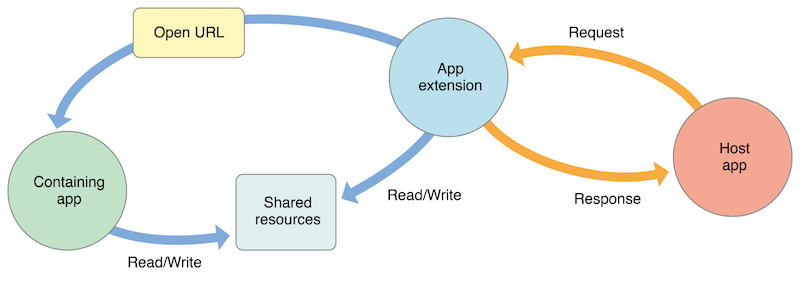

Reference
* [owasp-mastg Testing for Sensitive Functionality Exposure Through IPC (MSTG-PLATFORM-4) App Extensions Overview How do app extensions interact with other apps](https://github.com/OWASP/owasp-mastg/blob/v1.5.0/Document/0x06h-Testing-Platform-Interaction.md#how-do-app-extensions-interact-with-other-apps)

**Security Considerations**

From the security point of view it is important to note that:

* An app extension does never communicate directly with its containing app (typically, it isn't even running while the contained app extension is running).
* An app extension and the host app communicate via inter-process communication.
* An app extension's containing app and the host app don't communicate at all.
* A Today widget (and no other app extension type) can ask the system to open its containing app by calling the openURL:completionHandler: method of the NSExtensionContext class.
* Any app extension and its containing app can access shared data in a privately defined shared container.

In addition:
* App extensions cannot access some APIs, for example, HealthKit.
* They cannot receive data using AirDrop but do can send data.
* No long-running background tasks are allowed but uploads or downloads can be initiated.
* App extensions cannot access the camera or microphone on an iOS device (except for iMessage app extensions).

Reference
* [owasp-mastg Testing for Sensitive Functionality Exposure Through IPC (MSTG-PLATFORM-4) App Extensions Overview Security Considerations](https://github.com/OWASP/owasp-mastg/blob/v1.5.0/Document/0x06h-Testing-Platform-Interaction.md#security-considerations)

#### Static Analysis
The static analysis will take care of:

* Verifying if the app contains app extensions
* Determining the supported data types
* Checking data sharing with the containing app
* Verifying if the app restricts the use of app extensions

Reference
* [owasp-mastg Testing for Sensitive Functionality Exposure Through IPC (MSTG-PLATFORM-4) App extensions Static Analysis](https://github.com/OWASP/owasp-mastg/blob/v1.5.0/Document/0x06h-Testing-Platform-Interaction.md#static-analysis-3)


**Verifying if the App Contains App Extensions**

If you have the original source code you can search for all occurrences of NSExtensionPointIdentifier with Xcode (cmd+shift+f) or take a look into "Build Phases / Embed App extensions":


There you can find the names of all embedded app extensions followed by .appex, now you can navigate to the individual app extensions in the project.

If not having the original source code:

Grep for NSExtensionPointIdentifier among all files inside the app bundle (IPA or installed app):

```bash
$ grep -nr NSExtensionPointIdentifier Payload/Telegram\ X.app/
Binary file Payload/Telegram X.app//PlugIns/SiriIntents.appex/Info.plist matches
Binary file Payload/Telegram X.app//PlugIns/Share.appex/Info.plist matches
Binary file Payload/Telegram X.app//PlugIns/NotificationContent.appex/Info.plist matches
Binary file Payload/Telegram X.app//PlugIns/Widget.appex/Info.plist matches
Binary file Payload/Telegram X.app//Watch/Watch.app/PlugIns/Watch Extension.appex/Info.plist matches
```

You can also access per SSH, find the app bundle and list all inside PlugIns (they are placed there by default) or do it with objection:

```bash
ph.telegra.Telegraph on (iPhone: 11.1.2) [usb] # cd PlugIns
    /var/containers/Bundle/Application/15E6A58F-1CA7-44A4-A9E0-6CA85B65FA35/
    Telegram X.app/PlugIns

ph.telegra.Telegraph on (iPhone: 11.1.2) [usb] # ls
NSFileType      Perms  NSFileProtection    Read    Write     Name
------------  -------  ------------------  ------  -------   -------------------------
Directory         493  None                True    False     NotificationContent.appex
Directory         493  None                True    False     Widget.appex
Directory         493  None                True    False     Share.appex
Directory         493  None                True    False     SiriIntents.appex
```

We can see now the same four app extensions that we saw in Xcode before.

Reference
* [owasp-mastg Testing for Sensitive Functionality Exposure Through IPC (MSTG-PLATFORM-4) App extensions Static Analysis Verifying if the App Contains App Extensions](https://github.com/OWASP/owasp-mastg/blob/v1.5.0/Document/0x06h-Testing-Platform-Interaction.md#verifying-if-the-app-contains-app-extensions)

**Determining the Supported Data Types**

This is important for data being shared with host apps (e.g. via Share or Action Extensions). When the user selects some data type in a host app and it matches the data types define here, the host app will offer the extension. It is worth noticing the difference between this and data sharing via UIActivity where we had to define the document types, also using UTIs. An app does not need to have an extension for that. It is possible to share data using only UIActivity.

Inspect the app extension's Info.plist file and search for NSExtensionActivationRule. That key specifies the data being supported as well as e.g. maximum of items supported. For example:

```xml
<key>NSExtensionAttributes</key>
    <dict>
        <key>NSExtensionActivationRule</key>
        <dict>
            <key>NSExtensionActivationSupportsImageWithMaxCount</key>
            <integer>10</integer>
            <key>NSExtensionActivationSupportsMovieWithMaxCount</key>
            <integer>1</integer>
            <key>NSExtensionActivationSupportsWebURLWithMaxCount</key>
            <integer>1</integer>
        </dict>
    </dict>
```

Only the data types present here and not having 0 as MaxCount will be supported. However, more complex filtering is possible by using a so-called predicate string that will evaluate the UTIs given. Please refer to the [Apple App Extension Programming Guide](https://developer.apple.com/library/archive/documentation/General/Conceptual/ExtensibilityPG/ExtensionScenarios.html#//apple_ref/doc/uid/TP40014214-CH21-SW8) for more detailed information about this.

Reference
* [owasp-mastg Testing for Sensitive Functionality Exposure Through IPC (MSTG-PLATFORM-4) App extensions Static Analysis Determining the Supported Data Types](https://github.com/OWASP/owasp-mastg/blob/v1.5.0/Document/0x06h-Testing-Platform-Interaction.md#determining-the-supported-data-types)

**Checking Data Sharing with the Containing App**

Remember that app extensions and their containing apps do not have direct access to each other's containers. However, data sharing can be enabled. This is done via "[App Groups](https://developer.apple.com/library/archive/documentation/Miscellaneous/Reference/EntitlementKeyReference/Chapters/EnablingAppSandbox.html#//apple_ref/doc/uid/TP40011195-CH4-SW19)" and the [NSUserDefaults](https://developer.apple.com/documentation/foundation/nsuserdefaults) API. See this figure from [Apple App Extension Programming Guide](https://developer.apple.com/library/archive/documentation/General/Conceptual/ExtensibilityPG/ExtensionScenarios.html#//apple_ref/doc/uid/TP40014214-CH21-SW11):

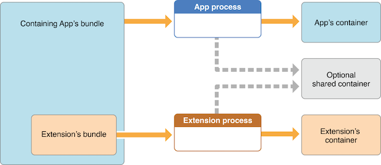

As also mentioned in the guide, the app must set up a shared container if the app extension uses the NSURLSession class to perform a background upload or download, so that both the extension and its containing app can access the transferred data.


Reference
* [owasp-mastg Testing for Sensitive Functionality Exposure Through IPC (MSTG-PLATFORM-4) App extensions Static Analysis Checking Data Sharing with the Containing App](https://github.com/OWASP/owasp-mastg/blob/v1.5.0/Document/0x06h-Testing-Platform-Interaction.md#checking-data-sharing-with-the-containing-app)

#### Verifying if the App Restricts the Use of App Extensions
It is possible to reject a specific type of app extension by using the following method:

* [application:shouldAllowExtensionPointIdentifier:](https://developer.apple.com/documentation/uikit/uiapplicationdelegate/1623122-application?language=objc)

However, it is currently only possible for "custom keyboard" app extensions (and should be verified when testing apps handling sensitive data via the keyboard like e.g. banking apps).


Reference
* [owasp-mastg Testing for Sensitive Functionality Exposure Through IPC (MSTG-PLATFORM-4) App extensions Static Analysis Verifying if the App Restricts the Use of App Extensions](https://github.com/OWASP/owasp-mastg/blob/v1.5.0/Document/0x06h-Testing-Platform-Interaction.md#verifying-if-the-app-restricts-the-use-of-app-extensions)

#### Dynamic Analysis
For the dynamic analysis we can do the following to gain knowledge without having the source code:

* Inspecting the items being shared
* Identifying the app extensions involved

Reference
* [owasp-mastg Testing for Sensitive Functionality Exposure Through IPC (MSTG-PLATFORM-4) App extensions Dynamic Analysis](https://github.com/OWASP/owasp-mastg/blob/v1.5.0/Document/0x06h-Testing-Platform-Interaction.md#dynamic-analysis-3)

**Inspecting the Items Being Shared**

For this we should hook NSExtensionContext - inputItems in the data originating app.

Following the previous example of Telegram we will now use the "Share" button on a text file (that was received from a chat) to create a note in the Notes app with it:

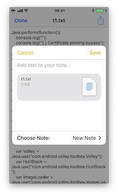

If we run a trace, we'd see the following output:

```bash
(0x1c06bb420) NSExtensionContext - inputItems
0x18284355c Foundation!-[NSExtension _itemProviderForPayload:extensionContext:]
0x1828447a4 Foundation!-[NSExtension _loadItemForPayload:contextIdentifier:completionHandler:]
0x182973224 Foundation!__NSXPCCONNECTION_IS_CALLING_OUT_TO_EXPORTED_OBJECT_S3__
0x182971968 Foundation!-[NSXPCConnection _decodeAndInvokeMessageWithEvent:flags:]
0x182748830 Foundation!message_handler
0x181ac27d0 libxpc.dylib!_xpc_connection_call_event_handler
0x181ac0168 libxpc.dylib!_xpc_connection_mach_event
...
RET: (
"<NSExtensionItem: 0x1c420a540> - userInfo:
{
    NSExtensionItemAttachmentsKey =     (
    "<NSItemProvider: 0x1c46b30e0> {types = (\n \"public.plain-text\",\n \"public.file-url\"\n)}"
    );
}"
)
```

Here we can observe that:

* This occurred under-the-hood via XPC, concretely it is implemented via a NSXPCConnection that uses the libxpc.dylib Framework.
* The UTIs included in the NSItemProvider are public.plain-text and public.file-url, the latter being included in NSExtensionActivationRule from the [Info.plist of the "Share Extension" of Telegram](https://github.com/TelegramMessenger/Telegram-iOS/blob/master/Telegram/Share/Info.plist).


Reference
* [owasp-mastg Testing for Sensitive Functionality Exposure Through IPC (MSTG-PLATFORM-4) App extensions Dynamic Analysis Inspecting the Items Being Shared](https://github.com/OWASP/owasp-mastg/blob/v1.5.0/Document/0x06h-Testing-Platform-Interaction.md#inspecting-the-items-being-shared)

**Identifying the App Extensions Involved**

You can also find out which app extension is taking care of your the requests and responses by hooking NSExtension - _plugIn:

We run the same example again:

```bash
(0x1c0370200) NSExtension - _plugIn
RET: <PKPlugin: 0x1163637f0 ph.telegra.Telegraph.Share(5.3) 5B6DE177-F09B-47DA-90CD-34D73121C785
1(2) /private/var/containers/Bundle/Application/15E6A58F-1CA7-44A4-A9E0-6CA85B65FA35
/Telegram X.app/PlugIns/Share.appex>

(0x1c0372300)  -[NSExtension _plugIn]
RET: <PKPlugin: 0x10bff7910 com.apple.mobilenotes.SharingExtension(1.5) 73E4F137-5184-4459-A70A-83
F90A1414DC 1(2) /private/var/containers/Bundle/Application/5E267B56-F104-41D0-835B-F1DAB9AE076D
/MobileNotes.app/PlugIns/com.apple.mobilenotes.SharingExtension.appex>
```

As you can see there are two app extensions involved:

* Share.appex is sending the text file (public.plain-text and public.file-url).
* com.apple.mobilenotes.SharingExtension.appex which is receiving and will process the text file.

If you want to learn more about what's happening under-the-hood in terms of XPC, we recommend to take a look at the internal calls from "libxpc.dylib". For example you can use [frida-trace](https://frida.re/docs/frida-trace/) and then dig deeper into the methods that you find more interesting by extending the automatically generated stubs.

Reference
* [owasp-mastg Testing for Sensitive Functionality Exposure Through IPC (MSTG-PLATFORM-4) App extensions Dynamic Analysis Identifying the App Extensions Involved](https://github.com/OWASP/owasp-mastg/blob/v1.5.0/Document/0x06h-Testing-Platform-Interaction.md#identifying-the-app-extensions-involved)

### UIPasteboard

#### Overview
When typing data into input fields, the clipboard can be used to copy in data. The clipboard is accessible system-wide and is therefore shared by apps. This sharing can be misused by malicious apps to get sensitive data that has been stored in the clipboard.

When using an app you should be aware that other apps might be reading the clipboard continuously, as the [Facebook app](https://www.thedailybeast.com/facebook-is-spying-on-your-clipboard) did. Before iOS 9, a malicious app might monitor the pasteboard in the background while periodically retrieving [UIPasteboard generalPasteboard].string. As of iOS 9, pasteboard content is accessible to apps in the foreground only, which reduces the attack surface of password sniffing from the clipboard dramatically. Still, copy-pasting passwords is a security risk you should be aware of, but also cannot be solved by an app.

* Preventing pasting into input fields of an app, does not prevent that a user will copy sensitive information anyway. Since the information has already been copied before the user notices that it's not possible to paste it in, a malicious app has already sniffed the clipboard.
* If pasting is disabled on password fields users might even choose weaker passwords that they can remember and they cannot use password managers anymore, which would contradict the original intention of making the app more secure.

The [UIPasteboard](https://developer.apple.com/documentation/uikit/uipasteboard) enables sharing data within an app, and from an app to other apps. There are two kinds of pasteboards:

* **systemwide general pasteboard**: for sharing data with any app. Persistent by default across device restarts and app uninstalls (since iOS 10).
* **custom / named pasteboards**: for sharing data with another app (having the same team ID as the app to share from) or with the app itself (they are only available in the process that creates them). Non-persistent by default (since iOS 10), that is, they exist only until the owning (creating) app quits.

Some security considerations:

* Users cannot grant or deny permission for apps to read the pasteboard.
* Since iOS 9, apps [cannot access the pasteboard while in background](https://developer.apple.com/forums/thread/13760), this mitigates background pasteboard monitoring. However, if the malicious app is brought to foreground again and the data remains in the pasteboard, it will be able to retrieve it programmatically without the knowledge nor the consent of the user.
* [Apple warns about persistent named pasteboards](https://developer.apple.com/documentation/uikit/uipasteboard?language=objc) and discourages their use. Instead, shared containers should be used.
* Starting in iOS 10 there is a new Handoff feature called Universal Clipboard that is enabled by default. It allows the general pasteboard contents to automatically transfer between devices. This feature can be disabled if the developer chooses to do so and it is also possible to set an expiration time and date for copied data.


Reference
* [owasp-mastg Testing for Sensitive Functionality Exposure Through IPC (MSTG-PLATFORM-4) UIPasteboard](https://github.com/OWASP/owasp-mastg/blob/v1.5.0/Document/0x06h-Testing-Platform-Interaction.md#uipasteboard)

Rulebook
* [Be aware that other apps may be continuously reading your clipboard (Required)](#be-aware-that-other-apps-may-be-continuously-reading-your-clipboard-required)
* [Notes on pasteboard security (Required)](#notes-on-pasteboard-security-required)

#### Static Analysis
The **systemwide general pasteboard** can be obtained by using [generalPasteboard](https://developer.apple.com/documentation/uikit/uipasteboard/1622106-generalpasteboard?language=objc), search the source code or the compiled binary for this method. Using the systemwide general pasteboard should be avoided when dealing with sensitive data.

**Custom pasteboards** can be created with [pasteboardWithName:create:](https://developer.apple.com/documentation/uikit/uipasteboard/1622074-pasteboardwithname?language=objc) or [pasteboardWithUniqueName](https://developer.apple.com/documentation/uikit/uipasteboard/1622087-pasteboardwithuniquename?language=objc). Verify if custom pasteboards are set to be persistent as this is deprecated since iOS 10. A shared container should be used instead.

In addition, the following can be inspected:

* Check if pasteboards are being removed with [removePasteboardWithName:](https://developer.apple.com/documentation/uikit/uipasteboard/1622072-removepasteboardwithname?language=objc), which invalidates an app pasteboard, freeing up all resources used by it (no effect for the general pasteboard).
* Check if there are excluded pasteboards, there should be a call to setItems:options: with the UIPasteboardOptionLocalOnly option.
* Check if there are expiring pasteboards, there should be a call to setItems:options: with the UIPasteboardOptionExpirationDate option.
* Check if the app swipes the pasteboard items when going to background or when terminating. This is done by some password manager apps trying to restrict sensitive data exposure.


Reference
* [owasp-mastg Testing for Sensitive Functionality Exposure Through IPC (MSTG-PLATFORM-4) UIPasteboard Static Analysis](https://github.com/OWASP/owasp-mastg/blob/v1.5.0/Document/0x06h-Testing-Platform-Interaction.md#static-analysis-4)

Rulebook
* [Notes on pasteboard security (Required)](#notes-on-pasteboard-security-required)

#### Dynamic Analysis

**Detect Pasteboard Usage**

Hook or trace the following:

* generalPasteboard for the system-wide general pasteboard.
* pasteboardWithName:create: and pasteboardWithUniqueName for custom pasteboards.

**Detect Persistent Pasteboard Usage**

Hook or trace the deprecated [setPersistent:](https://developer.apple.com/documentation/uikit/uipasteboard/1622096-setpersistent?language=objc) method and verify if it's being called.

**Monitoring and Inspecting Pasteboard Items**

When monitoring the pasteboards, there is several details that may be dynamically retrieved:

* Obtain pasteboard name by hooking pasteboardWithName:create: and inspecting its input parameters or pasteboardWithUniqueName and inspecting its return value.
* Get the first available pasteboard item: e.g. for strings use string method. Or use any of the other methods for the [standard data types](https://developer.apple.com/documentation/uikit/uipasteboard?language=objc#1654275).
* Get the number of items with numberOfItems.
* Check for existence of standard data types with the [convenience methods](https://developer.apple.com/documentation/uikit/uipasteboard?language=objc#2107142), e.g. hasImages, hasStrings, hasURLs (starting in iOS 10).
* Check for other data types (typically UTIs) with [containsPasteboardTypes: inItemSet:](https://developer.apple.com/documentation/uikit/uipasteboard/1622100-containspasteboardtypes?language=objc). You may inspect for more concrete data types like, for example an picture as public.png and public.tiff ([UTIs](http://web.archive.org/web/20190616231857/https://developer.apple.com/documentation/mobilecoreservices/uttype)) or for custom data such as com.mycompany.myapp.mytype. Remember that, in this case, only those apps that declare knowledge of the type are able to understand the data written to the pasteboard. This is the same as we have seen in the "[UIActivity Sharing](#uiactivity-sharing)" section. Retrieve them using [itemSetWithPasteboardTypes:](https://developer.apple.com/documentation/uikit/uipasteboard/1622071-itemsetwithpasteboardtypes?language=objc) and setting the corresponding UTIs.
* Check for excluded or expiring items by hooking setItems:options: and inspecting its options for UIPasteboardOptionLocalOnly or UIPasteboardOptionExpirationDate.

If only looking for strings you may want to use objection's command ios pasteboard monitor:

Hooks into the iOS UIPasteboard class and polls the generalPasteboard every 5 seconds for data. If new data is found, different from the previous poll, that data will be dumped to screen.

You may also build your own pasteboard monitor that monitors specific information as seen above.

For example, this script (inspired from the script behind [objection's pasteboard monitor](https://github.com/sensepost/objection/blob/b39ee53b5ba2e9a271797d2f3931d79c46dccfdb/agent/src/ios/pasteboard.ts)) reads the pasteboard items every 5 seconds, if there's something new it will print it:

```javascript
const UIPasteboard = ObjC.classes.UIPasteboard;
    const Pasteboard = UIPasteboard.generalPasteboard();
    var items = "";
    var count = Pasteboard.changeCount().toString();

setInterval(function () {
      const currentCount = Pasteboard.changeCount().toString();
      const currentItems = Pasteboard.items().toString();

      if (currentCount === count) { return; }

      items = currentItems;
      count = currentCount;

      console.log('[* Pasteboard changed] count: ' + count +
      ' hasStrings: ' + Pasteboard.hasStrings().toString() +
      ' hasURLs: ' + Pasteboard.hasURLs().toString() +
      ' hasImages: ' + Pasteboard.hasImages().toString());
      console.log(items);

    }, 1000 * 5);
```

In the output we can see the following:

```bash
[* Pasteboard changed] count: 64 hasStrings: true hasURLs: false hasImages: false
(
    {
        "public.utf8-plain-text" = hola;
    }
)
[* Pasteboard changed] count: 65 hasStrings: true hasURLs: true hasImages: false
(
    {
        "public.url" = "https://codeshare.frida.re/";
        "public.utf8-plain-text" = "https://codeshare.frida.re/";
    }
)
[* Pasteboard changed] count: 66 hasStrings: false hasURLs: false hasImages: true
(
    {
        "com.apple.uikit.image" = "<UIImage: 0x1c42b23c0> size {571, 264} orientation 0 scale 1.000000";
        "public.jpeg" = "<UIImage: 0x1c44a1260> size {571, 264} orientation 0 scale 1.000000";
        "public.png" = "<UIImage: 0x1c04aaaa0> size {571, 264} orientation 0 scale 1.000000";
    }
)
```

You see that first a text was copied including the string "hola", after that a URL was copied and finally a picture was copied. Some of them are available via different UTIs. Other apps will consider these UTIs to allow pasting of this data or not.

Reference
* [owasp-mastg Testing for Sensitive Functionality Exposure Through IPC (MSTG-PLATFORM-4) UIPasteboard Dynamic Analysis](https://github.com/OWASP/owasp-mastg/blob/v1.5.0/Document/0x06h-Testing-Platform-Interaction.md#dynamic-analysis-4)


### Rulebook
1. [How to validate data received as a result of Universal Link (Required)](#how-to-validate-data-received-as-a-result-of-universal-link-required)
1. [Use secure transfer protocols to protect user privacy and security (Required)](#use-secure-transfer-protocols-to-protect-user-privacy-and-security-required)
1. [If the URL contains parameters, do not trust the URL without careful sanitization and validation (Recommended)](#if-the-url-contains-parameters-do-not-trust-the-url-without-careful-sanitization-and-validation-recommended)
1. [Make sure you are not exposing sensitive information when calling other apps via universal links (Required)](#make-sure-you-are-not-exposing-sensitive-information-when-calling-other-apps-via-universal-links-required)
1. [Explicit exclusion of activity types targeted by UIActivity Sharing (Required)](#explicit-exclusion-of-activity-types-targeted-by-uiactivity-sharing-required)
1. [Always confirm when receiving files from other apps (Required)](#always-confirm-when-receiving-files-from-other-apps-required)
1. [Universal Links and Handoff (Required)](#universal-links-and-handoff-required)
1. [Be aware that other apps may be continuously reading your clipboard (Required)](#be-aware-that-other-apps-may-be-continuously-reading-your-clipboard-required)
1. [Notes on pasteboard security (Required)](#notes-on-pasteboard-security-required)

#### How to validate data received as a result of Universal Link (Required)
Universal links offer a potential attack vector into your app, so make sure to validate all URL parameters and discard any malformed URLs.

when iOS opens an app as the result of a universal link, the app receives an NSUserActivity object with an activityType value of NSUserActivityTypeBrowsingWeb. The activity object's webpageURL property contains the HTTP or HTTPS URL that the user accesses. The following example in Swift verifies exactly this before opening the URL:

```swift
func application(_ application: UIApplication, continue userActivity: NSUserActivity,
                 restorationHandler: @escaping ([UIUserActivityRestoring]?) -> Void) -> Bool {
    // ...
    if userActivity.activityType == NSUserActivityTypeBrowsingWeb, let url = userActivity.webpageURL {
        application.open(url, options: [:], completionHandler: nil)
    }

    return true
}
```

If this is violated, the following may occur.
* Vulnerable to URL scheme hijacking attacks.
* Unsafe associations between websites and apps.

#### Use secure transfer protocols to protect user privacy and security (Required)
In HTTP communication, the website does not use an SSL server certificate, so there is a risk that the content of the communication may be illegally acquired or altered. For example, if you enter personal information such as your name, address, or credit card number on an online site, there is a risk that your information will be leaked to a malicious third party. So don't use HTTP.

On the other hand, in HTTPS communication, SSL is used for encryption to enhance the security of the website.

See the rulebook sample code below for ATS enablement.

Rulebook
* [Use App Transport Security (ATS) (Required)](0x06-MASDG-Network_Communication_Requirements.md#use-app-transport-security-ats-required)

If this is violated, the following may occur.
* A man-in-the-middle attack may eavesdrop on or tamper with communication contents.

#### If the URL contains parameters, do not trust the URL without careful sanitization and validation (Recommended)
If the URL contains parameters, it is recommended not to trust the URL without careful sanitization and validation as the parameters may have been tampered with even if the URL is correct. Parameters are variables added to the end of the URL to send information to the server.

**Basic Structure of Parameters**

The key and value are given with "?" after the URL. If there are multiple keys, combine them with "&".

   Example ) `https//example.com?key=value&key=value&key=value`

Therefore, it is necessary to perform the following verification to determine whether the URL is safe.

* Is there a key other than the expected parameter?
* Are the values in the parameters as expected (within upper and lower limits of numbers, allowed characters, etc.)?
    * Contains one value per parameter
    * Only usable characters (a-z A-Z 0-9 - _ . ! ' ( ) *) must be used

If the above validation is violated, discard even if the URL is as expected.

```swift
func application(_ application: UIApplication,
                 continue userActivity: NSUserActivity,
                 restorationHandler: @escaping ([Any]?) -> Void) -> Bool {
    guard userActivity.activityType == NSUserActivityTypeBrowsingWeb,
        let incomingURL = userActivity.webpageURL,
        let components = NSURLComponents(url: incomingURL, resolvingAgainstBaseURL: true),
        let path = components.path,
        let params = components.queryItems else {
        return false
    }

    if let albumName = params.first(where: { $0.name == "albumname" })?.value,
        let photoIndex = params.first(where: { $0.name == "index" })?.value {
        // Interact with album name and photo index

        return true

    } else {
        // Handle when album and/or album name or photo index missing

        return false
    }
}
```

If this is not noted, the following may occur.
* The intended web page is not displayed. Furthermore, there is a possibility that an attacker may impersonate and gain unauthorized access unintentionally.

#### Make sure you are not exposing sensitive information when calling other apps via universal links (Required)
Your app may call other apps via Universal Links simply to cause some action or transfer information, but you should make sure that you are not exposing sensitive information. .

Given the original source code, you can search for the openURL:options: completionHandler: method to see what data is processed.

Note that the openURL:options:completionHandler: method is used not only for opening universal links, but also for calling custom URL schemes.

Telegram app example:

```swift
}, openUniversalUrl: { url, completion in
    if #available(iOS 10.0, *) {
        var parsedUrl = URL(string: url)
        if let parsed = parsedUrl {
            if parsed.scheme == nil || parsed.scheme!.isEmpty {
                parsedUrl = URL(string: "https://\(url)")
            }
        }

        if let parsedUrl = parsedUrl {
            return UIApplication.shared.open(parsedUrl,
                        options: [UIApplicationOpenURLOptionUniversalLinksOnly: true as NSNumber],
                        completionHandler: { value in completion.completion(value)}
            )
```

Note how the app adapts the scheme to "https" before opening it and how it uses the option UIApplicationOpenURLOptionUniversalLinksOnly: true that [opens the URL only if the URL is a valid universal link and there is an installed app capable of opening that URL](https://developer.apple.com/documentation/uikit/uiapplicationopenurloptionuniversallinksonly?language=objc).

If this is violated, the following may occur.
* Failure to do so may result in the disclosure of confidential information.

#### Explicit exclusion of activity types targeted by UIActivity Sharing (Required)

Data can be shared via UIActivity, but it is possible to explicitly exclude target activity types. By specifying this, it is possible to prevent unnecessary data sharing to other applications.

However, since the number of activity types that can be excluded may increase with OS version upgrades, it is recommended to reconfirm the items to be excluded in the new OS.

Code to exclude:
```swift
import UIKit
import Accounts

class ShareViewController: UIViewController {

    @IBAction func share(sender: AnyObject) {
        // Items to share
        let shareText = "Hello world"
        let shareWebsite = NSURL(string: "https://www.apple.com/jp/watch/")!
        
        let activityItems = [shareText, shareWebsite] as [Any]
        
        // Initialization process
        let activityVC = UIActivityViewController(activityItems: activityItems, applicationActivities: nil)
        
        // Activity type exclusions
        let excludedActivityTypes = [
            UIActivity.ActivityType.postToFacebook,
            UIActivity.ActivityType.postToTwitter,
            UIActivity.ActivityType.saveToCameraRoll,
            UIActivity.ActivityType.print
        ]
        
        activityVC.excludedActivityTypes = excludedActivityTypes
        
        // Show UIActivityViewController
        self.present(activityVC, animated: true, completion: nil)
    }
    override func viewDidLoad() {
        super.viewDidLoad()
    }

}
```

**Activity types that can be specified in the list**

* UIActivityTypeAddToReadingList:
Add URL to Safari Reading List
* UIActivityTypeAirDrop:
Use content with AirDrop
* UIActivityTypeAssignToContact:
Assign image to contact
* UIActivityTypeCollaborationCopyLink:
\* No description in Developer
* UIActivityTypeCollaborationInviteWithLink:
\* No description in Developer
* UIActivityTypeCopyToPasteboard:
Post content to the pasteboard
* UIActivityTypeMail:
Post content to new email message
* UIActivityTypeMarkupAsPDF:
Mark up your content as a PDF file
* UIActivityTypeMessage:
Post content to messaging apps
* UIActivityTypeOpenInIBooks:
Open content in iBooks
* UIActivityTypePostToFacebook:
Post the provided content to the user's wall on Facebook
* UIActivityTypePostToFlickr:
Post the provided image to the user's girlfriend's Flickr account
* UIActivityTypePostToTencentWeibo:
Post the provided content to the user's girlfriend's Tencent Weibo feed
* UIActivityTypePostToTwitter:
Post the provided content to the user's girlfriend's Twitter feed
* UIActivityTypePostToVimeo:
Posting the provided video to the user's girlfriend's Vimeo account
* UIActivityTypePostToWeibo:
Post the provided content to the user's girlfriend's Weibo feed
* UIActivityTypePrint:
Output the provided content
* UIActivityTypeSaveToCameraRoll:
Assign an image or video to a user's camera roll
* UIActivityTypeSharePlay:
Making Contributed Content Available Through SharePlay


If this is violated, the following may occur.

* There is a possibility of sending confidential information etc. to an unexpected sharing application side.


#### Always confirm when receiving files from other apps (Required)
Confirm on the source that the file name of the received file and the character string data in the contents are not directly used as DB queries.

* if the app declares custom document types by looking into Exported/Imported UTIs ("Info" tab of the Xcode project). The list of all system declared UTIs (Uniform Type Identifiers) can be found in the [archived Apple Developer Documentation](https://developer.apple.com/library/archive/documentation/Miscellaneous/Reference/UTIRef/Articles/System-DeclaredUniformTypeIdentifiers.html#//apple_ref/doc/uid/TP40009259).

* if the app specifies any document types that it can open by looking into Document Types ("Info" tab of the Xcode project). If present, they consist of name and one or more UTIs that represent the data type (e.g. "public.png" for PNG files). iOS uses this to determine if the app is eligible to open a given document (specifying Exported/Imported UTIs is not enough).

* if the app properly verifies the received data by looking into the implementation of [application:openURL:options:](https://developer.apple.com/documentation/uikit/uiapplicationdelegate/1623112-application?language=objc) in the app delegate.


Below is a sample code that determines the BundleId of the application that sent the URL request in sourceApplication.
```swift
import UIKit

@UIApplicationMain
class AppDelegate: UIResponder, UIApplicationDelegate
{
    // omit

    func application(_ app: UIApplication, open url: URL, options: [UIApplication.OpenURLOptionsKey : Any] = [:]) -> Bool {
        guard let sourceApplication = options[.sourceApplication] as? String else {
            return false
        }

        if sourceApplication.hasPrefix("--BundleId of other apps--") {
            // Receive query parameters and perform various processing
            // ...
        }

        return true
    }
}
```

If not having the source code you can still take a look into the Info.plist file and search for:

* UTExportedTypeDeclarations/UTImportedTypeDeclarations if the app declares exported/imported custom document types.
* CFBundleDocumentTypes to see if the app specifies any document types that it can open.

A very complete explanation about the use of these keys can be found on [Stackoverflow](https://stackoverflow.com/questions/21937978/what-are-utimportedtypedeclarations-and-utexportedtypedeclarations-used-for-on-i).

Let's see a real-world example. We will take a File Manager app and take a look at these keys. We used [objection](https://github.com/sensepost/objection) here to read the Info.plist file.

```bash
objection --gadget SomeFileManager run ios plist cat Info.plist
```

Note that this is the same as if we would retrieve the IPA from the phone or accessed via e.g. SSH and navigated to the corresponding folder in the IPA / app sandbox. However, with objection we are just one command away from our goal and this can be still considered static analysis.

The first thing we noticed is that app does not declare any imported custom document types but we could find a couple of exported ones:

```javascript
UTExportedTypeDeclarations =     (
    {
UTTypeConformsTo =             (
    "public.data"
);
UTTypeDescription = "SomeFileManager Files";
UTTypeIdentifier = "com.some.filemanager.custom";
UTTypeTagSpecification =             {
    "public.filename-extension" =                 (
        ipa,
        deb,
        zip,
        rar,
        tar,
        gz,
        ...
        key,
        pem,
        p12,
        cer
    );
};
}
);
```

The app also declares the document types it opens as we can find the key CFBundleDocumentTypes:

```javascript
CFBundleDocumentTypes =     (
        {
        ...
        CFBundleTypeName = "SomeFileManager Files";
        LSItemContentTypes =             (
            "public.content",
            "public.data",
            "public.archive",
            "public.item",
            "public.database",
            "public.calendar-event",
            ...
        );
    }
);
```

We can see that this File Manager will try to open anything that conforms to any of the UTIs listed in LSItemContentTypes and it's ready to open files with the extensions listed in UTTypeTagSpecification/"public.filename-extension". Please take a note of this because it will be useful if you want to search for vulnerabilities when dealing with the different types of files when performing dynamic analysis.

If this is violated, the following may occur.
* If you use the string as it is, SQL injection may occur.
* If the character string is used in WebView as it is, there is a possibility that an unauthorized authentication input site etc. will be displayed.

#### Universal Links and Handoff (Required)
Implement application:continueUserActivity:restorationHandler: method of AppDelegate when the application is launched with universal link. Note that this method is called not only by Universal Links, but also by SearchAPI or Handoff, so it is necessary to check the activityType.

The sample code below is the universal link check process.
```swift
import UIKit

extension AppDelegate {
  func application(application: UIApplication, continueUserActivity userActivity: NSUserActivity, restorationHandler: ([AnyObject]?) -> Void) -> Bool {
      if userActivity.activityType == NSUserActivityTypeBrowsingWeb {
          // Check activity type
          // Universal Links
          if UniversalLinkHandler.handleUniversalLink(userActivity.webpageURL) == false {
              UIApplication.sharedApplication().openURL(userActivity.webpageURL!)
                print(userActivity.activityType)
          }
          else {
              print(userActivity.activityType)
          }
      }
      return true
    }
}
```

The sample code below is Handoff check process.
```swift
import UIKit

extension AppDelegate {
  func handoffApplication(application: UIApplication, continueUserActivity userActivity: NSUserActivity, restorationHandler: ([AnyObject]?) -> Void) -> Bool {
      if userActivity.activityType == NSUserActivityTypeBrowsingWeb {
          // Check activity type
          print(userActivity.activityType)
          return true
      } else if userActivity.activityType == NSUserActivity.myHandoffActivityType {
          // Restore state for userActivity and userInfo
          
          return true
      }

      return false
  }


  override func updateUserActivityState(_ activity: NSUserActivity) {
      if activity.activityType == NSUserActivity.myHandoffActivityType {
          let updateDict:  [AnyHashable : Any] = [
              "shape-type" : "com.example.myapp.create-shape",
              "activity-version" : 1
          ]
          activity.addUserInfoEntries(from: updateDict)
      }
  }

}


extension NSUserActivity {

    public static let myHandoffActivityType = "com.myapp.name.my-activity-type"

    public static var myActivity: NSUserActivity {
        let activity = NSUserActivity(activityType: myHandoffActivityType)
        activity.isEligibleForHandoff = true
        activity.requiredUserInfoKeys = ["shape-type"]
        activity.title = NSLocalizedString("Creating shape", comment: "Creating shape activity")

        return activity
    }
}
```

If this is violated, the following may occur.
* Vulnerable to URL scheme hijacking attacks.
* Unsafe associations between websites and apps.

#### Be aware that other apps may be continuously reading your clipboard (Required)

UIPasteboard allows you to copy/paste to clipboard.
It is possible to get the character string copied in the application in another application. It is important not to copy sensitive information such as passwords.

How to copy with UIPasteboard:
```swift
class UIPasteboardSample {

    func uiPasteboardSample() {
        //  System-wide general pasteboard
        UIPasteboard.general.string = "copy"

        // Get the string in UIPasteboard.general.string (shared by other apps)
        let parst = UIPasteboard.general.string

        // custom / named pasteboard
        guard let customPasteboard = UIPasteboard(name: UIPasteboard.Name(rawValue: "myData"), create: false) else {
            return
        }
        customPasteboard.string = "aaaa"
    }
}
```

If this is violated, the following may occur.
* A malicious app can exploit shared state to obtain sensitive data stored on the clipboard.

#### Notes on pasteboard security (Required)

[Apple warns about persistent named pasteboards](https://developer.apple.com/documentation/uikit/uipasteboard?language=objc) and discourages their use.

When you get text copied from another app from iOS14 from the clipboard, an alert is displayed at the top of the screen due to security concerns.
His UIPasteboard, where the universal clipboard was introduced, adds two of his features to reduce security risks:

* Restrict scope to local only
* set expiration date

This can be used when the terminals are close to each other and each is set as follows.
   * Signed in to iCloud with the same Apple ID on each device.
   * Bluetooth is turned on on each device.
   * Wi-Fi is turned on on each device.
   * Handoff is turned on on each device.

 
Restrict scope to local only
An example of restricting scope to local only would be:

```swift
import UIKit

class Pasteboard: UIViewController {

    override func viewDidLoad() {
        super.viewDidLoad()
        
        let pasteboard = UIPasteboard.general
        pasteboard.setItems([["key" : "value"]], options: [UIPasteboard.OptionsKey.localOnly : true])
    }
}
```

Set an expiration date
In the example below, after 24 hours have passed since copying, the copied data is automatically deleted.

```swift
import UIKit

class Pasteboard: UIViewController {

    override func viewDidLoad() {
        super.viewDidLoad()
        
        let options: [UIPasteboard.OptionsKey : Any] = [.expirationDate: Date().addingTimeInterval(60 * 60 * 24)]
        UIPasteboard.general.setItems([["key" : "value"]], options: options)
    }
}
```

If this is violated, the following may occur.
* A malicious app can exploit shared state to obtain sensitive data stored on the clipboard.


## MSTG-PLATFORM-5
JavaScript is disabled in WebViews unless explicitly required.

WebViews are in-app browser components for displaying interactive web content. They can be used to embed web content directly into an app's user interface. iOS WebViews support JavaScript execution by default, so script injection and Cross-Site Scripting attacks can affect them.

Reference
* [owasp-mastg Testing iOS WebViews (MSTG-PLATFORM-5)](https://github.com/OWASP/owasp-mastg/blob/v1.5.0/Document/0x06h-Testing-Platform-Interaction.md#testing-ios-webviews-mstg-platform-5)

### UIWebView
[UIWebView](https://developer.apple.com/documentation/uikit/uiwebview) is deprecated starting on iOS 12 and should not be used. Make sure that either WKWebView or SFSafariViewController are used to embed web content. In addition to that, JavaScript cannot be disabled for UIWebView which is another reason to refrain from using it.

Reference
* [owasp-mastg Testing iOS WebViews (MSTG-PLATFORM-5) Overview UIWebView](https://github.com/OWASP/owasp-mastg/blob/v1.5.0/Document/0x06h-Testing-Platform-Interaction.md#uiwebview)

Rulebook
* [Do not use UIWebView as it has been deprecated since iOS 12 (Required)](#do-not-use-uiwebview-as-it-has-been-deprecated-since-ios-12-required)

### WKWebView
[WKWebView](https://developer.apple.com/documentation/webkit/wkwebview) was introduced with iOS 8 and is the appropriate choice for extending app functionality, controlling displayed content (i.e., prevent the user from navigating to arbitrary URLs) and customizing. WKWebView also increases the performance of apps that are using WebViews significantly, through the Nitro JavaScript engine [#thiel2].

WKWebView comes with several security advantages over UIWebView:

* JavaScript is enabled by default but thanks to the javaScriptEnabled property of WKWebView, it can be completely disabled, preventing all script injection flaws.
* The JavaScriptCanOpenWindowsAutomatically can be used to prevent JavaScript from opening new windows, such as pop-ups.
* The hasOnlySecureContent property can be used to verify resources loaded by the WebView are retrieved through encrypted connections.
* WKWebView implements out-of-process rendering, so memory corruption bugs won't affect the main app process.

A JavaScript Bridge can be enabled when using WKWebViews (and UIWebViews). See Section "[Bridge between JavaScript and native in WebView](#bridge-between-javascript-and-native-in-webview)" below for more information.


Reference
* [owasp-mastg Testing iOS WebViews (MSTG-PLATFORM-5) Overview WKWebView](https://github.com/OWASP/owasp-mastg/blob/v1.5.0/Document/0x06h-Testing-Platform-Interaction.md#wkwebview)


Rulebook
* [How to use WKWebView (Required)](#how-to-use-wkwebview-required)

### SFSafariViewController
[SFSafariViewController](https://developer.apple.com/documentation/safariservices/sfsafariviewcontroller) is available starting on iOS 9 and should be used to provide a generalized web viewing experience. These WebViews can be easily spotted as they have a characteristic layout which includes the following elements:

* A read-only address field with a security indicator.
* An Action ("Share") button.
* A Done button, back and forward navigation buttons, and a "Safari" button to open the page directly in Safari.


There are a couple of things to consider:

* JavaScript cannot be disabled in SFSafariViewController and this is one of the reasons why the usage of WKWebView is recommended when the goal is extending the app's user interface.
* SFSafariViewController also shares cookies and other website data with Safari.
* The user's activity and interaction with a SFSafariViewController are not visible to the app, which cannot access AutoFill data, browsing history, or website data.
* According to the App Store Review Guidelines, SFSafariViewControllers may not be hidden or obscured by other views or layers.

This should be sufficient for an app analysis and therefore, SFSafariViewControllers are out of scope for the Static and Dynamic Analysis sections.

Reference
* [owasp-mastg Testing iOS WebViews (MSTG-PLATFORM-5) Overview SFSafariViewController](https://github.com/OWASP/owasp-mastg/blob/v1.5.0/Document/0x06h-Testing-Platform-Interaction.md#sfsafariviewcontroller)

Rulebook
* [How to use SFSafariViewController (Required)](#how-to-use-sfsafariviewcontroller-required)


### Safari Web Inspector
Enabling [Safari web inspection](https://developer.apple.com/library/archive/documentation/AppleApplications/Conceptual/Safari_Developer_Guide/GettingStarted/GettingStarted.html) on iOS allows you to inspect the contents of a WebView remotely from a macOS device and it does not require a jailbroken iOS device. Enabling the Safari Web Inspector is especially interesting in applications that expose native APIs using a JavaScript bridge, for example in hybrid applications.

To activate the web inspection you have to follow these steps:

1. On the iOS device open the Settings app: Go to **Safari** -> **Advanced** and toggle on Web Inspector.
2. On the macOS device, open Safari: in the menu bar, go to **Safari** -> **Preferences** -> **Advanced** and enable Show Develop menu in menu bar.
3. Connect your iOS device to the macOS device and unlock it: the iOS device name should appear in the Develop menu.
4. (If not yet trusted) On macOS's Safari, go to the Develop menu, click on the iOS device name, then on "Use for Development" and enable trust.

To open the web inspector and debug a WebView:
1. In iOS, open the app and navigate to the screen that should contain a WebView.
2. In macOS Safari, go to **Developer** -> **'iOS Device Name'** and you should see the name of the WebView based context. Click on it to open the Web Inspector.

Now you're able to debug the WebView as you would with a regular web page on your desktop browser.


Reference
* [owasp-mastg Testing iOS WebViews (MSTG-PLATFORM-5) Overview Safari Web Inspector](https://github.com/OWASP/owasp-mastg/blob/v1.5.0/Document/0x06h-Testing-Platform-Interaction.md#safari-web-inspector)

Rulebook
* [How to use WKWebView (Required)](#how-to-use-wkwebview-required)
* [How to use SFSafariViewController (Required)](#how-to-use-sfsafariviewcontroller-required)

### Static Analysis
For the static analysis we will focus mostly on the following points having UIWebView and WKWebView under scope.

* Identifying WebView usage
* Testing JavaScript configuration
* Testing for mixed content
* Testing for WebView URI manipulation


Reference
* [owasp-mastg Testing iOS WebViews (MSTG-PLATFORM-5) Static Analysis](https://github.com/OWASP/owasp-mastg/blob/v1.5.0/Document/0x06h-Testing-Platform-Interaction.md#static-analysis-6)

#### Identifying WebView Usage
Look out for usages of the above mentioned WebView classes by searching in Xcode.

In the compiled binary you can search in its symbols or strings like this:

**UIWebView**

```bash
$ rabin2 -zz ./WheresMyBrowser | egrep "UIWebView$"
489 0x0002fee9 0x10002fee9   9  10 (5.__TEXT.__cstring) ascii UIWebView
896 0x0003c813 0x0003c813  24  25 () ascii @_OBJC_CLASS_$_UIWebView
1754 0x00059599 0x00059599  23  24 () ascii _OBJC_CLASS_$_UIWebView
```

**WKWebView**

```bash
$ rabin2 -zz ./WheresMyBrowser | egrep "WKWebView$"
490 0x0002fef3 0x10002fef3   9  10 (5.__TEXT.__cstring) ascii WKWebView
625 0x00031670 0x100031670  17  18 (5.__TEXT.__cstring) ascii unwindToWKWebView
904 0x0003c960 0x0003c960  24  25 () ascii @_OBJC_CLASS_$_WKWebView
1757 0x000595e4 0x000595e4  23  24 () ascii _OBJC_CLASS_$_WKWebView
```

Alternatively you can also search for known methods of these WebView classes. For example, search for the method used to initialize a WKWebView ([init(frame:configuration:)](https://developer.apple.com/documentation/webkit/wkwebview/1414998-init)):

```bash
$ rabin2 -zzq ./WheresMyBrowser | egrep "WKWebView.*frame"
0x5c3ac 77 76 __T0So9WKWebViewCABSC6CGRectV5frame_So0aB13ConfigurationC13configurationtcfC
0x5d97a 79 78 __T0So9WKWebViewCABSC6CGRectV5frame_So0aB13ConfigurationC13configurationtcfcTO
0x6b5d5 77 76 __T0So9WKWebViewCABSC6CGRectV5frame_So0aB13ConfigurationC13configurationtcfC
0x6c3fa 79 78 __T0So9WKWebViewCABSC6CGRectV5frame_So0aB13ConfigurationC13configurationtcfcTO
```

You can also demangle it:

```bash
$ xcrun swift-demangle __T0So9WKWebViewCABSC6CGRectV5frame_So0aB13ConfigurationC13configurationtcfcTO

---> @nonobjc __C.WKWebView.init(frame: __C_Synthesized.CGRect,
                                configuration: __C.WKWebViewConfiguration) -> __C.WKWebView
```

Reference
* [owasp-mastg Testing iOS WebViews (MSTG-PLATFORM-5) Static Analysis Identifying WebView Usage](https://github.com/OWASP/owasp-mastg/blob/v1.5.0/Document/0x06h-Testing-Platform-Interaction.md#identifying-webview-usage)

Rulebook
* [How to use WKWebView (Required)](#how-to-use-wkwebview-required)

#### Testing JavaScript Configuration
First of all, remember that JavaScript cannot be disabled for UIWebVIews.

For WKWebViews, as a best practice, JavaScript should be disabled unless it is explicitly required. To verify that JavaScript was properly disabled search the project for usages of WKPreferences and ensure that the [javaScriptEnabled](https://developer.apple.com/documentation/webkit/wkpreferences/1536203-javascriptenabled) property is set to false:

```default
let webPreferences = WKPreferences()
webPreferences.javaScriptEnabled = false // Note that javaScriptEnabled is now deprecated.
```

If only having the compiled binary you can search for this in it:

```bash
$ rabin2 -zz ./WheresMyBrowser | grep -i "javascriptenabled" // Note that javaScriptEnabled is now deprecated.
391 0x0002f2c7 0x10002f2c7  17  18 (4.__TEXT.__objc_methname) ascii javaScriptEnabled
392 0x0002f2d9 0x10002f2d9  21  22 (4.__TEXT.__objc_methname) ascii setJavaScriptEnabled:
```

If user scripts were defined, they will continue running as the javaScriptEnabled property won't affect them. See [WKUserContentController](https://developer.apple.com/documentation/webkit/wkusercontentcontroller) and [WKUserScript](https://developer.apple.com/documentation/webkit/wkuserscript) for more information on injecting user scripts to WKWebViews.


Reference
* [owasp-mastg Testing iOS WebViews (MSTG-PLATFORM-5) Static Analysis Testing JavaScript Configuration](https://github.com/OWASP/owasp-mastg/blob/v1.5.0/Document/0x06h-Testing-Platform-Interaction.md#testing-javascript-configuration)


Rulebook
* [How to use WKWebView (Required)](#how-to-use-wkwebview-required)
* [Disable JavaScript unless explicitly required (Recommended)](#disable-javascript-unless-explicitly-required-recommended)


#### Testing for Mixed Content
In contrast to UIWebViews, when using WKWebViews it is possible to detect [mixed content](https://web.dev/fixing-mixed-content/) (HTTP content loaded from a HTTPS page). By using the method [hasOnlySecureContent](https://developer.apple.com/documentation/webkit/wkwebview/1415002-hasonlysecurecontent) it can be verified whether all resources on the page have been loaded through securely encrypted connections. This example from [#thiel2] (see page 159 and 160) uses this to ensure that only content loaded via HTTPS is shown to the user, otherwise an alert is displayed telling the user that mixed content was detected.

In the compiled binary:

```bash
$ rabin2 -zz ./WheresMyBrowser | grep -i "hasonlysecurecontent"

# nothing found
```

In this case, the app does not make use of this.

In addition, if you have the original source code or the IPA, you can inspect the embedded HTML files and verify that they do not include mixed content. Search for http:// in the source and inside tag attributes, but remember that this might give false positives as, for example, finding an anchor tag `<a>` that includes a http:// inside its href attribute does not always present a mixed content issue. Learn more about mixed content in the [MDN Web Docs](https://developer.mozilla.org/en-US/docs/Web/Security/Mixed_content).

Reference
* [owasp-mastg Testing iOS WebViews (MSTG-PLATFORM-5) Static Analysis Testing for Mixed Content](https://github.com/OWASP/owasp-mastg/blob/v1.5.0/Document/0x06h-Testing-Platform-Interaction.md#testing-for-mixed-content)


Rulebook
* [How to use WKWebView (Required)](#how-to-use-wkwebview-required)


### Dynamic Analysis
For the dynamic analysis we will address the same points from the static analysis.

* Enumerating WebView instances
* Checking if JavaScript is enabled
* Verifying that only secure content is allowed

It is possible to identify WebViews and obtain all their properties on runtime by performing dynamic instrumentation. This is very useful when you don't have the original source code.

For the following examples, we will keep using the ["Where's My Browser?"](https://github.com/authenticationfailure/WheresMyBrowser.iOS/) app and Frida REPL.

Reference
* [owasp-mastg Testing iOS WebViews (MSTG-PLATFORM-5) Dynamic Analysis](https://github.com/OWASP/owasp-mastg/blob/v1.5.0/Document/0x06h-Testing-Platform-Interaction.md#dynamic-analysis-6)

#### Enumerating WebView Instances
Once you've identified a WebView in the app, you may inspect the heap in order to find instances of one or several of the WebViews that we have seen above.

For example, if you use Frida you can do so by inspecting the heap via "ObjC.choose()"

```javascript
ObjC.choose(ObjC.classes['UIWebView'], {
  onMatch: function (ui) {
    console.log('onMatch: ', ui);
    console.log('URL: ', ui.request().toString());
  },
  onComplete: function () {
    console.log('done for UIWebView!');
  }
});

ObjC.choose(ObjC.classes['WKWebView'], {
  onMatch: function (wk) {
    console.log('onMatch: ', wk);
    console.log('URL: ', wk.URL().toString());
  },
  onComplete: function () {
    console.log('done for WKWebView!');
  }
});

ObjC.choose(ObjC.classes['SFSafariViewController'], {
  onMatch: function (sf) {
    console.log('onMatch: ', sf);
  },
  onComplete: function () {
    console.log('done for SFSafariViewController!');
  }
});
```

For the UIWebView and WKWebView WebViews we also print the associated URL for the sake of completion.

In order to ensure that you will be able to find the instances of the WebViews in the heap, be sure to first navigate to the WebView you've found. Once there, run the code above, e.g. by copying into the Frida REPL:

```bash
$ frida -U com.authenticationfailure.WheresMyBrowser

# copy the code and wait ...

onMatch:  <UIWebView: 0x14fd25e50; frame = (0 126; 320 393);
                autoresize = RM+BM; layer = <CALayer: 0x1c422d100>>
URL:  <NSMutableURLRequest: 0x1c000ef00> {
  URL: file:///var/mobile/Containers/Data/Application/A654D169-1DB7-429C-9DB9-A871389A8BAA/
          Library/UIWebView/scenario1.html, Method GET, Headers {
    Accept =     (
        "text/html,application/xhtml+xml,application/xml;q=0.9,*/*;q=0.8"
    );
    "Upgrade-Insecure-Requests" =     (
        1
    );
    "User-Agent" =     (
        "Mozilla/5.0 (iPhone; CPU iPhone ... AppleWebKit/604.3.5 (KHTML, like Gecko) Mobile/..."
    );
} }
```

Now we quit with q and open another WebView (WKWebView in this case). It also gets detected if we repeat the previous steps:

```bash
$ frida -U com.authenticationfailure.WheresMyBrowser

# copy the code and wait ...

onMatch:  <WKWebView: 0x1508b1200; frame = (0 0; 320 393); layer = <CALayer: 0x1c4238f20>>
URL:  file:///var/mobile/Containers/Data/Application/A654D169-1DB7-429C-9DB9-A871389A8BAA/
            Library/WKWebView/scenario1.html
```

We will extend this example in the following sections in order to get more information from the WebViews. We recommend to store this code to a file, e.g. webviews_inspector.js and run it like this:

```bash
frida -U com.authenticationfailure.WheresMyBrowser -l webviews_inspector.js
```


Reference
* [owasp-mastg Testing iOS WebViews (MSTG-PLATFORM-5) Dynamic Analysis Enumerating WebView Instances](https://github.com/OWASP/owasp-mastg/blob/v1.5.0/Document/0x06h-Testing-Platform-Interaction.md#enumerating-webview-instances)

#### Checking if JavaScript is Enabled
Remember that if a UIWebView is being used, JavaScript is enabled by default and there's no possibility to disable it.

For WKWebView, you should verify if JavaScript is enabled. Use [javaScriptEnabled](https://developer.apple.com/documentation/webkit/wkpreferences/1536203-javascriptenabled) from WKPreferences for this.

Extend the previous script with the following line:

```javascript
ObjC.choose(ObjC.classes['WKWebView'], {
  onMatch: function (wk) {
    console.log('onMatch: ', wk);
    console.log('javaScriptEnabled:', wk.configuration().preferences().javaScriptEnabled()); // Note that javaScriptEnabled is now deprecated.
//...
  }
});
```

The output shows now that, in fact, JavaScript is enabled:

```bash
$ frida -U com.authenticationfailure.WheresMyBrowser -l webviews_inspector.js

onMatch:  <WKWebView: 0x1508b1200; frame = (0 0; 320 393); layer = <CALayer: 0x1c4238f20>>

javaScriptEnabled:  true
```

Reference
* [owasp-mastg Testing iOS WebViews (MSTG-PLATFORM-5) Dynamic Analysis Checking if JavaScript is Enabled](https://github.com/OWASP/owasp-mastg/blob/v1.5.0/Document/0x06h-Testing-Platform-Interaction.md#checking-if-javascript-is-enabled)


Rulebook
* [How to use WKWebView (Required)](#how-to-use-wkwebview-required)


#### Verifying that Only Secure Content is Allowed
UIWebView's do not provide a method for this. However, you may inspect if the system enables the "Upgrade-Insecure-Requests" CSP (Content Security Policy) directive by calling the request method of each UIWebView instance ("Upgrade-Insecure-Requests" [should be available starting on iOS 10](https://www.thesslstore.com/blog/ios-10-will-support-upgrade-insecure-requests/) which included a new version of WebKit, the browser engine powering the iOS WebViews). See an example in the previous section "[Enumerating WebView Instances](https://github.com/OWASP/owasp-mastg/blob/v1.5.0/Document/0x06h-Testing-Platform-Interaction.md#enumerating-webview-instances)".

For WKWebView's, you may call the method [hasOnlySecureContent](https://developer.apple.com/documentation/webkit/wkwebview/1415002-hasonlysecurecontent) for each of the WKWebViews found in the heap. Remember to do so once the WebView has loaded.

Extend the previous script with the following line:

```javascript
ObjC.choose(ObjC.classes['WKWebView'], {
  onMatch: function (wk) {
    console.log('onMatch: ', wk);
    console.log('hasOnlySecureContent: ', wk.hasOnlySecureContent().toString());
    //...
      }
    });
```

The output shows that some of the resources on the page have been loaded through insecure connections:

```bash
$ frida -U com.authenticationfailure.WheresMyBrowser -l webviews_inspector.js

onMatch:  <WKWebView: 0x1508b1200; frame = (0 0; 320 393); layer = <CALayer: 0x1c4238f20>>

hasOnlySecureContent:  false
```


Reference
* [owasp-mastg Testing iOS WebViews (MSTG-PLATFORM-5) Dynamic Analysis Verifying that Only Secure Content is Allowed](https://github.com/OWASP/owasp-mastg/blob/v1.5.0/Document/0x06h-Testing-Platform-Interaction.md#verifying-that-only-secure-content-is-allowed)


Rulebook
* [How to use WKWebView (Required)](#how-to-use-wkwebview-required)
* [After loading the WKWebView, verify that the loaded resource was obtained over an encrypted connection with the hasOnlySecureContent method (Required)](#after-loading-the-wkwebview-verify-that-the-loaded-resource-was-obtained-over-an-encrypted-connection-with-the-hasonlysecurecontent-method-required)


#### Testing for WebView URI Manipulation
Make sure that the WebView's URI cannot be manipulated by the user in order to load other types of resources than necessary for the functioning of the WebView. This can be specifically dangerous when the WebView's content is loaded from the local file system, allowing the user to navigate to other resources within the application.


Reference
* [owasp-mastg Testing iOS WebViews (MSTG-PLATFORM-5) Dynamic Analysis Testing for WebView URI Manipulation](https://github.com/OWASP/owasp-mastg/blob/v1.5.0/Document/0x06h-Testing-Platform-Interaction.md#testing-for-webview-uri-manipulation)


### Rulebook
1. [Do not use UIWebView as it has been deprecated since iOS 12 (Required)](#do-not-use-uiwebview-as-it-has-been-deprecated-since-ios-12-required)
1. [How to use WKWebView (Required)](#how-to-use-wkwebview-required)
1. [Disable JavaScript unless explicitly required (Recommended)](#disable-javascript-unless-explicitly-required-recommended)
1. [After loading the WKWebView, verify that the loaded resource was obtained over an encrypted connection with the hasOnlySecureContent method (Required)](#after-loading-the-wkwebview-verify-that-the-loaded-resource-was-obtained-over-an-encrypted-connection-with-the-hasonlysecurecontent-method-required)
1. [How to use SFSafariViewController (Required)](#how-to-use-sfsafariviewcontroller-required)

#### Do not use UIWebView as it has been deprecated since iOS 12 (Required)
Since UIWebView has been abolished since iOS 12, it is necessary to use WKWebView or SFSafariViewController.

Refer to the following for whether to use WKWebView or SFSafariViewController.
* [How to use WKWebView (Required)](#how-to-use-wkwebview-required)
* [How to use SFSafariViewController (Required)](#how-to-use-sfsafariviewcontroller-required)

\* There is no sample code because it is a deprecated rule.

If this is violated, the following may occur.
* App submissions, uploads to App Store Connect, and TestFlight are no longer possible.

#### How to use WKWebView (Required)

WKWebView is part of the WebKit framework.
WKWebView lets you seamlessly integrate web content into your app's UI. You can display all or part of web content directly within your app by loading views that work with existing HTML , CSS , and JavaScript content.

Since JavaScript cannot be disabled in SFSafariViewController , it is recommended to use WKWebView if the purpose is to extend the user interface of the application.

WKWebView implementation:
```swift
import UIKit
import WebKit

class ViewController: UIViewController, WKUIDelegate {
    
    var webView: WKWebView!
    
    override func loadView() {
        let webConfiguration = WKWebViewConfiguration()
        webView = WKWebView(frame: .zero, configuration: webConfiguration)
        webView.uiDelegate = self
        view = webView
    }

    override func viewDidLoad() {
        super.viewDidLoad()
        
        let myURL = URL(string:"https://www.apple.com")
        let myRequest = URLRequest(url: myURL!)
        webView.load(myRequest)
    }
}
```

If this is violated, the following may occur.
* Vulnerable to script injection if JavaScript usage is enabled.

#### Disable JavaScript unless explicitly required (Recommended)
WKWebView has stronger cooperation with JavaScript than UIWebView. By using WKWebView, it is now possible to easily load and execute application-specific JavaScript on an existing web page.

The default value of javaScriptEnable is true. Setting this property to false disables any JavaScript loaded or executed by the web page. This setting has no effect on user scripts. This item is currently deprecated.

```swift
let webPreferences = WKPreferences()
webPreferences.javaScriptEnabled = false // Note that javaScriptEnabled is now deprecated.
```

Since javaScriptEnabled has been abolished from iOS 14, it is necessary to use allowsContentJavaScript .
Setting this property to false disables any JavaScript loaded or executed by the web page.

```swift
let webView = WKWebView()
webView.configuration.defaultWebpagePreferences.allowsContentJavaScript = false
```

If this is not noted, the following may occur.
* JavaScript loaded or executed by the web page is enabled.

#### After loading the WKWebView, verify that the loaded resource was obtained over an encrypted connection with the hasOnlySecureContent method (Required)
hasOnlySecureContent is a boolean value that indicates whether the WebView is loading all resources on the page over a secure encrypted connection.

Once the WebView is loaded, do the following and make sure it's fetched over an encrypted connection:

```javascript
ObjC.choose(ObjC.classes['WKWebView'], {
  onMatch: function (wk) {
    console.log('onMatch: ', wk);
    console.log('hasOnlySecureContent: ', wk.hasOnlySecureContent().toString());
    //...
      }
    });
```

If this is violated, the following may occur.
* Unable to see if a resource loaded by a WebView was obtained over an insecure connection.

#### How to use SFSafariViewController (Required)

SFSafariViewController is part of the SafariServices framework.
Using this API, users can browse web pages or websites within her app.
It also provides similar behavior to Safari, including features such as password autofill, readers, and secure browsing.

SFSafariViewController implementation:
```swift
import UIKit
import SafariServices

class SimpleSafariViewController: UIViewController {

    override func viewDidLoad() {
        super.viewDidLoad()
    }

    @IBAction func tappedButton(_ sender: Any) {
        let url = URL(string: "https://www.google.co.jp/")
        let safariView = SFSafariViewController(url: url!)
        present(safariView, animated: true)
    }
}
```

If this is not noted, the following may occur.
* The use of JavaScript cannot be disabled, making it vulnerable to script injection.

\* Note that the following cases can only be implemented with WKWebView.

* I want to do something when the page loads.
* I want to know the URL of the loaded page or the page I tried to load.
* I want to run JavaScript on the page being displayed.

## MSTG-PLATFORM-6
WebViews are configured to allow only the minimum set of protocol handlers required (ideally, only https is supported). Potentially dangerous handlers, such as file, tel and app-id, are disabled.

### Testing WebView Protocol Handlers
Several default schemes are available that are being interpreted in a WebView on iOS, for example:

* http(s)://
* file://
* tel://

WebViews can load remote content from an endpoint, but they can also load local content from the app data directory. If the local content is loaded, the user shouldn't be able to influence the filename or the path used to load the file, and users shouldn't be able to edit the loaded file.

Use the following best practices as defensive-in-depth measures:

* Create a list that defines local and remote web pages and URL schemes that are allowed to be loaded.
* Create checksums of the local HTML/JavaScript files and check them while the app is starting up. [Minify JavaScript files](https://en.wikipedia.org/wiki/Minification_%28programming%29) "Minification (programming)" to make them harder to read.


Reference
* [owasp-mastg Testing WebView Protocol Handlers (MSTG-PLATFORM-6) Overview](https://github.com/OWASP/owasp-mastg/blob/v1.5.0/Document/0x06h-Testing-Platform-Interaction.md#overview-7)

Rulebook
* [How to load local content in WebView (Required)](#how-to-load-local-content-in-webview-required)

### Static Analysis
* Testing how WebViews are loaded
* Testing WebView file access
* Checking telephone number detection

#### Testing How WebViews are Loaded
If a WebView is loading content from the app data directory, users should not be able to change the filename or path from which the file is loaded, and they shouldn't be able to edit the loaded file.

This presents an issue especially in UIWebViews loading untrusted content via the deprecated methods [loadHTMLString:baseURL:](https://developer.apple.com/documentation/uikit/uiwebview/1617979-loadhtmlstring?language=objc) or [loadData:MIMEType:textEncodingName: baseURL:](https://developer.apple.com/documentation/uikit/uiwebview/1617941-loaddata?language=objc) and setting the baseURL parameter to nil or to a file: or applewebdata: URL schemes. In this case, in order to prevent unauthorized access to local files, the best option is to set it instead to about:blank. However, the recommendation is to avoid the use of UIWebViews and switch to WKWebViews instead.

Here's an example of a vulnerable UIWebView from ["Where's My Browser?"](https://developer.apple.com/documentation/uikit/uiwebview/1617979-loadhtmlstring?language=objc):

```swift
let scenario2HtmlPath = Bundle.main.url(forResource: "web/UIWebView/scenario2.html", withExtension: nil)
do {
    let scenario2Html = try String(contentsOf: scenario2HtmlPath!, encoding: .utf8)
    uiWebView.loadHTMLString(scenario2Html, baseURL: nil)
} catch {}
```

The page loads resources from the internet using HTTP, enabling a potential MITM to exfiltrate secrets contained in local files, e.g. in shared preferences.

When working with WKWebViews, Apple recommends using [loadHTMLString:baseURL:](https://developer.apple.com/documentation/webkit/wkwebview/1415004-loadhtmlstring?language=objc) or [loadData:MIMEType:textEncodingName:baseURL:](https://developer.apple.com/documentation/webkit/wkwebview/1415011-loaddata?language=objc) to load local HTML files and loadRequest: for web content. Typically, the local files are loaded in combination with methods including, among others: [pathForResource:ofType:](https://developer.apple.com/documentation/foundation/nsbundle/1410989-pathforresource), [URLForResource:withExtension:](https://developer.apple.com/documentation/foundation/nsbundle/1411540-urlforresource?language=objc) or [init(contentsOf:encoding:)](https://developer.apple.com/documentation/swift/string/init(contentsof:encoding:)).

Search the source code for the mentioned methods and inspect their parameters.

Example in Objective-C:

```objectivec
- (void)viewDidLoad
{
    [super viewDidLoad];
    WKWebViewConfiguration *configuration = [[WKWebViewConfiguration alloc] init];

    self.webView = [[WKWebView alloc] initWithFrame:CGRectMake(10, 20,
        CGRectGetWidth([UIScreen mainScreen].bounds) - 20,
        CGRectGetHeight([UIScreen mainScreen].bounds) - 84) configuration:configuration];
    self.webView.navigationDelegate = self;
    [self.view addSubview:self.webView];

    NSString *filePath = [[NSBundle mainBundle] pathForResource:@"example_file" ofType:@"html"];
    NSString *html = [NSString stringWithContentsOfFile:filePath
                                encoding:NSUTF8StringEncoding error:nil];
    [self.webView loadHTMLString:html baseURL:[NSBundle mainBundle].resourceURL];
}
```

Example in Swift from ["Where's My Browser?"](https://github.com/authenticationfailure/WheresMyBrowser.iOS/blob/master/WheresMyBrowser/WKWebViewController.swift#L196):

```swift
let scenario2HtmlPath = Bundle.main.url(forResource: "web/WKWebView/scenario2.html", withExtension: nil)
do {
    let scenario2Html = try String(contentsOf: scenario2HtmlPath!, encoding: .utf8)
    wkWebView.loadHTMLString(scenario2Html, baseURL: nil)
} catch {}
```

If only having the compiled binary, you can also search for these methods, e.g.:

```bash
$ rabin2 -zz ./WheresMyBrowser | grep -i "loadHTMLString"
231 0x0002df6c 24 (4.__TEXT.__objc_methname) ascii loadHTMLString:baseURL:
```

In a case like this, it is recommended to perform dynamic analysis to ensure that this is in fact being used and from which kind of WebView. The baseURL parameter here doesn't present an issue as it will be set to "null" but could be an issue if not set properly when using a UIWebView. See "Checking How WebViews are Loaded" for an example about this.

\* See "[Testing How WebViews are Loaded](#testing-how-webviews-are-loaded)" for proper settings.

In addition, you should also verify if the app is using the method [loadFileURL: allowingReadAccessToURL:](https://developer.apple.com/documentation/webkit/wkwebview/1414973-loadfileurl?language=objc). Its first parameter is URL and contains the URL to be loaded in the WebView, its second parameter allowingReadAccessToURL may contain a single file or a directory. If containing a single file, that file will be available to the WebView. However, if it contains a directory, all files on that directory will be made available to the WebView. Therefore, it is worth inspecting this and in case it is a directory, verifying that no sensitive data can be found inside it.

Example in Swift from ["Where's My Browser?"](https://github.com/authenticationfailure/WheresMyBrowser.iOS/blob/master/WheresMyBrowser/UIWebViewController.swift#L219):

```swift
var scenario1Url = FileManager.default.urls(for: .libraryDirectory, in: .userDomainMask)[0]
scenario1Url = scenario1Url.appendingPathComponent("WKWebView/scenario1.html")
wkWebView.loadFileURL(scenario1Url, allowingReadAccessTo: scenario1Url)
```

In this case, the parameter allowingReadAccessToURL contains a single file "WKWebView/scenario1.html", meaning that the WebView has exclusively access to that file.

In the compiled binary:

```bash
$ rabin2 -zz ./WheresMyBrowser | grep -i "loadFileURL"
237 0x0002dff1 37 (4.__TEXT.__objc_methname) ascii loadFileURL:allowingReadAccessToURL:
```

Reference
* [owasp-mastg Testing WebView Protocol Handlers (MSTG-PLATFORM-6) Static Analysis Testing How WebViews are Loaded](https://github.com/OWASP/owasp-mastg/blob/v1.5.0/Document/0x06h-Testing-Platform-Interaction.md#testing-how-webviews-are-loaded)

Rulebook
* [How to load local content in WebView (Required)](#how-to-load-local-content-in-webview-required)
* [How to load local content in WKWebView (Recommended)](#how-to-load-local-content-in-wkwebview-recommended)
* [Do not specify a directory containing sensitive data in the parameter "allowingReadAccessTo" of WKWebView.loadFileURL (Required)](#do-not-specify-a-directory-containing-sensitive-data-in-the-parameter-allowingreadaccessto-of-wkwebviewloadfileurl-required)


#### Testing WebView File Access
If you have found a UIWebView being used, then the following applies:

* The file:// scheme is always enabled.
* File access from file:// URLs is always enabled.
* Universal access from file:// URLs is always enabled.

Regarding WKWebViews:

* The file:// scheme is also always enabled and it **cannot be disabled**.
* It disables file access from file:// URLs by default but it can be enabled.

The following WebView properties can be used to configure file access:

* allowFileAccessFromFileURLs (WKPreferences, false by default): it enables JavaScript running in the context of a file:// scheme URL to access content from other file:// scheme URLs.
* allowUniversalAccessFromFileURLs (WKWebViewConfiguration, false by default): it enables JavaScript running in the context of a file:// scheme URL to access content from any origin.

For example, it is possible to set the [**undocumented property**](https://github.com/WebKit/webkit/blob/main/Source/WebKit/UIProcess/API/Cocoa/WKPreferences.mm#L470) allowFileAccessFromFileURLs by doing this:

Objective-C:

```objectivec
[webView.configuration.preferences setValue:@YES forKey:@"allowFileAccessFromFileURLs"];
```

Swift:

```swift
webView.configuration.preferences.setValue(true, forKey: "allowFileAccessFromFileURLs")
```

If one or more of the above properties are activated, you should determine whether they are really necessary for the app to work properly.


Reference
* [owasp-mastg Testing WebView Protocol Handlers (MSTG-PLATFORM-6) Static Analysis Testing WebView File Access](https://github.com/OWASP/owasp-mastg/blob/v1.5.0/Document/0x06h-Testing-Platform-Interaction.md#testing-webview-file-access)

Rulebook
* [Configure file access using WebView properties (Required)](#configure-file-access-using-webview-properties-required)

#### Checking Telephone Number Detection
In Safari on iOS, telephone number detection is on by default. However, you might want to turn it off if your HTML page contains numbers that can be interpreted as phone numbers, but are not phone numbers, or to prevent the DOM document from being modified when parsed by the browser. To turn off telephone number detection in Safari on iOS, use the format-detection meta tag (\<meta name = "format-detection" content = "telephone=no"\>). An example of this can be found in the [Apple developer documentation](https://developer.apple.com/library/archive/featuredarticles/iPhoneURLScheme_Reference/PhoneLinks/PhoneLinks.html#//apple_ref/doc/uid/TP40007899-CH6-SW2). Phone links should be then used (e.g. \<a href="tel:1-408-555-5555">1-408-555-5555\</a>) to explicitly create a link.


Reference
* [owasp-mastg Testing WebView Protocol Handlers (MSTG-PLATFORM-6) Static Analysis Checking Telephone Number Detection](https://github.com/OWASP/owasp-mastg/blob/v1.5.0/Document/0x06h-Testing-Platform-Interaction.md#checking-telephone-number-detection)

Rulebook
* [Phone link should be used to explicitly create the link (Required)](#phone-link-should-be-used-to-explicitly-create-the-link-required)

### Dynamic Analysis
If it's possible to load local files via a WebView, the app might be vulnerable to directory traversal attacks. This would allow access to all files within the sandbox or even to escape the sandbox with full access to the file system (if the device is jailbroken). It should therefore be verified if a user can change the filename or path from which the file is loaded, and they shouldn't be able to edit the loaded file.

To simulate an attack, you may inject your own JavaScript into the WebView with an interception proxy or simply by using dynamic instrumentation. Attempt to access local storage and any native methods and properties that might be exposed to the JavaScript context.

In a real-world scenario, JavaScript can only be injected through a permanent backend Cross-Site Scripting vulnerability or a MITM attack. See the OWASP [XSS Prevention Cheat Sheet](https://cheatsheetseries.owasp.org/cheatsheets/Cross_Site_Scripting_Prevention_Cheat_Sheet.html) and the chapter "[iOS Network Communication](https://github.com/OWASP/owasp-mastg/blob/v1.5.0/Document/0x06g-Testing-Network-Communication.md)" for more information.

For what concerns this section we will learn about:

* Checking how WebViews are loaded
* Determining WebView file access

Reference
* [owasp-mastg Testing WebView Protocol Handlers (MSTG-PLATFORM-6) Dynamic Analysis](https://github.com/OWASP/owasp-mastg/blob/v1.5.0/Document/0x06h-Testing-Platform-Interaction.md#dynamic-analysis-7)

#### Checking How WebViews are Loaded
As we have seen above in "Testing How WebViews are Loaded", if "scenario 2" of the WKWebViews is loaded, the app will do so by calling [URLForResource:withExtension:](https://developer.apple.com/documentation/foundation/nsbundle/1411540-urlforresource?language=objc) and loadHTMLString:baseURL.

To quicky inspect this, you can use frida-trace and trace all "loadHTMLString" and "URLForResource:withExtension:" methods.

```bash
$ frida-trace -U "Where's My Browser?"
    -m "*[WKWebView *loadHTMLString*]" -m "*[* URLForResource:withExtension:]"

 14131 ms  -[NSBundle URLForResource:0x1c0255390 withExtension:0x0]
 14131 ms  URLForResource: web/WKWebView/scenario2.html
 14131 ms  withExtension: 0x0
 14190 ms  -[WKWebView loadHTMLString:0x1c0255390 baseURL:0x0]
 14190 ms   HTMLString: <!DOCTYPE html>
    <html>
        ...
        </html>

 14190 ms  baseURL: nil
```

In this case, baseURL is set to nil, meaning that the effective origin is "null". You can obtain the effective origin by running window.origin from the JavaScript of the page (this app has an exploitation helper that allows to write and run JavaScript, but you could also implement a MITM or simply use Frida to inject JavaScript, e.g. via evaluateJavaScript:completionHandler of WKWebView).

As an additional note regarding UIWebViews, if you retrieve the effective origin from a UIWebView where baseURL is also set to nil you will see that it is not set to "null", instead you'll obtain something similar to the following:

```bash
applewebdata://5361016c-f4a0-4305-816b-65411fc1d780
```

This origin "applewebdata://" is similar to the "file://" origin as it does not implement Same-Origin Policy and allow access to local files and any web resources. In this case, it would be better to set baseURL to "about:blank", this way, the Same-Origin Policy would prevent cross-origin access. However, the recommendation here is to completely avoid using UIWebViews and go for WKWebViews instead.

Reference
* [owasp-mastg Testing WebView Protocol Handlers (MSTG-PLATFORM-6) Dynamic Analysis Checking How WebViews are Loaded](https://github.com/OWASP/owasp-mastg/blob/v1.5.0/Document/0x06h-Testing-Platform-Interaction.md#checking-how-webviews-are-loaded)

#### Determining WebView File Access
Even if not having the original source code, you can quickly determine if the app's WebViews do allow file access and which kind. For this, simply navigate to the target WebView in the app and inspect all its instances, for each of them get the values mentioned in the static analysis, that is, allowFileAccessFromFileURLs and allowUniversalAccessFromFileURLs. This only applies to WKWebViews (UIWebVIews always allow file access).

We continue with our example using the ["Where's My Browser?"](https://github.com/authenticationfailure/WheresMyBrowser.iOS/) app and Frida REPL, extend the script with the following content:

```javascript
ObjC.choose(ObjC.classes['WKWebView'], {
  onMatch: function (wk) {
    console.log('onMatch: ', wk);
    console.log('URL: ', wk.URL().toString());
    console.log('javaScriptEnabled: ', wk.configuration().preferences().javaScriptEnabled()); // Note that javaScriptEnabled is now deprecated.
    console.log('allowFileAccessFromFileURLs: ',
            wk.configuration().preferences().valueForKey_('allowFileAccessFromFileURLs').toString());
    console.log('hasOnlySecureContent: ', wk.hasOnlySecureContent().toString());
    console.log('allowUniversalAccessFromFileURLs: ',
            wk.configuration().valueForKey_('allowUniversalAccessFromFileURLs').toString());
  },
  onComplete: function () {
    console.log('done for WKWebView!');
  }
});
```

If you run it now, you'll have all the information you need:

```bash
$ frida -U -f com.authenticationfailure.WheresMyBrowser -l webviews_inspector.js

onMatch:  <WKWebView: 0x1508b1200; frame = (0 0; 320 393); layer = <CALayer: 0x1c4238f20>>
URL:  file:///var/mobile/Containers/Data/Application/A654D169-1DB7-429C-9DB9-A871389A8BAA/
        Library/WKWebView/scenario1.html
javaScriptEnabled:  true // Note that javaScriptEnabled is now deprecated.
allowFileAccessFromFileURLs:  0
hasOnlySecureContent:  false
allowUniversalAccessFromFileURLs:  0
```

Both allowFileAccessFromFileURLs and allowUniversalAccessFromFileURLs are set to "0", meaning that they are disabled. In this app we can go to the WebView configuration and enable allowFileAccessFromFileURLs. If we do so and re-run the script we will see how it is set to "1" this time:

```bash
$ frida -U -f com.authenticationfailure.WheresMyBrowser -l webviews_inspector.js
...

allowFileAccessFromFileURLs:  1
```

Reference
* [owasp-mastg Testing WebView Protocol Handlers (MSTG-PLATFORM-6) Dynamic Analysis Determining WebView File Access](https://github.com/OWASP/owasp-mastg/blob/v1.5.0/Document/0x06h-Testing-Platform-Interaction.md#determining-webview-file-access)

### Rulebook

1. [How to load local content in WebView (Required)](#how-to-load-local-content-in-webview-required)
1. [How to load local content in WKWebView (Recommended)](#how-to-load-local-content-in-wkwebview-recommended)
1. [Do not specify a directory containing sensitive data in the parameter "allowingReadAccessTo" of WKWebView.loadFileURL (Required)](#do-not-specify-a-directory-containing-sensitive-data-in-the-parameter-allowingreadaccessto-of-wkwebviewloadfileurl-required)
1. [Configure file access using WebView properties (Required)](#configure-file-access-using-webview-properties-required)
1. [Phone link should be used to explicitly create the link (Required)](#phone-link-should-be-used-to-explicitly-create-the-link-required)

#### How to load local content in WebView (Required)

WebViews can load remote content from an endpoint, but they can also load local content from the app data directory. If the local content is loaded, the user shouldn't be able to influence the filename or the path used to load the file, and users shouldn't be able to edit the loaded file.

Use the following best practices as defensive-in-depth measures:

* Create a list that defines local and remote web pages and URL schemes that are allowed to be loaded.
* Create checksums of the local HTML/JavaScript files and check them while the app is starting up. [Minify JavaScript files](https://en.wikipedia.org/wiki/Minification_%28programming%29) "Minification (programming)" to make them harder to read.

The sample code below shows how to load local content in WebView.
```swift
import UIKit
import WebKit

class webViewSample {

    var webView: WKWebView!
    // create webView
    // ...
    func loadLocalHTML() {
        guard let path: String = Bundle.main.path(forResource: "index", ofType: "html") else { return }
        let localHTMLUrl = URL(fileURLWithPath: path, isDirectory: false)
        webView.loadFileURL(localHTMLUrl, allowingReadAccessTo: localHTMLUrl)
    }
}
```

If this is violated, the following may occur.
* Malicious local content may be loaded.

#### How to load local content in WKWebView (Recommended)

When working with WKWebViews, Apple recommends using [loadHTMLString:baseURL:](https://developer.apple.com/documentation/webkit/wkwebview/1415004-loadhtmlstring?language=objc) or [loadData:MIMEType:textEncodingName:baseURL:](https://developer.apple.com/documentation/webkit/wkwebview/1415011-loaddata?language=objc) to load local HTML files and loadRequest: for web content. Typically, the local files are loaded in combination with methods including, among others: [pathForResource:ofType:](https://developer.apple.com/documentation/foundation/nsbundle/1410989-pathforresource), [URLForResource:withExtension:](https://developer.apple.com/documentation/foundation/nsbundle/1411540-urlforresource?language=objc) or [init(contentsOf:encoding:)](https://developer.apple.com/documentation/swift/string/init(contentsof:encoding:)).

Search the source code for the mentioned methods and inspect their parameters.

Example in Objective-C

```objectivec
#import <Foundation/Foundation.h>
#import <WebKit/WebKit.h>
#import <UIKit/UIKit.h>

@interface MyWKWebView : UIView <WKNavigationDelegate, WKUIDelegate> {}

@property (strong, nonatomic) WKWebView *webView;

- (void)settingWebView;
@end
 

@implementation MyWKWebView {}
 
-(void)settingWebView {
    
    WKWebViewConfiguration *configuration = [[WKWebViewConfiguration alloc] init];

    // create WKWebView
    self.webView = [[WKWebView alloc] initWithFrame:CGRectMake(10, 20,
        CGRectGetWidth([UIScreen mainScreen].bounds) - 20,
        CGRectGetHeight([UIScreen mainScreen].bounds) - 84) configuration:configuration];
    
    self.webView.navigationDelegate = self;
    
    // Add subview to view of UIView
    [self addSubview:self.webView];

    NSString *filePath = [[NSBundle mainBundle] pathForResource:@"example_file" ofType:@"html"];
    NSString *html = [NSString stringWithContentsOfFile:filePath
                                encoding:NSUTF8StringEncoding error:nil];
    [self.webView loadHTMLString:html baseURL:[NSBundle mainBundle].resourceURL];

}
    
@end
```

Example in Swift from "[Where's My Browser?](https://github.com/authenticationfailure/WheresMyBrowser.iOS/blob/master/WheresMyBrowser/WKWebViewController.swift#L196)"

```swift
let scenario2HtmlPath = Bundle.main.url(forResource: "web/WKWebView/scenario2.html", withExtension: nil)
do {
    let scenario2Html = try String(contentsOf: scenario2HtmlPath!, encoding: .utf8)
    wkWebView.loadHTMLString(scenario2Html, baseURL: nil)
} catch {}
```

If it is possible to read local files through a WebView, your app may be vulnerable to directory traversal attacks. In this case, it is possible to exit the sandbox with access to all files in the sandbox or (if the device is jailbroken) full access to the filesystem. Therefore, when loading a local file, you should verify that the user can change the filename or the path from which the file was loaded, and should not be allowed to edit the loaded file.

If this is not noted, the following may occur.
* Malicious local content may be loaded.

#### Do not specify a directory containing sensitive data in the parameter "allowingReadAccessTo" of WKWebView.loadFileURL (Required)
allowReadAccessToURL can contain a single file or directory. If it contains a single file, that file is available in her WebView. But if it contains a directory, all files on that directory will be available in his WebView. So if you include a directory, you should make sure there is no sensitive data in it.

The sample code below shows how to load local HTML in WKWebView.

```swift
import UIKit
import WebKit

class ViewController: UIViewController {

    func load(_ bundleFileName: String) {
        let wkWebView = WKWebView()
        var url = FileManager.default.urls(for: .libraryDirectory, in: .userDomainMask)[0]
        url = url.appendingPathComponent("WKWebView/scenario1.html")
        wkWebView.loadFileURL(url, allowingReadAccessTo: url)
    }
}
```

If it contains a directory,
If there is no scenario1 file in the personal directory, a list of files in personal may be displayed.
```swift
import UIKit
import WebKit

class ViewController: UIViewController {

    func load(_ bundleFileName: String) {
        let wkWebView = WKWebView()
        var url = FileManager.default.urls(for: .libraryDirectory, in: .userDomainMask)[0]
        url = url.appendingPathComponent("WKWebView/personal/scenario1.html")
        wkWebView.loadFileURL(url, allowingReadAccessTo: url)
    }
}
```

If this is violated, the following may occur.
* All files on the directory will be available in WebView, potentially exposing sensitive data.

#### Configure file access using WebView properties (Required)

The following WebView properties can be used to configure file access:

* allowFileAccessFromFileURLs (WKPreferences, false by default): it enables JavaScript running in the context of a file:// scheme URL to access content from other file:// scheme URLs.
* allowUniversalAccessFromFileURLs (WKWebViewConfiguration, false by default): it enables JavaScript running in the context of a file:// scheme URL to access content from any origin.

For example, it is possible to set the [**undocumented property**](https://github.com/WebKit/webkit/blob/main/Source/WebKit/UIProcess/API/Cocoa/WKPreferences.mm) allowFileAccessFromFileURLs by doing this:

Objective-C:

```objectivec
#import <Foundation/Foundation.h>
#import <WebKit/WebKit.h>
#import <UIKit/UIKit.h>

@interface MyWKWebViewAllowFileAccessFromFileURLs : UIView <WKNavigationDelegate, WKUIDelegate> {}

@property (strong, nonatomic) WKWebView *webView;

- (void)settingWebView;
- (void)setConfiguration;
@end
 

@implementation MyWKWebViewAllowFileAccessFromFileURLs {}
 
-(void)settingWebView {
    
    WKWebViewConfiguration *configuration = [[WKWebViewConfiguration alloc] init];

    // Set to webview generation property
    self.webView = [[WKWebView alloc] initWithFrame:CGRectMake(10, 20,
        CGRectGetWidth([UIScreen mainScreen].bounds) - 20,
        CGRectGetHeight([UIScreen mainScreen].bounds) - 84) configuration:configuration];
    
    self.webView.navigationDelegate = self;
    [self setConfiguration];
    
    [self addSubview:self.webView];

    
    NSString *filePath = [[NSBundle mainBundle] pathForResource:@"example_file" ofType:@"html"];
    NSString *html = [NSString stringWithContentsOfFile:filePath
                                encoding:NSUTF8StringEncoding error:nil];
    [self.webView loadHTMLString:html baseURL:[NSBundle mainBundle].resourceURL];


    

}
   
-(void)setConfiguration {
    
    // set allowFileAccessFromFileURLs
    [self.webView.configuration.preferences setValue:@YES forKey:@"allowFileAccessFromFileURLs"];
}

@end
```

Swift:

```swift
import Foundation
import UIKit
import WebKit

class MyWKWebViewAllowFileAccessFromFileURLs: UIView {

    var webView: WKWebView!

    func settingWebView() {

        let webConfiguration = WKWebViewConfiguration()
        webView = WKWebView(frame: .zero, configuration: webConfiguration)
        webView.uiDelegate = self
        webView.navigationDelegate = self
        
        self.setConfiguration()
        
        self.addSubview(webView)
        
        
        guard let filepath = Bundle.main.url(forResource: "example_file", withExtension: "html") else {
            return
        }
        
        webView.loadFileURL(filepath, allowingReadAccessTo: filepath)
        
    }
    
    func setConfiguration() {
        
        webView.configuration.preferences.setValue(true, forKey: "allowFileAccessFromFileURLs")
    }

}

// MARK: - WKWebView ui delegate
extension MyWKWebViewAllowFileAccessFromFileURLs: WKUIDelegate {

}

// MARK: - WKWebView WKNavigation delegate
extension MyWKWebViewAllowFileAccessFromFileURLs: WKNavigationDelegate {

}
```

If one or more of the above properties are activated, you should determine whether they are really necessary for the app to work properly.

If this is violated, the following may occur.
* If you use the file scheme, you can access all files that the app can access.
* Accepting requests with unintended file schemes.

#### Phone link should be used to explicitly create the link (Required)

In Safari on iOS, telephone number detection is on by default. However, you might want to turn it off if your HTML page contains numbers that can be interpreted as phone numbers, but are not phone numbers, or to prevent the DOM document from being modified when parsed by the browser. To turn off telephone number detection in Safari on iOS, use the format-detection meta tag (\<meta name = "format-detection" content = "telephone=no">). An example of this can be found in the [Apple developer documentation](https://developer.apple.com/library/archive/featuredarticles/iPhoneURLScheme_Reference/PhoneLinks/PhoneLinks.html#//apple_ref/doc/uid/TP40007899-CH6-SW2). Phone links should be then used (e.g. \<a href="tel:1-408-555-5555">1-408-555-5555\</a>) to explicitly create a link.


Reference
* [owasp-mastg Testing WebView Protocol Handlers (MSTG-PLATFORM-6) Static Analysis Checking Telephone Number Detection](https://github.com/OWASP/owasp-mastg/blob/v1.5.0/Document/0x06h-Testing-Platform-Interaction.md#checking-telephone-number-detection)

If this is violated, the following may occur.
* Numbers that are not phone numbers are interpreted as phone numbers on HTML.
* The DOM document is modified when parsed in a browser.

## MSTG-PLATFORM-7
If native methods of the app are exposed to a WebView, verify that the WebView only renders JavaScript contained within the app package.

### Bridge between JavaScript and native in WebView
Since iOS 7, Apple introduced APIs that allow communication between the JavaScript runtime in the WebView and the native Swift or Objective-C objects. If these APIs are used carelessly, important functionality might be exposed to attackers who manage to inject malicious scripts into the WebView (e.g., through a successful Cross-Site Scripting attack).

### Static Analysis
Both UIWebView and WKWebView provide a means of communication between the WebView and the native app. Any important data or native functionality exposed to the WebView JavaScript engine would also be accessible to rogue JavaScript running in the WebView.

Reference
* [owasp-mastg Determining Whether Native Methods Are Exposed Through WebViews (MSTG-PLATFORM-7) Static Analysis](https://github.com/OWASP/owasp-mastg/blob/v1.5.0/Document/0x06h-Testing-Platform-Interaction.md#static-analysis-8)

#### Testing UIWebView JavaScript to Native Bridges

There are two fundamental ways of how native code and JavaScript can communicate:

* JSContext: When an Objective-C or Swift block is assigned to an identifier in a JSContext, JavaScriptCore automatically wraps the block in a JavaScript function.
* JSExport protocol: Properties, instance methods and class methods declared in a JSExport-inherited protocol are mapped to JavaScript objects that are available to all JavaScript code. Modifications of objects that are in the JavaScript environment are reflected in the native environment.

Note that only class members defined in the JSExport protocol are made accessible to JavaScript code.

Look out for code that maps native objects to the JSContext associated with a WebView and analyze what functionality it exposes, for example no sensitive data should be accessible and exposed to WebViews.

In Objective-C, the JSContext associated with a UIWebView is obtained as follows:

```objectivec
[webView valueForKeyPath:@"documentView.webView.mainFrame.javaScriptContext"]
```

Reference
* [owasp-mastg Determining Whether Native Methods Are Exposed Through WebViews (MSTG-PLATFORM-7) Static Analysis Testing UIWebView JavaScript to Native Bridges](https://github.com/OWASP/owasp-mastg/blob/v1.5.0/Document/0x06h-Testing-Platform-Interaction.md#testing-uiwebview-javascript-to-native-bridges)

Rulebook
* [How native code and JavaScript communicate (Required)](#how-native-code-and-javascript-communicate-required)

#### Testing WKWebView JavaScript to Native Bridges
JavaScript code in a WKWebView can still send messages back to the native app but in contrast to UIWebView, it is not possible to directly reference the JSContext of a WKWebView. Instead, communication is implemented using a messaging system and using the postMessage function, which automatically serializes JavaScript objects into native Objective-C or Swift objects. Message handlers are configured using the method [add(_ scriptMessageHandler:name:)](https://developer.apple.com/documentation/webkit/wkusercontentcontroller/1537172-add).

Verify if a JavaScript to native bridge exists by searching for WKScriptMessageHandler and check all exposed methods. Then verify how the methods are called.

The following example from ["Where's My Browser?"](https://github.com/authenticationfailure/WheresMyBrowser.iOS/blob/b8d4abda4000aa509c7a5de79e5c90360d1d0849/WheresMyBrowser/WKWebViewPreferencesManager.swift#L98) demonstrates this.

First we see how the JavaScript bridge is enabled:

```swift
func enableJavaScriptBridge(_ enabled: Bool) {
    options_dict["javaScriptBridge"]?.value = enabled
    let userContentController = wkWebViewConfiguration.userContentController
    userContentController.removeScriptMessageHandler(forName: "javaScriptBridge")

    if enabled {
            let javaScriptBridgeMessageHandler = JavaScriptBridgeMessageHandler()
            userContentController.add(javaScriptBridgeMessageHandler, name: "javaScriptBridge")
    }
}
```

Adding a script message handler with name "name" (or "javaScriptBridge" in the example above) causes the JavaScript function window.webkit.messageHandlers.myJavaScriptMessageHandler.postMessage to be defined in all frames in all web views that use the user content controller. It can be then [used from the HTML file like this](https://github.com/authenticationfailure/WheresMyBrowser.iOS/blob/d4e2d9efbde8841bf7e4a8800418dda6bb116ec6/WheresMyBrowser/web/WKWebView/scenario3.html#L33):

```javascript
function invokeNativeOperation() {
    value1 = document.getElementById("value1").value
    value2 = document.getElementById("value2").value
    window.webkit.messageHandlers.javaScriptBridge.postMessage(["multiplyNumbers", value1, value2]);
}
```

The called function resides in [JavaScriptBridgeMessageHandler.swift](https://github.com/authenticationfailure/WheresMyBrowser.iOS/blob/b8d4abda4000aa509c7a5de79e5c90360d1d0849/WheresMyBrowser/JavaScriptBridgeMessageHandler.swift#L29):

```swift
class JavaScriptBridgeMessageHandler: NSObject, WKScriptMessageHandler {

//...

case "multiplyNumbers":

        let arg1 = Double(messageArray[1])!
        let arg2 = Double(messageArray[2])!
        result = String(arg1 * arg2)
//...

let javaScriptCallBack = "javascriptBridgeCallBack('\(functionFromJS)','\(result)')"
message.webView?.evaluateJavaScript(javaScriptCallBack, completionHandler: nil)
```

The problem here is that the JavaScriptBridgeMessageHandler not only contains that function, it also exposes a sensitive function:

```swift
case "getSecret":
        result = "XSRSOGKC342"
```

Reference
* [owasp-mastg Determining Whether Native Methods Are Exposed Through WebViews (MSTG-PLATFORM-7) Static Analysis Testing UIWebView JavaScript to Native Bridges](https://github.com/OWASP/owasp-mastg/blob/v1.5.0/Document/0x06h-Testing-Platform-Interaction.md#testing-wkwebview-javascript-to-native-bridges)

Rulebook
* [How WKWebView's JavaScript code sends messages back to the native app (Required)](#how-wkwebviews-javascript-code-sends-messages-back-to-the-native-app-required)

### Dynamic Analysis
At this point you've surely identified all potentially interesting WebViews in the iOS app and got an overview of the potential attack surface (via static analysis, the dynamic analysis techniques that we have seen in previous sections or a combination of them). This would include HTML and JavaScript files, usage of the JSContext / JSExport for UIWebView and WKScriptMessageHandler for WKWebView, as well as which functions are exposed and present in a WebView.

Further dynamic analysis can help you exploit those functions and get sensitive data that they might be exposing. As we have seen in the static analysis, in the previous example it was trivial to get the secret value by performing reverse engineering (the secret value was found in plain text inside the source code) but imagine that the exposed function retrieves the secret from secure storage. In this case, only dynamic analysis and exploitation would help.

The procedure for exploiting the functions starts with producing a JavaScript payload and injecting it into the file that the app is requesting. The injection can be accomplished via various techniques, for example:

* If some of the content is loaded insecurely from the Internet over HTTP (mixed content), you can try to implement a MITM attack.
* You can always perform dynamic instrumentation and inject the JavaScript payload by using frameworks like Frida and the corresponding JavaScript evaluation functions available for the iOS WebViews ([stringByEvaluatingJavaScriptFromString:](https://developer.apple.com/documentation/uikit/uiwebview/1617963-stringbyevaluatingjavascriptfrom?language=objc) for UIWebView and [evaluateJavaScript:completionHandler:](https://developer.apple.com/documentation/webkit/wkwebview/1415017-evaluatejavascript?language=objc) for WKWebView).

In order to get the secret from the previous example of the "Where's My Browser?" app, you can use one of these techniques to inject the following payload that will reveal the secret by writing it to the "result" field of the WebView:

```javascript
function javascriptBridgeCallBack(name, value) {
    document.getElementById("result").innerHTML=value;
};
window.webkit.messageHandlers.javaScriptBridge.postMessage(["getSecret"]);
```

Of course, you may also use the Exploitation Helper it provides:


See another example for a vulnerable iOS app and function that is exposed to a WebView in [#thiel2] page 156.

Reference
* [owasp-mastg Determining Whether Native Methods Are Exposed Through WebViews (MSTG-PLATFORM-7) Dynamic Analysis](https://github.com/OWASP/owasp-mastg/blob/v1.5.0/Document/0x06h-Testing-Platform-Interaction.md#dynamic-analysis-8)

### Rulebook
1. [How native code and JavaScript communicate (Required)](#how-native-code-and-javascript-communicate-required)
1. [How WKWebView's JavaScript code sends messages back to the native app (Required)](#how-wkwebviews-javascript-code-sends-messages-back-to-the-native-app-required)


#### How native code and JavaScript communicate (Required)
There are basically two ways native code and JavaScript communicate.

* JSContext : When an Objective-C or Swift block is assigned an identifier in JSContext, JavaScriptCore automatically wraps that block in a JavaScript function.
* JSExport protocol: Properties, instance methods, and class methods declared with the JSExport-inherited protocol are mapped to JavaScript objects and are available to all JavaScript code. Modifications to objects in the JavaScript environment are reflected in the native environment.

Note, however, that only class members defined with the JSExport protocol will be accessible from JavaScript code.

Focus on the code that maps native objects to the JSContext associated with the WebView and analyze what functionality it exposes. For example, sensitive data should not be accessed and exposed in WebView.

In Objective-C, the JSContext associated with UIWebView is obtained like this:

```objectivec
#import <Foundation/Foundation.h>
#import <WebKit/WebKit.h>
#import <UIKit/UIKit.h>

@interface MyWKWebView : UIView <WKNavigationDelegate, WKUIDelegate> {}

@property (strong, nonatomic) WKWebView *webView;

- (void)settingWebView;
@end
 

@implementation MyWKWebView {}
 
-(void)settingWebView {
    
    WKWebViewConfiguration *configuration = [[WKWebViewConfiguration alloc] init];

    self.webView = [[WKWebView alloc] initWithFrame:CGRectMake(10, 20,
        CGRectGetWidth([UIScreen mainScreen].bounds) - 20,
        CGRectGetHeight([UIScreen mainScreen].bounds) - 84) configuration:configuration];
    
    self.webView.navigationDelegate = self;

    // javaScriptContext
    [self.webView valueForKeyPath:@"documentView.webView.mainFrame.javaScriptContext"];


    [self addSubview:self.webView];

    NSString *filePath = [[NSBundle mainBundle] pathForResource:@"example_file" ofType:@"html"];
    NSString *html = [NSString stringWithContentsOfFile:filePath
                                encoding:NSUTF8StringEncoding error:nil];
    [self.webView loadHTMLString:html baseURL:[NSBundle mainBundle].resourceURL];

    
}

@end
```

JSExport protocol

```objectivec
#import <Foundation/Foundation.h>
#import <JavaScriptCore/JavaScriptCore.h>

// JSExport obj
@protocol MyJSExport <JSExport>
- (void)method1:(NSString *)param1;
@end

@interface MyJSCode : NSObject <MyJSExport>
@end

@implementation MyJSCode
- (void)method1:(NSString *)param1 {
    NSLog(@"method1");
}

@end


// JSContext
@interface MyJSExample : NSObject 
- (void)execute;
@end

@implementation MyJSExample
- (void)method1:(NSString *)param1 {
    NSLog(@"method1");
}

- (void)execute {
    JSContext *sContext = [[JSContext alloc] init];
    if (sContext)
    {
        sContext[@"mycode"] = [[MyJSCode alloc] init];
        [sContext evaluateScript:@"mycode.method1(\"foo\");"];

    }
}

@end
```


Reference
* [owasp-mastg Determining Whether Native Methods Are Exposed Through WebViews (MSTG-PLATFORM-7) Static Analysis Testing UIWebView JavaScript to Native Bridges](https://github.com/OWASP/owasp-mastg/blob/v1.5.0/Document/0x06h-Testing-Platform-Interaction.md#testing-uiwebview-javascript-to-native-bridges)
* [JSExport](https://developer.apple.com/documentation/javascriptcore/jsexport)

If this is violated, the following may occur.
* This could expose critical functionality to an attacker who injects malicious script into the WebView.

#### How WKWebView's JavaScript code sends messages back to the native app (Required)
WKWebView's JavaScript code can send messages back to the native app, but in contrast to UIWebView, it is not possible to directly reference WKWebView's JSContext. Instead, communication is implemented using a messaging system and the postMessage function, which automatically serializes JavaScript objects to native Objective-C or Swift objects.The message handler is set with a method called [add(_ scriptMessageHandler:name:).](https://developer.apple.com/documentation/webkit/wkusercontentcontroller/1537172-add)

Check for the existence of a JavaScript-to-native bridge by searching for WKScriptMessageHandler and checking all exposed methods. And see how the method is called.

The following example for "[Where's My Browser?](https://github.com/authenticationfailure/WheresMyBrowser.iOS/blob/b8d4abda4000aa509c7a5de79e5c90360d1d0849/WheresMyBrowser/WKWebViewPreferencesManager.swift#L98)" illustrates this.

First, check how the JavaScript bridge is enabled.

```swift
func enableJavaScriptBridge(_ enabled: Bool) {
    options_dict["javaScriptBridge"]?.value = enabled
    let userContentController = wkWebViewConfiguration.userContentController
    userContentController.removeScriptMessageHandler(forName: "javaScriptBridge")

    if enabled {
            let javaScriptBridgeMessageHandler = JavaScriptBridgeMessageHandler()
            userContentController.add(javaScriptBridgeMessageHandler, name: "javaScriptBridge")
    }
}
```

Check whether a method that should not be published is specified in the message handler.

If this is violated, the following may occur.
* This could expose critical functionality to an attacker who injects malicious script into the WebView.


## MSTG-PLATFORM-8
Object deserialization, if any, is implemented using safe serialization APIs.

### Object Serialization in iOS

There are several ways to persist an object on iOS:

#### Object Encoding
iOS comes with two protocols for object encoding and decoding for Objective-C or NSObjects: NSCoding and NSSecureCoding. When a class conforms to either of the protocols, the data is serialized to NSData: a wrapper for byte buffers. Note that Data in Swift is the same as NSData or its mutable counterpart: NSMutableData. The NSCoding protocol declares the two methods that must be implemented in order to encode/decode its instance-variables. A class using NSCoding needs to implement NSObject or be annotated as an @objc class. The NSCoding protocol requires to implement encode and init as shown below.

```swift
class CustomPoint: NSObject, NSCoding {

    //required by NSCoding:
    func encode(with aCoder: NSCoder) {
        aCoder.encode(x, forKey: "x")
        aCoder.encode(name, forKey: "name")
    }

    var x: Double = 0.0
    var name: String = ""

    init(x: Double, name: String) {
            self.x = x
            self.name = name
    }

    // required by NSCoding: initialize members using a decoder.
    required convenience init?(coder aDecoder: NSCoder) {
            guard let name = aDecoder.decodeObject(forKey: "name") as? String
                    else {return nil}
            self.init(x:aDecoder.decodeDouble(forKey:"x"),
                                name:name)
    }

    //getters/setters/etc.
}
```

The issue with NSCoding is that the object is often already constructed and inserted before you can evaluate the class-type. This allows an attacker to easily inject all sorts of data. Therefore, the NSSecureCoding protocol has been introduced. When conforming to [NSSecureCoding](https://developer.apple.com/documentation/foundation/NSSecureCoding) you need to include:

```swift
static var supportsSecureCoding: Bool {
        return true
}
```

when init(coder:) is part of the class. Next, when decoding the object, a check should be made, e.g.:

```swift
let obj = decoder.decodeObject(of:MyClass.self, forKey: "myKey")
```

The conformance to NSSecureCoding ensures that objects being instantiated are indeed the ones that were expected. However, there are no additional integrity checks done over the data and the data is not encrypted. Therefore, any secret data needs additional encryption and data of which the integrity must be protected, should get an additional HMAC.

Note, when NSData (Objective-C) or the keyword let (Swift) is used: then the data is immutable in memory and cannot be easily removed.

Reference
* [owasp-mastg Testing Object Persistence (MSTG-PLATFORM-8) Overview Object Encoding](https://github.com/OWASP/owasp-mastg/blob/v1.5.0/Document/0x06h-Testing-Platform-Interaction.md#object-encoding)

Rulebook
* [Use NSSecureCoding for object encoding and decoding (Required)](#use-nssecurecoding-for-object-encoding-and-decoding-required)

#### Object Archiving with NSKeyedArchiver

NSKeyedArchiver is a concrete subclass of NSCoder and provides a way to encode objects and store them in a file. The NSKeyedUnarchiver decodes the data and recreates the original data. Let's take the example of the NSCoding section and now archive and unarchive them:

```swift
// archiving:
NSKeyedArchiver.archiveRootObject(customPoint, toFile: "/path/to/archive")

// unarchiving:
guard let customPoint = NSKeyedUnarchiver.unarchiveObjectWithFile("/path/to/archive") as?
    CustomPoint else { return nil }
```

When decoding a keyed archive, because values are requested by name, values can be decoded out of sequence or not at all. Keyed archives, therefore, provide better support for forward and backward compatibility. This means that an archive on disk could actually contain additional data which is not detected by the program, unless the key for that given data is provided at a later stage.

Note that additional protection needs to be in place to secure the file in case of confidential data, as the data is not encrypted within the file. See the chapter "[Data Storage on iOS](https://github.com/OWASP/owasp-mastg/blob/v1.5.0/Document/0x06d-Testing-Data-Storage.md)" for more details.

Reference
* [owasp-mastg Testing Object Persistence (MSTG-PLATFORM-8) Overview Object Archiving with NSKeyedArchiver](https://github.com/OWASP/owasp-mastg/blob/v1.5.0/Document/0x06h-Testing-Platform-Interaction.md#object-archiving-with-nskeyedarchiver)

Rulebook
* [Encrypt data when storing sensitive information on the device using object persistence (Required)](#encrypt-data-when-storing-sensitive-information-on-the-device-using-object-persistence-required)

#### Codable

With Swift 4, the Codable type alias arrived: it is a combination of the Decodable and Encodable protocols. A String, Int, Double, Date, Data and URL are Codable by nature: meaning they can easily be encoded and decoded without any additional work. Let's take the following example:

```swift
struct CustomPointStruct:Codable {
    var x: Double
    var name: String
}
```

By adding Codable to the inheritance list for the CustomPointStruct in the example, the methods init(from:) and encode(to:) are automatically supported. Fore more details about the workings of Codable check [the Apple Developer Documentation](https://developer.apple.com/documentation/foundation/archives_and_serialization/encoding_and_decoding_custom_types). The Codables can easily be encoded / decoded into various representations: NSData using NSCoding/NSSecureCoding, JSON, Property Lists, XML, etc. See the subsections below for more details.

Reference
* [owasp-mastg Testing Object Persistence (MSTG-PLATFORM-8) Overview Codable](https://github.com/OWASP/owasp-mastg/blob/v1.5.0/Document/0x06h-Testing-Platform-Interaction.md#codable)

Rulebook
* [In Swift 4, use a combination of Decodable and Encodable protocols (Required)](#in-swift-4-use-a-combination-of-decodable-and-encodable-protocols-required)

#### JSON and Codable

There are various ways to encode and decode JSON within iOS by using different 3rd party libraries:

* [Mantle](https://github.com/Mantle/Mantle)
* [JSONModel library](https://github.com/jsonmodel/jsonmodel)
* [SwiftyJSON library](https://github.com/SwiftyJSON/SwiftyJSON)
* [ObjectMapper library](https://github.com/tristanhimmelman/ObjectMapper)
* [JSONKit](https://github.com/johnezang/JSONKit)
* [JSONModel](https://github.com/JSONModel/JSONModel)
* [YYModel](https://github.com/ibireme/YYModel)
* [SBJson 5](https://github.com/ibireme/YYModel)
* [Unbox](https://github.com/JohnSundell/Unbox)
* [Gloss](https://github.com/hkellaway/Gloss)
* [Mapper](https://github.com/lyft/mapper)
* [JASON](https://github.com/delba/JASON)
* [Arrow](https://github.com/freshOS/Arrow)

The libraries differ in their support for certain versions of Swift and Objective-C, whether they return (im)mutable results, speed, memory consumption and actual library size. Again, note in case of immutability: confidential information cannot be removed from memory easily.

Next, Apple provides support for JSON encoding/decoding directly by combining Codable together with a JSONEncoder and a JSONDecoder:


```swift
struct CustomPointStruct: Codable {
    var point: Double
    var name: String
}

let encoder = JSONEncoder()
encoder.outputFormatting = .prettyPrinted

let test = CustomPointStruct(point: 10, name: "test")
let data = try encoder.encode(test)
let stringData = String(data: data, encoding: .utf8)

// stringData = Optional ({
// "point" : 10,
// "name" : "test"
// })
```

JSON itself can be stored anywhere, e.g., a (NoSQL) database or a file. You just need to make sure that any JSON that contains secrets has been appropriately protected (e.g., encrypted/HMACed). See the chapter "[Data Storage on iOS](https://github.com/OWASP/owasp-mastg/blob/v1.5.0/Document/0x06d-Testing-Data-Storage.md)" for more details.


Reference
* [owasp-mastg Testing Object Persistence (MSTG-PLATFORM-8) Overview JSON and Codable](https://github.com/OWASP/owasp-mastg/blob/v1.5.0/Document/0x06h-Testing-Platform-Interaction.md#json-and-codable)

Rulebook
* [Codable/JSONEncoder/JSONDecoder is used for JSON encoding/decoding (Required)](#codablejsonencoderjsondecoder-is-used-for-json-encodingdecoding-required)
* [Encrypt data when storing sensitive information on the device using object persistence (Required)](#encrypt-data-when-storing-sensitive-information-on-the-device-using-object-persistence-required)
* [Always verify the HMAC/signature before processing the actual information stored in the object (Required)](#always-verify-the-hmacsignature-before-processing-the-actual-information-stored-in-the-object-required)


#### Property Lists and Codable

You can persist objects to property lists (also called plists in previous sections). You can find two examples below of how to use it:

```swift
// archiving:
let data = NSKeyedArchiver.archivedDataWithRootObject(customPoint) // Note that archivedDataWithRootObject is now deprecated.
NSUserDefaults.standardUserDefaults().setObject(data, forKey: "customPoint")

// unarchiving:
if let data = NSUserDefaults.standardUserDefaults().objectForKey("customPoint") as? NSData {
    let customPoint = NSKeyedUnarchiver.unarchiveObjectWithData(data) // Note that unarchiveObjectWithData is now deprecated.
}
```

In this first example, the NSUserDefaults are used, which is the primary property list. We can do the same with the Codable version:

```swift
struct CustomPointStruct: Codable {
        var point: Double
        var name: String
    }

    var points: [CustomPointStruct] = [
        CustomPointStruct(point: 1, name: "test"),
        CustomPointStruct(point: 2, name: "test"),
        CustomPointStruct(point: 3, name: "test"),
    ]

    UserDefaults.standard.set(try? PropertyListEncoder().encode(points), forKey: "points")
    if let data = UserDefaults.standard.value(forKey: "points") as? Data {
        let points2 = try? PropertyListDecoder().decode([CustomPointStruct].self, from: data)
    }
```

Note that plist files are not meant to store secret information. They are designed to hold user preferences for an app.


Reference
* [owasp-mastg Testing Object Persistence (MSTG-PLATFORM-8) Overview Property Lists and Codable](https://github.com/OWASP/owasp-mastg/blob/v1.5.0/Document/0x06h-Testing-Platform-Interaction.md#property-lists-and-codable)

Rulebook
* [How to persist an object to a property list (Required)](#how-to-persist-an-object-to-a-property-list-required)

#### XML

There are multiple ways to do XML encoding. Similar to JSON parsing, there are various third party libraries, such as:

* [Fuzi](https://github.com/cezheng/Fuzi)
* [Ono](https://github.com/mattt/Ono)
* [AEXML](https://github.com/tadija/AEXML)
* [RaptureXML](https://github.com/ZaBlanc/RaptureXML)
* [SwiftyXMLParser](https://github.com/yahoojapan/SwiftyXMLParser)
* [SWXMLHash](https://github.com/drmohundro/SWXMLHash)

They vary in terms of speed, memory usage, object persistence and more important: differ in how they handle XML external entities. See [XXE in the Apple iOS Office viewer](https://nvd.nist.gov/vuln/detail/CVE-2015-3784) as an example. Therefore, it is key to disable external entity parsing if possible. See the [OWASP XXE prevention cheatsheet](https://cheatsheetseries.owasp.org/cheatsheets/XML_External_Entity_Prevention_Cheat_Sheet.html) for more details. Next to the libraries, you can make use of Apple's [XMLParser class](https://developer.apple.com/documentation/foundation/xmlparser)

When not using third party libraries, but Apple's XMLParser, be sure to let shouldResolveExternalEntities return false.


Reference
* [owasp-mastg Testing Object Persistence (MSTG-PLATFORM-8) Overview XML](https://github.com/OWASP/owasp-mastg/blob/v1.5.0/Document/0x06h-Testing-Platform-Interaction.md#xml)

Rulebook
* [Disable external entity parsing (Recommended)](#disable-external-entity-parsing-recommended)

#### Object-Relational Mapping (CoreData and Realm)

There are various ORM-like solutions for iOS. The first one is [Realm](https://www.mongodb.com/docs/realm/sdk/swift/), which comes with its own storage engine. Realm has settings to encrypt the data as explained in [Realm's documentation](https://academy.realm.io/posts/tim-oliver-realm-cocoa-tutorial-on-encryption-with-realm/). This allows for handling secure data. Note that the encryption is turned off by default.

Apple itself supplies CoreData, which is well explained in the [Apple Developer Documentation](https://developer.apple.com/library/archive/documentation/Cocoa/Conceptual/CoreData/index.html#//apple_ref/doc/uid/TP40001075-CH2-SW1,). It supports various storage backends as described in [Apple's Persistent Store Types and Behaviors documentation](https://developer.apple.com/library/archive/documentation/Cocoa/Conceptual/CoreData/PersistentStoreFeatures.html). The issue with the storage backends recommended by Apple, is that none of the type of data stores is encrypted, nor checked for integrity. Therefore, additional actions are necessary in case of confidential data. An alternative can be found in [project iMas](https://github.com/project-imas/encrypted-core-data), which does supply out of the box encryption.


Reference
* [owasp-mastg Testing Object Persistence (MSTG-PLATFORM-8) Overview Object-Relational Mapping (CoreData and Realm)](https://github.com/OWASP/owasp-mastg/blob/v1.5.0/Document/0x06h-Testing-Platform-Interaction.md#object-relational-mapping-coredata-and-realm)


Rulebook
* [Realm enforces and leverages data encryption (Recommended)](#realm-enforces-and-leverages-data-encryption-recommended)

#### Protocol Buffers

[Protocol Buffers](https://developers.google.com/protocol-buffers/) by Google, are a platform- and language-neutral mechanism for serializing structured data by means of the [Binary Data Format](https://developers.google.com/protocol-buffers/docs/encoding). They are available for iOS by means of the [Protobuf](https://github.com/apple/swift-protobuf) library. There have been a few vulnerabilities with Protocol Buffers, such as [CVE-2015-5237](https://www.cvedetails.com/cve/CVE-2015-5237/). Note that Protocol Buffers do not provide any protection for confidentiality as no built-in encryption is available.

Reference
* [owasp-mastg Testing Object Persistence (MSTG-PLATFORM-8) Protocol Buffers](https://github.com/OWASP/owasp-mastg/blob/v1.5.0/Document/0x06h-Testing-Platform-Interaction.md#protocol-buffers)

### Static Analysis

All different flavors of object persistence share the following concerns:

* If you use object persistence to store sensitive information on the device, then make sure that the data is encrypted: either at the database level, or specifically at the value level.
* Need to guarantee the integrity of the information? Use an HMAC mechanism or sign the information stored. Always verify the HMAC/signature before processing the actual information stored in the objects.
* Make sure that keys used in the two notions above are safely stored in the KeyChain and well protected. See the chapter "[Data Storage on iOS](https://github.com/OWASP/owasp-mastg/blob/v1.5.0/Document/0x06d-Testing-Data-Storage.md)" for more details.
* Ensure that the data within the deserialized object is carefully validated before it is actively used (e.g., no exploit of business/application logic is possible).
* Do not use persistence mechanisms that use [Runtime Reference](https://developer.apple.com/documentation/objectivec/objective-c_runtime) to serialize/deserialize objects in high-risk applications, as the attacker might be able to manipulate the steps to execute business logic via this mechanism (see the chapter "[iOS Anti-Reversing Defenses](https://github.com/OWASP/owasp-mastg/blob/v1.5.0/Document/0x06j-Testing-Resiliency-Against-Reverse-Engineering.md)" for more details).
* Note that in Swift 2 and beyond, a [Mirror](https://developer.apple.com/documentation/swift/mirror) can be used to read parts of an object, but cannot be used to write against the object.


Reference
* [owasp-mastg Testing Object Persistence (MSTG-PLATFORM-8) Static Analysis](https://github.com/OWASP/owasp-mastg/blob/v1.5.0/Document/0x06h-Testing-Platform-Interaction.md#protocol-buffers)

Rulebook
* [Encrypt data when storing sensitive information on the device using object persistence (Required)](#encrypt-data-when-storing-sensitive-information-on-the-device-using-object-persistence-required)
* [Always verify the HMAC/signature before processing the actual information stored in the object (Required)](#always-verify-the-hmacsignature-before-processing-the-actual-information-stored-in-the-object-required)
* [Risky applications do not use persistence mechanisms that use Runtime References to serialize/deserialize objects (Required)](#risky-applications-do-not-use-persistence-mechanisms-that-use-runtime-references-to-serializedeserialize-objects-required)
* [Carefully validate data in deserialized objects (Required)](#carefully-validate-data-in-deserialized-objects-required)

### Dynamic Analysis

There are several ways to perform dynamic analysis:

* For the actual persistence: Use the techniques described in the "Data Storage on iOS" chapter.
* For the serialization itself: Use a debug build or use Frida / objection to see how the serialization methods are handled (e.g., whether the application crashes or extra information can be extracted by enriching the objects).


Reference
* [owasp-mastg Testing Object Persistence (MSTG-PLATFORM-8) Dynamic Analysis](https://github.com/OWASP/owasp-mastg/blob/v1.5.0/Document/0x06h-Testing-Platform-Interaction.md#dynamic-analysis-9)


### Rulebook
1. [Use NSSecureCoding for object encoding and decoding (Required)](#use-nssecurecoding-for-object-encoding-and-decoding-required)
1. [In Swift 4, use a combination of Decodable and Encodable protocols (Required)](#in-swift-4-use-a-combination-of-decodable-and-encodable-protocols-required)
1. [Codable/JSONEncoder/JSONDecoder is used for JSON encoding/decoding (Required)](#codablejsonencoderjsondecoder-is-used-for-json-encodingdecoding-required)
1. [How to persist an object to a property list (Required)](#how-to-persist-an-object-to-a-property-list-required)
1. [Disable external entity parsing (Recommended)](#disable-external-entity-parsing-recommended)
1. [Realm enforces and leverages data encryption (Recommended)](#realm-enforces-and-leverages-data-encryption-recommended)
1. [Encrypt data when storing sensitive information on the device using object persistence (Required)](#encrypt-data-when-storing-sensitive-information-on-the-device-using-object-persistence-required)
1. [Always verify the HMAC/signature before processing the actual information stored in the object (Required)](#always-verify-the-hmacsignature-before-processing-the-actual-information-stored-in-the-object-required)
1. [Risky applications do not use persistence mechanisms that use Runtime References to serialize/deserialize objects (Required)](#risky-applications-do-not-use-persistence-mechanisms-that-use-runtime-references-to-serializedeserialize-objects-required)
1. [Carefully validate data in deserialized objects (Required)](#carefully-validate-data-in-deserialized-objects-required)


#### Use NSSecureCoding for object encoding and decoding (Required)

The iOS provides two protocols for object encoding and decoding in Objective-C or NSObjects. NSCoding and NSSecureCoding. If the class conforms to one of the protocols, the data is serialized into a byte buffer wrapper NSData . Note that data in Swift is the same as NSData or mutable NSMutableData. The NSCoding protocol declares two methods that must be implemented to encode/decode its instance variables. Classes using NSCoding must either implement NSObject or be annotated as @objc classes.

However, with NSCoding, when decoding an encoded object, you can't be sure that you saved it in the expected type. Therefore, there is a risk of decoding with an unexpected type.
With NSSecureCoding, you can specify the expected type, so you can get the result of decoding only for objects of the expected type.


```swift
import Foundation

class MyClass : NSObject, NSSecureCoding {
    
    static var supportsSecureCoding: Bool { return true }
    
    var x: Double = 0.0
    var name: String = ""

    func encode(with coder: NSCoder) {
        coder.encode(x, forKey: "x")
        coder.encode(name, forKey: "name")
    }
  
    init(x: Double, name: String) {
            self.x = x
            self.name = name
    }

    required convenience init?(coder: NSCoder) {
        guard let name = coder.decodeObject(forKey: "name") as? String
                else {return nil}
        self.init(x:coder.decodeDouble(forKey:"x"),
                            name:name)
    }

}
```

when init(coder:) is part of a class. Next, when decoding the object, for example, the following checks are performed.

```swift
let obj = decoder.decodeObject(of:MyClass.self, forKey: "myKey")
```

Conformance to NSSecureCoding ensures that the instantiated object is indeed what was expected. However, no additional integrity checks are performed on the data and the data is not encrypted. Therefore, secret data needs additional encryption, and data whose integrity must be protected needs to get an additional HMAC.

If this is violated, the following may occur.
* There is no guarantee that the instantiated object is really what was expected.

#### In Swift 4, use a combination of Decodable and Encodable protocols (Required)

Swift 4 introduces Codable type aliases: This is a combination of Decodable and Encodable protocols.Strings, Ints, Doubles, Dates, Data and URLs are inherently Codable:This means it can be easily encoded and decoded without additional work. Consider the following example.

```swift
struct CustomPointStruct:Codable {
    var x: Double
    var name: String
}
```

By adding Codable to the example CustomPointStruct's inheritance list, the init(from:) and encode(to:) methods are now automatically supported. See [ Apple Developer Documentation ](https://developer.apple.com/documentation/foundation/archives_and_serialization/encoding_and_decoding_custom_types) for details on how Codable works. Codable can easily encode/decode into various representations. NSData using NSCoding/NSSecureCoding , JSON , Property Lists, XML, etc. See the section below for details.

\* There is nothing that can be described as an event of violation or carelessness.

#### Codable/JSONEncoder/JSONDecoder is used for JSON encoding/decoding (Required)
Apple has added direct support for JSON encoding/decoding by combining Codable with JSONEncoder and JSONDecoder.

```swift
struct CustomPointStruct: Codable {
    var point: Double
    var name: String
}

let encoder = JSONEncoder()
encoder.outputFormatting = .prettyPrinted

let test = CustomPointStruct(point: 10, name: "test")
let data = try encoder.encode(test)
let stringData = String(data: data, encoding: .utf8)

// stringData = Optional ({
// "point" : 10,
// "name" : "test"
// })
```

\* There is nothing that can be described as an event of violation or carelessness.

#### How to persist an object to a property list (Required)

Objects can be persisted in property lists (also called plists in the previous section). Below are two examples of how to use it.

```swift
// archiving:
let data = NSKeyedArchiver.archivedDataWithRootObject(customPoint) // Note that archivedDataWithRootObject is now deprecated.
NSUserDefaults.standardUserDefaults().setObject(data, forKey: "customPoint")

// unarchiving:
if let data = NSUserDefaults.standardUserDefaults().objectForKey("customPoint") as? NSData {
    let customPoint = NSKeyedUnarchiver.unarchiveObjectWithData(data) // Note that unarchiveObjectWithData is now deprecated.
}
```

This first example uses the main property list, NSUserDefaults. You can do the same with the Codable version.

```swift
struct CustomPointStruct: Codable {
        var point: Double
        var name: String
    }

    var points: [CustomPointStruct] = [
        CustomPointStruct(point: 1, name: "test"),
        CustomPointStruct(point: 2, name: "test"),
        CustomPointStruct(point: 3, name: "test"),
    ]

    UserDefaults.standard.set(try? PropertyListEncoder().encode(points), forKey: "points")
    if let data = UserDefaults.standard.value(forKey: "points") as? Data {
        let points2 = try? PropertyListDecoder().decode([CustomPointStruct].self, from: data)
    }
```

Since archivedDataWithRootObject and unarchiveObjectWithData have been deprecated since iOS 12, archivedDataWithRootObject:requiringSecureCoding: , unarchivedObject:ofClass:from should be used.

```swift
class MyClass: NSObject, NSSecureCoding {
    static var supportsSecureCoding: Bool = true
    var dataValue:String
    init(value: String){
        self.dataValue = value
    }
    
    func encode(with aCoder: NSCoder) {
        aCoder.encode(dataValue, forKey: "dataKey")
    }
    
    required init?(coder aDecoder: NSCoder) {
        self.dataValue = (aDecoder.decodeObject(forKey: "dataKey") as! String)
    }
}

// archiving:
func saveData(_ value : MyClass) {
    guard let archiveData = try? NSKeyedArchiver.archivedData(withRootObject: value, requiringSecureCoding: true) else {
        fatalError("Archive failed")
    }
    UserDefaults.standard.set(archiveData, forKey: "key")
}

// unarchiving:
func loadData() -> MyClass? {
    if let loadedData = UserDefaults().data(forKey: "key") {
        return try? NSKeyedUnarchiver.unarchivedObject(ofClass: MyClass.self, from: loadedData)
    }
    return nil
}
```

Note that plist files are not meant to store sensitive information. Designed to hold app user settings.

If this is violated, the following may occur.
* Sensitive information can be read from plist files.

#### Disable external entity parsing (Recommended)

It is recommended to disable external entity parsing.See [OWASP XXE prevention cheatsheet](https://cheatsheetseries.owasp.org/cheatsheets/XML_External_Entity_Prevention_Cheat_Sheet.html) for details.Alternatively, you can take advantage of Apple's [XMLParser class](https://developer.apple.com/documentation/foundation/xmlparser).

```swift
import UIKit

class ParseSample : NSObject {

    var parser = XMLParser()
    var arrDetail : [String] = []
    var arrFinal : [[String]] = []
    var content : String = ""

    func parseSample() {
        let str = "https://economictimes.indiatimes.com/rssfeedstopstories.cms"
         let url = URL(string: str)
         parser = XMLParser(contentsOf: url!) ?? XMLParser()
         parser.delegate = self
         parser.shouldResolveExternalEntities = false
         parser.parse()
    }
}


extension ParseSample: XMLParserDelegate {
    func parserDidStartDocument(_ parser: XMLParser) {
             arrFinal.removeAll()
    }

    func parser(_ parser: XMLParser, didStartElement elementName: String, namespaceURI: String?, qualifiedName qName: String?, attributes attributeDict: [String : String] = [:]) {

            if elementName == "item" {
                arrDetail.removeAll()
            }
    }

    func parser(_ parser: XMLParser, didEndElement elementName: String, namespaceURI: String?, qualifiedName qName: String?) {

            if elementName == "title" || elementName == "link" {
                arrDetail.append(content)
            }
            else if elementName == "item" {
                arrFinal.append(arrDetail)
            }
    }

    func parser(_ parser: XMLParser, foundCharacters string: String) {
           content = string
    }

    func parserDidEndDocument(_ parser: XMLParser) {
           print(arrFinal)
    }
}
```

If this is not noted, the following may occur.
* Vulnerable to XXE attacks.

#### Realm enforces and leverages data encryption (Recommended)

When leveraging [ Realm ](https://www.mongodb.com/docs/realm/sdk/swift/) for iOS ORM-like solutions, encryption should be implemented. Realms have settings for encrypting data as described in  [Realm's documentation](https://academy.realm.io/posts/tim-oliver-realm-cocoa-tutorial-on-encryption-with-realm/). This makes it possible to handle safe data. Encryption is turned off by default.

Example: Realm DB Encryption Method

```objectivec
#import <Foundation/Foundation.h>
#import <Realm/Realm.h>

// model
@interface Model1 : RLMObject
@property (strong, nonatomic) NSString *tid;
@property (strong, nonatomic) NSString *name;
@end

@interface MyRealm : RLMObject
- (void)save;
@end
 

@implementation MyRealm {}
 
-(void)save {
   
    // Use an autorelease pool to close the Realm at the end of the block, so
    // that we can try to reopen it with different keys
    @autoreleasepool {
        RLMRealmConfiguration *configuration = [RLMRealmConfiguration defaultConfiguration];
        configuration.encryptionKey = [self getKey];
        RLMRealm *realm = [RLMRealm realmWithConfiguration:configuration
                                                     error:nil];

        // Add an object
        [realm beginWriteTransaction];
        Model1 *obj = [[Model1 alloc] init];
        obj.tid = @"1";
        obj.name = @"abcd";
        [realm addObject:obj];
        [realm commitWriteTransaction];
    }
}
    

- (NSData *)getKey {
    // Identifier for our keychain entry - should be unique for your application
    static const uint8_t kKeychainIdentifier[] = "io.Realm.EncryptionKey";
    NSData *tag = [[NSData alloc] initWithBytesNoCopy:(void *)kKeychainIdentifier
                                               length:sizeof(kKeychainIdentifier)
                                         freeWhenDone:NO];

    // First check in the keychain for an existing key
    NSDictionary *query = @{(__bridge id)kSecClass: (__bridge id)kSecClassKey,
                            (__bridge id)kSecAttrApplicationTag: tag,
                            (__bridge id)kSecAttrKeySizeInBits: @512,
                            (__bridge id)kSecReturnData: @YES};

    CFTypeRef dataRef = NULL;
    OSStatus status = SecItemCopyMatching((__bridge CFDictionaryRef)query, &dataRef);
    if (status == errSecSuccess) {
        return (__bridge NSData *)dataRef;
    }

    // No pre-existing key from this application, so generate a new one
    uint8_t buffer[64];
    status = SecRandomCopyBytes(kSecRandomDefault, 64, buffer);
    NSAssert(status == 0, @"Failed to generate random bytes for key");
    NSData *keyData = [[NSData alloc] initWithBytes:buffer length:sizeof(buffer)];

    // Store the key in the keychain
    query = @{(__bridge id)kSecClass: (__bridge id)kSecClassKey,
              (__bridge id)kSecAttrApplicationTag: tag,
              (__bridge id)kSecAttrKeySizeInBits: @512,
              (__bridge id)kSecValueData: keyData};

    status = SecItemAdd((__bridge CFDictionaryRef)query, NULL);
    NSAssert(status == errSecSuccess, @"Failed to insert new key in the keychain");

    return keyData;
}

@end
```

Podfile:
```default
# Uncomment the next line to define a global platform for your project
# platform :ios, '9.0'

target 'OBCHelloworld' do
  # Comment the next line if you don't want to use dynamic frameworks
  use_frameworks!

  # Pods for OBCHelloworld
  pod "Realm"
  
end
```

Reference
* [RealmDB encryption](https://www.mongodb.com/docs/realm-legacy/jp/docs/objc/0.92.4/index.html)

If this is not noted, the following may occur.
* Data can be read by an attackers or malicious applications.

#### Encrypt data when storing sensitive information on the device using object persistence (Required)

If object persistence is used to store sensitive information on the device, ensure that the data is encrypted. Encryption at the database level, or specifically at the value level.

An example of encrypting a string using a symmetric key:

```swift
class EncryptionSample {

    func EncryptionSample( rawString:String ) {

        // Symmetric key generation and release:
        let encryptionKey = SymmetricKey(size: .bits256)
        // ...

        // SHA-2 512-bit digest calculation:
        let rawString = "OWASP MTSG"
        let rawData = Data(rawString.utf8)
        let hash = SHA512.hash(data: rawData) // Compute the digest
        let textHash = String(describing: hash)
        print(textHash) // Print hash text
    }
}
```

If this is violated, the following may occur.
* Sensitive information contained in persisted data can be read.

#### Always verify the HMAC/signature before processing the actual information stored in the object (Required)

Do you need to ensure information integrity? Use the HMAC mechanism or sign the stored information. Always verify the HMAC/signature before processing the actual information stored in the object.

Hash conversion sample code using HMAC mechanism.

```swift
import Foundation
import CryptoSwift

class HMACExample {
    
    func hexString(secretKey: String, text:String) -> String {
        // String to Hash
        guard let hmac = try? HMAC(key: secretKey, variant: .sha2(.sha256)).authenticate(text.bytes) else {
            return ""
        }
        
        return hmac.toHexString()

    }
}
```

For how to sign the stored information (signature), see the sample code in the rulebook below.

Rulebook
* [Securely store values using the Keychain Services API (Required)](0x03-MASDG-Data_Storage_and_Privacy_Requirements.md#securely-store-values-using-the-keychain-services-api-required)

If this is violated, the following may occur.
* Changes to sensitive information contained in persisted data may go unnoticed.

#### Risky applications do not use persistence mechanisms that use Runtime References to serialize/deserialize objects (Required)
Serialization/deserialization itself is a convenient function, but you need to be careful when using it.
High-risk applications using persistence mechanisms that use [Runtime Reference](https://developer.apple.com/documentation/objectivec/objective-c_runtime) for object serialization/deserialization
There is a vulnerability that an unintended object is manipulated when deserializing data given from the outside, causing an illegal operation.

See the "[iOS Anti-Reversing Defenses](https://github.com/OWASP/owasp-mastg/blob/v1.5.0/Document/0x06j-Testing-Resiliency-Against-Reverse-Engineering.md)" chapter for details.

\* No sample code as it is a conceptual rule.

If this is violated, the following may occur.
* Attackers can exploit this vulnerability to cause significant damage, including remote code execution, privilege escalation, arbitrary file access, and DoS.

#### Carefully validate data in deserialized objects (Required)

Deserializing creates an object based on the bytes received. Values that cannot be changed on the application can be freely manipulated from the outside.
For example, if the User class has a field called status and judges whether it is an administrator or a user, it will be possible for the user to deserialize as an administrator.
Also, if you have a name field etc. as a character string, it may be possible to insert a character string that causes SQL injection if it is used as it is in a database query.

The best countermeasure is to design so that externally supplied data is not deserialized.
Alternatively, deserialize only data that does not affect others.

If you need to deserialize the data from the outside, implement a consistency check on the serialized data using a digital signature or the like.

Correspond by comparing the serialized value and the hash value using the following cryptographically secure hash.
* [Implementation of the iOS encryption algorithm Apple CryptoKit (Recommended)](0x04-MASDG-Cryptography_Requirements.md#implementation-of-the-ios-encryption-algorithm-apple-cryptokit-recommended)

If this is violated, the following may occur.
* cause SQL injection.
* Unauthorized escalation of access privileges.