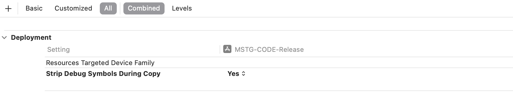
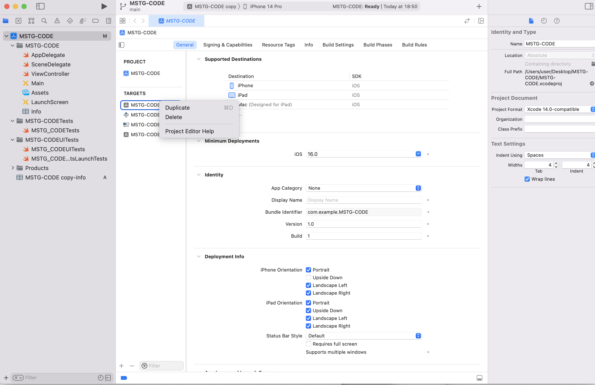
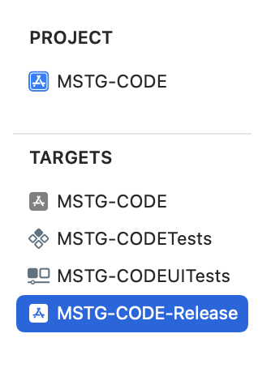
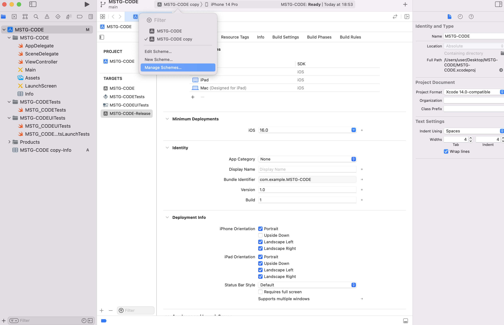
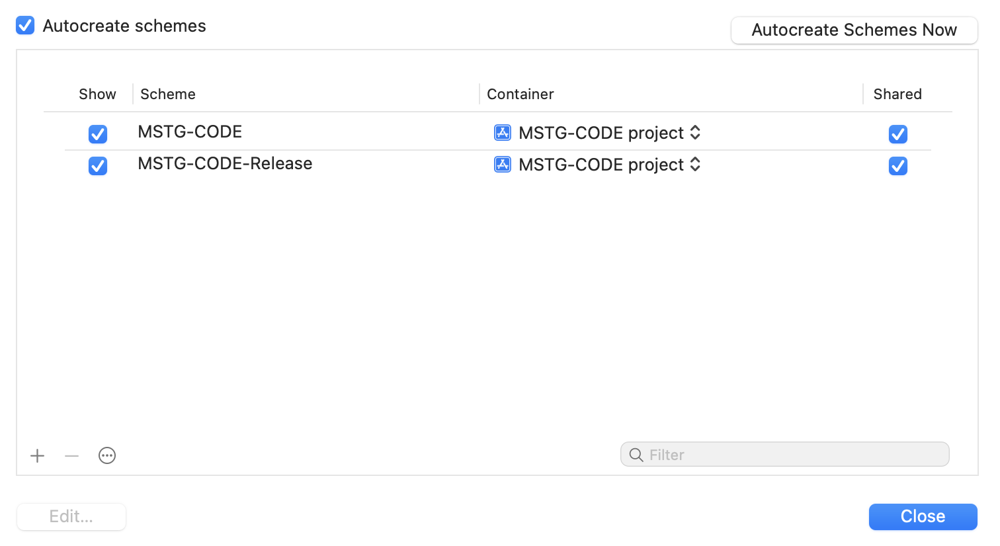
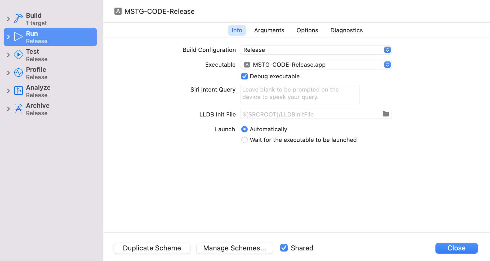
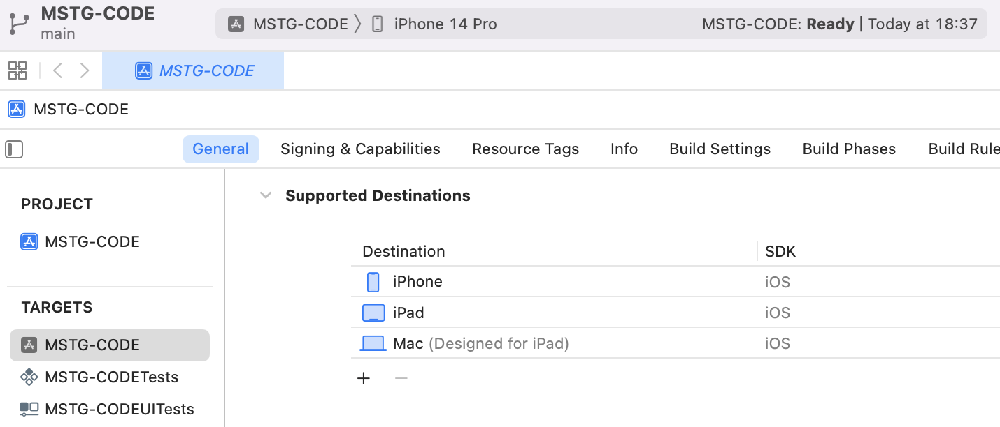
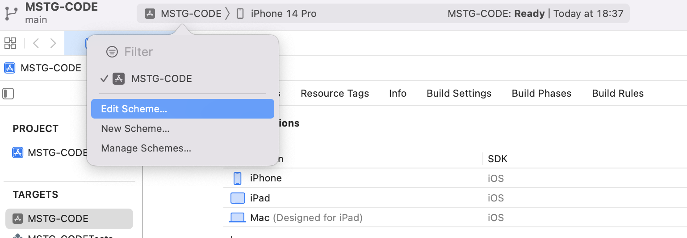
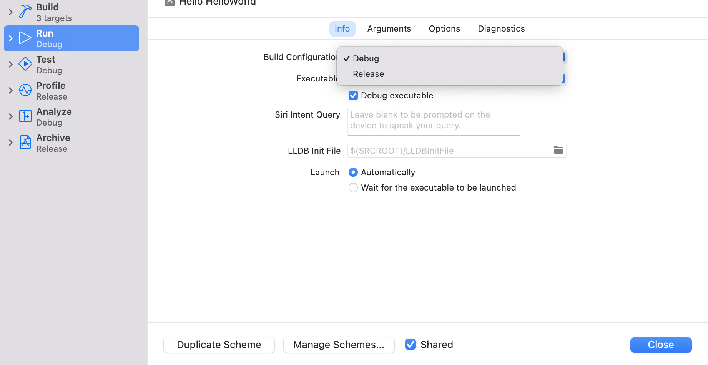

# Code Quality and Build Setting Requirements

## MSTG-CODE-1
The app is signed and provisioned with a valid certificate, of which the private key is properly protected.

### Code Signing
[Code signing](https://github.com/OWASP/owasp-mastg/blob/v1.5.0/Document/0x06a-Platform-Overview.md#code-signing) your app assures users that the app has a known source and hasn't been modified since it was last signed. Before your app can integrate app services, be installed on a non-jailbroken device, or be submitted to the App Store, it must be signed with a certificate issued by Apple. For more information on how to request certificates and code sign your apps, review the [App Distribution Guide](https://help.apple.com/xcode/mac/current/#/dev8b4250b57).


Reference
* [owasp-mastg Making Sure that the App Is Properly Signed (MSTG-CODE-1) Overview](https://github.com/OWASP/owasp-mastg/blob/v1.5.0/Document/0x06i-Testing-Code-Quality-and-Build-Settings.md#overview)

Rulebook
* [App code signature method (Required)](#app-code-signature-method-required)

### Static Analysis
You have to ensure that the app is [using the latest code signature format](https://developer.apple.com/documentation/xcode/using-the-latest-code-signature-format). You can retrieve the signing certificate information from the application's .app file with [codesign](https://developer.apple.com/library/archive/documentation/Security/Conceptual/CodeSigningGuide/Procedures/Procedures.html). Codesign is used to create, check, and display code signatures, as well as inquire into the dynamic status of signed code in the system.

After you get the application's IPA file, re-save it as a ZIP file and decompress the ZIP file. Navigate to the Payload directory, where the application's .app file will be.

Execute the following codesign command to display the signing information:

```bash
$ codesign -dvvv YOURAPP.app
Executable=/Users/Documents/YOURAPP/Payload/YOURAPP.app/YOURNAME
Identifier=com.example.example
Format=app bundle with Mach-O universal (armv7 arm64)
CodeDirectory v=20200 size=154808 flags=0x0(none) hashes=4830+5 location=embedded
Hash type=sha256 size=32
CandidateCDHash sha1=455758418a5f6a878bb8fdb709ccfca52c0b5b9e
CandidateCDHash sha256=fd44efd7d03fb03563b90037f92b6ffff3270c46
Hash choices=sha1,sha256
CDHash=fd44efd7d03fb03563b90037f92b6ffff3270c46
Signature size=4678
Authority=iPhone Distribution: Example Ltd
Authority=Apple Worldwide Developer Relations Certification Authority
Authority=Apple Root CA
Signed Time=4 Aug 2017, 12:42:52
Info.plist entries=66
TeamIdentifier=8LAMR92KJ8
Sealed Resources version=2 rules=12 files=1410
Internal requirements count=1 size=176
```

There are various ways to distribute your app as described at [the Apple documentation](https://developer.apple.com/business/distribute/), which include using the App Store or via Apple Business Manager for custom or in-house distribution. In case of an in-house distribution scheme, make sure that no ad hoc certificates are used when the app is signed for distribution.

Reference
* [owasp-mastg Making Sure that the App Is Properly Signed (MSTG-CODE-1) Static Analysis](https://github.com/OWASP/owasp-mastg/blob/v1.5.0/Document/0x06i-Testing-Code-Quality-and-Build-Settings.md#static-analysis)

Rulebook
* [It is necessary to confirm that the app uses the latest code signature format (Required)](#it-is-necessary-to-confirm-that-the-app-uses-the-latest-code-signature-format-required)

### Rulebook
1. [App code signature method (Required)](#app-code-signature-method-required)
1. [It is necessary to confirm that the app uses the latest code signature format (Required)](#it-is-necessary-to-confirm-that-the-app-uses-the-latest-code-signature-format-required)

#### App code signature method (Required)

Follow the steps below to sign the code to the application.

1. Add an Apple ID to your account settings

   Add the user's Apple ID account to the account preferences to identify the user and download information about the user's team. Xcode will use the Apple ID credentials to download information about all teams to which the user belongs.

2. Assign teams to targets within the project

   Assign each target in the user's project to a team. Xcode stores the signing authorizations (certificates, identifiers, and provisioning profiles) in the associated team account. If the user registers as an organization, the program role determines what tasks can be performed in Xcode. If the user registers as an individual, the user is the account holder for a single team. If you are not a member of the Apple Developer Program, Xcode creates a personal team for you.

3. Add functionality to the app

   Under "Signatures and Features" activate the app service you wish to use. Xcode will configure the user's project and update the signature permissions accordingly. If necessary, Xcode will enable the app service for the associated App ID and regenerate the provisioning profile it manages. To fully enable some app services, you may need to sign in to your developer account or App Store Connect.

4. Running the application on the terminal

   The first time you run your app on a connected or wireless device (iOS, tvOS), Xcode creates the necessary development signature permissions for you. Xcode registers the device of your choice and adds it to the provisioning profile it manages. For macOS apps, Xcode registers the Mac running Xcode.

5. Export of signing certificates and provisioning profiles

   The signing certificate and provisioning profile used to launch the application on the device are stored on the user's Mac. Since the private key for the signing certificate is only stored in the keychain, this is a good time to export the signing certificate and provisioning profile for the developer account. You can also export the developer account and move the signing authority to another Mac.

If this is violated, the following may occur.
* Cannot guarantee to the user that the source has not been changed after the app is signed.

#### It is necessary to confirm that the app uses the latest code signature format (Required)
You have to ensure that the app is [using the latest code signature format](https://developer.apple.com/documentation/xcode/using-the-latest-code-signature-format). You can retrieve the signing certificate information from the application's .app file with [codesign](https://developer.apple.com/library/archive/documentation/Security/Conceptual/CodeSigningGuide/Procedures/Procedures.html). Codesign is used to create, check, and display code signatures, as well as inquire into the dynamic status of signed code in the system.

After you get the application's IPA file, re-save it as a ZIP file and decompress the ZIP file. Navigate to the Payload directory, where the application's .app file will be.

Execute the following codesign command to display the signing information:

```bash
$ codesign -dvvv YOURAPP.app
Executable=/Users/Documents/YOURAPP/Payload/YOURAPP.app/YOURNAME
Identifier=com.example.example
Format=app bundle with Mach-O universal (armv7 arm64)
CodeDirectory v=20200 size=154808 flags=0x0(none) hashes=4830+5 location=embedded
Hash type=sha256 size=32
CandidateCDHash sha1=455758418a5f6a878bb8fdb709ccfca52c0b5b9e
CandidateCDHash sha256=fd44efd7d03fb03563b90037f92b6ffff3270c46
Hash choices=sha1,sha256
CDHash=fd44efd7d03fb03563b90037f92b6ffff3270c46
Signature size=4678
Authority=iPhone Distribution: Example Ltd
Authority=Apple Worldwide Developer Relations Certification Authority
Authority=Apple Root CA
Signed Time=4 Aug 2017, 12:42:52
Info.plist entries=66
TeamIdentifier=8LAMR92KJ8
Sealed Resources version=2 rules=12 files=1410
Internal requirements count=1 size=176
```

If this is violated, the following may occur.
* May not be able to register to the store.

## MSTG-CODE-2
The app has been built in release mode, with settings appropriate for a release build (e.g. non-debuggable).

### Build Mode Setting
Debugging iOS applications can be done using Xcode, which embeds a powerful debugger called lldb. Lldb is the default debugger since Xcode5 where it replaced GNU tools like gdb and is fully integrated in the development environment. While debugging is a useful feature when developing an app, it has to be turned off before releasing apps to the App Store or within an enterprise program.

Generating an app in Build or Release mode depends on build settings in Xcode; when an app is generated in Debug mode, a DEBUG flag is inserted in the generated files.

Reference
* [owasp-mastg Determining Whether the App is Debuggable (MSTG-CODE-2)](https://github.com/OWASP/owasp-mastg/blob/v1.5.0/Document/0x06i-Testing-Code-Quality-and-Build-Settings.md#determining-whether-the-app-is-debuggable-mstg-code-2)

### Static Analysis
At first you need to determine the mode in which your app is to be generated to check the flags in the environment:

* Select the build settings of the project
* Under 'Apple LVM - Preprocessing' and 'Preprocessor Macros', make sure 'DEBUG' or 'DEBUG_MODE' is not selected (Objective-C)
* Or in the 'Swift Compiler - Custom Flags' section / 'Other Swift Flags', make sure the '-D DEBUG' entry does not exist.
* Open Manage Schemes and make sure the "Debug Executable" option is not selected for the scheme you want to use for release.


Reference
* [owasp-mastg Determining Whether the App is Debuggable (MSTG-CODE-2) Static Analysis](https://github.com/OWASP/owasp-mastg/blob/v1.5.0/Document/0x06i-Testing-Code-Quality-and-Build-Settings.md#static-analysis-1)

Rulebook
* [Build mode setting confirmation (Required)](#build-mode-setting-confirmation-required)

### Dynamic Analysis
Check whether you can attach a debugger directly, using Xcode. Next, check if you can debug the app on a jailbroken device after Clutching it. This is done using the debug-server which comes from the BigBoss repository at Cydia.

Note: if the application is equipped with anti-reverse engineering controls, then the debugger can be detected and stopped.

Reference
* [owasp-mastg Determining Whether the App is Debuggable (MSTG-CODE-2) Dynamic Analysis](https://github.com/OWASP/owasp-mastg/blob/v1.5.0/Document/0x06i-Testing-Code-Quality-and-Build-Settings.md#dynamic-analysis)

### Rulebook
1. [Build mode setting confirmation (Required)](#build-mode-setting-confirmation-required)

#### Build mode setting confirmation (Required)
Generating an application in build or release mode depends on the build settings in Xcode. Therefore, it is necessary to make sure that the release mode is set correctly in the application for release. If the app is built in debug mode, the DEBUG flag will be inserted so that it can be attached directly to the debugger.

How to check DEBUG flag settings in your environment.
* Select the build settings for the project.
* Make sure "DEBUG" or "DEBUG_MODE" is not selected in "Apple LVM - Preprocessing" and "Preprocessor Macros". (Objective-C)
* Or, in the "Swift Custom Flags" section / "Other Swift Flags", make sure there is no "-D DEBUG" entry.
* Open Manage Schemes and make sure the "Debug Executable" option is not selected for the scheme you want to use for release.


\* No sample code, as the rules relate to Xcode settings.

If this is violated, the following may occur.
* Attachment to the debugger leaks application information.

## MSTG-CODE-3
Debugging symbols have been removed from native binaries.

### Presence or absence of debug symbols
As a good practice, as little explanatory information as possible should be provided with a compiled binary. The presence of additional metadata such as debug symbols might provide valuable information about the code, e.g. function names leaking information about what a function does. This metadata is not required to execute the binary and thus it is safe to discard it for the release build, which can be done by using proper compiler configurations. As a tester you should inspect all binaries delivered with the app and ensure that no debugging symbols are present (at least those revealing any valuable information about the code).

When an iOS application is compiled, the compiler generates a list of debug symbols for each binary file in an app (the main app executable, frameworks, and app extensions). These symbols include class names, global variables, and method and function names which are mapped to specific files and line numbers where they're defined. Debug builds of an app place the debug symbols in a compiled binary by default, while release builds of an app place them in a companion Debug Symbol file (dSYM) to reduce the size of the distributed app.


Reference
* [owasp-mastg Finding Debugging Symbols (MSTG-CODE-3) Overview](https://github.com/OWASP/owasp-mastg/blob/v1.5.0/Document/0x06i-Testing-Code-Quality-and-Build-Settings.md#overview-2)

Rulebook
* [Not output code information in the release build (Required)](#not-output-code-information-in-the-release-build-required)

### Static Analysis
To verify the existence of debug symbols you can use objdump from [binutils](https://www.gnu.org/software/binutils/) or [llvm-objdump](https://llvm.org/docs/CommandGuide/llvm-objdump.html) to inspect all of the app binaries.

In the following snippet we run objdump over TargetApp (the iOS main app executable) to show the typical output of a binary containing debug symbols which are marked with the d (debug) flag. Check the [objdump man page](https://www.unix.com/man-page/osx/1/objdump/) for information about various other symbol flag characters.

```bash
$ objdump --syms TargetApp

0000000100007dc8 l    d  *UND* -[ViewController handleSubmitButton:]
000000010000809c l    d  *UND* -[ViewController touchesBegan:withEvent:]
0000000100008158 l    d  *UND* -[ViewController viewDidLoad]
...
000000010000916c l    d  *UND* _disable_gdb
00000001000091d8 l    d  *UND* _detect_injected_dylds
00000001000092a4 l    d  *UND* _isDebugged
...
```

To prevent the inclusion of debug symbols, set Strip Debug Symbols During Copy to YES via the XCode project's build settings. Stripping debugging symbols will not only reduce the size of the binary but also increase the difficulty of reverse engineering.


Reference
* [owasp-mastg Finding Debugging Symbols (MSTG-CODE-3) Static Analysis](https://github.com/OWASP/owasp-mastg/blob/v1.5.0/Document/0x06i-Testing-Code-Quality-and-Build-Settings.md#static-analysis-2)

### Dynamic Analysis
Dynamic analysis is not applicable for finding debugging symbols.

Reference
* [owasp-mastg Finding Debugging Symbols (MSTG-CODE-3) Dynamic Analysis](https://github.com/OWASP/owasp-mastg/blob/v1.5.0/Document/0x06i-Testing-Code-Quality-and-Build-Settings.md#dynamic-analysis-1)

### Rulebook
1. [Not output code information in the release build (Required)](#not-output-code-information-in-the-release-build-required)

#### Not output code information in the release build (Required)
Compiled binaries should give as little detail as possible. The presence of additional metadata like debug symbols can provide function names that leak important information about the code, such as information about what the function does. This metadata is not needed to run the binary, so it's safe to discard it in release builds. This is possible by using the appropriate compiler settings.

To avoid including debug symbols, set Strip Debug Symbols During Copy to YES from your XCode project's Build Settings. Removing debug symbols not only reduces the size of the binary, but also increases the difficulty of reverse engineering.



\* There is no sample code because it is a conceptual rule.

If this is violated, the following may occur.
* It can leak some metadata such as debugging information, line numbers, and descriptive function and method names in your code.

## MSTG-CODE-4
Debugging code and developer assistance code (e.g. test code, backdoors, hidden settings) have been removed. The app does not log verbose errors or debugging messages.

### Logging
To speed up verification and get a better understanding of errors, developers often include debugging code, such as verbose logging statements (using NSLog, println, print, dump, and debugPrint) about responses from their APIs and about their application's progress and/or state. Furthermore, there may be debugging code for "management-functionality", which is used by developers to set the application's state or mock responses from an API. Reverse engineers can easily use this information to track what's happening with the application. Therefore, debugging code should be removed from the application's release version.


Reference
* [owasp-mastg Finding Debugging Code and Verbose Error Logging (MSTG-CODE-4)](https://github.com/OWASP/owasp-mastg/blob/v1.5.0/Document/0x06i-Testing-Code-Quality-and-Build-Settings.md#finding-debugging-code-and-verbose-error-logging-mstg-code-4)

Rulebook
* [Debug code processing (Required)](#debug-code-processing-required)
* [The debug code must be deleted from the application release version (Required)](#the-debug-code-must-be-deleted-from-the-application-release-version-required)

### Static Analysis
You can take the following static analysis approach for the logging statements:

1. Import the application's code into Xcode.
1. Search the code for the following printing functions: NSLog, println, print, dump, debugPrint.
1. When you find one of them, determine whether the developers used a wrapping function around the logging function for better mark up of the statements to be logged; if so, add that function to your search.
1. For every result of steps 2 and 3, determine whether macros or debug-state related guards have been set to turn the logging off in the release build. Please note the change in how Objective-C can use preprocessor macros:

```objectivec
#ifdef DEBUG
    // Debug-only code
#endif
```

The procedure for enabling this behavior in Swift has changed: you need to either set environment variables in your scheme or set them as custom flags in the target's build settings. Please note that the following functions (which allow you to determine whether the app was built in the Swift 2.1. release-configuration) aren't recommended, as Xcode 8 and Swift 3 don't support these functions:

* _isDebugAssertConfiguration
* _isReleaseAssertConfiguration
* _isFastAssertConfiguration

Depending on the application's setup, there may be more logging functions. For example, when [CocoaLumberjack](https://github.com/CocoaLumberjack/CocoaLumberjack) is used, static analysis is a bit different.

For the "debug-management" code (which is built-in): inspect the storyboards to see whether there are any flows and/or view-controllers that provide functionality different from the functionality the application should support. This functionality can be anything from debug views to printed error messages, from custom stub-response configurations to logs written to files on the application's file system or a remote server.

As a developer, incorporating debug statements into your application's debug version should not be a problem as long as you make sure that the debug statements are never present in the application's release version.

#### Objective-C Logging Statement
In Objective-C, developers can use preprocessor macros to filter out debug code:

```objectivec
#ifdef DEBUG
    // Debug-only code
#endif
```

#### Swift Logging Statement
In Swift 2 (with Xcode 7), you have to set custom compiler flags for every target, and compiler flags have to start with "-D". So you can use the following annotations when the debug flag DMSTG-DEBUG is set:

```swift
#if MSTG-DEBUG
    // Debug-only code
#endif
```

In Swift 3 (with Xcode 8), you can set Active Compilation Conditions in Build settings/Swift compiler - Custom flags. Instead of a preprocessor, Swift 3 uses [conditional compilation blocks](https://developer.apple.com/documentation/swift#2984801) based on the defined conditions:


Reference
* [owasp-mastg Finding Debugging Code and Verbose Error Logging (MSTG-CODE-4) Static Analysis](https://github.com/OWASP/owasp-mastg/blob/v1.5.0/Document/0x06i-Testing-Code-Quality-and-Build-Settings.md#static-analysis-3)

### Dynamic Analysis
Dynamic analysis should be executed on both a simulator and a device because developers sometimes use target-based functions (instead of functions based on a release/debug-mode) to execute the debugging code.

1. Run the application on a simulator and check for output in the console during the app's execution.
1. Attach a device to your Mac, run the application on the device via Xcode, and check for output in the console during the app's execution.

For the other "manager-based" debug code: click through the application on both a simulator and a device to see if you can find any functionality that allows an app's profiles to be pre-set, allows the actual server to be selected or allows responses from the API to be selected.

Reference
* [owasp-mastg Finding Debugging Code and Verbose Error Logging (MSTG-CODE-4) Dynamic Analysis](https://github.com/OWASP/owasp-mastg/blob/v1.5.0/Document/0x06i-Testing-Code-Quality-and-Build-Settings.md#dynamic-analysis-2)

### Rulebook
1. [Debug code processing (Required)](#debug-code-processing-required)
1. [The debug code must be deleted from the application release version (Required)](#the-debug-code-must-be-deleted-from-the-application-release-version-required)

#### Debug code processing (Required)
How to set environment variables in scheme
1. Add build target
Right-click on an existing target > select duplicate to create a new copy.

   

   Once created, name it XXXXX-Release.

   

2. Add build scheme
Adding a target automatically adds a scheme with the same name.

   There is a target selection button to the right of the Run stop execution button in Xcode's top bar. Clicking on it will bring up a list of targets.
   The name was changed in step 1, but the scheme was unchanged.

   

   To change it, select Manage Schemes... to display the scheme management screen. Rename the copy to XXXXX-Release, the same as the target.

   

3. Click Edit Scheme...
Click Edit Scheme... and change Test, Profile, Analyze, and Archive on the left tab to Release.

   

4. Macro description
When the scheme is changed, only descriptions where the macro condition is true are automatically activated.

   ```swift
   public class SampleClass {
   
       func execute() {
           // Do any additional setup after loading the view, typically from a nib.
   #if PRODUCTION
           print("PRODUCTION Runing")
   #endif
   
   #if DEBUG
           print("DEBUG Runing")
   #endif
   
   #if STAGING
           print("STAGING Runing")
   #endif
       }
   }
   ```

How to set as custom compiler flags in target build settings

1. Click the project name

   

2. Click Edit Scheme...

   

3. Switch between Debug and Release in Build Configuration

   

How to use the preprocessor
DEBUG is given to debug builds by default as a flag when compiling.

```swift
public class SampleClass {

    func sample() {
#if DEBUG
        // Development Connections
        let server = "api.development.com"
#else
        // Production connections
        let server = "api.com"
#endif

    }

}
```

\* There is nothing that can be described as an event of violation or carelessness.

#### The debug code must be deleted from the application release version (Required)

Debug code added for logging should be removed when creating a release version.

If this is violated, the following may occur.
* May cause information leaks through debug code.

## MSTG-CODE-5
All third party components used by the mobile app, such as libraries and frameworks, are identified, and checked for known vulnerabilities.

### Third Party Library
iOS applications often make use of third party libraries which accelerate development as the developer has to write less code in order to solve a problem. However, third party libraries may contain vulnerabilities, incompatible licensing, or malicious content. Additionally, it is difficult for organizations and developers to manage application dependencies, including monitoring library releases and applying available security patches.

There are three widely used package management tools [Swift Package Manager](https://www.swift.org/package-manager/), [Carthage](https://github.com/Carthage/Carthage), and [CocoaPods](https://cocoapods.org/):

* The Swift Package Manager is open source, included with the Swift language, integrated into Xcode (since Xcode 11) and supports [Swift, Objective-C, Objective-C++, C, and C++](https://developer.apple.com/documentation/packagedescription) packages. It is written in Swift, decentralized and uses the Package.swift file to document and manage project dependencies.
* Carthage is open source and can be used for Swift and Objective-C packages. It is written in Swift, decentralized and uses the Cartfile file to document and manage project dependencies.
* CocoaPods is open source and can be used for Swift and Objective-C packages. It is written in Ruby, utilizes a centralized package registry for public and private packages and uses the Podfile file to document and manage project dependencies.

There are two categories of libraries:

* Libraries that are not (or should not) be packed within the actual production application, such as OHHTTPStubs used for testing.
* Libraries that are packed within the actual production application, such as Alamofire.

These libraries can lead to unwanted side-effects:

* A library can contain a vulnerability, which will make the application vulnerable. A good example is AFNetworking version 2.5.1, which contained a bug that disabled certificate validation. This vulnerability would allow attackers to execute man-in-the-middle attacks against apps that are using the library to connect to their APIs.
* A library can no longer be maintained or hardly be used, which is why no vulnerabilities are reported and/or fixed. This can lead to having bad and/or vulnerable code in your application through the library.
* A library can use a license, such as LGPL2.1, which requires the application author to provide access to the source code for those who use the application and request insight in its sources. In fact the application should then be allowed to be redistributed with modifications to its source code. This can endanger the intellectual property (IP) of the application.

Please note that this issue can hold on multiple levels: When you use webviews with JavaScript running in the webview, the JavaScript libraries can have these issues as well. The same holds for plugins/libraries for Cordova, React-native and Xamarin apps.

Reference
* [owasp-mastg Checking for Weaknesses in Third Party Libraries (MSTG-CODE-5) Overview](https://github.com/OWASP/owasp-mastg/blob/v1.5.0/Document/0x06i-Testing-Code-Quality-and-Build-Settings.md#overview-4)

Rulebook
* [Pay attention to the use of third party libraries (Recommended)](#pay-attention-to-the-use-of-third-party-libraries-recommended)

### Detecting vulnerabilities of third party libraries
In order to ensure that the libraries used by the apps are not carrying vulnerabilities, one can best check the dependencies installed by CocoaPods or Carthage.

Reference
* [owasp-mastg Checking for Weaknesses in Third Party Libraries (MSTG-CODE-5) Detecting vulnerabilities of third party libraries](https://github.com/OWASP/owasp-mastg/blob/v1.5.0/Document/0x06i-Testing-Code-Quality-and-Build-Settings.md#detecting-vulnerabilities-of-third-party-libraries)

Rulebook
* [How to check the vulnerability of the library (Recommended)](#how-to-check-the-vulnerability-of-the-library-recommended)

#### Swift Package Manager
In case [Swift Package Manager](https://www.swift.org/package-manager/) is used for managing third party dependencies, the following steps can be taken to analyze the third party libraries for vulnerabilities:

First, at the root of the project, where the Package.swift file is located, type

```bash
swift build
```

Next, check the file Package.resolved for the actual versions used and inspect the given libraries for known vulnerabilities.

You can utilize the [OWASP Dependency-Check](https://owasp.org/www-project-dependency-check/)'s experimental [Swift Package Manager Analyzer](https://jeremylong.github.io/DependencyCheck/analyzers/swift.html) to identify the [Common Platform Enumeration (CPE)](https://nvd.nist.gov/products/cpe) naming scheme of all dependencies and any corresponding [Common Vulnerability and Exposure (CVE)](https://cve.mitre.org/) entries. Scan the application's Package.swift file and generate a report of known vulnerable libraries with the following command:

```bash
dependency-check  --enableExperimental --out . --scan Package.swift
```

Reference
* [owasp-mastg Checking for Weaknesses in Third Party Libraries (MSTG-CODE-5) Swift Package Manager](https://github.com/OWASP/owasp-mastg/blob/v1.5.0/Document/0x06i-Testing-Code-Quality-and-Build-Settings.md#swift-package-manager)

#### CocoaPods
In case [CocoaPods](https://cocoapods.org/) is used for managing third party dependencies, the following steps can be taken to analyze the third party libraries for vulnerabilities.

First, at the root of the project, where the Podfile is located, execute the following commands:

```bash
sudo gem install cocoapods
pod install
```

Next, now that the dependency tree has been built, you can create an overview of the dependencies and their versions by running the following commands:

```bash
sudo gem install cocoapods-dependencies
pod dependencies
```

The result of the steps above can now be used as input for searching different vulnerability feeds for known vulnerabilities.

Note:

1. If the developer packs all dependencies in terms of its own support library using a .podspec file, then this .podspec file can be checked with the experimental CocoaPods podspec checker.
1. If the project uses CocoaPods in combination with Objective-C, SourceClear can be used.
1. Using CocoaPods with HTTP-based links instead of HTTPS might allow for man-in-the-middle attacks during the download of the dependency, allowing an attacker to replace (parts of) the library with other content. Therefore, always use HTTPS.

You can utilize the [OWASP Dependency-Check](https://owasp.org/www-project-dependency-check/)'s experimental [CocoaPods Analyzer](https://jeremylong.github.io/DependencyCheck/analyzers/cocoapods.html) to identify the [Common Platform Enumeration (CPE)](https://nvd.nist.gov/products/cpe) naming scheme of all dependencies and any corresponding [Common Vulnerability and Exposure (CVE)](https://cve.mitre.org/) entries. Scan the application's *.podspec and/or Podfile.lock files and generate a report of known vulnerable libraries with the following command:

```bash
dependency-check  --enableExperimental --out . --scan Podfile.lock
```

Reference
* [owasp-mastg Checking for Weaknesses in Third Party Libraries (MSTG-CODE-5) CocoaPods](https://github.com/OWASP/owasp-mastg/blob/v1.5.0/Document/0x06i-Testing-Code-Quality-and-Build-Settings.md#cocoapods)

#### Carthage
In case [Carthage](https://github.com/Carthage/Carthage) is used for third party dependencies, then the following steps can be taken to analyze the third party libraries for vulnerabilities.

First, at the root of the project, where the Cartfile is located, type

```bash
brew install carthage
carthage update --platform iOS
```

Next, check the Cartfile.resolved for actual versions used and inspect the given libraries for known vulnerabilities.

Note, at the time of writing this chapter, there is no automated support for Carthage based dependency analysis known to the authors. At least, this feature was already requested for the OWASP DependencyCheck tool but not yet implemented (see the [GitHub issue](https://github.com/jeremylong/DependencyCheck/issues/962)).


Reference
* [owasp-mastg Checking for Weaknesses in Third Party Libraries (MSTG-CODE-5) Carthage](https://github.com/OWASP/owasp-mastg/blob/v1.5.0/Document/0x06i-Testing-Code-Quality-and-Build-Settings.md#carthage)

#### Discovered library vulnerabilities
When a library is found to contain vulnerabilities, then the following reasoning applies:

* Is the library packaged with the application? Then check whether the library has a version in which the vulnerability is patched. If not, check whether the vulnerability actually affects the application. If that is the case or might be the case in the future, then look for an alternative which provides similar functionality, but without the vulnerabilities.
* Is the library not packaged with the application? See if there is a patched version in which the vulnerability is fixed. If this is not the case, check if the implications of the vulnerability for the build process. Could the vulnerability impede a build or weaken the security of the build-pipeline? Then try looking for an alternative in which the vulnerability is fixed.

In case frameworks are added manually as linked libraries:

1. Open the xcodeproj file and check the project properties.
2. Go to the tab **Build Phases** and check the entries in **Link Binary With Libraries** for any of the libraries. See earlier sections on how to obtain similar information using [MobSF](https://github.com/MobSF/Mobile-Security-Framework-MobSF).

In the case of copy-pasted sources: search the header files (in case of using Objective-C) and otherwise the Swift files for known method names for known libraries.

Next, note that for hybrid applications, you will have to check the JavaScript dependencies with [RetireJS](https://retirejs.github.io/retire.js/). Similarly for Xamarin, you will have to check the C# dependencies.

Last, if the application is a high-risk application, you will end up vetting the library manually. In that case there are specific requirements for native code, which are similar to the requirements established by the MASVS for the application as a whole. Next to that, it is good to vet whether all best practices for software engineering are applied.


Reference
* [owasp-mastg Checking for Weaknesses in Third Party Libraries (MSTG-CODE-5) Carthage](https://github.com/OWASP/owasp-mastg/blob/v1.5.0/Document/0x06i-Testing-Code-Quality-and-Build-Settings.md#carthage)

Rulebook
* [Points to confirm the vulnerability of hybrid applications (Required)](#points-to-confirm-the-vulnerability-of-hybrid-applications-required)

### Detecting the Licenses Used by the Libraries of the Application
In order to ensure that the copyright laws are not infringed, one can best check the dependencies installed by Swift Packager Manager, CocoaPods, or Carthage.

Reference
* [owasp-mastg Checking for Weaknesses in Third Party Libraries (MSTG-CODE-5) Detecting the Licenses Used by the Libraries of the Application](https://github.com/OWASP/owasp-mastg/blob/v1.5.0/Document/0x06i-Testing-Code-Quality-and-Build-Settings.md#detecting-the-licenses-used-by-the-libraries-of-the-application)

Rulebook
* [Analysis method of dependencies for applications such as libraries (Required)](#analysis-method-of-dependencies-for-applications-such-as-libraries-required)

#### Swift Package Manager
When the application sources are available and Swift Package Manager is used, execute the following code in the root directory of the project, where the Package.swift file is located:

```bash
swift build
```

The sources of each of the dependencies have now been downloaded to /.build/checkouts/ folder in the project. Here you can find the license for each of the libraries in their respective folder.

Reference
* [owasp-mastg Checking for Weaknesses in Third Party Libraries (MSTG-CODE-5) Swift Package Manager](https://github.com/OWASP/owasp-mastg/blob/v1.5.0/Document/0x06i-Testing-Code-Quality-and-Build-Settings.md#swift-package-manager-1)

#### CocoaPods
When the application sources are available and CocoaPods is used, then execute the following steps to get the different licenses: First, at the root of the project, where the Podfile is located, type

```bash
sudo gem install cocoapods
pod install
```

This will create a Pods folder where all libraries are installed, each in their own folder. You can now check the licenses for each of the libraries by inspecting the license files in each of the folders.

Reference
* [owasp-mastg Checking for Weaknesses in Third Party Libraries (MSTG-CODE-5) CocoaPods](https://github.com/OWASP/owasp-mastg/blob/v1.5.0/Document/0x06i-Testing-Code-Quality-and-Build-Settings.md#cocoapods-1)


#### Carthage
When the application sources are available and Carthage is used, execute the following code in the root directory of the project, where the Cartfile is located:

```bash
brew install carthage
carthage update --platform iOS
```

The sources of each of the dependencies have now been downloaded to Carthage/Checkouts folder in the project. Here you can find the license for each of the libraries in their respective folder.

Reference
* [owasp-mastg Checking for Weaknesses in Third Party Libraries (MSTG-CODE-5) Carthage](https://github.com/OWASP/owasp-mastg/blob/v1.5.0/Document/0x06i-Testing-Code-Quality-and-Build-Settings.md#carthage-1)

#### Issues with library licenses
When a library contains a license in which the app's IP needs to be open-sourced, check if there is an alternative for the library which can be used to provide similar functionalities.

Note: In case of a hybrid app, please check the build-tools used: most of them do have a license enumeration plugin to find the licenses being used.

Reference
* [owasp-mastg Checking for Weaknesses in Third Party Libraries (MSTG-CODE-5) Issues with library licenses](https://github.com/OWASP/owasp-mastg/blob/v1.5.0/Document/0x06i-Testing-Code-Quality-and-Build-Settings.md#issues-with-library-licenses)

Rulebook
* [Analysis method of dependencies for applications such as libraries (Required)](#analysis-method-of-dependencies-for-applications-such-as-libraries-required)
* [Verification whether the license is complied (Required)](#verification-whether-the-license-is-complied-required)

### Dynamic Analysis
The dynamic analysis of this section comprises of two parts: the actual license verification and checking which libraries are involved in case of missing sources.

It need to be validated whether the copyrights of the licenses have been adhered to. This often means that the application should have an about or EULA section in which the copy-right statements are noted as required by the license of the third party library.

Reference
* [owasp-mastg Checking for Weaknesses in Third Party Libraries (MSTG-CODE-5) Dynamic Analysis](https://github.com/OWASP/owasp-mastg/blob/v1.5.0/Document/0x06i-Testing-Code-Quality-and-Build-Settings.md#dynamic-analysis-3)

Rulebook
* [Verification whether the license is complied (Required)](#verification-whether-the-license-is-complied-required)

#### Listing Application Libraries
When performing app analysis, it is important to also analyze the app dependencies (usually in form of libraries or so-called iOS Frameworks) and ensure that they don't contain any vulnerabilities. Even when you don't have the source code, you can still identify some of the app dependencies using tools like [Objection](https://github.com/sensepost/objection), [MobSF](https://github.com/MobSF/Mobile-Security-Framework-MobSF) or otool. Objection is the recommended tool, since it provides the most accurate results and it is easy to use. It contains a module to work with iOS Bundles, which offers two commands: list_bundles and list_frameworks.

The list_bundles command lists all of the application’s bundles that are not related to Frameworks. The output contains executable name, bundle id, version of the library and path to the library.

```bash
...itudehacks.DVIAswiftv2.develop on (iPhone: 13.2.3) [usb] # ios bundles list_bundles
Executable    Bundle                                       Version  Path
------------  -----------------------------------------  ---------  -------------------------------------------
DVIA-v2       com.highaltitudehacks.DVIAswiftv2.develop          2  ...-1F0C-4DB1-8C39-04ACBFFEE7C8/DVIA-v2.app
CoreGlyphs    com.apple.CoreGlyphs                               1  ...m/Library/CoreServices/CoreGlyphs.bundle
```

The list_frameworks command lists all of the application’s bundles that represent Frameworks.

```bash
...itudehacks.DVIAswiftv2.develop on (iPhone: 13.2.3) [usb] # ios bundles list_frameworks
Executable      Bundle                                     Version    Path
--------------  -----------------------------------------  ---------  -------------------------------------------
Bolts           org.cocoapods.Bolts                        1.9.0      ...8/DVIA-v2.app/Frameworks/Bolts.framework
RealmSwift      org.cocoapods.RealmSwift                   4.1.1      ...A-v2.app/Frameworks/RealmSwift.framework
                                                                      ...ystem/Library/Frameworks/IOKit.framework
...
```

Reference
* [owasp-mastg Checking for Weaknesses in Third Party Libraries (MSTG-CODE-5) Dynamic Analysis Listing Application Libraries](https://github.com/OWASP/owasp-mastg/blob/v1.5.0/Document/0x06i-Testing-Code-Quality-and-Build-Settings.md#listing-application-libraries)

Rulebook
* [Analysis method of dependencies for applications such as libraries (Required)](#analysis-method-of-dependencies-for-applications-such-as-libraries-required)

### Rulebook
1. [How to check the vulnerability of the library (Recommended)](#how-to-check-the-vulnerability-of-the-library-recommended)
1. [Analysis method of dependencies for applications such as libraries (Required)](#analysis-method-of-dependencies-for-applications-such-as-libraries-required)
1. [Verification whether the license is complied (Required)](#verification-whether-the-license-is-complied-required)
1. [Points to confirm the vulnerability of hybrid applications (Required)](#points-to-confirm-the-vulnerability-of-hybrid-applications-required)
1. [Pay attention to the use of third party libraries (Recommended)](#pay-attention-to-the-use-of-third-party-libraries-recommended)

#### How to check the vulnerability of the library (Recommended)
Checking the dependencies installed by CocoaPods or Carthage is the best way to make sure the libraries your app uses are not vulnerable.

If this is not noted, the following may occur.
* Apps can be vulnerable.

#### Analysis method of dependencies for applications such as libraries (Required)
Need to make sure you are not infringing copyright. If source code is available, it is best to check the dependencies installed by Swift Package Manager , CocoaPods and Carthage.

**Swift Package Manager**

When the application sources are available and Swift Package Manager is used, execute the following code in the root directory of the project, where the Package.swift file is located:

```bash
swift build
```

The sources of each of the dependencies have now been downloaded to /.build/checkouts/ folder in the project. Here you can find the license for each of the libraries in their respective folder.

**CocoaPods**

When the application sources are available and CocoaPods is used, then execute the following steps to get the different licenses: First, at the root of the project, where the Podfile is located, type

```bash
sudo gem install cocoapods
pod install
```

This will create a Pods folder where all libraries are installed, each in their own folder. You can now check the licenses for each of the libraries by inspecting the license files in each of the folders.

**Carthage**

When the application sources are available and Carthage is used, execute the following code in the root directory of the project, where the Cartfile is located:

```bash
brew install carthage
carthage update --platform iOS
```

The sources of each of the dependencies have now been downloaded to Carthage/Checkouts folder in the project. Here you can find the license for each of the libraries in their respective folder.

Even if you don't have the source code, you can use tools to identify some of your app's dependencies.

**Objection**

Objection is a Frida-powered run-time mobile exploration toolkit, built to help assess the security posture of mobile applications without the need for jailbreaking, with the following features:

* Support both iOS and Android.
* Inspect and manipulate container filesystems.
* Bypass SSL pinning.
* Dump keychain.
* Perform memory-related tasks such as dumps and patching.
* Explore and manipulate objects on the heap.

**MobSF ( Mobile-Security-Framework-MobSF )**

MobSF is an all-in-one framework that automates Android/iOS pentesting, malware analysis, and security assessment, and can perform static and dynamic analysis. MobSF supports mobile app binaries (APK, XAPK, IPA, APPX) and source code in zip format.

**otool**

otool is a tool for viewing specified parts of object files and libraries. It understands both Mach-O files and the Universal File Format.

If this is violated, the following may occur.
* The library may contain licenses that require the app's intellectual property (IP) to be open sourced.

#### Verification whether the license is complied (Required)
A common feature of major licenses is that when distributing derived software, the "copyright", "license statement", and "disclaimer" of the source OSS must be displayed.
Since it is **May vary for each license** to specifically display "what", "where" and "how", it is necessary to carefully check the individual license for details.

For example, the MIT License requires that a "copyright notice" and "license statement" be "in all copies or substantial portions of the software" by the following statement:

```default
The above copyright notice and this permission notice shall be included in all copies or substantial portions of the Software.
```

If this is violated, the following may occur.
* The library may contain licenses that require the app's intellectual property (IP) to be open sourced.

#### Points to confirm the vulnerability of hybrid applications (Required)
Note that for hybrid applications, [RetireJS](https://retirejs.github.io/retire.js/) should check the JavaScript dependencies.

RetireJS simply visits a website and checks for known vulnerabilities in the JavaScript libraries used by that website. What Retire.js can do is "detection of known vulnerabilities in libraries", and it cannot find vulnerabilities that have not yet been announced.

If this is violated, the following may occur.
* May not detect known vulnerabilities in JavaScript libraries.

#### Pay attention to the use of third party libraries (Recommended)
Third-party libraries have the following shortcomings and should be examined when used.

* Vulnerabilities in libraries. Be aware that using a library that contains vulnerabilities may lead to the inclusion of malicious or vulnerable code in your application through the library. Even if vulnerabilities have not been discovered at this time, there is a possibility that they will be discovered in the future. In that case, update to a version that addresses the vulnerability, or refrain from using it if there is no updated version.
* License included in the library. Please note that some libraries have a license that requires the deployment of the source code of the application used when using the library.

Note that this problem can occur on multiple levels. If you use javascript in your webview, your javascript library may also have this problem. Plugins/libraries for Cordova, React-native and Xamarin apps are similar. <br>

\* There is no sample code due to the rules regarding the use of third-party libraries.

If this is not noted, the following may occur.
* The application contains malicious or vulnerable code that can be exploited.
* Licenses included in third-party libraries may require deployment of the app's source code.

## MSTG-CODE-6
The app catches and handles possible exceptions.

### Exception Handling
Exceptions often occur after an application enters an abnormal or erroneous state. Testing exception handling is about making sure that the application will handle the exception and get into a safe state without exposing any sensitive information via its logging mechanisms or the UI.

Bear in mind that exception handling in Objective-C is quite different from exception handling in Swift. Bridging the two approaches in an application that is written in both legacy Objective-C code and Swift code can be problematic.

Reference
* [owasp-mastg Testing Exception Handling (MSTG-CODE-6) Overview](https://github.com/OWASP/owasp-mastg/blob/v1.5.0/Document/0x06i-Testing-Code-Quality-and-Build-Settings.md#overview-5)


Rulebook
* [Exception treatment test purpose (Recommended)](#exception-treatment-test-purpose-recommended)

### Exception handling in Objective-C
Objective-C has two types of errors:

Reference
* [owasp-mastg Testing Exception Handling (MSTG-CODE-6) Exception handling in Objective-C](https://github.com/OWASP/owasp-mastg/blob/v1.5.0/Document/0x06i-Testing-Code-Quality-and-Build-Settings.md#exception-handling-in-objective-c)

#### NSException
NSException is used to handle programming and low-level errors (e.g., division by 0 and out-of-bounds array access). An NSException can either be raised by raise or thrown with @throw. Unless caught, this exception will invoke the unhandled exception handler, with which you can log the statement (logging will halt the program). @catch allows you to recover from the exception if you're using a @try-@catch-block:

```objectivec
 @try {
    //do work here
 }

@catch (NSException *e) {
    //recover from exception
}

@finally {
    //cleanup
```

Bear in mind that using NSException comes with memory management pitfalls: you need to [clean up allocations](https://developer.apple.com/library/archive/documentation/Cocoa/Conceptual/Exceptions/Tasks/RaisingExceptions.html#//apple_ref/doc/uid/20000058-BBCCFIBF) from the try block that are in the [finally block](https://developer.apple.com/library/archive/documentation/Cocoa/Conceptual/Exceptions/Tasks/HandlingExceptions.html). Note that you can promote NSException objects to NSError by instantiating an NSError in the @catch block.


#### NSError
NSError is used for all other types of [errors](https://developer.apple.com/library/archive/documentation/Cocoa/Conceptual/ProgrammingWithObjectiveC/ErrorHandling/ErrorHandling.html). Some Cocoa framework APIs provide errors as objects in their failure callback in case something goes wrong; those that don't provide them pass a pointer to an NSError object by reference. It is a good practice to provide a BOOL return type to the method that takes a pointer to an NSError object to indicate success or failure. If there's a return type, make sure to return nil for errors. If NO or nil is returned, it allows you to inspect the error/reason for failure.

### Exception Handling in Swift
Exception handing in Swift (2 - 5) is quite different. The try-catch block is not there to handle NSException. The block is used to handle errors that conform to the Error (Swift 3) or ErrorType (Swift 2) protocol. This can be challenging when Objective-C and Swift code are combined in an application. Therefore, NSError is preferable to NSException for programs written in both languages. Furthermore, error-handling is opt-in in Objective-C, but throws must be explicitly handled in Swift. To convert error-throwing, look at the [Apple documentation](https://developer.apple.com/documentation/swift/cocoa-design-patterns). Methods that can throw errors use the throws keyword. The Result type represents a success or failure, see [Result](https://developer.apple.com/documentation/swift/result), [How to use Result in Swift 5](https://www.hackingwithswift.com/articles/161/how-to-use-result-in-swift) and [The power of Result types in Swift](https://www.swiftbysundell.com/articles/the-power-of-result-types-in-swift/). There are four ways to [handle errors in Swift](https://docs.swift.org/swift-book/LanguageGuide/ErrorHandling.html):

Reference
* [owasp-mastg Testing Exception Handling (MSTG-CODE-6) Exception Handling in Swift](https://github.com/OWASP/owasp-mastg/blob/v1.5.0/Document/0x06i-Testing-Code-Quality-and-Build-Settings.md#exception-handling-in-swift)

Rulebook
* [Precautions when using NSException (Required)](#precautions-when-using-nsexception-required)
* [Exception processing (NSERROR) Precautions (Required)](#exception-processing-nserror-precautions-required)
* [Precautions for Swift exception processing (Recommended)](#precautions-for-swift-exception-processing-recommended)

#### Exception handling in do-catch
* Propagate the error from a function to the code that calls that function. In this situation, there's no do-catch; there's only a throw throwing the actual error or a try to execute the method that throws. The method containing the try also requires the throws keyword:

   ```swift
   func dosomething(argumentx:TypeX) throws {
       try functionThatThrows(argumentx: argumentx)
   }
   ```

* Handle the error with a do-catch statement. You can use the following pattern:

   ```swift
   func doTryExample() {
       do {
           try functionThatThrows(number: 203)
       } catch NumberError.lessThanZero {
           // Handle number is less than zero
       } catch let NumberError.tooLarge(delta) {
           // Handle number is too large (with delta value)
       } catch {
           // Handle any other errors
       }
   }
   
   enum NumberError: Error {
       case lessThanZero
       case tooLarge(Int)
       case tooSmall(Int)
   }
   
   func functionThatThrows(number: Int) throws -> Bool {
       if number < 0 {
           throw NumberError.lessThanZero
       } else if number < 10 {
           throw NumberError.tooSmall(10 - number)
       } else if number > 100 {
           throw NumberError.tooLarge(100 - number)
       } else {
           return true
       }
   }
   ```

* Handle the error as an optional value:

   ```swift
       let x = try? functionThatThrows()
       // In this case the value of x is nil in case of an error.
   ```

* Use the try! expression to assert that the error won't occur.

#### Exception handling on Result type

* Handle the generic error as a Result return:

   ```swift
   enum ErrorType: Error {
       case typeOne
       case typeTwo
   }
   
   func functionWithResult(param: String?) -> Result<String, ErrorType> {
       guard let value = param else {
           return .failure(.typeOne)
       }
       return .success(value)
   }
   
   func callResultFunction() {
       let result = functionWithResult(param: "OWASP")
   
       switch result {
       case let .success(value):
           // Handle success
       case let .failure(error):
           // Handle failure (with error)
       }
   }
   ```

* Handle network and JSON decoding errors with a Result type:

   ```swift
   struct MSTG: Codable {
       var root: String
       var plugins: [String]
       var structure: MSTGStructure
       var title: String
       var language: String
       var description: String
   }
   
   struct MSTGStructure: Codable {
       var readme: String
   }
   
   enum RequestError: Error {
       case requestError(Error)
       case noData
       case jsonError
   }
   
   func getMSTGInfo() {
       guard let url = URL(string: "https://raw.githubusercontent.com/OWASP/owasp-mastg/master/book.json") else {
           return
       }
   
       request(url: url) { result in
           switch result {
           case let .success(data):
               // Handle success with MSTG data
               let mstgTitle = data.title
               let mstgDescription = data.description
           case let .failure(error):
               // Handle failure
               switch error {
               case let .requestError(error):
                   // Handle request error (with error)
               case .noData:
                   // Handle no data received in response
               case .jsonError:
                   // Handle error parsing JSON
               }
           }
       }
   }
   
   func request(url: URL, completion: @escaping (Result<MSTG, RequestError>) -> Void) {
       let task = URLSession.shared.dataTask(with: url) { data, _, error in
           if let error = error {
               return completion(.failure(.requestError(error)))
           } else {
               if let data = data {
                   let decoder = JSONDecoder()
                   guard let response = try? decoder.decode(MSTG.self, from: data) else {
                       return completion(.failure(.jsonError))
                   }
                   return completion(.success(response))
               }
           }
       }
       task.resume()
   }
   ```

### Static Analysis
Review the source code to understand how the application handles various types of errors (IPC communications, remote services invocation, etc.). The following sections list examples of what you should check for each language at this stage.

Reference
* [owasp-mastg Testing Exception Handling (MSTG-CODE-6) Static Analysis](https://github.com/OWASP/owasp-mastg/blob/v1.5.0/Document/0x06i-Testing-Code-Quality-and-Build-Settings.md#static-analysis-5)

#### Static Analysis in Objective-C
Make sure that
* the application uses a well-designed and unified scheme to handle exceptions and errors,
* the Cocoa framework exceptions are handled correctly,
* the allocated memory in the @try blocks is released in the @finally blocks,
* for every @throw, the calling method has a proper @catch at the level of either the calling method or the NSApplication/UIApplication objects to clean up sensitive information and possibly recover,
* the application doesn't expose sensitive information while handling errors in its UI or in its log statements, and the statements are verbose enough to explain the issue to the user,
* high-risk applications' confidential information, such as keying material and authentication information, is always wiped during the execution of @finally blocks,
* raise is rarely used (it's used when the program must be terminated without further warning),
* NSError objects don't contain data that might leak sensitive information.

Reference
* [owasp-mastg Testing Exception Handling (MSTG-CODE-6) Static Analysis in Objective-C](https://github.com/OWASP/owasp-mastg/blob/v1.5.0/Document/0x06i-Testing-Code-Quality-and-Build-Settings.md#static-analysis-in-objective-c)

Rulebook
* [Proper implementation and confirmation of exception/error processing (Required)](#proper-implementation-and-confirmation-of-exceptionerror-processing-required)

#### Static Analysis in Swift
Make sure that

* the application uses a well-designed and unified scheme to handle errors,
* the application doesn't expose sensitive information while handling errors in its UI or in its log statements, and the statements are verbose enough to explain the issue to the user,
* high-risk applications' confidential information, such as keying material and authentication information, is always wiped during the execution of defer blocks,
* try! is used only with proper guarding up front (to programmatically verify that the method that's called with try! can't throw an error).

Reference
* [owasp-mastg Testing Exception Handling (MSTG-CODE-6) Static Analysis in Swift](https://github.com/OWASP/owasp-mastg/blob/v1.5.0/Document/0x06i-Testing-Code-Quality-and-Build-Settings.md#static-analysis-in-swift)

Rulebook
* [Proper implementation and confirmation of exception/error processing (Required)](#proper-implementation-and-confirmation-of-exceptionerror-processing-required)

#### Proper Error Handling
Developers can implement proper error handling in several ways:

* Make sure that the application uses a well-designed and unified scheme to handle errors.
* Make sure that all logging is removed or guarded as described in the test case "Testing for Debugging Code and Verbose Error Logging".
* For a high-risk application written in Objective-C: create an exception handler that removes secrets that shouldn't be easily retrievable. The handler can be set via NSSetUncaughtExceptionHandler.
* Refrain from using try! in Swift unless you're certain that there's no error in the throwing method that's being called.
* Make sure that the Swift error doesn't propagate into too many intermediate methods.


Reference
* [owasp-mastg Testing Exception Handling (MSTG-CODE-6) Proper Error Handling](https://github.com/OWASP/owasp-mastg/blob/v1.5.0/Document/0x06i-Testing-Code-Quality-and-Build-Settings.md#proper-error-handling)

Rulebook
* [Proper implementation and confirmation of exception/error processing (Required)](#proper-implementation-and-confirmation-of-exceptionerror-processing-required)

### Dynamic Analysis

There are several dynamic analysis methods:

* Enter unexpected values in the iOS application's UI fields.
* Test the custom URL schemes, pasteboard, and other inter-app communication controls by providing unexpected or exception-raising values.
* Tamper with the network communication and/or the files stored by the application.
* For Objective-C, you can use Cycript to hook into methods and provide them arguments that may cause the callee to throw an exception.

In most cases, the application should not crash. Instead, it should

* recover from the error or enter a state from which it can inform the user that it can't continue,
* provide a message (which shouldn't leak sensitive information) to get the user to take appropriate action,
* withhold information from the application's logging mechanisms.

Reference
* [owasp-mastg Testing Exception Handling (MSTG-CODE-6) Dynamic Testing](https://github.com/OWASP/owasp-mastg/blob/v1.5.0/Document/0x06i-Testing-Code-Quality-and-Build-Settings.md#dynamic-testing)

### Rulebook
1. [Exception treatment test purpose (Recommended)](#exception-treatment-test-purpose-recommended)
1. [Precautions when using NSException (Required)](#precautions-when-using-nsexception-required)
1. [Exception processing (NSERROR) Precautions (Required)](#exception-processing-nserror-precautions-required)
1. [Precautions for Swift exception processing (Recommended)](#precautions-for-swift-exception-processing-recommended)
1. [Proper implementation and confirmation of exception/error processing (Required)](#proper-implementation-and-confirmation-of-exceptionerror-processing-required)

#### Exception treatment test purpose (Recommended)
The purpose of testing exception handling is to transition to a safe state without exposing sensitive information through logging mechanisms or UI.

If this is not noted, the following may occur.
* Application crashes.
* Confidential information is leaked.

#### Precautions when using NSException (Required)
NSException is used to handle programming and low-level errors (eg division by 0, out-of-bounds array accesses, etc.).

If an exception occurs during the process described in try , the process immediately before the exception occurs is executed, and then the process described in catch is executed.
Finally, the process described in finally is executed.
Note that finally is always executed last regardless of whether try or catch is executed.

On the other hand, if no exception occurs, all the processing described in try is executed, and then finally processing is executed.
The processing inside catch is not executed.

The way to intentionally generate an exception in try-catch is to execute the following code at the timing when you want to generate an exception.

```objectivec
#import <Foundation/Foundation.h>

@interface MyException : NSObject {}
- (void)execute;
@end
 

@implementation MyException {}
 
-(void)execute {
    // Process that deliberately causes an exception
    [[NSException exceptionWithName:@"Exception" reason:@"reason" userInfo:nil] raise];
}
    
@end
```

\* There is nothing that can be described as an event of violation or carelessness.

#### Exception processing (NSERROR) Precautions (Required)
NSError is used for all other types of [Error](https://developer.apple.com/library/archive/documentation/Cocoa/Conceptual/ProgrammingWithObjectiveC/ErrorHandling/ErrorHandling.html).
Some Cocoa framework APIs provide errors as objects in failure callbacks in case something goes wrong. Those that don't provide them pass a pointer to an NSError object by reference. It is good practice to provide methods that take a pointer to an NSError object with a BOOL return type that indicates success or failure. If you have a return type, you should always return nil on error. If NO or nil is returned, you can investigate the reason for the error/failure.

If you use it without entering an initial value, EXC_BAD_ACCESS will occur when you refer to NSError because the reference destination is an appropriate value.

This can be avoided by initializing with nil specified when generating NSError.

```objectivec
#import <Foundation/Foundation.h>

@interface MyErrorUse : NSObject {}
- (void)execute;
@end
 

@implementation MyErrorUse {}
 
-(void)execute {
    NSString *path = @"file/pass/";
    
    // Initializing NSError
    NSError *error = nil;
    [[NSFileManager defaultManager] removeItemAtPath: path error: &error];

    if (error != nil) {
       // error handling
    }

}
    
@end
```

The argument error passes a reference pointer of type NSError (see below). By writing &error when passing, if there is an error, this reference will be updated inside the method and the entity of NSError will be assigned.

In other words, if an error occurs while deleting a file, it can be handled by checking the content of this error. Conversely, when error handling is not to be performed, nil can be passed to error:.

\* There is nothing that can be described as an event of violation or carelessness.

#### Precautions for Swift exception processing (Recommended)
Exception handling in Swift (2 - 5) uses try-catch blocks.

This block is used to handle errors conforming to the Error ( Swift 3 ) or ErrorType ( Swift 2 ) protocols and does not exist to handle NSExceptions.

NSError is recommended over NSException in application programs that combine Objective-C and Swift code.
Additionally, error handling is opt-in in Objective-C, but throw must be handled explicitly in Swift.

If this is not noted, the following may occur.
* Exceptions may not be handled properly.

#### Proper implementation and confirmation of exception/error processing (Required)
When implementing exception/error handling in iOS, it is necessary to check the following.

Points to check in Objective-C
* The application uses a well-designed and uniform scheme for handling exceptions and errors.
* Cocoa framework exceptions are handled correctly.
* Memory allocated with try blocks is freed with @finally blocks.
* For every @throw there is a proper @catch either at the level of the calling method or the NSApplication/UIApplication object to clean up and possibly recover sensitive information.
* Applications do not expose sensitive information when handling errors in UI or log statements, and statements are verbose to explain the problem to the user.
* Sensitive information for high-risk applications, such as keying material and authentication information, is always removed during @finally blocks.
* raise is rarely used. (used when the program must exit without further warning)
* NSError objects do not contain sensitive data.

Points to check in Swift
* The application is well designed and handles errors with a uniform scheme.
* Applications do not expose sensitive information during error handling in UI or log statements, and statements are verbose to explain the problem to the user.
* High-risk application sensitive information such as keying material and credentials are always wiped during defer blocks.
* try! should be used after proper guarding (programmatically confirming that the method called by try! does not throw an error).

How to implement proper error handling
* Make sure your application uses a well-designed and uniform scheme for handling errors.
* Make sure all logs are removed or protected as described in the test case "Verification with debug code and redundant error logs".
* For high-risk applications written in Objective-C: You should write exception handlers that remove secrets that shouldn't be easily retrievable. Handlers can be set with NSSetUncaughtExceptionHandler .
* Avoid using try in Swift unless you are sure that the throwing method being called is error-free.
* Make sure Swift errors don't propagate to too many intermediate methods.

How to handle errors with try-catch

```objectivec
#import <Foundation/Foundation.h>

@interface MyErrorUse : NSObject {}
- (void)tryCatchExample;
@end
 

@implementation MyErrorUse {}
 
- (void)tryCatchExample {
    // what you want to do
    @try {
        // raise an exception
        [[NSException exceptionWithName:@"Exception" reason:@"TestCode" userInfo:nil] raise];
    } @catch (NSException *exception) {
        // action to be taken when an exception occurs
        NSLog(@"name:%@",exception.name);
        NSLog(@"reason:%@",exception.reason);

    } @finally {
        // Process to be executed when the try-catch process is finished
        NSLog(@"*** finally ***");
    }
}
    
@end
```

How to handle errors with do-catch

```swift
func doTryExample() {
    do {
        try functionThatThrows(number: 203)
    } catch NumberError.lessThanZero {
        // Handle number is less than zero
    } catch let NumberError.tooLarge(delta) {
        // Handle number is too large (with delta value)
    } catch {
        // Handle any other errors
    }
}

enum NumberError: Error {
    case lessThanZero
    case tooLarge(Int)
    case tooSmall(Int)
}

func functionThatThrows(number: Int) throws -> Bool {
    if number < 0 {
        throw NumberError.lessThanZero
    } else if number < 10 {
        throw NumberError.tooSmall(10 - number)
    } else if number > 100 {
        throw NumberError.tooLarge(100 - number)
    } else {
        return true
    }
}
```

Violation of this may result in:
* Application crashes.
* Confidential information is leaked.

## MSTG-CODE-7
Error handling logic in security controls denies access by default.

<span style="color: red; ">\* Since OWASP does not describe the problematic event (MSTG-CODE-7) on the iOS side, the description in this chapter is omitted.</span>

## MSTG-CODE-8
In unmanaged code, memory is allocated, freed and used securely.

### Memory Corruption Bugs

Memory corruption bugs are a popular mainstay with hackers. This class of bug results from a programming error that causes the program to access an unintended memory location. Under the right conditions, attackers can capitalize on this behavior to hijack the execution flow of the vulnerable program and execute arbitrary code. This kind of vulnerability occurs in a number of ways:<br>

The primary goal in exploiting memory corruption is usually to redirect program flow into a location where the attacker has placed assembled machine instructions referred to as shellcode. On iOS, the data execution prevention feature (as the name implies) prevents execution from memory defined as data segments. To bypass this protection, attackers leverage return-oriented programming (ROP). This process involves chaining together small, pre-existing code chunks ("gadgets") in the text segment where these gadgets may execute a function useful to the attacker or, call mprotect to change memory protection settings for the location where the attacker stored the shellcode.<br>

Android apps are, for the most part, implemented in Java which is inherently safe from memory corruption issues by design. However, native apps utilizing JNI libraries are susceptible to this kind of bug. Similarly, iOS apps can wrap C/C++ calls in Obj-C or Swift, making them susceptible to these kind of attacks.<br>

Reference
* [owasp-mastg Memory Corruption Bugs (MSTG-CODE-8)](https://github.com/OWASP/owasp-mastg/blob/v1.5.0/Document/0x04h-Testing-Code-Quality.md#memory-corruption-bugs-mstg-code-8)

#### Buffer overflows

This describes a programming error where an app writes beyond an allocated memory range for a particular operation. An attacker can use this flaw to overwrite important control data located in adjacent memory, such as function pointers. Buffer overflows were formerly the most common type of memory corruption flaw, but have become less prevalent over the years due to a number of factors. Notably, awareness among developers of the risks in using unsafe C library functions is now a common best practice plus, catching buffer overflow bugs is relatively simple. However, it is still worth testing for such defects.<br>

Reference
* [owasp-mastg Memory Corruption Bugs (MSTG-CODE-8)](https://github.com/OWASP/owasp-mastg/blob/v1.5.0/Document/0x04h-Testing-Code-Quality.md#memory-corruption-bugs-mstg-code-8)

#### Out-of-bounds-access

Buggy pointer arithmetic may cause a pointer or index to reference a position beyond the bounds of the intended memory structure (e.g. buffer or list). When an app attempts to write to an out-of-bounds address, a crash or unintended behavior occurs. If the attacker can control the target offset and manipulate the content written to some extent, [code execution exploit is likely possible](https://www.zerodayinitiative.com/advisories/ZDI-17-110/).<br>

Reference
* [owasp-mastg Memory Corruption Bugs (MSTG-CODE-8)](https://github.com/OWASP/owasp-mastg/blob/v1.5.0/Document/0x04h-Testing-Code-Quality.md#memory-corruption-bugs-mstg-code-8)

#### Dangling pointers

These occur when an object with an incoming reference to a memory location is deleted or deallocated, but the object pointer is not reset. If the program later uses the dangling pointer to call a virtual function of the already deallocated object, it is possible to hijack execution by overwriting the original vtable pointer. Alternatively, it is possible to read or write object variables or other memory structures referenced by a dangling pointer.<br>

Reference
* [owasp-mastg Memory Corruption Bugs (MSTG-CODE-8)](https://github.com/OWASP/owasp-mastg/blob/v1.5.0/Document/0x04h-Testing-Code-Quality.md#memory-corruption-bugs-mstg-code-8)

#### Use-after-free

This refers to a special case of dangling pointers referencing released (deallocated) memory. After a memory address is cleared, all pointers referencing the location become invalid, causing the memory manager to return the address to a pool of available memory. When this memory location is eventually re-allocated, accessing the original pointer will read or write the data contained in the newly allocated memory. This usually leads to data corruption and undefined behavior, but crafty attackers can set up the appropriate memory locations to leverage control of the instruction pointer.<br>

Reference
* [owasp-mastg Memory Corruption Bugs (MSTG-CODE-8)](https://github.com/OWASP/owasp-mastg/blob/v1.5.0/Document/0x04h-Testing-Code-Quality.md#memory-corruption-bugs-mstg-code-8)

#### Integer overflows

When the result of an arithmetic operation exceeds the maximum value for the integer type defined by the programmer, this results in the value "wrapping around" the maximum integer value, inevitably resulting in a small value being stored. Conversely, when the result of an arithmetic operation is smaller than the minimum value of the integer type, an integer underflow occurs where the result is larger than expected. Whether a particular integer overflow/underflow bug is exploitable depends on how the integer is used. For example, if the integer type were to represent the length of a buffer, this could create a buffer overflow vulnerability.<br>

Reference
* [owasp-mastg Memory Corruption Bugs (MSTG-CODE-8)](https://github.com/OWASP/owasp-mastg/blob/v1.5.0/Document/0x04h-Testing-Code-Quality.md#memory-corruption-bugs-mstg-code-8)

#### Format string vulnerabilities

When unchecked user input is passed to the format string parameter of the printf family of C functions, attackers may inject format tokens such as ‘%c’ and ‘%n’ to access memory. Format string bugs are convenient to exploit due to their flexibility. Should a program output the result of the string formatting operation, the attacker can read and write to memory arbitrarily, thus bypassing protection features such as ASLR.<br>

Reference
* [owasp-mastg Memory Corruption Bugs (MSTG-CODE-8)](https://github.com/OWASP/owasp-mastg/blob/v1.5.0/Document/0x04h-Testing-Code-Quality.md#memory-corruption-bugs-mstg-code-8)

### Buffer and Integer Overflows

The following code snippet shows a simple example for a condition resulting in a buffer overflow vulnerability.<br>
```c
 void copyData(char *userId) {  
    char  smallBuffer[10]; // size of 10  
    strcpy(smallBuffer, userId);
 }  
```

To identify potential buffer overflows, look for uses of unsafe string functions (strcpy, strcat, other functions beginning with the "str" prefix, etc.) and potentially vulnerable programming constructs, such as copying user input into a limited-size buffer. The following should be considered red flags for unsafe string functions:<br>
* strcat
* strcpy
* strncat
* strlcat
* strncpy
* strlcpy
* sprintf
* snprintf
* gets

Also, look for instances of copy operations implemented as "for" or "while" loops and verify length checks are performed correctly.<br>

Verify that the following best practices have been followed:<br>
* When using integer variables for array indexing, buffer length calculations, or any other security-critical operation, verify that unsigned integer types are used and perform precondition tests are performed to prevent the possibility of integer wrapping.
* The app does not use unsafe string functions such as strcpy, most other functions beginning with the "str" prefix, sprint, vsprintf, gets, etc.;
* If the app contains C++ code, ANSI C++ string classes are used;
* In case of memcpy, make sure you check that the target buffer is at least of equal size as the source and that both buffers are not overlapping.
* iOS apps written in Objective-C use NSString class. C apps on iOS should use CFString, the Core Foundation representation of a string.
* No untrusted data is concatenated into format strings.

Reference
* [owasp-mastg Memory Corruption Bugs (MSTG-CODE-8) Buffer and Integer Overflows](https://github.com/OWASP/owasp-mastg/blob/v1.5.0/Document/0x04h-Testing-Code-Quality.md#buffer-and-integer-overflows)

Rulebook
* [Do not use non safe character string functions that cause buffer overflow (Required)](#do-not-use-non-safe-character-string-functions-that-cause-buffer-overflow-required)
* [Buffa overflow best practices (Required)](#buffa-overflow-best-practices-required)


#### Static Analysis

Static code analysis of low-level code is a complex topic that could easily fill its own book. Automated tools such as RATS combined with limited manual inspection efforts are usually sufficient to identify low-hanging fruits. However, memory corruption conditions often stem from complex causes. For example, a use-after-free bug may actually be the result of an intricate, counter-intuitive race condition not immediately apparent. Bugs manifesting from deep instances of overlooked code deficiencies are generally discovered through dynamic analysis or by testers who invest time to gain a deep understanding of the program.<br>

Reference
* [owasp-mastg Memory Corruption Bugs (MSTG-CODE-8) Static Analysis](https://github.com/OWASP/owasp-mastg/blob/v1.5.0/Document/0x04h-Testing-Code-Quality.md#static-analysis-1)

#### Dynamic Analysis

Memory corruption bugs are best discovered via input fuzzing: an automated black-box software testing technique in which malformed data is continually sent to an app to survey for potential vulnerability conditions. During this process, the application is monitored for malfunctions and crashes. Should a crash occur, the hope (at least for security testers) is that the conditions creating the crash reveal an exploitable security flaw.<br>

Fuzz testing techniques or scripts (often called "fuzzers") will typically generate multiple instances of structured input in a semi-correct fashion. Essentially, the values or arguments generated are at least partially accepted by the target application, yet also contain invalid elements, potentially triggering input processing flaws and unexpected program behaviors. A good fuzzer exposes a substantial amount of possible program execution paths (i.e. high coverage output). Inputs are either generated from scratch ("generation-based") or derived from mutating known, valid input data ("mutation-based").<br>

For more information on fuzzing, refer to the [OWASP Fuzzing Guide](https://owasp.org/www-community/Fuzzing).<br>

Reference
* [owasp-mastg Memory Corruption Bugs (MSTG-CODE-8) Dynamic Analysis](https://github.com/OWASP/owasp-mastg/blob/v1.5.0/Document/0x04h-Testing-Code-Quality.md#dynamic-analysis-1)

### Memory corruption bug in Objective-C/Swift code
iOS applications have various ways to run into memory corruption bugs: first there are the native code issues which have been mentioned in the general Memory Corruption Bugs section. Next, there are various unsafe operations with both Objective-C and Swift to actually wrap around native code which can create issues. Last, both Swift and Objective-C implementations can result in memory leaks due to retaining objects which are no longer in use.

Reference
* [owasp-mastg Memory Corruption Bugs (MSTG-CODE-8)](https://github.com/OWASP/owasp-mastg/blob/v1.5.0/Document/0x06i-Testing-Code-Quality-and-Build-Settings.md#memory-corruption-bugs-mstg-code-8)

#### Static Analysis
Are there native code parts? If so: check for the given issues in the general memory corruption section. Native code is a little harder to spot when compiled. If you have the sources then you can see that C files use .c source files and .h header files and C++ uses .cpp files and .h files. This is a little different from the .swift and the .m source files for Swift and Objective-C. These files can be part of the sources, or part of third party libraries, registered as frameworks and imported through various tools, such as Carthage, the Swift Package Manager or Cocoapods.

For any managed code (Objective-C / Swift) in the project, check the following items:

* The doubleFree issue: when free is called twice for a given region instead of once.
* Retaining cycles: look for cyclic dependencies by means of strong references of components to one another which keep materials in memory.
* Using instances of UnsafePointer can be managed wrongly, which will allow for various memory corruption issues.
* Trying to manage the reference count to an object by Unmanaged manually, leading to wrong counter numbers and a too late/too soon release.

[A great talk is given on this subject at Realm academy](https://academy.realm.io/posts/russ-bishop-unsafe-swift/) and [a nice tutorial to see what is actually happening](https://www.kodeco.com/7181017-unsafe-swift-using-pointers-and-interacting-with-c) is provided by Ray Wenderlich on this subject.

Please note that with Swift 5 you can only deallocate full blocks, which means the playground has changed a bit.

Reference
* [owasp-mastg Memory Corruption Bugs (MSTG-CODE-8) Static Analysis](https://github.com/OWASP/owasp-mastg/blob/v1.5.0/Document/0x06i-Testing-Code-Quality-and-Build-Settings.md#static-analysis-6)

Rulebook
* [Confirmation points in Objective-C / Swift (Recommended)](#confirmation-points-in-objective-c--swift-recommended)

#### Dynamic Analysis
There are various tools provided which help to identify memory bugs within Xcode, such as the Debug Memory graph introduced in Xcode 8 and the Allocations and Leaks instrument in Xcode.

Next, you can check whether memory is freed too fast or too slow by enabling NSAutoreleaseFreedObjectCheckEnabled, NSZombieEnabled, NSDebugEnabled in Xcode while testing the application.

There are various well written explanations which can help with taking care of memory management. These can be found in the reference list of this chapter.

Reference
* [owasp-mastg Memory Corruption Bugs (MSTG-CODE-8) Dynamic Analysis](https://github.com/OWASP/owasp-mastg/blob/v1.5.0/Document/0x06i-Testing-Code-Quality-and-Build-Settings.md#dynamic-analysis-4)

* [https://developer.ibm.com/tutorials/mo-ios-memory/](https://developer.ibm.com/tutorials/mo-ios-memory/)

* [https://developer.apple.com/library/archive/documentation/Cocoa/Conceptual/MemoryMgmt/Articles/MemoryMgmt.html](https://developer.apple.com/library/archive/documentation/Cocoa/Conceptual/MemoryMgmt/Articles/MemoryMgmt.html)

* [https://medium.com/zendesk-engineering/ios-identifying-memory-leaks-using-the-xcode-memory-graph-debugger-e84f097b9d15](https://medium.com/zendesk-engineering/ios-identifying-memory-leaks-using-the-xcode-memory-graph-debugger-e84f097b9d15)


### Rulebook
1. [Do not use non safe character string functions that cause buffer overflow (Required)](#do-not-use-non-safe-character-string-functions-that-cause-buffer-overflow-required)
1. [Buffa overflow best practices (Required)](#buffa-overflow-best-practices-required)
1. [Confirmation points in Objective-C / Swift (Recommended)](#confirmation-points-in-objective-c--swift-recommended)

#### Do not use non safe character string functions that cause buffer overflow (Required)
The following functions exist as unsafe string functions that cause buffer overflows, and their use should be avoided.

* strcat
* strcpy
* strncat
* strlcat
* strncpy
* strlcpy
* sprintf
* snprintf
* gets

\* There is no sample code because deprecated rules.

If this is violated, the following may occur.
* May cause buffer overflow.


#### Buffa overflow best practices (Required)

Make sure that you do not cause buffer overflows.

* When using integer variables for security-sensitive operations, such as array indexing or buffer length calculations, make sure that unsigned integer types are used, and make assumptions to prevent possible integer wrapping. Execute conditional tests.
* The app does not use unsafe string functions such as strcpy , most other functions prefixed with " str ", sprint , vsprintf , gets , etc.
* If your app contains C++ code, use the ANSI C++ string classes.
* For memcpy, make sure the target buffer is at least the same size as the source, and that they don't overlap.
* No untrusted data is concatenated into the format string.

If this is violated, the following may occur.
* May cause buffer overflow.

#### Confirmation points in Objective-C / Swift (Recommended)

For any managed code (Objective-C / Swift) in the project, check the following items:

* The doubleFree issue: when free is called twice for a given region instead of once.
* Retaining cycles: look for cyclic dependencies by means of strong references of components to one another which keep materials in memory.
* Using instances of UnsafePointer can be managed wrongly, which will allow for various memory corruption issues.
* Trying to manage the reference count to an object by Unmanaged manually, leading to wrong counter numbers and a too late/too soon release.

[A great talk is given on this subject at Realm academy](https://academy.realm.io/posts/russ-bishop-unsafe-swift/) and [a nice tutorial to see what is actually happening](https://www.kodeco.com/7181017-unsafe-swift-using-pointers-and-interacting-with-c) is provided by Ray Wenderlich on this subject.

Please note that with Swift 5 you can only deallocate full blocks, which means the playground has changed a bit.

If this is not noted, the following may occur.
* May cause memory corruption bugs.

## MSTG-CODE-9
Free security features offered by the toolchain, such as byte-code minification, stack protection, PIE support and automatic reference counting, are activated.

### Use of Binary Protection Mechanisms
The tests used to detect the presence of [binary protection mechanisms](https://github.com/OWASP/owasp-mastg/blob/v1.5.0/Document/0x04h-Testing-Code-Quality.md#binary-protection-mechanisms) heavily depend on the language used for developing the application.

Although Xcode enables all binary security features by default, it may be relevant to verify this for old applications or to check for compiler flag misconfigurations. The following features are applicable:

* [**PIE (Position Independent Executable)**](https://github.com/OWASP/owasp-mastg/blob/v1.5.0/Document/0x04h-Testing-Code-Quality.md#position-independent-code):

    * PIE applies to executable binaries (Mach-O type MH_EXECUTE).
    * However it's not applicable for libraries (Mach-O type MH_DYLIB).

* [**Memory management**](#memory-management):

    * Both pure Objective-C, Swift and hybrid binaries should have ARC (Automatic Reference Counting) enabled.
    * For C/C++ libraries, the developer is responsible for doing proper [Manual Memory Management](#manual-memory-management-anchor). See ["Memory Corruption Bugs"](#memory-corruption-bugs).
* [**Stack Smashing Protection**](https://github.com/OWASP/owasp-mastg/blob/v1.5.0/Document/0x04h-Testing-Code-Quality.md#stack-smashing-protection):
For pure Objective-C binaries, this should always be enabled. Since Swift is designed to be memory safe, if a library is purely written in Swift, and stack canaries weren’t enabled, the risk will be minimal.

Learn more:
* [OS X ABI Mach-O File Format Reference](https://github.com/aidansteele/osx-abi-macho-file-format-reference)
* [On iOS Binary Protections](https://sensepost.com/blog/2021/on-ios-binary-protections/)
* [Security of runtime process in iOS and iPadOS](https://support.apple.com/en-gb/guide/security/sec15bfe098e/web)
* [Mach-O Programming Topics - Position-Independent Code](https://developer.apple.com/library/archive/documentation/DeveloperTools/Conceptual/MachOTopics/1-Articles/dynamic_code.html)

Tests to detect the presence of these protection mechanisms heavily depend on the language used for developing the application. For example, existing techniques for detecting the presence of stack canaries do not work for pure Swift apps.

Reference
* [owasp-mastg Make Sure That Free Security Features Are Activated (MSTG-CODE-9) Overview](https://github.com/OWASP/owasp-mastg/blob/v1.5.0/Document/0x06i-Testing-Code-Quality-and-Build-Settings.md#overview-6)

Rulebook
* [Confirmation of use of binary protection mechanism (Recommended)](#confirmation-of-use-of-binary-protection-mechanism-recommended)

#### Xcode Project Settings
**Stack Canary protection**

Steps for enabling stack canary protection in an iOS application:

1. In Xcode, select your target in the "Targets" section, then click the "Build Settings" tab to view the target's settings.
1. Make sure that the "-fstack-protector-all" option is selected in the "Other C Flags" section.
1. Make sure that Position Independent Executables (PIE) support is enabled.

**PIE protection**

Steps for building an iOS application as PIE:

1. In Xcode, select your target in the "Targets" section, then click the "Build Settings" tab to view the target's settings.
1. Set the iOS Deployment Target to iOS 4.3 or later.
1. Make sure that "Generate Position-Dependent Code" (section "Apple Clang - Code Generation") is set to its default value ("NO").
1. Make sure that "Generate Position-Dependent Executable" (section "Linking") is set to its default value ("NO").

**ARC protection**

ARC is automatically enabled for Swift apps by the swiftc compiler. However, for Objective-C apps you'll have ensure that it's enabled by following these steps:

1. In Xcode, select your target in the "Targets" section, then click the "Build Settings" tab to view the target's settings.
1. Make sure that "Objective-C Automatic Reference Counting" is set to its default value ("YES").

See the [Technical Q&A QA1788 Building a Position Independent Executable](https://developer.apple.com/library/archive/qa/qa1788/_index.html).

Reference
* [owasp-mastg Make Sure That Free Security Features Are Activated (MSTG-CODE-9) Xcode Project Settings](https://github.com/OWASP/owasp-mastg/blob/v1.5.0/Document/0x06i-Testing-Code-Quality-and-Build-Settings.md#xcode-project-settings)

### Static Analysis
You can use [otool](https://github.com/OWASP/owasp-mastg/blob/v1.5.0/Document/0x08a-Testing-Tools.md#otool) to check the binary security features described above. All the features are enabled in these examples.

* PIE:

```bash
$ unzip DamnVulnerableiOSApp.ipa
$ cd Payload/DamnVulnerableIOSApp.app
$ otool -hv DamnVulnerableIOSApp
DamnVulnerableIOSApp (architecture armv7):
Mach header
magic cputype cpusubtype caps filetype ncmds sizeofcmds flags
MH_MAGIC ARM V7 0x00 EXECUTE 38 4292 NOUNDEFS DYLDLINK TWOLEVEL
WEAK_DEFINES BINDS_TO_WEAK PIE
DamnVulnerableIOSApp (architecture arm64):
Mach header
magic cputype cpusubtype caps filetype ncmds sizeofcmds flags
MH_MAGIC_64 ARM64 ALL 0x00 EXECUTE 38 4856 NOUNDEFS DYLDLINK TWOLEVEL
WEAK_DEFINES BINDS_TO_WEAK PIE
```

The output shows that the Mach-O flag for PIE is set. This check is applicable to all - Objective-C, Swift and hybrid apps but only to the main executable.

* Stack canary:

```bash
$ otool -Iv DamnVulnerableIOSApp | grep stack
0x0046040c 83177 ___stack_chk_fail
0x0046100c 83521 _sigaltstack
0x004fc010 83178 ___stack_chk_guard
0x004fe5c8 83177 ___stack_chk_fail
0x004fe8c8 83521 _sigaltstack
0x00000001004b3fd8 83077 ___stack_chk_fail
0x00000001004b4890 83414 _sigaltstack
0x0000000100590cf0 83078 ___stack_chk_guard
0x00000001005937f8 83077 ___stack_chk_fail
0x0000000100593dc8 83414 _sigaltstack
```

In the above output, the presence of __stack_chk_fail indicates that stack canaries are being used. This check is applicable to pure Objective-C and hybrid apps, but not necessarily to pure Swift apps (i.e. it is OK if it's shown as disabled because Swift is memory safe by design).

* ARC:

```bash
$ otool -Iv DamnVulnerableIOSApp | grep release
0x0045b7dc 83156 ___cxa_guard_release
0x0045fd5c 83414 _objc_autorelease
0x0045fd6c 83415 _objc_autoreleasePoolPop
0x0045fd7c 83416 _objc_autoreleasePoolPush
0x0045fd8c 83417 _objc_autoreleaseReturnValue
0x0045ff0c 83441 _objc_release
[SNIP]
```

This check is applicable to all cases, including pure Swift apps where it's automatically enabled.


Reference
* [owasp-mastg Make Sure That Free Security Features Are Activated (MSTG-CODE-9) Static Analysis](https://github.com/OWASP/owasp-mastg/blob/v1.5.0/Document/0x06i-Testing-Code-Quality-and-Build-Settings.md#static-analysis-7)

### Dynamic Analysis
These checks can be performed dynamically using [Objection](https://github.com/OWASP/owasp-mastg/blob/v1.5.0/Document/0x08a-Testing-Tools.md#objection). Here's one example:

```bash
com.yourcompany.PPClient on (iPhone: 13.2.3) [usb] # ios info binary
Name                  Type     Encrypted    PIE    ARC    Canary    Stack Exec    RootSafe
--------------------  -------  -----------  -----  -----  --------  ------------  ----------
PayPal                execute  True         True   True   True      False         False
CardinalMobile        dylib    False        False  True   True      False         False
FraudForce            dylib    False        False  True   True      False         False
...
```


Reference
* [owasp-mastg Make Sure That Free Security Features Are Activated (MSTG-CODE-9) Dynamic Analysis](https://github.com/OWASP/owasp-mastg/blob/v1.5.0/Document/0x06i-Testing-Code-Quality-and-Build-Settings.md#dynamic-analysis-5)

#### PIC ( Position Independent Code )
[PIC (Position Independent Code) ](https://en.wikipedia.org/wiki/Position-independent_code)is code that, being placed somewhere in the primary memory, executes properly regardless of its absolute address. PIC is commonly used for shared libraries, so that the same library code can be loaded in a location in each program address space where it does not overlap with other memory in use (for example, other shared libraries).

PIE (Position Independent Executable) are executable binaries made entirely from PIC. PIE binaries are used to enable [ASLR (Address Space Layout Randomization)](https://en.wikipedia.org/wiki/Address_space_layout_randomization) which randomly arranges the address space positions of key data areas of a process, including the base of the executable and the positions of the stack, heap and libraries.

Reference
* [owasp-mastg Make Sure That Free Security Features Are Activated (MSTG-CODE-9) Position Independent Code](https://github.com/OWASP/owasp-mastg/blob/v1.5.0/Document/0x04h-Testing-Code-Quality.md#position-independent-code)

#### Memory management
**Automatic Reference Counting**

 [ARC (Automatic Reference Counting)](https://en.wikipedia.org/wiki/Automatic_Reference_Counting) is a memory management feature of the Clang compiler exclusive to [Objective-C](https://developer.apple.com/library/archive/releasenotes/ObjectiveC/RN-TransitioningToARC/Introduction/Introduction.html) and [Swift](https://docs.swift.org/swift-book/LanguageGuide/AutomaticReferenceCounting.html). ARC automatically frees up the memory used by class instances when those instances are no longer needed. ARC differs from tracing garbage collection in that there is no background process that deallocates the objects asynchronously at runtime.

 Unlike tracing garbage collection, ARC does not handle reference cycles automatically. This means that as long as there are "strong" references to an object, it will not be deallocated. Strong cross-references can accordingly create deadlocks and memory leaks. It is up to the developer to break cycles by using weak references. You can learn more about how it differs from Garbage Collection [here](https://fragmentedpodcast.com/episodes/064/).

**Garbage Collection**

[Garbage Collection (GC)](https://en.wikipedia.org/wiki/Garbage_collection_(computer_science)) is an automatic memory management feature of some languages such as Java/Kotlin/Dart. The garbage collector attempts to reclaim memory which was allocated by the program, but is no longer referenced—also called garbage. The Android runtime (ART) makes use of an [improved version of GC](https://source.android.com/docs/core/runtime#Improved_GC). You can learn more about how it differs from ARC [here](https://fragmentedpodcast.com/episodes/064/).

<a id="manual-memory-management-anchor"></a>

**Manual Memory Management**
[Manual memory management](https://en.wikipedia.org/wiki/Manual_memory_management) is typically required in native libraries written in C/C++ where ARC and GC do not apply. The developer is responsible for doing proper memory management. Manual memory management is known to enable several major classes of bugs into a program when used incorrectly, notably violations of [memory safety](https://en.wikipedia.org/wiki/Memory_safety) or [memory leaks](https://en.wikipedia.org/wiki/Memory_leak).

More information can be found in "[Memory Corruption Bugs](#memory-corruption-bugs)".

Reference
* [owasp-mastg Make Sure That Free Security Features Are Activated (MSTG-CODE-9) Memory management](https://github.com/OWASP/owasp-mastg/blob/v1.5.0/Document/0x04h-Testing-Code-Quality.md#memory-management)


#### Stack Smashing Protection
[Stack canaries](https://en.wikipedia.org/wiki/Stack_buffer_overflow#Stack_canaries) help prevent stack buffer overflow attacks by storing a hidden integer value on the stack right before the return pointer. This value is then validated before the return statement of the function is executed. A buffer overflow attack often overwrites a region of memory in order to overwrite the return pointer and take over the program flow. If stack canaries are enabled, they will be overwritten as well and the CPU will know that the memory has been tampered with.

Stack buffer overflow is a type of the more general programming vulnerability known as [buffer overflow](https://en.wikipedia.org/wiki/Buffer_overflow) (or buffer overrun). Overfilling a buffer on the stack is more likely to **derail program execution** than overfilling a buffer on the heap because the stack contains the return addresses for all active function calls.


Reference
* [owasp-mastg Make Sure That Free Security Features Are Activated (MSTG-CODE-9) Stack Smashing Protection](https://github.com/OWASP/owasp-mastg/blob/v1.5.0/Document/0x04h-Testing-Code-Quality.md#stack-smashing-protection)

### Rulebook
1. [Confirmation of use of binary protection mechanism (Recommended)](#confirmation-of-use-of-binary-protection-mechanism-recommended)

#### Confirmation of use of binary protection mechanism (Recommended)

Xcode enables all binary security features by default, but you should check this for older applications or check for misconfigured compiler flags.

The following functions are applied for verification.

* [**PIE (Position Independent Executable)**](https://github.com/OWASP/owasp-mastg/blob/v1.5.0/Document/0x04h-Testing-Code-Quality.md#position-independent-code):

    * PIE applies to executable binaries (Mach-O type MH_EXECUTE).
    * However it's not applicable for libraries (Mach-O type MH_DYLIB).

* [**Memory management**](#memory-management):

    * Both pure Objective-C, Swift and hybrid binaries should have ARC (Automatic Reference Counting) enabled.
    * For C/C++ libraries, the developer is responsible for doing proper [Manual Memory Management](#manual-memory-management-anchor).
* [**Stack Smashing Protection**](https://github.com/OWASP/owasp-mastg/blob/v1.5.0/Document/0x04h-Testing-Code-Quality.md#stack-smashing-protection):
For pure Objective-C binaries, this should always be enabled. Since Swift is designed to be memory safe, if a library is purely written in Swift, and stack canaries weren’t enabled, the risk will be minimal.

Learn more:
* [OS X ABI Mach-O File Format Reference](https://github.com/aidansteele/osx-abi-macho-file-format-reference)
* [On iOS Binary Protections](https://sensepost.com/blog/2021/on-ios-binary-protections/)
* [Security of runtime process in iOS and iPadOS](https://support.apple.com/en-gb/guide/security/sec15bfe098e/web)
* [Mach-O Programming Topics - Position-Independent Code](https://developer.apple.com/library/archive/documentation/DeveloperTools/Conceptual/MachOTopics/1-Articles/dynamic_code.html)

Tests to detect the presence of these protection mechanisms heavily depend on the language used for developing the application. For example, existing techniques for detecting the presence of stack canaries do not work for pure Swift apps.

If this is not noted, the following may occur.
* Binary protection function may not be available.
