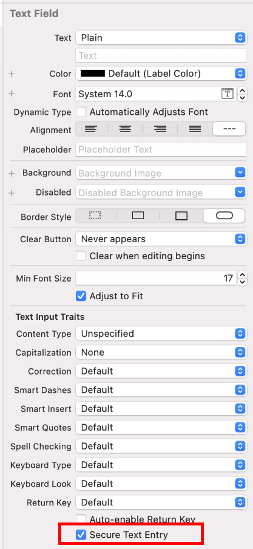

# データストレージとプライバシー要件

## MSTG-STORAGE-1
個人識別情報、ユーザ資格情報、暗号化キーなどの機密データを格納するために、システムの資格情報保存機能を使用している。

ローカルストレージに保存される機密データは、可能な限り少なくする必要がある。しかし、ほとんどの実用的なシナリオでは、少なくとも一部のユーザデータを保存する必要がある。幸いなことに、iOS はセキュアストレージ API を提供しており、開発者はすべての iOS デバイスに搭載されている暗号ハードウェアを使用することができる。これらの API を正しく使用すれば、ハードウェアに支えられた 256 ビット AES 暗号化によって、機密データやファイルを安全に保護することができる。

### データ保護 API

アプリケーション開発者は、iOS Data Protection API を活用して、フラッシュメモリに保存されたユーザデータに対する詳細なアクセス制御を実装することができる。この API は、iPhone 5S で導入された Secure Enclave Processor（SEP）上に構築されている。SEPは、データ保護とキー管理のための暗号化操作を提供するコプロセッサである。デバイス固有のHardware Key であるデバイス UID（Unique ID）を Secure Enclave に埋め込むことで、 OS カーネルが侵害された場合でもデータ保護の完全性を確保することができる。

データ保護アーキテクチャは、キーの階層構造に基づいている。UID とユーザの Passcode Key（ PBKDF2 アルゴリズムによってユーザのパスフレーズから導き出される）は、この階層の最上位に位置する。これらは、異なるデバイスの状態（例：デバイスのロック/ロック解除）に関連付けられた、いわゆる Class Key の「ロック解除」に使用できる。

iOS のファイルシステムに保存されるすべてのファイルは、File Metadata に含まれるファイルごとのキーで暗号化される。メタデータは File System Key で暗号化され、ファイル作成時にアプリが選択した保護クラスに対応する Class Key でラップされる。

次の図は、[iOS Data Protection Key Hierarchy](https://support.apple.com/ja-jp/guide/security/welcome/web) を示している。


ファイルは、4つの異なる保護クラスのいずれかに割り当てることができる。これらの保護クラスについては、[iOS Security Guide](https://support.apple.com/ja-jp/guide/security/welcome/web) を参照すること。

* Complete Protection (NSFileProtectionComplete) : ユーザパスコードとデバイス UID から派生したキーが、この Class Key を保護する。派生したキーはデバイスがロックされた直後にメモリから消去されるため、ユーザがデバイスのロックを解除するまでデータにアクセスできなくなる。
* Protected Unless Open (NSFileProtectionCompleteUnlessOpen) : 
この保護クラスは Complete Protection と似ているが、ロック解除時にファイルが開かれると、ユーザがデバイスをロックしても、アプリはファイルへのアクセスを継続することができる。この保護クラスは、メールの添付ファイルをバックグラウンドでダウンロードする場合などに使用される。
* Protected Until First User Authentication (NSFileProtectionCompleteUntilFirstUserAuthentication) : ユーザがデバイス起動後初めてロックを解除すると同時に、ファイルにアクセスできるようになる。その後、ユーザがデバイスをロックし、Class Key がメモリから削除されない場合でも、ファイルにアクセスできる。
* No Protection (NSFileProtectionNone) : この保護 Class Key は、UID のみで保護される。Class Key は "Effaceable Storage" に保存される。これは、iOS デバイスのフラッシュメモリの領域で、少量のデータの保存が可能である。この保護クラスは、高速なリモートワイプ（ Class Key を即座に削除し、データにアクセスできなくする）のために存在する。

NSFileProtectionNone を除くすべての Class Key は、デバイスの UID とユーザのパスコードから派生したキーで暗号化されている。その結果、復号はデバイス自身でのみ可能であり、正しいパスコードが必要となる。

iOS 7 以降、デフォルトのデータ保護クラスは "Protected Until First User Authentication"。

参考資料
* [owasp-mastg Testing Local Data Storage (MSTG-STORAGE-1 and MSTG-STORAGE-2) Data Protection API](https://github.com/OWASP/owasp-mastg/blob/v1.5.0/Document/0x06d-Testing-Data-Storage.md#data-protection-api)

ルールブック
* [iOS Data Protection API を活用して、フラッシュメモリに保存されたユーザデータにアクセス制御を実装する（必須）](#ios-data-protection-api-を活用してフラッシュメモリに保存されたユーザデータにアクセス制御を実装する必須)

### Keychain
iOS の Keychain は暗号鍵やセッショントークンなどの短く機密性の高いデータを安全に保管するために使用される。これは Keychain API を介してのみアクセスできる SQLite データベースとして実装されている。

macOS では、すべてのユーザアプリケーションが好きなだけ Keychain を作成することができ、すべてのログインアカウントが独自の Keychain を持つことができる。

[iOS の Keychain の構造](https://developer.apple.com/documentation/security/keychain_services)は異なっており、すべてのアプリで使用できる Keychain は 1 つだけである。[項目へのアクセスは、属性 ](https://help.apple.com/xcode/mac/current/#/dev88ff319e7)[kSecAttrAccessGroup](https://developer.apple.com/documentation/security/ksecattraccessgroup) のアクセスグループ機能を介して、同じ開発者によって署名されたアプリ間でアクセスを共有することができる。Keychainへのアクセスは securityd デーモンにより管理され、アプリの Keychain-access-groups, application-identifier, application-group エンタイトルメントに従ってアクセスを許可する。

[Keychain API](https://developer.apple.com/documentation/security/keychain_services) には、主に以下の操作が存在する。

* SecItemAdd
* SecItemUpdate
* SecItemCopyMatching
* SecItemDelete

Keychain に格納されるデータは、ファイルの暗号化に使用されるクラス構造と同様のクラス構造によって保護されている。Keychain に追加されたアイテムは、バイナリ plist としてエンコードされ、Galois/Counter Mode (GCM) でアイテムごとに 128 ビットの AES キーを使用して暗号化される。より大きなサイズのデータは Keychain に直接保存されないことに注意する。それが Data Protection API の目的である。SecItemAdd または SecItemUpdate のコールで、 kSecAttrAccessible キーを設定することにより、 Keychain アイテムのデータ保護を設定することができる。[kSecAttrAccessible の設定可能なアクセシビリティ値](https://developer.apple.com/documentation/security/keychain_services/keychain_items/item_attribute_keys_and_values#1679100)は、以下のKeychain Data Protection クラスである。

* kSecAttrAccessibleAlways: Keychain アイテムのデータはデバイスがロックされているかどうかにかかわらず常にアクセスできる。なお、この項目は現在非推奨。
* kSecAttrAccessibleAlwaysThisDeviceOnly: Keychain アイテムのデータはデバイスがロックされているかどうかにかかわらず常にアクセスできる。データは iCloud やローカルのバックアップには含まれない。なお、この項目は現在非推奨。
* kSecAttrAccessibleAfterFirstUnlock: ユーザがデバイスのロックを一度解除するまで、再起動後に Keychain アイテムのデータにアクセスすることはできない。
* kSecAttrAccessibleAfterFirstUnlockThisDeviceOnly: ユーザがデバイスのロックを一度解除するまで、再起動後に Keychain アイテムのデータにアクセスすることはできない。この属性を持つアイテムは、新しいデバイスに移行されない。したがって、別のデバイスのバックアップから復元した後、これらのアイテムは存在しない。
* kSecAttrAccessibleWhenUnlocked: Keychain アイテムのデータはユーザによりデバイスがロック解除されている間のみアクセスできる。
* kSecAttrAccessibleWhenUnlockedThisDeviceOnly: Keychain アイテムのデータはユーザによりデバイスがロック解除されている間のみアクセスできる。データは iCloud やローカルのバックアップには含まれない。
* kSecAttrAccessibleWhenPasscodeSetThisDeviceOnly: Keychain のデータはデバイスがロック解除されている場合のみアクセスできる。この保護クラスは、デバイスにパスコードが設定されている場合のみ使用できる。データは iCloud やローカルのバックアップには含まれない。

AccessControlFlags は、ユーザがキーを認証するためのメカニズムを定義する ( SecAccessControlCreateFlags ):

* kSecAccessControlDevicePasscode: パスコードを介してアイテムにアクセスする。
* kSecAccessControlBiometryAny: Touch ID に登録された指紋のいずれかを介してアイテムにアクセスする。指紋を追加または削除してもアイテムは無効にならない。
* kSecAccessControlBiometryCurrentSet: Touch ID に登録された指紋のいずれかを介してアイテムにアクセスする。指紋を追加または削除すると、アイテムが無効になる。
* kSecAccessControlUserPresence: 登録済みの指紋 (Touch ID を使用) のいずれか、またはデフォルトのパスコードを使用してアイテムにアクセスする。

Touch ID によって（ kSecAccessControlBiometryAny または kSecAccessControlBiometryCurrentSet を介して）保護されたキーは、Secure Enclave によって保護されることに注意する。 Keychain はトークンのみを保持し、実際のキーは保持しない。キーは Secure Enclave に存在する。

iOS 9 以降では、Secure Enclave で ECC ベースの署名操作を実行できる。そのシナリオでは、秘密キーと暗号化操作は Secure Enclave 内に存在する。ECC キーの作成については、「静的解析」を参照すること。iOS 9 は 256 ビット ECC のみをサポートする。さらに、公開キーは Secure Enclave に保存できないため、Keychain に保存する必要がある。キーを作成したら、kSecAttrKeyType を使用して、キーを使用するアルゴリズムのタイプを指定できる。

これらのメカニズムを使用する場合は、パスコードが設定されているかどうかをテストすることが推奨される。iOS8 では、 kSecAttrAccessibleWhenPasscodeSetThisDeviceOnly 属性によって保護された Keychain 内のアイテムから読み書きできるかどうかを確認する必要がる。 iOS9 以降では LAContext を使用して、ロック画面が設定されているかどうかを確認できる。

Swift での例：

```swift
public func devicePasscodeEnabled() -> Bool {
    return LAContext().canEvaluatePolicy(.deviceOwnerAuthentication, error: nil)
}
```

Objective-Cでの例:

```objectivec
-(BOOL)devicePasscodeEnabled:(LAContex)context{
  if ([context canEvaluatePolicy:LAPolicyDeviceOwnerAuthentication error:nil]) {
        return true;
    } else {
        return false;
    }
}
```

**Keychain データの永続性**

iOS では、アプリケーションがアンインストールされると、ワイプされるアプリケーションサンドボックスによって保存されたデータとは異なり、アプリケーションによって使用される Keychain データはデバイスによって保持される。ユーザが工場出荷時設定へのリセットを実行せずにデバイスを販売した場合、デバイスの購入者は、以前のユーザが使用していたのと同じアプリケーションを再インストールすることで、以前のユーザのアプリケーションアカウントとデータにアクセスできる可能性がある。これを実行するのに技術的な能力は必要ない。

iOS アプリケーションを評価するときは、Keychain データの永続性を探す必要がある。これは通常、アプリケーションを使用して Keychain に保存できるサンプルデータを生成し、アプリケーションをアンインストールした後再インストールし、アプリケーションのインストール間でデータが保持されているかどうかを確認することによって行われる。objection（ runtime mobile exploration toolkit ）を使用して、Keychain データをダンプする。次の objection コマンドは、この手順を示す。

```bash
...itudehacks.DVIAswiftv2.develop on (iPhone: 13.2.3) [usb] # ios keychain dump
Note: You may be asked to authenticate using the devices passcode or TouchID
Save the output by adding `--json keychain.json` to this command
Dumping the iOS keychain...
Created                    Accessible                      ACL    Type      Account                    Service                                                        Data
-------------------------  ------------------------------  -----  --------  -------------------------  -------------------------------------------------------------  ------------------------------------
2020-02-11 13:26:52 +0000  WhenUnlocked                    None   Password  keychainValue              com.highaltitudehacks.DVIAswiftv2.develop                      mysecretpass123
```

アプリケーションがアンインストールされたときにデータを強制的に消去するために開発者が使用できる iOS API は存在しない。代わりに、開発者は次の手順を実行して、アプリケーションのインストール間で Keychain データが保持されないようにする必要がある。

* インストール後にアプリケーションを初めて起動するときに、アプリケーションに関連付けられているすべての Keychain データを消去する。これにより、デバイスの 2 番目のユーザが前のユーザのアカウントに誤ってアクセスするのを防ぐことができる。次の Swift の例は、この消去手順の基本的なデモである。

```swift
let userDefaults = UserDefaults.standard

if userDefaults.bool(forKey: "hasRunBefore") == false {
    // Remove Keychain items here

    // Update the flag indicator
    userDefaults.set(true, forKey: "hasRunBefore")
    userDefaults.synchronize() // Forces the app to update UserDefaults
}
```
* iOS アプリケーションのログアウト機能を開発する時は、アカウント ログアウトの一部として Keychain データが消去されることを確認する。これにより、ユーザはアプリケーションをアンインストールする前にアカウントをクリアできる。

**静的解析**

iOS アプリのソースコードにアクセスできる場合、アプリ全体で保存および処理される機密データを特定する。これには、パスワード、シークレットキー、個人を特定できる情報（ PII ）などが含まれるが、業界の規制、法律、会社のポリシーによって機密であると特定された他のデータも含まれる可能性がある。以下に挙げるローカルストレージ API のいずれかを介して保存されているデータを探す。

機密性の高いデータは、適切な保護がないまま保存されることがないように注意する。たとえば、認証トークンを暗号化せずに NSUserDefaults に保存しない。また、暗号化 key を .plist ファイルに保存したり、コード内の文字列としてハードコードしたり、予測可能な難読化関数や安定した属性に基づく key 導出関数を使って生成したりすることは避ける。

機密性の高いデータは、Keychain API （セキュア・エンクレーブ内に保存される）を使用するか、エンベロープ暗号化を使って暗号化して保存する必要がある。エンベロープ暗号化、またはキーラッピングは、対称型暗号化を使用してキーの材料をカプセル化する暗号構造である。データ暗号化 key （ DEK ）は、Keychain に安全に保管されなければならない暗号化 key （ KEK ）で暗号化することができる。暗号化された DEK は、 NSUserDefaults に保存するか、ファイルに書き込むことができる。必要なときに、アプリケーションは KEK を読み取り、DEK を復号化する。暗号キーの暗号化について詳しくは、[ OWASP Cryptographic Storage Cheat Sheet ](https://cheatsheetseries.owasp.org/cheatsheets/Cryptographic_Storage_Cheat_Sheet.html#encrypting-stored-keys)を参照する。

**Keychain**

暗号化は、秘密鍵が安全な設定で Keychain に保存されるように実装する必要があり、理想的には kSecAttrAccessibleWhenPasscodeSetThisDeviceOnly を使用する。これにより、ハードウェアでバックアップされたストレージ機構を使用することが保証される。 AccessControlFlags が、Keychain 内のキーのセキュリティポリシーに従って設定されていることを確認する。

[Keychain を使用してデータ](https://developer.apple.com/library/archive/samplecode/GenericKeychain/Introduction/Intro.html#//apple_ref/doc/uid/DTS40007797-Intro-DontLinkElementID_2)を保存、更新、削除する一般的な例は、Apple の公式文書に記載されている。また、Apple の公式ドキュメントには、[ Touch ID とパスコードで保護された key ](https://developer.apple.com/documentation/localauthentication/accessing_keychain_items_with_face_id_or_touch_id) を使用する例も含まれている。

キーを作成するために使用できる Swift のサンプルコードである ( kSecAttrTokenID が String: kSecAttrTokenIDSecureEnclave であることに注目すること: これは Secure Enclave を直接使用したいことを示する。):

```swift
// private key parameters
let privateKeyParams = [
    kSecAttrLabel as String: "privateLabel",
    kSecAttrIsPermanent as String: true,
    kSecAttrApplicationTag as String: "applicationTag",
] as CFDictionary

// public key parameters
let publicKeyParams = [
    kSecAttrLabel as String: "publicLabel",
    kSecAttrIsPermanent as String: false,
    kSecAttrApplicationTag as String: "applicationTag",
] as CFDictionary

// global parameters
let parameters = [
    kSecAttrKeyType as String: kSecAttrKeyTypeEC, //なお、 kSecAttrKeyTypeEC は現在非推奨。
    kSecAttrKeySizeInBits as String: 256,
    kSecAttrTokenID as String: kSecAttrTokenIDSecureEnclave,
    kSecPublicKeyAttrs as String: publicKeyParams,
    kSecPrivateKeyAttrs as String: privateKeyParams,
] as CFDictionary

var pubKey, privKey: SecKey?
let status = SecKeyGeneratePair(parameters, &pubKey, &privKey) //なお、 SecKeyGeneratePair は現在非推奨。

if status != errSecSuccess {
    // Keys created successfully
}
```

iOS アプリに安全でないデータストレージがないか確認する場合は、デフォルトではデータを暗号化しない以降のデータ保存方法を考慮すること。

参考資料
* [owasp-mastg Testing Local Data Storage (MSTG-STORAGE-1 and MSTG-STORAGE-2) The Keychain](https://github.com/OWASP/owasp-mastg/blob/v1.5.0/Document/0x06d-Testing-Data-Storage.md#the-keychain)
* [owasp-mastg Testing Local Data Storage (MSTG-STORAGE-1 and MSTG-STORAGE-2) Static Analysis](https://github.com/OWASP/owasp-mastg/blob/v1.5.0/Document/0x06d-Testing-Data-Storage.md#static-analysis)

ルールブック
* [Keychain Services API を使用してセキュアに値を保存する（必須）](#keychain-services-api-を使用してセキュアに値を保存する必須)

### NSUserDefaults
[NSUserDefaults](https://developer.apple.com/documentation/foundation/nsuserdefaults) クラスは、デフォルトシステムと連携するためのプログラムインターフェースを提供する。デフォルトシステムでは、アプリケーションがユーザ設定に従って動作をカスタマイズできる。NSUserDefaults によって保存されたデータは、アプリケーションバンドルで表示することができる。このクラスは、plist ファイルにデータを保存するが、少量のデータで使用することを想定している。

参考資料
* [owasp-mastg Testing Local Data Storage (MSTG-STORAGE-1 and MSTG-STORAGE-2) NSUserDefaults](https://github.com/OWASP/owasp-mastg/blob/v1.5.0/Document/0x06d-Testing-Data-Storage.md#nsuserdefaults)

ルールブック
* [データ量による保存先の選定（推奨）](#データ量による保存先の選定推奨)

### ファイルシステム

#### NSData

NSData は静的なデータオブジェクトを作成し、 NSMutableData は動的なデータオブジェクトを作成する。 NSData と NSMutableData は通常、データストレージとして使用されるが、データオブジェクトに含まれるデータをアプリケーション間でコピーしたり移動したりする分散オブジェクトアプリケーションにも有効である。 以下は NSData オブジェクトの書き込みに使用されるメソッドである。
* NSDataWritingWithoutOverwriting
* NSDataWritingFileProtectionNone
* NSDataWritingFileProtectionComplete
* NSDataWritingFileProtectionCompleteUnlessOpen
* NSDataWritingFileProtectionCompleteUntilFirstUserAuthentication

参考資料
* [owasp-mastg Testing Local Data Storage (MSTG-STORAGE-1 and MSTG-STORAGE-2) File system](https://github.com/OWASP/owasp-mastg/blob/v1.5.0/Document/0x06d-Testing-Data-Storage.md#file-system)

ルールブック
* [iOS Data Protection API を活用して、フラッシュメモリに保存されたユーザデータにアクセス制御を実装する（必須）](#ios-data-protection-api-を活用してフラッシュメモリに保存されたユーザデータにアクセス制御を実装する必須)

#### writeToFile
データを NSData クラスの一部として保存する。

参考資料
* [owasp-mastg Testing Local Data Storage (MSTG-STORAGE-1 and MSTG-STORAGE-2) File system](https://github.com/OWASP/owasp-mastg/blob/v1.5.0/Document/0x06d-Testing-Data-Storage.md#file-system)

#### ファイルパスを管理する

NSSearchPathForDirectoriesInDomains, NSTemporaryDirectory: ファイルパスの管理に使用する。

参考資料
* [owasp-mastg Testing Local Data Storage (MSTG-STORAGE-1 and MSTG-STORAGE-2) File system](https://github.com/OWASP/owasp-mastg/blob/v1.5.0/Document/0x06d-Testing-Data-Storage.md#file-system)

#### NSFileManager

NSFileManager を使用することで、ファイルシステムの内容を調べたり変更したりすることができる。また、 createFileAtPath を使用すると、ファイルを作成し、そのファイルに書き込むことができる。

次の例は、FileManager クラスを使用して完全な暗号化ファイルを作成する方法を示している。詳細については、Apple Developer Documentation ["Encrypting Your App's Files"](https://developer.apple.com/documentation/uikit/protecting_the_user_s_privacy/encrypting_your_app_s_files) を参照すること。

Swift での例：

```swift
FileManager.default.createFile(
    atPath: filePath,
    contents: "secret text".data(using: .utf8),
    attributes: [FileAttributeKey.protectionKey: FileProtectionType.complete]
)
```

Objective-C での例:

```objectivec
[[NSFileManager defaultManager] createFileAtPath:[self filePath]
  contents:[@"secret text" dataUsingEncoding:NSUTF8StringEncoding]
  attributes:[NSDictionary dictionaryWithObject:NSFileProtectionComplete
  forKey:NSFileProtectionKey]];
```

参考資料
* [owasp-mastg Testing Local Data Storage (MSTG-STORAGE-1 and MSTG-STORAGE-2) File system](https://github.com/OWASP/owasp-mastg/blob/v1.5.0/Document/0x06d-Testing-Data-Storage.md#file-system)

ルールブック
* [FileManager クラスでの暗号化の使用方法（必須）](#filemanager-クラスでの暗号化の使用方法必須)

### CoreData/SQLite データベース

#### Core Data

 [Core Data](https://developer.apple.com/library/archive/documentation/Cocoa/Conceptual/CoreData/nsfetchedresultscontroller.html#//apple_ref/doc/uid/TP40001075-CH8-SW1)は、アプリケーション内のオブジェクトの Model Layer を管理するためのフレームワークである。オブジェクトのライフサイクルやオブジェクトグラフの管理に関連する一般的なタスク (永続性を含む) に対する一般的な自動化されたソリューションを提供する。 [ Core Data は永続的な保存場所として SQLite を使用できる](https://cocoacasts.com/what-is-the-difference-between-core-data-and-sqlite/)が、フレームワーク自体はデータベースではない。

Core Data はデフォルトではデータを暗号化しない。MITRE Corporationの 研究プロジェクト（ iMAS ）の一環として、オープンソースの iOS セキュリティコントロールに焦点を当て、Core Data に追加の暗号化レイヤーを追加することができるようになった。詳しくは [GitHub Repo](https://github.com/project-imas/encrypted-core-data) を参照する。

参考資料
* [owasp-mastg Testing Local Data Storage (MSTG-STORAGE-1 and MSTG-STORAGE-2) Core Data](https://github.com/OWASP/owasp-mastg/blob/v1.5.0/Document/0x06d-Testing-Data-Storage.md#coredata)

#### SQLite Databases

アプリで SQLite を使用する場合は、 SQLite 3 ライブラリをアプリに追加する必要がある。 このライブラリは、 SQLite コマンドの API を提供する C++ ラッパーである。

参考資料
* [owasp-mastg Testing Local Data Storage (MSTG-STORAGE-1 and MSTG-STORAGE-2) SQLite Databases  ](https://github.com/OWASP/owasp-mastg/blob/v1.5.0/Document/0x06d-Testing-Data-Storage.md#sqlite-databases)

#### Firebase Real-time Databases

Firebase は 15 を超える製品を備えた開発プラットフォームであり、そのうちの 1 つが Firebase Real-time Database である。アプリケーション開発者は、 NoSQL クラウドでホストされたデータベースと、データの保存および同期をするために活用できる。データは JSON として保存され、接続されたすべてのクライアントとリアルタイムで同期され、アプリケーションがオフラインになっても引き続き利用できる。

誤った設定のFirebaseインスタンスは、以下のネットワークコールを行うことで特定することができる。

`https://\<firebaseProjectName\>.firebaseio.com/.json`

firebaseProjectName は、プロパティリスト( .plist )ファイルから取得することができる。たとえば、PROJECT_ID key には、対応する Firebase プロジェクト名が GoogleService-Info.plist ファイルに格納されている。

また、アナリストは、以下に示すように、上記のタスクを自動化する Python スクリプトである [Firebase Scanner](https://github.com/shivsahni/FireBaseScanner) を使用することもできる。

```bash
python FirebaseScanner.py -f <commaSeparatedFirebaseProjectNames>
```

参考資料
* [owasp-mastg Testing Local Data Storage (MSTG-STORAGE-1 and MSTG-STORAGE-2) Firebase Real-time Databases ](https://github.com/OWASP/owasp-mastg/blob/v1.5.0/Document/0x06d-Testing-Data-Storage.md#firebase-real-time-databases)

#### Realm databases

[Realm Objective-C](https://www.mongodb.com/docs/realm/sdk/swift/) と [Realm Swift](https://www.mongodb.com/docs/realm/sdk/swift/) は Apple から提供されてはいないが、着目する必要がある。設定で暗号化が有効になっていない限り、すべて暗号化されずに保存される。

次の例は、Realm データベースで暗号化を使用する方法を示す。

```swift
// Open the encrypted Realm file where getKey() is a method to obtain a key from the Keychain or a server
let config = Realm.Configuration(encryptionKey: getKey())
do {
 let realm = try Realm(configuration: config)
 // Use the Realm as normal
} catch let error as NSError {
 // If the encryption key is wrong, `error` will say that it's an invalid database
 fatalError("Error opening realm: \(error)")
}
```

参考資料
* [owasp-mastg Testing Local Data Storage (MSTG-STORAGE-1 and MSTG-STORAGE-2) Real Databases ](https://github.com/OWASP/owasp-mastg/blob/v1.5.0/Document/0x06d-Testing-Data-Storage.md#realm-databases)

#### Couchbase Lite Databases

[Couchbase Lite](https://github.com/couchbase/couchbase-lite-ios) は、同期可能な軽量の組み込みドキュメント指向（ NoSQL ）データベースエンジンである。 iOS および macOS 用にネイティブにコンパイルされる。

参考資料
* [owasp-mastg Testing Local Data Storage (MSTG-STORAGE-1 and MSTG-STORAGE-2) Couchbase Lite Databases ](https://github.com/OWASP/owasp-mastg/blob/v1.5.0/Document/0x06d-Testing-Data-Storage.md#couchbase-lite-databases)

#### YapDatabase

[YapDatabase](https://github.com/yapstudios/YapDatabase) は、 SQLite の上に構築されたキー/バリューの保管場所である。

参考資料
* [owasp-mastg Testing Local Data Storage (MSTG-STORAGE-1 and MSTG-STORAGE-2) YapDatabase ](https://github.com/OWASP/owasp-mastg/blob/v1.5.0/Document/0x06d-Testing-Data-Storage.md#yapdatabase)

**動的解析**

iOS のネイティブ機能を利用せずに、機密情報（認証情報やキーなど）が安全でない状態で保存されているかどうかを判断する方法の 1 つが、アプリのデータディレクトリを分析することである。特定の機能がトリガーされた後にのみ、アプリが機密データを保存する可能性があるため、データを分析される前にすべてのアプリ機能をトリガーすることが重要である。その後、一般的なキーワードとアプリ固有のデータに従って、データダンプの静的解析を行うことができる。

以下の手順で、ジェイルブレイクされた iOS デバイスでアプリケーションがローカルにデータを保存する方法を確認することができる。

1. 潜在的な機密データを保存する機能をトリガーする。
2. iOS デバイスに接続し、その Bundle ディレクトリに移動する（ iOS バージョン 8.0 以降に適用される）：
/var/mobile/Containers/Data/Application/$APP_ID/
3. 保存したデータで grep を実行する。例：grep -iRn "USERID"
4. 機密データがプレーンテキストで保存されている場合、アプリはこのテストに失敗する。

iMazing などのサードパーティアプリケーションを使用することで、ジェイルブレイクされていない iOS デバイスのアプリのデータディレクトリを解析することができる。

1. 潜在的に機密性の高いデータを格納する機能をトリガーする。
2. iOS デバイスをホストコンピュータに接続し、 iMazing を起動する。
3. "Apps" を選択し、目的の iOS アプリケーションを右クリックし、 "Extract App" を選択する。
4. 出力ディレクトリに移動し、 $APP_NAME.imazing を見つける。それを $APP_NAME.zip にリネームする。
5. ZIP ファイルを解凍する。その後、アプリケーションデータを解析することができる。

iMazing のようなツールは、デバイスから直接データをコピーしないことに注意する。それらは作成したバックアップからデータを抽出しようとする。そのため、 iOS デバイスに保存されている全てのアプリデータを取得することは不可能となる。全てのフォルダがバックアップに含まれるわけでは無い。ジェイルブレイクしたデバイスを使用するか、アプリを Frida で再パッケージ化し、 Objection のようなツールを使用してすべてのデータとファイルにアクセスする。

Frida ライブラリをアプリに追加し、「Dynamic Analysis on Non-Jailbroken Devices」（「Tampering and Reverse Engineering on iOS」の章より）の説明に従って再パッケージ化した場合、「Basic Security Testing on iOS」の章の、「[Host-Device Data Transfer](https://github.com/OWASP/owasp-mastg/blob/v1.5.0/Document/0x06b-Basic-Security-Testing.md#host-device-data-transfer)」のセクションで説明したように、[objection](https://github.com/sensepost/objection) を使ってアプリのデータディレクトリから直接ファイルを転送したり、[objection でファイルを読み取ったり](https://github.com/sensepost/objection/wiki/Using-objection#getting-started-ios-edition)することが可能である。

Keychain のコンテンツは、動的解析中にダンプすることができる。ジェイルブレイクしたデバイスでは、"Basic Security Testing on iOS "の章で説明されているように、Keychain dumper を使用することができる。

Keychain のコンテンツは動的解析中に吐き出すことができる。ジェイルブレイクしたデバイスでは、「Basic Security Testing on iOS」の章で説明したように、[Keychain dumper](https://github.com/ptoomey3/Keychain-Dumper/) を使用することができる。

Keychain ファイルのパスは以下の通り。
```bash
/private/var/Keychains/keychain-2.db
```

ジェイルブレイクされていないデバイスでは、 Objection を使用して、アプリによって作成および保存された [Keychain アイテムをダンプ](https://github.com/sensepost/objection/wiki/Notes-About-The-Keychain-Dumper)ことができる。

参考資料
* [owasp-mastg Testing Local Data Storage (MSTG-STORAGE-1 and MSTG-STORAGE-2) Dynamic Analysis](https://github.com/OWASP/owasp-mastg/blob/v1.5.0/Document/0x06d-Testing-Data-Storage.md#dynamic-analysis)

### Xcode と iOS シミュレータによる動的解析

このテストは、 Xcode と iOS シミュレータが必要なため、 macOS でのみ利用可能である。

ローカルストレージをテストし、その中にどのようなデータが保存されているかを確認するために、 iOS デバイスを持っていることは必須ではない。ソースコードと Xcode にアクセスすることで、アプリをビルドして iOS シミュレータにデプロイすることができる。iOS シミュレータの現在のデバイスのファイルシステムは、

 `~/Library/Developer/CoreSimulator/Devices`

 で利用できる。

iOS シミュレータでアプリが起動したら、以下のコマンドで開始された最新のシミュレーターのディレクトリに移動できる

```bash
$ cd ~/Library/Developer/CoreSimulator/Devices/$(
ls -alht ~/Library/Developer/CoreSimulator/Devices | head -n 2 |
awk '{print $9}' | sed -n '1!p')/data/Containers/Data/Application
```

上記のコマンドは、開始された最新のシミュレーターの UUID を自動的に検出する。ここで、アプリ名やアプリのキーワードを grep する必要がある。これにより、アプリの UUID が表示される。

```bash
grep -iRn keyword .
```

そして、アプリのファイルシステムの変更を監視・検証し、アプリの使用中にファイル内に機密情報が保存されていないかどうかを調査することができる。

参考資料
* [owasp-mastg Testing Local Data Storage (MSTG-STORAGE-1 and MSTG-STORAGE-2) Dynamic Analysis with Xcode and iOS simulator](https://github.com/OWASP/owasp-mastg/blob/v1.5.0/Document/0x06d-Testing-Data-Storage.md#dynamic-analysis-with-xcode-and-ios-simulator)

### Objection を用いた動的解析

[Objection](https://github.com/sensepost/objection) runtime mobile exploration toolkitを使用することで、アプリケーションのデータ保存メカニズムによって引き起こされた脆弱性を見つけることができる。 Objection はジェイルブレイクデバイスでなくても使用できるが、 [iOS アプリケーションにパッチ](https://github.com/sensepost/objection/wiki/Patching-iOS-Applications)を適用する必要がある。

参考資料
* [owasp-mastg Testing Local Data Storage (MSTG-STORAGE-1 and MSTG-STORAGE-2) Dynamic Analysis with Objection](https://github.com/OWASP/owasp-mastg/blob/v1.5.0/Document/0x06d-Testing-Data-Storage.md#dynamic-analysis-with-objection)

#### Keychain の読み取り

Objection を使って Keychain を読み取るには、以下のコマンドを実行する。

```bash
...itudehacks.DVIAswiftv2.develop on (iPhone: 13.2.3) [usb] # ios keychain dump
Note: You may be asked to authenticate using the devices passcode or TouchID
Save the output by adding `--json keychain.json` to this command
Dumping the iOS keychain...
Created                    Accessible                      ACL    Type      Account                    Service                                                        Data
-------------------------  ------------------------------  -----  --------  -------------------------  -------------------------------------------------------------  ------------------------------------
2020-02-11 13:26:52 +0000  WhenUnlocked                    None   Password  keychainValue              com.highaltitudehacks.DVIAswiftv2.develop                      mysecretpass123
```

参考資料
* [owasp-mastg Testing Local Data Storage (MSTG-STORAGE-1 and MSTG-STORAGE-2) Dynamic Analysis Reading the Keychain](https://github.com/OWASP/owasp-mastg/blob/v1.5.0/Document/0x06d-Testing-Data-Storage.md#reading-the-keychain)


#### Binary Cookies の検索

iOS アプリケーションは、アプリケーションサンドボックスに Binary Cookie ファイルを保存することがよくある。 Cookie は、アプリケーションの WebView の Cookie データを含むバイナリファイルである。objection を使って、これらのファイルを JSON 形式に変換し、データを検査することができる。

```bash
...itudehacks.DVIAswiftv2.develop on (iPhone: 13.2.3) [usb] # ios cookies get --json
[
    {
        "domain": "highaltitudehacks.com",
        "expiresDate": "2051-09-15 07:46:43 +0000",
        "isHTTPOnly": "false",
        "isSecure": "false",
        "name": "username",
        "path": "/",
        "value": "admin123",
        "version": "0"
    }
]
```

参考資料
* [owasp-mastg Testing Local Data Storage (MSTG-STORAGE-1 and MSTG-STORAGE-2) Dynamic Analysis Searching for Binary Cookies](https://github.com/OWASP/owasp-mastg/blob/v1.5.0/Document/0x06d-Testing-Data-Storage.md#searching-for-binary-cookies)

#### プロパティリストファイルの検索

iOS アプリケーションは、多くの場合、アプリケーションサンドボックスと IPA パッケージの両方に保存されているプロパティリスト (plist) ファイルにデータを保存する。これらのファイルには、ユーザ名やパスワードなどの機密情報が含まれていることがある。したがって、iOS 評価の際には、これらのファイルの内容を検査する必要がある。plist ファイルを検査するには、ios plist cat plistFileName.plist コマンドを使用する。

userInfo.plist というファイルを見つけるには、 env コマンドを使用する。アプリケーションの Library,Caches,Documents の各ディレクトリの場所が出力される。

```bash
...itudehacks.DVIAswiftv2.develop on (iPhone: 13.2.3) [usb] # env
Name               Path
-----------------  -------------------------------------------------------------------------------------------
BundlePath         /private/var/containers/Bundle/Application/B2C8E457-1F0C-4DB1-8C39-04ACBFFEE7C8/DVIA-v2.app
CachesDirectory    /var/mobile/Containers/Data/Application/264C23B8-07B5-4B5D-8701-C020C301C151/Library/Caches
DocumentDirectory  /var/mobile/Containers/Data/Application/264C23B8-07B5-4B5D-8701-C020C301C151/Documents
LibraryDirectory   /var/mobile/Containers/Data/Application/264C23B8-07B5-4B5D-8701-C020C301C151/Library
```

参考資料
* [owasp-mastg Testing Local Data Storage (MSTG-STORAGE-1 and MSTG-STORAGE-2) Dynamic Analysis Searching for Property List Files](https://github.com/OWASP/owasp-mastg/blob/v1.5.0/Document/0x06d-Testing-Data-Storage.md#searching-for-property-list-files)

Documentsディレクトリに移動し、lsを使用してすべてのファイルをリストアップする。

```bash
...itudehacks.DVIAswiftv2.develop on (iPhone: 13.2.3) [usb] # ls
NSFileType      Perms  NSFileProtection                      Read    Write    Owner         Group         Size      Creation                   Name
------------  -------  ------------------------------------  ------  -------  ------------  ------------  --------  -------------------------  ------------------------
Directory         493  n/a                                   True    True     mobile (501)  mobile (501)  192.0 B   2020-02-12 07:03:51 +0000  default.realm.management
Regular           420  CompleteUntilFirstUserAuthentication  True    True     mobile (501)  mobile (501)  16.0 KiB  2020-02-12 07:03:51 +0000  default.realm
Regular           420  CompleteUntilFirstUserAuthentication  True    True     mobile (501)  mobile (501)  1.2 KiB   2020-02-12 07:03:51 +0000  default.realm.lock
Regular           420  CompleteUntilFirstUserAuthentication  True    True     mobile (501)  mobile (501)  284.0 B   2020-05-29 18:15:23 +0000  userInfo.plist
Unknown           384  n/a                                   True    True     mobile (501)  mobile (501)  0.0 B     2020-02-12 07:03:51 +0000  default.realm.note

Readable: True  Writable: True
```

ios plist cat コマンドを実行し、userInfo.plist ファイルの内容を確認する。

```bash
...itudehacks.DVIAswiftv2.develop on (iPhone: 13.2.3) [usb] # ios plist cat userInfo.plist
{
        password = password123;
        username = userName;
}
```

#### SQLiteデータベースの検索

iOS アプリケーションは通常、SQLite データベースを使用して、アプリケーションで必要なデータを保存する。テスターは、これらのファイルのデータ保護値とその内容に機密データがないか確認する必要がある。 Objection には、SQLite データベースと対話するためのモジュールが含まれている。これは、スキーマとそのテーブルをダンプし、レコードをクエリすることができる。

```bash
...itudehacks.DVIAswiftv2.develop on (iPhone: 13.2.3) [usb] # sqlite connect Model.sqlite
Caching local copy of database file...
Downloading /var/mobile/Containers/Data/Application/264C23B8-07B5-4B5D-8701-C020C301C151/Library/Application Support/Model.sqlite to /var/folders/4m/dsg0mq_17g39g473z0996r7m0000gq/T/tmpdr_7rvxi.sqlite
Streaming file from device...
Writing bytes to destination...
Successfully downloaded /var/mobile/Containers/Data/Application/264C23B8-07B5-4B5D-8701-C020C301C151/Library/Application Support/Model.sqlite to /var/folders/4m/dsg0mq_17g39g473z0996r7m0000gq/T/tmpdr_7rvxi.sqlite
Validating SQLite database format
Connected to SQLite database at: Model.sqlite

SQLite @ Model.sqlite > .tables
+--------------+
| name         |
+--------------+
| ZUSER        |
| Z_METADATA   |
| Z_MODELCACHE |
| Z_PRIMARYKEY |
+--------------+
Time: 0.013s

SQLite @ Model.sqlite > select * from Z_PRIMARYKEY
+-------+--------+---------+-------+
| Z_ENT | Z_NAME | Z_SUPER | Z_MAX |
+-------+--------+---------+-------+
| 1     | User   | 0       | 0     |
+-------+--------+---------+-------+
1 row in set
Time: 0.013s
```

参考資料
* [owasp-mastg Testing Local Data Storage (MSTG-STORAGE-1 and MSTG-STORAGE-2) Dynamic Analysis Searching for SQLite Databases](https://github.com/OWASP/owasp-mastg/blob/v1.5.0/Document/0x06d-Testing-Data-Storage.md#searching-for-sqlite-databases)

#### キャッシュのデータベースを検索

デフォルトでは、NSURLSession は HTTP リクエストやレスポンスなどのデータを Cache.db データベースに保存する。トークン、ユーザ名、その他の機密情報がキャッシュされている場合、このデータベースには機密情報が含まれている可能性がある。キャッシュされた情報を見つけるには、アプリのデータディレクトリ（/var/mobile/Containers/Data/Application/\<UUID>）を開き、/Library/Caches/\<Bundle Identifier>に移動する。WebKit のキャッシュも Cache.db ファイルに保存されている。Objection では、通常の SQLite データベースであるため、sqlite connect Cache.db というコマンドでデータベースを開いてやり取りすることができる。

リクエストやレスポンスに機密情報が含まれている可能性があるため、このデータのキャッシュを無効にすることを推奨する。以下のリストは、これを実現するためのさまざまな方法を示している。

1. ログアウト後にキャッシュされたレスポンスを削除することをお勧めする。これは Apple が提供する [removeAllCachedResponses](https://developer.apple.com/documentation/foundation/urlcache/1417802-removeallcachedresponses) というメソッドで行うことができる。 このメソッドは以下のように呼び出す。
    
    `URLCache.shared.removeAllCachedResponses()`

    このメソッドは、Cache.dbファイルからすべてのキャッシュされた要求と応答を削除する。

2. Cookie の利点を使用する必要がない場合は、URLSession の [.ephemeral](https://developer.apple.com/documentation/foundation/urlsessionconfiguration/1410529-ephemeral) 設定プロパティを使用することを推奨する。これにより、Cookie とキャッシュの保存が無効になる。

    [以下は Apple のドキュメント](https://developer.apple.com/documentation/foundation/urlsessionconfiguration/1410529-ephemeral)：

    ephemeral session 設定オブジェクトは対応するセッションオブジェクトがキャッシュ、資格情報ストア、またはセッション関連のデータをディスクに保存しないことを除いて、デフォルトセッション構成 (デフォルトを参照) に似ている。その代わり、セッション関連のデータは RAM に保存される。 ephemeral session がディスクにデータを書き込むのは、URLの内容をファイルに書き込むように指示したときだけである。

3. また、Cache Policy を [.notAllowed](https://developer.apple.com/documentation/foundation/urlcache/storagepolicy/notallowed) に設定することで、 Cache を無効にすることもできる。これは、 Cache をメモリやディスク上にキャッシュを保存することを無効にする。

参考資料
* [owasp-mastg Testing Local Data Storage (MSTG-STORAGE-1 and MSTG-STORAGE-2) Dynamic Analysis Searching for Cache Databases](https://github.com/OWASP/owasp-mastg/blob/v1.5.0/Document/0x06d-Testing-Data-Storage.md#searching-for-cache-databases)

ルールブック
* [キャッシュの仕様と Cache.db に保存されるデータを確認する（必須）](#キャッシュの仕様と-cachedb-に保存されるデータを確認する必須)

### ルールブック

1. [iOS Data Protection API を活用して、フラッシュメモリに保存されたユーザデータにアクセス制御を実装する（必須）](#ios-data-protection-api-を活用してフラッシュメモリに保存されたユーザデータにアクセス制御を実装する必須)
1. [インストール後の初回起動の keychain のデータを消去する（必須）](#インストール後の初回起動の-keychain-のデータを消去する必須)
1. [アカウントログアウト時の keychain データを消去する（必須）](#アカウントログアウト時の-keychain-データを消去する必須)
1. [Keychain Services API を使用してセキュアに値を保存する（必須）](#keychain-services-api-を使用してセキュアに値を保存する必須)
1. [データ量による保存先の選定（推奨）](#データ量による保存先の選定推奨)
1. [FileManager クラスでの暗号化の使用方法（必須）](#filemanager-クラスでの暗号化の使用方法必須)
1. [キャッシュの仕様と Cache.db に保存されるデータを確認する（必須）](#キャッシュの仕様と-cachedb-に保存されるデータを確認する必須)

#### iOS Data Protection API を活用して、フラッシュメモリに保存されたユーザデータにアクセス制御を実装する（必須）

iOS Data Protection API は大きなデータを扱う場合のファイルを利用することになる。 iOS では Data Protection というファイル保護の仕組みが備わっている。
iOS では、下記のデータ保護属性が定義されている。

* NSFileProtectionNone
* NSFileProtectionComplete
* NSFileProtectionCompleteUnlessOpen
* NSFileProtectionCompleteUntilFirstUserAuthentication

ファイル作成時にデフォルトでどの属性が適用されるかは、フレームワークや API によって異なる。例えば Data#write(to: options: error: ) では特に指定が無い場合は NSFileProtectionComplete が適用されるが、 NSPersistentStoreCoordinator で永続化した Core Data のデータベースファイルは NSFileProtectionCompleteUntilFirstUserAuthentication が適用される。

下記は Data クラス生成の一例。

```swift
import UIKit

class GetDataBitSample {
    func getData() -> Data? {

        let text: String = "Hello."

        // 文字列をData型に変換。
        guard let data = text.data(using: .utf8) else {
            return nil
        }

        return data
    }
}
```

**保護属性 Complete Protection （ NSFileProtectionComplete ）**

デバイスがロック解除されている間のみファイルにアクセスできるようにするオプション。

システムはファイルを暗号化された形式で保存し、アプリはデバイスのロックが解除されている間のみファイルの読み取りまたは書き込みを行うことができる。それ以外の場合は、アプリがファイルを読み書きしようとしても失敗する。

以下サンプルコードは、オプション「保護属性 Complete Protection」の使用例。
```swift
import UIKit

class ViewController: UIViewController {

    func writeFileDataCompleteFileProtection(data: Data, fileURL: URL) {

        do {
            // dataバッファーの内容をURLの箇所に書き込む。
            // デバイスがロック解除されている間のみファイルにアクセスできるようにするオプション。
            try data.write(to: fileURL, options: .completeFileProtection)

        } catch {
            // exception write failed.
        }

    }
}
```
    
**保護属性 Protected Unless Open （ NSFileProtectionCompleteUnlessOpen ）**

デバイスのロックが解除されているか、ファイルが既に開いているときにファイルにアクセスできるようにするオプション。

デバイスがロックされている場合、アプリはファイルを開いて読み書きすることはできないが、新しいファイルを作成できる。
デバイスがロックされているときにファイルが開いている場合、アプリは開いているファイルを読み書きできる。

以下サンプルコードは、オプション「保護属性 Protected Unless Open」の使用例。
```swift
import UIKit

class ViewController: UIViewController {

    func writeFileDataCompleteFileProtectionUnlessOpen(data: Data, fileURL: URL) {

        do {

            // dataバッファーの内容をURLの箇所に書き込む。
            // デバイスのロックが解除されているか、ファイルが既に開いているときにファイルにアクセスできるようにするオプション。
            try data.write(to: fileURL, options: .completeFileProtectionUnlessOpen)

        } catch {
            // exception write failed.
        }

    }
}
```

**保護属性 Protected Until First User Authentication （ NSFileProtectionCompleteUntilFirstUserAuthentication ）**
   
ユーザが最初にデバイスのロックを解除した後にファイルにアクセスできるようにするオプション。

デバイスのロックが解除されている間、アプリはファイルの読み取りまたは書き込みを行うことができるが、アプリによって開かれているファイルは Complete Protection と同等の保護状態となる。

以下サンプルコードは、オプション「保護属性 Protected Until First User Authentication」の使用例。
```swift
import UIKit

class ViewController: UIViewController {

    func writeFileDataCompleteFileProtectionUntilFirstUserAuthentication(data: Data, fileURL: URL) {

        do {

            // dataバッファーの内容をURLの箇所に書き込む。
            // ユーザが最初にデバイスのロックを解除した後にファイルにアクセスできるようにするオプション
            try data.write(to: fileURL, options: .completeFileProtectionUntilFirstUserAuthentication)

        } catch {
            // exception write failed.
        }

    }
}
```

**保護属性 No Protection （ NSFileProtectionNone ）**

ファイルを書き出すときに保護クラスキーを UID でのみ作成する安全でない（保護なし）オプション。

システムはファイルを暗号化するが保護クラスキーが UID でのみ作成されるので結果として安全ではなく、アプリは常にこのファイルにアクセスできる。

以下サンプルコードは、オプション「保護属性 No Protection」の使用例。
```swift
import UIKit

class ViewController: UIViewController {

    func writeFileDataNoFileProtection(data: Data, fileURL: URL) {

        do {

            // dataバッファーの内容をURLの箇所に書き込む。
            // ファイルを書き出すときにファイルを暗号化しないオプション。
            try data.write(to: fileURL, options: .noFileProtection)

        } catch {
            // exception write failed.
        }
    }
}
```

**適切な保護レベルが設定**

ファイルの保護レベルによっては、ファイルのコンテンツの読み書きの際に、続いてユーザがデバイスをロックすると、読み書きできなくなることがある。アプリがファイルに確実にアクセスできるようにするには、以下に従うこと。

* アクセス先のファイルに「完全な保護」レベルを割り当てるのは、アプリがフォアグラウンドにあるときだけにする。（ Complete Protection ）
* アプリが位置情報の更新処理などのバックグラウンド機能に対応している場合は、バックグラウンドにあるときにアクセス可能なように、別の保護レベルをファイルに割り当てる。（ Protected Unless Open ）

ユーザの個人情報を含むファイルや、ユーザが直接作成したファイルには常に最高レベルの保護が必要。

参考資料
* [Encrypting Your App’s Files](https://developer.apple.com/jp/documentation/uikit/protecting_the_user_s_privacy/encrypting_your_app_s_files/)

これに違反する場合、以下の可能性がある。
* 適切な保護レベルが設定されていない場合、意図しないファイルへのアクセスが実施される可能性がある。

#### インストール後の初回起動の keychain のデータを消去する（必須）

インストール後にアプリケーションを初めて起動するときに、アプリケーションに関連付けられているすべての Keychain データを消去する。これにより、デバイスの 2 番目のユーザが前のユーザのアカウントに誤ってアクセスするのを防ぐことができる。

次の Swift の例は、この消去手順の基本的なデモである。
```swift
let userDefaults = UserDefaults.standard

if userDefaults.bool(forKey: "hasRunBefore") == false {
    // Remove Keychain items here

    // Update the flag indicator
    userDefaults.set(true, forKey: "hasRunBefore")
    userDefaults.synchronize() // Forces the app to update UserDefaults
}
```

これに違反する場合、以下の可能性がある。
* デバイスの 2 番目のユーザが前のユーザのアカウントに誤ってアクセスする可能性がある。

#### アカウントログアウト時の keychain データを消去する（必須）

iOS アプリケーションのログアウト機能を開発する時は、アカウント ログアウトの一部として Keychain データが消去されることを確認する。これにより、ユーザはアプリケーションをアンインストールする前にアカウントをクリアできる。

これに違反する場合、以下の可能性がある。
* 別のユーザにより Keychain データを使用される可能性がある。

#### Keychain Services API を使用してセキュアに値を保存する（必須）

Keychain Service API は、Keychain と呼ばれる暗号化されたデータベースにデータを保存することができる。
これは、機密性の高いデータ（パスワード、クレジット カード情報、 Certificate, Key, and Trust Services で管理する暗号化キーと証明書など）を保存するのに適している。

Keychain アイテムは、表のキー（メタデータ）と行ごとのキー（秘密鍵）という2つの異なる AES-256-GCM キーを使用して暗号化される。
Keychain のメタデータ（ kSecValue 以外のすべての属性）は検索速度を高めるためにメタデータキーで暗号化され、秘密値（ kSecValueData ）は対応する秘密鍵で暗号化される。メタデータキーは Secure Enclave によって保護されているが、高速化するためにアプリケーションプロセッサにキャッシュされる。秘密鍵は常に、 Secure Enclave を介してやりとりする必要がある。

Secure Enclave を使用するためにはハードウェア サポートが必要である。（ A7 以降のプロセッサを搭載した iOS デバイス）


Keychain は SQLite データベース形式で実装され、ファイルシステムに保存される。データベースは 1 つしかなく、各プロセスやアプリがアクセスできる Keychain アイテムは、 securityd デーモンによって決定される。


Keychain 項目の共有は、同じデベロッパによるアプリ間でのみ可能となる。 Keychain アイテムを共有するために、他社製アプリはアプリケーショングループの Apple Developer Program を通じて割り当てられたプレフィックスに基づくアクセスグループを使用する。プレフィックス要件とアプリケーショングループの一意性は、コード署名、プロビジョニングプロファイル、および Apple Developer Program によって実現される。

Keychain データは、ファイルのデータ保護で使用されるものと同様のクラス構造で保護され、ファイルのデータ保護の各クラスと同じように動作する。


| 利用できるタイミング | ファイルのデータ保護 | Keychain のデータ保護 |
| :--- | :--- | :--- |
| ロック解除時 | NSFileProtectionComplete | kSecAttrAccessibleWhenUnlocked |
| ロック中 | NSFileProtectionCompleteUnlessOpen | 不可 |
| 初回ロック解除後 | NSFileProtectionCompleteUntil-<br> FirstUserAuthentication | kSecAttrAccessibleAfterFirstUnlock |
| 常時 | NSFileProtectionNone | kSecAttrAccessibleAlways （なお、この項目は現在非推奨。） |
| パスコードが有効なとき | 不可 | kSecAttrAccessibleWhenPasscode-<br> SetThisDeviceOnly |

バックグラウンド更新サービスを利用するアプリは、アクセスする必要がある Keychain アイテムに kSecAttrAccessibleAfterFirstUnlock を使用する。
 SecAttrAccessibleWhenPasscodeSetThisDeviceOnly の動作は kSecAttrAccessibleWhenUnlocked と同じだが、利用できるのはデバイスにパスコードが構成されているときのみ。

以下サンプルコードは、keychain からデータを検索し、データが存在しなければ keychain へ保存する処理の一例。
```swift
import Foundation

class Keychain {
    
    let group: String = "group_1" // グループ
    var id: String = "id"

    let backgroundQueue = DispatchQueue.global(qos: .userInitiated)
    
    func addKeychain(data: Data) {

        // API　を実行する際の引数設定
        let dic: [String: Any] = [kSecClass as String: kSecClassGenericPassword, // クラス：パスワードクラス
            kSecAttrGeneric as String: group,                // 自由項目
            kSecAttrAccount as String: id,                 // アカウント（ログインID）
            kSecValueData as String: data,                // パスワードなどの保存情報
            kSecAttrService as String: "key"]            // サービス名

        // 検索用の　Dictionary
        let search: [String: Any] = [kSecClass as String: kSecClassGenericPassword,
                                     kSecAttrService as String: "key",
                                     kSecReturnAttributes as String: kCFBooleanTrue as Any,
                                     kSecMatchLimit as String: kSecMatchLimitOne]as [String : Any]

        // keychain からデータを検索
        findKeychainItem(attributes: search as CFDictionary, { status, item in
            switch status {
                case errSecItemNotFound: // keychain　にデータが存在しない
                    // keychain に保存
                    _ = SecItemAdd(dic as CFDictionary, nil)
                default:
                    break
            }
        })

    }
    
    /// keychainからアイテムが存在するかを検索する
    /// - Parameters:
    ///   - attrs: 検索用のデータ
    ///   - completion: 検索結果
    func findKeychainItem(attributes attrs: CFDictionary, _ completion: @escaping (OSStatus, CFTypeRef?) -> Void) {
        
        // 呼び出しスレッドをブロックするため、メイン スレッドから呼び出された場合にアプリの UI がハングする可能性がある。
        // 別スレッドで実行することを推奨。
        backgroundQueue.async {
            var item: CFTypeRef?
            let result = SecItemCopyMatching(attrs, &item)
            completion(result, item)
        }
    }

}
```


**keychain への保存 SecItemAdd**

SecItemAdd により Keychain に 1 つ以上のアイテムを追加する。
一度に複数のアイテムを Keychain に追加するには、ディクショナリの配列を値として持つディクショナリのキーを使用する。（パスワードの項目のみ対象外）

パフォーマンスに関する考慮事項として、スレッドをブロックするため、メインスレッドから呼び出された場合にアプリの UI がハングする可能性がある。メインスレッド以外での実行を推奨する。

以下サンプルコードは、keychain への保存処理の一例。
```swift
import Foundation

class KeyChainSample {
    let queue = DispatchQueue(label: "queuename", attributes: .concurrent)

    func addKeychainItem(query: CFDictionary, _ completion: @escaping (OSStatus) -> Void) {
        queue.async {
            let result = SecItemAdd(query, nil)
            completion(result)
        }
    }
}
```

**keychain の更新 SecItemUpdate**

SecItemUpdate により検索クエリに一致するアイテムを更新する。
値を変更する属性と新しい値を含むディクショナリを渡すことで 該当のアイテムを更新する。

検索クエリの作成方法については、 SecItemCopyMatching 関数を参照

パフォーマンスに関する考慮事項として、スレッドをブロックするため、メインスレッドから呼び出された場合にアプリの UI がハングする可能性がある。メイン スレッド以外での実行を推奨する。

以下サンプルコードは、keychain の更新処理の一例。
```swift
import Foundation

class KeyChainSample {
    let queue = DispatchQueue(label: "queuename", attributes: .concurrent)

    func updateKeychainItem(key: String, loginId: String, data: String, update updateAttrs: CFDictionary, _ completion: @escaping (OSStatus) -> Void) {
        queue.async {
            let attrs: CFDictionary =
            [kSecClass as String: kSecClassGenericPassword,
             kSecAttrGeneric as String: key,           // 自由項目（グループ）
             kSecAttrAccount as String: loginId,       // アカウント（ログインIDなど）
             kSecValueData as String: data            // 保存情報
            ] as CFDictionary

            // keychainのMatching実行
            let matchingStatus = SecItemCopyMatching(attrs, nil)

            // Matching結果のステータス
            switch matchingStatus {
            case errSecSuccess: // 検索成功
                // 更新
                let result = SecItemUpdate(attrs, updateAttrs)
                completion(result)
            default:
                debugPrint("failed updateKeychainItem status. (\(matchingStatus)")
                completion(matchingStatus)
            }

        }
    }
}
```

**keychain のデータ検索 SecItemCopyMatching**

SecItemCopyMatching により検索クエリに一致する 1 つ以上の Keychain アイテムを返すか、特定の Keychain アイテムの属性をコピーする。

デフォルトでは、この関数は Keychain 内のアイテムを検索する。( kSecReturnData の指定と同じ )
Keychain 検索を特定の Keychain または複数の Keychain に限定するには、検索キーを指定し、項目タイプの項目を含むオブジェクトをその値としてディクショナリを渡す。


検索結果の返却方法の指定変更
* kSecReturnData アイテムのデータをオブジェクトの形式(1項目)を返す。( デフォルト )
* kSecReturnAttributes  アイテムのデータをディクショナリの形式(複数項目)を返す。
* kSecReturnRef アイテムの参照を返す。
* kSecReturnPersistentRef　アイテムの参照を返す。通常の参照とは異なり、永続的な参照はディスクに保存されるか、プロセス間で使用する参照を返す。

パフォーマンスに関する考慮事項として、スレッドをブロックするため、メインスレッドから呼び出された場合にアプリの UI がハングする可能性がある。メインスレッド以外での実行を推奨する。

以下サンプルコードは、keychain のデータ検索処理の一例。
```swift
import Foundation

class KeyChainSample {
    let backgroundQueue = DispatchQueue(label: "queuename", attributes: .concurrent)

    func findKeychainItem(loginId: String,_ completion: @escaping (OSStatus, CFTypeRef?) -> Void) {

        let query : CFDictionary = [
                kSecClass as String       : kSecClassGenericPassword,
                kSecAttrAccount as String : loginId,
                kSecReturnData as String  : true,  // default value (kSecReturnData: true)
                kSecMatchLimit as String  : kSecMatchLimitOne ] as CFDictionary

        backgroundQueue.async {
            var item: CFTypeRef?
            let result = SecItemCopyMatching(query, &item)
            completion(result, item)
        }
    }
}
```

**keychain のデータ削除 SecItemDelete**

SecItemDelete により検索クエリに一致するアイテムを削除する。

パフォーマンスに関する考慮事項として、スレッドをブロックするため、メインスレッドから呼び出された場合にアプリの UI がハングする可能性がある。メインスレッド以外での実行を推奨する。

以下サンプルコードは、keychain のデータ削除処理の一例。
```swift
import Foundation

class KeyChainSample {
    let queue = DispatchQueue(label: "queuename", attributes: .concurrent)

    private func deleteKeychainItem(searchAttributes attrs: CFDictionary, _ completion: @escaping (OSStatus) -> Void) {
        queue.async {
            let result = SecItemDelete(attrs)
            completion(result)
        }
    }
}
```

**keychain へアクセスできる条件の設定**

Keychain アイテムのデータに対してアプリからいつアクセスできるのかを設定することができる。

デフォルトでは、デバイスのロックが解除されている場合にのみ Keychain アイテムにアクセスできる。ただし、パスコードを設定していないデバイスを考慮し、パスコードで保護されたデバイスからのみアイテムにアクセスできるようにする必要がある場合がある。または、アクセス制限を緩和して、デバイスがロックされているときにバックグラウンドプロセスからアイテムにアクセス可能にすることもできる。

Keychain サービスは、ユーザからの入力と組み合わせて、デバイスの状態に従って個々の Keychain アイテムのアクセシビリティを管理する方法を提供している。

アイテムの作成時にアイテムの属性を設定することにより、デバイスの状態に関連する Keychain アイテムへのアプリのアクセスを制御する。
アクセシビリティ値の設定の仕方として、既定のアクセシビリティを使用するクエリディクショナリは次のように指定する。

以下サンプルコードは、既定のアクセシビリティを使用するクエリディクショナリの指定方法の一例。
```swift
import Foundation

class KeyChainSample {

    func querySample() {

        let account = "test string"
        let server = "test string"
        let password = "test string"

        // Configure KeyChain Item
        var query: [String: Any] = [kSecClass as String: kSecClassInternetPassword,
                                kSecAttrAccount as String: account,
                                kSecAttrServer as String: server,
                                kSecAttrAccessible as String: kSecAttrAccessibleWhenUnlocked, // accessible
                                kSecValueData as String: password]

        SecItemAdd(query as CFDictionary, nil)

    }
}
```

アクセシビリティに設定できる値は次のとおり。

**kSecAttrAccessibleAlways**

Keychain アイテムのデータは、デバイスがロックされているかどうかに関係なく、常にアクセスできる。
暗号化されたバックアップを使用すると、この属性を持つアイテムが新しいデバイスに移行する。
なお、この項目は現在非推奨。

**kSecAttrAccessibleAlwaysThisDeviceOnly**

Keychain アイテムのデータは、デバイスがロックされているかどうかに関係なく、常にアクセスできる。
この属性を持つアイテムは、新しいデバイスに移行されない。したがって、別のデバイスのバックアップから復元では、これらのアイテムは存在しなくなる。
なお、この項目は現在非推奨。

**kSecAttrAccessibleAfterFirstUnlock**

ユーザがデバイスのロックを一度解除するまで、再起動後に Keychain アイテムのデータにアクセスすることはできない。
最初のロック解除後、次の再起動までデータにアクセスできる。これは、バックグラウンドアプリケーションからアクセスする必要がある場合に推奨される。暗号化されたバックアップを使用すると、この属性を持つアイテムが新しいデバイスに移行される。

**kSecAttrAccessibleAfterFirstUnlockThisDeviceOnly**

ユーザがデバイスのロックを一度解除するまで、再起動後に Keychain アイテムのデータにアクセスすることはできない。
最初のロック解除後、次の再起動までデータにアクセスできる。これは、バックグラウンドアプリケーションからアクセスする必要がある場合に推奨される。この属性を持つアイテムは、新しいデバイスに移行されない。したがって、別のデバイスのバックアップから復元では、これらのアイテムは存在しなくなる。

**kSecAttrAccessibleWhenUnlocked**

Keychain アイテムのデータは、ユーザがデバイスのロックを解除している間のみアクセスできる。
これは、アプリケーションがフォアグラウンドにある間のみアクセス可能にする必要があるアイテムに推奨される。暗号化されたバックアップを使用すると、この属性を持つアイテムが新しいデバイスに移行される。

これは、アクセシビリティ定数を明示的に設定せずに追加された Keychain アイテムのデフォルト値。

**kSecAttrAccessibleWhenUnlockedThisDeviceOnly**

Keychain アイテムのデータは、ユーザがデバイスのロックを解除している間のみアクセスできる。
これは、アプリケーションがフォアグラウンドにある間のみアクセス可能にする必要があるアイテムに推奨される。この属性を持つアイテムは、新しいデバイスに移行されない。したがって、別のデバイスのバックアップから復元では、これらのアイテムは存在しなくなる。

**kSecAttrAccessibleWhenPasscodeSetThisDeviceOnly**

Keychain 内のデータは、デバイスのロックが解除されている場合にのみアクセスできる。デバイスにパスコードが設定されている場合にのみ使用できる。
これは、アプリケーションがフォアグラウンドにある間のみアクセス可能にする必要があるアイテムに推奨される。この属性を持つアイテムが新しいデバイスに移行されることはない。バックアップが新しいデバイスに復元されると、これらのアイテムが失われる。パスコードのないデバイスでは、このクラスにアイテムを保存できない。デバイスパスコードを無効にすると、このクラスのすべてのアイテムが削除される。

システムがそのアイテムを可能な限り保護できるように、アプリに適した最も制限の厳しいオプションを常に使用すること。 iCloud に保存したくない非常に機密性の高いデータの場合は、 kSecAttrAccessibleWhenPasscodeSetThisDeviceOnly を使用する。

また、 Keychain を使用する場合は以下ルールに従うこと。
* Keychainを使用する場合、AccessControlFlagsの設定が、Keychain内のキーのセキュリティポリシーに従っていること
* Keychainを使用する場合、設定するアクセシビリティ値は、kSecAttrAccessibleWhenPasscodeSetThisDeviceOnlyを推奨

アクセシビリティでは、デバイス状態によるアクセス制限をしていたが、デバイスがロック解除されている場合にのみアクセスを許可することは、すべての場合において十分に安全であるとは限らない。
アプリで銀行口座を直接制御できる場合は、 Keychain からログイン資格情報を取得する直前に、もう一度許可されたユーザの確認を行うべきである。これにより、ユーザがデバイスをロック解除状態で他の人に渡した場合でも、アカウントを保護できる。

Keychain アイテムを作成するときに、属性の値としてインスタンス（ SecAccessControlCreateFlags ）を指定することにより、この制限を追加できる。その場合にアクセスコントロールを使用する。

以下サンプルコードは、アクセスコントロール内のアクセス制御フラグの指定方法の一例。
```swift
import Foundation

class KeyChainSample {

    func flagsSample() {
        // flags (kSecAccessControlBiometryAny | kSecAccessControlApplicationPassword)
        // (Swift のビット集合型である OptionSet 使用)
        let flags: SecAccessControlCreateFlags = [.biometryAny, .applicationPassword]
        let access = SecAccessControlCreateWithFlags(nil,
                                                     kSecAttrAccessibleWhenPasscodeSetThisDeviceOnly,
                                                     flags, //「.biometryAny」として直接指定も可能
                                                     nil)
    }
}
```

以下サンプルコードは、アクセスコントロールを使用してクエリディクショナリを指定する方法の一例。
```swift
import UIKit

class KeyChainSample {
    func keySample(tag: String) {
        let account = "test string"
        let server = "test string"
        let password = "test string"

        // Ccreate SecAccessControl Flags
        guard let access = SecAccessControlCreateWithFlags(nil,  // Use the default allocator.
                                                     kSecAttrAccessibleWhenUnlocked, // accessible
                                                     .userPresence,
                                                     nil
        ) else {
            //異常処理
            return
        }

        // kSecAttrAccessible と kSecAttrAccessControl は共存できない。どちらかを指定する。
         var query: [String: Any] = [kSecClass as String: kSecClassInternetPassword,
                                    kSecAttrAccount as String: account,
                                    kSecAttrServer as String: server,
                                    kSecAttrAccessControl as String: access,
                                    kSecValueData as String: password]

        SecItemAdd(query as CFDictionary, nil)
    }
}
```

アクセスコントロールに設定できるオプションは次のとおり。

**kSecAccessControlDevicePasscode**

パスコードでアイテムにアクセスするための制約。

**kSecAccessControlBiometryAny**

登録されている指の Touch ID または Face ID でアイテムにアクセスするための制約。
Touch ID が利用可能で、少なくとも 1 本の指で登録されている必要がある。または、Face ID が利用可能で登録されている必要がある。指が追加または削除された場合は Touch ID で、ユーザが再登録された場合は Face ID でアイテムに引き続きアクセスできる。

**kSecAccessControlBiometryCurrentSet**

現在登録されている指の Touch ID を使用して、または現在登録されているユーザの Face ID からアイテムにアクセスするための制約。
Touch ID が利用可能で、少なくとも 1 本の指で登録されているか、Face ID が利用可能で登録されている必要がある。 Touch ID に指を追加または削除した場合、またはユーザが Face ID に再登録した場合、アイテムは無効になる。

**kSecAccessControlUserPresence**

バイオメトリまたはパスコードのいずれかを使用してアイテムにアクセスするための制約。
バイオメトリは、利用可能または登録されている必要はない。指が追加または削除された場合でも Touch ID によって、またはユーザが再登録された場合は Face ID によってアイテムにアクセスできる。


さらに、特定のデバイスの状態とユーザの存在を要求するだけでなく、アプリケーション固有のパスワードを要求できる。これは、デバイスのロックを解除するパスコードとは異なるため、特定の Keychain アイテムを明確に保護することが可能である。

これを行うには、アクセスコントロール内のアクセス制御フラグを定義するときにフラグを含める。

以下サンプルコードは、アクセスコントロール内のアクセス制御フラグ定義時にフラグを含め、クエリディクショナリを指定する方法の一例。
```swift
import UIKit

class KeyChainSample {
    func keySample(tag: String) {
        let account = "test string"
        let server = "test string"
        let password = "test string"

        // Ccreate SecAccessControl Flags

        // flags (kSecAccessControlBiometryAny | kSecAccessControlApplicationPassword)
        // (Swift のビット集合型である OptionSet 使用)
        let flags: SecAccessControlCreateFlags = [.biometryAny, .applicationPassword]
        guard let access = SecAccessControlCreateWithFlags(nil,
                                                     kSecAttrAccessibleWhenPasscodeSetThisDeviceOnly,
                                                     flags,
                                                     nil
        ) else {
            //異常処理
            return
        }
        // kSecAttrAccessible と kSecAttrAccessControl は共存できない。どちらかを指定する。
         var query: [String: Any] = [kSecClass as String: kSecClassInternetPassword,
                                    kSecAttrAccount as String: account,
                                    kSecAttrServer as String: server,
                                    kSecAttrAccessControl as String: access,
                                    kSecValueData as String: password]

        SecItemAdd(query as CFDictionary, nil)
    }
}
```

このフラグを追加すると、アイテムの作成時にユーザにパスワードの入力を求めるプロンプトが表示され、アイテムを取得する前に再度パスワードが要求される。アイテムは、他の条件が満たされているかどうかに関係なく、ユーザがパスワードを正常に入力した場合にのみ取得できる。

また、アクセスコントロールを複数設定した場合に、すべての制約をパスする必要がある（ kSecAccessControlAnd ）もしくは、制約の１つをパスすれば条件を満たすことになる（ kSecAccessControlOr ）条件を追加することが可能。ビット演算でアクセス制御フラグに追加する。

以下サンプルコードは、アクセスコントロールのビット指定方法の一例。
```swift
import Foundation

class KeyChainTest {

    func flagsTest() {
        // アクセス コントロールのビット指定 (Swift のビット集合型である OptionSet 使用)
        let flags: SecAccessControlCreateFlags = [.biometryAny, .devicePasscode, .or]

        let access = SecAccessControlCreateWithFlags(nil,
                                                     kSecAttrAccessibleWhenUnlocked,
                                                     flags,
                                                     nil) // Ignore any error.
    }
}
```

**kSecAccessControlApplicationPassword**

これは、制約に加えて指定できる。

**kSecAccessControlPrivateKeyUsage**

このオプションは、他の任意のアクセス制御フラグと組み合わせることができる。

通常、この制約は、キーペアを作成し、秘密鍵をデバイスのセキュアエンクレーブの内部に保存する際に使用する ( [kSecAttrTokenID](https://developer.apple.com/documentation/security/ksecattrtokenid) 属性を [kSecAttrTokenIDSecureEnclave](https://developer.apple.com/documentation/security/ksecattrtokenidsecureenclave) の値で指定することにより)。これにより、秘密鍵は、 [SecKeyRawSign](https://developer.apple.com/documentation/security/1618025-seckeyrawsign) および [SecKeyRawVerify](https://developer.apple.com/documentation/security/1617884-seckeyrawverify) 関数の呼び出しによってセキュアエンクレーブの内部で行われる署名および検証タスクで使用できるようになる。セキュアエンクレーブの外部で鍵ペアを生成する際にこの制約を使用しようとすると、失敗する。同様に、セキュアエンクレーブの内部でこの制約を使用せずに生成された秘密鍵でブロックに署名しようとすると、失敗する。

**独自の暗号化キーを作成する場合のアルゴリズムを kSecAttrKeyType で指定する**

暗号化キーは、セキュリティを強化するために特殊な数学演算で他のデータと組み合わせるバイト文字列。
多くの場合、 ID 、証明書、または Keychain からキーを取得する。ただし、独自のキーを作成する必要がある場合もある。


**非対称鍵の作成**

非対称暗号化鍵は、一緒に生成される公開キーと秘密キーで構成される。公開キーは自由に配布できるが、秘密キーは非公開にする。作成した秘密キーを Keychain に保管することができる。

以下サンプルコードは、属性ディクショナリを作成して、非対称鍵を作成する方法の一例。
```swift
import UIKit

class KeyChainSample {

    func keySample(tag: String) {
        let tag = "com.example.keys.mykey".data(using: .utf8)!
        let attributes: [String: Any] = [kSecAttrKeyType as String: kSecAttrKeyTypeRSA, // RSA アルゴリズム指定
                                         kSecAttrKeySizeInBits as String: 2048,      // 2048bit
                                         kSecPrivateKeyAttrs as String: [
                                            kSecAttrIsPermanent as String:true,
                                            kSecAttrApplicationTag as String: tag]]

        // 秘密鍵作成
        var error: Unmanaged<CFError>?
        guard let privateKey = SecKeyCreateRandomKey(attributes as CFDictionary, &error) else {
            // error処理
            return
        }

        // 公開鍵作成
        let generatedPublicKey = SecKeyCopyPublicKey(privateKey)

    }
}
```

上記の例は 2048 ビットの RSA キーを示しているが、他のオプションも利用できる。（サービスによって適宜どのアルゴリズムを指定するかを決める）

アルゴリズム キータイプの値
* kSecAttrKeyTypeDSA
  * DSA アルゴリズム。
* kSecAttrKeyTypeAES
  * AES アルゴリズム。
* kSecAttrKeyTypeCAST
  * CAST アルゴリズム。
* kSecAttrKeyTypeECSECPrimeRandom
  * 楕円曲線アルゴリズム。


属性ディクショナリに指定する tag データは、逆引き DNS 表記を使用して文字列から作成されるが、一意のタグであれば何でも構わない。
同一のタグが付けられた複数のキーを生成しないように注意。他の検索可能な特性が異なる場合を除き、検索中に区別するのができなくなる。代わりに、キー生成操作ごとに一意のタグを使用するか、特定のタグを使用している古いキーを削除してから、そのタグを使用して新しいキーを作成する必要がある。

秘密キーを Keychain に保存するには、 kSecAttrIsPermanent に true を指定して秘密キーを作成する。

以下サンプルコードは、kSecAttrIsPermanent に true を指定して秘密キーを作成する方法の一例。
```swift
import UIKit

class KeyChainSample {
    func keySample(tag: String) {
        let attributes: [String: Any] = [kSecAttrKeyType as String: kSecAttrKeyTypeRSA,
                                            kSecAttrKeySizeInBits as String: 2048,
                                            kSecPrivateKeyAttrs as String: [
                                                kSecAttrIsPermanent as String: true, // 秘密鍵（privateKey）をKeychainに格納するフラグ
                                                kSecAttrApplicationTag as String: tag]]


    }
}
```

Objective-C では、これらの主要な参照が完了したら、関連するメモリを解放する責任がある。

以下サンプルコードは、キーに関連するメモリを解放処理の一例。
```ObjectiveC
#import <Foundation/Foundation.h>
#import <Security/Security.h>

@interface MySecurity : NSObject  {}

- (void)execute;
@end
 

@implementation MySecurity {}
 
-(void)execute {
    
    //a tag to read/write keychain storage
    NSString *tag = @"my_pubKey";
    NSData *tagData = [NSData dataWithBytes:[tag UTF8String] length:[tag length]];
    
    //kSecClassKey
    NSMutableDictionary *publicKey = [[NSMutableDictionary alloc] init];
    [publicKey setObject:(__bridge id) kSecClassKey forKey:(__bridge id)kSecClass];
    [publicKey setObject:(__bridge id) kSecAttrKeyTypeRSA forKey:(__bridge id)kSecAttrKeyType];
    [publicKey setObject:tagData forKey:(__bridge id)kSecAttrApplicationTag];
    SecItemDelete((__bridge CFDictionaryRef)publicKey);
    
    // Add persistent version of the key to system keychain
    NSData *data = [[NSData alloc] initWithBase64EncodedString:@"ssssssssss" options:NSDataBase64DecodingIgnoreUnknownCharacters];
    [publicKey setObject:data forKey:(__bridge id)kSecValueData];
    [publicKey setObject:(__bridge id) kSecAttrKeyClassPublic forKey:(__bridge id)
     kSecAttrKeyClass];
    [publicKey setObject:[NSNumber numberWithBool:YES] forKey:(__bridge id)
     kSecReturnPersistentRef];

    CFTypeRef persistKey = nil;
    OSStatus status = SecItemAdd((__bridge CFDictionaryRef)publicKey, &persistKey);
    
    
    
    // C pointer type CFTypeRef release
    if (persistKey != nil){
        CFRelease(persistKey);
    }
    
    
    if(status != noErr){
        return;
    }


}
   
@end
```

参考資料
* [KeychainServices](https://developer.apple.com/documentation/security/keychain_services)
* [Keychain のデータ保護](https://support.apple.com/ja-jp/guide/security/secb0694df1a/web)
* [Secure Enclave](https://developer.apple.com/documentation/security/certificate_key_and_trust_services/keys/protecting_keys_with_the_secure_enclave)
* [SecItemAdd](https://developer.apple.com/documentation/security/1401659-secitemadd)
* [SecItemUpdate](https://developer.apple.com/documentation/security/1393617-secitemupdate)
* [SecItemCopyMatching](https://developer.apple.com/documentation/security/1398306-secitemcopymatching)
* [SecItemDelete](https://developer.apple.com/documentation/security/1395547-secitemdelete)
* [Restricting Keychain Item Accessibility](https://developer.apple.com/documentation/security/keychain_services/keychain_items/restricting_keychain_item_accessibility)
* [新しい暗号鍵の生成](https://developer.apple.com/documentation/security/certificate_key_and_trust_services/keys/generating_new_cryptographic_keys)
* [Keychain へのキーの保存](https://developer.apple.com/documentation/security/certificate_key_and_trust_services/keys/storing_keys_in_the_keychain)

これに違反する場合、以下の可能性がある。
* 機密データが漏洩する可能性がある。

#### データ量による保存先の選定（推奨）

データを保存する際にそのデータ量の多寡によって保存する場所を設計することが重要になる。
例えば NSUserDefaults によって保存されたデータは、アプリケーションバンドルで表示することができる。このクラスは、plist ファイルにデータを保存するが、少量のデータを想定されている。

iOS 13 で NSUserDefaults に保存できるサイズとして 4194304 bytes の制限が追加され、それ以上を保存する際に警告が出るようになったことがある(Apple の公式な通告は存在しない)。
今後の OS バージョンによっては保存できなくなる可能性があるため、使用するデータ量にて保存箇所を変更することを推奨する

**大容量の場合**
* サーバ
* ローカルDB

**少量の場合**
* NSUserDefaults

これに注意しない場合、以下の可能性がある。
* 保存先を適切に設計できていない場合、データの保存取得が出来なくなる可能性がある。

#### FileManager クラスでの暗号化の使用方法（必須）

FileManager クラスでファイル作成する際に、保護属性を指定することで暗号化された形式でディスクにファイルを保存することができる。適切な保護属性を設定すること。以下のサンプルコードは保護属性 complete を指定する例。


Swift での例：

```swift
FileManager.default.createFile(
    atPath: filePath,
    contents: "secret text".data(using: .utf8),
    attributes: [FileAttributeKey.protectionKey: FileProtectionType.complete]
)
```

Objective-C での例:

```objectivec
[[NSFileManager defaultManager] createFileAtPath:[self filePath]
  contents:[@"secret text" dataUsingEncoding:NSUTF8StringEncoding]
  attributes:[NSDictionary dictionaryWithObject:NSFileProtectionComplete
  forKey:NSFileProtectionKey]];
```

保護属性については以下のルールブックの記載を参照。
* [iOS Data Protection API を活用して、フラッシュメモリに保存されたユーザデータにアクセス制御を実装する（必須）](#ios-data-protection-api-を活用してフラッシュメモリに保存されたユーザデータにアクセス制御を実装する必須)

これに違反する場合、以下の可能性がある。
* ファイルが流出した際に非暗号化のデータが簡単に判明されてしまう。

#### キャッシュの仕様と Cache.db に保存されるデータを確認する（必須）

iOS アプリケーションでWebサーバと通信する際、サーバ側でキャッシュコントロールがされない場合、 Cache.dbファイルにWebサーバから返ってきたレスポンスがキャッシュとして保存される。
そのため、iOS アプリケーションでキャッシュコントロールをしていないと機密情報が保存されてしまう。
Cache.db にキャッシュとして保存されたファイルは平文で残るため、機密情報を含むキャッシュが保存されている場合、攻撃者にキャッシュを窃取される可能性がある。

キャッシュコントロールを行うには、いくつかの方法がある。適切なキャッシュコントロールをする必要がある。

1. キャッシュを使用している場合は、ログアウト後にキャッシュされたレスポンスを削除することをお勧めする。これは Apple が提供する [removeAllCachedResponses](https://developer.apple.com/documentation/foundation/urlcache/1417802-removeallcachedresponses) というメソッドで行うことができる。なおこのメソッドは、Cache.dbファイルからすべてのキャッシュを削除する。

2. キャッシュを使用する必要がない場合は、URLSession の [.ephemeral](https://developer.apple.com/documentation/foundation/urlsessionconfiguration/1410529-ephemeral) 設定プロパティを使用することを推奨する。これにより、該当するセッションについてCookie とキャッシュがディスクに保存されなくなる。

3. または、Cache Policy を [.notAllowed](https://developer.apple.com/documentation/foundation/urlcache/storagepolicy/notallowed) に設定することで、 キャッシュを無効にすることもできる。この場合、メモリやディスク上にキャッシュが保存されなくなる。

これに違反する場合、以下の可能性がある。
* 適切なキャッシュコントロールが設定されていない場合、ユーザの個人情報が漏えいし悪用される可能性がある。

## MSTG-STORAGE-2
機密データはアプリコンテナまたはシステムの資格情報保存機能の外部に保存されていない。

※ [MSTG-STORAGE-1](#mstg-storage-1) へ同一内容を記載しているため、本章への記載を省略。

## MSTG-STORAGE-3
機密データはアプリケーションログに書き込まれていない。

### ログ出力
モバイルデバイスにログファイルを作成する正当な理由はたくさんある。例えば、クラッシュやエラーを追跡するため（デバイスがオフラインの時にローカルに保存されることで、オンラインになった時にアプリ開発者に送信できる）や、使用統計を蓄積するためなど。ただし、クレジットカード番号やセッション ID などの機密データを記録すると攻撃者や悪意のあるアプリケーションにデータが公開される可能性がある。 ログファイルはさまざまな方法で作成される。以下のリストは iOS で利用できるメカニズムを示している。

* NSLog Method
* printf-like function
* NSAssert-like function
* Macro

以下のキーワードを使用して、アプリのソースコードに定義済みおよびカスタムのロギングステートメントがあるかどうかを確認する。

* 定義済み関数と組み込み関数の場合
   * NSLog
   * NSAssert
   * NSCAssert
   * fprintf

* カスタム機能の場合
   * Logging
   * Logfile

ルールブック
* [機密データがアプリケーションログを介して公開されないようにする（必須）](#機密データがアプリケーションログを介して公開されないようにする必須)

### define による Debug ログ無効
define を使用して、開発およびデバッグ時に NSLog ステートメントを有効にし、ソフトウェアを出荷する前にそれらを無効にする。これは、適切な PREFIX_HEADER (*.pch) ファイルに次のコードを追加することで可能である。

```objectivec
#ifdef DEBUG
#   define NSLog (...) NSLog(__VA_ARGS__)
#else
#   define NSLog (...)
#endif

```

参考資料
* [owasp-mastg Checking Logs for Sensitive Data (MSTG-STORAGE-3)](https://github.com/OWASP/owasp-mastg/blob/v1.5.0/Document/0x06d-Testing-Data-Storage.md#checking-logs-for-sensitive-data-mstg-storage-3)
* [owasp-mastg Checking Logs for Sensitive Data (MSTG-STORAGE-3) Static Analysis](https://github.com/OWASP/owasp-mastg/blob/v1.5.0/Document/0x06d-Testing-Data-Storage.md#static-analysis-1)

ルールブック
* [機密データがアプリケーションログを介して公開されないようにする（必須）](#機密データがアプリケーションログを介して公開されないようにする必須)

### 動的解析

「iOS Basic Security Testing」の章の、「Monitoring System Logs」セクションで、デバイスのログを確認するための様々な方法が説明されている。機密性の高いユーザの機密情報を入力するフィールドを表示する画面に移動する。

いずれかの方法を開始したら、入力フィールドに入力する。機密データが出力に表示される場合、アプリはこのテストに失敗する。

参考資料
* [owasp-mastg Checking Logs for Sensitive Data (MSTG-STORAGE-3) Dynamic Analysis](https://github.com/OWASP/owasp-mastg/blob/v1.5.0/Document/0x06d-Testing-Data-Storage.md#dynamic-analysis-1)

### ルールブック
1. [機密データがアプリケーションログを介して公開されないようにする（必須）](#機密データがアプリケーションログを介して公開されないようにする必須)

#### 機密データがアプリケーションログを介して公開されないようにする（必須）

ログ出力をする場合は、出力内容に機密情報が含まれていないことを確認する必要がある。

一般的なログ出力用クラスとしては、以下が存在する。

Log
* print
* NSLog

**print**
項目のテキスト表現を標準出力に書き込む関数。
Xcode ( Run ) をした際に Xcode 内のコンソールに表示する。

```swift
import Foundation

func examplePrint(message: String) {
    
    print(message)
}
```

**NSLog**
エラーメッセージを Apple システムログ機能に記録する関数。
Xcode ( Run ) をした際に Xcode 内のコンソールに表示する。Console.app にも NSLog で記述したログメッセージを出力する。

```swift
import Foundation

func exampleLog(message: String) {
    
    NSLog(message)
}
```

また、define を使用して、開発およびデバッグ時に NSLog ステートメントを有効できるが、ソフトウェアを出荷する前にそれらを無効にする必要がある。これは、適切な PREFIX_HEADER (*.pch) ファイルに次のコードを追加することで可能である。

```objectivec
#ifdef DEBUG
#   define NSLog (...) NSLog(__VA_ARGS__)
#else
#   define NSLog (...)
#endif
```

これに違反する場合、以下の可能性がある。
* 機密データを記録すると攻撃者や悪意のあるアプリケーションにデータが公開される可能性がある。

## MSTG-STORAGE-4

機密情報は、いくつかの手段で第三者に漏れる可能性がある。iOS では、通常、アプリに組み込まれたサードパーティサービスを介して行われる。

### サードパーティサービスへのデータの共有

サードパーティサービスが提供する機能には、アプリ使用中のユーザの行動を監視するためのトラッキングサービス、バナー広告の販売、またはユーザエクスペリエンスの向上が含まれる。

欠点として、通常開発者は利用するサードパーティライブラリを介して実行されるコードの詳細を把握することができない。
そのため、必要以上の情報をサービスに送信したり、機密情報を開示するべきではない。

サードパーティサービスの多くは、以下の 2 つの方法で実装されている。
* スタンドアローンライブラリを使用
* full SDK を使用


**静的解析**<br>
サードパーティライブラリが提供する API 呼び出しと関数がベストプラクティスに従って使用されているかどうかを判断するには、ソースコードを確認し、アクセス許可を要求し、既知の脆弱性が存在しないかを確認する（「[サードパーティライブラリ](0x08-MASDG-Code_Quality_and_Build_Setting_Requirements.md#サードパーティライブラリ)」を参照）。

サードパーティサービスに送信される全てのデータは、サードパーティがユーザアカウントを識別できるようにする PII （個人識別情報）の公開を防ぐために、匿名化する必要がある。 その他のデータ（ユーザアカウントまたはセッションにマッピングできる ID など）をサードパーティに送信しないようにすること。

**動的解析**<br>
機密情報が埋め込まれていないか、外部サービスへのすべてのリクエストを確認する。 クライアントとサーバ間のトラフィックを傍受するには、[Burp Suite](https://github.com/OWASP/owasp-mastg/blob/v1.5.0/Document/0x08a-Testing-Tools.md#burp-suite) Professional または [OWASP ZAP](https://github.com/OWASP/owasp-mastg/blob/v1.5.0/Document/0x08a-Testing-Tools.md#owasp-zap) を使用して中間者（ MITM ）攻撃を開始することにより、動的分析を実行できる。<br>
傍受プロキシを介してトラフィックをルーティングすることで、アプリとサーバの間を通過するトラフィックを傍受できる。主要な機能がホストされているサーバに直接送信されない全てのアプリリクエストは、トラッカーや広告サービスの PII などの機密情報についてチェックする必要がある。

参考資料
* [owasp-mastg Determining Whether Sensitive Data Is Shared with Third Parties (MSTG-STORAGE-4)](https://github.com/OWASP/owasp-mastg/blob/v1.5.0/Document/0x06d-Testing-Data-Storage.md#determining-whether-sensitive-data-is-shared-with-third-parties-mstg-storage-4)

ルールブック
* [サードパーティライブラリへ必要のない機密情報を共有しない（必須）](#サードパーティライブラリへ必要のない機密情報を共有しない必須)
* [使用するサードパーティライブラリに既知の脆弱性が存在しないかを確認する（必須）](#使用するサードパーティライブラリに既知の脆弱性が存在しないかを確認する必須)
* [サードパーティサービスに送信される全てのデータは匿名化する（必須）](#サードパーティサービスに送信される全てのデータは匿名化する必須)

### ルールブック
1. [サードパーティライブラリへ必要のない機密情報を共有しない（必須）](#サードパーティライブラリへ必要のない機密情報を共有しない必須)
1. [使用するサードパーティライブラリに既知の脆弱性が存在しないかを確認する（必須）](#使用するサードパーティライブラリに既知の脆弱性が存在しないかを確認する必須)
1. [サードパーティサービスに送信される全てのデータは匿名化する（必須）](#サードパーティサービスに送信される全てのデータは匿名化する必須)

#### サードパーティライブラリへ必要のない機密情報を共有しない（必須）
開発者は利用するサードパーティライブラリを介して実行されるコードの詳細を把握することができない。
そのため、必要以上の情報をサービスに送信したり、機密情報を開示するべきではない。

機密情報が埋め込まれていないか、外部サービスへのすべてのリクエストを確認する。 クライアントとサーバ間のトラフィックを傍受するには、[Burp Suite](https://github.com/OWASP/owasp-mastg/blob/v1.5.0/Document/0x08a-Testing-Tools.md#burp-suite) Professional または [OWASP ZAP](https://github.com/OWASP/owasp-mastg/blob/v1.5.0/Document/0x08a-Testing-Tools.md#owasp-zap) を使用して中間者（ MITM ）攻撃を開始することにより、動的分析を実行できる。

これに違反する場合、以下の可能性がある。
* 知的財産 (IP) を危険にさらす可能性がある。

#### 使用するサードパーティライブラリに既知の脆弱性が存在しないかを確認する（必須）
サードパーティライブラリには、脆弱性、互換性のないライセンス、悪意のあるコンテンツが含まれている可能性がある。

アプリが使用するライブラリに脆弱性がないことを確認するためには、 [CocoaPods](https://cocoapods.org/) や [Carthage](https://github.com/Carthage/Carthage) によってインストールされた依存関係を確認するのが最適である。

* Carthage はオープンソースで、 Swift と Objective-C のパッケージに使用することができる。 Swift で書かれ、分散化されており、 Cartfile ファイルを使用してプロジェクトの依存関係をドキュメント化し管理する。

* CocoaPods はオープンソースで、 Swift と Objective-C のパッケージに使用することができる。 Ruby で書かれており、公開パッケージと非公開パッケージのための集中型パッケージレジストリを利用し、プロジェクトの依存関係をドキュメント化し管理するために Podfile ファイルを使用する。

これに違反する場合、以下の可能性がある。
* アプリケーションに不正なコードや脆弱性のあるコードが含まれており、悪用される可能性がある。
* サードパーティライブラリに含まれるライセンスにより、アプリのソースコードの展開を求められる可能性がある。

#### サードパーティサービスに送信される全てのデータは匿名化する（必須）
サードパーティサービスに送信される全てのデータは、サードパーティがユーザアカウントを識別できるようにする PII （個人識別情報）の公開を防ぐために、匿名化する必要がある。

個人を特定できる情報（ PII ）とは、個人を特定するために使用できるあらゆるデータのことである。個人に直接または間接的に結びつくすべての情報が PII とみなされる。氏名、電子メールアドレス、電話番号、銀行口座番号、政府発行の ID 番号などはすべて PII の例である。

これに違反する場合、以下の可能性がある。
* 個人情報の漏洩やその他の攻撃の被害者となる可能性がある。

## MSTG-STORAGE-5
機密データを処理するテキスト入力では、キーボードキャッシュが無効にされている。

### キーボードの予測変換入力

キーボード入力を簡略化するためのオプションがいくつか用意されている。これらのオプションには、自動修正とスペルチェックが含まれる。ほとんどのキーボード入力は、デフォルトで /private/var/mobile/Library/Keyboard/dynamic-text.dat にキャッシュされる。

キーボードキャッシュには、 [UITextInputTraits protocal](https://developer.apple.com/documentation/uikit/uitextinputtraits) が使用されている。 UITextField、UITextView、UISearchBar クラスは自動的にこのプロトコルをサポートしており、以下のプロパティを提供する。

* var autocorrectionType: UITextAutocorrectionType は、入力中に自動修正が有効かどうかを決定する。自動修正が有効な場合、テキストオブジェクトは未知の単語を追跡して適切な置換を提案し、ユーザが置換を上書きしない限り、入力されたテキストを自動的に置き換える。
このプロパティのデフォルト値は UITextAutocorrectionTypeDefault で、ほとんどの入力メソッドで自動修正が有効になっている。
* var secureTextEntry: BOOL は、UITextField に対してテキストコピーとテキストキャッシュを無効にして、入力中のテキストを非表示にするかどうかを決定する。このプロパティのデフォルト値は NO である。

**静的解析**<br>

* 次のような実装がないか、ソースコードから検索する。

```objectivec
  textObject.autocorrectionType = UITextAutocorrectionTypeNo;
  textObject.secureTextEntry = YES;
```

* Xcode の Interface Builder で xib ファイルと storyboard ファイルを開き、該当するオブジェクトの Attributes Inspector で Secure Text Entry と Correction の状態を確認する。
アプリケーションは、テキストフィールドに入力された機密情報がキャッシュされないようにする必要がある。キャッシュを防ぐには、目的の UITextFields 、 UITextViews 、 UISearchBars で textObject.autocorrectionType = UITextAutocorrectionTypeNo directive を使用して、プログラム的に無効にすることができる。
PIN やパスワードなどマスクすべきデータについては、 textObject.secureTextEntry を YES に設定する。


```objectivec
UITextField *textField = [ [ UITextField alloc ] initWithFrame: frame ];
textField.autocorrectionType = UITextAutocorrectionTypeNo;
```


**動的解析**<br>

ジェイルブレイクした iPhone がある場合は、以下の手順を実行すること。

1. iOS デバイスのキーボードキャッシュをリセットするには、「設定」→「一般」→「リセット」→「キーボードの変換学習をリセット」を開く。

2. アプリケーションを使用し、ユーザが機密データを入力できる機能性を確認する。

3. キーボードキャッシュファイル dynamic-text.dat を以下のディレクトリに Dump する（ iOS のバージョンが 8.0 より前の場合は異なる可能性がある）。<br>
/private/var/mobile/Library/Keyboard/

4. ユーザ名、パスワード、電子メールアドレス、クレジットカード番号などの機密データを探す。キーボードキャッシュファイルを経由して機密データを取得できる場合、そのアプリはこのテストに不合格となる。


```objectivec
UITextField *textField = [ [ UITextField alloc ] initWithFrame: frame ];
textField.autocorrectionType = UITextAutocorrectionTypeNo;
```

ジェイルブレイク した iPhone がない場合は、以下の手順を実行すること。

1. キーボードキャッシュをリセットする。
2. すべての機密データをキー入力する。
3. アプリを再度使用し、オートコレクトが以前に入力された機密情報を示唆しているかどうかを判断する。


参考資料
* [owasp-mastg Finding Sensitive Data in the Keyboard Cache (MSTG-STORAGE-5)](https://github.com/OWASP/owasp-mastg/blob/v1.5.0/Document/0x06d-Testing-Data-Storage.md#finding-sensitive-data-in-the-keyboard-cache-mstg-storage-5)

ルールブック
* [テキストフィールドに入力された機密情報をキャッシュしない（必須）](#テキストフィールドに入力された機密情報をキャッシュしない必須)

### ルールブック
1. [テキストフィールドに入力された機密情報をキャッシュしない（必須）](#テキストフィールドに入力された機密情報をキャッシュしない必須)

#### テキストフィールドに入力された機密情報をキャッシュしない（必須）


キーボードキャッシュには、 [UITextInputTraits protocal](https://developer.apple.com/documentation/uikit/uitextinputtraits) が使用されている。 UITextField、UITextView、UISearchBar クラスは自動的にこのプロトコルをサポートしており、以下のプロパティを提供する。

* var autocorrectionType: UITextAutocorrectionType は、入力中に自動修正が有効かどうかを決定する。自動修正が有効な場合、テキストオブジェクトは未知の単語を追跡して適切な置換を提案し、ユーザが置換を上書きしない限り、入力されたテキストを自動的に置き換える。
このプロパティのデフォルト値は UITextAutocorrectionTypeDefault で、ほとんどの入力メソッドで自動修正が有効になっている。
* var secureTextEntry: BOOL は、UITextField に対してテキストコピーとテキストキャッシュを無効にして、入力中のテキストを非表示にするかどうかを決定する。このプロパティのデフォルト値は NO である。

アプリケーションは、テキストフィールドに入力された機密情報がキャッシュされないようにする必要がある。キャッシュを防ぐには、目的の UITextFields 、 UITextViews 、 UISearchBars で textObject.autocorrectionType = UITextAutocorrectionTypeNo directive を使用して、プログラム的に無効にすることができる。
PIN やパスワードなどマスクすべきデータについては、 textObject.secureTextEntry を YES に設定する。


```objectivec
UITextField *textField = [ [ UITextField alloc ] initWithFrame: frame ];
textField.autocorrectionType = UITextAutocorrectionTypeNo;
```


これに違反する場合、以下の可能性がある。
* 機密情報を盗まれて不正利用されてしまう危険性があります。

## MSTG-STORAGE-6
機密データは IPC メカニズムを介して公開されていない。

### XPC サービス
XPC は基本的なプロセス間通信を提供する構造化された非同期ライブラリである。 launchd によって管理されている。これは iOS における IPC の最も安全で柔軟な実装であり、推奨される方法である。可能な限り最も制限された環境で実行される。つまり、サンドボックス化され、ルート権限のエスカレーションがなく、ファイルシステムへのアクセスやネットワークへのアクセスも最小限に抑えられている。
[XPC サービス](https://developer.apple.com/library/content/documentation/MacOSX/Conceptual/BPSystemStartup/Chapters/CreatingXPCServices.html)では、以下の2つの異なる API が使用される。

* NSXPCConnection API
* XPC Services API

**静的解析**

以下に iOS ソースコード内の IPC 実装を識別するために探す必要があるキーワードをまとめる。

XPC サービス

NSXPCConnection API を実装するために、以下のクラスが使用できる。
* NSXPCConnection
* NSXPCInterface
* NSXPCListener
* NSXPCListenerEndpoint

接続のための[セキュリティ属性](https://www.objc.io/issues/14-mac/xpc/#security-attributes-of-the-connection)を設定することができる。属性は確認する必要がある。

XPC Services API（ C 言語ベース）の Xcode プロジェクトに、以下の2つのファイルがあるか確認する。
* [xpc.h](https://developer.apple.com/documentation/xpc/xpc_objects)
* connection.h

参考資料
* [owasp-mastg Determining Whether Sensitive Data Is Exposed via IPC Mechanisms (MSTG-STORAGE-6)](https://github.com/OWASP/owasp-mastg/blob/v1.5.0/Document/0x06d-Testing-Data-Storage.md#determining-whether-sensitive-data-is-exposed-via-ipc-mechanisms-mstg-storage-6)
* [owasp-mastg Determining Whether Sensitive Data Is Exposed via IPC Mechanisms (MSTG-STORAGE-6) XPC Services](https://github.com/OWASP/owasp-mastg/blob/v1.5.0/Document/0x06d-Testing-Data-Storage.md#xpc-services)

### Mach ポート
すべての IPC 通信は、最終的に Mach Kernel API に依存する。 [Mach ポート ](https://developer.apple.com/documentation/foundation/nsmachport) はローカル通信（デバイス内通信）のみを可能にする。これらはネイティブに、または Core Foundation(CFMachPort) および Foundation(NSMachPort)  wrapper を介して実装できる。

**静的解析**

以下に iOS ソースコード内の IPC 実装を識別するために探す必要があるキーワードをまとめる。

低レベル実装で検索すべきキーワード
* mach_port_t
* mach_msg_*

高レベル実装 (Core Foundation および Foundation ラッパー)で検索すべきキーワード
* CFMachPort
* CFMessagePort
* NSMachPort
* NSMessagePort

参考資料
* [owasp-mastg Determining Whether Sensitive Data Is Exposed via IPC Mechanisms (MSTG-STORAGE-6)](https://github.com/OWASP/owasp-mastg/blob/v1.5.0/Document/0x06d-Testing-Data-Storage.md#determining-whether-sensitive-data-is-exposed-via-ipc-mechanisms-mstg-storage-6)
* [owasp-mastg Determining Whether Sensitive Data Is Exposed via IPC Mechanisms (MSTG-STORAGE-6) Mach Ports](https://github.com/OWASP/owasp-mastg/blob/v1.5.0/Document/0x06d-Testing-Data-Storage.md#mach-ports)

### NSFileCoordinator
NSFileCoordinator クラスは、ローカルファイルシステム上で利用可能なファイルを介してアプリとの間でデータを管理し、様々なプロセスに送信するために使用することができる。 [NSFileCoordinator](https://www.atomicbird.com/blog/sharing-with-app-extensions/) のメソッドは同期的に実行されるため、実行が停止するまでコードはブロックされる。これは非同期ブロックのコールバックを待つ必要がないため便利だが、同時にメソッドが実行中のスレッドをブロックすることを意味する。

**静的解析**

以下に iOS ソースコード内の IPC 実装を識別するために探す必要があるキーワードをまとめる。

検索すべきキーワード
* NSFileCoordinator

参考資料
* [owasp-mastg Determining Whether Sensitive Data Is Exposed via IPC Mechanisms (MSTG-STORAGE-6)](https://github.com/OWASP/owasp-mastg/blob/v1.5.0/Document/0x06d-Testing-Data-Storage.md#determining-whether-sensitive-data-is-exposed-via-ipc-mechanisms-mstg-storage-6)
* [owasp-mastg Determining Whether Sensitive Data Is Exposed via IPC Mechanisms (MSTG-STORAGE-6) NSFileCoordinator](https://github.com/OWASP/owasp-mastg/blob/v1.5.0/Document/0x06d-Testing-Data-Storage.md#nsfilecoordinator)

## MSTG-STORAGE-7
パスワードや PIN などの機密データは、ユーザインターフェースを介して公開されていない。

### ユーザインターフェースでの機密データの公開
アカウント登録や支払いなど、多くのアプリを利用する上で、機密情報の入力は不可欠な要素である。このデータは、クレジットカード情報やユーザアカウントのパスワードなどの金融情報である場合がある。入力中にアプリが適切にマスクしなければ、データが漏洩する可能性がある。

情報漏洩を防ぎ、[ shoulder surfing ](https://en.wikipedia.org/wiki/Shoulder_surfing_%28computer_security%29)のようなリスクを軽減するため、明示的な要求（例：パスワードの入力）をされない限り、ユーザインターフェースを通じて機密データが公開されないことを確認する必要がある。必要なデータについては、平文の代わりにアスタリスクやドットを表示するなどして、適切にマスクする必要がある。

そのようなデータを表示、あるいは入力として受け取るすべての UI コンポーネントを注意深くレビューする。機密データの痕跡を探し、それをマスクするか完全に削除するかを評価する。

参考資料
* [owasp-mastg Checking for Sensitive Data Disclosed Through the User Interface (MSTG-STORAGE-7)](https://github.com/OWASP/owasp-mastg/blob/v1.5.0/Document/0x06d-Testing-Data-Storage.md#checking-for-sensitive-data-disclosed-through-the-user-interface-mstg-storage-7)

### 入力テキスト
入力をマスクするテキストフィールドは、以下の方法で構成されている。

**Storyboard**

iOS プロジェクトの Storyboard で、機密データを取得するテキストフィールドの設定オプションに移動する。オプション「 Secure Text Entry 」が選択されていることを確認する。このオプションが有効な場合、テキストフィールドにはテキスト入力の代わりにドットが表示される。

**ソースコード**

テキストフィールドがソースコードで定義されている場合、オプション [isSecureTextEntry](https://developer.apple.com/documentation/uikit/uitextinputtraits/1624427-issecuretextentry) が「 true 」に設定されていることを確認する。このオプションは、ドットを表示することでテキスト入力を非表示にする。

```swift
sensitiveTextField.isSecureTextEntry = true
```

アプリケーションが機密データをユーザインターフェースに漏洩しているかを判断するには、アプリケーションを実行し、そのような情報を表示するコンポーネント、または入力として受け取るコンポーネントを特定する。

アスタリスクやドットなどで情報がマスクされている場合、そのアプリケーションはユーザインターフェースを通じて機密データが漏洩することを防いでいる。

参考資料
* [owasp-mastg Checking for Sensitive Data Disclosed Through the User Interface (MSTG-STORAGE-7) Static Analysis](https://github.com/OWASP/owasp-mastg/blob/v1.5.0/Document/0x06d-Testing-Data-Storage.md#static-analysis-5)
* [owasp-mastg Checking for Sensitive Data Disclosed Through the User Interface (MSTG-STORAGE-7) Dynamic Analysis](https://github.com/OWASP/owasp-mastg/blob/v1.5.0/Document/0x06d-Testing-Data-Storage.md#dynamic-analysis-5)

ルールブック
* [パスワード入力をマスクする（必須）](#パスワード入力をマスクする必須)

### ルールブック
1. [パスワード入力をマスクする（必須）](#パスワード入力をマスクする必須)

#### パスワード入力をマスクする（必須）

iOS の UITextField では、機密情報の入力に対してテキストを非表示（マスク）を行い、テキスト オブジェクトのコピーを禁止するプロパティ Secure Text Entry が存在する。

設定の仕方は、Storyboard 上の GUI にてチェックを入れる方法と、ソースコードにてプロパティを設定する方法がある。

**Storyboard**



**ソースコード**
   
```swift
import UIKit

class ViewController: UIViewController {

    @IBOutlet weak var passwordTextFiled: UITextField!
    
    override func viewDidLoad() {
        super.viewDidLoad()
        
        passwordTextFiled.isSecureTextEntry = true

    }

}
```

これに違反する場合、以下の可能性がある。
* 第三者に機密情報を読み取られる。

## MSTG-STORAGE-12
アプリは処理される個人識別情報の種類をユーザに通知しており、同様にユーザがアプリを使用する際に従うべきセキュリティのベストプラクティスについて通知している。

### アプリマーケットプレイスでのデータプライバシーに関するユーザ教育のテスト
現時点では、どのプライバシー関連情報が開発者によって開示されているかを知り、それが妥当であるかどうかを評価しようとしているだけである (アクセス許可をテストするときと同様)。

実際に収集または共有されている特定の情報を開発者が宣言していない可能性があるが、それはここでこのテストを拡張する別のトピックのためのものである。このテストの一環として、プライバシー違反の保証を提供することは想定されていない。

参考資料
* [owasp-mastg Testing User Education (MSTG-STORAGE-12) Testing User Education on Data Privacy on the App Marketplace](https://github.com/OWASP/owasp-mastg/blob/v1.5.0/Document/0x04i-Testing-User-Privacy-Protection.md#testing-user-education-on-data-privacy-on-the-app-marketplace)

### 静的解析
以下の手順で実行できる。

1. 対応するアプリマーケットプレイス（ Google Play, App Store など）でアプリを検索する。
1. ["Privacy Details"](https://developer.apple.com/app-store/app-privacy-details/) セクション（ App Store ）または ["Safety Section"](https://developer.android.com/guide/topics/data/collect-share) セクション（ Google Play ）に移動する。
1. 利用可能な情報があるかどうかを確認する。

開発者がアプリマーケットプレイスのガイドラインに従ってコンパイルし、必要なラベルと説明を含めた場合、テストは合格である。アプリマーケットプレイスから取得した情報を証拠として保存・提供し、後でそれを使用してプライバシーまたはデータ保護の潜在的な違反を評価できるようにする。

参考資料
* [owasp-mastg Testing User Education (MSTG-STORAGE-12) Static Analysis](https://github.com/OWASP/owasp-mastg/blob/v1.5.0/Document/0x04i-Testing-User-Privacy-Protection.md#static-analysis)

### 動的解析
オプションの手順として、このテストの一部として何らかの証拠を提供することもできる。例えば、 iOS アプリをテストしている場合、アプリのアクティビティの記録を有効にして、写真、連絡先、カメラ、マイク、ネットワーク接続などのさまざまなリソースへの詳細なアプリアクセスを含む[プライバシーレポート](https://developer.apple.com/documentation/network/privacy_management/inspecting_app_activity_data)を簡単にエクスポートできる。

これを行うと、実際には他の MASVS カテゴリをテストする際に多くの利点がある。これは、 MASVS-NETWORK での[ネットワーク通信のテスト](https://github.com/OWASP/owasp-mastg/blob/v1.5.0/Document/0x06g-Testing-Network-Communication.md)や、 MASVS-PLATFORM での[アプリのパーミッションのテスト](https://github.com/OWASP/owasp-mastg/blob/v1.5.0/Document/0x06h-Testing-Platform-Interaction.md#testing-app-permissions-mstg-platform-1)に使用できる非常に役立つ情報を提供する。これらの他のカテゴリをテストしているときに、他のテストツールを使用して同様の測定を行った可能性がある。これをこのテストの証拠として提供することもできる。

理想的には、利用可能な情報を、アプリが実際に意図していることと比較する必要がある。ただし、リソースや自動化されたツールのサポートによっては、完了するまでに数日から数週間かかる可能性がある簡単なタスクではない。また、アプリの機能とコンテキストに大きく依存するため、理想的には、アプリ開発者と密接に連携するホワイトボックスセットアップで実行する必要がある。

参考資料
* [owasp-mastg Testing User Education (MSTG-STORAGE-12) Dynamic analysis](https://github.com/OWASP/owasp-mastg/blob/v1.5.0/Document/0x04i-Testing-User-Privacy-Protection.md#dynamic-analysis)

### セキュリティのベストプラクティスに関するユーザ教育のテスト
このテストは、自動化を意図している場合は特に難しいかもしれない。アプリを広く使い、以下の質問に答えられるようにすることを推奨する。

* 指紋の使用：高リスクの取引／情報へのアクセスを提供する認証に指紋が使用される。
    アプリケーションは、デバイスに他の人の指紋が複数登録されている場合に起こりうる問題について、ユーザに通知しているか？
* Root化 /Jailbreak ： root化またはジェイルブレイク検出が実装されている。
    アプリケーションは、特定のリスクの高いアクションがデバイスの ジェイルブレイク /root 化ステータスのために追加のリスクを伴うという事実をユーザに通知しているか？
* 特定の認証情報：ユーザがアプリケーションからリカバリーコード、パスワード、PIN を取得する（または設定）。
    アプリケーションからリカバリーコード、パスワード、 PIN を取得（または設定）した場合、アプリケーションはこれを他のユーザと決して共有せず、アプリケーションのみが要求するようユーザに指示しているか？
* アプリケーションの配布：リスクの高いアプリケーションの場合、ユーザが危険なバージョンのアプリケーションをダウンロードするのを防ぐため。
    アプリケーションの製造元は、アプリケーションを配布する正式な方法 （ Google Play や App Store など）を適切に伝えているか？
* Prominent Disclosure ：全てのケース。
    アプリケーションは、データへのアクセス、収集、使用、共有について、目立つように開示しているか？例えば、アプリケーションは、 iOS 上で許可を求めるために [App Tracking Transparency Framework](https://developer.apple.com/documentation/apptrackingtransparency) を使用しているか。

参考資料
* [owasp-mastg Testing User Education (MSTG-STORAGE-12) Testing User Education on Security Best Practices](https://github.com/OWASP/owasp-mastg/blob/v1.5.0/Document/0x04i-Testing-User-Privacy-Protection.md#testing-user-education-on-security-best-practices)

ルールブック
* [アプリを広く使い、セキュリティのベストプラクティスに関する質問に答えられるようにする（推奨）](#アプリを広く使いセキュリティのベストプラクティスに関する質問に答えられるようにする推奨)

### ルールブック
1. [アプリを広く使い、セキュリティのベストプラクティスに関する質問に答えられるようにする（推奨）](#アプリを広く使いセキュリティのベストプラクティスに関する質問に答えられるようにする推奨)

#### アプリを広く使い、セキュリティのベストプラクティスに関する質問に答えられるようにする（推奨）

アプリを広く使い、セキュリティのベストプラクティスに関する以下の質問に答えられるようにすることを推奨する。

* 指紋の使用：高リスクの取引／情報へのアクセスを提供する認証に指紋が使用される。
    アプリケーションは、デバイスに他の人の指紋が複数登録されている場合に起こりうる問題について、ユーザに通知しているか？
* Root化 / ジェイルブレイク ： root 化またはジェイルブレイク検出が実装されている。
    アプリケーションは、特定のリスクの高いアクションがデバイスの ジェイルブレイク /root 化ステータスのために追加のリスクを伴うという事実をユーザに通知しているか？
* 特定の認証情報：ユーザがアプリケーションからリカバリーコード、パスワード、PIN を取得する（または設定）。
    アプリケーションからリカバリーコード、パスワード、 PIN を取得（または設定）した場合、アプリケーションはこれを他のユーザと決して共有せず、アプリケーションのみが要求するよう指示しているか？
* アプリケーションの配布：リスクの高いアプリケーションの場合、ユーザが危険なバージョンのアプリケーションをダウンロードするのを防ぐため。
    アプリケーションの製造元は、アプリケーションを配布する正式な方法 （ Google Play や App Store など）を適切に伝えているか？
* Prominent Disclosure ：全てのケース。
    アプリケーションは、データへのアクセス、収集、使用、共有について、目立つように開示しているか？例えば、アプリケーションは、 iOS 上で許可を求めるために [App Tracking Transparency Framework](https://developer.apple.com/documentation/apptrackingtransparency) を使用しているか。

これに注意しない場合、以下の可能性がある。
* 機密情報が想定していない処理で利用される。
* 第三者に機密情報を読み取られる。