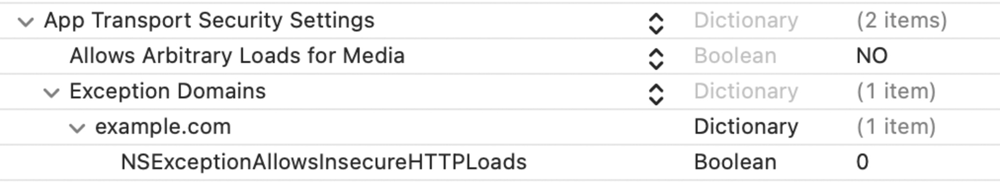

# ネットワーク通信要件

## MSTG-NETWORK-1
データはネットワーク上でTLSを使用して暗号化されている。セキュアチャネルがアプリ全体を通して一貫して使用されている。

### 安全なネットワーク通信の設定
提示されたすべてのケースは、全体として慎重に分析する必要がある。例えば、アプリが Info.plist で平文トラフィックを許可していない場合でも、実際には HTTP トラフィックを送信している可能性がある。低レベルの API （ ATS が無視される）を使用している場合や、クロスプラットフォームフレームワークの構成が不十分な場合は、このようなケースになる可能性がある。

重要：これらのテストは、アプリのメインコードだけでなく、アプリ内に組み込まれたアプリの拡張機能、フレームワーク、 Watch アプリにも適用する必要がある。

詳しくは、 Apple Developer Documentation の記事「 [Preventing Insecure Network Connections](https://developer.apple.com/documentation/security/preventing_insecure_network_connections) 」と「 [Fine-tune your App Transport Security settings](https://developer.apple.com/news/?id=jxky8h89) 」を参照する。

参考資料
* [owasp-mastg Testing Data Encryption on the Network (MSTG-NETWORK-1)](https://github.com/OWASP/owasp-mastg/blob/v1.5.0/Document/0x06g-Testing-Network-Communication.md#testing-data-encryption-on-the-network-mstg-network-1)

ルールブック
* [App Transport Security (ATS) を使用する（必須）](#app-transport-security-ats-を使用する-必須)

### 静的解析
#### セキュアプロトコルでのネットワーク要求の検証
まず、ソースコードですべてのネットワーク要求を識別し、平文の HTTP URL が使用されていないことを確認する必要がある。 [URLSession](https://developer.apple.com/documentation/foundation/urlsession) （ iOS の標準的な [URL Loading System](https://developer.apple.com/documentation/foundation/url_loading_system) を使用）または [Network](https://developer.apple.com/documentation/network) （ TLS と TCP および UDP へのアクセスを使用したソケットレベルの通信用）を使用して、機密情報が安全なチャネルを介して送信されることを確認する。

参考資料
* [owasp-mastg Testing Data Encryption on the Network (MSTG-NETWORK-1) Testing Network Requests over Secure Protocols](https://github.com/OWASP/owasp-mastg/blob/v1.5.0/Document/0x06g-Testing-Network-Communication.md#testing-network-requests-over-secure-protocols)

ルールブック
* [URLSession を使用する（推奨）](#urlsession-を使用する推奨)
* [Network Framework を使用する（推奨）](#network-framework-を使用する推奨)

#### 低レベルのネットワーキング API の使用状況を確認
アプリが使用するネットワーク API を特定し、低レベルのネットワーク API を使用しているかどうかを確認する。

**Apple の推奨：アプリに高レベルのフレームワークを優先する**
「 ATS は、アプリケーションが Network framework や CFNetwork のように低レベルのネットワーキングインターフェースを呼び出す場合には適用されない。このような場合、接続のセキュリティを確保する責任は、ユーザ自身にある。この方法で安全な接続を構築することはできるが、間違いが起こりやすく、コストもかかる。代わりに URL Loading System に頼るのが一般的に最も安全である。」（[ソース](https://developer.apple.com/documentation/security/preventing_insecure_network_connections)参照）

アプリが [Network](https://developer.apple.com/documentation/network) や [CFNetwork](https://developer.apple.com/documentation/cfnetwork) などの低レベルの API を使用している場合、それらが安全に使用されているかどうかを慎重に調査する必要がある。クロスプラットフォームフレームワーク（ Flutter、Xamarin など）やサードパーティフレームワーク（ Alamofire など）を使用しているアプリの場合、それらがベストプラクティスに従って安全に設定され使用されているかどうかを分析する必要がある。

アプリを確認する：
* サーバの信頼性評価を行う際に、チャレンジの種類とホスト名および認証情報を検証する。
* TLS エラーを無視しない。
* 安全でない TLS 設定を使用していない。（「 TLS 設定の検証（ <a href="#mstg-network-2">MSTG-NETWORK-2</a> ）」を参照）

これらの確認はあくまで参考であり、アプリごとに異なるフレームワークを使用している可能性があるため、特定の API を挙げることはできない。コードを調査する際の参考情報とすること。

参考資料
* [owasp-mastg Testing Data Encryption on the Network (MSTG-NETWORK-1) Check for Low-Level Networking API Usage](https://github.com/OWASP/owasp-mastg/blob/v1.5.0/Document/0x06g-Testing-Network-Communication.md#check-for-low-level-networking-api-usage)

ルールブック
* [App Transport Security (ATS) を使用する （必須）](#app-transport-security-ats-を使用する-必須)
* [CFNetwork を使用する （非推奨）](#cfnetwork-を使用する-非推奨)
* [Network Framework を使用する（推奨）](#network-framework-を使用する推奨)
* [低レベルのネットワーキング API はベストプラクティスに従って安全に使用する（必須）](#低レベルのネットワーキング-api-はベストプラクティスに従って安全に使用する必須)

#### 平文トラフィックの検証
アプリが平文の HTTP トラフィックを許可していないことを確認する。 iOS 9.0 以降では、平文の HTTP トラフィックはデフォルトでブロックされる（ App Transport Security（ ATS ）による）が、アプリケーションが平文の HTTP を送信する方法は複数存在する。

* アプリの Info.plist にある NSAppTransportSecurity の NSAllowsArbitraryLoads 属性を true （または YES ）に設定し、 ATS が平文トラフィックを有効にするように設定する。
* [Info.plist を取得する](https://github.com/OWASP/owasp-mastg/blob/v1.5.0/Document/0x06b-Basic-Security-Testing.md#the-infoplist-file)
* NSAllowsArbitraryLoads が、どのドメインでも、グローバルで true に設定されていないことを確認する。
* アプリケーションが WebView でサードパーティの Web サイトを開く場合、 iOS 10 以降、 NSAllowsArbitraryLoadsInWebContent を使用すると、 WebView に読み込まれるコンテンツの ATS 制限を無効にすることができる。

**Appleの警告：**
ATS を無効にすると、安全でないHTTP接続が許可される。HTTPS 接続も許可され、デフォルトのサーバ信頼性評価が適用される。ただし、TLS（ Transport Layer Security ）プロトコルの最低バージョンを要求するなどの拡張セキュリティチェックは無効となる。 ATS を使用しない場合、「[手動サーバ信頼性認証の実行](https://developer.apple.com/documentation/foundation/url_loading_system/handling_an_authentication_challenge/performing_manual_server_trust_authentication)」で説明するように、デフォルトのサーバ信頼性要件を自由に緩和することもできる。

以下のスニペットは、アプリが ATS の制限をグローバルに無効化する脆弱性のある例である。

```xml
<key>NSAppTransportSecurity</key>
<dict>
    <key>NSAllowsArbitraryLoads</key>
    <true/>
</dict>
```

ATS は、アプリケーションのコンテキストを考慮して検討する必要がある。アプリケーションは、その意図する目的を果たすために、 ATS の例外を定義する場合がある。例えば、 [Firefox の iOS アプリケーションは、グローバルに ATS を無効にしている。](https://github.com/mozilla-mobile/firefox-ios/blob/v97.0/Client/Info.plist#L82)そうでなければ、 ATS の要件をすべて満たしていない HTTP ウェブサイトに接続できないため、この例外は許容される。場合によっては、アプリケーションはグローバルに ATS を無効にするが、特定のドメインではメタデータを安全に読み込んだり、安全なログインを可能にするなどの目的で有効にすることがある。

ATS は、このための[正当な理由を示す記述](https://developer.apple.com/documentation/security/preventing_insecure_network_connections#3138036)を含める必要がある。（例：「このアプリは、安全な接続をサポートしない別のエンティティによって管理されるサーバに接続する必要がある」）

参考資料
* [owasp-mastg Testing Data Encryption on the Network (MSTG-NETWORK-1) Testing for Cleartext Traffic](https://github.com/OWASP/owasp-mastg/blob/v1.5.0/Document/0x06g-Testing-Network-Communication.md#testing-for-cleartext-traffic)

ルールブック
* [App Transport Security (ATS) を使用する （必須）](#app-transport-security-ats-を使用する-必須)

### 動的解析
テスト対象のアプリの送受信ネットワークトラフィックを傍受し、このトラフィックが暗号化されていることを確認する。ネットワークトラフィックの傍受は、以下のいずれかの方法で行うことができる。

* [OWASP ZAP](https://github.com/OWASP/owasp-mastg/blob/v1.5.0/Document/0x08a-Testing-Tools.md#owasp-zap) や [Burp Suite](https://github.com/OWASP/owasp-mastg/blob/v1.5.0/Document/0x08a-Testing-Tools.md#burp-suite) のようなインターセプションプロキシですべての HTTP(S) と Websocket のトラフィックを取得し、すべての要求が HTTP ではなく HTTPS で行われることを確認する。
* Burp や OWASP ZAP のようなインターセプションプロキシは、 HTTP(S) トラフィックのみを表示する。しかし、[Burp-non-HTTP-Extension](https://github.com/summitt/Burp-Non-HTTP-Extension) などの Burp プラグインや [mitm-relay](https://github.com/jrmdev/mitm_relay) というツールを使えば、 XMPP やその他のプロトコルによる通信をデコードして可視化することが可能である。

一部のアプリケーションは、証明書のピン留めにより、Burp や OWASP ZAP のようなプロキシで動作しない場合があります。そのような場合は、「[Testing Custom Certificate Stores and Certificate Pinning](https://github.com/OWASP/owasp-mastg/blob/v1.5.0/Document/0x06g-Testing-Network-Communication.md#testing-custom-certificate-stores-and-certificate-pinning-mstg-network-4) 」を確認すること。

詳細は以下参照：

* 「[Testing Network Communication](https://github.com/OWASP/owasp-mastg/blob/v1.5.0/Document/0x04f-Testing-Network-Communication.md#intercepting-traffic-on-the-network-layer)」の章から「Intercepting Traffic on the Network Layer」
* 「[iOS Basic Security Testing](https://github.com/OWASP/owasp-mastg/blob/v1.5.0/Document/0x06b-Basic-Security-Testing.md#setting-up-a-network-testing-environment)」の章から「Setting up a Network Testing Environment」

参考資料
* [owasp-mastg Testing Data Encryption on the Network (MSTG-NETWORK-1) Dynamic Analysis](https://github.com/OWASP/owasp-mastg/blob/v1.5.0/Document/0x06g-Testing-Network-Communication.md#dynamic-analysis)

ルールブック
* [App Transport Security (ATS) を使用する （必須）](#app-transport-security-ats-を使用する-必須)

### ルールブック
1. [App Transport Security (ATS) を使用する（必須）](#app-transport-security-ats-を使用する-必須)
1. [URLSession を使用する（推奨）](#urlsession-を使用する推奨)
1. [CFNetwork を使用する （非推奨）](#cfnetwork-を使用する-非推奨)
1. [Network Framework を使用する（推奨）](#network-framework-を使用する推奨)
1. [低レベルのネットワーキング API はベストプラクティスに従って安全に使用する（必須）](#低レベルのネットワーキング-api-はベストプラクティスに従って安全に使用する必須)

#### App Transport Security (ATS) を使用する （必須）

ATS では、すべての HTTP 接続に HTTPS を使用する必要がある。さらに、Transport Layer Security ( TLS ) プロトコルによって規定されたデフォルトのサーバ信頼評価を補完する拡張セキュリティチェックを課す。ATS は、最低限のセキュリティ仕様を満たさない接続をブロックする。

アプリケーション内で利用されているデータを可能な限りセキュアにするために、現時点でセキュアでない接続をしているのかどうかをまず把握することが重要である。

その確認のため、アクティブな ATS の例外をすべて無効にするために Info.plist の App Transport Security Settings の Allow Arbitrary Loads 属性に「 NO 」を設定する。アプリケーションがセキュアでない接続を行った場合、それぞれの接続に対し Xcode 上でランタイムエラーが発生する。

ATS が有効になるのは以下の場合である。
* Info.plist に App Transport Security Settings が未指定の場合。
* Info.plist で、Allow Arbitrary Loads 属性、Allows Arbitrary Loads for Media 属性、Allows Arbitrary Loads in Web Content 属性、NSExceptionAllowsInsecureHTTPLoads 属性に NO が指定され、NSExceptionRequiresForwardSecrecy 属性に YES が指定され、NSExceptionMinimumTLSVersion に 1.2 以上が指定されている場合。

Xcode上での info.plist 設定:



これに違反する場合、以下の可能性がある。
* セキュリティ仕様を満たさない接続を実施する可能性がある。

#### URLSession を使用する（推奨）

URL を操作し、標準のインターネットプロトコルを使用してサーバと通信するために、 iOS には URL Loading System が用意されている。
これを利用するために URLSession を使用する。

```swift
import UIKit

class Fetch {
    func getDataAPI(completion: @escaping (Any) -> Void) {
        let requestUrl = URL(string: "http://xxxxx")!
	    // URLSessionのdatataskを使い、data取得。
        let task = URLSession.shared.dataTask(with: requestUrl) { data, response, error in
	        // エラーが返ってきたときの処理。
            if let error = error {
                completion(error)
            } else if let data = data {
                completion(data)
            }
        }
        task.resume()
    }
}
```

これに注意しない場合、以下の可能性がある。
* 機密情報が安全ではないチャネルを介して送信される可能性がある。

#### CFNetwork を使用する （非推奨）

 CFNetwork は、iOS 2.0 で用意された BSD ソケットの操作、HTTP および FTP サーバ通信を行うAPI。

現在はそのほとんどが非推奨になっている。
ATS を有効に機能させるためには URLSession （ iOS の標準的な URL Loading System を使用）を推奨する。

これが非推奨である理由は以下である。
* 機密情報が安全ではないチャネルを介して送信される可能性がある。

#### Network Framework を使用する（推奨）

TLS、TCP、UDP や独自のアプリケーションプロトコルに直接アクセスする必要がある場合に使用する。
HTTP ( S ) や URL ベースのリソースの読み込みの場合はこれまでと変わらず URLSession を使用する。

```swift
import Foundation
import Network

class NetworkUDP {
    // 定数
    let networkType = "_myApp._udp."
    let networkDomain = "local"

    private func startListener(name: String) {
        // usingに udp で listener を作成
        guard let listener = try? NWListener(using: .udp, on: 11111) else { fatalError() }

        listener.service = NWListener.Service(name: name, type: networkType)

        let listnerQueue = DispatchQueue(label: "com.myapp.queue.listener")

        // 新しいコネクション受診時の処理
        listener.newConnectionHandler = { [unowned self] (connection: NWConnection) in
            connection.start(queue: listnerQueue)
            self.receive(on: connection)
        }

        // Listener開始
        listener.start(queue: listnerQueue)

    }

    private func receive(on connection: NWConnection) {
        /* データ受信 */
        connection.receive(minimumIncompleteLength: 0,
                           maximumLength: 65535,
                           completion:{(data, context, flag, error) in
            if let error = error {
                NSLog("\(#function), \(error)")
            } else {
                if data != nil {
                    /* 受信データのデシリアライズ */
                    
                }
                else {
                    NSLog("receiveMessage data nil")
                }
            }
        })
    }

}
```

これに注意しない場合、以下の可能性がある。
* 機密情報が安全ではないチャネルを介して送信される可能性がある。

#### 低レベルのネットワーキング API はベストプラクティスに従って安全に使用する（必須）
アプリが低レベルの API を使用している場合、それらが安全に使用されているかどうかを慎重に調査する必要がある。クロスプラットフォームフレームワーク（ Flutter、Xamarin など）やサードパーティフレームワーク（ Alamofire など）を使用しているアプリの場合、それらがベストプラクティスに従って安全に設定され使用されているかどうかを分析する必要がある。

アプリが以下に準拠していることを確認する：
* サーバの信頼性評価を行う際に、チャレンジの種類とホスト名および認証情報を検証する。
* TLS エラーを無視しない。
* 安全でない TLS 設定を使用していない。（「 TLS 設定の検証（ <a href="#mstg-network-2">MSTG-NETWORK-2</a> ）」を参照）

これらの確認はあくまで参考であり、アプリごとに異なるフレームワークを使用している可能性があるため、特定の API を挙げることはできない。コードを調査する際の参考情報とすること。

これに違反する場合、以下の可能性がある。
* アプリが安全性の低い通信を実施する可能性がある。

## MSTG-NETWORK-2
TLS 設定は現在のベストプラクティスと一致している。モバイルオペレーティングシステムが推奨される標準規格をサポートしていない場合には可能な限り近い状態である。

### 推奨される TLS 設定
サーバ側で適切な TLS 設定を行うことも重要である。 SSL プロトコルは非推奨であり、もはや使用するべきではない。また、 TLS v1.0 と TLS v1.1 には[既知の脆弱性](https://portswigger.net/daily-swig/the-end-is-nigh-browser-makers-ditch-support-for-aging-tls-1-0-1-1-protocols)があり、 2020 年までにすべての主要なブラウザでその使用が非推奨となった。 TLS v1.2 および TLS v1.3 は、安全なデータ通信のためのベストプラクティスと考えられている。

クライアントとサーバの両方が同じ組織で管理され、互いに通信するためだけに使用されている場合、[設定を強化](https://dev.ssllabs.com/projects/best-practices/)することでセキュリティを強化できる。<br>

モバイルアプリケーションが特定のサーバに接続する場合、そのネットワークスタックを調整することで、サーバの構成に対して可能な限り高いセキュリティレベルを確保することができる。オペレーティングシステムのサポートが不十分な場合、モバイルアプリケーションはより弱い構成を使用せざるを得なくなる可能性がある。<br>

アプリの目的の一部である可能性があるため、[対応する正当な理由の確認](https://developer.apple.com/documentation/security/preventing_insecure_network_connections#3138036)を忘れないこと。

以下へ検討する対象となる正当な理由の一例を示す。
* アプリが、安全な接続をサポートしていない別のエンティティによって管理されているサーバに接続する必要がある。
* アプリが、安全な接続を使用するバージョンへアップグレードできず、パブリックホスト名を使用してアクセスする必要があるデバイスへの接続をサポートする必要がある。
* アプリが、さまざまなソースからの埋め込まれた Web コンテンツを表示する必要があるが、Web コンテンツの例外でサポートされているクラスを使用することはできない。
* アプリが、暗号化され個人情報を含まないメディアコンテンツを読み込む。

アプリを App Store に提出する際は、App Store が既定で安全な接続を確立できない理由を判断できるように、十分な情報を提供すること。

特定のエンドポイントに通信する際に、どの ATS 設定が使用できるかを確認することができる。 macOS では、コマンドラインユーティリティの nscurl を使用することができる。指定されたエンドポイントに対して、異なる設定の並べ替えが実行され、検証される。 ATS のデフォルトのセキュアな接続テストにパスしていれば、 ATS はデフォルトのセキュアな設定で使用することができる。 nscurl の出力に失敗がある場合は、クライアント側の ATS の設定を脆弱化するのではなく、サーバ側の TLS の設定をよりセキュアになるように変更する。詳細は [Apple Developer Documentation](https://developer.apple.com/documentation/security/preventing_insecure_network_connections/identifying_the_source_of_blocked_connections) の記事「 Identifying the Source of Blocked Connections 」を参照。


詳細は、「[Testing Network Communication](https://github.com/OWASP/owasp-mastg/blob/v1.5.0/Document/0x04f-Testing-Network-Communication.md#verifying-the-tls-settings-mstg-network-2)」の章の「Verifying the TLS Settings」の項を参照する。

参考資料
* [owasp-mastg Verifying the TLS Settings (MSTG-NETWORK-2) Recommended TLS Settings](https://github.com/OWASP/owasp-mastg/blob/v1.5.0/Document/0x04f-Testing-Network-Communication.md#recommended-tls-settings)
* [owasp-mastg Testing the TLS Settings (MSTG-NETWORK-2)](https://github.com/OWASP/owasp-mastg/blob/v1.5.0/Document/0x06g-Testing-Network-Communication.md#testing-the-tls-settings-mstg-network-2)

ルールブック
* [安全な通信プロトコル（必須）](#安全な通信プロトコル必須)
* [App Transport Security (ATS) を使用する （必須）](#app-transport-security-ats-を使用する-必須)

### 推奨される暗号スイート

暗号スイートの構造は以下の通りである。<br>
```txt
Protocol_KeyExchangeAlgorithm_WITH_BlockCipher_IntegrityCheckAlgorithm
```

この構造には以下が含まれる。<br>
* 暗号化で使用されるプロトコル
* TLS ハンドシェイク中にサーバとクライアントが認証に使用する鍵交換アルゴリズム
* メッセージストリームの暗号化に使用されるブロック暗号
* メッセージの認証に使用される完全性保証チェックアルゴリズム

例： TLS_RSA_WITH_3DES_EDE_CBC_SHA<br>

上記の例では、以下の暗号化スイートが使用されている。
* プロトコルとしての TLS
* 認証のための RSA 非対称暗号化
* EDE_CBC モードによる対称暗号化のための 3DES
* 完全性のための SHA ハッシュアルゴリズム

TLSv1.3 では、鍵交換アルゴリズムは暗号スイートの一部ではなく、TLS ハンドシェイク中に決定されることに注意する。<br>

次のリストでは、暗号スイートの各部分のさまざまなアルゴリズムを紹介する。<br>

プロトコル :
* SSL v1
* SSL v2 - [RFC 6176](https://www.rfc-editor.org/rfc/rfc6176)
* SSL v3 - [RFC 6101](https://www.rfc-editor.org/rfc/rfc6101)
* TLS v1.0 - [RFC 2246](https://www.ietf.org/rfc/rfc2246)
* TLS v1.1 - [RFC 4346](https://www.rfc-editor.org/rfc/rfc4346)
* TLS v1.2 - [RFC 5246](https://www.rfc-editor.org/rfc/rfc5246)
* TLS v1.3 - [RFC 8446](https://www.rfc-editor.org/rfc/rfc8446)

鍵交換アルゴリズム :
* DSA - [RFC 6979](https://www.rfc-editor.org/rfc/rfc6979)
* ECDSA - [RFC 6979](https://www.rfc-editor.org/rfc/rfc6979)
* RSA - [RFC 8017](https://www.rfc-editor.org/rfc/rfc8017)
* DHE - [RFC 2631](https://www.rfc-editor.org/rfc/rfc2631) - [RFC 7919](https://www.rfc-editor.org/rfc/rfc7919)
* ECDHE - [RFC 4492](https://www.rfc-editor.org/rfc/rfc4492)
* PSK - [RFC 4279](https://www.rfc-editor.org/rfc/rfc4279)
* DSS - [FIPS186-4](https://nvlpubs.nist.gov/nistpubs/FIPS/NIST.FIPS.186-4.pdf)
* DH_anon - [RFC 2631](https://www.rfc-editor.org/rfc/rfc2631) - [RFC 7919](https://www.rfc-editor.org/rfc/rfc7919)
* DHE_RSA - [RFC 2631](https://www.rfc-editor.org/rfc/rfc2631) - [RFC 7919](https://www.rfc-editor.org/rfc/rfc7919)
* DHE_DSS - [RFC 2631](https://www.rfc-editor.org/rfc/rfc2631) - [RFC 7919](https://www.rfc-editor.org/rfc/rfc7919)
* ECDHE_ECDSA - [RFC 8422](https://www.rfc-editor.org/rfc/rfc8422)
* ECDHE_PSK - [RFC 8422](https://www.rfc-editor.org/rfc/rfc8422) - [RFC 5489](https://www.rfc-editor.org/rfc/rfc5489)
* ECDHE_RSA - [RFC 8422](https://www.rfc-editor.org/rfc/rfc8422)

ブロック暗号 :
* DES - [RFC 4772](https://www.rfc-editor.org/rfc/rfc4772)
* DES_CBC - [RFC 1829](https://www.rfc-editor.org/rfc/rfc1829)
* 3DES - [RFC 2420](https://www.rfc-editor.org/rfc/rfc2420)
* 3DES_EDE_CBC - [RFC 2420](https://www.rfc-editor.org/rfc/rfc2420)
* AES_128_CBC - [RFC 3268](https://www.rfc-editor.org/rfc/rfc3268)
* AES_128_GCM - [RFC 5288](https://www.rfc-editor.org/rfc/rfc5288)
* AES_256_CBC - [RFC 3268](https://www.rfc-editor.org/rfc/rfc3268)
* AES_256_GCM - [RFC 5288](https://www.rfc-editor.org/rfc/rfc5288)
* RC4_40 - [RFC 7465](https://www.rfc-editor.org/rfc/rfc7465)
* RC4_128 - [RFC 7465](https://www.rfc-editor.org/rfc/rfc7465)
* CHACHA20_POLY1305 - [RFC 7905](https://www.rfc-editor.org/rfc/rfc7905) - [RFC 7539](https://www.rfc-editor.org/rfc/rfc7539)

完全性チェックアルゴリズム :
* MD5 - [RFC 6151](https://www.rfc-editor.org/rfc/rfc6151)
* SHA - [RFC 6234](https://www.rfc-editor.org/rfc/rfc6234)
* SHA256 - [RFC 6234](https://www.rfc-editor.org/rfc/rfc6234)
* SHA384 - [RFC 6234](https://www.rfc-editor.org/rfc/rfc6234)

暗号スイートの効率は、そのアルゴリズムの効率に依存することに注意する必要がある<br>

以下のリソースは、 TLS で使用するために推奨される最新の暗号スイートが含まれている。<br>
* IANA が推奨する暗号スイートは、 [TLS Cipher Suites](https://www.iana.org/assignments/tls-parameters/tls-parameters.xhtml#tls-parameters-4) に記載されている。
* OWASP が推奨する暗号スイートは、 [TLS Cipher String Cheat Sheet](https://github.com/OWASP/CheatSheetSeries/blob/master/cheatsheets/TLS_Cipher_String_Cheat_Sheet.md) に記載されている。

iOS の一部バージョンでは、推奨する暗号スイートに対応していないものもあるため、互換性のために、 [iOS](https://developer.apple.com/documentation/security/1550981-ssl_cipher_suite_values?language=objc) のバージョンでサポートされている暗号スイートを確認し、上位の暗号スイートを選択することが可能である。<br>

サーバが適切な暗号スイートをサポートしているかどうかを確認する場合は、さまざまなツールを使用できる。<br>
* nscurl - 詳細については、 [iOS ネットワーク通信](https://github.com/OWASP/owasp-mastg/blob/v1.5.0/Document/0x06g-Testing-Network-Communication.md)を参照。
* [testssl.sh](https://github.com/drwetter/testssl.sh) は、「 TLS/SSL 暗号、プロトコル、およびいくつかの暗号の欠陥のサポートについて、任意のポートでサーバのサービスをチェックする無料のコマンドラインツール」である。

最後に、 HTTPS 接続が終了するサーバまたは終了プロキシが、ベストプラクティスに従って設定されていることを確認する。 [OWASP Transport Layer Protection cheat sheet](https://github.com/OWASP/CheatSheetSeries/blob/master/cheatsheets/Transport_Layer_Protection_Cheat_Sheet.md) および [Qualys SSL/TLS Deployment Best Practices](https://dev.ssllabs.com/projects/best-practices/) を参照する。<br>

参考資料
* [owasp-mastg Verifying the TLS Settings (MSTG-NETWORK-2) Cipher Suites Terminology](https://github.com/OWASP/owasp-mastg/blob/v1.5.0/Document/0x04f-Testing-Network-Communication.md#cipher-suites-terminology)

ルールブック
* [TLS で推奨される暗号化スイート（推奨）](#tls-で推奨される暗号化スイート推奨)

### ルールブック
1. [安全な通信プロトコル（必須）](#安全な通信プロトコル必須)
1. [TLS で推奨される暗号化スイート（推奨）](#tls-で推奨される暗号化スイート推奨)

#### 安全な通信プロトコル（必須）
サーバ側で適切な TLS 設定を行うことも重要である。 SSL プロトコルは非推奨であり、もはや使用するべきではない。

非推奨プロトコル
* SSL
* TLS v1.0
* TLS v1.1

TLS v1.0 と TLS v1.1 については、2020 年までにすべての主要なブラウザでその使用が非推奨となった。

推奨プロトコル
* TLS v1.2
* TLS v1.3

これに違反する場合、以下の可能性がある。
* セキュリティエクスプロイトに対して脆弱である。

#### TLS で推奨される暗号化スイート（推奨）

以下は推奨される暗号化スイートの一例。([TLS Cipher Suites](https://www.iana.org/assignments/tls-parameters/tls-parameters.xhtml#tls-parameters-4) で推奨されている暗号化スイートの中で、[iOS](https://developer.apple.com/documentation/security/secure_transport/1550981-ssl_cipher_suite_values)で定義されているものを記載。)
* TLS_DHE_RSA_WITH_AES_128_GCM_SHA256
* TLS_DHE_RSA_WITH_AES_256_GCM_SHA384
* TLS_DHE_PSK_WITH_AES_128_GCM_SHA256
* TLS_DHE_PSK_WITH_AES_256_GCM_SHA384
* TLS_AES_128_GCM_SHA256
* TLS_AES_256_GCM_SHA384
* TLS_CHACHA20_POLY1305_SHA256
* TLS_AES_128_CCM_SHA256
* TLS_ECDHE_ECDSA_WITH_AES_128_GCM_SHA256
* TLS_ECDHE_ECDSA_WITH_AES_256_GCM_SHA384
* TLS_ECDHE_RSA_WITH_AES_128_GCM_SHA256
* TLS_ECDHE_RSA_WITH_AES_256_GCM_SHA384
* TLS_ECDHE_RSA_WITH_CHACHA20_POLY1305_SHA256
* TLS_ECDHE_ECDSA_WITH_CHACHA20_POLY1305_SHA256

これに注意しない場合、以下の可能性がある。
* 脆弱な暗号化スイートを使用する可能性がある。

## MSTG-NETWORK-3
セキュアチャネルが確立されたときに、アプリはリモートエンドポイントのX.509証明書を検証している。信頼されたCAにより署名された証明書のみが受け入れられている。

※証明書検証に関する記載は「[安全なネットワーク通信の設定](#安全なネットワーク通信の設定)」へ纏めて記載するため、本章での記載を省略
