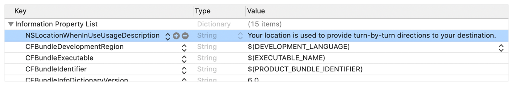
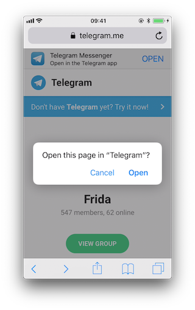
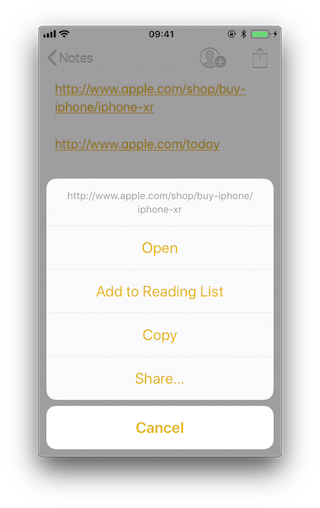
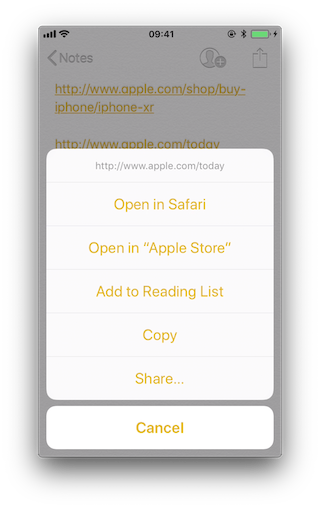
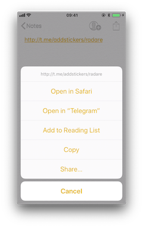
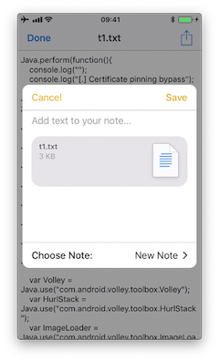

# プラットフォーム連携要件

## MSTG-PLATFORM-1
アプリは必要となる最低限のパーミッションのみを要求している。


iOS はすべてのサードパーティアプリを非特権モバイルユーザの下で実行させる。各アプリは固有のホームディレクトリを持ち、サンドボックス化されているため、保護されたシステムリソースや、システムまたは他のアプリによって保存されたファイルにアクセスすることができない。これらの制限は、サンドボックスポリシー（別名：プロファイル）を介して実装され、カーネル拡張を介して [Trusted BSD (MAC) Mandatory Access Control Framework](http://www.trustedbsd.org/mac.html) によって強制される。iOS は、コンテナと呼ばれるすべてのサードパーティアプリに汎用サンドボックスプロファイルを適用する。保護されたリソースやデータ（一部は[アプリの機能](https://developer.apple.com/help/account/reference/supported-capabilities-ios)としても知られている）へのアクセスは可能ですが、 entitlements として知られる特別な許可によって厳密に制御されている。

一部の権限は、アプリの開発者が設定でき（データ保護や Keychain シェアなど）、インストール後に直接有効になる。しかし、他のものについては、アプリが保護されたリソースに初めてアクセスしようとしたときなどに、ユーザに明示的に問い合わせることになる。[例えば](https://developer.apple.com/documentation/uikit#//apple_ref/doc/uid/TP40007072-CH3-SW7):

* Bluetooth 周辺機器
* カレンダーデータ
* カメラ
* 連絡先
* Health sharing
* Health updating
* ホームキット
* 位置情報
* マイク
* モーション
* 音楽とメディアライブラリ
* 写真
* リマインダー
* Siri
* 音声認識
* TV プロバイダー

Apple はユーザのプライバシーを保護し、[パーミッションを求める方法を明確](https://developer.apple.com/design/human-interface-guidelines/patterns/accessing-private-data/)にするよう促しているが、それでも、アプリが明白でない理由で多くのパーミッションを要求することがある。

カメラ、写真、カレンダーデータ、モーション、連絡先、音声認識などの一部の権限は、アプリがそのタスクを実行するために必要であるかどうかが明らかであるため、確認するのはかなり簡単なはずである。許可された場合、アプリは「カメラロール」（写真を保存するためのiOSのシステム全体のデフォルトの場所）内のすべてのユーザの写真にアクセスすることができる写真権限について、次の例のとおりとする。

* 典型的な QR コードスキャンアプリは、機能するために明らかにカメラを必要とするが、同様に写真の許可を要求している可能性がある。ストレージが明示的に必要な場合、撮影される写真の機密性によっては、これらのアプリはアプリのサンドボックスストレージを使用して、他のアプリ（写真の許可を持つ）がアクセスするのを避ける方がよい。機密データの保存に関する詳細については、「[Data Storage on iOS](https://github.com/OWASP/owasp-mastg/blob/v1.5.0/Document/0x06d-Testing-Data-Storage.md)」の章を参照してください。

* アプリによっては、写真のアップロードが必要なものもある（プロフィール写真など）。最近の iOS のバージョンでは、 [UIImagePickerController](https://developer.apple.com/documentation/uikit/uiimagepickercontroller) (iOS 11+) やそれに[代わる](https://developer.apple.com/videos/play/wwdc2020/10652/) [PHPickerViewController](https://developer.apple.com/documentation/photokit/phpickerviewcontroller) (iOS 14+) などの新しい API が導入されている。これらの API はアプリとは別のプロセスで実行される。これらを使用すると、アプリは「カメラロール」全体ではなく、ユーザが選択した画像にのみ読み取り専用でアクセスすることができるようになる。これは、不要なパーミッションのリクエストを避けるためのベストプラクティスと考えられている。

Bluetooth や位置情報のようなその他の許可は、より詳細な検証手順を必要とする。これらはアプリが適切に機能するために必要かもしれませんが、これらのタスクで扱われるデータは適切に保護されていないかもしれない。詳細といくつかの例については、以下の「静的解析」セクションの「[ソースコードインスペクション](#ソースコードインスペクション)」および「動的解析」セクションを参照。

機密性の高いデータを収集したり、単純に扱う場合（例えばキャッシュ）、アプリは、ユーザがそのデータを制御できるように、例えばアクセスを取り消したり削除できるような適切なメカニズムを提供する必要がある。しかし、機密データは保存やキャッシュされるだけでなく、ネットワーク経由で送信されることもある。どちらの場合も、アプリが適切なベストプラクティス（この場合、適切なデータ保護と転送セキュリティを実装すること）に従っていることを確認する必要がある。このようなデータを保護する方法についての詳細は、「Network APIs」の章を参照する。

このように、アプリの機能と権限の使用は、ほとんどが個人データの取り扱いを伴うため、ユーザのプライバシーを保護することが重要である。詳しくは、 Apple Developer Documentation の "[Protecting the User's Privacy](https://developer.apple.com/documentation/uikit/protecting_the_user_s_privacy)" と "[Accessing Protected Resources](https://developer.apple.com/documentation/uikit/protecting_the_user_s_privacy/requesting_access_to_protected_resources?language=objc)" の記事を参照。


参考資料
* [owasp-mastg Testing App Permissions (MSTG-PLATFORM-1)](https://github.com/OWASP/owasp-mastg/blob/v1.5.0/Document/0x06h-Testing-Platform-Interaction.md#testing-app-permissions-mstg-platform-1)


ルールブック
* [permission のリクエスト方法（必須）](#permission-のリクエスト方法必須)
* [写真にアクセスするための設定（必須）](#写真にアクセスするための設定必須)
* [適切なデータ保護と転送セキュリティを実装（必須）](#適切なデータ保護と転送セキュリティを実装必須)


### Device Capabilities

Device capabilities は、互換性のあるデバイスのみが一覧表示され、アプリのダウンロードが許可されるようにするために、App Store によって使用される。この機能は、アプリの Info.plist ファイルの [UIRequiredDeviceCapabilities](https://developer.apple.com/library/archive/documentation/General/Reference/InfoPlistKeyReference/Articles/iPhoneOSKeys.html#//apple_ref/doc/plist/info/UIRequiredDeviceCapabilities) キーで指定される。

```xml
<key>UIRequiredDeviceCapabilities</key>
<array>
    <string>armv7</string>
</array>
```

典型的に armv7 は、アプリが armv7 命令セット専用にコンパイルされていること、または 32/64 ビットのユニバーサルアプリであることを意味する。

例えば、あるアプリが動作するために完全に NFC に依存している場合がある（例えば、「 [NFC タグリーダー」](https://apps.apple.com/us/app/nfc-taginfo-by-nxp/id1246143596)アプリ）。アーカイブされた [iOS Device Compatibility Reference](https://developer.apple.com/library/archive/documentation/DeviceInformation/Reference/iOSDeviceCompatibility/DeviceCompatibilityMatrix/DeviceCompatibilityMatrix.html) によると、NFC は iPhone 7 （および iOS11 ）からしか利用できません。開発者は、nfc device capability を設定することで、すべての非互換デバイスを除外したいと思うかもしれない。

テストに関しては、 UIRequiredDeviceCapabilities は 、アプリがいくつかの特定のリソースを使用していることを示す単なる表示と考えることができる。 app capabilities に関連する entitlements とは異なり、Device Capabilities は、保護されたリソースに対するいかなる権利またはアクセス権も付与しない。そのためには、各機能に追加の設定手順が必要になる場合がある。

例えば、BLE がアプリのコア機能である場合、Apple の [Core Bluetooth Programming Guide](https://developer.apple.com/library/archive/documentation/NetworkingInternetWeb/Conceptual/CoreBluetooth_concepts/CoreBluetoothOverview/CoreBluetoothOverview.html#//apple_ref/doc/uid/TP40013257-CH2-SW1) は、考慮すべきさまざまな事柄を説明している。

* BLE 非対応端末のアプリダウンロードを制限するために、Bluetooth-le device capability を設定することができる。
* [BLE のバックグラウンド処理](https://developer.apple.com/library/archive/documentation/NetworkingInternetWeb/Conceptual/CoreBluetooth_concepts/CoreBluetoothBackgroundProcessingForIOSApps/PerformingTasksWhileYourAppIsInTheBackground.html) が必要な場合は、bluetooth-peripheralやbluetooth-central（いずれも UIBackgroundModes ）などのアプリ機能を追加する必要がある。

しかし、これだけではまだアプリが Bluetooth 周辺機器にアクセスするには不十分で、NSBluetoothPeripheralUsageDescription キーが Info.plist ファイルに含まれていなければならず、つまりユーザが積極的に許可を与える必要がある。詳細は、以下の「Info.plist ファイル内の目的文字列」を参照。


参考資料
* [owasp-mastg Testing App Permissions (MSTG-PLATFORM-1) Overview Device Capabilities](https://github.com/OWASP/owasp-mastg/blob/v1.5.0/Document/0x06h-Testing-Platform-Interaction.md#device-capabilities)

### Entitlements
[Apple の iOS セキュリティガイド](https://support.apple.com/ja-jp/guide/security/welcome/web)によると

entitlements とは、アプリに署名されたキーと値のペアで、 UNIX user ID のような実行時の要因を超えた認証を可能にする。 entitlements はデジタル署名されているため、変更することはできない。 entitlements は、システムアプリやデーモンで広く使用されており、他のプロセスでは root として実行する必要がある特定の特権操作を実行することができる。これは、侵害されたシステムアプリやデーモンによる特権昇格の可能性を大幅に低減する。

多くの entitlements は、Xcode target editor の "Summary" タブを使用して設定することができる。他の entitlements は、ターゲットの entitlements プロパティリストファイルを編集する必要があるか、アプリを実行するために使用される iOS プロビジョニングプロファイルから継承される。

[Entitlement Sources](https://developer.apple.com/library/archive/technotes/tn2415/_index.html#//apple_ref/doc/uid/DTS40016427-CH1-SOURCES):
1. Entitlement Sources ： アプリのコード署名に使用されるプロビジョニングプロファイルに埋め込まれた entitlements で、以下のもので構成されている。
   * Xcode プロジェクトの target Capabilities タブで定義された機能 and/or 。
   * 証明書、ID、およびプロファイルのウェブサイトの Identifiers セクションで構成される、アプリの App ID で有効なサービス。
   * プロファイル生成サービスによって注入されるその他の entitlements。
2. signing entitlements ファイルからの Entitlements。

[Entitlement Destinations](https://developer.apple.com/library/archive/technotes/tn2415/_index.html#//apple_ref/doc/uid/DTS40016427-CH1-DESTINATIONS):
1. アプリの署名
2. アプリに埋め込まれたプロビジョニングプロファイル

[Apple Developer Documentation](https://developer.apple.com/library/archive/technotes/tn2415/_index.html#//apple_ref/doc/uid/DTS40016427-CH1-APPENTITLEMENTS) にも説明がある。
* コード署名の間、アプリの有効な Capabilities/Services に対応する entitlement は、Xcode がアプリに署名するために選んだプロビジョニングプロファイルから、アプリの署名に転送される。
* プロビジョニングプロファイルは、ビルド中にアプリのバンドルに埋め込まれる（  embedded.mobileprovision ）。
* Xcode の "Build Settings" タブの "Code Signing Entitlements" セクションの Entitlements は、アプリの署名に転送される。

例えば、「 Default Data Protection 」 capability を設定したい場合、Xcode の「 Capabilities 」タブで、Data Protection を有効にする必要がある。
これは、デフォルト値 NSFileProtectionComplete を持つ com.apple.developer.default-data-protection entitlement として、Xcode によって \<appname>.entitlements ファイルに直接書き込まれる。IPA では、embedded.mobileprovision に次のように記述されている。

```xml
<key>Entitlements</key>
<dict>
    ...
    <key>com.apple.developer.default-data-protection</key>
    <string>NSFileProtectionComplete</string>
</dict>
```

HealthKit のような他の機能については、ユーザに許可を求める必要があるため、 entitlement を追加するだけでは不十分で、アプリの Info.plist ファイルに特別なキーと文字列を追加する必要がある。

次のセクションでは、これらのファイルについて詳しく説明し、それらを使用して静的および動的解析を実行する方法について説明する。


参考資料
* [owasp-mastg Testing App Permissions (MSTG-PLATFORM-1) Overview Entitlements](https://github.com/OWASP/owasp-mastg/blob/v1.5.0/Document/0x06h-Testing-Platform-Interaction.md#entitlements)

ルールブック
* [iOS 10 以降、パーミッションの記載が必要な項目（必須）](#ios-10-以降パーミッションの記載が必要な項目必須)
 
### 静的解析

iOS 10 以降、パーミッションの検査が必要なのは主にこの部分である。

* Info.plist ファイル内の目的文字列
* Code Signing Entitlements ファイル
* 埋め込み型プロビジョニングプロファイル
* コンパイルされたアプリバイナリに埋め込まれた Entitlements 
* ソースコードの検査

参考資料
* [owasp-mastg Testing App Permissions (MSTG-PLATFORM-1) Static Analysis](https://github.com/OWASP/owasp-mastg/blob/v1.5.0/Document/0x06h-Testing-Platform-Interaction.md#static-analysis)

ルールブック
* [iOS 10 以降、パーミッションの記載が必要な項目（必須）](#ios-10-以降パーミッションの記載が必要な項目必須)

#### Info.plist ファイル内の目的文字列

[目的文字列](https://developer.apple.com/documentation/uikit/protecting_the_user_s_privacy/requesting_access_to_protected_resources?language=objc#3037322)または_使用説明文字列_は、保護されたデータまたはリソースへのアクセス許可を要求する際に、システムの許可要求アラートでユーザに提示されるカスタムテキストである。


iOS 10 以降でリンクする場合、開発者はアプリの [Info.plist](https://developer.apple.com/documentation/uikit#//apple_ref/doc/uid/TP40007072-CH3-SW5) ファイルに目的文字列を含めることが要求される。そうしないと、アプリが保護されたデータやリソースにアクセスしようとしたときに、対応する目的文字列がない場合、[アクセスに失敗し、アプリがクラッシュする可能性](https://developer.apple.com/documentation/uikit/protecting_the_user_s_privacy/requesting_access_to_protected_resources?language=objc)もある。

オリジナルのソースコードがある場合は、Info.plist ファイルに含まれるパーミッションを確認することができる。

* Xcode でプロジェクトを開く。
* Info.plist ファイルをデフォルトのエディタで開き、"Privacy -"で始まるキーを検索してください。

右クリックして「 Show Raw Keys/Values 」を選択すると、生の値を表示するように切り替えることができる（この方法では、例えば「 Privacy - Location When In Use Usage Description 」は「 NSLocationWhenInUseUsageDescription 」に変わる）。



IPA のみを持っている場合。
* IPA を解凍する。
* Info.plist は、Payload /<アプリ名>.app/ Info.plist にある。
* 必要に応じて変換する必要がある。（例 : plutil -convert xml1 Info.plist ）「 iOS 基本セキュリティテスト」の章の「 Info.plist ファイル」の項で詳しく説明されている。
* すべての目的の文字列 Info.plist のキー、通常は UsageDescription で終わっているものを検査する。

```xml
<plist version="1.0">
<dict>
    <key>NSLocationWhenInUseUsageDescription</key>
    <string>Your location is used to provide turn-by-turn directions to your destination.</string>
```

 [CocoaKeys リファレンス](https://developer.apple.com/library/archive/documentation/General/Reference/InfoPlistKeyReference/Articles/CocoaKeys.html) で各キーの完全な説明を参照できる。

これらのガイドラインに従うと、許可が意味をなすかどうかをチェックするために、Info.plist ファイルの各エントリを評価するのが比較的簡単になる。

例えば、次の行がソリティアゲームで使用される Info.plist ファイルから抽出されたとする。

```xml
<key>NSHealthClinicalHealthRecordsShareUsageDescription</key>
<string>Share your health data with us!</string>
<key>NSCameraUsageDescription</key>
<string>We want to access your camera</string>
```

通常のソリティアゲームがこのようなリソースアクセスを要求するのは、おそらく[カメラ](https://developer.apple.com/library/archive/documentation/General/Reference/InfoPlistKeyReference/Articles/CocoaKeys.html#//apple_ref/doc/uid/TP40009251-SW24)や[ユーザの健康記録](https://developer.apple.com/library/archive/documentation/General/Reference/InfoPlistKeyReference/Articles/CocoaKeys.html#//apple_ref/doc/uid/TP40009251-SW76)にアクセスする必要がないため、疑わしいと考えるべきである。

パーミッションが意味をなすかどうかのチェックとは別に、目的文字列の分析からさらなる分析手順が導き出されるかもしない（たとえば、それらが機密データの保存に関連している場合など）。例えば、NSPhotoLibraryUsageDescription は、アプリのサンドボックスの外側にあり、他のアプリによってアクセス可能かもしれないファイルへのアクセスを与えるストレージ権限と考えることができる。この場合、機密データ（この場合は写真）がそこに保存されていないことをテストする必要がある。NSLocationAlwaysUsageDescription のような他の目的の文字列については、アプリがこのデータを安全に保存しているかどうかも考慮する必要がある。機密データを安全に保存するための詳細な情報とベストプラクティスについては、「Testing Data Storage」の章を参照。

参考資料
* [owasp-mastg Testing App Permissions (MSTG-PLATFORM-1) Static Analysis Purpose Strings in the Info.plist File](https://github.com/OWASP/owasp-mastg/blob/v1.5.0/Document/0x06h-Testing-Platform-Interaction.md#purpose-strings-in-the-infoplist-file)

#### Code Signing Entitlements ファイル

特定の機能は、[code signing entitlements ファイル](https://developer.apple.com/library/archive/technotes/tn2415/_index.html#//apple_ref/doc/uid/DTS40016427-CH1-ENTITLEMENTSFILE) ( <appname>.entitlements ) を必要とする。これは Xcode によって自動的に生成されるが、開発者が手動で編集および/または拡張することもできる。

以下は、 [App Groups Entitlements ](https://developer.apple.com/documentation/bundleresources/entitlements/com_apple_security_application-groups) （ application-groups ）を含む、[オープンソースアプリ Telegram](https://github.com/TelegramMessenger/Telegram-iOS/blob/77ee5c4dabdd6eb5f1e2ff76219edf7e18b45c00/Telegram-iOS/Telegram-iOS-AppStoreLLC.entitlements#L23) の entitlements ファイルの例である。

```xml
<?xml version="1.0" encoding="UTF-8"?>
<!DOCTYPE plist PUBLIC "-//Apple//DTD PLIST 1.0//EN" "http://www.apple.com/DTDs/PropertyList-1.0.dtd">
<plist version="1.0">
<dict>
...
    <key>com.apple.security.application-groups</key>
    <array>
        <string>group.ph.telegra.Telegraph</string>
    </array>
</dict>
...
</plist>
```

上記の entitlements では、ユーザからの追加のパーミッションは必要ありません。しかし、アプリがユーザに過剰な権限を要求し、それによって情報が漏洩する可能性があるため、すべての権限を確認することはを推奨する。

[Apple Developer Documentation](https://developer.apple.com/library/archive/documentation/Miscellaneous/Reference/EntitlementKeyReference/Chapters/EnablingAppSandbox.html#//apple_ref/doc/uid/TP40011195-CH4-SW19) に記載されているように、App Groups の権限は、IPC または共有ファイルコンテナを通じて異なるアプリ間で情報を共有するために必要であり、これはデータがアプリ間で直接デバイス上で共有されることを意味する。この資格は、[拡張アプリがそのアプリと情報を共有する](https://developer.apple.com/library/archive/documentation/General/Conceptual/ExtensibilityPG/ExtensionScenarios.html)必要がある場合にも必要がある。

共有するデータによっては、ユーザ自身による改ざんを避けるため、データを検証できるバックエンドなど、別の方法で共有する方が適切な場合がある。


参考資料
* [owasp-mastg Testing App Permissions (MSTG-PLATFORM-1) Static Analysis Code Signing Entitlements File](https://github.com/OWASP/owasp-mastg/blob/v1.5.0/Document/0x06h-Testing-Platform-Interaction.md#code-signing-entitlements-file)


#### 組み込み型プロビジョニングプロファイルファイル

ソースコードがない場合、IPA を分析し、通常、ルートアプリバンドルフォルダ（Payload/<アプリ名>.app/）に embedded.mobileprovision という名前で存在する埋め込みプロビジョニングプロファイルを内部から検索する必要がある。

このファイルは .plist ではなく、[Cryptographic Message Syntax](https://en.wikipedia.org/wiki/Cryptographic_Message_Syntax) を使用してエンコードされている。macOS では、次のコマンドを使用して、[埋め込みプロビジョニングプロファイルの entitlements を検査](https://developer.apple.com/library/archive/technotes/tn2415/_index.html#//apple_ref/doc/uid/DTS40016427-CH1-PROFILESENTITLEMENTS)することができる。

```bash
security cms -D -i embedded.mobileprovision
```

そして、Entitlements キーリージョン（\<key>Entitlements\</key>）を検索する。


参考資料
* [owasp-mastg Testing App Permissions (MSTG-PLATFORM-1) Static Analysis Embedded Provisioning Profile File](https://github.com/OWASP/owasp-mastg/blob/v1.5.0/Document/0x06h-Testing-Platform-Interaction.md#embedded-provisioning-profile-file)

#### コンパイルされたアプリのバイナリに埋め込まれた entitlements

アプリの IPA や、ジェイルブレイクしたデバイスにインストールされたアプリしか持っていない場合、通常.entitlementsファイルを見つけることができない。これは、 embedded.mobileprovision ファイルの場合もありえる。それでも、アプリのバイナリから entitlements のプロパティリストを自分で抽出することができるはずである（これは、「iOS Basic Security Testing」の章の[「Acquiring the App Binary」](https://github.com/OWASP/owasp-mastg/blob/v1.5.0/Document/0x06b-Basic-Security-Testing.md#acquiring-the-app-binary)のセクションで説明したように、以前に取得したことがある）。

以下の手順は、暗号化されたバイナリをターゲットにしている場合でも動作するはず。何らかの理由でうまくいかない場合、例えば Clutch（ iOS のバージョンと互換性がある場合）、frida-ios-dump などを使ってアプリを復号し、抽出する必要がある。

* アプリのバイナリから Entitlements Plist を抽出する

アプリのバイナリがコンピュータにある場合、binwalk を使ってすべての XML ファイル (-y=xml) を抽出 (-e) するいうのも一つの方法である。

```bash
$ binwalk -e -y=xml ./Telegram\ X

DECIMAL       HEXADECIMAL     DESCRIPTION
--------------------------------------------------------------------------------
1430180       0x15D2A4        XML document, version: "1.0"
1458814       0x16427E        XML document, version: "1.0"
```

あるいは、 radare2 （ -qc で静かに 1 コマンド実行して終了）を使って、アプリバイナリー（ izz ）上の「 PropertyList 」を含むすべての文字列（ ~ PropertyList ）を検索することができる。

```bash
$ r2 -qc 'izz~PropertyList' ./Telegram\ X

0x0015d2a4 ascii <?xml version="1.0" encoding="UTF-8" standalone="yes"?>\n<!DOCTYPE plist PUBLIC
"-//Apple//DTD PLIST 1.0//EN" "http://www.apple.com/DTDs/PropertyList-1.0.dtd">\n<plist version="1.0">
...<key>com.apple.security.application-groups</key>\n\t\t<array>
\n\t\t\t<string>group.ph.telegra.Telegraph</string>...

0x0016427d ascii H<?xml version="1.0" encoding="UTF-8"?>\n<!DOCTYPE plist PUBLIC
"-//Apple//DTD PLIST 1.0//EN" "http://www.apple.com/DTDs/PropertyList-1.0.dtd">\n<plist version="1.0">\n
<dict>\n\t<key>cdhashes</key>...
```

どちらの場合も ( binwalk または radare2 ) 同じ 2 つの plist ファイルを抽出することができた。最初のファイル ( 0x0015d2a4 ) を見てみると、 [Telegram から元の entitlements ファイルを完全に復元できている](https://github.com/TelegramMessenger/Telegram-iOS/blob/77ee5c4dabdd6eb5f1e2ff76219edf7e18b45c00/Telegram-iOS/Telegram-iOS-AppStoreLLC.entitlements)ことがわかる。

注意：strings コマンドはこの情報を見つけることができないので、ここでは役に立ちません。バイナリ上で直接 grep を -a フラグ付きで使うか、 radare2 (izz)/rabin2 (-zz) を使うのがよいでしょう。

ジェイルブレイクしたデバイスのアプリバイナリにアクセスする場合（例： SSH 経由）、 -a 、 -\-text フラグで grep を使用できる（すべてのファイルを ASCII テキストとして扱う）。

```bash
$ grep -a -A 5 'PropertyList' /var/containers/Bundle/Application/
    15E6A58F-1CA7-44A4-A9E0-6CA85B65FA35/Telegram X.app/Telegram\ X

<!DOCTYPE plist PUBLIC "-//Apple//DTD PLIST 1.0//EN" "http://www.apple.com/DTDs/PropertyList-1.0.dtd">
<plist version="1.0">
    <dict>
        <key>com.apple.security.application-groups</key>
        <array>
        ...
```

-A num, -\-after-context=num のフラグで、表示する行数を増やしたり減らしたりできる。上記で紹介したようなツールも、ジェイルブレイクした iOS デバイスにインストールされているのであれば、利用してもよい。

この方法は、アプリのバイナリがまだ暗号化されている場合でも動作する可能性がある（いくつかの App Store アプリに対してテストされている）。


参考資料
* [owasp-mastg Testing App Permissions (MSTG-PLATFORM-1) Static Analysis Entitlements Embedded in the Compiled App Binary](https://github.com/OWASP/owasp-mastg/blob/v1.5.0/Document/0x06h-Testing-Platform-Interaction.md#entitlements-embedded-in-the-compiled-app-binary)


#### ソースコードインスペクション

\<appname>.entitlements ファイルと Info.plist ファイルをチェックした後、要求されたパーミッションと割り当てられた機能がどのように使用されるかを確認する。これには、ソースコードのレビューで十分である。ただし、オリジナルのソースコードを持っていない場合、アプリをリバースエンジニアリングする必要があるかもしれないため、パーミッションの使用を検証することは特別に難しいかもしれない。進め方の詳細については、「動的解析」を参照。

ソースコードレビューを行う際には、以下の点に注意する必要がある。

* Info.plist ファイル内の目的文字列とプログラム上の実装が一致しているかどうか。
* 登録された機能が機密情報を漏らさないように使用されているかどうか。

ユーザは「設定」によっていつでもパーミッションを付与したり取り消したりすることができるため、通常、アプリは機能にアクセスする前にその権限の状態を確認する。これは、保護されたリソースへのアクセスを提供する多くのシステムフレームワークで利用可能な専用のAPIを使用して行うことができる。

[Apple Developer Documentation](https://developer.apple.com/documentation/uikit/protecting_the_user_s_privacy/requesting_access_to_protected_resources?language=objc#3037319) を参考にできる。例えば
* Bluetooth: [CBCentralManager](https://developer.apple.com/documentation/corebluetooth/cbcentralmanager?language=objc) クラスの[state](https://developer.apple.com/documentation/corebluetooth/cbmanager/1648600-state?language=objc)プロパティは、Bluetooth 周辺機器を使用するためのシステム認証の状態を確認するために使用される。
* 位置情報： CLLocationManager のメソッドを検索する。例： [locationServicesEnabled](https://developer.apple.com/documentation/corelocation/cllocationmanager/1423648-locationservicesenabled?language=objc) 。
   ```default
   func checkForLocationServices() {
       if CLLocationManager.locationServicesEnabled() {
           // Location services are available, so query the user’s location.
       } else {
           // Update your app’s UI to show that the location is unavailable.
       }
   }
   ```
   一覧は、 ["Determining a Availability of Location Services"](https://developer.apple.com/documentation/corelocation/configuring_your_app_to_use_location_services) (Apple Developer Documentation) の表 1 を参照。

これらの API を使用するアプリケーションを検索し、API から取得されるかもしれない機密データがどうなるかをチェックする。例えば、ネットワーク上で保存または転送される可能性があり、その場合、適切なデータ保護と転送セキュリティを追加で検証する必要がある。


参考資料
* [owasp-mastg Testing App Permissions (MSTG-PLATFORM-1) Static Analysis Source Code Inspection](https://github.com/OWASP/owasp-mastg/blob/v1.5.0/Document/0x06h-Testing-Platform-Interaction.md#source-code-inspection)

### 動的解析

静的解析の助けを借りて、すでに使用されている許可とアプリ機能のリストがあるはず。しかし、「ソースコードインスペクション」で述べたように、オリジナルのソースコードがない場合、これらの権限やアプリの機能に関連する機密データや API を発見することは困難な作業となる可能性がある。動的解析は、静的解析を反復するためのインプットを得るために役立つ。

以下に紹介するようなアプローチに従うと、前述の機密データや API を発見するのに役立つはず。

1. 静的解析で特定された権限／能力のリスト（例： NSLocationWhenInUseUsageDescription ）を検討する。
2. それらを、対応するシステムフレームワーク（例： Core Location ）で利用可能な専用 API にマッピングする。これには、[ Apple Developer Documentation ](https://developer.apple.com/documentation/uikit/protecting_the_user_s_privacy/requesting_access_to_protected_resources?language=objc#3037319)を使用することができる。
3. それらの API （例えば CLLocationManager ）のクラスや特定のメソッドを、例えば [frida-trace](https://frida.re/docs/frida-trace/) を使用してトレースする。
4. 関連する機能（例えば「位置情報を共有する」）にアクセスしている間、アプリによって実際に使用されているメソッドを特定する。
5. それらのメソッドのバックトレースを取得し、コールグラフを作成する。

すべてのメソッドが特定されたら、この知識を使ってアプリをリバースエンジニアリングし、データがどのように処理されるかを調べることができる。そうしているうちに、プロセスに関わる新しいメソッドが見つかるかもしれない。それを再び上記のステップ 3 に送り、静的解析と動的解析を繰り返し行う。

次の例では、Telegram を使ってチャットから共有ダイアログを開き、 frida-trace でどのメソッドが呼び出されているかを確認する。

まず、Telegram を起動し、文字列 "authorizationStatus" にマッチするすべてのメソッドのトレースを開始する（ CLLocationManager 以外の多くのクラスがこのメソッドを実装しているため、これは一般的なアプローチとなる）。

```bash
frida-trace -U "Telegram" -m "*[* *authorizationStatus*]"
```

-U は、 USB デバイスに接続する。-m は、Objective-C のメソッドをトレースに含める。[グロブパターン](https://en.wikipedia.org/wiki/Glob_%28programming%29)を使用することができる（例えば、「*」 ワイルドカードを使用して、-m "\*[\* \*authorizationStatus\*]"」は、「『 authorizationStatus 』を含む任意のクラスの任意の Objective-C メソッドを含める」ことを意味する）。詳細は frida-trace -h と入力する。

ここで、共有ダイアログを開く。


以下の方法が表示される。

```bash
  1942 ms  +[PHPhotoLibrary authorizationStatus]
  1959 ms  +[TGMediaAssetsLibrary authorizationStatusSignal]
  1959 ms     | +[TGMediaAssetsModernLibrary authorizationStatusSignal]
```

Location をクリックすると、別のメソッドがトレースされる。

```bash
 11186 ms  +[CLLocationManager authorizationStatus]
 11186 ms     | +[CLLocationManager _authorizationStatus]
 11186 ms     |    | +[CLLocationManager _authorizationStatusForBundleIdentifier:0x0 bundle:0x0]
```
戻り値やバックトレースなど、より多くの情報を得るには、 frida-trace の自動生成されたスタブを使用する。以下の JavaScript ファイルに以下の修正を加える（パスはカレントディレクトリからの相対パス）。

```javascript
// __handlers__/__CLLocationManager_authorizationStatus_.js

onEnter: function (log, args, state) {
    log("+[CLLocationManager authorizationStatus]");
    log("Called from:\n" +
        Thread.backtrace(this.context, Backtracer.ACCURATE)
        .map(DebugSymbol.fromAddress).join("\n\t") + "\n");
  },
  onLeave: function (log, retval, state) {
    console.log('RET :' + retval.toString());
  }
```

位置情報をもう一度クリックすると、さらに詳細な情報が表示される。

```bash
  3630 ms  -[CLLocationManager init]
  3630 ms     | -[CLLocationManager initWithEffectiveBundleIdentifier:0x0 bundle:0x0]
  3634 ms  -[CLLocationManager setDelegate:0x14c9ab000]
  3641 ms  +[CLLocationManager authorizationStatus]
RET: 0x4
  3641 ms  Called from:
0x1031aa158 TelegramUI!+[TGLocationUtils requestWhenInUserLocationAuthorizationWithLocationManager:]
    0x10337e2c0 TelegramUI!-[TGLocationPickerController initWithContext:intent:]
    0x101ee93ac TelegramUI!0x1013ac
```

CLLocationManager authorizationStatus] が 0x4 ( [CLAuthorizationStatus.authorizedWhenInUse](https://developer.apple.com/documentation/corelocation/clauthorizationstatus/authorizedwheninuse) を返し、 +[ TGLocationUtils requestWhenInUserLocationAuthorizationWithLocationManager :] から呼び出されたことが分かる。前述したように、アプリをリバースエンジニアリングする際に、このような情報をエントリポイントとして使用し、そこから動的解析のための入力（クラスやメソッドの名前など）を取得し続けることができるかもしれない。

次に、iPhone/iPad を使用する際、「設定」を開き、興味のあるアプリが見つかるまでスクロールダウンすることで、いくつかのアプリのパーミッションの状態を視覚的に調査する方法がある。それをクリックすると、「 ALLOW APP_NAME TO ACCESS 」画面が表示される。しかし、すべての許可がまだ表示されていない可能性がある。その画面に表示されるためには、それらをトリガーする必要がある。


例えば、先ほどの例では、初めてアクセス許可ダイアログを表示するまで、「ロケーション」の項目は表示されない。一度許可すると、アクセスを許可したかどうかに関係なく、「ロケーション」の項目が表示されるようになる。


参考資料
* [owasp-mastg Testing App Permissions (MSTG-PLATFORM-1) Dynamic Analysis](https://github.com/OWASP/owasp-mastg/blob/v1.5.0/Document/0x06h-Testing-Platform-Interaction.md#dynamic-analysis)


### ルールブック
1. [permission のリクエスト方法（必須）](#permission-のリクエスト方法必須)
1. [写真にアクセスするための設定（必須）](#写真にアクセスするための設定必須)
1. [適切なデータ保護と転送セキュリティを実装（必須）](#適切なデータ保護と転送セキュリティを実装必須)
1. [iOS 10 以降、パーミッションの記載が必要な項目（必須）](#ios-10-以降パーミッションの記載が必要な項目必須)

#### permission のリクエスト方法（必須）

ユーザのリソースへアクセスするためには、ユーザの許可を得なければならない。
そのための手段として、permission リクエスト時にOS標準のアラートに説明文を乗せることが必要になる。
説明文は plist に記載し、適切なタイミング（カメラを使用する画面の直前など）で許可のリクエストを処理するソースを書く必要がある。
アプリ開始直後で不必要に許可をリクエストすることはしない。

permission の plist 記載：


plist の自動生成 xml:
```xml
<?xml version="1.0" encoding="UTF-8"?>
<!DOCTYPE plist PUBLIC "-//Apple//DTD PLIST 1.0//EN" "http://www.apple.com/DTDs/PropertyList-1.0.dtd">
<plist version="1.0">
<dict>
    <key>NSCameraUsageDescription</key>
    <string>It is necessary for shooting with the camera and for video distribution.</string>
    <key>NSAppTransportSecurity</key>
    <dict>
        <key>NSAllowsArbitraryLoads</key>
        <true/>
        <key>NSAllowsArbitraryLoadsForMedia</key>
        <true/>
    </dict>
    <key>UIApplicationSceneManifest</key>
    <dict>
        <key>UIApplicationSupportsMultipleScenes</key>
        <false/>
        <key>UISceneConfigurations</key>
        <dict>
            <key>UIWindowSceneSessionRoleApplication</key>
            <array>
                <dict>
                    <key>UISceneConfigurationName</key>
                    <string>Default Configuration</string>
                    <key>UISceneDelegateClassName</key>
                    <string>$(PRODUCT_MODULE_NAME).SceneDelegate</string>
                    <key>UISceneStoryboardFile</key>
                    <string>Main</string>
                </dict>
            </array>
        </dict>
    </dict>
</dict>
</plist>
```

カメラの許可チェックとリクエスト処理:
```swift
import Foundation
import AVFoundation

class CameraHelper {
    func request(completion: @escaping (Bool) -> Void) {
        
        let status = AVCaptureDevice.authorizationStatus(for: .video)
        switch status {
        case .authorized:
            
            completion(true)
        case .denied:
            completion(false)
        case .notDetermined: ()
            AVCaptureDevice.requestAccess(for: .video) { granted in
                completion(granted)
            }
                                            
        case .restricted:
            completion(false)
        
        @unknown default:
            // not support case
            ()
        }
    }
}
```

これに違反する場合、以下の可能性がある。
* 不要なパーミッションを要求すると、意図しないデータが漏洩する可能性がある。

#### 写真にアクセスするための設定（必須）

アルバムから写真を取得する際には PhotosUI ライブラリの中にある PHPickerViewController を使用すると、permission の確認を行わずにユーザが画像選択する画面が表示できる。
ユーザが選んだ写真以外の取得が必要でない限りこちらを選択すべきである。

アルバムに PHPickerViewController 経由で画像選択する方法:
```swift
import PhotosUI

class PViewController: UIViewController,PHPickerViewControllerDelegate {
    
    var selectedImages: [UIImage] = []
    
    override func viewDidLoad() {
        super.viewDidLoad()
    }
    func makeViewContoroller() {
        var configuration = PHPickerConfiguration()
        configuration.selectionLimit = 36 // 選択上限。0にすると無制限に。
        configuration.filter = .images // 取得できるメディアの種類。

        let picker = PHPickerViewController(configuration: configuration)
        picker.delegate = self
        present(picker, animated: true)
    }
    
    
    func picker(_ picker: PHPickerViewController, didFinishPicking results: [PHPickerResult]) {
        
        for image in results {
            
            image.itemProvider.loadObject(ofClass: UIImage.self) { (selectedImage, error) in
                
                guard let wrapImage = selectedImage as? UIImage else {
                    return
                }
                
                self.selectedImages.append(wrapImage)
                
            }
        }
    }
}
```

これに違反する場合、以下の可能性がある。
* 不要なパーミッションを要求すると、意図しないデータが漏洩する可能性がある。

#### 適切なデータ保護と転送セキュリティを実装（必須）

ネットワーク経由でデータを送信する場合。iOS の ATS を有効にすること。

ルールブック
* [App Transport Security (ATS) を使用する （必須）](0x06-MASDG-Network_Communication_Requirements.md#app-transport-security-ats-を使用する-必須)

これに違反する場合、以下の可能性がある。
* 意図しないデータが漏洩する可能性がある。

#### iOS 10 以降、パーミッションの記載が必要な項目（必須）

plist に パーミッションとして記載が必要になる操作と、それに紐づくキーを以下に示す。

* NSAppleMusicUsageDescription   メディアライブラリへのアクセス
* NSCalendarsUsageDescription   カレンダーへのアクセス
* NSContactsUsageDescription   連絡先へのアクセス
* NSPhotoLibraryUsageDescription   フォトライブラリへのアクセス
* NSRemindersUsageDescription   リマインダーへのアクセス
* NSCameraUsageDescription   カメラへのアクセス
* NSMicrophoneUsageDescription   マイクへのアクセス
* NSMotionUsageDescription   加速度計へのアクセス
* NSHealthShareUsageDescription   ヘルスデータへのアクセス
* NSHealthUpdateUsageDescription   ヘルスデータの変更
* NSHomeKitUsageDescription   HomeKit の設定データへのアクセス
* NSSiriUsageDescription   Siri へユーザデータ送信
* NSSpeechRecognitionUsageDescription   Speech Recognition Server へのユーザデータ送信
* NSLocationWhenInUseUsageDescription   位置情報へのアクセス (使用中のみ許可)
* NFCReaderUsageDescription   デバイスの NFC ハードウェアへのアクセス
* NSFaceIDUsageDescription   Face ID で認証する
* NSPhotoLibraryAddUsageDescription   フォトライブラリへの追加専用アクセス
* NSLocationAlwaysAndWhenInUseUsageDescription   位置情報へのアクセス(常時許可)
* NSHealthClinicalHealthRecordsShareUsageDescription   臨床記録の読み取り許可を要求
* NSHealthRequiredReadAuthorizationTypeIdentifiers   読み取り権限を取得しなければならない臨床記録データの種類
* NSBluetoothAlwaysUsageDescription   Bluetooth へのアクセス
* NSLocationTemporaryUsageDescriptionDictionary   位置情報へのアクセス(1度だけ許可)
* NSWidgetWantsLocation   ウィジェットが位置情報を使用する
* NSLocationDefaultAccuracyReduced   デフォルトで位置精度の低下を要求する
* NSLocalNetworkUsageDescription   ローカルネットワークへのアクセス
* NSUserTrackingUsageDescription   ユーザやデバイスを追跡するためのデータ使用許可
* NSSensorKitUsageDescription   調査研究の目的を簡単に説明する
* NSGKFriendListUsageDescription   Game Center のフレンドリストへのアクセス
* NSNearbyInteractionUsageDescription   近くの機器とのインタラクションセッションを開始する
* NSIdentityUsageDescription   ID 情報を要求する
* NSSensorKitPrivacyPolicyURL   プライバシーポリシーを表示するウェブページへのハイパーリンク
* UIRequiresPersistentWiFi   Wi-Fi接続を必要とするか
* NSSensorKitUsageDetail   アプリが収集する特定の情報のキーを含む辞書
   * SRSensorUsageKeyboardMetrics   キーボード操作を監視する
   * SRSensorUsageDeviceUsage    デバイスが起動する頻度を観察する
   * SRSensorUsageWristDetection   時計をどのように装着しているかを観察する
   * SRSensorUsagePhoneUsage   電話操作を観察する
   * SRSensorUsageMessageUsage   メッセージ内のユーザの活動を監視する
   * SRSensorUsageVisits   頻繁に訪れる場所を観察する
   * SRSensorUsagePedometer   ステップ情報を観察する
   * SRSensorUsageMotion   モーションデータを観測する
   * SRSensorUsageSpeechMetrics   ユーザーの音声を分析する
   * SRSensorUsageAmbientLightSensor   環境における光量を監視する

※ NSLocationAlwaysUsageDescription は iOS 11 から非推奨となったため NSLocationAlwaysAndWhenInUseUsageDescription を使用すること。

※ NSNearbyInteractionAllowOnceUsageDescription は iOS 15 から非推奨となったため NSNearbyInteractionUsageDescription を使用すること。

※ Bluetooth 周辺機器にアクセスする API を使用し、 iOS 13 より前のデプロイメントターゲットを持つ場合、 NSBluetoothPeripheralUsageDescription が必要。

これに違反する場合、以下の可能性がある。
* 指定の機能へのアクセスが出来ない。

## MSTG-PLATFORM-2
外部ソースおよびユーザからの入力はすべて検証されており、必要に応じてサニタイズされている。これにはUI、インテントやカスタム URL などの IPC メカニズム、ネットワークソースを介して受信したデータを含んでいる。

### クロスサイトスクリプティングの問題
クロスサイトスクリプティング（ XSS ）の問題は、攻撃者がユーザが閲覧するウェブページにクライアント側のスクリプトを埋め込むことができるようにするものである。このタイプの脆弱性は、ウェブアプリケーションに広く存在する。ユーザが埋め込まれたスクリプトをブラウザで閲覧すると、攻撃者は同一オリジンポリシーをバイパスする権限を取得し、様々な悪用（セッションクッキーの窃盗、キー押下のログ、任意のアクションの実行など）が可能になる。

ネイティブアプリの場合、Web ブラウザに依存しないため、XSS のリスクははるかに低くなる。しかし、 iOS の WKWebView や非推奨の UIWebView 、 Android の WebView などの WebView コンポーネントを使用したアプリは、このような攻撃に対して潜在的な脆弱性を持っている。

古い例だが、よく知られているのは、[Phil Purvianceが最初に発見した、 iOS 用 Skype アプリのローカル XSS 問題](https://superevr.com/blog/2011/xss-in-skype-for-ios)である。この Skype アプリは、メッセージの送信者名を適切にエンコードしておらず、攻撃者は、ユーザがメッセージを閲覧した際に実行される悪意のある JavaScript を埋め込むことが可能であった。 Phil は概念実証の中で、この問題を悪用し、ユーザのアドレス帳を盗む方法を示した。

参考資料
* [owasp-mastg Cross-Site Scripting Flaws (MSTG-PLATFORM-2)](https://github.com/OWASP/owasp-mastg/blob/v1.5.0/Document/0x04h-Testing-Code-Quality.md#cross-site-scripting-flaws-mstg-platform-2)

#### 静的解析

WebView を確認して、アプリからレンダリングされた信頼できない入力がないか調査する。

WebView によって開かれた URL の一部がユーザの入力によって決定される場合、XSS 問題が存在する可能性がある。WebView を使用してリモート Web サイトを表示する場合、HTML をエスケープする負担はサーバ側に移行する。 Web サーバに XSS の欠陥が存在する場合、これを利用して WebView のコンテキストでスクリプトを実行することができる。そのため、Web アプリケーションのソースコードに対して静的解析を行うことが重要である。

以下のベストプラクティスに従っていることを確認する。
* HTML 、 JavaScript 、その他の解釈されるコンテキストでは、絶対に必要な場合を除き、信頼できないデータはレンダリングされない。
* エスケープ文字には、HTML のエンティティエンコーディングなど、適切なエンコーディングが適用される。注： HTML が他のコードにネストされている場合、エスケープのルールは複雑になる。例えば、JavaScriptブロックの中にある URL を表示させる場合などである。

レスポンスでデータがどのようにレンダリングされるかを検討する。例えば、データが HTML コンテキストでレンダリングされる場合、エスケープする必要がある 6 つの制御文字が存在する。

| Character | Escaped |
| :--- | :---  |
| & | &amp;amp; |
| < | &amp;lt; |
| > | &amp;gt; |
| " | &amp;quot; |
| ' | &amp;#x27; |
| / | &amp;#x2F; |

エスケープルールやその他の防止策の包括的なリストについては、 [OWASP XSS Prevention Cheat Sheet](https://cheatsheetseries.owasp.org/cheatsheets/Cross_Site_Scripting_Prevention_Cheat_Sheet.html) を参照する。


参考資料
* [owasp-mastg Cross-Site Scripting Flaws (MSTG-PLATFORM-2) Static Analysis](https://github.com/OWASP/owasp-mastg/blob/v1.5.0/Document/0x04h-Testing-Code-Quality.md#static-analysis)

ルールブック
* [WebView を確認して、アプリからレンダリングされた信頼できない入力がないか調査する（必須）](#webview-を確認してアプリからレンダリングされた信頼できない入力がないか調査する必須)

#### 動的解析
HTML タグや特殊文字を利用可能なすべての入力フィールドに注入し、ウェブアプリケーションが無効な入力を拒否するか、出力中の HTML メタ文字をエスケープするかを検証することで、 XSS 問題を最もよく検出することができる。

[reflected XSS 攻撃](https://owasp.org/www-project-web-security-testing-guide/latest/4-Web_Application_Security_Testing/07-Input_Validation_Testing/01-Testing_for_Reflected_Cross_Site_Scripting.html)とは、悪意のあるリンクを経由して悪意のあるコードが挿入されるエクスプロイトを指す。このような攻撃をテストするためには、自動入力ファジングが有効な方法と考えられている。例えば、[BURP Scanner](https://portswigger.net/burp/) は、 reflected XSS 攻撃の脆弱性を特定するのに非常に有効である。自動解析の場合と同様に、テストパラメータを手動で確認し、すべての入力ベクトルがカバーされていることを確認する。

参考資料
* [owasp-mastg Cross-Site Scripting Flaws (MSTG-PLATFORM-2) Dynamic Analysis](https://github.com/OWASP/owasp-mastg/blob/v1.5.0/Document/0x04h-Testing-Code-Quality.md#dynamic-analysis)

### ルールブック
1. [WebView を確認して、アプリからレンダリングされた信頼できない入力がないか調査する（必須）](#webview-を確認してアプリからレンダリングされた信頼できない入力がないか調査する必須)

#### WebView を確認して、アプリからレンダリングされた信頼できない入力がないか調査する（必須）
以下のベストプラクティスに従っていることを確認する。

* HTML 、 JavaScript 、その他の解釈されるコンテキストでは、絶対に必要な場合を除き、信頼できないデータはレンダリングされない。
* エスケープ文字には、HTML のエンティティエンコーディングなど、適切なエンコーディングが適用される。注： HTML が他のコードにネストされている場合、エスケープのルールは複雑になる。例えば、JavaScriptブロックの中にある URL を表示させる場合などである。

レスポンスでデータがどのようにレンダリングされるかを検討する。例えば、データが HTML コンテキストでレンダリングされる場合、エスケープする必要がある 6 つの制御文字が存在する。

| Character | Escaped |
| :--- | :---  |
| & | &amp;amp; |
| < | &amp;lt; |
| > | &amp;gt; |
| " | &amp;quot; |
| ' | &amp;#x27; |
| / | &amp;#x2F; |

エスケープルールやその他の防止策の包括的なリストについては、 [OWASP XSS Prevention Cheat Sheet](https://cheatsheetseries.owasp.org/cheatsheets/Cross_Site_Scripting_Prevention_Cheat_Sheet.html) を参照する。

これに違反する場合、以下の可能性がある。
* XSS 問題が存在する可能性がある。

## MSTG-PLATFORM-3
アプリはメカニズムが適切に保護されていない限り、カスタム URL スキームを介して機密な機能をエクスポートしていない。

### カスタム URL スキーム
カスタム URL スキームにより、[アプリはカスタムプロトコルを介して通信することができる](https://developer.apple.com/documentation/uikit#//apple_ref/doc/uid/TP40007072-CH6-SW1)。アプリは、このスキームをサポートすることを宣言し、そのスキームを使用する受信 URL を取り扱う必要がある。

Apple は、 [Apple Developer Documentation](https://developer.apple.com/documentation/xcode/defining-a-custom-url-scheme-for-your-app) において、カスタム URL スキームの不適切な使用について警告している。

URL スキームは、アプリへの潜在的な侵入経路となるため、すべての URL パラメータを検証し、不正な URL は破棄すること。さらに、ユーザのデータを危険にさらすことのないよう、操作可能な項目を制限すること。例えば、他のアプリがコンテンツを直接削除したり、ユーザに関する機密情報にアクセスすることを許可しないようにする。 URL 処理コードを検証する際には、テストケースに不適切な形式の URL が含まれていることを確認する。

また、ディープリンクの実装を目的とする場合は、ユニバーサルリンクの使用を推奨している。

カスタム URL スキームはディープリンクの一形態として認められるが、ユニバーサルリンクはベストプラクティスとして強く推奨される。

カスタム URL スキームのサポートは、以下の方法で行う。

* アプリの URL の形式を定義する。
* システムからアプリに適切な URL を割り当てるために、スキームを登録する。
* アプリが受け取る URL を処理する。

アプリが URL スキームの呼び出しを処理する際に、 URL とその引数を適切に検証しない場合や、重要な処理を実行する前にユーザに同意を求めない場合、セキュリティ上の問題が発生する。

一例として、 2010 年に発見された [Skype Mobile アプリの次のような不具合](https://www.dhanjani.com/blog/2010/11/insecure-handling-of-url-schemes-in-apples-ios.html)がある。 Skype アプリは skype:// プロトコルハンドラを登録し、別のアプリが他の Skype ユーザの電話番号へ通話を発信する前にユーザに許可を求めなかったため、どのアプリもユーザが知らないうちに任意の番号に通話することができた。攻撃者はこの脆弱性を利用して、目に見えない `<iframe src="skype://xxx?call"></iframe>` （ xxx はプレミアム番号に置き換えられる）を設置し、悪意のある Web サイトを閲覧した Skype ユーザがプレミアム番号に通話できるようにしている。

開発者としては、 URL を呼び出す前に、慎重に検証する必要がある。登録されたプロトコルハンドラを介して起動される特定のアプリケーションのみを許可することができる。また、 URL から呼び出された操作を確認するようユーザに促すことも有効な制御方法である。

すべての URL は、アプリの起動時、アプリの実行中、またはバックグラウンドで、アプリのデリゲートに渡される。受け取った URL を処理するために、デリゲートは以下のようなメソッドを実装する必要がある。

* URL の情報を取得し、開くかどうかを決定する。
* URL で指定されたリソースを開く。

詳細は、過去の [App Programming Guide for iOS](https://developer.apple.com/documentation/uikit#//apple_ref/doc/uid/TP40007072-CH6-SW13) と [Apple Secure Coding Guide](https://developer.apple.com/library/archive/documentation/Security/Conceptual/SecureCodingGuide/Articles/ValidatingInput.html) に記載されている。

さらに、アプリは他のアプリに URL リクエスト（別名：クエリ）を送信することもできる。これは次のようにして行われる。

* アプリが要求するアプリケーションクエリスキームを登録する。
* 任意で他のアプリに照会し、特定の URL を開くことができるかどうかを確認する。
* URL リクエストを送信する。

これらはすべて、静的および動的解析のセクションで取り上げる、広い攻撃対象領域を示している。


参考資料
* [owasp-mastg Testing Custom URL Schemes (MSTG-PLATFORM-3)](https://github.com/OWASP/owasp-mastg/blob/v1.5.0/Document/0x06h-Testing-Platform-Interaction.md#testing-custom-url-schemes-mstg-platform-3)

ルールブック
* [ディープリンクの実装を目的とする場合は、ユニバーサルリンクの使用をする（推奨）](#ディープリンクの実装を目的とする場合はユニバーサルリンクの使用をする推奨)
* [カスタム URL スキームの使い方（必須）](#カスタム-url-スキームの使い方必須)
* [アプリが URL スキームの呼び出し処理では、 URL とその引数を適切に検証し、重要な処理を実行する前にユーザに同意を求める（必須）](#アプリが-url-スキームの呼び出し処理では-url-とその引数を適切に検証し重要な処理を実行する前にユーザに同意を求める必須)
* [ユニバーサルリンクの使い方（推奨）](#ユニバーサルリンクの使い方推奨)
* [ディープリンクの URL とその引数を検証する（必須）](#ディープリンクの-url-とその引数を検証する必須)

### 静的解析
静的解析でできることはいくつかある。次の章では、次のようなことを見ていく。

* カスタム URL スキーム登録の検証
* アプリケーションクエリスキーマの登録検証
* URL の処理と検証の検証
* 他のアプリへの URL リクエストの検証
* 非推奨のメソッドに関する検証


参考資料
* [owasp-mastg Testing Custom URL Schemes (MSTG-PLATFORM-3) Static Analysis](https://github.com/OWASP/owasp-mastg/blob/v1.5.0/Document/0x06h-Testing-Platform-Interaction.md#static-analysis-5)

#### カスタム URL スキーム登録
カスタム URL スキームを検証する最初の手順は、アプリケーションが何らかのプロトコルハンドラを登録しているかどうかを確認することである。

もし、元のソースコードを手元に持っていて、登録されているプロトコルハンドラを確認したい場合は、以下のスクリーンショットのように、 Xcode でプロジェクトを開き、 **Info** タブの **URL Types** 部分を開く。


また、 Xcode では、アプリの Info.plist ファイル内の CFBundleURLTypes キーを検索することで見つけることができる。（ [iGoat-Swift](https://github.com/OWASP/iGoat-Swift) の例）

```xml
<key>CFBundleURLTypes</key>
<array>
    <dict>
        <key>CFBundleURLName</key>
        <string>com.iGoat.myCompany</string>
        <key>CFBundleURLSchemes</key>
        <array>
            <string>iGoat</string>
        </array>
    </dict>
</array>
```

コンパイル済みのアプリケーション（または IPA ）において、登録されたプロトコルハンドラは、アプリバンドル内のルートフォルダにある Info.plist ファイルにある。それを開いて、 CFBundleURLSchemes キーを探す。もし存在すれば、文字列の配列が含まれているはずである。 (iGoat-Swift の例)

```xml
grep -A 5 -nri urlsch Info.plist
Info.plist:45:    <key>CFBundleURLSchemes</key>
Info.plist-46-    <array>
Info.plist-47-        <string>iGoat</string>
Info.plist-48-    </array>
```

URL スキームが登録されると、他のアプリはスキームを登録したアプリを開き、適切な URL を作成し、[UIApplication openURL:options:completionHandler:](https://developer.apple.com/documentation/uikit/uiapplication/1648685-openurl?language=objc) メソッドで開くことにより、パラメータを渡すことができる。

[iOS 用アプリプログラミングガイド](https://developer.apple.com/documentation/uikit#//apple_ref/doc/uid/TP40007072-CH6-SW7)からの注記。

複数のサードパーティアプリが同じ URL スキームを扱うために登録した場合、どのアプリにそのスキームが与えられるかを決定するプロセスは、現在のところ存在しない。

これは、 URL スキームハイジャック攻撃 ([#thiel2] の 136 ページを参照) につながる可能性がある。


参考資料
* [owasp-mastg Testing Custom URL Schemes (MSTG-PLATFORM-3) Static Analysis Testing Custom URL Schemes Registration](https://github.com/OWASP/owasp-mastg/blob/v1.5.0/Document/0x06h-Testing-Platform-Interaction.md#testing-custom-url-schemes-registration)

ルールブック
* [カスタム URL スキームの使い方（必須）](#カスタム-url-スキームの使い方必須)
* [ユニバーサルリンクの使い方（推奨）](#ユニバーサルリンクの使い方推奨)
* [ディープリンクの URL とその引数を検証する（必須）](#ディープリンクの-url-とその引数を検証する必須)

#### アプリケーションクエリスキーム登録
openURL:options:completionHandler: メソッドを呼び出す前に、アプリは [canOpenURL](https://developer.apple.com/documentation/uikit/uiapplication/1622952-canopenurl?language=objc): を呼び出して対象のアプリが利用可能かどうかを確認することができる。しかし、このメソッドはインストールされているアプリを列挙する手段として悪意のあるアプリに利用されていたため、iOS 9.0 からは、アプリの Info.plist ファイルに LSApplicationQueriesSchemes キーを追加して最大 50 個の URL スキームの配列を追加し、これに渡す [URL スキームを宣言する必要がある](https://developer.apple.com/documentation/uikit/uiapplication/1622952-canopenurl?language=objc#discussion)。

```xml
<key>LSApplicationQueriesSchemes</key>
    <array>
        <string>url_scheme1</string>
        <string>url_scheme2</string>
    </array>
```

canOpenURL は、適切なアプリがインストールされているかどうかにかかわらず、未宣言のスキームに対しては常に NO を返す。ただし、この制限は canOpenURL にのみ適用される。

**openURL:options:completionHandler: メソッドは、たとえ LSApplicationQueriesSchemes 配列が宣言されていても、任意の URL スキームを開き**、その結果に応じて YES / NO を返す。

例えば、 Telegram は [Info.plist](https://github.com/TelegramMessenger/Telegram-iOS/blob/master/Telegram/Telegram-iOS/Info.plist#L233) で以下のような Queries Schemes を宣言している。

```xml
    <key>LSApplicationQueriesSchemes</key>
    <array>
        <string>dbapi-3</string>
        <string>instagram</string>
        <string>googledrive</string>
        <string>comgooglemaps-x-callback</string>
        <string>foursquare</string>
        <string>here-location</string>
        <string>yandexmaps</string>
        <string>yandexnavi</string>
        <string>comgooglemaps</string>
        <string>youtube</string>
        <string>twitter</string>
        ...
```

参考資料
* [owasp-mastg Testing Custom URL Schemes (MSTG-PLATFORM-3) Static Analysis Testing Application Query Schemes Registration](https://github.com/OWASP/owasp-mastg/blob/v1.5.0/Document/0x06h-Testing-Platform-Interaction.md#testing-application-query-schemes-registration)

#### URL の処理と検証
URL Path がどのように構築され、検証されているかを調べるには、元のソースコードがある場合、以下の方法で検索することができる。

* application:didFinishLaunchingWithOptions: メソッドまたは application:will-FinishLaunchingWithOptions:: がどのように決定され、URL に関する情報がどのように取得されるかを検証する。
* [application:openURL:options:](https://developer.apple.com/documentation/uikit/uiapplicationdelegate/1623112-application?language=objc): リソースがどのように開かれているか、すなわちどのようにデータが解析されているか、[オプション](https://developer.apple.com/documentation/uikit/uiapplicationopenurloptionskey?language=objc)を検証し、特に呼び出し側のアプリ（ [sourceApplication](https://developer.apple.com/documentation/uikit/uiapplication/openurloptionskey/1623128-sourceapplication) ）によるアクセスが許可または拒否されるべきかどうかを検証する。また、カスタム URL スキームを使用する場合、アプリにはユーザ許可が必要な場合がある。

Telegram では、[ 4 種類の方式が使われている](https://github.com/TelegramMessenger/Telegram-iOS/blob/87e0a33ac438c1d702f2a0b75bf21f26866e346f/Telegram-iOS/AppDelegate.swift#L1250)。   

```default
func application(_ application: UIApplication, open url: URL, sourceApplication: String?) -> Bool {
    self.openUrl(url: url)
    return true
}

func application(_ application: UIApplication, open url: URL, sourceApplication: String?,
annotation: Any) -> Bool {
    self.openUrl(url: url)
    return true
}

func application(_ app: UIApplication, open url: URL,
options: [UIApplicationOpenURLOptionsKey : Any] = [:]) -> Bool {
    self.openUrl(url: url)
    return true
}

func application(_ application: UIApplication, handleOpen url: URL) -> Bool {
    self.openUrl(url: url)
    return true
}
```
ここで、いくつか注意すべき点がある。

* このアプリは、[application:handleOpenURL:](https://developer.apple.com/documentation/uikit/uiapplicationdelegate/1622964-application?language=objc) や [application:openURL:sourceApplication:annotation:](https://developer.apple.com/documentation/uikit/uiapplicationdelegate/1623073-application) といった非推奨のメソッドも実装している。
* これらのメソッドのいずれにおいても、ソースアプリケーションは検証されていない。
* これらのメソッドはすべて、非公開のopenUrlメソッドを呼び出している。それを[調べる](https://github.com/TelegramMessenger/Telegram-iOS/blob/87e0a33ac438c1d702f2a0b75bf21f26866e346f/Telegram-iOS/AppDelegate.swift#L1250)ことで、 URL リクエストがどのように処理されるかについて詳しく知ることができる。

参考資料
* [owasp-mastg Testing Custom URL Schemes (MSTG-PLATFORM-3) Static Analysis Testing URL Handling and Validation](https://github.com/OWASP/owasp-mastg/blob/v1.5.0/Document/0x06h-Testing-Platform-Interaction.md#testing-url-handling-and-validation)

ルールブック
* [カスタム URL スキームの使い方（必須）](#カスタム-url-スキームの使い方必須)
* [ユニバーサルリンクの使い方（推奨）](#ユニバーサルリンクの使い方推奨)
* [ディープリンクの URL とその引数を検証する（必須）](#ディープリンクの-url-とその引数を検証する必須)

#### 他のアプリへの URL リクエスト
UIApplication の [openURL:options:completionHandler:](https://developer.apple.com/documentation/uikit/uiapplication/1648685-openurl?language=objc) メソッドと[非推奨の openURL: メソッド](https://developer.apple.com/documentation/uikit/uiapplication/1622961-openurl?language=objc)は、現在のアプリにローカルな、あるいは別のアプリが提供しなければならない URL を開く（つまり、他のアプリに要求を送る／問い合わせを行う）役割を担っている。元のソースコードがあれば、これらのメソッドの使用法を直接検索することができる。

さらに、アプリが特定のサービスやアプリを照会しているかどうか、また、アプリが有名かどうかを知りたい場合は、一般的なURLスキームをオンラインで検索し、それをgrepに含めることもできる。例えば、 [Google で検索する](https://ios.gadgethacks.com/how-to/use-google-maps-waze-with-siri-instead-apple-maps-0192301/)と、以下のようなことがわかる。

```default
Apple Music - music:// or musics:// or audio-player-event://
Calendar - calshow:// or x-apple-calevent://
Contacts - contacts://
Diagnostics - diagnostics:// or diags://
GarageBand - garageband://
iBooks - ibooks:// or itms-books:// or itms-bookss://
Mail - message:// or mailto://emailaddress
Messages - sms://phonenumber
Notes - mobilenotes://
...
```

この方法を Telegram のソースコードから、今回は Xcode を使わずに egrep だけで検索してみる。

```bash
$ egrep -nr "open.*options.*completionHandler" ./Telegram-iOS/

./AppDelegate.swift:552: return UIApplication.shared.open(parsedUrl,
    options: [UIApplicationOpenURLOptionUniversalLinksOnly: true as NSNumber],
    completionHandler: { value in
./AppDelegate.swift:556: return UIApplication.shared.open(parsedUrl,
    options: [UIApplicationOpenURLOptionUniversalLinksOnly: true as NSNumber],
    completionHandler: { value in
```

結果を見ると、 openURL:options:completionHandler: が実際にはユニバーサルリンクに使われていることがわかるため、検索を続ける必要がある。例えば、openURL(:

```bash
$ egrep -nr "openURL\(" ./Telegram-iOS/

./ApplicationContext.swift:763:  UIApplication.shared.openURL(parsedUrl)
./ApplicationContext.swift:792:  UIApplication.shared.openURL(URL(
                                        string: "https://telegram.org/deactivate?phone=\(phone)")!
                                 )
./AppDelegate.swift:423:         UIApplication.shared.openURL(url)
./AppDelegate.swift:538:         UIApplication.shared.openURL(parsedUrl)
...
```

これらの内容を見ると、この方法は「設定」を開いたり、「 App Store 」を開いたりするのにも使われていることがわかる。

:// だけを検索すると、次のようになる。

```default
if documentUri.hasPrefix("file://"), let path = URL(string: documentUri)?.path {
if !url.hasPrefix("mt-encrypted-file://?") {
guard let dict = TGStringUtils.argumentDictionary(inUrlString: String(url[url.index(url.startIndex,
    offsetBy: "mt-encrypted-file://?".count)...])) else {
parsedUrl = URL(string: "https://\(url)")
if let url = URL(string: "itms-apps://itunes.apple.com/app/id\(appStoreId)") {
} else if let url = url as? String, url.lowercased().hasPrefix("tg://") {
[[WKExtension sharedExtension] openSystemURL:[NSURL URLWithString:[NSString
    stringWithFormat:@"tel://%@", userHandle.data]]];
```

両方の検索結果を組み合わせて、ソースコードを慎重に調査した結果、次のようなコードが見つかった。

```default
openUrl: { url in
            var parsedUrl = URL(string: url)
            if let parsed = parsedUrl {
                if parsed.scheme == nil || parsed.scheme!.isEmpty {
                    parsedUrl = URL(string: "https://\(url)")
                }
                if parsed.scheme == "tg" {
                    return
                }
            }

            if let parsedUrl = parsedUrl {
                UIApplication.shared.openURL(parsedUrl)
```

URL を開く前にスキームを検証し、必要に応じて "https" を追加し、 "tg" スキームの URL は開かない。準備ができたら、非推奨の openURL メソッドを使用する。

コンパイルされたアプリケーション（ IPA ）しか持っていない場合でも、他のアプリケーションへの問い合わせに使用されている URL スキームを特定することは可能である。

* LSApplicationQueriesSchemes が宣言されているかどうかを確認するか、一般的な URL スキームを検索する。
* また、アプリがスキームを宣言していない可能性があるため、文字列 :// を使用するか、正規表現を構築して URL を一致させる。

そのためには、まずアプリのバイナリにその文字列が含まれているかどうかを unix の strings コマンドなどで確認する。

```bash
strings <yourapp> | grep "someURLscheme://"
```

あるいは、 radare2 の iz/izz コマンドや rafind2 を使うと、 unix の string コマンドでは見つけられないような文字列を見つけることができる。

iGoat-Swift の例：

```bash
$ r2 -qc izz~iGoat:// iGoat-Swift
37436 0x001ee610 0x001ee610  23  24 (4.__TEXT.__cstring) ascii iGoat://?contactNumber=
```

参考資料
* [owasp-mastg Testing Custom URL Schemes (MSTG-PLATFORM-3) Static Analysis Testing URL Requests to Other Apps](https://github.com/OWASP/owasp-mastg/blob/v1.5.0/Document/0x06h-Testing-Platform-Interaction.md#testing-url-requests-to-other-apps)

#### 非推奨メソッド
次のような Deprecated されたメソッドを検索する。
* [application:handleOpenURL:](https://developer.apple.com/documentation/uikit/uiapplicationdelegate/1622964-application?language=objc)
* [openURL:](https://developer.apple.com/documentation/uikit/uiapplication/1622961-openurl?language=objc)
* [application:openURL:sourceApplication:annotation:](https://developer.apple.com/documentation/uikit/uiapplicationdelegate/1623073-application)

例えば、ここではこの 3 つのメソッドを見つけることができる。

```bash
$ rabin2 -zzq Telegram\ X.app/Telegram\ X | grep -i "openurl"

0x1000d9e90 31 30 UIApplicationOpenURLOptionsKey
0x1000dee3f 50 49 application:openURL:sourceApplication:annotation:
0x1000dee71 29 28 application:openURL:options:
0x1000dee8e 27 26 application:handleOpenURL:
0x1000df2c9 9 8 openURL:
0x1000df766 12 11 canOpenURL:
0x1000df772 35 34 openURL:options:completionHandler:
...
```

参考資料
* [owasp-mastg Testing Custom URL Schemes (MSTG-PLATFORM-3) Static Analysis Testing for Deprecated Methods](https://github.com/OWASP/owasp-mastg/blob/v1.5.0/Document/0x06h-Testing-Platform-Interaction.md#testing-for-deprecated-methods)

### 動的解析
アプリが登録したカスタム URL スキームを特定したら、それを以下の方法で検証する。

* URL リクエストの実行
* URL ハンドラメソッドの特定とフック化
* URL スキームのソース検証
* URL スキームのファジング

参考資料
* [owasp-mastg Testing Custom URL Schemes (MSTG-PLATFORM-3) Dynamic Analysis](https://github.com/OWASP/owasp-mastg/blob/v1.5.0/Document/0x06h-Testing-Platform-Interaction.md#dynamic-analysis-5)

#### URL リクエストの実行
**Safari の使用**

1 つの URL スキームを素早く検証するには、 Safari で URL を開き、アプリの動作を確認する。例えば、 Safari のアドレスバーに tel:/123456789 と入力すると、電話番号と「発信」「キャンセル」のオプションがあるポップアップが表示される。発信を押すと、電話アプリが起動し、直接電話をかけることができる。

また、カスタム URL スキームをトリガーとするページについては、そのページへ移動するだけで、カスタム URL スキームを見つけたときに Safari が自動的に問い合わせるようになっている。

参考資料
* [owasp-mastg Testing Custom URL Schemes (MSTG-PLATFORM-3) Dynamic Analysis Performing URL Requests Using Safari](https://github.com/OWASP/owasp-mastg/blob/v1.5.0/Document/0x06h-Testing-Platform-Interaction.md#using-safari)

**メモアプリの使用**

「ユニバーサルリンクのトリガー」で説明したように、メモアプリを使用し、作成したリンクを長押しして、カスタム URL スキームを検証することができる。リンクを開くには、編集モードを終了する必要がある。カスタム URL スキームを含むリンクをクリックまたは長押しできるのは、アプリがインストールされている場合のみで、インストールされていない場合はクリック可能なリンクとして認識されないため注意する。

参考資料
* [owasp-mastg Testing Custom URL Schemes (MSTG-PLATFORM-3) Dynamic Analysis Performing URL Requests Using the Notes App](https://github.com/OWASP/owasp-mastg/blob/v1.5.0/Document/0x06h-Testing-Platform-Interaction.md#using-the-notes-app)


**Frida の使用**

単に URL スキームを開きたいだけなら、 Frida を使用する。

```javascript
$ frida -U iGoat-Swift

[iPhone::iGoat-Swift]-> function openURL(url) {
                            var UIApplication = ObjC.classes.UIApplication.sharedApplication();
                            var toOpen = ObjC.classes.NSURL.URLWithString_(url);
                            return UIApplication.openURL_(toOpen);
                        }
[iPhone::iGoat-Swift]-> openURL("tel://234234234")
true
```

[Frida CodeShare](https://codeshare.frida.re/@dki/ios-url-scheme-fuzzing/) のこの例では、著者は非公開 API の LSApplicationWorkspace.openSensitiveURL:withOptions: を使って（ SpringBoard アプリから） URL を開いている。

```javascript
function openURL(url) {
    var w = ObjC.classes.LSApplicationWorkspace.defaultWorkspace();
    var toOpen = ObjC.classes.NSURL.URLWithString_(url);
    return w.openSensitiveURL_withOptions_(toOpen, null);
}
```

なお、 App Store では非公開の API の使用は許可されていない。そのため、これらの検証は行っていないが、動的解析のために使用することは許可されている。


参考資料
* [owasp-mastg Testing Custom URL Schemes (MSTG-PLATFORM-3) Dynamic Analysis Performing URL Requests Using Frida](https://github.com/OWASP/owasp-mastg/blob/v1.5.0/Document/0x06h-Testing-Platform-Interaction.md#using-frida)

#### URL ハンドラメソッドの特定とフック
元のソースコードを見ることができない場合、アプリが受け取る URL スキーム要求を処理するためにどのメソッドを使用しているかを自分で見つける必要がある。それが Objective-C のメソッドか Swift のメソッドか、あるいはアプリが非推奨のメソッドを使用しているかどうかは不明である。

参考資料
* [owasp-mastg Testing Custom URL Schemes (MSTG-PLATFORM-3) Dynamic Analysis Performing URL Requests Identifying and Hooking the URL Handler Method](https://github.com/OWASP/owasp-mastg/blob/v1.5.0/Document/0x06h-Testing-Platform-Interaction.md#identifying-and-hooking-the-url-handler-method)


**リンクを作成し Safari で開く**

Frida CodeShare の [ObjC メソッドオブザーバー](https://codeshare.frida.re/@mrmacete/objc-method-observer/)を使用する。
これは非常に便利なスクリプトで、単純なパターンを指定するだけでメソッドやクラスの集まりを簡単に確認することができる。

この場合、「 openURL 」を含むすべてのメソッドに注目するため、パターンは \*[* \*openURL\*] となる。

* 最初のアスタリスクは、すべてのインスタンス - およびクラス + メソッドに合致する。
* 2 番目のアスタリスクは、すべての Objective-C クラスに合致する。
* 3 番目と 4 番目は、文字列 openURL を含むすべてのメソッドに合致する。

```bash
$ frida -U iGoat-Swift --codeshare mrmacete/objc-method-observer

[iPhone::iGoat-Swift]-> observeSomething("*[* *openURL*]");
Observing  -[_UIDICActivityItemProvider activityViewController:openURLAnnotationForActivityType:]
Observing  -[CNQuickActionsManager _openURL:]
Observing  -[SUClientController openURL:]
Observing  -[SUClientController openURL:inClientWithIdentifier:]
Observing  -[FBSSystemService openURL:application:options:clientPort:withResult:]
Observing  -[iGoat_Swift.AppDelegate application:openURL:options:]
Observing  -[PrefsUILinkLabel openURL:]
Observing  -[UIApplication openURL:]
Observing  -[UIApplication _openURL:]
Observing  -[UIApplication openURL:options:completionHandler:]
Observing  -[UIApplication openURL:withCompletionHandler:]
Observing  -[UIApplication _openURL:originatingView:completionHandler:]
Observing  -[SUApplication application:openURL:sourceApplication:annotation:]
...
```

この一覧は非常に長く、すでに説明した方法も含まれる。今ある URL スキーム、例えば Safari から「 igoat:// 」を起動して、アプリで開くことを許可すると、次のように表示される。

```bash
[iPhone::iGoat-Swift]-> (0x1c4038280)  -[iGoat_Swift.AppDelegate application:openURL:options:]
application: <UIApplication: 0x101d0fad0>
openURL: igoat://
options: {
    UIApplicationOpenURLOptionsOpenInPlaceKey = 0;
    UIApplicationOpenURLOptionsSourceApplicationKey = "com.apple.mobilesafari";
}
0x18b5030d8 UIKit!__58-[UIApplication _applicationOpenURLAction:payload:origin:]_block_invoke
0x18b502a94 UIKit!-[UIApplication _applicationOpenURLAction:payload:origin:]
...
0x1817e1048 libdispatch.dylib!_dispatch_client_callout
0x1817e86c8 libdispatch.dylib!_dispatch_block_invoke_direct$VARIANT$mp
0x18453d9f4 FrontBoardServices!__FBSSERIALQUEUE_IS_CALLING_OUT_TO_A_BLOCK__
0x18453d698 FrontBoardServices!-[FBSSerialQueue _performNext]
RET: 0x1
```

既知事項

* メソッド -[iGoat_Swift.AppDelegate application:openURL:options:] が呼び出される。以前見たように、これは推奨される方法であり、非推奨ではない。
* このメソッドは、パラメータとして URL(igoat://) を受け取る。
* また、ソースアプリケーションである com.apple.mobilesafari を確認することができる。
* -[UIApplication _applicationOpenURLAction:payload:origin:] から予想されるように、どこから呼び出されたかも確認することができる。
* このメソッドは 0x1 を返す。これは YES （[デリゲートが要求を正常に処理したこと](https://developer.apple.com/documentation/uikit/uiapplicationdelegate/1623112-application?language=objc#return-value)）を意味する。

呼び出しが成功し、 [iGoat](https://github.com/OWASP/owasp-mastg/blob/v1.5.0/Document/0x08b-Reference-Apps.md#igoat) のアプリが開かれたことが確認できる。


スクリーンショットの左上を見ると、呼び出し元（ソースアプリケーション）が Safari であることも確認できる。

参考資料
* [owasp-mastg Testing Custom URL Schemes (MSTG-PLATFORM-3) Dynamic Analysis Performing URL Requests Crafting the Link Yourself and Letting Safari Open It](https://github.com/OWASP/owasp-mastg/blob/v1.5.0/Document/0x06h-Testing-Platform-Interaction.md#crafting-the-link-yourself-and-letting-safari-open-it)


**アプリ自体からリンクを動的に開く**

また、途中で他のどのメソッドが呼び出されるかを調べてみるのも興味深い。結果を少し変えるために、同じ URL スキームを [iGoat](https://github.com/OWASP/owasp-mastg/blob/v1.5.0/Document/0x08b-Reference-Apps.md#igoat) アプリ自体から呼び出すことにする。ここでも ObjC のメソッドオブザーバと Frida REPL を使用する。

```bash
$ frida -U iGoat-Swift --codeshare mrmacete/objc-method-observer

[iPhone::iGoat-Swift]-> function openURL(url) {
                            var UIApplication = ObjC.classes.UIApplication.sharedApplication();
                            var toOpen = ObjC.classes.NSURL.URLWithString_(url);
                            return UIApplication.openURL_(toOpen);
                        }

[iPhone::iGoat-Swift]-> observeSomething("*[* *openURL*]");
[iPhone::iGoat-Swift]-> openURL("iGoat://?contactNumber=123456789&message=hola")

(0x1c409e460)  -[__NSXPCInterfaceProxy__LSDOpenProtocol openURL:options:completionHandler:]
openURL: iGoat://?contactNumber=123456789&message=hola
options: nil
completionHandler: <__NSStackBlock__: 0x16fc89c38>
0x183befbec MobileCoreServices!-[LSApplicationWorkspace openURL:withOptions:error:]
0x10ba6400c
...
RET: nil

...

(0x101d0fad0)  -[UIApplication openURL:]
openURL: iGoat://?contactNumber=123456789&message=hola
0x10a610044
...
RET: 0x1

true
(0x1c4038280)  -[iGoat_Swift.AppDelegate application:openURL:options:]
application: <UIApplication: 0x101d0fad0>
openURL: iGoat://?contactNumber=123456789&message=hola
options: {
    UIApplicationOpenURLOptionsOpenInPlaceKey = 0;
    UIApplicationOpenURLOptionsSourceApplicationKey = "OWASP.iGoat-Swift";
}
0x18b5030d8 UIKit!__58-[UIApplication _applicationOpenURLAction:payload:origin:]_block_invoke
0x18b502a94 UIKit!-[UIApplication _applicationOpenURLAction:payload:origin:]
...
RET: 0x1
```

出力は読みやすくするために切り捨てている。今回は、 UIApplicationOpenURLOptionsSourceApplicationKey が OWASP.iGoat-Swift に変更されていることがわかるが、これは理にかなっている。さらに、 openURL のようなメソッドの長い一覧が呼び出されている。これらを考慮することは、次の手順、例えばどのメソッドをフックするか、あるいは改ざんするか、 を決めるのに役立つため、ある状況においては非常に有用である。


参考資料
* [owasp-mastg Testing Custom URL Schemes (MSTG-PLATFORM-3) Dynamic Analysis Performing URL Requests Dynamically Opening the Link from the App Itself](https://github.com/OWASP/owasp-mastg/blob/v1.5.0/Document/0x06h-Testing-Platform-Interaction.md#dynamically-opening-the-link-from-the-app-itself)


**ページに移動し Safari でリンクを開く**

ページに含まれるリンクをクリックしたときに、同じ状況を検証できるようになった。 Safari は URL スキームを識別して処理し、どの動作を実行するかを選択する。このリンク「[ https://telegram.me/fridadotre](https://telegram.me/fridadotre) 」を開くと、以下の動作が発生する。



まず最初に、 frida-trace にスタブを生成させる。

```bash
$ frida-trace -U Telegram -m "*[* *restorationHandler*]" -i "*open*Url*"
    -m "*[* *application*URL*]" -m "*[* openURL]"

...
7310 ms  -[UIApplication _applicationOpenURLAction: 0x1c44ff900 payload: 0x10c5ee4c0 origin: 0x0]
7311 ms     | -[AppDelegate application: 0x105a59980 openURL: 0x1c46ebb80 options: 0x1c0e222c0]
7312 ms     | $S10TelegramUI15openExternalUrl7account7context3url05forceD016presentationData
            18applicationContext20navigationController12dismissInputy0A4Core7AccountC_AA14Open
            URLContextOSSSbAA012PresentationK0CAA0a11ApplicationM0C7Display010NavigationO0CSgyyctF()
```

これで、目的のスタブを手動で修正するだけでよい。

* Objective-C のメソッド application:openURL:options:

    ```objectivec
    // __handlers__/__AppDelegate_application_openUR_3679fadc.js
    
    onEnter: function (log, args, state) {
        log("-[AppDelegate application: " + args[2] +
                    " openURL: " + args[3] + " options: " + args[4] + "]");
        log("\tapplication :" + ObjC.Object(args[2]).toString());
        log("\topenURL :" + ObjC.Object(args[3]).toString());
        log("\toptions :" + ObjC.Object(args[4]).toString());
    },
    ```

* Swift のメソッド $S10TelegramUI15openExternalUrl...

    ```swift
    // __handlers__/TelegramUI/_S10TelegramUI15openExternalUrl7_b1a3234e.js
    
    onEnter: function (log, args, state) {
    
        log("TelegramUI.openExternalUrl(account, url, presentationData," +
                    "applicationContext, navigationController, dismissInput)");
        log("\taccount: " + ObjC.Object(args[1]).toString());
        log("\turl: " + ObjC.Object(args[2]).toString());
        log("\tpresentationData: " + args[3]);
        log("\tapplicationContext: " + ObjC.Object(args[4]).toString());
        log("\tnavigationController: " + ObjC.Object(args[5]).toString());
    },
    ```

次に実行すると、以下のような出力が得られる。

```bash
$ frida-trace -U Telegram -m "*[* *restorationHandler*]" -i "*open*Url*"
    -m "*[* *application*URL*]" -m "*[* openURL]"

  8144 ms  -[UIApplication _applicationOpenURLAction: 0x1c44ff900 payload: 0x10c5ee4c0 origin: 0x0]
  8145 ms     | -[AppDelegate application: 0x105a59980 openURL: 0x1c46ebb80 options: 0x1c0e222c0]
  8145 ms     |     application: <Application: 0x105a59980>
  8145 ms     |     openURL: tg://resolve?domain=fridadotre
  8145 ms     |     options :{
                        UIApplicationOpenURLOptionsOpenInPlaceKey = 0;
                        UIApplicationOpenURLOptionsSourceApplicationKey = "com.apple.mobilesafari";
                    }
  8269 ms     |    | TelegramUI.openExternalUrl(account, url, presentationData,
                                        applicationContext, navigationController, dismissInput)
  8269 ms     |    |    account: nil
  8269 ms     |    |    url: tg://resolve?domain=fridadotre
  8269 ms     |    |    presentationData: 0x1c4c51741
  8269 ms     |    |    applicationContext: nil
  8269 ms     |    |    navigationController: TelegramUI.PresentationData
  8274 ms     | -[UIApplication applicationOpenURL:0x1c46ebb80]
```

ここでは、次のようなことを確認することができる。

* 期待通り app delegate から application:openURL:options: を呼び出している。
* ソースアプリケーションは Safari （ "com.apple.mobilesafari" ）である。
* application:openURL:options: は URL を処理するが、 URL は開かない。
* 開かれる URL は、 tg://resolve?domain=fridadotre である。
* これは、 Telegram の tg:// カスタム URL スキームを使用している。

「 [https://telegram.me/fridadotre](https://telegram.me/fridadotre) 」に再度遷移し、**キャンセル**をクリックしてから、ページが提供するリンク（ "Open in Telegram app" ）をクリックすると、カスタム URL スキーム経由で開くのではなく、ユニバーサルリンク経由で開くのは興味深い点である。


それぞれの方式をトレースしながら試してみる。

```bash
$ frida-trace -U Telegram -m "*[* *restorationHandler*]" -m "*[* *application*openURL*options*]"

// After clicking "Open" on the pop-up

 16374 ms  -[AppDelegate application :0x10556b3c0 openURL :0x1c4ae0080 options :0x1c7a28400]
 16374 ms   application :<Application: 0x10556b3c0>
 16374 ms   openURL :tg://resolve?domain=fridadotre
 16374 ms   options :{
    UIApplicationOpenURLOptionsOpenInPlaceKey = 0;
    UIApplicationOpenURLOptionsSourceApplicationKey = "com.apple.mobilesafari";
}

// After clicking "Cancel" on the pop-up and "OPEN" in the page

406575 ms  -[AppDelegate application:0x10556b3c0 continueUserActivity:0x1c063d0c0
                restorationHandler:0x16f27a898]
406575 ms  application:<Application: 0x10556b3c0>
406575 ms  continueUserActivity:<NSUserActivity: 0x1c063d0c0>
406575 ms       webpageURL:https://telegram.me/fridadotre
406575 ms       activityType:NSUserActivityTypeBrowsingWeb
406575 ms       userInfo:{
}
406575 ms  restorationHandler:<__NSStackBlock__: 0x16f27a898>
```

参考資料
* [owasp-mastg Testing Custom URL Schemes (MSTG-PLATFORM-3) Dynamic Analysis Performing URL Requests Opening a Link by Navigating to a Page and Letting Safari Open It](https://github.com/OWASP/owasp-mastg/blob/v1.5.0/Document/0x06h-Testing-Platform-Interaction.md#opening-a-link-by-navigating-to-a-page-and-letting-safari-open-it)


**非推奨メソッドの検証**

非推奨のメソッドを検索する。

* [application:handleOpenURL:](https://developer.apple.com/documentation/uikit/uiapplicationdelegate/1622964-application?language=objc)
* [openURL:](https://developer.apple.com/documentation/uikit/uiapplication/1622961-openurl?language=objc)
* [application:openURL:sourceApplication:annotation:](https://developer.apple.com/documentation/uikit/uiapplicationdelegate/1623073-application)

これらのメソッドが使用されているかどうかを確認するために、 frida-trace を使用することができる。

参考資料
* [owasp-mastg Testing Custom URL Schemes (MSTG-PLATFORM-3) Dynamic Analysis Performing URL Requests Testing for Deprecated Methods](https://github.com/OWASP/owasp-mastg/blob/v1.5.0/Document/0x06h-Testing-Platform-Interaction.md#testing-for-deprecated-methods-1)

#### URL スキームのテストソース検証
バリデーションの破棄や確認の方法は、それに使用されそうな典型的なメソッドをフックすることで 実現する可能性がある。（例 : [isEqualToString:](https://developer.apple.com/documentation/foundation/nsstring/1407803-isequaltostring) ）

```javascript
// - (BOOL)isEqualToString:(NSString *)aString;

var isEqualToString = ObjC.classes.NSString["- isEqualToString:"];

Interceptor.attach(isEqualToString.implementation, {
  onEnter: function(args) {
    var message = ObjC.Object(args[2]);
    console.log(message)
  }
});
```

このフックを適用して、再度 URL スキームを呼び出す。

```bash
$ frida -U iGoat-Swift

[iPhone::iGoat-Swift]-> var isEqualToString = ObjC.classes.NSString["- isEqualToString:"];

                    Interceptor.attach(isEqualToString.implementation, {
                      onEnter: function(args) {
                        var message = ObjC.Object(args[2]);
                        console.log(message)
                      }
                    });
{}
[iPhone::iGoat-Swift]-> openURL("iGoat://?contactNumber=123456789&message=hola")
true
nil
```

何も起こらない。フックとツイートのテキストの間に OWASP.iGoat-Swift や com.apple.mobilesafari などのアプリパッケージらしき文字列が見つからないことから、このメソッドはそのために使用されていないことが分かる。しかし、今回は 1 つの方法を調査しているだけで、アプリは他の方法で比較している可能性があることを考慮する必要がある。


参考資料
* [owasp-mastg Testing Custom URL Schemes (MSTG-PLATFORM-3) Dynamic Analysis Testing URL Schemes Source Validation](https://github.com/OWASP/owasp-mastg/blob/v1.5.0/Document/0x06h-Testing-Platform-Interaction.md#testing-url-schemes-source-validation)


#### URL スキームのファジング
アプリが URL の一部を解析する場合、入力ファジングを実行してメモリ破損のバグを検出することも可能である。

上記で学んだことを利用し、選択した言語で独自のファザーを構築できる。 Python で、 [Frida の RPC](https://frida.re/docs/javascript-api/#rpc) を使用して openURL を呼び出す。そのファザーは次のことを行う必要がある。

* ペイロードを生成する。
* それぞれに対して openURL を呼び出す。
* アプリがクラッシュレポート（ .ips ）を /private/var/mobile/Library/Logs/CrashReporter に生成しているかどうかを確認する。

[FuzzDB](https://github.com/fuzzdb-project/fuzzdb) プロジェクトは、ペイロードとして使用できるファジング辞書を提供している。


参考資料
* [owasp-mastg Testing Custom URL Schemes (MSTG-PLATFORM-3) Dynamic Analysis Fuzzing URL Schemes](https://github.com/OWASP/owasp-mastg/blob/v1.5.0/Document/0x06h-Testing-Platform-Interaction.md#fuzzing-url-schemes)

**Frida の使用**

Frida でこれを行うのは非常に簡単である。 [iGoat-Swift](https://github.com/OWASP/owasp-mastg/blob/v1.5.0/Document/0x08b-Reference-Apps.md#igoat-swift) アプリ（ iOS 11.1.2 で動作）をファジングした例については、この[ブログ記事](https://grepharder.github.io/blog/0x03_learning_about_universal_links_and_fuzzing_url_schemes_on_ios_with_frida.html)を参照する。

ファザーを実行する前に、 URL スキームの入力が必要である。静的解析から、 [iGoat-Swift](https://github.com/OWASP/owasp-mastg/blob/v1.5.0/Document/0x08b-Reference-Apps.md#igoat-swift) アプリは次の URL スキームとパラメータを提供していることが分かっている： iGoat://?contactNumber={0}&message={0}.

```bash
$ frida -U SpringBoard -l ios-url-scheme-fuzzing.js
[iPhone::SpringBoard]-> fuzz("iGoat", "iGoat://?contactNumber={0}&message={0}")
Watching for crashes from iGoat...
No logs were moved.
Opened URL: iGoat://?contactNumber=0&message=0
OK!
Opened URL: iGoat://?contactNumber=1&message=1
OK!
Opened URL: iGoat://?contactNumber=-1&message=-1
OK!
Opened URL: iGoat://?contactNumber=null&message=null
OK!
Opened URL: iGoat://?contactNumber=nil&message=nil
OK!
Opened URL: iGoat://?contactNumber=99999999999999999999999999999999999
&message=99999999999999999999999999999999999
OK!
Opened URL: iGoat://?contactNumber=AAAAAAAAAAAAAAAAAAAAAAAAAAAAAAAAAAAAAAAAAAAAAAAAAAAAAAAAAAAAA
AAAAAAAAAAAAAAAAAAAAAAAAAAAAAAAAAAAAAAAAAAAAAAAAAAAAAAAAAAAAAAAAAAAAAAAAAAAAAAAAAAAAAAAAAAAAAAAA
AAAAAAAAAAAAAAAAAAAAAAAAAAAAAAAAAAAAAAAAAAAAAAAAAAAAAAAAAAAAAAAAAAAAAAAAAAAAAAAAAAAAAAAAAAAAAAAA
...
&message=AAAAAAAAAAAAAAAAAAAAAAAAAAAAAAAAAAAAAAAAAAAAAAAAAAAAAAAAAAAAA
AAAAAAAAAAAAAAAAAAAAAAAAAAAAAAAAAAAAAAAAAAAAAAAAAAAAAAAAAAAAAAAAAAAAAAAAAAAAAAAAAAAAAAAAAAAAAAAA
AAAAAAAAAAAAAAAAAAAAAAAAAAAAAAAAAAAAAAAAAAAAAAAAAAAAAAAAAAAAAAAAAAAAAAAAAAAAAAAAAAAAAAAAAAAAAAAA
...
OK!
Opened URL: iGoat://?contactNumber=AAAAAAAAAAAAAAAAAAAAAAAAAAAAAAAAAAAAAAAAAAAAAAAAAAAAAAAAAAAAA
AAAAAAAAAAAAAAAAAAAAAAAAAAAAAAAAAAAAAAAAAAAAAAAAAAAAAAAAAAAAAAAAAAAAAAAAAAAAAAAAAAAAAAAAAAAAAAAA
AAAAAAAAAAAAAAAAAAAAAAAAAAAAAAAAAAAAAAAAAAAAAAAAAAAAAAAAAAAAAAAAAAAAAAAAAAAAAAAAAAAAAAAAAAAAAAAA
AAAAAAAAAAAAAAAAAAAAAAAAAAAAAAAAAAAAAAAAAAAAAAAAAAAAAAAAAAAAAAAAAAAAAAAAAAAAAAAAAAAAAAAAAAAAAAAA
AAAAAAAAAAAAAAAAAAAAAAAAAAAAAAAAAAAAAAAAAAAAAAAAAAAAAAAAAAAAAAAAAAAAAAAAAAAAAAAAAAAAAAAAAAAAAAAA
...
&message=AAAAAAAAAAAAAAAAAAAAAAAAAAAAAAAAAAAAAAAAAAAAAAAAAAAAAAAAAAAAAAAAAAAAAAAAAAAAAAAAAAAAAAA
AAAAAAAAAAAAAAAAAAAAAAAAAAAAAAAAAAAAAAAAAAAAAAAAAAAAAAAAAAAAAAAAAAAAAAAAAAAAAAAAAAAAAAAAAAAAAAAA
AAAAAAAAAAAAAAAAAAAAAAAAAAAAAAAAAAAAAAAAAAAAAAAAAAAAAAAAAAAAAAAAAAAAAAAAAAAAAAAAAAAAAAAAAAAAAAAA
AAAAAAAAAAAAAAAAAAAAAAAAAAAAAAAAAAAAAAAAAAAAAAAAAAAAAAAAAAAAAAAAAAAAAAAAAAAAAAAAAAAAAAAAAAAAAAAA
AAAAAAAAAAAAAAAAAAAAAAAAAAAAAAAAAAAAAAAAAAAAAAAAAAAAAAAAAAAAAAAAAAAAAAAAAAAAAAAAAAAAAAAAAAAAAAAA
...
OK!
Opened URL: iGoat://?contactNumber='&message='
OK!
Opened URL: iGoat://?contactNumber=%20d&message=%20d
OK!
Opened URL: iGoat://?contactNumber=%20n&message=%20n
OK!
Opened URL: iGoat://?contactNumber=%20x&message=%20x
OK!
Opened URL: iGoat://?contactNumber=%20s&message=%20s
OK!
```

スクリプトは、クラッシュが発生したかどうかを検出する。今回の実行でクラッシュは検出されなかったが、他のアプリではこのようなことが起こる可能性がある。クラッシュレポートは /private/var/mobile/Library/Logs/CrashReporter または /tmp ( スクリプトによって移動された場合 ) で確認することができる。

参考資料
* [owasp-mastg Testing Custom URL Schemes (MSTG-PLATFORM-3) Fuzzing URL Schemes Using Frida](https://github.com/OWASP/owasp-mastg/blob/v1.5.0/Document/0x06h-Testing-Platform-Interaction.md#using-frida-1)


### ルールブック
1. [ディープリンクの実装を目的とする場合は、ユニバーサルリンクの使用をする（推奨）](#ディープリンクの実装を目的とする場合はユニバーサルリンクの使用をする推奨)
1. [カスタム URL スキームの使い方（必須）](#カスタム-url-スキームの使い方必須)
1. [アプリが URL スキームの呼び出し処理では、 URL とその引数を適切に検証し、重要な処理を実行する前にユーザに同意を求める（必須）](#アプリが-url-スキームの呼び出し処理では-url-とその引数を適切に検証し重要な処理を実行する前にユーザに同意を求める必須)
1. [ユニバーサルリンクの使い方（推奨）](#ユニバーサルリンクの使い方推奨)
1. [ディープリンクの URL とその引数を検証する（必須）](#ディープリンクの-url-とその引数を検証する必須)


#### ディープリンクの実装を目的とする場合は、ユニバーサルリンクの使用をする（推奨）

ディープリンクの実装を目的とする場合は、ユニバーサルリンクの使用を推奨している。

apple-app-site-association 設定:
```xml
{
    "applinks": {
        "apps": [],
        "details": [
            {
                "appID": "9JA89QQLNQ.com.apple.wwdc",
                "paths": [ "/wwdc/news/", "/videos/wwdc/2015/*"]
            },
            {
                "appID": "ABCD1234.com.apple.wwdc",
                "paths": [ "*" ]
            }
        ]
    }
}
```

Swift AppDelegate で Handling Universal Links 設定:
```swift
import UIKit

func application(_ application: UIApplication,
                 continue userActivity: NSUserActivity,
                 restorationHandler: @escaping ([Any]?) -> Void) -> Bool
{
    guard userActivity.activityType == NSUserActivityTypeBrowsingWeb,
        let incomingURL = userActivity.webpageURL,
        let components = NSURLComponents(url: incomingURL, resolvingAgainstBaseURL: true),
        let path = components.path,
        let params = components.queryItems else {
            return false
    }

    print("path = \(path)")

    if let albumName = params.first(where: { $0.name == "albumname" } )?.value,
        let photoIndex = params.first(where: { $0.name == "index" })?.value {

        print("album = \(albumName)")
        print("photoIndex = \(photoIndex)")
        return true

    } else {
        print("Either album name or photo index missing")
        return false
    }
}
```

これに注意しない場合、以下の可能性がある。
* URL スキームハイジャック攻撃や不正な URL にアクセスしてしまう可能性がある。

#### カスタム URL スキームの使い方（必須）

別のアプリがカスタム スキームを含む URL を開くと、システムは必要に応じてアプリを起動しフォアグラウンドに移動する。
システムは、アプリのデリゲートメソッドを呼び出して、URL をアプリにデータを送信する。
application メソッドにコードを追加して、URL のコンテンツを解析し、適切なアクションを実行する。

カスタム URL スキームの の plist 記載：


plist の自動生成 xml:
```xml
<?xml version="1.0" encoding="UTF-8"?>
<!DOCTYPE plist PUBLIC "-//Apple//DTD PLIST 1.0//EN" "http://www.apple.com/DTDs/PropertyList-1.0.dtd">
<plist version="1.0">
<dict>
	<key>CFBundleURLTypes</key>
	<array>
		<dict>
			<key>CFBundleTypeRole</key>
			<string>Editor</string>
			<key>CFBundleURLName</key>
			<string>jp.co.HelloWorld3</string>
			<key>CFBundleURLSchemes</key>
			<array>
				<string>cm-app</string>
			</array>
		</dict>
	</array>
	<key>NSAppTransportSecurity</key>
	<dict>
		<key>NSAllowsArbitraryLoads</key>
		<true/>
		<key>NSAllowsArbitraryLoadsForMedia</key>
		<true/>
	</dict>
	<key>UIApplicationSceneManifest</key>
	<dict>
		<key>UIApplicationSupportsMultipleScenes</key>
		<false/>
		<key>UISceneConfigurations</key>
		<dict>
			<key>UIWindowSceneSessionRoleApplication</key>
			<array>
				<dict>
					<key>UISceneConfigurationName</key>
					<string>Default Configuration</string>
					<key>UISceneDelegateClassName</key>
					<string>$(PRODUCT_MODULE_NAME).SceneDelegate</string>
					<key>UISceneStoryboardFile</key>
					<string>Main</string>
				</dict>
			</array>
		</dict>
	</dict>
</dict>
</plist>
```

カスタム URL スキーム経由でアプリの実行:
```swift
import UIKit

@main
class AppDelegate: UIResponder, UIApplicationDelegate {

    func application(_ application: UIApplication,
                     open url: URL,
                     options: [UIApplication.OpenURLOptionsKey : Any] = [:] ) -> Bool {

        // Determine who sent the URL.
        let sendingAppID = options[.sourceApplication]
        print("source application = \(sendingAppID ?? "Unknown")")

        // Process the URL.
        guard let components = NSURLComponents(url: url, resolvingAgainstBaseURL: true),
            let albumPath = components.path,
            let params = components.queryItems else {
                print("Invalid URL or album path missing")
                return false
        }

        if let photoIndex = params.first(where: { $0.name == "index" })?.value {
            print("albumPath = \(albumPath)")
            print("photoIndex = \(photoIndex)")
            return true
        } else {
            print("Photo index missing")
            return false
        }
    }

    func application(_ application: UIApplication, didFinishLaunchingWithOptions launchOptions: [UIApplication.LaunchOptionsKey: Any]?) -> Bool {
        // Override point for customization after application launch.
        return true
    }
}
```

これに違反する場合、以下の可能性がある。
* 意図しないデータをアプリへ送信する可能性がある。

#### アプリが URL スキームの呼び出し処理では、 URL とその引数を適切に検証し、重要な処理を実行する前にユーザに同意を求める（必須）

重要な処理を実行する前にユーザに同意を求めない場合、セキュリティ上の問題が発生する。

一例として、 2010 年に発見された [Skype Mobile アプリの次のような不具合](https://www.dhanjani.com/blog/2010/11/insecure-handling-of-url-schemes-in-apples-ios.html)がある。 Skype アプリは skype:// プロトコルハンドラを登録し、別のアプリが他の Skype ユーザの電話番号へ通話を発信する前にユーザに許可を求めなかったため、どのアプリもユーザが知らないうちに任意の番号に通話することができた。攻撃者はこの脆弱性を利用して、目に見えない `<iframe src="skype://xxx?call"></iframe>` （ xxx はプレミアム番号に置き換えられる）を設置し、悪意のある Web サイトを閲覧した Skype ユーザがプレミアム番号に通話できるようにしている。

開発者としては、 URL を呼び出す前に、慎重に検証する必要がある。登録されたプロトコルハンドラを介して起動される特定のアプリケーションのみを許可することができる。また、 URL から呼び出された操作を確認するようユーザに促すことも有効な制御方法である。

引数の検証については[ディープリンクの URL とその引数を検証する（必須）](#ディープリンクの-url-とその引数を検証する必須)を参照する。

すべての URL は、アプリの起動時、アプリの実行中、またはバックグラウンドで、アプリのデリゲートに渡される。受け取った URL を処理するために、デリゲートは以下のようなメソッドを実装する必要がある。

* URL の情報を取得し、開くかどうかを決定する。
* URL で指定されたリソースを開く。

詳細は、過去の [App Programming Guide for iOS](https://developer.apple.com/documentation/uikit#//apple_ref/doc/uid/TP40007072-CH6-SW13) と [Apple Secure Coding Guide](https://developer.apple.com/library/archive/documentation/Security/Conceptual/SecureCodingGuide/Articles/ValidatingInput.html) に記載されている。

さらに、アプリは他のアプリに URL リクエスト（別名：クエリ）を送信することもできる。これは次のようにして行われる。

* アプリが要求するアプリケーションクエリスキームを登録する。
* 任意で他のアプリに照会し、特定の URL を開くことができるかどうかを確認する。
* URL リクエストを送信する。

これらはすべて、静的および動的解析のセクションで取り上げる、広い攻撃対象領域を示している。


参考資料
* [owasp-mastg Testing Custom URL Schemes (MSTG-PLATFORM-3)](https://github.com/OWASP/owasp-mastg/blob/v1.5.0/Document/0x06h-Testing-Platform-Interaction.md#testing-custom-url-schemes-mstg-platform-3)

これに違反する場合、以下の可能性がある。
* ユーザの個人情報をユーザ自身気づかないうちに外部に送信する危険性がある。

#### ユニバーサルリンクの使い方（推奨）


ユーザがユニバーサルリンクをタップすると、システムは Safari や Web サイトを経由せずに、リンクをインストールしたアプリに直接リダイレクトできる。ユーザがアプリをインストールしていない場合、システムは Safari で URL を開き、Web サイトで処理できるようになる。
この際、どのアプリにリダイレクトするかの指定を apple-app-site-accosiation ファイルで定義し、Xcode の Associated Domains でファイルの Domain を設定することで可能になる。

関連ファイルの指定 webサーバに配置 (AWS S3 などアクセス可能ならどこでもいい)
* apple-app-site-accosiation ファイルを web サーバに配置
    * appID は team 名 + bundleID

関連ファイルの json 記載方法:
```json
{
    "webcredentials": {
        "apps": [ "${TeamID}.${BundleID}" ]
    },
    "applinks": {
        "apps": [],
        "details": [{
            "appID": "${TeamID}.${BundleID}",
            "paths": ["NOT /tests/*",
                      "NOT /settings/*",
                      "/*"]
            }]
    }
}
```

iOS14 以降の apple-app-site-association 取得上の注意 。
iOS14 から取得経路が変わり、 Apple の CDN を経由して apple-app-site-association が取得される。
この変更による問題点は、 IP 制限を行なっているサーバに apple-app-site-association ファイルを配置してしまうと、 Apple の CDN が取得できず、 UniversalLinks が機能しない。


Xcode での設定
* Xcode 上で Capabilities を設定。「 Associated Domains 」を 追加し、 Domains を設定
   * Domain は apple-app-site-association ファイルを配置したサイトのドメイン

Associated Domains 記載：


ユニバーサルリンク経由のソース:
```swift
import UIKit

@main
class AppDelegate: UIResponder, UIApplicationDelegate {

    func application(application: UIApplication, continueUserActivity userActivity: NSUserActivity, restorationHandler: ([AnyObject]?) -> Void) -> Bool {
        
        if userActivity.activityType == NSUserActivityTypeBrowsingWeb {
            // ユニバーサルリンクの処理
            print(userActivity.webpageURL!)
        }
        
        return true
    }
}
```

これに注意しない場合、以下の可能性がある。
* 意図しないアプリへリダイレクトする可能性がある。

#### ディープリンクの URL とその引数を検証する（必須）

ディープリンクで送信された query parameter に対して、本当にアプリが期待したものなのかの検証を行う。
これは、アプリで用意した全てのパラメータに対して行うことが重要である。
該当しない場合は ディープリンクの関数で false を返却する。

ディープリンクのパラメータ引数検証:
```swift
import UIKit

@main
class AppDelegate: UIResponder, UIApplicationDelegate {

  func application(application: UIApplication, continueUserActivity userActivity: NSUserActivity, restorationHandler: ([AnyObject]?) -> Void) -> Bool {
          
          if userActivity.activityType == NSUserActivityTypeBrowsingWeb {
              // ユニバーサルリンクの処理
              guard let webpageURL = userActivity.webpageURL else {
                  return false
              }
              guard let components = NSURLComponents(url: webpageURL, resolvingAgainstBaseURL: true),
                  let albumPath = components.path,
                  let params = components.queryItems else {
                      print("Invalid URL or album path missing")
                      return false
              }
              if (validationParam(params: params)) {
                  // validation failed
                  return false
              }
          }
    
          // validation success
          return true
      }

      func application(_ application: UIApplication,
                       open url: URL,
                       options: [UIApplication.OpenURLOptionsKey : Any] = [:] ) -> Bool {

          // Determine who sent the URL.
          
          let sendingAppID = options[.sourceApplication]
          print("source application = \(sendingAppID ?? "Unknown")")

          // Process the URL.
          guard let components = NSURLComponents(url: url, resolvingAgainstBaseURL: true),
              let albumPath = components.path,
              let params = components.queryItems else {
                  print("Invalid URL or album path missing")
                  return false
          }

          if (validationParam(params: params)) {
              // validation failed
              return false
          }
          // validation success
          return true
      }

      func validationParam(params: [URLQueryItem]) -> Bool {
          
          if let index = params.first(where: { $0.name == "index" })?.value {
              return true
          } else {
              print("params index missing")
              return false
          }
      }
}
```

これに違反する場合、以下の可能性がある。
* アプリが期待しない query parameter が送信される可能性がある。
* パラメーターをそのままWebViewに利用した際に不正な認証入力サイトなどを表示させる可能性がある。

## MSTG-PLATFORM-4
アプリはメカニズムが適切に保護されていない限り、IPC 機構を通じて機密な機能をエクスポートしていない。

モバイルアプリケーションの実装では、開発者は IPC のための伝統的な技術 (共有ファイルやネットワークソケットの使用など) を適用することができる。モバイルアプリケーションプラットフォームが提供する IPC システム機能は、従来の技術よりもはるかに成熟しているため、これを使用する必要がある。セキュリティを考慮せずに IPC メカニズムを使用すると、アプリケーションから機密データが漏洩したり、公開されたりする可能性がある。

iOS ではアプリ間の通信にかなり制限されたオプションが用意されている。実際、アプリが直接通信する方法は存在しない。この章では、 iOS が提供するさまざまな種類の間接通信と、その検証方法について説明する。以下はその概要である。

* カスタム URL スキーム
* ユニバーサルリンク
* UIActivity の共有
* アプリ拡張
* UIPasteboard

参考資料
* [owasp-mastg Testing for Sensitive Functionality Exposure Through IPC (MSTG-PLATFORM-4)](https://github.com/OWASP/owasp-mastg/blob/v1.5.0/Document/0x06h-Testing-Platform-Interaction.md#testing-for-sensitive-functionality-exposure-through-ipc-mstg-platform-4)

### カスタム URL スキーム
カスタム URL スキームとは何か、どのように検証するかについては、「[カスタム URL スキームの検証](#カスタム-url-スキーム)」の章を参照する。

参考資料
* [owasp-mastg Testing for Sensitive Functionality Exposure Through IPC (MSTG-PLATFORM-4) Custom URL Schemes](https://github.com/OWASP/owasp-mastg/blob/v1.5.0/Document/0x06h-Testing-Platform-Interaction.md#custom-url-schemes)

ルールブック
* [カスタム URL スキームの使い方（必須）](#カスタム-url-スキームの使い方必須)


### ユニバーサルリンク
#### 概要
ユニバーサルリンクは、 Android のアプリリンク（別名：デジタルアセットリンク）に相当する iOS で、ディープリンクのために使用される。ユニバーサルリンク（アプリのウェブサイトへのリンク）をタップすると、ユーザは Safari を経由することなく、対応するインストール済みのアプリに自動的にリダイレクトされる。アプリがインストールされていない場合、リンクは Safari で開かれる。

ユニバーサルリンクは、標準的な Web リンク（ HTTP/HTTPS ）であり、元々ディープリンクにも使用されていたカスタム URL スキームと混同されないようにする必要がある。

例えば、 Telegram アプリは、カスタム URL スキームとユニバーサルリンクの両方をサポートしている。

* `tg://resolve?domain=fridadotre` はカスタム URL スキームで、 `tg://` スキームを使用する。
* `https://telegram.me/fridadotre` はユニバーサルリンクであり、 `https://` スキームを使用する。

どちらも同じ動作になり、ユーザは Telegram の指定されたチャット（この場合は "fridadotre" ）にリダイレクトされる。しかし、ユニバーサルリンクには、カスタムURLスキームを使用した場合には適用できないいくつかの重要な利点があり、 [Apple Developer Documentation](https://developer.apple.com/library/archive/documentation/General/Conceptual/AppSearch/UniversalLinks.html) によれば、ディープリンクの実装方法として推奨されている。具体的には、ユニバーサルリンクは次のとおりである。

* **Unique**: カスタム URL スキームとは異なり、ユニバーサルリンクは、アプリの Web サイトへの標準的な HTTP または HTTPS リンクを使用するため、他のアプリによって要求されることはない。ユニバーサルリンクは、 URL スキームハイジャック攻撃（元のアプリの後にインストールされたアプリが同じスキームを宣言し、システムが最後にインストールされたアプリへのすべての新しい要求を対象とする可能性がある）を防ぐ方法として導入された
* **Secure**: ユーザがアプリをインストールすると、 iOS は Web サーバにアップロードされたファイル（ Apple App Site Association または AASA ）をダウンロードしてチェックし、 Web サイトがアプリの代わりに URL を開くことを許可しているかどうかを確認する。 URL の正当な所有者だけがこのファイルをアップロードできるため、そのウェブサイトとアプリの関連付けは安全に行われる。
* **Flexible**: ユニバーサルリンクは、アプリがインストールされていないときでも機能する。ウェブサイトへのリンクをタップすると、ユーザが期待するように、 Safari でその内容が開かれる。
* **Simple**: 1 つの URL で Web サイトとアプリの両方に対応している。
* **Private**: 他のアプリは、アプリがインストールされているかどうかを確認することなく、通信することができる。

参考資料
* [owasp-mastg Testing for Sensitive Functionality Exposure Through IPC (MSTG-PLATFORM-4) Universal Links](https://github.com/OWASP/owasp-mastg/blob/v1.5.0/Document/0x06h-Testing-Platform-Interaction.md#universal-links)

#### 静的解析
静的なアプローチでのユニバーサルリンクのテストには、以下のようなものがある。

* 関連するドメインの entitlements の確認
* Apple App Site Association ファイルの取得
* リンク受信メソッドの確認
* データハンドラーメソッドの確認
* 他のアプリのユニバーサルリンクを呼び出しているかどうかの確認

参考資料
* [owasp-mastg Testing for Sensitive Functionality Exposure Through IPC (MSTG-PLATFORM-4) Universal Links Static Analysis](https://github.com/OWASP/owasp-mastg/blob/v1.5.0/Document/0x06h-Testing-Platform-Interaction.md#static-analysis-1)


**関連するドメインの entitlements の確認**

ユニバーサルリンクの場合、開発者は Associated Domains entitlements を追加し、その中にアプリがサポートするドメインのリストを含める必要がある。

Xcode で、 **Capabilities** タブに移動し、 **Associated Domains** を検索する。また、 .entitlements ファイルで com.apple.developer.associated-domains を検索することもできる。各ドメインには、 applinks:www.mywebsite.com のように、 applinks: を先頭に付ける必要がある。

Telegram の .entitlements ファイルの例である。
```xml
<key>com.apple.developer.associated-domains</key>
<array>
    <string>applinks:telegram.me</string>
    <string>applinks:t.me</string>
</array>
```

より詳細な情報は、[アーカイブされた Apple Developer Documentation](https://developer.apple.com/library/archive/documentation/General/Conceptual/AppSearch/UniversalLinks.html#//apple_ref/doc/uid/TP40016308-CH12-SW2) に記載されている。

元のソースコードがない場合でも、「コンパイルされたアプリのバイナリに埋め込まれた entitlements」で説明するように、検索することができる。

参考資料
* [owasp-mastg Testing for Sensitive Functionality Exposure Through IPC (MSTG-PLATFORM-4) Universal Links Static Analysis Checking the Associated Domains Entitlement](https://github.com/OWASP/owasp-mastg/blob/v1.5.0/Document/0x06h-Testing-Platform-Interaction.md#checking-the-associated-domains-entitlement)

**Apple App Site Association File の取得**

前のステップで取得した関連ドメインを使用して、サーバから  `apple-app-site-association` ファイルを取得することを試みる。このファイルは、リダイレクトなしの HTTPS 経由で `https://\<domain>/apple-app-site-association` または `https://\<domain>/.well-known/apple-app-site-association` にアクセスできることが前提である。

ブラウザを使って `https://\<domain>/apple-app-site-association` や `https://\<domain>/.well-known/apple-app-site-association` に移動するか、Apple の CDN を使って `https://app-site-association.cdn-apple.com/a/v1/\<domain>` から自分で取得することが可能である。

または、 [Apple App Site Association ( AASA ) Validator](https://branch.io/resources/aasa-validator/) を使用することもできる。ドメインを入力した後、ファイルを表示し、あなたに代わって検証し、結果を表示する。（例えば、 HTTPS で適切に提供されていない場合など） apple.com `https://www.apple.com/.well-known/apple-app-site-association` の次の例を参照する。


```json
{
    "activitycontinuation": {
    "apps": [
        "W74U47NE8E.com.apple.store.Jolly"
    ]
    },
    "applinks": {
        "apps": [],
        "details": [
            {
            "appID": "W74U47NE8E.com.apple.store.Jolly",
            "paths": [
                "NOT /shop/buy-iphone/*",
                "NOT /us/shop/buy-iphone/*",
                "/xc/*",
                "/shop/buy-*",
                "/shop/product/*",
                "/shop/bag/shared_bag/*",
                "/shop/order/list",
                "/today",
                "/shop/watch/watch-accessories",
                "/shop/watch/watch-accessories/*",
                "/shop/watch/bands",
            ] } ] }
}
```

applinks 内の "details" キーは、 1 つまたは複数のアプリを含むかもしれない配列の JSON 表現を含んでいる。 "appID" は、アプリの entitlements にある「 application-identifier 」キーと一致させる必要がある。次に、 "paths" キーを使用して、開発者はアプリごとに処理される特定のパスを指定することができる。 Telegram のような一部のアプリでは、すべての可能なパスを許可するために、単独の * ("paths": ["*"]) を使用する。ウェブサイトの特定の領域をあるアプリで処理してはいけない場合に限り、開発者は対応するパスの前に「 NOT 」（ T の後の空白に注意）を付けることで、それらを除外してアクセスを制限することができる。また、システムは配列内の辞書の順番に従って一致するものを探す。 (最初に一致したものが優先される)

このパス除外メカニズムは、セキュリティ機能としてではなく、むしろ開発者がどのアプリがどのリンクを開くかを指定するために使用するフィルタと見なす。デフォルトでは、 iOS は検証されていないリンクは開かない。

ユニバーサルリンクの検証は、インストール時に行われることに注意する。iOS は com.apple.developer.associated-domains entitlements で宣言されたドメイン（ applinks ）用の AASA ファイルを取得する。 iOS は、検証が成功しなかった場合、それらのリンクを開くことが拒否される。検証に失敗する理由としては、以下のようなものが考えられる。

* AASA ファイルは HTTPS で提供されない。
* AASA が利用できない。
* appID が一致しない。（これは悪意のあるアプリの場合） iOS は、想定されるハイジャック攻撃をうまく防ぐことができる。

参考資料
* [owasp-mastg Testing for Sensitive Functionality Exposure Through IPC (MSTG-PLATFORM-4) Universal Links Static Analysis Retrieving the Apple App Site Association File](https://github.com/OWASP/owasp-mastg/blob/v1.5.0/Document/0x06h-Testing-Platform-Interaction.md#retrieving-the-apple-app-site-association-file)

**リンク受信メソッドの確認**

リンクを受け取って適切に処理するためには、 [application:continueUserActivity:restorationHandler:](https://developer.apple.com/documentation/uikit/uiapplicationdelegate/1623072-application) を app delegate に実装する必要がある。もし、元のプロジェクトを持っていたら、このメソッドを検索してみる。

アプリのウェブサイトへのユニバーサルリンクを開くために [openURL:options:completionHandler:](https://developer.apple.com/documentation/uikit/uiapplication/1648685-openurl?language=objc) を使用する場合、リンクはアプリで開かないことに注意する。呼び出し元がアプリであるため、ユニバーサルリンクとして処理されない。

Apple Docs より引用：ユーザがユニバーサルリンクをタップした後に iOS がアプリを起動すると、 activityType 値が NSUserActivityTypeBrowsingWeb である NSUserActivity オブジェクトが受け取られる。アクティビティオブジェクトの webpageURL プロパティには、ユーザがアクセスしている URL が含まれている。 WebpageURL プロパティには、常に HTTP または HTTPS URL が含まれ、 NSURLComponents API を使用して URL のコンポーネントを操作することができる。ユーザのプライバシーとセキュリティを保護するために、データを転送する必要がある場合は HTTP を使用せず、HTTPS などの安全な転送プロトコルを使用する。

上記の注釈から、それを強調することができる。

* 上記のメソッドで見られるように、言及された NSUserActivity オブジェクトは continueUserActivity パラメータから来るものである。
* webpageURL のスキームは HTTP または HTTPS である必要がある。（その他のスキームの場合は例外が発生する） URLComponents / NSURLComponents の [scheme インスタンスプロパティ](https://developer.apple.com/documentation/foundation/urlcomponents/1779624-scheme)を使用して、これを確認することができる。

元のソースコードがない場合は、 radare2 や rabin2 を使ってリンク受信メソッドのバイナリ文字列を検索できる。

```bash
$ rabin2 -zq Telegram\ X.app/Telegram\ X | grep restorationHan

0x1000deea9 53 52 application:continueUserActivity:restorationHandler:
```

参考資料
* [owasp-mastg Testing for Sensitive Functionality Exposure Through IPC (MSTG-PLATFORM-4) Universal Links Static Analysis Checking the Link Receiver Method](https://github.com/OWASP/owasp-mastg/blob/v1.5.0/Document/0x06h-Testing-Platform-Interaction.md#checking-the-link-receiver-method)


**データハンドラメソッドの確認**

受信したデータがどのように検証されるかを確認する必要がある。 Apple はこのことについて[明確に警告している](https://developer.apple.com/documentation/xcode/supporting-universal-links-in-your-app)。

ユニバーサルリンクは、アプリへの潜在的な侵入経路となるため、すべての URL パラメータを検証し、不正な URL は破棄する必要がある。さらに、利用可能な機能をユーザのデータを危険にさらすことのないものに限定する。たとえば、コンテンツを直接削除したり、ユーザの機密情報にアクセスしたりするためのユニバーサルリンクを許可しないようにする。 URL 処理コードを検証する際には、テストケースに不適切な形式の URL が含まれていることを確認する。

[Apple Developer Documentation](https://developer.apple.com/documentation/xcode/supporting-universal-links-in-your-app) に記載されているように、 iOS がユニバーサルリンクの結果としてアプリを開くと、アプリは activityType 値が NSUserActivityTypeBrowsingWeb である NSUserActivity オブジェクトを受け取る。アクティビティオブジェクトの webpageURL プロパティには、ユーザがアクセスした HTTP または HTTPS URL が含まれる。 Swift の次の例では、 URL を開く前に厳重に検証している。

```default
func application(_ application: UIApplication, continue userActivity: NSUserActivity,
                 restorationHandler: @escaping ([UIUserActivityRestoring]?) -> Void) -> Bool {
    // ...
    if userActivity.activityType == NSUserActivityTypeBrowsingWeb, let url = userActivity.webpageURL {
        application.open(url, options: [:], completionHandler: nil)
    }

    return true
}
```

さらに、 URL にパラメータが含まれている場合、慎重にサニタイズと検証を行うまでは、（信頼できるドメインからのものであっても）信頼しない方がよいことを覚えておく。たとえば、攻撃者によってなりすまされたり、不正なデータが含まれている可能性がある。このような場合、 URL 全体、したがってユニバーサルリンク要求は破棄されなければならない。

NSURLComponents API を使用して、URL のコンポーネントを解析および操作することができる。これは application:continueUserActivity:restorationHandler: メソッドの一部であることもあれば、そこから呼び出される別のメソッドで発生することもある。次の[例](https://developer.apple.com/documentation/xcode/supporting-universal-links-in-your-app#3001935)は、これを示している。

```default
func application(_ application: UIApplication,
                 continue userActivity: NSUserActivity,
                 restorationHandler: @escaping ([Any]?) -> Void) -> Bool {
    guard userActivity.activityType == NSUserActivityTypeBrowsingWeb,
        let incomingURL = userActivity.webpageURL,
        let components = NSURLComponents(url: incomingURL, resolvingAgainstBaseURL: true),
        let path = components.path,
        let params = components.queryItems else {
        return false
    }

    if let albumName = params.first(where: { $0.name == "albumname" })?.value,
        let photoIndex = params.first(where: { $0.name == "index" })?.value {
        // Interact with album name and photo index

        return true

    } else {
        // Handle when album and/or album name or photo index missing

        return false
    }
}
```

最後に、上記のように、 URL によって引き起こされる動作が、機密情報を公開したり、ユーザのデータを何らかの形で危険にさらすことがないことを必ず確認すること。


参考資料
* [owasp-mastg Testing for Sensitive Functionality Exposure Through IPC (MSTG-PLATFORM-4) Universal Links Static Analysis Checking the Data Handler Method](https://github.com/OWASP/owasp-mastg/blob/v1.5.0/Document/0x06h-Testing-Platform-Interaction.md#checking-the-data-handler-method)

ルールブック
* [ユニバーサルリンクの結果として受信したデータの検証方法（必須）](#ユニバーサルリンクの結果として受信したデータの検証方法必須)
* [ユーザのプライバシーとセキュリティを保護するために安全な転送プロトコルを使用する（必須）](#ユーザのプライバシーとセキュリティを保護するために安全な転送プロトコルを使用する必須)
* [URL にパラメータが含まれている場合、慎重にサニタイズと検証を行うまでは URL を信頼しない（推奨）](#url-にパラメータが含まれている場合慎重にサニタイズと検証を行うまでは-url-を信頼しない推奨)


**アプリが他のアプリのユニバーサルリンクを呼び出しているかどうかを確認する**

アプリがユニバーサルリンクを介して他のアプリを呼び出すのは、単に何らかの動作を引き起こすため、あるいは情報を転送するためかもしれないが、その場合、機密情報を漏洩していないことを確認する必要がある。

元のソースコードがあれば、 openURL:options: completionHandler: メソッドを検索して、処理されるデータを確認することができる。

openURL:options:completionHandler: メソッドは、ユニバーサルリンクを開くためだけでなく、カスタム URL スキームを呼び出すためにも使用されることに注意すること。

Telegram アプリの例：

```default
}, openUniversalUrl: { url, completion in
    if #available(iOS 10.0, *) {
        var parsedUrl = URL(string: url)
        if let parsed = parsedUrl {
            if parsed.scheme == nil || parsed.scheme!.isEmpty {
                parsedUrl = URL(string: "https://\(url)")
            }
        }

        if let parsedUrl = parsedUrl {
            return UIApplication.shared.open(parsedUrl,
                        options: [UIApplicationOpenURLOptionUniversalLinksOnly: true as NSNumber],
                        completionHandler: { value in completion.completion(value)}
            )
```

アプリが URL を開く前にスキームを "https" に適応させ、オプション UIApplicationOpenURLOptionUniversalLinksOnly: true を使用して、 [URL が有効なユニバーサルリンクであり、その URL を開くことができるインストール済みのアプリがある場合にのみ URL を開いている](https://developer.apple.com/documentation/uikit/uiapplicationopenurloptionuniversallinksonly?language=objc)ことに注目する。

元のソースコードがない場合は、シンボルの中やアプリのバイナリの文字列の中で検索する。例えば、 "openURL" を含む Objective-C のメソッドを検索する。

```bash
$ rabin2 -zq Telegram\ X.app/Telegram\ X | grep openURL

0x1000dee3f 50 49 application:openURL:sourceApplication:annotation:
0x1000dee71 29 28 application:openURL:options:
0x1000df2c9 9 8 openURL:
0x1000df772 35 34 openURL:options:completionHandler:
```

予想通り、 openURL:options:completionHandler: が検出された。（アプリがカスタム URL スキームを開くため、これも存在する可能性があることを覚えておく）次に、機密情報が漏洩していないことを確認するために、動的解析を実行し、送信されるデータを検査する必要がある。このメソッドのフックとトレースに関するいくつかの例については、「カスタム URL スキーム」の「動的解析」章の「[URL ハンドラメソッドの特定とフック](#url-ハンドラメソッドの特定とフック)」を参照する。

参考資料
* [owasp-mastg Testing for Sensitive Functionality Exposure Through IPC (MSTG-PLATFORM-4) Universal Links Static Analysis Checking if the App is Calling Other App's Universal Links](https://github.com/OWASP/owasp-mastg/blob/v1.5.0/Document/0x06h-Testing-Platform-Interaction.md#checking-if-the-app-is-calling-other-apps-universal-links)

ルールブック
* [ユニバーサルリンクを介して他のアプリを呼び出す場合、機密情報を漏洩していないことを確認する（必須）](#ユニバーサルリンクを介して他のアプリを呼び出す場合機密情報を漏洩していないことを確認する必須)

#### 動的解析
アプリにユニバーサルリンクが実装されている場合、静的解析から以下のような出力が得られるはずである。

* 関連するドメイン
* Apple App Site Association ファイル
* リンク受信メソッド
* データハンドラーメソッド

これで動的にテストすることが可能である。

* ユニバーサルリンクの発動
* 有効なユニバーサルリンクの特定
* リンクの受信方法の追跡
* リンクの開き方の確認

参考資料
* [owasp-mastg Testing for Sensitive Functionality Exposure Through IPC (MSTG-PLATFORM-4) Universal Links Dynamic Analysis](https://github.com/OWASP/owasp-mastg/blob/v1.5.0/Document/0x06h-Testing-Platform-Interaction.md#dynamic-analysis-1)

**ユニバーサルリンクのトリガー**

カスタム URL スキームとは異なり、残念ながら Safari からユニバーサルリンクを直接検索バーに入力してテストすることは Apple によって許可されていないためできない。しかし、メモアプリのような他のアプリを使っていつでも検証することができる。

* メモアプリを開き、新しいメモを作成する。
* ドメインを含むリンクを書き込む。
* メモアプリで編集モードを終了する。
* リンクを長押しして開く。（標準のクリックではデフォルトの選択肢が起動することに注意する）

Safari からこれを行うには、一度クリックするとユニバーサルリンクとして認識される Web サイト上の既存のリンクを見つける必要がある。これは少し時間がかかるかもしれない。

また、 Frida の使用も可能である。詳しくは「[URL リクエストの実行](#url-リクエストの実行)」の章を参照する。

参考資料
* [owasp-mastg Testing for Sensitive Functionality Exposure Through IPC (MSTG-PLATFORM-4) Universal Links Dynamic Analysis Triggering Universal Links](https://github.com/OWASP/owasp-mastg/blob/v1.5.0/Document/0x06h-Testing-Platform-Interaction.md#triggering-universal-links)

**有効なユニバーサルリンクの特定**

まず、許可されたユニバーサルリンクを開くか、許可すべきでないリンクを開くかの違いについて確認する。

上で見た apple.com の apple-app-site-association から、以下のパスを選択した。

```default
"paths": [
    "NOT /shop/buy-iphone/*",
    ...
    "/today",
```

一方は「アプリで開く」オプションを提供し、もう一方は提供しないようにする。

最初のもの (`http://www.apple.com/shop/buy-iphone/iphone-xr`) を長押しすると、（ブラウザで）開くというオプションだけが表示される。



2 つ目（ `http://www.apple.com/today` ）を長押しすると、 Safari で開くか、「 Apple Store 」で開くかのオプションが表示される。



クリックと長押しには違いがあることに注意する。一度リンクを長押しして「 Safari で開く」などのオプションを選択すると、再度長押しして別のオプションを選択するまで、次回以降のクリックはすべてこのオプションが選択された状態になる。

application:continueUserActivity: restorationHandler: メソッドに対してフックまたはトレースで処理を繰り返すと、許可されたユニバーサルリンクを開くとすぐにそれが呼び出される様子が分かる。このために、例えば frida-trace を使うことができる。

```bash
frida-trace -U "Apple Store" -m "*[* *restorationHandler*]"
```

参考資料
* [owasp-mastg Testing for Sensitive Functionality Exposure Through IPC (MSTG-PLATFORM-4) Universal Links Dynamic Analysis Identifying Valid Universal Links](https://github.com/OWASP/owasp-mastg/blob/v1.5.0/Document/0x06h-Testing-Platform-Interaction.md#identifying-valid-universal-links)


**リンク受信メソッドをトレースする**

リンク受信メソッドをトレースし、追加情報を取得する方法について説明する。この例では、 apple-app-site-association ファイルに制約がないため、 Telegram を使用することにする。

```json
{
    "applinks": {
        "apps": [],
        "details": [
            {
                "appID": "X834Q8SBVP.org.telegram.TelegramEnterprise",
                "paths": [
                    "*"
                ]
            },
            {
                "appID": "C67CF9S4VU.ph.telegra.Telegraph",
                "paths": [
                    "*"
                ]
            },
            {
                "appID": "X834Q8SBVP.org.telegram.Telegram-iOS",
                "paths": [
                    "*"
                ]
            }
        ]
    }
}
```

また、リンクを開くために、以下の手順でメモアプリと frida-trace を使用する。

```bash
frida-trace -U Telegram -m "*[* *restorationHandler*]"
```

https://t.me/addstickers/radare （インターネットで調べて見つけた）を書き、メモアプリから開く。



まず、frida-traceに__handlers__/にスタブを生成させる。

```bash
$ frida-trace -U Telegram -m "*[* *restorationHandler*]"
Instrumenting functions...
-[AppDelegate application:continueUserActivity:restorationHandler:]
```

1 つの関数だけが見つかり、それが計測されていることがわかる。ユニバーサルリンクを起動し、そのトレースを確認する。

```bash
298382 ms  -[AppDelegate application:0x10556b3c0 continueUserActivity:0x1c4237780
                restorationHandler:0x16f27a898]
```

実際に関数が呼び出されていることが確認できる。これで、`__handlers__/`のスタブにコードを追加して、より詳細を取得することができる。

```javascript
// __handlers__/__AppDelegate_application_contin_8e36bbb1.js

onEnter: function (log, args, state) {
    log("-[AppDelegate application: " + args[2] + " continueUserActivity: " + args[3] +
                     " restorationHandler: " + args[4] + "]");
    log("\tapplication: " + ObjC.Object(args[2]).toString());
    log("\tcontinueUserActivity: " + ObjC.Object(args[3]).toString());
    log("\t\twebpageURL: " + ObjC.Object(args[3]).webpageURL().toString());
    log("\t\tactivityType: " + ObjC.Object(args[3]).activityType().toString());
    log("\t\tuserInfo: " + ObjC.Object(args[3]).userInfo().toString());
    log("\trestorationHandler: " +ObjC.Object(args[4]).toString());
  },
```

新しい出力

```bash
298382 ms  -[AppDelegate application:0x10556b3c0 continueUserActivity:0x1c4237780
                restorationHandler:0x16f27a898]
298382 ms  application:<Application: 0x10556b3c0>
298382 ms  continueUserActivity:<NSUserActivity: 0x1c4237780>
298382 ms       webpageURL:http://t.me/addstickers/radare
298382 ms       activityType:NSUserActivityTypeBrowsingWeb
298382 ms       userInfo:{
}
298382 ms  restorationHandler:<__NSStackBlock__: 0x16f27a898>
```

関数パラメータとは別に、より詳細な情報を得るために、関数パラメータからいくつかのメソッドを呼び出して、この場合は NSUserActivity について情報を追加している。 [Apple Developer Documentation](https://developer.apple.com/documentation/foundation/nsuseractivity?language=objc) を見ると、このオブジェクトから他に何を呼び出すことができるかがわかる。


参考資料
* [owasp-mastg Testing for Sensitive Functionality Exposure Through IPC (MSTG-PLATFORM-4) Universal Links Dynamic Analysis Tracing the Link Receiver Method](https://github.com/OWASP/owasp-mastg/blob/v1.5.0/Document/0x06h-Testing-Platform-Interaction.md#tracing-the-link-receiver-method)

**リンクの開き方の確認**

どの関数が実際に URL を開き、データが実際にどのように処理されているのかについて詳しく知りたい場合は、調査を続ける必要がある。

先ほどのコマンドを拡張して、 URL を開くために必要な他の機能があるかどうかを調べる。

```bash
frida-trace -U Telegram -m "*[* *restorationHandler*]" -i "*open*Url*"
```

-i は任意のメソッドをインクルードする。ここでグロブパターンを使うこともできる。 (例えば -i "\*open\*Url*" は「 'open' 、 'Url' 、その他の何かを含むすべての関数を含める」という意味である)

ここでも、まず frida-trace に `__handlers__/` のスタブを生成させる。

```bash
$ frida-trace -U Telegram -m "*[* *restorationHandler*]" -i "*open*Url*"
Instrumenting functions...
-[AppDelegate application:continueUserActivity:restorationHandler:]
$S10TelegramUI0A19ApplicationBindingsC16openUniversalUrlyySS_AA0ac4OpenG10Completion...
$S10TelegramUI15openExternalUrl7account7context3url05forceD016presentationData18application...
$S10TelegramUI31AuthorizationSequenceControllerC7account7strings7openUrl5apiId0J4HashAC0A4Core19...
...
```

長い関数の一覧が表示されたが、どれが呼び出されるかはまだ不明である。ユニバーサルリンクをもう一度起動し、そのトレースを確認する。

```bash
           /* TID 0x303 */
298382 ms  -[AppDelegate application:0x10556b3c0 continueUserActivity:0x1c4237780
                restorationHandler:0x16f27a898]
298619 ms     | $S10TelegramUI15openExternalUrl7account7context3url05forceD016presentationData
                18applicationContext20navigationController12dismissInputy0A4Core7AccountC_AA
                14OpenURLContextOSSSbAA012PresentationK0CAA0a11ApplicationM0C7Display0
                10NavigationO0CSgyyctF()
```

Objective-C の方法とは別に、今度は Swift の関数で注目すべきものが 1 つある。

その Swift 関数のドキュメントはおそらくないが、 [xcrun](http://www.manpagez.com/man/1/xcrun/) 経由で swift-demangle を使ってそのシンボルをデマングルする。

xcrun は、 Xcode 開発者ツールをパスに入れずに、コマンドラインから呼び出すために使われる。この場合、 Swift-demangle 、 Swift のシンボルを分離する Xcode ツールを探して実行する。

```bash
$ xcrun swift-demangle S10TelegramUI15openExternalUrl7account7context3url05forceD016presentationData
18applicationContext20navigationController12dismissInputy0A4Core7AccountC_AA14OpenURLContextOSSSbAA0
12PresentationK0CAA0a11ApplicationM0C7Display010NavigationO0CSgyyctF
```

結果

```default
---> TelegramUI.openExternalUrl(
    account: TelegramCore.Account, context: TelegramUI.OpenURLContext, url: Swift.String,
    forceExternal: Swift.Bool, presentationData: TelegramUI.PresentationData,
    applicationContext: TelegramUI.TelegramApplicationContext,
    navigationController: Display.NavigationController?, dismissInput: () -> ()) -> ()
```

これは、メソッドのクラス（またはモジュール）、名前、パラメータだけでなく、パラメータの型と戻り値の型も示しているため、より深く掘り下げる必要がある場合は、どこから始めればよいかわかる。

今回は、この情報を元にスタブファイルを編集して、パラメータを適切に出力する。

```javascript
// __handlers__/TelegramUI/_S10TelegramUI15openExternalUrl7_b1a3234e.js

onEnter: function (log, args, state) {

    log("TelegramUI.openExternalUrl(account: TelegramCore.Account,
        context: TelegramUI.OpenURLContext, url: Swift.String, forceExternal: Swift.Bool,
        presentationData: TelegramUI.PresentationData,
        applicationContext: TelegramUI.TelegramApplicationContext,
        navigationController: Display.NavigationController?, dismissInput: () -> ()) -> ()");
    log("\taccount: " + ObjC.Object(args[0]).toString());
    log("\tcontext: " + ObjC.Object(args[1]).toString());
    log("\turl: " + ObjC.Object(args[2]).toString());
    log("\tpresentationData: " + args[3]);
    log("\tapplicationContext: " + ObjC.Object(args[4]).toString());
    log("\tnavigationController: " + ObjC.Object(args[5]).toString());
  },
```

こうすることで、次に実行したときに、より詳細な出力が得られる。

```bash
298382 ms  -[AppDelegate application:0x10556b3c0 continueUserActivity:0x1c4237780
                restorationHandler:0x16f27a898]
298382 ms  application:<Application: 0x10556b3c0>
298382 ms  continueUserActivity:<NSUserActivity: 0x1c4237780>
298382 ms       webpageURL:http://t.me/addstickers/radare
298382 ms       activityType:NSUserActivityTypeBrowsingWeb
298382 ms       userInfo:{
}
298382 ms  restorationHandler:<__NSStackBlock__: 0x16f27a898>

298619 ms     | TelegramUI.openExternalUrl(account: TelegramCore.Account,
context: TelegramUI.OpenURLContext, url: Swift.String, forceExternal: Swift.Bool,
presentationData: TelegramUI.PresentationData, applicationContext:
TelegramUI.TelegramApplicationContext, navigationController: Display.NavigationController?,
dismissInput: () -> ()) -> ()
298619 ms     |     account: TelegramCore.Account
298619 ms     |     context: nil
298619 ms     |     url: http://t.me/addstickers/radare
298619 ms     |     presentationData: 0x1c4e40fd1
298619 ms     |     applicationContext: nil
298619 ms     |     navigationController: TelegramUI.PresentationData
```

そこでは、次のようなことを確認することができる。

* 期待通り、application:continueUserActivity:restorationHandler: を App delegate から呼び出している。
* application:continueUserActivity:restorationHandler: は URL を処理するが、 URL は開かないので、そのために TelegramUI.openExternalUrl が呼び出される。
* 開かれている URLは、 `https://t.me/addstickers/radare` である。

続けて、データがどのように検証されているかを追跡し、検証することができる。例えば、ユニバーサルリンクで通信する 2 つのアプリがある場合、送信側のアプリが受信側のアプリでこれらのメソッドをフックすることによって機密データを漏洩していないかどうかを確認するために使用することができる。これは特にソースコードがない場合に便利で、ボタンをクリックしたり、何らかの機能を呼び出したりした結果である可能性があるため、他の方法では見ることができない完全な URL を取得することができる。

場合によっては、NSUserActivity オブジェクトの userInfo にデータが見つかる可能性がある。前の事例では、転送されるデータはなかったが、他の事例ではそうなる可能性がある。これを確認するには、userInfo プロパティをフックするか、フック内で continueUserActivity オブジェクトから直接アクセスする。（たとえば、次のような行を追加する log("userInfo:" + ObjC.Object(args[3]).userInfo().toString());)


参考資料
* [owasp-mastg Testing for Sensitive Functionality Exposure Through IPC (MSTG-PLATFORM-4) Universal Links Dynamic Analysis Checking How the Links Are Opened](https://github.com/OWASP/owasp-mastg/blob/v1.5.0/Document/0x06h-Testing-Platform-Interaction.md#checking-how-the-links-are-opened)

**ユニバーサルリンクと Handoff に関する最終的な注意事項**

ユニバーサルリンクと Apple の [Handoff 機能](https://developer.apple.com/library/archive/documentation/UserExperience/Conceptual/Handoff/HandoffFundamentals/HandoffFundamentals.html#//apple_ref/doc/uid/TP40014338)は関連性がある。

* どちらもデータ受信時に同じ方式を採用している。

```default
application:continueUserActivity:restorationHandler:
```

* ユニバーサルリンクと同様に、 Handoff のアクティビティ継続は、 com.apple.developer.associated-domains entitlements およびサーバの apple-app-site-association ファイルで（どちらの場合もキーワード「 activitycontinuation 」を介して）宣言する必要がある。例として、上記の "Apple App Site Association File の取得 " を参照する。

前回の「リンクの開き方の確認」の例は、「[Handoff Programming Guide](https://developer.apple.com/library/archive/documentation/UserExperience/Conceptual/Handoff/AdoptingHandoff/AdoptingHandoff.html#//apple_ref/doc/uid/TP40014338-CH2-SW10)」で説明した「Web Browser-to-Native App Handoff」の場合と非常によく似ている。

ユーザが発信端末でウェブブラウザを使用しており、受信端末が webpageURL プロパティのドメイン部分を主張するネイティブアプリを持つ iOS 端末の場合、 iOS はネイティブアプリを起動し、 activityType 値が NSUserActivityTypeBrowsingWeb である NSUserActivity オブジェクトを送信する。 webpageURL プロパティにはユーザが閲覧していた URL が含まれ、 userInfo ディクショナリは空になっている。

上記の詳細出力では、受け取った NSUserActivity オブジェクトが、まさに前述の条件を満たしていることが確認できる。

```bash
298382 ms  -[AppDelegate application:0x10556b3c0 continueUserActivity:0x1c4237780
                restorationHandler:0x16f27a898]
298382 ms  application:<Application: 0x10556b3c0>
298382 ms  continueUserActivity:<NSUserActivity: 0x1c4237780>
298382 ms       webpageURL:http://t.me/addstickers/radare
298382 ms       activityType:NSUserActivityTypeBrowsingWeb
298382 ms       userInfo:{
}
298382 ms  restorationHandler:<__NSStackBlock__: 0x16f27a898>
```

この知識は、 Handoff に対応したアプリを検証する際に役立つはずである。

参考資料
* [owasp-mastg Testing for Sensitive Functionality Exposure Through IPC (MSTG-PLATFORM-4) Universal Links Dynamic Analysis Final Notes about Universal Links and Handoff](https://github.com/OWASP/owasp-mastg/blob/v1.5.0/Document/0x06h-Testing-Platform-Interaction.md#final-notes-about-universal-links-and-handoff)

ルールブック
* [ユニバーサルリンクと Handoff （必須）](#ユニバーサルリンクと-handoff-必須)

### UIActivity Sharing
#### 概要
iOS6 以降、サードパーティアプリは、例えば [AirDrop のような](https://developer.apple.com/documentation/uikit#//apple_ref/doc/uid/TP40007072-CH6-SW3)特定のメカニズムを介してデータ（アイテム）を共有することが可能である。ユーザから見ると、この機能は、「共有」ボタンをクリックした後に表示される、よく知られたシステム全体の「共有アクティビティシート」である。


組み込みの共有メカニズム（別名：アクティビティタイプ）には、以下のものがある。

* airDrop
* 連絡先への割り当て
* ペーストボードにコピー
* mail
* message
* Facebook に投稿
* Twitter に投稿

完全な一覧は、 [UIActivity.ActivityType](https://developer.apple.com/documentation/uikit/uiactivity/activitytype) に記載されている。アプリに適していないと思われる場合、開発者はこれらの共有メカニズムのいくつかを除外することができる。

参考資料
* [owasp-mastg Testing for Sensitive Functionality Exposure Through IPC (MSTG-PLATFORM-4) UIActivity Sharing](https://github.com/OWASP/owasp-mastg/blob/v1.5.0/Document/0x06h-Testing-Platform-Interaction.md#uiactivity-sharing)

#### 静的解析
**送信項目**

UIActivity Sharing を検証する場合、特に注意しなければならないことがある。

* 共有されるデータ（項目）
* カスタムアクティビティ
* 除外されたアクティビティタイプ

UIActivity によるデータ共有は、 UIActivityViewController を作成し、 [init(activityItems: applicationActivities:)](https://developer.apple.com/documentation/uikit/uiactivityviewcontroller/1622019-init) で必要な項目（ URL 、テキスト、画像）を渡すことで機能する。

前に述べたように、コントローラの [excludedActivityTypes プロパティ](https://developer.apple.com/documentation/uikit/uiactivityviewcontroller/1622009-excludedactivitytypes)によって、共有メカニズムの一部を除外することが可能である。除外できるアクティビティタイプの数が増える可能性があるため、 iOS の最新バージョンを使用して検証を行うことを強く推奨する。開発者はこのことを認識し、アプリデータに適切でないものを**明示的に除外する**必要がある。アクティビティタイプの中には、「 Create Watch Face 」のようにドキュメント化されていないものもある可能性がある。

ソースコードを持っていたら、 UIActivityViewController を参照する。

* init(activityItems:applicationActivities:) メソッドに渡されたアクティビティを確認する。
* カスタムアクティビティ（前のメソッドにも渡されている）が定義されているかどうかを確認する。
* excludedActivityTypes があれば、それを確認する。

コンパイル済み/インストール済みのアプリしかない場合は、例えば、前回のメソッドとプロパティを検索する。

```bash
$ rabin2 -zq Telegram\ X.app/Telegram\ X | grep -i activityItems
0x1000df034 45 44 initWithActivityItems:applicationActivities:
```

参考資料
* [owasp-mastg Testing for Sensitive Functionality Exposure Through IPC (MSTG-PLATFORM-4) UIActivity Sharing Static Analysis Sending Items](https://github.com/OWASP/owasp-mastg/blob/v1.5.0/Document/0x06h-Testing-Platform-Interaction.md#sending-items)

ルールブック
* [UIActivity Sharing が対象とするアクティビティタイプの明示的な除外（必須）](#uiactivity-sharing-が対象とするアクティビティタイプの明示的な除外必須)

**受信項目**

受信の際には、確認が必要である。

* アプリがカスタムドキュメントタイプを宣言しているかどうかは、 Exported/Imported UTI （ Xcode プロジェクトの「 Info 」タブ）を調べることで確認できる。システムで宣言されたすべての UTI(Uniform Type Identifiers) のリストは、[アーカイブされた Apple Developer Documentation](https://developer.apple.com/library/archive/documentation/Miscellaneous/Reference/UTIRef/Articles/System-DeclaredUniformTypeIdentifiers.html#//apple_ref/doc/uid/TP40009259) で見ることができる。

* アプリが Document Types （ Xcode プロジェクトの「 Info 」タブ）を調べることによって開くことができるドキュメントタイプを指定している場合。存在する場合、それらは名前とデータ型を表す 1 つ以上の UTI （例： PNG ファイルの「 public.png 」）から構成される。 iOS はこれを使用して、アプリが与えられたドキュメントを開く資格があるかどうかを判断する。（ Exported/Imported UTI を指定するだけでは不十分である）

* App delegate の [application:openURL:options:](https://developer.apple.com/documentation/uikit/uiapplicationdelegate/1623112-application?language=objc)( またはその非推奨バージョン [UIApplicationDelegate application:openURL:sourceApplication:annotation:](https://developer.apple.com/documentation/uikit/uiapplicationdelegate/1623073-application?language=objc) ) の実装を調べることによって、アプリケーションが受信データを適切に検証できるかどうかを確認する。

ソースコードがない場合でも、 Info.plist ファイルを見て、次のように検索することができる。

* UTExportedTypeDeclarations/UTImportedTypeDeclarations は、アプリがエクスポート/インポートされたカスタムドキュメントタイプを宣言しているかどうかを確認するために使用する。
* アプリが開くことのできるドキュメントタイプを指定しているかどうかを確認するために、 CFBundleDocumentTypes を使用する。

これらのキーの使用方法については、 [Stackoverflow](https://stackoverflow.com/questions/21937978/what-are-utimportedtypedeclarations-and-utexportedtypedeclarations-used-for-on-i) に非常に詳しい説明が記載されている。

では、実際の例を見てみる。 File Manager アプリを取り上げ、これらのキーについて見ていく。ここでは、 Info.plist ファイルを読み込むために [objection](https://github.com/sensepost/objection) を使用した。

```bash
objection --gadget SomeFileManager run ios plist cat Info.plist
```

これは、電話から IPA を取得するか、例えばSSH経由でアクセスし、 IPA / アプリサンドボックス内の対応するフォルダに移動する場合と同じであることに注意する。しかし、 Objection では、私たちは目的のコマンドを 1 つ実行するだけなので、これはまだ静的解析と考えることができる。

最初に注目したのは、アプリがインポートされたカスタムドキュメントタイプを宣言していないことである。しかし、エクスポートされたドキュメントタイプはいくつか見つけることができた。

```javascript
UTExportedTypeDeclarations =     (
    {
UTTypeConformsTo =             (
    "public.data"
);
UTTypeDescription = "SomeFileManager Files";
UTTypeIdentifier = "com.some.filemanager.custom";
UTTypeTagSpecification =             {
    "public.filename-extension" =                 (
        ipa,
        deb,
        zip,
        rar,
        tar,
        gz,
        ...
        key,
        pem,
        p12,
        cer
    );
};
}
);
```

また、 CFBundleDocumentTypes というキーから、アプリが開くドキュメントの種類を宣言している。

```javascript
CFBundleDocumentTypes =     (
        {
        ...
        CFBundleTypeName = "SomeFileManager Files";
        LSItemContentTypes =             (
            "public.content",
            "public.data",
            "public.archive",
            "public.item",
            "public.database",
            "public.calendar-event",
            ...
        );
    }
);
```

この File Manager は LSItemContentTypes に記載されている UTI のいずれかに適合するものを開こうとし、 UTTypeTagSpecification/"public.filename-extension" に記載されている拡張子を持つファイルを開く準備ができたことがわかる。動的解析を行う際に、異なる種類のファイルを扱って脆弱性を検索したい場合に有効なので、参考にする。

参考資料
* [owasp-mastg Testing for Sensitive Functionality Exposure Through IPC (MSTG-PLATFORM-4) UIActivity Sharing Static Analysis Receiving Items](https://github.com/OWASP/owasp-mastg/blob/v1.5.0/Document/0x06h-Testing-Platform-Interaction.md#receiving-items)

ルールブック
* [他のアプリからファイルを受け取る場合は必ず確認する（必須）](#他のアプリからファイルを受け取る場合は必ず確認する必須)

#### 動的解析
**送信項目**

動的計測を行うことで簡単に検証できることは、主に3つある。

* activityItems: 共有されるアイテムの配列。例えば、メッセージングアプリで共有する文字列と画像など、異なるタイプのものがある。
* applicationActivities: アプリのカスタムサービスを表す UIActivity オブジェクトの配列。
* excludedActivityTypes: サポートされていない Activity Types の配列。（例：postToFacebook ）

これを実現するためには、 2 つの方法がある。

* 静的解析で見たメソッド（ [init(activityItems: applicationActivities:)](https://developer.apple.com/documentation/uikit/uiactivityviewcontroller/1622019-init) ）をフックして、 activityItems と applicationActivities を取得する。
* [excludedActivityTypes プロパティ](https://developer.apple.com/documentation/uikit/uiactivityviewcontroller/1622009-excludedactivitytypes)をフックして、除外されたアクティビティを見つける。

Telegram を使って、画像とテキストファイルを共有する例を見てみる。まずフックを用意し、 Frida REPL を使用して、このためのスクリプトを記述する。

```javascript
Interceptor.attach(
    ObjC.classes.
        UIActivityViewController['- initWithActivityItems:applicationActivities:'].implementation, {
      onEnter: function (args) {
    
        printHeader(args)
    
        this.initWithActivityItems = ObjC.Object(args[2]);
        this.applicationActivities = ObjC.Object(args[3]);
    
        console.log("initWithActivityItems: " + this.initWithActivityItems);
        console.log("applicationActivities: " + this.applicationActivities);
    
      },
      onLeave: function (retval) {
        printRet(retval);
      }
    });
    
    Interceptor.attach(
    ObjC.classes.UIActivityViewController['- excludedActivityTypes'].implementation, {
      onEnter: function (args) {
        printHeader(args)
      },
      onLeave: function (retval) {
        printRet(retval);
      }
    });
    
    function printHeader(args) {
      console.log(Memory.readUtf8String(args[1]) + " @ " + args[1])
    };
    
    function printRet(retval) {
      console.log('RET @ ' + retval + ': ' );
      try {
        console.log(new ObjC.Object(retval).toString());
      } catch (e) {
        console.log(retval.toString());
      }
    };
```

これを JavaScript ファイル（例： inspect_send_activity_data.js ）として保存し、次のように読み込むことができる。

```bash
frida -U Telegram -l inspect_send_activity_data.js
```

ここで、最初に写真を共有したときの出力を確認してみる。

```javascript
[*] initWithActivityItems:applicationActivities: @ 0x18c130c07
initWithActivityItems: (
    "<UIImage: 0x1c4aa0b40> size {571, 264} orientation 0 scale 1.000000"
)
applicationActivities: nil
RET @ 0x13cb2b800:
<UIActivityViewController: 0x13cb2b800>

[*] excludedActivityTypes @ 0x18c0f8429
RET @ 0x0:
nil
```

上記を、テキストファイルで作成する。

```javascript
[*] initWithActivityItems:applicationActivities: @ 0x18c130c07
initWithActivityItems: (
    "<QLActivityItemProvider: 0x1c4a30140>",
    "<UIPrintInfo: 0x1c0699a50>"
)
applicationActivities: (
)
RET @ 0x13c4bdc00:
<_UIDICActivityViewController: 0x13c4bdc00>

[*] excludedActivityTypes @ 0x18c0f8429
RET @ 0x1c001b1d0:
(
    "com.apple.UIKit.activity.MarkupAsPDF"
)
```

以下のことがわかる。

* 画像については、アクティビティ項目は UIImage であり、除外されたアクティビティは存在しない。
* テキストファイルの場合、 2 つの異なるアクティビティ項目である com.apple.UIKit.activity.MarkupAsPDF と MarkupAsPDF は除外されている。

前の例では、カスタムの applicationActivities はなく、除外されたアクティビティは 1 つだけである。しかし、他のアプリに期待できることをよりよく示すために、他のアプリを使用した画像を共有した。ここでは、アプリケーションアクティビティと除外されたアクティビティの集まりを見ることができる。（出力は、元のアプリの名前を隠すために編集されたものである）

```javascript
[*] initWithActivityItems:applicationActivities: @ 0x18c130c07
initWithActivityItems: (
    "<SomeActivityItemProvider: 0x1c04bd580>"
)
applicationActivities: (
    "<SomeActionItemActivityAdapter: 0x141de83b0>",
    "<SomeActionItemActivityAdapter: 0x147971cf0>",
    "<SomeOpenInSafariActivity: 0x1479f0030>",
    "<SomeOpenInChromeActivity: 0x1c0c8a500>"
)
RET @ 0x142138a00:
<SomeActivityViewController: 0x142138a00>

[*] excludedActivityTypes @ 0x18c0f8429
RET @ 0x14797c3e0:
(
    "com.apple.UIKit.activity.Print",
    "com.apple.UIKit.activity.AssignToContact",
    "com.apple.UIKit.activity.SaveToCameraRoll",
    "com.apple.UIKit.activity.CopyToPasteboard",
)
```

**受信項目**

静的解析を行うと、アプリが開くことのできるドキュメントタイプと、カスタムドキュメントタイプを宣言しているかどうか、関連するメソッドの（一部）などが確認できる。これを利用して、受信項目を検証することができる。

* 他のアプリからアプリでファイルを共有するか、 AirDrop や電子メールでファイルを送信する。「 Open with... 」ダイアログが表示されるようにファイルを選択する。（つまり、例えば PDF のようなファイルを開くデフォルトのアプリが存在しない）
* application:openURL:options: と、以前の静的解析で特定されたその他のメソッドをフックする。
* アプリの動作を確認する。
* さらに、特定の不正なファイルを送信したり、ファジング技術を使用することもできる。

これを例として説明するために、静的解析の章で紹介したのと同じ実際のファイルマネージャーアプリを選び、以下の手順を実施する。

1. 他の Apple 製品（ MacBook など）から **Airdrop** で PDF ファイルを送信する。

2. AirDrop のポップアップが表示されるまで待ち、「 **Accept** 」をクリックする。

3. ファイルを開くデフォルトのアプリがないため、「 **Open with...** 」ポップアップに切り替わる。そこで、ファイルを開くアプリを選択することができる。次のスクリーンショットはこれを示している。（アプリの実名を隠すために、 Frida を使用して表示名を変更している）

    

4. **SomeFileManager** を選択すると、以下のようになる。

    ```bash
    (0x1c4077000)  -[AppDelegate application:openURL:options:]
    application: <UIApplication: 0x101c00950>
    openURL: file:///var/mobile/Library/Application%20Support
                        /Containers/com.some.filemanager/Documents/Inbox/OWASP_MASVS.pdf
    options: {
        UIApplicationOpenURLOptionsAnnotationKey =     {
            LSMoveDocumentOnOpen = 1;
        };
        UIApplicationOpenURLOptionsOpenInPlaceKey = 0;
        UIApplicationOpenURLOptionsSourceApplicationKey = "com.apple.sharingd";
        "_UIApplicationOpenURLOptionsSourceProcessHandleKey" = "<FBSProcessHandle: 0x1c3a63140;
                                                                    sharingd:605; valid: YES>";
    }
    0x18c7930d8 UIKit!__58-[UIApplication _applicationOpenURLAction:payload:origin:]_block_invoke
    ...
    0x1857cdc34 FrontBoardServices!-[FBSSerialQueue _performNextFromRunLoopSource]
    RET: 0x1
    ```

送信側のアプリケーションは com.apple.sharingd で、 URL のスキームは file:// 。 ファイルを開くアプリを選択すると、システムはすでにファイルを送信先、つまりアプリの受信トレイに移動していることに注意する。アプリは受信箱の中のファイルを削除する役割を担っている。例えばこのアプリは、ファイルを /var/mobile/Documents/ に移動し、 Inbox から削除している。

```bash
(0x1c002c760)  -[XXFileManager moveItemAtPath:toPath:error:]
moveItemAtPath: /var/mobile/Library/Application Support/Containers
                            /com.some.filemanager/Documents/Inbox/OWASP_MASVS.pdf
toPath: /var/mobile/Documents/OWASP_MASVS (1).pdf
error: 0x16f095bf8
0x100f24e90 SomeFileManager!-[AppDelegate __handleOpenURL:]
0x100f25198 SomeFileManager!-[AppDelegate application:openURL:options:]
0x18c7930d8 UIKit!__58-[UIApplication _applicationOpenURLAction:payload:origin:]_block_invoke
...
0x1857cd9f4 FrontBoardServices!__FBSSERIALQUEUE_IS_CALLING_OUT_TO_A_BLOCK__
RET: 0x1
```

スタックトレースを見ると、 application:openURL:options: が __handleOpenURL: を呼び出し、それが moveItemAtPath:toPath:error: を呼び出したことが分かる。ターゲットアプリのソースコードがなくても、この情報が得られることに注意する。最初にしなければならなかったことは、 hook application:openURL:options: を削除することである。たとえば、「 copy 」、「 move 」、「 remove 」などの文字列を含むすべてのメソッドをトレースし、呼び出されたメソッドが moveItemAtPath:toPath:error: であることを確認する必要がある。

最後に、この受信ファイルの処理方法は、カスタム URL スキームでも同じであることに注目する必要がある。詳しくは、「[カスタム URL スキームの検証](#カスタム-url-スキーム)」を参照する。


参考資料
* [owasp-mastg Testing for Sensitive Functionality Exposure Through IPC (MSTG-PLATFORM-4) UIActivity Sharing Dynamic Analysis](https://github.com/OWASP/owasp-mastg/blob/v1.5.0/Document/0x06h-Testing-Platform-Interaction.md#dynamic-analysis-2)

### App Extensions

#### 概要

**App Extensions とは**

iOS 8 と同時に、 Apple は App Extensions を導入した。 [Apple App Extension Programming Guide](https://developer.apple.com/library/archive/documentation/General/Conceptual/ExtensibilityPG/index.html#//apple_ref/doc/uid/TP40014214-CH20-SW1) によると、アプリの拡張機能により、ユーザが他のアプリやシステムとやり取りしている間に、アプリがカスタム機能やコンテンツを提供できるようになる。例えば、ユーザが「共有」ボタンをクリックし、何らかのアプリや 操作を選択した後に何が起こるかを定義したり、 Today ウィジェットのコンテンツを提供したり、カスタムキーボードを有効にしたりといった、特定の適切な目的のための処理を実装する。

作業に応じて、アプリの拡張は特定のタイプ（ 1 つだけ）、いわゆる拡張ポイントを持つことになる。注目すべきは、以下のようなものである。

* Custom Keyboard ：iOS のシステムキーボードを、すべてのアプリケーションで使用できるカスタムキーボードに置き換える。
* Share ：共有サイトに投稿したり、他の人とコンテンツを共有したりする。
* Today ：ウィジェットとも呼ばれ、通知センターの Today ビューでコンテンツを提供したり、クイックタスクを実行したりする。


参考資料
* [owasp-mastg Testing for Sensitive Functionality Exposure Through IPC (MSTG-PLATFORM-4) App Extensions Overview What are app extensions](https://github.com/OWASP/owasp-mastg/blob/v1.5.0/Document/0x06h-Testing-Platform-Interaction.md#app-extensions)

**App Extensions は他のアプリとどのように相互作用するか**

ここには3つの重要な要素がある。

* App extension ：標準アプリの中に含まれているもの。ホストアプリは、これと相互作用する。
* ホストアプリ ：他のアプリのアプリ拡張を実行する（サードパーティの）アプリである。
* 標準アプリ ：標準アプリに含まれている拡張機能を含むアプリである。

例えば、ユーザはホストアプリでテキストを選択し、「共有」ボタンをクリックし、一覧から 1 つの「アプリ」またはアクションを選択する。これにより、含まれているアプリの app extension が実行される。app extension は、ホストアプリのコンテキスト内でビューを表示し、ホストアプリが提供するアイテム（この場合は選択したテキスト）を使用して、特定のタスク（ソーシャルネットワークへの投稿など）を実行する。 [Apple App Extension Programming Guide](https://developer.apple.com/library/archive/documentation/General/Conceptual/ExtensibilityPG/ExtensionOverview.html#//apple_ref/doc/uid/TP40014214-CH2-SW13) に掲載されているこの図が、これをよく表している。


参考資料
* [owasp-mastg Testing for Sensitive Functionality Exposure Through IPC (MSTG-PLATFORM-4) App Extensions Overview How do app extensions interact with other apps](https://github.com/OWASP/owasp-mastg/blob/v1.5.0/Document/0x06h-Testing-Platform-Interaction.md#how-do-app-extensions-interact-with-other-apps)

**セキュリティに関する配慮**

セキュリティの観点から重要な点は、以下である。

* app extension は、そのアプリを含むアプリと直接通信することはない。（通常、app extension が実行されている間は、実行されない）
* app extension とホストアプリは、プロセス間通信を経由して通信する。
* app extension’s の標準アプリとホストアプリは、全く通信しない。
* Today ウィジェット（および他のアプリ拡張タイプ）は、 NSExtensionContext クラスの openURL:completionHandler: メソッドを呼び出して、システムにそのアプリを開くよう要求できる。
* 任意のアプリ拡張とそのアプリは、個人的に定義された共有コンテナ内の共有データにアクセスできる。

その他
* App Extensions は、 HealthKit など、一部の API にアクセスすることができない。
* AirDrop を使用してデータを受信することはできないが、データを送信することは可能である。
* バックグラウンドでの長時間タスクは許可されないが、アップロードやダウンロードを開始することは可能である。
* App Extensions は、 iOS デバイスのカメラやマイクにアクセスできない。（ iMessage App Extensions を除く）

参考資料
* [owasp-mastg Testing for Sensitive Functionality Exposure Through IPC (MSTG-PLATFORM-4) App Extensions Overview Security Considerations](https://github.com/OWASP/owasp-mastg/blob/v1.5.0/Document/0x06h-Testing-Platform-Interaction.md#security-considerations)

#### 静的解析
静的解析で対応する。

* アプリに App extensions が含まれているかどうかの確認
* 対応するデータ型の判定
* アプリとのデータ共有の確認
* アプリが拡張機能の利用を制限しているかどうかの確認

参考資料
* [owasp-mastg Testing for Sensitive Functionality Exposure Through IPC (MSTG-PLATFORM-4) App extensions Static Analysis](https://github.com/OWASP/owasp-mastg/blob/v1.5.0/Document/0x06h-Testing-Platform-Interaction.md#static-analysis-3)


**アプリに App Extensions が含まれているかどうかの検証**

もし元のソースコードがあれば、 Xcode (cmd+shift+f) で  NSExtensionPointIdentifier のすべての出現箇所を検索するか、「 Build Phases / Embed App extensions 」を確認してみる。


そこに、 .appex の後に続く、すべての埋め込みアプリ拡張子の名前がある。これで、プロジェクト内の個々のアプリ拡張子に移動することができる。

元のソースコードを持っていない場合：

アプリバンドル（ IPA またはインストール済みアプリ）内のすべてのファイルから NSExtensionPointIdentifier を Grep する。

```bash
$ grep -nr NSExtensionPointIdentifier Payload/Telegram\ X.app/
Binary file Payload/Telegram X.app//PlugIns/SiriIntents.appex/Info.plist matches
Binary file Payload/Telegram X.app//PlugIns/Share.appex/Info.plist matches
Binary file Payload/Telegram X.app//PlugIns/NotificationContent.appex/Info.plist matches
Binary file Payload/Telegram X.app//PlugIns/Widget.appex/Info.plist matches
Binary file Payload/Telegram X.app//Watch/Watch.app/PlugIns/Watch Extension.appex/Info.plist matches
```

SSH でアクセスし、アプリバンドルを見つけて中の PlugIns を全てリスト表示する（デフォルトでそこに配置されている）か、 Objection で行うこともできる。

```bash
ph.telegra.Telegraph on (iPhone: 11.1.2) [usb] # cd PlugIns
    /var/containers/Bundle/Application/15E6A58F-1CA7-44A4-A9E0-6CA85B65FA35/
    Telegram X.app/PlugIns

ph.telegra.Telegraph on (iPhone: 11.1.2) [usb] # ls
NSFileType      Perms  NSFileProtection    Read    Write     Name
------------  -------  ------------------  ------  -------   -------------------------
Directory         493  None                True    False     NotificationContent.appex
Directory         493  None                True    False     Widget.appex
Directory         493  None                True    False     Share.appex
Directory         493  None                True    False     SiriIntents.appex
```

Xcode で以前見たのと同じ4つの app extensions が表示されるようになった。

参考資料
* [owasp-mastg Testing for Sensitive Functionality Exposure Through IPC (MSTG-PLATFORM-4) App extensions Static Analysis Verifying if the App Contains App Extensions](https://github.com/OWASP/owasp-mastg/blob/v1.5.0/Document/0x06h-Testing-Platform-Interaction.md#verifying-if-the-app-contains-app-extensions)

**サポートするデータ型の決定**

これは、ホストアプリと共有されるデータ（ Share や Action Extensions など）にとって重要である。ユーザがホストアプリで何らかのデータ型を選択し、それがここで定義されたデータ型と一致する場合、ホストアプリは extension を提供する。 UIActivity によるデータ共有では、 UTI を使用してドキュメントタイプを定義する必要があったが、これとの違いに注目する必要がある。この場合、アプリが extension を持つ必要はない。 UIActivity だけでデータ共有が可能である。

app extension's の Info.plist ファイルを確認し、 NSExtensionActivationRule を検索する。このキーは、サポートされるデータ、およびサポートされる項目の最大値などを指定する。例を以下に示す。

```xml
<key>NSExtensionAttributes</key>
    <dict>
        <key>NSExtensionActivationRule</key>
        <dict>
            <key>NSExtensionActivationSupportsImageWithMaxCount</key>
            <integer>10</integer>
            <key>NSExtensionActivationSupportsMovieWithMaxCount</key>
            <integer>1</integer>
            <key>NSExtensionActivationSupportsWebURLWithMaxCount</key>
            <integer>1</integer>
        </dict>
    </dict>
```

ここに存在し、 MaxCount として 0 を持たないデータ型のみがサポートされる。しかし、与えられた UTI を評価するいわゆる predicate 文字列を使用することで、より複雑なフィルタリングを行うことが可能である。これに関するより詳細な情報については、 [Apple App Extension Programming Guide](https://developer.apple.com/library/archive/documentation/General/Conceptual/ExtensibilityPG/ExtensionScenarios.html#//apple_ref/doc/uid/TP40014214-CH21-SW8) を参照する。

参考資料
* [owasp-mastg Testing for Sensitive Functionality Exposure Through IPC (MSTG-PLATFORM-4) App extensions Static Analysis Determining the Supported Data Types](https://github.com/OWASP/owasp-mastg/blob/v1.5.0/Document/0x06h-Testing-Platform-Interaction.md#determining-the-supported-data-types)

**内包するアプリとのデータ共有の確認**

app extensions とそれを含むアプリは、互いのコンテナに直接アクセスできないことに注意する。ただし、データの共有は可能である。これは、「 [App Groups](https://developer.apple.com/library/archive/documentation/Miscellaneous/Reference/EntitlementKeyReference/Chapters/EnablingAppSandbox.html#//apple_ref/doc/uid/TP40011195-CH4-SW19) 」と [NSUserDefaults](https://developer.apple.com/documentation/foundation/nsuserdefaults) API を介して行われる。 [Apple App Extension Programming Guide](https://developer.apple.com/library/archive/documentation/General/Conceptual/ExtensibilityPG/ExtensionScenarios.html#//apple_ref/doc/uid/TP40014214-CH21-SW11)  の図を参照する。


ガイドにも記載されているように、 app extensions が NSURLSession クラスを使用してバックグラウンドでアップロードまたはダウンロードを実行する場合、アプリは共有コンテナを設定する必要があり、拡張機能とそれを含むアプリの両方が転送データにアクセスできるようにする。

参考資料
* [owasp-mastg Testing for Sensitive Functionality Exposure Through IPC (MSTG-PLATFORM-4) App extensions Static Analysis Checking Data Sharing with the Containing App](https://github.com/OWASP/owasp-mastg/blob/v1.5.0/Document/0x06h-Testing-Platform-Interaction.md#checking-data-sharing-with-the-containing-app)

#### App Extensions の利用を制限しているかどうかの検証
以下の方法で、特定の種類の App Extensions を拒否することが可能である。

* [application:shouldAllowExtensionPointIdentifier:](https://developer.apple.com/documentation/uikit/uiapplicationdelegate/1623122-application?language=objc)

ただし、現状では「カスタムキーボード」 app extensions でのみ可能である。（銀行アプリなど、キーボード経由で機密データを扱うアプリを検証する場合は、確認が必要）


参考資料
* [owasp-mastg Testing for Sensitive Functionality Exposure Through IPC (MSTG-PLATFORM-4) App extensions Static Analysis Verifying if the App Restricts the Use of App Extensions](https://github.com/OWASP/owasp-mastg/blob/v1.5.0/Document/0x06h-Testing-Platform-Interaction.md#verifying-if-the-app-restricts-the-use-of-app-extensions)

#### 動的解析
動的解析の場合、ソースコードがなくても、以下のような方法で情報を取得することができる。

* 共有されるアイテムの確認
* 関係するアプリの拡張子の特定

参考資料
* [owasp-mastg Testing for Sensitive Functionality Exposure Through IPC (MSTG-PLATFORM-4) App extensions Dynamic Analysis](https://github.com/OWASP/owasp-mastg/blob/v1.5.0/Document/0x06h-Testing-Platform-Interaction.md#dynamic-analysis-3)

**共有されるアイテムの確認**

そのためには、データ発信元アプリの NSExtensionContext - inputItems をフックする必要がある。

前回の Telegram の例にならって、今度は（チャットで受け取った）テキストファイルの「共有」ボタンを使って、メモアプリにメモを作成する。



トレースを実行すると、次のような出力が得られる。

```bash
(0x1c06bb420) NSExtensionContext - inputItems
0x18284355c Foundation!-[NSExtension _itemProviderForPayload:extensionContext:]
0x1828447a4 Foundation!-[NSExtension _loadItemForPayload:contextIdentifier:completionHandler:]
0x182973224 Foundation!__NSXPCCONNECTION_IS_CALLING_OUT_TO_EXPORTED_OBJECT_S3__
0x182971968 Foundation!-[NSXPCConnection _decodeAndInvokeMessageWithEvent:flags:]
0x182748830 Foundation!message_handler
0x181ac27d0 libxpc.dylib!_xpc_connection_call_event_handler
0x181ac0168 libxpc.dylib!_xpc_connection_mach_event
...
RET: (
"<NSExtensionItem: 0x1c420a540> - userInfo:
{
    NSExtensionItemAttachmentsKey =     (
    "<NSItemProvider: 0x1c46b30e0> {types = (\n \"public.plain-text\",\n \"public.file-url\"\n)}"
    );
}"
)
```

ここでは、その様子を観察することができる。

* これは XPC を介して水面下で行われ、具体的には libxpc.dylib フレームワークを使用する NSXPCConnection を介して実装されている。
* NSItemProvider に含まれる UTI は public.plain-text と public.file-url で、後者は [Telegram の "Share Extension" の Info.plist](https://github.com/TelegramMessenger/Telegram-iOS/blob/master/Telegram/Share/Info.plist) から NSExtensionActivationRule に含まれている。


参考資料
* [owasp-mastg Testing for Sensitive Functionality Exposure Through IPC (MSTG-PLATFORM-4) App extensions Dynamic Analysis Inspecting the Items Being Shared](https://github.com/OWASP/owasp-mastg/blob/v1.5.0/Document/0x06h-Testing-Platform-Interaction.md#inspecting-the-items-being-shared)

**関係する app extensions の特定**

NSExtension - _plugIn をフックすることで、どの app extensions が要求と応答を引き受けているかを確認することができる。

もう一度同じ例を実行する。

```bash
(0x1c0370200) NSExtension - _plugIn
RET: <PKPlugin: 0x1163637f0 ph.telegra.Telegraph.Share(5.3) 5B6DE177-F09B-47DA-90CD-34D73121C785
1(2) /private/var/containers/Bundle/Application/15E6A58F-1CA7-44A4-A9E0-6CA85B65FA35
/Telegram X.app/PlugIns/Share.appex>

(0x1c0372300)  -[NSExtension _plugIn]
RET: <PKPlugin: 0x10bff7910 com.apple.mobilenotes.SharingExtension(1.5) 73E4F137-5184-4459-A70A-83
F90A1414DC 1(2) /private/var/containers/Bundle/Application/5E267B56-F104-41D0-835B-F1DAB9AE076D
/MobileNotes.app/PlugIns/com.apple.mobilenotes.SharingExtension.appex>
```

見ての通り、 2 つの app extensions が関係している。

* Share.appex は、テキストファイル（ public.plain-text と public.file-url ）を送信している。
* com.apple.mobilenotes.SharingExtension.appex は、テキストファイルを受信して処理する。

XPC の内部で起こっていることをもっと知りたい場合は、「 libxpc.dylib 」からの内部呼び出しを参照することをお勧めする。例えば、 [frida-trace](https://frida.re/docs/frida-trace/) を使用し、自動生成されたスタブを拡張することによって、より詳細にメソッドを理解することができる。

参考資料
* [owasp-mastg Testing for Sensitive Functionality Exposure Through IPC (MSTG-PLATFORM-4) App extensions Dynamic Analysis Identifying the App Extensions Involved](https://github.com/OWASP/owasp-mastg/blob/v1.5.0/Document/0x06h-Testing-Platform-Interaction.md#identifying-the-app-extensions-involved)

### UIPasteboard

#### 概要
入力フィールドにデータを入力する際、クリップボードを使用してデータをコピーすることができる。クリップボードはシステム全体からアクセスできるため、アプリによって共有される。この共有状態を悪意のあるアプリが悪用し、クリップボードに保存されている機密データを取得する可能性がある。

アプリを使用する際には、 [Facebook アプリ](https://www.thedailybeast.com/facebook-is-spying-on-your-clipboard)のように、他のアプリがクリップボードを継続的に読み取っている可能性があることに注意する必要がある。 iOS 9 以前は、悪意のあるアプリがバックグラウンドでペーストボードを監視し、定期的に [UIPasteboard generalPasteboard].string を取得する可能性があった。 iOS 9 では、ペーストボードのコンテンツはフォアグラウンドのアプリからのみアクセスできるため、クリップボードからのパスワード漏洩のリスクは劇的に軽減される。それでも、パスワードのコピーペーストは、注意すべきセキュリティリスクであると同時に、アプリで解決することはできない。

* アプリの入力フィールドへの貼り付けを防止しても、ユーザが機密情報をコピーしてしまうことは防ぐことができない。ユーザが貼り付けられないことに気付く前に、すでに情報はコピーされているため、悪意のあるアプリはすでにクリップボードを盗み見たことになる。
* パスワード欄への貼り付けが無効になっていると、ユーザは覚えていられる程度の弱いパスワードを選んでしまう可能性もあり、パスワードマネージャーを使えなくなってしまうため、アプリの安全性を高めるという本来の意図に反してしまうことになる。

[UIPasteboard](https://developer.apple.com/documentation/uikit/uipasteboard) は、アプリ内でのデータ共有や、アプリから他のアプリへのデータ共有を可能にする。ペーストボードは 2 種類ある。

* **システム全体の一般的なペーストボード**：任意のアプリでデータを共有するためのものである。デバイスの再起動やアプリのアンインストールを経ても、デフォルトで持続する。（ iOS 10 以降）
* **カスタム / 名前付きペーストボード**：別のアプリ（共有するアプリと同じチーム ID を持つ）またはアプリ自身とデータを共有するためのものである。（それらは作成するプロセスでのみ利用可能）デフォルトでは非永続的（ iOS 10 以降）つまり、所有（作成）するアプリが終了するまでしか存在しない。

セキュリティに関するいくつかの注意点：

* ユーザは、アプリによるペーストボードの読み取りを許可または拒否することはできない。
* iOS 9 以降、アプリは[バックグラウンドでペーストボードにアクセスできなくなった](https://developer.apple.com/forums/thread/13760)ため、バックグラウンドでのペーストボードの監視が緩和された。しかし、悪意のあるアプリが再びフォアグラウンドになり、ペーストボードにデータが残っている場合、ユーザの知識や 同意なしにプログラムによってデータを取得することができるようになる。
* [Apple は、永続的な名前付きペーストボードについて警告](https://developer.apple.com/documentation/uikit/uipasteboard?language=objc)し、その使用を推奨しない。代わりに、共有コンテナを使用する必要がある。
* iOS 10 からは、ユニバーサルクリップボードと呼ばれる新しい Handoff 機能があり、デフォルトで有効になっている。これは、一般的なペーストボードの内容をデバイス間で自動的に転送することを可能にする。この機能は開発者が選択すれば無効にすることができ、コピーしたデータの有効期限を設定することも可能である。


参考資料
* [owasp-mastg Testing for Sensitive Functionality Exposure Through IPC (MSTG-PLATFORM-4) UIPasteboard](https://github.com/OWASP/owasp-mastg/blob/v1.5.0/Document/0x06h-Testing-Platform-Interaction.md#uipasteboard)

ルールブック
* [他のアプリがクリップボードを継続的に読み取っている可能性があることに注意する（必須）](#他のアプリがクリップボードを継続的に読み取っている可能性があることに注意する必須)
* [ペーストボードセキュリティに関する注意点（必須）](#ペーストボードセキュリティに関する注意点必須)

#### 静的解析
**システム全体の一般的なペーストボード**は、 [generalPasteboard](https://developer.apple.com/documentation/uikit/uipasteboard/1622106-generalpasteboard?language=objc) を使用して取得できる。このメソッドについては、ソースコードまたはコンパイル済みバイナリを検索する。システム全体の一般的なペーストボードの使用は、機密データを扱う場合には避けるべきである。

**カスタムペーストボード**は [pasteboardWithName:create:](https://developer.apple.com/documentation/uikit/uipasteboard/1622074-pasteboardwithname?language=objc) または [pasteboardWithUniqueName](https://developer.apple.com/documentation/uikit/uipasteboard/1622087-pasteboardwithuniquename?language=objc) で作成することができる。 iOS 10 からは非推奨なので、カスタムペーストボードを永続化するように設定しているかどうか確認する。代わりに、共有コンテナを使用する必要がある。

また、以下の調査も可能である。

* アプリのペーストボードを無効にする [removePasteboardWithName:](https://developer.apple.com/documentation/uikit/uipasteboard/1622072-removepasteboardwithname?language=objc) でペーストボードが削除されていないかチェックし、それによって使用されるすべてのリソースを解放する。(一般的なペーストボードには影響しない)
* 除外されたペーストボードがあるかどうか、 UIPasteboardOptionLocalOnly オプションで setItems:options: を呼び出す必要があるかどうか、確認する必要がある。
* 期限切れのペーストボードがあるかどうか、 UIPasteboardOptionExpirationDate オプションを持つ setItems:options: の呼び出しがあることを確認すること。
* アプリがバックグラウンドになるときや終了するときに、ペーストボードのデータを削除するかどうか確認する。これは、機密データの露出を制限しようとする一部のパスワード管理アプリによって行われる。


参考資料
* [owasp-mastg Testing for Sensitive Functionality Exposure Through IPC (MSTG-PLATFORM-4) UIPasteboard Static Analysis](https://github.com/OWASP/owasp-mastg/blob/v1.5.0/Document/0x06h-Testing-Platform-Interaction.md#static-analysis-4)

ルールブック
* [ペーストボードセキュリティに関する注意点（必須）](#ペーストボードセキュリティに関する注意点必須)

#### 動的解析

**ペーストボードの使用状況を検知**

以下をフックまたはトレースする。

* generalPasteboard は、システム全体の一般的なペーストボードのためのものである。
* pasteboardWithName:create と pasteboardWithUniqueName は、カスタムペーストボードのためのものである。

**持続的なペーストボードの使用を検出**

非推奨の [setPersistent:](https://developer.apple.com/documentation/uikit/uipasteboard/1622096-setpersistent?language=objc) メソッドをフックまたはトレースし、それが呼び出されているかどうかを検証する。

**ペーストボードアイテムの監視と検証**

ペーストボードを監視する際、いくつかの情報を動的に取得することができる。

* pasteboardWithName:create: をフックして入力パラメータを調べるか、 pasteboardWithUniqueName をフックして戻り値を調べることで、pasteboard の名前を取得することができる。
* 最初に利用可能なpasteboardの項目を取得する: 例えば、文字列には string メソッドを使用する。あるいは、[標準的なデータ型](https://developer.apple.com/documentation/uikit/uipasteboard?language=objc#1654275)のための他のメソッドを使用する。
* numberOfItems でアイテムの数を取得する。
* hasImages, hasStrings, hasURLs ( iOS 10 から) などの[便利なメソッド](https://developer.apple.com/documentation/uikit/uipasteboard?language=objc#2107142)で、標準的なデータ型の存在を確認することができる。
* [containsPasteboardTypes: inItemSet:](https://developer.apple.com/documentation/uikit/uipasteboard/1622100-containspasteboardtypes?language=objc) で他のデータ型（通常は UTI ）を確認する。例えば、 public.png や public.tiff のような画像 ( [UTI](http://web.archive.org/web/20190616231857/https://developer.apple.com/documentation/mobilecoreservices/uttype) ) や com.mycompany.myapp.mytype のようなカスタムデータなど、より具体的なデータ型に対して調査することができる。この場合、型に関する知識を宣言したアプリだけが、ペーストボードに書き込まれたデータを理解することができる。これは、「[UIActivity Sharing](#uiactivity-sharing)」で見てきたことと同じである。 [itemSetWithPasteboardTypes:](https://developer.apple.com/documentation/uikit/uipasteboard/1622071-itemsetwithpasteboardtypes?language=objc) を使ってそれらを取得し、対応する UTI を設定する。
* setItems:options: をフックし、 UIPasteboardOptionLocalOnly または UIPasteboardOptionExpirationDate のオプションを調査して、除外または期限切れの項目を確認する。

文字列を探すだけなら、Objection のコマンド ios pasteboard monitor を使用するとよい。

iOS の UIPasteboard クラスにフックし、 5 秒ごとに generalPasteboard をポーリングしてデータを取得する。もし新しいデータが見つかったら、前のポーリングと違って、そのデータはスクリーンにダンプされる。

また、上記のような特定の情報をモニターするペーストボードモニターを自作することもできる。

例えば、このスクリプト（ [Objection のペーストボードモニタ](https://github.com/sensepost/objection/blob/b39ee53b5ba2e9a271797d2f3931d79c46dccfdb/agent/src/ios/pasteboard.ts)の背後にあるスクリプトから影響を受けた）は、 5 秒ごとにペーストボードのアイテムを読み取り、何か新しいものがあれば、それを表示するものである。

```javascript
const UIPasteboard = ObjC.classes.UIPasteboard;
    const Pasteboard = UIPasteboard.generalPasteboard();
    var items = "";
    var count = Pasteboard.changeCount().toString();

setInterval(function () {
      const currentCount = Pasteboard.changeCount().toString();
      const currentItems = Pasteboard.items().toString();

      if (currentCount === count) { return; }

      items = currentItems;
      count = currentCount;

      console.log('[* Pasteboard changed] count: ' + count +
      ' hasStrings: ' + Pasteboard.hasStrings().toString() +
      ' hasURLs: ' + Pasteboard.hasURLs().toString() +
      ' hasImages: ' + Pasteboard.hasImages().toString());
      console.log(items);

    }, 1000 * 5);
```

出力では以下のようになる。

```bash
[* Pasteboard changed] count: 64 hasStrings: true hasURLs: false hasImages: false
(
    {
        "public.utf8-plain-text" = hola;
    }
)
[* Pasteboard changed] count: 65 hasStrings: true hasURLs: true hasImages: false
(
    {
        "public.url" = "https://codeshare.frida.re/";
        "public.utf8-plain-text" = "https://codeshare.frida.re/";
    }
)
[* Pasteboard changed] count: 66 hasStrings: false hasURLs: false hasImages: true
(
    {
        "com.apple.uikit.image" = "<UIImage: 0x1c42b23c0> size {571, 264} orientation 0 scale 1.000000";
        "public.jpeg" = "<UIImage: 0x1c44a1260> size {571, 264} orientation 0 scale 1.000000";
        "public.png" = "<UIImage: 0x1c04aaaa0> size {571, 264} orientation 0 scale 1.000000";
    }
)
```

最初に "hola" という文字列を含むテキストがコピーされ、その後に URL がコピーされ、最後に画像がコピーされていることがわかる。これらのうちいくつかは、異なる UTI を介して利用可能である。他のアプリは、これらの UTI を考慮して、このデータの貼り付けを許可するかどうかを決定する。

参考資料
* [owasp-mastg Testing for Sensitive Functionality Exposure Through IPC (MSTG-PLATFORM-4) UIPasteboard Dynamic Analysis](https://github.com/OWASP/owasp-mastg/blob/v1.5.0/Document/0x06h-Testing-Platform-Interaction.md#dynamic-analysis-4)


### ルールブック
1. [ユニバーサルリンクの結果として受信したデータの検証方法（必須）](#ユニバーサルリンクの結果として受信したデータの検証方法必須)
1. [ユーザのプライバシーとセキュリティを保護するために安全な転送プロトコルを使用する（必須）](#ユーザのプライバシーとセキュリティを保護するために安全な転送プロトコルを使用する必須)
1. [URL にパラメータが含まれている場合、慎重にサニタイズと検証を行うまでは URL を信頼しない（推奨）](#url-にパラメータが含まれている場合慎重にサニタイズと検証を行うまでは-url-を信頼しない推奨)
1. [ユニバーサルリンクを介して他のアプリを呼び出す場合、機密情報を漏洩していないことを確認する（必須）](#ユニバーサルリンクを介して他のアプリを呼び出す場合機密情報を漏洩していないことを確認する必須)
1. [UIActivity Sharing が対象とするアクティビティタイプの明示的な除外（必須）](#uiactivity-sharing-が対象とするアクティビティタイプの明示的な除外必須)
1. [他のアプリからファイルを受け取る場合は必ず確認する（必須）](#他のアプリからファイルを受け取る場合は必ず確認する必須)
1. [ユニバーサルリンクと Handoff （必須）](#ユニバーサルリンクと-handoff-必須)
1. [他のアプリがクリップボードを継続的に読み取っている可能性があることに注意する（必須）](#他のアプリがクリップボードを継続的に読み取っている可能性があることに注意する必須)
1. [ペーストボードセキュリティに関する注意点（必須）](#ペーストボードセキュリティに関する注意点必須)

#### ユニバーサルリンクの結果として受信したデータの検証方法（必須）
ユニバーサルリンクは、アプリへの潜在的な侵入経路となるため、すべての URL パラメータを検証し、不正な URL は破棄する必要がある。

iOS がユニバーサルリンクの結果としてアプリを開くと、アプリは activityType 値が NSUserActivityTypeBrowsingWeb である NSUserActivity オブジェクトを受け取る。アクティビティオブジェクトの webpageURL プロパティには、ユーザがアクセスした HTTP または HTTPS URL が含まれる。 Swift の次の例では、 URL を開く前に厳重に検証している。

```swift
func application(_ application: UIApplication, continue userActivity: NSUserActivity,
                 restorationHandler: @escaping ([UIUserActivityRestoring]?) -> Void) -> Bool {
    // ...
    if userActivity.activityType == NSUserActivityTypeBrowsingWeb, let url = userActivity.webpageURL {
        application.open(url, options: [:], completionHandler: nil)
    }

    return true
}
```

これに違反する場合、以下の可能性がある。
* URL スキームハイジャック攻撃に対して脆弱になる。
* ウェブサイトとアプリの関連付けが安全に行われない。

#### ユーザのプライバシーとセキュリティを保護するために安全な転送プロトコルを使用する（必須）
HTTP 通信では、 Web サイトに SSL サーバ証明書が使われていないため、通信の内容が不正に取得・改ざんされるリスクがある。例えばオンラインサイトで名前や住所、クレジットカード番号などの個人情報を入力すると、 悪意ある第三者に情報が漏れてしまう危険性がある。そのため HTTP は使用しないこと。

一方 HTTPS 通信では、 SSL を使用して暗号化を行い Web サイトの安全性を高めている。
App Transport Security (ATS) を使用すると HTTPS のみを通信するようになる。

ATS の有効化については、以下ルールブックのサンプルコードを参照。

ルールブック
* [App Transport Security (ATS) を使用する （必須）](0x06-MASDG-Network_Communication_Requirements.md#app-transport-security-ats-を使用する-必須)

これに違反する場合、以下の可能性がある。
* 中間者攻撃によって通信内容の盗聴や改ざんが行われる可能性がある。

#### URL にパラメータが含まれている場合、慎重にサニタイズと検証を行うまでは URL を信頼しない（推奨）
URL にパラメータが含まれている場合、 URL が正しくてもパラメータが改ざんされている可能性があるため、慎重にサニタイズと検証を行うまでは URL を信頼しないことが推奨される。パラメータとはサーバに情報を送るために URL の末尾に付け足す変数のことである。

**パラメータの基本構造**

URL の後ろに「 ? 」をつけキーと値を付与している。キーが複数ある場合は「 & 」で結合する。

   例 ） `https://example.com?key=value&key=value&key=value`

そこで以下の検証を行い、安全な URL かどうかを判断する必要がある。

* 想定のパラメータ以外のキーが存在しないか
* パラメータ内の値が期待値通りか（数値の上限下限以内、使用可能文字など）
   * 1 つのパラメータにつき、 1 つの値が入っていること
   * 使用可能文字 (a-z A-Z 0-9 - _ . ! ' ( ) *) 以外が使われていないこと 

上記の検証に違反している場合は URL が想定通りであっても破棄する。

```swift
func application(_ application: UIApplication,
                 continue userActivity: NSUserActivity,
                 restorationHandler: @escaping ([Any]?) -> Void) -> Bool {
    guard userActivity.activityType == NSUserActivityTypeBrowsingWeb,
        let incomingURL = userActivity.webpageURL,
        let components = NSURLComponents(url: incomingURL, resolvingAgainstBaseURL: true),
        let path = components.path,
        let params = components.queryItems else {
        return false
    }

    if let albumName = params.first(where: { $0.name == "albumname" })?.value,
        let photoIndex = params.first(where: { $0.name == "index" })?.value {
        // Interact with album name and photo index

        return true

    } else {
        // Handle when album and/or album name or photo index missing

        return false
    }
}
```

これに注意しない場合、以下の可能性がある。
* 意図した Web ページが表示されない。さらには攻撃者によってなりすまされ、意図せず不正アクセスしてしまう可能性がある。

#### ユニバーサルリンクを介して他のアプリを呼び出す場合、機密情報を漏洩していないことを確認する（必須）
アプリがユニバーサルリンクを介して他のアプリを呼び出すのは、単に何らかの動作を引き起こすため、あるいは情報を転送するためかもしれないが、その場合、機密情報を漏洩していないことを確認する必要がある。

元のソースコードがあれば、 openURL:options: completionHandler: メソッドを検索して、処理されるデータを確認することができる。

openURL:options:completionHandler: メソッドは、ユニバーサルリンクを開くためだけでなく、カスタム URL スキームを呼び出すためにも使用されることに注意すること。

Telegram アプリの例：

```swift
}, openUniversalUrl: { url, completion in
    if #available(iOS 10.0, *) {
        var parsedUrl = URL(string: url)
        if let parsed = parsedUrl {
            if parsed.scheme == nil || parsed.scheme!.isEmpty {
                parsedUrl = URL(string: "https://\(url)")
            }
        }

        if let parsedUrl = parsedUrl {
            return UIApplication.shared.open(parsedUrl,
                        options: [UIApplicationOpenURLOptionUniversalLinksOnly: true as NSNumber],
                        completionHandler: { value in completion.completion(value)}
            )
```

アプリが URL を開く前にスキームを "https" に適応させ、オプション UIApplicationOpenURLOptionUniversalLinksOnly: true を使用して、 [URL が有効なユニバーサルリンクであり、その URL を開くことができるインストール済みのアプリがある場合にのみ URL を開いている](https://developer.apple.com/documentation/uikit/uiapplicationopenurloptionuniversallinksonly?language=objc)ことに注目する。

これに違反する場合、以下の可能性がある。
* 確認を怠った場合、機密情報を漏洩する可能性がある。

#### UIActivity Sharing が対象とするアクティビティタイプの明示的な除外（必須）

UIActivity でデータを共有することができるが、対象とするアクティビティタイプを明示的に除外する設定が可能。この指定を行うことで他のアプリへ不要なデータ共有を行わないようにすることができる。

ただし、除外できるアクティビティタイプが OS のバージョンアップにより増える可能性があるため、新規 OS では除外する項目を再度確認することを推奨する。

除外するコード:

```swift
import UIKit
import Accounts

class ShareViewController: UIViewController {

    @IBAction func share(sender: AnyObject) {
        // 共有する項目
        let shareText = "Hello world"
        let shareWebsite = NSURL(string: "https://www.apple.com/jp/watch/")!
        
        let activityItems = [shareText, shareWebsite] as [Any]
        
        // 初期化処理
        let activityVC = UIActivityViewController(activityItems: activityItems, applicationActivities: nil)
        
        // アクティビティタイプの除外設定
        let excludedActivityTypes = [
            UIActivity.ActivityType.postToFacebook,
            UIActivity.ActivityType.postToTwitter,
            UIActivity.ActivityType.saveToCameraRoll,
            UIActivity.ActivityType.print
        ]
        
        activityVC.excludedActivityTypes = excludedActivityTypes
        
        // UIActivityViewControllerを表示
        self.present(activityVC, animated: true, completion: nil)
    }
    override func viewDidLoad() {
        super.viewDidLoad()
    }

}
```

**リストで指定できるアクティビティタイプ**

* UIActivityTypeAddToReadingList:
URL を Safari の読み取りリストに追加
* UIActivityTypeAirDrop:
コンテンツを AirDrop で利用
* UIActivityTypeAssignToContact:
画像を連絡先に割り当て
* UIActivityTypeCollaborationCopyLink:
※ Developer に説明記載なし
* UIActivityTypeCollaborationInviteWithLink:
※ Developer に説明記載なし
* UIActivityTypeCopyToPasteboard:
コンテンツをペーストボードに投稿する
* UIActivityTypeMail:
コンテンツを新しい電子メール メッセージに投稿
* UIActivityTypeMarkupAsPDF:
コンテンツを PDF ファイルとしてマークアップする
* UIActivityTypeMessage:
コンテンツをメッセージ アプリに投稿
* UIActivityTypeOpenInIBooks:
iBooks でコンテンツを開く
* UIActivityTypePostToFacebook:
供されたコンテンツをFacebook上のユーザのウォールに投稿する
* UIActivityTypePostToFlickr:
提供された画像をユーザの Flickr アカウントに投稿する
* UIActivityTypePostToTencentWeibo:
提供されたコンテンツをユーザの Tencent Weibo フィードに投稿する
* UIActivityTypePostToTwitter:
提供されたコンテンツをユーザの Twitter フィードに投稿する
* UIActivityTypePostToVimeo:
提供された動画をユーザの Vimeo アカウントに投稿する
* UIActivityTypePostToWeibo:
提供されたコンテンツをユーザの Weibo フィードに投稿する
* UIActivityTypePrint:
提供されたコンテンツを出力する
* UIActivityTypeSaveToCameraRoll:
画像またはビデオをユーザのカメラ ロールに割り当てる
* UIActivityTypeSharePlay:
提供されたコンテンツを SharePlay を通じて利用可能にする


これに違反する場合、以下の可能性がある。

* 想定外の共有アプリ側に機密情報などを送信する可能性がある。


#### 他のアプリからファイルを受け取る場合は必ず確認する（必須）
受け取ったファイルのファイル名や中身の文字列データをそのまま DB のクエリなどにしていないことをソース上で確認する。

* アプリがカスタムドキュメントタイプを宣言しているかどうかは、 Exported/Imported UTI （ Xcode プロジェクトの「 Info 」タブ）を調べることで確認できる。システムで宣言されたすべての UTI(Uniform Type Identifiers) のリストは、[アーカイブされた Apple Developer Documentation](https://developer.apple.com/library/archive/documentation/Miscellaneous/Reference/UTIRef/Articles/System-DeclaredUniformTypeIdentifiers.html#//apple_ref/doc/uid/TP40009259) で見ることができる。

* アプリが Document Types （ Xcode プロジェクトの「 Info 」タブ）を調べることによって開くことができるドキュメントタイプを指定している場合。存在する場合、それらは名前とデータ型を表す 1 つ以上の UTI （例： PNG ファイルの「 public.png 」）から構成される。 iOS はこれを使用して、アプリが与えられたドキュメントを開く資格があるかどうかを判断する。（ Exported/Imported UTI を指定するだけでは不十分である）

* App delegate の [application:openURL:options:](https://developer.apple.com/documentation/uikit/uiapplicationdelegate/1623112-application?language=objc)の実装を調べることによって、アプリケーションが受信データを適切に検証できるかどうかを確認する。

以下に sourceApplication で URL リクエストを送信したアプリの BundleId を判定するサンプルコードを示す。
```swift
import UIKit

@UIApplicationMain
class AppDelegate: UIResponder, UIApplicationDelegate
{
    // 省略

    func application(_ app: UIApplication, open url: URL, options: [UIApplication.OpenURLOptionsKey : Any] = [:]) -> Bool {
        guard let sourceApplication = options[.sourceApplication] as? String else {
            return false
        }

        if sourceApplication.hasPrefix("--他アプリのBundleId--") {
            // クエリパラメータを受けて色々処理
            // ...
        }

        return true
    }
}
```

ソースコードがない場合でも、 Info.plist ファイルを見て、次のように検索することができる。

* UTExportedTypeDeclarations/UTImportedTypeDeclarations は、アプリがエクスポート/インポートされたカスタムドキュメントタイプを宣言しているかどうかを確認するために使用する。
* アプリが開くことのできるドキュメントタイプを指定しているかどうかを確認するために、 CFBundleDocumentTypes を使用する。

これらのキーの使用方法については、 [Stackoverflow](https://stackoverflow.com/questions/21937978/what-are-utimportedtypedeclarations-and-utexportedtypedeclarations-used-for-on-i) に非常に詳しい説明が記載されている。

では、実際の例を見てみる。 File Manager アプリを取り上げ、これらのキーについて見ていく。ここでは、 Info.plist ファイルを読み込むために [objection](https://github.com/sensepost/objection) を使用した。

```bash
objection --gadget SomeFileManager run ios plist cat Info.plist
```

これは、電話から IPA を取得するか、例えばSSH経由でアクセスし、 IPA / アプリサンドボックス内の対応するフォルダに移動する場合と同じであることに注意する。しかし、 Objection では、私たちは目的のコマンドを 1 つ実行するだけなので、これはまだ静的解析と考えることができる。

最初に注目したのは、アプリがインポートされたカスタムドキュメントタイプを宣言していないことである。しかし、エクスポートされたドキュメントタイプはいくつか見つけることができた。

```javascript
UTExportedTypeDeclarations =     (
    {
UTTypeConformsTo =             (
    "public.data"
);
UTTypeDescription = "SomeFileManager Files";
UTTypeIdentifier = "com.some.filemanager.custom";
UTTypeTagSpecification =             {
    "public.filename-extension" =                 (
        ipa,
        deb,
        zip,
        rar,
        tar,
        gz,
        ...
        key,
        pem,
        p12,
        cer
    );
};
}
);
```

また、 CFBundleDocumentTypes というキーから、アプリが開くドキュメントの種類を宣言している。

```javascript
CFBundleDocumentTypes =     (
        {
        ...
        CFBundleTypeName = "SomeFileManager Files";
        LSItemContentTypes =             (
            "public.content",
            "public.data",
            "public.archive",
            "public.item",
            "public.database",
            "public.calendar-event",
            ...
        );
    }
);
```

この File Manager は LSItemContentTypes に記載されている UTI のいずれかに適合するものを開こうとし、 UTTypeTagSpecification/"public.filename-extension" に記載されている拡張子を持つファイルを開く準備ができたことがわかる。動的解析を行う際に、異なる種類のファイルを扱って脆弱性を検索したい場合に有効なので、参考にする。

これに違反する場合、以下の可能性がある。
* 文字列をそのまま使用してしまうと SQL インジェクションが起きる可能性がある。
* 文字列をそのままWebViewに利用した際に不正な認証入力サイトなどを表示させる可能性がある。

#### ユニバーサルリンクと Handoff （必須）
ユニバーサルリンクでアプリが起動された場合、 AppDelegate の application:continueUserActivity:restorationHandler: メソッドが呼ばれるため、これを実装する。なお、このメソッドは Universal Links だけでなく、 SearchAPI や Handoff によって起動された時も呼ばれるため activityType をチェックしておく必要がある。

以下のサンプルコードはユニバーサルリンクのチェック処理である。
```swift
import UIKit

extension AppDelegate {
  func application(application: UIApplication, continueUserActivity userActivity: NSUserActivity, restorationHandler: ([AnyObject]?) -> Void) -> Bool {
      if userActivity.activityType == NSUserActivityTypeBrowsingWeb {
          // アクティビティタイプを確認する
          // Universal Links の場合
          if UniversalLinkHandler.handleUniversalLink(userActivity.webpageURL) == false {
              UIApplication.sharedApplication().openURL(userActivity.webpageURL!)
                print(userActivity.activityType)
          }
          else {
              print(userActivity.activityType)
          }
      }
      return true
    }
}
```

以下のサンプルコードは Handoff のチェック処理である。
```swift
import UIKit

extension AppDelegate {
  func handoffApplication(application: UIApplication, continueUserActivity userActivity: NSUserActivity, restorationHandler: ([AnyObject]?) -> Void) -> Bool {
      if userActivity.activityType == NSUserActivityTypeBrowsingWeb {
          // アクティビティタイプを確認する
          print(userActivity.activityType)
          return true
      } else if userActivity.activityType == NSUserActivity.myHandoffActivityType {
          // Restore state for userActivity and userInfo
          
          return true
      }

      return false
  }


  override func updateUserActivityState(_ activity: NSUserActivity) {
      if activity.activityType == NSUserActivity.myHandoffActivityType {
          let updateDict:  [AnyHashable : Any] = [
              "shape-type" : "com.example.myapp.create-shape",
              "activity-version" : 1
          ]
          activity.addUserInfoEntries(from: updateDict)
      }
  }

}


extension NSUserActivity {

    public static let myHandoffActivityType = "com.myapp.name.my-activity-type"

    public static var myActivity: NSUserActivity {
        let activity = NSUserActivity(activityType: myHandoffActivityType)
        activity.isEligibleForHandoff = true
        activity.requiredUserInfoKeys = ["shape-type"]
        activity.title = NSLocalizedString("Creating shape", comment: "Creating shape activity")

        return activity
    }
}
```

これに違反する場合、以下の可能性がある。
* URL スキームハイジャック攻撃に対して脆弱になる。
* ウェブサイトとアプリの関連付けが安全に行われない。

#### 他のアプリがクリップボードを継続的に読み取っている可能性があることに注意する（必須）

UIPasteboard を使用するとクリップボードにコピーまたはペーストができる。
アプリ内でコピーした文字列を別アプリで取得することが可能。パスワードなどの機密の情報はコピーしないことが重要。

UIPasteboard でコピーする方法:
```swift
class UIPasteboardSample {

    func uiPasteboardSample() {
        //     システム全体の一般的なペーストボード
        UIPasteboard.general.string = "コピー"

        // UIPasteboard.general.stringに入っている文字列を取得(他アプリ共有)
        let parst = UIPasteboard.general.string

        // カスタム / 名前付きペーストボード
        guard let customPasteboard = UIPasteboard(name: UIPasteboard.Name(rawValue: "myData"), create: false) else {
            return
        }
        customPasteboard.string = "aaaa"
    }
}
```

これに違反する場合、以下の可能性がある。
* 共有状態を悪意のあるアプリが悪用し、クリップボードに保存されている機密データを取得する可能性がある。

#### ペーストボードセキュリティに関する注意点（必須）

[Apple は、永続的な名前付きペーストボードについて警告](https://developer.apple.com/documentation/uikit/uipasteboard?language=objc)し、その使用を推奨しない。

iOS14 から別のアプリからコピーしたテキストをクリップボードから取得すると、セキュリティの関係で画面上部にアラートが表示される。
ユニバーサルクリップボードが導入された UIPasteboard では、セキュリティ上のリスクを下げるため、次の 2 つの機能が追加されている。

* 有効範囲をローカルのみに制限する
* 有効期限を設定する

これが利用できる条件は端末同士が近くにあり、それぞれが以下のように設定されている場合である。
   * 各端末でそれぞれ同じ Apple ID を使って iCloud にサインインしている。
   * 各端末で Bluetooth がオンになっている。
   * 各端末で Wi-Fi がオンになっている。
   * 各端末で Handoff がオンになっている。

 
有効範囲をローカルのみに制限する
有効範囲をローカルのみに制限する例は、以下のようになる。

```swift
import UIKit

class Pasteboard: UIViewController {

    override func viewDidLoad() {
        super.viewDidLoad()
        
        let pasteboard = UIPasteboard.general
        pasteboard.setItems([["key" : "value"]], options: [UIPasteboard.OptionsKey.localOnly : true])
    }
}
```

有効期限を設定する
以下の例ではコピーしてから 24 時間経過したら、コピーデータが自動的に削除されるようになっている。

```swift
import UIKit

class Pasteboard: UIViewController {

    override func viewDidLoad() {
        super.viewDidLoad()
        
        let options: [UIPasteboard.OptionsKey : Any] = [.expirationDate: Date().addingTimeInterval(60 * 60 * 24)]
        UIPasteboard.general.setItems([["key" : "value"]], options: options)
    }
}
```

これに違反する場合、以下の可能性がある。
* 共有状態を悪意のあるアプリが悪用し、クリップボードに保存されている機密データを取得する可能性がある。

## MSTG-PLATFORM-5
明示的に必要でない限り WebView で JavaScript が無効化されている。

WebView は、インタラクティブな Web コンテンツを表示するためのアプリ内ブラウザコンポーネントである。アプリのユーザインターフェースに直接ウェブコンテンツを埋め込むために使用できる。 iOS の WebView は、デフォルトで JavaScript の実行をサポートしているため、スクリプトインジェクションやクロスサイトスクリプティング攻撃の影響を受ける可能性がある。

参考資料
* [owasp-mastg Testing iOS WebViews (MSTG-PLATFORM-5)](https://github.com/OWASP/owasp-mastg/blob/v1.5.0/Document/0x06h-Testing-Platform-Interaction.md#testing-ios-webviews-mstg-platform-5)

### UIWebView
[UIWebView](https://developer.apple.com/documentation/uikit/uiwebview) は iOS 12 から非推奨となったため使用しないこと。Webコンテンツの埋め込みには、 WKWebView か SFSafariViewController のどちらかを使用する必要がある。また、 UIWebView は JavaScript を無効にすることができないため、これも使用を控えるべき理由のひとつである。

参考資料
* [owasp-mastg Testing iOS WebViews (MSTG-PLATFORM-5) Overview UIWebView](https://github.com/OWASP/owasp-mastg/blob/v1.5.0/Document/0x06h-Testing-Platform-Interaction.md#uiwebview)

ルールブック
* [UIWebView は iOS 12 から非推奨となったため使用しない（必須）](#uiwebview-は-ios-12-から非推奨となったため使用しない必須)

### WKWebView
[WKWebView](https://developer.apple.com/documentation/webkit/wkwebview) は iOS 8 で導入され、アプリの機能拡張、表示コンテンツの制御（ユーザが任意の URL に遷移することを防ぐなど）、カスタマイズに適した選択肢と言える。また、 WKWebView は、 Nitro JavaScript エンジン [#thiel2] を介して、 WebView を使用しているアプリのパフォーマンスを大幅に向上させることができる。

WKWebView は、 UIWebView と比較すると、セキュリティ面でいくつかの利点がある。

* JavaScript はデフォルトで有効だが、 WKWebView の javaScriptEnabled プロパティの使用により、完全に無効化することが可能であり、全てのスクリプトインジェクションの欠陥を防止することができる。なお、この項目は現在非推奨。
* JavaScriptCanOpenWindowsAutomatically は、 JavaScript がポップアップなどの新しいウィンドウを開くことを防ぐために使用することができる。
* hasOnlySecureContent プロパティは、 WebView によって読み込まれたリソースが暗号化された接続を介して取得されることを確認するために使用できる。
* WKWebView はアウトオブプロセスレンダリングを実装しているため、メモリ破損のバグがメインアプリプロセスに影響することはない。

WKWebViews ( および UIWebViews) を使用する場合、 JavaScript Bridge を有効にすることが可能である。詳細については、以下の「[WebView での JavaScript とネイティブとの Bridge](#webview-での-javascript-とネイティブとの-bridge)」を参照する。


参考資料
* [owasp-mastg Testing iOS WebViews (MSTG-PLATFORM-5) Overview WKWebView](https://github.com/OWASP/owasp-mastg/blob/v1.5.0/Document/0x06h-Testing-Platform-Interaction.md#wkwebview)


ルールブック
* [WKWebView の使用方法（必須）](#wkwebview-の使用方法必須)

### SFSafariViewController
[SFSafariViewController](https://developer.apple.com/documentation/safariservices/sfsafariviewcontroller) は iOS 9 から利用可能で、一般的なウェブ表示環境を提供するために使用する必要がある。これらの WebView は、以下の要素を含む特徴的なレイアウトを持つため、容易に見分けることができる。

* セキュリティインジケータ付きの読み取り専用アドレス入力欄。
* アクション（「共有」）ボタン。
* 完了ボタン、戻る・進むボタン、 Safari で直接ページを開くための「 Safari 」ボタン。


いくつか注意点がある。

* SFSafariViewController では JavaScript を無効にすることができないため、アプリのユーザインターフェースの拡張を目的としている場合は、 WKWebView の使用を推奨する。
* また、 SFSafariViewController は Safari と Cookie やその他のウェブサイトデータを共有する。
* SFSafariViewController を使用するユーザのアクティビティとインタラクションは、アプリからは見えないため、 AutoFill データ、閲覧履歴、ウェブサイトのデータにアクセスすることはできない。
* App Store 審査ガイドラインによると、 SFSafariViewController は、他のビューやレイヤーによって隠されたり、見えなくされたりすることはない。

アプリの解析は以上で完結するため、 SFSafariViewController は静的解析と動的解析の対象外である。

参考資料
* [owasp-mastg Testing iOS WebViews (MSTG-PLATFORM-5) Overview SFSafariViewController](https://github.com/OWASP/owasp-mastg/blob/v1.5.0/Document/0x06h-Testing-Platform-Interaction.md#sfsafariviewcontroller)

ルールブック
* [SFSafariViewController の使用方法（必須）](#sfsafariviewcontroller-の使用方法必須)


### Safari Web インスペクタ
iOS で Safari Web インスペクションを有効にすると、 macOS 端末からリモートで WebView の内容を閲覧することができ、 ジェイルブレイクされた iOS 端末は必要ない。 [Safari Web インスペクタ](https://developer.apple.com/library/archive/documentation/AppleApplications/Conceptual/Safari_Developer_Guide/GettingStarted/GettingStarted.html)を有効にすることは、ハイブリッドアプリケーションなど、 JavaScript ブリッジを使用してネイティブ API を公開するアプリケーションで特に有効である。

Web インスペクションを有効にするには、以下の手順を実行する必要がある。

1. iOS 端末の場合、設定アプリを開く。 **Safari** -> **詳細設定** を開き、「 Web インスペクタ」をオンに切り替える。
2. macOS 端末の場合、 Safari を開く。メニューバーで、 **Safari** -> **環境設定** -> **詳細設定** と進み、「メニューバーに開発メニューを表示する」を有効にする。
3. iOS 端末を macOS 端末に接続し、ロックを解除する：開発メニューに iOS 端末名が表示される。
4. ( まだ信頼されていない場合 ) macOS の Safari で、開発メニューを開き、 iOS 端末名をクリック、「開発に使用」をクリックし、信頼を有効にする。

Web インスペクタを開いて、 WebView をデバッグするには
1. iOS では、アプリを開き、 WebView が含まれる画面に遷移する。
2. macOS の Safari では、 **Developer** -> 「**iOS Device Name**」 と進み、 WebView ベースのコンテキストの名前が表示される。それをクリックすると、 Web Inspector が表示される。

これで、デスクトップのブラウザで通常の Web ページと同じように、 WebView をデバッグできるようになった。


参考資料
* [owasp-mastg Testing iOS WebViews (MSTG-PLATFORM-5) Overview Safari Web Inspector](https://github.com/OWASP/owasp-mastg/blob/v1.5.0/Document/0x06h-Testing-Platform-Interaction.md#safari-web-inspector)

ルールブック
* [WKWebView の使用方法（必須）](#wkwebview-の使用方法必須)
* [SFSafariViewController の使用方法（必須）](#sfsafariviewcontroller-の使用方法必須)

### 静的解析
静的解析では、 UIWebView と WKWebView を対象とし、主に以下の点に着目している。

* WebView の使用状況の確認
* JavaScript 設定の検証
* コンテンツが混在している場合の検証
* WebView の URI 操作の検証


参考資料
* [owasp-mastg Testing iOS WebViews (MSTG-PLATFORM-5) Static Analysis](https://github.com/OWASP/owasp-mastg/blob/v1.5.0/Document/0x06h-Testing-Platform-Interaction.md#static-analysis-6)

#### WebView の使用状況の確認
Xcode で検索して、上記の WebView クラスの使用例を探してみる。

コンパイルされたバイナリでは、次のようにシンボルや文字列を検索することができる。

**UIWebView**

```bash
$ rabin2 -zz ./WheresMyBrowser | egrep "UIWebView$"
489 0x0002fee9 0x10002fee9   9  10 (5.__TEXT.__cstring) ascii UIWebView
896 0x0003c813 0x0003c813  24  25 () ascii @_OBJC_CLASS_$_UIWebView
1754 0x00059599 0x00059599  23  24 () ascii _OBJC_CLASS_$_UIWebView
```

**WKWebView**

```bash
$ rabin2 -zz ./WheresMyBrowser | egrep "WKWebView$"
490 0x0002fef3 0x10002fef3   9  10 (5.__TEXT.__cstring) ascii WKWebView
625 0x00031670 0x100031670  17  18 (5.__TEXT.__cstring) ascii unwindToWKWebView
904 0x0003c960 0x0003c960  24  25 () ascii @_OBJC_CLASS_$_WKWebView
1757 0x000595e4 0x000595e4  23  24 () ascii _OBJC_CLASS_$_WKWebView
```

また、これらの WebView クラスの既知のメソッドを検索することもできる。例えば、 WKWebView を初期化するために使用されるメソッド ([init(frame:configuration:)](https://developer.apple.com/documentation/webkit/wkwebview/1414998-init)) を検索する。

```bash
$ rabin2 -zzq ./WheresMyBrowser | egrep "WKWebView.*frame"
0x5c3ac 77 76 __T0So9WKWebViewCABSC6CGRectV5frame_So0aB13ConfigurationC13configurationtcfC
0x5d97a 79 78 __T0So9WKWebViewCABSC6CGRectV5frame_So0aB13ConfigurationC13configurationtcfcTO
0x6b5d5 77 76 __T0So9WKWebViewCABSC6CGRectV5frame_So0aB13ConfigurationC13configurationtcfC
0x6c3fa 79 78 __T0So9WKWebViewCABSC6CGRectV5frame_So0aB13ConfigurationC13configurationtcfcTO
```

また、デマングルも可能である。

```bash
$ xcrun swift-demangle __T0So9WKWebViewCABSC6CGRectV5frame_So0aB13ConfigurationC13configurationtcfcTO

---> @nonobjc __C.WKWebView.init(frame: __C_Synthesized.CGRect,
                                configuration: __C.WKWebViewConfiguration) -> __C.WKWebView
```

参考資料
* [owasp-mastg Testing iOS WebViews (MSTG-PLATFORM-5) Static Analysis Identifying WebView Usage](https://github.com/OWASP/owasp-mastg/blob/v1.5.0/Document/0x06h-Testing-Platform-Interaction.md#identifying-webview-usage)

ルールブック
* [WKWebView の使用方法（必須）](#wkwebview-の使用方法必須)

#### JavaScript 設定の検証
まず、 UIWebVIews では、 JavaScript を無効にできないことを覚えておく。

WKWebViews では、ベストプラクティスとして、 JavaScript は明示的に必要とされない限り、無効化されるべきである。 JavaScript が適切に無効化されていることを確認するために、プロジェクトで WKPreferences を使用し、 [javaScriptEnabled](https://developer.apple.com/documentation/webkit/wkpreferences/1536203-javascriptenabled) プロパティに false が設定されていることを確認する。なお、この項目は現在非推奨。

```swift
let webPreferences = WKPreferences()
webPreferences.javaScriptEnabled = false // なお、 javaScriptEnabled は現在非推奨。
```

コンパイル済みのバイナリがあれば、その中で検索することができる。

```bash
$ rabin2 -zz ./WheresMyBrowser | grep -i "javascriptenabled" // なお、 javaScriptEnabled は現在非推奨。
391 0x0002f2c7 0x10002f2c7  17  18 (4.__TEXT.__objc_methname) ascii javaScriptEnabled
392 0x0002f2d9 0x10002f2d9  21  22 (4.__TEXT.__objc_methname) ascii setJavaScriptEnabled:
```

ユーザスクリプトが定義されている場合は、 javaScriptEnabled プロパティが影響しないので、実行を継続する。なお、この項目は現在非推奨。 WKWebViews にユーザスクリプトを組み込む方法については、 [WKUserContentController](https://developer.apple.com/documentation/webkit/wkusercontentcontroller) および [WKUserScript](https://developer.apple.com/documentation/webkit/wkuserscript) を参照する。


参考資料
* [owasp-mastg Testing iOS WebViews (MSTG-PLATFORM-5) Static Analysis Testing JavaScript Configuration](https://github.com/OWASP/owasp-mastg/blob/v1.5.0/Document/0x06h-Testing-Platform-Interaction.md#testing-javascript-configuration)


ルールブック
* [WKWebView の使用方法（必須）](#wkwebview-の使用方法必須)
* [JavaScript は明示的に必要とされない限り無効化する（推奨）](#javascript-は明示的に必要とされない限り無効化する推奨)


#### Mixed Content の場合の検証
UIWebViews とは対照的に、 WKWebViews を使用する場合、[ mixed content ](https://web.dev/fixing-mixed-content/) ( HTTPS ページから読み込まれた HTTP コンテンツ) を検出することが可能である。メソッド [hasOnlySecureContent](https://developer.apple.com/documentation/webkit/wkwebview/1415002-hasonlysecurecontent) を使用することで、ページ上の全てのリソースが安全に暗号化された接続を介して読み込まれたかどうかを確認することができる。

コンパイル済みのバイナリでは

```bash
$ rabin2 -zz ./WheresMyBrowser | grep -i "hasonlysecurecontent"

# nothing found
```

この場合、アプリはこれを利用しない。

元のソースコードまたは IPA があれば、埋め込まれた HTML ファイルを調査し、それらが mixed content を含んでいないことを確認することができる。ソースやタグの属性内に http:// を検索する。ただし、例えばアンカータグ `<a>` の href 属性内に http:// を含んでいても、必ずしも mixed content の問題があるとは限らないので、誤検出する可能性があることを覚えておく。

[MDN Web Docs](https://developer.mozilla.org/en-US/docs/Web/Security/Mixed_content)で混合コンテンツについて詳しく説明している。

参考資料
* [owasp-mastg Testing iOS WebViews (MSTG-PLATFORM-5) Static Analysis Testing for Mixed Content](https://github.com/OWASP/owasp-mastg/blob/v1.5.0/Document/0x06h-Testing-Platform-Interaction.md#testing-for-mixed-content)


ルールブック
* [WKWebView の使用方法（必須）](#wkwebview-の使用方法必須)


### 動的解析
動的解析では、静的解析と同じポイントを押さえる。

* WebView のインスタンスの列挙
* JavaScript が有効かどうかの検証
* 安全なコンテンツのみが許可されているかどうかの確認

動的な計測を行うことで、実行時に WebView を特定し、その全てのプロパティを取得することが可能である。これは、元のソースコードを持っていない場合に非常に有効である。

以下の例では、 "[Where's My Browser?](https://github.com/authenticationfailure/WheresMyBrowser.iOS/)" アプリと Frida REPL を引き続き使用する。

参考資料
* [owasp-mastg Testing iOS WebViews (MSTG-PLATFORM-5) Dynamic Analysis](https://github.com/OWASP/owasp-mastg/blob/v1.5.0/Document/0x06h-Testing-Platform-Interaction.md#dynamic-analysis-6)

#### WebView のインスタンスの列挙
アプリ内の WebView を特定したら、ヒープを調査して、上記で見た WebView の 1 つまたは複数のインスタンスを見つけることができる。

例えば、 Frida を使用する場合、 "ObjC.choose()" を介してヒープを調査することで実現することができる。

```javascript
ObjC.choose(ObjC.classes['UIWebView'], {
  onMatch: function (ui) {
    console.log('onMatch: ', ui);
    console.log('URL: ', ui.request().toString());
  },
  onComplete: function () {
    console.log('done for UIWebView!');
  }
});

ObjC.choose(ObjC.classes['WKWebView'], {
  onMatch: function (wk) {
    console.log('onMatch: ', wk);
    console.log('URL: ', wk.URL().toString());
  },
  onComplete: function () {
    console.log('done for WKWebView!');
  }
});

ObjC.choose(ObjC.classes['SFSafariViewController'], {
  onMatch: function (sf) {
    console.log('onMatch: ', sf);
  },
  onComplete: function () {
    console.log('done for SFSafariViewController!');
  }
});
```

UIWebView と WKWebView の WebView については、念のため関連する URL も出力している。

ヒープ内の WebView のインスタンスを確実に見つけるために、まず見つけた WebView に移動する。そこで、 Frida REPL にコピーして、上記のコードを実行する。

```bash
$ frida -U com.authenticationfailure.WheresMyBrowser

# copy the code and wait ...

onMatch:  <UIWebView: 0x14fd25e50; frame = (0 126; 320 393);
                autoresize = RM+BM; layer = <CALayer: 0x1c422d100>>
URL:  <NSMutableURLRequest: 0x1c000ef00> {
  URL: file:///var/mobile/Containers/Data/Application/A654D169-1DB7-429C-9DB9-A871389A8BAA/
          Library/UIWebView/scenario1.html, Method GET, Headers {
    Accept =     (
        "text/html,application/xhtml+xml,application/xml;q=0.9,*/*;q=0.8"
    );
    "Upgrade-Insecure-Requests" =     (
        1
    );
    "User-Agent" =     (
        "Mozilla/5.0 (iPhone; CPU iPhone ... AppleWebKit/604.3.5 (KHTML, like Gecko) Mobile/..."
    );
} }
```

ここで、 q を入力して終了し、別の WebView （この場合は WKWebView ）を開く。前の手順を繰り返すと、これも検出される。

```bash
$ frida -U com.authenticationfailure.WheresMyBrowser

# copy the code and wait ...

onMatch:  <WKWebView: 0x1508b1200; frame = (0 0; 320 393); layer = <CALayer: 0x1c4238f20>>
URL:  file:///var/mobile/Containers/Data/Application/A654D169-1DB7-429C-9DB9-A871389A8BAA/
            Library/WKWebView/scenario1.html
```

次の章では、 WebView からより多くの情報を取得するために、この例を拡張する。このコードを webviews_inspector.js などのファイルに保存して、次のように実行することを推奨する。

```bash
frida -U com.authenticationfailure.WheresMyBrowser -l webviews_inspector.js
```


参考資料
* [owasp-mastg Testing iOS WebViews (MSTG-PLATFORM-5) Dynamic Analysis Enumerating WebView Instances](https://github.com/OWASP/owasp-mastg/blob/v1.5.0/Document/0x06h-Testing-Platform-Interaction.md#enumerating-webview-instances)

#### JavaScript が有効かどうかの検証
UIWebView が使用されている場合、 JavaScript はデフォルトで有効になっており、無効にすることはできないことを覚えておく。

WKWebView の場合、 JavaScript が有効になっているかどうかを確認する必要がある。これには、 WKPreferences の [javaScriptEnabled](https://developer.apple.com/documentation/webkit/wkpreferences/1536203-javascriptenabled) を使用する。なお、この項目は現在非推奨。

先ほどのスクリプトを以下の行で拡張する。

```javascript
ObjC.choose(ObjC.classes['WKWebView'], {
  onMatch: function (wk) {
    console.log('onMatch: ', wk);
    console.log('javaScriptEnabled:', wk.configuration().preferences().javaScriptEnabled()); // なお、 javaScriptEnabled は現在非推奨。
//...
  }
});
```

出力は、実際に JavaScript が有効であることを示している。

```bash
$ frida -U com.authenticationfailure.WheresMyBrowser -l webviews_inspector.js

onMatch:  <WKWebView: 0x1508b1200; frame = (0 0; 320 393); layer = <CALayer: 0x1c4238f20>>

javaScriptEnabled:  true

```

参考資料
* [owasp-mastg Testing iOS WebViews (MSTG-PLATFORM-5) Dynamic Analysis Checking if JavaScript is Enabled](https://github.com/OWASP/owasp-mastg/blob/v1.5.0/Document/0x06h-Testing-Platform-Interaction.md#checking-if-javascript-is-enabled)


ルールブック
* [WKWebView の使用方法（必須）](#wkwebview-の使用方法必須)


#### 安全なコンテンツのみが許可されているかどうかの確認
UIWebView は、このためのメソッドを提供していない。しかし、各 UIWebView インスタンスの request メソッドを呼び出すことで、システムが "Upgrade-Insecure-Requests" CSP (Content Security Policy) ディレクティブを有効にしているかどうかを確認できる。 ( "Upgrade-Insecure-Requests" は [iOS 10 から有効になっている](https://www.thesslstore.com/blog/ios-10-will-support-upgrade-insecure-requests/)。このバージョンには iOS WebView を動かすブラウザエンジン、 WebKit の新しいバージョンが含まれている。)前のセクション「[WebView のインスタンスの列挙](#webview-のインスタンスの列挙)」の例を参照する。

WKWebView の場合、ヒープで見つかった WKWebView のそれぞれに対して、 [hasOnlySecureContent](https://developer.apple.com/documentation/webkit/wkwebview/1415002-hasonlysecurecontent) メソッドを呼び出すことができる。 WebView が読み込まれたら、この操作を忘れないこと。

先ほどのスクリプトを以下の行で拡張する。

```javascript
ObjC.choose(ObjC.classes['WKWebView'], {
  onMatch: function (wk) {
    console.log('onMatch: ', wk);
    console.log('hasOnlySecureContent: ', wk.hasOnlySecureContent().toString());
    //...
      }
    });
```

出力は、ページ上のリソースの一部が安全でない接続を介して読み込まれたことを示している。

```bash
$ frida -U com.authenticationfailure.WheresMyBrowser -l webviews_inspector.js

onMatch:  <WKWebView: 0x1508b1200; frame = (0 0; 320 393); layer = <CALayer: 0x1c4238f20>>

hasOnlySecureContent:  false
```


参考資料
* [owasp-mastg Testing iOS WebViews (MSTG-PLATFORM-5) Dynamic Analysis Verifying that Only Secure Content is Allowed](https://github.com/OWASP/owasp-mastg/blob/v1.5.0/Document/0x06h-Testing-Platform-Interaction.md#verifying-that-only-secure-content-is-allowed)


ルールブック
* [WKWebView の使用方法（必須）](#wkwebview-の使用方法必須)
* [WKWebView 読み込み後は、ロードされたリソースが暗号化された接続を通じて取得されたことを hasOnlySecureContent メソッドにより検証する（必須）](#wkwebview-読み込み後はロードされたリソースが暗号化された接続を通じて取得されたことを-hasonlysecurecontent-メソッドにより検証する必須)


#### WebView の URI 操作の検証
WebView の URI をユーザが操作して、 WebView の機能に必要なもの以外のリソースをロードできないようにすること。これは、 WebView のコンテンツがローカルファイルシステムからロードされ、ユーザがアプリケー ション内の他のリソースに移動できるようになる場合に特に危険である。


参考資料
* [owasp-mastg Testing iOS WebViews (MSTG-PLATFORM-5) Dynamic Analysis Testing for WebView URI Manipulation](https://github.com/OWASP/owasp-mastg/blob/v1.5.0/Document/0x06h-Testing-Platform-Interaction.md#testing-for-webview-uri-manipulation)


### ルールブック
1. [UIWebView は iOS 12 から非推奨となったため使用しない（必須）](#uiwebview-は-ios-12-から非推奨となったため使用しない必須)
1. [WKWebView の使用方法（必須）](#wkwebview-の使用方法必須)
1. [JavaScript は明示的に必要とされない限り無効化する（推奨）](#javascript-は明示的に必要とされない限り無効化する推奨)
1. [WKWebView 読み込み後は、ロードされたリソースが暗号化された接続を通じて取得されたことを hasOnlySecureContent メソッドにより検証する（必須）](#wkwebview-読み込み後はロードされたリソースが暗号化された接続を通じて取得されたことを-hasonlysecurecontent-メソッドにより検証する必須)
1. [SFSafariViewController の使用方法（必須）](#sfsafariviewcontroller-の使用方法必須)

#### UIWebView は iOS 12 から非推奨となったため使用しない（必須）
iOS 12 から UIWebView は廃止されたため、 WKWebView もしくは SFSafariViewController を利用する必要がある。 

WKWebView と SFSafariViewController どちらを使用するかについては以下を参照する。
* [WKWebView の使用方法（必須）](#wkwebview-の使用方法必須)
* [SFSafariViewController の使用方法（必須）](#sfsafariviewcontroller-の使用方法必須)

※非推奨なルールのため、サンプルコードはなし。

これに違反する場合、以下の可能性がある。
* アプリ申請、App Store Connect へのアップロード、 TestFlight も不可能になる。

#### WKWebView の使用方法（必須）

WKWebView は、 WebKit フレームワークに含まれている。
WKWebViewを使用することで、ウェブコンテンツを App の UI にシームレスに統合が可能。既存の HTML 、 CSS 、および JavaScript のコンテンツが機能するビューを読み込むことで、 App 内で直接ウェブコンテンツの全体または一部分を表示できる。

SFSafariViewController では JavaScript を無効にすることができないため、アプリのユーザインターフェースの拡張を目的としている場合は、 WKWebView の使用を推奨する。

WKWebView の実装:
```swift
import UIKit
import WebKit

class ViewController: UIViewController, WKUIDelegate {
    
    var webView: WKWebView!
    
    override func loadView() {
        let webConfiguration = WKWebViewConfiguration()
        webView = WKWebView(frame: .zero, configuration: webConfiguration)
        webView.uiDelegate = self
        view = webView
    }

    override func viewDidLoad() {
        super.viewDidLoad()
        
        let myURL = URL(string:"https://www.apple.com")
        let myRequest = URLRequest(url: myURL!)
        webView.load(myRequest)
    }
}
```

これに違反する場合、以下の可能性がある。
* JavaScript の使用が有効な場合、スクリプトインジェクションに対して脆弱になる。

#### JavaScript は明示的に必要とされない限り無効化する（推奨）
WKWebView は UIWebView よりも JavaScript との連携が強化されている。  WKWebView を使うことでアプリ側独自の JavaScript を既存 Web ページに読み込ませ、実行させるということが簡単にできるようになった。

javaScriptEnable のデフォルト値は true である。このプロパティを false に設定すると、Web ページによってロードまたは実行される JavaScript が無効になる。この設定は、ユーザスクリプトには影響しない。なお、この項目は現在非推奨。

```swift
let webPreferences = WKPreferences()
webPreferences.javaScriptEnabled = false // なお、 javaScriptEnabled は現在非推奨。
```

iOS 14 から javaScriptEnabled は廃止されたため、 allowsContentJavaScript を使用する必要がある。
このプロパティを false に設定すると、Web ページによってロードまたは実行される JavaScript が無効になる。

```swift
let webView = WKWebView()
webView.configuration.defaultWebpagePreferences.allowsContentJavaScript = false
```

これに注意しない場合、以下の可能性がある。
* Web ページによってロードまたは実行される JavaScript が有効になる。

#### WKWebView 読み込み後は、ロードされたリソースが暗号化された接続を通じて取得されたことを hasOnlySecureContent メソッドにより検証する（必須）
hasOnlySecureContent は WebView が、ページ上のすべてのリソースが安全に暗号化された接続を介してロードされているかどうかを示すブール値である。

WebView が読み込まれたら、以下の操作を実行し、暗号化された接続を通じて取得されたことを確認する。

```javascript
ObjC.choose(ObjC.classes['WKWebView'], {
  onMatch: function (wk) {
    console.log('onMatch: ', wk);
    console.log('hasOnlySecureContent: ', wk.hasOnlySecureContent().toString());
    //...
      }
    });
```

これに違反する場合、以下の可能性がある。
* WebView によりロードされたリソースが安全でない接続を通じて取得された場合、それを確認できない。

#### SFSafariViewController の使用方法（必須）

SFSafariViewController は、 SafariServices フレームワークの一部分。
この API を使用することで、ユーザは App 内でウェブページまたはウェブサイトを閲覧することができる。
また、パスワードの自動入力、リーダー、セキュアブラウジングなどの機能を含む Safari と同様の動きを実現できる。

SFSafariViewController の実装:
```swift
import UIKit
import SafariServices

class SimpleSafariViewController: UIViewController {

    override func viewDidLoad() {
        super.viewDidLoad()
    }

    @IBAction func tappedButton(_ sender: Any) {
        let url = URL(string: "https://www.google.co.jp/")
        let safariView = SFSafariViewController(url: url!)
        present(safariView, animated: true)
    }
}
```

これに注意しない場合、以下の可能性がある。
* JavaScript の使用が無効に出来ないため、スクリプトインジェクションに対して脆弱になる。

※以下の場合、 WKWebView でしか実装できないことに注意する。

* ページが読み込まれたタイミングで何かを実行したい。
* 読み込んだページや読み込もうとしたページの URL を知りたい。
* 表示中のページに対して JavaScript を実行したい。

## MSTG-PLATFORM-6
WebView は最低限必要のプロトコルハンドラのセットのみを許可するよう構成されている（理想的には、https のみがサポートされている）。 file, tel, app-id などの潜在的に危険なハンドラは無効化されている。

### WebView のロード
iOS の WebView などで利用されている、デフォルトのスキームがいくつか用意されている。

* http(s)://
* file://
* tel://

WebView はエンドポイントからリモートコンテンツを読み込むことができるが、アプリデータディレクトリからローカルコンテンツを読み込むこともできる。ローカルコンテンツが読み込まれる場合、ユーザはファイル名やファイルの読み込みに使用されるパスに影響を与えることができないようにし、また読み込まれたファイルを編集することができないようにする必要がある。

多層防御の手段として、次のベストプラクティスを使用する。

* ローカルおよびリモートのウェブページと、読み込みを許可する URL スキームを定義したリストを作成する。
* ローカルの HTML/JavaScript ファイルのチェックサムを作成し、アプリの起動中にチェックする。 [JavaScript ファイルを "Minification (programming)"（最小化）](https://en.wikipedia.org/wiki/Minification_%28programming%29)して、読みにくくする。


参考資料
* [owasp-mastg Testing WebView Protocol Handlers (MSTG-PLATFORM-6) Overview](https://github.com/OWASP/owasp-mastg/blob/v1.5.0/Document/0x06h-Testing-Platform-Interaction.md#overview-7)

ルールブック
* [WebView でローカルコンテンツを読み込む方法（必須）](#webview-でローカルコンテンツを読み込む方法必須)

### 静的解析
* WebView のロード方法
* WebView ファイルアクセス
* 電話番号の検出を確認

#### WebView のロード方法
WebView がアプリのデータディレクトリからコンテンツをロードする場合、ユーザはファイル名やロード元のパスを変更できないようにし、ロードされたファイルを編集できないようにする必要がある。

これは特に、非推奨のメソッドである [loadHTMLString:baseURL:](https://developer.apple.com/documentation/uikit/uiwebview/1617979-loadhtmlstring?language=objc) や [loadData:MIMEType:textEncodingName: baseURL:](https://developer.apple.com/documentation/uikit/uiwebview/1617941-loaddata?language=objc) によって信頼できないコンテンツをロードする UIWebViews において問題となり、 baseURL パラメータに nil または file: や applewebdata.URL または URLスキームを設定することができる。この場合、ローカルファイルへの不正アクセスを防止するために、代わりに about:blank に設定するのが最適な方法である。ただし、 UIWebViews の使用は避け、代わりに WKWebViews を使用することを推奨する。

「 [Where's My Browser?](https://developer.apple.com/documentation/uikit/uiwebview/1617979-loadhtmlstring?language=objc) 」に掲載されている脆弱な UIWebView の例である。

```swift
let scenario2HtmlPath = Bundle.main.url(forResource: "web/UIWebView/scenario2.html", withExtension: nil)
do {
    let scenario2Html = try String(contentsOf: scenario2HtmlPath!, encoding: .utf8)
    uiWebView.loadHTMLString(scenario2Html, baseURL: nil)
} catch {}
```

このページは、 HTTP を使用してインターネットからリソースをロードし、潜在的な MITM が共有設定などのローカルファイルに含まれる機密情報を流出させることを可能にする。

WKWebViews を使用する場合、Apple はローカルの HTML ファイルをロードするために [loadHTMLString:baseURL:](https://developer.apple.com/documentation/webkit/wkwebview/1415004-loadhtmlstring?language=objc) または [loadData:MIMEType:textEncodingName:baseURL:](https://developer.apple.com/documentation/webkit/wkwebview/1415011-loaddata?language=objc) を、ウェブコンテンツのために loadRequest: を使うことを推奨している。通常、ローカルファイルの読み込みは、特に [pathForResource:ofType:](https://developer.apple.com/documentation/foundation/nsbundle/1410989-pathforresource) 、 [URLForResource:withExtension:](https://developer.apple.com/documentation/foundation/nsbundle/1411540-urlforresource?language=objc) 、 [init(contentsOf:encoding:)](https://developer.apple.com/documentation/swift/string/init(contentsof:encoding:)) といったメソッドと組み合わせて行われることが多い。

記載されているメソッドのソースコードを検索し、そのパラメータを調査する。

Objective-C の例

```objectivec
- (void)viewDidLoad
{
    [super viewDidLoad];
    WKWebViewConfiguration *configuration = [[WKWebViewConfiguration alloc] init];

    self.webView = [[WKWebView alloc] initWithFrame:CGRectMake(10, 20,
        CGRectGetWidth([UIScreen mainScreen].bounds) - 20,
        CGRectGetHeight([UIScreen mainScreen].bounds) - 84) configuration:configuration];
    self.webView.navigationDelegate = self;
    [self.view addSubview:self.webView];

    NSString *filePath = [[NSBundle mainBundle] pathForResource:@"example_file" ofType:@"html"];
    NSString *html = [NSString stringWithContentsOfFile:filePath
                                encoding:NSUTF8StringEncoding error:nil];
    [self.webView loadHTMLString:html baseURL:[NSBundle mainBundle].resourceURL];
}
```

Swift の例 「 [Where's My Browser?](https://github.com/authenticationfailure/WheresMyBrowser.iOS/blob/master/WheresMyBrowser/WKWebViewController.swift#L196) 」

```swift
let scenario2HtmlPath = Bundle.main.url(forResource: "web/WKWebView/scenario2.html", withExtension: nil)
do {
    let scenario2Html = try String(contentsOf: scenario2HtmlPath!, encoding: .utf8)
    wkWebView.loadHTMLString(scenario2Html, baseURL: nil)
} catch {}
```

コンパイル済みのバイナリしかない場合は、これらのメソッドを検索することも可能である。例を以下に示す。

```bash
$ rabin2 -zz ./WheresMyBrowser | grep -i "loadHTMLString"
231 0x0002df6c 24 (4.__TEXT.__objc_methname) ascii loadHTMLString:baseURL:
```

このような場合、実際にどのような種類の WebView から使用されているかを確認するために、動的解析を実行することを推奨する。ここでの baseURL パラメータは "null" が設定されるため問題ありませんが、 UIWebView を使用する際、適切に設定されないと問題になる可能性がある。この例については、「WebView のロード方法の確認」を参照する。

※適切な設定については「[WebView のロード方法](#webview-のロード方法)」を参照。

さらに、アプリが [loadFileURL: allowingReadAccessToURL:](https://developer.apple.com/documentation/webkit/wkwebview/1414973-loadfileurl?language=objc) というメソッドを使用しているかどうかも確認する必要がある。最初のパラメータは URL で、 WebView に読み込まれる URL を含みます。 2 番目のパラメータ allowReadAccessToURL には 1 つのファイルまたはディレクトリを含めることができる。単一のファイルを含む場合、そのファイルは WebView で利用可能である。しかし、ディレクトリを含んでいる場合、そのディレクトリ上のすべてのファイルが WebView で利用できるようになる。そのため、ディレクトリを含む場合は、その中に機密データがないことを確認する必要がある。

Swift の例 「[Where's My Browser?](https://github.com/authenticationfailure/WheresMyBrowser.iOS/blob/master/WheresMyBrowser/UIWebViewController.swift#L219)」

```swift
var scenario1Url = FileManager.default.urls(for: .libraryDirectory, in: .userDomainMask)[0]
scenario1Url = scenario1Url.appendingPathComponent("WKWebView/scenario1.html")
wkWebView.loadFileURL(scenario1Url, allowingReadAccessTo: scenario1Url)
```

この場合、 allowingReadAccessToURL パラメータには、 "WKWebView/scenario1.html" という 1 つのファイルが含まれており、 WebView はそのファイルに対して排他的にアクセスできることを意味している。

コンパイル済みのバイナリ

```bash
$ rabin2 -zz ./WheresMyBrowser | grep -i "loadFileURL"
237 0x0002dff1 37 (4.__TEXT.__objc_methname) ascii loadFileURL:allowingReadAccessToURL:
```

参考資料
* [owasp-mastg Testing WebView Protocol Handlers (MSTG-PLATFORM-6) Static Analysis Testing How WebViews are Loaded](https://github.com/OWASP/owasp-mastg/blob/v1.5.0/Document/0x06h-Testing-Platform-Interaction.md#testing-how-webviews-are-loaded)

ルールブック
* [WebView でローカルコンテンツを読み込む方法（必須）](#webview-でローカルコンテンツを読み込む方法必須)
* [WKWebView でローカルコンテンツを読み込む方法（推奨）](#wkwebview-でローカルコンテンツを読み込む方法推奨)
* [WKWebView.loadFileURL のパラメータ「 allowingReadAccessTo 」に機密データを含むディレクトリを指定しない（必須）](#wkwebviewloadfileurl-のパラメータ-allowingreadaccessto-に機密データを含むディレクトリを指定しない必須)


#### WebView ファイルアクセス
UIWebView が使用されていることが確認できた場合は、以下のようになる。

* file:// スキームは常に有効である。
* file:// URL からのファイルアクセスは常に有効である。
* file:// URL からのユニバーサルアクセスは常に有効である。

WKWebViews について
* file:// スキームは常に有効であり、**無効にすることはできない**。
* デフォルトでは file:// URL からのファイルアクセスを無効にしているが、有効にすることもできる。

ファイルアクセスの設定には、以下の WebView プロパティが使用できる。

* allowFileAccessFromFileURLs ( WKPreferences はデフォルトでは false ) : file:// スキーム URL のコンテキストで実行されている JavaScript が、他の file:// スキーム URL からのコンテンツにアクセスできるようにする。
* allowUniversalAccessFromFileURLs ( WKWebViewConfiguration 、デフォルトでは false): file:// スキーム URL のコンテキストで実行する JavaScript が、任意のオリジンからのコンテンツにアクセスできるようになる。

例えば、このようにすることで、[**文書化されていないプロパティ**](https://github.com/WebKit/webkit/blob/main/Source/WebKit/UIProcess/API/Cocoa/WKPreferences.mm#L470) allowFileAccessFromFileURLs を設定することが可能である。

Objective-C の例

```objectivec
[webView.configuration.preferences setValue:@YES forKey:@"allowFileAccessFromFileURLs"];
```

Swift の例

```swift
webView.configuration.preferences.setValue(true, forKey: "allowFileAccessFromFileURLs")
```

上記のプロパティが 1 つ以上有効になっている場合は、アプリが正常に動作するために本当に必要なプロパティかどうかを判断する必要がある。


参考資料
* [owasp-mastg Testing WebView Protocol Handlers (MSTG-PLATFORM-6) Static Analysis Testing WebView File Access](https://github.com/OWASP/owasp-mastg/blob/v1.5.0/Document/0x06h-Testing-Platform-Interaction.md#testing-webview-file-access)

ルールブック
* [WebView プロパティを使用してファイルアクセスを設定する（必須）](#webview-プロパティを使用してファイルアクセスを設定する必須)

#### 電話番号の検出を確認
iOS の Safari では、電話番号の検出がデフォルトでオンになっている。しかし、 HTML ページに電話番号と解釈できるが電話番号ではない数字が含まれている場合や、ブラウザで解析する際に DOM ドキュメントが変更されるのを防ぐために、この機能をオフにした方がよい場合がある。 iOS の Safari で電話番号検出をオフにするには、 format-detection meta タグ（ \<meta name = "format-detection" content = "telephone=no"> ）を使用する。この例は、 [Apple の開発者向けドキュメント](https://developer.apple.com/library/archive/featuredarticles/iPhoneURLScheme_Reference/PhoneLinks/PhoneLinks.html#//apple_ref/doc/uid/TP40007899-CH6-SW2)に記載されている。電話リンクは、明示的にリンクを作成するために使用されるべきである。（例 ： \<a href="tel:1-408-555-5555">1-408-555-5555\</a> ）


参考資料
* [owasp-mastg Testing WebView Protocol Handlers (MSTG-PLATFORM-6) Static Analysis Checking Telephone Number Detection](https://github.com/OWASP/owasp-mastg/blob/v1.5.0/Document/0x06h-Testing-Platform-Interaction.md#checking-telephone-number-detection)

ルールブック
* [電話リンクは、明示的にリンクを作成するために使用されるべき（必須）](#電話リンクは明示的にリンクを作成するために使用されるべき必須)

### 動的解析
WebView を介してローカルファイルを読み込むことが可能な場合、アプリはディレクトリトラバーサル攻撃に対して脆弱になる可能性がある。この場合、サンドボックス内のすべてのファイルへのアクセスや、（デバイスがジェイルブレイクされている場合）ファイルシステムへのフルアクセスでサンドボックスを抜け出すことが可能になる。したがって、ユーザがファイル名やファイルのロード元パスを変更できるかどうかを検証する必要があり、ロードしたファイルを編集できるようにすべきではない。

攻撃をシミュレートするために、インターセプトプロキシやダイナミックインスツルメンテーションを使用して、独自の JavaScript を WebView に組み込むことができます。ローカルストレージや、 JavaScript のコンテキストに公開されている可能性のあるネイティブメソッドやプロパティにアクセスすることを試してみる。

実際のシナリオでは、 JavaScript は永久的なバックエンドのクロスサイトスクリプティングの脆弱性または MITM 攻撃によってのみ侵入することができる。詳しくは OWASP [XSS Prevention Cheat Sheet](https://cheatsheetseries.owasp.org/cheatsheets/Cross_Site_Scripting_Prevention_Cheat_Sheet.html) と "[iOS Network Communication](https://github.com/OWASP/owasp-mastg/blob/v1.5.0/Document/0x06g-Testing-Network-Communication.md)" の章を参照する。

この章に関係することについて、次のことを学習する。

* WebView のロード方法の確認
* WebView ファイルアクセスの決定

参考資料
* [owasp-mastg Testing WebView Protocol Handlers (MSTG-PLATFORM-6) Dynamic Analysis](https://github.com/OWASP/owasp-mastg/blob/v1.5.0/Document/0x06h-Testing-Platform-Interaction.md#dynamic-analysis-7)

#### WebView のロード方法の確認
上記の「 WebView のロード方法」で見たように、 WKWebViews の「 scenario2 」がロードされる場合、アプリは [URLForResource:withExtension:](https://developer.apple.com/documentation/foundation/nsbundle/1411540-urlforresource?language=objc) と loadHTMLString:baseURL を呼んでそれを実行する。

これを素早く調べるには、 frida-trace を使って、すべての「 loadHTMLString 」と「 URLForResource:withExtension: 」メソッドをトレースする方法がある。

```bash
$ frida-trace -U "Where's My Browser?"
    -m "*[WKWebView *loadHTMLString*]" -m "*[* URLForResource:withExtension:]"

 14131 ms  -[NSBundle URLForResource:0x1c0255390 withExtension:0x0]
 14131 ms  URLForResource: web/WKWebView/scenario2.html
 14131 ms  withExtension: 0x0
 14190 ms  -[WKWebView loadHTMLString:0x1c0255390 baseURL:0x0]
 14190 ms   HTMLString: <!DOCTYPE html>
    <html>
        ...
        </html>

 14190 ms  baseURL: nil
```

この場合、 baseURL は nil に設定されており、有効なオリジンは「 null 」であることを意味する。ページの JavaScript から window.origin を実行することで、有効なオリジンを取得できる。（このアプリには JavaScript を記述して実行できる exploitation helper があるが、 MITM を実装したり、単に Frida を使用して、 WKWebView の evaluateJavaScript:completionHandler などを介して、 JavaScript を埋め込むことも可能である）

UIWebView に関する補足として、 baseURL も nil に設定されている UIWebView から有効なオリジンを取得すると、「 null 」に設定されていないことがわかり、代わりに以下のようなものが取得できる。

```bash
applewebdata://5361016c-f4a0-4305-816b-65411fc1d780
```

このオリジン「 applewebdata:// 」は、 Same-Origin Policy を実装しておらず、ローカルファイルやあらゆる Web リソースへのアクセスを許可しているため、「 file:// 」オリジンと同様である。この場合、 baseURL を "about:blank" とすることで、 Same-Origin Policy によってクロスオリジンアクセスを防止することができる。しかし、ここでは UIWebViews の使用を完全に避け、代わりに WKWebViews を使用することを推奨する。

参考資料
* [owasp-mastg Testing WebView Protocol Handlers (MSTG-PLATFORM-6) Dynamic Analysis Checking How WebViews are Loaded](https://github.com/OWASP/owasp-mastg/blob/v1.5.0/Document/0x06h-Testing-Platform-Interaction.md#checking-how-webviews-are-loaded)

#### WebView ファイルアクセスの決定
元のソースコードがない場合でも、アプリの WebView がファイルアクセスを許可しているかどうか、またその種類をすぐに判断することができる。そのためには、アプリ内のターゲットの WebView に移動して、そのすべてのインスタンスを調査し、それぞれについて静的解析で言及された値、つまり allowFileAccessFromFileURLs と allowUniversalAccessFromFileURLs を取得する。これは WKWebViews にのみ適用される。 ( UIWebVIews は常にファイルアクセスを許可する)

引き続き、「 [Where's My Browser?](https://github.com/authenticationfailure/WheresMyBrowser.iOS/) 」アプリと Frida REPL を使った例で、以下の内容でスクリプトを拡張する。

```javascript
ObjC.choose(ObjC.classes['WKWebView'], {
  onMatch: function (wk) {
    console.log('onMatch: ', wk);
    console.log('URL: ', wk.URL().toString());
    console.log('javaScriptEnabled: ', wk.configuration().preferences().javaScriptEnabled()); // なお、 javaScriptEnabled は現在非推奨。
    console.log('allowFileAccessFromFileURLs: ',
            wk.configuration().preferences().valueForKey_('allowFileAccessFromFileURLs').toString());
    console.log('hasOnlySecureContent: ', wk.hasOnlySecureContent().toString());
    console.log('allowUniversalAccessFromFileURLs: ',
            wk.configuration().valueForKey_('allowUniversalAccessFromFileURLs').toString());
  },
  onComplete: function () {
    console.log('done for WKWebView!');
  }
});
```

今すぐ実行すれば、必要な情報を全て取得することができる。

```bash
$ frida -U -f com.authenticationfailure.WheresMyBrowser -l webviews_inspector.js

onMatch:  <WKWebView: 0x1508b1200; frame = (0 0; 320 393); layer = <CALayer: 0x1c4238f20>>
URL:  file:///var/mobile/Containers/Data/Application/A654D169-1DB7-429C-9DB9-A871389A8BAA/
        Library/WKWebView/scenario1.html
javaScriptEnabled:  true // なお、 javaScriptEnabled は現在非推奨。
allowFileAccessFromFileURLs:  0
hasOnlySecureContent:  false
allowUniversalAccessFromFileURLs:  0
```

allowFileAccessFromFileURLs と allowUniversalAccessFromFileURLs はどちらも「 0 」が設定されており、これは無効になっていることを意味する。このアプリでは、 WebView の設定に移動して allowFileAccessFromFileURLs を有効にすることができる。その後スクリプトを再実行すると、今度は「 1 」が設定されていることが確認できる。

```bash
$ frida -U -f com.authenticationfailure.WheresMyBrowser -l webviews_inspector.js
...

allowFileAccessFromFileURLs:  1
```

参考資料
* [owasp-mastg Testing WebView Protocol Handlers (MSTG-PLATFORM-6) Dynamic Analysis Determining WebView File Access](https://github.com/OWASP/owasp-mastg/blob/v1.5.0/Document/0x06h-Testing-Platform-Interaction.md#determining-webview-file-access)

### ルールブック

1. [WebView でローカルコンテンツを読み込む方法（必須）](#webview-でローカルコンテンツを読み込む方法必須)
1. [WKWebView でローカルコンテンツを読み込む方法（推奨）](#wkwebview-でローカルコンテンツを読み込む方法推奨)
1. [WKWebView.loadFileURL のパラメータ「 allowingReadAccessTo 」に機密データを含むディレクトリを指定しない（必須）](#wkwebviewloadfileurl-のパラメータ-allowingreadaccessto-に機密データを含むディレクトリを指定しない必須)
1. [WebView プロパティを使用してファイルアクセスを設定する（必須）](#webview-プロパティを使用してファイルアクセスを設定する必須)
1. [電話リンクは、明示的にリンクを作成するために使用されるべき（必須）](#電話リンクは明示的にリンクを作成するために使用されるべき必須)

#### WebView でローカルコンテンツを読み込む方法（必須）

WebView はエンドポイントからリモートコンテンツを読み込むことができるが、アプリデータディレクトリからローカルコンテンツを読み込むこともできる。ローカルコンテンツが読み込まれる場合、ユーザはファイル名やファイルの読み込みに使用されるパスに影響を与えることができないようにし、また読み込まれたファイルを編集することができないようにする必要がある。

多層防御の手段として、次のベストプラクティスを使用する。

* ローカルおよびリモートのウェブページと、読み込みを許可する URL スキームを定義したリストを作成する。
* ローカルの HTML/JavaScript ファイルのチェックサムを作成し、アプリの起動中にチェックする。 [JavaScript ファイルを "Minification (programming)"（最小化）](https://en.wikipedia.org/wiki/Minification_%28programming%29)して、読みにくくする。

以下のサンプルコードは、WebView でのローカルコンテンツのロード方法。
```swift
import UIKit
import WebKit

class webViewSample {

    var webView: WKWebView!
    // webViewの生成
    // ...
    func loadLocalHTML() {
        guard let path: String = Bundle.main.path(forResource: "index", ofType: "html") else { return }
        let localHTMLUrl = URL(fileURLWithPath: path, isDirectory: false)
        webView.loadFileURL(localHTMLUrl, allowingReadAccessTo: localHTMLUrl)
    }
}
```

これに違反する場合、以下の可能性がある。
* 悪意のあるローカルコンテンツが読み込まれる可能性がある。

#### WKWebView でローカルコンテンツを読み込む方法（推奨）

WKWebViews を使用する場合、Apple はローカルの HTML ファイルをロードするために [loadHTMLString:baseURL:](https://developer.apple.com/documentation/webkit/wkwebview/1415004-loadhtmlstring?language=objc) または [loadData:MIMEType:textEncodingName:baseURL:](https://developer.apple.com/documentation/webkit/wkwebview/1415011-loaddata?language=objc) を、ウェブコンテンツのために loadRequest: を使うことを推奨している。通常、ローカルファイルの読み込みは、特に [pathForResource:ofType:](https://developer.apple.com/documentation/foundation/nsbundle/1410989-pathforresource) 、 [URLForResource:withExtension:](https://developer.apple.com/documentation/foundation/nsbundle/1411540-urlforresource?language=objc) 、 [init(contentsOf:encoding:)](https://developer.apple.com/documentation/swift/string/init(contentsof:encoding:)) といったメソッドと組み合わせて行われることが多い。

記載されているメソッドのソースコードを検索し、そのパラメータを調査する。

Objective-C の例

```objectivec
#import <Foundation/Foundation.h>
#import <WebKit/WebKit.h>
#import <UIKit/UIKit.h>

@interface MyWKWebView : UIView <WKNavigationDelegate, WKUIDelegate> {}

@property (strong, nonatomic) WKWebView *webView;

- (void)settingWebView;
@end
 

@implementation MyWKWebView {}
 
-(void)settingWebView {
    
    WKWebViewConfiguration *configuration = [[WKWebViewConfiguration alloc] init];

    // create WKWebView
    self.webView = [[WKWebView alloc] initWithFrame:CGRectMake(10, 20,
        CGRectGetWidth([UIScreen mainScreen].bounds) - 20,
        CGRectGetHeight([UIScreen mainScreen].bounds) - 84) configuration:configuration];
    
    self.webView.navigationDelegate = self;
    
    // UIViewのviewにsubview追加
    [self addSubview:self.webView];

    NSString *filePath = [[NSBundle mainBundle] pathForResource:@"example_file" ofType:@"html"];
    NSString *html = [NSString stringWithContentsOfFile:filePath
                                encoding:NSUTF8StringEncoding error:nil];
    [self.webView loadHTMLString:html baseURL:[NSBundle mainBundle].resourceURL];

}
    
@end
```

Swift の例 「[Where's My Browser?](https://github.com/authenticationfailure/WheresMyBrowser.iOS/blob/master/WheresMyBrowser/WKWebViewController.swift#L196)」

```swift
let scenario2HtmlPath = Bundle.main.url(forResource: "web/WKWebView/scenario2.html", withExtension: nil)
do {
    let scenario2Html = try String(contentsOf: scenario2HtmlPath!, encoding: .utf8)
    wkWebView.loadHTMLString(scenario2Html, baseURL: nil)
} catch {}
```

WebView を介してローカルファイルを読み込むことが可能な場合、アプリはディレクトリトラバーサル攻撃に対して脆弱になる可能性がある。この場合、サンドボックス内のすべてのファイルへのアクセスや、（デバイスがジェイルブレイクされている場合）ファイルシステムへのフルアクセスでサンドボックスを抜け出すことが可能になる。したがって、ローカルファイルを読み込む場合は、ユーザがファイル名やファイルのロード元パスを変更できるかどうかを検証する必要があり、ロードしたファイルを編集できるようにすべきではない。

これに注意しない場合、以下の可能性がある。
* 悪意のあるローカルコンテンツが読み込まれる可能性がある。

#### WKWebView.loadFileURL のパラメータ「 allowingReadAccessTo 」に機密データを含むディレクトリを指定しない（必須）

allowReadAccessToURL には 1 つのファイルまたはディレクトリを含めることができる。単一のファイルを含む場合、そのファイルは WebView で利用可能である。しかし、ディレクトリを含んでいる場合、そのディレクトリ上のすべてのファイルが WebView で利用できるようになる。そのため、ディレクトリを含む場合は、その中に機密データがないことを確認する必要がある。

以下のサンプルコードは、 WKWebView でのローカル HTML のロード方法である。

```swift
import UIKit
import WebKit

class ViewController: UIViewController {

    func load(_ bundleFileName: String) {
        let wkWebView = WKWebView()
        var url = FileManager.default.urls(for: .libraryDirectory, in: .userDomainMask)[0]
        url = url.appendingPathComponent("WKWebView/scenario1.html")
        wkWebView.loadFileURL(url, allowingReadAccessTo: url)
    }
}
```

ディレクトリを含む場合、
仮にpersonalディレクトリ内にscenario1ファイルが無い、personalの中に入っているファイル一覧が表示される可能性がある。
```swift
import UIKit
import WebKit

class ViewController: UIViewController {

    func load(_ bundleFileName: String) {
        let wkWebView = WKWebView()
        var url = FileManager.default.urls(for: .libraryDirectory, in: .userDomainMask)[0]
        url = url.appendingPathComponent("WKWebView/personal/scenario1.html")
        wkWebView.loadFileURL(url, allowingReadAccessTo: url)
    }
}
```

これに違反する場合、以下の可能性がある。
* ディレクトリ上のすべてのファイルが WebView で利用できるようになるため、機密データが漏洩する可能性がある。

#### WebView プロパティを使用してファイルアクセスを設定する（必須）

ファイルアクセスの設定には、以下の WebView プロパティが使用できる。

* allowFileAccessFromFileURLs ( WKPreferences はデフォルトでは false ) : file:// スキーム URL のコンテキストで実行されている JavaScript が、他の file:// スキーム URL からのコンテンツにアクセスできるようにする。
* allowUniversalAccessFromFileURLs ( WKWebViewConfiguration 、デフォルトでは false): file:// スキーム URL のコンテキストで実行する JavaScript が、任意のオリジンからのコンテンツにアクセスできるようになる。

例えば、このようにすることで、[**文書化されていないプロパティ**](https://github.com/WebKit/webkit/blob/main/Source/WebKit/UIProcess/API/Cocoa/WKPreferences.mm) allowFileAccessFromFileURLs を設定することが可能である。

Objective-C の例

```objectivec
#import <Foundation/Foundation.h>
#import <WebKit/WebKit.h>
#import <UIKit/UIKit.h>

@interface MyWKWebViewAllowFileAccessFromFileURLs : UIView <WKNavigationDelegate, WKUIDelegate> {}

@property (strong, nonatomic) WKWebView *webView;

- (void)settingWebView;
- (void)setConfiguration;
@end
 

@implementation MyWKWebViewAllowFileAccessFromFileURLs {}
 
-(void)settingWebView {
    
    WKWebViewConfiguration *configuration = [[WKWebViewConfiguration alloc] init];

    // webview 生成 プロパティに設定
    self.webView = [[WKWebView alloc] initWithFrame:CGRectMake(10, 20,
        CGRectGetWidth([UIScreen mainScreen].bounds) - 20,
        CGRectGetHeight([UIScreen mainScreen].bounds) - 84) configuration:configuration];
    
    self.webView.navigationDelegate = self;
    [self setConfiguration];
    
    [self addSubview:self.webView];

    
    NSString *filePath = [[NSBundle mainBundle] pathForResource:@"example_file" ofType:@"html"];
    NSString *html = [NSString stringWithContentsOfFile:filePath
                                encoding:NSUTF8StringEncoding error:nil];
    [self.webView loadHTMLString:html baseURL:[NSBundle mainBundle].resourceURL];


    

}
   
-(void)setConfiguration {
    
    // set allowFileAccessFromFileURLs
    [self.webView.configuration.preferences setValue:@YES forKey:@"allowFileAccessFromFileURLs"];
}

@end
```

Swift の例

```swift
import Foundation
import UIKit
import WebKit

class MyWKWebViewAllowFileAccessFromFileURLs: UIView {

    var webView: WKWebView!

    func settingWebView() {

        let webConfiguration = WKWebViewConfiguration()
        webView = WKWebView(frame: .zero, configuration: webConfiguration)
        webView.uiDelegate = self
        webView.navigationDelegate = self
        
        self.setConfiguration()
        
        self.addSubview(webView)
        
        
        guard let filepath = Bundle.main.url(forResource: "example_file", withExtension: "html") else {
            return
        }
        
        webView.loadFileURL(filepath, allowingReadAccessTo: filepath)
        
    }
    
    func setConfiguration() {
        
        webView.configuration.preferences.setValue(true, forKey: "allowFileAccessFromFileURLs")
    }

}

// MARK: - WKWebView ui delegate
extension MyWKWebViewAllowFileAccessFromFileURLs: WKUIDelegate {

}

// MARK: - WKWebView WKNavigation delegate
extension MyWKWebViewAllowFileAccessFromFileURLs: WKNavigationDelegate {

}
```

上記のプロパティが 1 つ以上有効になっている場合は、アプリが正常に動作するために本当に必要なプロパティかどうかを判断する必要がある。

これに違反する場合、以下の可能性がある。
* file スキームを利用した場合、該当アプリがアクセス可能なすべてのファイルにアクセスすることが可能になる。
* 意図しない file スキームによるリクエストを受け入れてしまう。

#### 電話リンクは、明示的にリンクを作成するために使用されるべき（必須）

iOS の Safari では、電話番号の検出がデフォルトでオンになっている。しかし、 HTML ページに電話番号と解釈できるが電話番号ではない数字が含まれている場合や、ブラウザで解析する際に DOM ドキュメントが変更されるのを防ぐために、この機能をオフにした方がよい場合がある。 iOS の Safari で電話番号検出をオフにするには、 format-detection meta タグ（ \<meta name = "format-detection" content = "telephone=no"> ）を使用する。この例は、 [Apple の開発者向けドキュメント](https://developer.apple.com/library/archive/featuredarticles/iPhoneURLScheme_Reference/PhoneLinks/PhoneLinks.html#//apple_ref/doc/uid/TP40007899-CH6-SW2)に記載されている。電話リンクは、明示的にリンクを作成するために使用されるべきである。（例 ： \<a href="tel:1-408-555-5555">1-408-555-5555\</a> ）

参考資料
* [owasp-mastg Testing WebView Protocol Handlers (MSTG-PLATFORM-6) Static Analysis Checking Telephone Number Detection](https://github.com/OWASP/owasp-mastg/blob/v1.5.0/Document/0x06h-Testing-Platform-Interaction.md#checking-telephone-number-detection)

これに違反する場合、以下の可能性がある。
* 電話番号ではない数字が HTML 上で電話番号として解釈される。
* ブラウザで解析する場合に DOM ドキュメントが変更される。

## MSTG-PLATFORM-7
アプリのネイティブメソッドが WebView に公開されている場合、WebView はアプリパッケージ内に含まれる JavaScript のみをレンダリングしている。

### WebView での JavaScript とネイティブとの Bridge
iOS 7 以降、Apple は WebView 内の JavaScript ランタイムと Swift または Objective-C のネイティブオブジェク トとの間の通信を可能にする API を導入した。これらの API を不用意に使用すると、悪意のあるスクリプトを WebView に注入する攻撃者に重要な機能がさらされる可能性がある（例：クロスサイトスクリプティング攻撃の成功による）。

### 静的解析
UIWebView と WKWebView はどちらも、WebView とネイティブアプリの間の通信手段を提供する。WebView の JavaScript エンジンに公開された重要なデータやネイティブの機能は、WebView で実行されている不正な JavaScript からもアクセスできるようになる。

参考資料
* [owasp-mastg Determining Whether Native Methods Are Exposed Through WebViews (MSTG-PLATFORM-7) Static Analysis](https://github.com/OWASP/owasp-mastg/blob/v1.5.0/Document/0x06h-Testing-Platform-Interaction.md#static-analysis-8)

#### UIWebView の JavaScript とネイティブブリッジのテスト

ネイティブコードと JavaScript が通信する方法には、基本的に2つの方法がある。

* JSContext : Objective-C や Swift のブロックが JSContext 内の識別子に割り当てられると、JavaScriptCore は自動的にそのブロックを JavaScript の関数で囲む。
* JSExport プロトコル: JSExport-inherited プロトコルで宣言されたプロパティ、インスタンスメソッド、クラスメソッドは JavaScript オブジェクトにマッピングされ、すべての JavaScript コードで利用可能である。JavaScript 環境にあるオブジェクトの修正は、ネイティブ環境に反映される。

ただし、JSExport プロトコルで定義されたクラスメンバのみが JavaScript コードからアクセス可能となることに注意してください。

WebView に関連付けられた JSContext にネイティブオブジェクトをマッピングするコードに注目し、それがどのような機能を公開しているかを分析する。たとえば、機密データは WebView にアクセスし公開すべきではありません。

Objective-C では、UIWebView に関連付けられた JSContext は以下のように取得される。

```objectivec
[webView valueForKeyPath:@"documentView.webView.mainFrame.javaScriptContext"]
```

参考資料
* [owasp-mastg Determining Whether Native Methods Are Exposed Through WebViews (MSTG-PLATFORM-7) Static Analysis Testing UIWebView JavaScript to Native Bridges](https://github.com/OWASP/owasp-mastg/blob/v1.5.0/Document/0x06h-Testing-Platform-Interaction.md#testing-uiwebview-javascript-to-native-bridges)

ルールブック
* [ネイティブコードと JavaScript が通信する方法（必須）](#ネイティブコードと-javascript-が通信する方法必須)

#### WKWebView の JavaScript からネイティブブリッジのテスト
WKWebView の JavaScript コードは、ネイティブアプリにメッセージを送り返すことができるが、UIWebView とは対照的に、WKWebView の JSContext を直接参照することは不可能。その代わり、通信はメッセージングシステムと postMessage 関数を使用して実装されており、JavaScript オブジェクトをネイティブの Objective-C または Swift オブジェクトに自動的にシリアライズする。メッセージハンドラは[add(_ scriptMessageHandler:name:)](https://developer.apple.com/documentation/webkit/wkusercontentcontroller/1537172-add)というメソッドで設定される。

JavaScript からネイティブへのブリッジが存在するかどうかは、WKScriptMessageHandler を検索して、公開されているすべてのメソッドをチェックすることで確認する。そして、そのメソッドがどのように呼び出されるかを確認する。

"[Where's My Browser?](https://github.com/authenticationfailure/WheresMyBrowser.iOS/blob/b8d4abda4000aa509c7a5de79e5c90360d1d0849/WheresMyBrowser/WKWebViewPreferencesManager.swift#L98)"の次の例は、これを示している。

まず、JavaScript ブリッジがどのように有効化されているかを確認する。

```swift
func enableJavaScriptBridge(_ enabled: Bool) {
    options_dict["javaScriptBridge"]?.value = enabled
    let userContentController = wkWebViewConfiguration.userContentController
    userContentController.removeScriptMessageHandler(forName: "javaScriptBridge")

    if enabled {
            let javaScriptBridgeMessageHandler = JavaScriptBridgeMessageHandler()
            userContentController.add(javaScriptBridgeMessageHandler, name: "javaScriptBridge")
    }
}
```

名前 "name" (上記の例では "javaScriptBridge") を持つスクリプトメッセージハンドラを追加すると、JavaScript 関数 window.webkit.messageHandlers.myJavaScriptMessageHandler.postMessage が、ユーザコンテンツコントローラを使用するすべてのウェブビューのすべてのフレームで定義されるようになる。そして、この関数は[ HTML ファイルから次のように使用する](https://github.com/authenticationfailure/WheresMyBrowser.iOS/blob/d4e2d9efbde8841bf7e4a8800418dda6bb116ec6/WheresMyBrowser/web/WKWebView/scenario3.html#L33)ことができる。

```javascript
function invokeNativeOperation() {
    value1 = document.getElementById("value1").value
    value2 = document.getElementById("value2").value
    window.webkit.messageHandlers.javaScriptBridge.postMessage(["multiplyNumbers", value1, value2]);
}
```

呼び出された関数は、[ JavaScriptBridgeMessageHandler.swift ](https://github.com/authenticationfailure/WheresMyBrowser.iOS/blob/b8d4abda4000aa509c7a5de79e5c90360d1d0849/WheresMyBrowser/JavaScriptBridgeMessageHandler.swift#L29) に存在する。

```swift
class JavaScriptBridgeMessageHandler: NSObject, WKScriptMessageHandler {

//...

case "multiplyNumbers":

        let arg1 = Double(messageArray[1])!
        let arg2 = Double(messageArray[2])!
        result = String(arg1 * arg2)
//...

let javaScriptCallBack = "javascriptBridgeCallBack('\(functionFromJS)','\(result)')"
message.webView?.evaluateJavaScript(javaScriptCallBack, completionHandler: nil)
```

ここで問題なのは、 JavaScriptBridgeMessageHandler がその関数を含むだけでなく、機密性の高い関数を公開している点である。

```swift
case "getSecret":
        result = "XSRSOGKC342"
```

参考資料
* [owasp-mastg Determining Whether Native Methods Are Exposed Through WebViews (MSTG-PLATFORM-7) Static Analysis Testing UIWebView JavaScript to Native Bridges](https://github.com/OWASP/owasp-mastg/blob/v1.5.0/Document/0x06h-Testing-Platform-Interaction.md#testing-wkwebview-javascript-to-native-bridges)

ルールブック
* [WKWebView の JavaScript コードが、ネイティブアプリにメッセージを送り返す方法（必須）](#wkwebview-の-javascript-コードがネイティブアプリにメッセージを送り返す方法必須)

### 動的解析
この時点で、iOS アプリ内の潜在的に興味深い WebView をすべて特定し、潜在的な攻撃対象領域の概観を得ました （静的分析、前のセクションで見た動的分析技術、またはそれらの組み合わせによって）。これには HTML と JavaScript ファイル、UIWebView の JSContext と JSExport、WKWebView の WKScriptMessageHandler の使用、そして WebView で公開されている関数が含まれている。

さらに動的解析を行うことで、これらの関数を悪用し、それらが公開している可能性のある機密データを取得することができる。静的解析で見たように、前の例ではリバースエンジニアリングによって秘密の値を取得するのは簡単でした（秘密の値 はソースコード内の平文で見つかりました）しかし、公開された関数が安全なストレージから秘密を取得すると想像してください。この場合、動的な解析と悪用だけが役に立つ。

関数を悪用する手順は、JavaScript のペイロードを生成し、アプリがリクエストしているファイルに注入することから始まる。このインジェクションは、例えば、さまざまな手法で実現できる。

* コンテンツの一部がインターネットから HTTP で安全に読み込まれない場合（ミックスコンテンツ）、MITM 攻撃の実装を試みることができる。
* Frida のようなフレームワークと、iOS の WebView で利用できる対応する JavaScript 評価関数（ UIWebView では [stringByEvaluatingJavaScriptFromString](https://developer.apple.com/documentation/uikit/uiwebview/1617963-stringbyevaluatingjavascriptfrom?language=objc)、WKWebView では [evaluateJavaScript:completionHandler](https://developer.apple.com/documentation/webkit/wkwebview/1415017-evaluatejavascript?language=objc): ）を使って、常に動的インストルメンテーションと JavaScript ペイロードをインジェクションすることが可能である。

前の例の " Where's My Browser? " アプリから秘密を取得するために、これらのテクニックの1つを使用して、WebView の " result " フィールドに書き込むことで秘密を明らかにする次のペイロードを注入することができる。

```javascript
function javascriptBridgeCallBack(name, value) {
    document.getElementById("result").innerHTML=value;
};
window.webkit.messageHandlers.javaScriptBridge.postMessage(["getSecret"]);
```

もちろん、同社が提供する Exploitation Helper を利用することも可能である。


WebView に公開されている脆弱な iOS アプリと関数の別の例は、[#thiel2] page 156で参照してください。

参考資料
* [owasp-mastg Determining Whether Native Methods Are Exposed Through WebViews (MSTG-PLATFORM-7) Dynamic Analysis](https://github.com/OWASP/owasp-mastg/blob/v1.5.0/Document/0x06h-Testing-Platform-Interaction.md#dynamic-analysis-8)

### ルールブック
1. [ネイティブコードと JavaScript が通信する方法（必須）](#ネイティブコードと-javascript-が通信する方法必須)
1. [WKWebView の JavaScript コードが、ネイティブアプリにメッセージを送り返す方法（必須）](#wkwebview-の-javascript-コードがネイティブアプリにメッセージを送り返す方法必須)


#### ネイティブコードと JavaScript が通信する方法（必須）
ネイティブコードと JavaScript が通信する方法には、基本的に2つの方法がある。

* JSContext : Objective-C や Swift のブロックが JSContext 内の識別子に割り当てられると、JavaScriptCore は自動的にそのブロックを JavaScript の関数で囲む。
* JSExport プロトコル: JSExport-inherited プロトコルで宣言されたプロパティ、インスタンスメソッド、クラスメソッドは JavaScript オブジェクトにマッピングされ、すべての JavaScript コードで利用可能である。JavaScript 環境にあるオブジェクトの修正は、ネイティブ環境に反映される。

ただし、JSExport プロトコルで定義されたクラスメンバのみが JavaScript コードからアクセス可能となることに注意してください。

WebView に関連付けられた JSContext にネイティブオブジェクトをマッピングするコードに注目し、それがどのような機能を公開しているかを分析する。たとえば、機密データは WebView にアクセスし公開すべきではありません。

Objective-C では、UIWebView に関連付けられた JSContext は以下のように取得される。

```objectivec
#import <Foundation/Foundation.h>
#import <WebKit/WebKit.h>
#import <UIKit/UIKit.h>

@interface MyWKWebView : UIView <WKNavigationDelegate, WKUIDelegate> {}

@property (strong, nonatomic) WKWebView *webView;

- (void)settingWebView;
@end
 

@implementation MyWKWebView {}
 
-(void)settingWebView {
    
    WKWebViewConfiguration *configuration = [[WKWebViewConfiguration alloc] init];

    self.webView = [[WKWebView alloc] initWithFrame:CGRectMake(10, 20,
        CGRectGetWidth([UIScreen mainScreen].bounds) - 20,
        CGRectGetHeight([UIScreen mainScreen].bounds) - 84) configuration:configuration];
    
    self.webView.navigationDelegate = self;

    // javaScriptContext
    [self.webView valueForKeyPath:@"documentView.webView.mainFrame.javaScriptContext"];


    [self addSubview:self.webView];

    NSString *filePath = [[NSBundle mainBundle] pathForResource:@"example_file" ofType:@"html"];
    NSString *html = [NSString stringWithContentsOfFile:filePath
                                encoding:NSUTF8StringEncoding error:nil];
    [self.webView loadHTMLString:html baseURL:[NSBundle mainBundle].resourceURL];

    
}

@end
```

JSExport プロトコル

```objectivec
#import <Foundation/Foundation.h>
#import <JavaScriptCore/JavaScriptCore.h>

// JSExport obj
@protocol MyJSExport <JSExport>
- (void)method1:(NSString *)param1;
@end

@interface MyJSCode : NSObject <MyJSExport>
@end

@implementation MyJSCode
- (void)method1:(NSString *)param1 {
    NSLog(@"method1");
}

@end


// JSContext
@interface MyJSExample : NSObject 
- (void)execute;
@end

@implementation MyJSExample
- (void)method1:(NSString *)param1 {
    NSLog(@"method1");
}

- (void)execute {
    JSContext *sContext = [[JSContext alloc] init];
    if (sContext)
    {
        sContext[@"mycode"] = [[MyJSCode alloc] init];
        [sContext evaluateScript:@"mycode.method1(\"foo\");"];

    }
}

@end
```


参考資料
* [owasp-mastg Determining Whether Native Methods Are Exposed Through WebViews (MSTG-PLATFORM-7) Static Analysis Testing UIWebView JavaScript to Native Bridges](https://github.com/OWASP/owasp-mastg/blob/v1.5.0/Document/0x06h-Testing-Platform-Interaction.md#testing-uiwebview-javascript-to-native-bridges)
* [JSExport](https://developer.apple.com/documentation/javascriptcore/jsexport)

これに違反する場合、以下の可能性がある。
* 悪意のあるスクリプトを WebView に注入する攻撃者に重要な機能がさらされる可能性がある。

#### WKWebView の JavaScript コードが、ネイティブアプリにメッセージを送り返す方法（必須）

WKWebView の JavaScript コードは、ネイティブアプリにメッセージを送り返すことができるが、UIWebView とは対照的に、WKWebView の JSContext を直接参照することは不可能。その代わり、通信はメッセージングシステムと postMessage 関数を使用して実装されており、JavaScript オブジェクトをネイティブの Objective-C または Swift オブジェクトに自動的にシリアライズする。メッセージハンドラは [add(_ scriptMessageHandler:name:)](https://developer.apple.com/documentation/webkit/wkusercontentcontroller/1537172-add) というメソッドで設定される。

JavaScript からネイティブへのブリッジが存在するかどうかは、WKScriptMessageHandler を検索して、公開されているすべてのメソッドをチェックすることで確認する。そして、そのメソッドがどのように呼び出されるかを確認する。

"[Where's My Browser?](https://github.com/authenticationfailure/WheresMyBrowser.iOS/blob/b8d4abda4000aa509c7a5de79e5c90360d1d0849/WheresMyBrowser/WKWebViewPreferencesManager.swift#L98)"の次の例は、これを示している。

まず、JavaScript ブリッジがどのように有効化されているかを確認する。

```swift
func enableJavaScriptBridge(_ enabled: Bool) {
    options_dict["javaScriptBridge"]?.value = enabled
    let userContentController = wkWebViewConfiguration.userContentController
    userContentController.removeScriptMessageHandler(forName: "javaScriptBridge")

    if enabled {
            let javaScriptBridgeMessageHandler = JavaScriptBridgeMessageHandler()
            userContentController.add(javaScriptBridgeMessageHandler, name: "javaScriptBridge")
    }
}
```

公開すべきでないメソッドをメッセージハンドラに指定していないかを確認する。

これに違反する場合、以下の可能性がある。
* 悪意のあるスクリプトを WebView に注入する攻撃者に重要な機能がさらされる可能性がある。

## MSTG-PLATFORM-8
オブジェクトのデシリアライゼーションは、もしあれば、安全なシリアライゼーションAPIを使用して実装されている。

### iOS でのオブジェクトのシリアライズ

iOS ではオブジェクトを永続化する方法がいくつかある。

#### オブジェクトのエンコード
iOS には、 Objective-C または NSObjects のオブジェクトエンコードとデコードのための 2 つのプロトコルが用意されている。 NSCoding と NSSecureCoding である。クラスがプロトコルのいずれかに準拠している場合、データはバイトバッファのラッパー NSData にシリアライズされる。 Swift のデータは、 NSData または変更可能な NSMutableData と同じであることに注意する。 

NSCoding プロトコルは、そのインスタンス変数をエンコード/デコードするために実装する必要がある2つのメソッドを宣言している。 NSCoding を使用するクラスは、 NSObject を実装するか、 @objc クラスとしてアノテーションする必要がある。 NSCoding プロトコルは、以下のように encode と init を実装する必要がある。

```swift
class CustomPoint: NSObject, NSCoding {

    //required by NSCoding:
    func encode(with aCoder: NSCoder) {
        aCoder.encode(x, forKey: "x")
        aCoder.encode(name, forKey: "name")
    }

    var x: Double = 0.0
    var name: String = ""

    init(x: Double, name: String) {
            self.x = x
            self.name = name
    }

    // required by NSCoding: initialize members using a decoder.
    required convenience init?(coder aDecoder: NSCoder) {
            guard let name = aDecoder.decodeObject(forKey: "name") as? String
                    else {return nil}
            self.init(x:aDecoder.decodeDouble(forKey:"x"),
                                name:name)
    }

    //getters/setters/etc.
}
```

NSCoding の問題点は、クラスタイプを評価する前に、すでにオブジェクトが構築され挿入されていることが多い。このため、攻撃者はあらゆる種類のデータを簡単に注入することができる。そこで、NSSecureCoding プロトコルが導入された。[ NSSecureCoding ](https://developer.apple.com/documentation/foundation/NSSecureCoding)に準拠する場合、以下を含める必要がある。

```swift
static var supportsSecureCoding: Bool {
        return true
}
```

init(coder:) がクラスの一部であるとき。次に、オブジェクトをデコードするときに、例えば、以下のようなチェックを行う。

```swift
let obj = decoder.decodeObject(of:MyClass.self, forKey: "myKey")
```

NSSecureCoding への準拠は、インスタンス化されるオブジェクトが本当に期待されたものであることを保証する。しかし、データに対する追加の完全性チェックは行われず、データは暗号化されない。したがって、秘密データは追加の暗号化を必要とし、完全性が保護されなければならないデータは、追加の HMAC を取得する必要がある。

NSData (Objective-C) またはキーワード let (Swift) が使用される場合、データはメモリ内で不変であり、簡単に削除できないことに注意する。

参考資料
* [owasp-mastg Testing Object Persistence (MSTG-PLATFORM-8) Overview Object Encoding](https://github.com/OWASP/owasp-mastg/blob/v1.5.0/Document/0x06h-Testing-Platform-Interaction.md#object-encoding)

ルールブック
* [オブジェクトエンコードとデコードのために NSSecureCoding を使用する（必須）](#オブジェクトエンコードとデコードのために-nssecurecoding-を使用する必須)

#### NSKeyedArchiverによるオブジェクトアーカイブ

NSKeyedArchiver は NSCoder のコンクリートサブクラスで、オブジェクトをエンコードしてファイルに保存する方法を提供する。 NSKeyedUnarchiver はデータをデコードして元のデータを再作成する。 NSCoding のセクションの例で、今度はアーカイブとアンアーカイブをみてみる。

```swift

// archiving:
NSKeyedArchiver.archiveRootObject(customPoint, toFile: "/path/to/archive")

// unarchiving:
guard let customPoint = NSKeyedUnarchiver.unarchiveObjectWithFile("/path/to/archive") as?
    CustomPoint else { return nil }

```

キー付きアーカイブをデコードする場合、値が名前で要求されるため、値が順番にデコードされなかったり、まったくデコードされなかったりすることがある。したがって、キー付きアーカイブは、前方および後方互換性のためのより良いサポートを提供する。これは、ディスク上のアーカイブは、その与えられたデータのためのキーが後の段階で提供されない限り、プログラムによって検出されない追加のデータを実際に含むことができることを意味する。

データはファイル内で暗号化されないので、機密データの場合はファイルを保護するために追加の保護が必要であることに注意する。詳しくは「[Data Storage on iOS](https://github.com/OWASP/owasp-mastg/blob/v1.5.0/Document/0x06d-Testing-Data-Storage.md)」の章を確認すること。

参考資料
* [owasp-mastg Testing Object Persistence (MSTG-PLATFORM-8) Overview Object Archiving with NSKeyedArchiver](https://github.com/OWASP/owasp-mastg/blob/v1.5.0/Document/0x06h-Testing-Platform-Interaction.md#object-archiving-with-nskeyedarchiver)

ルールブック
* [オブジェクトの永続化を使用してデバイスに機密情報を保存する場合、データを暗号化する（必須）](#オブジェクトの永続化を使用してデバイスに機密情報を保存する場合データを暗号化する必須)

#### Codable

Swift 4 では、Codable 型のエイリアスが登場した: これは Decodable と Encodable のプロトコルの組み合わせである。文字列、Int、Double、Date、Data と URL は、本質的に Codable である：つまり、追加の作業なしに、簡単にエンコードとデコードが可能である。次のような例を見てみる。

```swift
struct CustomPointStruct:Codable {
    var x: Double
    var name: String
}
```

例の CustomPointStruct の継承リストに Codable を追加することで、init(from:) と encode(to:) のメソッドが自動的にサポートされるようになった。 Codable の動作の詳細は、[ Apple Developer Documentation ](https://developer.apple.com/documentation/foundation/archives_and_serialization/encoding_and_decoding_custom_types) を参照。Codable は、様々な表現に簡単にエンコード/デコードすることができる。 NSCoding/NSSecureCoding を使用した NSData、JSON 、プロパティリスト、XMLなどである。詳細は、以下のセクションを参照。

参考資料
* [owasp-mastg Testing Object Persistence (MSTG-PLATFORM-8) Overview Codable](https://github.com/OWASP/owasp-mastg/blob/v1.5.0/Document/0x06h-Testing-Platform-Interaction.md#codable)

ルールブック
* [Swift 4 では、Decodable と Encodable のプロトコルの組み合わせで利用する（必須）](#swift-4-ではdecodable-と-encodable-のプロトコルの組み合わせで利用する必須)

#### JSON と Codable

iOS で JSON をエンコード/デコードするには、さまざまなサードパーティライブラリを使用する方法がある。

* [Mantle](https://github.com/Mantle/Mantle)
* [JSONModel ライブラリ](https://github.com/jsonmodel/jsonmodel)
* [SwiftyJSON ライブラリ](https://github.com/SwiftyJSON/SwiftyJSON)
* [ObjectMapper ライブラリ](https://github.com/tristanhimmelman/ObjectMapper)
* [JSONKit](https://github.com/johnezang/JSONKit)
* [JSONModel](https://github.com/JSONModel/JSONModel)
* [YYModel](https://github.com/ibireme/YYModel)
* [SBJson 5](https://github.com/ibireme/YYModel)
* [Unbox](https://github.com/JohnSundell/Unbox)
* [Gloss](https://github.com/hkellaway/Gloss)
* [Mapper](https://github.com/lyft/mapper)
* [JASON](https://github.com/delba/JASON)
* [Arrow](https://github.com/freshOS/Arrow)

ライブラリは、Swift や Objective-C の特定のバージョンへの対応、（im）mutable な結果を返すかどうか、速度、メモリ消費量、実際のライブラリサイズなどに違いがある。ここでも、不変性の場合の注意点として、機密情報をメモリから簡単に削除することはできない。

次に、Apple は、Codable と JSONEncoder、JSONDecoder を組み合わせることで、JSONエンコード/デコードを直接サポートするようにした。


```swift
struct CustomPointStruct: Codable {
    var point: Double
    var name: String
}

let encoder = JSONEncoder()
encoder.outputFormatting = .prettyPrinted

let test = CustomPointStruct(point: 10, name: "test")
let data = try encoder.encode(test)
let stringData = String(data: data, encoding: .utf8)

// stringData = Optional ({
// "point" : 10,
// "name" : "test"
// })
```

JSON 自体は、（ NoSQL ）データベースやファイルなど、どこにでも保存することができる。ただ、秘密を含む JSON が適切に保護されていることを確認する必要がある（例：暗号化/ HMAC 化）。詳しくは[「Data Storage on iOS」](https://github.com/OWASP/owasp-mastg/blob/v1.5.0/Document/0x06d-Testing-Data-Storage.md)の章を確認すること。


参考資料
* [owasp-mastg Testing Object Persistence (MSTG-PLATFORM-8) Overview JSON and Codable](https://github.com/OWASP/owasp-mastg/blob/v1.5.0/Document/0x06h-Testing-Platform-Interaction.md#json-and-codable)

ルールブック
* [JSON エンコード/デコードは Codable/JSONEncoder/JSONDecoder を組み合わせて行う（必須）](#json-エンコードデコードは-codablejsonencoderjsondecoder-を組み合わせて行う必須)
* [オブジェクトの永続化を使用してデバイスに機密情報を保存する場合、データを暗号化する（必須）](#オブジェクトの永続化を使用してデバイスに機密情報を保存する場合データを暗号化する必須)
* [オブジェクトに格納された実際の情報を処理する前に、常に HMAC /署名を検証する（必須）](#オブジェクトに格納された実際の情報を処理する前に常に-hmac-署名を検証する必須)


#### プロパティリストと Codable

オブジェクトをプロパティリスト（前のセクションで plist とも呼ばれた）に永続化することができる。以下に、その使い方の例を2つ紹介する。

```swift

// archiving:
let data = NSKeyedArchiver.archivedDataWithRootObject(customPoint) // なお、 archivedDataWithRootObject は現在非推奨。
NSUserDefaults.standardUserDefaults().setObject(data, forKey: "customPoint")

// unarchiving:
if let data = NSUserDefaults.standardUserDefaults().objectForKey("customPoint") as? NSData {
    let customPoint = NSKeyedUnarchiver.unarchiveObjectWithData(data) // なお、 unarchiveObjectWithData は現在非推奨。
}

```

この最初の例では、主要なプロパティリストである NSUserDefaults が使用されている。Codable バージョンでも同じことができる。

```swift
struct CustomPointStruct: Codable {
        var point: Double
        var name: String
    }

    var points: [CustomPointStruct] = [
        CustomPointStruct(point: 1, name: "test"),
        CustomPointStruct(point: 2, name: "test"),
        CustomPointStruct(point: 3, name: "test"),
    ]

    UserDefaults.standard.set(try? PropertyListEncoder().encode(points), forKey: "points")
    if let data = UserDefaults.standard.value(forKey: "points") as? Data {
        let points2 = try? PropertyListDecoder().decode([CustomPointStruct].self, from: data)
    }
```

plist ファイルは、秘密の情報を保存するためのものではないことに注意する。アプリのユーザ設定を保持するために設計されている。


参考資料
* [owasp-mastg Testing Object Persistence (MSTG-PLATFORM-8) Overview Property Lists and Codable](https://github.com/OWASP/owasp-mastg/blob/v1.5.0/Document/0x06h-Testing-Platform-Interaction.md#property-lists-and-codable)

ルールブック
* [オブジェクトをプロパティリストに永続化する方法（必須）](#オブジェクトをプロパティリストに永続化する方法必須)

#### XML

XML エンコードを行う方法は複数ある。JSON のパースと同様に、様々なサードパーティライブラリがある。

* [Fuzi](https://github.com/cezheng/Fuzi)
* [Ono](https://github.com/mattt/Ono)
* [AEXML](https://github.com/tadija/AEXML)
* [RaptureXML](https://github.com/ZaBlanc/RaptureXML)
* [SwiftyXMLParser](https://github.com/yahoojapan/SwiftyXMLParser)
* [SWXMLHash](https://github.com/drmohundro/SWXMLHash)

速度、メモリ使用量、オブジェクトの永続性、そしてより重要な点として、XML 外部エンティティの扱い方が異なる。例として、[ Apple iOS の Office ビューアにおける XXE ](https://nvd.nist.gov/vuln/detail/CVE-2015-3784)を確認すること。したがって、可能であれば、外部エンティティーのパースを無効にすることが重要。詳しくは[ OWASP XXE 対策チートシート](https://cheatsheetseries.owasp.org/cheatsheets/XML_External_Entity_Prevention_Cheat_Sheet.html)を確認すること。ライブラリの次に、Apple の[ XMLParserクラス ](https://developer.apple.com/documentation/foundation/xmlparser)を活用することができる。

サードパーティのライブラリを使わず、Apple の XMLParser を使う場合は、必ず shouldResolveExternalEntities が false を返すようにすること。


参考資料
* [owasp-mastg Testing Object Persistence (MSTG-PLATFORM-8) Overview XML](https://github.com/OWASP/owasp-mastg/blob/v1.5.0/Document/0x06h-Testing-Platform-Interaction.md#xml)

ルールブック
* [外部エンティティのパースを無効にする（推奨）](#外部エンティティのパースを無効にする推奨)

#### オブジェクトリレーショナルマッピング （ CoreData と Realm ）

iOS には様々な ORM 的なソリューションがある。まず最初に紹介するのは [Realm](https://www.mongodb.com/docs/realm/sdk/swift/) で、独自のストレージエンジンを搭載している。[ Realm のドキュメント](https://academy.realm.io/posts/tim-oliver-realm-cocoa-tutorial-on-encryption-with-realm/)で説明されているように、 Realm はデータを暗号化する設定を持っている。これにより、安全なデータを扱うことができる。なお、デフォルトでは暗号化はオフになっている。

Apple は CoreData を提供しており、[ Apple Developer Documentation ](https://developer.apple.com/library/archive/documentation/Cocoa/Conceptual/CoreData/index.html#//apple_ref/doc/uid/TP40001075-CH2-SW1,)で詳しく説明されている。[ AppleのPersistent Store Types and Behaviors のドキュメント](https://developer.apple.com/library/archive/documentation/Cocoa/Conceptual/CoreData/PersistentStoreFeatures.html)で説明されているように、様々なストレージバックエンドをサポートしている。 Apple が推奨するストレージバックエンドの問題点は、どのタイプのデータストアも暗号化されておらず、完全性のチェックもされていない。そのため、機密性の高いデータの場合は、追加の対応が必要になる。代替案として、[ iMas というプロジェクト](https://github.com/project-imas/encrypted-core-data)があり、これはすぐに暗号化を行うことができる。


参考資料
* [owasp-mastg Testing Object Persistence (MSTG-PLATFORM-8) Overview Object-Relational Mapping (CoreData and Realm)](https://github.com/OWASP/owasp-mastg/blob/v1.5.0/Document/0x06h-Testing-Platform-Interaction.md#object-relational-mapping-coredata-and-realm)


ルールブック
* [Realm はデータの暗号化を実施し活用する（推奨）](#realm-はデータの暗号化を実施し活用する推奨)

#### Protocol Buffers

Google が提供する[ Protocol Buffers ](https://developers.google.com/protocol-buffers/)は、[ Binary Data Format ](https://developers.google.com/protocol-buffers/docs/encoding)によって構造化データをシリアライズするための、プラットフォームや言語に依存しないメカニズムである。 iOS では、[ Protobuf ](https://github.com/apple/swift-protobuf)ライブラリにより利用可能。[ CVE-2015-5237 ](https://www.cvedetails.com/cve/CVE-2015-5237/)のように、 Protocol Buffers を使った脆弱性がいくつか存在する。なお、 Protocol Buffers は暗号化を内蔵していないため、機密性の保護はできない。

参考資料
* [owasp-mastg Testing Object Persistence (MSTG-PLATFORM-8) Overview Protocol Buffers](https://github.com/OWASP/owasp-mastg/blob/v1.5.0/Document/0x06h-Testing-Platform-Interaction.md#protocol-buffers)

### 静的解析

オブジェクトの永続化には、以下のような懸念がある。

* オブジェクトの永続化を使用してデバイスに機密情報を保存する場合、データが暗号化されていることを確認する。データベースレベルか、特に値レベルでの暗号化。
* 情報の完全性を保証する必要があるか、 HMAC メカニズムを使用するか、保存された情報に署名する。オブジェクトに格納された実際の情報を処理する前に、常に HMAC /署名を検証する。
* 上記の2つの概念で使用される鍵は、Keychain に安全に格納され、十分に保護されていることを確認する。詳しくは「[Data Storage on iOS](https://github.com/OWASP/owasp-mastg/blob/v1.5.0/Document/0x06d-Testing-Data-Storage.md)」の章を参照。
* デシリアライズされたオブジェクト内のデータが、積極的に使用される前に慎重に検証されることを確認する（例えば、ビジネス / アプリケーションロジックの悪用が可能でないこと）。
* リスクの高いアプリケーションでは、オブジェクトのシリアライズ/デシリアライズに [ Runtime Reference ](https://developer.apple.com/documentation/objectivec/objective-c_runtime) を使用する永続化メカニズムを使用しない。攻撃者はこのメカニズムを介してビジネスロジックを実行する手順を操作できるかもしれないから（詳細は「[iOS Anti-Reversing Defenses](https://github.com/OWASP/owasp-mastg/blob/v1.5.0/Document/0x06j-Testing-Resiliency-Against-Reverse-Engineering.md)」の章を参照）。
* Swift 2 以降では、[ Mirror ](https://developer.apple.com/documentation/swift/mirror) はオブジェクトの一部を読み取るために使用できるが、オブジェクトに対して書き込むために使用することはできないことに注意する。


参考資料
* [owasp-mastg Testing Object Persistence (MSTG-PLATFORM-8) Static Analysis](https://github.com/OWASP/owasp-mastg/blob/v1.5.0/Document/0x06h-Testing-Platform-Interaction.md#protocol-buffers)

ルールブック
* [オブジェクトの永続化を使用してデバイスに機密情報を保存する場合、データを暗号化する（必須）](#オブジェクトの永続化を使用してデバイスに機密情報を保存する場合データを暗号化する必須)
* [オブジェクトに格納された実際の情報を処理する前に、常に HMAC /署名を検証する（必須）](#オブジェクトに格納された実際の情報を処理する前に常に-hmac-署名を検証する必須)
* [リスクの高いアプリケーションでは、オブジェクトのシリアライズ/デシリアライズに Runtime Reference を使用する永続化メカニズムを使用しない（必須）](#リスクの高いアプリケーションではオブジェクトのシリアライズデシリアライズに-runtime-reference-を使用する永続化メカニズムを使用しない必須)
* [デシリアライズされたオブジェクト内のデータは慎重に検証を行う（必須）](#デシリアライズされたオブジェクト内のデータは慎重に検証を行う必須)


### 動的解析

動的解析を行うには、いくつかの方法がある。

* 実際のパーシステンスの場合。「Data Storage on iOS」の章で説明したテクニックを使用する。
* シリアライゼーションそのものについて。デバッグビルドを使用するか、Frida / objection を使用して、シリアライゼーションメソッドがどのように処理されるかを確認する（たとえば、アプリケーションがクラッシュするか、オブジェクトを強化することで追加情報が抽出されるかなど）。


参考資料
* [owasp-mastg Testing Object Persistence (MSTG-PLATFORM-8) Dynamic Analysis](https://github.com/OWASP/owasp-mastg/blob/v1.5.0/Document/0x06h-Testing-Platform-Interaction.md#dynamic-analysis-9)


### ルールブック
1. [オブジェクトエンコードとデコードのために NSSecureCoding を使用する（必須）](#オブジェクトエンコードとデコードのために-nssecurecoding-を使用する必須)
1. [Swift 4 では、Decodable と Encodable のプロトコルの組み合わせで利用する（必須）](#swift-4-ではdecodable-と-encodable-のプロトコルの組み合わせで利用する必須)
1. [JSON エンコード/デコードは Codable/JSONEncoder/JSONDecoder を組み合わせて行う（必須）](#json-エンコードデコードは-codablejsonencoderjsondecoder-を組み合わせて行う必須)
1. [オブジェクトをプロパティリストに永続化する方法（必須）](#オブジェクトをプロパティリストに永続化する方法必須)
1. [外部エンティティのパースを無効にする（推奨）](#外部エンティティのパースを無効にする推奨)
1. [Realm はデータの暗号化を実施し活用する（推奨）](#realm-はデータの暗号化を実施し活用する推奨)
1. [オブジェクトの永続化を使用してデバイスに機密情報を保存する場合、データを暗号化する（必須）](#オブジェクトの永続化を使用してデバイスに機密情報を保存する場合データを暗号化する必須)
1. [オブジェクトに格納された実際の情報を処理する前に、常に HMAC /署名を検証する（必須）](#オブジェクトに格納された実際の情報を処理する前に常に-hmac-署名を検証する必須)
1. [リスクの高いアプリケーションでは、オブジェクトのシリアライズ/デシリアライズに Runtime Reference を使用する永続化メカニズムを使用しない（必須）](#リスクの高いアプリケーションではオブジェクトのシリアライズデシリアライズに-runtime-reference-を使用する永続化メカニズムを使用しない必須)
1. [デシリアライズされたオブジェクト内のデータは慎重に検証を行う（必須）](#デシリアライズされたオブジェクト内のデータは慎重に検証を行う必須)


#### オブジェクトエンコードとデコードのために NSSecureCoding を使用する（必須）

iOSには、Objective-C または NSObjects のオブジェクトエンコードとデコードのための2つのプロトコルが用意されている。NSCoding と NSSecureCoding である。クラスがプロトコルのいずれかに準拠している場合、データはバイトバッファのラッパー NSData にシリアライズされる。 Swift のデータは、 NSData または変更可能な NSMutableData と同じであることに注意する。NSCoding プロトコルは、そのインスタンス変数をエンコード/デコードするために実装する必要がある2つのメソッドを宣言している。NSCoding を使用するクラスは、NSObject を実装するか、@objc クラスとしてアノテーションする必要がある。

ただし NSCoding では、エンコードされたオブジェクトをデコードする際に、期待する型で保存したものなのかを確認できない。そのため期待していない型でデコードする危険性がある。
NSSecureCoding では、期待する型を指定できるので、期待する型のオブジェクトの場合のみデコードを行った結果を取得できる。


```swift
import Foundation

class MyClass : NSObject, NSSecureCoding {
    
    static var supportsSecureCoding: Bool { return true }
    
    var x: Double = 0.0
    var name: String = ""

    func encode(with coder: NSCoder) {
        coder.encode(x, forKey: "x")
        coder.encode(name, forKey: "name")
    }
  
    init(x: Double, name: String) {
            self.x = x
            self.name = name
    }

    required convenience init?(coder: NSCoder) {
        guard let name = coder.decodeObject(forKey: "name") as? String
                else {return nil}
        self.init(x:coder.decodeDouble(forKey:"x"),
                            name:name)
    }

}
```

init(coder:) がクラスの一部であるとき。次に、オブジェクトをデコードするときに、例えば、以下のようなチェックを行う。

```swift
let obj = decoder.decodeObject(of:MyClass.self, forKey: "myKey")
```

NSSecureCoding への準拠は、インスタンス化されるオブジェクトが本当に期待されたものであることを保証する。しかし、データに対する追加の完全性チェックは行われず、データは暗号化されない。したがって、秘密データは追加の暗号化を必要とし、完全性が保護されなければならないデータは、追加の HMAC を取得する必要がある。

これに違反する場合、以下の可能性がある。
* インスタンス化されるオブジェクトが本当に期待されたものであることが保証されない。

#### Swift 4 では、Decodable と Encodable のプロトコルの組み合わせで利用する（必須）

Swift 4 では、Codable 型のエイリアスが登場した: これは Decodable と Encodable のプロトコルの組み合わせである。文字列、Int、Double、Date、Data と URL は、本質的に Codable である：つまり、追加の作業なしに、簡単にエンコードとデコードが可能である。次のような例を見てみる。

```swift
struct CustomPointStruct:Codable {
    var x: Double
    var name: String
}
```

例の CustomPointStruct の継承リストに Codable を追加することで、init(from:) と encode(to:) のメソッドが自動的にサポートされるようになった。 Codable の動作の詳細は、[ Apple Developer Documentation ](https://developer.apple.com/documentation/foundation/archives_and_serialization/encoding_and_decoding_custom_types) を参照。Codable は、様々な表現に簡単にエンコード/デコードすることができる。 NSCoding/NSSecureCoding を使用した NSData、JSON 、プロパティリスト、XMLなどである。詳細は、以下のセクションを参照。

※違反した場合または注意しなかった場合の事象として記載可能なものなし。

#### JSON エンコード/デコードは Codable/JSONEncoder/JSONDecoder を組み合わせて行う（必須）
Apple は、Codable と JSONEncoder、JSONDecoder を組み合わせることで、JSONエンコード/デコードを直接サポートするようにした。

```swift
struct CustomPointStruct: Codable {
    var point: Double
    var name: String
}

let encoder = JSONEncoder()
encoder.outputFormatting = .prettyPrinted

let test = CustomPointStruct(point: 10, name: "test")
let data = try encoder.encode(test)
let stringData = String(data: data, encoding: .utf8)

// stringData = Optional ({
// "point" : 10,
// "name" : "test"
// })
```

※違反した場合または注意しなかった場合の事象として記載可能なものなし。

#### オブジェクトをプロパティリストに永続化する方法（必須）

オブジェクトをプロパティリスト（前のセクションで plist とも呼ばれた）に永続化することができる。以下に、その使い方の例を2つ紹介する。

```swift
// archiving:
let data = NSKeyedArchiver.archivedDataWithRootObject(customPoint) // なお、 archivedDataWithRootObject は現在非推奨。
NSUserDefaults.standardUserDefaults().setObject(data, forKey: "customPoint")

// unarchiving:
if let data = NSUserDefaults.standardUserDefaults().objectForKey("customPoint") as? NSData {
    let customPoint = NSKeyedUnarchiver.unarchiveObjectWithData(data) // なお、 unarchiveObjectWithData は現在非推奨。
}

```

この最初の例では、主要なプロパティリストである NSUserDefaults が使用されている。Codable バージョンでも同じことができる。

```swift
struct CustomPointStruct: Codable {
        var point: Double
        var name: String
    }

    var points: [CustomPointStruct] = [
        CustomPointStruct(point: 1, name: "test"),
        CustomPointStruct(point: 2, name: "test"),
        CustomPointStruct(point: 3, name: "test"),
    ]

    UserDefaults.standard.set(try? PropertyListEncoder().encode(points), forKey: "points")
    if let data = UserDefaults.standard.value(forKey: "points") as? Data {
        let points2 = try? PropertyListDecoder().decode([CustomPointStruct].self, from: data)
    }
```

iOS 12 から archivedDataWithRootObject と unarchiveObjectWithData は廃止されたため、 archivedDataWithRootObject:requiringSecureCoding: 、 unarchivedObject:ofClass:from を使用する必要がある。

```swift
class MyClass: NSObject, NSSecureCoding {
    static var supportsSecureCoding: Bool = true
    var dataValue:String
    init(value: String){
        self.dataValue = value
    }
    
    func encode(with aCoder: NSCoder) {
        aCoder.encode(dataValue, forKey: "dataKey")
    }
    
    required init?(coder aDecoder: NSCoder) {
        self.dataValue = (aDecoder.decodeObject(forKey: "dataKey") as! String)
    }
}

// archiving:
func saveData(_ value : MyClass) {
    guard let archiveData = try? NSKeyedArchiver.archivedData(withRootObject: value, requiringSecureCoding: true) else {
        fatalError("Archive failed")
    }
    UserDefaults.standard.set(archiveData, forKey: "key")
}

// unarchiving:
func loadData() -> MyClass? {
    if let loadedData = UserDefaults().data(forKey: "key") {
        return try? NSKeyedUnarchiver.unarchivedObject(ofClass: MyClass.self, from: loadedData)
    }
    return nil
}
```

plist ファイルは、秘密の情報を保存するためのものではないことに注意する。アプリのユーザ設定を保持するために設計されている。

これに違反する場合、以下の可能性がある。
* プロパティリストから機密情報が読み取られる可能性がある。

#### 外部エンティティのパースを無効にする（推奨）

外部エンティティのパースを無効にすることが推奨される。詳しくは[ OWASP XXE 対策チートシート](https://cheatsheetseries.owasp.org/cheatsheets/XML_External_Entity_Prevention_Cheat_Sheet.html)を確認すること。その他に、Apple の[ XMLParserクラス ](https://developer.apple.com/documentation/foundation/xmlparser)を活用することができる。

```swift
import UIKit

class ParseSample : NSObject {

    var parser = XMLParser()
    var arrDetail : [String] = []
    var arrFinal : [[String]] = []
    var content : String = ""

    func parseSample() {
        let str = "https://economictimes.indiatimes.com/rssfeedstopstories.cms"
         let url = URL(string: str)
         parser = XMLParser(contentsOf: url!) ?? XMLParser()
         parser.delegate = self
         parser.shouldResolveExternalEntities = false
         parser.parse()
    }
}


extension ParseSample: XMLParserDelegate {
    func parserDidStartDocument(_ parser: XMLParser) {
             arrFinal.removeAll()
    }

    func parser(_ parser: XMLParser, didStartElement elementName: String, namespaceURI: String?, qualifiedName qName: String?, attributes attributeDict: [String : String] = [:]) {

            if elementName == "item" {
                arrDetail.removeAll()
            }
    }

    func parser(_ parser: XMLParser, didEndElement elementName: String, namespaceURI: String?, qualifiedName qName: String?) {

            if elementName == "title" || elementName == "link" {
                arrDetail.append(content)
            }
            else if elementName == "item" {
                arrFinal.append(arrDetail)
            }
    }

    func parser(_ parser: XMLParser, foundCharacters string: String) {
           content = string
    }

    func parserDidEndDocument(_ parser: XMLParser) {
           print(arrFinal)
    }
}
```

これに注意しない場合、以下の可能性がある。
* XXE 攻撃に対して脆弱になる。

#### Realm はデータの暗号化を実施し活用する（推奨）

iOS の ORM 的なソリューションの [ Realm ](https://www.mongodb.com/docs/realm/sdk/swift/) を活用する場合、暗号化を実施すべきである。[ Realm のドキュメント](https://academy.realm.io/posts/tim-oliver-realm-cocoa-tutorial-on-encryption-with-realm/)で説明されているように、 Realm はデータを暗号化する設定を持っている。これにより、安全なデータを扱うことができる。なお、デフォルトでは暗号化はオフになっている。

例 : Realm DB 暗号化方法

```objectivec
#import <Foundation/Foundation.h>
#import <Realm/Realm.h>

// model
@interface Model1 : RLMObject
@property (strong, nonatomic) NSString *tid;
@property (strong, nonatomic) NSString *name;
@end

@interface MyRealm : RLMObject
- (void)save;
@end
 

@implementation MyRealm {}
 
-(void)save {
   
    // Use an autorelease pool to close the Realm at the end of the block, so
    // that we can try to reopen it with different keys
    @autoreleasepool {
        RLMRealmConfiguration *configuration = [RLMRealmConfiguration defaultConfiguration];
        configuration.encryptionKey = [self getKey];
        RLMRealm *realm = [RLMRealm realmWithConfiguration:configuration
                                                     error:nil];

        // Add an object
        [realm beginWriteTransaction];
        Model1 *obj = [[Model1 alloc] init];
        obj.tid = @"1";
        obj.name = @"abcd";
        [realm addObject:obj];
        [realm commitWriteTransaction];
    }
}
    

- (NSData *)getKey {
    // Identifier for our keychain entry - should be unique for your application
    static const uint8_t kKeychainIdentifier[] = "io.Realm.EncryptionKey";
    NSData *tag = [[NSData alloc] initWithBytesNoCopy:(void *)kKeychainIdentifier
                                               length:sizeof(kKeychainIdentifier)
                                         freeWhenDone:NO];

    // First check in the keychain for an existing key
    NSDictionary *query = @{(__bridge id)kSecClass: (__bridge id)kSecClassKey,
                            (__bridge id)kSecAttrApplicationTag: tag,
                            (__bridge id)kSecAttrKeySizeInBits: @512,
                            (__bridge id)kSecReturnData: @YES};

    CFTypeRef dataRef = NULL;
    OSStatus status = SecItemCopyMatching((__bridge CFDictionaryRef)query, &dataRef);
    if (status == errSecSuccess) {
        return (__bridge NSData *)dataRef;
    }

    // No pre-existing key from this application, so generate a new one
    uint8_t buffer[64];
    status = SecRandomCopyBytes(kSecRandomDefault, 64, buffer);
    NSAssert(status == 0, @"Failed to generate random bytes for key");
    NSData *keyData = [[NSData alloc] initWithBytes:buffer length:sizeof(buffer)];

    // Store the key in the keychain
    query = @{(__bridge id)kSecClass: (__bridge id)kSecClassKey,
              (__bridge id)kSecAttrApplicationTag: tag,
              (__bridge id)kSecAttrKeySizeInBits: @512,
              (__bridge id)kSecValueData: keyData};

    status = SecItemAdd((__bridge CFDictionaryRef)query, NULL);
    NSAssert(status == errSecSuccess, @"Failed to insert new key in the keychain");

    return keyData;
}

@end
```

Podfile:
```default
# Uncomment the next line to define a global platform for your project
# platform :ios, '9.0'

target 'OBCHelloworld' do
  # Comment the next line if you don't want to use dynamic frameworks
  use_frameworks!

  # Pods for OBCHelloworld
  pod "Realm"
  
end
```

参考資料
* [RealmDB 暗号化](https://www.mongodb.com/docs/realm-legacy/jp/docs/objc/0.92.4/index.html)

これに注意しない場合、以下の可能性がある。
* 攻撃者や悪意のあるアプリケーションからデータを読み取られる可能性がある。

#### オブジェクトの永続化を使用してデバイスに機密情報を保存する場合、データを暗号化する（必須）

オブジェクトの永続化を使用してデバイスに機密情報を保存する場合、データが暗号化されていることを確認する。データベースレベルか、特に値レベルでの暗号化。

対称鍵を使用して文字列を暗号化する例：

```swift
class EncryptionSample {

    func EncryptionSample( rawString:String ) {

        // 対称鍵の生成と解放:
        let encryptionKey = SymmetricKey(size: .bits256)
        // ...

        // SHA-2 512-bit digest の計算:
        let rawString = "OWASP MTSG"
        let rawData = Data(rawString.utf8)
        let hash = SHA512.hash(data: rawData) // Compute the digest
        let textHash = String(describing: hash)
        print(textHash) // Print hash text
    }
}
```

これに違反する場合、以下の可能性がある。
* 永続化されたデータに含まれる機密情報が読み取られる可能性がある。

#### オブジェクトに格納された実際の情報を処理する前に、常に HMAC /署名を検証する（必須）

情報の完全性を保証する必要があるか？ HMAC メカニズムを使用するか、保存された情報に署名する。オブジェクトに格納された実際の情報を処理する前に、常に HMAC / 署名を検証する。

HMAC メカニズムを使用したハッシュ変換サンプルコードは以下となる。

```swift
import Foundation
import CryptoSwift

class HMACExample {
    
    func hexString(secretKey: String, text:String) -> String {
        // String to Hash
        guard let hmac = try? HMAC(key: secretKey, variant: .sha2(.sha256)).authenticate(text.bytes) else {
            return ""
        }
        
        return hmac.toHexString()

    }
}
```

保存された情報に署名する(セキュアにデータを保存する方法)については、以下ルールブックのサンプルコードを参照。

ルールブック
* [Keychain Services API を使用してセキュアに値を保存する（必須）](0x03-MASDG-Data_Storage_and_Privacy_Requirements.md#keychain-services-api-を使用してセキュアに値を保存する必須)


これに違反する場合、以下の可能性がある。
* 永続化されたデータに含まれる機密情報が変更された場合に察知できない可能性がある。

#### リスクの高いアプリケーションでは、オブジェクトのシリアライズ/デシリアライズに Runtime Reference を使用する永続化メカニズムを使用しない（必須）
シリアライズ/デシリアライズ自体は便利な機能ですが、利用にあたって注意が必要である。
リスクの高いアプリケーションで、オブジェクトのシリアライズ/デシリアライズに [ Runtime Reference ](https://developer.apple.com/documentation/objectivec/objective-c_runtime) を使用する永続化メカニズムを使用すると、
外部から与えられるデータをデシリアライズする際に意図しないオブジェクトを操作され、不正な動作を引き起こしてしまうという脆弱性がある。

詳細は「[iOS Anti-Reversing Defenses](https://github.com/OWASP/owasp-mastg/blob/v1.5.0/Document/0x06j-Testing-Resiliency-Against-Reverse-Engineering.md)」の章を参照する。

※概念的なルールのため、サンプルコードはなし。

これに違反する場合、以下の可能性がある。
* 攻撃者はこの脆弱性を悪用し、リモートコードの実行・特権の昇格・任意のファイルアクセス・ DoS などを大きな被害を引き起こす可能性がある。

#### デシリアライズされたオブジェクト内のデータは慎重に検証を行う（必須）

デシリアライズすると、受け取ったバイト列を元にオブジェクトが生成される。アプリ上は変更不可の値も外部から値を自由に操作することができる。
例えば User クラスに status というフィールドを持ち、管理者 or ユーザ権限の判断をしていた場合、ユーザが管理者権限としてデシリアライズすることが可能となってしまう。
また、name フィールドなどを文字列で持っていた場合、そのままデータベースのクエリに使用してしまっていると SQL インジェクションを起こす文字列を挿入することが可能になる場合がある。

最大の対策方法は、外部から与えられるデータをデシリアライズしない設計とすることである。
もしくは、他に影響しないデータのみをデシリアライズの対象とする。

もし、外部からのデータをデシリアライズする必要がある場合には、シリアライズされたデータをデジタル署名などを使用して完全性チェックを実装する。

下記の暗号的に安全なハッシュを使用してシリアライズした値とハッシュ値を比較などで対応する。
* [iOS 暗号化アルゴリズム Apple CryptoKit の実装（推奨）](0x04-MASDG-Cryptography_Requirements.md#ios-暗号化アルゴリズム-apple-cryptokit-の実装推奨)

これに違反する場合、以下の可能性がある。
* SQL インジェクションを引き起こす。
* アクセス権限の不正な昇格。