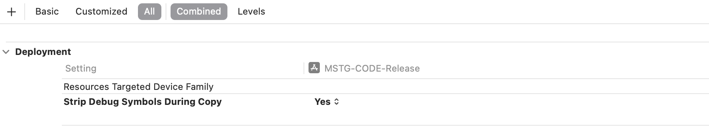
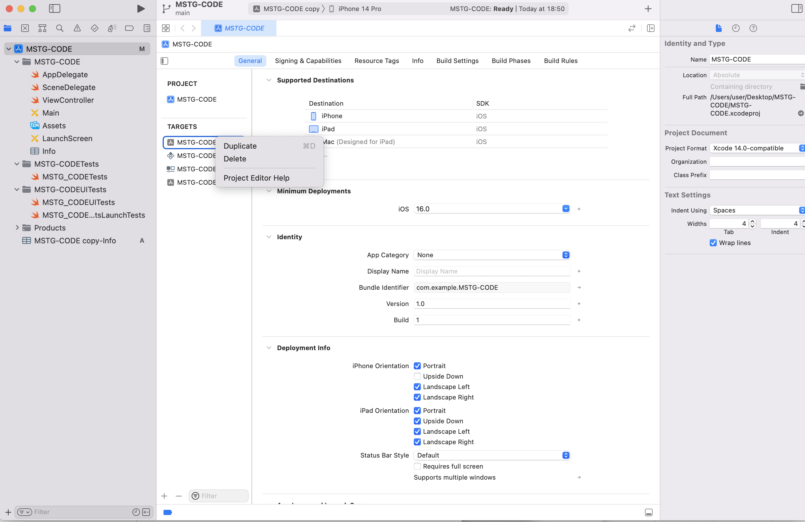
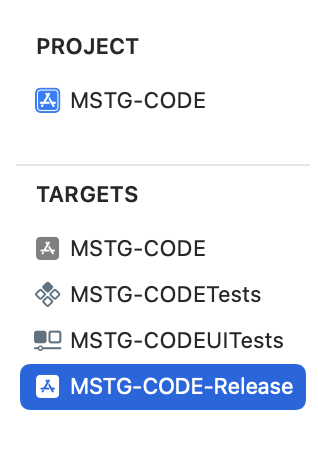
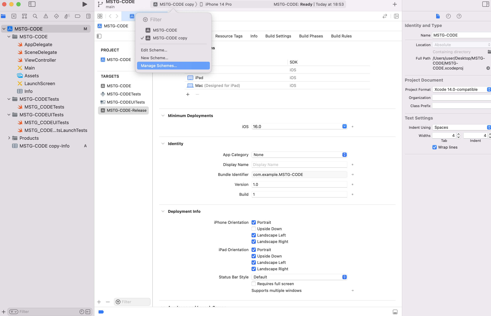
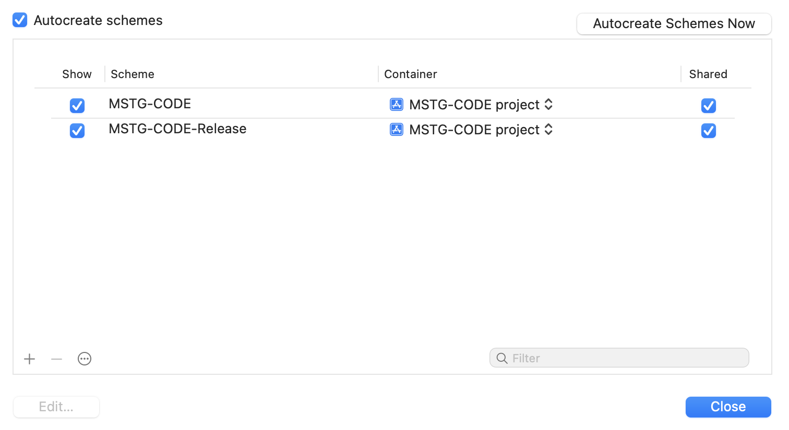
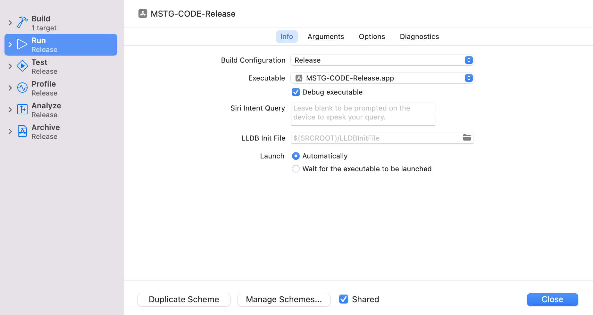
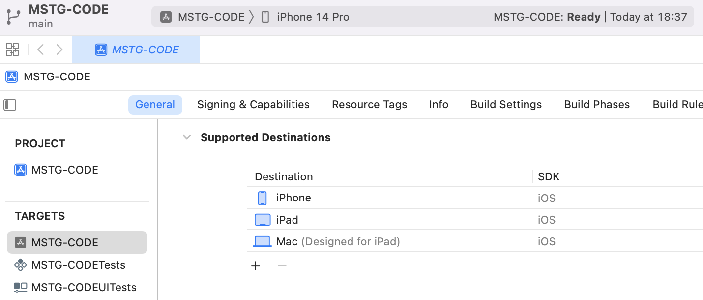
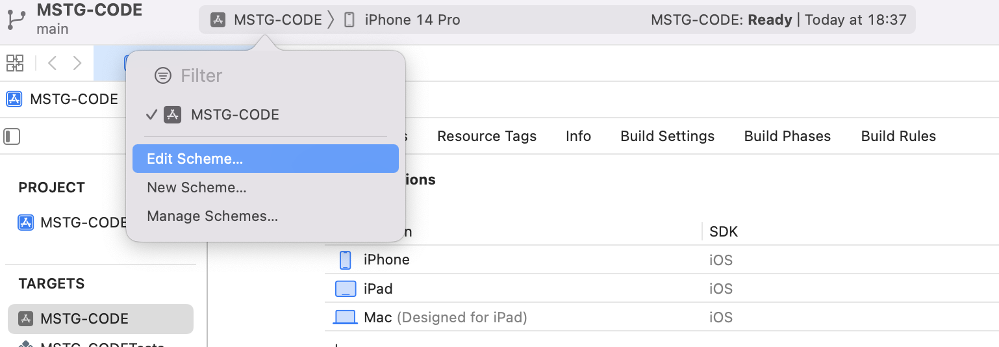
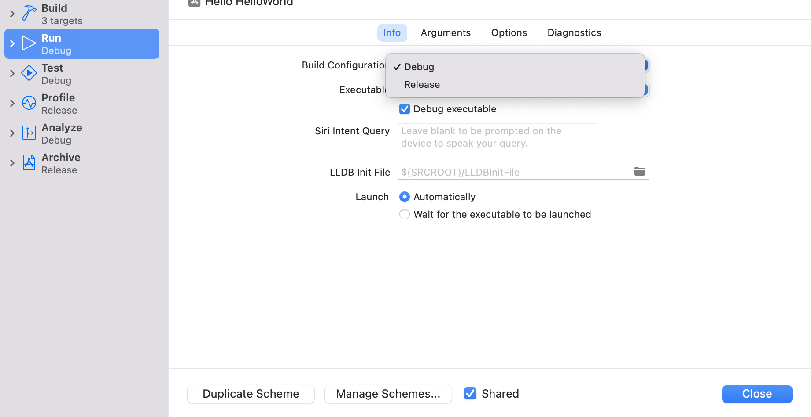

# コード品質とビルド設定要件

## MSTG-CODE-1
アプリは有効な証明書で署名およびプロビジョニングされている。その秘密鍵は適切に保護されている。

### コード署名
アプリに[コード署名](https://github.com/OWASP/owasp-mastg/blob/v1.5.0/Document/0x06a-Platform-Overview.md#code-signing)を行うことで、アプリの提供元が既知であり、最後に署名された後に変更されていないことをユーザに保証する。アプリケーションがアプリケーションサービスを統合したり、 ジェイルブレイク されていないデバイスにインストールされたり、 App Store に提出されたりする前に、 Apple が発行した証明書で署名する必要がある。証明書の要求方法およびアプリケーションへのコード署名の方法について詳しくは、 [App Distribution Guide](https://help.apple.com/xcode/mac/current/#/dev8b4250b57) を参照する。


参考資料
* [owasp-mastg Making Sure that the App Is Properly Signed (MSTG-CODE-1) Overview](https://github.com/OWASP/owasp-mastg/blob/v1.5.0/Document/0x06i-Testing-Code-Quality-and-Build-Settings.md#overview)

ルールブック
* [アプリのコード署名方法（必須）](#アプリのコード署名方法必須)

### 静的解析
アプリが[最新のコード署名形式](https://developer.apple.com/documentation/xcode/using-the-latest-code-signature-format)を使用していることを確認する必要がある。アプリケーションの .app ファイルから [codesign](https://developer.apple.com/library/archive/documentation/Security/Conceptual/CodeSigningGuide/Procedures/Procedures.html) を使用して署名証明書の情報を取得することができる。 Codesign は、コード署名の作成、チェック、表示、およびシステム内の署名済みコードの動的ステータスの照会に使用される。

アプリケーションの IPA ファイルを取得したら、 ZIP ファイルとして保存し直し、 ZIP ファイルを解凍する。アプリケーションの .app ファイルがあるペイロード ディレクトリに移動する。

以下の codesign コマンドを実行すると、署名情報が表示される。

```bash
$ codesign -dvvv YOURAPP.app
Executable=/Users/Documents/YOURAPP/Payload/YOURAPP.app/YOURNAME
Identifier=com.example.example
Format=app bundle with Mach-O universal (armv7 arm64)
CodeDirectory v=20200 size=154808 flags=0x0(none) hashes=4830+5 location=embedded
Hash type=sha256 size=32
CandidateCDHash sha1=455758418a5f6a878bb8fdb709ccfca52c0b5b9e
CandidateCDHash sha256=fd44efd7d03fb03563b90037f92b6ffff3270c46
Hash choices=sha1,sha256
CDHash=fd44efd7d03fb03563b90037f92b6ffff3270c46
Signature size=4678
Authority=iPhone Distribution: Example Ltd
Authority=Apple Worldwide Developer Relations Certification Authority
Authority=Apple Root CA
Signed Time=4 Aug 2017, 12:42:52
Info.plist entries=66
TeamIdentifier=8LAMR92KJ8
Sealed Resources version=2 rules=12 files=1410
Internal requirements count=1 size=176
```

[Apple のドキュメント](https://developer.apple.com/business/distribute/)に記載されているように、アプリを配布する方法には、 App Store を使用する方法、 Apple Business Manager を使用してカスタムまたは社内配布する方法など、さまざまな方法がある。社内配布の場合、配布用に署名したアプリにアドホック証明書が使用されていないことを確認する。

参考資料
* [owasp-mastg Making Sure that the App Is Properly Signed (MSTG-CODE-1) Static Analysis](https://github.com/OWASP/owasp-mastg/blob/v1.5.0/Document/0x06i-Testing-Code-Quality-and-Build-Settings.md#static-analysis)

ルールブック
* [アプリが最新のコード署名形式を使用していることを確認する必要がある（必須）](#アプリが最新のコード署名形式を使用していることを確認する必要がある必須)

### ルールブック
1. [アプリのコード署名方法（必須）](#アプリのコード署名方法必須)
1. [アプリが最新のコード署名形式を使用していることを確認する必要がある（必須）](#アプリが最新のコード署名形式を使用していることを確認する必要がある必須)

#### アプリのコード署名方法（必須）

以下手順に従い、アプリへのコード署名を行う。

1. Apple ID をアカウント設定に追加する

   ユーザを識別し、ユーザのチームに関する情報をダウンロードするために、ユーザの Apple ID アカウントをアカウント環境設定に追加する。 Xcode は、ユーザが属しているすべてのチームに関する情報をダウンロードするために、 Apple ID の資格情報を使用する。

2. プロジェクト内のターゲットをチームに割り当てる

   ユーザのプロジェクト内の各ターゲットをチームに割り当てる。 Xcode は、関連するチームアカウントに署名の権限（証明書、識別子、およびプロビジョニングプロファイル）を格納する。ユーザが組織として登録した場合、プログラムの役割は、 Xcode で実行できるタスクを決定する。ユーザが個人として登録する場合、ユーザは一人のチームのためのアカウント所有者である。あなたが Apple Developer Program のメンバーでない場合、 Xcode はユーザのために個人的なチームを作成する。

3. アプリに機能を追加する

   「署名と機能」で、使用したいアプリサービスを有効にする。 Xcode は、ユーザのプロジェクトを構成し、それに応じて署名の権限を更新する。必要であれば、 Xcode は、関連する App ID のアプリサービスを有効にし、それが管理するプロビジョニングプロファイルを再生成する。いくつかのアプリサービスを完全に有効にするには、開発者アカウントまたは App Store Connect にサインインする必要がある場合がある。

4. 端末上でアプリを実行する

   接続された端末またはワイヤレス端末（ iOS、tvOS ）でアプリを初めて実行するとき、 Xcode はあなたのために必要な開発署名の権限を作成する。 Xcode は、あなたが選択したデバイスを登録し、それが管理するプロビジョニングプロファイルに追加する。 macOS アプリの場合、 Xcode は、Xcode を実行している Mac を登録する。

5. 署名証明書とプロビジョニングプロファイルのエクスポート

   端末上でアプリを起動するために使用する署名証明書とプロビジョニングプロファイルは、ユーザの Mac に保存されている。署名証明書の秘密鍵は Keychain にのみ保存されるため、開発者アカウントの署名証明書とプロビジョニングプロファイルをエクスポートするには良いタイミングである。また、開発者アカウントをエクスポートして、署名権限を別の Mac に移動することもできる。

これに違反する場合、以下の可能性がある。
* ユーザに対してアプリへの署名後にソースが変更されていないことを保証できない。

#### アプリが最新のコード署名形式を使用していることを確認する必要がある（必須）

アプリが[最新のコード署名形式](https://developer.apple.com/documentation/xcode/using-the-latest-code-signature-format)を使用していることを確認する必要がある。アプリケーションの .app ファイルから [codesign](https://developer.apple.com/library/archive/documentation/Security/Conceptual/CodeSigningGuide/Procedures/Procedures.html) を使用して署名証明書の情報を取得することができる。 Codesign は、コード署名の作成、チェック、表示、およびシステム内の署名済みコードの動的ステータスの照会に使用される。

アプリケーションの IPA ファイルを取得したら、 ZIP ファイルとして保存し直し、 ZIP ファイルを解凍する。アプリケーションの .app ファイルがあるペイロード ディレクトリに移動する。

以下の codesign コマンドを実行すると、署名情報が表示される。

```bash
$ codesign -dvvv YOURAPP.app
Executable=/Users/Documents/YOURAPP/Payload/YOURAPP.app/YOURNAME
Identifier=com.example.example
Format=app bundle with Mach-O universal (armv7 arm64)
CodeDirectory v=20200 size=154808 flags=0x0(none) hashes=4830+5 location=embedded
Hash type=sha256 size=32
CandidateCDHash sha1=455758418a5f6a878bb8fdb709ccfca52c0b5b9e
CandidateCDHash sha256=fd44efd7d03fb03563b90037f92b6ffff3270c46
Hash choices=sha1,sha256
CDHash=fd44efd7d03fb03563b90037f92b6ffff3270c46
Signature size=4678
Authority=iPhone Distribution: Example Ltd
Authority=Apple Worldwide Developer Relations Certification Authority
Authority=Apple Root CA
Signed Time=4 Aug 2017, 12:42:52
Info.plist entries=66
TeamIdentifier=8LAMR92KJ8
Sealed Resources version=2 rules=12 files=1410
Internal requirements count=1 size=176
```

これに違反する場合、以下の可能性がある。
* ストアへ登録できない可能性がある。

## MSTG-CODE-2
アプリはリリースモードでビルドされている。リリースビルドに適した設定である（デバッグ不可など）。

### ビルドのモード設定
iOS アプリケーションのデバッグは、 lldb と呼ばれる強力なデバッガを組み込んだ Xcode を使って行うことができる。 Lldb は Xcode5 からデフォルトのデバッガとなり、 gdb のような GNU ツールに代わって開発環境に完全に統合された。デバッグはアプリを開発する際には便利な機能だが、 App Store やエンタープライズプログラムにアプリをリリースする前にはオフにする必要がある。

アプリをビルドまたはリリースモードで生成することは、 Xcode のビルド設定に依存し、 デバッグモードでアプリを生成すると、生成されたファイルに DEBUG flag が挿入される。

参考資料
* [owasp-mastg Determining Whether the App is Debuggable (MSTG-CODE-2)](https://github.com/OWASP/owasp-mastg/blob/v1.5.0/Document/0x06i-Testing-Code-Quality-and-Build-Settings.md#determining-whether-the-app-is-debuggable-mstg-code-2)

### 静的解析
まず、環境内の flag を確認するために、アプリを生成するモードを決定する必要がある。

* プロジェクトのビルド設定を選択する。
* 「 Apple LVM - Preprocessing 」と「 Preprocessor Macros 」で、「 DEBUG 」または「 DEBUG_MODE 」が選択されていないことを確認する。（ Objective-C ）
* または、「Swift Compiler - Custom flags」セクション / 「Other Swift Flags」において、「 -D DEBUG 」エントリが存在しないことを確認する。
* Manage Schemes を開き、リリース用のスキームで「 Debug executable 」オプションが選択されていないことを確認する。


参考資料
* [owasp-mastg Determining Whether the App is Debuggable (MSTG-CODE-2) Static Analysis](https://github.com/OWASP/owasp-mastg/blob/v1.5.0/Document/0x06i-Testing-Code-Quality-and-Build-Settings.md#static-analysis-1)

ルールブック
* [ビルドのモード設定確認（必須）](#ビルドのモード設定確認必須)

### 動的解析
Xcode を使用して、直接デバッガをアタッチできるかどうかを確認する。次に、アプリを Clutching した後、 ジェイルブレイク デバイス上でデバッグできるかどうかを確認する。これは、 Cydia の BigBoss リポジトリにある debug-server を使用する。

注：アプリケーションにアンチリバースエンジニアリングコントロールが装備されている場合、デバッガを検知して停止させることができる。

参考資料
* [owasp-mastg Determining Whether the App is Debuggable (MSTG-CODE-2) Dynamic Analysis](https://github.com/OWASP/owasp-mastg/blob/v1.5.0/Document/0x06i-Testing-Code-Quality-and-Build-Settings.md#dynamic-analysis)

### ルールブック
1. [ビルドのモード設定確認（必須）](#ビルドのモード設定確認必須)

#### ビルドのモード設定確認（必須）
アプリをビルドまたはリリースモードで生成することは、 Xcode のビルド設定に依存する。そのため、リリース用のアプリケーションでは正常にリリースモードが設定されていることを確認する必要がある。デバッグモードでアプリをビルドした場合は DEBUG flag が挿入されるため、直接デバッガへのアタッチが可能になる。

環境内の DEBUG flag 設定の確認方法。
* プロジェクトのビルド設定を選択する。
* 「 Apple LVM - Preprocessing 」と「 Preprocessor Macros 」で、「 DEBUG 」または「 DEBUG_MODE 」が選択されていないことを確認する。（ Objective-C ）
* または、「Swift Compiler - Custom flags」セクション / 「Other Swift Flags」において、「 -D DEBUG 」エントリが存在しないことを確認する。
* Manage Schemes を開き、リリース用のスキームで「 Debug executable 」オプションが選択されていないことを確認する。


※ Xcode の設定に関するルールのため、サンプルコードはなし。

これに違反する場合、以下の可能性がある。
* デバッガへアタッチされることで、アプリ情報が漏洩する。

## MSTG-CODE-3
デバッグシンボルはネイティブバイナリから削除されている。

### デバッグシンボルの有無
グッドプラクティスとして、コンパイルされたバイナリにはできる限り詳細な情報を与えないようにすべきである。デバッグシンボルのような追加のメタデータが存在すると、コードに関する重要な情報、例えば関数が何をするかについての情報を漏洩する関数名が提供される可能性がある。このメタデータはバイナリを実行するのに必要ではないので、リリースビルドでは破棄するのが安全である。これは、適切なコンパイラ設定を使用することで可能である。テスターとして、アプリと一緒に提供されるすべてのバイナリを調査し、デバッグシンボル（少なくとも、コードに関する重要な情報を明らかにするもの）が存在しないことを確認する必要がある。

iOS アプリケーションがコンパイルされると、コンパイラはアプリ内の各バイナリファイル（メインアプリの実行ファイル、フレームワーク、アプリの拡張機能）に対してデバッグシンボルのリストを生成する。これらのシンボルには、クラス名、グローバル変数、メソッド名、関数名が含まれ、それらが定義されている特定のファイルと行番号に対応している。アプリのデバッグビルドでは、デフォルトでコンパイル済みバイナリにデバッグシンボルを配置するが、アプリのリリースビルドでは、配布アプリのサイズを縮小するためにコンパニオンデバッグシンボルファイル（ dSYM ）に配置する。


参考資料
* [owasp-mastg Finding Debugging Symbols (MSTG-CODE-3) Overview](https://github.com/OWASP/owasp-mastg/blob/v1.5.0/Document/0x06i-Testing-Code-Quality-and-Build-Settings.md#overview-2)

ルールブック
* [リリースビルドではコード情報を出力しないようにする（必須）](#リリースビルドではコード情報を出力しないようにする必須)

### 静的解析
デバッグシンボルの存在を確認するには、 [binutils](https://www.gnu.org/software/binutils/) の objdump か [llvm-objdump](https://llvm.org/docs/CommandGuide/llvm-objdump.html) を使って、すべてのアプリのバイナリを確認することができる。

次の例では、 TargetApp （ iOS のメインアプリの実行ファイル）に対して objdump を実行し、 d（ debug ） flag でマークされたデバッグシンボルを含むバイナリの典型的な出力を示している。その他のシンボルフラグ文字については、 [objdump の man ページ](https://www.unix.com/man-page/osx/1/objdump/)を参照する。

```bash
$ objdump --syms TargetApp

0000000100007dc8 l    d  *UND* -[ViewController handleSubmitButton:]
000000010000809c l    d  *UND* -[ViewController touchesBegan:withEvent:]
0000000100008158 l    d  *UND* -[ViewController viewDidLoad]
...
000000010000916c l    d  *UND* _disable_gdb
00000001000091d8 l    d  *UND* _detect_injected_dylds
00000001000092a4 l    d  *UND* _isDebugged
...
```

デバッグシンボルを含まないようにするには、 XCode プロジェクトのビルド設定から「 Strip Debug Symbols During Copy 」を「 YES 」に設定する。デバッグシンボルを取り除くと、バイナリのサイズが小さくなるだけでなく、リバースエンジニアリングの難易度が上がる。


参考資料
* [owasp-mastg Finding Debugging Symbols (MSTG-CODE-3) Static Analysis](https://github.com/OWASP/owasp-mastg/blob/v1.5.0/Document/0x06i-Testing-Code-Quality-and-Build-Settings.md#static-analysis-2)

### 動的解析
動的解析は、デバッグ用シンボルの探索には適用されない。

参考資料
* [owasp-mastg Finding Debugging Symbols (MSTG-CODE-3) Dynamic Analysis](https://github.com/OWASP/owasp-mastg/blob/v1.5.0/Document/0x06i-Testing-Code-Quality-and-Build-Settings.md#dynamic-analysis-1)

### ルールブック
1. [リリースビルドではコード情報を出力しないようにする（必須）](#リリースビルドではコード情報を出力しないようにする必須)

#### リリースビルドではコード情報を出力しないようにする（必須）
コンパイルされたバイナリにはできる限り詳細な情報を与えないようにすべきである。デバッグシンボルのような追加のメタデータが存在すると、コードに関する重要な情報、例えば関数が何をするかについての情報を漏洩する関数名が提供される可能性がある。このメタデータはバイナリを実行するのに必要ではないので、リリースビルドでは破棄するのが安全である。これは、適切なコンパイラ設定を使用することで可能である。

デバッグシンボルを含まないようにするには、 XCode プロジェクトのビルド設定から「 Strip Debug Symbols During Copy 」を「 YES 」に設定する。デバッグシンボルを取り除くと、バイナリのサイズが小さくなるだけでなく、リバースエンジニアリングの難易度が上がる。



※概念的なルールのため、サンプルコードはなし。

これに違反する場合、以下の可能性がある。
* コード内のデバッグ情報、行番号、説明的な関数名やメソッド名などの一部のメタデータを漏洩する可能性がある。

## MSTG-CODE-4
デバッグコードおよび開発者支援コード (テストコード、バックドア、隠し設定など) は削除されている。アプリは詳細なエラーやデバッグメッセージをログ出力していない。

### ロギング
検証を迅速に行い、エラーをよりよく理解するために、開発者はしばしば、 API からの応答やアプリケーションの進行状況や状態について、冗長なロギングステートメント（ NSLog 、 println 、 print 、 dump 、 debugPrint を使用）のようなデバッグコードを含める。さらに、開発者がアプリケーションの状態を設定したり、 API からの応答を模擬するために使用する「管理機能」のデバッグコードが存在する可能性がある。リバースエンジニアは、この情報を使って、アプリケーションで何が起こっているかを簡単に追跡できる。したがって、デバッグ用のコードは、アプリケーションのリリースバージョンから削除する必要がある。


参考資料
* [owasp-mastg Finding Debugging Code and Verbose Error Logging (MSTG-CODE-4)](https://github.com/OWASP/owasp-mastg/blob/v1.5.0/Document/0x06i-Testing-Code-Quality-and-Build-Settings.md#finding-debugging-code-and-verbose-error-logging-mstg-code-4)

ルールブック
* [デバッグコードの処理（必須）](#デバッグコードの処理必須)
* [デバッグコードは、アプリケーションのリリースバージョンから削除する必要がある（必須）](#デバッグコードはアプリケーションのリリースバージョンから削除する必要がある必須)

### 静的解析
ロギングステートメントに対して、以下のような静的解析のアプローチをとることができる。

1. アプリケーションのコードを Xcode にインポートする。
2. 以下の出力関数のコードを検索する。 NSLog, println, print, dump, debugPrint.
3. それらの 1 つを見つけたら、ログに記録するステートメントのマークアップを改善するために、開発者がロギング関数の周りにラッピング関数を使用したかどうかを判断する。もしそうなら、その関数を検索に追加する。
4. 手順 2 と 3 のすべての結果について、マクロまたはデバッグ状態に関連するガードが、リリースビルドでロギングをオフにするように設定されているかどうかを確認する。 Objective-Cでプリプロセッサマクロを使用できることに注意する。

```objectivec
#ifdef DEBUG
    // Debug-only code
#endif
```

Swift でこの動作を有効にするための手順が変更された。スキームで環境変数を設定するか、ターゲットのビルド設定で custom compiler flags として設定する必要がある。 Xcode 8 と Swift 3 はこれらの関数をサポートしていないため、以下の関数 ( Swift 2.1. release-configuration でビルドされたアプリかどうかを判断できる) は推奨されないことに注意する。

* _isDebugAssertConfiguration
* _isReleaseAssertConfiguration
* _isFastAssertConfiguration

アプリケーションの設定によっては、さらにロギング機能が追加される場合がある。例えば、 [CocoaLumberjack](https://github.com/CocoaLumberjack/CocoaLumberjack) を使用する場合、静的解析は少し異なる。

「デバッグ管理」コード（組み込み）：  storyboards を調査し、アプリケーションがサポートすべき機能とは異なる機能を提供するフローや view-controller があるかどうかを確認する。この機能は、デバッグビューからエラーメッセージの出力、 custom stub-response configurations からアプリケーションのファイルシステムまたはリモートサーバ上のファイルに書き込まれるログまで、何でも可能である。

開発者として、アプリケーションのリリース バージョンにデバッグ用のステートメントが存在しないことを確認している限り、アプリケーションのデバッグバージョンにデバッグ用のステートメントを組み込むことは問題にならない。

#### Objective-C ロギングステートメント
Objective-C では、開発者はプリプロセッサーマクロを使用してデバッグコードをフィルタリングすることができる。

```objectivec
#ifdef DEBUG
    // Debug-only code
#endif
```

#### Swift ロギングステートメント
Swift 2 ( with Xcode 7 ) では、ターゲットごとに custom compiler flags を設定する必要があり、  compiler flags は "-D" で始まらなければならない。そのため、 debug flag DMSTG-DEBUG が設定されている場合、以下のような記述が可能である。

```swift
#if MSTG-DEBUG
    // Debug-only code
#endif
```

Swift 3 ( Xcode 8 ) では、 Build settings/Swift compiler - Custom flags で Active Compilation Conditions を設定することができる。 Swift 3 では、プリプロセッサの代わりに、定義された条件に基づいて[条件付きコンパイルブロック](https://developer.apple.com/documentation/swift#2984801)を使用する。


参考資料
* [owasp-mastg Finding Debugging Code and Verbose Error Logging (MSTG-CODE-4) Static Analysis](https://github.com/OWASP/owasp-mastg/blob/v1.5.0/Document/0x06i-Testing-Code-Quality-and-Build-Settings.md#static-analysis-3)

### 動的解析
開発者がデバッグコードを実行する際に、リリース / デバッグモードに基づく関数ではなく、ターゲットに基づく関数を使用することがあるため、動的解析はシミュレータと端末の両方で実行される必要がある。

1. シミュレータ上でアプリケーションを実行し、アプリの実行中にコンソールに出力される内容を確認する。
2. Mac に端末を接続し、 Xcode 経由で端末上でアプリケーションを実行し、アプリの実行中にコンソールに出力される内容を確認する。

その他の「マネージャーベース」のデバッグコードについては、シミュレーターと端末の両方でアプリケーションをクリックして、アプリのプロファイルを事前に設定できる機能、実際のサーバを選択できる機能、APIからのレスポンスを選択できる機能などがあるかどうかを確認する必要がある。

参考資料
* [owasp-mastg Finding Debugging Code and Verbose Error Logging (MSTG-CODE-4) Dynamic Analysis](https://github.com/OWASP/owasp-mastg/blob/v1.5.0/Document/0x06i-Testing-Code-Quality-and-Build-Settings.md#dynamic-analysis-2)

### ルールブック
1. [デバッグコードの処理（必須）](#デバッグコードの処理必須)
1. [デバッグコードは、アプリケーションのリリースバージョンから削除する必要がある（必須）](#デバッグコードはアプリケーションのリリースバージョンから削除する必要がある必須)

#### デバッグコードの処理（必須）

スキームで環境変数を設定する方法

1. ビルドターゲットの追加
   既存の１つのターゲットを右クリック > deplicate を選択すると新たにコピーが作成される。

   

   作成できたら名前を XXXXX-Release にしておく。

   

2. ビルドスキームの追加
   ターゲットを追加すると自動で同じ名前のスキームが自動追加される。

   Xcode のトップバーの Run 実行停止ボタンの右にターゲット選択ボタンがある。それをクリックするとターゲットの一覧が表示される。
   手順 1 で名前を変更したが、スキームの方は変更されていない。

   

   変更するには Manage Schemes... を選択しスキーム管理画面を表示させる。 copy をターゲットと同じ、 XXXXX-Release にリネームする。

   

3. Edit Scheme... をクリックする
   Edit Scheme... をクリックし、左タブのその他 Test 、 Profile 、 Analyze 、 Archive も Release に変えておく。

   

4. マクロの記述
   スキームを変えると自動でマクロの条件が true の記述のみが活性化するようになっている。

   ```swift
   public class SampleClass {
   
       func execute() {
           // Do any additional setup after loading the view, typically from a nib.
   #if PRODUCTION
           print("PRODUCTION Runing")
   #endif
   
   #if DEBUG
           print("DEBUG Runing")
   #endif
   
   #if STAGING
           print("STAGING Runing")
   #endif
       }
   }
   ```

ターゲットのビルド設定で custom compiler flags として設定する方法

1. プロジェクト名をクリックする

   

2. Edit Scheme... をクリックする

   

3. Build Configuration で Debug と Release を切り替える

   


プリプロセッサの利用方法

コンパイル時の flag としてデフォルトでデバッグビルドには DEBUG が付与されている。

```swift
public class SampleClass {

    func sample() {
#if DEBUG
        // 開発用の接続先
        let server = "api.development.com"
#else
        // 本番用の接続先
        let server = "api.com"
#endif

    }

}
```

※違反した場合または注意しなかった場合の事象として記載可能なものなし。

#### デバッグコードは、アプリケーションのリリースバージョンから削除する必要がある（必須）

ロギング用に追加したデバッグコードは、リリースバージョンを作成する際には削除する必要がある。

これに違反する場合、以下の可能性がある。
* デバッグコードによる情報漏洩を引き起こす可能性がある。

## MSTG-CODE-5
モバイルアプリで使用されるライブラリ、フレームワークなどのすべてのサードパーティコンポーネントを把握し、既知の脆弱性を確認している。

### サードパーティライブラリ
iOS アプリケーションでは、サードパーティライブラリを利用することが多く、開発者は問題を解決するために書くコードが少なくなるため、開発を促進することができる。しかし、サードパーティライブラリには、脆弱性、互換性のないライセンス、または悪意のあるコンテンツが含まれている可能性がある。さらに、組織や開発者にとって、ライブラリのリリースを監視し、利用可能なセキュリティパッチを適用するなど、アプリケーションの依存関係を管理することは困難である。

パッケージ管理ツールには、 [Swift Package Manager](https://www.swift.org/package-manager/) 、 [Carthage](https://github.com/Carthage/Carthage) 、 [CocoaPods](https://cocoapods.org/) の 3 つがあり、幅広く利用されている。

* Swift Package Managerはオープンソースで、 Swift 言語に含まれ、 Xcode に統合されており ( Xcode 11 以降 )、 [Swift 、 Objective-C 、 Objective-C++ 、 C 、および C++](https://developer.apple.com/documentation/packagedescription) パッケージをサポートしている。 Swift で書かれ、分散化され、プロジェクトの依存関係を文書化し管理するために Package.swift ファイルを使用する。
* Carthage はオープンソースで、 Swift と Objective-C のパッケージに使用することができる。 Swift で書かれ、分散化されており、 Cartfile ファイルを使用してプロジェクトの依存関係をドキュメント化し管理する。
* CocoaPods はオープンソースで、 Swift と Objective-C のパッケージに使用することができる。 Ruby で書かれており、公開パッケージと非公開パッケージのための集中型パッケージレジストリを利用し、プロジェクトの依存関係を文書化し管理するために Podfile ファイルを使用する。

ライブラリには 2 つの種類が存在する。

* テスト用の OHHTTPStubs のように、実際のプロダクションアプリケーションに含まれない (あるいは含まれるべきではない) ライブラリ。
* Alamofire など、実際のプロダクションアプリケーションの中に詰め込まれているライブラリ。

これらのライブラリは、意図しない効果をもたらす可能性がある。

* ライブラリは脆弱性を含んでいることがあり、その場合、アプリケーションも脆弱になる。その良い例が、 AFNetworking のバージョン 2.5.1 で、証明書の検証を無効にするバグが含まれている。この脆弱性により、攻撃者は、ライブラリを使用して API に接続しているアプリケーションに対して、中間者攻撃を実行することができる。
* ライブラリのメンテナンスができなくなったり、ほとんど使われなくなったりして、脆弱性の報告や修正が行われなくなる。そのため、ライブラリを通じて、アプリケーションに脆弱なコードが含まれる可能性がある。
* ライブラリは LGPL2.1 などのライセンスを使用できる。この場合、アプリケーションの開発者は、アプリケーションを使用してそのソースの洞察を要求するユーザに、ソース コードへのアクセスを提供する必要がある。実際、アプリケーションは、ソースコードを変更して再配布できるようにする必要がある。これにより、アプリケーションの知的財産 (IP) が危険にさらされる可能性がある。

この問題は様々なレベルで発生する可能性があることに注意する必要がある。 WebView で JavaScript を使用している場合、 JavaScript ライブラリにもこれらの問題が発生する可能性がある。 Cordova 、 React-native 、 Xamarin アプリのプラグイン/ライブラリも同様である。

参考資料
* [owasp-mastg Checking for Weaknesses in Third Party Libraries (MSTG-CODE-5) Overview](https://github.com/OWASP/owasp-mastg/blob/v1.5.0/Document/0x06i-Testing-Code-Quality-and-Build-Settings.md#overview-4)

ルールブック
* [サードパーティライブラリの使用には注意する（推奨）](#サードパーティライブラリの使用には注意する推奨)

### サードパーティライブラリの脆弱性の検出
アプリが使用するライブラリに脆弱性がないことを確認するためには、 CocoaPods や Carthage によってインストールされた依存関係を確認するのが最適である。

参考資料
* [owasp-mastg Checking for Weaknesses in Third Party Libraries (MSTG-CODE-5) Detecting vulnerabilities of third party libraries](https://github.com/OWASP/owasp-mastg/blob/v1.5.0/Document/0x06i-Testing-Code-Quality-and-Build-Settings.md#detecting-vulnerabilities-of-third-party-libraries)

ルールブック
* [ライブラリの脆弱性の確認方法（推奨）](#ライブラリの脆弱性の確認方法推奨)

#### Swift Package Manager
サードパーティの依存関係を管理するために [Swift Package Manager](https://www.swift.org/package-manager/)を使用している場合、サードパーティのライブラリの脆弱性を分析するために以下の手順を実行することができる。

まず、 Package.swift があるプロジェクトのルートで、次のように入力する。

```bash
swift build
```

次に、実際に使用されているバージョンを Package.resolved ファイルで確認し、与えられたライブラリに既知の脆弱性がないかどうかを調査する。

[OWASP Dependency-Check](https://owasp.org/www-project-dependency-check/) の試験的な [Swift Package Manager Analyzer](https://jeremylong.github.io/DependencyCheck/analyzers/swift.html) を利用して、すべての依存関係の [Common Platform Enumeration ( CPE )](https://nvd.nist.gov/products/cpe) 命名法および対応する [Common Vulnerability and Exposure ( CVE )](https://cve.mitre.org/) エントリを識別することが可能である。アプリケーションの Package.swift ファイルをスキャンし、以下のコマンドを使用して既知の脆弱なライブラリのレポートを生成する。

```bash
dependency-check  --enableExperimental --out . --scan Package.swift
```

参考資料
* [owasp-mastg Checking for Weaknesses in Third Party Libraries (MSTG-CODE-5) Swift Package Manager](https://github.com/OWASP/owasp-mastg/blob/v1.5.0/Document/0x06i-Testing-Code-Quality-and-Build-Settings.md#swift-package-manager)

#### CocoaPods
サードパーティの依存関係を管理するために [CocoaPods](https://cocoapods.org/) を使用する場合、サードパーティのライブラリの脆弱性を分析するために、次の手順を実行することができる。

まず、 Podfile が置かれているプロジェクトのルートで、以下のコマンドを実行する。

```bash
sudo gem install cocoapods
pod install
```

次に、依存関係ツリーが構築されたので、以下のコマンドを実行することで、依存関係とそのバージョンの概要を作成することができる。

```bash
sudo gem install cocoapods-dependencies
pod dependencies
```

上記の手順の結果を入力として、既知の脆弱性についてさまざまな脆弱性フィードを検索することができる。

備考：

1. 開発者が .podspec ファイルを使用して独自のサポートライブラリの観点からすべての依存関係をパックする場合、この .podspec ファイルは実験的な CocoaPods podspec チェッカーでチェックすることが可能である。
2. プロジェクトが CocoaPods と Objective-C を組み合わせて使用する場合、 SourceClear を使用できる。
3. HTTPS の代わりに HTTP ベースのリンクで CocoaPods を使用すると、依存関係のダウンロード中に中間者攻撃が可能になり、攻撃者がライブラリ（の一部）を他のコンテンツに置き換えることができる可能性がある。したがって、常に HTTPS を使用すること。

[OWASP Dependency-Check](https://owasp.org/www-project-dependency-check/) の試験的な [CocoaPods Analyzer](https://jeremylong.github.io/DependencyCheck/analyzers/cocoapods.html) を利用して、すべての依存関係の [Common Platform Enumeration ( CPE )](https://nvd.nist.gov/products/cpe) 命名法および対応する [Common Vulnerability and Exposure ( CVE )](https://cve.mitre.org/) エントリを識別することが可能である。アプリケーションの *.podspec および / または Podfile.lock ファイルをスキャンし、以下のコマンドを使用して既知の脆弱なライブラリのレポートを生成する。

```bash
dependency-check  --enableExperimental --out . --scan Podfile.lock
```

参考資料
* [owasp-mastg Checking for Weaknesses in Third Party Libraries (MSTG-CODE-5) CocoaPods](https://github.com/OWASP/owasp-mastg/blob/v1.5.0/Document/0x06i-Testing-Code-Quality-and-Build-Settings.md#cocoapods)

#### Carthage
サードパーティーの依存関係に [Carthage](https://github.com/Carthage/Carthage) を使用している場合、サードパーティーライブラリの脆弱性を分析するために、以下の手順を実行することができる。

まず、 Cartfile があるプロジェクトのルートで、次のように入力する。

```bash
brew install carthage
carthage update --platform iOS
```

次に、実際に使用されているバージョンを Cartfile.solved で確認し、与えられたライブラリに既知の脆弱性がないかどうかを調査する。

備考：この章を書いた時点では、 Carthage ベースの依存性分析の自動サポートは、著者の知る限りでは存在しない。少なくとも、この機能は OWASP DependencyCheck ツールにすでに要求されていたが、まだ実装されていない。（ [GitHub issue](https://github.com/jeremylong/DependencyCheck/issues/962) を参照）


参考資料
* [owasp-mastg Checking for Weaknesses in Third Party Libraries (MSTG-CODE-5) Carthage](https://github.com/OWASP/owasp-mastg/blob/v1.5.0/Document/0x06i-Testing-Code-Quality-and-Build-Settings.md#carthage)

#### 使用するライブラリの脆弱性
ライブラリに脆弱性があることが判明した場合、次の理由が適用される。

* ライブラリはアプリケーションと一緒に提供されているか。そして、そのライブラリに脆弱性のパッチが適用されたバージョンがあるかどうかを確認する。もしそうでなければ、その脆弱性が実際にアプリケーションに影響を与えるかどうかを確認する。もしそうであれば、または将来そうなる可能性があるのであれば、同様の機能を提供し、かつ脆弱性のない代替品を探す。
* そのライブラリはアプリケーションに組み込まれていないか。脆弱性が修正されたパッチが存在するかどうか確認する。もしそうでない場合、その脆弱性がビルドプロセスに影響を与えるかどうかを確認する。その脆弱性がビルドの妨げになったり、ビルドパイプラインのセキュリティを弱めたりする可能性はないか？そして、その脆弱性が修正された代替品を探す必要がある。

フレームワークをリンクライブラリとして手動で追加した場合。

1. xcodeproj ファイルを開き、プロジェクトのプロパティを確認する。
2. **Build Phases** タブを開き、いずれかのライブラリの **Link Binary With Libraries** の項目を確認する。 [MobSF](https://github.com/MobSF/Mobile-Security-Framework-MobSF) を使用して同様の情報を取得する方法については、以前の章を参照する。

コピーペーストしたソースの場合、ヘッダーファイル（ Objective-C を使用する場合）、それ以外は Swift ファイルで、既知のライブラリの既知のメソッド名を検索する。

次に、ハイブリッドアプリケーションの場合、 [RetireJS](https://retirejs.github.io/retire.js/) で JavaScript の依存関係を確認する必要があることに注意する。同様に Xamarin の場合は、 C# の依存関係を確認する必要がある。

最後に、アプリケーションが高リスクのアプリケーションである場合、最終的にライブラリを手動で審査することになる。その場合、ネイティブコードに特定の要件があり、それは、アプリケーション全体に対して MASVS が確立した要件と同様である。その次に、ソフトウェアエンジニアリングのベストプラクティスがすべて適用されているかどうかを確認する必要がある。


参考資料
* [owasp-mastg Checking for Weaknesses in Third Party Libraries (MSTG-CODE-5) Carthage](https://github.com/OWASP/owasp-mastg/blob/v1.5.0/Document/0x06i-Testing-Code-Quality-and-Build-Settings.md#carthage)

ルールブック
* [ハイブリッドアプリケーションの脆弱性確認の注意点（必須）](#ハイブリッドアプリケーションの脆弱性確認の注意点必須)

### サードパーティライブラリのライセンス
著作権を侵害していないことを確認するためには、 Swift Package Manager 、 CocoaPods 、 Carthage によってインストールされた依存関係を確認するのが最適である。

参考資料
* [owasp-mastg Checking for Weaknesses in Third Party Libraries (MSTG-CODE-5) Detecting the Licenses Used by the Libraries of the Application](https://github.com/OWASP/owasp-mastg/blob/v1.5.0/Document/0x06i-Testing-Code-Quality-and-Build-Settings.md#detecting-the-licenses-used-by-the-libraries-of-the-application)

ルールブック
* [ライブラリなどのアプリの依存関係の解析方法（必須）](#ライブラリなどのアプリの依存関係の解析方法必須)


#### Swift Package Manager
アプリケーションのソースが利用可能で、 Swift Package Manager を使用している場合、プロジェクトのルートディレクトリで、 Package.swift ファイルがある場所で、以下のコードを実行する。

```bash
swift build
```

これで、プロジェクト内の /.build/checkouts/ フォルダに、各依存ライブラリのソースがダウンロードされる。ここで、各ライブラリのライセンスは、それぞれのフォルダにある。

参考資料
* [owasp-mastg Checking for Weaknesses in Third Party Libraries (MSTG-CODE-5) Swift Package Manager](https://github.com/OWASP/owasp-mastg/blob/v1.5.0/Document/0x06i-Testing-Code-Quality-and-Build-Settings.md#swift-package-manager-1)

#### CocoaPods
アプリケーションのソースが入手でき、 CocoaPods を使用する場合、以下の手順を実行して、さまざまなライセンスを取得する。まず、 Podfile があるプロジェクトのルートで、次のように入力する。

```bash
sudo gem install cocoapods
pod install
```

これにより、すべてのライブラリがインストールされた Pods フォルダが作成され、各フォルダ内にインストールされる。これで、各フォルダ内のライセンスファイルを調査することで、各ライブラリのライセンスを確認することができる。

参考資料
* [owasp-mastg Checking for Weaknesses in Third Party Libraries (MSTG-CODE-5) CocoaPods](https://github.com/OWASP/owasp-mastg/blob/v1.5.0/Document/0x06i-Testing-Code-Quality-and-Build-Settings.md#cocoapods-1)

#### Carthage
アプリケーションのソースが入手でき、 Carthage を使用する場合、 Cartfile があるプロジェクトのルートディレクトリで、以下のコードを実行する。

```bash
brew install carthage
carthage update --platform iOS
```

これで、プロジェクト内の Carthage/Checkouts フォルダに、各依存ライブラリのソースがダウンロードされる。ここには、各ライブラリのライセンスがそれぞれのフォルダに存在する。

参考資料
* [owasp-mastg Checking for Weaknesses in Third Party Libraries (MSTG-CODE-5) Carthage](https://github.com/OWASP/owasp-mastg/blob/v1.5.0/Document/0x06i-Testing-Code-Quality-and-Build-Settings.md#carthage-1)

#### ライブラリライセンスに関する問題点
アプリの知的財産 (IP) をオープンソースにする必要があるライセンスがライブラリに含まれている場合、同様の機能を提供するために使用できるライブラリの代替品があるかどうかを確認する。

備考：ハイブリッドアプリの場合、使用されているビルドツールを確認する。ほとんどのビルドツールには、使用されているライセンスを検索するためのライセンス列挙プラグインがある。

参考資料
* [owasp-mastg Checking for Weaknesses in Third Party Libraries (MSTG-CODE-5) Issues with library licenses](https://github.com/OWASP/owasp-mastg/blob/v1.5.0/Document/0x06i-Testing-Code-Quality-and-Build-Settings.md#issues-with-library-licenses)

ルールブック
* [ライブラリなどのアプリの依存関係の解析方法（必須）](#ライブラリなどのアプリの依存関係の解析方法必須)
* [ライセンスの著作権が順守されているかどうかの検証（必須）](#ライセンスの著作権が順守されているかどうかの検証必須)

### 動的解析
この章の動的解析は、実際のライセンス確認と、ソースがない場合にどのライブラリが関係しているかの確認の 2 つのパートから構成されている。

ライセンスの著作権が順守されているかどうかを検証する必要がある。これは、アプリケーションに、サードパーティライブラリのライセンスが要求する著作権に関する記述がある、または EULA セクションを設ける必要があることを意味することが多い。

参考資料
* [owasp-mastg Checking for Weaknesses in Third Party Libraries (MSTG-CODE-5) Dynamic Analysis](https://github.com/OWASP/owasp-mastg/blob/v1.5.0/Document/0x06i-Testing-Code-Quality-and-Build-Settings.md#dynamic-analysis-3)

ルールブック
* [ライセンスの著作権が順守されているかどうかの検証（必須）](#ライセンスの著作権が順守されているかどうかの検証必須)

#### アプリケーションライブラリの一覧
アプリの解析を行う際には、アプリの依存関係（通常、ライブラリやいわゆる iOS フレームワークの形になっている）も解析し、脆弱性が含まれていないことを確認する必要がある。ソースコードがない場合でも、 [Objection](https://github.com/sensepost/objection) 、 [MobSF](https://github.com/MobSF/Mobile-Security-Framework-MobSF) 、 otool などのツールを使って、アプリの依存関係の一部を特定することができる。 Objection は、最も正確な結果を提供し、使いやすいので、推奨されるツールである。 iOS Bundles を扱うためのモジュールが含まれており、 list_bundles と list_frameworks の 2 つのコマンドを提供する。

list_bundles コマンドは、 Frameworks に関連しないアプリケーションのバンドルをすべてリストアップする。出力には、実行ファイル名、バンドル ID 、ライブラリのバージョン、ライブラリへのパスが含まれる。

```bash
...itudehacks.DVIAswiftv2.develop on (iPhone: 13.2.3) [usb] # ios bundles list_bundles
Executable    Bundle                                       Version  Path
------------  -----------------------------------------  ---------  -------------------------------------------
DVIA-v2       com.highaltitudehacks.DVIAswiftv2.develop          2  ...-1F0C-4DB1-8C39-04ACBFFEE7C8/DVIA-v2.app
CoreGlyphs    com.apple.CoreGlyphs                               1  ...m/Library/CoreServices/CoreGlyphs.bundle
```

list_frameworks コマンドは、 Frameworks を表すアプリケーションのバンドルを全てリストアップする。

```bash
...itudehacks.DVIAswiftv2.develop on (iPhone: 13.2.3) [usb] # ios bundles list_frameworks
Executable      Bundle                                     Version    Path
--------------  -----------------------------------------  ---------  -------------------------------------------
Bolts           org.cocoapods.Bolts                        1.9.0      ...8/DVIA-v2.app/Frameworks/Bolts.framework
RealmSwift      org.cocoapods.RealmSwift                   4.1.1      ...A-v2.app/Frameworks/RealmSwift.framework
                                                                      ...ystem/Library/Frameworks/IOKit.framework
...
```

参考資料
* [owasp-mastg Checking for Weaknesses in Third Party Libraries (MSTG-CODE-5) Dynamic Analysis Listing Application Libraries](https://github.com/OWASP/owasp-mastg/blob/v1.5.0/Document/0x06i-Testing-Code-Quality-and-Build-Settings.md#listing-application-libraries)

ルールブック
* [ライブラリなどのアプリの依存関係の解析方法（必須）](#ライブラリなどのアプリの依存関係の解析方法必須)


### ルールブック
1. [ライブラリの脆弱性の確認方法（推奨）](#ライブラリの脆弱性の確認方法推奨)
1. [ライブラリなどのアプリの依存関係の解析方法（必須）](#ライブラリなどのアプリの依存関係の解析方法必須)
1. [ライセンスの著作権が順守されているかどうかの検証（必須）](#ライセンスの著作権が順守されているかどうかの検証必須)
1. [ハイブリッドアプリケーションの脆弱性確認の注意点（必須）](#ハイブリッドアプリケーションの脆弱性確認の注意点必須)
1. [サードパーティライブラリの使用には注意する（推奨）](#サードパーティライブラリの使用には注意する推奨)

#### ライブラリの脆弱性の確認方法（推奨）
アプリが使用するライブラリに脆弱性がないことを確認するためには、 CocoaPods や Carthage によってインストールされた依存関係を確認するのが最適である。

これに注意しない場合、以下の可能性がある。
* アプリが脆弱性になる可能性がある。

#### ライブラリなどのアプリの依存関係の解析方法（必須）
著作権を侵害していないことを確認する必要がある。
ソースコードがある場合は、 Swift Package Manager 、 CocoaPods 、 Carthage によってインストールされた依存関係を確認するのが最適である。

**Swift Package Manager**

アプリケーションのソースが利用可能で、 Swift Package Manager を使用している場合、プロジェクトのルートディレクトリで、 Package.swift ファイルがある場所で、以下のコードを実行する。

```bash
swift build
```

これで、プロジェクト内の /.build/checkouts/ フォルダに、各依存ライブラリのソースがダウンロードされる。ここで、各ライブラリのライセンスは、それぞれのフォルダにある。

**CocoaPods**

アプリケーションのソースが入手でき、 CocoaPods を使用する場合、以下の手順を実行して、さまざまなライセンスを取得する。まず、 Podfile があるプロジェクトのルートで、次のように入力する。

```bash
sudo gem install cocoapods
pod install
```

これにより、すべてのライブラリがインストールされた Pods フォルダが作成され、各フォルダ内にインストールされる。これで、各フォルダ内のライセンスファイルを調査することで、各ライブラリのライセンスを確認することができる。

**Carthage**

アプリケーションのソースが入手でき、 Carthage を使用する場合、 Cartfile があるプロジェクトのルートディレクトリで、以下のコードを実行する。

```bash
brew install carthage
carthage update --platform iOS
```

これで、プロジェクト内の Carthage/Checkouts フォルダに、各依存ライブラリのソースがダウンロードされる。ここには、各ライブラリのライセンスがそれぞれのフォルダに存在する。

ソースコードがない場合でも、ツールを使って、アプリの依存関係の一部を特定することができる。

**Objection**

Objection は、 Frida を利用したランタイム モバイル探索ツールキットであり、ジェイルブレイクを必要とせずにモバイルアプリケーションのセキュリティ体制を評価するのに役立つように構築されており、以下のような特徴がある。

* iOS と Android の両方をサポートする。
* コンテナファイルシステムを検査して操作する。
* SSL ピン留めをバイパスする。
* Keychain をダンプする。
* ダンプやパッチ適用など、メモリ関連のタスクを実行する。
* ヒープ上のオブジェクトを探索して操作する。

**MobSF ( Mobile-Security-Framework-MobSF )**

MobSF は、 Android/iOS のペンテスト、マルウェア解析、セキュリティ評価を自動化したオールインワンのフレームワークで、静的解析と動的解析を行うことができる。 MobSF は、モバイルアプリのバイナリ（ APK 、 XAPK 、 IPA 、 APPX ）と zip 形式のソースコードをサポートしている。

**otool**

otool は、オブジェクトファイルやライブラリの指定された部分を表示するためのツールである。これは Mach-O ファイルとユニバーサルファイルフォーマットの両方を理解する。

これに違反する場合、以下の可能性がある。
* アプリの知的財産 (IP) をオープンソースにする必要があるライセンスがライブラリに含まれている可能性がある。

#### ライセンスの著作権が順守されているかどうかの検証（必須）
主要なライセンスに共通する特徴として、派生ソフトウェアを頒布する際は、利用元 OSS の「著作権」「ライセンス文」「免責事項」などを表示しなければならない点が挙げられる。
具体的に「何を」「どこに」「どのように」表示するかは**各ライセンスによって異なる可能性がある**ため、詳細は個別のライセンスを丁寧に確認する必要がある。

例えば MIT License では下記の記述によって「著作権表示」および「ライセンス文」を、「ソフトウェアのすべての複製または重要な部分に記載する」よう定められている。

```default
The above copyright notice and this permission notice shall be included in all copies or substantial portions of the Software.
```

これに違反する場合、以下の可能性がある。
* アプリの知的財産 (IP) をオープンソースにする必要があるライセンスがライブラリに含まれている可能性がある。

#### ハイブリッドアプリケーションの脆弱性確認の注意点（必須）
ハイブリッドアプリケーションの場合、 [RetireJS](https://retirejs.github.io/retire.js/) で JavaScript の依存関係を確認する必要があることに注意する。

RetireJS は Web サイトにアクセスするだけで、アクセスした Web サイトで利用されている JavaScript ライブラリに既知の脆弱性が存在するか確認してくれる。Retire.js ができることは、「ライブラリに存在する既知の脆弱性の検知」であり、 まだ公表されていない脆弱性は見つけることができない。

これに違反する場合、以下の可能性がある。
* JavaScript ライブラリに含まれる既知の脆弱性を察知できない可能性がある。

#### サードパーティライブラリの使用には注意する（推奨）
サードパーティライブラリには以下の欠点があるため、使用する場合は吟味する必要がある。

* ライブラリに含まれる脆弱性。脆弱性が含まれるライブラリを使用すると、ライブラリを通してアプリケーションに不正なコードや脆弱性のあるコードが含まれる可能性があるため注意する。また現時点では脆弱性が発見されていない場合でも今後発見される可能性も存在する。その場合は、脆弱性に対応したバージョンに更新するか、更新バージョンがない場合は使用を控える。
* ライブラリに含まれるライセンス。ライブラリの中には、そのライブラリを使用した場合、使用したアプリのソースコードの展開を求めるライセンスが存在するため注意する。

この問題は、複数のレベルで発生する可能性があることに注意する。 webview で JavaScript を使用する場合、 JavaScript のライブラリにもこのような問題がある可能性がある。 Cordova 、 React-native 、 Xamarin アプリのプラグイン/ライブラリも同様である。<br>

※サードパーティライブラリの使用注意に関するルールのため、サンプルコードなし。

これに注意しない場合、以下の可能性がある。
* アプリケーションに不正なコードや脆弱性のあるコードが含まれており、悪用される可能性がある。
* サードパーティライブラリに含まれるライセンスにより、アプリのソースコードの展開を求められる可能性がある。

## MSTG-CODE-6
アプリは可能性のある例外を catch し処理している。

### 例外処理
例外は、アプリケーションが異常な状態、あるいは、異常な状態に陥った後によく発生する。例外処理をテストすることは、アプリケーションが例外を処理し、ログ記録メカニズムや UI を通じて機密情報を漏洩することなく、安全な状態に移行することを確認することである。

Objective-C の例外処理は、 Swift での例外処理とはまったく異なることに注意する。レガシーの Objective-C コードと Swift コードの両方で書かれているアプリケーションで 2 つのアプローチをブリッジ橋渡しすることは、問題になることがあります。

参考資料
* [owasp-mastg Testing Exception Handling (MSTG-CODE-6) Overview](https://github.com/OWASP/owasp-mastg/blob/v1.5.0/Document/0x06i-Testing-Code-Quality-and-Build-Settings.md#overview-5)

ルールブック
* [例外処理のテスト目的（推奨）](#例外処理のテスト目的推奨)

### Objective-C の例外処理

Objective-C には、 2 種類のエラーがある。

参考資料
* [owasp-mastg Testing Exception Handling (MSTG-CODE-6) Exception handling in Objective-C](https://github.com/OWASP/owasp-mastg/blob/v1.5.0/Document/0x06i-Testing-Code-Quality-and-Build-Settings.md#exception-handling-in-objective-c)

#### NSException
NSException は、プログラミングや低レベルのエラー（例えば、 0 による除算や境界外の配列アクセスなど）を処理するために使用される。 NSException は raise で発生させるか、または @throw で throw させることができる。 catch しない限り、この例外は未処理の例外ハンドラを起動し、このハンドラでステートメントをログに記録できる（ログを記録するとプログラムが停止する）。 @try-@catch-block を使用している場合、 @catch で例外から復帰することができる。

```objectivec
 @try {
    //do work here
 }

@catch (NSException *e) {
    //recover from exception
}

@finally {
    //cleanup
```

NSException を使用すると、メモリ管理の問題が発生することに注意する： try block から [finally block](https://developer.apple.com/library/archive/documentation/Cocoa/Conceptual/Exceptions/Tasks/HandlingExceptions.html) にある[アロケーションをクリーンアップする](https://developer.apple.com/library/archive/documentation/Cocoa/Conceptual/Exceptions/Tasks/RaisingExceptions.html#//apple_ref/doc/uid/20000058-BBCCFIBF)必要がある。 NSException オブジェクトを NSError に変換するには、 @catch block で NSError をインスタンス化する必要があることに注意する。

#### NSError
NSError は、他のすべてのタイプの[エラー](https://developer.apple.com/library/archive/documentation/Cocoa/Conceptual/ProgrammingWithObjectiveC/ErrorHandling/ErrorHandling.html)に使用される。 Cocoa フレームワーク API の中には、何か問題が発生したときのために、失敗コールバックでエラーをオブジェクトとして提供するものが存在する。それらを提供しないものは、参照によって NSError オブジェクトへのポインタを渡す。 NSError オブジェクトへのポインタを取るメソッドには、成功か失敗かを示す BOOL の戻り値の型を提供することが、良い方法とされる。戻り値の型がある場合、エラーの場合は必ず nil を返すようにする必要がある。 NO または nil が返された場合、エラー/失敗の理由を調査することができる。

### Swiftの例外処理
Swift ( 2 - 5 ) の例外処理は、かなり異なっている。 try-catch block は、 NSException を処理するために存在するわけではない。この block は、 Error ( Swift 3 ) または ErrorType ( Swift 2 ) プロトコルに準拠したエラーを処理するために使用される。 Objective-C と Swift のコードがアプリケーションで組み合わされている場合、困難な場合がある。したがって、 両方の言語で書かれたプログラムでは　NSError はNSException よりも推奨される。さらに、エラー処理は Objective-C ではオプトインですが、 Swift では throw は明示的に処理する必要がある。 error-throwing を変換するには、 [Apple のドキュメント](https://developer.apple.com/documentation/swift/cocoa-design-patterns)を参照する。エラーを throw することことができるメソッドは throws キーワードを使用する。 Result 型は成功または失敗を表し、 [Result](https://developer.apple.com/documentation/swift/result) 、 [Swift 5 での Result の使い方](https://www.hackingwithswift.com/articles/161/how-to-use-result-in-swift)、 [Swift における Result 型の能力](https://www.swiftbysundell.com/articles/the-power-of-result-types-in-swift/)、を参照する。 [Swift でエラーを処理する](https://docs.swift.org/swift-book/LanguageGuide/ErrorHandling.html)方法は 4 つ存在する。

参考資料
* [owasp-mastg Testing Exception Handling (MSTG-CODE-6) Exception Handling in Swift](https://github.com/OWASP/owasp-mastg/blob/v1.5.0/Document/0x06i-Testing-Code-Quality-and-Build-Settings.md#exception-handling-in-swift)

ルールブック
* [例外処理 (NSException) 使用時の注意点（必須）](#例外処理-nsexception-使用時の注意点必須)
* [例外処理 (NSError) 使用時の注意点（必須）](#例外処理-nserror-使用時の注意点必須)
* [Swift の例外処理の注意点（推奨）](#swift-の例外処理の注意点推奨)

#### do-catch での例外処理
* 関数からその関数を呼び出すコードにエラーを伝える。この場合、 do-catch はなく、実際のエラーを投げる throw か、 throw したメソッドを実行する try があるだけである。 try を含むメソッドには throws キーワードも必要である。

  ```swift
  func dosomething(argumentx:TypeX) throws {
      try functionThatThrows(argumentx: argumentx)
  }
  ```

* do-catch ステートメントでエラーを処理する。次のようなパターンが使用できる。

  ```swift
  func doTryExample() {
      do {
          try functionThatThrows(number: 203)
      } catch NumberError.lessThanZero {
          // Handle number is less than zero
      } catch let NumberError.tooLarge(delta) {
          // Handle number is too large (with delta value)
      } catch {
          // Handle any other errors
      }
  }
  
  enum NumberError: Error {
      case lessThanZero
      case tooLarge(Int)
      case tooSmall(Int)
  }
  
  func functionThatThrows(number: Int) throws -> Bool {
      if number < 0 {
          throw NumberError.lessThanZero
      } else if number < 10 {
          throw NumberError.tooSmall(10 - number)
      } else if number > 100 {
          throw NumberError.tooLarge(100 - number)
      } else {
          return true
      }
  }
  ```

* エラーをオプション値として処理する。

  ```swift
      let x = try? functionThatThrows()
      // In this case the value of x is nil in case of an error.
  ```

* try! 式を使用して、エラーが発生しないことを保証する。

#### Result 型での例外処理

* 一般的なエラーを Result の戻り値として処理する。

```swift
enum ErrorType: Error {
    case typeOne
    case typeTwo
}

func functionWithResult(param: String?) -> Result<String, ErrorType> {
    guard let value = param else {
        return .failure(.typeOne)
    }
    return .success(value)
}

func callResultFunction() {
    let result = functionWithResult(param: "OWASP")

    switch result {
    case let .success(value):
        // Handle success
    case let .failure(error):
        // Handle failure (with error)
    }
}
```

* ネットワークや JSON のデコードエラーを Result 型で処理する。

```swift
struct MSTG: Codable {
    var root: String
    var plugins: [String]
    var structure: MSTGStructure
    var title: String
    var language: String
    var description: String
}

struct MSTGStructure: Codable {
    var readme: String
}

enum RequestError: Error {
    case requestError(Error)
    case noData
    case jsonError
}

func getMSTGInfo() {
    guard let url = URL(string: "https://raw.githubusercontent.com/OWASP/owasp-mastg/master/book.json") else {
        return
    }

    request(url: url) { result in
        switch result {
        case let .success(data):
            // Handle success with MSTG data
            let mstgTitle = data.title
            let mstgDescription = data.description
        case let .failure(error):
            // Handle failure
            switch error {
            case let .requestError(error):
                // Handle request error (with error)
            case .noData:
                // Handle no data received in response
            case .jsonError:
                // Handle error parsing JSON
            }
        }
    }
}

func request(url: URL, completion: @escaping (Result<MSTG, RequestError>) -> Void) {
    let task = URLSession.shared.dataTask(with: url) { data, _, error in
        if let error = error {
            return completion(.failure(.requestError(error)))
        } else {
            if let data = data {
                let decoder = JSONDecoder()
                guard let response = try? decoder.decode(MSTG.self, from: data) else {
                    return completion(.failure(.jsonError))
                }
                return completion(.success(response))
            }
        }
    }
    task.resume()
}
```

### 静的解析
ソースコードを見て、アプリケーションが様々なタイプのエラー（ IPC 通信、リモートサービスの呼び出しなど）をどのように処理しているかを理解する。次の章では、この段階で各言語について確認すべきことの例を挙げる。

参考資料
* [owasp-mastg Testing Exception Handling (MSTG-CODE-6) Static Analysis](https://github.com/OWASP/owasp-mastg/blob/v1.5.0/Document/0x06i-Testing-Code-Quality-and-Build-Settings.md#static-analysis-5)

#### Objective-C での静的解析
確認点
* アプリケーションは、例外とエラーを処理するために、よく設計され、統一されたスキームを使用している。
* Cocoa フレームワークの例外は正しく処理される。
* try blocks で割り当てられたメモリは、 @finally blocks で解放される。
* すべての @throw に対して、呼び出し側のメソッドまたは NSApplication/UIApplication オブジェクトのいずれかのレベルで適切な @catch があり、機密情報をクリーンアップし、場合によっては回復することができる。
* アプリケーションは、 UI やログステートメントでエラーを処理する際に機密情報を公開せず、ステートメントはユーザに問題を説明するのに冗長である。
* キーイング材料や認証情報など、リスクの高いアプリケーションの機密情報は、 @finally ブロックの実行中に常に削除される。
* raise はめったに使われない。（さらなる警告なしにプログラムを終了させなければならない場合に使用される）
* NSError オブジェクトは機密情報を漏洩するようなデータを含んでいない。

参考資料
* [owasp-mastg Testing Exception Handling (MSTG-CODE-6) Static Analysis in Objective-C](https://github.com/OWASP/owasp-mastg/blob/v1.5.0/Document/0x06i-Testing-Code-Quality-and-Build-Settings.md#static-analysis-in-objective-c)

ルールブック
* [例外/エラー処理の適切な実装と確認事項（必須）](#例外エラー処理の適切な実装と確認事項必須)

#### Swift での静的解析
確認点
* アプリケーションが適切に設計され、統一されたスキームでエラーを処理する。
* アプリケーションは、 UI やログステートメントでエラー処理中に機密情報を公開せず、ステートメントはユーザに問題を説明するのに冗長である。
* キーイング材料や認証情報など、リスクの高いアプリケーションの機密情報は、 defer blocks の実行中に常にワイプされる。
* try! は、前もって適切なガード（ try! で呼び出されたメソッドがエラーを投げないことをプログラムで確認すること）をした上で使用する。

参考資料
* [owasp-mastg Testing Exception Handling (MSTG-CODE-6) Static Analysis in Swift](https://github.com/OWASP/owasp-mastg/blob/v1.5.0/Document/0x06i-Testing-Code-Quality-and-Build-Settings.md#static-analysis-in-swift)

ルールブック
* [例外/エラー処理の適切な実装と確認事項（必須）](#例外エラー処理の適切な実装と確認事項必須)

#### 適切なエラー処理
開発者は、いくつかの方法で適切なエラー処理を実装することができる。

* アプリケーションが、エラーを処理するために、よく設計され、統一されたスキームを使用していることを確認する。
* テストケース「デバッグコードと冗長なエラーログに関する検証」で説明されているように、すべてのログが削除されるか、保護されていることを確認する。
* Objective-C で書かれたリスクの高いアプリケーションの場合：簡単に取得できないはずの秘密を削除する例外ハンドラを作成する必要がある。ハンドラは NSSetUncaughtExceptionHandler で設定することができる。
* 呼び出される throwing メソッドにエラーがないことが確実でない限り、 Swift で try を使用することは控える。
* Swift のエラーがあまりにも多くの中間メソッドに伝搬しないことを確認する。


参考資料
* [owasp-mastg Testing Exception Handling (MSTG-CODE-6) Proper Error Handling](https://github.com/OWASP/owasp-mastg/blob/v1.5.0/Document/0x06i-Testing-Code-Quality-and-Build-Settings.md#proper-error-handling)

ルールブック
* [例外/エラー処理の適切な実装と確認事項（必須）](#例外エラー処理の適切な実装と確認事項必須)

### 動的解析
動的解析にはいくつかの手法がある。

* iOS アプリケーションの UI フィールドに想定外の値を入力する。
* カスタム URL スキーム、ペーストボード、その他のアプリ間通信コントロールに、想定外の値や例外を発生させる値を入力して検証する。
* ネットワーク通信やアプリケーションに保存されているファイルを改ざんする。
* Objective-C では、 Cycript を使用してメソッドにフックし、呼び出し側が例外を throw する原因となる引数を提供することができる。

ほとんどの場合、アプリケーションはクラッシュしないはずである。その代わりに以下のようにする必要がある。

* エラーから回復するか、ユーザに続行不可能であることを知らせることができる状態になる。
* ユーザに適切な行動を取らせるためのメッセージ (機密情報を漏洩してはいけません) を提供する。
* アプリケーションのロギング機能に情報を残さないようにする。

参考資料
* [owasp-mastg Testing Exception Handling (MSTG-CODE-6) Dynamic Testing](https://github.com/OWASP/owasp-mastg/blob/v1.5.0/Document/0x06i-Testing-Code-Quality-and-Build-Settings.md#dynamic-testing)

### ルールブック
1. [例外処理のテスト目的（推奨）](#例外処理のテスト目的推奨)
1. [例外処理 (NSException) 使用時の注意点（必須）](#例外処理-nsexception-使用時の注意点必須)
1. [例外処理 (NSError) 使用時の注意点（必須）](#例外処理-nserror-使用時の注意点必須)
1. [Swift の例外処理の注意点（推奨）](#swift-の例外処理の注意点推奨)
1. [例外/エラー処理の適切な実装と確認事項（必須）](#例外エラー処理の適切な実装と確認事項必須)

#### 例外処理のテスト目的（推奨）
例外処理をテストの目的は、ログ記録メカニズムや UI を通じて機密情報を漏洩することなく、安全な状態に移行することである。

これに注意しない場合、以下の可能性がある。
* アプリケーションのクラッシュが発生する。
* 機密情報が漏洩する。

#### 例外処理 (NSException) 使用時の注意点（必須）
NSException は、プログラミングや低レベルのエラー（例えば、 0 による除算や 領域外の配列アクセスなど）を処理するために使用される。 

try の中で記述した処理の中で例外が発生した場合に、例外が発生する直前の処理までが実行され、その後、 catch の中で記述された処理が実行される。
そして最後に finally の中で記述された処理が実行される。
なお、この finally は、try と catch のどちらが実行されていたとしても常に最後に実行される。

一方で、例外が発生しなかった場合は、 try で記述された処理が全て実行され、その後 finally の処理が実行される。
catch 内の処理は実行されません。

try-catch 内でわざと例外を発生させる方法は、例外を発生させたいタイミングで下記のコードを実行する。

```objectivec
#import <Foundation/Foundation.h>

@interface MyException : NSObject {}
- (void)execute;
@end
 

@implementation MyException {}
 
-(void)execute {
    // わざと例外処理を発生させる処理
    [[NSException exceptionWithName:@"Exception" reason:@"reason" userInfo:nil] raise];
}
    
@end
```

※違反した場合または注意しなかった場合の事象として記載可能なものなし。

#### 例外処理 (NSError) 使用時の注意点（必須）
NSError は、他のすべてのタイプの[エラー](https://developer.apple.com/library/archive/documentation/Cocoa/Conceptual/ProgrammingWithObjectiveC/ErrorHandling/ErrorHandling.html)に使用される。 
Cocoa フレームワーク API の中には、何か問題が発生したときのために、失敗コールバックでエラーをオブジェクトとして提供するものが存在する。それらを提供しないものは、参照によって NSError オブジェクトへのポインタを渡す。 NSError オブジェクトへのポインタを取るメソッドには、成功か失敗かを示す BOOL の戻り値の型を提供することが、良い方法とされる。戻り値の型がある場合、エラーの場合は必ず nil を返すようにする必要がある。 NO または nil が返された場合、エラー/失敗の理由を調査することができる。

初期値を入れずに使ってしまうと、 NSError を参照した時に、参照先が適当な値になっているために EXC_BAD_ACCESS が発生してしまう。

NSError 生成時に nil を指定して初期化することで回避できる。

```objectivec
#import <Foundation/Foundation.h>

@interface MyErrorUse : NSObject {}
- (void)execute;
@end
 

@implementation MyErrorUse {}
 
-(void)execute {
    NSString *path = @"file/pass/";
    
    // NSErrorの初期化
    NSError *error = nil;
    [[NSFileManager defaultManager] removeItemAtPath: path error: &error];

    if (error != nil) {
       // エラー処理
    }

}
    
@end
```

引数 error は NSError 型 ( 後述 ) の参照ポインタを渡している。 渡すときに &error と書くことで、エラーがあった場合にメソッド内部でこの参照が更新され、 NSError の実体が代入される。

つまり、ファイル削除中にエラーが起きた場合は、この error の中身を確認すればハンドルできるということであり、 逆に言うとエラーハンドリングをしないときは error: には nil を渡すこともできる。

※違反した場合または注意しなかった場合の事象として記載可能なものなし。

#### Swift の例外処理の注意点（推奨）
Swift ( 2 - 5 ) の例外処理は、 try-catch block を使用する。

この block は、 Error ( Swift 3 ) または ErrorType ( Swift 2 ) プロトコルに準拠したエラーを処理するために使用され　NSException を処理するために存在するわけではない。

Objective-C と Swift のコードが組み合わされているアプリケーションのプログラムでは　NSError は NSException よりも推奨される。
さらに、エラー処理は Objective-C ではオプトインですが、 Swift では throw は明示的に処理する必要がある。

これに注意しない場合、以下の可能性がある。
* 例外を適切に処理できない可能性がある。

#### 例外/エラー処理の適切な実装と確認事項（必須）
iOS で例外/エラー処理を実装する場合は、以下内容を確認する必要がある。

Objective-C での確認点
* アプリケーションは、例外とエラーを処理するために、よく設計され、統一されたスキームを使用している。
* Cocoa フレームワークの例外は正しく処理される。
* try blocks で割り当てられたメモリは、 @finally blocks で解放される。
* すべての @throw に対して、呼び出し側のメソッドまたは NSApplication/UIApplication オブジェクトのいずれかのレベルで適切な @catch があり、機密情報をクリーンアップし、場合によっては回復することができる。
* アプリケーションは、 UI やログステートメントでエラーを処理する際に機密情報を公開せず、ステートメントはユーザに問題を説明するのに冗長である。
* キーイング材料や認証情報など、リスクの高いアプリケーションの機密情報は、 @finally ブロックの実行中に常に削除される。
* raise はめったに使われない。（さらなる警告なしにプログラムを終了させなければならない場合に使用される）
* NSError オブジェクトは機密情報を漏洩するようなデータを含んでいない。 

Swift での確認点
* アプリケーションが適切に設計され、統一されたスキームでエラーを処理する。
* アプリケーションは、 UI やログステートメントでエラー処理中に機密情報を公開せず、ステートメントはユーザに問題を説明するのに冗長である。
* キーイング材料や認証情報など、リスクの高いアプリケーションの機密情報は、 defer blocks の実行中に常にワイプされる。
* try! は、前もって適切なガード（ try! で呼び出されたメソッドがエラーを投げないことをプログラムで確認すること）をした上で使用する。

適切なエラー処理を実装方法
* アプリケーションが、エラーを処理するために、よく設計され、統一されたスキームを使用していることを確認する。
* テストケース「デバッグコードと冗長なエラーログに関する検証」で説明されているように、すべてのログが削除されるか、保護されていることを確認する。
* Objective-C で書かれたリスクの高いアプリケーションの場合：簡単に取得できないはずの秘密を削除する例外ハンドラを作成する必要がある。ハンドラは NSSetUncaughtExceptionHandler で設定することができる。
* 呼び出される throwing メソッドにエラーがないことが確実でない限り、 Swift で try を使用することは控える。
* Swift のエラーがあまりにも多くの中間メソッドに伝搬しないことを確認する。

try-catch でエラーを処理する方法

```objectivec
#import <Foundation/Foundation.h>

@interface MyErrorUse : NSObject {}
- (void)tryCatchExample;
@end
 

@implementation MyErrorUse {}
 
- (void)tryCatchExample {
    // 実行したい処理
    @try {
        // 例外処理を発生させる
        [[NSException exceptionWithName:@"Exception" reason:@"TestCode" userInfo:nil] raise];
    } @catch (NSException *exception) {
        // 例外が起きると実行される処理
        NSLog(@"name:%@",exception.name);
        NSLog(@"reason:%@",exception.reason);

    } @finally {
        // try-catch の処理が終わった時に実行したい処理
        NSLog(@"*** finally ***");
    }
}
    
@end
```

do-catch でエラーを処理する方法

```swift
func doTryExample() {
    do {
        try functionThatThrows(number: 203)
    } catch NumberError.lessThanZero {
        // Handle number is less than zero
    } catch let NumberError.tooLarge(delta) {
        // Handle number is too large (with delta value)
    } catch {
        // Handle any other errors
    }
}

enum NumberError: Error {
    case lessThanZero
    case tooLarge(Int)
    case tooSmall(Int)
}

func functionThatThrows(number: Int) throws -> Bool {
    if number < 0 {
        throw NumberError.lessThanZero
    } else if number < 10 {
        throw NumberError.tooSmall(10 - number)
    } else if number > 100 {
        throw NumberError.tooLarge(100 - number)
    } else {
        return true
    }
}
```

これに違反する場合、以下の可能性がある。
* アプリケーションのクラッシュが発生する。
* 機密情報が漏洩する。

## MSTG-CODE-7
セキュリティコントロールのエラー処理ロジックはデフォルトでアクセスを拒否している。

<span style="color: red; ">※OWASPでは問題の事象(MSTG-CODE-7)についてiOS側での記載がないため、本章の記載を省略。</span>

## MSTG-CODE-8
アンマネージドコードでは、メモリはセキュアに割り当て、解放、使用されている。

### ネイティブコードでのメモリ破損バグ

メモリ破損バグは、ハッカーに人気のある主要なものである。この種のバグは、プログラムが意図しないメモリ位置にアクセスするようなプログラミングエラーに起因する。適切な条件下で、攻撃者はこの挙動を利用して、脆弱なプログラムの実行フローを乗っ取り、任意のコードを実行することができる。この種の脆弱性は、様々な方法で発生する。<br>

メモリ破損を悪用する主な目的は、通常、攻撃者がシェルコードと呼ばれる組み立てられたマシン命令を配置した場所にプログラムフローをリダイレクトすることである。 iOS では、データ実行防止機能 (その名の通り、データセグメントとして定義されたメモリからの実行を防止する機能) がある。この機能を回避するために、攻撃者は ROP (return-oriented programming) を利用する。このプロセスでは、テキストセグメント内の小さな既存のコードチャンク (ガジェット) を連結し、これらのガジェットが攻撃者にとって有用な機能を実行したり、 mprotect を呼び出して攻撃者がシェルコードを格納した場所のメモリ保護設定を変更したりする。<br>

Android アプリは、ほとんどの場合、 Java で実装されており、設計上、メモリ破損の問題から本質的に安全である。しかし、 JNI ライブラリを利用したネイティブアプリは、この種のバグの影響を受けやすくなっている。同様に、 iOS アプリは C/C++ の呼び出しを Obj-C や Swift でラップすることができるため、この種の攻撃を受けやすくなっている。<br>

参考資料
* [owasp-mastg Memory Corruption Bugs (MSTG-CODE-8)](https://github.com/OWASP/owasp-mastg/blob/v1.5.0/Document/0x04h-Testing-Code-Quality.md#memory-corruption-bugs-mstg-code-8)

#### バッファオーバーフロー

特定の操作に対して、割り当てられたメモリの範囲を超えて書き込みを行うプログラミングエラーを指す。攻撃者は、この欠陥を利用して、関数ポインタなど、隣接するメモリにある重要な制御データを上書きすることができる。バッファオーバーフローは、以前はメモリ破壊の最も一般的なタイプの欠陥でしたが、さまざまな要因により、ここ数年はあまり見かけなくなった。特に、安全でない C ライブラリ関数を使用することのリスクについて開発者の間で認識されるようになり、さらに、バッファオーバーフローのバグを捕まえることが比較的簡単になったことが、一般的なベストプラクティスとなっている。しかし、このような不具合がないかどうかをテストする価値はまだある。<br>

参考資料
* [owasp-mastg Memory Corruption Bugs (MSTG-CODE-8)](https://github.com/OWASP/owasp-mastg/blob/v1.5.0/Document/0x04h-Testing-Code-Quality.md#memory-corruption-bugs-mstg-code-8)

#### Out-of-bounds-access

ポインタの演算にバグがあると、ポインタやインデックスが、意図したメモリ構造 (バッファやリストなど) の境界を超えた位置を参照することがある。アプリが境界外のアドレスに書き込もうとすると、クラッシュや意図しない動作が発生する。攻撃者が対象のオフセットを制御し、書き込まれた内容をある程度操作できれば、[コード実行の悪用が可能である可能性が高い](https://www.zerodayinitiative.com/advisories/ZDI-17-110/)。<br>

参考資料
* [owasp-mastg Memory Corruption Bugs (MSTG-CODE-8)](https://github.com/OWASP/owasp-mastg/blob/v1.5.0/Document/0x04h-Testing-Code-Quality.md#memory-corruption-bugs-mstg-code-8)

#### ダングリングポインタ

これは、あるメモリ位置への参照を持つオブジェクトが削除または解放されたにもかかわらず、オブジェクトポインタがリセットされない場合に発生する。プログラムが後でダングリングポインタを使用して、既に割り当て解除されたオブジェクトの仮想関数を呼び出すと、元の vtable ポインタを上書きして実行を乗っ取ることが可能である。また、ダングリングポインタから参照されるオブジェクト変数や他のメモリ構造の読み書きが可能である。<br>

参考資料
* [owasp-mastg Memory Corruption Bugs (MSTG-CODE-8)](https://github.com/OWASP/owasp-mastg/blob/v1.5.0/Document/0x04h-Testing-Code-Quality.md#memory-corruption-bugs-mstg-code-8)

#### Use-after-free

これは、解放された (割り当て解除された) メモリを参照するダングリングポインタの特殊なケースを指す。メモリアドレスがクリアされると、その場所を参照していたポインタはすべて無効となり、メモリマネージャはそのアドレスを使用可能なメモリのプールに戻すことになる。このメモリアドレスが再割り当てされると、元のポインタにアクセスすると、新しく割り当てられたメモリに含まれるデータが読み取られたり書き込まれたりする。これは通常、データの破損や未定義の動作につながるが、巧妙な攻撃者は、命令ポインタの制御を活用するために適切なメモリ位置を設定することができる。<br>

参考資料
* [owasp-mastg Memory Corruption Bugs (MSTG-CODE-8)](https://github.com/OWASP/owasp-mastg/blob/v1.5.0/Document/0x04h-Testing-Code-Quality.md#memory-corruption-bugs-mstg-code-8)

#### 整数オーバーフロー

演算結果がプログラマが定義した整数型の最大値を超える場合、整数型の最大値に値が「回り込む」ことになり、必然的に小さな値が格納されることになる。逆に、演算結果が整数型の最小値より小さい場合、結果が予想より大きくなる整数型アンダーフローが発生する。特定の整数オーバーフロー/アンダーフローのバグが悪用可能かどうかは、整数の使われ方によって異なる。例えば、整数型がバッファの長さを表す場合、バッファオーバーフローの脆弱性が発生する可能性がある。<br>

参考資料
* [owasp-mastg Memory Corruption Bugs (MSTG-CODE-8)](https://github.com/OWASP/owasp-mastg/blob/v1.5.0/Document/0x04h-Testing-Code-Quality.md#memory-corruption-bugs-mstg-code-8)

#### フォーマット文字列の脆弱性

C 言語の printf 関数の format string パラメータに未チェックのユーザ入力が渡されると、攻撃者は '%c' や '%n' などのフォーマットトークンを注入してメモリにアクセスする可能性がある。フォーマット文字列のバグは、その柔軟性から悪用するのに便利である。文字列の書式設定結果を出力してしまうと、ASLRなどの保護機能を回避して、任意のタイミングでメモリの読み書きができるようになる。<br>

参考資料
* [owasp-mastg Memory Corruption Bugs (MSTG-CODE-8)](https://github.com/OWASP/owasp-mastg/blob/v1.5.0/Document/0x04h-Testing-Code-Quality.md#memory-corruption-bugs-mstg-code-8)

### バッファと整数のオーバーフロー

以下のコードは、バッファオーバーフローの脆弱性が発生する条件の簡単な例を示す。<br>
```c
 void copyData(char *userId) {  
    char  smallBuffer[10]; // size of 10  
    strcpy(smallBuffer, userId);
 }  
```

バッファオーバーフローの可能性を特定するには、安全でない文字列関数 (strcpy 、 strcat 、その他「 str 」接頭辞で始まる関数など) の使用や、ユーザ入力を限られたサイズのバッファにコピーするなどの潜在的に脆弱なプログラミング構造を確認する。安全でない文字列関数の red flags と考えられるのは、以下のようなものである。<br>
* strcat
* strcpy
* strncat
* strlcat
* strncpy
* strlcpy
* sprintf
* snprintf
* gets

また、「 for 」または「 while 」ループとして実装されたコピー操作のインスタンスを探し、長さチェックが正しく実行されていることを確認する。<br>

以下のベストプラクティスが守られていることを確認する。<br>
* 配列のインデックス付けやバッファ長の計算など、セキュリティ上重要な操作に整数変数を使用する場合は、符号なし整数型が使用されていることを確認し、整数の折り返しの可能性を防ぐために前提条件テストを実行する。
* アプリは、 strcpy 、その他「 str 」という接頭辞で始まるほとんどの関数、 sprint 、 vsprintf 、 gets などの安全でない文字列関数を使用していないこと。
* アプリに C++ コードが含まれる場合、 ANSI C++ 文字列クラスを使用する。
* memcpy の場合、ターゲットバッファが少なくともソースと同じサイズであること、両バッファが重複していないことを確認すること。
* Objective-C で記述された iOS アプリは NSString クラスを使用する。 iOS 上の C アプリでは、文字列の Core Foundation 表現である CFString を使用する必要がある。
* 信頼できないデータがフォーマット文字列に連結されることはない。

参考資料
* [owasp-mastg Memory Corruption Bugs (MSTG-CODE-8) Buffer and Integer Overflows](https://github.com/OWASP/owasp-mastg/blob/v1.5.0/Document/0x04h-Testing-Code-Quality.md#buffer-and-integer-overflows)

ルールブック
* [バッファオーバーフローを引き起こす安全でない文字列関数を使用しない（必須）](#バッファオーバーフローを引き起こす安全でない文字列関数を使用しない必須)
* [バッファオーバーフローのベストプラクティス（必須）](#バッファオーバーフローのベストプラクティス必須)

#### 静的解析

低レベルコードの静的コード解析は、それだけで1冊の本が完成するほど複雑なトピックである。 RATS のような自動化されたツールと、限られた手動での検査作業を組み合わせれば、通常、低い位置にある果実を特定するのに十分である。しかし、メモリ破損は複雑な原因によって引き起こされることがよくある。例えば、 use-after-free バグは、すぐには明らかにならない複雑で直感に反するレースコンディションの結果である可能性がある。一般に、見落とされているコードの欠陥の深い部分に起因するバグは、動的解析またはプログラムを深く理解するために時間を投資するテスターによって発見される。<br>

参考資料
* [owasp-mastg Memory Corruption Bugs (MSTG-CODE-8) Static Analysis](https://github.com/OWASP/owasp-mastg/blob/v1.5.0/Document/0x04h-Testing-Code-Quality.md#static-analysis-1)

#### 動的解析

メモリ破壊のバグは、入力ファジングによって発見するのが最適である。自動化されたブラックボックスソフトウェアテストの手法で、不正なデータをアプリケーションに継続的に送信し、脆弱性の可能性がないか調査する。このプロセスでは、アプリケーションの誤動作やクラッシュがないかどうかが監視される。クラッシュが発生した場合、 (少なくともセキュリティテスト実施者にとっては) クラッシュを発生させた条件から、攻略可能なセキュリティ上の不具合が明らかになることが期待される。<br>

ファズテストの技術やスクリプト (しばしば「ファザー」と呼ばれる) は、通常、半ば正確な方法で、構造化された入力の複数のインスタンスを生成する。基本的に、生成された値や引数は、少なくとも部分的にはターゲットアプリケーションに受け入れられるが、無効な要素も含まれており、潜在的に入力処理の欠陥や予期しないプログラムの動作を誘発する可能性がある。優れたファザーは、可能性のあるプログラム実行パスの相当量を公開する (すなわち、高いカバレッジの出力) 。入力は、ゼロから生成する方法 (生成ベース) と、既知の有効な入力データを変異させて生成する方法 (変異ベース) の 2 種類がある。<br>

ファジングの詳細については、 [OWASP Fuzzing Guide](https://owasp.org/www-community/Fuzzing) を参照する。<br>

参考資料
* [owasp-mastg Memory Corruption Bugs (MSTG-CODE-8) Dynamic Analysis](https://github.com/OWASP/owasp-mastg/blob/v1.5.0/Document/0x04h-Testing-Code-Quality.md#dynamic-analysis-1)

### Objective-C/Swift コードでのメモリ破損バグ
iOS アプリケーションには、メモリ破損のバグに陥る様々な原因がある。まず、一般的なメモリ破壊のバグの章で述べたような、ネイティブコードの問題点がある。次に、 Objective-C と Swift の両方で、実際に問題を引き起こす可能性のあるネイティブコードをラップするために、様々な安全でない操作が存在する。最後に、 Swift と Objective-C の両方の実装は、もはや使用されていないオブジェクトを保持するために、メモリリークを引き起こす可能性がある。

参考資料
* [owasp-mastg Memory Corruption Bugs (MSTG-CODE-8)](https://github.com/OWASP/owasp-mastg/blob/v1.5.0/Document/0x06i-Testing-Code-Quality-and-Build-Settings.md#memory-corruption-bugs-mstg-code-8)

#### 静的解析
ネイティブコードがある場合：一般的なメモリ破壊の章で、指定された問題がないか確認する。ネイティブコードは、コンパイル時に発見するのが少し難しい。もしソースがあれば、 C ファイルは .c ソースファイルと .h ヘッダーファイル、 C++ は .cpp ファイルと .h ファイルを使用していることがわかる。これは、 Swift と Objective-C の .swift と .m のソースファイルとは少し異なっている。これらのファイルは、ソースの一部であったり、サードパーティのライブラリの一部であったり、フレームワークとして登録され、 Carthage 、 Swift Package Manager、 Cocoapods などの様々なツールを通してインポートされることがある。

プロジェクト内のマネージドコード（ Objective-C / Swift ）については、以下の項目を確認する。

* doubleFree 問題：与えられた領域に対して、 free が一度ではなく二度呼ばれる場合。
* サイクルの保持：メモリ内に材料を保持するコンポーネント同士の強い参照によって、循環的な依存関係を確認する。
* UnsafePointer のインスタンスを使用すると、間違って管理される可能性があり、様々なメモリ破壊の問題を許すことになる。
* Unmanaged によってオブジェクトへの参照カウントを手動で管理しようとすると、誤ったカウンタ番号になり、リリースが遅すぎたり早すぎたりすることになる。

このテーマについては、 [Realm academy で素晴らしい講演が行われ](https://academy.realm.io/posts/russ-bishop-unsafe-swift/)、[実際に何が起こっているのかを見るための素晴らしいチュートリアル](https://www.kodeco.com/7181017-unsafe-swift-using-pointers-and-interacting-with-c)が Ray Wenderlich によって提供されている。

Swift 5 では、 full blocks の割り当て解除のみ可能であるため、プレイグラウンドが少し変更されたことに注意する。

参考資料
* [owasp-mastg Memory Corruption Bugs (MSTG-CODE-8) Static Analysis](https://github.com/OWASP/owasp-mastg/blob/v1.5.0/Document/0x06i-Testing-Code-Quality-and-Build-Settings.md#static-analysis-6)

ルールブック
* [Objective-C / Swift での確認点（推奨）](#objective-c--swift-での確認点推奨)

#### 動的解析
Xcode 8 で導入された Debug Memory グラフや、 Xcode の Allocations and Leaks インストルメントなど、 Xcode 内のメモリバグを特定するのに役立つ様々なツールが提供されている。

次に、アプリケーションを検証しながら、 Xcode で NSAutoreleaseFreedObjectCheckEnabled 、 NSZombieEnabled 、 NSDebugEnabled を有効にすると、メモリの解放が早すぎるか遅すぎるかを確認することができる。

メモリ管理をする上で役に立つ、よく書かれた様々な解説がある。これらは、本章の参考資料を確認すること。

参考資料
* [owasp-mastg Memory Corruption Bugs (MSTG-CODE-8) Dynamic Analysis](https://github.com/OWASP/owasp-mastg/blob/v1.5.0/Document/0x06i-Testing-Code-Quality-and-Build-Settings.md#dynamic-analysis-4)

* [https://developer.ibm.com/tutorials/mo-ios-memory/](https://developer.ibm.com/tutorials/mo-ios-memory/)

* [https://developer.apple.com/library/archive/documentation/Cocoa/Conceptual/MemoryMgmt/Articles/MemoryMgmt.html](https://developer.apple.com/library/archive/documentation/Cocoa/Conceptual/MemoryMgmt/Articles/MemoryMgmt.html)

* [https://medium.com/zendesk-engineering/ios-identifying-memory-leaks-using-the-xcode-memory-graph-debugger-e84f097b9d15](https://medium.com/zendesk-engineering/ios-identifying-memory-leaks-using-the-xcode-memory-graph-debugger-e84f097b9d15)

### ルールブック
1. [バッファオーバーフローを引き起こす安全でない文字列関数を使用しない（必須）](#バッファオーバーフローを引き起こす安全でない文字列関数を使用しない必須)
1. [バッファオーバーフローのベストプラクティス（必須）](#バッファオーバーフローのベストプラクティス必須)
1. [Objective-C / Swift での確認点（推奨）](#objective-c--swift-での確認点推奨)

#### バッファオーバーフローを引き起こす安全でない文字列関数を使用しない（必須）
バッファオーバーフローを引き起こす安全でない文字列関数として以下の関数が存在し、これらの未然に使用を控える必要がある。

* strcat
* strcpy
* strncat
* strlcat
* strncpy
* strlcpy
* sprintf
* snprintf
* gets

※非推奨なルールのため、サンプルコードなし。

これに違反する場合、以下の可能性がある。
* バッファオーバーフローを引き起こす可能性がある。


#### バッファオーバーフローのベストプラクティス（必須）

バッファオーバーフローを引き起こさなために以下のことを確認する。

* 配列のインデックス付けやバッファ長の計算など、セキュリティ上重要な操作に整数変数を使用する場合は、符号なし整数型が使用されていることを確認し、整数の折り返しの可能性を防ぐために前提条件テストを実行する。
* アプリは、 strcpy 、その他「 str 」という接頭辞で始まるほとんどの関数、 sprint 、 vsprintf 、 gets などの安全でない文字列関数を使用していないこと。
* アプリに C++ コードが含まれる場合、 ANSI C++ 文字列クラスを使用する。
* memcpy の場合、ターゲットバッファが少なくともソースと同じサイズであること、両バッファが重複していないことを確認すること。
* 信頼できないデータがフォーマット文字列に連結されることはない。

これに注意しない場合、以下の可能性がある。
* バッファオーバーフローを引き起こす可能性がある。

#### Objective-C / Swift での確認点（推奨）

プロジェクト内のマネージドコード（ Objective-C / Swift ）については、以下の項目を確認する。

* doubleFree 問題：与えられた領域に対して、 free が一度ではなく二度呼ばれる場合。
* サイクルの保持：メモリ内に材料を保持するコンポーネント同士の強い参照によって、循環的な依存関係を確認する。
* UnsafePointer のインスタンスを使用すると、間違って管理される可能性があり、様々なメモリ破壊の問題を許すことになる。
* Unmanaged によってオブジェクトへの参照カウントを手動で管理しようとすると、誤ったカウンタ番号になり、リリースが遅すぎたり早すぎたりすることになる。

このテーマについては、 [Realm academy で素晴らしい講演が行われ](https://academy.realm.io/posts/russ-bishop-unsafe-swift/)、[実際に何が起こっているのかを見るための素晴らしいチュートリアル](https://www.kodeco.com/7181017-unsafe-swift-using-pointers-and-interacting-with-c)が Ray Wenderlich によって提供されている。

Swift 5 では、 full blocks の割り当て解除のみ可能であるため、プレイグラウンドが少し変更されたことに注意する。

これに注意しない場合、以下の可能性がある。
* メモリ破損バグを引き起こす可能性がある。

## MSTG-CODE-9
バイトコードの軽量化、スタック保護、PIEサポート、自動参照カウントなどツールチェーンにより提供されるフリーのセキュリティ機能が有効化されている。

### バイナリ保護機能の利用
[バイナリ保護機能](https://github.com/OWASP/owasp-mastg/blob/v1.5.0/Document/0x04h-Testing-Code-Quality.md#binary-protection-mechanisms)の存在を検出するために使用されるテストは、アプリケーションの開発に使用される言語に大きく依存する。

Xcode はデフォルトですべてのバイナリ保護機能を有効にするが、古いアプリケーションの場合はこれを確認したり、 compiler flags の設定ミスを確認することが適切な場合がある。

以下の機能が適用される。

* [PIE ( Position Independent Executable )](https://github.com/OWASP/owasp-mastg/blob/v1.5.0/Document/0x04h-Testing-Code-Quality.md#position-independent-code)

   * PIEは、実行形式バイナリ（ Mach-O type MH_EXECUTE ）に適用される。
   * ただし、ライブラリ（ Mach-O type MH_DYLIB ）には適用されない。

* [メモリ管理](#メモリ管理)

    * 純粋な Objective-C 、 Swift 、ハイブリッドバイナリのいずれも、 ARC （自動参照カウント）を有効にする必要がある。
    * C/C++ ライブラリについては、開発者の責任において、適切な[手動メモリ管理](#manual-memory-management-anchor)を行う必要がある。「[ネイティブコードでのメモリ破損バグ](#ネイティブコードでのメモリ破損バグ)」を参照する。
   
* [スタックスマッシングプロテクション](https://github.com/OWASP/owasp-mastg/blob/v1.5.0/Document/0x04h-Testing-Code-Quality.md#stack-smashing-protection)
  * 純粋な Objective-C バイナリの場合、これは常に有効であるべきである。 Swift はメモリセーフに設計されているので、もしライブラリが純粋に Swift で書かれていて、　stack canaries　が有効になっていなければ、そのリスクは最小になる。

より詳細に知る : 
* [OS X ABI Mach-O ファイルフォーマットリファレンス](https://github.com/aidansteele/osx-abi-macho-file-format-reference)
* [iOS のバイナリ保護について](https://sensepost.com/blog/2021/on-ios-binary-protections/)
* [iOS および iPadOS におけるランタイムプロセスのセキュリティ](https://support.apple.com/en-gb/guide/security/sec15bfe098e/web)
* [Mach-O プログラミングトピックス - 位置依存のないコード](https://developer.apple.com/library/archive/documentation/DeveloperTools/Conceptual/MachOTopics/1-Articles/dynamic_code.html)

これらの保護機能の存在を検出するための試験は、アプリケーションを開発するために使用される言語に大きく依存する。例えば、 stack canaries の存在を検出するための既存の技術は、純粋な Swift アプリでは機能しない。

参考資料
* [owasp-mastg Make Sure That Free Security Features Are Activated (MSTG-CODE-9) Overview](https://github.com/OWASP/owasp-mastg/blob/v1.5.0/Document/0x06i-Testing-Code-Quality-and-Build-Settings.md#overview-6)

ルールブック
* [バイナリ保護機能の利用の確認（推奨）](#バイナリ保護機能の利用の確認推奨)

#### Xcode のプロジェクト設定
**スタックカナリアの保護**

iOS アプリケーションでスタックカナリア保護を有効にするための手順。

1. Xcode の "Targets" セクションでターゲットを選択し、 "Build Settings" タブをクリックしてターゲットの設定を表示する。
2. "Other C Flags" セクションで "-fstack-protector-all" オプションが選択されていることを確認する。
3. PIE（ Position Independent Executables ）サポートが有効になっていることを確認する。

**PIE の保護**

iOS アプリケーションを PIE としてビルドする手順。

1. Xcode の "Targets" セクションでターゲットを選択し、 "Build Settings" タブをクリックして、ターゲットの設定を表示する。
2. iOS Deployment Target を iOS 4.3 以降に設定する。
3. "Generate Position-Dependent Code" ( セクション "Apple Clang - Code Generation" ) がデフォルト値 ( "NO" ) に設定されていることを確認する。
4. "Generate Position-Dependent Executable" (セクション "Linking" ) がデフォルト値 ( "NO" ) に設定されていることを確認する。

**ARC の保護**

ARC は Swift アプリでは swiftc コンパイラによって自動的に有効化される。しかし、 Objective-C アプリの場合は、次の手順で有効になっていることを確認する必要がある。

1. Xcode の "Targets" セクションでターゲットを選択し、 "Build Settings" タブをクリックしてターゲットの設定を表示する。
2. "Objective-C Automatic Reference Counting" がデフォルト値（ "YES" ）に設定されていることを確認する。

[技術的な Q&A QA1788 Position Independent Executable のビルド](https://developer.apple.com/library/archive/qa/qa1788/_index.html)を参照する。

参考資料
* [owasp-mastg Make Sure That Free Security Features Are Activated (MSTG-CODE-9) Xcode Project Settings](https://github.com/OWASP/owasp-mastg/blob/v1.5.0/Document/0x06i-Testing-Code-Quality-and-Build-Settings.md#xcode-project-settings)

### 静的解析
[otool](https://github.com/OWASP/owasp-mastg/blob/v1.5.0/Document/0x08a-Testing-Tools.md#otool) を使用すると、上記のバイナリ保護機能を確認することができる。これらの例では、すべての機能が有効になっている。

* PIE:

    ```bash
    $ unzip DamnVulnerableiOSApp.ipa
    $ cd Payload/DamnVulnerableIOSApp.app
    $ otool -hv DamnVulnerableIOSApp
    DamnVulnerableIOSApp (architecture armv7):
    Mach header
    magic cputype cpusubtype caps filetype ncmds sizeofcmds flags
    MH_MAGIC ARM V7 0x00 EXECUTE 38 4292 NOUNDEFS DYLDLINK TWOLEVEL
    WEAK_DEFINES BINDS_TO_WEAK PIE
    DamnVulnerableIOSApp (architecture arm64):
    Mach header
    magic cputype cpusubtype caps filetype ncmds sizeofcmds flags
    MH_MAGIC_64 ARM64 ALL 0x00 EXECUTE 38 4856 NOUNDEFS DYLDLINK TWOLEVEL
    WEAK_DEFINES BINDS_TO_WEAK PIE
    ```

    出力は、 PIE の Mach-O flag  が設定されていることを示す。このチェックは、 Objective-C, Swift およびハイブリッドアプリのすべてに適用されるが、メインの実行可能ファイルにのみ適用される。

* Stack canary:

    ```bash
    $ otool -Iv DamnVulnerableIOSApp | grep stack
    0x0046040c 83177 ___stack_chk_fail
    0x0046100c 83521 _sigaltstack
    0x004fc010 83178 ___stack_chk_guard
    0x004fe5c8 83177 ___stack_chk_fail
    0x004fe8c8 83521 _sigaltstack
    0x00000001004b3fd8 83077 ___stack_chk_fail
    0x00000001004b4890 83414 _sigaltstack
    0x0000000100590cf0 83078 ___stack_chk_guard
    0x00000001005937f8 83077 ___stack_chk_fail
    0x0000000100593dc8 83414 _sigaltstack
    ```

    上記の出力では、 __stack_chk_fail の存在は、スタックカナリアが使用されていることを示す。この確認は純粋な Objective-C アプリとハイブリッドアプリに適用できるが、純粋な Swift アプリには必ずしも適用できない。（つまり Swift は設計上メモリセーフであるため、無効と表示されても問題ない）

* ARC:

    ```bash
    $ otool -Iv DamnVulnerableIOSApp | grep release
    0x0045b7dc 83156 ___cxa_guard_release
    0x0045fd5c 83414 _objc_autorelease
    0x0045fd6c 83415 _objc_autoreleasePoolPop
    0x0045fd7c 83416 _objc_autoreleasePoolPush
    0x0045fd8c 83417 _objc_autoreleaseReturnValue
    0x0045ff0c 83441 _objc_release
    [SNIP]
    ```

    このチェックは、自動的に有効になる純粋な Swift アプリを含む、すべての場合に適用される。


参考資料
* [owasp-mastg Make Sure That Free Security Features Are Activated (MSTG-CODE-9) Static Analysis](https://github.com/OWASP/owasp-mastg/blob/v1.5.0/Document/0x06i-Testing-Code-Quality-and-Build-Settings.md#static-analysis-7)

### 動的解析
これらのチェックは、 [Objection](https://github.com/OWASP/owasp-mastg/blob/v1.5.0/Document/0x08a-Testing-Tools.md#objection) を使って動的に実行することができる。以下はその一例である。

```bash
com.yourcompany.PPClient on (iPhone: 13.2.3) [usb] # ios info binary
Name                  Type     Encrypted    PIE    ARC    Canary    Stack Exec    RootSafe
--------------------  -------  -----------  -----  -----  --------  ------------  ----------
PayPal                execute  True         True   True   True      False         False
CardinalMobile        dylib    False        False  True   True      False         False
FraudForce            dylib    False        False  True   True      False         False
...
```

参考資料
* [owasp-mastg Make Sure That Free Security Features Are Activated (MSTG-CODE-9) Dynamic Analysis](https://github.com/OWASP/owasp-mastg/blob/v1.5.0/Document/0x06i-Testing-Code-Quality-and-Build-Settings.md#dynamic-analysis-5)

#### PIC ( Position Independent Code )
[PIC（ Position Independent Code ）](https://en.wikipedia.org/wiki/Position-independent_code)とは、主記憶装置のどこかに配置されると、その絶対アドレスに関係なく正しく実行されるコードのことである。 PIC は共有ライブラリによく使われ、同じライブラリコードを各プログラムのアドレス空間の中で、他の使用中のメモリ（例えば他の共有ライブラリ）と重ならない位置にロードできるようにする。

PIE（ Position Independent Executable ）は、すべて PIC で作られた実行バイナリである。 PIE バイナリは、実行ファイルのベースやスタック、ヒープ、ライブラリの位置など、プロセスの重要なデータ領域のアドレス空間の位置をランダムに配置する [ASLR （アドレス空間レイアウトランダム化）](https://en.wikipedia.org/wiki/Address_space_layout_randomization)を有効にするために使用される。

参考資料
* [owasp-mastg Make Sure That Free Security Features Are Activated (MSTG-CODE-9) Position Independent Code](https://github.com/OWASP/owasp-mastg/blob/v1.5.0/Document/0x04h-Testing-Code-Quality.md#position-independent-code)

#### メモリ管理
**Automatic Reference Counting**

 [ARC ( Automatic Reference Counting )](https://en.wikipedia.org/wiki/Automatic_Reference_Counting)は、 [Objective-C](https://developer.apple.com/library/archive/releasenotes/ObjectiveC/RN-TransitioningToARC/Introduction/Introduction.html) と [Swift](https://docs.swift.org/swift-book/LanguageGuide/AutomaticReferenceCounting.html) 専用の Clang コンパイラのメモリ管理機能である。 ARC は、クラスのインスタンスが不要になったときに、そのインスタンスが使用しているメモリを自動的に解放する。 ARC は、実行時に非同期にオブジェクトを解放するバックグラウンドプロセスがない点で、トレースガベージコレクションとは異なる。

 トレースガベージコレクションとは異なり、 ARC は参照サイクルを自動的には処理しない。つまり、あるオブジェクトへの「強い」参照がある限り、そのオブジェクトは解放されないということである。強い相互参照は、それに応じてデッドロックやメモリリークを発生させる可能性がある。弱い参照を使ってサイクルを断ち切るのは、開発者次第である。ガベージコレクションとの違いについては、[こちら](https://fragmentedpodcast.com/episodes/064/)で詳しく説明している。

**Garbage Collection**

[Garbage Collection ( GC )](https://en.wikipedia.org/wiki/Garbage_collection_(computer_science)) は、 Java/Kotlin/Dart などの一部の言語が持つ自動メモリ管理機能である。ガベージコレクタは、プログラムによって割り当てられたが、すでに参照されていないメモリ（ガベージとも呼ばれる）を回収しようとする。 Android ランタイム（ ART ）は、 [GC の改良版](https://source.android.com/docs/core/runtime#Improved_GC)を使用している。 ARC との違いについては、[こちら](https://fragmentedpodcast.com/episodes/064/)で詳しく説明している。


<a id="manual-memory-management-anchor"></a>

**手動メモリ管理**

ARC や GC が適用されない C/C++ で書かれたネイティブライブラリでは、通常、[手動メモリ管理](https://en.wikipedia.org/wiki/Manual_memory_management)が必要である。開発者は、適切なメモリ管理を行う責任がある。手動メモリ管理は、不適切に使用された場合、プログラムにいくつかの主要なクラスのバグ、特に[メモリ安全性](https://en.wikipedia.org/wiki/Memory_safety)の侵害や[メモリリーク](https://en.wikipedia.org/wiki/Memory_leak)を引き起こすことが知られている。

詳細は、「[ネイティブコードでのメモリ破損バグ](#ネイティブコードでのメモリ破損バグ)」を参照する。

参考資料
* [owasp-mastg Make Sure That Free Security Features Are Activated (MSTG-CODE-9) Memory management](https://github.com/OWASP/owasp-mastg/blob/v1.5.0/Document/0x04h-Testing-Code-Quality.md#memory-management)

#### スタック破壊保護
[スタックカナリア](https://en.wikipedia.org/wiki/Stack_buffer_overflow#Stack_canaries)は、リターンポインタの直前のスタックに隠された整数値を保存することで、スタックバッファオーバーフロー攻撃を防ぐのに役立つ。この値は、関数の return 文が実行される前に検証される。バッファオーバーフロー攻撃は、しばしばリターンポインタを上書きし、プログラムフローを乗っ取るために、メモリ領域を上書きする。スタックカナリアが有効な場合、それらも上書きされ、 CPU はメモリが改ざんされたことを知ることになる。

スタックバッファオーバーフローは、[バッファオーバーフロー](https://en.wikipedia.org/wiki/Buffer_overflow)（またはバッファオーバーラン）として知られる、より一般的なプログラミングの脆弱性の一種である。スタックには、すべてのアクティブな関数呼び出しの戻りアドレスが含まれているため、スタック上のバッファのオーバーフローは、ヒープ上のバッファのオーバーフローよりも、**プログラムの実行を狂わせる**可能性が高い。


参考資料
* [owasp-mastg Make Sure That Free Security Features Are Activated (MSTG-CODE-9) Stack Smashing Protection](https://github.com/OWASP/owasp-mastg/blob/v1.5.0/Document/0x04h-Testing-Code-Quality.md#stack-smashing-protection)


### ルールブック
1. [バイナリ保護機能の利用の確認（推奨）](#バイナリ保護機能の利用の確認推奨)

#### バイナリ保護機能の利用の確認（推奨）

Xcode はデフォルトですべてのバイナリ保護機能を有効にするが、古いアプリケーションの場合はこれを確認したり、 compiler flags の設定ミスを確認する必要がある。

確認を行うため以下の機能が適用される。

* [**PIE ( Position Independent Executable )**](https://github.com/OWASP/owasp-mastg/blob/v1.5.0/Document/0x04h-Testing-Code-Quality.md#position-independent-code)

    * PIEは、実行形式バイナリ（ Mach-O type MH_EXECUTE ）に適用される。
    * ただし、ライブラリ（ Mach-O type MH_DYLIB ）には適用されない。

* [**メモリ管理**](#メモリ管理)

    * 純粋な Objective-C 、 Swift 、ハイブリッドバイナリのいずれも、 ARC （自動参照カウント）を有効にする必要がある。
    * C/C++ ライブラリについては、開発者の責任において、適切な[手動メモリ管理](#manual-memory-management-anchor) を参照する。
* [**スタック破壊保護**](#スタック破壊保護)
：純粋な Objective-C バイナリの場合、これは常に有効であるべきである。 Swift はメモリセーフに設計されているので、もしライブラリが純粋に Swift で書かれていて、　stack canaries　が有効になっていなければ、そのリスクは最小になる。

詳細はこちら
* [OS X ABI Mach-O ファイルフォーマットリファレンス](https://github.com/aidansteele/osx-abi-macho-file-format-reference)
* [iOS のバイナリ保護について](https://sensepost.com/blog/2021/on-ios-binary-protections/)
* [iOS および iPadOS におけるランタイムプロセスのセキュリティ](https://support.apple.com/en-gb/guide/security/sec15bfe098e/web)
* [Mach-O プログラミングトピックス - 位置依存のないコード](https://developer.apple.com/library/archive/documentation/DeveloperTools/Conceptual/MachOTopics/1-Articles/dynamic_code.html)

これらの保護機能の存在を検出するための試験は、アプリケーションを開発するために使用される言語に大きく依存する。例えば、　stack canaries　の存在を検出するための既存の技術は、純粋な Swift アプリでは機能しない。


これに注意しない場合、以下の可能性がある。
* バイナリ保護機能が利用できない可能性がある。
