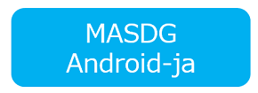
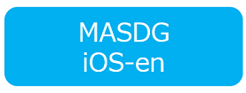

# Mobile Application Security Design Guide
OWASP Foundation Web Respository

This is the official GitHub Repository of the Mobile Application Security Desing Guide (MASDG). The MASDG is a document aimed at establishing a framework for designing, developing, and testing secure mobile applications on Mobile Devices, incorporating our own evaluation criteria (rulebook) and sample code into the [OWASP Mobile Application Security Verification Standard (MASVS)](https://github.com/OWASP/owasp-masvs "MASVS") and [OWASP Mobile Application Security Testing Guide (MASTG) ](https://github.com/OWASP/owasp-mastg "OWASP Mobile Application Security Testing Guide")published by OWASP.

MASDG deals with best practices and samples that are specific to the design requirements for security, supporting the creation of security designs from security requirements considered based on MASVS1.5, as well as evaluating the security design for any issues before conducting testing methods indicated in MASTG.

Our proprietary rulebook targets the MASVS1.5 L1 verification standard and aims to provide comprehensive security baselines when developing mobile applications. While new technologies will always bring risks and create privacy and safety issues, we have created this document to address the threats posed by mobile applications.

We have received feedback on MASVS and MASTG from various communities and industries, and we have developed and published MASDG as we believe it is essential to tackle the security risks associated with mobile applications that have become indispensable in our society. We welcome feedback from everyone.

 

## Read the MASDG
 

|||||
|---|---|---|---|
| Japanese Edition | English Edition | Japanese Edition | English Edition |

 

**Copyright and License**

Copyright © 2023 LAC Co., Ltd. This work is licensed under a [Creative Commons Attribution-ShareAlike 4.0 International License](https://creativecommons.org/licenses/by-sa/4.0/). For any reuse or distribution, you must make clear to others the license terms of this work.

* The contents of this guide are current as of the time of writing. Please be aware of this if you use the sample code.
* LAC Co., Ltd. and the authors are not responsible for any consequences resulting from the use of this guide. Please use at your own risk.
* Android is a trademark or registered trademark of Google LLC. Company names, product names, and service names mentioned in this document are generally registered trademarks or trademarks of their respective companies. The ®, TM, and © symbols are not used throughout this document.
* Some of the content in this document is based on the materials provided by OWASP MASVS and OWASP MASTG, and has been replicated and revised.

 

**Originator**  
Project Site - <https://owasp.org/www-project-mobile-app-security/>  
Project Repository - <https://github.com/OWASP/www-project-mobile-app-security>  
MAS Official Site - <https://mas.owasp.org/>  
MAS Document Site - <https://mas.owasp.org/MASVS/>  
MAS Document Site - <https://mas.owasp.org/MASTG/>  
Document Site - <https://mobile-security.gitbook.io/masvs>  
Document Repository - <https://github.com/OWASP/owasp-masvs>  
Document Site - <https://coky-t.gitbook.io/owasp-masvs-ja/>  
Document Repository - <https://github.com/owasp-ja/owasp-masvs-ja>  
Document Site - <https://mobile-security.gitbook.io/mobile-security-testing-guide>  
Document Repository - <https://github.com/OWASP/owasp-mastg>  
Document Site - <https://coky-t.gitbook.io/owasp-mastg-ja/>  
Document Repository - <https://github.com/coky-t/owasp-mastg-ja>  

 

**OWASP MASVS Authors**  
| Project Lead | Lead Author | Contributors and Reviewes |
| ------- | --- | ----------------- |
| Sven Schleier and Carlos Holguera | Bernhard Mueller, Sven Schleier, Jeroen Willemsen and Carlos Holguera | Alexander Antukh, Mesheryakov Aleksey, Elderov Ali, Bachevsky Artem, Jeroen Beckers, Jon-Anthoney de Boer, Damien Clochard, Ben Cheney, Will Chilcutt, Stephen Corbiaux, Manuel Delgado, Ratchenko Denis, Ryan Dewhurst, @empty_jack, Ben Gardiner, Anton Glezman, Josh Grossman, Sjoerd Langkemper, Vinícius Henrique Marangoni, Martin Marsicano, Roberto Martelloni, @PierrickV, Julia Potapenko, Andrew Orobator, Mehrad Rafii, Javier Ruiz, Abhinav Sejpal, Stefaan Seys, Yogesh Sharma, Prabhant Singh, Nikhil Soni, Anant Shrivastava, Francesco Stillavato, Abdessamad Temmar, Pauchard Thomas, Lukasz Wierzbicki |

 

**OWASP MASTG Authors**  
Bernhard Mueller  
Sven Schleier  
Jeroen Willemsen  
Carlos Holguera  
Romuald Szkudlarek  
Jeroen Beckers  
Vikas Gupta

 

**OWASP MASVS ja Author**  
Koki Takeyama

 

**OWASP MASTG ja Author**  
Koki Takeyama

## Revision history
**2023-04-01**
